# LightGCN: Simplifying and Powering Graph Convolution Network for Recommendation

Xiangnan He University of Science and Technology of China xiangnanhe@gmail.com

Kuan Deng University of Science and Technology of China dengkuan@mail.ustc.edu.cn

Yan Li Beijing Kuaishou Technology Co., Ltd. liyan@kuaishou.com

Yongdong Zhang University of Science and Technology of China zhyd73@ustc.edu.cn

Xiang Wang National University of Singapore xiangwang@u.nus.edu

Meng Wang∗ Hefei University of Technology eric.mengwang@gmail.com

## ABSTRACT

Graph Convolution Network (GCN) has become new state-ofthe-art for collaborative filtering. Nevertheless, the reasons of its efectiveness for recommendation are not well understood. Existing work that adapts GCN to recommendation lacks thorough ablation analyses on GCN, which is originally designed for graph classification tasks and equipped with many neural network operations. However, we empirically find that the two most common designs in GCNs — feature transformation and nonlinear activation — contribute little to the performance of collaborative filtering. Even worse, including them adds to the dificulty of training and degrades recommendation performance.

In this work, we aim to simplify the design of GCN to make it more concise and appropriate for recommendation. We propose a new model named LightGCN, including only the most essential component in GCN — neighborhood aggregation — for collaborative filtering. Specifically, LightGCN learns user and item embeddings by linearly propagating them on the user-item interaction graph, and uses the weighted sum of the embeddings learned at all layers as the final embedding. Such simple, linear, and neat model is much easier to implement and train, exhibiting substantial improvements (about 16.0% relative improvement on average) over Neural Graph Collaborative Filtering (NGCF) — a state-of-the-art GCN-based recommender model — under exactly the same experimental setting. Further analyses are provided towards the rationality ofthe simple LightGCN from both analytical and empirical perspectives. Our implementations are available in both TensorFlow1 and PyTorch2.

∗Meng Wang is the corresponding author. 1https://github.com/kuandeng/LightGCN 2https://github.com/gusye1234/pytorch-light-gcn

CCS CONCEPTS • Information systems → Recommender systems.

KEYWORDS Collaborative Filtering, Recommendation, Embedding Propagation, Graph Neural Network

ACM Reference Format: Xiangnan He, Kuan Deng, Xiang Wang, Yan Li, Yongdong Zhang, and Meng Wang. 2020. LightGCN: Simplifying and Powering Graph Convolution Network for Recommendation. In Proceedings ofthe 43rd International ACM SIGIR Conference on Research and Development in Information Retrieval (SIGIR ’20), July 25–30, 2020, Virtual Event, China. ACM, New York, NY, USA, 10 pages. https://doi.org/10.1145/3397271.3401063

## 1 INTRODUCTION

To alleviate information overload on the web, recommender system has been widely deployed to perform personalized information filtering [7, 45, 46]. The core of recommender system is to predict whether a user will interact with an item, e.g., click, rate, purchase, among other forms of interactions. As such, collaborative filtering (CF), which focuses on exploiting the past user-item interactions to achieve the prediction, remains to be a fundamental task towards efective personalized recommendation [10, 19, 28, 39].

The most common paradigm for CF is to learn latent features (a.k.a. embedding) to represent a user and an item, and perform prediction based on the embedding vectors [6, 19]. Matrix factorization is an early such model, which directly projects the single ID of a user to her embedding [26]. Later on, several research find that augmenting user ID with the her interaction history as the input can improve the quality of embedding. For example, SVD++ [25] demonstrates the benefits of user interaction history in predicting user numerical ratings, and Neural Attentive Item Similarity (NAIS) [18] diferentiates the importance of items in the interaction history and shows improvements in predicting item ranking. In view of user-item interaction graph, these improvements can be seen as coming from using the subgraph structure of a user — more specifically, her one-hop neighbors — to improve the embedding learning.

To deepen the use of subgraph structure with high-hop neighbors, Wang et al. [39] recently proposes NGCF and achieves state-of-the-art performance for CF. It takes inspiration from the Graph Convolution Network (GCN) [14, 23], following the same propagation rule to refine embeddings: feature transformation, neighborhood aggregation, and nonlinear activation. Although NGCF has shown promising results, we argue that its designs are rather heavy and burdensome — many operations are directly inherited from GCN without justification. As a result, they are not necessarily useful for the CF task. To be specific, GCN is originally proposed for node classification on attributed graph, where each node has rich attributes as input features; whereas in user-item interaction graph for CF, each node (user or item) is only described by a one-hot ID, which has no concrete semantics besides being an identifier. In such a case, given the ID embedding as the input, performing multiple layers of nonlinear feature transformation — which is the key to the success of modern neural networks [16] — will bring no benefits, but negatively increases the dificulty for model training.

To validate our thoughts, we perform extensive ablation studies on NGCF. With rigorous controlled experiments (on the same data splits and evaluation protocol), we draw the conclusion that the two operations inherited from GCN — feature transformation and nonlinear activation — has no contribution on NGCF’s efectiveness. Even more surprising, removing them leads to significant accuracy improvements. This reflects the issues of adding operations that are useless for the target task in graph neural network, which not only brings no benefits, but rather degrades model efectiveness. Motivated by these empirical findings, we present a new model named LightGCN, including the most essential component of GCN — neighborhood aggregation — for collaborative filtering. Specifically, after associating each user (item) with an ID embedding, we propagate the embeddings on the user-item interaction graph to refine them. We then combine the embeddings learned at diferent propagation layers with a weighted sum to obtain the final embedding for prediction. The whole model is simple and elegant, which not only is easier to train, but also achieves better empirical performance than NGCF and other state-of-the-art methods like Mult-VAE [28].

To summarize, this work makes the following main contributions:

• We empirically show that two common designs in GCN, feature transformation and nonlinear activation, have no positive efect on the efectiveness of collaborative filtering.

• We propose LightGCN, which largely simplifies the model design by including only the most essential components in GCN for recommendation.

• We empirically compare LightGCN with NGCF by following the same setting and demonstrate substantial improvements. In-depth analyses are provided towards the rationality of LightGCN from both technical and empirical perspectives.

## 2 PRELIMINARIES

We first introduce NGCF [39], a representative and state-of-the-art GCN model for recommendation. We then perform ablation studies on NGCF to judge the usefulness of each operation in NGCF. The novel contribution of this section is to show that the two common designs in GCNs, feature transformation and nonlinear activation, have no positive efect on collaborative filtering.

Table 1: Performance of NGCF and its three variants.

<table><tr><td></td><td colspan="2">Gowalla</td><td colspan="2">Amazon-Book</td></tr><tr><td></td><td>recall</td><td>ndcg</td><td>recall</td><td>ndcg</td></tr><tr><td>NGCF</td><td>0.1547</td><td>0.1307</td><td>0.0330</td><td>0.0254</td></tr><tr><td>NGCF-f</td><td>0.1686</td><td>0.1439</td><td>0.0368</td><td>0.0283</td></tr><tr><td>NGCF-n</td><td>0.1536</td><td>0.1295</td><td>0.0336</td><td>0.0258</td></tr><tr><td>NGCF-fn</td><td>0.1742</td><td>0.1476</td><td>0.0399</td><td>0.0303</td></tr></table>

## 2.1 NGCF Brief

In the initial step, each user and item is associated with an ID embedding. Let ${ \bf e } _ { u } ^ { ( 0 ) }$ denote the ID embedding of user u and ${ \bf e } _ { i } ^ { ( 0 ) }$ denote the ID embedding of item i. Then NGCF leverages the useritem interaction graph to propagate embeddings as:

$$
\begin{array}{l} \mathbf {e} _ {u} ^ {(k + 1)} = \sigma \Big (\mathbf {W} _ {1} \mathbf {e} _ {u} ^ {(k)} + \sum_ {i \in \mathcal {N} _ {u}} \frac {1}{\sqrt {| \mathcal {N} _ {u} | | \mathcal {N} _ {i} |}} (\mathbf {W} _ {1} \mathbf {e} _ {i} ^ {(k)} + \mathbf {W} _ {2} (\mathbf {e} _ {i} ^ {(k)} \odot \mathbf {e} _ {u} ^ {(k)})) \Big), \\ \mathbf {e} _ {i} ^ {(k + 1)} = \sigma \Big (\mathbf {W} _ {1} \mathbf {e} _ {i} ^ {(k)} + \sum_ {u \in \mathcal {N} _ {i}} \frac {1}{\sqrt {| \mathcal {N} _ {u} | | \mathcal {N} _ {i} |}} (\mathbf {W} _ {1} \mathbf {e} _ {u} ^ {(k)} + \mathbf {W} _ {2} (\mathbf {e} _ {u} ^ {(k)} \odot \mathbf {e} _ {i} ^ {(k)})) \Big), \end{array}\tag{1}
$$

where $\mathbf { e } _ { u } ^ { ( k ) }$ and ${ \bf e } _ { i } ^ { ( k ) }$ respectively denote the refined embedding of user u and item i after k layers propagation, σ is the nonlinear activation function, $N _ { u }$ denotes the set of items that are interacted by user u, $N _ { i }$ denotes the set of users that interact with item i, and $\mathbf { W } _ { 1 }$ and $\mathbf { W } _ { 2 }$ are trainable weight matrix to perform feature transformation in each layer. By propagating L layers, NGCF obtains $L + 1$ embeddings to describe a user $( \mathbf { e } _ { u } ^ { ( 0 ) } , \bar { \mathbf { e } } _ { u } ^ { ( 1 ) } , . . . , \mathbf { e } _ { u } ^ { ( L ) } )$ and an item $( \mathbf { e } _ { i } ^ { ( 0 ) } , \mathbf { e } _ { i } ^ { ( 1 ) } , . . . , \mathbf { e } _ { i } ^ { ( L ) } )$ . It then concatenates these $L + 1$ embeddings to obtain the final user embedding and item embedding, using inner product to generate the prediction score.

NGCF largely follows the standard GCN [23], including the use of nonlinear activation function σ(·) and feature transformation matrices $\mathbf { W } _ { 1 }$ and ${ \bf W } _ { 2 }$ . However, we argue that the two operations are not as useful for collaborative filtering. In semi-supervised node classification, each node has rich semantic features as input, such as the title and abstract words of a paper. Thus performing multiple layers of nonlinear transformation is beneficial to feature learning. Nevertheless, in collaborative filtering, each node of useritem interaction graph only has an ID as input which has no concrete semantics. In this case, performing multiple nonlinear transformations will not contribute to learn better features; even worse, it may add the dificulties to train well. In the next subsection, we provide empirical evidence on this argument.

## 2.2 Empirical Explorations on NGCF

We conduct ablation studies on NGCF to explore the efect of nonlinear activation and feature transformation. We use the codes released by the authors of ${ \mathrm { N G C F } } ^ { 3 }$ , running experiments on the same data splits and evaluation protocol to keep the comparison as fair as possible. Since the core of GCN is to refine embeddings by propagation, we are more interested in the embedding quality under the same embedding size. Thus, we change the way of obtaining final embedding from concatenation $( \mathrm { i . e . , ~ } \mathbf { e } _ { u } ^ { * } \ = \ \mathbf { e } _ { u } ^ { ( 0 ) } \lVert \cdot \cdot \cdot \rVert \mathbf { e } _ { u } ^ { ( L ) } )$ to sum (i.e., ${ \bf e } _ { u } ^ { * } = { \bf e } _ { u } ^ { ( 0 ) } + \cdot \cdot \cdot + { \bf e } _ { u } ^ { ( L ) } )$ . Note that this change has little efect on NGCF’s performance, but makes the following ablation studies more indicative of the embedding quality refined by GCN.

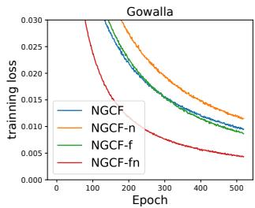  
(a) Training loss on Gowalla

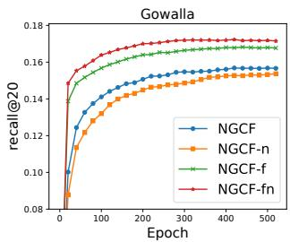  
(b) Testing recall on Gowalla

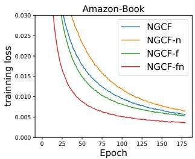  
(c) Training loss on Amazon-Book

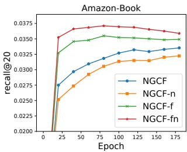  
(d) Testing recall on Amazon-Book  
Figure 1: Training curves (training loss and testing recall) of NGCF and its three simplified variants.

We implement three simplified variants of NGCF:

• NGCF-f, which removes the feature transformation matrices $\mathbf { W } _ { 1 }$ and $\mathbf { W } _ { 2 } .$

• NGCF-n, which removes the non-linear activation function σ.

• NGCF-fn, which removes both the feature transformation matrices and non-linear activation function.

For the three variants, we keep all hyper-parameters (e.g., learning rate, regularization coeficient, dropout ratio, etc.) same as the optimal settings of NGCF. We report the results of the 2-layer setting on the Gowalla and Amazon-Book datasets in Table 1. As can be seen, removing feature transformation (i.e., NGCF-f) leads to consistent improvements over NGCF on all three datasets. In contrast, removing nonlinear activation does not afect the accuracy that much. However, if we remove nonlinear activation on the basis of removing feature transformation (i.e., NGCF-fn), the performance is improved significantly. From these observations, we conclude the findings that:

(1) Adding feature transformation imposes negative efect on NGCF, since removing it in both models of NGCF and NGCF-n improves the performance significantly;

(2) Adding nonlinear activation afects slightly when feature transformation is included, but it imposes negative efect when feature transformation is disabled.

(3) As a whole, feature transformation and nonlinear activation impose rather negative efect on NGCF, since by removing them simultaneously, NGCF-fn demonstrates large improvements over NGCF (9.57% relative improvement on recall).

To gain more insights into the scores obtained in Table 1 and understand why NGCF deteriorates with the two operations, we plot the curves of model status recorded by training loss and testing recall in Figure 1. As can be seen, NGCF-fn achieves a much lower training loss than NGCF, NGCF-f, and NGCF-n along the whole training process. Aligning with the curves of testing recall, we find that such lower training loss successfully transfers to better recommendation accuracy. The comparison between NGCF and NGCF-f shows the similar trend, except that the improvement margin is smaller.

From these evidences, we can draw the conclusion that the deterioration of NGCF stems from the training dificulty, rather than overfitting. Theoretically speaking, NGCF has higher representation power than NGCF-f, since setting the weight matrix $\mathbf { W } _ { 1 }$ and $\mathbf { W } _ { 2 }$ to identity matrix I can fully recover the NGCF-f model. However, in practice, NGCF demonstrates higher training loss and worse generalization performance than NGCF-f. And the incorporation of nonlinear activation further aggravates the discrepancy between representation power and generalization performance. To round out this section, we claim that when designing model for recommendation, it is important to perform rigorous ablation studies to be clear about the impact of each operation. Otherwise, including less useful operations will complicate the model unnecessarily, increase the training dificulty, and even degrade model efectiveness.

## 3 METHOD

The former section demonstrates that NGCF is a heavy and burdensome GCN model for collaborative filtering. Driven by these findings, we set the goal of developing a light yet efective model by including the most essential ingredients of GCN for recommendation. The advantages of being simple are severalfold — more interpretable, practically easy to train and maintain, technically easy to analyze the model behavior and revise it towards more efective directions, and so on.

In this section, we first present our designed Light Graph Convolution Network (LightGCN) model, as illustrated in Figure 2. We then provide an in-depth analysis of LightGCN to show the rationality behind its simple design. Lastly, we describe how to do model training for recommendation.

## 3.1 LightGCN

The basic idea of GCN is to learning representation for nodes by smoothing features over the graph [23, 40]. To achieve this, it performs graph convolution iteratively, i.e., aggregating the features of neighbors as the new representation of a target node. Such neighborhood aggregation can be abstracted as:

$$
\mathbf {e} _ {u} ^ {(k + 1)} = \operatorname{AGG} (\mathbf {e} _ {u} ^ {(k)}, \{\mathbf {e} _ {i} ^ {(k)}: i \in \mathcal {N} _ {u} \}).\tag{2}
$$

The AGG is an aggregation function — the core ofgraph convolution — that considers the k-th layer’s representation of the target node and its neighbor nodes. Many work have specified the AGG, such as the weighted sum aggregator in GIN [42], LSTM aggregator in GraphSAGE [14], and bilinear interaction aggregator in BGNN [48] etc. However, most of the work ties feature transformation or nonlinear activation with the AGG function. Although they perform well on node or graph classification tasks that have semantic input features, they could be burdensome for collaborative filtering (see preliminary results in Section 2.2).

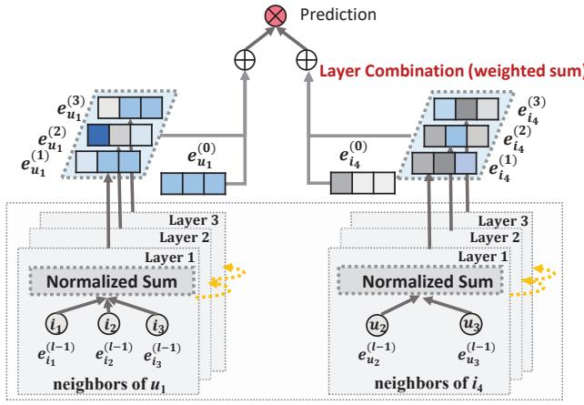  
Light Graph Convolution (LGC)  
Figure 2: An illustration of LightGCN model architecture. In LGC, only the normalized sum of neighbor embeddings is performed towards next layer; other operations like self-connection, feature transformation, and nonlinear activation are all removed, which largely simplifies GCNs. In Layer Combination, we sum over the embeddings at each layer to obtain the final representations.

3.1.1 Light Graph Convolution (LGC). In LightGCN, we adopt the simple weighted sum aggregator and abandon the use of feature transformation and nonlinear activation. The graph convolution operation (a.k.a., propagation rule [39]) in LightGCN is defined as:

$$
\begin{array}{l} \mathbf {e} _ {u} ^ {(k + 1)} = \sum_ {i \in \mathcal {N} _ {u}} \frac {1}{\sqrt {| \mathcal {N} _ {u} |} \sqrt {| \mathcal {N} _ {i} |}} \mathbf {e} _ {i} ^ {(k)}, \\ \mathbf {e} _ {i} ^ {(k + 1)} = \sum_ {u \in \mathcal {N} _ {i}} \frac {1}{\sqrt {| \mathcal {N} _ {i} |} \sqrt {| \mathcal {N} _ {u} |}} \mathbf {e} _ {u} ^ {(k)}. \end{array}\tag{3}
$$

The symmetric normalization term $\frac { 1 } { \sqrt { | \cal N _ { u } | } \sqrt { | \cal N _ { i } | } }$ follows the design of standard GCN [23], which can avoid the scale of embeddings increasing with graph convolution operations; other choices can also be applied here, such as the $L _ { 1 }$ norm, while empirically we find this symmetric normalization has good performance (see experiment results in Section 4.4.2).

It is worth noting that in LGC, we aggregate only the connected neighbors and do not integrate the target node itself (i.e., self connection). This is diferent from most existing graph convolution operations [14, 23, 36, 39, 48] that typically aggregate extended neighbors and need to handle the self-connection specially. The layer combination operation, to be introduced in the next subsection, essentially captures the same efect as self-connections. Thus, there is no need in LGC to include self-connections.

3.1.2 Layer Combination and Model Prediction. In LightGCN, the only trainable model parameters are the embeddings at the 0-th layer, $\mathrm { i } . \mathrm { e } . , { \bf e } _ { u } ^ { ( 0 ) }$ for all users and ${ \bf e } _ { i } ^ { ( 0 ) }$ for all items. When they are given, the embeddings at higher layers can be computed via LGC defined in Equation (3). After K layers LGC, we further combine the embeddings obtained at each layer to form the final representation

of a user (an item):

$$
\mathbf {e} _ {u} = \sum_ {k = 0} ^ {K} \alpha_ {k} \mathbf {e} _ {u} ^ {(k)}; \quad \mathbf {e} _ {i} = \sum_ {k = 0} ^ {K} \alpha_ {k} \mathbf {e} _ {i} ^ {(k)},\tag{4}
$$

where $\alpha _ { k } \geq 0$ denotes the importance of the k-th layer embedding in constituting the final embedding. It can be treated as a hyperparameter to be tuned manually, or as a model parameter (e.g., output of an attention network [3]) to be optimized automatically. In our experiments, we find that setting $\alpha _ { k }$ uniformly as $1 / ( K + 1 )$ leads to good performance in general. Thus we do not design special component to optimize $\alpha _ { k } ,$ to avoid complicating LightGCN unnecessarily and to keep its simplicity. The reasons that we perform layer combination to get final representations are threefold. (1) With the increasing ofthe number oflayers, the embeddings will be over-smoothed [27]. Thus simply using the last layer is problematic. (2) The embeddings at diferent layers capture diferent semantics. $\mathrm { E . g . }$ , the first layer enforces smoothness on users and items that have interactions, the second layer smooths users (items) that have overlap on interacted items (users), and higher-layers capture higher-order proximity [39]. Thus combining them will make the representation more comprehensive. (3) Combining embeddings at diferent layers with weighted sum captures the efect of graph convolution with self-connections, an important trick in GCNs (proof sees Section 3.2.1).

The model prediction is defined as the inner product of user and item final representations:

$$
\hat {y} _ {u i} = \mathbf {e} _ {u} ^ {T} \mathbf {e} _ {i},\tag{5}
$$

which is used as the ranking score for recommendation generation.

3.1.3 Matrix Form. We provide the matrix form of LightGCN to facilitate implementation and discussion with existing models. Let the user-item interaction matrix be $\mathbf { R } \in \mathbb { R } ^ { M \times N }$ where M and N denote the number of users and items, respectively, and each entry $R _ { u i }$ is 1 ifu has interacted with item i otherwise 0. We then obtain the adjacency matrix of the user-item graph as

$$
\mathbf {A} = \left( \begin{array}{c c} \mathbf {0} & \mathbf {R} \\ \mathbf {R} ^ {T} & \mathbf {0} \end{array} \right),\tag{6}
$$

Let the 0-th layer embedding matrix be $\mathbf { E } ^ { ( 0 ) } \in \mathbb { R } ^ { ( M + N ) \times T }$ , where T is the embedding size. Then we can obtain the matrix equivalent form of LGC as:

$$
\mathbf {E} ^ {(k + 1)} = (\mathbf {D} ^ {- \frac {1}{2}} \mathbf {A D} ^ {- \frac {1}{2}}) \mathbf {E} ^ {(k)},\tag{7}
$$

where D is a $( M + N ) \times ( M + N )$ diagonal matrix, in which each entry $D _ { i i }$ denotes the number of nonzero entries in the i-th row vector of the adjacency matrix A (also named as degree matrix). Lastly, we get the final embedding matrix used for model prediction as:

$$
\begin{array}{r l} & {\mathbf {E} = \alpha_ {0} \mathbf {E} ^ {(0)} + \alpha_ {1} \mathbf {E} ^ {(1)} + \alpha_ {2} \mathbf {E} ^ {(2)} + \ldots + \alpha_ {K} \mathbf {E} ^ {(K)}} \\ & {\quad = \alpha_ {0} \mathbf {E} ^ {(0)} + \alpha_ {1} \tilde {\mathbf {A}} \mathbf {E} ^ {(0)} + \alpha_ {2} \tilde {\mathbf {A}} ^ {2} \mathbf {E} ^ {(0)} + \ldots + \alpha_ {K} \tilde {\mathbf {A}} ^ {K} \mathbf {E} ^ {(0)},} \end{array}\tag{8}
$$

where $\tilde { \mathbf { A } } = \mathbf { D } ^ { - \frac { 1 } { 2 } } \mathbf { A } \mathbf { D } ^ { - \frac { 1 } { 2 } }$ is the symmetrically normalized matrix.

## 3.2 Model Analysis

We conduct model analysis to demonstrate the rationality behind the simple design of LightGCN. First we discuss the connection with the Simplified GCN (SGCN) [40], which is a recent linear

GCN model that integrates self-connection into graph convolution; this analysis shows that by doing layer combination, LightGCN subsumes the efect of self-connection thus there is no need for LightGCN to add self-connection in adjacency matrix. Then we discuss the relation with the Approximate Personalized Propagation of Neural Predictions (APPNP) [24], which is recent GCN variant that addresses oversmoothing by inspiring from Personalized PageRank [15]; this analysis shows the underlying equivalence between LightGCN and APPNP, thus our LightGCN enjoys the sames benefits in propagating long-range with controllable oversmoothing. Lastly we analyze the second-layer LGC to show how it smooths a user with her second-order neighbors, providing more insights into the working mechanism of LightGCN.

3.2.1 Relation with SGCN. In [40], the authors argue the unnecessary complexity of GCN for node classfication and propose SGCN, which simplifies GCN by removing nonlinearities and collapsing the weight matrices to one weight matrix. The graph convolution in SGCN is defined $\mathsf { a s } ^ { 4 } ;$

$$
\mathbf {E} ^ {(k + 1)} = (\mathbf {D} + \mathbf {I}) ^ {- \frac {1}{2}} (\mathbf {A} + \mathbf {I}) (\mathbf {D} + \mathbf {I}) ^ {- \frac {1}{2}} \mathbf {E} ^ {(k)},\tag{9}
$$

where $\mathbf { I } \in \mathbb { R } ^ { ( M + N ) \times ( M + N ) }$ is an identity matrix, which is added on A to include self-connections. In the following analysis, we omit the $( \mathbf { D } + \mathbf { I } ) ^ { - \frac { 1 } { 2 } }$ terms for simplicity, since they only re-scale embeddings. In SGCN, the embeddings obtained at the last layer are used for downstream prediction task, which can be expressed as:

$$
\begin{array}{l} \mathbf {E} ^ {(K)} = (\mathbf {A} + \mathbf {I}) \mathbf {E} ^ {(K - 1)} = (\mathbf {A} + \mathbf {I}) ^ {K} \mathbf {E} ^ {(0)} \\ = \binom {K} {0} \mathbf {E} ^ {(0)} + \binom {K} {1} \mathbf {A} \mathbf {E} ^ {(0)} + \binom {K} {2} \mathbf {A} ^ {2} \mathbf {E} ^ {(0)} + \ldots + \binom {K} {K} \mathbf {A} ^ {K} \mathbf {E} ^ {(0)}. \end{array}\tag{10}
$$

The above derivation shows that, inserting self-connection into A and propagating embeddings on it, is essentially equivalent to a weighted sum of the embeddings propagated at each LGC layer.

3.2.2 Relation with APPNP. In a recent work [24], the authors connect GCN with Personalized PageRank [15], inspiring from which they propose a GCN variant named APPNP that can propagate long range without the risk of oversmoothing. Inspired by the teleport design in Personalized PageRank, APPNP complements each propagation layer with the starting features (i.e., the 0-th layer embeddings), which can balance the need of preserving locality (i.e., staying close to the root node to alleviate oversmoothing) and leveraging the information from a large neighborhood. The propagation layer in APPNP is defined as:

$$
\mathbf {E} ^ {(k + 1)} = \beta \mathbf {E} ^ {(0)} + (1 - \beta) \tilde {\mathbf {A}} \mathbf {E} ^ {(k)},\tag{11}
$$

where $\beta$ is the teleport probability to control the retaining of starting features in the propagation, and A˜ denotes the normalized adjacency matrix. In APPNP, the last layer is used for final prediction, i.e.,

$$
\begin{array}{r l} \mathbf {E} ^ {(K)} & = \beta \mathbf {E} ^ {(0)} + (1 - \beta) \tilde {\mathbf {A}} \mathbf {E} ^ {(K - 1)}, \\ & = \beta \mathbf {E} ^ {(0)} + \beta (1 - \beta) \tilde {\mathbf {A}} \mathbf {E} ^ {(0)} + (1 - \beta) ^ {2} \tilde {\mathbf {A}} ^ {2} \mathbf {E} ^ {(K - 2)} \\ & = \beta \mathbf {E} ^ {(0)} + \beta (1 - \beta) \tilde {\mathbf {A}} \mathbf {E} ^ {(0)} + \beta (1 - \beta) ^ {2} \tilde {\mathbf {A}} ^ {2} \mathbf {E} ^ {(0)} + \ldots + (1 - \beta) ^ {K} \tilde {\mathbf {A}} ^ {K} \mathbf {E} ^ {(0)}. \end{array}\tag{12}
$$

Aligning with Equation (8), we can see that by setting $\alpha _ { k }$ accordingly, LightGCN can fully recover the prediction embedding used by APPNP. As such, LightGCN shares the strength of APPNP in combating oversmoothing — by setting the α properly, we allow using a large K for long-range modeling with controllable oversmoothing.

Another minor diference is that APPNP adds self-connection into the adjacency matrix. However, as we have shown before, this is redundant due to the weighted sum of diferent layers.

3.2.3 Second-Order Embedding Smoothness. Owing to the linearity and simplicity of LightGCN, we can draw more insights into how does it smooth embeddings. Here we analyze a 2-layer LightGCN to demonstrate its rationality. Taking the user side as an example, intuitively, the second layer smooths users that have overlap on the interacted items. More concretely, we have:

$$
\mathbf {e} _ {u} ^ {(2)} = \sum_ {i \in \mathcal {N} _ {u}} \frac {1}{\sqrt {| \mathcal {N} _ {u} |} \sqrt {| \mathcal {N} _ {i} |}} \mathbf {e} _ {i} ^ {(1)} = \sum_ {i \in \mathcal {N} _ {u}} \frac {1}{| \mathcal {N} _ {i} |} \sum_ {v \in \mathcal {N} _ {i}} \frac {1}{\sqrt {| \mathcal {N} _ {u} |} \sqrt {| \mathcal {N} _ {v} |}} \mathbf {e} _ {v} ^ {(0)}.\tag{13}
$$

We can see that, if another user v has co-interacted with the target user $u ,$ the smoothness strength of v on u is measured by the coeficient (otherwise 0):

$$
c _ {v - > u} = \frac {1}{\sqrt {| \mathcal {N} _ {u} |} \sqrt {| \mathcal {N} _ {v} |}} \sum_ {i \in \mathcal {N} _ {u} \cap \mathcal {N} _ {v}} \frac {1}{| \mathcal {N} _ {i} |}.\tag{14}
$$

This coeficient is rather interpretable: the influence of a secondorder neighbor v on u is determined by 1) the number of cointeracted items, the more the larger; 2) the popularity of the co-interacted items, the less popularity (i.e., more indicative of user personalized preference) the larger; and 3) the activity of v, the less active the larger. Such interpretability well caters for the assumption of CF in measuring user similarity [2, 37] and evidences the reasonability of LightGCN. Due to the symmetric formulation of LightGCN, we can get similar analysis on the item side.

## 3.3 Model Training

The trainable parameters of LightGCN are only the embeddings of the 0-th layer, i.e., $\boldsymbol \Theta = \{ { \bf E } ^ { ( 0 ) } \}$ ; in other words, the model complexity is same as the standard matrix factorization (MF). We employ the Bayesian Personalized Ranking (BPR) loss [32], which is a pairwise loss that encourages the prediction of an observed entry to be higher than its unobserved counterparts:

$$
L _ {B P R} = - \sum_ {u = 1} ^ {M} \sum_ {i \in \mathcal {N} _ {u}} \sum_ {j \notin \mathcal {N} _ {u}} \ln \sigma (\hat {y} _ {u i} - \hat {y} _ {u j}) + \lambda | | \mathbf {E} ^ {(0)} | | ^ {2}\tag{15}
$$

where λ controls the $L _ { 2 }$ regularization strength. We employ the Adam [22] optimizer and use it in a mini-batch manner. We are aware of other advanced negative sampling strategies which might improve the LightGCN training, such as the hard negative sampling [31] and adversarial sampling [9]. We leave this extension in the future since it is not the focus of this work.

Note that we do not introduce dropout mechanisms, which are commonly used in GCNs and NGCF. The reason is that we do not have feature transformation weight matrices in LightGCN, thus enforcing $L _ { 2 }$ regularization on the embedding layer is suficient to prevent overfitting. This showcases LightGCN’s advantages of being simple — it is easier to train and tune than NGCF which additionally requires to tune two dropout ratios (node dropout and message dropout) and normalize the embedding of each layer to unit length.

Table 2: Statistics of the experimented data.

<table><tr><td>Dataset</td><td>User #</td><td>Item #</td><td>Interaction #</td><td>Density</td></tr><tr><td>Gowalla</td><td>29,858</td><td>40,981</td><td>1,027,370</td><td>0.00084</td></tr><tr><td>Yelp2018</td><td>31,668</td><td>38,048</td><td>1,561,406</td><td>0.00130</td></tr><tr><td>Amazon-Book</td><td>52,643</td><td>91,599</td><td>2,984,108</td><td>0.00062</td></tr></table>

Moreover, it is technically viable to also learn the layer combination coeficients $\{ \alpha _ { k } \} _ { k = 0 } ^ { K } ,$ or parameterize them with an attention network. However, we find that learning α on training data does not lead improvement. This is probably because the training data does not contain suficient signal to learn good α that can generalize to unknown data. We have also tried to learn α from validation data, as inspired by [5] that learns hyper-parameters on validation data. The performance is slightly improved (less than 1%). We leave the exploration of optimal settings of α (e.g., personalizing it for diferent users and items) as future work.

## 4 EXPERIMENTS

We first describe experimental settings, and then conduct detailed comparison with NGCF [39], the method that is most relevant with LightGCN but more complicated (Section 4.2). We next compare with other state-of-the-art methods in Section 4.3. To justify the designs in LightGCN and reveal the reasons of its efectiveness, we perform ablation studies and embedding analyses in Section 4.4. The hyper-parameter study is finally presented in Section 4.5.

## 4.1 Experimental Settings

To reduce the experiment workload and keep the comparison fair, we closely follow the settings of the NGCF work [39]. We request the experimented datasets (including train/test splits) from the authors, for which the statistics are shown in Table 2. The Gowalla and Amazon-Book are exactly the same as the NGCF paper used, so we directly use the results in the NGCF paper. The only exception is the Yelp2018 data, which is a revised version. According to the authors, the previous version did not filter out cold-start items in the testing set, and they shared us the revised version only. Thus we re-run NGCF on the Yelp2018 data. The evaluation metrics are recall@20 and ndcg@20 computed by the all-ranking protocol — all items that are not interacted by a user are the candidates.

4.1.1 Compared Methods. The main competing method is NGCF, which has shown to outperform several methods including GCN based models GC-MC [35] and PinSage [45], neural network-based models NeuMF [19] and CMN [10], and factorization-based models MF [32] and HOP-Rec [43]. As the comparison is done on the same datasets under the same evaluation protocol, we do not further compare with these methods. In addition to NGCF, we further compare with two relevant and competitive CF methods:

• Mult-VAE [28]. This is an item-based CF method based on the variational autoencoder (VAE). It assumes the data is generated from a multinomial distribution and using variational inference for parameter estimation. We run the codes released by the authors5, tuning the dropout ratio in [0 0 2 0 5], and the $\beta$ in [0 2 0 4 0 6 0 8]. The model architecture is the suggested one in the paper: $6 0 0 \to 2 0 0 \to 6 0 0$

• GRMF [30]. This method smooths matrix factorization by adding the graph Laplacian regularizer. For fair comparison on item recommendation, we change the rating prediction loss to BPR loss. The objective function of GRMF is:

$$
L = - \sum_ {u = 1} ^ {M} \sum_ {i \in \mathcal {N} _ {u}} \Big (\sum_ {j \notin \mathcal {N} _ {u}} \ln \sigma (\mathbf {e} _ {u} ^ {T} \mathbf {e} _ {i} - \mathbf {e} _ {u} ^ {T} \mathbf {e} _ {j}) + \lambda_ {g} | | \mathbf {e} _ {u} - \mathbf {e} _ {i} | | ^ {2} \Big) + \lambda | | \mathbf {E} | | ^ {2},\tag{16}
$$

where $\lambda _ { g }$ is searched in the range of $[ 1 e ^ { - 5 } , 1 e ^ { - 4 } , . . . , 1 e ^ { - 1 } ]$ Moreover, we compare with a variant that adds normalization to graph Laplacian: $\lambda _ { g } | | \frac { { \bf e } _ { u } } { \sqrt { | N _ { u } | } } \ : - \ : \frac { { \bf e } _ { i } } { \sqrt { | N _ { i } | } } | | ^ { 2 }$ , which is termed as GRMF-norm. Other hyper-parameter settings are same as LightGCN. The two GRMF methods benchmark the performance of smoothing embeddings via Laplacian regularizer, while our LightGCN achieves embedding smoothing in the predictive model.

4.1.2 Hyper-parameter Setings. Same as NGCF, the embedding size is fixed to 64 for all models and the embedding parameters are initialized with the Xavier method [12]. We optimize LightGCN with Adam [22] and use the default learning rate of0.001 and default mini-batch size of 1024 (on Amazon-Book, we increase the minibatch size to 2048 for speed). The $L _ { 2 }$ regularization coeficient λ is searched in the range of $\{ 1 e ^ { - 6 } , 1 e ^ { - 5 } , . . . , 1 e ^ { - 2 } \}$ , and in most cases the optimal value is $1 e ^ { - 4 }$ . The layer combination coeficient $\alpha _ { k }$ is uniformly set to $\frac { 1 } { 1 + K }$ where K is the number of layers. We test K in the range of 1 to 4, and satisfactory performance can be achieved when K equals to 3. The early stopping and validation strategies are the same as NGCF. Typically, 1000 epochs are suficient for LightGCN to converge. Our implementations are available in both TensorFlow6 and PyTorch7.

## 4.2 Performance Comparison with NGCF

We perform detailed comparison with NGCF, recording the performance at diferent layers (1 to 4) in Table 4, which also shows the percentage of relative improvement on each metric. We further plot the training curves of training loss and testing recall in Figure 3 to reveal the advantages of LightGCN and to be clear of the training process. The main observations are as follows:

• In all cases, LightGCN outperforms NGCF by a large margin. For example, on Gowalla the highest recall reported in the NGCF paper is 0.1570, while our LightGCN can reach 0.1830 under the 4-layer setting, which is 16 56% higher. On average, the recall improvement on the three datasets is 16 52% and the ndcg improvement is 16.87%, which are rather significant.

• Aligning Table 4 with Table 1 in Section 2, we can see that LightGCN performs better than NGCF-fn, the variant of NGCF that removes feature transformation and nonlinear activation. As NGCF-fn still contains more operations than LightGCN (e.g., selfconnection, the interaction between user embedding and item embedding in graph convolution, and dropout), this suggests that these operations might also be useless for NGCF-fn.

Table 3: Performance comparison between NGCF and LightGCN at diferent layers.

<table><tr><td colspan="2">Dataset</td><td colspan="2">Gowalla</td><td colspan="2">Yelp2018</td><td colspan="2">Amazon-Book</td></tr><tr><td>Layer #</td><td>Method</td><td>recall</td><td>ndcg</td><td>recall</td><td>ndcg</td><td>recall</td><td>ndcg</td></tr><tr><td rowspan="2">1 Layer</td><td>NGCF</td><td>0.1556</td><td>0.1315</td><td>0.0543</td><td>0.0442</td><td>0.0313</td><td>0.0241</td></tr><tr><td>LightGCN</td><td>0.1755(+12.79%)</td><td>0.1492(+13.46%)</td><td>0.0631(+16.20%)</td><td>0.0515(+16.51%)</td><td>0.0384(+22.68%)</td><td>0.0298(+23.65%)</td></tr><tr><td rowspan="2">2 Layers</td><td>NGCF</td><td>0.1547</td><td>0.1307</td><td>0.0566</td><td>0.0465</td><td>0.0330</td><td>0.0254</td></tr><tr><td>LightGCN</td><td>0.1777(+14.84%)</td><td>0.1524(+16.60%)</td><td>0.0622(+9.89%)</td><td>0.0504(+8.38%)</td><td>0.0411(+24.54%)</td><td>0.0315(+24.02%)</td></tr><tr><td rowspan="2">3 Layers</td><td>NGCF</td><td>0.1569</td><td>0.1327</td><td>0.0579</td><td>0.0477</td><td>0.0337</td><td>0.0261</td></tr><tr><td>LightGCN</td><td>0.1823(+16.19%)</td><td>0.1555(+17.18%)</td><td>0.0639(+10.38%)</td><td>0.0525(+10.06%)</td><td>0.0410(+21.66%)</td><td>0.0318(+21.84%)</td></tr><tr><td rowspan="2">4 Layers</td><td>NGCF</td><td>0.1570</td><td>0.1327</td><td>0.0566</td><td>0.0461</td><td>0.0344</td><td>0.0263</td></tr><tr><td>LightGCN</td><td>0.1830(+16.56%)</td><td>0.1550(+16.80%)</td><td>0.0649(+14.58%)</td><td>0.0530(+15.02%)</td><td>0.0406(+17.92%)</td><td>0.0313(+18.92%)</td></tr></table>

\*The scores of NGCF on Gowalla and Amazon-Book are directly copied from Table 3 of the NGCF paper (https://arxiv.org/abs/1905.08108)

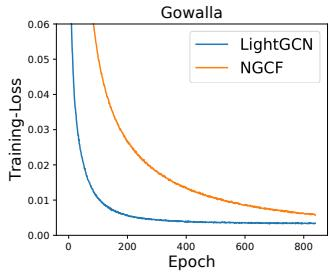

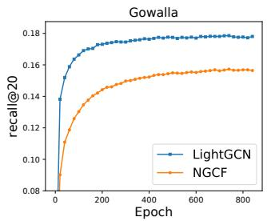

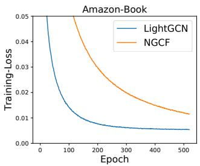

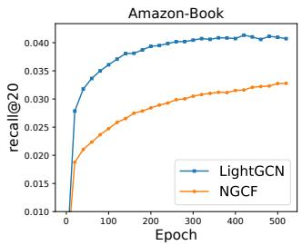  
Figure 3: Training curves of LightGCN and NGCF, which are evaluated by training loss and testing recall per 20 epochs on Gowalla and Amazon-Book (results on Yelp2018 show exactly the same trend which are omitted for space).

• Increasing the number oflayers can improve the performance, but the benefits diminish. The general observation is that increasing the layer number from 0 (i.e., the matrix factorization model, results see [39]) to 1 leads to the largest performance gain, and using a layer number of 3 leads to satisfactory performance in most cases. This observation is consistent with NGCF’s finding.

• Along the training process, LightGCN consistently obtains lower training loss, which indicates that LightGCN fits the training data better than NGCF. Moreover, the lower training loss successfully transfers to better testing accuracy, indicating the strong generalization power of LightGCN. In contrast, the higher training loss and lower testing accuracy of NGCF reflect the practical dificulty to train such a heavy model it well. Note that in the figures we show the training process under the optimal hyper-parameter setting for both methods. Although increasing the learning rate of NGCF can decrease its training loss (even lower than that of LightGCN), the testing recall could not be improved, as lowering training loss in this way only finds trivial solution for NGCF.

## 4.3 Performance Comparison with State-of-the-Arts

Table 4 shows the performance comparison with competing methods. We show the best score we can obtain for each method. We can see that LightGCN consistently outperforms other methods on all three datasets, demonstrating its high efectiveness with simple yet reasonable designs. Note that LightGCN can be further improved by tuning the $\alpha _ { k }$ (see Figure 4 for an evidence), while here we only use a uniform setting of $\frac { 1 } { K + 1 }$ to avoid over-tuning it. Among the baselines, Mult-VAE exhibits the strongest performance, which is better than GRMF and NGCF. The performance of GRMF is on a par with NGCF, being better than MF, which admits the utility of enforcing embedding smoothness with Laplacian regularizer. By adding normalization into the Laplacian regularizer, GRMFnorm betters than GRMF on Gowalla, while brings no benefits on Yelp2018 and Amazon-Book.

Table 4: The comparison of overall performance among LightGCN and competing methods.

<table><tr><td>Dataset</td><td colspan="2">Gowalla</td><td colspan="2">Yelp2018</td><td colspan="2">Amazon-Book</td></tr><tr><td>Method</td><td>recall</td><td>ndcg</td><td>recall</td><td>ndcg</td><td>recall</td><td>ndcg</td></tr><tr><td>NGCF</td><td>0.1570</td><td>0.1327</td><td>0.0579</td><td>0.0477</td><td>0.0344</td><td>0.0263</td></tr><tr><td>Mult-VAE</td><td>0.1641</td><td>0.1335</td><td>0.0584</td><td>0.0450</td><td>0.0407</td><td>0.0315</td></tr><tr><td>GRMF</td><td>0.1477</td><td>0.1205</td><td>0.0571</td><td>0.0462</td><td>0.0354</td><td>0.0270</td></tr><tr><td>GRMF-norm</td><td>0.1557</td><td>0.1261</td><td>0.0561</td><td>0.0454</td><td>0.0352</td><td>0.0269</td></tr><tr><td>LightGCN</td><td>0.1830</td><td>0.1554</td><td>0.0649</td><td>0.0530</td><td>0.0411</td><td>0.0315</td></tr></table>

## 4.4 Ablation and Efectiveness Analyses

We perform ablation studies on LightGCN by showing how layer combination and symmetric sqrt normalization afect its performance. To justify the rationality of LightGCN as analyzed in Section 3.2.3, we further investigate the efect of embedding smoothness — the key reason of LightGCN’s efectiveness.

4.4.1 Impact ofLayer Combination. Figure 4 shows the results of LightGCN and its variant LightGCN-single that does not use layer combination $( \mathrm { i . e . , } \mathbf { E } ^ { ( K ) }$ is used for final prediction for a K-layer LightGCN). We omit the results on Yelp2018 due to space limitation, which show similar trend with Amazon-Book. We have three main observations:

• Focusing on LightGCN-single, we find that its performance first improves and then drops when the layer number increases from

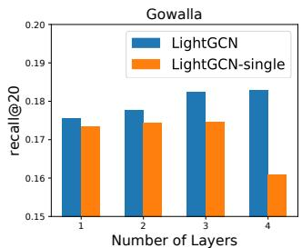

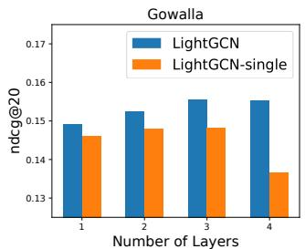

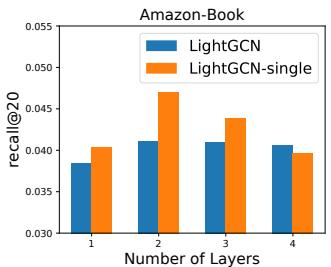

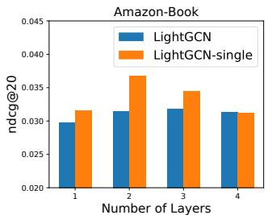  
Figure 4: Results of LightGCN and the variant that does not use layer combination (i.e., LightGCN-single) at diferent layers on Gowalla and Amazon-Book (results on Yelp2018 shows the same trend with Amazon-Book which are omitted for space).

Table 5: Performance of the 3-layer LightGCN with diferent choices of normalization schemes in graph convolution.

<table><tr><td>Dataset</td><td colspan="2">Gowalla</td><td colspan="2">Yelp2018</td><td colspan="2">Amazon-Book</td></tr><tr><td>Method</td><td>recall</td><td>ndcg</td><td>recall</td><td>ndcg</td><td>recall</td><td>ndcg</td></tr><tr><td>LightGCN- $L_1$ -L</td><td>0.1724</td><td>0.1414</td><td>0.0630</td><td>0.0511</td><td>0.0419</td><td>0.0320</td></tr><tr><td>LightGCN- $L_1$ -R</td><td>0.1578</td><td>0.1348</td><td>0.0587</td><td>0.0477</td><td>0.0334</td><td>0.0259</td></tr><tr><td>LightGCN- $L_1$ </td><td>0.159</td><td>0.1319</td><td>0.0573</td><td>0.0465</td><td>0.0361</td><td>0.0275</td></tr><tr><td>LightGCN-L</td><td>0.1589</td><td>0.1317</td><td>0.0619</td><td>0.0509</td><td>0.0383</td><td>0.0299</td></tr><tr><td>LightGCN-R</td><td>0.1420</td><td>0.1156</td><td>0.0521</td><td>0.0401</td><td>0.0252</td><td>0.0196</td></tr><tr><td>LightGCN</td><td>0.1830</td><td>0.1554</td><td>0.0649</td><td>0.0530</td><td>0.0411</td><td>0.0315</td></tr></table>

Method notation: -L means only the left-side norm is used, -R means only the right-side norm is used, and ${ - } L _ { 1 }$ means the $L _ { 1 }$ norm is used.

1 to 4. The peak point is on layer 2 in most cases, while after that it drops quickly to the worst point of layer 4. This indicates that smoothing a node’s embedding with its first-order and second order neighbors is very useful for CF, but will sufer from over smoothing issues when higher-order neighbors are used.

• Focusing on LightGCN, we find that its performance gradually improves with the increasing of layers. Even using 4 layers, LightGCN’s performance is not degraded. This justifies the efectiveness of layer combination for addressing over-smoothing, as we have technically analyzed in Section 3.2.2 (relation with APPNP).

• Comparing the two methods, we find that LightGCN consistently outperforms LightGCN-single on Gowalla, but not on Amazon Book and Yelp2018 (where the 2-layer LightGCN-single performs the best). Regarding this phenomenon, two points need to be noted before we draw conclusion: 1) LightGCN-single is special case of LightGCN that sets $\alpha _ { K }$ to 1 and other $\alpha _ { k }$ to 0; 2) we do not tune the $\alpha _ { k }$ and simply set it as $\frac { 1 } { K + 1 }$ uniformly for LightGCN. As such, we can see the potential of further enhancing the performance of LightGCN by tuning $\alpha _ { k }$

4.4.2 Impact of Symmetric Sqrt Normalization. In LightGCN, we employ symmetric sqrt normalization $\frac { 1 } { \sqrt { | \boldsymbol { N } _ { u } | } \sqrt { | \boldsymbol { N } _ { i } | } }$ on each neighbor embedding when performing neighborhood aggregation (cf. Equation (3)). To study its rationality, we explore diferent choices here. We test the use of normalization only at the left side (i.e., the target node’s coeficient) and the right side (i.e., the neighbor node’s coeficient). We also test $L _ { 1 }$ normalization, i.e., removing the square root. Note that if removing normalization, the training becomes numerically unstable and sufers from nota-value (NAN) issues, so we do not show this setting. Table 5 shows the results of the 3-layer LightGCN. We have the following observations:

Table 6: Smoothness loss of the embeddings learned by LightGCN and MF (the lower the smoother).

<table><tr><td>Dataset</td><td>Gowalla</td><td>Yelp2018</td><td>Amazon-book</td></tr><tr><td></td><td colspan="3">Smoothness of User Embeddings</td></tr><tr><td>MF</td><td>15449.3</td><td>16258.2</td><td>38034.2</td></tr><tr><td>LightGCN-single</td><td>12872.7</td><td>10091.7</td><td>32191.1</td></tr><tr><td></td><td colspan="3">Smoothness of Item Embeddings</td></tr><tr><td>MF</td><td>12106.7</td><td>16632.1</td><td>28307.9</td></tr><tr><td>LightGCN-single</td><td>5829.0</td><td>6459.8</td><td>16866.0</td></tr></table>

• The best setting in general is using sqrt normalization at both sides (i.e., the current design of LightGCN). Removing either side will drop the performance largely.

• The second best setting is using $L _ { 1 }$ normalization at the left side only (i.e., LightGCN- ${ \bf \nabla } \cdot { \cal L } _ { 1 } \mathrm { - { \cal L } ) }$ . This is equivalent to normalize the adjacency matrix as a stochastic matrix by the in-degree.

• Normalizing symmetrically on two sides is helpful for the sqrt normalization, but will degrade the performance of $L _ { 1 }$ normalization.

4.4.3 Analysis of Embedding Smoothness. As we have analyzed in Section 3.2.3, a 2-layer LightGCN smooths a user’s embedding based on the users that have overlap on her interacted items, and the smoothing strength between two users $c _ { v  u }$ is measured in Equation (14). We speculate that such smoothing of embeddings is the key reason of LightGCN’s efectiveness. To verify this, we first define the smoothness of user embeddings as:

$$
S _ {U} = \sum_ {u = 1} ^ {M} \sum_ {v = 1} ^ {M} c _ {v \rightarrow u} \big (\frac {\mathbf {e} _ {u}}{| | \mathbf {e} _ {u} | | ^ {2}} - \frac {\mathbf {e} _ {v}}{| | \mathbf {e} _ {v} | | ^ {2}} \big) ^ {2},\tag{17}
$$

where the $L _ { 2 }$ norm on embeddings is used to eliminate the impact of the embedding’s scale. Similarly we can obtained the definition for item embeddings. Table 6 shows the smoothness of two models, matrix factorization (i.e., using the $\mathbf { E } ^ { ( 0 ) }$ for model prediction) and the 2-layer LightGCN-single (i.e., using the $\mathbf { E } ^ { ( 2 ) }$ for prediction). Note that the 2-layer LightGCN-single outperforms MF in recommendation accuracy by a large margin. As can be seen, the smoothness loss of LightGCN-single is much lower than that of MF. This indicates that by conducting light graph convolution, the embeddings become smoother and more suitable for recommendation.

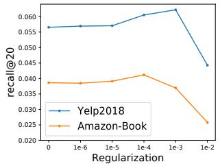

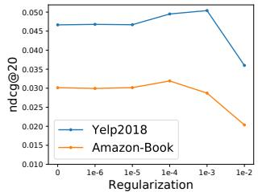  
Figure 5: Performance of 2-layer LightGCN w.r.t. diferent regularization coeficient λ on Yelp and Amazon-Book.

## 4.5 Hyper-parameter Studies

When applying LightGCN to a new dataset, besides the standard hyper-parameter learning rate, the most important hyper-parameter to tune is the $L _ { 2 }$ regularization coeficient λ. Here we investigate the performance change of LightGCN w.r.t. λ.

As shown in Figure 5, LightGCN is relatively insensitive to λ — even when λ sets to 0, LightGCN is better than NGCF, which additionally uses dropout to prevent overfitting8. This shows that LightGCN is less prone to overfitting — since the only trainable parameters in LightGCN are ID embeddings of the 0-th layer, the whole model is easy to train and to regularize. The optimal value for Yelp2018, Amazon-Book, and Gowalla is $1 e ^ { - 3 } , 1 e ^ { - 4 }$ , and $1 e ^ { - 4 }$ , respectively. When λ is larger than $1 e ^ { - 3 }$ , the performance drops quickly, which indicates that too strong regularization will negatively afect model normal training and is not encouraged.

## 5 RELATED WORK

## 5.1 Collaborative Filtering

Collaborative Filtering (CF) is a prevalent technique in modern recommender systems [7, 45]. One common paradigm of CF model is to parameterize users and items as embeddings, and learn the embedding parameters by reconstructing historical user item interactions. For example, earlier CF models like matrix factorization (MF) [26, 32] project the ID of a user (or an item) into an embedding vector. The recent neural recommender models like NCF [19] and LRML [34] use the same embedding component, while enhance the interaction modeling with neural networks.

Beyond merely using ID information, another type ofCF methods considers historical items as the pre-existing features of a user, towards better user representations. For example, FISM [21] and SVD++ [25] use the weighted average of the ID embeddings of historical items as the target user’s embedding. Recently, researchers realize that historical items have diferent contributions to shape personal interest. Towards this end, attention mechanisms are introduced to capture the varying contributions, such as ACF [3] and NAIS [18], to automatically learn the importance of each historical item. When revisiting historical interactions as a user-item bipartite graph, the performance improvements can be attributed to the encoding of local neighborhood — one-hop neighbors — that improves the embedding learning.

## 5.2 Graph Methods for Recommendation

Another relevant research line is exploiting the user-item graph structure for recommendation. Prior eforts like ItemRank [13], use the label propagation mechanism to directly propagate user preference scores over the graph, i.e., encouraging connected nodes to have similar labels. Recently emerged graph neural networks (GNNs) shine a light on modeling graph structure, especially highhop neighbors, to guide the embedding learning [14, 23]. Early studies define graph convolution on the spectral domain, such as Laplacian eigen-decomposition [1] and Chebyshev polynomials [8], which are computationally expensive. Later on, GraphSage [14] and GCN [23] re-define graph convolution in the spatial domain, i.e., aggregating the embeddings of neighbors to refine the target node’s embedding. Owing to its interpretability and eficiency, it quickly becomes a prevalent formulation of GNNs and is being widely used [11, 29, 47]. Motivated by the strength of graph convolution, recent eforts like NGCF [39], GC-MC [35], and PinSage [45] adapt GCN to the user-item interaction graph, capturing CF signals in high-hop neighbors for recommendation.

It is worth mentioning that several recent eforts provide deep insights into GNNs [24, 27, 40], which inspire us developing LightGCN. Particularly, Wu et al. [40] argues the unnecessary complexity of GCN, developing a simplified GCN (SGCN) model by removing nonlinearities and collapsing multiple weight matrices into one. One main diference is that LightGCN and SGCN are developed for diferent tasks, thus the rationality of model simplification is diferent. Specifically, SGCN is for node classification, performing simplification for model interpretability and eficiency. In contrast, LightGCN is on collaborative filtering (CF), where each node has an ID feature only. Thus, we do simplification for a stronger reason: nonlinearity and weight matrices are useless for CF, and even hurt model training. For node classification accuracy, SGCN is on par with (sometimes weaker than) GCN. While for CF accuracy, LightGCN outperforms GCN by a large margin (over 15% improvement over NGCF). Lastly, another work conducted in the same time [4] also finds that the nonlinearity is unnecessary in NGCF and develops linear GCN model for CF. In contrast, our LightGCN makes one step further — we remove all redundant parameters and retain only the ID embeddings, making the model as simple as MF.

## 6 CONCLUSION AND FUTURE WORK

In this work, we argued the unnecessarily complicated design of GCNs for collaborative filtering, and performed empirical studies to justify this argument. We proposed LightGCN which consists of two essential components — light graph convolution and layer combination. In light graph convolution, we discard feature transformation and nonlinear activation — two standard operations in GCNs but inevitably increase the training dificulty. In layer combination, we construct a node’s final embedding as the weighted sum of its embeddings on all layers, which is proved to subsume the efect of self-connections and is helpful to control oversmoothing. We conduct experiments to demonstrate the strengths of LightGCN in being simple: easier to be trained, better generalization ability, and more efective.

We believe the insights of LightGCN are inspirational to future developments of recommender models. With the prevalence of linked graph data in real applications, graph-based models are becoming increasingly important in recommendation; by explicitly exploiting the relations among entities in the predictive model, they are advantageous to traditional supervised learning scheme like factorization machines [17, 33] that model the relations implicitly. For example, a recent trend is to exploit auxiliary information such as item knowledge graph [38], social network [41] and multimedia content [44] for recommendation, where GCNs have set up the new state-of-the-art. However, these models may also sufer from the similar issues of NGCF since the user-item interaction graph is also modeled by same neural operations that may be unnecessary. We plan to explore the idea of LightGCN in these models. Another future direction is to personalize the layer combination weights $\alpha _ { k } ,$ so as to enable adaptive-order smoothing for diferent users (e.g., sparse users may require more signal from higher-order neighbors while active users require less). Lastly, we will explore further the strengths of LightGCN’s simplicity, studying whether fast solution exists for non-sampling regression loss [20] and streaming it for online industrial scenarios.

Acknowledgement. The authors thank Bin Wu, Jianbai Ye, and Yingxin Wu for contributing to the implementation and improvement of LightGCN. This work is supported by the National Natural Science Foundation ofChina (61972372, U19A2079, 61725203).

## REFERENCES

[1] Joan Bruna, Wojciech Zaremba, Arthur Szlam, and Yann LeCun. 2014. Spectral Networks and Locally Connected Networks on Graphs. In ICLR.

[2] Chih-Ming Chen, Chuan-Ju Wang, Ming-Feng Tsai, and Yi-Hsuan Yang. 2019. Collaborative Similarity Embedding for Recommender Systems. In WWW. 2637– 2643.

[3] Jingyuan Chen, Hanwang Zhang, Xiangnan He, Liqiang Nie, Wei Liu, and Tat Seng Chua. 2017. Attentive Collaborative Filtering: Multimedia Recommendation with Item- and Component-Level Attention. In SIGIR. 335–344.

[4] Lei Chen, Le Wu, Richang Hong, Kun Zhang, and Meng Wang. 2020. Revisiting Graph based Collaborative Filtering: A Linear Residual Graph Convolutional Network Approach. In AAAI.

[5] Yihong Chen, Bei Chen, Xiangnan He, Chen Gao, Yong Li, Jian-Guang Lou, and Yue Wang. 2019. λOpt: Learn to Regularize Recommender Models in Finer Levels. Jn KDD.978-986

[6] Zhiyong Cheng, Ying Ding, Lei Zhu, and Mohan S. Kankanhalli. 2018. Aspect Aware Latent Factor Model: Rating Prediction with Ratings and Reviews. In WWW. 639–648.

[7] Paul Covington, Jay Adams, and Emre Sargin. 2016. Deep Neural Networks for YouTube Recommendations. In RecSys. 191–198.

[8] Michaël Deferrard, Xavier Bresson, and Pierre Vandergheynst. 2016. Convolutional Neural Networks on Graphs with Fast Localized Spectral Filtering. In NeurIPS. 3837–3845.

[9] Jingtao Ding, Yuhan Quan, Xiangnan He, Yong Li, and Depeng Jin. 2019. Reinforced Negative Sampling for Recommendation with Exposure Data. In IJCAI. 2230–2236.

[10] Travis Ebesu, Bin Shen, and Yi Fang. 2018. Collaborative Memory Network for Recommendation Systems. In SIGIR. 515–524.

[11] Fuli Feng, Xiangnan He, Xiang Wang, Cheng Luo, Yiqun Liu, and Tat-Seng Chua. 2019. Temporal Relational Ranking for Stock Prediction. TOIS 37, 2 (2019), 27:1–27:30.

[12] Xavier Glorot and Yoshua Bengio. 2010. Understanding the dificulty of training deep feedforward neural networks. In AISTATS. 249–256.

[13] Marco Gori and Augusto Pucci. 2007. ItemRank: A Random-Walk Based Scoring Algorithm for Recommender Engines. In IJCAI. 2766–2771.

[14] William L. Hamilton, Zhitao Ying, and Jure Leskovec. 2017. Inductive Representation Learning on Large Graphs. In NeurIPS. 1025–1035.

[15] Taher H Haveliwala. 2002. Topic-sensitive pagerank. In WWW. 517–526.

[16] Kaiming He, Xiangyu Zhang, Shaoqing Ren, and Jian Sun. 2016. Deep residua learning for image recognition. In CVPR. 770–778.

[17] Xiangnan He and Tat-Seng Chua. 2017. Neural Factorization Machines for Sparse Predictive Analytics. In SIGIR. 355–364.

[18] Xiangnan He, Zhankui He, Jingkuan Song, Zhenguang Liu, Yu-Gang Jiang, and Tat-Seng Chua. 2018. NAIS: Neural Attentive Item Similarity Model for Recommendation. TKDE 30, 12 (2018), 2354–2366.

[19] Xiangnan He, Lizi Liao, Hanwang Zhang, Liqiang Nie, Xia Hu, and Tat-Seng Chua. 2017. Neural Collaborative Filtering. In WWW. 173–182.

[20] Xiangnan He, Jinhui Tang, Xiaoyu Du, Richang Hong, Tongwei Ren, and Tat-Seng Chua. 2019. Fast Matrix Factorization with Nonuniform Weights on Missing Data. TNNLS (2019).

[21] Santosh Kabbur, Xia Ning, and George Karypis. 2013. FISM: factored item similarity models for top-N recommender systems. In KDD. 659–667.

[22] Diederik P. Kingma and Jimmy Ba. 2015. Adam: A Method for Stochastic Optimization. In ICLR.

[23] Thomas N. Kipf and Max Welling. 2017. Semi-Supervised Classification with Graph Convolutional Networks. In ICLR.

[24] Johannes Klicpera, Aleksandar Bojchevski, and Stephan Günnemann. 2019. Predict then propagate: Graph neural networks meet personalized pagerank. In ICLR.

[25] Yehuda Koren. 2008. Factorization meets the neighborhood: a multifaceted collaborative filtering model. In KDD. 426–434

[26] Yehuda Koren, Robert M. Bell, and Chris Volinsky. 2009. Matrix Factorization Techniques for Recommender Systems. IEEE Computer 42, 8 (2009), 30–37.

[27] Qimai Li, Zhichao Han, and Xiao-Ming Wu. 2018. Deeper Insights Into Graph Convolutional Networks for Semi-Supervised Learning. In AAAI. 3538–3545.

[29] Jiezhong Qiu, Jian Tang, Hao Ma, Yuxiao Dong, Kuansan Wang, and Jie Tang. 2018. DeepInf: Social Influence Prediction with Deep Learning. In KDD. 2110–2119.

[30] Nikhil Rao, Hsiang-Fu Yu, Pradeep K Ravikumar, and Inderjit S Dhillon. 2015. Collaborative filtering with graph information: Consistency and scalable methods. In NIPS. 2107–2115.

[31] Stefen Rendle and Christoph Freudenthaler. 2014. Improving pairwise learning for item recommendation from implicit feedback. In WSDM. 273–282.

[32] Stefen Rendle, Christoph Freudenthaler, Zeno Gantner, and Lars Schmidt-Thieme. 2009. BPR: Bayesian Personalized Ranking from Implicit Feedback. In UAI. 452– 461.

[33] Stefen Rendle, Zeno Gantner, Christoph Freudenthaler, and Lars Schmidt-Thieme. 2011. Fast context-aware recommendations with factorization machines. In SIGIR. 635–644.

[34] Yi Tay, Luu Anh Tuan, and Siu Cheung Hui. 2018. Latent relational metric learning via memory-based attention for collaborative ranking. In WWW. 729–739.

[35] Rianne van den Berg, Thomas N. Kipf, and Max Welling. 2018. Graph Convolutional Matrix Completion. In KDD Workshop on Deep Learning Day.

[36] Petar Velickovic, Guillem Cucurull, Arantxa Casanova, Adriana Romero, Pietro Liò, and Yoshua Bengio. 2018. Graph Attention Networks. In ICLR.

[37] Jun Wang, Arjen P. de Vries, and Marcel J. T. Reinders. 2006. Unifying User-based and Item-based Collaborative Filtering Approaches by Similarity Fusion. In SIGIR. 501–508.

[38] Xiang Wang, Xiangnan He, Yixin Cao, Meng Liu, and Tat-Seng Chua. 2019. KGAT: Knowledge Graph Attention Network for Recommendation. In KDD. 950–958.

[39] Xiang Wang, Xiangnan He, Meng Wang, Fuli Feng, and Tat-Seng Chua. 2019. Neural Graph Collaborative Filtering. In SIGIR. 165–174.

[40] Felix Wu, Amauri H. Souza Jr., Tianyi Zhang, Christopher Fifty, Tao Yu, and Kilian Q. Weinberger. 2019. Simplifying Graph Convolutional Networks. In ICML. 6861–6871.

[41] Le Wu, Peijie Sun, Yanjie Fu, Richang Hong, Xiting Wang, and Meng Wang. 2019. A Neural Influence Difusion Model for Social Recommendation. In SIGIR. 235–244.

[42] Keyulu Xu, Weihua Hu, Jure Leskovec, and Stefanie Jegelka. 2018. How powerful are graph neural networks?. In ICLR.

[43] Jheng-Hong Yang, Chih-Ming Chen, Chuan-Ju Wang, and Ming-Feng Tsai. 2018. HOP-rec: high-order proximity for implicit recommendation. In RecSys. 140–144.

[44] Yinwei Yin, Xiang Wang, Liqiang Nie, Xiangnan He, Richang Hong, and Tat-Seng Chua. 2019. MMGCN: Multimodal Graph Convolution Network for Personalized Recommendation of Micro-video. In MM

[45] Rex Ying, Ruining He, Kaifeng Chen, Pong Eksombatchai, William L. Hamilton, and Jure Leskovec. 2018. Graph Convolutional Neural Networks for Web-Scale Recommender Systems. In KDD (Data Science track). 974–983.

[46] Fajie Yuan, Xiangnan He, Alexandros Karatzoglou, and Liguang Zhang. 2020. Parameter-Eficient Transfer from Sequential Behaviors for User Modeling and Recommendation. In SIGIR.

[47] Cheng Zhao, Chenliang Li, and Cong Fu. 2019. Cross-Domain Recommendation via Preference Propagation GraphNet. In CIKM. 2165–2168.

[48] Hongmin Zhu, Fuli Feng, Xiangnan He, Xiang Wang, Yan Li, Kai Zheng, and Yongdong Zhang. 2020. Bilinear Graph Neural Network with Neighbor Interactions. In IJCAI.