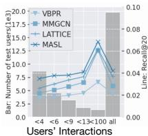
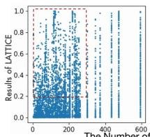
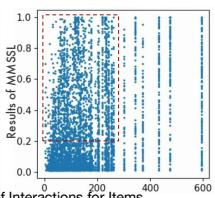
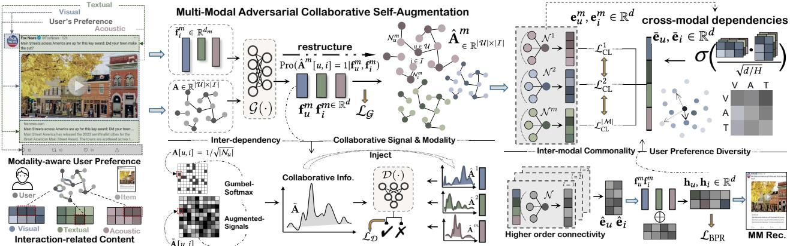
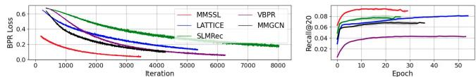
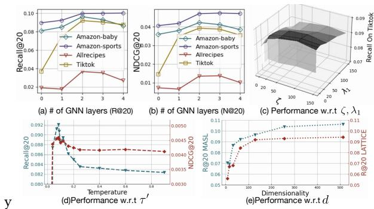

# Multi-Modal Self-Supervised Learning for Recommendation

Wei Wei University of Hong Kong weiweics@connect.hku.hk

Lianghao Xia University of Hong Kong aka\_xia@foxmail.com

Chao Huang∗ University of Hong Kong chaohuang75@gmail.com

Chuxu Zhang Brandeis University chuxuzhang@brandeis.edu

## ABSTRACT

The online emergence of multi-modal sharing platforms (e.g., Tik Tok, Youtube) is powering personalized recommender systems to incorporate various modalities (e.g., visual, textual and acoustic) into the latent user representations. While existing works on multi modal recommendation exploit multimedia content features in en hancing item embeddings, their model representation capability is limited by heavy label reliance and weak robustness on sparse user behavior data. Inspired by the recent progress of self-supervised learning in alleviating label scarcity issue, we explore deriving self supervision signals with efectively learning ofmodality-aware user preference and cross-modal dependencies. To this end, we propose a new Multi-Modal Self-Supervised Learning (MMSSL) method which tackles two key challenges. Specifically, to characterize the inter-dependency between the user-item collaborative view and item multi-modal semantic view, we design a modality-aware in teractive structure learning paradigm via adversarial perturbations for data augmentation. In addition, to capture the efects that user’s modality-aware interaction pattern would interweave with each other, a cross-modal contrastive learning approach is introduced to jointly preserve the inter-modal semantic commonality and user preference diversity. Experiments on real-world datasets verify the superiority of our method in ofering great potential for multime dia recommendation over various state-of-the-art baselines. The implementation is released at: https://github.com/HKUDS/MMSSL.

## CCS CONCEPTS

• Information systems → Recommender systems.

## KEYWORDS

Self-Supervised Learning, Multi-Modal Recommendation

## ACM Reference Format:

Wei Wei, Chao Huang, Lianghao Xia, and Chuxu Zhang. 2023. Multi-Modal Self-Supervised Learning for Recommendation. In Proceedings ofthe ACM

Web Conference 2023 (WWW’23), May 1–5, 2023, Austin, TX, USA. ACM, Austin, TX, USA, 12 pages. https://doi.org/10.1145/3543507.3583206

## 1 INTRODUCTION

Multimedia recommender systems play a crucial role in a wide range of content-sharing and e-commerce applications with massive web multimedia content, including micro-videos, images and songs [27]. In multimedia recommendation scenarios, various modalities of item content are involved, such as the visual, acoustic, and textual features of items [34]. Such multi-modal data characteristics may reflect users’ preferences with fine-grained modality level.

Several research lines have emerged to incorporate multi-modal content into multimedia recommendation. For example, VBPR [10] as an early study to extend matrix decomposition framework to deal with the modality features of items. ACF [2] proposes to identify the component-level user preference via a hierarchically structured attention network. To explore high-order connectivity among useritem interactions, recently proposed methods (e.g., MMGCN [44], GRCN [43], LATTICE [50]) adopt Graph Neural Networks (GNNs) to incorporate modality information into the message passing for inferring user and item representations. However, the satisfied performance of most existing multimedia recommenders usually requires suficient high-quality label data (i.e., observed user interactions) to train the models in a supervised manner. In real-life recommendation scenarios, interaction labels between users and items are very sparse compared with the whole interaction space [21, 45], which limits the representation ability of current fully supervised models to generate accurate embeddings to represent complex user preference in multimedia recommendation.

Inspired by the recent success of self-supervised learning (SSL) for data augmentation [17, 52], an antidote to mitigate the data sparsity limitation in multimedia recommendation is to generate supervisory signals from the unlabeled data. While some recent studies (e.g., SGL [45], NCL [21], HCCF [46]) attempt to incorporate SSL into the modeling of user-item interactions for collaborative filtering, they fail to adapt the augmentation schemes to the specific multimedia recommendation task. For example, SGL [45] directly performs stochastic noise perturbation to dropout nodes and edges for graph augmentation. NCL [21] and HCCF [46] propose to discover implicit semantic node correlations over the observed user-item interactions. The overlook of multi-modal characteristics for augmentation may hinder the efectiveness of their introduced auxiliary SSL tasks to distill modality-aware signals.

Consider the presented the results on Amazon-baby data in Figure 1, several state-of-the-art multimedia methods are experimentally compared to make recommendation with respect to diferent sparsity degrees from user and item side. To be specific, we notice that user interaction sparsity hinders the representation ability of compared methods to capture the genuine multi-modal preference of users. Significant performance gain is achieved by our MMSSL with highly sparse user interaction data $( e . g . , < 4 ) .$ . By visualizing the performance distribution of item-specific prediction results, our method can be observed with more long-tail items distributed in the highlighted area. This gives an illustrated understanding of our model superiority in alleviating long-tail issue for recommendation.

To address the above limitations, this work explores multi-modal self-supervised learning paradigm to benefit multimedia recommen dation from two perspectives of modality-aware augmentation.

Modality-aware Collaborative Relation Learning. In multimedia recommendation, the diversity of modalities can reflect diferent user preferences over items, which could be the interests in visual features of videos, acoustic characteristics of songs, and textual description of products [36]. Failing to inject modality-aware collab orative signals into the self-supervised learning task is insuficient to distill efective SSL signals. Hence, to perform the data aug mentation with the awareness of modality-aware user preference, we propose an adversarial self-supervised learning method to ex plore the implicit relationships between users and items at the fine grained modality-specific level. To distill the self-supervision sig nals pertinent to modality-aware user-item interaction patterns, our generative SSL-based augmentor integrates the modality-guided collaborative relation generator and discriminator, so as to model the influence of multi-modal content on user interaction behaviors.

Cross-Modality Dependency Modeling. Given that diferent modality-specific user preferences would interweave with each other in an implicit manner [33], leaving this fact untouched can easily lead to less accurate representations in preserving multi modal user-item relationships. For instance, users may get attracted by a micro-video due to both its amazing visual content and in strumental background music. Additionally, purchase behaviors of customers in online retailers could be influenced by the presented product images as well as the posted product reviews. To enable our auxiliary supervision signals to be reflective of the modality wise pattern influence, we propose to enhance our self-supervised learning paradigm with cross-modal dependency modeling.

In light of the aforementioned motivations for model design, we develop MMSSL, a new multimedia recommender that unifies the generative and contrastive SSL for modality-aware augmentation. We pursue a generic solution to jointly capture modality-specific collaborative efects and cross-modality interaction dependency, in recognizing multi-modal user preference. In particular, at the first stage of our SSL paradigm, we propose to train an adversar ial relation learning network with the perturbed modality-aware user-item dependency weights. This scheme allows us to distill the useful multi-modal information and encode them into the latent user (item) embeddings facing the limitation of label scarcity. To tackle the challenge of adversarial learning over a sparse user-item connection matrix, we integrate the Gumbel-based projection and Wasserstein adversarial generation to mitigate the distribution gap. At the second stage of MMSSL, we introduce a cross-view multimodal contrastive learning scheme to pursue encoding the influence among modality-wise preference into representations with model robustness. Furthermore, we ofer the theoretical discussion of our self-supervised learning paradigm from viewpoints of: i) enhancing the multi-modal knowledge transfer to the collaborative view via adversarial self-augmentation; ii) benefiting the gradient learning with the cross-modal contrastive augmentation.

  
( b ) (b)

  
( c )  
Figure 1: (a) Performance w.r.t user interaction frequencies. Left side y-axis: # of users in each group; Right side y-axis: performance of diferent methods. (b)-(c) Performance w.r.t item sparsity degrees. Each point represents item-specific recommendation accuracy averaged across epochs.

In a nutshell, our contributions can be summarized as follows.

• We tackle the label scarcity issue of multimedia recommendation with dual-stage self-supervised learning for modality-aware data augmentation. By unifying the recommendation task and our augmented generative/contrastive multi-modal SSL signals, significant performance gains can be achieved by our MMSSL.

• We propose a new recommender system MMSSL which integrates the generative modality-aware collaborative self-augmentation and the contrastive cross-modality dependency encoding.

• We extensively evaluate the proposed MMSSL to justify the model’s efectiveness and robustness. In-depth and visual analyses demonstrate the rationality of our MMSSL method.

## 2 PRELIMINARY

Interaction Graph with Multi-Modality. In the context of graph learning, GNN-based collaborative filtering paradigms have ofered state-of-the-art results [11, 38]. Inspired by this, MMSSL is built over the graph-structured interaction data. Specifically, we generate an user-item graph $G = \{ ( u , i ) | u \in \mathcal { U } , i \in \mathcal { I } \}$ , where U and I represents the set of users and items, respectively. We construct edge in � between user � and item � if an interaction is observed. We incorporate the multi-modal information $( e . g .$ , textual, visual, acoustic modality) into the generated user-item interaction graph � with modality-aware characteristic features $\bar { \mathbf { F } } = \{ \bar { \mathbf { f } } _ { i } ^ { 1 } , . . . , \bar { \mathbf { f } } _ { i } ^ { m } , . . . , \bar { \mathbf { f } } _ { i } ^ { | M | } \}$ of item �. Here, $\bar { \mathbf { f } } _ { i } ^ { m } \in \mathbb { R } ^ { d _ { m } }$ represents the raw feature embedding (with dimensionality $d _ { m } )$ of item � with modality � $\in { \mathcal { M } }$

Task Formulation. We formulate our multi-modal recommender system that captures user-item relations with modality-aware user preference learning. In particular, given the generated multi-modal interaction graph $G = \{ ( u , i ) | u \in \mathcal { U } , i \in \mathcal { I } , \bar { \mathbf { F } } \}$ , our task of multimodal recommender is to learn a function that forecasts how likely an item will be adopted by an user.

## 3 METHODOLOGY

## 3.1 Multi-Modal Self-Augmentation

In our model, we design a self-supervised learning task to supplement the user-item interaction modeling with multi-modal adversarial user-item relation learning. Benefiting from such design, our

  
Figure 2: The model flow of our MMSSL. Gumbel-based transformation is integrated with Wasserstein adversarial generation to mitigate distribution gap between our augmented user-item relation matrix $\hat { \mathbf { A } } ^ { m }$ generated via G(·) and the original A.

MMSSL not only captures the modality-aware user preference over items but also efectively alleviates the data scarcity with the de rived self-supervision signals from multi-modal context. To achieve our goal, we propose an adversarial self-augmentation method which is composed of the modality-guided collaborative relation generator G(·) and graph structure discriminator D (·).

3.1.1 Modality-guided Collaborative Relation Generator. In the generative stage of our self-augmentation scheme, we aim to perform modality-aware graph structure learning over user-item interactions, so as to excavate modality-specific user preferences. In other words, we aim to derive the likelihood of user � interacting with item � given the corresponding multi-modal context:

$$
\mathrm{Pro} (\hat {\mathbf {A}} ^ {m} | \mathbf {F} ^ {m}) = \mathrm{Pro} (\hat {\mathbf {A}} ^ {m} [ u, i ] = 1 | \mathbf {f} _ {u} ^ {m}, \mathbf {f} _ {i} ^ {m})\tag{1}
$$

where $\hat { \mathbf { A } } ^ { m } \in \mathbb { R } ^ { | \mathcal { U } | \times | \bar { \mathcal { I } } | }$ represents the learned user-item interaction matrix under the modality �. Each element in $\hat { \mathbf { A } } ^ { m }$ is denoted as $\hat { \mathbf { A } } ^ { m } [ u , i ] \in \mathbb { R } .$ . To generate the input modality-aware user and item representations $\mathbf { f } _ { u } ^ { \bar { m } }$ and $\mathbf { f } _ { i } ^ { m }$ , we incorporate the collaborative efects into embeddings based on raw multi-modal feature vector $\bar { \mathbf { f } } _ { i } ^ { m }$ :

$$
\mathbf {f} _ {u} ^ {m} = \sum_ {i \in \mathcal {N} _ {u}} \bar {\mathbf {f}} _ {i} ^ {m} / \sqrt {| \mathcal {N} _ {u} |}; \quad \mathbf {f} _ {i} ^ {m} = \sum_ {u \in \mathcal {N} _ {i}} \mathbf {f} _ {u} ^ {m} / \sqrt {| \mathcal {N} _ {i} |}\tag{2}
$$

Here, $\mathcal { N } _ { u }$ and ${ \cal N } _ { i }$ denotes the neighborhood set of user $u \in \mathcal { U }$ and item $i \in \mathcal { I }$ in the user-item interaction graph �. Before feeding the multi-modal feature vectors into our generator, we use the fully-connected layer with dropout [12] to perform a modality specific transformation to map raw multi-modal features into latent embedding space, i.e., $\bar { \mathbf { f } } _ { i } ^ { m } \in \bar { \mathbb { R } } ^ { d _ { m } } \longrightarrow \bar { \mathbf { f } } _ { i } ^ { m } \in \mathbb { R } ^ { d } , d \ll d _ { m }$

To capture the inter-dependency between the collaborative rela tionships and multi-modal contextual features, the modality-aware graph structure learning is conducted by learning the preference matrix $\hat { \mathbf { A } } ^ { m } \in \mathbb { R } ^ { | \mathcal { U } | \times | \bar { \mathcal { I } } | }$ with multi-modal representations:

$$
\hat {\mathbf {A}} ^ {m} [ u, i ] = \mathcal {G} (\mathbf {f} _ {u} ^ {m}, \mathbf {f} _ {i} ^ {m}) = \mathbf {f} _ {u} ^ {m ^ {\top}} \cdot \mathbf {f} _ {i} ^ {m} / (\| \mathbf {f} _ {u} ^ {m} \| _ {2} \cdot \| \mathbf {f} _ {i} ^ {m} \| _ {2})\tag{3}
$$

To avoid calculating the entire interaction matrix, we conduct batch based block matrix multiplication for memory-eficient implementation. With our collaborative relation generator $\mathcal { G } ( \cdot )$ , the learned modality-specific user-item relation matrix $\hat { \mathbf { A } } ^ { m }$ captures the interdependency between the collaborative view and multi-modal context view, which is reflective of modality-aware user preference.

3.1.2 Discriminator with Adversarial Generation. In our adversarial SSL paradigm, the discriminator D (·) is designed to distinguish the generated modality-aware user-item relations $\hat { \mathbf { A } } ^ { m }$ and the observed user-item interaction matrix A from graph �. Through our relation discrimination process, our generator tries to confuse the discriminator by refining the learned modality-aware relation matrix. By doing so, the implicit inter-dependency modeling between the collaborative view and multi-modal context view can be enhanced by achieving adversarial robustness in representations. Formally, the discriminator D (·) is built as follows:

$$
\mathcal {D} (\mathbf {a}) = \delta (\Gamma^ {2} (\mathbf {a})); \Gamma (\mathbf {a}) = \operatorname{Drop} (\mathrm{BN} (\text { LeakyRelu } (\text { Linear } (\mathbf {a}))))\tag{4}
$$

Following the learning strategy in [25, 28], the input embedding $\mathbf { \tau } _ { \mathbf { l } } \in \mathbb { R } ^ { | \mathcal { I } | }$ corresponds to each matrix row, which is selected from either the generated relations $\hat { \mathbf { A } } ^ { m }$ or observed interactions A, i.e., $\{ \mathbf { a } \ | \mathbf { a } \in \mathbf { A } o r \mathbf { a } \in \hat { \mathbf { A } } ^ { m } , m \in M \}$ . Γ(·) denotes the discrimination neural layer by utilizing i) batch-normalization BN(·) for preventing the gradient vanishing issue [15]; ii) dropout ���� (·) for alleviating overfitting [12]; iii) non-linear activation ��������� (·) for facilitating model convergence with more complete gradients [13, 23]. We stack two fully connected layers in our discriminator and adopt the sigmoid function �(·) to approximate the distribution of binary interaction data. ������(·) applies a linear transformation to a.

3.1.3 Adversarial SSL against Distribution Gap. Diferent from the dense pixel matrix of vision data, the observed user-item interaction matrix is highly sparse by including large number of zero values. Such sparsity poses unique challenges for our adversarial modality-aware relation learning, due to the data distribution difference between our generator $\mathcal { G } ( \cdot )$ and discriminator D (·). In particular, the user-item relation matrix $\hat { \mathbf { A } } ^ { m }$ learned by the generator with dense values is inevitably quite diferent from the observed interaction matrix A, which may lead to the mode collapse and dificulty with convergence [30].

To address this challenge, we leverage Gumbel-Softmax [16] to transform the original interaction data into a dense matrix based on the Gumbel distribution, and bridge the distribution gap limitation.

To be specific, the adversarial enhancement is presented:

$$
\tilde {\mathbf {A}} [ u, i ] = \underbrace {\frac {\exp \left((\mathbf {A} [ u , i ] + g) / \tau\right)}{\sum_ {i ^ {\prime}} \exp \left((\mathbf {A} [ u , i ^ {\prime} ] + g) / \tau\right)}} _ {\text { transformation }} + \underbrace {\zeta \times \frac {\mathbf {h} _ {u} ^ {\top} \mathbf {h} _ {i}}{\| \mathbf {h} _ {u} \| _ {2} \| \mathbf {h} _ {i} \| _ {2}}} _ {\text { augmented   signals }}\tag{5}
$$

Here, the perturbation factor � is calculated as $g = - l o g ( - l o g ( u ) )$ based on Gumbel (0, 1) distribution, where u ∼ Uniform(0, 1) [16]. With the Gumbel-based transformation, the original observed inter action matrix A can be projected into a closely distributed matrix $\tilde { \mathbf { A } } \in \mathbb { R } ^ { | \mathcal { U } | \times | \bar { I } | } .$ � is the temperature factor to adjust the smooth ness. To further improve the robustness of our adversarial SSL, we inject the auxiliary signals with the final multi-modal collaborative embeddings $\mathbf { h } _ { u } , \mathbf { h } _ { i }$ derived from Eq. 12. � is a weight parameter.

3.1.4 Adversarial SSL Loss. In our adversarial SSL task, we aim to capture the inter-dependency between the collaborative view and multi-modal view by aligning the distributions between our learned modality-aware user-item relations $\hat { \mathbf { A } } ^ { m }$ and the proxy A˜ of the observed user-item interactions A. Towards this end, we define our adversarial SSL loss to optimize our relation generator $\mathcal { G } ( \cdot )$ and discriminator D(·) in a minimax optimization manner as follows:

$$
\min _ {\mathcal {G}} \max _ {\mathcal {D}} \mathbb {E} _ {\tilde {\mathbf {A}} \sim \mathbb {P} _ {r}} [ \mathcal {D} (\tilde {\mathbf {A}}) ] - \mathbb {E} _ {\hat {\mathbf {A}} ^ {m} \sim \mathbb {P} _ {f}} [ (\mathcal {D} (\mathcal {G} (\mathbf {f} ^ {m})) ]\tag{6}
$$

we separately present the optimized objectives $\mathcal { L } _ { \mathrm { G } }$ and $\mathcal { L } _ { \mathrm { D } }$ corresponding to the generator $\mathcal { G }$ and discriminator $\mathcal { D } _ { i }$ , respectively.

$$
\left\{ \begin{array}{l} \mathcal {L} _ {\mathcal {G}} = - \mathbb {E} _ {\hat {\mathbf {A}} ^ {m}} [ \mathcal {D} (\hat {\mathbf {A}} ^ {m}) ] \\ \mathcal {L} _ {\mathcal {D}} = - \mathbb {E} _ {\tilde {\mathbf {A}}} [ \mathcal {D} (\tilde {\mathbf {A}}) ] + \mathbb {E} _ {\hat {\mathbf {A}} ^ {m}} [ \mathcal {D} (\hat {\mathbf {A}} ^ {m}) ] + \lambda_ {1} \mathbb {E} _ {\ddot {\mathbf {A}}} [ (\| \nabla_ {\mathcal {D} (\tilde {\mathbf {A}})} \| - 1) ^ {2} ] \end{array} \right.\tag{7}
$$

To further enhance the robustness of our adversarial self-supervised learning against distribution gap and data sparsity, WassersteinGAN GP [9] is introduced to add the gradient penalty with the balance weight �1. Here, A¥ denotes the interpolation of $\hat { \mathbf { A } } ^ { m }$ and A˜ matrix.

## 3.2 Cross-Modal Contrastive Learning

In multimedia recommendation scenarios, user interaction behavioral patterns with diferent item modalities (e.g., visual, textual and acoustic) will influence each other. For example, the visual and acoustic features of a short video can jointly attract users to view it. Thus, the visual-specific and acoustic-specific preferences of users may interweave in a complex way. To capture such implicit dependencies among user modality-specific preferences, we design a cross-modal contrastive learning paradigm with modality-aware graph contrastive augmentation.

3.2.1 Modality-aware Contrastive View. To inject the modality specific semantics into our contrastive learning component, we perform the information aggregation over the modality-aware semantic neighbors $\mathcal { N } _ { u } ^ { m }$ and ${ \cal N } _ { i } ^ { m }$ ofuser � and item �. It can be derived from relational matrix $\hat { \textbf { A } } ^ { m } ( \mathrm { E q } . 3 )$ learned in our generator.

$$
\mathbf {e} _ {u} ^ {m} = \sum_ {i \in \mathcal {N} _ {u} ^ {m}} \mathbf {e} _ {i} / \sqrt {| \mathcal {N} _ {u} ^ {m} |}; \quad \mathbf {e} _ {i} ^ {m} = \sum_ {u \in \mathcal {N} _ {i} ^ {m}} \mathbf {e} _ {u} / \sqrt {| \mathcal {N} _ {i} ^ {m} |}\tag{8}
$$

$\mathbf { e } _ { u } , \mathbf { e } _ { i } \in \mathbb { R } ^ { d }$ are Xavier-initialized [8] id-corresponding embeddings. The multi-modal contextual information can be preserved in the modality-aware latent representations $\mathbf { e } _ { u } ^ { m } , \mathbf { e } _ { i } ^ { m } \in \mathbb { R } ^ { d }$

Modality-wise Dependency Modeling. To capture the correlations between each pair of modality-specific user preferences, we design our modality-wise dependency encoder with a multi-head self-attention mechanism using the following formula:

$$
\bar {\mathbf {e}} _ {u} ^ {m} = \sum_ {m ^ {\prime} \in \mathcal {M}} \bigg \| _ {h = 1} ^ {H} \sigma (\frac {(\mathbf {e} _ {u} ^ {m} \mathbf {W} _ {h} ^ {Q}) ^ {\top} \cdot (\mathbf {e} _ {u} ^ {m ^ {\prime}} \mathbf {W} _ {h} ^ {K})}{\sqrt {d / H}}) \cdot \mathbf {e} _ {u} ^ {m ^ {\prime}}\tag{9}
$$

where $\mathbf { W } _ { h } ^ { Q } , \mathbf { W } _ { h } ^ { K } \in \mathbb { R } ^ { d / H \times d }$ denote the ℎ-head query and the key transformations for calculating the relation between modality pair $( m , m ^ { \prime } )$ . � denotes the number of attention heads. �(·) denotes the softmax function. Embeddings of both user and item side are refined in an analogous way. We then fuse the modality-specific embeddings through mean-pooling (e.g. $\begin{array} { r } { \bar { \mathbf { e } } _ { u } = \sum _ { m \in \mathcal { M } } ^ { | \mathcal { M } | } \bar { \mathbf { e } } _ { u } ^ { m } / | \mathcal { M } | ) } \end{array}$ , to generate the multi-modal user/item representations $\bar { \mathbf { e } } _ { u } , \bar { \mathbf { e } } _ { i } \in \mathbb { R } ^ { d }$ Multi-Modal High-Order Connectivity. To explore the highorder collaborative efects with the awareness of multi-modal information, we build our encoder upon the graph neural network for recursive message passing with the matrix form as follows:

$$
\hat {\mathbf {E}} _ {u} ^ {l + 1} = \mathbf {A} \cdot \hat {\mathbf {E}} _ {i} ^ {l}; \quad \hat {\mathbf {E}} _ {u} ^ {0} = \mathbf {E} _ {u} + \eta \cdot \bar {\mathbf {E}} _ {u} / \| \bar {\mathbf {E}} _ {u} \| _ {2} ^ {2}\tag{10}
$$

where $\hat { \mathbf e } _ { i } ^ { l } \in \hat { \mathbf E } _ { i } ^ { l } , \hat { \mathbf e } _ { u } ^ { l + 1 } \in \hat { \mathbf E } _ { u } ^ { l + 1 }$ denote the embeddings for the �-th and the $( l + 1 )$ -th layer, respectively. The node degree-normalized matrix element $\mathbf { A } [ u , i ] \ = \ 1 / \sqrt { | { \cal N } _ { u } | }$ if user � has interacted with item � from the observed data. The zero-order embeddings $\hat { \mathbf { E } } _ { u } ^ { 0 }$ are obtained by combining the initial id-corresponding embeddings $\mathbf { E } _ { u }$ with the normalized modality-aware embeddings $\bar { \mathbf { E } } _ { u }$ using the weight parameter �. In our multi-layer GNNs, the layer-specific embeddings are aggregated through mean-pooling to yield the output: $\begin{array} { r } { \hat { \mathbf { E } } _ { u } = \sum _ { l = 0 } ^ { L } \hat { \mathbf { E } } _ { u } ^ { l } / L } \end{array}$ , where � is the number of graph layers.

3.2.2 Cross-Modal Contrastive Augmentation. In this module, we introduce our multi-modal contrastive learning paradigm which distills the self-supervision signals for dependency modeling among modality-specific user preferences. Specifically, we adopt the InfoNCE loss function to maximize the mutual information between the modality-specific embeddings $\mathbf { e } _ { u } ^ { m }$ and the overall user embedding $\mathbf { h } _ { u }$ of the same user �. With the self-discrimination strategy [45, 46], embeddings from diferent users are treated as negative pairs. Our cross-modal contrastive loss is defined as:

$$
\begin{array}{l} \mathcal {L} _ {\mathrm{CL}} = - \sum_ {m \in \mathcal {M}} \sum_ {u \in \mathcal {U}} ^ {| \mathcal {M} |} \log \frac {\exp s (\mathbf {h} _ {u} , \mathbf {e} _ {u} ^ {m})}{\sum_ {u ^ {\prime} \in \mathcal {U}} \left(\exp s (\mathbf {h} _ {u ^ {\prime}} , \mathbf {e} _ {u} ^ {m}) + \exp s (\mathbf {e} _ {u ^ {\prime}} ^ {m} , \mathbf {e} _ {u} ^ {m})\right)} \\ s (\mathbf {h} _ {u}, \mathbf {e} _ {u} ^ {m}) = \mathbf {h} _ {u} ^ {\top} \cdot \mathbf {e} _ {u} ^ {m} / (\tau^ {\prime} \cdot \| \mathbf {h} _ {u} \| _ {2} \cdot \| \mathbf {e} _ {u} ^ {m} \| _ {2}) \end{array} \tag {1}\tag{11}
$$

where �(·) denotes the similarity function, and $\tau ^ { \prime }$ is the temperature coeficient. Our cross-modal contrastive learning aims to learn an embedding space in which diferent user representations are far apart, which allows our model to capture diverse user modalityspecific preferences with uniformly-distributed embeddings.

## 3.3 Multi-Task Model Training

To generate our final user (item) representations $\mathbf { h } _ { u } , \mathbf { h } _ { i } \in \mathbb { R } ^ { d }$ for making predictions, we promote the cooperation between the col laborative view and multi-modal view by aggregating their corre sponding encoded embeddings as follows:

$$
\mathbf {h} _ {u} = \hat {\mathbf {e}} _ {u} + \omega \sum_ {m \in \mathcal {M}} ^ {| \mathcal {M} |} \frac {\mathbf {f} _ {u} ^ {m}}{\| \mathbf {f} _ {u} ^ {m} \| _ {2}}; \quad \mathbf {h} _ {i} = \hat {\mathbf {e}} _ {i} + \omega \sum_ {m \in \mathcal {M}} ^ {| \mathcal {M} |} \frac {\mathbf {f} _ {i} ^ {m}}{\| \mathbf {f} _ {i} ^ {m} \| _ {2}}\tag{12}
$$

� is the aggregation weight. Normalization is performed to alleviate the value scale diference between the embeddings of collaborative view $( \hat { \mathbf { e } } _ { u } , \hat { \mathbf { e } } _ { i } )$ and multi-modal views $( \mathbf { f } _ { u } ^ { m } , \mathbf { f } _ { i } ^ { m } )$ ). With the final embeddings, our MMSSL model makes predictions on the unobserved interaction between user � and item � through $\hat { y } _ { u , i } = \mathbf { h } _ { u } ^ { \top } \cdot \mathbf { h } _ { i }$

Model Optimization. We train our recommender with a multi task learning scheme to jointly optimize MMSSL with i) the main user-item interaction prediction task $\mathcal { L } _ { \mathrm { B P R } } ; \mathrm { i i } )$ adversarial modality aware user-item relation learning task $\mathcal { L } _ { \mathrm { G } } ;$ iii) cross-modal contrastive learning task ${ \mathcal { L } } _ { \mathrm { C L } }$ . Formally, the jointly optimized objective is given $( \lambda _ { 2 } , \lambda _ { 3 } , \lambda _ { 4 }$ are hyperparameters for loss term weighting):

$$
\mathcal {L} = \mathcal {L} _ {\mathrm{BPR}} + \lambda_ {2} \cdot \mathcal {L} _ {\mathrm{CL}} + \lambda_ {3} \cdot \mathcal {L} _ {\mathrm{G}} + \lambda_ {4} \cdot \left\| \Theta \right\| ^ {2}\tag{13}
$$

$$
\mathcal {L} _ {\mathrm{BPR}} = \sum_ {(u, i _ {p}, i _ {n})} ^ {| \mathcal {E} |} - \log \left(\operatorname{sigm} (\hat {y} _ {u, i _ {p}} - \hat {y} _ {u, i _ {n}})\right)\tag{14}
$$

$i _ { p } , i _ { n }$ denotes the positive and negative samples for user �. The last term in $\mathcal { L }$ is the weight-decay regularization against over-fitting.

## 3.4 Theoretical Discussion of MMSSL

We ofer theoretical analyzes to discuss the benefits of our multi modal SSL: i) conducting collaborative knowledge transfer; ii) cap turing the cross-modality commonality for each instance.

3.4.1 Theoretical Analysis of Knowledge Transfer. The pur pose of the adversarial SSL task is to inject collaborative signals into the modality-specific distribution (i.e., knowledge transfer). Theoretical analysis here supports for the associativity of adversarial transferability and knowledge transferability. In particular, we first provide formal definitions of those two transferability and then show their correlations. For knowledge transferability, we care about whether the source $\hat { \mathbf { A } } ^ { m }$ on data � can achieve low loss $\textstyle { \mathcal { L } } ( . ; G )$ when combining with a trainable model $\mathcal { G }$ comparing with target A˜ , which is formally shown as follows:

$$
\min _ {\mathcal {G}} \mathcal {L} (\mathbf {G} \circ \hat {\mathbf {A}} ^ {m}; G) \quad c o m p a r e w i t h \quad \min \mathcal {L} (\tilde {\mathbf {A}}; G)\tag{15}
$$

We can observe that $\mathcal { G }$ will determine how to solve this optimization problem. For adversarial transferability, we introduce dedicated metrics $\varrho _ { 1 } , \varrho _ { 2 }$ [20], to ofer a quantitative picture. Then, we can denote the upper bound of knowledge transferability by adversarial transferability as:

$$
\| \nabla \tilde {\mathbf {A}} - \nabla (\mathbf {G} \circ \hat {\mathbf {A}} ^ {m}) \| ^ {2} \leq (1 - \varrho_ {1} \varrho_ {2}) L ^ {2}\tag{16}
$$

where the composite function $\mathbf { G } \circ \hat { \mathbf { A } } ^ { m }$ formally denotes the knowl edge transferability on � to approximate A˜ (assuming that A˜ is �-Lipschitz continuous, $i . e . , \| \nabla \tilde { \mathbf { A } } \| _ { 2 } \leq L )$ . The adversarial transfer ability can be measured by the angle diference $( \varrho _ { 1 } )$ between source target gradients and the norm diference (�2). The inequality suggests that if adversarial transferability is high, there exists an afine transformation with the bounded norm. It provides a theoretical underpinning for self-augmentation in Sec. 3.1 and emphasizes the necessity of Sec. 3.1.3. We bridge the distribution gap to prevent mode collapse [30] in recommendation task.

Table 1: Statistics of experimented datasets with multi-modal item Visual(V), Acoustic(A), Textual(T) contents.

<table><tr><td rowspan="2">Dataset</td><td colspan="3">Amazon</td><td rowspan="2" colspan="3">Tiktok</td><td rowspan="2" colspan="2">Allrecipes</td></tr><tr><td colspan="2">Sports</td><td>Baby</td></tr><tr><td>Modality</td><td>V</td><td>T</td><td>V</td><td>T</td><td>V</td><td>A</td><td>T</td><td>V</td></tr><tr><td>Embed Dim</td><td>4096</td><td>1024</td><td>4096</td><td>1024</td><td>128</td><td>128</td><td>768</td><td>2048</td></tr><tr><td>User</td><td colspan="2">35598</td><td colspan="2">19445</td><td colspan="3">9319</td><td>19805</td></tr><tr><td>Item</td><td colspan="2">18357</td><td colspan="2">7050</td><td colspan="3">6710</td><td>10067</td></tr><tr><td>Interactions</td><td colspan="2">256308</td><td colspan="2">139110</td><td colspan="3">59541</td><td>58922</td></tr><tr><td>Sparsity</td><td colspan="2">99.961%</td><td colspan="2">99.899%</td><td colspan="3">99.904%</td><td>99.970%</td></tr></table>

User-specific Patterns Modeling Through Gradient. Stacked GNN architecture may lead to performance degradation due to oversmoothing [19]. In contrast, our multi-modal contrastive learning is endowed with the capacity of encoding indistinguishable embed dings. Theoretically, by pushing the hard negatives away from the anchor, greater gradients can be obtained [35]. After obtaining the gradient of the negative sample (Eq. 18), we can get function � (·) by the proportional approximation (Eq. 20). It maps the similarity of the negative sample pair to the gradient of the negative node:

$$
\phi (x) \propto \sqrt {1 - (x) ^ {2}} \cdot \exp {(x / \tau)}\tag{17}
$$

where � is the input of $\phi ( \cdot )$ calculated by normalized embedding of anchor node and negative sample. � is the temperature coeficient. By analyzing the gradient with Appendix.Fig. 5, we can conclude that our contrastive learning paradigm will assign larger gradients to hard negative samples (other users) to enhance representation discrimination, i.e., facilitating to model user-specific preference.

## 4 EVALUATION

In this section, we conduct experiments to validate the efectiveness of MMSSL method by answering the following research questions:

• RQ1: Can the proposed MMSSL method achieve performance improvement over various state-of-the-art (SOTA) baselines?

• RQ2: For key learning components in our MMSSL, what are their impacts in boosting the recommendation performance?

• RQ3: How efective is MMSSL in alleviating the sparsity issue?

• RQ4: How is training eficiency of MMSSL as epochs increases?

• RQ5: How does the hyperparameter settings impact the results?

## 4.1 Experimental Settings

4.1.1 Dataset. Experiments are conducted on four publicly available multi-modal recommendation datasets, i.e., Tiktok, Amazon-Baby, Amazon-Sports, and Allrecipes. Data statistics with multimodal feature embedding dimensionality are reported in Table 1.

• TikTok. This data is collected from TikTok platform to log the viewed short-videos of users. The multi-modal characteristics are visual, acoustic, and title textual features of videos. The textual embeddings are encoded with Sentence-Bert [29].

• Amazon. We adopt two benchmark datasets from Amazon with two item categories Amazon-Baby and Amazon-Sports [24]. In those datasets, textual feature embeddings are also generated via Sentence-Bert based on the extracted text from product title, description, brand and categorical information. The product images are used to generate 4096-d visual feature embeddings of items.

Table 2: Performance comparison of baselines on diferent datasets in terms of Recall@20, Precision@20 and NDCG@20.

<table><tr><td rowspan="2">Baseline</td><td colspan="3">Tiktok</td><td colspan="3">Amazon-Baby</td><td colspan="3">Amazon-Sports</td><td colspan="3">Allrecipes</td></tr><tr><td>R@20</td><td>P@20</td><td>N@20</td><td>R@20</td><td>P@20</td><td>N@20</td><td>R@20</td><td>P@20</td><td>N@20</td><td>R@20</td><td>P@20</td><td>N@20</td></tr><tr><td>MF-BPR</td><td>0.0346</td><td>0.0017</td><td>0.0130</td><td>0.0440</td><td>0.0024</td><td>0.0200</td><td>0.0430</td><td>0.0023</td><td>0.0202</td><td>0.0137</td><td>0.0007</td><td>0.0053</td></tr><tr><td>NGCF</td><td>0.0604</td><td>0.0030</td><td>0.0238</td><td>0.0591</td><td>0.0032</td><td>0.0261</td><td>0.0695</td><td>0.0037</td><td>0.0318</td><td>0.0165</td><td>0.0008</td><td>0.0059</td></tr><tr><td>LightGCN</td><td>0.0653</td><td>0.0033</td><td>0.0282</td><td>0.0698</td><td>0.0037</td><td>0.0319</td><td>0.0782</td><td>0.0042</td><td>0.0369</td><td>0.0212</td><td>0.0010</td><td>0.0076</td></tr><tr><td>SGL</td><td>0.0603</td><td>0.0030</td><td>0.0238</td><td>0.0678</td><td>0.0036</td><td>0.0296</td><td>0.0779</td><td>0.0041</td><td>0.0361</td><td>0.0191</td><td>0.0010</td><td>0.0069</td></tr><tr><td>NCL</td><td>0.0658</td><td>0.0034</td><td>0.0269</td><td>0.0703</td><td>0.0038</td><td>0.0311</td><td>0.0765</td><td>0.0040</td><td>0.0349</td><td>0.0224</td><td>0.0010</td><td>0.0077</td></tr><tr><td>HCCF</td><td>0.0662</td><td>0.0029</td><td>0.0267</td><td>0.0705</td><td>0.0037</td><td>0.0308</td><td>0.0779</td><td>0.0041</td><td>0.0361</td><td>0.0225</td><td>0.0011</td><td>0.0082</td></tr><tr><td>VBPR</td><td>0.0380</td><td>0.0018</td><td>0.0134</td><td>0.0486</td><td>0.0026</td><td>0.0213</td><td>0.0582</td><td>0.0031</td><td>0.0265</td><td>0.0159</td><td>0.0008</td><td>0.0056</td></tr><tr><td>LightGCN-M</td><td>0.0679</td><td>0.0034</td><td>0.0273</td><td>0.0726</td><td>0.0038</td><td>0.0329</td><td>0.0705</td><td>0.0035</td><td>0.0324</td><td>0.0235</td><td>0.0011</td><td>0.0081</td></tr><tr><td>MMGCN</td><td>0.0730</td><td>0.0036</td><td>0.0307</td><td>0.0640</td><td>0.0032</td><td>0.0284</td><td>0.0638</td><td>0.0034</td><td>0.0279</td><td>0.0261</td><td>0.0013</td><td>0.0101</td></tr><tr><td>GRCN</td><td>0.0804</td><td>0.0036</td><td>0.0350</td><td>0.0754</td><td>0.0040</td><td>0.0336</td><td>0.0833</td><td>0.0044</td><td>0.0377</td><td>0.0299</td><td>0.0015</td><td>0.0110</td></tr><tr><td>LATTICE</td><td>0.0843</td><td>0.0042</td><td> $\underline{0.0367}$ </td><td> $\underline{0.0829}$ </td><td> $\underline{0.0044}$ </td><td> $\underline{0.0368}$ </td><td> $\underline{0.0915}$ </td><td> $\underline{0.0048}$ </td><td> $\underline{0.0424}$ </td><td>0.0268</td><td>0.0014</td><td>0.0103</td></tr><tr><td>CLCRec</td><td>0.0621</td><td>0.0032</td><td>0.0264</td><td>0.0610</td><td>0.0032</td><td>0.0284</td><td>0.0651</td><td>0.0035</td><td>0.0301</td><td>0.0231</td><td>0.0010</td><td>0.0093</td></tr><tr><td>MMGCL</td><td>0.0799</td><td>0.0037</td><td>0.0326</td><td>0.0758</td><td>0.0041</td><td>0.0331</td><td>0.0875</td><td>0.0046</td><td>0.0409</td><td>0.0272</td><td>0.0014</td><td>0.0102</td></tr><tr><td>SLMRec</td><td> $\underline{0.0845}$ </td><td> $\underline{0.0042}$ </td><td>0.0353</td><td>0.0765</td><td>0.0043</td><td>0.0325</td><td>0.0829</td><td>0.0043</td><td>0.0376</td><td> $\underline{0.0317}$ </td><td> $\underline{0.0016}$ </td><td> $\underline{0.0118}$ </td></tr><tr><td>MMSSL</td><td> $\underline{0.0921}$ </td><td> $\underline{0.0046}$ </td><td> $\underline{0.0392}$ </td><td> $\underline{0.0962}$ </td><td> $\underline{0.0051}$ </td><td> $\underline{0.0422}$ </td><td> $\underline{0.0998}$ </td><td> $\underline{0.0052}$ </td><td> $\underline{0.0470}$ </td><td> $\underline{0.0367}$ </td><td> $\underline{0.0018}$ </td><td> $\underline{0.0135}$ </td></tr><tr><td>p-value</td><td> $1.28e^{-5}$ </td><td> $7.12e^{-6}$ </td><td> $6.55e^{-6}$ </td><td> $2.23e^{-6}$ </td><td> $7.69e^{-6}$ </td><td> $8.65e^{-7}$ </td><td> $7.75e^{-6}$ </td><td> $6.48e^{-6}$ </td><td> $6.78e^{-7}$ </td><td> $3.94e^{-4}$ </td><td> $5.06e^{-6}$ </td><td> $4.31e^{-5}$ </td></tr><tr><td>Improv.</td><td>8.99%</td><td>9.52%</td><td>6.81%</td><td>16.04%</td><td>15.91%</td><td>14.67%</td><td>9.07%</td><td>8.33%</td><td>10.85%</td><td>15.77%</td><td>12.50%</td><td>14.40%</td></tr></table>

• Allrecipes. This dataset comes from one of the largest food oriented social network platform by including 52,821 recipes in 27 diferent categories. For each recipe, its image and ingredients are considered as the visual and textual features. Following the setting in [7], 20 ingredients are sampled for each recipe.

4.1.2 Evaluation Protocols. To evaluate the accuracy of top-� recommendation results, we adopt three widely used metrics: Recall@K (R@K), Precision@K (P@K), and Normalized Discounted Cumulative Gain (N@K). Following the settings in [41, 43], we all-rank item evaluation strategy is used to measure the accuracy. The average scores over all users in the test set are reported.

4.1.3 Baselines. We compare MMSSL with SOTA multi-modal recommender systems, popular GNN-based collaborative filtering models, recently proposed SSL-based recommendation solutions. i) GNN-based Collaborative Filtering Models

• NGCF [38]: The method leverages graph convolutional network to inject high-order collaborative signals into representations.

• LightGCN [11]: By removing the redundant transformation and non-linear activation, LightGCN simplifies the message passing for graph neural network-based recommendation.

## ii) SSL-based Recommendation Solutions

• SGL [45]: This model improves the graph collaborative filtering with the incorporated contrastive learning signals using diferent data augmentation operators, e.g., randomly node/edge dropout and random walk, to construct contrastive representation views.

• NCL [21]: In this approach, constrastive views are generated by identifying semantic and structural neighboring nodes with EM-based clustering, to generate the positive contrastive pairs.

• HCCF [46]: To supplement main recommendation objective with SSL task, HCCF leverages the hypergraph neural encoder to inject the global collaborative relations into the recommender.

iii) Multi-Modal Recommender Systems • VBPR [10]: This is a representative work to incorporate multimedia features into the matrix decomposition framework.

• LightGCN-�: This baseline is generated by using SOTA GNNbased CF model LightGCN as backbone and incorporate multimodal item features during the graph-based message passing.

• MMGCN [44]: It leverages graph convolutional network to propagate the modality-specific embedding and capture the modalityrelated user preference for micro-video recommendation.

• GRCN [43]: It is a structure-refined GCN multimedia recommender system, which yields the refined interactions to identify false-positive feedback and eliminate noisy with pruning edges.

• LATTICE [50]: It proposes to identify latent item-item relations with the generated item homogeneous graph. Connections will be added among items with similar modality features.

• CLCRec [42]: This model addresses the item cold-start issue by enhancing item embeddings with multi-modal features using mutual information-based contrastive learning.

• MMGCL [48]: It incorporates the graph contrastive learning into recommender through modality edge dropout and masking.

• SLMRec [32]: This method designs data augmentation on multimodal content with two components, i.e., noise perturbation over features and multi-modal pattern uncovering augmentation.

4.1.4 Hyperparameter Settings. Our MMSSL model is implemented with Pytorch. We adopt AdamW[22] and Adam[18] as the optimizer for generator and discriminator with the learning rate search range of $\{ 4 . 5 e ^ { - 4 } , 5 e ^ { - 4 } , 5 . 4 e ^ { - 3 } , 5 . 6 e ^ { - 3 } \}$ and $\{ 2 . 5 e ^ { - \overline { { { 4 } } } }$ $3 e ^ { - 4 } , 3 . 5 e ^ { - 4 } \} ,$ , respectively. The decay of $L _ { 2 }$ regularization term is searched in $\{ 1 . 2 \bar { e } ^ { - 2 } , 1 . 4 \bar { e } ^ { - 2 } , 1 . 6 e ^ { - 2 } \}$ }. For fair comparison, the embedding dimensionality of our MMSSL and other compared methods is set as 64. For our MMSSL model, the number of propagation layers over graph structure is tuned from {1, 2, 3, 4}.

## 4.2 Performance Comparison (RQ1)

Evaluation results are reported in Table 2, in which the performance ofour MMSSL and the best-performed baseline are highlighted with bold and underlined, respectively. Key observations are as follows:

Table 3: Ablation study on key components of MMSSL

<table><tr><td>Data</td><td colspan="2">Amazon-Baby</td><td colspan="2">Allrecipes</td><td colspan="2">Tiktok</td></tr><tr><td>Metrics</td><td>Recall</td><td>NDCG</td><td>Recall</td><td>NDCG</td><td>Recall</td><td>NDCG</td></tr><tr><td>w/o-ASL</td><td>0.0907</td><td>0.0396</td><td>0.0326</td><td>0.0124</td><td>0.0801</td><td>0.0358</td></tr><tr><td>w/o-CL</td><td>0.0924</td><td>0.0408</td><td>0.0328</td><td>0.0130</td><td>0.0821</td><td>0.0351</td></tr><tr><td>w/o-GT</td><td>0.0929</td><td>0.0405</td><td>0.0325</td><td>0.0121</td><td>0.0815</td><td>0.0353</td></tr><tr><td>r/p-GAE</td><td>0.0931</td><td>0.0411</td><td>0.0331</td><td>0.0126</td><td>0.0843</td><td>0.0364</td></tr><tr><td>MMSSL</td><td>0.0962</td><td>0.0422</td><td>0.0367</td><td>0.0135</td><td>0.0921</td><td>0.0392</td></tr></table>

Table 4: Performance comparison w.r.t diferent interaction sparsity degrees on Amazon-Baby and Allrecipes datasets.

<table><tr><td>Baby $(1e3)$ </td><td>[0,4)9.783</td><td>[4,6)4.081</td><td>[6,9)2.823</td><td>[9,13)1.649</td><td>[13,100)1.109</td></tr><tr><td>VBPR</td><td>0.0166↑110.8%</td><td>0.0187↑101.6%</td><td>0.0197↑93.4%</td><td>0.0218↑87.6%</td><td>0.0319↑115.1%</td></tr><tr><td>MMGCN</td><td>0.0219↑59.8%</td><td>0.0247↑52.6%</td><td>0.0277↑37.6%</td><td>0.0315↑29.8%</td><td>0.0608↑12.8%</td></tr><tr><td>LATTICE</td><td>0.0263↑33.1%</td><td>0.0300↑25.7%</td><td>0.0337↑13.1%</td><td>0.0366↑11.8%</td><td>0.0619↑10.8%</td></tr><tr><td>SLMRec</td><td>0.0269↑30.1%</td><td>0.0291↑29.6%</td><td>0.0302↑26.2%</td><td>0.0318↑28.6%</td><td>0.0611↑12.3%</td></tr><tr><td>Ours</td><td>0.0350</td><td>0.0377</td><td>0.0381</td><td>0.0409</td><td>0.0686</td></tr><tr><td>Allrecipes $(1e3)$ </td><td>[0,2)8.720</td><td>[2,3)4.643</td><td>[3,4)3.221</td><td>[4,5)1.790</td><td>[5,10)1.431</td></tr><tr><td>VBPR</td><td>0.0039↑164.1%</td><td>0.0051↑132.7%</td><td>0.0056↑141.1%</td><td>0.0057↑127.6%</td><td>0.0069↑175.4%</td></tr><tr><td>MMGCN</td><td>0.0067↑53.7%</td><td>0.0084↑44.1%</td><td>0.0100↑35.0%</td><td>0.0104↑26.9%</td><td>0.0134↑41.8%</td></tr><tr><td>LATTICE</td><td>0.0072↑43.1%</td><td>0.0088↑37.5%</td><td>0.0105↑28.6%</td><td>0.0099↑33.3%</td><td>0.0159↑19.5%</td></tr><tr><td>SLMRec</td><td>0.0085↑21.2%</td><td>0.0099↑22.2%</td><td>0.0116↑16.4%</td><td>0.0114↑15.8%</td><td>0.0174↑9.2%</td></tr><tr><td>Ours</td><td>0.0103</td><td>0.0121</td><td>0.0135</td><td>0.0132</td><td>0.0190</td></tr></table>

Figure 3: Training curves of MMSSL and compared methods.

• MMSSL shows promising performance by consistently outperforming all baselines on diferent datasets, which demonstrates the efectiveness of our proposed new model. We attribute the performance improvement to the integrated generative and con trastive SSL components for modality-aware data augmentation. Most of recently proposed multimedia recommendation methods perform better than graph-based collaborative filtering models, which indicates the efectiveness of incorporating multi-modal context in learning modality-aware collaborative relationships.

• While recent studies (i.e., SGL, NCL, HCCF) attempt to augment user-item interaction modeling in a contrastive fashion, only marginal performance gains are achieved by them compared with NGCF and LightGCN. We postulate the reason is the igno rance of multi-modal contextual information for generating self supervision signals. With the guidance of multi-modal patterns (e.g., modality-specific user preference, cross-modal relatedness), our MMSSL distills modality-aware self-supervised signals to supplement the supervised task of multimedia recommendation.

• In comparison with multimedia recommender systems, the obvi ous performance improvement of our MMSSL can be observed. As to state-of-the-art SSL-based methods (CLCRec, MMGCL, SLM Rec), our framework MMSSL leverages the generative adversar ial SSL to construct modality-speicific user-item relation and contrastive cross-modal relatedness learning, for efective multi modal augmentation. However, directly masking the modality user/item features in MMGCL may cause the important informa tion loss, which makes the sparsity issue of inactive users even worse. Furthermore, SLMRec generates the augmented views via the pre-defined hierarchical correlations among diferent modal ity data, which may hinder the efects of self-supervised signals across various multimedia recommendation datasets.

## 4.3 In-Depth Analysis (RQ2 and RQ3)

4.3.1 Ablation Study (RQ2). Experiments are conducted to justify the importance of key components in MMSSL with the details. (1) We first disable the adversarial generative self-augmentation in the variant w/o-ASL. As shown in Table 3, the performance of w/o-ASL without our adversarial SSL decreases sharply compared with our MMSSL, demonstrating the strength of our designed generative augmentation with modality-guided self-supervised learning.

(2) We ablate the cross-modal contrastive learning paradigm with the variant w/o-CL. The superior model accuracy further reveals the significance of our contrastive augmentation by exploring the modality-wise dependencies for multimedia recommendation.

(3) To emphasize the rationality of our adversarial SSL method, we make another comparison between MMSSL and another variant (w/o-GT) without the Gumbel-based transformation. The observed performance gain reflects the improvements of our designed Gumbel-based transformation in enhancing the adversarial learning in addressing the distribution gap issue.

(4) Compared with r/p-GAE, which replaces our adversarial learning component with graph autoencoder for generating multi-modal user-item relational patterns, our MMSSL always performs the best. This indicates the superiority of capturing implicit user-item relations with the awareness of modality-aware preference using our framework for useful data augmentation in generative fashion.

4.3.2 Evaluation w.r.t Data Sparsity (RQ3). To examine the effectiveness of MMSSL in addressing the sparsity issue, we separately evaluate the recommendation accuracy with diferent interaction frequencies of users. According to the presented results (measured by NDCG@20) in Table 4, it is obvious that our MMSSL consistently outperforms the compared approaches under diferent interaction sparsity degrees, which further validates the rationality of our new self-supervised learning in mitigating the data sparsity issue to some degree. With the self-augmented multi-modal signals, our MMSSL can generate more accurate representations via efectively transferring multi-modal knowledge in an expressive manner.

4.3.3 Model Convergence Analysis (RQ4). In this section, we study the impact of our multi-modal self-supervised learning paradigm in model training eficiency with convergence analysis. In Figure 3, we show the training curves of MMSSL and compared methods on Amazon-Baby dataset, as the number of iterations and epochs increases. From the results, the faster converge speed of our MMSSL method is obviously observed, which suggests the advantage of MMSSL in training eficiency, meanwhile maintaining superior recommendation accuracy. This indicates that our incorporated multi-modal self-supervision signals bring positive efects to learn useful gradients during model optimization phase for fast convergence. The parameter inference procedures of compared learning methods (e.g., LATTICE, MMGCN) require suficient training labels (i.e., user interactions) to learn good gradients, which are limited by the label shortage issue in practical scenarios.

  
Figure 4: Impact study of hyperparameters in MMSSL.

## 4.4 Impact Study of Hyperparameters (RQ4)

In this section, we examine the sensitivity of several important parameters of our MMSSL model on diferent datasets.

• Efect of # of GNN layers �. We first investigate the influence of GNN model depth by varying the number of message passing layers � from 1 to 4. As we can see in Figure 4, our method per forms the best with 2 or 3 graph layers. As the model goes deeper, the oversmoothing issue raises in the encoded embeddings, and thus decreasing the recommendation performance.

• Efect of augmentation factors � , �1, in Adversarial SSL. As presented in Section 3.1.3 and 3.1.4, � , �1 are augmentation factors in addressing the distribution gap in our multi-modal adversarial self-augmentation paradigm. Following similar settings in [26], � is selected from the range of [0, 10, 20, 50, 100, 150]. The best performance is obtained with � = 100. �1 is tuned from [0, 1, 10, 20, 50, 100, 150] and performs the best when �1=1. The evaluation results indicate that the augmentation factors with appropriate values are efective to alleviate the distribution gap in our minmax optimization for adversarial self-augmentation.

• Efect of temperature parameter �. We tune the hyperparameter � from (0, 0.9) to control the agreement strength between the instances of positive pairs. From the results on TikTok dataset, the best performance is achieved with � = 0.085.

• Efect of latent dimensionality �. The embedding dimensionality � of our model is searched from $( 2 ^ { 3 } , 2 ^ { 4 } , 2 ^ { 5 } , 2 ^ { 6 } , 2 ^ { 7 } , 2 ^ { 8 } , 2 ^ { 9 } )$ . Comparing the performance of our MMSSL and the best-performed baseline (LATTICE), we observe the consistent performance im provement achieved by our method, which further justifies the efectiveness of our modality-aware self-supervision for enhanc ing model robustness by learning augmented representations.

## 5 RELATED WORK

GNN-based Recommender Systems. Graph neural networks have been widely adopted in recommender systems to model vari ous relationships in diferent recommendation scenarios. For exam ple, 1) user-item interactions in collaborative filtering (e.g., Light GCN [11], LR-GCCF [3]); 2) user connections in social recommendation (e.g., GraphRec [6], KCGN [14]); 3) item-item temporal transitional relationships in sequential recommendation (e.g., GCE-GNN [39], SURGE [1]); and 4) entity-item dependencies in knowl edge graph-enhanced recommender (e.g., KGAT [37]). Motivated by these research studies, our MMSSL method adopts GNN as the backbone to model the high-order collaborative relationships with the injection of multi-modal contextual information.

Self-Supervised Learning for Recommendation. Recently, self supervised learning (SSL) has shown its efectiveness in addressing label scarcity for recommendation [4, 21]. At its core is to augment original supervision signals with the incorporated auxiliary learning task. For graph augmentation with contrastive learning, NCL [21], CML [40] and HCCF [46] propose to generate SSL signals via contrasting positive node pairs based on various augmentation operators, e.g., random walk graph sampling and semantic neighbor identification. For SSL-based sequence augmentation, CL4SRec [47] augments item sequence in three diferent ways, i.e., crop, mask and reorder. S3-Rec [51] performs contrastive learning among item sequence and attribute sequence. Additionally, for augmenting rela tional learning in social recommendation, MHCN [49] designs SSL task to capture high-order connectivity using mutual information maximization. Diferent from these works, for robust multi-modal user preference learning, we creatively design a new SSL recommender which adversarially trains a modality-aware neural graph generator to integrate with cross-modal contrastive augmentation.

Multimedia Recommendation. Many eforts have been devoted to enhancing recommender systems by incorporating multimedia content. One representative early study VBPR [10] extends matrix factorization to integrate both id-corresponding embeddings and multimedia feature embeddings of items. To improve the user-item relation modeling with multimedia content, attention mechanisms are used in ACF [2] and VECF [5] to capture complex user preference. In recent years, graph neural networks have been demonstrated as powerful solutions for multimedia recommendation by capturing high-order dependent structures among users and items. For example, graph convolutional network used in MMGCN [44] and GRCN [43], and graph attention mechanism applied in MK-GAT [31]. In this work, we propose a new multimedia recommender system which addresses the limitation of heavily rely on abundant labels in existing methods with a dual-stage SSL paradigm.

## 6 CONCLUSION

In this work, we tackle the problem of multimedia recommendation by proposing a multi-modal self-supervised learning model MMSSL. In MMSSL, we design a novel SSL task with modalityaware adversarial perturbation to capture multi-modal user preference under sparse interaction labels. In addition, we introduce the cross-modal contrastive learning paradigm to enable the dependency modeling across diferent modality-specific user interaction patterns. Through extensive experiments on several public datasets, the proposed MMSSL with efective self-supervision can achieve significant performance gains compared with various baselines. Future studies include extension of MMSSL to encode multi-interest preference of users with diverse latent embeddings. To incorporate multi-dimensional interests into our encoded user embeddings, the multi-modality information can be fed into our interest identification component by clustering multimedia items. In addition, in our future work, it is interesting to enhance the explainablity of our MMSSL by developing a GNN-based explainer to learn causal efects on modality-aware user-item interaction graph. It will facilitate the understanding of user preference with intuitive explanations.

## REFERENCES

[1] Jianxin Chang, Chen Gao, Yu Zheng, Yiqun Hui, Yanan Niu, Yang Song, Depeng Jin, and Yong Li. 2021. Sequential recommendation with graph neural networks. In SIGIR. 378–387.

[2] Jingyuan Chen, Hanwang Zhang, Xiangnan He, Liqiang Nie, Wei Liu, and Tat Seng Chua. 2017. Attentive collaborative filtering: Multimedia recommendation with item-and component-level attention. In SIGIR. 335–344.

[3] Lei Chen, Le Wu, Richang Hong, Kun Zhang, and Meng Wang. 2020. Revisiting Graph Based Collaborative Filtering: A Linear Residual Graph Convolutiona Network Approach. In AAAI, Vol. 34. 27–34.

[4] Mengru Chen, Chao Huang, Lianghao Xia, Wei Wei, Yong Xu, and Ronghua Luo. 2023. Heterogeneous Graph Contrastive Learning for Recommendation. In WSDM.

[5] Xu Chen, Hanxiong Chen, Hongteng Xu, Yongfeng Zhang, Yixin Cao, Zheng Qin, and Hongyuan Zha. 2019. Personalized fashion recommendation with visual explanations based on multimodal attention network: Towards visually explainable recommendation. In SIGIR. 765–774.

[6] Wenqi Fan, Yao Ma, Qing Li, Yuan He, Eric Zhao, Jiliang Tang, and Dawei Yin. 2019. Graph neural networks for social recommendation. In WWW. 417–426.

[7] Xiaoyan Gao, Fuli Feng, Xiangnan He, Heyan Huang, Xinyu Guan, Chong Feng, Zhaoyan Ming, and Tat-Seng Chua. 2019. Hierarchical attention network for visually-aware food recommendation. Transactions on Multimedia (TMM) 22, 6 (2019), 1647–1659.

[8] Xavier Glorot and Yoshua Bengio. 2010. Understanding the dificulty of training deep feedforward neural networks. In AISTATS. JMLR Workshop and Conference Proceedings, 249–256.

[9] Ishaan Gulrajani, Faruk Ahmed, Martin Arjovsky, Vincent Dumoulin, and Aaron C Courville. 2017. Improved training of wasserstein gans. Neurips 30 (2017).

[10] Ruining He and Julian McAuley. 2016. VBPR: visual bayesian personalized ranking from implicit feedback. In AAAI, Vol. 30.

[11] Xiangnan He, Kuan Deng, Xiang Wang, Yan Li, Yongdong Zhang, and Meng Wang. 2020. Lightgcn: Simplifying and powering graph convolution network for recommendation. In SIGIR. 639–648.

[12] Geofrey E Hinton, Nitish Srivastava, Alex Krizhevsky, Ilya Sutskever, and Ruslan R Salakhutdinov. 2012. Improving neural networks by preventing co adaptation of feature detectors. CVPR (2012).

[13] Hu Hu, Tian Tan, and Yanmin Qian. 2018. Generative adversarial networks based data augmentation for noise robust speech recognition. In ICASSP. IEEE, 5044–5048.

[14] Chao Huang, Huance Xu, Yong Xu, Peng Dai, Lianghao Xia, Mengyin Lu, Liefeng Bo, Hao Xing, Xiaoping Lai, and Yanfang Ye. 2021. Knowledge-aware coupled graph neural network for social recommendation. In AAAI. 4115–4122.

[15] Sergey Iofe and Christian Szegedy. 2015. Batch normalization: Accelerating deep network training by reducing internal covariate shift. In International conference on machine learning. PMLR, 448–456.

[16] Eric Jang, Shixiang Gu, and Ben Poole. 2016. Categorical reparameterization with gumbel-softmax. arXiv preprint arXiv:1611.01144 (2016).

[17] Prannay Khosla, Piotr Teterwak, Chen Wang, Aaron Sarna, Yonglong Tian, Phillip Isola, Aaron Maschinot, Ce Liu, and Dilip Krishnan. 2020. Supervised contrastive learning. NeurIPS 33 (2020), 18661–18673.

[18] Diederik P Kingma and Jimmy Ba. 2014. Adam: A method for stochastic optimization. arXiv preprint arXiv:1412.6980 (2014).

[19] Qimai Li, Zhichao Han, and Xiao-Ming Wu. 2018. Deeper insights into graph convolutional networks for semi-supervised learning. In AAAI, Vol. 32.

[20] Kaizhao Liang, Jacky Y Zhang, Oluwasanmi O Koyejo, and Bo Li. 2020. Does Adversarial Transferability Indicate Knowledge Transferability? (2020).

[21] Zihan Lin, Changxin Tian, Yupeng Hou, and Wayne Xin Zhao. 2022. Improving Graph Collaborative Filtering with Neighborhood-enriched Contrastive Learning. In WWW. 2320–2329.

[22] Ilya Loshchilov and Frank Hutter. 2017. Decoupled weight decay regularization. In ICLR.

[23] Andrew L Maas, Awni Y Hannun, Andrew Y Ng, et al. 2013. Rectifier nonlineari ties improve neural network acoustic models. In ICML.

[24] Julian McAuley, Christopher Targett, Qinfeng Shi, and Anton Van Den Hengel. 2015. Image-based recommendations on styles and substitutes. In SIGIR. 43–52.

[25] Luke Metz, Ben Poole, David Pfau, and Jascha Sohl-Dickstein. 2016. Unrolled generative adversarial networks. arXiv preprint arXiv:1611.02163 (2016).

[26] Henning Petzka, Asja Fischer, and Denis Lukovnicov. 2017. On the regularization of wasserstein gans. ICLR (2017).

[27] Ruihong Qiu, Sen Wang, Zhi Chen, Hongzhi Yin, and Zi Huang. 2021. Causalrec: Causal inference for visual debiasing in visually-aware recommendation. In MM. ACM, 3844–3852.

[28] Alec Radford, Luke Metz, and Soumith Chintala. 2015. Unsupervised representation learning with deep convolutional generative adversarial networks. arXiv preprint arXiv:1511.06434 (2015).

[29] Nils Reimers and Iryna Gurevych. 2019. Sentence-bert: Sentence embeddings using siamese bert-networks. In EMNLP.

[30] Akash Srivastava, Lazar Valkov, Chris Russell, Michael U Gutmann, and Charles Sutton. 2017. Veegan: Reducing mode collapse in gans using implicit variational learning. Advances in neural information processing systems 30 (2017).

[31] Rui Sun, Xuezhi Cao, Yan Zhao, Junchen Wan, Kun Zhou, Fuzheng Zhang, Zhongyuan Wang, and Kai Zheng. 2020. Multi-modal knowledge graphs for recommender systems. In CIKM. 1405–1414.

[32] Zhulin Tao, Xiaohao Liu, Yewei Xia, Xiang Wang, Lifang Yang, Xianglin Huang, and Tat-Seng Chua. 2022. Self-supervised Learning for Multimedia Recommen dation. Transactions on Multimedia (TMM) (2022)

[33] Quoc-Tuan Truong, Aghiles Salah, and Hady Lauw. 2021. Multi-modal recommender systems: Hands-on exploration. In Recsys. ACM, 834–837.

[34] Di Wang, Quan Wang, Yaqiang An, Xinbo Gao, and Yumin Tian. 2020. Online collective matrix factorization hashing for large-scale cross-media retrieval. In SIGIR. 1409–1418.

[35] Feng Wang and Huaping Liu. 2021. Understanding the behaviour of contrastive loss. In CVPR. 2495–2504.

[36] Qifan Wang, Yinwei Wei, Jianhua Yin, Jianlong Wu, Xuemeng Song, and Liqiang Nie. 2021. DualGNN: Dual Graph Neural Network for Multimedia Recommenda tion. Transactions on Multimedia (TMM) (2021)

[37] Xiang Wang, Xiangnan He, Yixin Cao, Meng Liu, and Tat-Seng Chua. 2019. Kgat: Knowledge graph attention network for recommendation. In KDD. 950–958.

[38] Xiang Wang, Xiangnan He, Meng Wang, Fuli Feng, and Tat-Seng Chua. 2019. Neural Graph Collaborative Filtering. In SIGIR.

[39] Ziyang Wang, Wei Wei, Gao Cong, Xiao-Li Li, Xian-Ling Mao, and Minghui Qiu. 2020. Global context enhanced graph neural networks for session-based recommendation. In SIGIR. 169–178.

[40] Wei Wei, Chao Huang, Lianghao Xia, Yong Xu, Jiashu Zhao, and Dawei Yin. 2022. Contrastive meta learning with behavior multiplicity for recommendation. In WSDM. 1120–1128

[41] Yinwei Wei, Xiang Wang, Xiangnan He, Liqiang Nie, Yong Rui, and Tat-Seng Chua. 2021. Hierarchical user intent graph network for multimedia recommendation. Transactions on Multimedia (TMM) (2021).

[42] Yinwei Wei, Xiang Wang, Qi Li, Liqiang Nie, Yan Li, Xuanping Li, and Tat-Seng Chua. 2021. Contrastive learning for cold-start recommendation. In MM. 5382– 5390.

[43] Yinwei Wei, Xiang Wang, Liqiang Nie, Xiangnan He, and Tat-Seng Chua. 2020. Graph-refined convolutional network for multimedia recommendation with implicit feedback. In MM. 3541–3549.

[44] Yinwei Wei, Xiang Wang, Liqiang Nie, Xiangnan He, Richang Hong, and Tat-Seng Chua. 2019. MMGCN: Multi-modal graph convolution network for personalized recommendation of micro-video. In MM. 1437–1445.

[45] Jiancan Wu, Xiang Wang, Fuli Feng, Xiangnan He, Liang Chen, Jianxun Lian, and Xing Xie. 2021. Self-supervised graph learning for recommendation. In SIGIR. 726–735.

[46] Lianghao Xia, Chao Huang, Yong Xu, Jiashu Zhao, Dawei Yin, and Jimmy Xiangji Huang. 2022. Hypergraph Contrastive Collaborative Filtering. In SIGIR. 70–79.

[47] Xu Xie, Fei Sun, Zhaoyang Liu, Shiwen Wu, Jinyang Gao, Jiandong Zhang, Bolin Ding, and Bin Cui. 2022. Contrastive learning for sequential recommendation. In ICDE. IEEE, 1259–1273.

[48] Zixuan Yi, Xi Wang, Iadh Ounis, and Craig Macdonald. 2022. Multi-modal Graph Contrastive Learning for Micro-video Recommendation. In SIGIR. 1807–1811.

[49] Junliang Yu, Hongzhi Yin, Jundong Li, Qinyong Wang, Nguyen Quoc Viet Hung, and Xiangliang Zhang. 2021. Self-Supervised Multi-Channel Hypergraph Convolutional Network for Social Recommendation. In WWW. 413–424.

[50] Jinghao Zhang, Yanqiao Zhu, Qiang Liu, Shu Wu, Shuhui Wang, and Liang Wang. 2021. Mining Latent Structures for Multimedia Recommendation. In MM. 3872-3880

[51] Kun Zhou, Hui Wang, Wayne Xin Zhao, Yutao Zhu, Sirui Wang, Fuzheng Zhang, et al. 2020. S3-rec: Self-supervised learning for sequential recommendation with mutual information maximization. In CIKM. 1893–1902

[52] Yanqiao Zhu, Yichen Xu, Feng Yu, Qiang Liu, Shu Wu, and Liang Wang. 2021. Graph contrastive learning with adaptive augmentation. In WWW. 2069–2080.

## A APPENDIX

In this section, in-depth details are included to: i) analyze the user preference diversity brought by contrastive learning paradigm from the perspective of gradients; ii) discuss the theoretical basis of self-augmented adversarial collaborative knowledge transfer; iii) analyze the time complexity of our MMSSL; iv) further justify the efectiveness of our proposed MMSSL with additional experiments.

## A.1 Derivation of Negative Sample Gradient

Inspired by works [35, 45] which state contrastive loss with hardnessaware ability can push away the hard negative instances from the anchor by giving greater gradients, we leverage this property to tackle the over-smoothing issue [19] when encoding high-order collaborative signals and learning distinguishable embeddings.

Gradient of Positive and Negative Samples.We provide the gradient derivation procedure to support the point described in Sec. 3.1.1. The partial derivative of the anchor point is computed using $\mathcal { L } _ { \mathrm { C L } _ { u } }$ to examine the impact of samples on gradients:

$$
\begin{array}{l} \frac {\partial \mathcal {L} _ {\mathrm{CL} _ {u}}}{\partial \mathbf {q} _ {u}} = \frac {\partial}{\partial \mathbf {q} _ {u}} \left(- l o g \frac {\exp \left(\mathbf {q} _ {u} \cdot \mathbf {q} _ {P} / \tau\right)}{\sum \mathcal {U} _ {A} \exp \left(\mathbf {q} _ {u} \cdot \mathbf {q} _ {A} / \tau\right)}\right) \\ = \frac {\partial}{\partial \mathbf {q} _ {u}} \left(- l o g \exp \left(\mathbf {q} _ {u} \cdot \mathbf {q} _ {P} / \tau\right)\right) + \frac {\partial}{\partial \mathbf {q} _ {u}} \left(l o g \sum_ {\mathcal {U} _ {A}} \exp \left(\mathbf {q} _ {u} \cdot \mathbf {q} _ {A} / \tau\right)\right) \\ = - \frac {1}{\tau} \cdot \mathbf {q} _ {P} + \frac {1}{\tau} \frac {\sum \mathcal {U} _ {A}   \mathbf {q} _ {A} \cdot \exp \left(\mathbf {q} _ {u} \cdot \mathbf {q} _ {A} / \tau\right)}{\sum \mathcal {U} _ {A} \exp \left(\mathbf {q} _ {u} \cdot \mathbf {q} _ {A} / \tau\right)} \\ = \frac {1}{\tau} \left(\frac {\sum \mathcal {U} _ {N}   \mathbf {q} _ {N} \cdot \exp \left(\mathbf {q} _ {u} \cdot \mathbf {q} _ {N} / \tau\right)}{\sum \mathcal {U} _ {A} \exp \left(\mathbf {q} _ {u} \cdot \mathbf {q} _ {A} / \tau\right)} + \frac {\mathbf {q} _ {P} \cdot \exp \left(\mathbf {q} _ {u} \cdot \mathbf {q} _ {P} / \tau\right)}{\sum \mathcal {U} _ {A} \exp \left(\mathbf {q} _ {u} \cdot \mathbf {q} _ {A} / \tau\right)} - \mathbf {q} _ {P}\right) \\ = \underbrace {\frac {1}{\tau \cdot \|   \mathbf {e} _ {u}   \|} \cdot \frac {\sum_ {\mathcal {U} _ {N}} (\mathbf {q} _ {N} - (\mathbf {q} _ {u} \cdot \mathbf {q} _ {N}) \cdot \mathbf {q} _ {u}) \cdot \exp (\mathbf {q} _ {u} \cdot \mathbf {q} _ {N} / \tau)}{\sum_ {\mathcal {U} _ {A}} \exp (\mathbf {q} _ {u} \cdot \mathbf {q} _ {A} / \tau)}} _ \textit \textsf \textit \textsf \textsf \textsf \textsf \textsf \textsf \textsf \textsf \textsf \textsf \textsf \textsf \textsf \textsf \textsf \textsf \textsf \textsf \textsf \textsf \textsf \textsf \textsf \textsf \textsf \textsf \textsf \textsf \textsf \textsf \textsf \textsf \textsf \textsf\textsf \textsf \textsf \textsf \textsf \textsf \textsf \textsf \textsf {\textsf {\textsf {\textsf {\textsf {\textsf {\textsf {\textsf {\textsf {\textsf {\textsf {\textsf {\textsf {\textsf {\textsf {\textsf {\textsf {\textsf {\textsf {\textsf {\textsf {\textsf {\textsf {\textsf {\textsf {\:}}}}}}}}}  }}}}}}}}}}}}}}} \\ + \underbrace {\frac {1}{\tau \cdot \|   \mathbf {e} _ {u}   \|} \cdot (\mathbf {q} _ {P} - (\mathbf {q} _ {u} \cdot \mathbf {q} _ {P}) \cdot \mathbf {q} _ {u}) \cdot (\frac {\exp (\mathbf {q} _ {u} \cdot \mathbf {q} _ {P} / \tau)}{\sum_ {\mathcal {U} _ {A}} \exp (\mathbf {q} _ {u} \cdot \mathbf {q} _ {A} / \tau)} - 1)} - 1)} _ \textit \textsf \textsf \textsf \textsf \textsf \textsf \textsf \textsf \textsf \textsf \textsf \textsf \textsf \textsf \textsf \textsf \textsf \textsf \textsf \textsf \textsf \textsf \textsf \textsf \textsf \textsf \textsf \textsf \textsf \textsf \textsf \textsf\textsf\textsf\textsf\textsf\textsf\textsf\textsf\textsf\textsf\textsf\textsf\textsf{\textsf{\textsf{\textsf{\textsf{\textsf{\textsf{\textsf{\textsf{\textsf{\textsf{\textsf{\textsf{\textsf{\textsf{\textsf{\textsf{\textsf{\textsf{\textsf{\textsf{\textsf{\:v}}}}}}}}}}}}}}}}}}}}}}_{n e g a t i v e}, \\ = - 1. 2 5 0 0 0 0 0 0 0 0 0 0 0 0 0 0 0 0 0 0 0 0 0 0 0 0 0 0 0 0 0 0 0 0 0 0 0 0 0 0 0 0 0 0 0 0 0 0 0 0 0 0 8. 3 6. 4 7. 5 9. 6 8. 7 9. 8 9. 9 9. 1 1. 1 2. 1 3. 1 4. 1 5. 1 6. 1 7. 1 8. 1 9. 2 0. 2 1. 2 2. 2 3. 2 4. 2 5. 2 6. 2 7. 2 8. 2 9. 3 1. 3 2. 3 3. 3 4. 3 5. 3 6. 3 7. 3 8. 3 9. 4 1. 4 2. 4 3. 4 4. 4 5. 4 6. 4 7. 4 8. 4 9. 5 1. 5 2. 5 3. 5 4. 5 5. 5 6. 5 7. 5 8. & = - - - - - - - - - - - - - - - - - - - - - - - - - - - - - - - - - - - - - - - - - - - - - - - - - - - - - - - - - - - - - - - - - - - - - - - - - - - - - - - - - - - - - - - - - - - - - - - - - - - - \\ = & + \\ = & + \\ = & + \\ = & + \\ = & + \\ = & + \\ = & + \\ = & + \\ = & + \\ = & + \\ = & + \\ = & + \\ = & + \\ = & + \\ = & + \\ = & + \\ = & + \\ = & + \\ = & + \\ = & + \\ = & + \\ = & + \\ = & + \\ = & + \\ = & + \\ = & . + \\ = & + \\ = & + \\ = & + \\ = & + \\ = & + \\ = & + \\ = & + \\ = & + \\ = & + \\ = & + \\ = & + \\ = & + \\ = & + \\ = & + \\ = & + \\ = & + \\ = & + \\ = & + \\ = & + \\ = & + \\ = & + \\ = & + \\ = & + \\ = & + \\ =   +   +   +   +   +   +   +   +   +   +   +   +   +   +   +   +   +   +   +   +   +   +   +   +   +   +   +   +   +   +   +   +   +   +   +   +   +   +   +   +   +   +   +   +   +   +   +   +   +   +   .
$$

��������

(18)

where $\mathbf { q } _ { u }$ represents the normalized $( e . g . , \mathbf { q } _ { u } = \mathbf { e } _ { u } / \Vert \textbf { q } _ { u } \parallel )$ anchor node mapped into the same hyperspace with other nodes. $\mathbf { q } _ { P } , \mathbf { q } _ { N } , \mathbf { q } _ { A } \in \mathbb { R } ^ { d \times 1 }$ are the instances from the positive, negative, and the entire set, respectively. The chain rule employed in $\operatorname { E q . }$ 18 is detailed in $\operatorname { E q . }$ 22 and $\operatorname { E q . }$ 23. Consequently, it can be clearly concluded that the gradient of user � can be determined using both the positive and negative pairs after the calculation in Eq. 18.

Proportional Relationship of Negative Sample Gradient. To get �(�) which maps the similarity of the negative sample pair to the gradient of negative node, we focus on the gradient produced by negative cases shown as follows:

$$
\frac {\left(\mathbf {q} _ {N} - \left(\mathbf {q} _ {u} \cdot \mathbf {q} _ {N}\right) \cdot \mathbf {q} _ {u}\right) \cdot \exp \left(\mathbf {q} _ {u} \cdot \mathbf {q} _ {N} / \tau\right)}{\sum \mathcal {U} _ {A} \exp \left(\mathbf {q} _ {u} \cdot \mathbf {q} _ {A} / \tau\right)}\tag{19}
$$

The norm of the corresponding gradient is proportional to the term:

$$
\begin{array}{l} \| \mathbf {q} _ {N} - (\mathbf {q} _ {u} \cdot \mathbf {q} _ {N}) \cdot \mathbf {q} _ {u} \| \left| \frac {\exp (\mathbf {q} _ {u} \cdot \mathbf {q} _ {N} / \tau)}{\sum \mathcal {U} _ {A} \exp (\mathbf {q} _ {u} \cdot \mathbf {q} _ {A} / \tau)} \right| \\ \Rightarrow \sqrt {1 - (\mathbf {q} _ {u} \cdot \mathbf {q} _ {N}) ^ {2}} \left| \frac {\exp (\mathbf {q} _ {u} \cdot \mathbf {q} _ {N} / \tau)}{\sum \mathcal {U} _ {A} \exp (\mathbf {q} _ {u} \cdot \mathbf {q} _ {A} / \tau)} \right| \\ \propto \sqrt {1 - (\mathbf {q} _ {u} \cdot \mathbf {q} _ {N}) ^ {2}} \cdot \exp (\mathbf {q} _ {u} \cdot \mathbf {q} _ {N} / \tau) \end{array}\tag{20}
$$

Given that both $\mathbf { q } _ { u }$ and $\mathbf { q } _ { N }$ are unit vectors, we introduce the variable � with the definition of $x = q _ { u } \cdot q _ { N } \in [ - 1 , 1 ]$ ] to abbreviate the conclusion of $\operatorname { E q } .$ 20 into function � (·):

$$
\phi (x) \propto \sqrt {1 - (x) ^ {2}} \cdot \exp (x / \tau)\tag{21}
$$

To facilitate the analysis, we plot the gradient function �(�) in Eq. 21 in Fig. 5. We can observe that the gradient of negative samples will rise as � increases. In other words, our contrastive learning paradigm will assign larger gradients to hard negative samples (other users) so as to enhance the discrimination of user representations.

$$
\begin{array}{c c c} \text { Gradient } & 1 \times 1 0 ^ {2 0} & \\ \tau = 0. 0 2 & \\ \text { Gradient } & 2 5 0 0 & \\ \tau = 0. 1 & \\ \text { Gradient } & 2 \times 1 0 ^ {2 0} & \\ \text { Gradient } & 2 \times 1 0 ^ {2 0} & \\ \text { Gradient } & 2 \times 1 0 ^ {2 0} & \\ \text { Gradient } & 2 \times 1 0 ^ {2 0} & \\ \text { Gradient } & 2 \times 1 0 ^ {2 0} & \\ \text { Gradient } & 2 \cdot 1 0 ^ {2 0} & \\ \text { Gradient } & 2 \cdot 1 0 ^ {2 0} & \\ \text { Gradient } & 2 \cdot 1 0 ^ {2 0} & \\ \text { Gradient } & 2 \cdot 1 0 ^ {2 0} & \\ \text { Gradient } & 2 \cdot 1 0 ^ {2 0} & \end{array}
$$

Figure 5: Gradient function $\phi ( x )$ in Eq. 21 when $\tau = \mathbf { 0 . 0 2 } , \tau = \mathbf { 0 . 1 }$ and $\boldsymbol { \tau } = \mathbf { 0 . 5 . } \boldsymbol { x }$ is the similarity between positive and negative instances. This demonstrates that the gradient increases with decreasing temperature coeficient �.

Chain Rule for Normalized Embedding. This part further discusses Eq.18. Specifically, the gradient of the loss with respect to $\mathbf { e } _ { u }$ is related to that of $\mathbf { q } _ { u }$ via the chain rule presented as:

$$
\begin{array}{c} \frac {\partial \mathcal {L} _ {u} (\mathbf {q} _ {u})}{\partial \mathbf {e} _ {u}} = \frac {\partial \mathcal {L} _ {u} (\mathbf {q} _ {u})}{\partial \mathbf {q} _ {u}} \frac {\partial \mathbf {q} _ {u}}{\partial \mathbf {q} _ {u}} \\ \frac {\partial \mathbf {q} _ {u}}{\partial \mathbf {e} _ {u}} = \frac {\partial}{\partial \mathbf {e} _ {u}} \left(\frac {\mathbf {e} _ {u}}{\| \mathbf {e} _ {u} \|}\right) = \frac {1}{\| \mathbf {e} _ {u} \|} I - \mathbf {e} _ {u} \left(\frac {\partial (1 / \| \mathbf {e} _ {u} \|)}{\partial \mathbf {e} _ {u}}\right) ^ {T} \\ = \frac {1}{\| \mathbf {e} _ {u} \|} \left(I - \frac {\mathbf {e} _ {u} \mathbf {e} _ {u} ^ {T}}{\| \mathbf {e} _ {u} \| ^ {2}}\right) = \frac {1}{\| \mathbf {e} _ {u} \|} \left(I - \mathbf {q} _ {u} \mathbf {q} _ {u} ^ {T}\right) \end{array}\tag{22}
$$

(23)