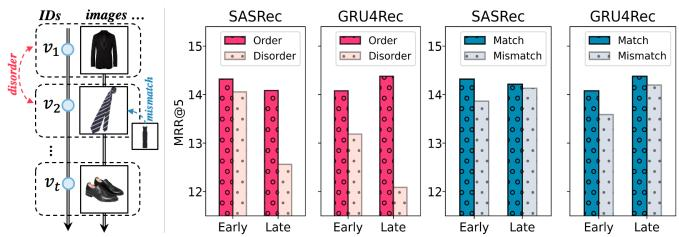
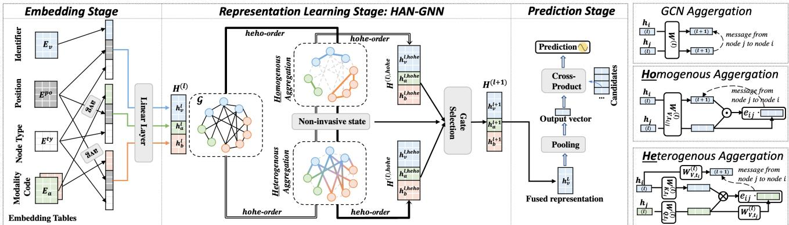
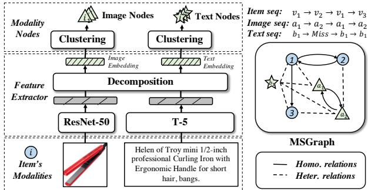
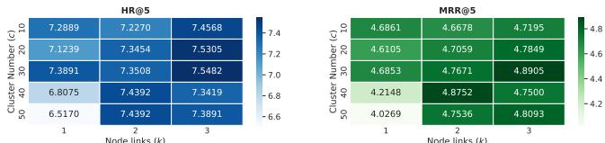
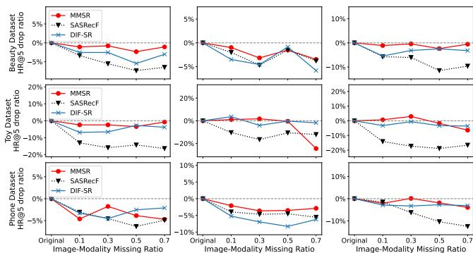

# Adaptive Multi-Modalities Fusion in Sequential Recommendation Systems

Hengchang Hu∗† hengchang.hu@u.nus.edu National University of Singapore Singapore

Yong Liu liu.yong6@huawei.com Huawei Noah’s Ark Lab Singapore

Wei Guo guowei67@huawei.com Huawei Noah’s Ark Lab Singapore

Min-Yen Kan kanmy@comp.nus.edu.sg National University of Singapore Singapore

## ABSTRACT

In sequential recommendation, multi-modal information (e.g., text or image) can provide a more comprehensive view of an item’s profile. The optimal stage (early or late) to fuse modality features into item representations is still debated. We propose a graph-based approach (named MMSR) to fuse modality features in an adap tive order, enabling each modality to prioritize either its inherent sequential nature or its interplay with other modalities. MMSR represents each user’s history as a graph, where the modality fea tures of each item in a user’s history sequence are denoted by cross-linked nodes. The edges between homogeneous nodes represent intra-modality sequential relationships, and the ones be tween heterogeneous nodes represent inter-modality interdepen dence relationships. During graph propagation, MMSR incorporates dual attention, diferentiating homogeneous and heterogeneous neighbors. To adaptively assign nodes with distinct fusion orders, MMSR allows each node’s representation to be asynchronously updated through an update gate. In scenarios where modalities ex hibit stronger sequential relationships, the update gate prioritizes updates among homogeneous nodes. Conversely, when the inter dependent relationships between modalities are more pronounced, the update gate prioritizes updates among heterogeneous nodes. Consequently, MMSR establishes a fusion order that spans a spec trum from early to late modality fusion. In experiments across six datasets, MMSR consistently outperforms state-of-the-art models, and our graph propagation methods surpass other graph neural net works. Additionally, MMSR naturally manages missing modalities. The code is available at: https://github.com/HoldenHu/MMSR.

CCS CONCEPTS

• Information systems → Recommender systems.

∗Work done when the author is a research intern at Huawei Noah’s Ark Lab, Singapore. †Corresponding author.

Sequential Recommendation, Graph Neural Network, Multi-Modal ACM Reference Format: Hengchang Hu, Wei Guo, Yong Liu, and Min-Yen Kan . 2023. Adaptive Multi-Modalities Fusion in Sequential Recommendation Systems. In Proceedings of the 32nd ACM International Conference on Information and Knowledge Management (CIKM ’23), October 21–25, 2023, Birmingham, United Kingdom. ACM, New York, NY, USA, 11 pages. https://doi.org/10.1145/3583780.3614775

## 1 INTRODUCTION

Recommendation systems leverage user–item interactions to predict future user consumption. Collaborative approaches focus on determining similarity between users/items, while sequential approaches uncover sequential patterns among items. Modality information, such as images or text, has been extensively studied in collaborative recommendation [3, 43, 46, 57], but its potential in sequential recommendation (SR) remains largely unexplored. In collaborative recommendation, modalities are represented as high-dimensional feature vectors, which are captured through pretrained models like BERT [9] for texts and ResNet [13] for images. However, incorporating multiple modalities into SR poses two key challenges: (1) Identifying sequential patterns within each modality, as they may exhibit distinct patterns; (2) Capturing the complex interplay between modalities that can influence users’ sequential behavior. For example, many consumers may purchase a suit and then subsequently buy a tie (Figure 1, left). Recognizing meaningful sequential image patterns between suits and ties allows for robust recommendations, independent of specific ID patterns. Moreover, at the item-level, an item is not solely defined by a single modality. Considering diferent images of suits, the interaction between these images and other modalities (e.g., textual descriptions) also plays a role in influencing a user’s selection.

In Sequential Recommendation, existing approaches for merging diferent channels of features include early [19, 25, 39] and late fusion [54], which determine whether merging occurs before or after sequential modeling. However, considering the above challenges, both have limitations — early fusion is less sensitive to the interactions between intra-channel features, while late fusion is less sensitive to the interactions among diferent channels of features.

We conduct a case study as evidence. We utilized both fusion strategies on GRU4Rec [18] and SASRec [22] for pre-experiments on the Amazon dataset [14]. To minimize interference, we had two settings: randomly shufling the item-level sequence (disordered) and maintaining the sequence while randomly displacing certain modalities (mismatched). We found late fusion models are more sensitive to the disordered version (resulting in a significant perfor mance drop). In contrast, early fusion is less sensitive to sequential patterns within each channel. Under mismatched conditions, this reversed, with early fusion experiencing a larger performance drop. This indicates that late fusion is less sensitive to restricted modality matching.

  
Figure 1: Case study on the Amazon-Fashion dataset. Here, Order/Match refers to the original modality sequence, while disordered refers to a shufled item order sequence, and mismatched refers to a condition with displaced modalities.

These findings reveal that fusion order is crucial. While holis tic fusion methods like Trans2D [40] suggest features can be fused without a strict order, they do not address the heterogeneity of feature channels or consider fusion order impact. Therefore, we propose a graph-based holistic fusion method for a flexible modal ity feature fusion. As existing fusion methods target attribute features [28, 49], we introduce our Multi-Modality enriched Sequential Recommendation (MMSR) framework which focuses on modality feature fusion. Our MMSR framework comprises three stages: representation, where item features in each channel are represented as nodes; fusion, which aggregates features from diferent channels using graph techniques; and prediction, which generates the final representations. To overcome the limitations of existing methods, we aim to tackle the aforementioned two challenges by: (1) Preserving modalities’ temporal order during fusion, and (2) Enabling efective interactions between multiple modalities.

We represent each user’s behavior history with a graph, where the modality features of items are nodes. We consider three feature channels: item identifier, visual, and textual modalities. Each graph maintains their temporal order as homogeneous relations while capturing cross-modal interactions as heterogeneous relations. Still, challenges persist in graph construction, aggregation, and updating.

Firstly, in graph construction, treating each modality (such as images) as an individual node will overlook their semantic relat edness. Moreover, given the three channels, the number of nodes in the graph processing will triple, significantly increasing the graph’s sparsity. Secondly, graph nodes and relations are typed. During graph aggregation, simply viewing them as homogeneous nodes and relations results in oversimplification, resulting in poor representation and confusing fusion order (similarly, invasive fea ture fusion across channels also disrupts graph aggregation [28]). Thirdly, naïve graph updating is synchronous for all nodes, unable to support fusion order.

To tackle these issues, we propose solutions. Firstly, to construct graphs, we adopt a similar approach [51] to create compositional embeddings that represent nodes as compositions of smaller groups.

Specifically, we cluster modality features and select the identifiers of the cluster centers as modality codes, which are then treated as new nodes in the graph. This approach ofers a two-fold advantage: reducing overfitting by having fewer modality nodes during training, and establishing links between items by grouping highly similar modalities under the same node. Secondly, for graph aggregation, we employ a dual attention function that distinguishes between homogeneous and heterogeneous nodes’ correlations. This utilizes content-based attention and key-value attention for measurement, respectively. Expanding on this, we propose a non-invasive propagation method that allows homogeneous and heterogeneous neighbors to influence — but not invasively disrupt — each other. Thirdly, for graph updating, in MMSR, each node adaptively chooses the order of fusion through an update gate. This means each node can decide whether to fuse heterogeneous information first followed by homogeneous information, or vice versa.

We experiment across six diverse scenarios, incorporating both image and text modalities as feature sets. In ablation experiments, we found that the optimal order for modality fusion — whether early or late — varies per dataset. Our proposed method, which adaptively determines the fusion order for each node, strikes balance, consistently enhancing the eficacy of fusion. Our MMSR outperforms the state-of-the-art baselines by 8.6% in terms of HR@5 on average, while also exhibiting strong robustness to missing modalities in real-world scenarios. We show that this is because MMSR enables items to search for matching visual or linguistic features, even in the absence of certain text or image nodes, rather than simply replacing missing modalities with default values. MMSR can be scaled beyond two modalities, and thus is practical for diverse real-world multi-modal scenarios.

We summarise our contributions as follows: (i) We spotlight challenges in modality fusion for sequential recommendation, and propose a versatile solution — our MMSR framework. It accommodates both early and late fusion across modalities. (ii) We ofer a graph-centric holistic fusion method as the engine in MMSR, enabling the adaptive selection of fusion order for each feature node. (iii) We conduct comprehensive experiments on six datasets, which show significant gains in both accuracy and robustness.

## 2 RELATED WORK

## 2.1 Multi-modal Recommendation

Multimodal recommendation systems leverage features from various modalities, including textual content [11, 21, 32, 38, 47, 55] and images [6, 7, 31, 33, 34, 44], to enhance item representations. Image feature extraction encompasses signal detectors for color [52] and texture [5]; local feature extractors for detecting objects in coherent regions [5, 12]; and latent feature encoders using pre-trained CNN models [10, 26]. Textual features range from concept-level features (obtained via tools like NER [38] and TextRank [21]), to semantic features from encoders like CNN [11, 55] or BERT [32, 47].

To obtain the final hidden representation, the fusion [56] of modality features can occur either before [15, 29] or after [43, 46] being sent into the feature interaction module. Approaches such as MGAT [43] directly sum the features to disentangle personal interests by modality and aggregate them into the final item representation. MMGCN [46] merges modality-specific graphs through concatenation, but may not fully capture intermodal relations. In contrast, EgoGCN [3] introduces Ego fusion, extending information propagation beyond the unimodal graph to capture relationships between modalities. It aggregates informative intermodal messages from neighboring nodes, generating final representations by com bining multimodal and ID embedding propagation results via con catenation. Despite these advancements, current multi-modal rec ommendation research predominantly targets collaborative tasks, still leaving the use of multi-modality in sequential recommenda tion largely unexplored.

## 2.2 Feature Fusion in Sequential Recommenders

Sequential recommenders (such as GRU- [18], Transformer- [22], or BERT-based [41] models) capture user interests using item ID sequences. To incorporate additional item features (primarily at tribute features), fusion methods are used to integrate them into the overall item representation. These fusion methods can be cate gorized as late, early, or holistic fusion, depending on when feature representations are merged.

In late fusion, sequential relationships within each feature channel are modeled before merging them in a final stage. For example, FDSA [54] separately encodes item and side features using self attention before fusion. Conversely, early fusion integrates feature representations prior to exploring sequential interactions. Early fusion can be invasive or non-invasive. Invasive methods irreversibly merge item IDs with side features through techniques like concatenation [39, 42], addition [19, 41], or gating [25]. As an example, DETAIN [27] uses a 2D approach to handle sequential items’ features, merging feature channels with vertical attention and items with horizontal attention. However, these methods alter the origi nal representations and have documented drawbacks in terms of compound embedding space [28]. Non-invasive approaches do not directly mix item representation with features. For example, NOVA [28] fuses features while maintaining consistency in item represen tation. DIF-SR [49] introduces an attribute-based attention function for fusing items. In contrast, Holistic fusion posits that modality fusion and sequential modeling can proceed without rigid ordering. Trans2D [40] employs 4D attention matrices to gauge item attribute correlations but overlooks the ordering of heterogeneous and ho mogeneous relations. Our work introduces an adaptive method that determines relation application order per node during propagation, providing a more versatile solution.

## 3 PRELIMINARIES

In our problem, the core task is sequential recommendation: Given a user �’s historical interaction data $\mathrm { H } _ { u }$ , the aim is to find a function $f : \mathbf { H } _ { u } \to v$ that predicts the next item � that the user is most likely to consume. In a typical sequential recommendation task, the historical interaction data includes only item ID information; i.e., $\mathbf { H } _ { u } = \{ v _ { 1 } , v _ { 2 } , \ldots \ldots , v _ { m } \}$ . Based on this foundation, modality-enhanced sequential recommendation considers the modality of items in the sequence as well, represented by $\mathbf { H } _ { u } \ = \ \left\{ \mathtt { x } _ { 1 } , \mathtt { x } _ { 2 } , \dotsc , \dotsc , \mathtt { x } _ { m } \right\}$ , where each x is the combination of diferent feature channels of the item (including item identifier and item modalities). In this work, we only consider image and text modalities (although extensible to other modalities), and one instance is represented as $\mathbb { z } _ { i } : \{ v _ { i } , a _ { i } , b _ { i } \}$

Here, $a _ { i }$ and $b _ { i }$ indicate the image and text of item $v _ { i } ,$ respectively. To simplify our discussion, we will refer item ID, image feature, and text feature as three feature channels of modalities; i.e., $v \in \mathcal { N }$ $a \in { \mathcal { A } } .$ and $b \in { \mathcal { B } }$

## 3.1 Base Model

We now discuss the base sequential recommendation model, which we characterize as a 3-tuple of (an Embedding, Representation learning , Prediction).

Initial embedding. The item ID features are represented as integer index values and can be converted into low-dimensional, dense real-value vectors by performing table lookups from an embedding table. For modality embeddings, the commonly-used approach is to directly utilize its extracted features and represent them as a feature vector, through a third-party model [13, 35]. In order to obtain a comprehensive embedding tensor $\mathbf { E } \in \mathcal { R } ^ { 3 \times m \times d }$ of the input features of user history, the feature channels are organized in columns and the sequences are organized in rows.

$$
\mathbf {E} = \left[ \begin{array}{l l l l} \mathbf {e} _ {v _ {1}}, & \mathbf {e} _ {v _ {2}}, & \dots , & \mathbf {e} _ {v _ {m}} \\ \mathbf {e} _ {a _ {1}}, & \mathbf {e} _ {a _ {2}}, & \dots , & \mathbf {e} _ {a _ {m}} \\ \mathbf {e} _ {b _ {1}}, & \mathbf {e} _ {b _ {2}}, & \dots , & \mathbf {e} _ {b _ {m}} \end{array} \right]\tag{1}
$$

Representation learning. Numerous existing works have concentrated on designing network architectures for the purpose of modeling feature interactions, outputting the user representation P. This can be expressed as:

$$
\mathbf {P} = f (\mathbf {E})\tag{2}
$$

For early fusion, the vertical feature channels are fused first, followed by the fusion of the horizontal sequence relationships. For simplicity, we use a linear combination for fusion through channels.

$$
\mathbf {E} _ {i,:} = \sigma (\mathbf {W} (c a t [ \mathbf {E} _ {i, 1}; \mathbf {E} _ {i, 2}; \mathbf {E} _ {i, 3} ]))
$$

$$
\mathbf {P} = \mathcal {M} ([ \mathbf {E} _ {1,:}, \mathbf {E} _ {2,:},..., \mathbf {E} _ {m,:} ])\tag{3}
$$

(4)

For late fusion, the order is reversed and can be formulated as:

$$
\mathbf {E} _ {:, j} = \mathcal {M} ([ \mathbf {E} _ {1, j}, \mathbf {E} _ {2, j},..., \mathbf {E} _ {m, j} ])\tag{5}
$$

$$
\mathbf {P} = \sigma (\mathbf {W} (c a t [ \mathbf {E} _ {:, 1}; \mathbf {E} _ {:, 2}; \mathbf {E} _ {:, 3} ]))\tag{6}
$$

where ���[; ] is the concatenation operation, W is the linear weight parameter, � is the activation function, and M is the models for sequence modeling. In contrast, for holistic fusion, the � will process E as a whole. Trans2D [40] direct applies 2D-attention on E, and our method considers E as node representations in a graph structure.

Prediction. By scoring candidates items $\mathbf { e } _ { v }$ against the learned user representation P using a dot product, we generate the predicted probability scores:

$$
\hat {y} = <   \mathbf {P}, \mathbf {e} _ {v} ^ {\top} >\tag{7}
$$

During training, the model measures and minimizes the diferences between the ground-truth � and the prediction �ˆ through crossentropy loss [22].

## 4 APPROACH

As stated earlier, the fusion order during the representation learning stage is crucial. Current methods fail to balance the extremes of the two orders. To address this, we propose the MMSR framework, which extends the base model and incorporates a graph-based fusion neural network in the representation learning stage to fuse features. After constructing Multi-modal Sequence Graphs for each user, we utilize a dual attention mechanism to independently aggre gate heterogeneous and homogeneous node information, enabling an adaptive merging order that facilitates simultaneous considera tion of both sequential and cross-modal aspects.

## 4.1 Multimodal Sequence Graph Construction

For each user�, we represent his/her history as a graph — a Modalityenriched Sequence Graph (MSGraph), $\mathcal { G } _ { u } = ( N _ { u } , \mathcal { R } , \mathcal { E } _ { u } )$ . Note that each user’s graph $N _ { u }$ and $\varepsilon _ { u }$ can difer. For simplicity, we’ll refer to a single user’s graph, and just represent them as N and $\varepsilon ,$ in the discussion that follows. Figure 3 depicts the construction pipeline. The right side illustrates node construction from modalities, while the left details the edge construction within the MSGraph.

Nodes and their initialization. Each MSGraph should consist of � × 3 nodes (where � is the sequence length), forming the node set N. N encompasses the three types of nodes, representing three dis tinct features of channels: $\{ v _ { 1 } , . . . , v _ { m } \} , \{ a _ { 1 } , . . . , a _ { m } \}$ , and $\{ b _ { 1 } , . . . , b _ { m } \}$ Their representations are associated with the first row (item ID feature), second row (image feature), and third row (text feature) of matrix representation tensor E, respectively.

During node representation initialization, $\mathbf { e } _ { v }$ is randomly initialized. For $\mathbf { e } _ { a }$ and $\mathbf { e } _ { b } { } ;$ , we extract semantic features from the corresponding modality. Our method is not limited to image and text modalities, and for better extension ability, we use separate mod els instead of large visio-linguistic models for feature extraction. Visual features $\mathbf { e } _ { a }$ are obtained from a ResNet-50 [13] model pre trained on ImageNet [8], while textual features $\mathbf { e } _ { b }$ are extracted using a pretrained T-5 model [35]. This scheme can be represented as "modality � ⇒ representation ${ \bf e } _ { a } "$ (the same applies to �).

Node transformation and compositions. According to Hou et al. [20], closely binding text encodings with item representations can be detrimental. Thus, instead of using each modality as an individual node, we introduce “modality codes” [20, 36] as alternative nodes. These nodes correspond to discrete indices obtained by mapping the original modality features. This approach helps alleviate the tight binding between item modality and item representations. The node representations utilize these indices to look up the code embedding table, resulting in a scheme denoted as “modality � ⇒ code $I D _ { a }$ ⇒ representation ${ \bf e } _ { a } \simeq { \bf e } _ { I D _ { a } } { } ^ { \mathrm { w } } .$ . To achieve this, we use a linear autoencoder [2] to condense image/text feature vectors. We then use a K-means [30] to cluster the modality feature vectors by modality type. The indices of cluster centers are used as modality codes $I D _ { a }$ . Initialized representations ${ \bf e } _ { I D _ { a } }$ are derived from these cluster center representations.

We go beyond treating each item modality as an independent index, employing a composition technique. It enables mapping of multiple modalities to a single code, and a single modality to multiple codes. For example, both �1 and $a _ { 2 }$ can share a common modality node in the graph, and $a _ { 1 }$ can correspond to multiple codes represented by $I D _ { a _ { 1 } }$ , as a set of codes. By doing so, we significantly enhance the connectivity of features within each MSGraph. To achieve this, we cluster each channel of modality into � clusters and select the top � nearest centers as the corresponding code set for each individual modality. The selection process is based on cosine similarity between the modality feature vectors and cluster center vectors. Here, � represents a hyperparameter that determines the number of codes each modality is connected to. For brevity, we will refer to the modality codes as modalities.

Edges and Relation Types. In the MSGraphs, we specify the edges as relations $\varepsilon$ between nodes, including homogeneous relations $\varepsilon _ { h o m o }$ and heterogeneous relations $\mathcal { E } _ { h e t e }$ . Both can be formulated as $\mathcal { E } : \left( n _ { s } , r , n _ { o } \right)$ , indicating the relation � between subject node $n _ { s }$ and object node $n _ { o }$ (where both $n \in { \mathcal { N } } )$ . In $\mathcal { E } _ { h o m o } , n _ { s }$ and $n _ { o }$ should be in the same type, such as encompassing items $( v , r , v )$ or modalities $( a , r , a )$ . And the $r \in { \mathcal { R } }$ encompasses 3 types of sequential relations (intra-item or intra-modality): transition-in, transition-out, and bi-directional transitions. The term “transition” refers to the direct adjacent relationship in a sequence. For instance, if Item A is selected immediately before Item B, A to B is a transition-out relation, while B to A is a transition-in. For modalities, we also establish direct connections between adjacent nodes in the sequence order. In case there is a back-and-forth relationship between the two modalities, we label it as a bi-directional relation. In $\mathcal { E } _ { h e t e } , n _ { s }$ and $n _ { o }$ belong to diferent node types, such as $( v , r , a )$ or $( a , r , b )$ . There just exists one type of relation $r ,$ which signifies the correspondence matching between diferent feature channels of the same item. Additionally, in both types of relations, we introduce self-loop relations for each node to preserve its original information.

## 4.2 Node Representation

In MSGraph, each node is assigned an independent representation. However, graphs pose a challenge when modeling sequential tasks as they undermine the inherent sequential nature [4]. This issue is evident when graphs fail to reconstruct sequences due to repeated nodes, particularly as modality codes intensify this repetition. Additionally, the impact of diferent node types on user preferences within a sequence may vary. For example, images may have a more pronounced short-term influence on user preferences than text.

We propose a solution by integrating positional embeddings and node type embeddings into the original initialized representation $\mathbf { e } _ { n }$ for each node. These embeddings map integer indices to low-dimensional dense vectors using separate embedding tables. Specifically, for position embedding of node �, its node type is embedded, yielding vector ${ \bf e } _ { n } ^ { t y }$ . Furthermore, the node’s positions within the sequence are captured by a set of position indices, as modality nodes would take multiple positions. Each position index corresponds to an individual embedding, and the position embedding ${ \bf e } _ { n } ^ { \hat { p } o }$ is obtained by averaging these embeddings. This average vector indicates the position bias of the node towards the beginning or end of the sequence. Finally, the node representation is combined as $\tilde { \mathbf { e } } _ { n } = W [ \mathbf { e } _ { n } ; \mathbf { e } _ { n } ^ { t y } ; \mathbf { e } _ { n } ^ { p o } ]$ , where � is the weight parameter used for merging the concatenated embeddings.

## 4.3 Representation Propagation Layers

Given user graph $\mathcal { G } _ { u } ,$ , the next step involves aggregating the neighbor information for each node. This process can also be interpreted as modal fusion, where the sequential order and interdependencies between modalities are simultaneously taken into account.

  
Figure 2: Overall framework of MMSR (left), and the applied aggregation modules (right). Distinct node types are represented by diferent colors.

  
Figure 3: Modality-enriched graph construction.

4.3.1 Synchronous Graph Neural Networks. The most intuitive idea is to use graph neural networks to synchronously fuse the node information together [16, 37, 43, 46]. Here, synchronously refers to all nodes being updated simultaneously from the previous layer to the next layer, without any specific order. Here, we denote the central node as $n _ { i }$ and its corresponding neighbor set in the graph as $N _ { i }$ . The aggregator updates the representation of each node iteratively from the previous layer $h _ { i } ^ { ( l ) }$ to the next layer $h _ { i } ^ { ( l + 1 ) }$ . Here, $h _ { i } ^ { ( 0 ) }$ is initialized by $\tilde { \mathbf { e } } _ { i }$ . We give examples of the following stateof-the-art graph aggregators as potential candidates to facilitate synchronous information propagation.

• GCN Aggregator [24] takes into account the neighborhood information of a central node and aggregates it using a convolution operation. Its formulation is represented as follows:

$$
h _ {i} ^ {(l + 1)} = \sigma \left(\sum_ {j \in N _ {i}} d (i, j) W ^ {(l)} h _ {j} ^ {(l)}\right)\tag{8}
$$

where � and $W ^ { ( l ) }$ are the activation function and the transformation matrix of layer $l . d ( i , j ) = 1 / \sqrt { | N _ { i } | | N _ { j } | }$ is the normalization factor. We give an illustration in Figure 2 (upper right).

• GAT Aggregator [45] further considers that each neighbor has a diferent impact on the central node, incorporating the attention mechanism to assign varying weights to neighbors:

$$
h _ {i} ^ {(l + 1)} = \sum_ {j \in N _ {i}} \alpha_ {i j} ^ {(l)} h _ {j} ^ {(l)}\tag{9}
$$

where $\alpha _ { i j } ^ { ( l ) }$ represents the attention score between node � and node �. It is calculated by applying softmax to the dot product of a learnable weight vector � and the concatenated representations of nodes � and � after linear transformations $W ^ { ( l ) }$

$$
e _ {i j} ^ {(l)} = a ^ {T} [ W ^ {(l)} h _ {i} ^ {(l)}; W ^ {(l)} h _ {j} ^ {(l)} ]\tag{10}
$$

$$
\alpha_ {i j} ^ {(l)} = s f t (e _ {i j} ^ {(l)} | N _ {i}) = \frac {\exp (\text {LeakyReLU} (e _ {i j} ^ {(l)}))}{\sum_ {k \in N _ {i}} \exp (\text {LeakyReLU} (e _ {i k} ^ {(l)}))}\tag{11}
$$

Here, � is the parameter for calculating the attention score �. For simplicity, we denote the softmax operation as $s f t ( e _ { i j } ^ { ( l ) } | N _ { i } )$

As aggregators are very important for our method’s performance, acting as the modality fusion module, we study the efectiveness of the above aggregators as well as other aggregators in the experiment section (§ 5.2).

4.3.2 Our Graph Neural Network. There are some drawbacks to using the above graph neural networks: Firstly, concerning the 3 types of nodes and 5 types of relations, the heterogeneity of both should be taken into account. Secondly, as stated earlier, the order of fusion matters, thus synchronous updating is not optimal. Some prior modal information may be more beneficial to the corresponding item representation, thus should be merged first. Thirdly, the representations of the item, image, and text nodes are not in the same space, and thus are inappropriate to fuse them directly. The inclusion of diferent modalities can interfere with each other’s representations, resulting in invasive fusion problems [28]. This issue also persists during aggregation. Based on these considerations, we propose an Heterogeneity-aware, Asynchronous, and Non-invasive graph neural network (or HAN-GNN for short).

Heterogeneity-aware. To aggregate homogeneous and heterogeneous neighbor nodes, we employ a divide-and-conquer strategy. For homogeneous nodes $n _ { j } \in N _ { i } ,$ , they represent neighbors that are connected to the central node $n _ { i }$ through edges $( n _ { i } , r , n _ { j } ) \in \mathcal { E } _ { h o m o } .$ with their identical types $t _ { j } = t _ { i }$ (where � belongs to the indices of three channels). For heterogeneous nodes $n _ { j } \in N _ { i }$ with $t _ { j } \neq t _ { i }$ they represent neighbors that difer in type from the central node. These nodes are connected through edges $( n _ { i } , r , n _ { j } ) \in \mathcal { E } _ { h e t e }$ . Unlike GCN/GAT that transform the original hidden vector ℎ into a value vector using � for layer-wise aggregation, our method establishes $W _ { Q } , W _ { K }$ , and �� to transform the original vector into query, key, and value vectors, respectively. Considering three distinct node type �, three sets of parameters $( W _ { Q , t } , W _ { K , t } , W _ { V , t } )$ are designated.

For attention regarding homogeneous nodes, their shared space allows direct comparison. We employ content-based attention for this. Formally, for $( n _ { i } , r , n _ { j } ) \in \mathcal { E } _ { h o m o } ,$ their attention scores are:

$$
e _ {i j} ^ {(l), h o} = a _ {r} (W _ {V, t _ {i}} ^ {(l)} h _ {i} ^ {(l)} \odot W _ {V, t _ {j}} ^ {(l)} h _ {j} ^ {(l)})\tag{12}
$$

where ⊙ is the element-wise production. $t _ { i }$ and $t _ { j }$ indicate the types of�� and $n _ { j }$ respectively, which are identical in this case. It results in $W _ { V , t _ { i } } = W _ { V , t _ { j } }$ . Concerning types of sequential relations in $\delta _ { h o m o } ,$ for each relation � between $n _ { i }$ and $n _ { j }$ , we define an individual parameter $a _ { r }$ for each relation type.

For the attention calculation with respect to heterogeneous nodes, as they are located in diferent spaces, so we employ type-specific transformation matrices $( t _ { j } \neq t _ { i } )$ ) to bring them into a common space for comparison. More specifically, we utilize key–value attention to evaluate the correlations between nodes after their individual transformations. For $( n _ { i } , r , n _ { j } ) \in \mathcal { E } _ { h e t e }$ , the attention scores are:

$$
e _ {i j} ^ {(l), h e} = (W _ {Q, t _ {j}} ^ {(l)} h _ {j} ^ {(l)}) (W _ {K, t _ {i}} ^ {(l)} h _ {i} ^ {(l)}) ^ {\top}\tag{13}
$$

Building on the previously mentioned attention scores, we can independently gather the updated representations that each indi vidually aggregate the two distinct sources of information. These can be succinctly expressed as follows:

$$
h _ {i} ^ {(l + 1), *} = \sum_ {j \in N _ {i}} s f t (e _ {i j} ^ {(l), *} | N _ {i}) (W _ {V, t _ {j}} ^ {(l)} h _ {j} ^ {(l)})\tag{14}
$$

The symbol ∗ denotes either ℎ� or ℎ�, indicating the individual aggregation of homogeneous or heterogeneous information, respectively. This is represented as homogeneous aggregation and heterogeneous aggregation in Figure 2 (right).

Providing information from both sources of neighbors, a direct approach would be to concatenate them and concurrently update this combined representation in the next layer:

$$
h _ {i} ^ {(l + 1)} = \text { Linear } ([ h _ {i} ^ {(l + 1), h o}; h _ {i} ^ {(l + 1), h e} ]),\tag{15}
$$

where ������ indicates a linear layer. We refer to this approach as $\textbf { a } ^ { \ast }$ “synchronous updating” version of our implementation, to be evaluated in our ablation experiments (§ 5.3).

Asynchronous updating. Synchronous updating overlooks the efect of the fusion order. Therefore, we propose an asynchronous updating strategy with two defined updating orders. In every layer �, one could either first aggregate homogeneous infor mation for node updates and then use these updated representations for heterogeneous information aggregation, or vice versa. We term these two distinct updating orders as “homogeneousfirst, heterogeneous-second” (or ℎ�ℎ�) and “heterogeneous-first, homogeneous-second” (ℎ�ℎ�). Taking ℎ�ℎ� as an example, this twophase paradigm can be denoted as $h _ { i } ^ { \backslash \backslash }  h _ { i } ^ { ( l ) , h o }  h _ { i } ^ { \backslash \backslash } , h o h e$ . The first phase $h _ { i } ^ { ( l ) }  h _ { i } ^ { ( l ) , h o }$ uses homogeneous aggregation depicted in Equation 14, but holding the layer number (�) unchanged. The second phase $h _ { i } ^ { ( l ) , h o }  h _ { i } ^ { ( \overline { { { l } } } ) , h o h e }$ follows the heterogeneous aggregation in the Equation 14 but substitutes the input $h _ { i } ^ { ( l ) }$ with the output $h _ { i } ^ { ( l ) , h o }$ from the first phase. Similarly, the ℎ�ℎ� updating $h _ { i } ^ { ( l ) } \to h _ { i } ^ { ( l ) , h e } \to h _ { i } ^ { ( l ) , i }$ ℎ�ℎ� order follows:

As depicted in Figure 2 (left), in HAN-GNN, each node has two potential aggregation routes from its representation $h _ { i } ^ { ( l ) }$ to $h _ { i } ^ { ( l + 1 ) }$ via either the ‘heho’ or ‘hohe’ path. We introduce an update gate to adaptively select the optimal path for each node using the following gate selection mechanism:

$$
\beta = M L P ([ h _ {i} ^ {(l + 1), h o h e}; h _ {i} ^ {(l + 1), h e h o} ]),\tag{16}
$$

$$
h _ {i} ^ {(l + 1)} = \beta_ {0} \times h _ {i} ^ {(l + 1), h o h e} + \beta_ {1} \times h _ {i} ^ {(l + 1), h e h o},\tag{17}
$$

where $M L P$ is a multi-layer perceptron, and $\beta \in \mathbb { R } ^ { 2 }$ contains the scores for gate selection.

Non-invasive fusion. Drawing inspiration from NOVA [28], we employed a non-invasive technique to limit interference among diferent node types during feature updates. For example, although the image features are fused with the item node in Phase 1, they do not actually update it but only use the updated representation for calculating the attention scores in Phase 2.

Let us take the example of $h _ { i } ^ { ( l ) } \to h _ { i } ^ { ( l ) , h e } \to h _ { i } ^ { ( l ) , h e h o }$ to make this concept concrete. In Phase 1, the graph aggregates neighbors’ information from the transformed value vector of $h _ { v } ^ { ( l ) }$ ; while in Phase 2, the aggregation uses the transformed value vector of ${ \bf \ddot { \phi } } _ { h _ { i } } ( l ) , h e$ This implies that the value vector used in the second phase has already undergone a substantial update. Considering the degradation of representations caused by excessive fusion when modeling sequences with heterogeneous information, we introduce a noninvasive approach during graph updating. Specifically, in Phase $^ { 2 , }$ though we calculate the attention based on the intermediate state $h _ { i } ^ { ( l ) , \bar { h e } }$ , we continue to use the value vector of $\cdot { \bf \nabla } _ { h _ { j } ^ { ( l ) } }$ (instead of ${ \bf \ddot { \phi } } _ { h _ { i } } ( l ) , h e _ { \bf \Phi } )$ for aggregation. We posit that non-invasive technique also applies to the converse order for updating (i.e., ℎ�ℎ�). Taking into consideration that each item is an independent entity, the question remains whether to permit the invasive integration of homogeneous contextual information into the fusion of heterogeneous information. We examine this question in our ablation experiments (§ 5.3).

## 4.4 User Interest Representation and Prediction

Following � layers of aggregation, we obtain the final $h _ { v } ^ { ( L ) }$ and set the collection of hidden states of item nodes $\{ h _ { v } ^ { ( L ) } , v \in N _ { v } \}$ forms the output $\mathbf { Z } \in \mathbb { R } ^ { | N _ { v } | \times d }$ , where $N _ { v }$ indicate item ID node set. The resulting $\mathbf { Z }$ can be considered a representation that has undergone modal fusion. Hence, the key lies in the mapping function $\overline { { \mathcal { P } } } : \mathbb { R } ^ { | N _ { v } | \times d } \to \mathbb { R } ^ { d }$ of outputting user representation $\mathbf { P } = \mathcal { P } ( \mathbf { Z } )$ facilitating the next-item prediction. From our observation, using graphs presents a challenge as it tends to diminish the impact of individual items, making it challenging to diferentiate similar sequences. For instance, the graph model may produce similar representations for sequences such as $( v _ { 1 } , v _ { 2 } , v _ { 3 } )$ and $( v _ { 1 } , v _ { 2 } , v _ { 3 } , v _ { 4 } )$ . To address this issue, instead of employing average pooling, we adopt last pooling, where we select the last item from the sequence as the pooled representation. Specifically, we denote it as $\mathbf { P } = \mathbf { Z } _ { | \mathbf { H } _ { u } | }$

## 4.5 Model Comparison & Complexity Analysis

When sequential relationships between modalities are strong, the selection gate prioritizes updates among homogeneous nodes first. Conversely, when interdependent relationships are strong, the gate prioritizes updates among heterogeneous nodes. Thus, our framework can set a fusion order that spans from early to late modality fusion as a spectrum of possibilities, with ℎ�ℎ� representing late fusion and ℎ�ℎ� early fusion.

For complexity comparison, the fused representation from HAN GNN (in the representation learning stage) can be used directly for online inference, matching the base model’s time complexity. The main time cost for model training comes from layer-wise graph networks. Compared to GCN’s complexity of $O ( L | \mathcal { U } | | \mathcal { E } _ { u } | )$ and Graphormer’s [50] $O ( L | \mathcal { U } | | N _ { u } | ^ { 2 } )$ , HAN-GNN takes $O ( 2 L | \mathcal { U } | | \mathcal { E } _ { u } | )$ as there are two phases in each layer propagation. Here, |U| indi cates the number of users, and $| \mathcal { E } _ { u } |$ and $| \mathcal { N } _ { u } |$ indicate the average number of edges and nodes in each user graph, respectively. While our approach is more complex than simpler networks like GCN, it ofers lower complexity compared to yet more complex networks, like Graphormer, while still delivering superior performance. In the user graph, each node connects to its preceding and following nodes in the sequence, and at least 2 other modality nodes. With 4 edges per node, $| \mathcal { E } _ { u } | = O ( 4 | N _ { u } | ) = O ( \frac { 4 } { 3 } | \mathcal { H } _ { u } | )$ , where $\mathcal { H } _ { u }$ signifies the user interaction sequence length. Therefore, our method is more eficient than Graphormer when the user history exceeds $2 \times { \textstyle \frac { 4 } { 3 } } = 2 . 6 6 .$ In typical cases where the average user history length varies between 7 and 9, our method is considerably more eficient.

## 5 EXPERIMENT

Datasets. In line with previous studies [15, 53], we utilized the Amazon review dataset [14] for evaluation. This dataset provides both product descriptions and images, with varying sizes across prod uct categories. To showcase our approach’s versatility, we selected six datasets from diverse categories: Beauty, Clothing, Sport, Toys, Kitchen, and Phone. In these datasets, each review rating signifies a positive user–item interaction. Following the standard practice in prior research [15, 16, 53] and to facilitate fair comparison with ex isting methods, we applied core-5 filtering, which refines the dataset ensuring each user and item has a minimum of five interactions. Dataset details are presented in Table 1.

<table><tr><td></td><td>Beauty</td><td>Clothing</td><td>Sports</td><td>Toys</td><td>Kitchen</td><td>Phone</td></tr><tr><td>User #</td><td>22,363</td><td>39,387</td><td>35,598</td><td>19,412</td><td>27,879</td><td>66,519</td></tr><tr><td>Item #</td><td>12,101</td><td>23,033</td><td>18,357</td><td>11,924</td><td>10,429</td><td>28,237</td></tr><tr><td>Inter. #</td><td>198,502</td><td>278,677</td><td>296,337</td><td>167,597</td><td>194,439</td><td>551,682</td></tr><tr><td>Avg Len. #</td><td>8.88</td><td>7.12</td><td>8.46</td><td>8.79</td><td>7.19</td><td>8.35</td></tr><tr><td>Sparsity</td><td>99.93%</td><td>99.97%</td><td>99.95%</td><td>99.93%</td><td>99.93%</td><td>99.97%</td></tr></table>

Table 1: Dataset Statistics after preprocessing.

Baselines. We compare against three groups of models. (A) Basic SR models include GRU4Rec [18] using Gated Recurrent Units (GRU) to model the sequential dependencies between items; SAS-Rec [22] employing a self-attention mechanism to capture long-term dependencies more efectively; and SR-GNN [48], a graph-based approach, incorporating both user–item interactions and item–item relationships to capture higher-order dependencies in sequential data. (B) Multi-modal collaborative models include MGAT [43] focusing on disentangling personal interests by modality. It employs a graph attention network to integrate information from diferent modalities; MMGCN [46] integrating multimodal features into a graph-based framework. It utilizes a message-passing scheme to learn the representations of users and items; BM3 [57] bootstraping latent contrastive views of user/item representations, optimiz ing multimodal objectives for learning. (C) Feature-enriched SR models include NOVA [28] and DIF-SR [49] as state-of-the-art noninvasive fusion methods; Trans2D [40] as holistic fusion methods. We also used modified versions known as GRU4Rec� (late fusion) and SASRec� (early fusion), based on the GRU4Rec and SASRec models. These determine the best fusion choice for each, as seen in the intro case study.

Evaluation Protocol We follow convention and split each user’s sequence into training and test datasets. Specifically, the last 20% of the sequence is used as the test dataset, and the remaining 80%, training. By pre-filtering sequences with a length of less than 5, we ensure that every user has at least one data point included in the test set. We utilize two commonly-used ranking-based evaluation metrics, hit ratio (HR) and mean reciprocal rank (MRR), to assess performance. Higher values of HR and MRR indicate better model performance.

Parameter Settings. We standardize the embedding dimension to 128 and the batch size to 512, for all models. For hyperparameter tuning, we include learning rates ranging from {1e-1, 1e-2, 1e-3, 1e-4}, �2 regularization values from {0, 1e-1, 1e-2, 1e-3, 1e-4, 1e-5}, and dropout ratios spanning from 0 to 0.9. We employ Adam optimization [23]. In addition, we experimented with layer sizes of {1,2,3,4} for the graph aggregator. , We report average performances from 5 repetitions of each experiment.

## 5.1 Overall Performance

MMSR consistently outperforms other models (Table 2). It shows a significant improvement in HR (8.6% for Top-5, 2.8% for Top-20) and MRR (17.2% for Top-5, 7.6% for Top-20), on average. Our approach of fusing modal features enhances recommendation precision, ranking preferred items higher.

Comparing the basic sequential recommendation baseline with our baseline that includes modalities as side features, the latter is stronger overall. SASRec stands out among the baseline models, demonstrating the excellent performance of attention in sequential recommendation. In contrast, SR-GNN, the existing graphbased baseline, performs poorly, highlighting the superiority of our method in utilizing the graph. Among the sequence recommendation baselines enhanced with modal features, DIF-SR and ${ \mathsf { S A S R e c } } ^ { F }$ perform best, demonstrating that attention efectively enhances early fusion (both invasive and non-invasive). SASRec� adopts an invasive early fusion approach, directly fusing modal representation into item representation. In contrast, DIF-SR uses a non-invasive approach, where modal features are not fully integrated into the item representation vector. However, contrary to previous findings [28], our analysis shows that the invasive approach can be comparatively efective. This can be attributed to our modality codes (from the autoencoder), which introduce a more generalized modality representation for items, instead of too specific representation.

Existing multi-modal recommendation baselines focusing on inter-modality modeling with collaborative signals (MGCN, MGNN, BM3) do not incorporate sequential relationships, resulting in poor performance. It reveals that, for the SR task, besides inter-modality relationships, considering the intra-modality sequential relationships remains vital. Our proposed method fills this gap and is necessary for improving sequence recommendation tasks.

<table><tr><td></td><td>Metric</td><td>GRU4Rec</td><td>SASRec</td><td>SR-GNN</td><td>MMGCN</td><td>MGAT</td><td>BM3</td><td>GRU4Rec $^{F}$ </td><td>SASRec $^{F}$ </td><td>NOVA</td><td>DIF-SR</td><td>Trans2D</td><td>MMSR</td></tr><tr><td rowspan="4">Beauty</td><td>HR@5</td><td>5.6420</td><td>6.1900</td><td>4.1483</td><td>2.6534</td><td>4.0870</td><td>4.8713</td><td>3.7682</td><td>6.4021</td><td>4.2219</td><td>6.5789</td><td>6.0191</td><td>7.1563*</td></tr><tr><td>MRR@5</td><td>3.1110</td><td>3.2165</td><td>2.2123</td><td>1.2534</td><td>2.0297</td><td>2.3349</td><td>2.0793</td><td>3.7990</td><td>2.1785</td><td>4.0735</td><td>3.4387</td><td>4.4429*</td></tr><tr><td>HR@20</td><td>12.7217</td><td>14.0681</td><td>10.2351</td><td>7.0443</td><td>9.1126</td><td>10.2640</td><td>9.4868</td><td>14.0269</td><td>10.7978</td><td>14.0137</td><td>13.2214</td><td>14.1470*</td></tr><tr><td>MRR@20</td><td>3.7714</td><td>3.9668</td><td>2.7911</td><td>1.5263</td><td>2.6714</td><td>3.1945</td><td>2.6006</td><td>4.5073</td><td>2.8160</td><td>4.7983</td><td>3.9460</td><td>5.0433*</td></tr><tr><td rowspan="4">Clothing</td><td>HR@5</td><td>1.3340</td><td>1.5885</td><td>0.8547</td><td>0.5231</td><td>0.9613</td><td>1.2851</td><td>0.9501</td><td>1.8430</td><td>1.2937</td><td>1.5524</td><td>1.3929</td><td>1.8684*</td></tr><tr><td>MRR@5</td><td>0.6765</td><td>0.7820</td><td>0.4555</td><td>0.2128</td><td>0.5470</td><td>0.5460</td><td>0.5212</td><td>0.9470</td><td>0.6503</td><td>0.7961</td><td>0.6682</td><td>1.1365*</td></tr><tr><td>HR@20</td><td>3.8111</td><td>3.9574</td><td>2.7528</td><td>1.7847</td><td>2.7363</td><td>3.5072</td><td>2.8610</td><td>4.2048</td><td>3.4866</td><td>4.0571</td><td>4.0683</td><td>4.4136*</td></tr><tr><td>MRR@20</td><td>0.9418</td><td>1.0339</td><td>0.6251</td><td>0.4359</td><td>0.7548</td><td>0.9045</td><td>0.6955</td><td>1.2814</td><td>0.8783</td><td>1.0530</td><td>1.0391</td><td>1.3344*</td></tr><tr><td rowspan="4">Sport</td><td>HR@5</td><td>2.4388</td><td>2.9549</td><td>2.0742</td><td>1.2020</td><td>2.0418</td><td>2.3096</td><td>1.8929</td><td>3.1063</td><td>2.1539</td><td>2.5145</td><td>2.7168</td><td>3.2657*</td></tr><tr><td>MRR@5</td><td>1.2696</td><td>1.5858</td><td>1.0790</td><td>0.5688</td><td>0.8762</td><td>0.9963</td><td>0.9786</td><td>1.6997</td><td>1.1271</td><td>1.3469</td><td>1.4235</td><td>1.9846*</td></tr><tr><td>HR@20</td><td>6.6430</td><td>7.2208</td><td>5.4376</td><td>3.6492</td><td>5.2197</td><td>5.3184</td><td>5.4834</td><td>7.3683</td><td>5.8062</td><td>7.0774</td><td>6.9453</td><td>7.7466*</td></tr><tr><td>MRR@20</td><td>1.6947</td><td>2.0357</td><td>1.4349</td><td>0.8645</td><td>1.3002</td><td>1.5245</td><td>1.3274</td><td>2.1427</td><td>1.5648</td><td>1.9214</td><td>1.7058</td><td>2.2826*</td></tr><tr><td rowspan="4">Toys</td><td>HR@5</td><td>3.8663</td><td>5.0902</td><td>2.7329</td><td>1.7592</td><td>2.3746</td><td>3.9084</td><td>2.1974</td><td>5.2328</td><td>3.7899</td><td>5.2363</td><td>4.1908</td><td>6.1159*</td></tr><tr><td>MRR@5</td><td>2.0022</td><td>2.7536</td><td>1.4878</td><td>0.7869</td><td>1.1369</td><td>2.0352</td><td>1.1576</td><td>3.0801</td><td>1.9641</td><td>3.1944</td><td>2.2370</td><td>3.8987*</td></tr><tr><td>HR@20</td><td>10.0727</td><td>11.8668</td><td>6.7452</td><td>4.5497</td><td>5.9223</td><td>8.7071</td><td>6.0638</td><td>11.7485</td><td>9.0609</td><td>12.0284</td><td>10.5082</td><td>12.1192*</td></tr><tr><td>MRR@20</td><td>2.7267</td><td>3.4228</td><td>1.8655</td><td>1.1256</td><td>1.5314</td><td>2.5623</td><td>1.5230</td><td>3.6812</td><td>2.4502</td><td>3.8777</td><td>2.9298</td><td>4.3551*</td></tr><tr><td rowspan="4">Kitchen</td><td>HR@5</td><td>1.1759</td><td>1.8012</td><td>1.1024</td><td>0.6671</td><td>1.2225</td><td>1.4399</td><td>1.1323</td><td>1.9077</td><td>1.2558</td><td>1.5828</td><td>1.3463</td><td>2.2145*</td></tr><tr><td>MRR@5</td><td>0.5824</td><td>0.9729</td><td>0.5877</td><td>0.3154</td><td>0.4882</td><td>0.7012</td><td>0.5586</td><td>1.1268</td><td>0.6279</td><td>0.8499</td><td>0.7413</td><td>1.4238*</td></tr><tr><td>HR@20</td><td>3.5640</td><td>4.2021</td><td>3.3255</td><td>2.2404</td><td>3.5206</td><td>3.4157</td><td>3.5449</td><td>4.3187</td><td>3.5332</td><td>4.2766</td><td>3.8158</td><td>4.4535*</td></tr><tr><td>MRR@20</td><td>0.8277</td><td>1.2043</td><td>0.8507</td><td>0.5210</td><td>0.6898</td><td>0.8832</td><td>0.7817</td><td>1.3862</td><td>0.8349</td><td>1.1041</td><td>0.8682</td><td>1.6086*</td></tr><tr><td rowspan="4">Phone</td><td>HR@5</td><td>5.6626</td><td>6.4435</td><td>5.3128</td><td>3.2823</td><td>4.4046</td><td>4.9338</td><td>4.1188</td><td>6.6908</td><td>5.3581</td><td>6.0666</td><td>6.0646</td><td>6.9550*</td></tr><tr><td>MRR@5</td><td>2.8765</td><td>3.4998</td><td>2.7221</td><td>1.4397</td><td>1.8735</td><td>2.3515</td><td>2.0211</td><td>3.6643</td><td>2.7899</td><td>3.2383</td><td>3.0125</td><td>3.9911*</td></tr><tr><td>HR@20</td><td>13.4539</td><td>14.1525</td><td>12.1363</td><td>8.3255</td><td>10.9956</td><td>11.0081</td><td>11.3945</td><td>14.6771</td><td>12.3232</td><td>14.6781</td><td>13.8446</td><td>14.9509*</td></tr><tr><td>MRR@20</td><td>3.7002</td><td>4.3182</td><td>3.4807</td><td>2.0647</td><td>3.0360</td><td>3.2278</td><td>3.0653</td><td>4.5001</td><td>3.5063</td><td>4.2540</td><td>3.8798</td><td>4.5747*</td></tr></table>

Table 2: Overall Performance (%). Bold ones indicate the best performances, while underlined ones indicate the best among baselines. ∗ indicates a statistically significant level -value< 0.05 comparing MMSR with the best baseline.

<table><tr><td rowspan="2">Model</td><td colspan="2">Beauty</td><td colspan="2">Clothing</td><td colspan="2">Sport</td></tr><tr><td>HR@5</td><td>MRR@5</td><td>HR@5</td><td>MRR@5</td><td>HR@5</td><td>MRR@5</td></tr><tr><td>GCN</td><td>5.6348</td><td>3.163</td><td>1.2340</td><td>0.6465</td><td>2.3177</td><td>1.1424</td></tr><tr><td>GraphSAGE</td><td>5.5773</td><td>3.1283</td><td>1.3801</td><td>0.8552</td><td>2.2496</td><td>1.3473</td></tr><tr><td>GAT</td><td>5.7116</td><td>3.1941</td><td>1.4092</td><td>0.8332</td><td>2.3452</td><td>1.3825</td></tr><tr><td>Graphormer</td><td>5.9267</td><td>3.3029</td><td>1.4573</td><td>0.9029</td><td>2.3069</td><td>1.3756</td></tr><tr><td>RGAT</td><td>6.8157</td><td>3.9783</td><td>1.7352</td><td>1.0873</td><td>2.8609</td><td>1.7133</td></tr><tr><td>HGNN</td><td>6.9701</td><td>4.1276</td><td>1.7721</td><td>1.1084</td><td>2.9682</td><td>1.7776</td></tr><tr><td>HGAT</td><td>7.0671</td><td>4.2494</td><td>1.8448</td><td>1.1417</td><td>3.0458</td><td>1.8501</td></tr><tr><td>HAN-GNN</td><td>7.1386</td><td>4.6244</td><td>2.0402</td><td>1.2642</td><td>3.3255</td><td>1.9916</td></tr></table>

Table 3: Graph Aggregator Comparison.

## 5.2 Graph Aggregator Study

In our paper, we designed a graph neural network specifically for integrating multi-modal features. To demonstrate its superi ority over other graph neural networks, we compared it against several popular models, including GCN, GraphSAGE, GAT, and Graphormer, which do not consider heterogeneity; as well as RGAT, which considers heterogeneity in edge types; and HGNN and HGAT, which consider heterogeneity in node types. Table 3 shows that our HAN-GNN method consistently outperforms other approaches. When comparing GAT and Graphormer, incorporating Transformer structures into graph neural networks is efective over traditional content-based attention. In MSGraph, incorporating heterogeneity in modality-enriched graphs leads to significant performance im provements compared to models that do not consider heterogeneity Further comparing HGNN and RGAT, we find that the heterogeneity of nodes is more important, particularly in distinguishing modality information from item node information. Thus, our non-invasive approach is more efective in handling heterogeneous information.

## 5.3 Ablation Study

To better understand the superiority of our approach, we conducted an ablation study on HAN-GNN.In Table 4, ℎ� and ℎ� signify HAN-GNN propagation solely through homogeneous or heterogeneous relations, respectively. ℎ�ℎ� signifies the use of Homo–Hetero Ordering Fusion, while ℎ�ℎ� represents Hetero–Homo Ordering Fusion. “NI” signifies the non-invasive fusion ordering for each of them. “Synchronous” refers to Equation 15, which simply concatenates and linearly transforms homogeneous and heterogeneous information.

Examining the fusion ofℎ� and ℎ� only, we found that the Sport dataset performs better when considering homogeneous relationships, while the Beauty and Clothing datasets benefit more from considering only heterogeneous information. This suggests that users in the latter scenarios rely more on either visual or textual information for ordering decisions, while this is not the case in the Sport dataset. Regarding fusion order, for invasive fusion, fusing homogeneous information before heterogeneous information (ℎ�ℎ�) consistently yields better performance, comparing ℎ�ℎ�. However, for non-invasive fusion, the diference between order ��(ℎ�ℎ�) and ��(ℎ�ℎ�) is not significant. This suggests that under invasive fusion, early fusion of heterogeneous attributes may disrupt the original item representation; but that non-invasive fusion alleviates this issue. Furthermore, considering both fusion orders simultaneously (synchronous fusion) does not perform as well as each order separately. However, our asynchronous update method (final HAN-GNN model) significantly improves performance compared to considering each order separately. In another words, our HAN-GNN model outperforms both fusion orders individually.

<table><tr><td rowspan="2">Model</td><td colspan="2">Beauty</td><td colspan="2">Clothing</td><td colspan="2">Sport</td></tr><tr><td>HR@5</td><td>MRR@5</td><td>HR@5</td><td>MRR@5</td><td>HR@5</td><td>MRR@5</td></tr><tr><td>HAN-GNN</td><td>7.1386</td><td>4.6244</td><td>2.0402</td><td>1.2642</td><td>3.3255</td><td>1.9916</td></tr><tr><td>Synchronous</td><td>6.8912</td><td>4.4515</td><td>1.7857</td><td>1.0681</td><td>3.0924</td><td>1.7849</td></tr><tr><td>NI(hohe)</td><td>6.8900</td><td>4.4616</td><td>1.9999</td><td>1.2357</td><td>3.0616</td><td>1.8792</td></tr><tr><td>NI(heho)</td><td>6.8897</td><td>4.5528</td><td>1.3932</td><td>0.7655</td><td>3.0087</td><td>1.7051</td></tr><tr><td>hohe</td><td>6.8971</td><td>4.4245</td><td>1.9575</td><td>1.2169</td><td>3.0565</td><td>1.8793</td></tr><tr><td>heho</td><td>6.5406</td><td>4.3117</td><td>1.1495</td><td>0.6398</td><td>2.8871</td><td>1.6654</td></tr><tr><td>ho</td><td>6.6702</td><td>4.1004</td><td>1.6012</td><td>0.9069</td><td>3.0306</td><td>1.7412</td></tr><tr><td>he</td><td>6.9354</td><td>4.446</td><td>1.9957</td><td>1.2236</td><td>3.0047</td><td>1.8648</td></tr><tr><td>w/o e $^{po}$ </td><td>6.9664</td><td>4.5653</td><td>2.0665</td><td>1.2581</td><td>3.1547</td><td>1.8968</td></tr><tr><td>w/o e $^{ty}$ </td><td>6.9390</td><td>4.5074</td><td>2.0370</td><td>1.2593</td><td>3.2112</td><td>1.9854</td></tr></table>

Table 4: Ablation analysis, evaluated with (HR, MRR)@5. The relation ablation is based on a GCN aggregator.

  
Figure 4: MMSR robustness against missing modalities.  
Figure 5: The performance comparison with diferent MS-Graph construction parameters on the Beauty dataset.

We also find removing either position embedding e�� or node type embedding $\mathbf { e } ^ { t y }$ in the representation stage noticeably deteriorates performance, validating the importance of retaining sequence and node type information in graph approaches.

## 5.4 Robustness to Missing Modalities

Missing modalities are a common issue in real-world applications, and the traditional approach of filling missing features with default values is fragile. Our method addresses this by utilizing graphs, which naturally handle missing modality nodes. Instead of replacing them with defaults, we simply remove such nodes from the graph. We also incorporate global attention during node aggregation to ensure that modality-specific item nodes are aware of relevant modal nodes in the sequence.

In Figure 4, we compare the robustness of our method (MMSR) with the best-performing baselines, SASRecF and DIF-SR. The “Im-$a g e ^ { \mathfrak { s } } / ^ { \mathfrak { s } } T e x t ^ { \mathfrak { s } } / ^ { \mathfrak { s } } M i x ^ { \mathfrak { s } }$ indicates the percentage of missing image fea tures, text features, or both. We selected a missing ratio (�) between 0.1 and 0.7 for analysis. MMSR shows robustness in scenarios with missing modalities (with � in $0 . 1 \sim 0 . 5 )$ , even achieving improvements under certain degrees of missing modalities.This is akin to adversarial training [17] where the introduction of a low level of noise enhances performance. When significant modality information is lost $( e = 0 . 7 )$ , all methods show a substantial performance drop, highlighting the critical role of modality features. For mixed missing modalities, MMSR is consistently more stable than other approaches. However, for text missing in Toy dataset and image missing in Phone dataset, MMSR’s stability varies. This suggests that text and image nodes are more important modalities – phones with comparable designs or toys with analogous textual descriptions indicate stronger associations – respectively, in these datasets.

## 5.5 Modality-enriched Graph Construction

Constructing a graph from a user’s historical sequence can be challenging, as having too many modality nodes can result in an overly sparse graph. We thus compare diferent settings within our graph construction method (using a modality code set and soft links between original modalities and modality codes to improve the graph density). The x-axis represents the cluster number (i.e., the number of modality codes), while the y-axis represents the number of codes corresponding to an original modality $( \mathrm { i } . \mathrm { e } _ { . , k } )$ ).

We see that using modality codes achieves better performance over not using modality codes (compare HR@5: 7.4263, MRR@5: 4.7469 to results in Figure 5). Secondly, we observed that a larger value of � does not necessarily lead to better performance, as the optimal point is typically between 20 and 30. As � increases, the optimal value of � increases accordingly. Finally, the utilization of modality codes is consistent with the findings of previous studies [20, 36], which demonstrated their positive impact on performance.

## 6 CONCLUSION AND FUTURE WORK

We introduce a Multi-Modality enriched Sequential Recommendation framework while optimally fuses modality features in sequential recommendation. Our approach tackles the complexity of fusing multi-modalities in sequential tasks, where fusion order notably influences the recommendation model performance. To drive MMSR, we develop a novel graph aggregation mechanism (HAN-GNN) that employs a dual graph attention network and asynchronous updating strategy. HAN-GNN flexibly integrates modality information while preserving sequential relationships. MMSR consistently outperforms state-of-the-art baselines, even under challenging missing-modality scenarios. This makes it a flexible and robust solution for real-world applications.

MMSR is easily extensible, allowing for expansion to additional modalities. We are optimistic about its utility in industrial contexts. Furthermore, exploring the interpretability of complex modal relationships in modality-enriched SR opens up new horizons for future research. Unraveling how and when sequentiality or interdependent relationships become pivotal could lead to more nuanced and eficient recommendation.

## ACKNOWLEDGMENTS

We thank the new deep learning computing framework Mind-Spore [1] for the partial support of this work.

## REFERENCES

[1] 2020. MindSpore. https://www.mindspore.cn.

[2] Pierre Baldi and Kurt Hornik. 1989. Neural networks and principal component analysis: Learning from examples without local minima. Neural networks 2, 1 (1989), 53–58.

[3] Feiyu Chen, Junjie Wang, Yinwei Wei, Hai-Tao Zheng, and Jie Shao. 2022. Breaking Isolation: Multimodal Graph Fusion for Multimedia Recommendation by Edge-wise Modulation. In Proceedings of the 30th ACM International Conference on Multimedia. 385–394.

[4] Tianwen Chen and Raymond Chi-Wing Wong. 2020. Handling information loss of graph neural networks for session-based recommendation. In Proceedings of the 26th ACM SIGKDD International Conference on Knowledge Discovery & Data Mining. 1172–1180.

[5] Heng-Yu Chi, Chun-Chieh Chen, Wen-Huang Cheng, and Ming-Syan Chen. 2016. UbiShop: Commercial item recommendation using visual part-based object representation. Multimedia Tools and Applications 75 (2016), 16093–16115.

[6] Yashar Deldjoo, Mihai Gabriel Constantin, Hamid Eghbal-Zadeh, Bogdan Ionescu, Markus Schedl, and Paolo Cremonesi. 2018. Audio-visual encoding of multimedia content for enhancing movie recommendations. In Proceedings ofthe 12th ACM Conference on Recommender Systems. 455–459.

[7] Yashar Deldjoo, Tommaso Di Noia, Daniele Malitesta, and Felice Antonio Merra. 2021. A study on the relative importance of convolutional neural networks in visually-aware recommender systems. In Proceedings of the IEEE/CVF Conference on Computer Vision and Pattern Recognition. 3961–3967.

[8] Jia Deng, Wei Dong, Richard Socher, Li-Jia Li, Kai Li, and Li Fei-Fei. 2009. Imagenet: A large-scale hierarchical image database. In 2009 IEEE conference on computer vision and pattern recognition. Ieee, 248–255.

[9] Jacob Devlin, Ming-Wei Chang, Kenton Lee, and Kristina Toutanova. 2018. Bert: Pre-training ofdeep bidirectional transformers for language understanding. arXiv preprint arXiv:1810.04805 (2018).

[10] Xue Geng, Hanwang Zhang, Jingwen Bian, and Tat-Seng Chua. 2015. Learning image and user features for recommendation in social networks. In Proceedings of the IEEE international conference on computer vision. 4274–4282.

[11] Yuyun Gong and Qi Zhang. 2016. Hashtag recommendation using attention-based convolutional neural network.. In IJCAI. 2782–2788.

[12] Xiaoling Gu, Lidan Shou, Pai Peng, Ke Chen, Sai Wu, and Gang Chen. 2016. iGlasses: A novel recommendation system for best-fit glasses. In Proceedings ofthe 39th International ACM SIGIR conference on research and development in information retrieval. 1109–1112.

[13] Kaiming He, Xiangyu Zhang, Shaoqing Ren, and Jian Sun. 2016. Deep residual learning for image recognition. In Proceedings ofthe IEEE conference on computer vision and pattern recognition. 770–778.

[14] Ruining He and Julian McAuley. 2016. Ups and downs: Modeling the visual evolution of fashion trends with one-class collaborative filtering. In proceedings ofthe 25th international conference on world wide web. 507–517.

[15] Ruining He and Julian McAuley. 2016. VBPR: visual bayesian personalized ranking from implicit feedback. In Proceedings ofthe AAAI conference on artificial intelligence, Vol. 30.

[16] Xiangnan He, Kuan Deng, Xiang Wang, Yan Li, Yongdong Zhang, and Meng Wang. 2020. Lightgcn: Simplifying and powering graph convolution network for recommendation. In Proceedings ofthe 43rd International ACM SIGIR conference on research and development in Information Retrieval. 639–648.

[17] Xiangnan He, Zhankui He, Xiaoyu Du, and Tat-Seng Chua. 2018. Adversarial personalized ranking for recommendation. In The 41st International ACM SIGIR conference on research & development in information retrieval. 355–364.

[18] Balázs Hidasi, Alexandros Karatzoglou, Linas Baltrunas, and Domonkos Tikk. 2015. Session-based recommendations with recurrent neural networks. arXiv preprint arXiv:1511.06939 (2015).

[19] Balázs Hidasi, Massimo Quadrana, Alexandros Karatzoglou, and Domonkos Tikk. 2016. Parallel recurrent neural network architectures for feature-rich session-based recommendations. In Proceedings of the 10th ACM conference on recommender systems. 241–248.

[20] Yupeng Hou, Zhankui He, Julian McAuley, and Wayne Xin Zhao. 2023. Learning vector-quantized item representation for transferable sequential recommenders. In Proceedings of the ACM Web Conference 2023. 1162–1171.

[21] Hengchang Hu, Liangming Pan, Yiding Ran, and Min-Yen Kan. 2022. Modeling and Leveraging Prerequisite Context in Recommendation. CARS@RecSys (2022).

[22] Wang-Cheng Kang and Julian McAuley. 2018. Self-attentive sequential recom mendation. In 2018 IEEE international conference on data mining (ICDM). IEEE, 197–206.

[23] Diederik P Kingma and Jimmy Ba. 2014. Adam: A method for stochastic opti mization. arXiv preprint arXiv:1412.6980 (2014).

[24] Thomas N Kipf and Max Welling. 2016. Semi-supervised classification with graph convolutional networks. arXiv preprint arXiv:1609.02907 (2016).

[25] Chenyi Lei, Shouling Ji, and Zhao Li. 2019. Tissa: A time slice self-attention ap proach for modeling sequential user behaviors. In The World Wide Web Conference. 2964–2970.

[26] Xingchen Li, Xiang Wang, Xiangnan He, Long Chen,Jun Xiao, and Tat-Seng Chua. 2020. Hierarchical fashion graph network for personalized outfit recommendation. In Proceedings ofthe 43rd International ACM SIGIR Conference on Research and Development in Information Retrieval. 159–168.

[27] Kun Lin, Zhenlei Wang, Shiqi Shen, Zhipeng Wang, Bo Chen, and Xu Chen. 2022. Sequential Recommendation with Decomposed Item Feature Routing. In Proceedings ofthe ACM Web Conference 2022. 2288–2297.

[28] Chang Liu, Xiaoguang Li, Guohao Cai, Zhenhua Dong, Hong Zhu, and Lifeng Shang. 2021. Noninvasive self-attention for side information fusion in sequential recommendation. In Proceedings ofthe AAAI Conference on Artificial Intelligence, Vol. 35. 4249–4256.

[29] Fan Liu, Zhiyong Cheng, Changchang Sun, Yinglong Wang, Liqiang Nie, and Mohan Kankanhalli. 2019. User diverse preference modeling by multimodal attentive metric learning. In Proceedings ofthe 27th ACM international conference on multimedia. 1526–1534.

[30] Stuart Lloyd. 1982. Least squares quantization in PCM. IEEE transactions on information theory 28, 2 (1982), 129–137.

[31] Hangzai Luo, Jianping Fan, and Daniel A Keim. 2008. Personalized news video recommendation. In Proceedings of the 16th ACM international conference on Multimedia. 1001–1002.

[32] Itzik Malkiel, Oren Barkan, Avi Caciularu, Noam Razin, Ori Katz, and Noam Koenigstein. 2020. RecoBERT: A catalog language model for text-based recommendations. arXiv preprint arXiv:2009.13292 (2020).

[33] Wei Niu, James Caverlee, and Haokai Lu. 2018. Neural personalized ranking for image recommendation. In Proceedings ofthe eleventh ACM international conference on web search and data mining. 423–431.

[34] Sergio Oramas, Vito Claudio Ostuni, Tommaso Di Noia, Xavier Serra, and Euge nio Di Sciascio. 2016. Sound and music recommendation with knowledge graphs. ACM Transactions on Intelligent Systems and Technology (TIST) 8, 2 (2016), 1–21.

[35] Colin Rafel, Noam Shazeer, Adam Roberts, Katherine Lee, Sharan Narang, Michael Matena, Yanqi Zhou, Wei Li, and Peter J Liu. 2020. Exploring the limits of transfer learning with a unified text-to-text transformer. The Journal ofMachine Learning Research 21, 1 (2020), 5485–5551.

[36] Shashank Rajput, Nikhil Mehta, Anima Singh, Raghunandan Keshavan, Trung Vu, Lukasz Heldt, Lichan Hong, Yi Tay, Vinh Q Tran, Jonah Samost, et al. 2018. Recommender Systems with Generative Retrieval. (2018).

[37] Yiding Ran, Hengchang Hu, and Min-Yen Kan. 2022. PM K-LightGCN: Optimizing for Accuracy and Popularity Match in Course Recommendation. In Workshop of Multi-Objective Recommender Systems (MORS’22), in conjunction with the 16th ACM Conference on Recommender Systems, RecSys, Vol. 22. 2022.

[38] Delip Rao, Paul McNamee, and Mark Dredze. 2013. Entity linking: Finding extracted entities in a knowledge base. Multi-source, multilingual information extraction and summarization (2013), 93–115.

[39] Ahmed Rashed, Shereen Elsayed, and Lars Schmidt-Thieme. 2022. Context and Attribute-Aware Sequential Recommendation via Cross-Attention. In Proceedings ofthe 16th ACM Conference on Recommender Systems. 71–80.

[40] Uriel Singer, Haggai Roitman, Yotam Eshel, Alexander Nus, Ido Guy, Or Levi, Idan Hasson, and Eliyahu Kiperwasser. 2022. Sequential modeling with multiple attributes for watchlist recommendation in e-commerce. In Proceedings of the Fifteenth ACM International Conference on Web Search and Data Mining. 937–946.

[41] Fei Sun, Jun Liu, Jian Wu, Changhua Pei, Xiao Lin, Wenwu Ou, and Peng Jiang. 2019. BERT4Rec: Sequential recommendation with bidirectional encoder representations from transformer. In Proceedings of the 28th ACM international conference on information and knowledge management. 1441–1450.

[42] Jiaxi Tang and Ke Wang. 2018. Personalized top-n sequential recommendation via convolutional sequence embedding. In Proceedings ofthe eleventh ACM international conference on web search and data mining. 565–573.

[43] Zhulin Tao, Yinwei Wei, Xiang Wang, Xiangnan He, Xianglin Huang, and Tat-Seng Chua. 2020. Mgat: Multimodal graph attention network for recommendation. Information Processing & Management 57, 5 (2020), 102277.

[44] Aaron Van den Oord, Sander Dieleman, and Benjamin Schrauwen. 2013. Deep content-based music recommendation. Advances in neural information processing systems 26 (2013).

[45] Petar Velickovic, Guillem Cucurull, Arantxa Casanova, Adriana Romero, Pietro Lio, Yoshua Bengio, et al. 2017. Graph attention networks. stat 1050, 20 (2017), 10–48550.

[46] Yinwei Wei, Xiang Wang, Liqiang Nie, Xiangnan He, Richang Hong, and Tat-Seng Chua. 2019. MMGCN: Multi-modal graph convolution network for personalized recommendation of micro-video. In Proceedings ofthe 27th ACM international conference on multimedia. 1437–1445.

[47] Chuhan Wu, Fangzhao Wu, Tao Qi, Chao Zhang, Yongfeng Huang, and Tong Xu. 2022. MM-Rec: Visiolinguistic Model Empowered Multimodal News Recommendation. In Proceedings ofthe 45th International ACM SIGIR Conference on Research and Development in Information Retrieval. 2560–2564.

[48] Shu Wu, Yuyuan Tang, Yanqiao Zhu, Liang Wang, Xing Xie, and Tieniu Tan. 2019. Session-based recommendation with graph neural networks. In Proceedings of the AAAI conference on artificial intelligence, Vol. 33. 346–353.

[49] Yueqi Xie, Peilin Zhou, and Sunghun Kim. 2022. Decoupled side information fusion for sequential recommendation. In Proceedings ofthe 45th International ACM SIGIR Conference on Research and Development in Information Retrieval. 1611–1621.

[50] Chengxuan Ying, Tianle Cai, Shengjie Luo, Shuxin Zheng, Guolin Ke, Di He, Yanming Shen, and Tie-Yan Liu. 2021. Do transformers really perform badly for graph representation? Advances in Neural Information Processing Systems 34 (2021), 28877–28888.

[51] Mo Yu, Matthew Gormley, and Mark Dredze. 2014. Factor-based compositiona embedding models. In NIPS Workshop on Learning Semantics. 95–101.

[52] Wenhui Yu, Huidi Zhang, Xiangnan He, Xu Chen, Li Xiong, and Zheng Qin. 2018. Aesthetic-based clothing recommendation. In Proceedings ofthe 2018 world wide web conference. 649–658.

[53] Jinghao Zhang, Yanqiao Zhu, Qiang Liu, Shu Wu, Shuhui Wang, and Liang Wang. 2021. Mining latent structures for multimedia recommendation. In Proceedings

ofthe 29th ACM International Conference on Multimedia. 3872–3880.

[54] Tingting Zhang, Pengpeng Zhao, Yanchi Liu, Victor S Sheng, Jiajie Xu, Deqing Wang, Guanfeng Liu, Xiaofang Zhou, et al. 2019. Feature-level Deeper Self Attention Network for Sequential Recommendation.. In IJCAI. 4320–4326.

[55] Lei Zheng, Vahid Noroozi, and Philip S Yu. 2017. Joint deep modeling of users and items using reviews for recommendation. In Proceedings ofthe tenth ACM international conference on web search and data mining. 425–434.

[56] Hongyu Zhou, Xin Zhou, Zhiwei Zeng, Lingzi Zhang, and Zhiqi Shen. 2023. A Comprehensive Survey on Multimodal Recommender Systems: Taxonomy, Evaluation, and Future Directions. arXiv preprint arXiv:2302.04473 (2023).

[57] Xin Zhou, Hongyu Zhou, Yong Liu, Zhiwei Zeng, Chunyan Miao, Pengwei Wang, Yuan You, and FeijunJiang. 2023. Bootstrap latent representations for multi-modal recommendation. In Proceedings ofthe ACM Web Conference 2023. 845–854.