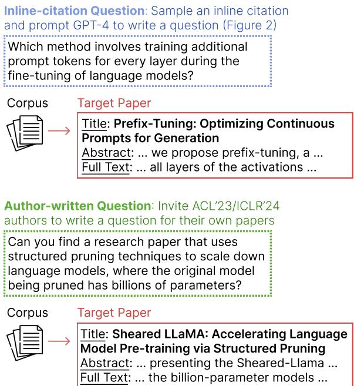
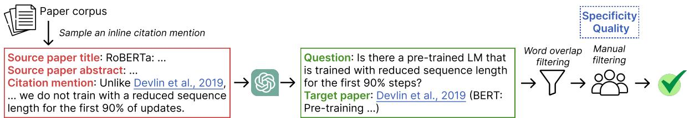
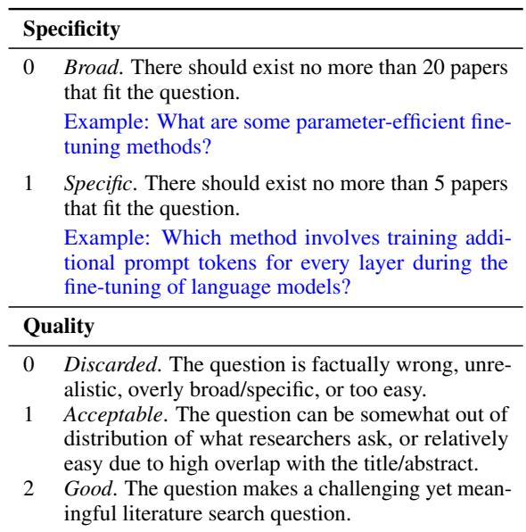
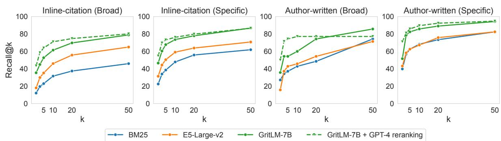
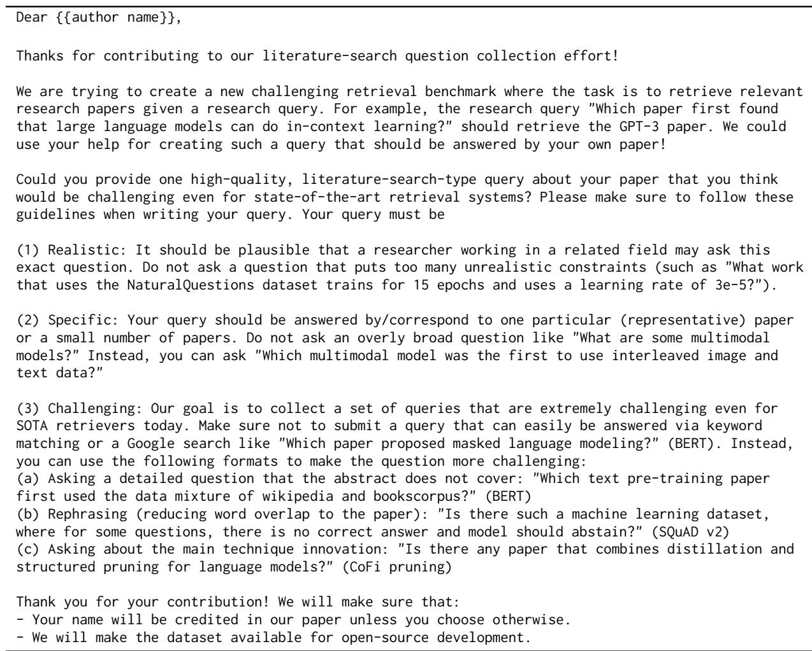
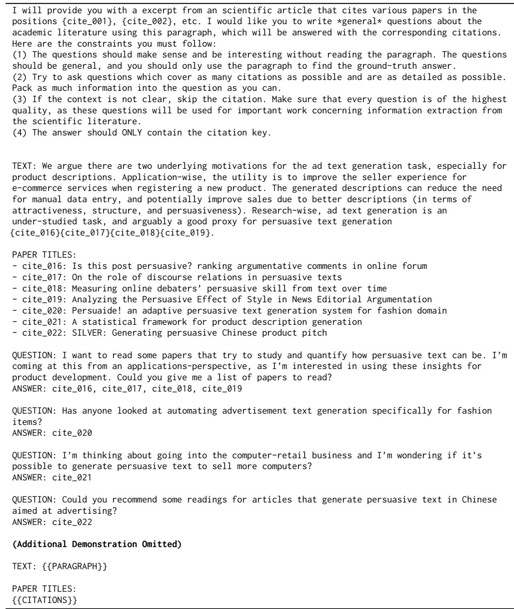
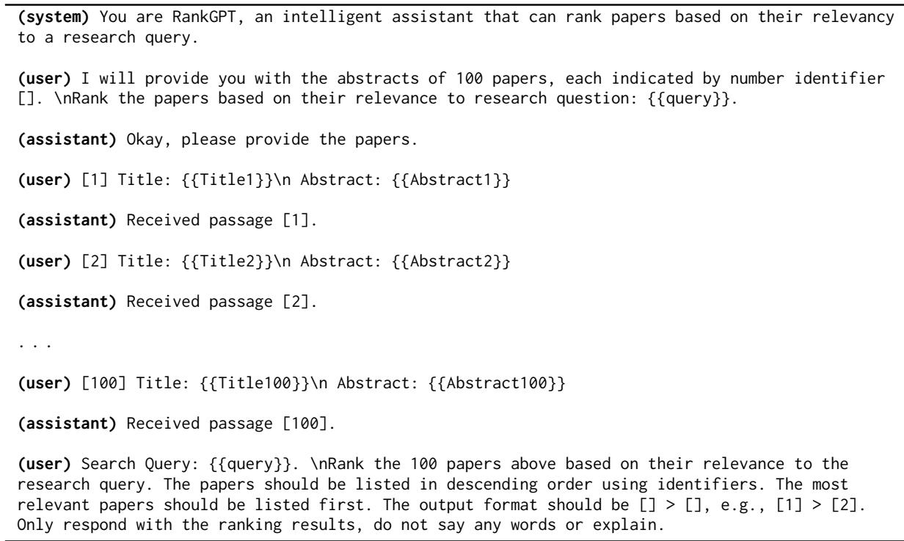

# LitSearch: A Retrieval Benchmark for Scientific Literature Search

Anirudh Ajith<sup>1</sup> Mengzhou Xia<sup>1</sup> Alexis Chevalier<sup>1,2</sup> Tanya Goyal<sup>1</sup>

Danqi Chen<sup>1</sup> Tianyu Gao<sup>1</sup>

<sup>1</sup>Princeton Language and Intelligence (PLI), Princeton University <sup>2</sup>BCG X {anirudh.ajith,mengzhou,achevalier,tanyagoyal, danqic,tianyug}@princeton.edu

## Abstract

Literature search questions, such as “Where can I find research on the evaluation of consistency in generated summaries?” pose significant challenges for modern search engines and retrieval systems. These questions often require a deep understanding of research concepts and the ability to reason across entire articles. In this work, we introduce LitSearch, a retrieval benchmark comprising 597 realistic literature search queries about recent ML and NLP papers. Lit-Search is constructed using a combination of (1) questions generated by GPT-4 based on paragraphs containing inline citations from research papers and (2) questions manually written by authors about their recently published papers. All LitSearch questions were manually examined or edited by experts to ensure high quality. We extensively benchmark state-ofthe-art retrieval models and also evaluate two LLM-based reranking pipelines. We find a significant performance gap between BM25 and state-of-the-art dense retrievers, with a 24.8% absolute difference in recall@5. The LLMbased reranking strategies further improve the best-performing dense retriever by 4.4%. Additionally, commercial search engines and research tools like Google Search perform poorly on LitSearch, lagging behind the best dense retriever by up to 32 recall points. Taken together, these results show that LitSearch is an informative new testbed for retrieval systems while catering to a real-world use case.<sup>1</sup>

## 1 Introduction

Finding literature via a specific search query—for example, collecting related work, checking if a method has been proposed before, or recalling a previously seen paper—is a critical task for researchers. Developing systems that recommend citations pertinent to such inquiries holds the po tential to enhance researchers’ productivity and expedite scientific discovery (Färber and Jatowt, 2020). However, this task is inherently challenging as it often requires deep domain expertise and reasoning through lengthy papers.

  
Figure 1: Examples of inline-citation and author-written questions from LitSearch. These questions are often challenging and require a deep understanding of the target papers to answer correctly.

Prior to this study, the task of citation recommendation was often formalized by using inline citation mentions from existing papers as queries, and the cited papers as targets (He et al., 2010; Gu et al., 2022). For instance, given the citation mention “RoBERTa and T5 are based on recent advances in masked language modeling [citation],” the text surrounding the citation mention is used as a retrieval query, and the cited paper is the target literature. However, directly using inline citations often leads to queries that are noisy, overly broad (e.g., “Large Language Models [citation]”), or highly context-dependent (e.g., “We follow the hyperparameters of [citation]”).

  
Figure 2: The pipeline for generating inline-citation questions. We first sample a citation mention and prompt GPT-4 to generate a question. Next, we filter questions based on word overlap with the target paper title and perform manual inspections to annotate their specificity and quality (see rubrics in Table 1).

In this work, we propose a new literature retrieval benchmark called LitSearch. As illustrated in Figure 1, a literature search question seeks papers that meet specific criteria, closely reflecting actual research workflows. LitSearch consists of two subsets: (1) For inline-citation questions, we sample citation mentions from a collection of scientific papers and use GPT-4 (OpenAI, 2023) to rewrite them into literature search questions (Figure 2). We retain questions with a low word overlap with the title of the target papers, and perform manual examination to ensure high quality. (2) For author-written questions, we invited authors of ACL 2023 and ICLR 2024 papers to write literature search questions for their own papers. This subset is also manually examined and filtered to remove any inaccurate or easy questions. LitSearch contains 597 questions in total, each paired with one or more scientific papers as the ground truth.

LitSearch has several unique characteristics: (1) To the best of our knowledge, LitSearch is the first dataset featuring realistic literature search questions, providing a new testbed for citation recommendation and retrieval systems. (2) LitSearch is challenging, requiring deep understanding and reasoning over entire articles. The average document length (6,041/134 words for full texts/titles and abstracts) is significantly longer than that of most existing retrieval benchmarks (e.g., 56 for (Nguyen et al., 2017)). (3) LitSearch is of high quality, with all questions manually examined by the authors.

We conduct extensive experiments on both stateof-the-art retrieval models and reranking with large language models (LLMs). On LitSearch, the best dense retrieval model, GritLM (Muennighoff et al., 2024), achieves an average recall@5 of 74.8%, outperforming BM25 (Robertson et al., 2009) by 24.8%. The recall@5 of GritLM is further improved by 4.4% with GPT-4o reranking. On the other hand, commercial search engines and research tools like Google Search perform poorly on this task, only achieving an average recall@5 of 42.8% at most. Furthermore, compared to existing retrieval datasets from BEIR (Thakur et al., 2021) and MTEB (Muennighoff et al., 2022), Lit-Search effectively reflects the performance differences among various embedding models, making it an informative testbed for evaluating state-of-theart retrieval systems.

## 2 LitSearch

Our benchmark LitSearch consists of (a) a large corpus of scientific papers P and (b) pairs of literature search questions and one or more target papers from P. Our desiderata are scientific questions that researchers may use while conducting literature surveys. We use two different strategies to collect such questions: (1) we construct questions using the surrounding context from inline citations in published papers (Section 2.1), and (2) we invited the authors of recent conference publications to manually write questions about their own papers (Section 2.2). For both subsets, we ensure high question quality via manual inspection and filtering conducted by the authors of this work (Section 2.3).

## 2.1 Inline-citation Questions

We define the following concepts for the ease of description: (a) An inline citation mention is a paragraph from the main text of a paper that mentions another paper. For example, this paragraph from the RoBERTa paper (Liu et al., 2019), “... Unlike Devlin et al., (2019), ... we do not train with a reduced sequence length for the first 90% of updates ...” mentions the BERT paper (Devlin et al., 2019). (b) The source paper is the paper the inline citation mention is sampled from. (c) A target paper is a paper that is cited by the inline citation mention.

Figure 2 provides an overview of our data collection methodology for inline-citation questions. We utilize the Semantic Scholar Open Research Corpus (S2ORC; Lo et al., 2020), a large corpus of academic papers obtained from publishers, archives, and the Internet. We randomly sample inline citation mentions from the S2ORC<sup>2</sup> and prompt GPT-4 to rewrite these citation mentions into literature search questions. These questions are filtered to remove those with a high word overlap with the title of the target papers, and are further manually examined to ensure high quality.

  
Table 1: Annotation rubrics for the manual filtering (conducted by the authors of LitSearch).

Sampling inline citation mentions. We limit the target papers to be only from the ACL Anthology, for the purpose of aligning with the expertise of the manual annotators, i.e., authors of this work. However, we do not limit where the source papers come from. Depending on the source papers, we call these questions ACL sourced or non-ACL sourced.

Prompting GPT-4 to generate questions. Given a sampled citation mention, we prompt GPT-4 (OpenAI, 2023) to generate a literature search question. In the prompt, we provide (1) the sampled paragraph (the inline citation mention) from the source paper and (2) the titles of the cited papers, and instruct GPT-4 to generate a literature search question based on the paragraph that would be answered by one or more of the papers cited in the paragraph. We use in-context learning (Brown et al., 2020) and include two demonstrations. The prompt we use can be found in Table 12.

Word-overlap filtering. We notice that inlinecitation questions generated in the last step can have very high word overlap with the target paper titles, which makes their retrieval trivial even for BM25 and suggests that the questions may not be of interest to researchers. We calculate the word overlap as the percentage of words in the generated question that are also included in the target paper titles. We filter out ACL sourced questions that have an overlap score higher than 0.3 and non-ACL sourced questions that have an overlap score higher than 0.1. In this step, we filter out 5% of the ACL sourced questions and 80% of the non-ACL sourced questions.

## 2.2 Author-written Questions

Besides generating questions using existing inline citation mentions, we also collect questions directly from human annotators. As writing literature search questions requires deep understanding of the research field and the target paper, we invite researchers to write search queries that are answered by their own published papers. One additional benefit of this setup is that the correctness of the questions is better guaranteed.

We invited authors of ACL 2023 and ICLR 2024 papers to write one literature search question for each of their papers. We chose the two venues as they were among the latest natural language and machine learning conferences at the time of the data collection, hence the papers represent the latest research development and are unlikely to have already been included in the pre-training data of LLMs and retrievers used in our evaluations. We sent out invitations to 623 ACL 2023 authors and 404 ICLR 2024 authors, and received 175 questions from ACL 2023 authors and 117 questions from ICLR 2024 authors.

## 2.3 Manual Filtering to Ensure High Quality

Finally, the authors of this work manually examine every question from both the inline-citation and author-written subsets and annotate these for specificity and quality (guidelines in Table 1). Questions that are too general (there are more than 20 papers from the corpus can fit the question) are assigned a quality score of 0 and are excluded. We include only questions with a quality score of 1 or 2 in the final dataset. We also rewrite questions if they have minor mistakes and can be fixed easily. Each question is assigned to one author for annotation.

<table><tr><td rowspan="2"></td><td colspan="4">Broad</td><td colspan="4">Specific</td><td rowspan="2">Total #Q</td></tr><tr><td>#Q</td><td>Avg. Len</td><td>Overlap</td><td>Avg. #P</td><td>#Q</td><td>Avg. Len</td><td>Overlap</td><td>Avg. #P</td></tr><tr><td>Inline-citation Questions</td><td>120</td><td>20.6</td><td>0.33</td><td>1.21</td><td>231</td><td>22.1</td><td>0.34</td><td>1.07</td><td>351</td></tr><tr><td>Author-written Questions</td><td>35</td><td>15.8</td><td>0.43</td><td>1.03</td><td>211</td><td>17.9</td><td>0.43</td><td>1.00</td><td>246</td></tr></table>

Table 2: Statistics for LitSearch. Please refer to Table 14 for more detailed statistics of each subset. “#Q”: number of questions. “Overlap”: the fraction of words in the question that are also included in the titles and abstracts of the target papers. “Avg. #P”: average number of target papers.

As the examples in Table 1 show, questions of both specificity types can be realistic and valuable, but they exhibit distinct traits. We use the specificity scores to distinguish broad and specific questions in the evaluation.

For the inline-citation subset, we manually examined 382 ACL sourced questions and 450 non-ACL sourced questions. 26% (98 instances) of the ACL questions and 56% (253 instances) of the non-ACL questions are kept. For the author-written subset, since all questions are written by experts, we avoid rewriting them as much as possible. In the end, we kept 89% (155) questions from ACL 2023 authors and 78% (91) questions from ICLR 2024 authors.

## 2.4 Dataset Statistics

Our final dataset contains 597 questions, with 351 in the inline-citation subset and 246 in the authorwritten subset. Dataset statistics, including the number of questions, the average question length, and the average word overlap between the question and the target papers (titles and abstracts), are presented in Table 2. We find that author-written questions are shorter and have a higher word overlap rate with the target papers (0.43 vs. 0.33 for inline-citation questions). This is expected: when writing questions for their own papers, authors tend to re-use terminology from their papers and focus on the main findings which are usually included in the abstracts or titles. In contrast, inline-citation questions can be anchored to any span of the reference documents, irrespective of the main findings or the main focuses of the target papers.

## 2.5 The Retrieval Corpus

The LitSearch retrieval corpus P consists of ACL Anthology and ICLR papers extracted from S2ORC (see Appendix C for details). We do not use the full S2ORC corpus for efficiency reasons. In total, this yields 64, 183 papers (59, 383 ACL

Anthology papers and 4, 807 ICLR papers)<sup>3</sup>. The average number of words for the documents in P is 134 / 6,041 (titles and abstracts / full texts).

## 3 Experiments

## 3.1 Experimental Setup

We compare the performance of different retrieval systems (enumerated below) on our LitSearch benchmark. Due to the limited context sizes of existing embedding models, we only use the paper titles and abstracts to embed the papers in our retrieval corpus P by default.

For all systems we compare, we report the recall@K for both the broad and specific subsets of LitSearch. We report results for K = 5, 20 for the specific subset and K = 20 for the broad subset; these values (5 and 20) correspond to the guidelines followed by the authors while determining the specificity of a given question (see Table 1).

## 3.2 Baselines

We benchmark both retrieval models and LLMbased rerankers in this work.

Retriever models. We evaluate using the classic BM25 algorithm (Robertson et al., 2009), as well as several state-of-the-art dense retrieval (embedding) models, including GTR (Ni et al., 2022), Instructor (Su et al., 2023), E5 (Wang et al., 2022), and GritLM (Muennighoff et al., 2024).<sup>4</sup> More details are provided in Appendix D.

LLM-based reranking. In addition to vanilla retrieval, we also use strong LLMs (GPT-4o<sup>5</sup> in our case) to rerank the top retrieved results from the above retrievers. We use two strategies:

Vanilla reranking. We include the top-n retrieved papers (titles and abstracts) in the context and prompt GPT-4o to rerank these based on the question (see our prompt in Table 13). This is similar to prior works (Sun et al., 2023b; Ma et al., 2023). We use $n = 1 0 0$ , resulting in an average context length of 13,844 words.

<table><tr><td rowspan="3"></td><td colspan="3">Inline-citation</td><td colspan="3">Author-written</td><td rowspan="2">Avg. Broad</td><td rowspan="2">Avg. Specific</td></tr><tr><td>Broad</td><td colspan="2">Specific</td><td>Broad</td><td colspan="2">Specific</td></tr><tr><td>R@20</td><td>R@5</td><td>R@20</td><td>R@20</td><td>R@5</td><td>R@20</td><td>R@20</td><td>R@5</td></tr><tr><td>BM25</td><td>37.4</td><td>38.5</td><td>55.8</td><td>48.6</td><td>62.6</td><td>73.5</td><td>39.9</td><td>50.0</td></tr><tr><td>GTR-T5-large</td><td>45.7</td><td>38.5</td><td>51.5</td><td>37.1</td><td>40.8</td><td>55.9</td><td>43.8</td><td>39.6</td></tr><tr><td>Instructor-XL</td><td>56.3</td><td>48.9</td><td>60.0</td><td>57.1</td><td>55.9</td><td>70.1</td><td>56.5</td><td>52.3</td></tr><tr><td>E5-large-v2</td><td>55.8</td><td>50.4</td><td>63.9</td><td>54.3</td><td>62.6</td><td>75.8</td><td>55.4</td><td>56.2</td></tr><tr><td>GritLM-7B</td><td>69.7</td><td>67.7</td><td>77.9</td><td>74.3</td><td>82.5</td><td>89.1</td><td>70.8</td><td>74.8</td></tr><tr><td>GPT-4o reranking (w/ BM25)</td><td>54.9</td><td>60.0</td><td>67.5</td><td>77.1</td><td>76.8</td><td>82.9</td><td>59.9</td><td>68.0</td></tr><tr><td>GPT-4o one-hop (w/ BM25)</td><td>62.0</td><td>64.1</td><td>71.6</td><td>74.3</td><td>73.5</td><td>77.7</td><td>64.8</td><td>68.6</td></tr><tr><td>GPT-4o reranking (w/ GritLM)</td><td>74.7</td><td>73.2</td><td>79.9</td><td>77.1</td><td>85.8</td><td>92.4</td><td>75.3</td><td>79.2</td></tr><tr><td>GPT-4o one-hop (w/ GritLM)</td><td>72.9</td><td>70.3</td><td>78.4</td><td>74.3</td><td>84.4</td><td>87.2</td><td>73.2</td><td>77.0</td></tr></table>

Table 3: Main experimental results of LitSearch. Here we only use the titles and abstracts of papers for retrieval and reranking. We report recall@20 (R@20) for broad questions and recall@5 and @20 (R@5, R@20) for specific questions. “Broad” and “specific” correspond to the annotations during our manual filtering stage (defined in Table 1).  
  
Figure 3: We demonstrate detailed retrieval results using BM25, E5 and GritLM up to k = 50. Additionally, we show the effect of applying GPT-4o reranking over GritLM retrieval results.

One-hop reranking. Inspired by Tang et al. (2023), we leverage the fact that for some questions, there may exist lexically similar inline citation mentions in the retrieval corpus. Due to our data collection pipeline, this is particularly true for the ACL sourced inline citation questions. We posit that the retrieval models will be able to retrieve these source papers (that cite the target papers) based on the questions.

We extract the top m retrieved papers and construct a new candidate list by adding papers cited by each of these seed retrieved papers. We concatenate papers in the following order, skipping duplicates: [rank-1 paper $p _ { 1 }$ , papers cited by $p _ { 1 }$ rank-2 paper $p _ { 2 }$ , papers cited by $p _ { 2 } , . . . , p _ { m }$ , papers cited by $p _ { m } ] .$ . To avoid very long contexts, we truncate this list after the first n papers and use the same prompt for GPT-4o based reranking as above.

In our experiments, we use $m = 5 0$ and $n = 2 0 0$ resulting in average length of 27,544 words.

## 3.3 Results

We outline the performance of the above systems on LitSearch in Table 3. First, we observe that all instruction-finetuned embedding models, e.g. Instructor, E5, and GritLM, substantially outperform BM25 on our benchmark. In fact, they also perform better than the GTR model. Overall, we found that GritLM-7B achieves the best performance (70.8 recall@20 on broad questions and 74.8 recall@5 on specific questions), leaving a large gap compared to other baselines.

Impact of reranking. We also report the performance improvement brought by the reranking methods on the weakest (BM25) and strongest (GritLM) retrievers in Table 3. We observe that both vanilla and one-hop reranking improve over the base retrieval performance. For example, on the specific subset of inline questions, the vanilla GPT-4o reranking improves the recall@5 of BM25 and GritLM by 21.5% and 5.5% respectively. Interestingly, the improvements from one-hop reranking are generally lower than vanilla reranking across all subsets, when using GritLM as the base retriever; this shows that our benchmark cannot be easily “gamed” by mimicking the data collection pipeline or exploiting similar citation mentions to the question from other papers.

<table><tr><td rowspan="2"></td><td colspan="2">Inline (specific)</td><td colspan="2">Author (specific)</td></tr><tr><td>Qual=1R@5</td><td>Qual=2R@5</td><td>Qual=1R@5</td><td>Qual=2R@5</td></tr><tr><td>BM25</td><td>36.4</td><td>30.6</td><td>62.2</td><td>55.0</td></tr><tr><td>GTR-T5-large</td><td>42.0</td><td>31.4</td><td>40.7</td><td>36.9</td></tr><tr><td>Instructor-XL</td><td>55.1</td><td>39.5</td><td>58.5</td><td>48.6</td></tr><tr><td>E5-large-v2</td><td>48.4</td><td>42.6</td><td>61.5</td><td>57.7</td></tr><tr><td>GritLM-7B</td><td>67.3</td><td>58.7</td><td>80.0</td><td>76.6</td></tr></table>

Table 4: Comparison of retrieval performance on different quality (qual) questions. Generally, retrievers report lower performance on the Qual=2 questions, i.e. those deemed more challenging in our manual annotation.

Impact of question specificity. Table 3 and Figure 3 show that retrieval systems generally report higher recall performance on the specific subset. This is expected: there exists a smaller number of “competing” papers, i.e. those that also satisfy the search question, for the specific subset in the retrieval corpus. Note that our human annotation tagged questions with approximately 5 relevant papers as specific and 20 relevant papers as broad (see Table 1 for details). We keep both subsets in our dataset as this stratified reporting presents a more nuanced view of retriever capabilities.

Inline-citation vs. author-written questions. We observe very different performance trends for the two subsets (Table 3 and Figure 3). In particular, inline-citation questions are harder than authorwritten questions for all retriever systems, on both broad and specific questions.

We attribute this difference to the higher semantic or lexical overlap of author-written questions with the paper titles and abstracts (see Table 2 for statistics). This reflects expected tendency of paper authors to formulate the questions around the main contributions from the abstracts and re-use terminologies. Such annotator biases have been widely discussed in prior data collection efforts as well, particularly when humans write content from scratch (Gururangan et al., 2018).

Impact of question quality. Table 4 compares how retrieval models perform on different quality subsets. Recall that we manually annotated the quality of all questions (Table 1). We observe that questions with a quality score of 2, i.e. determined to be more realistic and difficult by manual annotators, are consistently more challenging for retrieval models. This demonstrates the high annotation quality of our manual inspection step. The presence of these different quality questions in our dataset leads to higher diversity and better coverage over the varied information seeking needs of users.

<table><tr><td rowspan="2"></td><td colspan="2">Inline</td><td colspan="2">Author</td></tr><tr><td>Broad R@20</td><td>Spec R@5</td><td>Broad R@20</td><td>Spec R@5</td></tr><tr><td>BM25</td><td>37.4</td><td>38.5</td><td>48.6</td><td>62.6</td></tr><tr><td>w/ full</td><td>18.6</td><td>23.8</td><td>65.7</td><td>71.6</td></tr><tr><td>GTR-T5-large</td><td>45.7</td><td>38.5</td><td>37.1</td><td>40.8</td></tr><tr><td>w/ full</td><td>43.9</td><td>39.4</td><td>45.7</td><td>39.8</td></tr><tr><td>Instructor-XL</td><td>56.3</td><td>48.9</td><td>57.1</td><td>55.9</td></tr><tr><td>w/ full</td><td>53.0</td><td>50.9</td><td>57.1</td><td>56.9</td></tr><tr><td>E5-large-v2</td><td>55.8</td><td>50.4</td><td>54.3</td><td>62.6</td></tr><tr><td>w/ full</td><td>56.9</td><td>48.7</td><td>60.0</td><td>62.1</td></tr><tr><td>GritLM-7B</td><td>69.7</td><td>67.7</td><td>74.3</td><td>82.5</td></tr><tr><td>w/ full</td><td>70.8</td><td>63.4</td><td>65.7</td><td>73.0</td></tr></table>

Table 5: Retrieval results of using only titles and abstracts vs. using titles, abstracts, and full text (w/ full). We do not observe consistent improvements from including the full text for existing retrieval models.

## 4 Analysis

## 4.1 Does Including More Paper Content Improve Retrieval Performance?

In the previous section, we only used the titles and abstracts (on average 134 words) to encode the papers in the retrieval corpus. Here, we evaluate whether encoding more paper content can improve retrieval performance. For all retriever models compared, we create embeddings using the full paper text (on average 6,041 words) up to their allowed context lengths.<sup>6</sup> We compare this setting against our default setting (only titles and abstracts).

Our results are outlined in Table 5. Surprisingly, we find that the addition of more paper text does not improve performance on LitSearch consistently. In fact, we only observe substantial improvement on the author-written broad questions for BM25 and some embedding models. In other cases, more text more often hinders instead of improving performance. Note that the maximum context length of the tested models is 2,048 (GritLM) and the average length of their training data is even shorter—for example, the commonly used MS-MARCO (Nguyen et al., 2017) and NaturalQuestions (Lee et al., 2019) have an average document length of 56 and 79. This is significantly shorter than the full text of papers from our retrieval corpus averaging 6,041 words in length, potentially leading to the unsatisfying performance when using full texts with embedding models.

<table><tr><td rowspan="2"></td><td colspan="2">ACL</td><td colspan="2">Non-ACL</td></tr><tr><td>BroadR@20</td><td>SpecificR@5</td><td>BroadR@20</td><td>SpecificR@5</td></tr><tr><td>BM25</td><td>38.8</td><td>39.4</td><td>36.9</td><td>38.2</td></tr><tr><td>GTR-T5-large</td><td>37.2</td><td>39.4</td><td>48.9</td><td>38.2</td></tr><tr><td>Instructor-XL</td><td>48.6</td><td>43.9</td><td>59.1</td><td>50.9</td></tr><tr><td>E5-large-v2</td><td>46.6</td><td>46.2</td><td>59.1</td><td>52.1</td></tr><tr><td>GritLM-7B</td><td>72.4</td><td>65.9</td><td>68.8</td><td>68.5</td></tr><tr><td colspan="5">With BM25</td></tr><tr><td>Reranking</td><td>51.1</td><td>59.8</td><td>56.2</td><td>60.0</td></tr><tr><td>One-hop</td><td>65.2</td><td>71.2</td><td>60.8</td><td>61.2</td></tr><tr><td colspan="5">With GritLM</td></tr><tr><td>Reranking</td><td>80.3</td><td>72.7</td><td>72.7</td><td>73.3</td></tr><tr><td>One-hop</td><td>81.3</td><td>67.4</td><td>69.9</td><td>71.5</td></tr></table>

Table 6: Comparison of retrieval performance on the ACL vs. non-ACL sourced inline-citation questions. Results show that the performance improvement from one-hop reranking over BM25 is subtantially higher for ACL sourced questions.

## 4.2 Does the Source of Inline Citation Questions Matter?

Next, we study how the different sources of inlinecitation questions affect the model performance. Table 6 outlines the performance of retrieval models on ACL sourced vs. non-ACL sourced inlinecitation questions. Our results show that the two different sets report similar trends and model rankings for different retrieval models, particularly on the specific subset of questions. Interestingly, we find that the performance improvement from onehop reranking is very different for the ACL and non-ACL questions.

For BM25, we observe that one-hop reranking is significantly better than the vanilla reranking on ACL sourced questions (+11.4% recall@5 on specific); but the gap is much smaller on non-ACL sourced questions (+1.2% recall@5 on specific). We posit that this is because BM25 can better exploit the data annotation pipeline on the ACL sourced questions. It can likely first identify the source ACL paper where the citation mention comes from, and then find the target paper via onehop reranking. Including the non-ACL questions to LitSearch prevents systems from exploiting such “shortcuts” as non-ACL source papers are not part of the retrieval corpus.

<table><tr><td></td><td>Inline (specific)R@5</td><td>Author (specific)R@5</td></tr><tr><td>BM25</td><td>38.5</td><td>62.6</td></tr><tr><td>GritLM-7B</td><td>67.7</td><td>82.5</td></tr><tr><td>Google Search</td><td>23.1</td><td>62.5</td></tr><tr><td>Google Scholar</td><td>20.5</td><td>17.5</td></tr><tr><td>Elicit</td><td>23.1</td><td>17.5</td></tr></table>

Table 7: Recall@5 for commercial search engines on a random subset of 80 specific questions. Search engines generally report poor performance. Note that the comparison is not apples-to-apples as search engines use a much larger retrieval corpus.

For GritLM, we do not observe similarly large performance gains when using one-hop reranking. We hypothesize that this is because when using GritLM, the initial top retrieval results already include the target papers and the one-hop strategy does not bring further improvement.

## 4.3 Performance of Search Engines

In practice, researchers use search engines like Google Search, Google Scholar, or Elicit<sup>7</sup> to search for relevant papers for their scientific queries. We conduct a human study to understand how these search engines perform on LitSearch: We randomly sample 80 questions (all specific; 40 inline-citation and 40 author-written) from our dataset. We manually input<sup>8</sup> these questions into the above search engines and report recall@5.<sup>9</sup> We note that this is not an apples-to-apples comparison against the retrieval models in earlier sections due to the discrepancy in the retrieval corpus.

Table 7 outlines the results of our human study. It shows that all three search engines deliver similarly low recalls on inline-citation questions. On the author-written questions, Google Search performs much better than the other two. Although not directly comparable, this performance is generally worse than the embedding models, demonstrating the potential of these strong dense retrieval models for citation recommendation applications.

<table><tr><td></td><td>MSMARCO</td><td>SCIDOCS</td><td>NQ</td><td>ArXiv</td><td>LitSearch (broad)</td><td>LitSearch (specific)</td></tr><tr><td>GTR-T5-large</td><td>42.7</td><td>15.5</td><td>55.1</td><td>17.5</td><td>23.3</td><td>30.4</td></tr><tr><td>Instructor-XL</td><td>41.6</td><td>17.4</td><td>57.2</td><td>19.8</td><td>32.8</td><td>41.2</td></tr><tr><td>E5-large-v2</td><td>43.5</td><td>20.5</td><td>63.4</td><td>27.0</td><td>27.1</td><td>45.3</td></tr><tr><td>GritLM-7B</td><td>42.0</td><td>24.4</td><td>70.3</td><td>34.3</td><td>44.1</td><td>60.3</td></tr></table>

Table 8: Comparison between LitSearch and existing retrieval benchmarks. All reported numbers are nDCG@10 for a direct comparison.

## 4.4 Comparing Other Retrieval Benchmarks

We compare model performance on LitSearch to several popular retrieval benchmarks included in BEIR (Thakur et al., 2021) and MTEB (Muennighoff et al., 2022)—namely MS-MARCO (Nguyen et al., 2017), SCIDOCS (Cohan et al., 2020), and NQ (Lee et al., 2019).<sup>10</sup> We also compare to ArXiv (Gu et al., 2022), a previous citation recommendation benchmark directly using inline citations as queries. Table 8 shows that LitSearch generally agrees with existing retrieval benchmarks. However, LitSearch can differentiate retriever models better: for example, the gap between GritLM and E5 on LitSearch (specific) is 15 points (nDCG@10), while they perform almost the same on MSMARCO. LitSearch provides an informative testbed that can effectively reflect the recent (and future) advancement in embedding models.

## 5 Related Work

Citation recommendation. The community has proposed a number of citation recommendation datasets (Färber and Jatowt, 2020), including global citation recommendation datasets (directly using a paper as the query and papers it cites as target papers; Cohan et al., 2020; Bhagavatula et al., 2018), and local citation recommendation datasets (using inline citation mentions as queries; He et al., 2010; Medic and Snajder´ , 2020; Jeong et al., 2020; Gu et al., 2022). There are also language models and retrieval models specifically trained for scientific document understanding and retrieval tasks, such as SciBERT (Beltagy et al., 2019) and SPECTER (Cohan et al., 2020). Compared to existing citation recommendation datasets, LitSearch is comprised of manually annotated, natural language literature search questions, providing a more realistic and challenging evaluation for citation recommendation systems.

Retrieval benchmarks. There have been numerous datasets evaluating retrieval systems from Wikipedia (Kwiatkowski et al., 2019; Lee et al., 2019), web queries (Nguyen et al., 2017), biomedical questions (Voorhees and Tice, 2000), and more. Recently, there have been several benchmarks combining multiple datasets and evaluating retrieval or embedding models across different domains and different use cases, such as KILT (Petroni et al., 2021), BEIR (Thakur et al., 2021), and MTEB (Muennighoff et al., 2022). LitSearch offers a unique perspective by exploring the novel literature search question type, effectively complementing the existing benchmarks. Contemporary with our work, CiteME (Press et al., 2024) introduces a benchmark for identifying references based on claims made in a paper’s inline text (as opposed to research questions in our case). Their focus differs from ours in that it is aimed more at LLM-based agents rather than retrieval systems.

Retrieval systems. Traditional retrieval systems rely on bag-of-word algorithms such as TF-IDF and BM25. Dense retrieval (embedding) models have gained more popularity due to their abilities to do semantic search without relying on exact keyword matches (Pennington et al., 2014; Reimers and Gurevych, 2019). State-of-the-art dense models are mostly adopted by fine-tuning pre-trained language models (Devlin et al., 2019; Touvron et al., 2023) with a contrastive learning objective on either supervised or unsupervised data (Karpukhin et al., 2020; Gao et al., 2021; Izacard et al., 2022; Ni et al., 2022; Khattab and Zaharia, 2020). Recent development introduces “instructions” when encoding queries and documents, which significantly improves the versatility of embeddings across tasks (Su et al., 2023; Wang et al., 2022; Wu et al., 2022; Lee et al., 2024; BehnamGhader et al., 2024).

## 6 Conclusion

In this paper, we propose LitSearch, a new retrieval benchmark comprising 597 manually-curated literature search questions. LitSearch includes an inline-citation question set and an author-written question set, both undergoing manual inspection from the authors of LitSearch. We conduct extensive experiments with BM25, state-of-the-art embedding models, and LLM reranking. Our experiments demonstrate the superior performance of state-of-the-art instruction-finetuned embedding models, with additional improvement via GPT-4obased reranking. We also verify that commercial search engines like Google struggle with LitSearch questions. The comparison with existing retrieval benchmarks shows that LitSearch better differentiates the performance of retrieval systems.

## Limitations

Even though we manually examined the dataset, there still exist questions that are either slightly out of distribution compared to what researchers would ask, or too easy due to high overlap with the target papers. The author-written questions are easier than we expected, as writing challenging literature search questions is non-trivial even for experienced researchers. Even though we experimented with several state-of-the-art systems, it was not an exhausted evaluation and we left out more sophisticated retrieval or reranking systems. This research primarily focuses on only English questions and research papers.

## Ethics Statement

The research artifact of this paper, LitSearch, is manually inspected and has been ensured to have no unsafe or inappropriate content. However, the process to generate the dataset may introduce certain biases: for example, the inline-citation questions contain more target papers that have high citations due to the sampling; the author-written questions only cover ACL 2023 and ICLR 2024 papers.

## Acknowledgements

We want to acknowledge Dan Friedman, Howard Yen, Jiayi Geng, Lucy He, and other members of the Princeton NLP group for their useful feedback and discussion. We also acknowledge all the ACL 2023 and ICLR 2024 authors that contributed questions to LitSearch (listed in Appendix A). Tianyu

Gao is supported by an IBM PhD Fellowship. This work is gratefully supported by an NSF CAREER award (IIS-2239290), and Microsoft Azure credits through the “Accelerate Foundation Models Academic Research” Initiative.

## References

Parishad BehnamGhader, Vaibhav Adlakha, Marius Mosbach, Dzmitry Bahdanau, Nicolas Chapados, and Siva Reddy. 2024. Llm2vec: Large language models are secretly powerful text encoders. Preprint, arXiv:2404.05961.

Iz Beltagy, Kyle Lo, and Arman Cohan. 2019. SciB-ERT: A pretrained language model for scientific text. In Proceedings of the 2019 Conference on Empirical Methods in Natural Language Processing and the 9th International Joint Conference on Natural Language Processing (EMNLP-IJCNLP), pages 3615– 3620, Hong Kong, China. Association for Computational Linguistics.

Chandra Bhagavatula, Sergey Feldman, Russell Power, and Waleed Ammar. 2018. Content-based citation recommendation. In Proceedings of the 2018 Conference of the North American Chapter of the Association for Computational Linguistics: Human Language Technologies, Volume 1 (Long Papers), pages 238–251, New Orleans, Louisiana. Association for Computational Linguistics.

Tom B Brown, Benjamin Mann, Nick Ryder, Melanie Subbiah, Jared Kaplan, Prafulla Dhariwal, Arvind Neelakantan, Pranav Shyam, Girish Sastry, Amanda Askell, et al. 2020. Language models are few-shot learners. In Advances in Neural Information Processing Systems (NeurIPS).

Arman Cohan, Sergey Feldman, Iz Beltagy, Doug Downey, and Daniel Weld. 2020. SPECTER: Document-level representation learning using citation-informed transformers. In Proceedings of the 58th Annual Meeting of the Association for Computational Linguistics, pages 2270–2282, Online. Association for Computational Linguistics.

Jacob Devlin, Ming-Wei Chang, Kenton Lee, and Kristina Toutanova. 2019. BERT: Pre-training of deep bidirectional Transformers for language understanding. In North American Chapter of the Association for Computational Linguistics (NAACL).

Michael Färber and Adam Jatowt. 2020. Citation recommendation: approaches and datasets. Int. J. Digit. Libr., 21(4):375–405.

Tianyu Gao, Xingcheng Yao, and Danqi Chen. 2021. SimCSE: Simple contrastive learning of sentence embeddings. In Empirical Methods in Natural Language Processing (EMNLP), pages 6894–6910.

Nianlong Gu, Yingqiang Gao, and Richard H. R. Hahnloser. 2022. Local citation recommendation with hierarchical-attention text encoder and scibert-based reranking. In Advances in Information Retrieval: 44th European Conference on IR Research, ECIR 2022, Stavanger, Norway, April 10–14, 2022, Proceedings, Part I, page 274–288, Berlin, Heidelberg. Springer-Verlag.

Suchin Gururangan, Swabha Swayamdipta, Omer Levy, Roy Schwartz, Samuel Bowman, and Noah A. Smith. 2018. Annotation artifacts in natural language inference data. In Proceedings of the 2018 Conference of the North American Chapter of the Association for Computational Linguistics: Human Language Technologies, Volume 2 (Short Papers), pages 107–112, New Orleans, Louisiana. Association for Computational Linguistics.

Qi He, Jian Pei, Daniel Kifer, Prasenjit Mitra, and Lee Giles. 2010. Context-aware citation recommendation. In Proceedings of the 19th International Conference on World Wide Web, WWW ’10, page 421–430, New York, NY, USA. Association for Computing Machinery.

Gautier Izacard, Mathilde Caron, Lucas Hosseini, Sebastian Riedel, Piotr Bojanowski, Armand Joulin, and Edouard Grave. 2022. Unsupervised dense information retrieval with contrastive learning. Transactions on Machine Learning Research.

Chanwoo Jeong, Sion Jang, Eunjeong Park, and Sungchul Choi. 2020. A context-aware citation recommendation model with bert and graph convolutional networks. Scientometrics, 124(3):1907–1922.

Vladimir Karpukhin, Barlas Oguz, Sewon Min, Patrick Lewis, Ledell Wu, Sergey Edunov, Danqi Chen, and Wen-tau Yih. 2020. Dense passage retrieval for opendomain question answering. In Proceedings of the 2020 Conference on Empirical Methods in Natural Language Processing (EMNLP), pages 6769–6781, Online. Association for Computational Linguistics.

O. Khattab and Matei A. Zaharia. 2020. Colbert: Efficient and effective passage search via contextualized late interaction over bert. Proceedings of the 43rd International ACM SIGIR Conference on Research and Development in Information Retrieval.

Tom Kwiatkowski, Jennimaria Palomaki, Olivia Red field, Michael Collins, Ankur Parikh, Chris Alberti, Danielle Epstein, Illia Polosukhin, Jacob Devlin, Ken ton Lee, Kristina Toutanova, Llion Jones, Matthew Kelcey, Ming-Wei Chang, Andrew M. Dai, Jakob Uszkoreit, Quoc Le, and Slav Petrov. 2019. Natural questions: A benchmark for question answering research. Transactions of the Association for Compu tational Linguistics, 7:452–466.

Chankyu Lee, Rajarshi Roy, Mengyao Xu, Jonathan Raiman, Mohammad Shoeybi, Bryan Catanzaro, and Wei Ping. 2024. Nv-embed: Improved techniques for training llms as generalist embedding models. Preprint, arXiv:2405.17428.

Kenton Lee, Ming-Wei Chang, and Kristina Toutanova. 2019. Latent retrieval for weakly supervised open domain question answering. In Association for Computational Linguistics (ACL), pages 6086–6096.

Yinhan Liu, Myle Ott, Naman Goyal, Jingfei Du, Mandar Joshi, Danqi Chen, Omer Levy, Mike Lewis, Luke Zettlemoyer, and Veselin Stoyanov. 2019. RoBERTa: A robustly optimized BERT pretraining approach. arXiv preprint arXiv:1907.11692.

Kyle Lo, Lucy Lu Wang, Mark Neumann, Rodney Kinney, and Daniel Weld. 2020. S2ORC: The semantic scholar open research corpus. In Association for Computational Linguistics (ACL), pages 4969–4983.

Xueguang Ma, Xinyu Zhang, Ronak Pradeep, and Jimmy Lin. 2023. Zero-shot listwise document reranking with a large language model. arXiv preprint arXiv:2305.02156.

Zoran Medic and Jan Snajder. 2020.´ Improved local citation recommendation based on context enhanced with global information. In Proceedings of the First Workshop on Scholarly Document Processing, pages 97–103, Online. Association for Computational Linguistics.

Niklas Muennighoff, Hongjin Su, Liang Wang, Nan Yang, Furu Wei, Tao Yu, Amanpreet Singh, and Douwe Kiela. 2024. Generative representational instruction tuning. arXiv preprint arXiv:2402.09906.

Niklas Muennighoff, Nouamane Tazi, Loïc Magne, and Nils Reimers. 2022. Mteb: Massive text embedding benchmark. arXiv preprint arXiv:2210.07316.

Tri Nguyen, Mir Rosenberg, Xia Song, Jianfeng Gao, Saurabh Tiwary, Rangan Majumder, and Li Deng. 2017. MS MARCO: A human-generated MAchine reading COmprehension dataset.

Jianmo Ni, Chen Qu, Jing Lu, Zhuyun Dai, Gustavo Hernandez Abrego, Ji Ma, Vincent Zhao, Yi Luan, Keith Hall, Ming-Wei Chang, and Yinfei Yang. 2022. Large dual encoders are generalizable retrievers. In Empirical Methods in Natural Language Processing (EMNLP), pages 9844–9855.

OpenAI. 2023. GPT-4 Technical Report. Preprint, arXiv:2303.08774

Jeffrey Pennington, Richard Socher, and Christopher Manning. 2014. GloVe: Global vectors for word representation. In Empirical Methods in Natural Language Processing (EMNLP), pages 1532–1543.

Fabio Petroni, Aleksandra Piktus, Angela Fan, Patrick Lewis, Majid Yazdani, Nicola De Cao, James Thorne, Yacine Jernite, Vladimir Karpukhin, Jean Maillard, Vassilis Plachouras, Tim Rocktäschel, and Sebastian Riedel. 2021. KILT: a benchmark for knowledge intensive language tasks. In Proceedings of the 2021 Conference of the North American Chapter of the Association for Computational Linguistics: Human Language Technologies, pages 2523–2544, Online. Association for Computational Linguistics.

Ori Press, Andreas Hochlehnert, Ameya Prabhu, Vishaal Udandarao, Ofir Press, and Matthias Bethge. 2024. Citeme: Can language models accurately cite scientific claims? Preprint, arXiv:2407.12861.

Nils Reimers and Iryna Gurevych. 2019. Sentence-BERT: Sentence embeddings using Siamese BERTnetworks. In Empirical Methods in Natural Language Processing and International Joint Conference on Natural Language Processing (EMNLP-IJCNLP).

Stephen Robertson, Hugo Zaragoza, et al. 2009. The probabilistic relevance framework: Bm25 and beyond. Foundations and Trends® in Information Retrieval, 3(4):333–389.

Hongjin Su, Weijia Shi, Jungo Kasai, Yizhong Wang, Yushi Hu, Mari Ostendorf, Wen-tau Yih, Noah A. Smith, Luke Zettlemoyer, and Tao Yu. 2023. One embedder, any task: Instruction-finetuned text embeddings. In Findings of the Association for Computational Linguistics: ACL 2023, pages 1102–1121, Toronto, Canada. Association for Computational Linguistics.

Weiwei Sun, Lingyong Yan, Xinyu Ma, Pengjie Ren, Dawei Yin, and Zhaochun Ren. 2023a. Is chatgpt good at search? investigating large language models as re-ranking agent. ArXiv, abs/2304.09542.

Weiwei Sun, Lingyong Yan, Xinyu Ma, Shuaiqiang Wang, Pengjie Ren, Zhumin Chen, Dawei Yin, and Zhaochun Ren. 2023b. Is ChatGPT good at search? investigating large language models as re-ranking agents. In Empirical Methods in Natural Language Processing (EMNLP), pages 14918–14937.

Michael Tang, Shunyu Yao, John Yang, and Karthik Narasimhan. 2023. Referral augmentation for zero-shot information retrieval. Preprint, arXiv:2305.15098.

Nandan Thakur, Nils Reimers, Andreas Rücklé, Abhishek Srivastava, and Iryna Gurevych. 2021. BEIR: A heterogeneous benchmark for zero-shot evaluation of information retrieval models. In Thirty-fifth Conference on Neural Information Processing Systems Datasets and Benchmarks Track (Round 2).

Hugo Touvron, Thibaut Lavril, Gautier Izacard, Xavier Martinet, Marie-Anne Lachaux, Timothée Lacroix, Baptiste Rozière, Naman Goyal, Eric Hambro, Faisal Azhar, et al. 2023. LLaMA: Open and Efficient Foundation Language Models. arXiv preprint arXiv:2302.13971.

Ellen M. Voorhees and Dawn M. Tice. 2000. Building a question answering test collection. In Proceedings of the 23rd Annual International ACM SIGIR Conference on Research and Development in Information Retrieval, SIGIR ’00, page 200–207, New York, NY, USA. Association for Computing Machinery.

Liang Wang, Nan Yang, Xiaolong Huang, Binxing Jiao, Linjun Yang, Daxin Jiang, Rangan Majumder, and Furu Wei. 2022. Text embeddings by

weakly-supervised contrastive pre-training. ArXiv, abs/2212.03533.

Jialian Wu, Jianfeng Wang, Zhengyuan Yang, Zhe Gan, Zicheng Liu, Junsong Yuan, and Lijuan Wang. 2022. Grit: A generative region-to-text transformer for object understanding. Preprint, arXiv:2212.00280.

## A Annotator Acknowledgments

We would like to thank Marah I Abdin, Jaewoo Ahn, Kabir Ahuja, Xi Ai, Satoshi Akasaki, Anastasios N Angelopoulos, Jinheon Baek, Eslam Mohamed Bakr, Pablo Barceló, Claudio Battiloro, Jonas Belouadi, Abhik Bhattacharjee, Valeriia Bolotova, Pengshan Cai, Nitay Calderon, Qingqing Cao, Defu Cao, Souradip Chakraborty, Jun Shern Chan, Sachin Chanchani, Yulong Chen, Yiming Chen, Xinyuan Chen, Nuo Chen, Hanjie Chen, Xiudi Chen, Zeming Chen, An-Chieh Cheng, Xize Cheng, Cheng-Han Chiang, Josef Dai, David Dale, Yue Deng, Yifan Deng, Shizhe Diao, Bosheng Ding, Xuan Long Do, Yilun Du, Yupei Du, Salijona Dyrmishi, Dante Everaert, Zhenghan Fang, Bahare Fatemi, Jiazhan Feng, Shangbin Feng, Patrick Fernandes, Javier Ferrando, Christopher Fifty, Sarah E Finch, Matthew Finlayson, Lea Frermann, Mikhail Galkin, Songyang Gao, Ziteng Gao, Silin Gao, Sara Ghazanfari, Nathan Godey, Navita Goyal, Xinran Gu, Yuxian Gu, Yu Gu, Anchun Gui, Jiacheng Guo, Ashim Gupta, Paul Hagemann, Tianxing He, Zhengfu He, Juncai He, Leonhard Hennig, Konstantin Hess, Jennifer Hu, Xiaoyang Hu, Zhilei Hu, Weidong Huang, Yichong Huang, Ayyoob Imani, Qi Jia, Yifan Jiang, Hanwen Jiang, Yiding Jiang, Yang Jin, Youngjin Jin, Zhijing Jin, Emmeran Johnson, Josef Jon, David Jurgens, Ehsan Kamalloo, Junmo Kang, Jian Kang Mikhail Khodak, Hyunjae Kim, Soroush Abbasi Koohpayegani, Suhas Kotha, Jeongyeol Kwon, Sunjae Kwon, Philippe Laban, Zhibin Lan, Nayoung Lee, Deokjae Lee, Celine Lee, Heejun Lee, Jie Lei, Wenhao Li, Yafu Li, Yufei Li, Yanzeng Li, Yanzhou Li, Ziqiang Li, Zhaoyi Li, Ziheng Li, Xiaonan Li, Yinghao Li, Yu Li, Chengrui Li, Yingjie Li, Yunlong Liang, Baohao Liao, Kezhou Lin, Licong Lin, Enrico Liscio, Xiangyan Liu, Chenzhengyi Liu, Yixin Liu, Xingbin Liu, Haolin Liu, Xiao Liu, Yajiao Liu, Meng Liu, Tianyang Liu, Wei Liu, Qingyu Lu, Pan Lu, Junyu Lu, Zhengyi Luo, Yang Luo, Ang Lv, Junhyung Lyle, Jiajun Ma, Kaixin Ma, Ziqiao Ma, Mounica Maddela, Chaitanya Malaviya, Zhiyu Mei, Ethan Mendes, Fatemehsadat Mireshghallah, Niloofar Mireshghallah, Mircea Mironenco, Takeru Miyato, Fengran Mo, Xinyi Mou, Niklas Muennighoff, Cheolwon Na, Piotr Nawrot, Mang Ning, Longshen Ou, Siqi Ouyang, Lorenzo Pacchiardi, Ziqi Pang, Sara Papi, Letitia Parcalabescu, Tanmay Parekh, Aleksandar Petrov, Lucía Pitarch, Moritz Plenz, Manish Prajapat, Joan Puigcerver, Valentina Pyatkin, Shuofei Qiao, Yujia Qin, Chengwei Qin, Sigal Raab, Hossein A Rahmani, Siyu Ren, Yubing Ren, Ruiyang Ren, Yangjun Ruan, Michael J Ryan, Shoumik Saha, Vageesh Saxena, Michael Saxon, Alexander Scarlatos, Agam Shah, Erfan Shayegani, Behzad Shayegh, Xiangqing Shen, Sheng Shen, Ruizhe Shi, Zhengliang Shi, Kensen Shi, Ziyi Shou, Prasann Singhal, Jasivan Alex Sivakumar, Junru Song, Chunjin Song, Nikita Srivatsan, Michal Štefánik, Hao Sun, Mingjie Sun, Weiwei Sun, Zhiqing Sun, Xiaohang Tang, Liyan Tang, Eshaan Tanwar, Jiayan Teng, Davide Testa, Changyao Tian, Yufei Tian, Eric Todd, Benjamin Towle, Austin Tripp, Yi Tu, Rheeya Uppaal, Lazar Valkov, Neeraj Varshney, Artem Vazhentsev, Yiming Wang, Qifan Wang, Zhaoyang Wang, Lirui Wang, Zhicheng Wang, Weiqi Wang, Jiaan Wang, Boshi Wang, Haiming Wang, Huimin Wang, Yun-Cheng Wang, Runzhe Wang, Yu Wang, Yidong Wang, Licheng Wen, Te-Lin Wu, Yu-Yu Wu, Qianhui Wu, Dongming Wu, Tong Wu, Zijun Wu, Mengzhou Xia, Jian Xie, Yiming Xie, Weiwen Xu, Yi Xu, Xilie Xu, Derek Xu, Shohei Yamasaki, Hao Yan, Chenghao Yang, Xianjun Yang, Sen Yang, Bingsheng Yao, Qinyuan Ye, Fan Yin, Haneul Yoo, Kiyoon Yoo, Xinyan Velocity Yu, Jianfei Yu, Qiying Yu, Mo Yu, Zichun Yu, Yue Yu, Youliang Yuan, Zihao Yue, Xiang Yue, Yuanwen Yue, Daoguang Zan, Zhiyuan Zeng, Guangtao Zeng, Yuheng Zha, Runzhe Zhan, Jiaxu Zhang, Zhexin Zhang, Chen Zhang, Xinlu Zhang, Yabo Zhang, Renrui Zhang, Kechi Zhang, Ruoyu Zhang, Feng Zhang, Siyan Zhao, Junhao Zheng, Wenjie Zheng, Ming Zhong, Yan Zhou, Pei Zhou, Yangqiaoyu Zhou, Aojun Zhou, Xuekai Zhu, Luyao Zhu, Yanqiao Zhu, Dele Zhu, Andrew Zhu, Wenjie Zhuo and Caleb Ziems for contributing author-written questions about their ACL 2023 and/or ICLR 2024 papers.

## B Annotation Details

We provide instructions regarding manually inspecting questions in Table 1. We sent out emails and Google Forms to recruit ACL 2023 and ICLR 2024 authors for author-written questions, and the templates can be found in Table 10 and Table 11 respectively.

## C Retrieval Corpus

The LitSearch retrieval corpus P consists of ACL Anthology and ICLR papers extracted from S2ORC. Here we describe how we identify those papers in S2ORC: We isolate ACL anthology papers from S2ORC by identifying entries whose metadata includes an ACL Anthology ID. We identify ICLR papers utilizing a combination of the venue-based queries to Semantic Scholar’s Academic Graph API and by title-matching using titles of accepted papers scraped from the official ICLR website.

## D Retriever details

We list the full HuggingFace checkpoint paths corresponding to the dense retrievers we use in Table 9. We use the following instructions for the instruction-finetuned embedding models: “Represent the research question for retrieving relevant research paper abstracts:” for encoding queries; “Represent the title and abstract of the research paper for retrieval:” for encoding papers when using Instructor-XL for retrieval using paper titles and abstracts; when performing retrieval using paper titles and abstacts with GritLM-7B, we use the instruction “Given a research query, retrieve the title and abstract of the relevant research paper”.

<table><tr><td>Retriever</td><td>HuggingFace Checkpoint</td></tr><tr><td>GTR-T5-large</td><td>sentence-transformers/gtr-t5-large</td></tr><tr><td>Instructor-XL</td><td>hkunlp/instructor-x1</td></tr><tr><td>E5-large-v2</td><td>intfloat/e5-large-v2</td></tr><tr><td>GritLM-7B</td><td>GritLM/GritLM-7B</td></tr></table>

Table 9: HuggingFace checkpoints we use for each dense retriever.

## E Prompts and Additional Statistics

Table 12 shows the prompt we use for generating inline-citation questions via GPT-4. Table 13 shows the reranking prompt for GPT-4o. Table 14 shows a more detailed statistics about LitSearch.

```handlebars
Hi {{annotator name}},
We hope this email finds you well!
First, congrats on your paper's acceptance to {{conference name}}! We are [REDACTED] from [REDACTED] who are working on constructing a new challenging retrieval benchmark where the task is to retrieve relevant research papers given a research query. Would you be willing to dedicate 2 minutes to write a literature-search question about your {{conference name}} paper? Here's the link to the google form: {{link}}.
Your contribution will help us build better, more challenging evaluations for large language models. We will make sure to list you as a contributor to our benchmark (unless you prefer otherwise). Thank you!
Best,
{{author 1}}
{{author 2}}
```  
Table 10: Email template sent out to ICLR 2024 and ACL 2023 authors for collecting author-written questions.

  
Table 11: Instructions provided in the Google Forms sent to ICLR 2024 and ACL 2023 authors for collecting author-written questions.

  
Table 12: The prompt used for generating questions from inline citations using GPT-4.

  
Table 13: The prompt used for reranking retrieved documents using GPT-4o (adapted from Sun et al., 2023a).

<table><tr><td rowspan="2"></td><td colspan="3">Broad</td><td colspan="3">Specific</td><td rowspan="2">Total #Q</td></tr><tr><td>#Q</td><td>Avg. L</td><td>Overlap</td><td>#Q</td><td>Avg. L</td><td>Overlap</td></tr><tr><td colspan="8">Inline-Citation Questions</td></tr><tr><td>ACL-sourced</td><td>32</td><td>24.8</td><td>0.33</td><td>66</td><td>26.0</td><td>0.35</td><td>98</td></tr><tr><td>Non-ACL-sourced</td><td>88</td><td>19.1</td><td>0.33</td><td>165</td><td>20.5</td><td>0.34</td><td>253</td></tr><tr><td colspan="8">Author-written Questions</td></tr><tr><td>ACL 2023</td><td>25</td><td>14.5</td><td>0.41</td><td>130</td><td>18.1</td><td>0.42</td><td>155</td></tr><tr><td>ICLR 2024</td><td>10</td><td>19.0</td><td>0.49</td><td>81</td><td>17.6</td><td>0.45</td><td>91</td></tr></table>

Table 14: Detailed statistics for LitSearch.