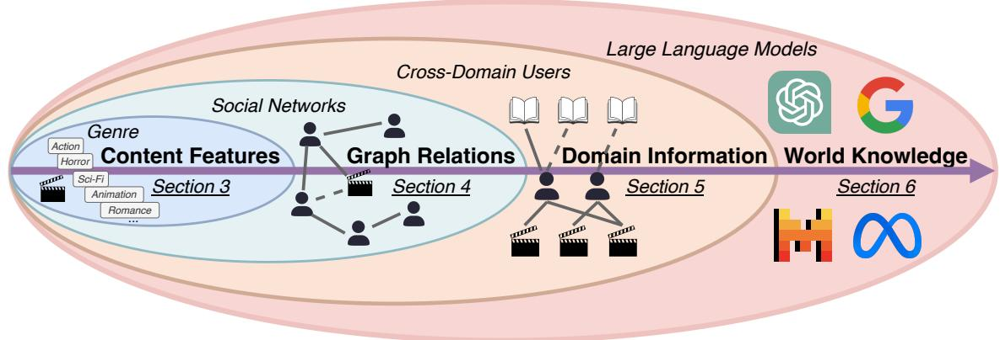
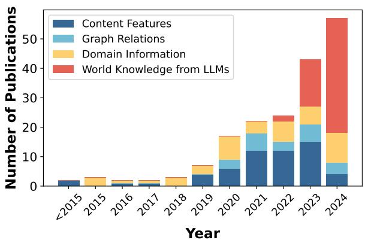
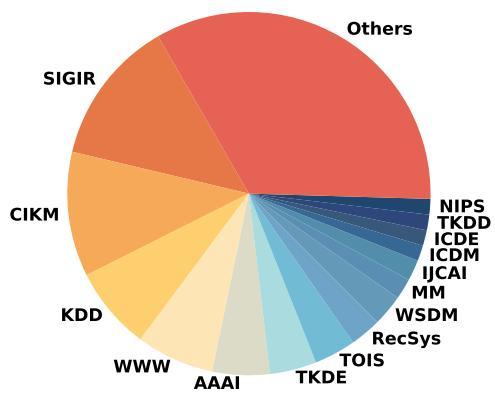
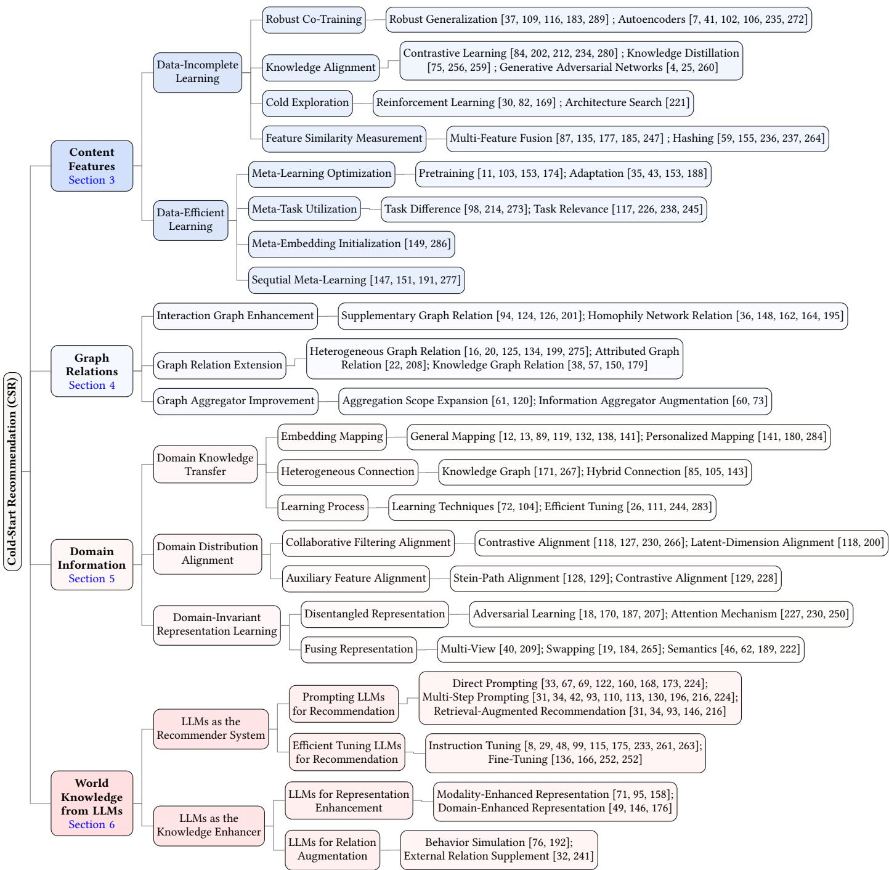
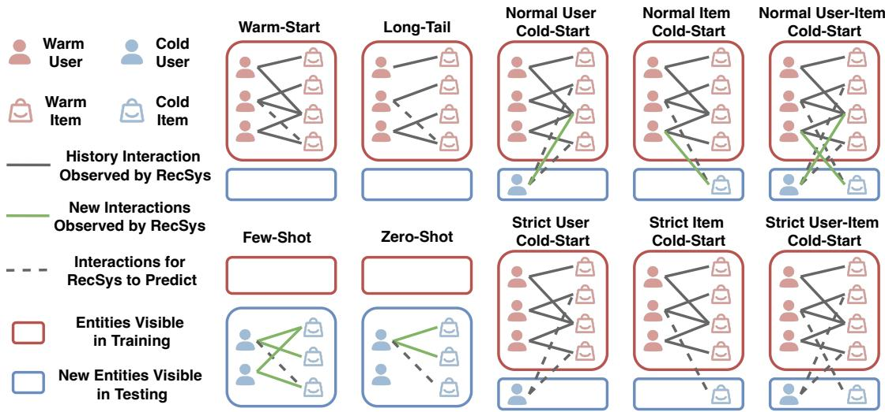
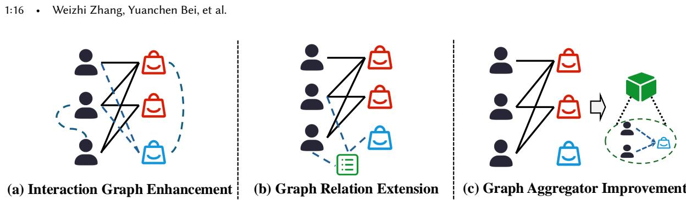
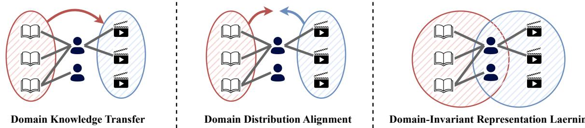
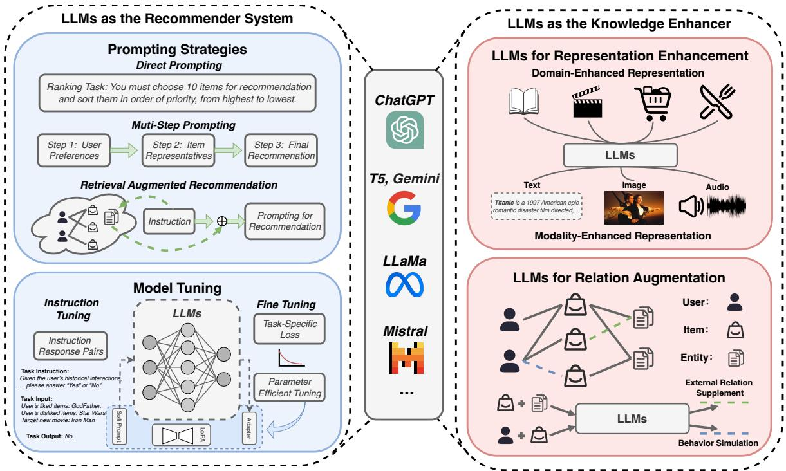
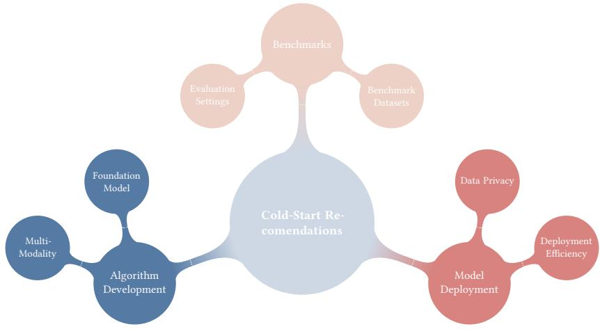

# Cold-Start Recommendation towards the Era of Large Language Models (LLMs): A Comprehensive Survey and Roadmap

WEIZHI ZHANG∗, University of Illinois Chicago, USA

YUANCHEN BEI∗, Zhejiang University, China

LIANGWEI YANG and HENRY PENG ZOU, University of Illinois Chicago, USA

PEILIN ZHOU, Hong Kong University of Science and Technology (Guangzhou), China

AIWEI LIU and YINGHUI LI, Tsinghua University, China

HAO CHEN, The Hong Kong Polytechnic University, China

JIANLING WANG, Google Deepmind, USA

YU WANG, Netflix, USA

FEIRAN HUANG, Jinan University, China

SHENG ZHOU and JIAJUN BU, Zhejiang University, China

ALLEN LIN and JAMES CAVERLEE, Texas A&M University, USA

FAKHRI KARRAY, Mohamed Bin Zayed University of Artificial Intelligence, UAE

IRWIN KING, The Chinese University of Hong Kong, China

PHILIP S. YU, University of Illinois Chicago, USA

Cold-start problem is one of the long-standing challenges in recommender systems, focusing on accurately modeling new or interaction-limited users or items to provide better recommendations. Due to the diversification of internet platforms and the exponential growth of users and items, the importance of cold-start recommendation (CSR) is becoming increasingly evident. At the same time, large language models (LLMs) have achieved tremendous success and possess strong capabilities in modeling user and item information, providing new potential for cold-start recommendations. However, the research community on CSR still lacks a comprehensive review and reflection in this field. Based on this, in this paper, we stand in the context of the era of large language models and provide a comprehensive review and discussion on the roadmap, related literature, and future directions of CSR. Specifically, we have conducted an exploration of the development path of how existing CSR utilizes information, from content features, graph relations, and domain information, to the world knowledge

∗Both authors contributed equally to this research.

Authors’ Contact Information: Weizhi Zhang, wzhan42@uic.edu, University of Illinois Chicago, USA; Yuanchen Bei, yuanchenbei@zju.edu.cn, Zhejiang University, China; Liangwei Yang, lyang84@uic.edu; Henry Peng Zou, pzou3@uic.edu, University of Illinois Chicago, USA; Peilin Zhou, pzhou460@connect.hkust-gz.edu.cn, Hong Kong University of Science and Technology (Guangzhou), China; Aiwei Liu, liuaw20@ mails.tsinghua.edu.cn; Yinghui Li, liyinghu20@mails.tsinghua.edu.cn, Tsinghua University, China; Hao Chen, sundaychenhao@gmail.com, The Hong Kong Polytechnic University, China; Jianling Wang, jianlingw@google.com, Google Deepmind, USA; Yu Wang, yuw@Netflix.com, Netflix, USA; Feiran Huang, huangfr@jnu.edu.cn, Jinan University, China; Sheng Zhou, zhousheng\_zju@zju.edu.cn; Jiajun Bu, bjj@zju.edu.cn, Zhejiang University, China; Allen Lin, al001@tamu.edu; James Caverlee, caverlee@tamu.edu, Texas A&M University, USA; Fakhri Karray, Fakhri.Karray@mbzuai.ac.ae, Mohamed Bin Zayed University of Artificial Intelligence, UAE; Irwin King, king@cse.cuhk.edu.hk, The Chinese University of Hong Kong, China; Philip S. Yu, psyu@uic.edu, University of Illinois Chicago, USA.

Permission to make digital or hard copies of all or part of this work for personal or classroom use is granted without fee provided that copies are not made or distributed for profit or commercial advantage and that copies bear this notice and the full citation on the first page. Copyrights for components of this work owned by others than the author(s) must be honored. Abstracting with credit is permitted. To copy otherwise, or republish, to post on servers or to redistribute to lists, requires prior specific permission and/or a fee. Request permissions from permissions@acm.org.

© 2025 Copyright held by the owner/author(s). Publication rights licensed to ACM. ACM 1557-735X/2025/1-ART1 https://doi.org/XXXXXXX.XXXXXXX

possessed by large language models, aiming to provide new insights for both the research and industrial communities on CSR. Related resources of cold-start recommendations are collected and continuously updated for the community in https://github.com/YuanchenBei/Awesome-Cold-Start-Recommendation.

CCS Concepts: • Information systems → Recommender systems; Language models; Collaborative filtering.

Additional Key Words and Phrases: cold-start problem, recommender system, large language model

## ACM Reference Format:

Weizhi Zhang, Yuanchen Bei, Liangwei Yang, Henry Peng Zou, Peilin Zhou, Aiwei Liu, Yinghui Li, Hao Chen, Jianling Wang, Yu Wang, Feiran Huang, Sheng Zhou, Jiajun Bu, Allen Lin, James Caverlee, Fakhri Karray, Irwin King, and Philip S. Yu. 2025. Cold-Start Recommendation towards the Era of Large Language Models (LLMs): A Comprehensive Survey and Roadmap. J. ACM 1, 1, Article 1 (January 2025), 41 pages. https://doi.org/XXXXXXX.XXXXXXX

## Contents

Abstract 1  
Contents 2  
1 INTRODUCTION 4  
1.1 Related Work 5  
1.2 Survey Methodology 6  
1.3 Contributions 6  
2 PRELIMINARIES 8  
2.1 Background 8  
2.1.1 Recommender Systems 8  
2.1.2 Cold-Start Recommendations 8  
2.2 Problem Definition 9  
2.2.1 General Problem Definition 9  
2.2.2 Task-Specific Problem Definition 9  
3 CONTENT FEATURES 9  
3.1 Data-Incomplete Learning 10  
3.1.1 Robust Co-Training 10  
3.1.2 Knowledge Alignment 11  
3.1.3 Cold Exploration 12  
3.1.4 Feature Similarity Measurement 13  
3.1.5 Others 13  
3.2 Data-Efficient Learning 13  
3.2.1 Meta-Learning Optimization 13  
3.2.2 Meta-Task Utilization 14  
3.2.3 Meta-Embedding Initialization 15  
3.2.4 Sequential Meta-Learning 15  
4 GRAPH RELATIONS 15  
4.1 Interaction Graph Enhancement 15  
4.1.1 Supplementary Graph Relation 16  
4.1.2 Homophily Network Relation 16  
4.2 Graph Relation Extension 16

J. ACM, Vol. 1, No. 1, Article 1. Publication date: January 2025.

4.2.1 Heterogeneous Graph Relation 16  
4.2.2 Attributed Graph Relation 17  
4.2.3 Knowledge Graph Relation 17  
4.3 Graph Aggregator Improvement 17  
4.3.1 Aggregation Scope Expansion 17  
4.3.2 Information Aggregator Augmentation 18  
5 DOMAIN INFORMATION 18  
5.1 Domain Knowledge Transfer 18  
5.1.1 Embedding Mapping 18  
5.1.2 Heterogeneous Connections 19  
5.1.3 Learning Process 19  
5.2 Domain Distribution Alignment 19  
5.2.1 Collaborative Filtering Alignment 20  
5.2.2 Auxiliary Feature Alignment 20  
5.3 Domain-Invariant Representation Learning 20  
5.3.1 Disentangled Representation 20  
5.3.2 Fusing Representation 21  
6 WORLD KNOWLEDGE FROM LARGE LANGUAGE MODELS 21  
6.1 LLM as the Recommender System 22  
6.1.1 Prompting Strategy 22  
6.1.2 Model Tuning 24  
6.2 LLM as the Knowledge Enhancer 25  
6.2.1 LLM for Representation Enhancement 25  
6.2.2 LLM for Relation Augmentation 26  
7 CHALLENGES AND FUTURE OPPORTUNITIES 26  
7.1 Multi-Modal Cold-Start Recommendation 26  
7.2 Recommendation Foundation Models 27  
7.3 Efficiency in Cold-Start Recommendations 28  
7.4 Data Privacy in Cold-Start Recommendations 28  
7.5 Benchmark and Unified Evaluation 28  
8 CONCLUSION 29  
References 29

## 1 INTRODUCTION

In the rapidly evolving landscape of the digital information era, recommender systems (RecSys) have become indispensable tools for helping users discover relevant content and items amidst overwhelming information and choices [14, 220, 255]. Despite their widespread deployment, RecSys face persistent challenges, particularly in "cold-start" scenarios, where limited or no historical interaction data is available for new users or items. Specifically, in real-world scenarios, the cold-start problem could be the introduction of new items, the onboarding of new users, or new platforms with inherently sparse interaction data. Addressing the cold-start problem is not just technically necessary for performance metrics but also critical for advancing the efectiveness and sustainability of recommender systems. First and foremost, solving this issue ensures that new users and items are fairly represented, mitigating biases that arise from the reliance on historical data. This improvement fosters diversity and fairness in recommendations, promoting diverse content exposure by preventing new items from being overlooked [114, 288]. Furthermore, tackling the cold-start challenge brings the platform brand value and user retention. In a crowded and fast-moving digital landscape, delivering immediate and relevant recommendations to new users can diferentiate a platform from its competitors. Personalized recommendations from the outset help engage new users, preventing them from leaving due to irrelevant or absent suggestions. This creates a strong initial impression and fosters loyalty. For platforms, this translates into higher engagement, improved retention rates, and the ability to succeed in dynamic markets. Finally, efectively addressing cold-start scenarios ensures scalability and growth. As platforms expand with new users and content, efective integration of the continual influx of these entities keeps recommendation engines dynamic and relevant. This adaptability supports long-term sustainability in a rapidly changing environment. Given these motivations, the cold-start problem has driven the exploration of innovative approaches that leverage diverse external knowledge sources. By incorporating information beyond traditional user-item interactions [66, 204], such as content features [183], social information [36], or pretrained LLM knowledge [122], these methods enrich the representation and modeling of cold-start entities, enabling recommender systems to perform efectively even under sparse data conditions. As such, solving the cold-start problem is not merely a technical challenge—it is a strategic necessity for building fair, engaging, and sustainable recommendation platforms in an ever-changing digital landscape.

Early cold-start attempts adopt content-based approaches [133, 181] and focus on categorical textual features, such as item genres, item titles, and user profiles, which play a crucial role in representing cold entities. Then, with the advances of graph mining techniques [101, 225, 231], high-order relations derived from graph structures,

  
Fig. 1. Illustrations of the knowledge scope discussed in this survey.

J. ACM, Vol. 1, No. 1, Article 1. Publication date: January 2025.

such as user-item interaction graphs [24, 64, 257, 258], knowledge graphs [21, 203], and social networks [165, 239], become another critical component to enhance the CSR. Concurrently, instead of mining the graph relations among nodes, some researchers resort to the connections among diferent domains [92, 249]. In particular, cold-start and data sparsity issues in the target domain can be alleviated by transferring knowledge from other domains where richer interaction data is available. Cross-domain recommendation techniques exploit overlapping user bases, shared attributes, or aligned item categories to improve performance in CSR. In recent years, the rise of large language models (LLMs), such as GPT [3], LLaMa [39], and T5 [157] has revolutionized natural language processing, demonstrating exceptional capabilities in understanding and generating human-like text based on vast amounts of pre-trained data [107, 142]. These advancements have inspired a paradigm shift in recommender system research, leveraging the comprehensive contextual understanding of LLMs to enhance cold-start recommendation performance. By utilizing the pre-trained world knowledge of LLMs, researchers have started exploring novel strategies for modeling and representing cold users and items in a more semantically rich and context-aware manner. Figure 2a illustrates this evolving trend, highlighting the shift in cold-start recommendation research from traditional content-based methods to LLM-driven strategies with progressively expanding knowledge scope (Figure 1).

  
(a) Number of publications in recent years.

  
(b) Venues of publications  
Fig. 2. Statistical information of current cold-start recommendation publications.

This survey paper aims to provide an extensive review of state-of-the-art techniques and frameworks in the cold-start recommendation, with a special outlook towards the era of LLMs with expanding knowledge scope as illustrated in Figure 1. Particular focuses are placed on works published in top-tier conferences and journals, as in Figure 2b. Based on the collection, we categorize the existing works into four knowledge scopes considering the scale of external knowledge sources: Content Features, Graph Relations, Domain Information, and World Knowledge from the Large Language Models. By systematically categorizing and analyzing these approaches, our survey aims to present a comprehensive understanding of the landscape and propose a roadmap for future research. We emphasize the transformative potential of integrating LLMs into cold-start recommendations and outline the opportunities and challenges that lie ahead in this burgeoning field.

## 1.1 Related Work

A comparison between our survey and the previous surveys is shown in Table 1. All of the existing surveys, which cover cold-start recommendation articles, only focus on partial knowledge scopes or limited aspects of the CSR problem. The earliest surveys [51] and [17] partially covered single knowledge scope without defining specific cold-start issues. Later surveys from IDCTIT [163] and Applied Sciences [1] began incorporating graph relation and domain information, and being the first to explicitly define system cold-start and user cold-start issues, covering more relevant papers through 2021. More recent surveys such as JIIS [152] and IEEE Access [246] have expanded the scope and number of covered papers, with [246] particularly focusing on user cold-start problems. In all, no existing survey paper in the literature fully covers all four aspects (Features, Graph, Domain, and LLMs) while addressing multiple cold-start issues. In this work, we aim to fill this gap by providing a comprehensive and systematic survey covering 220 papers through December 2024, clearly defining 9 distinct cold-start issues and incorporating analysis across knowledge scopes from features, graphs, domains, and LLMs.

Table 1. Comparison with existing surveys. For each survey, we summarize the knowledge scope covered in their collected relevant papers, the corresponding statistics, and the specific types of cold-start issues defined and discussed in the survey

<table><tr><td rowspan="2">Surveys</td><td rowspan="2">Venues</td><td colspan="4">Knowledge Scope</td><td colspan="2">Cold-Start RecSys Papers</td><td rowspan="2">Defined/Focused Issue</td></tr><tr><td>Features</td><td>Graph</td><td>Domain</td><td>LLMs</td><td># Papers</td><td>Latest Year</td></tr><tr><td>[51]</td><td>ICCCA*</td><td>√</td><td></td><td></td><td></td><td>8</td><td>2017</td><td>-</td></tr><tr><td>[17]</td><td>IPM*</td><td></td><td>√</td><td></td><td></td><td>14</td><td>2018</td><td>-</td></tr><tr><td>[163]</td><td>IDCTIT*</td><td>√</td><td>√</td><td></td><td></td><td>18</td><td>2020</td><td>System Cold-Start</td></tr><tr><td>[1]</td><td>Applied Sciences</td><td>√</td><td></td><td>√</td><td></td><td>50</td><td>2021</td><td>User Cold-Start</td></tr><tr><td>[152]</td><td>JIIS*</td><td>√</td><td>√</td><td>√</td><td></td><td>91</td><td>2022</td><td>-</td></tr><tr><td>[246]</td><td>IEEE Access</td><td>√</td><td>√</td><td>√</td><td></td><td>45</td><td>2023</td><td>User Cold-Start</td></tr><tr><td colspan="2">Ours</td><td>√</td><td>√</td><td>√</td><td>√</td><td>220</td><td>Dec, 2024</td><td>Cold-Start</td></tr></table>

✓: fully covered, ✓ : partially covered. Cold-Start: covers 9 sub cold-start tasks as in Table 2 and Figure 4.  
Latest year: the latest publication year of a relevant paper included in the survey.  
ICCCA\*: International Conference on Computing, Communication and Automation; IPM\*: Information Processing and Management.  
ICDTIT\*: Intelligent Data Communication Technologies and Internet of Things; JIIS\*: Journal of Intelligent Information Systems.

## 1.2 Survey Methodology

To comprehensively cover the papers in the cold-start recommendation. We adopted a semi-systematic survey methodology to identify the relevant papers. Initially, we queried prominent academic databases such as Google Scholar and Web of Science with pre-defined searching keywords such as "cold-start recommendation", "coldstart recommender systems", "strict cold-start", "zero-shot recommendation", and "few-shot recommendation". Additionally, we screen specialized conference proceedings, including KDD, WWW, SIGIR, CIKM, WSDM, and RecSys. The search results were filtered by analyzing titles, abstracts, and experiments to evaluate relevance. Then, the relevant papers were further reviewed thoroughly, and their references were used as seeds for a snowballing approach to identify additional papers. The final collection comprised studies categorized into four core areas based on their contributions, as illustrated in the taxonomy diagram. These areas include content features, graph relations, domain information, and world knowledge from LLMs, as summarized in Figure 3. The majority of these works describe technical approaches or propose novel frameworks, with a smaller subset providing system demonstrations or analytical perspectives on cold-start recommendation methodologies.

## 1.3 Contributions

• Pioneering Comprehensive Survey: We present the first thorough review of cold-start recommendation methods, systematically identifying studies from various CSR tasks with diferent knowledge sources. Our survey meticulously analyzes relevant papers, examining their motivations, data requirements, and

Cold-Start Recommendation towards the Era of Large Language Models (LLMs): A Comprehensive Survey and Roadmap • 1: 7

  
Fig. 3. An overview of the taxonomy of this survey for existing cold-start recommendation models.

technical approaches, providing a consolidated timeline and statistical overview of research publications in leading conferences (e.g., SIGIR, CIKM, KDD) and journals (e.g., TKDE, TOIS), as depicted in Figure 2.

• Innovative Taxonomy Introduction: We introduce a novel taxonomy, providing a unique perspective on dealing with the cold-start challenge - utilizing external knowledge sources to address data sparsity and interaction scarcity with new entities. Our taxonomy categorizes knowledge sources distinctly, moving beyond traditional approaches toward a broader scope of addressing cold-start issues.

• Explicit Definition of Cold-Start Problems: To the best of our knowledge, we are the first paper ofering a clear, comprehensive definition of the cold-start problem across multiple dimensions, encompassing long-tail, user cold-start, item cold-start, user-item cold-start, zero-shot, and few-shot, and strict cold-start problems. This definition provides a structured understanding and unifying framework for diverse research strands within the cold-start landscape.

• A Foward-Looking Roadmap: Drawing on our comprehensive survey and innovative taxonomy, we propose a forward-looking roadmap that connects current advancements in cold-start recommendation with future research directions. This roadmap is designed to guide the research community, ofering insights and structured pathways for advancing knowledge in this challenging area.

## 2 PRELIMINARIES

## 2.1 Background

2.1.1 Recommender Systems. Recommendation systems (RecSys) are a subclass of information retrieval technologies that seek to predict the preference a user would give to an item or the likelihood of a user’s interaction with an item. These systems are designed to recommend items to users based on their individual preferences or behaviors, which are mainly inferred from historical user-item interactions. To expand on this, recommender systems play a crucial role in modern e-commerce, social media, and content platforms by helping users navigate through the vast amount of available content and products. They analyze historical behavior data such as purchase history, browsing history, ratings, and reviews to build user profiles and predict what items a user might be interested in [64, 86, 262]. Specifically, the development of current recommender systems can now be mainly divided into three stages. (i) Content-based recommendations. This type of recommender system focuses on the characteristics of items, such as the genre of a movie, the subject of a book, or the style of music. The system recommends items with similar features that a user has liked in the past. (ii) Collaborative filtering recommendations. Collaborative filtering (CF) is one of the most commonly used recommendation techniques, which recommends items based on the similarity between users or items, e.g. embedding similarity. User-based collaborative filtering recommends products that other users with similar preferences have liked, while item-based collaborative filtering recommends other items similar to those a user has liked in the past. (iii) Large language model-based recommendations. In recent years, large language models (LLMs) have received abundant attention for their powerful ability in text-based understanding and generation. Currently, many LLM-based recommender models have been proposed with recommendation-centric prompt tuning and vocabulary extensions for users/items to efectively model the user-item similarity for recommendations.

2.1.2 Cold-Start Recommendations. In the above backgrounds of recommender systems, we can find that the core of current recommender models is to mine the user-item similarity with diferent technical strategies. However, with the rapid development of the Internet, one major challenge faced by recommender systems is the cold start recommendation (CSR), which involves making accurate recommendations for new users and new items that are continuously added to the Internet every day [51, 75, 124]. The main challenge of cold start recommendation lies in the fact that new users and new items have little or no available information. In this situation, it is very dificult for the system to model the user-item similarity based on the very sparse information. Therefore, cold-start recommendations have become a long-standing problem for the research community of recommendation systems.

In this survey, we will provide a systematic review of existing CSR methods, starting from the detailed definition of diferent CSR problems in section 2.2 to unfolded classification and discussion of existing CSR models in section 3 - section 6, with knowledge scopes from content features, graph relations, and domain information, to world knowledge.

## 2.2 Problem Definition

2.2.1 General Problem Definition. Let $U = \left\{ u _ { 1 } , u _ { 2 } , \ldots \ldots , u _ { m } \right\}$ be a set of ?? users and $V = \{ v _ { 1 } , v _ { 2 } , \ldots \ldots , v _ { n } \}$ be a set of ?? items. Each user $u \in U$ is associated with a profile $\mathbf { S } _ { u } ,$ , which includes both an interaction history $\mathbf { I } _ { u }$ and contextual features $\mathrm { C } _ { u }$ obtained from external knowledge sources. Similar notations, including the item profile $\mathsf { S } _ { v } ,$ interactions $\mathbf { I } _ { v } ,$ and features $\mathbf { C } _ { v } ,$ hold for each item $v \in V .$ . In this setting, the training phase involves a known set of warm-start users $\overline { { U } }$ and items ${ \overline { { V } } } _ { \mathrm { { ; } } }$ for which interaction data are fully observed. During tuning and testing, however, we may encounter a new set of cold-start users $\widehat { U }$ and items ${ \widehat { V } } _ { \ }$ , which have not been observed during training. By definition, $\overline { { U } } \cap \widehat { U } = \emptyset , \overline { { U } } \cup \widehat { U } = U$ , and similarly ${ \overline { { V } } } \cap { \widehat { V } } = \emptyset , { \overline { { V } } } \cup { \widehat { V } } = V$ . This setup captures the realistic scenario where new users or items emerge after the model is initially trained. Note that for some cases, $\overline { { U } }$ and $\overline { { V } }$ could be null due to system-level cold-start in the platform.

  
Fig. 4. Comparison of warm-start and diferent cold-start recommendation problems.

2.2.2 Task-Specific Problem Definition. Building on this general definition, we explicitly define nine specific cold-start recommendation tasks. These tasks difer in terms of the conditions under which users or items are observed by the RecSys, and are grouped into four main categories—long-tail, normal cold-start, strict cold-start, and system cold-start to highlight their unique characteristics. Table 2 and Figure 4 illustrate these categories and the corresponding subtasks, as well as clarify how the training, tuning, and testing sets difer across scenarios.

## 3 CONTENT FEATURES

Content features mainly refer to the descriptive information inherent to users or items that characterize their attributes, such as user profiles, user reviews, item names, and descriptions [2, 63, 78, 292]. Due to the scarcity or lack of historical interaction records of cold users/items, content features become one of the key information representing cold users/items in cold-start recommendations [59, 181]. Based on the utilization of the content features, we categorize methods into two types: Data-Incomplete Learning (Sec. 3.1), which addresses strict cold start scenarios without prior interactions, and Data-Eficient Learning (Sec. 3.2), which optimizes performance in normal cold-start scenarios where limited interaction data is available.

Table 2. Problem definition of diferent cold-start recommendation tasks.

<table><tr><td>Category</td><td>Task</td><td>Train</td><td>Tune</td><td>Test</td><td>Task Specification</td></tr><tr><td>Long-Tail</td><td>Long-Tail</td><td> $\overline{U},\overline{V}$ </td><td>-</td><td> $\overline{U},\overline{V}$ </td><td>Node degrees of users and items in  $\overline{U}$  and  $\overline{V}$  are less than  $k$ .</td></tr><tr><td rowspan="3">NormalCold-Start</td><td>User</td><td> $\overline{U},\overline{V}$ </td><td> $\widehat{U},\overline{V}$ </td><td> $\widehat{U},\overline{V}$ </td><td>Each user in  $\widehat{U}$  appear and are observed with less than  $k$  interactions.</td></tr><tr><td>Item</td><td> $\overline{U},\overline{V}$ </td><td> $\overline{U},\widehat{V}$ </td><td> $\overline{U},\widehat{V}$ </td><td>Each item in  $\widehat{V}$  are released and observed with less than  $k$  interactions.</td></tr><tr><td>User-Item</td><td> $\overline{U},\overline{V}$ </td><td> $\widehat{U},\widehat{V}$ </td><td> $\widehat{U},\widehat{V}$ </td><td>Users  $\widehat{U}$  and Items  $\widehat{V}$  appear with less than  $k$  interactions each.</td></tr><tr><td rowspan="3">StrictCold-Start</td><td>User</td><td> $\overline{U},\overline{V}$ </td><td>-</td><td> $\widehat{U},\overline{V}$ </td><td>New users  $\widehat{U}$  appear after training without any interaction.</td></tr><tr><td>Item</td><td> $\overline{U},\overline{V}$ </td><td>-</td><td> $\overline{U},\widehat{V}$ </td><td>New items  $\widehat{V}$  are released with no prior interactions.</td></tr><tr><td>User-Item</td><td> $\overline{U},\overline{V}$ </td><td>-</td><td> $\widehat{U},\widehat{V}$ </td><td>Users  $\widehat{U}$  and Items  $\widehat{V}$  appear without any user-item interactions each.</td></tr><tr><td rowspan="2">SystemCold-Start</td><td>Zero-Shot</td><td>-</td><td>-</td><td> $\widehat{U},\widehat{V}$ </td><td>Users  $\widehat{U}$  are observed with its short-term interaction histories without collaborative filtering (CF) information from other users and items.</td></tr><tr><td>Few-Shot</td><td>-</td><td> $\widehat{U}_{1},\widehat{V}_{1}$ </td><td> $\widehat{U}_{2},\widehat{V}$ </td><td>Users  $\widehat{U}_{2}$  appear with a few interacted items and the learned CF patterns from few-shot users  $\widehat{U}_{1}$  and their interacted  $\widehat{V}_{1}$ .</td></tr></table>

For splitting ?? and $\widehat { U }$ from $U ,$ we default to using the number of interactions ?? in the task specification. Alternatively, some research adopts a time-based approach, categorizing users based on the appearing time (e.g., users’ first comment time before year ?? as existing users and those after as cold-start users), or employs random sampling for the separation. Similarly, these apply to the warm/cold item splitting process.

## 3.1 Data-Incomplete Learning

Data-incomplete learning is a category of methods that solely utilize content information to learn representations of cold users/items. Given the absence or very few historical interactions for these cold nodes, the available information for modeling their relations is incomplete. Therefore, through data-incomplete learning, which relies only on content information to learn the representations of these strictly cold users/items, the ultimate goal is to unify these representations with those of warm nodes learned from historical interactions for cohesive recommendations. We categorize the related works of data-incomplete learning into four major classes, robust co-training, knowledge alignment, cold exploration, and feature similarity measurement, based on diferent learning manners.

3.1.1 Robust Co-Training. Robust learning is a paradigm in machine learning that aims to make models maintain stability and accuracy even when faced with perturbations, noise, or outliers in the input data [91, 156]. In cold-start recommendations, robust co-training employs robust strategies to jointly utilize behavior-based warm user/item representations and content-based cold user/item representations for co-training. The objective of this training paradigm is to cultivate a model that is not only proficient in leveraging existing behavioral data to refine warm representations but is also adept at warming up cold representations through a process of gradual integration into the training mix. Specifically, the models for robust co-training can be divided into two major categories: robust generalization and autoencoders.

Robust generalization. Typically, this type of model will simultaneously optimize both behavior-based representations and content-based representations with robust generalization strategies. Representatively, Dropout-Net [183] randomly selects user-item pairs and sets their preference inputs to zero, forcing the model to rely solely on content information to reconstruct the relevance scores. This approach enables the model to recover the accuracy of the input latent model when preference information is available, while also generalizing in cold situations. Heater [289] also employs a similar stochastic training mechanism to randomly input the pre-trained collaborative representations or the intermediate representations derived from contents. MTPR [37] includes both two types of representations: one representation that combines collaborative embedding and content embedding, and another representation that assumes the item is cold-started, replacing the collaborative embeddings with a zero vector. These two representations are simultaneously used for embedding training. Further, there are some models that utilize an adaption-based strategy to transfer knowledge. For instance, Cold-Transformer [109] introduces the context-based embedding adaption for cold/warm users co-training to ofset the diferences in feature distribution, which transforms the embedding of cold users into a warm state that is more like existing ones to represent corresponding user preferences from historical interaction data. TDRO [116] further enhances the generalization capability of the content mapper by integrating time-variant feature shifts within the content feature co-training.

Autoencoders. The autoencoder (AE) technology employs an encoding-decoding architecture within a unified framework, where the encoder, informed by variational or denoising strategies, and the decoder, responsible for information reconstruction, are jointly trained to represent both cold and warm instances. This synergistic approach efectively captures and reconstructs the nuanced property of the behavior and content data, fostering a robust representation learning process. These models generally design new AE architecture to fit both behavior and content information. Representatively, LLAE [106] leverages an AE paradigm that encompasses a low-rank encoder designed to map the user behavior space onto the user content feature space, complemented by a symmetric decoder that reconstructs user behavior from the user content features. MAIL [41] is also a novel AE, which is composed of two pivotal autoencoder components: a zero-shot tower to generate behavioral data for cold users with content features and a ranking tower to perform recommendations. Moreover, CVAR and GoRec [7, 272] introduce a model-agnostic Conditional Variational Autoencoder (CVAE) [96] framework, which is adept at enhancing the warm-up process for cold-start item ID embeddings. CFLS [102] employs collaborative filtering within the latent variable space by employing a Gaussian process prior to avoiding the diference between behavior embeddings and content embeddings.

3.1.2 Knowledge Alignment. Due to the semantic discrepancies between the warm representations derived from behavioral data and the cold representations obtained from content data [25, 75], a strategic alignment is essential. To bridge this gap, the knowledge alignment introduces strategies to facilitate the convergence of cold representations with the pre-trained warm representations. The core of knowledge alignment is the aligner, which aims to align the cold representations from content features and the warm representations from behavior data with alignment strategies. These strategies are designed to ensure that the information encapsulated within the cold representations is efectively harmonized with the rich, behavioral-driven insights of the warm representations. By doing so, we aim to enrich the cold representations with the meaningful behavioral information inherent in the warm ones, thereby enhancing the overall semantic coherence and representational fidelity. In terms of technical categorization, existing approaches to knowledge alignment can be divided into three principal categories: contrastive learning, knowledge distillation, and generative adversarial networks.

Contrastive learning. It is a famous technique in machine learning that emphasizes the learning of representations by contrasting the similarities and diferences between pairs of data points [27, 276], It aims to improve the discriminative ability of models by ensuring that similar instances are represented closely in the representation space, while dissimilar ones are separated [218, 228]. In cold-start recommendations, contrastive learning is used to bridge the content-based representations of cold instances with the behavior-based representations of warm instances. For instance, CLCRec [212] learns the cold representations from the perspective of information theory, aiming to maximize the interdependence between content information and collaborative signals through contrastive learning. CCFCRec [280] also introduces a contrastive CF framework. It includes a content CF module and a co-occurrence CF module, which work in tandem to produce distinct embeddings. Through joint training and contrastive learning, the co-occurrence signals enhance the content-based embeddings, implicitly correcting the initial imprecision of cold-start item embeddings.

Knowledge distillation. The knowledge distillation (KD) method is a technique where a smaller, more eficient model learns from a larger, more complex model, transferring the knowledge and insights of the larger model into a more compact form, from the definition in machine learning [52, 154, 190, 197]. In cold-start recommendations, diferent from traditional utilization of KD, it is typically adopted to distill the knowledge from behavior-based warm representations to content-based cold representations, with the target of ensuring that the representations of the two convey more consistent information. Representatively, ALDI [75] views the pre-trained warm recommender model as the teacher and distills knowledge from three perspectives: rating distribution, ranking, and identification, for information alignment between warm representations and cold representations. Further, DTKD [256] aims to simultaneously and efectively distill both content and CF knowledge. The DTKD framework employs two specialized teachers - a pre-trained language model and a graph model, each tailored to the distinct characteristics of content and CF data, ensuring comprehensive knowledge distillation. Cold & Warm Net [259] introduces an expert-driven model that adopts dynamic knowledge distillation as a teacher selector, guiding the experts in refining both cold and warm user representation collaboratively.

Generative adversarial networks. Generative adversarial networks (GANs) are a class of methods where two neural networks: a generator and a discriminator, contend with each other, enabling the generator to produce increasingly realistic data [53, 79, 161]. In cold-start recommendations, GANs are typically used to make the generated cold representations from the content mapper more similar to the warm representations input into the recommender. Representatively, GAR [25] employs an adversarial training approach for both the generator (content mapper) and the recommender, ensuring that the generated cold-start item embeddings closely mimic the distribution of warm-start embeddings learned from historical interactions. GF2 [260] also utilizes GANs to enhance the embeddings for cold-start users, with the generator obtained from the GAN that can further be fine-tuned. GAZRec [4] utilizes the GAN to generate virtual representations for cold user/news that are conditioned on the given content data.

3.1.3 Cold Exploration. In the absence of substantial interaction data to model cold users or items efectively, a natural and intuitive approach is to employ a "trial" methodology, such as reinforcement learning-based strategies [82]. The cold exploration-based approach allows for the exploration of interests among cold users or items, leveraging the feedback signals from the recommender system to swiftly adjust the representations and modeling of these cold entities.

Reinforcement learning. The reinforcement learning (RL) method is a widely adopted type of exploration method where an agent learns to make decisions by performing actions in an environment to maximize a reward signal [6, 10, 144]. For cold-start recommendations, reinforcement learning algorithms are often utilized for interest explorations of cold instances for fast representation cold-starting. There are some representative methods that model the cold-start process into a specific RL-based process. Specifically, MetaCRS [30], through engaging in a series of exploratory dialogues to fast identify cold user preferences for conversational-based recommender systems. WSCB [169] has framed the user cold-start recommendation as a multi-armed bandit problem and introduced an innovative approach to balance exploration and exploitation during initial interactions, which grounds in active learning principles, aims to gather more comprehensive information about cold users. RL-LTV [82] models the recommendation process as a partially observable and controllable Markov decision process. To transfer the information from historical items to cold-start items, RL-LTV further introduces item inherent features, trending bias terms, and memory states as extra inputs into both the actor and critic.

Some other works further explore the other aspects of the capability of cold-start recommendations. For instance, ColdNAS [221] has devised a novel neural architecture search scheme aimed at discovering suitable modulation structures for cold-start users, encompassing both the functional and positional aspects.

3.1.4 Feature Similarity Measurement. To circumvent the issue of modeling in the face of absent behavioral data, an alternative approach is to shift the focus toward representing and modeling the content-based features of users and items. Specifically, these feature similarity measurement methods learn and evaluate the user/item interests from the perspective of content feature similarity. In this way, the model can avoid the information diference between warm representations (from behavior data) and cold representations (from content data).

Multi-feature fusion. This method aims to simultaneously utilize multiple features to provide more information for better cold instance measurement due to the data incomplete issue [185, 247]. The key challenge of this stage is to efectively organize and fuse these features from diferent sources. Representatively, CIRec [135] enhances the content representation for cold instances by fusing collaborative, visual, and cross-modal inferred representations. SMINet [177] learns the user representations from multiple aspects of input with gate attention to avoid relying solely on behavioral data. AutoFuse [87] automatically fuse data from various sources and types, which explicitly categorizes features into distinct groups predicated on their granularity.

Hashing. The hashing strategy has been widely adopted in computer vision and multi-media for similar content retrieval to balance the retrieval efectiveness and eficiency [121, 215, 282]. For cold-start recommendations, hashing can be used to map the warm and cold representations into unified binary hash code space for similarity measurement. For example, NeuHash-CF [59] introduces a content-aware neural hashing method, which generates binary hash codes for both cold and warm users/items, facilitating the estimation of user-item relevance using eficient Hamming distance. MFDCF [236] proposes a fast cold-start recommendation method with multi-feature discrete CF. Then, it adaptively projects multiple content features into binary and information-rich hash codes for retrieval.

3.1.5 Others. There are also some other methods for data-incomplete learning, which are mainly the early works. Due to the limited quantity, they are mainly based on traditional strategies and statistical methods. Representatively, Han et.al [56] combines non-behavioral thematic relevance and behavioral popularity to adjust item rankings, reducing the bias that leads to the cold start ranking of new items. Deezer [15] utilizes clustering analysis to assign new users to existing user groups, combining user embedding vectors with the centers of user groups to provide recommendations for cold-start users. DeepMusic [181] is a classic cold-start recommendation model that employs mean squared error and prediction error as the objective functions for model training based on rating predictions.

## 3.2 Data-Eficient Learning

Normal cold-start recommendations are prevalent in many online recommendation systems, prompting another research line to enhance models for eficient learning from limited user-item interactions. Meta-learning, known for its few-shot learning capabilities in fields like computer vision [28, 80], natural language processing [253], and graph mining [198, 278], plays a key role here. Gradient-based meta-learning [44, 45], which simulates few-shot test scenarios during training and leverages second-order gradients, enables quick adaptation with minimal data. Inspired by these strengths, numerous eforts have focused on applying meta-learning to cold-start problems, categorized into four approaches: meta-learning optimization, meta-task utilization, meta-embedding initialization, and sequential meta-learning.

3.2.1 Meta-Learning Optimization. The essence of meta-learning in recommender systems lies in pretraining the model with diverse users’ historical interactions, followed by rapid adaptation to new, cold-start users or items using limited additional interaction data. Thus, refining both the pretraining and adaptation phases is critical for improving cold-start recommendation performance.

Pretraining. MeLU [103] is one of the foundational works in cold-start recommendation, introducing the Model-Agnostic Meta-Learning (MAML) [44] optimization algorithm to estimate user preferences with only a small number of observed items. During the pretraining phase, local updates are applied to the decisionmaking layer using the support set, while global updates refine the whole user preference estimator using the query set. The use of second-order gradients on local and global updates enables the model to achieve a robust initial state, allowing it to fine-tune quickly with only a limited number of items to accurately estimate user preferences. Concurrently, building on MAML’s strengths, Bharadhwaj [11] integrated meta-learning strategies as a pretraining enhancement, demonstrating stronger generalization in addressing user cold-start scenarios across various models. Building on these approaches, PNMTA [153] enlarges the training scope to all the user interactions in pretraining for enriched preference representation learning, while FORM [174] derives an online regularized meta-leader algorithm and learns from the online gradients to accelerate the meta-training process.

Adaptation. While much of the focus has been on optimizing global parameter initialization shared for all users, several studies target personalized parameters specifically for cold-start adaptation. In the early work MAMO [35], the authors devised two memory matrices to store the feature-specific and task-specific memories for fast preference adaptation. Then Wang et al. [188] observed that existing methods risk memorizing query interactions without identifying novel preference patterns and they proposed to separate common preference transfer from novel preference adaptation. Alternatively, modulators have been proposed for adaptation. For instance, PNMTA [153] develops extra modulated models tailored for user groups instead of a universal metamodel. It uses a meta-learned task encoder modulator to estimate user identities and a predictor modulator to generate parameters for precise adaptation. To simplify adaptation pipelines, CMML [43] introduces a fully feed-forward approach. Using a context modulation network, it quickly adapts to limited interactions at both feature and task levels, streamlining the adaptation process.

3.2.2 Meta-Task Utilization. Beyond optimization, several studies [98, 117, 214, 226, 238, 245, 273] have highlighted the importance of task similarities and diferences in meta-learning. Traditional approaches treat each user as an isolated task, training without considering task connections. This limits the model’s ability to recognize individual user contributions and corresponding task relationships. Research in this area focuses on two key aspects: task diference and task relevance.

Task diference. Ignoring task diferences can lead to biases, as users with high uncertainty or dificulty may disproportionately afect predictions. To address this issue, Wen et al. [214] introduced a weighted distribution of functions (WDoF) framework, using curriculum learning to assign significance to users based on their contribution. Zhao et al. [273] proposed an adaptive update strategy (TDAS) to distinguish tasks in a macro manner, i.e., covering task dificulty of composition, relevance, and training aspects. Considering the highly distinct user feedback in the real-world cold-start recommendation, Kim et al. [98] designed an adaptive weighted loss to capture the imbalanced user rating distribution.

Task relevance. Understanding task relevance is crucial for adapting warm global knowledge to cold-start scenarios, especially when cold users share similar preferences with warm users. Approaches in this domain leverage clustering [117, 238] or similarity measures [226, 238, 245]. For instance, Yang et al. [238] designed an automatic soft task clustering module and a feature-based similarity score to measure task similarity. In TaNP [117], a clustering distribution is derived through task-adaptive mechanisms to capture task relevance efectively. Concurrently, Yu et al. [245] also proposed an adaptive meta-learning method focusing on minor users by identifying similar users using a reference tree structure. Wu et al. [226] enriched the cold-start user representation by aggregating similar user embeddings through attention similarity scores.

3.2.3 Meta-Embedding Initialization. methods focused on adapting models to cold-start scenarios, meta-embedding initialization aims to generate pre-trained embeddings that accelerate the fitting process for cold-start users and items. These methods leverage meta-learning algorithms to produce warmed-up embeddings, enhancing both representation quality and adaptation speed. Motivated by the idea of learning better initial embedding, Pan et al. [149] proposed to train the meta-embedding generator via a two-phase simulation based on the gradient-based meta-learning [44]. This approach generates meta-embeddings optimized for strict cold-start conditions, enabling faster adaptation in normal cold-start scenarios. Following that, Zhu et al. [286] proposed a meta-scaling network to transform cold ID embeddings into a warmed ID feature space, accelerating the warm-up process.

3.2.4 Sequential Meta-Learning. Aligned with the sequential recommendation framework [90, 172], sequential meta-learning incorporates the time order of user interactions to capture dynamic preferences using limited historical behavior sequences. Wang et al. [191] introduced metric-based meta-learning [182] paradigm into the sequential recommendation. It focuses on developing a matching network to pair cold-start items with potentia users based on limited sequential data. MetaTL [277] extended gradient-based meta-learning [44] to sequential recommendations by simulating cold-start scenarios with a pool of few-shot tasks. This setup allows the model to progressively learn user preferences. Recognizing that previously active old users may become less engaged over time, Neupane et al. [147] defined this group as time-sensitive cold-start users. Their approach dynamically factorizes user preferences into time-evolving representations, combining past and present interactions. Pan et al. [151] addressed feature divergence between older and newer interaction sequences. To stabilize and enhance meta-learning, they proposed a Multi-Modal Meta-Learning (MML) framework that integrates diverse side information, such as text and images, to better capture complex user preferences across diferent types of data.

## 4 GRAPH RELATIONS

In recent years, Graph Neural Networks (GNNs) have captured considerable attention, showcasing cutting-edge performance in a multitude of graph mining tasks, such as node classification [9, 55, 100], link prediction [223, 248, 254], and graph classification [210, 211, 229]. GNNs typically adopt the message-passing paradigm to update each central node embedding via aggregating neighborhood information. As a task within the realm of link prediction, recommender systems have witnessed the emergence of numerous GNN-based recommendation models, which have achieved notable recommendation performance in recent years [64, 204, 232]. GNN-based recommendation models mainly leverage the powerful message passing of GNNs to model user-item interactions in a graph structure, enabling a better understanding of user preferences and item relevance with high-order information for more efective recommendations [24, 165, 220]. Graph relations provide high-order information, rather than only the content features of the user/item itself. The usage of graph relation knowledge brings information from neighborhoods to a specific user/item. The key challenges in this part lie in how to provide graph information for cold users/items due to the lack of historical interaction information. Existing works can be categorized into Interaction Graph Enhancement (Sec. 4.1), Graph Relation Extension (Sec. 4.2), and Graph Aggregator Improvement (Sec. 4.3).

## 4.1 Interaction Graph Enhancement

Due to the lack of historical interaction behaviors or having very few, providing graph relational information for cold nodes is a significant challenge. Therefore, Interaction Graph Enhancement focuses on increasing the number of interactions on the interaction graph for cold nodes to provide them with more graph information. We categorize the related works of interaction graph enhancement into two major classes: supplementary graph relation and homophily network relation. The example illustration is shown in Figure 5-(a).

  
Fig. 5. Illustrations of diferent strategies of graph relation usage.

4.1.1 Supplementary Graph Relation. This type of model aims to supplement the original user-item interaction graph by including graph relation information for cold instances. The key problem for building supplementary graph relations is finding a suitable strategy to generate edges for cold instances and evaluate the quality of the generated edges automatically. Based on the high-quality built edges, the cold instances will have external information aggregated from other nodes. In an ideal way, even warm instances will be positively included information from cold nodes through built interactions. Representatively, CGRC [94] adopts the mask and reconstruction operator on user-item interactions of randomly selected items, enabling the model to infer potential edges for unseen cold start nodes. MI-GCN [201] enhances the user-item interaction graph with mutual information, where the top similar node pairs under the mutual information evaluation are connected automatically. UCC [126] estimates the uncertainty of each user-item interaction and enhances embedding learning for cold start nodes by adding interactions with low uncertainty.

4.1.2 Homophily Network Relation. As the proverb "birds of a feather flock together" suggests, the homophily assumption is a hypothesis often relied upon in graph data mining, indicating that the central node and its neighboring nodes should have similar behaviors or label information [137, 140]. To incorporate homophily network relations, algorithms often need to explore explicit/implicit additional associations between users and items, such as social relationships [112, 165]. For example, Shams et.al [164] groups users into clusters based on the homophily similarity of their preferences, thereby accelerating the learning of preferences for new users from warm users. GME [148] establishes a connection between new items and other relevant existing items through an item graph, and based on this graph, learns how to generate the initial embeddings for new items. SDCRec [36] identifies implicit friend relationships on a user-item-attribute graph by defining palindrome paths, which are based on users having similar evaluations of items. Recently, Sbandi et.al [162] simultaneously enhanced cold user–user and item–item link relationships through similarity modeling, resulting in a denser graph for GNN-based recommendations.

## 4.2 Graph Relation Extension

Due to the lack of interaction information, graph relation extension aims to extend the origin interaction graph with more complex relations to pass relevant graph information for cold instances. The methods can be categorized into three classes: heterogeneous graph relation, attributed graph relation, and knowledge graph relation. The example illustration is shown in Figure 5-(b).

4.2.1 Heterogeneous Graph Relation. Compared to traditional user-item interaction graphs, heterogeneous graphs obtain more complex and information-rich relationships by expanding the types of nodes and edges in the graph. Relationships in heterogeneous graphs are often mined by designing specific heterogeneous graph neural networks [74, 205, 251]. In the cold start scenario, relying solely on the user-item interaction network cannot meet the demand for relationship mining of cold nodes. Therefore, expanded heterogeneous graphs can often bring more associated information to cold nodes. The extension is typically based on other available relationships or implicit relationship mining from other information sources. Representatively, GIFT [20] establishes a heterogeneous graph that includes physical and semantic links to enhance the message-passing process from preheated videos to cold start videos. Further, HGNR [125] constructs a heterogeneous graph that is composed of user-item interactions, social links, and semantic links predicted from social networks and textual reviews. MvDGAE [275] enhances the connections between users and items in diferent aspects through multi-view extraction. PGD [199] and IHGNN [16] incorporate attribute information of users and items into the user-item graph to construct a heterogeneous graph (user-item-attribute graph), enabling cold nodes to have more available information for aggregation within this graph.

4.2.2 Atributed Graph Relation. Attributes typically reveal the inherent information of an instance, and similar attributes can represent that the two have similar characteristics, such as items with similar descriptive information may belong to the same category or users with similar profiles may be part of the same interest community [65, 139]. In cold start recommendations, attribute graphs are also often used for message passing to avoid the issue of having no available interaction information. Specifically, ColdGPT [22] leverages LLMs to extract fine-grained attributes from item content and connect them to item nodes to form an item-attribute graph structure for cold-start representation learning of items. EmerG [208] builds an item-specific feature graph with a GNN message passing on it to conduct CTR prediction with cold items.

4.2.3 Knowledge Graph Relation. A knowledge graph (KG) is a structured semantic knowledge base that stores relationships between entities in the form of a graph, with nodes representing entities and edges representing various semantic relationships between entities [54, 83]. The auxiliary information in knowledge graphs can be utilized to enhance cold instance learning. Representatively, KGPL [179] leverages unobserved user-item pairs as weak positive or negative instances, assigning pseudo-labels to these unobserved samples. To enhance the accurate labeling of cold-start users through pseudo-labeling, KGPL conducts sampling based on the structure of the knowledge graph, selecting items that may potentially interact positively with users. MetaKG [38] includes two meta-learners: a collaborative sensing meta-learner and a knowledge sensing meta-learner. These two learners respectively capture user preferences and knowledge of KG entities to combine more information for adapting to cold-start recommendations. CRKM [57] utilizes knowledge graphs and popularity information to sample negative labels from cold items that have not interacted with users, thereby alleviating the sparsity of cold-start training data.

## 4.3 Graph Aggregator Improvement

The two aforementioned subsections (interaction graph enhancement and graph relation extension) primarily address the issue of structural information scarcity for cold nodes by enhancing the graph structure. Another approach is to design an augmented model that extracts more usable information from limited structural data for cold-start recommendations, which we call graph aggregator improvement with a model-centric perspective in this survey. Related works can be categorized into two classes: can be mainly categorized into two main approaches: expanding the aggregation scope and augmenting the information aggregator. The example illustration is shown in Figure 5-(c).

4.3.1 Aggregation Scope Expansion. The first approach extends the model’s scope beyond local neighborhoods, encouraging attention to global or long-range contexts. In this way, cold instances can perceive long-distance correlated nodes to alleviate the sparsity in the direct neighborhood. For example, MeGNN [120] employs global neighborhood transformation learning to achieve consistent latent interactions for all new users and item nodes

Domain Knowledge Transfer

and adopts local neighborhood transformation learning to forecast specific latent interactions tailored to each node. MPT [60] integrates a Transformer encoder into the GNN encoder framework to capture long-range dependencies between users and items, thereby providing cold nodes with access to a richer set of usable neighborhood information.

4.3.2 Information Aggregator Augmentation. Meanwhile, the second approach refines the aggregator’s functionality, enabling it to capture more critical information for cold nodes within the limited interaction data of cold instances. Representatively, to mitigate the impact of cold-start neighbors, Hao et.al [61] introduces a meta-aggregator based on self-attention to enhance the aggregation capabilities at each graph convolution step. A-GAR [73] introduces an adaptive neighbor aggregation strategy, comprehensively exploring higher-order features of users/items. Based on this, a graph attention network is employed to integrate the augmented preference information from neighbors, enhancing aggregators’ ability to model data sparsity in cold-start scenarios.

## 5 DOMAIN INFORMATION

In real-world online applications, only a few platforms experience significant user engagement, while many others struggle with persistent long-tail and user cold-start issues. Therefore, transfer learning [213, 290] across diferent domains ofers a promising solution by leveraging knowledge from source domains with abundant data to enhance recommendation performance in target domains with limited information. Unlike traditional cold-start recommendation systems, cross-domain recommendation methods are inherently more complex. They must consider knowledge from at least two distinct systems, which often difer significantly. These methods generally require overlapping users in cross-domain settings and strategies to efectively utilize those users to share domain knowledge. According to the high-level methodologies of utilizing the domain knowledge, we divide existing work into three classes: Domain Knowledge Transfer (Sec. 5.1), Domain Distribution Alignment (Sec. 5.2), and Domain-Invariant Representation Learning (Sec. 5.3) as illustrated in Figure 6.

  
Domain Distribution Alignment  
Domain-Invariant Representation Laerning

Fig. 6. Illustrations of diferent categories of methods for utilizing the cross-domain knowledge.

## 5.1 Domain Knowledge Transfer

Domain transfer methods provide a straightforward approach to tackling cold-start problems in cross-domain scenarios. These methods typically rely on embedding mapping, graph connections, or learning processes to facilitate the seamless transfer of knowledge from a warm source domain to a cold target domain.

5.1.1 Embedding Mapping. One simple way is generalizing to the cold-start domain via various embedding mapping and feature transfer techniques. These methods typically focus on aligning the embedding spaces of the two domains through non-linear transformations, ensuring a smooth and efective knowledge transfer process.

General Mapping. Much of the work [12, 13, 89, 119, 132, 138, 141] simply adopts a single multi-layer perceptron (MLP) for general mapping of two domain representation space. For collaborative filtering-based mapping, the assumption is that overlapping users have rich interaction data. Studies like [89, 119, 138] leverage MLPs for flexible, non-linear transformations of the overlapping users’ representation spaces across domains. For side-information-based mapping, MAFT [132] utilizes MLPs combined with attention mechanisms to map auxiliary feature spaces efectively. In contrast, HCDIR [13] and DCDIR [12] enhance the target domain’s semantic and informational modeling by constructing heterogeneous information networks.

Personalized Mapping. Instead of employing a universal mapping function, recent methods [141, 180, 284] focus on personalized mapping tailored for each user. For example, PTUPCDR [284] introduces a meta-network that generates personalized parameters for bridging functions by using user-specific embeddings learned from the source domain. In comparison, VRCDR [180] incorporates Vietoris-Rips complexes, using characteristic vectors derived from users’ interaction patterns as inputs for the mapping function. This method models user preferences and geometric relationships between interacted items, translating user embeddings from source to target domains through personalized vectors.

5.1.2 Heterogeneous Connections. Beyond constructing a single mapping function to connect domains, heterogeneous approaches [85, 143, 171, 267] establish richer connections to facilitate domain knowledge transfer. These methods leverage auxiliary graph network structures to explicitly model and transfer knowledge across domains.

Knowledge Graph. Based on the rich information in the knowledge graph, [171] uses meta-path-based aggregation and multiple personalized bridges for transforming interest embeddings. On the other hand, [267] focuses on cross-domain knowledge graphs by capitalizing on natural relationships between items across domains, such as books and their movie adaptations.

Hybrid Connections. Another option is to construct hybrid connections over users or items in diferent domains. Jiang et al. [85] proposed to model a social network as a star-structured hybrid graph, where a central social domain connects with multiple item domains (e.g., web posts, and videos). CBMF [143] utilized clustering based relations to capture shared interests between user/item groups across domains while DisCo [105] introduces multi-channel graph encoders to obtain diverse user intents.

5.1.3 Learning Process. In the meanwhile, researchers have resorted to diferent training and tuning techniques to implicitly pass information from warm/source domains to cold/target domains.

Training Techniques. Early cross-domain works [72, 104] proposed specialized learning techniques to facilitate joint training across domains. The WITF model [72] trains on multi-domain feedback to learn informative priors about users and items to regularize the user preferences inference process. [104] developed a rating prediction model based on Partial Least Squares Regression that can transfer users’ rating preferences efectively.

Eficient Tuning. Recently, eficient tuning strategy [26, 111, 244, 283] has gained popularity in the crossdomain cold-start recommendation. As the overlapping users might be limited across domains, [111, 283] leverage meta-learning-based tuning approaches [44] to feature a two-stage process — pre-training models on source and target domains followed by meta-learning to tune a task-specific meta-network that generalizes knowledge for cold-start. Following them, [111] applies neural processes (NP) within the meta-learning tuning paradigm to model user-specific preferences and capture preference correlations among overlapping and cold-start users by representing preferences as predictive probability distributions. Other than meta-learning, Chen et al. [26] proposed a User-specific Adaptive Fine-tuning (UAF) to enhance personalization, and Yi et al. [244] utilized contrastive learning and personalized prompts to transfer knowledge from a source domain to a target domain.

## 5.2 Domain Distribution Alignment

Domain alignment in cold-start RecSys focuses on reducing distributional diferences between source and target domains to enable efective knowledge sharing. By aligning shared features, user behaviors, or auxiliary information across domains, these methods address challenges like data sparsity and cold-start scenarios.

5.2.1 Collaborative Filtering Alignment. The objective of collaborative filtering (CF) alignment is to leverage shared interaction patterns and user behaviors to facilitate better knowledge transfer among domains. To bridge distribution gaps, various methods [118, 127, 200, 230, 266] have been developed to ensure that the CF models can generalize well on the cold users in target domains in the normal user cold-start or long-tail settings.

Contrastive Alignment. Contrastive learning has been widely used to address distributional diferences and fulfill the domain alignment goal. For example, [127] integrates a rating prediction module and a distribution alignment module, where the latter aligns both overlapped and non-overlapped users across domains using unbalanced distribution optimal transport with contrastive loss. Such sample-wise contrastive alignment is also implemented in DAUC [118] to address the domain distribution gap. Focusing on user interest alignment, [266] constructs a unified cross-domain heterogeneous graph to capture high-order user-item relationships across domains. This model uses contrastive learning and gradient alignment to align user-user and user-item interest spaces efectively. Building on this, HGCCDR [230] constructs a heterogeneous graph enriched with user ratings, reviews, and item categories. Through graph augmentation and contrastive learning, HGCCDR strengthens both intra- and inter-domain connections, optimizing user embeddings for cross-domain scenarios.

Latent-Dimension Alignment. This line of studies [118, 200] leverages the encoder-decoder architecture to align domains in the latent representation space. DAUC [118] addresses the domain distribution gap between mobile app usage and article reading by using contrastive alignment and adversarial alignment loss on latent dimensions in the encoder-decoder structures. Similarly, LACDR [200] maps user embeddings to a low-dimensional space and aligns overlapping user representations to extract domain-invariant features.

5.2.2 Auxiliary Feature Alignment. Aligning latent embedding distributions directly between source and target domains is inherently challenging. Enforcing the alignment of two domains on the common auxiliary features space makes the process more approachable.

Stein-Path Alignment. Representatively, inspired by the idea of particle-based inference in stein variational gradient descent [58], DisAlign [128] adapts target domain samples to align with source domain distributions by iteratively moving embeddings along probabilistic Stein paths. For example, a book’s auxiliary embedding can align with its corresponding movie adaptation in a target domain, forming a semantic bridge. Expanding on this concept, CPKSPA [129] introduces proxy Stein path alignment to further reduce domain gaps by moving cold item embeddings with their source domain counterparts.

Contrastive Alignment. Paired with contrastive augmentation and alignment, CPKSPA [129] further enhances robustness through contrastive learning of cold item embeddings. Similarly, CCDR [228] uses contrastive learning to address domain alignment through both intra- and inter-domain techniques. Intra-domain contrastive learning creates augmented sub-graphs to combat data sparsity, while inter-domain learning aligns users, taxonomies, and neighbors to improve cross-domain knowledge transfer. Together, these methods create a comprehensive framework for aligning auxiliary feature spaces to enhance the cold-stat recommendation.

## 5.3 Domain-Invariant Representation Learning

Instead of focusing on reducing the distributional diferences as in domain alignment, domain-invariant representation learning assumes there is a shared feature space that are universally transferable across domains, capturing common user preferences or item characteristics.

5.3.1 Disentangled Representation. The common optimization goal of approaches in this category is to separate domain-invariant (shared) and domain-specific features. During training, the disentangling process ensures that shared representations capture universal user preferences or item characteristics that are transferable across domains, while domain-specific representations retain unique traits relevant to individual domains.

Adversarial Learning. This technique has been widely adopted to disentangle domain-invariant and domainspecific features. Following the adversarial generative network paradigm [50], RecSys-DAN [187] and AA [170] train discriminators to distinguish between source and target domain representations, while generators produce domain-invariant features that confuse the discriminator. Dif-MSR [207] enhances this approach by using difusion models to generate embeddings for each domain, isolating domain-shared and domain-specific characteristics via a classifier. UniCDR [18] further incorporates adversarial learning with contrastive objectives and masking mechanisms to perturb interactions and domain settings, generating diverse and robust representations.

Atention Mechanism. It ofers another pathway for disentanglement by focusing on feature-field relationships. [227] uses a multi-channel attention mechanism with contextual and internal attention layers to extract domainspecific and domain-invariant features. Building on this, [230] employs a multi-layer attention mechanism over user-item heterogeneous graphs, aligning domain-shared features using cross-view contrastive learning. In [250], attention is combined with contrastive learning to separate domain-invariant knowledge from domain-specific noise, using one attention module to aggregate shared knowledge and another to isolate domain-specific features.

5.3.2 Fusing Representation. The key idea is to fuse features between domains via multi-view learning and swapping learning, enabling the models to generalize domain-invariant user behaviors across diferent contexts.

Multi-View Learning. In short, multi-view learning leverages complementary perspectives to create shared representations for cross-domain recommendations. For instance, [209] explores dual-view learning by combining content semantics (similarities between items based on descriptive features) and structural connectivity ( high order relationships in knowledge graphs) to achieve domain-invariant representations. Similarly, [40] utilizes multi-view learning to integrate features, such as user behavior data (e.g., searches, clicks) and item characteristic (e.g., apps, movies, news), into a shared latent space to enhance knowledge transfer.

Swapping Learning. The swapping strategy refines domain-invariant features by exchanging domain-specific information. CDRIB [19] employs variational information bottleneck principles to swap and balance domainshared and domain-specific features, thus filtering out noisy, irrelevant features. CATN [265] swaps aspect-level preferences, such as plot or genre, extracted from reviews across domains (e.g., books to movies), enabling efective domain-invariant feature extraction. Diferently, Dual Autoencoder Network (DAN) [184] employs a swap reconstruction strategy. Specifically, the model uses dual encoder-decoder networks where user representations are swapped between the source and target domains for reconstruction. In this swap process, representations from one domain are reconstructed in another, ensuring that cross-domain information is leveraged efectively.

Semantic Learning Approaches in semantic learning aim to bridge domains by fusing diferent auxiliary information from users and items and assuming the semantic features space as domain-invariant. Earlier attempts like [62] and [189] map auxiliary information (e.g., user reviews, browsing histories, item descriptions) into a shared semantic space, enabling knowledge transfer. Following them, RCDFM [46] uses Stacked Denoising Autoencoders (SDAEs) to fuse semantic representations from user reviews and item contents with rating matrices, creating richer latent factors. Furthermore, [222] introduces zero-shot heterogeneous transfer learning to align semantic spaces between a recommender system and a retrieval system, leveraging item co-consumption correlations to generate domain-invariant embeddings.

## 6 WORLD KNOWLEDGE FROM LARGE LANGUAGE MODELS

Large language models (LLMs) are generative artificial intelligence systems trained using deep learning techniques to understand the general world knowledge by learning vast amounts of textual corpus data. These models can generate text, answer questions, perform translations, and even engage in complex conversations [271, 287]. Due to the tremendous success achieved in recent years, an increasing number of fields have begun to leverage the capabilities of large language models for various tasks, such as multimodal learning [217], graph learning [159], and recommender systems [219], achieving commendable results. Due to the powerful textual feature processing capabilities of LLMs, cold start, especially the zero-shot and few-shot scenarios, has become an important application in the recommendation domain for LLMs. According to the role that LLMs play, we categorize existing works into two main aspects: LLM as the Recommender System (Sec. 6.1) and LLM as the Knowledge Enhancer (Sec. 6.2).

  
Fig. 7. Illustrations of diferent categories of methods for utilizing the world knowledge from LLMs.

## 6.1 LLM as the Recommender System

Given the remarkable advancements of large language models (LLMs) in various zero-shot natural language processing tasks, it is natural to explore their potential for cold-start recommendations, especially in zero-shot scenarios. In these cases, LLMs can provide personalized suggestions without the need for domain-specific fifine-tuning or extensive training on historical user interactions. This line of research seeks to address the limitations of traditional recommender systems that heavily rely on historical interactions by leveraging the contextual understanding and generative capabilities of LLMs in tasks such as next-item prediction, conversational recommendation, and explainable recommendation.

6.1.1 Prompting Strategy. This series of work designed diferent prompting strategies to guide LLMs in making accurate (system) cold-start recommendations by framing recommendation tasks as natural language processing problems. This involves techniques like designing direct task-specific prompts including demonstrating in-context examples for the recommendation, integrating multi-step prompting for external information (such as taxonomy dictionaries or image summaries), and retrieval-augmented information to adapt LLMs to rank or generate recommendations based on the interactions and content features of users and items.

Direct Prompting. [168] first presented a simple direct prompting method where cold-start recommendations are generated using pretrained language models (e.g., GPT-2) without any need for task-specific retraining. With the update of ChatGPT, [122] explores the use of GPT-3.5 in zero-shot/few-shot recommendation tasks such as rating prediction, sequential recommendation, direct recommendation, explanation generation, and review summarization. Concurrently, some similar work [33, 69, 160, 173] employ task-specific prompting to directly conduct recommendation tasks (e.g., formulating specific prompts for tasks like rating prediction and item recommendation). Based on the task instruction, they further utilize few-shot in-context learning to incorporate user-item interaction to further guide recommendations). [67, 173] performed conversational recommendations in the cold-start settings and employed a task-specific prompting strategy to guide LLMs to generate responses based on the conversation. Notably, PromptRec [224] proposed the extreme system cold-start scenarios where no historical user-item interactions are available (e.g., new businesses). They cope with the problem by reframing the recommendation task into a sentiment analysis task using user and item profiles expressed in natural language.

Muti-Step Prompting. Though direct prompting can be used for zero-shot/few-shot recommendation tasks, they demonstrate less competitive results than traditional methods fully trained on user-item interactions. To improve the recommendation capabilities of LLMs, researchers attempt to restructure and transform originally complex and ambiguous cold-start recommendation tasks into more manageable muti-step tasks with modality rich information. Representatively, [196] involves a 3-step prompting approach using GPT-3 to (1) capture user preferences, (2) select representative movies, and (3) recommend items based on these inputs. This approach innovatively designs a multi-step pipeline to guide GPT-3 through subtasks to improve recommendation accuracy. Similarly, [42] applies a 3-step prompting where the LLM is guided through preprocessing background data, weighing user behavior factors, and generating POI recommendations with explanations. Some work attempts to adopt extra steps to gather more information before prompting the LLMs. For instance, [110] first transform the raw check-in records of users into question-answering tasks via key-value similarity and then specifically design prompts using the current and past trajectory along with the task instruction. Furthermore, the taxonomy dictionary is integrated into the overall multi-step recommendation framework to gather relevant information including item genres and item themes in [113]. Beyond the extra steps for prompting or textual information collection, visual data has been utilized in [130, 224] via few-shot in-context learning. Specifically, [224] introduces human-like explanations of visual features for LLM-based recommendations while [130] introduces visual summary thought (VST), a reasoning strategy for summarizing the textual descriptions of images in multimodal recommendation tasks.

Retrieval-Augmented Recommendation. In the field of NLP, retrieval-augmented generation (RAG) is an efective solution that enriches LLMs with a comprehensive array of background knowledge and detailed contextual insights to significantly enhance their capacity for content generation tasks [47, 268]. In recommendation systems, the retrieval-augmented modules [31, 34, 93, 146, 216] are primarily utilized to retrieve related exact item entities or essential information for encoding users/items, thereby enhancing the modeling accuracy of LLM-based recommender models. By leveraging the additional and fine-grained information obtained through retrieval, the modeling of cold and zero-shot instances, which initially lacked suficient data, can be significantl strengthened for recommendations. Most retrieval-based recommendation methods first conduct the retrieval process for collecting relevant user/item information such as item characteristics [34], potential item candidates [93], and users/items with corresponding interaction history [31, 216] and then prompting the LLM-based rec ommender system with such information to facilitate recommendation. In contrast, Mint [146] initially utilizes large language models (LLMs) to generate synthetic narrative queries through few-shot prompting and trains retrieval models on these synthetic queries and user-item interaction data. The core of the Mint method lies in repurposing the rich dataset of user-item interactions via LLMs for training the retrieval model to enhance the performance of the recommendation system.

6.1.2 Model Tuning. The motivation for tuning LLMs arises from the need to bridge the gap between the preference-capturing process of RecSys and the rich semantic understanding of LLMs in (system) cold-start recommendation. Though efective in zero-shot settings, direct-prompting-based LLMs struggle to handle and transfer rich collaborative filtering information from warm users/items to cold ones. In addition, they only achieve competitive cold-start performance at the cost of sacrificing the warm-start recommendations. To address these limitations, recent works [8, 29, 48, 99, 115, 136, 166, 175, 233, 252, 252, 261, 263] focus on learning interaction patterns through the tuning process. This approach enables LLMs to incorporate their pre-trained world knowledge and collaborative filtering interactions into the recommendation decision process, facilitating both warm-start and cold-start recommendations more efectively.

Instruction Tuning. The general framework of instruction tuning for cold-start LLM RecSys is to convert recommendation tasks into text-to-text generation processes, where the model learns to interpret user histories and item metadata in natural language via the next token prediction training. The constructed instruction-based dataset enables LLM RecSys to gain collaborative filtering knowledge in recommendation and seamless adapt to new items and domains without the need for additional time-consuming pre-training. Among this category, TALLRec [8] is one of the most pioneering works focusing on instruction tuning for RecSys. In particular, the original recommendation data is structured as natural language recommendation instructions to guide the LLMs to answer binary classification outputs ("yes" or "no"). Another fundamental work in instruction tuning for LLM-based recommendation is P5 (Pretrain, Personalized Prompt, and Predict Paradigm) [48]. It proposed a unified framework for various recommendation tasks, where all types of recommendation data (user-item interactions, metadata, and reviews) are converted into natural language prompts. This method allows P5 to handle diferent recommendation tasks in a shared text-to-text encoder-decoder framework without relying on task-specific training. Building on these two works, a series of studies have been proposed to further enhance the utilization of collaborative filtering signals among warm users and items during the LLM tuning stage. For instance, CoLLM [263] and A-LLMRec [99] leverage a mapping/alignment module to inject collaborative information from an external collaborative model. BinLLM [261] aims to convert the collaborative information into a binary format in the crafted prompts to guide the model in understanding recommendation tasks. Another research direction explores diferent item identification to accurately generate potential items and avoid hallucination, especially in zero-shot settings. TransRec [115], an LLM-based recommender system uses multi-facet identifiers (ID, title, and attributes) to bridge the item and language spaces and further ensures accurate cold-start item recommendations through position-free constrained generation, using specific data structure (FM-index) to generate valid identifiers. RecSysLLM [29] regards the user/item attributes as entity tokens for identification and establishes an entity pool in a tree structure to facilitate the searching process in the zero-shot recommendation. IDGenRec [175] uses an ID generator to create textual IDs for items and involves alternately training the ID generator and the base recommender with a specialized learning objective to encode items into concise, semantically rich textual IDs.

Fine-Tuning. To move beyond instruction-based adaptation to recommendation contexts, fine-tuning-based methods adapt pre-trained LLMs to recommendation tasks through specifically designed losses (e.g., contrastive loss) or extra trainable parameters (e.g., soft prompts [242] and adaptors [136]) that enable the model to learn rich, recommendation-domain-specific patterns. The primary goal is to encode collaborative and semantic information more explicitly, allowing them to capture intricate user-item interactions and deliver accurate recommendations for new items and users with minimal or no prior interaction history. For example, NoteLLM [252] employs a generative-contrastive learning approach to integrate collaborative signals and also uses collaborative supervised fine-tuning loss to train the model on generating hashtags and categories. Following this, NoteLLM-2 [252] integrates contrastive learning and a late fusion mechanism for multimodal representation, while URLLM [166] leverages contrastive learning and domain-specific retrieved augmented generation to fine-tune LLMs for efective and domain-aligned recommendations. Adding extra modules for parameter-eficient fine-tuning is considered an alternative way to incorporate collaborative filtering knowledge from warm users/items. POD [108] introduces a prompt distillation strategy distilling discrete prompts into continuous prompt vectors as extra parameters. XRec [136] uses a simple adapter to bridge the gap between collaborative filtering signals and the LLM’s semantic space. In contrast, TALLRec [8] and its follow-ups [99, 261, 263] employ a lightweight tuning method LoRA (Low-Rank Adaptation) [70] to adapt LLMs eficiently.

## 6.2 LLM as the Knowledge Enhancer

The goal of cold-start recommendation tasks in specific scenarios is to use additional information to represent the preferences of cold instances as accurately as possible, and the world knowledge obtained by large language models through pre-training on a vast amount of corpus information can serve as a powerful knowledge base for warming up cold instances.

6.2.1 LLM for Representation Enhancement. Traditionally, the recommendation is mainly based on ID embeddings for users and items [64, 204], in which embeddings are randomly initialized and trained based on collaborative signals over historical interactions. However, due to the absence of available information for cold users/items, the ID embeddings of these instances hardly represent them accurately. In this way, with the encoded world knowledge, LLMs can be adopted as the representation enhancer that (i) extends the original ID embeddings with other modality-aware representations, such as textual features and multimodal information, and (ii) models multi-domain knowledge with a unified LLM-based architecture. Based on the enriched user/item representations, the online recommender can provide more accurate user/item modeling.

Modality-Enhanced Representation. Commonly, recommendation models adopt ID embeddings that start from random initialization, which are only based on the model to aggregate information. For representation enhancement with other modality knowledge, LLMs are always adopted as auxiliary encoders due to their powerful linguistic encoding ability [274, 285] or multimodal encoding ability by MLLMs [123, 131]. This type of model’s key technical challenge is to efectively align the information of diferent modalities. For example, Kim et.al [95] proposes a general item representation learning framework for cold-start content recommendation. This framework is not dependent on specific domains or datasets and can naturally integrate multimodal features through a Transformer-based architecture. EasyRec [158] is a simple yet efective method that combines textbased semantic understanding and collaborative signals using a text-behavior alignment framework. It integrates contrastive learning and collaborative language model tuning to ensure an alignment between the text-enhanced semantic space and collaborative behavioral information. SAID [71] utilizes a projection module to convert item IDs into embedding vectors and then leverages LLMs to explicitly learn embeddings that are semantically aligned with the textual descriptions of items.

Domain-Enhanced Representation. Existing cross-domain recommendation systems typically require the design of complex model architectures to explore the relationships between two domains, making it dificult for models to scale to multiple domains and leverage more data. Moreover, existing recommendation systems use IDs to represent items, which carry fewer transferable signals in cross-domain scenarios, and user cross-domain behavior is also sparse, making it challenging to learn item relationships from diferent domains. Due to the architectural advantage of LLMs, which can unify encoding information in a single framework, LLMs are flexible enough to learn user/item representation in multiple domains simultaneously. For instance, LLM-REC [176] mixes user behavior across diferent domains and models user behavior using pre-trained language models, expecting to leverage the common knowledge encoded in pre-trained language models. Gong et.al [49] proposed a unified foundational model for search and recommendation, leveraging LLMs to extract domain-invariant text features, and fusing ID features, text features, and task-specific sparse features through aspect gating fusion to obtain representations for queries in search and cold items in recommendation. KAR [146] generates inferential and factual knowledge by an open-world knowledge-enhanced recommendation framework, and then efectively transforms and compresses this knowledge into enhanced vectors through a hybrid expert adapter, making them compatible with recommendation tasks. These enhanced vectors can be directly used to enhance the performance of any recommendation model.

6.2.2 LLM for Relation Augmentation. Another approach to leveraging LLMs as knowledge enhancers is through behavior augmentation. Specifically, the extensive world knowledge embedded in LLMs can be harnessed to analyze the potential preferences and interests of cold instances, thereby enhancing their potential behaviors. Since existing recommendation models predominantly rely on behavioral features for modeling [64, 66], accurately performing this enhancement can substantially boost the modeling capabilities of current recommendation models for cold instances.

Behavior Simulation. Based on textual (or multimodal) information of user/item instances, LLMs can be adopted as the behavioral signal generator by analyzing the semantic similarity between pairs of users and items. The efectively generated behaviors can help to address the data sparsity issue of cold instances. Specifically, ColdLLM [76] leverages a customized LLM simulator to mimic interactions (behavior patterns) between users and cold items, thereby directly transforming cold items into warm ones. In this way, cold and warm instances can be trained into a unified scheme with both simulated and real interactions. Similarly, Wang et.al [192] utilize LLMs to infer users’ preferences for cold-start items based on the textual descriptions of their historical behaviors and the descriptions of new items, and then integrate these enhanced training signals into the learning of downstream recommendation models through auxiliary pairwise losses.

External Relation Supplement. Existing knowledge-based recommendation systems rely on limited metadata in knowledge relations from private resources, which typically item attributes and user interaction data, but they have limitations in dealing with cold start problems and data sparsity. LLMs can be used as discriminative intermediate enhancers, leveraging world knowledge and learned common-sense information to associate user-item interaction graphs with additional provided text-powered relation information, such as external text-rich knowledge graphs, to avoid the knowledge sparsity of cold instances. CSRec [241] leverages commonsense knowledge from LLMs to construct a knowledge graph and combines it with existing knowledge-based recommendation methods. The CSRec framework efectively integrates common-sense knowledge from LLMs with metadata knowledge graphs through a common-sense knowledge graph and a knowledge fusion method. CoLaKG [32] leverages LLMs to enhance KGs by transforming graph data into textual inputs and generating semantic embeddings, which integrates global knowledge graph information to boost recommendation.

## 7 CHALLENGES AND FUTURE OPPORTUNITIES

In this section, we will discuss current challenges and future opportunities for cold-start recommendations. As shown in Figure 8, we will unfold the discussion with Algorithm Development (Sec. 7.1 and Sec. 7.2), Model Deployment (Sec. 7.3 and Sec. 7.4), and Benchmarks (Sec. 7.5).

## 7.1 Multi-Modal Cold-Start Recommendation

Leveraging multi-modal information has emerged as a promising approach in modern recommendation systems [279, 291], as it provides richer and more comprehensive representations of both items and user preferences through diverse modalities such as text, images, audio, and video. This capability is particularly valuable in addressing the cold-start problem by providing comprehensive user/item characteristics complementary to limited historical interactions. Despite the promising potential of multi-modal cold-start recommendations, several key challenges and opportunities remain for future research. An inherent challenge lies in efectively fusing and leveraging multi-modal information, as inappropriate utilization methods may introduce noise and degrad performance [279]. The prevailing issue of missing modalities in real-world applications poses another key challenge, as many existing multi-modal models assume all modality information is available during both training and inference [145, 186]. Most existing recommendation datasets provide limited modalities, also constraining the application of state-of-the-art multi-modal methods to recommendation systems [23]. Additionally, a notable gap exists between user interest modeling and multi-modal embedding extraction, where pre-trained encoders are often directly utilized or optimized for content-oriented tasks rather than user preferences, resulting in a discrepancy between content understanding and personalization. Furthermore, existing approaches often fail to account for users’ varying sensitivities to diferent modalities, as individuals may exhibit stronger preferences for certain modal aspects while remaining indiferent to others [243]. To address these challenges, we propose several potential research directions: (1) developing efective and eficient modality fusion methods that capture complementary information while remaining robust to noise and missing data; (2) constructing modality-rich recommendation datasets that incorporate diverse modalities beyond textual and visual information; (3) bridging the gap between multi-modal content and user interest modeling through personalized multi-modal embedding techniques and end-to-end architectures that jointly optimize content understanding with user preferences; and (4) designing adaptive personalization frameworks that dynamically adjust the importance of diferent modalities based on individual user preferences and contexts.

  
Fig. 8. Challenges and Future Opportunities of Cold-Start Recommendation.

## 7.2 Recommendation Foundation Models

The ongoing transformation within the field of Natural Language Processing (NLP) has been powered by the emergence of foundation models—comprehensive, pre-trained models that can be easily adapted to a variety of downstream tasks. These models, such as large language models (LLMs), have demonstrated remarkable capabilities in tasks ranging from text classification to dialogue generation, significantly reducing the need for task-specific training from scratch. Inspired by these developments, the recommendation domain now faces a similar opportunity: to leverage analogous “foundation models” for a wide range of cold-start tasks, thereby enhancing adaptability, eficiency, and scalability. As discussed in Section 6, existing research has shown that LLMs can efectively address the cold-start issue for single tasks or within single domains. However, these solutions often require continuous long-term re-adaptation when encountering new recommendation tasks or domains, leading to substantial time and computational overhead. Future research directions involve the design and implementation of these recommendation foundation models, as well as algorithms to quickly adapt large foundation models to diferent CSR subtasks. Such models would not only enable multi-task recommendation capabilities, as exemplified by P5 [48], but also dynamically adjust their recommendations across diverse domains.

## 7.3 Eficiency in Cold-Start Recommendations

Though current approaches for solving cold-start recommendations have shown promising results, they primarily focus on ofline setups and face significant challenges when deployed on large-scale real-world systems due to the high latency and resource cost it will introduce [193]. For example, current LLM-based CSR approaches often sufer from significant computational overhead during both training and inference, posing challenges for real-time deployment. There is a great need for solutions capable of handling industrial-scale RecSys while meeting the query-per-second requirements of real-time applications. Future research could prioritize developing lightweight and scalable models and exploring hybrid strategies that combine content-based and collaborative filtering techniques for more robust solutions. Real-time learning mechanisms are particularly critical, as they can swiftly incorporate early signals from cold-start items or users into the feedback loop, allowing for rapid adaptation to dynamic environments. Specifically, to support the applications of LLMs in cold-start recommendations, hybrid solutions such as hierarchical planning could be explored. For instance, LLMs could be utilized for high-level planning, such as cold-start content or user cluster selection, while traditional recommendation models focus on real-time, low-level item recommendations to ensure both eficiency and accuracy [194].

## 7.4 Data Privacy in Cold-Start Recommendations

Data privacy has long been a challenge for recommendation systems [68, 77], and the reliance on user information beyond interactions makes the challenges of cold start recommendations even more pronounced. For example, there are some listed issues: (C-i) Dependency on side information. Building user profiles is central to recommendation systems, but it can involve the use of sensitive information. Striking a balance between utilizing efective user-profiles and protecting user privacy is a challenge in the design of cold-start models. (C-ii) Domain information privacy. Privacy preservation in cross-domain recommendation systems is more challenging, especially in cold start scenarios where data sparsity is a significant issue. The need to encourage collaboration between diferent domains for data can lead to privacy breaches if not managed carefully. To address these issues, there are some technologies that can be promising: (T-i) Privacy calculation. Diferential privacy calculation can protect user privacy information by adding noise to the data, making it impossible for the platforms and attackers to infer information about any specific individual through analysis of the results [167, 206]. In addition to that, homomorphic encryption allows computations to be performed directly on encrypted data without the need for decryption, thus protecting the privacy of the data [88, 97]. (T-ii) Federated learning. Federated learning (FL) ofers several advantages for privacy protection in the context of cold start issues [81, 240]. FL allows data, like side information, to remain local and not uploaded to a central server, thereby protecting user privacy. FL enables decentralized model training, where multiple parties can collaboratively train a model without sharing raw data, which is helpful for cross-domain cold-start recommendations [141, 178]. Further, in FL, only model updates (such as gradients) are transmitted to a central server for aggregation, not raw data. This further reduces the risk of privacy leaks in cold start issues.

## 7.5 Benchmark and Unified Evaluation

Research on cold start recommendation systems has made significant progress. However, evaluations for existing cold start recommendation systems are currently diverse and inconsistent. Thus, it would be promising and meaningful to develop a unified and fair evaluation benchmark for the community. Specifically, there are multiple problem settings for cold-start recommendations, such as strict cold-start, non-strict cold-start, and long-tail cold-start, and each setting needs to be evaluated fairly. This raises the following three main issues: (i) Diferent benchmark datasets. Diferent papers rarely overlap in the datasets they use, making it dificult for researchers to conduct unified comparisons across several related datasets. A promising approach for the future would be to encourage the community to focus on a selection of high-quality datasets for comparative experiments. Further, only part of the papers adopts datasets with real cold users/items in industrial platforms. We encourage the community to release these datasets for open research, which is very meaningful for the development of the community. (ii) Diferent evaluation settings. The key problem in this part is the setting of cold users/items. Specifically, how to define and synthesize cold users/items in the experiments? In the experiments of many cold-start works, cold users/items are often obtained by varied approaches (time range, number of interactions, and random selection) with vague definitions of CSR settings, and there is still a lack of unified rules. (iii) Open-source evaluation frameworks. There are some practical open-source projects for recommendation experiments, such as Recbole [269, 270], Elliot [5], and BARS [281]. However, all of them are designed for general recommendation evaluations. A unified open-source evaluation codebase for cold-start recommendations with fair evaluation settings and metrics will be very helpful for the research community.

## 8 CONCLUSION

In this paper, we provide a comprehensive review of cold-start recommendations, with a roadmap from con tent features, graph relations, and domain information, toward world knowledge from large language models. Specifically, we first formally define diferent research questions in the field of cold-start recommendations. Then, we systematically review cold-strat recommendations. In each part, we provide overall insights behind related works and list some representative works for readers to better understand. Furthermore, we rethink some of the challenges of cold-start recommendations and summarize some meaningful future directions. Related resources are organized in the Github (https://github.com/YuanchenBei/Awesome-Cold-Start-Recommendation) for the CSR research and industrial community.

## References

[1] Nor Aniza Abdullah, Rasheed Abubakar Rasheed, Mohd Hairul Nizam Md Nasir, and Md Mujibur Rahman. 2021. Eliciting auxiliary information for cold start user recommendation: A survey. Applied Sciences 11, 20 (2021), 9608.

[2] Arkadeep Acharya, Brijraj Singh, and Naoyuki Onoe. 2023. Llm based generation of item-description for recommendation system. In Proceedings of the 17th ACM Conference on Recommender Systems. 1204–1207.

[3] Josh Achiam, Steven Adler, Sandhini Agarwal, Lama Ahmad, Ilge Akkaya, Florencia Leoni Aleman, Diogo Almeida, Janko Altenschmidt, Sam Altman, Shyamal Anadkat, et al. 2023. Gpt-4 technical report. arXiv preprint arXiv:2303.08774 (2023).

[4] Manal A Alshehri and Xiangliang Zhang. 2022. Generative adversarial zero-shot learning for cold-start news recommendation. In Proceedings of the 31st ACM International Conference on Information & Knowledge Management. 26–36.

[5] Vito Walter Anelli, Alejandro Bellogín, Antonio Ferrara, Daniele Malitesta, Felice Antonio Merra, Claudio Pomo, Francesco Maria Donini, and Tommaso Di Noia. 2021. Elliot: A comprehensive and rigorous framework for reproducible recommender systems evaluation. In Proceedings of the 44th international ACM SIGIR conference on research and development in information retrieval. 2405–2414.

[6] Kai Arulkumaran, Marc Peter Deisenroth, Miles Brundage, and Anil Anthony Bharath. 2017. Deep reinforcement learning: A brief survey. IEEE Signal Processing Magazine 34, 6 (2017), 26–38.

[7] Haoyue Bai, Min Hou, Le Wu, Yonghui Yang, Kun Zhang, Richang Hong, and Meng Wang. 2023. Gorec: a generative cold-start recommendation framework. In Proceedings of the 31st ACM international conference on multimedia. 1004–1012.

[8] Keqin Bao, Jizhi Zhang, Yang Zhang, Wenjie Wang, Fuli Feng, and Xiangnan He. 2023. Tallrec: An efective and eficient tuning framework to align large language model with recommendation. In Proceedings of the 17th ACM Conference on Recommender Systems. 1007–1014.

[9] Yuanchen Bei, Hao Xu, Sheng Zhou, Huixuan Chi, Haishuai Wang, Mengdi Zhang, Zhao Li, and Jiajun Bu. 2024. Cpdg: A contrastive pre-training method for dynamic graph neural networks. In 2024 IEEE 40th International Conference on Data Engineering (ICDE). IEEE, 1199–1212.

[10] Yuanchen Bei, Sheng Zhou, Qiaoyu Tan, Hao Xu, Hao Chen, Zhao Li, and Jiajun Bu. 2023. Reinforcement neighborhood selection for unsupervised graph anomaly detection. In 2023 IEEE International Conference on Data Mining (ICDM). IEEE, 11–20.

[11] Homanga Bharadhwaj. 2019. Meta-learning for user cold-start recommendation. In 2019 International Joint Conference on Neural Networks (IJCNN). IEEE, 1–8.

[12] Ye Bi, Liqiang Song, Mengqiu Yao, Zhenyu Wu, Jianming Wang, and Jing Xiao. 2020. DCDIR: A deep cross-domain recommendation system for cold start users in insurance domain. In Proceedings of the 43rd international ACM SIGIR conference on research and development in information retrieval. 1661–1664.

[13] Ye Bi, Liqiang Song, Mengqiu Yao, Zhenyu Wu, Jianming Wang, and Jing Xiao. 2020. A heterogeneous information network based cross domain insurance recommendation system for cold start users. In Proceedings of the 43rd international ACM SIGIR conference on research and development in information retrieval. 2211–2220.

[14] Jesús Bobadilla, Fernando Ortega, Antonio Hernando, and Abraham Gutiérrez. 2013. Recommender systems survey. Knowledge-based systems 46 (2013), 109–132.

[15] Léa Briand, Guillaume Salha-Galvan, Walid Bendada, Mathieu Morlon, and Viet-Anh Tran. 2021. A semi-personalized system for user cold start recommendation on music streaming apps. In Proceedings of the 27th ACM SIGKDD conference on knowledge discovery & data mining. 2601–2609.

[16] Desheng Cai, Shengsheng Qian, Quan Fang, Jun Hu, and Changsheng Xu. 2023. User cold-start recommendation via inductive heterogeneous graph neural network. ACM Transactions on Information Systems 41, 3 (2023), 1–27.

[17] Lesly Alejandra Gonzalez Camacho and Solange Nice Alves-Souza. 2018. Social network data to alleviate cold-start in recommender system: A systematic review. Information Processing & Management 54, 4 (2018), 529–544.

[18] Jiangxia Cao, Shaoshuai Li, Bowen Yu, Xiaobo Guo, Tingwen Liu, and Bin Wang. 2023. Towards universal cross-domain recommendation. In Proceedings of the Sixteenth ACM International Conference on Web Search and Data Mining. 78–86.

[19] Jiangxia Cao, Jiawei Sheng, Xin Cong, Tingwen Liu, and Bin Wang. 2022. Cross-domain recommendation to cold-start users via variational information bottleneck. In 2022 IEEE 38th International Conference on Data Engineering (ICDE). IEEE, 2209–2223.

[20] Yi Cao, Sihao Hu, Yu Gong, Zhao Li, Yazheng Yang, Qingwen Liu, and Shouling Ji. 2022. Gift: Graph-guided feature transfer for cold-start video click-through rate prediction. In Proceedings of the 31st ACM International Conference on Information & Knowledge Management. 2964–2973.

[21] Yixin Cao, Xiang Wang, Xiangnan He, Zikun Hu, and Tat-Seng Chua. 2019. Unifying knowledge graph learning and recommendation: Towards a better understanding of user preferences. In The world wide web conference. 151–161.

[22] Yuwei Cao, Liangwei Yang, Chen Wang, Zhiwei Liu, Hao Peng, Chenyu You, and Philip S Yu. 2023. Multi-task item-attribute graph pre-training for strict cold-start item recommendation. In Proceedings of the 17th ACM Conference on Recommender Systems. 322–333.

[23] Gaode Chen, Ruina Sun, Yuezihan Jiang, Jiangxia Cao, Qi Zhang, Jingjian Lin, Han Li, Kun Gai, and Xinghua Zhang. 2024. A Multi-modal Modeling Framework for Cold-start Short-video Recommendation. In Proceedings of the 18th ACM Conference on Recommender Systems. 391–400.

[24] Hao Chen, Yuanchen Bei, Qijie Shen, Yue Xu, Sheng Zhou, Wenbing Huang, Feiran Huang, Senzhang Wang, and Xiao Huang. 2024. Macro graph neural networks for online billion-scale recommender systems. In Proceedings of the ACM on Web Conference 2024. 3598–3608.

[25] Hao Chen, Zefan Wang, Feiran Huang, Xiao Huang, Yue Xu, Yishi Lin, Peng He, and Zhoujun Li. 2022. Generative adversarial framework for cold-start item recommendation. In Proceedings of the 45th International ACM SIGIR Conference on Research and Development in Information Retrieval. 2565–2571.

[26] Lei Chen, Fajie Yuan, Jiaxi Yang, Xiangnan He, Chengming Li, and Min Yang. 2021. User-specific adaptive fine-tuning for cross-domain recommendations. IEEE Transactions on Knowledge and Data Engineering 35, 3 (2021), 3239–3252.

[27] Ting Chen, Simon Kornblith, Mohammad Norouzi, and Geofrey Hinton. 2020. A simple framework for contrastive learning of visual representations. In International conference on machine learning. PMLR, 1597–1607.

[28] Yinbo Chen, Zhuang Liu, Huijuan Xu, Trevor Darrell, and Xiaolong Wang. 2021. Meta-baseline: Exploring simple meta-learning for few-shot learning. In Proceedings of the IEEE/CVF international conference on computer vision. 9062–9071.

[29] Zhixuan Chu, Hongyan Hao, Xin Ouyang, Simeng Wang, Yan Wang, Yue Shen, Jinjie Gu, Qing Cui, Longfei Li, Siqiao Xue, et al. 2023. Leveraging large language models for pre-trained recommender systems. arXiv preprint arXiv:2308.10837 (2023).

[30] Zhendong Chu, Hongning Wang, Yun Xiao, Bo Long, and Lingfei Wu. 2023. Meta policy learning for cold-start conversational recommendation. In Proceedings of the Sixteenth ACM International Conference on Web Search and Data Mining. 222–230.

[31] Emile Contal and Garrin McGoldrick. 2024. RAGSys: Item-Cold-Start Recommender as RAG System. arXiv preprint arXiv:2405.17587 (2024).

[32] Ziqiang Cui, Yunpeng Weng, Xing Tang, Fuyuan Lyu, Dugang Liu, Xiuqiang He, and Chen Ma. 2024. Comprehending Knowledg Graphs with Large Language Models for Recommender Systems. arXiv preprint arXiv:2410.12229 (2024).

[34] Dario Di Palma. 2023. Retrieval-augmented recommender system: Enhancing recommender systems with large language models. In Proceedings of the 17th ACM Conference on Recommender Systems. 1369–1373.

[35] Manqing Dong, Feng Yuan, Lina Yao, Xiwei Xu, and Liming Zhu. 2020. Mamo: Memory-augmented meta-optimization for cold-start recommendation. In Proceedings of the 26th ACM SIGKDD international conference on knowledge discovery & data mining. 688–697.

[36] Jing Du, Zesheng Ye, Lina Yao, Bin Guo, and Zhiwen Yu. 2022. Socially-aware dual contrastive learning for cold-start recommendation. In Proceedings of the 45th International ACM SIGIR Conference on Research and Development in Information Retrieval. 1927–1932.

[37] Xiaoyu Du, Xiang Wang, Xiangnan He, Zechao Li, Jinhui Tang, and Tat-Seng Chua. 2020. How to learn item representation for cold-start multimedia recommendation?. In Proceedings of the 28th ACM International Conference on Multimedia. 3469–3477.

[38] Yuntao Du, Xinjun Zhu, Lu Chen, Ziquan Fang, and Yunjun Gao. 2022. Metakg: Meta-learning on knowledge graph for cold-star recommendation. IEEE Transactions on Knowledge and Data Engineering 35, 10 (2022), 9850–9863.

[39] Abhimanyu Dubey, Abhinav Jauhri, Abhinav Pandey, Abhishek Kadian, Ahmad Al-Dahle, Aiesha Letman, Akhil Mathur, Alan Schelten, Amy Yang, Angela Fan, et al. 2024. The llama 3 herd of models. arXiv preprint arXiv:2407.21783 (2024).

[40] Ali Mamdouh Elkahky, Yang Song, and Xiaodong He. 2015. A multi-view deep learning approach for cross domain user modeling in recommendation systems. In Proceedings of the 24th international conference on world wide web. 278–288.

[41] Philip J Feng, Pingjun Pan, Tingting Zhou, Hongxiang Chen, and Chuanjiang Luo. 2021. Zero shot on the cold-start problem: Modelagnostic interest learning for recommender systems. In Proceedings of the 30th ACM international conference on information & knowledge management. 474–483.

[42] Shanshan Feng, Haoming Lyu, Fan Li, Zhu Sun, and Caishun Chen. 2024. Where to move next: Zero-shot generalization of llms for next poi recommendation. In 2024 IEEE Conference on Artificial Intelligence (CAI). IEEE, 1530–1535.

[43] Xidong Feng, Chen Chen, Dong Li, Mengchen Zhao, Jianye Hao, and Jun Wang. 2021. CMML: Contextual modulation meta learning for cold-start recommendation. In Proceedings of the 30th ACM International Conference on Information & Knowledge Management. 484–493.

[44] Chelsea Finn, Pieter Abbeel, and Sergey Levine. 2017. Model-agnostic meta-learning for fast adaptation of deep networks. In International conference on machine learning. PMLR, 1126–1135.

[45] Chelsea Finn, Aravind Rajeswaran, Sham Kakade, and Sergey Levine. 2019. Online meta-learning. In International conference on machine learning. PMLR, 1920–1930.

[46] Wenjing Fu, Zhaohui Peng, Senzhang Wang, Yang Xu, and Jin Li. 2019. Deeply fusing reviews and contents for cold start users in cross-domain recommendation systems. In Proceedings of the AAAI Conference on Artificial Intelligence, Vol. 33. 94–101.

[47] Yunfan Gao, Yun Xiong, Xinyu Gao, Kangxiang Jia, Jinliu Pan, Yuxi Bi, Yi Dai, Jiawei Sun, and Haofen Wang. 2023. Retrieval-augmented generation for large language models: A survey. arXiv preprint arXiv:2312.10997 (2023).

[48] Shijie Geng, Shuchang Liu, Zuohui Fu, Yingqiang Ge, and Yongfeng Zhang. 2022. Recommendation as language processing (rlp): A unified pretrain, personalized prompt & predict paradigm (p5). In Proceedings of the 16th ACM Conference on Recommender Systems. 299–315.

[49] Yuqi Gong, Xichen Ding, Yehui Su, Kaiming Shen, Zhongyi Liu, and Guannan Zhang. 2023. An Unified Search and Recommendation Foundation Model for Cold-Start Scenario. In Proceedings of the 32nd ACM International Conference on Information and Knowledge Management. 4595–4601.

[50] Ian Goodfellow, Jean Pouget-Abadie, Mehdi Mirza, Bing Xu, David Warde-Farley, Sherjil Ozair, Aaron Courville, and Yoshua Bengio. 2014. Generative adversarial nets. Advances in neural information processing systems 27 (2014).

[51] Jyotirmoy Gope and Sanjay Kumar Jain. 2017. A survey on solving cold start problem in recommender systems. In 2017 International Conference on Computing, Communication and Automation (ICCCA). IEEE, 133–138.

[52] Jianping Gou, Baosheng Yu, Stephen J Maybank, and Dacheng Tao. 2021. Knowledge distillation: A survey. International Journal of Computer Vision 129, 6 (2021), 1789–1819.

[53] Jie Gui, Zhenan Sun, Yonggang Wen, Dacheng Tao, and Jieping Ye. 2021. A review on generative adversarial networks: Algorithms, theory, and applications. IEEE transactions on knowledge and data engineering 35, 4 (2021), 3313–3332.

[54] Qingyu Guo, Fuzhen Zhuang, Chuan Qin, Hengshu Zhu, Xing Xie, Hui Xiong, and Qing He. 2020. A survey on knowledge graph-based recommender systems. IEEE Transactions on Knowledge and Data Engineering 34, 8 (2020), 3549–3568.

[55] Will Hamilton, Zhitao Ying, and Jure Leskovec. 2017. Inductive Representation Learning on Large Graphs. In Advances in Neural Information Processing Systems, Vol. 30.

[56] Cuize Han, Pablo Castells, Parth Gupta, Xu Xu, and Vamsi Salaka. 2022. Addressing cold start in product search via empirical bayes. In Proceedings of the 31st ACM International Conference on Information & Knowledge Management. 3141–3151.

[57] Di Han, Xiaotian Jing, Yijun Chen, Junmin Liu, Kai Liao, and Wenting Li. 2024. Cold-Start Recommendation based on Knowledg Graph and Meta-Learning under Positive and Negative sampling. ACM Transactions on Recommender Systems (2024).

[58] Jun Han and Qiang Liu. 2018. Stein variational gradient descent without gradient. In International Conference on Machine Learning. PMLR, 1900–1908.

[59] Casper Hansen, Christian Hansen, Jakob Grue Simonsen, Stephen Alstrup, and Christina Lioma. 2020. Content-aware neural hashing for cold-start recommendation. In Proceedings of the 43rd International ACM SIGIR Conference on Research and Development in Information Retrieval. 971–980.

[60] Bowen Hao, Hongzhi Yin, Jing Zhang, Cuiping Li, and Hong Chen. 2023. A Multi-strategy-based Pre-training Method for Cold-star Recommendation. ACM Transactions on Information Systems 41, 2 (2023), 1–24.

[61] Bowen Hao, Jing Zhang, Hongzhi Yin, Cuiping Li, and Hong Chen. 2021. Pre-training graph neural networks for cold-start users and items representation. In Proceedings of the 14th ACM International Conference on Web Search and Data Mining. 265–273.

[62] Jia He, Rui Liu, Fuzhen Zhuang, Fen Lin, Cheng Niu, and Qing He. 2018. A general cross-domain recommendation framework via Bayesian neural network. In 2018 IEEE International Conference on Data Mining (ICDM). IEEE, 1001–1006.

[63] Langzhou He, Songxin Wang, Jiaxin Wang, Chao Gao, and Li Tao. 2022. Integrating Global Features into Neural Collaborative Filtering. In International Conference on Knowledge Science, Engineering and Management. Springer, 325–336.

[64] Xiangnan He, Kuan Deng, Xiang Wang, Yan Li, Yongdong Zhang, and Meng Wang. 2020. Lightgcn: Simplifying and powering graph convolution network for recommendation. In Proceedings of the 43rd International ACM SIGIR conference on research and development in Information Retrieval. 639–648.

[65] Xiangnan He, Zhankui He, Jingkuan Song, Zhenguang Liu, Yu-Gang Jiang, and Tat-Seng Chua. 2018. NAIS: Neural attentive item similarity model for recommendation. IEEE Transactions on Knowledge and Data Engineering 30, 12 (2018), 2354–2366.

[66] Xiangnan He, Lizi Liao, Hanwang Zhang, Liqiang Nie, Xia Hu, and Tat-Seng Chua. 2017. Neural collaborative filtering. In Proceedings of the 26th international conference on world wide web. 173–182.

[67] Zhankui He, Zhouhang Xie, Rahul Jha, Harald Steck, Dawen Liang, Yesu Feng, Bodhisattwa Prasad Majumder, Nathan Kallus, and Julian McAuley. 2023. Large language models as zero-shot conversational recommenders. In Proceedings of the 32nd ACM international conference on information and knowledge management. 720–730.

[68] Yassine Himeur, Shahab Saquib Sohail, Faycal Bensaali, Abbes Amira, and Mamoun Alazab. 2022. Latest trends of security and privacy in recommender systems: a comprehensive review and future perspectives. Computers & Security 118 (2022), 102746.

[69] Yupeng Hou, Junjie Zhang, Zihan Lin, Hongyu Lu, Ruobing Xie, Julian McAuley, and Wayne Xin Zhao. 2024. Large language models are zero-shot rankers for recommender systems. In European Conference on Information Retrieval. Springer, 364–381.

[70] Edward J Hu, yelong shen, Phillip Wallis, Zeyuan Allen-Zhu, Yuanzhi Li, Shean Wang, Lu Wang, and Weizhu Chen. 2022. LoRA: Low-Rank Adaptation of Large Language Models. In International Conference on Learning Representations.

[71] Jun Hu, Wenwen Xia, Xiaolu Zhang, Chilin Fu, Weichang Wu, Zhaoxin Huan, Ang Li, Zuoli Tang, and Jun Zhou. 2024. Enhancing sequential recommendation via llm-based semantic embedding learning. In Companion Proceedings of the ACM on Web Conference 2024. 103–111.

[72] Liang Hu, Longbing Cao, Jian Cao, Zhiping Gu, Guandong Xu, and Dingyu Yang. 2016. Learning informative priors from heterogeneous domains to improve recommendation in cold-start user domains. ACM Transactions on Information Systems (TOIS) 35, 2 (2016), 1–37.

[73] Qian Hu, Lei Tan, Daofu Gong, Yan Li, and Wenjuan Bu. 2024. Graph attention networks with adaptive neighbor graph aggregation for cold-start recommendation. Journal of Intelligent Information Systems (2024), 1–20.

[74] Ziniu Hu, Yuxiao Dong, Kuansan Wang, and Yizhou Sun. 2020. Heterogeneous graph transformer. In Proceedings of the web conference 2020. 2704–2710.

[75] Feiran Huang, Zefan Wang, Xiao Huang, Yufeng Qian, Zhetao Li, and Hao Chen. 2023. Aligning distillation for cold-start item recommendation. In Proceedings of the 46th International ACM SIGIR Conference on Research and Development in Information Retrieval. 1147–1157.

[76] Feiran Huang, Zhenghang Yang, Junyi Jiang, Yuanchen Bei, Yijie Zhang, and Hao Chen. 2024. Large Language Model Interaction Simulator for Cold-Start Item Recommendation. arXiv preprint arXiv:2402.09176 (2024).

[77] Weiming Huang, Baisong Liu, and Hao Tang. 2019. Privacy protection for recommendation system: a survey. In Journal of Physics: Conference Series, Vol. 1325. IOP Publishing, 012087.

[78] Leo Iaquinta, Marco De Gemmis, Pasquale Lops, Giovanni Semeraro, Michele Filannino, and Piero Molino. 2008. Introducing serendipity in a content-based recommender system. In 2008 eighth international conference on hybrid intelligent systems. IEEE, 168–173.

[79] Abdul Jabbar, Xi Li, and Bourahla Omar. 2021. A survey on generative adversarial networks: Variants, applications, and training. ACM Computing Surveys (CSUR) 54, 8 (2021), 1–49.

[80] Muhammad Abdullah Jamal and Guo-Jun Qi. 2019. Task agnostic meta-learning for few-shot learning. In Proceedings of the IEEE/CVF conference on computer vision and pattern recognition. 11719–11727.

[81] Danish Javeed, Muhammad Shahid Saeed, Prabhat Kumar, Alireza Jolfaei, Shareeful Islam, and AKM Najmul Islam. 2023. Federated learning-based personalized recommendation systems: An overview on security and privacy challenges. IEEE Transactions on Consumer Electronics (2023).

[82] Luo Ji, Qi Qin, Bingqing Han, and Hongxia Yang. 2021. Reinforcement learning to optimize lifetime value in cold-start recommendation. In Proceedings of the 30th ACM International Conference on Information & Knowledge Management. 782–791.

[83] Shaoxiong Ji, Shirui Pan, Erik Cambria, Pekka Marttinen, and S Yu Philip. 2021. A survey on knowledge graphs: Representation, acquisition, and applications. IEEE transactions on neural networks and learning systems 33, 2 (2021), 494–514.

[84] Hao Jiang, Chuanzhen Li, Juanjuan Cai, Runyu Tian, and Jingling Wang. 2023. Self-supervised Contrastive Enhancement with Symmetric Few-shot Learning Towers for Cold-start News Recommendation. In Proceedings of the 32nd ACM International Conference on Information and Knowledge Management. 945–954.

[85] Meng Jiang, Peng Cui, Xumin Chen, Fei Wang, Wenwu Zhu, and Shiqiang Yang. 2015. Social recommendation with cross-domain transferable knowledge. IEEE transactions on knowledge and data engineering 27, 11 (2015), 3084–3097.

[86] Bowen Jin, Chen Gao, Xiangnan He, Depeng Jin, and Yong Li. 2020. Multi-behavior recommendation with graph convolutional networks. In Proceedings of the 43rd international ACM SIGIR conference on research and development in information retrieval. 659–668.

[87] Jipeng Jin, Guangben Lu, Sijia Li, Xiaofeng Gao, Ao Tan, and Lifeng Wang. 2023. Automatic Fusion Network for Cold-start CVR Prediction with Explicit Multi-Level Representation. In 2023 IEEE 39th International Conference on Data Engineering (ICDE). IEEE, 3440–3452.

[88] Seiya Jumonji, Kazuya Sakai, Min-Te Sun, and Wei-Shinn Ku. 2021. Privacy-preserving collaborative filtering using fully homomorphic encryption. IEEE Transactions on Knowledge and Data Engineering 35, 3 (2021), 2961–2974.

[89] SeongKu Kang, Junyoung Hwang, Dongha Lee, and Hwanjo Yu. 2019. Semi-supervised learning for cross-domain recommendation to cold-start users. In Proceedings of the 28th ACM international conference on information and knowledge management. 1563–1572.

[90] Wang-Cheng Kang and Julian McAuley. 2018. Self-attentive sequential recommendation. In 2018 IEEE international conference on data mining (ICDM). IEEE, 197–206.

[91] Zhao Kang, Haiqi Pan, Steven CH Hoi, and Zenglin Xu. 2019. Robust graph learning from noisy data. IEEE transactions on cybernetics 50, 5 (2019), 1833–1843.

[92] Muhammad Murad Khan, Roliana Ibrahim, and Imran Ghani. 2017. Cross domain recommender systems: A systematic literature review. ACM Computing Surveys (CSUR) 50, 3 (2017), 1–34.

[93] Hai-Dang Kieu, Minh Duc Nguyen, Thanh-Son Nguyen, and Dung D Le. 2024. Keyword-driven Retrieval-Augmented Large Language Models for Cold-start User Recommendations. arXiv preprint arXiv:2405.19612 (2024).

[94] Jinri Kim, Eungi Kim, Kwangeun Yeo, Yujin Jeon, Chanwoo Kim, Sewon Lee, and Joonseok Lee. 2024. Content-based Graph Reconstruc tion for Cold-start Item Recommendation. In Proceedings of the 47th International ACM SIGIR Conference on Research and Development in Information Retrieval. 1263–1273.

[95] Jooeun Kim, Jinri Kim, Kwangeun Yeo, Eungi Kim, Kyoung-Woon On, Jonghwan Mun, and Joonseok Lee. 2024. General Item Representation Learning for Cold-start Content Recommendations. arXiv preprint arXiv:2404.13808 (2024).

[96] Jaehyeon Kim, Jungil Kong, and Juhee Son. 2021. Conditional variational autoencoder with adversarial learning for end-to-end text-to-speech. In International Conference on Machine Learning. PMLR, 5530–5540.

[97] Jinsu Kim, Dongyoung Koo, Yuna Kim, Hyunsoo Yoon, Junbum Shin, and Sungwook Kim. 2018. Eficient privacy-preserving matrix factorization for recommendation via fully homomorphic encryption. ACM Transactions on Privacy and Security (TOPS) 21, 4 (2018), 1–30.

[98] Minchang Kim, Yongjin Yang, Jung Hyun Ryu, and Taesup Kim. 2023. Meta-Learning with Adaptive Weighted Loss for Imbalanced Cold-Start Recommendation. In Proceedings of the 32nd ACM International Conference on Information and Knowledge Management. 1077–1086.

[99] Sein Kim, Hongseok Kang, Seungyoon Choi, Donghyun Kim, Minchul Yang, and Chanyoung Park. 2024. Large language models meet collaborative filtering: an eficient all-round LLM-based recommender system. In Proceedings of the 30th ACM SIGKDD Conference on Knowledge Discovery and Data Mining. 1395–1406.

[100] Thomas N. Kipf and Max Welling. 2017. Semi-Supervised Classification with Graph Convolutional Networks. In International Conference on Learning Representations.

[101] Thomas N Kipf and Max Welling. 2022. Semi-Supervised Classification with Graph Convolutional Networks. In International Conference on Learning Representations.

[102] Menglin Kong, Li Fan, Shengze Xu, Xingquan Li, Muzhou Hou, and Cong Cao. 2024. Collaborative Filtering in Latent Space: A Bayesian Approach for Cold-Start Music Recommendation. In Pacific-Asia Conference on Knowledge Discovery and Data Mining. Springer, 105–117.

[103] Hoyeop Lee, Jinbae Im, Seongwon Jang, Hyunsouk Cho, and Sehee Chung. 2019. Melu: Meta-learned user preference estimator for cold-start recommendation. In Proceedings of the 25th ACM SIGKDD International Conference on Knowledge Discovery & Data Mining. 1073–1082

[104] Cheng-Te Li, Chia-Tai Hsu, and Man-Kwan Shan. 2018. A cross-domain recommendation mechanism for cold-start users based on partial least squares regression. ACM Transactions on Intelligent Systems and Technology (TIST) 9, 6 (2018), 1–26.

[105] Hourun Li, Yifan Wang, Zhiping Xiao, Jia Yang, Changling Zhou, Ming Zhang, and Wei Ju. 2024. DisCo: Graph-Based Disentangled Contrastive Learning for Cold-Start Cross-Domain Recommendation. arXiv preprint arXiv:2412.15005 (2024).

[106] Jingjing Li, Mengmeng Jing, Ke Lu, Lei Zhu, Yang Yang, and Zi Huang. 2019. From zero-shot learning to cold-start recommendation. In Proceedings of the AAAI conference on artificial intelligence, Vol. 33. 4189–4196.

[107] Junyi Li, Tianyi Tang, Wayne Xin Zhao, Jian-Yun Nie, and Ji-Rong Wen. 2024. Pre-trained language models for text generation: A survey. Comput. Surveys 56, 9 (2024), 1–39.

[108] Lei Li, Yongfeng Zhang, and Li Chen. 2023. Prompt distillation for eficient llm-based recommendation. In Proceedings of the 32nd ACM International Conference on Information and Knowledge Management. 1348–1357.

[109] Pengyang Li, Rong Chen, Quan Liu, Jian Xu, and Bo Zheng. 2022. Transform cold-start users into warm via fused behaviors in large-scale recommendation. In Proceedings of the 45th International ACM SIGIR Conference on Research and Development in Informatio Retrieval. 2013–2017.

[110] Peibo Li, Maarten de Rijke, Hao Xue, Shuang Ao, Yang Song, and Flora D Salim. 2024. Large language models for next point-of-interest recommendation. In Proceedings of the 47th International ACM SIGIR Conference on Research and Development in Information Retrieval. 1463–1472.

[111] Xiaodong Li, Jiawei Sheng, Jiangxia Cao, Wenyuan Zhang, Quangang Li, and Tingwen Liu. 2024. CDRNP: Cross-Domain Recommen dation to Cold-Start Users via Neural Process. In Proceedings of the 17th ACM International Conference on Web Search and Data Mining. 378–386.

[112] Xiao Li, Li Sun, Mengjie Ling, and Yan Peng. 2023. A survey of graph neural network based recommendation in social networks. Neurocomputing 549 (2023), 126441.

[113] Yueqing Liang, Liangwei Yang, Chen Wang, Xiongxiao Xu, Philip S Yu, and Kai Shu. 2024. Taxonomy-Guided Zero-Shot Recommenda tions with LLMs. arXiv preprint arXiv:2406.14043 (2024).

[114] Allen Lin, Jianling Wang, Ziwei Zhu, and James Caverlee. 2022. Quantifying and mitigating popularity bias in conversational recommender systems. In Proceedings of the 31st ACM international conference on information & knowledge management. 1238–1247.

[115] Xinyu Lin, Wenjie Wang, Yongqi Li, Fuli Feng, See-Kiong Ng, and Tat-Seng Chua. 2024. Bridging items and language: A transition paradigm for large language model-based recommendation. In Proceedings of the 30th ACM SIGKDD Conference on Knowledge Discovery and Data Mining. 1816–1826.

[116] Xinyu Lin, Wenjie Wang, Jujia Zhao, Yongqi Li, Fuli Feng, and Tat-Seng Chua. 2024. Temporally and distributionally robust optimization for cold-start recommendation. In Proceedings of the AAAI Conference on Artificial Intelligence, Vol. 38. 8750–8758

[117] Xixun Lin, Jia Wu, Chuan Zhou, Shirui Pan, Yanan Cao, and Bin Wang. 2021. Task-adaptive neural process for user cold-start recommendation. In Proceedings of the Web Conference 2021. 1306–1316.

[118] Bulou Liu, Bing Bai, Weibang Xie, Yiwen Guo, and Hao Chen. 2022. Task-optimized user clustering based on mobile app usage for cold-start recommendations. In Proceedings of the 28th ACM SIGKDD Conference on Knowledge Discovery and Data Mining. 3347–3356.

[119] Bo Liu, Ying Wei, Yu Zhang, Zhixian Yan, and Qiang Yang. 2018. Transferable contextual bandit for cross-domain recommendation. In Proceedings of the AAAI Conference on Artificial Intelligence, Vol. 32.

[120] Han Liu, Hongxiang Lin, Xiaotong Zhang, Fenglong Ma, Hongyang Chen, Lei Wang, Hong Yu, and Xianchao Zhang. 2023. Boosting Meta-Learning Cold-Start Recommendation with Graph Neural Network. In Proceedings of the 32nd ACM International Conference on Information and Knowledge Management. 4105–4109.

[121] Haomiao Liu, Ruiping Wang, Shiguang Shan, and Xilin Chen. 2016. Deep supervised hashing for fast image retrieval. In Proceedings of the IEEE conference on computer vision and pattern recognition. 2064–2072.

[122] Junling Liu, Chao Liu, Peilin Zhou, Renjie Lv, Kang Zhou, and Yan Zhang. 2023. Is chatgpt a good recommender? a preliminary study. arXiv preprint arXiv:2304.10149 (2023).

[123] Qidong Liu, Jiaxi Hu, Yutian Xiao, Xiangyu Zhao, Jingtong Gao, Wanyu Wang, Qing Li, and Jiliang Tang. 2024. Multimodal recommender systems: A survey. Comput. Surveys 57, 2 (2024), 1–17.

[124] Ruochen Liu, Hao Chen, Yuanchen Bei, Qijie Shen, Fangwei Zhong, Senzhang Wang, and Jianxin Wang. 2024. Fine Tuning Out-of Vocabulary Item Recommendation with User Sequence Imagination. In The Thirty-eighth Annual Conference on Neural Information Processing Systems.

[125] Siwei Liu, Iadh Ounis, Craig Macdonald, and Zaiqiao Meng. 2020. A heterogeneous graph neural model for cold-start recommendation. In Proceedings of the 43rd international ACM SIGIR conference on research and development in information retrieval. 2029–2032.

[126] Taichi Liu, Chen Gao, Zhenyu Wang, Dong Li, Jianye Hao, Depeng Jin, and Yong Li. 2023. Uncertainty-aware Consistency Learning for Cold-Start Item Recommendation. In Proceedings of the 46th International ACM SIGIR Conference on Research and Development in Information Retrieval. 2466–2470.

[127] Weiming Liu, Chaochao Chen, Xinting Liao, Mengling Hu, Jiajie Su, Yanchao Tan, and Fan Wang. 2024. User Distribution Mapping Modelling with Collaborative Filtering for Cross Domain Recommendation. In Proceedings of the ACM on Web Conference 2024. 334–343.

[128] Weiming Liu, Jiajie Su, Chaochao Chen, and Xiaolin Zheng. 2021. Leveraging distribution alignment via stein path for cross-domain cold-start recommendation. Advances in Neural Information Processing Systems 34 (2021), 19223–19234.

[129] Weiming Liu, Xiaolin Zheng, Jiajie Su, Longfei Zheng, Chaochao Chen, and Mengling Hu. 2023. Contrastive proxy kernel stein path alignment for cross-domain cold-start recommendation. IEEE Transactions on Knowledge and Data Engineering 35, 11 (2023), 11216–11230.

[130] Yuqing Liu, Yu Wang, Lichao Sun, and Philip S Yu. 2024. Rec-GPT4V: Multimodal Recommendation with Large Vision-Language Models. arXiv preprint arXiv:2402.08670 (2024).

[131] Yifan Liu, Kangning Zhang, Xiangyuan Ren, Yanhua Huang, Jiarui Jin, Yingjie Qin, Ruilong Su, Ruiwen Xu, Yong Yu, and Weinan Zhang. 2024. AlignRec: Aligning and Training in Multimodal Recommendations. In Proceedings of the 33rd ACM International Conference on Information and Knowledge Management. 1503–1512.

[132] Zhen Liu, Jingyu Tian, Lingxi Zhao, and Yanling Zhang. 2020. Attentive-feature transfer based on mapping for cross-domai recommendation. In 2020 International Conference on Data Mining Workshops (ICDMW). IEEE, 151–158.

[133] Pasquale Lops, Marco De Gemmis, and Giovanni Semeraro. 2011. Content-based recommender systems: State of the art and trends. Recommender systems handbook (2011), 73–105.

[134] Yuanfu Lu, Yuan Fang, and Chuan Shi. 2020. Meta-learning on heterogeneous information networks for cold-start recommendation. In Proceedings of the 26th ACM SIGKDD international conference on knowledge discovery & data mining. 1563–1573.

[135] Haokai Ma, Zhuang Qi, Xinxin Dong, Xiangxian Li, Yuze Zheng, Xiangxu Meng, and Lei Meng. 2023. Cross-modal content inferenc and feature enrichment for cold-start recommendation. In 2023 International Joint Conference on Neural Networks (IJCNN). IEEE, 1–8.

[136] Qiyao Ma, Xubin Ren, and Chao Huang. 2024. XRec: Large Language Models for Explainable Recommendation. arXiv preprint arXiv:2406.02377 (2024).

[137] Yao Ma, Xiaorui Liu, Neil Shah, and Jiliang Tang. 2022. Is Homophily a Necessity for Graph Neural Networks?. In International Conference on Learning Representations.

[138] Tong Man, Huawei Shen, Xiaolong Jin, and Xueqi Cheng. 2017. Cross-domain recommendation: An embedding and mapping approach.. In IJCAI, Vol. 17. 2464–2470.

[139] Brian McFee, Luke Barrington, and Gert Lanckriet. 2012. Learning content similarity for music recommendation. IEEE transactions on audio, speech, and language processing 20, 8 (2012), 2207–2218.

[140] Miller McPherson, Lynn Smith-Lovin, and James M Cook. 2001. Birds of a feather: Homophily in social networks. Annual review of sociology 27, 1 (2001), 415–444.

[141] Wu Meihan, Li Li, Chang Tao, Eric Rigall, Wang Xiaodong, and Xu Cheng-Zhong. 2022. Fedcdr: federated cross-domain recommenda tion for privacy-preserving rating prediction. In Proceedings of the 31st ACM International Conference on Information & Knowledge Management. 2179–2188.

[142] Bonan Min, Hayley Ross, Elior Sulem, Amir Pouran Ben Veyseh, Thien Huu Nguyen, Oscar Sainz, Eneko Agirre, Ilana Heintz, and Dan Roth. 2023. Recent advances in natural language processing via large pre-trained language models: A survey. Comput. Surveys 56, 2 (2023), 1–40.

[143] Nima Mirbakhsh and Charles X Ling. 2015. Improving top-n recommendation for cold-start users via cross-domain information. ACM Transactions on Knowledge Discovery from Data (TKDD) 9, 4 (2015), 1–19.

[144] Thomas M Moerland, Joost Broekens, Aske Plaat, Catholijn M Jonker, et al. 2023. Model-based reinforcement learning: A survey. Foundations and Trends® in Machine Learning 16, 1 (2023), 1–118.

[145] Marta Moscati. 2024. Multimodal Representation Learning for High-Quality Recommendations in Cold-Start and Beyond-Accuracy. In Proceedings of the 18th ACM Conference on Recommender Systems. 1290–1295.

[146] Sheshera Mysore, Andrew McCallum, and Hamed Zamani. 2023. Large language model augmented narrative driven recommendations. In Proceedings of the 17th ACM Conference on Recommender Systems. 777–783.

[147] Krishna Prasad Neupane, Ervine Zheng, Yu Kong, and Qi Yu. 2022. A dynamic meta-learning model for time-sensitive cold-start recommendations. In Proceedings of the AAAI Conference on Artificial Intelligence, Vol. 36. 7868–7876.

[148] Wentao Ouyang, Xiuwu Zhang, Shukui Ren, Li Li, Kun Zhang, Jinmei Luo, Zhaojie Liu, and Yanlong Du. 2021. Learning graph meta embeddings for cold-start ads in click-through rate prediction. In Proceedings of the 44th International ACM SIGIR Conference on Research and Development in Information Retrieval. 1157–1166

[149] Feiyang Pan, Shuokai Li, Xiang Ao, Pingzhong Tang, and Qing He. 2019. Warm up cold-start advertisements: Improving ctr predictions via learning to learn id embeddings. In Proceedings of the 42nd International ACM SIGIR Conference on Research and Development in Information Retrieval. 695–704.

[150] Hui Pan, Senlin Luo, Xinshuai Li, Limin Pan, and Zhouting Wu. 2024. Meta-learning on dynamic node clustering knowledge graph for cold-start recommendation. Neurocomputing 602 (2024), 128192.

[151] Xingyu Pan, Yushuo Chen, Changxin Tian, Zihan Lin, Jinpeng Wang, He Hu, and Wayne Xin Zhao. 2022. Multimodal meta-learning fo cold-start sequential recommendation. In Proceedings of the 31st ACM international conference on information & knowledge management. 3421–3430.

[152] Deepak Kumar Panda and Sanjog Ray. 2022. Approaches and algorithms to mitigate cold start problems in recommender systems: a systematic literature review. Journal of Intelligent Information Systems 59, 2 (2022), 341–366.

[153] Haoyu Pang, Fausto Giunchiglia, Ximing Li, Renchu Guan, and Xiaoyue Feng. 2022. PNMTA: A pretrained network modulation and task adaptation approach for user cold-start recommendation. In Proceedings of the ACM Web Conference 2022. 348–359.

[154] Wonpyo Park, Dongju Kim, Yan Lu, and Minsu Cho. 2019. Relational knowledge distillation. In Proceedings of the IEEE/CVF conference on computer vision and pattern recognition. 3967–3976.

[155] Chengmei Peng, Lei Zhu, Yang Xu, Yaping Li, and Lei Guo. 2022. Binary multi-modal matrix factorization for fast item cold-start recommendation. Neurocomputing 507 (2022), 145–156.

[156] Adnan Qayyum, Junaid Qadir, Muhammad Bilal, and Ala Al-Fuqaha. 2020. Secure and robust machine learning for healthcare: A survey. IEEE Reviews in Biomedical Engineering 14 (2020), 156–180.

[157] Colin Rafel, Noam Shazeer, Adam Roberts, Katherine Lee, Sharan Narang, Michael Matena, Yanqi Zhou, Wei Li, and Peter J Liu. 2020. Exploring the limits of transfer learning with a unified text-to-text transformer. Journal of machine learning research 21, 140 (2020), 1–67.

[158] Xubin Ren and Chao Huang. 2024. EasyRec: Simple yet Efective Language Models for Recommendation. arXiv preprint arXiv:2408.08821 (2024).

[159] Xubin Ren, Jiabin Tang, Dawei Yin, Nitesh Chawla, and Chao Huang. 2024. A survey of large language models for graphs. In Proceedings of the 30th ACM SIGKDD Conference on Knowledge Discovery and Data Mining. 6616–6626.

[160] Scott Sanner, Krisztian Balog, Filip Radlinski, Ben Wedin, and Lucas Dixon. 2023. Large language models are competitive near cold-start recommenders for language-and item-based preferences. In Proceedings of the 17th ACM conference on recommender systems. 890–896.

[161] Divya Saxena and Jiannong Cao. 2021. Generative adversarial networks (GANs) challenges, solutions, and future directions. ACM Computing Surveys (CSUR) 54, 3 (2021), 1–42.

[162] Alessandro Sbandi, Federico Siciliano, and Fabrizio Silvestri. 2024. Mitigating Extreme Cold Start in Graph-based RecSys through Re-ranking. In Proceedings of the 33rd ACM International Conference on Information and Knowledge Management. 4844–4851.

[163] Rachna Sethi and Monica Mehrotra. 2021. Cold start in recommender systems—a survey from domain perspective. In Intelligent Data Communication Technologies and Internet of Things: Proceedings of ICICI 2020. Springer, 223–232.

[164] Sulthana Shams, Daron Anderson, and Douglas Leith. 2021. Cluster-based bandits: Fast cold-start for recommender system new users. In Proceedings of the 44th International ACM SIGIR Conference on Research and Development in Information Retrieval. 1613–1616.

[165] Kartik Sharma, Yeon-Chang Lee, Sivagami Nambi, Aditya Salian, Shlok Shah, Sang-Wook Kim, and Srijan Kumar. 2024. A survey of graph neural networks for social recommender systems. Comput. Surveys 56, 10 (2024), 1–34.

[166] Tingjia Shen, Hao Wang, Jiaqing Zhang, Sirui Zhao, Liangyue Li, Zulong Chen, Defu Lian, and Enhong Chen. 2024. Exploring User Retrieval Integration towards Large Language Models for Cross-Domain Sequential Recommendation. arXiv preprint arXiv:2406.03085 (2024).

[167] Hyejin Shin, Sungwook Kim, Junbum Shin, and Xiaokui Xiao. 2018. Privacy enhanced matrix factorization for recommendation with local diferential privacy. IEEE Transactions on Knowledge and Data Engineering 30, 9 (2018), 1770–1782.

[168] Damien Sileo, Wout Vossen, and Robbe Raymaekers. 2022. Zero-shot recommendation as language modeling. In European Conference on Information Retrieval. Springer, 223–230.

[169] Nicollas Silva, Thiago Silva, Heitor Werneck, Leonardo Rocha, and Adriano Pereira. 2023. User cold-start problem in multi-armed bandits: When the first recommendations guide the user’s experience. ACM Transactions on Recommender Systems 1, 1 (2023), 1–24.

[170] Hongzu Su, Yifei Zhang, Xuejiao Yang, Hua Hua, Shuangyang Wang, and Jingjing Li. 2022. Cross-domain recommendation via adversarial adaptation. In Proceedings of the 31st ACM international conference on information & knowledge management. 1808–1817.

[171] Caiqi Sun, Jiewei Gu, BinBin Hu, Xin Dong, Hai Li, Lei Cheng, and Linjian Mo. 2023. REMIT: reinforced multi-interest transfer for cross-domain recommendation. In Proceedings of the AAAI Conference on Artificial Intelligence, Vol. 37. 9900–9908.

[172] Fei Sun, Jun Liu, Jian Wu, Changhua Pei, Xiao Lin, Wenwu Ou, and Peng Jiang. 2019. BERT4Rec: Sequential recommendation with bidirectional encoder representations from transformer. In Proceedings of the 28th ACM international conference on information and knowledge management. 1441–1450.

[173] Ruixuan Sun, Xinyi Li, Avinash Akella, and Joseph A Konstan. 2024. Large Language Models as Conversational Movie Recommenders: A User Study. arXiv preprint arXiv:2404.19093 (2024).

[174] Xuehan Sun, Tianyao Shi, Xiaofeng Gao, Yanrong Kang, and Guihai Chen. 2021. FORM: follow the online regularized meta-leader for cold-start recommendation. In Proceedings of the 44th International ACM SIGIR Conference on Research and Development in Information Retrieval. 1177–1186.

[175] Juntao Tan, Shuyuan Xu, Wenyue Hua, Yingqiang Ge, Zelong Li, and Yongfeng Zhang. 2024. Idgenrec: Llm-recsys alignment with textual id learning. In Proceedings of the 47th International ACM SIGIR Conference on Research and Development in Information Retrieval. 355–364.

[176] Zuoli Tang, Zhaoxin Huan, Zihao Li, Xiaolu Zhang, Jun Hu, Chilin Fu, Jun Zhou, and Chenliang Li. 2023. One model for all: Large language models are domain-agnostic recommendation systems. arXiv preprint arXiv:2310.14304 (2023).

[177] Wanjie Tao, Yu Li, Liangyue Li, Zulong Chen, Hong Wen, Peilin Chen, Tingting Liang, and Quan Lu. 2022. SMINet: State-aware multi-aspect interests representation network for cold-start users recommendation. In Proceedings of the AAAI conference on artificial intelligence, Vol. 36. 8476–8484.

[178] Changxin Tian, Yuexiang Xie, Xu Chen, Yaliang Li, and Xin Zhao. 2024. Privacy-Preserving Cross-Domain Recommendation with Federated Graph Learning. ACM Transactions on Information Systems 42, 5 (2024), 1–29.

[179] Riku Togashi, Mayu Otani, and Shin’ichi Satoh. 2021. Alleviating cold-start problems in recommendation through pseudo-labellin over knowledge graph. In Proceedings of the 14th ACM international conference on web search and data mining. 931–939.

[180] Ajay Krishna Vajjala, Dipak Falgun Meher, Shrunal Pothagoni, Ziwei Zhu, and David S Rosenblum. 2024. Vietoris-rips complex: A new direction for cross-domain cold-start recommendation. In Proceedings of the 2024 SIAM International Conference on Data Mining (SDM). SIAM, 761–769.

[181] Aaron Van den Oord, Sander Dieleman, and Benjamin Schrauwen. 2013. Deep content-based music recommendation. Advances in neural information processing systems 26 (2013).

[182] Oriol Vinyals, Charles Blundell, Timothy Lillicrap, Daan Wierstra, et al. 2016. Matching networks for one shot learning. Advances in neural information processing systems 29 (2016).

[183] Maksims Volkovs, Guangwei Yu, and Tomi Poutanen. 2017. Dropoutnet: Addressing cold start in recommender systems. Advances in neural information processing systems 30 (2017).

[184] Bei Wang, Chenrui Zhang, Hao Zhang, Xiaoqing Lyu, and Zhi Tang. 2020. Dual autoencoder network with swap reconstruction for cold-start recommendation. In Proceedings of the 29th ACM International Conference on Information & Knowledge Management. 2249–2252

[185] Chong Wang and David M Blei. 2011. Collaborative topic modeling for recommending scientific articles. In Proceedings of the 17th ACM SIGKDD international conference on Knowledge discovery and data mining. 448–456.

[186] Cheng Wang, Mathias Niepert, and Hui Li. 2018. LRMM: Learning to recommend with missing modalities. arXiv preprint arXiv:1808.06791 (2018).

[187] Cheng Wang, Mathias Niepert, and Hui Li. 2019. RecSys-DAN: Discriminative adversarial networks for cross-domain recommender systems. IEEE transactions on neural networks and learning systems 31, 8 (2019), 2731–2740.

[188] Chunyang Wang, Yanmin Zhu, Aixin Sun, Zhaobo Wang, and Ke Wang. 2023. A Preference Learning Decoupling Framework for User Cold-Start Recommendation. In Proceedings of the 46th International ACM SIGIR Conference on Research and Development in Information Retrieval. 1168–1177.

[189] Hanxin Wang, Daichi Amagata, Takuya Maekawa, Takahiro Hara, Hao Niu, Kei Yonekawa, and Mori Kurokawa. 2019. Preliminar investigation of alleviating user cold-start problem in e-commerce with deep cross-domain recommender system. In Companion Proceedings of The 2019 World Wide Web Conference. 398–403.

[190] Ji Wang, Weidong Bao, Lichao Sun, Xiaomin Zhu, Bokai Cao, and S Yu Philip. 2019. Private model compression via knowledge distillation. In Proceedings of the AAAI Conference on Artificial Intelligence, Vol. 33. 1190–1197.

[191] Jianling Wang, Kaize Ding, and James Caverlee. 2021. Sequential recommendation for cold-start users with meta transitional learning. In Proceedings of the 44th International ACM SIGIR Conference on Research and Development in Information Retrieval. 1783–1787.

[192] Jianling Wang, Haokai Lu, James Caverlee, Ed H Chi, and Minmin Chen. 2024. Large Language Models as Data Augmenters for Cold-Start Item Recommendation. In Companion Proceedings of the ACM on Web Conference 2024. 726–729.

[193] Jianling Wang, Haokai Lu, and Minmin Chen. 2024. Fresh Content Recommendation at Scale: A Multi-funnel Solution and the Potential of LLMs. In Proceedings of the 17th ACM International Conference on Web Search and Data Mining. 1186–1187.

[194] Jianling Wang, Haokai Lu, Yifan Liu, He Ma, Yueqi Wang, Yang Gu, Shuzhou Zhang, Ningren Han, Shuchao Bi, Lexi Baugher, et al. 2024. Llms for user interest exploration in large-scale recommendation systems. In Proceedings of the 18th ACM Conference on Recommender Systems. 872–877.

[195] Li Wang, Binbin Jin, Zhenya Huang, Hongke Zhao, Defu Lian, Qi Liu, and Enhong Chen. 2021. Preference-adaptive meta-learning for cold-start recommendation.. In IJCAI. 1607–1614.

[196] Lei Wang and Ee-Peng Lim. 2023. Zero-shot next-item recommendation using large pretrained language models. arXiv preprint arXiv:2304.03153 (2023).

[197] Lin Wang and Kuk-Jin Yoon. 2021. Knowledge distillation and student-teacher learning for visual intelligence: A review and new outlooks. IEEE transactions on pattern analysis and machine intelligence 44, 6 (2021), 3048–3068.

[198] Ning Wang, Minnan Luo, Kaize Ding, Lingling Zhang, Jundong Li, and Qinghua Zheng. 2020. Graph few-shot learning with attribut matching. In Proceedings of the 29th ACM International Conference on Information & Knowledge Management. 1545–1554.

[199] Shuai Wang, Kun Zhang, Le Wu, Haiping Ma, Richang Hong, and Meng Wang. 2021. Privileged graph distillation for cold start recommendation. In Proceedings of the 44th International ACM SIGIR Conference on Research and Development in Information Retrieval. 1187–1196.

[200] Tianxin Wang, Fuzhen Zhuang, Zhiqiang Zhang, Daixin Wang, Jun Zhou, and Qing He. 2021. Low-dimensional alignment for cross-domain recommendation. In Proceedings of the 30th ACM international conference on information & knowledge management. 3508–3512

[201] Wenbo Wang, Ben Chen, Bingquan Liu, Xinxin Wang, Luwei Yang, Wen Jiang, Wei Ning, and Jian Guan. 2024. Mutual Information Assisted Graph Convolution Network for Cold-Start Recommendation. In ICASSP 2024-2024 IEEE International Conference on Acoustics, Speech and Signal Processing (ICASSP). IEEE, 6785–6789.

[202] Wenbo Wang, Bingquan Liu, Lili Shan, Chengjie Sun, Ben Chen, and Jian Guan. 2024. Preference Aware Dual Contrastive Learning for Item Cold-Start Recommendation. In Proceedings of the AAAI Conference on Artificial Intelligence, Vol. 38. 9125–9132.

[203] Xiang Wang, Xiangnan He, Yixin Cao, Meng Liu, and Tat-Seng Chua. 2019. Kgat: Knowledge graph attention network for recommen dation. In Proceedings of the 25th ACM SIGKDD international conference on knowledge discovery & data mining. 950–958.

[204] Xiang Wang, Xiangnan He, Meng Wang, Fuli Feng, and Tat-Seng Chua. 2019. Neural graph collaborative filtering. In Proceedings of the 42nd international ACM SIGIR conference on Research and development in Information Retrieval. 165–174.

[205] Xiao Wang, Houye Ji, Chuan Shi, Bai Wang, Yanfang Ye, Peng Cui, and Philip S Yu. 2019. Heterogeneous graph attention network. In The world wide web conference. 2022–2032.

[206] Yong Wang, Mingxing Gao, Xun Ran, Jun Ma, and Leo Yu Zhang. 2023. An improved matrix factorization with local diferential privac based on piecewise mechanism for recommendation systems. Expert Systems with Applications 216 (2023), 119457.

[207] Yuhao Wang, Ziru Liu, Yichao Wang, Xiangyu Zhao, Bo Chen, Huifeng Guo, and Ruiming Tang. 2024. Dif-MSR: A Difusion Model Enhanced Paradigm for Cold-Start Multi-Scenario Recommendation. In Proceedings of the 17th ACM International Conference on Web Search and Data Mining. 779–787.

[208] Yaqing Wang, Hongming Piao, Daxiang Dong, Quanming Yao, and Jingbo Zhou. 2024. Warming Up Cold-Start CTR Prediction by Learning Item-Specific Feature Interactions. In Proceedings of the 30th ACM SIGKDD Conference on Knowledge Discovery and Data Mining. 3233–3244.

[209] Yuhan Wang, Qing Xie, Mengzi Tang, Lin Li, Jingling Yuan, and Yongjian Liu. 2024. A Dual Perspective Framework of Knowledge correlation for Cross-domain Recommendation. ACM Transactions on Knowledge Discovery from Data 18, 6 (2024), 1–28.

[210] Yu Wang, Yuying Zhao, Neil Shah, and Tyler Derr. 2022. Imbalanced graph classification via graph-of-graph neural networks. In Proceedings of the 31st ACM International Conference on Information & Knowledge Management. 2067–2076.

[211] Lanning Wei, Huan Zhao, Zhiqiang He, and Quanming Yao. 2023. Neural architecture search for GNN-based graph classification. ACM Transactions on Information Systems 42, 1 (2023), 1–29.

[212] Yinwei Wei, Xiang Wang, Qi Li, Liqiang Nie, Yan Li, Xuanping Li, and Tat-Seng Chua. 2021. Contrastive learning for cold-start recommendation. In Proceedings of the 29th ACM International Conference on Multimedia. 5382–5390.

[213] Karl Weiss, Taghi M Khoshgoftaar, and DingDing Wang. 2016. A survey of transfer learning. Journal of Big data 3 (2016), 1–40.

[214] Jingxuan Wen, Huafeng Liu, and Liping Jing. 2023. Modeling Preference as Weighted Distribution over Functions for User Cold-start Recommendation. In Proceedings of the 32nd ACM International Conference on Information and Knowledge Management. 2706–2715.

[215] Dayan Wu, Qi Dai, Jing Liu, Bo Li, and Weiping Wang. 2019. Deep incremental hashing network for eficient image retrieval. In Proceedings of the IEEE/CVF conference on computer vision and pattern recognition. 9069–9077.

[216] Junda Wu, Cheng-Chun Chang, Tong Yu, Zhankui He, Jianing Wang, Yupeng Hou, and Julian McAuley. 2024. CoRAL: Collaborative Retrieval-Augmented Large Language Models Improve Long-tail Recommendation. In Proceedings of the 30th ACM SIGKDD Conference on Knowledge Discovery and Data Mining. 3391–3401.

[217] Jiayang Wu, Wensheng Gan, Zefeng Chen, Shicheng Wan, and S Yu Philip. 2023. Multimodal large language models: A survey. In 2023 IEEE International Conference on Big Data (BigData). IEEE, 2247–2256.

[218] Jiancan Wu, Xiang Wang, Fuli Feng, Xiangnan He, Liang Chen, Jianxun Lian, and Xing Xie. 2021. Self-supervised graph learning for recommendation. In Proceedings of the 44th international ACM SIGIR conference on research and development in information retrieval. 726–735.

[219] Likang Wu, Zhi Zheng, Zhaopeng Qiu, Hao Wang, Hongchao Gu, Tingjia Shen, Chuan Qin, Chen Zhu, Hengshu Zhu, Qi Liu, et al. 2024. A survey on large language models for recommendation. World Wide Web 27, 5 (2024), 60.

[220] Shiwen Wu, Fei Sun, Wentao Zhang, Xu Xie, and Bin Cui. 2022. Graph neural networks in recommender systems: a survey. Comput. Surveys 55, 5 (2022), 1–37.

[221] Shiguang Wu, Yaqing Wang, Qinghe Jing, Daxiang Dong, Dejing Dou, and Quanming Yao. 2023. Coldnas: Search to modulate for user cold-start recommendation. In Proceedings of the ACM Web Conference 2023. 1021–1031.

[222] Tao Wu, Ellie Ka-In Chio, Heng-Tze Cheng, Yu Du, Stefen Rendle, Dima Kuzmin, Ritesh Agarwal, Li Zhang, John Anderson, Sarvjeet Singh, et al. 2020. Zero-shot heterogeneous transfer learning from recommender systems to cold-start search retrieval. In Proceedings of the 29th ACM International Conference on Information & Knowledge Management. 2821–2828.

[223] Wei Wu, Bin Li, Chuan Luo, and Wolfgang Nejdl. 2021. Hashing-accelerated graph neural networks for link prediction. In Proceedings of the Web Conference 2021. 2910–2920.

[224] Xuansheng Wu, Huachi Zhou, Yucheng Shi, Wenlin Yao, Xiao Huang, and Ninghao Liu. 2024. Could Small Language Models Serve as Recommenders? Towards Data-centric Cold-start Recommendation. In Proceedings of the ACM on Web Conference 2024. 3566–3575.

[225] Zonghan Wu, Shirui Pan, Fengwen Chen, Guodong Long, Chengqi Zhang, and S Yu Philip. 2020. A comprehensive survey on graph neural networks. IEEE transactions on neural networks and learning systems 32, 1 (2020), 4–24.

[226] Zhenchao Wu and Xiao Zhou. 2023. M2eu: Meta learning for cold-start recommendation via enhancing user preference estimation. In Proceedings of the 46th International ACM SIGIR Conference on Research and Development in Information Retrieval. 1158–1167.

[227] Ruobing Xie, Zhijie Qiu, Jun Rao, Yi Liu, Bo Zhang, and Leyu Lin. 2020. Internal and Contextual Attention Network for Cold-start Multi-channel Matching in Recommendation.. In IJCAI. 2732–2738.

[228] Xu Xie, Fei Sun, Zhaoyang Liu, Shiwen Wu, Jinyang Gao, Jiandong Zhang, Bolin Ding, and Bin Cui. 2022. Contrastive learning for sequential recommendation. In 2022 IEEE 38th international conference on data engineering (ICDE). IEEE, 1259–1273.

[229] Yu Xie, Yanfeng Liang, Maoguo Gong, A Kai Qin, Yew-Soon Ong, and Tiantian He. 2022. Semisupervised graph neural networks for graph classification. IEEE Transactions on Cybernetics 53, 10 (2022), 6222–6235.

[230] Yuanzhen Xie, Chenyun Yu, Xinzhou Jin, Lei Cheng, Bo Hu, and Zang Li. 2024. Heterogeneous graph contrastive learning for cold start cross-domain recommendation. Knowledge-Based Systems (2024), 112054.

[231] Keyulu Xu, Weihua Hu, Jure Leskovec, and Stefanie Jegelka. 2018. How powerful are graph neural networks? arXiv preprint arXiv:1810.00826 (2018)

[232] Ke Xu, Yuanjie Zhu, Weizhi Zhang, and S Yu Philip. 2023. Graph Neural Ordinary Diferential Equations-based method for Collaborative Filtering. In 2023 IEEE International Conference on Data Mining (ICDM). IEEE, 1445–1450.

[233] Lanling Xu, Junjie Zhang, Bingqian Li, Jinpeng Wang, Mingchen Cai, Wayne Xin Zhao, and Ji-Rong Wen. 2024. Prompting large language models for recommender systems: A comprehensive framework and empirical analysis. arXiv preprint arXiv:2401.04997 (2024).

[234] Xiaolong Xu, Hongsheng Dong, Lianyong Qi, Xuyun Zhang, Haolong Xiang, Xiaoyu Xia, Yanwei Xu, and Wanchun Dou. 2024. Cmclrec: cross-modal contrastive learning for user cold-start sequential recommendation. In Proceedings of the 47th International ACM SIGIR Conference on Research and Development in Information Retrieval. 1589–1598.

[235] Xiaoxiao Xu, Chen Yang, Qian Yu, Zhiwei Fang, Jiaxing Wang, Chaosheng Fan, Yang He, Changping Peng, Zhangang Lin, and Jingping Shao. 2022. Alleviating cold-start problem in CTR prediction with a variational embedding learning framework. In Proceedings of the ACM Web Conference 2022. 27–35.

[236] Yang Xu, Lei Zhu, Zhiyong Cheng, Jingjing Li, and Jiande Sun. 2020. Multi-feature discrete collaborative filtering for fast cold-start recommendation. In Proceedings of the AAAI conference on artificial intelligence, Vol. 34. 270–278.

[237] Yang Xu, Lei Zhu, Zhiyong Cheng, Jingjing Li, Zheng Zhang, and Huaxiang Zhang. 2021. Multi-modal discrete collaborative filtering for eficient cold-start recommendation. IEEE Transactions on Knowledge and Data Engineering 35, 1 (2021), 741–755.

[238] Jieyu Yang, Zhaoxin Huan, Yong He, Ke Ding, Liang Zhang, Xiaolu Zhang, Jun Zhou, and Linjian Mo. 2022. Task Similarity Aware Meta Learning for Cold-Start Recommendation. In Proceedings of the 31st ACM International Conference on Information & Knowledge Management. 4630–4634.

[239] Liangwei Yang, Zhiwei Liu, Yingtong Dou, Jing Ma, and Philip S Yu. 2021. Consisrec: Enhancing gnn for social recommendation via consistent neighbor aggregation. In Proceedings of the 44th international ACM SIGIR conference on Research and development in information retrieval. 2141–2145.

[240] Liu Yang, Ben Tan, Vincent W Zheng, Kai Chen, and Qiang Yang. 2020. Federated recommendation systems. Federated Learning: Privacy and Incentive (2020), 225–239.

[241] Shenghao Yang, Weizhi Ma, Peijie Sun, Min Zhang, Qingyao Ai, Yiqun Liu, and Mingchen Cai. 2024. Common Sense Enhanced Knowledge-based Recommendation with Large Language Model. arXiv preprint arXiv:2403.18325 (2024).

[242] Wooseong Yang, Chen Wang, Zihe Song, Weizhi Zhang, and Philip S Yu. 2024. Item Cluster-aware Prompt Learning for Session-based Recommendation. arXiv preprint arXiv:2410.04756 (2024).

[243] Qiwei Ye, Linbo Qiao, Zhixin Ou, Kaixi Yang, and Fan Yang. 2024. FEW: Multi-modal Recommendation for Cold-Start. In 2024 International Joint Conference on Neural Networks (IJCNN). IEEE, 1–9.

[244] Zixuan Yi, Iadh Ounis, and Craig Macdonald. 2023. Contrastive graph prompt-tuning for cross-domain recommendation. ACM Transactions on Information Systems 42, 2 (2023), 1–28.

[245] Runsheng Yu, Yu Gong, Xu He, Yu Zhu, Qingwen Liu, Wenwu Ou, and Bo An. 2021. Personalized adaptive meta learning for cold-start user preference prediction. In Proceedings of the AAAI conference on artificial intelligence, Vol. 35. 10772–10780.

[246] Hongli Yuan and Alexander A Hernandez. 2023. User Cold Start Problem in Recommendation Systems: A Systematic Review. IEEE Access 11 (2023), 136958–136977.

[247] Jianbo Yuan, Walid Shalaby, Mohammed Korayem, David Lin, Khalifeh AlJadda, and Jiebo Luo. 2016. Solving cold-start problem in large-scale recommendation engines: A deep learning approach. In 2016 IEEE International Conference on Big Data (Big Data). IEEE, 1901–1910.

[248] Seongjun Yun, Seoyoon Kim, Junhyun Lee, Jaewoo Kang, and Hyunwoo J Kim. 2021. Neo-gnns: Neighborhood overlap-aware grap neural networks for link prediction. Advances in Neural Information Processing Systems 34 (2021), 13683–13694.

[249] Tianzi Zang, Yanmin Zhu, Haobing Liu, Ruohan Zhang, and Jiadi Yu. 2022. A survey on cross-domain recommendation: taxonomies, methods, and future directions. ACM Transactions on Information Systems 41, 2 (2022), 1–39.

[250] Tianzi Zang, Yanmin Zhu, Ruohan Zhang, Chunyang Wang, Ke Wang, and Jiadi Yu. 2023. Contrastive Multi-View Interest Learning for Cross-Domain Sequential Recommendation. ACM Transactions on Information Systems 42, 3 (2023), 1–30.

[251] Chuxu Zhang, Dongjin Song, Chao Huang, Ananthram Swami, and Nitesh V Chawla. 2019. Heterogeneous graph neural network. In Proceedings of the 25th ACM SIGKDD international conference on knowledge discovery & data mining. 793–803.

[252] Chao Zhang, Haoxin Zhang, Shiwei Wu, Di Wu, Tong Xu, Yan Gao, Yao Hu, and Enhong Chen. 2024. NoteLLM-2: Multimodal Large Representation Models for Recommendation. arXiv preprint arXiv:2405.16789 (2024).

[253] Haoxing Zhang, Xiaofeng Zhang, Haibo Huang, and Lei Yu. 2022. Prompt-based meta-learning for few-shot text classification. In Proceedings of the 2022 conference on empirical methods in natural language processing. 1342–1357.

[254] Muhan Zhang and Yixin Chen. 2018. Link prediction based on graph neural networks. Advances in neural information processing systems 31 (2018).

[255] Shuai Zhang, Lina Yao, Aixin Sun, and Yi Tay. 2019. Deep learning based recommender system: A survey and new perspectives. ACM computing surveys (CSUR) 52, 1 (2019), 1–38.

[256] Weizhi Zhang, Liangwei Yang, Yuwei Cao, Ke Xu, Yuanjie Zhu, and S Yu Philip. 2023. Dual-Teacher Knowledge Distillation for Strict Cold-Start Recommendation. In 2023 IEEE International Conference on Big Data (BigData). IEEE, 483–492.

[257] Weizhi Zhang, Liangwei Yang, Zihe Song, Henry Peng Zou, Ke Xu, Liancheng Fang, and Philip S Yu. 2024. Do We Really Need Graph Convolution During Training? Light Post-Training Graph-ODE for Eficient Recommendation. In Proceedings of the 33rd ACM International Conference on Information and Knowledge Management. 3248–3258

[258] Weizhi Zhang, Liangwei Yang, Zihe Song, Henry Peng Zou, Ke Xu, Yuanjie Zhu, and Philip S Yu. 2024. Mixed Supervised Graph Contrastive Learning for Recommendation. arXiv preprint arXiv:2404.15954 (2024).

[259] Xiangyu Zhang, Zongqiang Kuang, Zehao Zhang, Fan Huang, and Xianfeng Tan. 2023. Cold & warm Net: addressing cold-start users in recommender systems. In International Conference on Database Systems for Advanced Applications. Springer, 532–543.

[260] Xuxin Zhang, Di Wang, Dehong Gao, Wen Jiang, Wei Ning, Yang Zhou, and Chen Wang. 2022. Revisiting Cold-Start Problem in CTR Prediction: Augmenting Embedding via GAN. In Proceedings of the 31st ACM International Conference on Information & Knowledge Management. 4702–4706.

[261] Yang Zhang, Keqin Bao, Ming Yan, Wenjie Wang, Fuli Feng, and Xiangnan He. 2024. Text-like Encoding of Collaborative Information in Large Language Models for Recommendation. In Proceedings of the 62nd Annual Meeting of the Association for Computational Linguistics (Volume 1: Long Papers), Lun-Wei Ku, Andre Martins, and Vivek Srikumar (Eds.). Association for Computational Linguistics, Bangkok, Thailand, 9181–9191. https://doi.org/10.18653/v1/2024.acl-long.497

[262] Yijie Zhang, Yuanchen Bei, Hao Chen, Qijie Shen, Zheng Yuan, Huan Gong, Senzhang Wang, Feiran Huang, and Xiao Huang. 2024. Multi-Behavior Collaborative Filtering with Partial Order Graph Convolutional Networks. In Proceedings of the 30th ACM SIGKDD Conference on Knowledge Discovery and Data Mining. 6257–6268

[263] Yang Zhang, Fuli Feng, Jizhi Zhang, Keqin Bao, Qifan Wang, and Xiangnan He. 2023. Collm: Integrating collaborative embeddings int large language models for recommendation. arXiv preprint arXiv:2310.19488 (2023).

[264] Yan Zhang, Ivor W Tsang, Hongzhi Yin, Guowu Yang, Defu Lian, and Jingjing Li. 2020. Deep pairwise hashing for cold-start recommendation. IEEE Transactions on Knowledge and Data Engineering 34, 7 (2020), 3169–3181.

[265] Cheng Zhao, Chenliang Li, Rong Xiao, Hongbo Deng, and Aixin Sun. 2020. CATN: Cross-domain recommendation for cold-start users via aspect transfer network. In Proceedings of the 43rd international ACM SIGIR conference on research and development in informatio retrieval. 229–238.

[266] Chuang Zhao, Hongke Zhao, Ming He, Jian Zhang, and Jianping Fan. 2023. Cross-domain recommendation via user interest alignment. In Proceedings of the ACM Web Conference 2023. 887–896.

[267] Guoshuai Zhao, Xiaolong Zhang, Hao Tang, Jialie Shen, and Xueming Qian. 2024. Domain-Oriented Knowledge Transfer for Cross-Domain Recommendation. IEEE Transactions on Multimedia (2024).

[268] Penghao Zhao, Hailin Zhang, Qinhan Yu, Zhengren Wang, Yunteng Geng, Fangcheng Fu, Ling Yang, Wentao Zhang, and Bin Cui. 2024. Retrieval-augmented generation for ai-generated content: A survey. arXiv preprint arXiv:2402.19473 (2024).

[269] Wayne Xin Zhao, Yupeng Hou, Xingyu Pan, Chen Yang, Zeyu Zhang, Zihan Lin, Jingsen Zhang, Shuqing Bian, Jiakai Tang, Wenqi Sun, et al. 2022. RecBole 2.0: towards a more up-to-date recommendation library. In Proceedings of the 31st ACM International Conference on Information & Knowledge Management. 4722–4726.

[270] Wayne Xin Zhao, Shanlei Mu, Yupeng Hou, Zihan Lin, Yushuo Chen, Xingyu Pan, Kaiyuan Li, Yujie Lu, Hui Wang, Changxin Tian, et al. 2021. Recbole: Towards a unified, comprehensive and eficient framework for recommendation algorithms. In proceedings of the 30th acm international conference on information & knowledge management. 4653–4664.

[271] Wayne Xin Zhao, Kun Zhou, Junyi Li, Tianyi Tang, Xiaolei Wang, Yupeng Hou, Yingqian Min, Beichen Zhang, Junjie Zhang, Zican Dong, et al. 2023. A survey of large language models. arXiv preprint arXiv:2303.18223 (2023).

[272] Xu Zhao, Yi Ren, Ying Du, Shenzheng Zhang, and Nian Wang. 2022. Improving item cold-start recommendation via model-agnostic conditional variational autoencoder. In Proceedings of the 45th International ACM SIGIR Conference on Research and Development in Information Retrieval. 2595–2600.

[273] Xuhao Zhao, Yanmin Zhu, Chunyang Wang, Mengyuan Jing, Jiadi Yu, and Feilong Tang. 2023. Task-dificulty-aware meta-learning with adaptive update strategies for user cold-start recommendation. In Proceedings of the 32nd ACM International Conference on Information and Knowledge Management. 3484–3493.

[274] Bowen Zheng, Yupeng Hou, Hongyu Lu, Yu Chen, Wayne Xin Zhao, Ming Chen, and Ji-Rong Wen. 2024. Adapting large language models by integrating collaborative semantics for recommendation. In 2024 IEEE 40th International Conference on Data Engineerin (ICDE). IEEE, 1435–1448.

[275] Jiawei Zheng, Qianli Ma, Hao Gu, and Zhenjing Zheng. 2021. Multi-view denoising graph auto-encoders on heterogeneous information networks for cold-start recommendation. In Proceedings of the 27th ACM SIGKDD conference on knowledge discovery & data mining.

2338–2348.

[276] Mingkai Zheng, Fei Wang, Shan You, Chen Qian, Changshui Zhang, Xiaogang Wang, and Chang Xu. 2021. Weakly supervised contrastive learning. In Proceedings of the IEEE/CVF International Conference on Computer Vision. 10042–10051.

[277] Yujia Zheng, Siyi Liu, Zekun Li, and Shu Wu. 2021. Cold-start sequential recommendation via meta learner. In Proceedings of the AAAI Conference on Artificial Intelligence, Vol. 35. 4706–4713.

[278] Fan Zhou, Chengtai Cao, Kunpeng Zhang, Goce Trajcevski, Ting Zhong, and Ji Geng. 2019. Meta-gnn: On few-shot node classification in graph meta-learning. In Proceedings of the 28th ACM International Conference on Information and Knowledge Management. 2357–2360.

[279] Hongyu Zhou, Xin Zhou, Zhiwei Zeng, Lingzi Zhang, and Zhiqi Shen. 2023. A comprehensive survey on multimodal recommender systems: Taxonomy, evaluation, and future directions. arXiv preprint arXiv:2302.04473 (2023).

[280] Zhihui Zhou, Lilin Zhang, and Ning Yang. 2023. Contrastive collaborative filtering for cold-start item recommendation. In Proceedings of the ACM Web Conference 2023. 928–937.

[281] Jieming Zhu, Quanyu Dai, Liangcai Su, Rong Ma, Jinyang Liu, Guohao Cai, Xi Xiao, and Rui Zhang. 2022. Bars: Towards ope benchmarking for recommender systems. In Proceedings of the 45th International ACM SIGIR Conference on Research and Development in Information Retrieval. 2912–2923.

[282] Lei Zhu, Chaoqun Zheng, Weili Guan, Jingjing Li, Yang Yang, and Heng Tao Shen. 2023. Multi-modal hashing for eficient multimedia retrieval: A survey. IEEE Transactions on Knowledge and Data Engineering 36, 1 (2023), 239–260.

[283] Yongchun Zhu, Kaikai Ge, Fuzhen Zhuang, Ruobing Xie, Dongbo Xi, Xu Zhang, Leyu Lin, and Qing He. 2021. Transfer-meta framework for cross-domain recommendation to cold-start users. In Proceedings of the 44th international ACM SIGIR conference on research and development in information retrieval. 1813–1817.

[284] Yongchun Zhu, Zhenwei Tang, Yudan Liu, Fuzhen Zhuang, Ruobing Xie, Xu Zhang, Leyu Lin, and Qing He. 2022. Personalized transfer of user preferences for cross-domain recommendation. In Proceedings of the fifteenth ACM international conference on web search and data mining. 1507–1515.

[285] Yaochen Zhu, Liang Wu, Qi Guo, Liangjie Hong, and Jundong Li. 2024. Collaborative large language model for recommender systems. In Proceedings of the ACM on Web Conference 2024. 3162–3172.

[286] Yongchun Zhu, Ruobing Xie, Fuzhen Zhuang, Kaikai Ge, Ying Sun, Xu Zhang, Leyu Lin, and Juan Cao. 2021. Learning to warm up cold item embeddings for cold-start recommendation with meta scaling and shifting networks. In Proceedings of the 44th International ACM SIGIR Conference on Research and Development in Information Retrieval. 1167–1176.

[287] Yutao Zhu, Huaying Yuan, Shuting Wang, Jiongnan Liu, Wenhan Liu, Chenlong Deng, Haonan Chen, Zhicheng Dou, and Ji-Rong Wen. 2023. Large language models for information retrieval: A survey. arXiv preprint arXiv:2308.07107 (2023).

[288] Ziwei Zhu, Jingu Kim, Trung Nguyen, Aish Fenton, and James Caverlee. 2021. Fairness among new items in cold start recommender systems. In Proceedings of the 44th international ACM SIGIR conference on research and development in information retrieval. 767–776.

[289] Ziwei Zhu, Shahin Sefati, Parsa Saadatpanah, and James Caverlee. 2020. Recommendation for new users and new items via randomized training and mixture-of-experts transformation. In Proceedings of the 43rd International ACM SIGIR Conference on Research and Development in Information Retrieval. 1121–1130.

[290] Fuzhen Zhuang, Zhiyuan Qi, Keyu Duan, Dongbo Xi, Yongchun Zhu, Hengshu Zhu, Hui Xiong, and Qing He. 2020. A comprehensiv survey on transfer learning. Proc. IEEE 109, 1 (2020), 43–76.

[291] Henry Zou, Vinay Samuel, Yue Zhou, Weizhi Zhang, Liancheng Fang, Zihe Song, Philip Yu, and Cornelia Caragea. 2024. ImplicitAVE: An Open-Source Dataset and Multimodal LLMs Benchmark for Implicit Attribute Value Extraction. In Findings of the Association for Computational Linguistics: ACL 2024, Lun-Wei Ku, Andre Martins, and Vivek Srikumar (Eds.). Association for Computational Linguistics, Bangkok, Thailand, 338–354. https://doi.org/10.18653/v1/2024.findings-acl.20

[292] Jie Zou, Yifan Chen, and Evangelos Kanoulas. 2020. Towards question-based recommender systems. In Proceedings of the 43rd international ACM SIGIR conference on research and development in information retrieval. 881–890.