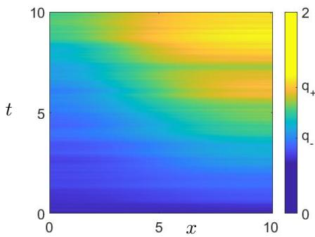
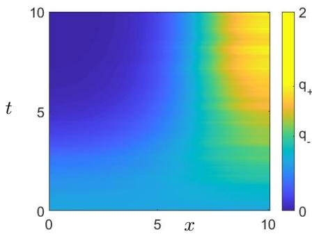
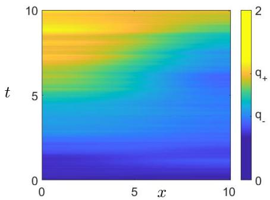
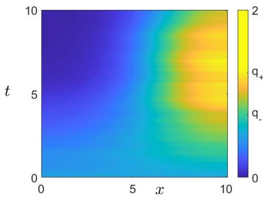
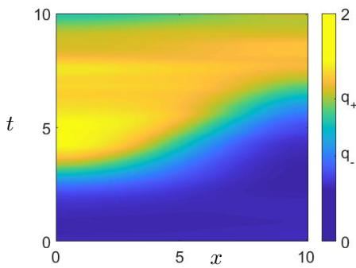
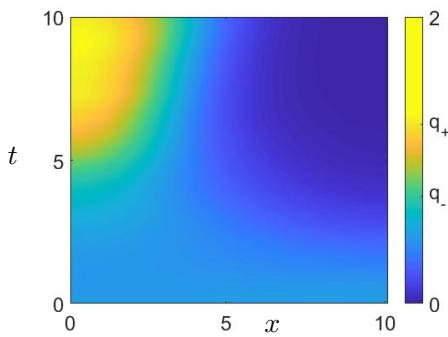
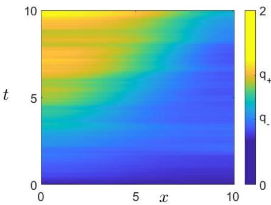
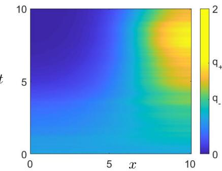
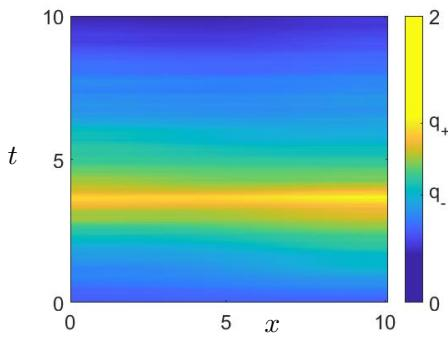
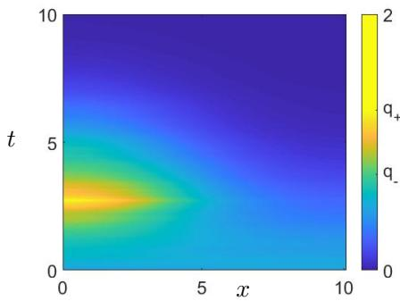

# Probability of Transition to Turbulence in a Reduced Stochastic Model of Pipe Flow

P. Bernuzzi1,† and C. Kuehn1,2

1Technical University of Munich, School of Computation Information and Technology, Department of Mathematics, Boltzmannstraße 3, 85748 Garching, Germany

2Technical University of Munich, Munich Data Science Institute, Walther-von-Dyck-Straße 10, 85748 Garching, Germany †Author to whom any correspondence should be addressed.

Email addresses: paolo.bernuzzi@ma.tum.de (P. Bernuzzi), ckuehn@ma.tum.de (C. Kuehn).

March 4, 2025

## Abstract

We study the phenomenon of turbulence initiation in pipe flow under diferent noise structures by estimating the probability of initiating metastable transitions. We establish lower bounds on turbulence transition probabilities using linearized models with multiplicative noise near the laminar state. First, we consider the case of stochastic perturbations by Itô white noise; then, through the Stratonovich interpretation, we extend the analysis to noise types such as white and red noise in time. Our findings demonstrate the viability of detecting the onset of turbulence as rare events under diverse noise assumptions. The results also contribute to applied SPDE theory and ofer valuable methodologies for understanding turbulence across application areas.

Keywords: SPDEs, transition to turbulence, plane Couette flow, red noise, metastability.

Funding: This work was supported by the European Union’s Horizon 2020 research and innovation programme under Grant Agreement 956170.

## 1 Introduction

The flow of a fluid is known to display diferent behaviour depending on the assumptions on the fluid and the shape of the geometry traversed. We focus on plane Couette flow, or flow along a pipe, and the transition to turbulence starting from an initially laminar state [18]. Recently, this area has been connected to directed percolation, a classical area of probability theory. It is known that the transition to turbulence crucially depends upon the Reynolds number, i.e., on the ratio between inertial and viscous forces in a fluid. From a mathematical perspective, studying the transition to turbulence directly in the Euler or Navier-Stokes equations turns out to be extremely dificult. Yet, quite recently, other simplified models have been proposed and directly validated against experiments.

The first model proposed in [1, 2] is defined by two coupled stochastic partial diferential equations (SPDEs) with second-order dissipation, an advection term, and multiplicative degenerate Itô noise [25]. The solution of this system may display structures labeled as slugs for high Reynolds numbers, and the turbulent state covers the whole pipe in finite time with a high probability. Conversely, for low values of the corresponding parameter, the turbulent regions are absorbed in the laminar state in finite time with high probability. Lastly, traveling structures labeled as pufs indicate a fluctuating transition for intermediate values. In such cases, metastable transitions between turbulent and laminar states are observed in the pipe. The study of the rise and the splitting of pufs is relevant to describe the transition to turbulence as a rare event [14]. The steps involved in such an occurrence can be described through the computation of instantons, most likely paths to display rare occurrences [5, 19, 32].

The complex structure provided by the model discussed above is not observed for all fluids and is in contrast with the perspective of [26, 27]. In this case, the turbulent state is seen as a fluctuating state able to decay spontaneously. Conversely, the laminar state is an absorbing state, which is unable to induce turbulence into the system. The alternative model proposed in [13] is a one-dimensional SPDE that does not display advection. Furthermore, this simplified model does not show well-defined traveling states such as pufs and slugs. For this reason, the flow is labeled band-free. In particular, the transition to turbulence is primarily driven by noise and occurs more rarely than in the previously discussed cases. The transition mechanism can be studied numerically through the adjoint state method [5], which captures the instanton for various types of noise. Alternatively, the Trajectory-Adaptive Multilevel Sampling algorithm (TAMS) [19, 32] computes diferent trajectories that display such an event. Along with the description of such an occurrence, the analytic estimation of the probability of jumps provides a valuable tool to predict the likelihood of this phenomenon.

The metastable jump to turbulence is rare under the assumption of initial conditions close to the laminar state. Under such conditions, we label this transition as turbulence initiation, or turbulence onset, to indicate that it is primarily induced by noise. Therefore, the linearization of the model near such a steady state is a natural simplification. The linearized system resembles the cable equation [31], or a heat equation with a second linear dissipative term, with multiplicative noise. The literature regarding such a model is vast. These types of SPDEs have been studied in a theoretical context to understand the influence of noise on potential finite-time blow-up of the solution. In particular, for standard white noise multiplied by a multiplicative term of order $\gamma > \frac { 3 } { 2 }$ the mild solution is proven to diverge to infinity in finite time [23, 24]. Conversely, for a multiplicative term of order $\begin{array} { r } { 0 \leq \dot { \gamma } \leq \frac { 3 } { 2 } } \end{array}$ the mild solution of the linear system does not explode in finite time [22, 28]. Although the band-free plane Couette flow model considers noise of order $\gamma = 1$ , we show in this paper that analytic techniques employed in the proof of blow-up of the mild solution, in [23], can be applied to our case of interest to describe turbulence initiation under Itô white Gaussian noise.

In [2], diferent types of noise are admitted to perturb the system, although only Itô noise is addressed to simplify numerical simulations. In this work, we study the onset of turbulence for various Gaussian noise terms. For instance, Stratonovich noise is a natural alternative to Itô noise in physical applications and fluid dynamics, particularly due to the chain rule property [11, 16]. The computation of higher bounds for the probability of metastable transitions has already been achieved for cable equations under the assumption of additive Itô noise [4, 6]. Under such assumptions, the solution to the problem displays a qualitatively diferent behaviour from the multiplicative noise case: first, its sign can change in contrast to the cable equation with multiplicative noise; furthermore, the laminar state is not an absorbing state, which is a fundamental property of the original system. Nevertheless, the Cole-Hopf transformation reveals structural parallels between the systems. In fact, the study of the strong solution of the original system under Stratonovich noise on a logarithmic scale, in the form of the KPZ equation, displays an additive noise term [3, 8, 15]. Standard techniques enable the construction of a lower bound to the probability of transition to turbulence in specific domain regions. This method is then extended to the case of red noise in order to introduce memory in the noise component. We discuss two diferent interpretations of red (Stratonovich) noise, which are known to find applications in climate science [21, 17].

In conclusion, our methods prove the possibility of transition to turbulent states under diferent types of noise assumptions in simplified fluid dynamics models that have been suggested in applications. These results are implied by the stochastic perturbations in the system despite the non-trivial nature of the noise involved. Furthermore, they advance the analytic study of SPDEs, particularly with (multiplicative) Stratonovich noise.

The paper is structured as follows. In Section 2, we introduce our main mathematical tools. Moreover, we justify the linearization of the system as a method to study the solutions in the proximity to the laminar state and to obtain a lower bound to the probability of the transition to turbulence. We construct the fundamental solution of the cable equation and discuss its properties. In Section 3, we consider perturbations enforced by Itô noise. We study the mild solution of the linearized model on the laminar state. By applying a suitable operator to counter the efect of the drift component, we obtain an observable in the form of a martingale. Through the use of similar techniques employed as in [23], we obtain the bound to the transition to turbulence. In Section 4, we consider the noise term in the Stratonovich interpretation. We assume first space-time white noise and then red noise in time. A lower bound to the local and global transition to turbulence is proven by studying its strong solution on a logarithmic scale through the Cole-Hopf transformation [15]. The methods are also shown to be extendable to the case of space heterogeneity in the system [6]. In Section 5, we compare the stated methods and discuss the diferences with already existing approaches.

## 2 Preliminaries and linearization

We introduce the spatial interval [0, L] for $L > 0 ,$ to be interpreted as the width of a pipe. For $x \in [ 0 , L ]$ and $t > 0$ , we define a variable $q = q ( x , t )$ modelling the turbulence level of a fluid along the plane Couette flow as discussed in [2, 13]. We study a family of stochastic partial diferential equations (SPDEs) used as simplified transition-to-turbulence models, for which we provide a mathematical and physical interpretation below. The SPDEs are given by

$$
\left\{ \begin{array}{l} \mathrm{d} q (x, t) = \big (\partial_ {x x} ^ {2} q (x, t) - q (x, t) + (r + 1) q (x, t) ^ {2} \left(2 - q (x, t)\right) + \sigma_ {\mathrm{R}} q (x, t) \circ F (\xi) (x, t) \big)   \mathrm{d} t \\ \qquad + \sigma_ {\mathrm{I}} q (x, t) Q ^ {\frac {1}{2}} \mathrm{d} W _ {t} + \sigma_ {\mathrm{S}} q (x, t) \circ Q ^ {\frac {1}{2}} \mathrm{d} W _ {t}, \\ \partial_ {x} q (0, t) = \partial_ {x} q (L, t) = 0, \\ q (x, 0) = q _ {0} (x). \end{array} \right.\tag{2.1}
$$

We interpret $r > 0$ as a value related to the Reynolds number, which defines the behaviour of the solution. The family of models (2.1) includes noises of diferent forms to consider diferent interpretations of the small stochastic forcing. Therefore, the following parameters are to be interpreted as intensities of the noise term and are justified by models describing turbulence: $\sigma _ { \mathrm { { I } } } \geq 0$ as the intensity of white noise interpreted in the Itô sense $[ 1 3 ] ; \sigma _ { \mathrm { S } } \geq 0$ as the intensity of white noise interpreted in the Stratonovich perspective [11], labeled with $\circ ; \ \sigma _ { \mathrm { R } } \ \geq \ 0$ as a correlation intensity which can induce perturbations in the system [17, 21] in Stratonovich sense. The Itô and Stratonovich assumptions are mathematically equivalent, as they can be converted by including the Itô-Stratonovich correction term [12, 30]. As such, we always assume $\sigma _ { \mathrm { I } } \sigma _ { \mathrm { S } } = 0$ . Then, under the assumption of red noise, we introduce the adapted Ornstein-Uhlenbeck process $\xi = \xi ( x , t )$ in $L ^ { 2 } ( [ 0 , L ] )$ and assume $\sigma _ { \mathrm { R } } > 0$ . The operator $F$ is interpreted as a diferential operator that maps the Ornstein-Uhlenbeck process to $L ^ { 2 } ( [ 0 , L ] )$ . Examples are provided in Subsection 4.2. Conversely, the noise is interpreted in Section 3 as Itô white noise in time, i.e., $\sigma _ { \mathrm { { I } } } > \sigma _ { \mathrm { { S } } } = \sigma _ { \mathrm { { R } } } = 0$ , and in Subsection 4.1 as Stratonovich white noise in time, i.e., $\sigma _ { \mathrm { S } } > \sigma _ { \mathrm { I } } = \sigma _ { \mathrm { R } } = 0$ . The systems discussed in the paper are converted to the Itô noise form in Appendix A. We introduce the cylindrical Wiener process $W ,$ as defined in [10, Chapter $^ { 4 ] , }$ i.e.,

$$
W _ {t} := W (x, t) = \sum_ {i = 0} ^ {\infty} b _ {i} (x) \beta_ {i} (t),\tag{2.2}
$$

for $\{ \beta _ { i } \} _ { i \in \mathbb { N } } \mathfrak { t }$ a family of independent normalized scalar Wiener processes in time, with filtration $\mathcal { F } _ { t } ^ { W }$ , and $\left\{ b _ { i } \right\} _ { i \in \mathbb { N } }$ a basis of $L ^ { 2 } ( [ 0 , L ] )$ The noise $Q ^ { \frac { 1 } { 2 } } W ,$ , considered as minor fluctuations in the fluid, is then assumed to be a Q-Wiener process. The operator $Q$ is self-adjoint and non-negative. We define its eigenvalues as $\left\{ \zeta _ { i } \right\} _ { i \in \mathbb { N } }$ with corresponding eigenbasis $\left\{ b _ { i } \right\} _ { i \in \mathbb { N } }$ of $L ^ { 2 } ( [ 0 , L ] )$ , described further below in each section. The operator also assumes at least one of the following properties: it is trace-class, or it is bounded with eigenfunctions that converge to the eigenfunctions of the Laplacian in $L ^ { \infty } ( [ 0 , L ] ,$ )-norm with rate suficient to imply the existence of the solution [6]. The boundary conditions are specified as homogeneous Neumann, although our methods also extend to periodic boundary conditions. Lastly, the initial condition $q _ { 0 }$ is assumed to be non-negative on [0, L] and a positive function almost everywhere on the interval. Therefore, we consider q to be non-negative for any $t > 0$ and to not be initiated in the laminar state. Under these assumptions, the solution of (2.1) is proven [10, Chapter 7] to be in the Hilbert space $L ^ { 2 } ( [ 0 , L ] )$ almost surely for $t > 0$ . The scalar product of $L ^ { 2 } ( [ 0 , L ] )$ is defined as $\langle \cdot , \cdot \rangle$ and the corresponding norm as ||·||. The norms in the other $L ^ { p } ( [ 0 , L ] )$ spaces are indicated as $| | { \cdot } | | _ { p } .$ . The scalar product in any other Hilbert space $\mathcal { X }$ is labeled as $\langle \cdot , \cdot \rangle _ { \mathscr { X } }$

The deterministic system, i.e., $\sigma _ { \mathrm { { I } } } = \sigma _ { \mathrm { { S } } } = \sigma _ { \mathrm { { R } } } = 0$ , displays three steady states: $q _ { 1 } \equiv 0 , q _ { 2 } \equiv q _ { - }$ − and $q _ { 3 } \equiv q _ { + }$ , for

$$
q _ {\pm} = 1 \pm \sqrt {\frac {r}{r + 1}} \in [ 0, 2 ].
$$

The deterministically stable states $q _ { 1 }$ and $q _ { 3 }$ are identified as the laminar and the turbulent state, respectively. The state q is a saddle for the deterministic model. Lastly, we define $\tau _ { J }$ as the first time $t \geq 0 ,$ , such that $| | q ( \cdot , t ) | | _ { \infty } > J .$ . In Figure 1, we observe two examples of turbulence onset under Itô white noise and Stratonovich white noise assumptions, respectively. In each case, the initial state lies below the saddle, $0 < q _ { 0 } < q _ { 2 }$ , and $\tau _ { q _ { 3 } } < T = 1 0$ . The initiation of turbulence is attributed to the growth of an $L ^ { p } ( [ 0 , L ] ) { \mathrm { - n o r m } }$ . The paths are obtained through the TAMS algorithm.

In order to observe the behaviour of $q$ in the proximity of the laminar state, we study the mild solution $u _ { \alpha } = u _ { \alpha } ( x , t )$ of the linear system with corresponding noise,

$$
\left\{ \begin{array}{l} \mathrm{d} u _ {\alpha} (x, t) = \left(\partial_ {x x} ^ {2} u _ {\alpha} (x, t) - \alpha u _ {\alpha} (x, t) + \sigma_ {\mathrm{R}} u _ {\alpha} (x, t) \circ F (\xi) (x, t)\right) \mathrm{d} t \\ \qquad + \sigma_ {\mathrm{I}} u _ {\alpha} (x, t) Q ^ {\frac {1}{2}} \mathrm{d} W _ {t} + \sigma_ {\mathrm{S}} u _ {\alpha} (x, t) \circ Q ^ {\frac {1}{2}} \mathrm{d} W _ {t}, \\ \partial_ {x} u _ {\alpha} (0, t) = \partial_ {x} u _ {\alpha} (L, t) = 0, \\ u _ {\alpha} (x, 0) = q _ {0} (x), \end{array} \right.\tag{2.3}
$$

for $\alpha = 1$ . We refer to the solution of the system following the noise assumptions, i.e., the values of $\sigma _ { \mathrm { { I } } } , \sigma _ { \mathrm { { S } } } , \sigma _ { \mathrm { { R } } } \colon$ we denote by $u _ { \alpha } ^ { \mathrm { I } } = u _ { \alpha } ^ { \mathrm { I } } ( x , t )$ the mild solution of (2.3) under Itô white noise; $u _ { \alpha } ^ { \mathrm { S } } = u _ { \alpha } ^ { \mathrm { S } } ( x , t )$ is the strong solution under Stratonovich white noise; $u _ { \alpha } ^ { \mathrm { R } } = u _ { \alpha } ^ { \mathrm { R } } ( x , t )$ refers to the strong solution under Stratonovich red noise. We focus on the case for which $q \ \leq \ 2 ,$ , as $0 \equiv q _ { 1 } < q _ { 2 } < q _ { 3 } < 2$ . We define $v _ { J } ^ { \mathrm { S } }$ as the first time $t \geq 0$ , such that $\| u _ { \alpha } ^ { \mathrm { S } } ( \cdot , t ) \| _ { \infty } > J .$ Equivalently, $v _ { J } ^ { \mathrm { I } }$ is the first time $t ,$ such that $| | u _ { \alpha } ^ { \mathrm { I } } ( \cdot , t ) | | _ { \infty } > J$ . Therefore, we can prove the lemma to follow.

Lemma 2.1. We consider q, the mild solution of (2.1), and u1, the mild solution of (2.3) for $\alpha = 1 , x \in [ 0 , L ]$ and $t \in [ 0 , T ]$ Moreover, we assume that $q ( x , t ) \leq 2$ for any $x \in [ 0 , L ]$ and $t \in [ 0 , T ]$ . Then, the conclusions are:

(a) the inequality $\boldsymbol { l } ( \boldsymbol { x } , t ) \ge u _ { 1 } ( \boldsymbol { x } , t )$ holds under the same sample W and for almost every $x \in [ 0 , L ]$ and $t \in [ 0 , T ]$ ;

(b) for $J \le 2$ and $\sigma _ { S } > \sigma _ { I } = 0$ , the inequality $\tau { \boldsymbol { J } } \leq v _ { \boldsymbol { J } } ^ { S }$ holds;

(c) for $J \le 2$ and $\sigma _ { I } > \sigma _ { S } = 0$ , the inequality $\tau _ { J } \leq v _ { J } ^ { I }$ holds.

  
(a) Trajectory q solving (2.1) with Itô white noise and describing turbulence onset with respect to the $L ^ { 1 } ( [ 0 , L ] ) { \mathrm { - n o r m } } .$

  
(b) Trajectory q solving (2.1) with Itô white noise and describing turbulence onset with respect to the $L ^ { \infty } ( [ 0 , L ] ) \mathrm { - n o r m } .$

  
(c) Trajectory q solving (2.1) with Stratonovich white noise and describing turbulence onset with respect to the $L ^ { 1 } ( [ 0 , L ] ) { \mathrm { - n o r m } } .$

  
(d) Trajectory q solving (2.1) with Stratonovich white noise and describing turbulence onset with respect to the $L ^ { \infty } ( [ 0 , L ] ) – \mathrm { n o r m }$  
Fig. 1 (a) and (b) show trajectories of q, solution of (2.1), indicating the onset of turbulence under Itô noise, $0 . 5 = \sigma _ { \mathrm { I } } > \sigma _ { \mathrm { S } } = \sigma _ { \mathrm { R } } = 0$ ; whereas in (c) and (d) it is associated with Stratonovich noise, $0 . 5 = \sigma _ { \mathrm { S } } > \sigma _ { \mathrm { R } } = \sigma _ { \mathrm { R } } = 0$ . The interpretation of turbulence initiation is associated with an $L ^ { p } ( [ 0 , L ] )$ )-norm described below.

We consider $\{ e _ { i } \} _ { i \in \mathbb { N } }$ the normalized eigenfunctions of the Laplace operator on [0, L] under Neumann boundary conditions. We assume the noise perturbation on the solution along 101 modes, $b _ { i } = e _ { i }$ for $i \in \{ 0 , \ldots , 1 0 0 \}$ , with intensity $\zeta _ { i } = \exp \left( - ( i - 1 ) ^ { 2 } \right)$ . The initial solution is set at $q _ { 0 } \equiv 0 . 5$ The Reynolds parameter is $r = { \frac { 1 } { 1 5 } }$ , which implies that $q _ { - } ~ = ~ 0 . 7 5$ and $q _ { + } = 1 . 2 5$ We set $L = T = 1 0$ and space and time step as 0.1 and $_ { 0 . 0 1 }$ respectively. In (a) and (c) we observe the rise of ||q||1 to the value $q _ { + } L ,$ , while in (b) and (d) we capture the rise of $| | q | | _ { \infty }$ to the value q+. These rare events are computed via the TAMS algorithm, for which we run 50 simulations each and use the respective norm as a score function. The simulations are achieved through the discretized mild solution formula [10]. As described in Appendix A, the systems difer in view of the Itô-Stratonovich correction term, which implies an additional heterogeneous positive drift term in the case of Stratonovich white noise.

Proof. We study $\tilde { u } = q - u _ { 1 }$ under the assumptions $\sigma _ { \mathrm { I } } \geq 0 , \sigma _ { \mathrm { S } } \geq 0$ and $\sigma _ { \mathrm { R } } \geq 0$ . The diference u˜ is the mild solution of

$$
\left\{ \begin{array}{l} \mathrm{d} \tilde {u} (x, t) = \big (\partial_ {x x} ^ {2} \tilde {u} (x, t) - \tilde {u} (x, t) + (r + 1) q (x, t) ^ {2} \left(2 - q (x, t)\right) + \sigma_ {\mathrm{R}} \tilde {u} (x, t) \circ F (\xi) (x, t) \big)   \mathrm{d} t \\ \qquad + \sigma_ {\mathrm{I}} \tilde {u} (x, t) Q ^ {\frac {1}{2}} \mathrm{d} W _ {t} + \sigma_ {\mathrm{S}} \tilde {u} (x, t) \circ Q ^ {\frac {1}{2}} \mathrm{d} W _ {t}, \\ \partial_ {x} \tilde {u} (0, t) = \partial_ {x} \tilde {u} (L, t) = 0, \\ \tilde {u} (x, 0) \equiv 0. \end{array} \right.
$$

Therefore, it solves,

$$
\begin{array}{r l} & {\tilde {u} (x, t) = (r + 1) \int_ {0} ^ {t} \mathrm{e} ^ {(t - s) (\partial_ {x x} ^ {2} - 1)} (q (x, s) ^ {2} (2 - q (x, s))) \mathrm{d} s + \sigma_ {\mathrm{R}} \int_ {0} ^ {t} \mathrm{e} ^ {(t - s) (\partial_ {x x} ^ {2} - 1)} \tilde {u} (x, s) \circ F (\xi) (x, s) \mathrm{d} s} \\ & {\quad + \sigma_ {\mathrm{I}} \int_ {0} ^ {t} \mathrm{e} ^ {(t - s) (\partial_ {x x} ^ {2} - 1)} \tilde {u} (x, s) Q ^ {\frac {1}{2}} \mathrm{d} W _ {s} + \sigma_ {\mathrm{S}} \int_ {0} ^ {t} \mathrm{e} ^ {(t - s) (\partial_ {x x} ^ {2} - 1)} \tilde {u} (x, s) \circ Q ^ {\frac {1}{2}} \mathrm{d} W _ {s}.} \end{array}\tag{2.4}
$$

Due to the Neumann boundary conditions, the continuous semigroup $\underset { \underset { \ r { c } } { \ r { \ r } } } { \big ( } t - s \big ) \Big ( \partial _ { x x } ^ { 2 } - 1 \Big )$ does not afect the sign of the argument function.

Since the first term in the right-hand side of (2.4) is positive and by the fact that the other terms are multiplicative in u˜, it follows that $q ( x , t ) \geq u _ { 1 } ^ { \mathrm { S } } ( x , t )$ for any $x \in [ 0 , L ]$ and $t \in [ 0 , T ]$

We set $\sigma _ { \mathrm { S } } > \sigma _ { \mathrm { I } } = 0 . \mathrm { ~ I f ~ } v _ { J } ^ { \mathrm { S } } \leq \tau _ { 2 }$ , then we obtain $\tau  \} \leq v _ { J } ^ { \mathrm { S } }$ . Conversely, for $\tau _ { 2 } \leq v _ { J } ^ { \mathrm { S } }$ , it follows that $\tau  \} \leq v _ { J } ^ { \mathrm { S } }$ , since $\tau J \leq \tau _ { 2 }$ . The Itô noise perspective, i.e., case $( c )$ , can be proven through equivalent reasoning. □

The linearization enables the construction of the following results and further justifies the study of the fundamental solution of the cable equation. We shall denote the fundamendal solution by $G _ { \alpha }$ and it solves the system

$$
\left\{ \begin{array}{l} \mathrm{d} G _ {\alpha} (x, y, t, [ 0, L ]) = \left(\partial_ {x x} ^ {2} - \alpha\right) G _ {\alpha} (x, y, t, [ 0, L ]) \mathrm{d} t, \\ \partial_ {x} G _ {\alpha} (0, y, t, [ 0, L ]) = \partial_ {x} G _ {\alpha} (L, y, t, [ 0, L ]) = 0, \\ G _ {\alpha} (x, y, 0, [ 0, L ]) = \delta_ {0} (y - x), \end{array} \right.\tag{2.5}
$$

where $\delta _ { 0 }$ is the Dirac delta. The solution $G _ { \alpha }$ can be obtained through diferent methods [31]. For the purposes of this paper, we consider solely the form

$$
G _ {\alpha} (x, y, t, [ 0, L ]) = \mathrm{e} ^ {- t \alpha} \left(\sum_ {n = 0} ^ {\infty} e _ {n} (x) e _ {n} (y) \mathrm{e} ^ {- t \lambda_ {n}}\right),
$$

for $\{ e _ { i } \} _ { i \in \mathbb { N } }$ the eigenbasis of the Laplacian operator in $L ^ { 2 } ( [ 0 , L ] )$ and for $\{ - \lambda _ { i } \} _ { i \in \mathbb { N } }$ the corresponding eigenfunctions. Under Neumann boundary conditions, they are defined as

$$
\begin{array}{c} e _ {0} \equiv \frac {1}{\sqrt {L}}, \\ e _ {n} (x) = \sqrt {\frac {2}{L}} \cos \left(\frac {n \pi x}{L}\right), \text {   for   any   } n \in \mathbb {N} _ {> 0}, \\ \lambda_ {n} = \left(\frac {n \pi}{L}\right) ^ {2}, \qquad \text {   for   any   } n \in \mathbb {N}, \end{array}
$$

for $x \in [ 0 , L ]$ . Finally, it is easy to observe that the fundamental solution satisfies

$$
\int_ {0} ^ {L} G _ {\alpha} (x, y, t, [ 0, L ]) G _ {\alpha} (y, z, s, [ 0, L ]) \mathrm{d} y = G _ {\alpha} (x, z, t + s, [ 0, L ]),\tag{2.6}
$$

for $t > 0 , s > 0$ and $z \in [ 0 , L ]$

## 3 Itô noise: Countering the drift component

In this section, we study white noise in Itô sense, interpreted as the assumption $\sigma _ { \mathrm { { I } } } > \sigma _ { \mathrm { { S } } } = \sigma _ { \mathrm { { R } } } = 0$ in (2.1) and in (2.3). We assume $b _ { 0 } = e _ { 0 }$ and that $\zeta _ { 0 } > 0 ,$ . We consider $u _ { \alpha } ^ { \mathrm { I } } = u _ { \alpha } ^ { \mathrm { I } } ( x , t )$ , the mild solution of (2.3) for $\alpha > 0$ as

$$
u _ {\alpha} ^ {\mathrm{I}} (x, t) = \int_ {0} ^ {L} G _ {\alpha} (x, y, t, [ 0, L ]) q _ {0} (y) \mathrm{d} y + \sigma_ {\mathrm{I}} \int_ {0} ^ {L} \int_ {0} ^ {t} G _ {\alpha} (x, y, t - s, [ 0, L ]) u _ {\alpha} ^ {\mathrm{I}} (y, s) Q ^ {\frac {1}{2}} \mathrm{d} W _ {s} \mathrm{d} y.\tag{3.1}
$$

For the fixed time $T > 0$ and any $y \in [ 0 , L ]$ , we define

$$
\phi_ {\alpha} (x, y, t, [ 0, L ]) := G _ {\alpha} (x, y, T - t, [ 0, L ]),
$$

where $x \in [ 0 , L ]$ and $t \in [ 0 , T ]$ . By construction of (2.5), we have that $\phi _ { \alpha }$ solves

$$
\left\{ \begin{array}{l} \mathrm{d} \phi_ {\alpha} (x, y, t, [ 0, L ]) = \left(- \partial_ {x x} ^ {2} + \alpha\right) \phi_ {\alpha} (x, y, t, [ 0, L ]) \mathrm{d} t, \\ \partial_ {x} \phi_ {\alpha} (0, y, t, [ 0, L ]) = \partial_ {x} \phi_ {\alpha} (L, y, t, [ 0, L ]) = 0, \\ \phi_ {\alpha} (x, y, T, [ 0, L ]) = \delta_ {0} (y - x), \end{array} \right.
$$

for $x \in [ 0 , L ]$ and $t \in [ 0 , T )$ . In the following lemma, we use $\phi _ { \alpha }$ to define an observable, which we prove to be a martingale.

Lemma 3.1. For any $x \in [ 0 , L ]$ and $t \in [ 0 , T ]$ , the process M defined as

$$
M (t) = \int_ {0} ^ {L} \int_ {0} ^ {L} \phi_ {\alpha} (x, y, t, [ 0, L ]) u _ {\alpha} ^ {I} (y, t) d y d x = \mathrm{e} ^ {- (T - t) \alpha} | | u _ {\alpha} ^ {I} (\cdot , t) | | _ {1},\tag{3.2}
$$

with $u _ { \alpha } ^ { I }$ denoting the mild solution of (2.3), is a non-negative $\mathcal { F } _ { t } ^ { W }$ -martingale. Its quadratic variation, ⟨M ⟩, satisfies

$$
\langle M \rangle (t) \geq \zeta_ {0} \frac {\sigma_ {I} ^ {2}}{L ^ {2}} \int_ {0} ^ {t} M (s) ^ {2} d s,\tag{3.3}
$$

for any $t \in [ 0 , T ]$

Proof. In the first part of the proof, we follow a similar approach to [24, Lemma 2.3] to prove that M is a $\mathcal { F } _ { t } ^ { W }$ -martingale. From its construction in (3.2), we consider the mild solution form of $u _ { \alpha } ^ { \mathrm { I } }$ in (3.1). Then, we employ property (2.6) to obtain

$$
M (t) = \int_ {0} ^ {L} \int_ {0} ^ {L} \phi_ {\alpha} (x, y, 0, [ 0, L ]) q _ {0} (y) \mathrm{d} y \mathrm{d} x + \sigma_ {\mathrm{I}} \int_ {0} ^ {L} \int_ {0} ^ {L} \int_ {0} ^ {t} \phi_ {\alpha} (x, y, s, [ 0, L ]) u _ {\alpha} ^ {\mathrm{I}} (y, s) Q ^ {\frac {1}{2}} \mathrm{d} W _ {s} \mathrm{d} y \mathrm{d} x.\tag{3.4}
$$

The observable M is an $\mathcal { F } _ { t } ^ { W }$ -martingale since it is the sum of a constant and an $\mathcal { F } _ { t } ^ { W }$ -martingale, which is a stochastic integral with integrand independent of t. Its quadratic variation is

$$
\langle M \rangle (t) = \sigma_ {\mathrm{I}} ^ {2} \int_ {0} ^ {L} \int_ {0} ^ {L} \int_ {0} ^ {t} \left(Q ^ {\frac {1}{2}} \left(\phi_ {\alpha} (x, y, s, [ 0, L ]) u _ {\alpha} ^ {\mathrm{I}} (y, s)\right)\right) ^ {2} \mathrm{d} s \mathrm{d} y \mathrm{d} x.\tag{3.5}
$$

Inequality (3.3) follows from similar steps to those included in the proof of [23, Lemma 2], which we adapt here to our setting. Through Jensen’s inequality, we obtain

$$
\begin{array}{l} \sigma_ {\mathrm{I}} ^ {2} \int_ {0} ^ {L} \int_ {0} ^ {L} \left(Q ^ {\frac {1}{2}} \left(\phi_ {\alpha} (x, y, s, [ 0, L ]) u _ {\alpha} ^ {\mathrm{I}} (y, s)\right)\right) ^ {2} \mathrm{d} y \mathrm{d} x \\ = \sigma_ {\mathrm{I}} ^ {2} L ^ {2} \int_ {0} ^ {L} \int_ {0} ^ {L} \left(Q ^ {\frac {1}{2}} \left(\phi_ {\alpha} (x, y, s, [ 0, L ]) u _ {\alpha} ^ {\mathrm{I}} (y, s)\right)\right) ^ {2} \frac {1}{L ^ {2}} \mathrm{d} y \mathrm{d} x \\ \geq \sigma_ {\mathrm{I}} ^ {2} L ^ {2} \left(\int_ {0} ^ {L} \int_ {0} ^ {L} Q ^ {\frac {1}{2}} \left(\phi_ {\alpha} (x, y, s, [ 0, L ]) u _ {\alpha} ^ {\mathrm{I}} (y, s)\right) \frac {1}{L ^ {2}} \mathrm{d} y \mathrm{d} x\right) ^ {2} \\ = \sigma_ {\mathrm{I}} ^ {2} L ^ {2} \left(\zeta_ {0} ^ {\frac {1}{2}} \int_ {0} ^ {L} \int_ {0} ^ {L} \left(\phi_ {\alpha} (x, y, s, [ 0, L ]) u _ {\alpha} ^ {\mathrm{I}} (y, s)\right) \frac {1}{L ^ {2}} \mathrm{d} y \mathrm{d} x\right) ^ {2} = \zeta_ {0} \frac {\sigma_ {\mathrm{I}} ^ {2}}{L ^ {2}} M (s) ^ {2}. \end{array}
$$

The proof is concluded by integrating of the left-hand side and right-hand side over the time interval $s \in [ 0 , t ] ,$ , for $t \in [ 0 , T ]$

As indicated in (3.2), the observable M is equivalent to the $L ^ { 1 } ( [ 0 , L ] ) \mathrm { - n o r m ~ o f ~ } u _ { \alpha } ^ { \mathrm { I } }$ rescaled in time through an exponential weight. The weight increases with time $t ,$ and its efect balances the dissipative term in the cable equation in (2.3) for $\alpha > 0$ . Consequently, the integrands in (3.4) do not depend on t, and M is a martingale. The simplicity of the formula is a consequence of the fact that $\lambda _ { 0 } = 0$ and that the corresponding eigenfunction e0 is constant.

We set $\begin{array} { r } { J _ { 1 } = \frac { | | q _ { 0 } | | _ { 1 } } { L } } \end{array}$ and $J _ { 0 } \mathrm { e } ^ { - T \alpha } < J _ { 1 } \mathrm { e } ^ { - T \alpha } < J _ { 1 } < J _ { 2 }$ . From construction, we obtain $M ( 0 ) = L J _ { 1 } \mathrm { e } ^ { - T \alpha }$ . The values $J _ { 0 } , J _ { 1 }$ and $J _ { 2 }$ are chosen to guarantee the correctness of the studied inequalities upon rescaling of $L , \sigma _ { \mathrm { { I } } } , c$ and T . Lastly, we define the stopping time τ as the first time in which $M ( t )$ assumes the values $\stackrel { \cdot } { L } J _ { 0 } \mathrm { e } ^ { - T \alpha }$ or $L J _ { 2 }$

Lemma 3.2. For any $\alpha > 0 , \sigma _ { I } > 0 , T > 0$ we set $J _ { 0 } , J _ { 1 }$ and $J _ { 2 }$ as defined above. Then, the following result holds:

$$
\mathbb {P} \left(M (\tau) = L J _ {2}\right) = \frac {J _ {1} - J _ {0}}{J _ {2} \mathrm{e} ^ {T \alpha} - J _ {0}}.\tag{3.6}
$$

Furthermore, we obtain the bound

$$
\mathbb {P} \left(M (\tau \wedge T) = L J _ {2}\right) \geq \frac {J _ {1} - J _ {0}}{J _ {2} \mathrm{e} ^ {T \alpha} - J _ {0}} - \left(\frac {J _ {2}}{J _ {0}} \mathrm{e} ^ {T \alpha} - \frac {J _ {1}}{J _ {0}}\right) \frac {L}{\zeta_ {0} ^ {\frac {1}{2}} \sigma_ {I}} T ^ {- \frac {1}{2}},\tag{3.7}
$$

for $\tau \wedge T = m i n \{ \tau , T \}$

Proof. Since M is a martingale, we can apply Doob’s optional stopping theorem to obtain that $\mathbb { E } ( M ( \tau ) ) = \mathbb { E } ( M ( 0 ) ) = L J _ { 1 } \mathrm { e } ^ { - T \alpha }$

The definition of the stopping time τ implies that

$$
\mathbb {E} (M (\tau)) = L J _ {2} \mathbb {P} \left(M (\tau) = L J _ {2}\right) + L J _ {0} \mathrm{e} ^ {- T \alpha} \left(1 - \mathbb {P} \left(M (\tau) = L J _ {2}\right)\right),
$$

from which equality (3.6) follows. The Dubins-Schwarz theorem and the fact that M is a continuous martingale entail that

$$
M (t) = L J _ {1} \mathrm{e} ^ {- T \alpha} + \tilde {W} \left(\langle M \rangle (t)\right),
$$

for some scalar Wiener process $\tilde { W } ( t )$ and any $t \in [ 0 , T ]$ . Setting the martingale in such a form implies

$$
\begin{array}{l} \mathbb {P} \left(T <   \tau\right) = \mathbb {P} \left(T <   t, L J _ {0} \mathrm{e} ^ {- T \alpha} <   M (t) <   L J _ {2}, \text { for } t \in [ 0, T ]\right) \\ \qquad \leq \mathbb {P} \left(T <   t, M (t) <   L J _ {2}, \text { for } t \in [ 0, T ]\right) \\ \qquad = \mathbb {P} \left(T <   t, L J _ {1} \mathrm{e} ^ {- T \alpha} + \tilde {W} \left(\langle M \rangle (t)\right) <   L J _ {2}, \text { for } t \in [ 0, T ]\right). \end{array}\tag{3.8}
$$

In the case $t < \tau$ , it follows from (3.3) that

$$
\langle M \rangle (t) \geq \zeta_ {0} \sigma_ {\mathrm{I}} ^ {2} J _ {0} ^ {2} \mathrm{e} ^ {- 2 T \alpha} t
$$

and, from (3.8), that

$$
\begin{array}{l} \mathbb {P} \left(T <   \tau\right) \leq \mathbb {P} \left(T <   t, L J _ {1} \mathrm{e} ^ {- T \alpha} + \tilde {W} \left(\langle M \rangle \left(t\right)\right) <   L J _ {2}, \text {for} t \in [ 0, T ]\right) \\ \qquad \leq \mathbb {P} \left(T <   t, L J _ {1} \mathrm{e} ^ {- T \alpha} + \tilde {W} \left(t\right) <   L J _ {2}, \text {for} t \in [ 0, \langle M \rangle \left(T\right) ]\right) \\ \qquad \leq \mathbb {P} \left(T <   t, L J _ {1} \mathrm{e} ^ {- T \alpha} + \tilde {W} \left(t\right) <   L J _ {2}, \text {for} t \in \left[ 0, \zeta_ {0} \sigma_ {\mathrm{I}} ^ {2} J _ {0} ^ {2} \mathrm{e} ^ {- 2 T \alpha} T \right]\right). \end{array}
$$

Subsequently, we get

$$
\begin{array}{l} \mathbb {P} \left(T <   \tau\right) \leq \mathbb {P} \left(T <   t, L J _ {1} \mathrm{e} ^ {- T \alpha} + \tilde {W} \left(t\right) <   L J _ {2}, \text { for } t \in \left[ 0, \zeta_ {0} \sigma_ {\mathrm{I}} ^ {2} J _ {0} ^ {2} \mathrm{e} ^ {- 2 T \alpha} T \right]\right) \\ \quad \leq \mathbb {P} \left(\sup _ {t \in \left[ 0, \zeta_ {0} \sigma_ {\mathrm{I}} ^ {2} J _ {0} ^ {2} \mathrm{e} ^ {- 2 T \alpha} T \right]} \tilde {W} \left(t\right) <   L J _ {2} - L J _ {1} \mathrm{e} ^ {- T \alpha}\right) \\ = 1 - \mathbb {P} \left(\sup _ {t \in \left[ 0, \zeta_ {0} \sigma_ {\mathrm{I}} ^ {2} J _ {0} ^ {2} \mathrm{e} ^ {- 2 T \alpha} T \right]} \tilde {W} \left(t\right) \geq L J _ {2} - L J _ {1} \mathrm{e} ^ {- T \alpha}\right). \end{array}
$$

Then, through the reflection principle, we obtain

$$
\begin{array}{l} \mathbb {P} \left(T <   \tau\right) \leq 1 - \mathbb {P} \left(\sup _ {t \in \left[ 0, \zeta_ {0} \sigma_ {\mathrm{I}} ^ {2} J _ {0} ^ {2} \mathrm{e} ^ {- 2 T \alpha} T \right]} \tilde {W} \left(t\right) \geq L J _ {2} - L J _ {1} \mathrm{e} ^ {- T \alpha}\right) \\ = 1 - 2 \mathbb {P} \left(\tilde {W} \left(\zeta_ {0} \sigma_ {\mathrm{I}} ^ {2} J _ {0} ^ {2} \mathrm{e} ^ {- 2 T \alpha} T\right) \geq L J _ {2} - L J _ {1} \mathrm{e} ^ {- T \alpha}\right) \\ = \mathbb {P} \left(\left| \tilde {W} \left(\zeta_ {0} \sigma_ {\mathrm{I}} ^ {2} J _ {0} ^ {2} \mathrm{e} ^ {- 2 T \alpha} T\right) \right| \leq L J _ {2} - L J _ {1} \mathrm{e} ^ {- T \alpha}\right) \\ = \left(2 \pi \zeta_ {0} \sigma_ {\mathrm{I}} ^ {2} J _ {0} ^ {2} \mathrm{e} ^ {- 2 T \alpha} T\right) ^ {- \frac {1}{2}} \int_ {- L J _ {2} + L J _ {1} \mathrm{e} ^ {- T \alpha}} ^ {L J _ {2} - L J _ {1} \mathrm{e} ^ {- T \alpha}} \exp \left(- \frac {x ^ {2}}{2 \zeta_ {0} \sigma_ {\mathrm{I}} ^ {2} J _ {0} ^ {2} \mathrm{e} ^ {- 2 T \alpha} T}\right) \mathrm{d} x \\ \leq \left(\frac {J _ {2}}{J _ {0}} \mathrm{e} ^ {T \alpha} - \frac {J _ {1}}{J _ {0}}\right) \frac {L}{\zeta_ {0} ^ {\frac {1}{2}} \sigma_ {\mathrm{I}}} T ^ {- \frac {1}{2}}. \end{array}\tag{3.9}
$$

From (3.6) and (3.9), it follows that

$$
\begin{array}{l} \mathbb {P} \left(M \left(\tau \wedge T\right) = L J _ {2}\right) = \mathbb {P} \left(M \left(\tau \wedge T\right) = L J _ {2}, T \geq \tau\right) \\ \qquad = \mathbb {P} \left(M \left(\tau\right) = L J _ {2}\right) - \mathbb {P} \left(M \left(\tau\right) = L J _ {2}, T <   \tau\right) \\ \qquad \geq \mathbb {P} \left(M \left(\tau\right) = L J _ {2}\right) - \mathbb {P} \left(T <   \tau\right) \\ \qquad \geq \frac {J _ {1} - J _ {0}}{J _ {2} \mathrm{e} ^ {T \alpha} - J _ {0}} - \left(\frac {J _ {2}}{J _ {0}} \mathrm{e} ^ {T \alpha} - \frac {J _ {1}}{J _ {0}}\right) \frac {L}{\zeta_ {0} ^ {\frac {1}{2}} \sigma_ {\mathrm{I}}} T ^ {- \frac {1}{2}}, \end{array}
$$

which concludes the proof.

The inequality (3.7) provides a tool to establish a lower bound to the probability of rise of the $L ^ { 1 } ( 0 , L )  – \mathrm { n o r m }$ of $u _ { \alpha } ^ { \mathrm { I } }$ . In fact, under

the assumption that $L J _ { 2 } = M \left( \tau \wedge T \right)$ , we can obtain the following:

$$
L J _ {2} = M \left(\tau \wedge T\right) = \exp \left(- \alpha \left(T - \tau \wedge T\right)\right) \left| \left| u _ {\alpha} ^ {\mathrm{I}} (\cdot , \tau \wedge T) \right| \right| _ {1} \leq \sup _ {0 \leq t \leq T} \left| \left| u _ {\alpha} ^ {\mathrm{I}} (\cdot , t) \right| \right| _ {1}.
$$

This entails that

$$
\frac {J _ {1} - J _ {0}}{J _ {2} \mathrm{e} ^ {T \alpha} - J _ {0}} - \left(\frac {J _ {2}}{J _ {0}} \mathrm{e} ^ {T \alpha} - \frac {J _ {1}}{J _ {0}}\right) \frac {L}{\zeta_ {0} ^ {\frac {1}{2}} \sigma_ {\mathrm{I}}} T ^ {- \frac {1}{2}} \leq \mathbb {P} \left(L J _ {2} \leq \sup _ {0 \leq t \leq T} \left| \left| u _ {\alpha} ^ {\mathrm{I}} (\cdot , t) \right| \right| _ {1}\right),\tag{3.10}
$$

which yields a further step towards the construction of a lower bound to the probability of the onset of turbulence. In fact, such a bound is carried over to the mild solution of (2.1) in the next corollary. Since the left-hand side can be negative for large values of $T ,$ the assumptions $\alpha \ll 1$ or $L \ll \sqrt { \zeta _ { 0 } } \sigma _ { \mathrm { I } }$ have to be enforced to ensure positivity for large intervals in time.

Corollary $\mathbf { 3 . 3 } , \mathbf { \Omega } ( a )$ We assume that $q ,$ the mild solution of (2.1) with Itô noise, satisfies $0 < q ( x , t ) \leq 2$ for any $x \in [ 0 , L ]$ and $t \in [ 0 , T ]$ . Furthermore, we set the initial conditions such that $\begin{array} { r } { 0 < J _ { 0 } \mathrm { e } ^ { - T \alpha } < \frac { | | q _ { 0 } | | _ { 1 } } { I _ { \cdot } } \mathrm { e } ^ { - T \alpha } < \frac { | | q _ { 0 } | | _ { 1 } } { I _ { \cdot } } < J _ { 2 } } \end{array}$ . Then we get

$$
\frac {J _ {1} - J _ {0}}{J _ {2} \mathrm{e} ^ {T} - J _ {0}} - \left(\frac {J _ {2}}{J _ {0}} \mathrm{e} ^ {T} - \frac {J _ {1}}{J _ {0}}\right) \frac {L}{\zeta_ {0} ^ {\frac {1}{2}} \sigma_ {I}} T ^ {- \frac {1}{2}} \leq \mathbb {P} \left(L J _ {2} \leq \underset {0 \leq t \leq T} {s u p} | | q (\cdot , t) | | _ {1}\right).
$$

(b) We consider $q ,$ the mild solution of (2.1) with Itô noise that satisfies $\begin{array} { r } { 0 < J _ { 0 } \mathrm { e } ^ { - T \alpha } < \frac { | | q _ { 0 } | | _ { 1 } } { I } \mathrm { e } ^ { - T \alpha } < \frac { | | q _ { 0 } | | _ { 1 } } { I } < J _ { 2 } < 2 } \end{array}$ . The following inequality holds:

$$
\sup _ {0 \leq t \leq T} \left(\frac {J _ {1} - J _ {0}}{J _ {2} \mathrm{e} ^ {t} - J _ {0}} - \left(\frac {J _ {2}}{J _ {0}} \mathrm{e} ^ {t} - \frac {J _ {1}}{J _ {0}}\right) \frac {L}{\zeta_ {0} ^ {\frac {1}{2}} \sigma_ {I}} t ^ {- \frac {1}{2}}\right) \leq \mathbb {P} \left(J _ {2} \leq \sup _ {0 \leq t \leq T} | | q (\cdot , t) | | _ {\infty}\right).\tag{3.11}
$$

Proof. The first statement follows directly from (3.10) for $\alpha = 1$ and Lemma 2.1 (a). In fact, since $q ( x , t ) \leq 2$ for all $x \in [ 0 , L ]$ and $t \in [ 0 , T ]$ ], we obtain

$$
\mathbb {P} \left(L J _ {2} \leq \sup _ {0 \leq t \leq T} \left| \left| u _ {1} ^ {\mathrm{I}} (\cdot , t) \right| \right| _ {1}\right) \leq \mathbb {P} \left(L J _ {2} \leq \sup _ {0 \leq t \leq T} | | q (\cdot , t) | | _ {1}\right).
$$

Similarly to the latter case, (3.10) for $\alpha = 1$ , Hölder’s inequality and Lemma 2.1 (c) imply that

$$
\begin{array}{l} \frac {J _ {1} - J _ {0}}{J _ {2} \mathrm{e} ^ {T} - J _ {0}} - \left(\frac {J _ {2}}{J _ {0}} \mathrm{e} ^ {T} - \frac {J _ {1}}{J _ {0}}\right) \frac {L}{\zeta_ {0} ^ {\frac {1}{2}} \sigma_ {\mathrm{I}}} T ^ {- \frac {1}{2}} \leq \mathbb {P} \left(L J _ {2} \leq \sup _ {0 \leq t \leq T} \big | \big | u _ {1} ^ {\mathrm{I}} (\cdot , t) \big | \big | _ {1}\right) \\ \qquad \qquad \qquad \qquad \qquad \qquad \qquad \qquad \qquad \qquad \qquad \qquad \qquad \qquad \qquad \qquad \qquad \qquad \qquad \qquad \qquad \qquad \qquad \qquad \qquad \qquad \qquad \qquad \qquad \qquad \qquad \qquad \qquad \qquad \\ \qquad \qquad \qquad \qquad \qquad \qquad \qquad \qquad \qquad \qquad \qquad \qquad \qquad \qquad \qquad \qquad \qquad \qquad \qquad \qquad \qquad \qquad \qquad \qquad \qquad \qquad \qquad \qquad \qquad \qquad \qquad \qquad \qend{array}
$$

Lastly, we obtain that, for any $T _ { 0 } \leq T .$

$$
\mathbb {P} \left(J _ {2} \leq \sup _ {0 \leq t \leq T _ {0}} | | q (\cdot , t) | | _ {\infty}\right) \leq \mathbb {P} \left(J _ {2} \leq \sup _ {0 \leq t \leq T} | | q (\cdot , t) | | _ {\infty}\right),
$$

which concludes the proof.

The statement in Corollary 3.3 pertains to the case when we consider trajectories of q with initial conditions below the saddle state, $q _ { 0 } < q _ { 2 } ,$ and final conditions between the saddle and the turbulence state, $q _ { - } < J _ { 2 } < q _ { + }$ , thus indicating turbulence initiation. Moreover, the assumption $q ( x , t ) \leq 2$ for all $x \in [ 0 , L ]$ and $t \in [ 0 , T ]$ is also not required to obtain inequality (3.11).

In this setting, the lower bound is valid (positive), for large time intervals under the assumption of thin pipes or large noise intensity. Aside from the value $J _ { 2 }$ that indicates the transition to turbulence occurrence, the lower bound in (3.7) is afected by the choice of $J _ { 0 } .$ This has further implications on the role of the final time T since the definition of the stopping time $\tau$ depends on $J _ { 0 }$ . Yet, in (3.11), the sign of the lower bound is not afected by the size of the time interval considered and is constant for suficiently large T . This is reflected by the dissipation towards $q _ { 1 }$ in the drift component of the mild solution $q .$ Such a behaviour indicates that the possibility of initiation of turbulence is less likely after large times. This property is discussed further in Section 5.

## 4 Stratonovich noise: Comparison SPDEs in a logarithmic scale

In this section, we set $\sigma _ { \mathrm { S } } + \sigma _ { \mathrm { R } } > \sigma _ { \mathrm { I } } = 0$ as we study (2.1). In order to enforce the existence and uniqueness of the strong solution of the system with Stratonovich noise [10, Section 6.5], we enforce the following assumptions. For fixed $m \in \mathbb { N } _ { > 0 }$ , we assume that

$$
\zeta_ {i} = 0 \quad , \text {   for   } i > m,
$$

and that there exists an $i \in \{ 0 , \ldots , m \}$ such that $\zeta _ { i } > 0$ and $\langle e _ { 0 } , b _ { i } \rangle \neq 0$ . Adhering to the study of the linearized system as justified in Lemma 2.1, we focus on a generalized version of the system (2.3). The model

$$
\left\{ \begin{array}{l} \mathrm{d} u (x, t) = \left(\partial_ {x x} ^ {2} u (x, t) - g (x) u (x, t) + \sigma_ {\mathrm{R}} u (x, t) \circ F (\xi) (x, t)\right) \mathrm{d} t + \sigma_ {\mathrm{S}} u (x, t) \circ Q ^ {\frac {1}{2}} \mathrm{d} W _ {t}, \\ \partial_ {x} u (0, t) = \partial_ {x} u (L, t) = 0, \\ u (x, 0) = q _ {0} (x), \end{array} \right.\tag{4.1}
$$

for $x \in [ 0 , L ]$ and $t > 0 ,$ , accounts for space-heterogeneity through the inclusion of the non-negative function $g \in L ^ { 2 } ( [ 0 , L ] )$ . Such an assumption follows from the applications on which the cable equation is found, such as climate science [6], due to the recurrent discrepancies in certain domain regions that can be found in such fields. In the next subsections, we obtain a lower bound to the probability of the turbulence onset for white and red Stratonovich noise, respectively.

## 4.1 White Stratonovich noise

We set $\sigma _ { \mathrm { R } } = 0$ in order to study white Stratonovich noise in time in the equation (4.1). The following lemma enables the study of the system on a logarithmic scale through the inverse Cole-Hopf transformation, thus obtaining the KPZ equation [15].

Lemma 4.1. We consider $u _ { g } ^ { S } = u _ { g } ^ { S } ( x , t )$ , the strong solution of (4.1) for $x \in [ 0 , L ]$ and $t > 0$ . Then, $v _ { g } ^ { S } = v _ { g } ^ { S } ( x , t ) : = l o g \left( u _ { g } ^ { S } \right)$ solves

$$
\left\{ \begin{array}{c} d v _ {g} ^ {S} (x, t) = \Big (\partial_ {x x} ^ {2} v _ {g} ^ {S} (x, t) + \big (\partial_ {x} v _ {g} ^ {S} (x, t) \big) ^ {2} - g (x) \Big)   d t + \sigma_ {S} Q ^ {\frac {1}{2}} d W _ {t}, \\ \partial_ {x} v _ {g} ^ {S} (0, t) = \partial_ {x} v _ {g} ^ {S} (L, t) = 0, \\ v _ {g} ^ {S} (x, 0) = l o g \left(q _ {0} (x)\right), \end{array} \right.\tag{4.2}
$$

for $x \in [ 0 , L ]$ and $t > 0$

Proof. Imposing $u _ { g } ^ { \mathrm { S } } = \exp \left( v _ { g } ^ { \mathrm { S } } \right)$ in (4.1), we obtain

$$
\left\{ \begin{array}{l} \mathrm{d} v _ {g} ^ {\mathrm{S}} (x, t) = u _ {g} ^ {\mathrm{S}} (x, t) ^ {- 1} \circ \mathrm{d} u _ {g} ^ {\mathrm{S}} (x, t) \\ \qquad = \left(u _ {g} ^ {\mathrm{S}} (x, t) ^ {- 1} \partial_ {x x} ^ {2} u _ {g} ^ {\mathrm{S}} (x, t) - g (x) u _ {g} ^ {\mathrm{S}} (x, t)\right) \mathrm{d} t + \left(\sigma_ {\mathrm{S}} u _ {g} ^ {\mathrm{S}} (x, t) ^ {- 1} u _ {g} ^ {\mathrm{S}} (x, t)\right) \circ Q ^ {\frac {1}{2}} \mathrm{d} W _ {t} \\ \qquad = \left(\partial_ {x x} ^ {2} v _ {g} ^ {\mathrm{S}} (x, t) + \left(\partial_ {x} v _ {g} ^ {\mathrm{S}} (x, t)\right) ^ {2} - g (x)\right) \mathrm{d} t + \sigma_ {\mathrm{S}} Q ^ {\frac {1}{2}} \mathrm{d} W _ {t}, \\ u _ {g} ^ {\mathrm{S}} (0, t) \partial_ {x} v _ {g} ^ {\mathrm{S}} (0, t) = u _ {g} ^ {\mathrm{S}} (L, t) \partial_ {x} v _ {g} ^ {\mathrm{S}} (L, t) = 0, \\ \exp \left(v _ {g} ^ {\mathrm{S}} (x, 0)\right) = q _ {0} (x). \end{array} \right.
$$

The boundary conditions in (4.2) follow from the fact that $u _ { g } ^ { \mathrm { S } }$ and $q _ { 0 } { \mathrm { ~ a r e } } ,$ , by construction, almost surely positive functions for any $t > 0$ □

The key benefit of the logarithmic perspective is the conversion of noise from a multiplicative form to an additive one. As a consequence, the nature of the drift component in (4.1) and (4.2) is drastically diferent. The system (4.2) is not linear since a shear deformation term is included, and a linear-in-time flow afects the solution. The lemma to follow aims to simplify the problem further.

Lemma 4.2. We consider $v _ { g } ^ { S } ,$ strong solution of (4.2), and $w _ { g } ^ { S } = w _ { g } ^ { S } ( x , t )$ , a strong solution of

$$
\left\{ \begin{array}{l l} d w _ {g} ^ {S} (x, t) = \left(\partial_ {x x} ^ {2} w _ {g} ^ {S} (x, t) - g (x)\right) d t + \sigma_ {S} Q ^ {\frac {1}{2}} d W _ {t}, \\ \partial_ {x} w _ {g} ^ {S} (0, t) = \partial_ {x} w _ {g} ^ {S} (L, t) = 0, \\ w _ {g} ^ {S} (x, 0) = l o g \left(q _ {0} (x)\right), \end{array} \right.\tag{4.3}
$$

for $x \in [ 0 , L ]$ and $t > 0$ . Then we obtain $v _ { g } ^ { S } ( x , t ) \geq w _ { g } ^ { S } ( x , t )$ under the same sample of $W ,$ for any almost $x \in [ 0 , L ]$ and $t > 0$

Proof. We define $\tilde { w } = v _ { g } ^ { \mathrm { S } } - w _ { g } ^ { \mathrm { S } }$ . By construction it solves

$$
\left\{ \begin{array}{l} \partial_ {t} \tilde {w} (x, t) = \partial_ {x x} ^ {2} \tilde {w} (x, t) + \left(\partial_ {x} v _ {g} ^ {\mathrm{S}} (x, t)\right) ^ {2}, \\ \partial_ {x} \tilde {w} (0, t) = \partial_ {x} \tilde {w} (L, t) = 0, \\ \tilde {w} (x, 0) \equiv 0. \end{array} \right.
$$

The conclusion of the proof follows the same reasoning as Lemma 2.1.

For the existence of $w _ { g } ^ { \mathrm { S } } .$ , we refer to [6] and [10, Theorem 5.29]. System (4.3) can be easily observed along the elements of a basis in $L ^ { 2 } ( [ 0 , L ] )$ . In the following lemma, the projections of the strong solution $w _ { g } ^ { \mathrm { S } }$ along the eigenbasis of the Laplacian operator are studied.

Lemma 4.3. We consider $w _ { g } ^ { S } ,$ strong solution of (4.3) for $x \in [ 0 , L ]$ and $t > 0$ . Then, for all $n \in \mathbb N$ , the scalar product $I _ { n , g } ( t ) : = \left. e _ { n } , w _ { g } ^ { S } ( \cdot , t ) \right.$ solves

$$
\left\{ \begin{array}{l} d I _ {n, g} (t) = (- \lambda_ {n} I _ {n, g} (t) - \langle e _ {n}, g \rangle)   d t + \sigma_ {S} \sum_ {i = 0} ^ {m} \left(\zeta_ {i} ^ {\frac {1}{2}}   \langle e _ {n}, b _ {i} \rangle   d \beta_ {i} (t)\right), \\ I _ {n, g} (0) = \langle e _ {n}, l o g (q _ {0}) \rangle , \end{array} \right.\tag{4.4}
$$

for any $t > 0$

Proof. We arbitrarily fix $n \in \mathbb { N }$ . Through (4.3), we obtain

$$
\left\{ \begin{array}{l} \mathrm{d} \left\langle e _ {n}, w _ {g} ^ {\mathrm{S}} (\cdot , t) \right\rangle = \left(\left\langle e _ {n}, \partial_ {x x} ^ {2} w _ {g} ^ {\mathrm{S}} (\cdot , t) \right\rangle - \left\langle e _ {n}, g \right\rangle\right) \mathrm{d} t + \sigma_ {\mathrm{S}} \left\langle Q ^ {\frac {1}{2}} e _ {n}, \mathrm{d} W _ {t} \right\rangle \\ \qquad = \left(- \lambda_ {n} \left\langle e _ {n}, w _ {g} ^ {\mathrm{S}} (\cdot , t) \right\rangle - \left\langle e _ {n}, g \right\rangle\right) \mathrm{d} t + \sigma_ {\mathrm{S}} \left\langle  \sum_ {i = 0} ^ {m} \zeta_ {i} ^ {\frac {1}{2}} \left\langle e _ {n}, b _ {i} \right\rangle b _ {i}, \mathrm{d} W _ {t} \right\rangle \\ \qquad = \left(- \lambda_ {n} \left\langle e _ {n}, w _ {g} ^ {\mathrm{S}} (\cdot , t) \right\rangle - \left\langle e _ {n}, g \right\rangle\right) \mathrm{d} t + \sigma_ {\mathrm{S}}  \sum_ {i = 0} ^ {m} \left(\zeta_ {i} ^ {\frac {1}{2}} \left\langle e _ {n}, b _ {i} \right\rangle \mathrm{d} \beta_ {i} (t)\right), \\ I _ {n, g} (0) = \left\langle e _ {n}, \log {(q _ {0})} \right\rangle , \end{array} \right.
$$

for $t > 0 ,$ , which concludes the proof.

The previous lemmas in this section describe, in their entirety, a chain of inequalities that constitute a bound from below of the strong solution $u _ { g } ^ { \mathrm { S } }$ of system (4.1). This approach is employed in the following theorem to define a bound to the probability of growth in a fixed time of $u _ { g } ^ { \mathrm { S } }$ on regions of the domain.

Theorem 4.4. Under the assumption that $u _ { g } ^ { S }$ is the strong solution of (4.1) for $x \in [ 0 , L ]$ and $t > 0$ , the following inequality holds for any non-negative function $f \in L ^ { 2 } ( [ 0 , L ] )$ that is not almost everywhere zero:

$$
1 - \Phi \left(\frac {| | f | | _ {1} l o g \left(| | f | | _ {1} ^ {- 1} J ^ {\prime}\right) - \left(\left\langle \mathrm{e} ^ {t \partial_ {x x} ^ {2}} f , l o g \left(q _ {0}\right) \right\rangle - a _ {0} \left\langle e _ {0} , g \right\rangle t - \sum_ {n = 1} ^ {\infty} a _ {n} \frac {\left\langle e _ {n} , g \right\rangle}{\lambda_ {n}} \left(1 - \mathrm{e} ^ {- t \lambda_ {n}}\right)\right)}{\sigma_ {S} \left(\sum_ {i = 0} ^ {m} \zeta_ {i} \left(a _ {0} ^ {2} \left\langle e _ {0} , b _ {i} \right\rangle^ {2} t + \sum_ {(n _ {1} , n _ {2}) \neq (0 , 0)} a _ {n _ {1}} a _ {n _ {2}} \left(\frac {1 - \mathrm{e} ^ {- t \left(\lambda_ {n _ {1}} + \lambda_ {n _ {2}}\right)}}{\lambda_ {n _ {1}} + \lambda_ {n _ {2}}}\right) \left\langle e _ {n _ {1}} , b _ {i} \right\rangle \left\langle e _ {n _ {2}} , b _ {i} \right\rangle\right)\right) ^ {\frac {1}{2}}}\right) \leq \mathbb {P} \left(J ^ {\prime} \leq \left\langle f, u _ {g} ^ {S} (\cdot , t) \right\rangle\right).\tag{4.5}
$$

for Φ, the cumulative distribution function of a standard normal distributed random variable, $J ^ { \prime } > 0$ , and $\boldsymbol { a } _ { n } = \langle e _ { n } , f \rangle$ for any $n \in \mathbb { N }$

Proof. We know that

$$
I _ {n, g} (t) = \mathrm{e} ^ {- t \lambda_ {n}} I _ {n, g} (0) - \frac {\langle e _ {n} , g \rangle}{\lambda_ {n}} \left(1 - \mathrm{e} ^ {- t \lambda_ {n}}\right) + \sigma_ {\mathrm{S}} \sum_ {i = 0} ^ {m} \left(\zeta_ {i} ^ {\frac {1}{2}} \langle e _ {n}, b _ {i} \rangle \int_ {0} ^ {t} \mathrm{e} ^ {- (t - s) \lambda_ {n}} \mathrm{d} \beta_ {i} (s)\right)
$$

holds for any $n \in  { \mathbb { N } } _ { > 0 }$ , and that

$$
I _ {0, g} (t) = I _ {0, g} (0) - \langle e _ {0}, g \rangle t + \sigma_ {\mathrm{S}} \sum_ {i = 0} ^ {m} \left(\zeta_ {i} ^ {\frac {1}{2}} \langle e _ {0}, b _ {i} \rangle \beta_ {i} (s)\right).
$$

It follows that

$$
\mathbb {E} \left(I _ {n, g} (t)\right) = \mathrm{e} ^ {- t \lambda_ {n}} I _ {n, g} (0) - \frac {\langle e _ {n} , g \rangle}{\lambda_ {n}} \left(1 - \mathrm{e} ^ {- t \lambda_ {n}}\right),
$$

for any $n \in  { \mathbb { N } } _ { > 0 }$ , and also

$$
\mathbb {E} \left(I _ {0, g} (t)\right) = I _ {0, g} (0) - \langle e _ {0}, g \rangle t.
$$

Moreover, from the construction of the systems (4.4) and the limit

$$
\lim _ {n \to \infty} \frac {\lambda_ {n}}{1 + n ^ {2}} <   \infty ,
$$

we obtain that

$$
\mathbb {E} \left(\sum_ {n = 0} ^ {\infty} a _ {n} I _ {n, g} (t)\right) = a _ {0} \left(I _ {0, g} (0) - \langle e _ {0}, g \rangle t\right) + \sum_ {n = 1} ^ {\infty} a _ {n} \left(\mathrm{e} ^ {- t \lambda_ {n}} I _ {n, g} (0) - \frac {\langle e _ {n} , g \rangle}{\lambda_ {n}} \left(1 - \mathrm{e} ^ {- t \lambda_ {n}}\right)\right) <   \infty .
$$

Levy’s continuity lemma implies that $\scriptstyle \sum _ { n = 0 } ^ { \infty } a _ { n } I _ { n , g } ( t )$ has a Gaussian distribution with variance

$$
\begin{array}{l} \operatorname{Var} \left(\sum_ {n = 0} ^ {\infty} a _ {n} I _ {n, g} (t)\right) = \operatorname{Var} \left(\left\langle f, w _ {g} ^ {\mathrm{S}} (\cdot , t) \right\rangle\right) = \sigma_ {\mathrm{S}} ^ {2} \int_ {0} ^ {t} \left\langle f, \mathrm{e} ^ {s \partial_ {x x} ^ {2}} Q \mathrm{e} ^ {s \partial_ {x x} ^ {2}} f \right\rangle \mathrm{d} s \\ = \sigma_ {\mathrm{S}} ^ {2} \int_ {0} ^ {t} \left\langle \sum_ {n _ {1} = 0} ^ {\infty} a _ {n _ {1}} \mathrm{e} ^ {- s \lambda_ {n _ {1}}} e _ {n _ {1}}, Q \sum_ {n _ {2} = 0} ^ {\infty} a _ {n _ {2}} \mathrm{e} ^ {- s \lambda_ {n _ {2}}} e _ {n _ {2}} \right\rangle \mathrm{d} s \\ = \sigma_ {\mathrm{S}} ^ {2} \int_ {0} ^ {t} \left\langle \sum_ {n _ {1} = 0} ^ {\infty} \sum_ {i _ {1} = 0} ^ {m} a _ {n _ {1}} \mathrm{e} ^ {- s \lambda_ {n _ {1}}} \left\langle e _ {n _ {1}}, b _ {i _ {1}} \right\rangle b _ {i _ {1}}, \sum_ {n _ {2} = 0} ^ {\infty} \sum_ {i _ {2} = 0} ^ {m} \zeta_ {i _ {2}} a _ {n _ {2}} \mathrm{e} ^ {- s \lambda_ {n _ {2}}} \left\langle e _ {n _ {2}}, b _ {i _ {2}} \right\rangle b _ {i _ {2}} \right\rangle \mathrm{d} s \\ = \sigma_ {\mathrm{S}} ^ {2} \int_ {0} ^ {t} \sum_ {n _ {1} = 0} ^ {\infty} \sum_ {n _ {2} = 0} ^ {\infty} \sum_ {i = 0} ^ {m} a _ {n _ {1}} a _ {n _ {2}} \zeta_ {i} \mathrm{e} ^ {- s (\lambda_ {n _ {1}} + \lambda_ {n _ {2}})} \left\langle e _ {n _ {1}}, b _ {i} \right\rangle \left\langle e _ {n _ {2}}, b _ {i} \right\rangle \mathrm{d} s \\ = \sigma_ {\mathrm{S}} ^ {2} \sum_ {i = 0} ^ {m} \zeta_ {i} \left(a _ {0} ^ {2} \left\langle e _ {0}, b _ {i} \right\rangle^ {2} t + \sum_ {(n _ {1}, n _ {2}) \neq (0, 0)} a _ {n _ {1}} a _ {n _ {2}} \left(\frac {1 - \mathrm{e} ^ {- t (\lambda_ {n _ {1}} + \lambda_ {n _ {2}})}}{\lambda_ {n _ {1}} + \lambda_ {n _ {2}}}\right) \left\langle e _ {n _ {1}}, b _ {i} \right\rangle \left\langle e _ {n _ {2}}, b _ {i} \right\rangle\right), \end{array}
$$

and that

$$
\begin{array}{r l} & {\mathbb {P} \left(\sum_ {n = 0} ^ {\infty} a _ {n} I _ {n, g} (t) \geq J ^ {\prime \prime}\right) = 1 - \Phi \left(\frac {J ^ {\prime \prime} - \mathbb {E} \left(\sum_ {n = 0} ^ {\infty} a _ {n} I _ {n , g} (t)\right)}{\left(\mathrm{Var} \left(\sum_ {n = 0} ^ {\infty} a _ {n} I _ {n , g} (t)\right)\right) ^ {\frac {1}{2}}}\right)} \\ & {\quad = 1 - \Phi \left(\frac {J ^ {\prime \prime} - \left(a _ {0} \left(I _ {0 , g} (0) - \langle e _ {0} , g \rangle t\right) + \sum_ {n = 1} ^ {\infty} a _ {n} \left(\mathrm{e} ^ {- t \lambda_ {n}} I _ {n , g} (0) - \frac {\langle e _ {n} , g \rangle}{\lambda_ {n}} \left(1 - \mathrm{e} ^ {- t \lambda_ {n}}\right)\right)\right)}{\sigma_ {\mathrm{S}} \left(\sum_ {i = 0} ^ {m} \zeta_ {i} \left(a _ {0} ^ {2} \langle e _ {0} , b _ {i} \rangle^ {2} t + \sum_ {(n _ {1}, n _ {2}) \neq (0, 0)} a _ {n _ {1}} a _ {n _ {2}} \left(\frac {1 - \mathrm{e} ^ {- t (\lambda_ {n _ {1}} + \lambda_ {n _ {2}})}}{\lambda_ {n _ {1}} + \lambda_ {n _ {2}}}\right) \langle e _ {n _ {1}} , b _ {i} \rangle \langle e _ {n _ {2}} , b _ {i} \rangle\right)\right) ^ {\frac {1}{2}}}\right)} \\ & {\quad = 1 - \Phi \left(\frac {J ^ {\prime \prime} - \left(\left\langle \mathrm{e} ^ {t \partial_ {x x} ^ {2}} f , w _ {g} ^ {\mathrm{S}} (\cdot , 0) \right\rangle - a _ {0} \langle e _ {0} , g \rangle t - \sum_ {n = 1} ^ {\infty} a _ {n} \frac {\langle e _ {n} , g \rangle}{\lambda_ {n}} \left(1 - \mathrm{e} ^ {- t \lambda_ {n}}\right)\right)}{\sigma_ {\mathrm{S}} \left(\sum_ {i = 0} ^ {m} \zeta_ {i} \left(a _ {0} ^ {2} \langle e _ {0} , b _ {i} \rangle^ {2} t + \sum_ {(n _ {1}, n _ {2}) \neq (0, 0)} a _ {n _ {1}} a _ {{n _ {2}}} \left(\frac {1 - \mathrm{e} ^ {- t (\lambda_ {{n _ {1}}} + \lambda_ {{n _ {2}}})}}{\lambda_ {{n _ {1}}} + \lambda_ {{n _ {2}}}}\right) \langle e _ {{n _ {1}}}, b _ {{i}} \rangle \langle e _ {{n _ {2}}}, b _ {{i}} \rangle\right)\right) ^ {\frac {1}{2}}}\right),} \end{array}
$$

for $J ^ { \prime \prime } \in \mathbb { R }$ . We assume henceforth that $\sum _ { n = 0 } ^ { \infty } a _ { n } \ I _ { n , g } ( t ) \geq J ^ { \prime \prime }$ . We employ, in order, Lemma 4.3, Lemma $4 . 2 ,$ Jensen’s inequality and Lemma 4.1 as follows:

$$
| | f | | _ {1} \exp \left(| | f | | _ {1} ^ {- 1} J ^ {\prime \prime}\right) \leq | | f | | _ {1} \exp \left(| | f | | _ {1} ^ {- 1} \sum_ {n = 0} ^ {\infty} a _ {n} I _ {n, g} (t)\right) = | | f | | _ {1} \exp \left(| | f | | _ {1} ^ {- 1} \left\langle f, w _ {g} ^ {\mathrm{S}} (\cdot , t) \right\rangle\right)
$$

$$
\begin{array}{l} = | | f | | _ {1} \exp \left(| | f | | _ {1} ^ {- 1} \int_ {0} ^ {L} f (x) w _ {g} ^ {\mathrm{S}} (x, t) \mathrm{d} x\right) \leq | | f | | _ {1} \exp \left(| | f | | _ {1} ^ {- 1} \int_ {0} ^ {L} f (x) v _ {g} ^ {\mathrm{S}} (x, t) \mathrm{d} x\right) \\ \leq \frac {| | f | | _ {1}}{| | f | | _ {1}} \int_ {0} ^ {L} f (x) \exp \left(v _ {g} ^ {\mathrm{S}} (x, t)\right) \mathrm{d} x = \left\langle f, \exp \left(v _ {g} ^ {\mathrm{S}} (\cdot , t)\right) \right\rangle = \left\langle f, u _ {g} ^ {\mathrm{S}} (\cdot , t) \right\rangle . \end{array}
$$

This entails that

$$
\mathbb {P} \left(\sum_ {n = 0} ^ {\infty} a _ {n} I _ {n, g} (t) \geq J ^ {\prime \prime}\right) \leq \mathbb {P} \left(| | f | | _ {1} \exp \left(| | f | | _ {1} ^ {- 1} J ^ {\prime \prime}\right) \leq \left\langle f, u _ {g} ^ {\mathrm{S}} (\cdot , t) \right\rangle\right).
$$

The proof is concluded upon defining $J ^ { \prime } = | | f | | _ { 1 } \mathrm { e x p } \left( | | f | | _ { 1 } ^ { - 1 } J ^ { \prime \prime } \right)$

Theorem 4.4 provides a lower bound to the probability of the onset of $u _ { g } ^ { \mathrm { S } }$ under the assumption of heterogeneity in space, induced by the term g in (4.1). The bound highly depends on the choice of the function $f ,$ upon which the strong solution $u _ { g } ^ { \mathrm { { \bar { S } } } }$ is projected. While this function defines the observable and can, therefore, be assumed to be known in applications, the shape of the function $g$ is also required to compute the bound numerically. A more in-depth discussion can be found in [6].

In the next corollary, we assume $g \equiv 1$ in order to extend the statement of Theorem 4.4 to the study of $q ,$ the strong solution of system (2.1). The results provide a lower bound to the local initiation of turbulence in $q .$

Corollary 4.5. Under the assumption that $q ,$ strong solution of (2.1), satisfies $0 < q ( x , t ) \leq 2$ for any $x \in [ 0 , L ]$ and $t \in [ 0 , T ]$ the following inequality holds for any non-negative function $f \in L ^ { 2 } ( [ 0 , L ] )$ that is not almost everywhere zero:

$$
1 - \min _ {0 \leq t \leq T} \Phi \left(\frac {| | f | | _ {1} l o g \left(| | f | | _ {1} ^ {- 1} J ^ {\prime}\right) - \left\langle \mathrm{e} ^ {t \partial_ {x x} ^ {2}} f , l o g \left(q _ {0}\right) \right\rangle + a _ {0} L ^ {\frac {1}{2}} t}{\sigma_ {S} \left(\sum_ {i = 0} ^ {m} \zeta_ {i} \left(a _ {0} ^ {2} \left\langle e _ {0} , b _ {i} \right\rangle^ {2} t + \sum_ {(n _ {1} , n _ {2}) \neq (0 , 0)} a _ {n _ {1}} a _ {n _ {2}} \left(\frac {1 - \mathrm{e} ^ {- t \left(\lambda_ {n _ {1}} + \lambda_ {n _ {2}}\right)}}{\lambda_ {n _ {1}} + \lambda_ {n _ {2}}}\right) \left\langle e _ {n _ {1}} , b _ {i} \right\rangle \left\langle e _ {n _ {2}} , b _ {i} \right\rangle\right)\right) ^ {\frac {1}{2}}}\right) \leq \mathbb {P} \left(J ^ {\prime} \leq \sup _ {0 \leq t \leq T} \langle f, q (\cdot , t) \rangle\right),
$$

for Φ, the cumulative distribution function of a standard normal distributed random variable, $\boldsymbol { a } _ { n } ~ = ~ \langle \boldsymbol { e } _ { n } , \boldsymbol { f } \rangle$ for any $n \in \mathbb { N }$ $g = L ^ { \frac { 1 } { 2 } } e _ { 0 } \equiv 1$ and $J ^ { \prime } > 0$

Proof. For any $t \in [ 0 , T ]$ , we employ Lemma 2.1 to obtain

$$
\mathbb {P} \left(J ^ {\prime} \leq \left\langle f, u _ {g} ^ {\mathrm{S}} (\cdot , t) \right\rangle\right) \leq \mathbb {P} \left(J ^ {\prime} \leq \langle f, q (\cdot , t) \rangle\right) \leq \mathbb {P} \left(J ^ {\prime} \leq \sup _ {0 \leq t \leq T} \langle f, q (\cdot , t) \rangle\right).
$$

This implies that

$$
\max _ {0 \leq t \leq T} \mathbb {P} \left(J ^ {\prime} \leq \left\langle f, u _ {g} ^ {\mathrm{S}} (\cdot , t) \right\rangle\right) \leq \mathbb {P} \left(J ^ {\prime} \leq \sup _ {0 \leq t \leq T} \left\langle f, q (\cdot , t) \right\rangle\right).
$$

The statement of Theorem 4.4 concludes the proof.

Similarly to Corollary 3.3 (b), we discuss in the corollary to follow the rise of turbulence on the whole domain. Consequently, it does not require the upper bound $q \leq 2$ assumption imposed in Corollary 4.5. The corollaries are further compared in Section 5.

Corollary 4.6. For q, strong solution of (2.1) for any $x \in [ 0 , L ]$ and $t \in [ 0 , T ]$ , the following inequality holds:

$$
1 - \min _ {0 \leq t \leq T} \Phi \left(\frac {L ^ {\frac {1}{2}}}{\sigma_ {S} \left(\sum_ {i = 0} ^ {m} \zeta_ {i} \left\langle e _ {0} , b _ {i} \right\rangle^ {2}\right) ^ {\frac {1}{2}}} \left(t ^ {- \frac {1}{2}} \left(\log (J) - L ^ {- 1} \int_ {0} ^ {L} \log (q _ {0} (x))   d x\right) + t ^ {\frac {1}{2}}\right)\right) \leq \mathbb {P} \left(J \leq \sup _ {0 \leq t \leq T} | | q (\cdot , t) | | _ {\infty}\right),
$$

for Φ, the cumulative distribution function of a standard normal distributed random variable and $0 < J < 2$

Proof. We consider inequality (4.5) for $g = f = L ^ { \frac { 1 } { 2 } } e _ { 0 } \equiv 1$ and $J ^ { \prime } = L J .$ . This choice of $f \in L ^ { 2 } ( [ 0 , L ] )$ implies that

$$
\left\langle f, u _ {1} ^ {\mathrm{S}} (\cdot , t) \right\rangle = | | u _ {1} ^ {\mathrm{S}} (\cdot , t) | | _ {1},
$$

for any $t > 0$ . Therefore, we obtain

$$
1 - \min _ {0 \leq t \leq T} \Phi \left(\frac {L \log (J) - \int_ {0} ^ {L} \log (q _ {0} (x)) \mathrm{d} x + L t}{\sigma_ {\mathrm{S}} (L t) ^ {\frac {1}{2}} \left(\sum_ {i = 0} ^ {m} \zeta_ {i} \langle e _ {0} , b _ {i} \rangle^ {2}\right) ^ {\frac {1}{2}}}\right) \leq \mathbb {P} \left(L J \leq \sup _ {0 \leq t \leq T} | | u _ {1} ^ {\mathrm{S}} (\cdot , t) | | _ {1}\right).
$$

Lastly, we employ Hölder’s inequality and Lemma 2.1 in

$$
\mathbb {P} \left(L J \leq \sup _ {0 \leq t \leq T} | | u _ {1} ^ {\mathrm{S}} (\cdot , t) | | _ {1}\right) \leq \mathbb {P} \left(J \leq \sup _ {0 \leq t \leq T} | | u _ {1} ^ {\mathrm{S}} (\cdot , t) | | _ {\infty}\right) \leq \mathbb {P} \left(J \leq \sup _ {0 \leq t \leq T} | | q (\cdot , t) | | _ {\infty}\right),
$$

which proves the statement.

## 4.2 Red Stratonovich noise

In the previous subsection, we introduce an approach for the estimation of a lower bound to the probability of jump in (4.1) under the assumption of white Stratonovich noise, i.e., $\sigma _ { \mathrm { S } } > \sigma _ { \mathrm { R } } = 0$ . Conversely, we consider in the remainder part of the section the red noise assumption, i.e., $\sigma _ { \mathrm { R } } > \sigma _ { \mathrm { S } } = 0$ . The red noise influence can be interpreted in diferent manners depending on the operator $F$ and the adapted process $\xi = \xi ( x , t ) \ [ 1 7 , 2 0 , 2 1 , 2 9 ]$ . We consider the strong solution of

$$
\left\{ \begin{array}{l} \mathrm{d} \xi (x, t) = - \kappa \xi (x, t) \mathrm{d} t + \sigma_ {\xi} Q ^ {\frac {1}{2}} \mathrm{d} W _ {t} ^ {\prime}, \\ \xi (x, 0) \equiv 0, \end{array} \right.\tag{4.6}
$$

for $\kappa > 0 , \sigma _ { \xi } > 0 , x \in [ 0 , L ]$ and $t \geq 0$ . For simplicity of notation, the noise $W _ { t } ^ { \prime }$ is cylindrical, adapted, and independent from $W _ { t }$ Such an Ornstein-Uhlenbeck process enables the construction of q, the strong solution of (2.1), and of $u _ { g } ^ { \mathrm { R } } = u _ { g } ^ { \mathrm { \hat { R } } } ( x , t )$ , the strong solution of (4.1) for $x \in [ 0 , L ]$ and $t \geq 0$ . We define then the inverse Cole-Hopf transform $v _ { g } ^ { \mathrm { R } } : = \log \left( u _ { g } ^ { \mathrm { R } } \right)$ . Since the noise is of Stratonovich type and we are considering strong solutions of the involved systems [10, Theorem 5.29], the process solves

$$
\left\{ \begin{array}{l} \partial_ {t} v _ {g} ^ {\mathrm{R}} (x, t) = \partial_ {x x} ^ {2} v _ {g} ^ {\mathrm{R}} (x, t) + \left(\partial_ {x} v _ {g} ^ {\mathrm{R}} (x, t)\right) ^ {2} - g (x) + \sigma_ {\mathrm{R}} \circ F (\xi) (x, t), \\ \partial_ {x} v _ {g} ^ {\mathrm{R}} (0, t) = \partial_ {x} v _ {g} ^ {\mathrm{R}} (L, t) = 0, \\ v _ {g} ^ {\mathrm{R}} (x, 0) = \log \left(q _ {0} (x)\right), \end{array} \right.
$$

for $x \in [ 0 , L ]$ and $t \geq 0$ . Such a statement can be proven following the steps in the proof of Lemma 4.1 on the couple

$$
\binom{v _ {g} ^ {\mathrm{R}} (x, t)}{\xi (x, t)} = \binom{\log \left(u _ {g} ^ {\mathrm{R}}\right)}{\xi (x, t)}.
$$

Similarly, we note that the inequality

$$
v _ {g} ^ {\mathrm{R}} (x, t) \geq w _ {g} ^ {\mathrm{R}} (x, t)
$$

holds for $w _ { g } ^ { \mathrm { R } } = w _ { g } ^ { \mathrm { R } } ( x , t )$ , the strong solution of

$$
\left\{ \begin{array}{l} \partial_ {t} w _ {g} ^ {\mathrm{R}} (x, t) = \partial_ {x x} ^ {2} w _ {g} ^ {\mathrm{R}} (x, t) - g (x) + \sigma_ {\mathrm{R}} F (\xi) (x, t), \\ \partial_ {x} w _ {g} ^ {\mathrm{R}} (0, t) = \partial_ {x} w _ {g} ^ {\mathrm{R}} (L, t) = 0, \\ w _ {g} ^ {\mathrm{R}} (x, 0) = \log \left(q _ {0} (x)\right), \end{array} \right.\tag{4.7}
$$

following the reasoning of the proof in Lemma 4.2. We then focus on two interpretations of red noise influence. For $F = { \mathrm { I d } }$ , the identity operator on $L ^ { \bar { 2 } } ( [ 0 , L ] )$ ), the systems (4.6) and (4.7) can be rewritten as

$$
\left\{ \begin{array}{c} \mathrm{d} \binom{w _ {g} ^ {\mathrm{R}} (x, t)}{\xi (x, t)} = \left(\left( \begin{array}{c c} \partial_ {x x} ^ {2} & \sigma_ {\mathrm{R}} \\ 0 & - \kappa \end{array} \right) \binom{w _ {g} ^ {\mathrm{R}} (x, t)}{\xi (x, t)} - \binom{g (x)}{0}\right) \mathrm{d} t + \left( \begin{array}{c c} 0 & 0 \\ 0 & \sigma_ {\xi} Q ^ {\frac {1}{2}} \end{array} \right) \binom{\mathrm{d} W _ {t}}{\mathrm{d} W _ {t} ^ {\prime}}, \\ w _ {g} ^ {\mathrm{R}} (x, 0) = \log \left(q _ {0} (x)\right), \\ \xi (x, 0) \equiv 0; \end{array} \right.\tag{4.8}
$$

for $F = \partial _ { t }$ , they can be interpreted as

$$
\left\{ \begin{array}{c} \mathrm{d} \binom{w _ {g} ^ {\mathrm{R}} (x, t)}{\xi (x, t)} = \left(\left( \begin{array}{c c} \partial_ {x x} ^ {2} & - \kappa \sigma_ {\mathrm{R}} \\ 0 & - \kappa \end{array} \right) \binom{w _ {g} ^ {\mathrm{R}} (x, t)}{\xi (x, t)} - \binom{g (x)}{0}\right) \mathrm{d} t + \left( \begin{array}{c c} 0 & \sigma_ {\mathrm{R}} \sigma_ {\xi} Q ^ {\frac {1}{2}} \\ 0 & \sigma_ {\xi} Q ^ {\frac {1}{2}} \end{array} \right) \binom{\mathrm{d} W _ {t}}{\mathrm{d} W _ {t} ^ {\prime}}, \\ w _ {g} ^ {\mathrm{R}} (x, 0) = \log \left(q _ {0} (x)\right), \\ \xi (x, 0) \equiv 0, \end{array} \right.\tag{4.9}
$$

for $x \in [ 0 , L ]$ and $t \ \geq \ 0 .$ We focus first on (4.8); nevertheless, the systems, although qualitatively diferent, can be studied in a similar manner. In fact, the turbulence system (2.1) corresponding to the parameters and operator $F$ associated to (4.8) displays additive red noise in $L ^ { 2 } ( [ 0 , L ] ) \times L ^ { 2 } ( [ 0 , L ] )$ , which entails that the system (2.1) has a null Itô-Stratonovich correction term. Conversely, for parameters and operator $F$ corresponding to (4.9), the noise in system (2.1) is interpreted in the Stratonovich sense to implement the chain rule, in contrast to Itô’s lemma [7], further below. In Appendix A, the system (2.1) is converted to the Itô perspective for the cases covered in the paper. The equations are simulated in Figure 2, where the initiation of turbulence is observed under diferent assumptions through the TAMS algorithm. The results corresponding to (4.9) are displayed at the end of the subsection, discussed in Section 5 and proven in Appendix B.

We indicate with $\mathcal { D } \left( \partial _ { x x } ^ { 2 } \right)$ the domain of $\partial _ { x x } ^ { 2 } ,$ which is dense in $L ^ { 2 } ( [ 0 , L ] )$ for the assumed boundary conditions. We define the linear operator

$$
A := \left( \begin{array}{c c} \partial_ {x x} ^ {2} & \sigma_ {\mathrm{R}} \\ 0 & - \kappa \end{array} \right): \mathcal {D} \left(\partial_ {x x} ^ {2}\right) \times L ^ {2} ([ 0, L ]) \to L ^ {2} ([ 0, L ]) \times L ^ {2} ([ 0, L ]),
$$

and $A ^ { * }$ the adjoint operator in respect to $L ^ { 2 } ( [ 0 , L ] ) \times L ^ { 2 } ( [ 0 , L ] )$ . In the mild solution form, the system (4.8) is solved by

$$
\binom{w _ {g} ^ {\mathrm{R}} (x, t)}{\xi (x, t)} = \mathrm{e} ^ {t A} \binom{\log {(q _ {0} (x))}}{0} + \int_ {0} ^ {t} \mathrm{e} ^ {s A} \binom{- g (x)}{0} \mathrm{d} s + \int_ {0} ^ {t} \mathrm{e} ^ {(t - s) A} \left( \begin{array}{c c} 0 & 0 \\ 0 & \sigma_ {\xi} Q ^ {\frac {1}{2}} \end{array} \right) \binom{\mathrm{d} W _ {s}}{\mathrm{d} W _ {s} ^ {\prime}}.
$$

The covariance operator

$$
V _ {t} := \left( \begin{array}{c c} V _ {t} ^ {I} & V _ {t} ^ {I I} \\ V _ {t} ^ {I I I} & V _ {t} ^ {I V} \end{array} \right),
$$

associated to the solution of the system at time $t > 0$ , satisfies the finite-time Lyapunov equation [9, Lemma 2.45],

$$
A V _ {t} + V _ {t} A ^ {*} = \mathrm{e} ^ {t A} \left( \begin{array}{c c} 0 & 0 \\ 0 & \sigma_ {\xi} ^ {2} Q \end{array} \right) \mathrm{e} ^ {t A ^ {*}} - \left( \begin{array}{c c} 0 & 0 \\ 0 & \sigma_ {\xi} ^ {2} Q \end{array} \right).\tag{4.10}
$$

For simplicity, we assume that −κ is not an eigenvalue of $\partial _ { x x } ^ { 2 }$ . The semigroup $\mathrm { e } ^ { t A }$ is then defined as

$$
\mathrm{e} ^ {t A} = \left( \begin{array}{c c} \mathrm{e} ^ {t \partial_ {x x} ^ {2}} & \sigma_ {\mathrm{R}} t \int_ {0} ^ {1} \mathrm{e} ^ {t s \partial_ {x x} ^ {2}} \mathrm{e} ^ {- t (1 - s) \kappa} \mathrm{d} s \\ 0 & \mathrm{e} ^ {- t \kappa} \end{array} \right) = \left( \begin{array}{c c} \mathrm{e} ^ {t \partial_ {x x} ^ {2}} & \sigma_ {\mathrm{R}} \operatorname{R} \left(\partial_ {x x} ^ {2} + \kappa\right) \left(\mathrm{e} ^ {t \partial_ {x x} ^ {2}} - \mathrm{e} ^ {- t \kappa}\right) \\ 0 & \mathrm{e} ^ {- t \kappa} \end{array} \right)
$$

and its adjoint, in respect to the $L ^ { 2 } ( [ 0 , L ] ) \times L ^ { 2 } ( [ 0 , L ] )$ scalar product, is

$$
\mathrm{e} ^ {t A ^ {*}} = \mathrm{e} ^ {t A ^ {*}} = \left( \begin{array}{c c} \mathrm{e} ^ {t \partial_ {x x} ^ {2}} & 0 \\ \sigma_ {\mathrm{R}} \operatorname{R} \left(\partial_ {x x} ^ {2} + \kappa\right) \left(\mathrm{e} ^ {t \partial_ {x x} ^ {2}} - \mathrm{e} ^ {- t \kappa}\right) & \mathrm{e} ^ {- t \kappa} \end{array} \right),
$$

for R that indicates the resolvent of an operator. Solving (4.10) implies that

$$
V _ {t} ^ {I I} = \sigma_ {\mathrm{R}} \sigma_ {\xi} ^ {2} \mathrm{R} (\partial_ {x x} ^ {2} - \kappa) \left(\mathrm{e} ^ {- t \kappa} \mathrm{R} (\partial_ {x x} ^ {2} + \kappa) (\mathrm{e} ^ {t \partial_ {x x} ^ {2}} - \mathrm{e} ^ {- t \kappa}) - \frac {1 - \mathrm{e} ^ {- 2 t \kappa}}{2 \kappa}\right) Q,
$$

$$
V _ {t} ^ {I I I} = \sigma_ {\mathrm{R}} \sigma_ {\xi} ^ {2} Q \left(\mathrm{e} ^ {- t \kappa} \mathrm{R} \left(\partial_ {x x} ^ {2} + \kappa\right) \left(\mathrm{e} ^ {t \partial_ {x x} ^ {2}} - \mathrm{e} ^ {- t \kappa}\right) - \frac {1 - \mathrm{e} ^ {- 2 t \kappa}}{2 \kappa}\right) \mathrm{R} \left(\partial_ {x x} ^ {2} - \kappa\right),
$$

$$
V _ {t} ^ {I V} = \frac {\sigma_ {\xi} ^ {2}}{2 \kappa} \left(1 - \mathrm{e} ^ {- 2 t \kappa}\right) Q,
$$

  
(a) Trajectory q solving (2.1) with F = Id and $\kappa = 0 . 5$ It shows turbulence onset with respect to the $L ^ { 1 } ( [ 0 , L ] ) { \mathrm { - n o r m } } .$

  
(c) Trajectory q solving (2.1) with $F = \partial _ { t }$ and $\kappa = 0 . 0 5 .$ It shows turbulence onset with respect to the $L ^ { 1 } ( [ 0 , L ] )  – \mathrm { n o r m }$

(b) Trajectory q solving (2.1) with F = Id and $\kappa = 0 . 5$ It shows turbulence onset with respect to the $L ^ { \infty } ( [ 0 , L ] ) – \mathrm { n o r m }$  
  
(d) Trajectory q solving (2.1) with $F = \partial _ { t }$ and $\kappa = 0 . 0 5$ It shows turbulence onset with respect to the $L ^ { \infty } ( [ 0 , L ] ) – \mathrm { n o r m }$

  
(e) Trajectory q solving (2.1)

$$
F = \partial_ {t}
$$

$$
\kappa = 0. 5.
$$

with respect to the $L ^ { 1 } ( [ 0 , L ] ) { \mathrm { - n o r m } } .$  
  
(f) Trajectory q solving (2.1) with $F = \partial _ { t }$ and $\kappa = 0 . 5$ It shows turbulence onset  
with respect to the $L ^ { \infty } ( [ 0 , L ] ) – \mathrm { n o r m }$

Fig. 2 (a) and (b) show trajectories of variable q, solution of (2.1), indicating the turbulence onset event under additive red noise (see Appendix A), $1 . 5 = \sigma _ { \mathrm { R } } > \sigma _ { \mathrm { I } } = \sigma _ { \mathrm { S } } = 0$ and $F = { \mathrm { I d } } ;$ conversely, in (c), (d), (e) and (f) we consider Stratonovich red noise (see Appendix A), $0 . 5 = \sigma _ { \mathrm { R } } > \sigma _ { \mathrm { I } } = \sigma _ { \mathrm { S } } = 0$ and $F = \partial _ { t }$ . Similarly to Figure 1, the rare events are computed via the TAMS algorithm, for which we obtain 50 simulations each and use the respective norm as a score function. The size and the discretization of the space-time grid, the operator Q, the Reynolds parameter, and the initial condition are chosen as in Figure 1. We set the perturbation intensity of $\xi ,$ solution of (4.6), as $\sigma _ { \xi } = 0 . 1$ and its dissipation value is indicated under each subfigure. In (a), (c) and (e) we display the rise of $| | q | | _ { 1 }$ to the value $q _ { + } L ,$ , whereas in (b), (d) and (f) we capture the rise of $| | q | | _ { \infty }$ to the value $q _ { \pm } .$ The simulations are obtained through the discretized mild solution formula [10].

The parameter κ is associated solely with the dissipation of ξ in the case of additive red noise. This is in contrast with the case $F = \partial _ { t }$ , where it also indicates the intensity of a nonlinear perturbation term in $( \overset { \cdot } { 2 } . 1 )$ . In (c) and (d), the solution resembles the case of Stratonovich white noise, which corresponds to $\kappa = 0 ;$ whereas in (e) and (f), κ assumes a higher value and the solution tends to depart from the turbulent state in a short time scale.

and that the equation

$$
\begin{array}{r l} & {\partial_ {x x} ^ {2} V _ {t} ^ {I} + V _ {t} ^ {I} \partial_ {x x} ^ {2} = - \sigma_ {\mathrm{R}} ^ {2} \sigma_ {\xi} ^ {2} \Bigg (\mathrm{R} (\partial_ {x x} ^ {2} - \kappa) (\mathrm{e} ^ {- t \kappa} \mathrm{R} (\partial_ {x x} ^ {2} + \kappa) (\mathrm{e} ^ {t \partial_ {x x} ^ {2}} - \mathrm{e} ^ {- t \kappa}) - \frac {1 - \mathrm{e} ^ {- 2 t \kappa}}{2 \kappa}) Q} \\ & {\qquad + Q (\mathrm{e} ^ {- t \kappa} \mathrm{R} (\partial_ {x x} ^ {2} + \kappa) (\mathrm{e} ^ {t \partial_ {x x} ^ {2}} - \mathrm{e} ^ {- t \kappa}) - \frac {1 - \mathrm{e} ^ {- 2 t \kappa}}{2 \kappa}) \mathrm{R} (\partial_ {x x} ^ {2} - \kappa)} \\ & {\qquad + \mathrm{R} (\partial_ {x x} ^ {2} + \kappa) (\mathrm{e} ^ {t \partial_ {x x} ^ {2}} - \mathrm{e} ^ {- t \kappa}) Q \mathrm{R} (\partial_ {x x} ^ {2} + \kappa) (\mathrm{e} ^ {t \partial_ {x x} ^ {2}} - \mathrm{e} ^ {- t \kappa}) \Bigg)} \end{array}\tag{4.11}
$$

holds. For $( n _ { 1 } , n _ { 2 } ) \in \mathbb { N } \times \mathbb { N }$ , we label $\displaystyle p _ { n _ { 1 } , n _ { 2 } } = \langle e _ { n _ { 1 } } , Q e _ { n _ { 2 } } \rangle$ . For $( n _ { 1 } , n _ { 2 } ) \neq ( 0 , 0 )$ , the equation (4.11) entails the definition of

$$
\begin{array}{l} \gamma_ {n _ {1}, n _ {2}} := \left\langle e _ {n _ {1}}, V _ {t} ^ {I} e _ {n _ {2}} \right\rangle \\ = \frac {\sigma_ {\mathrm{R}} ^ {2} \sigma_ {\xi} ^ {2} p _ {n _ {1} , n _ {2}}}{(\lambda_ {n _ {1}} + \lambda_ {n _ {2}})} \Bigg (\frac {1}{\lambda_ {n _ {1}} + \kappa} \left(\frac {\mathrm{e} ^ {- t \kappa} \left(\mathrm{e} ^ {- t \lambda_ {n _ {1}}} - \mathrm{e} ^ {- t \kappa}\right)}{\lambda_ {n _ {1}} - \kappa} + \frac {1 - \mathrm{e} ^ {- 2 t \kappa}}{2 \kappa}\right) \\ \quad + \frac {1}{\lambda_ {n _ {2}} + \kappa} \left(\frac {\mathrm{e} ^ {- t \kappa} \left(\mathrm{e} ^ {- t \lambda_ {n _ {2}}} - \mathrm{e} ^ {- t \kappa}\right)}{\lambda_ {n _ {2}} - \kappa} + \frac {1 - \mathrm{e} ^ {- 2 t \kappa}}{2 \kappa}\right) - \frac {\left(\mathrm{e} ^ {- t \lambda_ {n _ {1}}} - \mathrm{e} ^ {- t \kappa}\right) \left(\mathrm{e} ^ {- t \lambda_ {n _ {2}}} - \mathrm{e} ^ {- t \kappa}\right)}{(\lambda_ {n _ {1}} - \kappa) (\lambda_ {n _ {2}} - \kappa)} \\ = \frac {\sigma_ {\mathrm{R}} ^ {2} \sigma_ {\xi} ^ {2} p _ {n _ {1} , n _ {2}}}{(\lambda_ {n _ {1}} + \lambda_ {n _ {2}})} \Bigg (\frac {\lambda_ {n _ {1}} + \lambda_ {n _ {2}} + 2 \kappa}{2 \kappa (\lambda_ {n _ {1}} + \kappa) (\lambda_ {n _ {2}} + \kappa)} - \mathrm{e} ^ {- t (\lambda_ {n _ {1}} + \lambda_ {n _ {2}})} \frac {1}{(\lambda_ {n _ {1}} - \kappa) (\lambda_ {n _ {2}} - \kappa)} \\ \quad + \mathrm{e} ^ {- t (\lambda_ {n _ {1}} + \kappa)} \frac {\lambda_ {n _ {1}} + \lambda_ {n _ {2}}}{(\lambda_ {n _ {1}} ^ {2} - \kappa^ {2}) (\lambda_ {n _ {2}} - \kappa)} + \mathrm{e} ^ {- t (\lambda_ {n _ {2}} + \kappa)} \frac {\lambda_ {n _ {1}} + \lambda_ {n _ {2}}}{(\lambda_ {n _ {1}} - \kappa) (\lambda_ {n _ {2}} ^ {2} - \kappa^ {2})} - \mathrm{e} ^ {- 2 t \kappa} \frac {\lambda_ {n _ {1}} + \lambda_ {n _ {2}}}{2 \kappa (\lambda_ {n _ {1}} - \kappa) (\lambda_ {n _ {2}} - \kappa)} \Bigg). \end{array}\tag{4.12}
$$

We then consider

$$
V _ {t} = \sigma_ {\xi} ^ {2} \int_ {0} ^ {t} \mathrm{e} ^ {s A} \left( \begin{array}{c c} 0 & 0 \\ 0 & Q \end{array} \right) \mathrm{e} ^ {s A ^ {*}} \mathrm{d} s,
$$

which implies that

$$
\begin{array}{l} \gamma_ {0, 0} = \left\langle \binom{e _ {0}}{0}, V _ {t} \binom{e _ {0}}{0} \right\rangle_ {L ^ {2} ([ 0, L ]) \times L ^ {2} ([ 0, L ])} = \left\langle e _ {0}, V _ {t} ^ {I} e _ {0} \right\rangle \\ = \sigma_ {\mathrm{R}} ^ {2} \sigma_ {\xi} ^ {2} \int_ {0} ^ {t} \left\langle e _ {0}, \mathrm{R} \left(\partial_ {x x} ^ {2} + k\right) \left(\mathrm{e} ^ {s \partial_ {x x} ^ {2}} - \mathrm{e} ^ {- s \kappa}\right) Q   \mathrm{R} \left(\partial_ {x x} ^ {2} + k\right) \left(\mathrm{e} ^ {s \partial_ {x x} ^ {2}} - \mathrm{e} ^ {- s \kappa}\right) e _ {0} \right\rangle \mathrm{d} s \\ = \frac {\sigma_ {\mathrm{R}} ^ {2} \sigma_ {\xi} ^ {2} p _ {0 , 0}}{\kappa^ {2}} \left(t - 2 \frac {1 - \mathrm{e} ^ {- t \kappa}}{\kappa} + \frac {1 - \mathrm{e} ^ {- 2 t \kappa}}{2 \kappa}\right). \end{array}\tag{4.13}
$$

In the theorem to follow, we discuss the lower bound of the probability of rise of $u _ { g } ^ { \mathrm { R } }$ , similarly to Theorem 4.4.

Theorem 4.7. We indicate as $u _ { g } ^ { R }$ the strong solution of (4.1) for $x \in [ 0 , L ]$ and $t > 0$ . Then the following inequality holds $f o r$ any non-negative function $f \in L ^ { 2 } ( [ 0 , L ] )$ that is not almost everywhere zero:

$$
1 - \Phi \left(\frac {J ^ {\prime \prime} - \left(\left\langle \mathrm{e} ^ {t \partial_ {x x} ^ {2}} f , l o g (q _ {0}) \right\rangle - a _ {0} \left\langle e _ {0} , g \right\rangle t - \sum_ {n = 1} ^ {\infty} a _ {n} \frac {\left\langle e _ {n} , g \right\rangle}{\lambda_ {n}} \left(1 - \mathrm{e} ^ {- t \lambda_ {n}}\right)\right)}{\left(\sum_ {(n _ {1} , n _ {2}) \in \mathbb {N} ^ {2}} (a _ {n _ {1}} a _ {n _ {2}} \gamma_ {n _ {1} , n _ {2}})\right) ^ {\frac {1}{2}}}\right) \leq \mathbb {P} \left(J ^ {\prime} \leq \left\langle f, u _ {g} ^ {R} (\cdot , t) \right\rangle\right),\tag{4.14}
$$

for Φ, the cumulative distribution function of a standard normal distributed random variable, $J ^ { \prime } > 0 , a _ { n } = \langle e _ { n } , f \rangle$ for any $n \in \mathbb { N }$ and $\left\{ \gamma _ { n _ { 1 } , n _ { 2 } } \right\} _ { ( n _ { 1 } , n _ { 2 } ) \in \mathbb { N } \times \mathbb { N } }$ as defined in (4.12) and in (4.13).

Proof. The proof follows the same steps as in Theorem 4.4, which we describe here in a more condensed manner. The pairing

$\left( \begin{array} { c } { w _ { g } ^ { \mathrm { R } } ( x , t ) } \\ { \xi ( x , t ) } \end{array} \right)$ , solution of (4.8) assumes a Gaussian distribution in $L ^ { 2 } ( [ 0 , L ] ) \times L ^ { 2 } ( [ 0 , L ] )$ . In particular, we obtain

$$
\mathbb {E} \binom{w _ {g} ^ {\mathrm{R}} (x, t)}{\xi (x, t)} = \mathrm{e} ^ {t A} \binom{\log {(q _ {0} (x))}}{0} + \int_ {0} ^ {t} \mathrm{e} ^ {s A} \binom{- g (x)}{0} \mathrm{d} s = \mathrm{e} ^ {t \partial_ {x x} ^ {2}} \log {(q _ {0} (x))} - \int_ {0} ^ {t} \mathrm{e} ^ {s \partial_ {x x} ^ {2}} g (x) \mathrm{d} s
$$

and its covariance operator is

$$
\sigma_ {\mathrm{R}} ^ {2} \int_ {0} ^ {t} \mathrm{e} ^ {s A} \left( \begin{array}{c c} 0 & 0 \\ 0 & Q \end{array} \right) \mathrm{e} ^ {s A ^ {*}}   \mathrm{d} s = \sigma_ {\mathrm{R}} ^ {2} \mathrm{e} ^ {- 2 t} \left( \begin{array}{c c} t ^ {2} \int_ {0} ^ {1} \mathrm{e} ^ {t s (\partial_ {x x} ^ {2} + \mathrm{Id})} \mathrm{d} s Q \int_ {0} ^ {1} \mathrm{e} ^ {t s (\partial_ {x x} ^ {2} + \mathrm{Id})} \mathrm{d} s & t \int_ {0} ^ {1} \mathrm{e} ^ {t s (\partial_ {x x} ^ {2} + \mathrm{Id})} \mathrm{d} s Q \\ t Q \int_ {0} ^ {1} \mathrm{e} ^ {t s (\partial_ {x x} ^ {2} + \mathrm{Id})} \mathrm{d} s & Q \end{array} \right).
$$

Setting $f \in L ^ { 2 } ( [ 0 , L ] )$ , it follows that

$$
\begin{array}{l} \mathbb {P} \left(\left\langle f, w _ {g} ^ {\mathrm{R}} \right\rangle \geq J ^ {\prime \prime}\right) = 1 - \Phi \left(\frac {J ^ {\prime \prime} - \left\langle f , \mathrm{e} ^ {t \partial_ {x x} ^ {2}} \log {(q _ {0})} - \int_ {0} ^ {t} \mathrm{e} ^ {s \partial_ {x x} ^ {2}} g \mathrm{d} s \right\rangle}{\langle f , V ^ {I} f \rangle^ {\frac {1}{2}}}\right) \\ = 1 - \Phi \left(\frac {J ^ {\prime \prime} - \left(\left\langle \mathrm{e} ^ {t \partial_ {x x} ^ {2}} f , w _ {g} ^ {\mathrm{R}} (\cdot , 0) \right\rangle - a _ {0}   \langle e _ {0} , g \rangle   t - \sum_ {n = 1} ^ {\infty} a _ {n}   \frac {\langle e _ {n} , g \rangle}{\lambda_ {n}}   (1 - \mathrm{e} ^ {- t \lambda_ {n}})\right)}{\left(\sum_ {(n _ {1} , n _ {2}) \in \mathbb {N} ^ {2}} (a _ {n _ {1}} a _ {n _ {2}} \gamma_ {n _ {1}, n _ {2}})\right) ^ {\frac {1}{2}}}\right), \end{array}
$$

for $J ^ { \prime \prime } \in \mathbb { R }$ . We assume that $\left. f , w _ { g } ^ { \mathrm { R } } \right. \geq J ^ { \prime \prime }$ and employ Jensen’s inequality to obtain

$$
\begin{array}{l} | | f | | _ {1} \exp \left(| | f | | _ {1} ^ {- 1} J ^ {\prime \prime}\right) \leq | | f | | _ {1} \exp \left(| | f | | _ {1} ^ {- 1} \left\langle f, w _ {g} ^ {\mathrm{R}} \right\rangle\right) = | | f | | _ {1} \exp \left(| | f | | _ {1} ^ {- 1} \int_ {0} ^ {L} f (x) w _ {g} ^ {\mathrm{R}} (x, t) \mathrm{d} x\right) \\ = | | f | | _ {1} \exp \left(| | f | | _ {1} ^ {- 1} \int_ {0} ^ {L} f (x) v _ {g} ^ {\mathrm{R}} (x, t) \mathrm{d} x\right) \leq \frac {| | f | | _ {1}}{| | f | | _ {1}} \int_ {0} ^ {L} f (x) \exp (v _ {g} ^ {\mathrm{R}} (x, t)) \mathrm{d} x \\ = \left\langle f, \exp \left(v _ {g} ^ {\mathrm{R}} (\cdot , t)\right) \right\rangle = \left\langle f, u _ {g} ^ {\mathrm{R}} (\cdot , t) \right\rangle . \end{array}
$$

We set $J ^ { \prime } = | | f | | _ { 1 } \mathrm { e x p } \left( | | f | | _ { 1 } ^ { - 1 } J ^ { \prime \prime } \right)$ , which implies the statement.

The lower bound (4.14) implies the following corollary, whose proof is equivalent to those in Corollary 4.5 and Corollary 4.6. Its statement is discussed in Section 5.

Corollary 4.8. In the following statements, we refer to Φ as the cumulative distribution function of a standard normal distributed random variable.

(a) We assume that $q ,$ strong solution of (2.1), satisfies $0 < q ( x , t ) \leq 2$ for any $x \in [ 0 , L ]$ and $t \in [ 0 , T ]$ . Then, the following inequality holds for any non-negative function $f \in L ^ { 2 } ( [ 0 , L ] )$ that is not almost everywhere zero:

$$
1 - \min _ {0 \leq t \leq T} \Phi \left(\frac {| | f | | _ {1} l o g \left(| | f | | _ {1} ^ {- 1} J ^ {\prime}\right) - \left\langle \mathrm{e} ^ {t \partial_ {x x} ^ {2}} f , l o g (q _ {0}) \right\rangle + \langle f , e _ {0} \rangle L ^ {\frac {1}{2}} t}{\left(\sum_ {(n _ {1} , n _ {2}) \in \mathbb {N} ^ {2}} (a _ {n _ {1}} a _ {n _ {2}} \gamma_ {n _ {1} , n _ {2}})\right) ^ {\frac {1}{2}}}\right) \leq \mathbb {P} \left(J ^ {\prime} \leq \sup _ {0 \leq t \leq T} \langle f, q (\cdot , t) \rangle\right),
$$

for $J ^ { \prime } > 0 , a _ { n } = \langle e _ { n } , f \rangle$ for any $n \in \mathbb { N }$ and $\left\{ \gamma _ { n _ { 1 } , n _ { 2 } } \right\} _ { ( n _ { 1 } , n _ { 2 } ) \in \mathbb { N } \times \mathbb { N } }$ as defined in (4.12) and in (4.13).

(b) For $q ,$ strong solution of (2.1) for any $x \in [ 0 , L ]$ and $t \in [ 0 , T ]$ , the following inequality holds

$$
\begin{array}{l} 1 - \underset {0 \leq t \leq T} {\text {min}}   \Phi \left(\frac {L ^ {\frac {1}{2}} \kappa}{\sigma_ {R} \sigma_ {\xi} p _ {0 , 0} ^ {\frac {1}{2}}} \frac {t ^ {\frac {1}{2}}}{\left(t - 2 \frac {1 - \mathrm{e} ^ {- t \kappa}}{\kappa} + \frac {1 - \mathrm{e} ^ {- 2 t \kappa}}{2 \kappa}\right) ^ {\frac {1}{2}}} \left(t ^ {- \frac {1}{2}} \left(\log (J) - L ^ {- 1} \int_ {0} ^ {L} \log (q _ {0} (x))   d x\right) + t ^ {\frac {1}{2}}\right)\right) \\ = 1 - \underset {0 \leq t \leq T} {\text {min}}   \Phi \left(\frac {L ^ {\frac {1}{2}}}{\gamma_ {0 , 0} ^ {\frac {1}{2}}} \left(\log (J) - L ^ {- 1} \int_ {0} ^ {L} \log (q _ {0} (x))   d x + t\right)\right) \leq \mathbb {P} \left(J \leq \underset {0 \leq t \leq T} {\text {sup}}   | | q (\cdot , t) | | _ {\infty}\right), \end{array}\tag{4.15}
$$

$$
f o r 0 <   J <   2.
$$

Remark 4.9. The system (4.8) has a strong solution with variable $w _ { g } ^ { \mathrm { R } }$ characterized by positive autocorrelation [21], conversely to (4.9). Another core diference in the models is that, for $g \equiv 0 ,$ , the covariance of the strong solution along e0 diverges in (4.8) in the time limit, whereas it converges [17] in (4.9). Although the models difer greatly, the lower bounds can be obtained through similar methods (see Appendix B). Furthermore, for $\kappa > 0$ , the statement in Theorem 4.7 holds for $w _ { g } ^ { \mathrm { R } }$ defined in the system (4.9) by setting the constants

$$
\begin{array}{r l} & {\gamma_ {n _ {1}, n _ {2}} = \frac {\sigma_ {\mathrm{R}} ^ {2} \sigma_ {\xi} ^ {2} p _ {n _ {1} , n _ {2}}}{(\lambda_ {n _ {1}} + \lambda_ {n _ {2}})} \Bigg (\frac {2 \lambda_ {n _ {1}} \lambda_ {n _ {2}} + (\lambda_ {n _ {1}} + \lambda_ {n _ {2}}) \kappa}{2 (\lambda_ {n _ {1}} + \kappa) (\lambda_ {n _ {2}} + \kappa)} - \mathrm{e} ^ {- t (\lambda_ {n _ {1}} + \lambda_ {n _ {2}})} \frac {\lambda_ {n _ {1}} \lambda_ {n _ {2}}}{(\lambda_ {n _ {1}} - \kappa) (\lambda_ {n _ {2}} - \kappa)}} \\ & \qquad + \mathrm{e} ^ {- t (\lambda_ {n _ {1}} + \kappa)} \frac {\kappa \lambda_ {n _ {1}} (\lambda_ {n _ {1}} + \lambda_ {n _ {2}})}{(\lambda_ {n _ {1}} ^ {2} - \kappa^ {2}) (\lambda_ {n _ {2}} - \kappa)} + \mathrm{e} ^ {- t (\lambda_ {n _ {2}} + \kappa)} \frac {\kappa \lambda_ {n _ {2}} (\lambda_ {n _ {1}} + \lambda_ {n _ {2}})}{(\lambda_ {n _ {1}} - \kappa) (\lambda_ {n _ {2}} ^ {2} - \kappa^ {2})} \\ & {\qquad - \mathrm{e} ^ {- 2 t \kappa} \frac {\kappa (\lambda_ {n _ {1}} + \lambda_ {n _ {2}})}{2 (\lambda_ {n _ {1}} - \kappa) (\lambda_ {n _ {2}} - \kappa)} \Bigg),} \end{array}\tag{4.16}
$$

for $( n _ { 1 } , n _ { 2 } ) \in \mathbb { N } \times \mathbb { N } \setminus ( 0 , 0 )$ , and

$$
\gamma_ {0, 0} = \sigma_ {\mathrm{R}} ^ {2} \sigma_ {\xi} ^ {2} p _ {0, 0} \frac {1 - \mathrm{e} ^ {- 2 t \kappa}}{2 \kappa},\tag{4.17}
$$

and assuming, for simplicity, that −κ is not an eigenvalue of the Laplacian. For system assumptions associated to (4.9), the statement in Corollary 4.8 (a) is also equivalent, with the updated constants $\left\{ \gamma _ { n _ { 1 } , n _ { 2 } } \right\} _ { ( n _ { 1 } , n _ { 2 } ) \in \mathbb { N } \times \mathbb { N } }$ shown in (4.16) and (4.17). In contrast, the corresponding inequality to (4.15) is

$$
\begin{array}{l} 1 - \underset {0 \leq t \leq T} {\min} \Phi \left(\frac {(2 \kappa L) ^ {\frac {1}{2}}}{\sigma_ {\mathrm{R}} \sigma_ {\xi} p _ {0 , 0} ^ {\frac {1}{2}}} \frac {t ^ {\frac {1}{2}}}{(1 - \mathrm{e} ^ {- 2 t \kappa}) ^ {\frac {1}{2}}} \left(t ^ {- \frac {1}{2}} \left(\log (J) - L ^ {- 1} \int_ {0} ^ {L} \log (q _ {0} (x))   \mathrm{d} x\right) + t ^ {\frac {1}{2}}\right)\right) \\ = 1 - \underset {0 \leq t \leq T} {\min} \Phi \left(\frac {L ^ {\frac {1}{2}}}{\gamma_ {0 , 0} ^ {\frac {1}{2}}} \left(\log (J) - L ^ {- 1} \int_ {0} ^ {L} \log (q _ {0} (x))   \mathrm{d} x + t\right)\right) \leq \mathbb {P} \left(J \leq \underset {0 \leq t \leq T} {\sup} | | q (\cdot , t) | | _ {\infty}\right), \end{array}\tag{4.18}
$$

for $0 < J < 2$ and $\gamma _ { 0 , 0 }$ defined in (4.17).

## 5 Comparison of methods

In the previous sections, we have studied lower bounds to the probability of turbulence onset in system (2.1) under diferent noise assumptions. Namely, we considered time-white noise in Itô sense, in Section 3, and time-white or time-red noise in Stratonovich sense, in Section 4. Throughout the paper, the noise is assumed to be white in space along fixed modes. The techniques employed in the two sections difer in nature yet manage to capture similar characteristics of the system.

We first discuss the rise of turbulence under Itô noise. Lemma 3.1 and Lemma 3.2 were based on methods introduced in [23, 24]. The key idea is to counter the drift efect on the solution of (2.3) by applying a convolution operator through the fundamental solution of the cable equation, reserved in time. A stark diference with the assumptions in [23, 24] is that their work studies the heat equation, $\mathrm { i . e . , } \alpha = 0$ . In fact, under strong linear drift dissipation, the left-hand side term in (3.11) can be negative, even for large values of $T ,$ thus rendering the inequality trivial. This is in contrast with [23], where the lower bound increases with T . In [23, 24], a second lower bound is obtained and employed to prove the blow-up of the mild solution in finite time through an iterative method. The iteration step is based on rescaling the space interval. Once again, the method is not equivalent under the assumption $\alpha > 0$ as the second rescaling afects the linear dissipation and does not return the initial system, thus afecting the iteration at each step (see [23, Lemma 2.6, Proposition 3.2, Section 4]).

We note that the lower bounds in Corollary 3.3 are also valid for q mild solution of (2.1) under white Stratonovich noise. In fact, we set $u _ { 1 } ^ { \mathrm { S } } = u _ { 1 } ^ { \mathrm { S } } ( x , t )$ the mild solution of (2.3) for $\hat { \sigma } = \sigma _ { \mathrm { S } } > \sigma _ { \mathrm { I } } = \sigma _ { \mathrm { R } } = 0$ and $u _ { 1 } ^ { \mathrm { I } } = u _ { 1 } ^ { \mathrm { I } } ( x , t )$ the mild solution of (2.3) for $\hat { \sigma } = \sigma _ { \mathrm { I } } > \sigma _ { \mathrm { S } } = \sigma _ { \mathrm { R } } = 0$ . We then study $\hat { u } = u _ { 1 } ^ { \mathrm { S } } - \dot { u } _ { 1 } ^ { \mathrm { I } }$ . By assuming $Q$ to be trace-class and by the definition of the Itô-Stratonovich correction term in [3, 12], it is the mild solution of

$$
\left\{ \begin{array}{l} \mathrm{d} \hat {u} (x, t) = \left(\partial_ {x x} ^ {2} \hat {u} (x, t) - \hat {u} (x, t) + u ^ {\mathrm{I}} (x, t) \frac {\hat {\sigma} ^ {2}}{2} \sum_ {i = 0} ^ {\infty} \zeta_ {i} b _ {i} (x) ^ {2}\right) \mathrm{d} t + \hat {\sigma} \hat {u} (x, t) Q ^ {\frac {1}{2}} \mathrm{d} W _ {t}, \\ \partial_ {x} \hat {u} (0, t) = \partial_ {x} \hat {u} (L, t) = 0, \\ \hat {u} (x, 0) \equiv 0. \end{array} \right.
$$

Following the steps in the proof of Lemma 2.1, it is implied that $u _ { 1 } ^ { \mathrm { S } } \geq u _ { 1 } ^ { \mathrm { I } }$ almost surely. Moreover, we know that $v _ { J } ^ { \mathrm { S } } \leq v _ { J } ^ { \mathrm { I } }$ holds. The methods in Section 3 are applied to the mild solutions of the considered stochastic partial diferential equations. Conversely, although in Section 4 the noise is assumed in Stratonovich sense, the use of Itô’s Lemma through the inverse Cole-Hopf transformation requires the study of strong solutions. In order to satisfy the existence of such a solution, the noise is assumed to perturb the system along a finite number of modes, then afected by the multiplication term in the noise intensity [10, Section 6.5, Chapter 7]. Similar results to those in Section 4 can also be proven in an equivalent manner under Itô noise assumptions, yet, on a logarithmic scale, an additional negative term appears in the KPZ equation [15]. For instance, under the assumption of white noise, the system obtained in correspondence to (4.2) is

$$
\left\{ \begin{array}{l} \mathrm{d} v _ {g} ^ {\mathrm{I}} (x, t) = \left(\partial_ {x x} ^ {2} v _ {g} ^ {\mathrm{I}} (x, t) + \left(\partial_ {x} v _ {g} ^ {\mathrm{I}} (x, t)\right) ^ {2} - g (x) - \frac {\sigma_ {\mathrm{I}} ^ {2}}{2} \sum_ {i = 0} ^ {m} \zeta_ {i} b _ {i} (x) ^ {2}\right) \mathrm{d} t + \sigma_ {\mathrm{I}} Q ^ {\frac {1}{2}} \mathrm{d} W _ {t}, \\ \partial_ {x} v _ {g} ^ {\mathrm{I}} (0, t) = \partial_ {x} v _ {g} ^ {\mathrm{I}} (L, t) = 0, \\ v _ {g} ^ {\mathrm{I}} (x, 0) = \log \left(q _ {0} (x)\right). \end{array} \right.
$$

Then, the step in Lemma 4.2 implies the discard of the nonlinear shear deformation non-negative term, but not of the term $\begin{array} { r } { - \frac { \sigma _ { \mathrm { I } } ^ { 2 } } { 2 } \sum _ { i = 0 } ^ { m } \zeta _ { i } b _ { i } ( x ) ^ { 2 } } \end{array}$ , which has to be included in the moving average of Theorem 4.4, Corollary 4.5 and Corollary 4.6.

Although the lower bounds in Section 4 are always positive, they are characterized by severely diferent behaviours in time. The section contains results that manage to study the initiation of turbulence in certain regions of the domain in Corollary 4.5 and Corollary 4.8. Nevertheless, we focus on the description of jumps in the $L ^ { \infty } ( [ 0 , L ] )$ -norm, which are easier to observe. In Corollary 4.6, the sum of two terms in the argument of the function Φ defines the nature of the bound. In fact, the term $t ^ { - { \frac { 1 } { 2 } } }$ , multiplied by a positive parameter dependent on initial conditions, refers to the efect of the noise to enable the possibility of a jump, thus decreasing with t the argument in the distribution function. Conversely, the term $t ^ { \frac { 1 } { 2 } }$ takes into account the efect of the drift component, constant in time, which hinders the transition on long times. The clash of these efects implies that at

$$
t ^ {*} = \log (J) - L ^ {- 1} \int_ {0} ^ {L} \log (q _ {0} (x)) \mathrm{d} x
$$

the lower bound to the probability of jump at height J in the $L ^ { 1 } ( [ 0 , L ] )$ -norm reaches its peak, which is maintained for longer times for the statement in the proof of Corollary 3.3. A similar behaviour is observed in Corollary 3.3, where the best opportunity of occurrence of jump is captured.

We considered in Subsection 4.2 red noise in time. We note that, in previous cases, the initiation of turbulence is not a memoryless process since it is already afected by its initial state. The inclusion of red noise in the sense (4.8) is justified by its relevance in climate application [20, 21] and the positive autocorrelation of the system in logarithmic scale along the direction e . The inequality (4.15) in Corollary 4.8 (b) resembles the statement in Corollary 4.6, but the parameter κ assumes a twofold role: it is proportional to the term

$$
\frac {L ^ {\frac {1}{2}} \kappa}{\sigma_ {\mathrm{R}} \sigma_ {\xi} p _ {0 , 0} ^ {\frac {1}{2}}}\tag{5.1}
$$

and appears in the term

$$
\frac {t ^ {\frac {1}{2}}}{(t - 2 \frac {1 - \mathrm{e} ^ {- t \kappa}}{\kappa} + \frac {1 - \mathrm{e} ^ {- 2 t \kappa}}{2 \kappa}) ^ {\frac {1}{2}}} = \left(\frac {t}{\int_ {0} ^ {t} (1 - \mathrm{e} ^ {- s \kappa}) ^ {2} \mathrm{d} s}\right) ^ {\frac {1}{2}} > 1,\tag{5.2}
$$

due to its dissipative role in (4.6). Both perspectives indicate that $\kappa > 0$ hinders the jump with respect to the white noise assumption, but their efects difer. In fact, increasing κ leads to an increase in (5.1) and a decrease in (5.2). Still, the concept of a best opportunity to jump before being fully controlled by the drift is visible since, for fixed $\kappa > 0 .$ , the limit of (5.2) in $t \to + \infty$ is finite. Nevertheless, the limit of (5.2) in $t  0$ is infinite, indicating a smaller probability of jump on short times in comparison to white noise in time. Lastly, we notice that the limit $\kappa = 0$ implies $\begin{array} { r } { \gamma _ { 0 , 0 } = \sigma _ { \mathrm { R } } ^ { 2 } \sigma _ { \xi } ^ { 2 } p _ { 0 , 0 } \frac { t ^ { 3 } } { 3 } } \end{array}$ , which means that the lower bound is a definitely strictly increasing function in t.

At the end of Subsection 4.2, we consider an alternative type of red noise, as discussed in [17]. The role of κ is diferent from the previous case. In fact, κ indicates both the dissipativity in (4.6) and is related to the of-diagonal entry in the linear drift term

(see Appendix B). The term in (4.18),

$$
\frac {t ^ {\frac {1}{2}}}{\left(\frac {1 - \mathrm{e} ^ {- 2 t \kappa}}{2 \kappa}\right) ^ {\frac {1}{2}}} = \left(\frac {t}{\int_ {0} ^ {t} \mathrm{e} ^ {- 2 s \kappa} \mathrm{d} s}\right) ^ {\frac {1}{2}}\tag{5.3}
$$

is finite in $t  0$ and infinite in $t \to + \infty$ . This translates to a similar behaviour to the lower bound with the assumption of white noise in Corollary 4.5 on small time scales and a smaller lower bound to the probability of jump on large time scales t. This results from the interplay between the dissipativity in the Ornstein-Uhlenbeck process defined in (4.6) and the dissipativity in (4.1). In this case, increasing $\kappa > 0$ indicates in (5.3) the decrease in the bound of jump at a fixed time. The limit $\kappa = 0$ is equivalent to the time-white noise assumption in Subsection 4.1.

## Conclusion

In this paper, we have established lower bounds for the probability of turbulence initiation in a simplified model of plane Couette flow. The phenomenon is modeled through an SPDE on an interval under various forms of multiplicative Gaussian noise. The simulation of similar systems leads to the study of other rare events in the pipe flow [13, 14]. The application of equivalent algorithms shows the possibility of such an occurrence, whose probability has not been estimated analytically so far. Central to our approach is the comparison between the linearized and original models, starting with a rigorous treatment of Itô white noise. Using the fundamental solution of the cable equation under Neumann or periodic boundary conditions, we counter the drift term and obtain an observable in the form of a martingale. The bound is then described following techniques employed in the study of finite-time blow-up of the mild solution of the stochastic heat equation [23, 24].

Expanding this framework, we employ logarithmic-scale comparison methods to address systems perturbed by time-white Stratonovich noise, time-red additive noise, and time-red Stratonovich noise, with the latter two modeled through coupling with Ornstein–Uhlenbeck processes. This approach requires diferent assumptions on the noise term to ensure the existence of a strong solution for the model. Our analysis reveals that, whereas the lower bounds vary across noise types, they consistently reflect a key dynamical feature: the probability of turbulence onset in a fixed time declines beyond an optimal jumping time. This property is implied by the invariance of the linearized model under a suitable rescaling of the solution.

Finally, we illustrate the adaptability of our techniques to other types of noise, highlighting their potential for broader applicability in turbulence modeling. These findings provide a deeper understanding of stochastic influences on turbulence initiation and ofer ground for future investigations into noise-driven dynamics in SPDEs perturbed by multiplicative Gaussian noise.

## Acknowledgments

Author PB wants to thank Andreas Morr for his valuable insights on red noise and climate science.

## References

[1] D. Barkley. Modeling the transition to turbulence in shear flows. In J. Phys. Conf. Ser., volume 318, page 032001. IOP Publishing, 2011.

[2] D. Barkley. Theoretical perspective on the route to turbulence in a pipe. J. Fluid Mech., 803:P1, 2016.

[3] I. F. Barna, G. Bognár, M. Guedda, K. Hriczó, and L. Mátyás. Analytic self-similar solutions of the kardar-parisi-zhang interface growing equation with various noise term. arXiv preprint arXiv:1904.01838, 2019.

[4] N. Berglund and R. Nader. Stochastic resonance in stochastic pdes. Stoch. Partial Difer. Equ.: Anal. Comput., 11(1):348–387, 2023.

[5] P. Bernuzzi and T. Grafke. Large deviation minimisers for stochastic partial diferential equations with degenerate noise. arXiv preprint arXiv:2409.17839, 2024.

[6] P. Bernuzzi and C. Kuehn. Bifurcations and early-warning signs for spdes with spatial heterogeneity. J. Dyn. Difer. Equ., pages 1–45, 2023.

[7] Z. Brzeźniak, J. M. van Neerven, M. C. Veraar, and L. Weis. Itô’s formula in umd banach spaces and regularity of solutions of the zakai equation. J. Difer. Equ., 245(1):30–58, 2008.

[8] I. Corwin. Exactly solving the kpz equation. arXiv preprint arXiv:1804.05721, 2018.

[9] G. Da Prato. Kolmogorov equations for stochastic PDEs. Springer Science & Business Media, 2004.

[10] G. Da Prato and J. Zabczyk. Stochastic equations in infinite dimensions, volume 152. Cambridge university press, 2014.

[11] F. Flandoli and U. Pappalettera. 2d euler equations with stratonovich transport noise as a large-scale stochastic model reduction. J. Nonlinear Sci., 31(1):24, 2021.

[12] C. W. Gardiner. Handbook of stochastic methods for physics, chemistry and the natural sciences. Springer series in synergetics, 1985.

[13] S. Gomé, A. Rivière, L. S. Tuckerman, and D. Barkley. Phase transition to turbulence via moving fronts. Phys. Rev. Lett., 132(26):264002, 2024.

[14] S. Gomé, L. S. Tuckerman, and D. Barkley. Extreme events in transitional turbulence. Philos. Trans. R. Soc. A, 380(2226):20210036, 2022.

[15] M. Hairer. Solving the kpz equation. Ann. Math., pages 559–664, 2013.

[16] D. D. Holm. Stochastic modelling in fluid dynamics: It\ˆ o vs stratonovich. arXiv preprint arXiv:1911.09657, 2019.

[17] C. Kuehn, K. Lux, and A. Neamtu. Warning signs for non-markovian bifurcations: Color blindness and scaling laws. arXiv preprint arXiv:2106.08374, 2021.

[18] L. D. Landau and E. M. Lifshitz. Fluid Mechanics: Volume 6, volume 6. Elsevier, 1987.

[19] T. Lestang, F. Ragone, C.-E. Bréhier, C. Herbert, and F. Bouchet. Computing return times or return periods with rare event algorithms. J. Stat. Mech.: Theory Exp., 2018(4):043213, 2018.

[20] A. Morr and N. Boers. Detection of approaching critical transitions in natural systems driven by red noise. Phys. Rev. X, 14(2):021037, 2024.

[21] A. Morr, D. Kreher, and N. Boers. Red noise in continuous-time stochastic modelling. arXiv preprint arXiv:2212.03566, 2022.

[22] C. Mueller. Long time existence for the heat equation with a noise term. Probab. Theory Relat. Fields, 90:505–517, 1991.

[23] C. Mueller. The critical parameter for the heat equation with a noise term to blow up in finite time. Ann. Probab., 28(4):1735– 1746, 2000.

[24] C. Mueller and R. Sowers. Blowup for the heat equation with a noise term. Probab. Theory Relat. Fields, 97(3):287–320, 1993.

[25] M. A. Munoz. Multiplicative noise in non-equilibrium phase transitions: A tutorial. arXiv preprint cond-mat/0303650, 2003.

[26] Y. Pomeau. Front motion, metastability and subcritical bifurcations in hydrodynamics. Phys. D: Nonlinear Phenom., 23(1- 3):3–11, 1986.

[27] Y. Pomeau. The transition to turbulence in parallel flows: a personal view. C. R. Méc, 343(3):210–218, 2015.

[28] M. Salins. Solutions to the stochastic heat equation with polynomially growing multiplicative noise do not explode in the critical regime. arXiv preprint arXiv:2309.04330, 2023.

[29] P. Sardeshmukh, C. Penland, and M. Newman. Drifts induced by multiplicative red noise with application to climate. EPL, 63(4):498, 2003.

[30] K. Twardowska and A. Nowak. On the relation between the itô and stratonovich integrals in hilbert spaces. In Ann. Math. Sil., volume 18, pages 49–63, 2004.

[31] J. B. Walsh. An introduction to stochastic partial diferential equations. Lect. Notes Math., pages 265–439, 1986.

[32] P. Wang, D. Castellana, and H. Dijkstra. Improvements to the use of the trajectory-adaptive multilevel sampling algorithm for the study of rare events. Nonlin. Process. Geophys. Discuss., 2020:1–24, 2020.

## A Appendix: Turbulence from the Itô noise perspective

Throughout the paper, system (2.1) is studied under diferent noise and parameters assumptions. In this appendix, we address the various cases and translate them to the Itô noise perspective through the Itô-Stratonovich correction term [12, 30]. The boundary conditions are assumed to be homogenous Neumann, and the initial condition is set at $q ( x , 0 ) = q _ { 0 } ( x )$

• In Section 3, the noise is assumed to be white and in Itô sense, i.e., $\sigma _ { \mathrm { S } } = \sigma _ { \mathrm { R } } = 0$ . The system studied is characterized, therefore, by the form

$$
\mathrm{d} q (x, t) = \left(\partial_ {x x} ^ {2} q (x, t) - q (x, t) + (r + 1) q (x, t) ^ {2} (2 - q (x, t))\right) \mathrm{d} t + \sigma_ {\mathrm{I}} q (x, t) Q ^ {\frac {1}{2}} \mathrm{d} W _ {t},
$$

for $x \in [ 0 , L ]$ and $t > 0$

• In Subsection 4.1, the noise is assumed white and in Stratonovich sense, $\mathrm { i . e . , ~ } \sigma _ { \mathrm { I } } = \sigma _ { \mathrm { R } } = 0$ . The first equation in (2.1) with Itô noise is then

$$
\mathrm{d} q (x, t) = \left(\partial_ {x x} ^ {2} q (x, t) - q (x, t) + (r + 1) q (x, t) ^ {2} (2 - q (x, t)) + \frac {\sigma_ {\mathrm{S}} ^ {2}}{2} q (x, t) \sum_ {i = 0} ^ {m} \left(\zeta_ {i} b _ {i} (x) ^ {2}\right)\right) \mathrm{d} t + \sigma_ {\mathrm{S}} q (x, t) Q ^ {\frac {1}{2}} \mathrm{d} W _ {t}.
$$

• In Subsection 4.2, we discuss the efect of red in time Stratonovich noise on the turbulence system, i.e., $\sigma _ { \mathrm { R } } > \sigma _ { \mathrm { I } } = \sigma _ { \mathrm { S } } = 0$ The variable q is coupled to the Ornstein-Uhlenbeck process, solution of (4.6), depending on the choice of the operator F . In (4.8), we set $F = { \mathrm { I d } }$ . Then, the first equation in (2.1) coupled with (4.6) can be interpreted as

$$
\mathrm{d} \binom{q (x, t)}{\xi (x, t)} = \binom{\partial_ {x x} ^ {2} q (x, t) - q (x, t) + (r + 1) q (x, t) ^ {2} (2 - q (x, t)) + \sigma_ {\mathrm{R}} q (x, t) \xi (x, t)}{- \kappa \xi} \mathrm{d} t + \left( \begin{array}{c c} 0 & 0 \\ 0 & \sigma_ {\xi} Q ^ {\frac {1}{2}} \end{array} \right) \binom{\mathrm{d} W _ {t}}{\mathrm{d} W _ {t} ^ {\prime}}.
$$

The noise is additive in $L ^ { 2 } ( [ 0 , L ] ) \times L ^ { 2 } ( [ 0 , L ] )$ , which implies that the Itô-Stratonovich correction term is null and the equation is equivalent regardless of the interpretation of the noise.

• In Remark 4.9, we discuss the lower bound to the probability of initiation of turbulence under Stratonovich red noise defined by $F = \partial _ { t }$ . The equation defining the behaviour of the variables q and ξ in time is, therefore,

$$
\begin{array}{l} \text {d} \binom{q (x, t)}{\xi (x, t)} = \binom{\partial_ {x x} ^ {2} q (x, t) - q (x, t) + (r + 1) q (x, t) ^ {2} (2 - q (x, t))}{- \kappa \xi} \text {d} t + \binom{\sigma_ {\mathrm{R}} q (x, t)}{0} \circ \text {d} \xi (x, t) + \left( \begin{array}{c c} 0 & 0 \\ 0 & \sigma_ {\xi} Q ^ {\frac {1}{2}} \end{array} \right) \binom{\text {d} W _ {t}}{\text {d} W _ {t} ^ {\prime}} \\ = \binom{\partial_ {x x} ^ {2} q (x, t) - q (x, t) + (r + 1) q (x, t) ^ {2} (2 - q (x, t)) - \sigma_ {\mathrm{R}} \kappa q (x, t) \xi (x, t)}{- \kappa \xi} \text {d} t \\ + \left( \begin{array}{c c} q (x, t) & 0 \\ 0 & 1 \end{array} \right) \circ \left( \begin{array}{c c} 0 & \sigma_ {\mathrm{R}} \sigma_ {\xi} Q ^ {\frac {1}{2}} \\ 0 & \sigma_ {\xi} Q ^ {\frac {1}{2}} \end{array} \right) \binom{\text {d} W _ {t}}{\text {d} W _ {t} ^ {\prime}}, \end{array}
$$

with noise in Stratonovich sense. Indicating with ∗ the adjoint operator in $L ^ { 2 } ( [ 0 , L ] ) \times L ^ { 2 } ( [ 0 , L ] )$ , the operator

$$
\left( \begin{array}{c c} 0 & \sigma_ {\mathrm{R}} \sigma_ {\xi} Q ^ {\frac {1}{2}} \\ 0 & \sigma_ {\xi} Q ^ {\frac {1}{2}} \end{array} \right) \left( \begin{array}{c c} 0 & \sigma_ {\mathrm{R}} \sigma_ {\xi} Q ^ {\frac {1}{2}} \\ 0 & \sigma_ {\xi} Q ^ {\frac {1}{2}} \end{array} \right) ^ {*} = \sigma_ {\xi} ^ {2} \left( \begin{array}{c c} 0 & \sigma_ {\mathrm{R}} Q ^ {\frac {1}{2}} \\ 0 & Q ^ {\frac {1}{2}} \end{array} \right) \left( \begin{array}{c c} 0 & 0 \\ \sigma_ {\mathrm{R}} Q ^ {\frac {1}{2}} & Q ^ {\frac {1}{2}} \end{array} \right) = \sigma_ {\xi} ^ {2} \left( \begin{array}{c c} \sigma_ {\mathrm{R}} ^ {2} Q & \sigma_ {\mathrm{R}} Q \\ \sigma_ {\mathrm{R}} Q & Q \end{array} \right)
$$

is characterized by purely discrete spectrum, composed by $\{ \mathbb { P } _ { i } , \mathbb { P } _ { i } ^ { \prime } \} _ { i \in \mathbb { N } } .$ These eigenvalues are defined as

$$
\Omega_ {i} := \left(1 + \sigma_ {\mathrm{R}} ^ {2}\right) \sigma_ {\xi} ^ {2} \zeta_ {i} \qquad \text { and } \qquad \Omega_ {i} ^ {\prime} := 0,
$$

for all $i \in \mathbb N$ . The corresponding eigenbasis in $L ^ { 2 } ( [ 0 , L ] ) \times L ^ { 2 } ( [ 0 , L ] )$ is composed by

$$
B _ {i} (x) := \left(1 + \sigma_ {\mathrm{R}} ^ {2}\right) ^ {- \frac {1}{2}} \binom{\sigma_ {\mathrm{R}} b _ {i} (x)}{b _ {i} (x)} \qquad \text { and } \qquad B _ {i} ^ {\prime} (x) := \left(1 + \sigma_ {\mathrm{R}} ^ {2}\right) ^ {- \frac {1}{2}} \binom{b _ {i} (x)}{- \sigma_ {\mathrm{R}} b _ {i} (x)},
$$

for all $i \in \mathbb N$ and $x \in [ 0 , L ]$ . The equation defining q and ξ is, then,

$$
\begin{array}{r l} & {\mathrm{d} \binom {q (x, t)} {\xi (x, t)} = \binom {\partial_ {x x} ^ {2} q (x, t) - q (x, t) + (r + 1) q (x, t) ^ {2} (2 - q (x, t)) - \sigma_ {\mathrm{R}} \kappa q (x, t) \xi (x, t)} {- \kappa \xi} \mathrm{d} t} \\ & {\qquad + \frac {1}{2 \left(1 + \sigma_ {\mathrm{R}} ^ {2}\right)} \binom {q (x, t) \partial_ {q} \left(q (x, t)\right) \sum_ {i = 0} ^ {m} \left(\Omega_ {i} \sigma_ {\mathrm{R}} ^ {2} b _ {i} (x) ^ {2} + \Omega_ {i} ^ {\prime} b _ {i} (x) ^ {2}\right)} {\partial_ {\xi} \left(1\right) \sum_ {i = 0} ^ {m} \left(\Omega_ {i} b _ {i} (x) ^ {2} + \Omega_ {i} ^ {\prime} \sigma_ {\mathrm{R}} ^ {2} b _ {i} (x) ^ {2}\right)} + \left( \begin{array}{c c} q (x, t) & 0 \\ 0 & 1 \end{array} \right) \left( \begin{array}{c c} 0 & \sigma_ {\mathrm{R}} \sigma_ {\xi} Q ^ {\frac {1}{2}} \\ 0 & \sigma_ {\xi} Q ^ {\frac {1}{2}} \end{array} \right) \binom {\mathrm{d} W _ {t}} {\mathrm{d} W _ {t} ^ {\prime}}} \end{array}
$$

Probability of Transition to Turbulence in a Reduced Stochastic Model of Pipe Flow

$$
\begin{array}{l} = \left( \begin{array}{c} \partial_ {x x} ^ {2} q (x, t) - q (x, t) + (r + 1) q (x, t) ^ {2} (2 - q (x, t)) - \sigma_ {\mathrm{R}} \kappa q (x, t) \xi (x, t) + \frac {\sigma_ {\mathrm{R}} ^ {2} \sigma_ {\xi} ^ {2}}{2} q (x, t) \sum_ {i = 0} ^ {m} \left(\zeta_ {i} b _ {i} (x) ^ {2}\right) \\ - \kappa \xi \end{array} \right) \mathrm{d} t \\ + \left( \begin{array}{c c} q (x, t) & 0 \\ 0 & 1 \end{array} \right) \left( \begin{array}{c c} 0 & \sigma_ {\mathrm{R}} \sigma_ {\xi} Q ^ {\frac {1}{2}} \\ 0 & \sigma_ {\xi} Q ^ {\frac {1}{2}} \end{array} \right) \binom{\mathrm{d} W _ {t}}{\mathrm{d} W _ {t} ^ {\prime}}, \end{array}
$$

with noise interpreted in Itô sense.

## B Appendix: Proof of lower bounds for alternative red noise

In this appendix, we study the covariance of the $w _ { g } ^ { \mathrm { R } } = w _ { g } ^ { \mathrm { R } } ( x , t )$ component of the strong solution of (4.9). The method resembles the one employed on the strong solution (4.8) in Section 4, which we outline below concisely. We define the operator

$$
A := \left( \begin{array}{c c} \partial_ {x x} ^ {2} & - \kappa \sigma_ {\mathrm{R}} \\ 0 & - \kappa \end{array} \right): \mathcal {D} \left(\partial_ {x x} ^ {2}\right) \times L ^ {2} ([ 0, L ]) \to L ^ {2} ([ 0, L ]) \times L ^ {2} ([ 0, L ])
$$

and its adjoint in $L ^ { 2 } ( [ 0 , L ] ) \times L ^ { 2 } ( [ 0 , L ] )$ ,

$$
A ^ {*} := \left( \begin{array}{c c} \partial_ {x x} ^ {2} & 0 \\ - \kappa \sigma_ {\mathrm{R}} & - \kappa \end{array} \right): \mathcal {D} \left(\partial_ {x x} ^ {2}\right) \times L ^ {2} ([ 0, L ]) \to L ^ {2} ([ 0, L ]) \times L ^ {2} ([ 0, L ]).
$$

The covariance operator,

$$
V _ {t} := \left( \begin{array}{c c} V _ {t} ^ {I} & V _ {t} ^ {I I} \\ V _ {t} ^ {I I I} & V _ {t} ^ {I V} \end{array} \right),
$$

of the solution of the system at time $t > 0$ satisfies the finite-time Lyapunov equation,

$$
A V _ {t} + V _ {t} A ^ {*} = \mathrm{e} ^ {t A} \left( \begin{array}{c c} \sigma_ {\mathrm{R}} ^ {2} \sigma_ {\xi} ^ {2} Q & \sigma_ {\mathrm{R}} \sigma_ {\xi} ^ {2} Q \\ \sigma_ {\mathrm{R}} \sigma_ {\xi} ^ {2} Q & \sigma_ {\xi} ^ {2} Q \end{array} \right) \mathrm{e} ^ {t A ^ {*}} - \left( \begin{array}{c c} \sigma_ {\mathrm{R}} ^ {2} \sigma_ {\xi} ^ {2} Q & \sigma_ {\mathrm{R}} \sigma_ {\xi} ^ {2} Q \\ \sigma_ {\mathrm{R}} \sigma_ {\xi} ^ {2} Q & \sigma_ {\xi} ^ {2} Q \end{array} \right).\tag{B.1}
$$

Once again, for simplicity, we assume that −κ is not an eigenvalue of $\partial _ { x x } ^ { 2 }$ . The semigroup $\mathrm { e } ^ { t A }$ is then defined as

$$
\mathrm{e} ^ {t A} = \left( \begin{array}{c c} \mathrm{e} ^ {t \partial_ {x x} ^ {2}} & - \kappa \sigma_ {\mathrm{R}} t \int_ {0} ^ {1} \mathrm{e} ^ {t s \partial_ {x x} ^ {2}} \mathrm{e} ^ {- t (1 - s) \kappa} \mathrm{d} s \\ 0 & \mathrm{e} ^ {- t \kappa} \end{array} \right) = \left( \begin{array}{c c} \mathrm{e} ^ {t \partial_ {x x} ^ {2}} & - \kappa \sigma_ {\mathrm{R}} \mathrm{R} (\partial_ {x x} ^ {2} + \kappa) (\mathrm{e} ^ {t \partial_ {x x} ^ {2}} - \mathrm{e} ^ {- t \kappa}) \\ 0 & \mathrm{e} ^ {- t \kappa} \end{array} \right),
$$

and its adjoint, in respect to the $L ^ { 2 } ( [ 0 , L ] ) \times L ^ { 2 } ( [ 0 , L ] )$ scalar product, as

$$
\mathrm{e} ^ {t A ^ {*}} = \mathrm{e} ^ {t A ^ {*}} = \left( \begin{array}{c c} \mathrm{e} ^ {t \partial_ {x x} ^ {2}} & 0 \\ - \kappa \sigma_ {\mathrm{R}}   \mathrm{R} \left(\partial_ {x x} ^ {2} + \kappa\right) \left(\mathrm{e} ^ {t \partial_ {x x} ^ {2}} - \mathrm{e} ^ {- t \kappa}\right) & \mathrm{e} ^ {- t \kappa} \end{array} \right).
$$

Solving (B.1) implies that

$$
V _ {t} ^ {I I} = \sigma_ {\mathrm{R}} \sigma_ {\xi} ^ {2} \operatorname{R} \left(\partial_ {x x} ^ {2} - \kappa\right) \left(- \frac {1}{2} \left(1 + \mathrm{e} ^ {- 2 t \kappa}\right) + \mathrm{e} ^ {t \left(\partial_ {x x} ^ {2} - \kappa\right)} - \kappa \operatorname{R} \left(\partial_ {x x} ^ {2} + \kappa\right) \mathrm{e} ^ {- t \kappa} \left(\mathrm{e} ^ {t \partial_ {x x} ^ {2}} - \mathrm{e} ^ {- t \kappa}\right)\right) Q,
$$

$$
V _ {t} ^ {I I I} = \sigma_ {\mathrm{R}} \sigma_ {\xi} ^ {2} Q \left(- \frac {1}{2} \left(1 + \mathrm{e} ^ {- 2 t \kappa}\right) + \mathrm{e} ^ {t (\partial_ {x x} ^ {2} - \kappa)} - \kappa \mathrm{R} (\partial_ {x x} ^ {2} + \kappa) \mathrm{e} ^ {- t \kappa} \left(\mathrm{e} ^ {t \partial_ {x x} ^ {2}} - \mathrm{e} ^ {- t \kappa}\right)\right) \mathrm{R} (\partial_ {x x} ^ {2} - \kappa),
$$

$$
V _ {t} ^ {I V} = \frac {\sigma_ {\xi} ^ {2}}{2 \kappa} \left(1 - \mathrm{e} ^ {- 2 t \kappa}\right) Q,
$$

and that the equation

$$
\begin{array}{r l} & {\partial_ {x x} ^ {2} V _ {t} ^ {I} + V _ {t} ^ {I} \partial_ {x x} ^ {2} = \sigma_ {\mathrm{R}} ^ {2} \sigma_ {\xi} ^ {2} \Bigg (\kappa \operatorname{R} \left(\partial_ {x x} ^ {2} - \kappa\right) \left(- \frac {1}{2} \left(1 + \mathrm{e} ^ {- 2 t \kappa}\right) + \mathrm{e} ^ {t \left(\partial_ {x x} ^ {2} - \kappa\right)} - \kappa \operatorname{R} \left(\partial_ {x x} ^ {2} + \kappa\right) \mathrm{e} ^ {- t \kappa} \left(\mathrm{e} ^ {t \partial_ {x x} ^ {2}} - \mathrm{e} ^ {- t \kappa}\right)\right) Q} \\ & {\qquad + Q \left(- \frac {1}{2} \left(1 + \mathrm{e} ^ {- 2 t \kappa}\right) + \mathrm{e} ^ {t \left(\partial_ {x x} ^ {2} - \kappa\right)} - \kappa \operatorname{R} \left(\partial_ {x x} ^ {2} + \kappa\right) \mathrm{e} ^ {- t \Kappa} \left(\mathrm{e} ^ {t \partial_ {x x} ^ {2}} - \mathrm{e} ^ {- t \kappa}\right)\right) \kappa \operatorname{R} \left(\partial_ {x x} ^ {2} - \kappa\right)} \end{array}\tag{B.2}
$$

$$
\left. + \left(\mathrm{e} ^ {t \partial_ {x x} ^ {2}} - \kappa \mathrm{R} \left(\partial_ {x x} ^ {2} + \kappa\right) \left(\mathrm{e} ^ {t \partial_ {x x} ^ {2}} - \mathrm{e} ^ {- t \kappa}\right)\right) Q \left(\mathrm{e} ^ {t \partial_ {x x} ^ {2}} - \kappa \mathrm{R} \left(\partial_ {x x} ^ {2} + \kappa\right) \left(\mathrm{e} ^ {t \partial_ {x x} ^ {2}} - \mathrm{e} ^ {- t \kappa}\right)\right) - Q\right)
$$

holds. For $( n _ { 1 } , n _ { 2 } ) \in \mathbb { N } \times$ N, we label $\displaystyle p _ { n _ { 1 } , n _ { 2 } } = \langle e _ { n _ { 1 } } , Q e _ { n _ { 2 } } \rangle$ . For $( n _ { 1 } , n _ { 2 } ) \in \mathbb { N } \times \mathbb { N } \setminus ( 0 , 0 )$ , the equation (B.2) implies the definition of $\gamma _ { n _ { 1 } , n _ { 2 } } : = \langle e _ { n _ { 1 } } , V _ { t } ^ { I } e _ { n _ { 2 } } \rangle$ , as described in (4.16) and (4.17). Lastly, the form

$$
V _ {t} = \sigma_ {\xi} ^ {2} \int_ {0} ^ {t} \mathrm{e} ^ {s A} \left( \begin{array}{c c} \sigma_ {\mathrm{R}} ^ {2} Q & \sigma_ {\mathrm{R}} Q \\ \sigma_ {\mathrm{R}} Q & Q \end{array} \right) \mathrm{e} ^ {s A ^ {*}} \mathrm{d} s,
$$

implies the construction of $\gamma _ { 0 , 0 }$ 4

$$
\begin{array}{l}\gamma_ {0, 0} = \left\langle \binom{e _ {0}}{0}, V _ {t} \binom{e _ {0}}{0} \right\rangle_ {L ^ {2} ([ 0, L ]) \times L ^ {2} ([ 0, L ])} = \left\langle e _ {0}, V _ {t} ^ {I} e _ {0} \right\rangle\\\qquad = \sigma_ {\mathrm{R}} ^ {2} \sigma_ {\xi} ^ {2} \int_ {0} ^ {t} \left\langle \right. e _ {0}, \left(\mathrm{e} ^ {s \partial_ {x x} ^ {2}} - \kappa \mathrm{R} (\partial_ {x x} ^ {2} + k) (\mathrm{e} ^ {s \partial_ {x x} ^ {2}} - \mathrm{e} ^ {- s \kappa})\right) Q (\mathrm{e} ^ {s \partial_ {x x} ^ {2}} - \kappa \mathrm{R} (\partial_ {x x} ^ {2} + k) (\mathrm{e} ^ {s \partial_ {x x} ^ {2}} - \mathrm{e} ^ {- s \kappa})\left. \right) e _ {0} \left. \right\rangle \mathrm{d} s\\\qquad = \sigma_ {\mathrm{R}} ^ {2} \sigma_ {\xi} ^ {2} p _ {0, 0} \int_ {0} ^ {t} (1 - (1 - \mathrm{e} ^ {- s \kappa}))   \mathrm{d} s = \sigma_ {\mathrm{R}} ^ {2} \sigma_ {\xi} ^ {2} p _ {0, 0} \frac {1 - \mathrm{e} ^ {- 2 t \kappa}}{2 \kappa}.\end{array}
$$

For these constants $\left\{ \gamma _ { n _ { 1 } , n _ { 2 } } \right\} _ { ( n _ { 1 } , n _ { 2 } ) \in \mathbb { N } \times \mathbb { N } } ,$ we obtain lower bounds of the probability of turbulence initiation as described in Remark 4.9 for $q = q ( x , t )$ , strong solution of (2.1), associated to the choices of $\sigma _ { \mathrm { { I } } } , \sigma _ { \mathrm { { S } } } , \sigma _ { \mathrm { { R } } }$ and F assumed in (4.9).