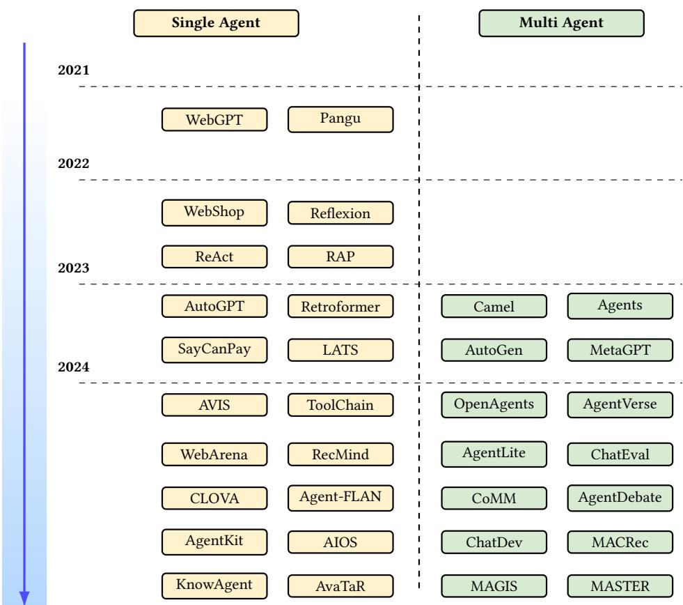
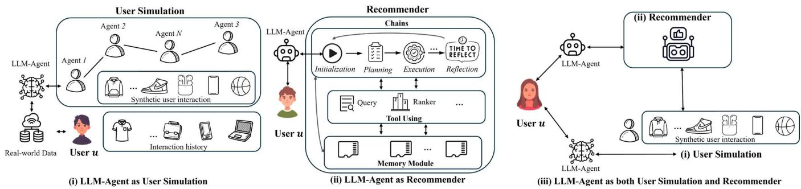

# Towards Agentic Recommender Systems in the Era of Multimodal Large Language Models

Chengkai Huang1, Junda Wu2, Yu Xia2, Zixu Yu2, Ruhan Wang3, Tong Yu4, Ruiyi Zhang4, Ryan A. Rossi4, Branislav Kveton4, Dongruo Zhou3, Julian McAuley2, Lina Yao1,5

1University of New South Wales, 2University of California San Diego, 3Indiana University, 4Adobe Research, 5CSIRO’s Data61

{chengkai.huang1, lina.yao}@unsw.edu.au, {juw069, yux078, ziy040, jmcauley}@ucsd.edu, {ruhwang, dz13}@iu.edu, {tyu,

ruizhang, rrossi, kveton}@adobe.com

## Abstract

Recent breakthroughs in Large Language Models (LLMs) have led to the emergence of agentic AI systems that extend beyond the capabilities of standalone models. By empowering LLMs to perceive external environments, integrate multimodal information, and in teract with various tools, these agentic systems exhibit greater autonomy and adaptability across complex tasks. This evolution brings new opportunities to recommender systems (RS): LLM-based Agentic RS (LLM-ARS) can ofer more interactive, context-aware, and proactive recommendations, potentially reshaping the user experience and broadening the application scope of RS. Despite promising early results, fundamental challenges remain, including how to efectively incorporate external knowledge, balance auton omy with controllability, and evaluate performance in dynamic, multimodal settings. In this perspective paper, we first present a systematic analysis of LLM-ARS: (1) clarifying core concepts and architectures; (2) highlighting how agentic capabilities—such as planning, memory, and multimodal reasoning—can enhance rec ommendation quality; and (3) outlining key research questions in areas such as safety, eficiency, and lifelong personalization. We also discuss open problems and future directions, arguing that LLM-ARS will drive the next wave of RS innovation. Ultimately, we foresee a paradigm shift toward intelligent, autonomous, and collaborative recommendation experiences that more closely align with users’ evolving needs and complex decision-making processes.

## CCS Concepts

• Information systems → Recommender systems.

## Keywords

Large Language Models, Recommender Systems, Intelligent Agent, Generative Recommendation

## 1 Introduction

With the rapid growth of online services, recommender systems (RS) have become essential for addressing users’ information needs and alleviating information overload [47, 92]. These systems provide personalized recommendations across various domains, including e-commerce, movies, music, etc. Despite the diversity of recom mendation tasks such as top-K recommendation and sequential recommendation, the core objective remains consistent: to predict a user’s preferences for each candidate item and generate a ranked list tailored to the user [31].

However, current RSs still face several significant limitations in meeting diverse user needs. First, current RSs typically rely on ID-based features that work only within specific domains or platforms. Their inability to integrate open-domain knowledge, such as common sense reasoning and cross-platform behavioral patterns, significantly constrains their capacity to interpret and model user interests in a broader context. Second, current methods typically optimize well-defined engagement metrics derived from historical interaction data (e.g., click-through rates and purchase histories). Although such methods can be efective for localized objective functions, they often conflate observable behaviors with latent user intent, since implicit feedback mechanisms cannot distinguish transient actions from enduring preferences. Consequently, these models exhibit two major limitations: (i) lack of transparency regarding preference attribution, which impairs interpretability, and (ii) oversimplification of the multifaceted motivations that guide user behavior, especially in scenarios requiring temporal or situational adaptation. As a result, these implicit modeling frameworks fail to capture the causal relationships between dynamic user states and subsequent decision-making processes. Finally, most traditional RSs operate in a largely static, one-directional manner, providing users with minimal opportunities to iteratively refine suggestions through natural language or real-time feedback. This unidirectional flow diverges from established human-computer interaction principles, which emphasize interactive, adaptive dialogue to uncover user preferences. Although conversational RSs have begun to address this issue, they remain limited in their ability to integrate openended natural language understanding with personalized ranking, particularly in scenarios that require multiple rounds of clarification to resolve ambiguous user queries.

Recent advances in Large Language Models (LLMs) and Multimodal LLMs (MLLMs) have greatly improved language comprehension and cognitive processing [24, 39]. With stronger reasoning and planning abilities, (M)LLM-based agents can interpret human language, devise strategies, and execute complex tasks. These breakthroughs ofer new avenues for enhancing RSs’ adaptability, personalization, and user-centricity. The rapid surge in LLM-driven RS research is evident from the 290 references cited in a recent survey on this topic [17, 31, 32], along with numerous influential papers in the field (e.g., [44]). The existing work on applying LLMs to RS, however, has mostly focused on applying LLMs to improve the current RSs. Furthermore, the existing works have underexplored the important question of how LLMs or LLM agents would impact the future of RS in the long run. We argue that LLM-based Agentic Recommender Systems (LLM-ARS) present a promising research direction, ofering new perspectives on autonomy, adaptability, and interactive decision-making in rec ommendation. To unlock the full potential of LLM-ARS, it is crucial to address several open questions, including how to harness agentic capabilities (e.g., planning, collaboration, roleplaying) to improve user modeling and system decision-making, and how to balance autonomy with controllability to ensure safe, transparent interac tions. We ofer a more detailed discussion of these challenges and key research questions in Section 5, where we highlight the most pressing issues and outline possible solutions.

We present the first perspective paper on ARS powered by (M)LLMs. We begin with preliminaries and background on this emerging direction (§2), followed by a discussion on the significance of LLM-ARS (§3) and a formal problem formulation (§4). Next, we analyze LLM-ARS from an agentic perspective (§5) and introduce key research questions from the RS standpoint (§6). To address these questions, we provide in-depth comparisons and discussions, ofering insights into the field (§7 and §8). Finally, we highlight open problems and future opportunities that require further exploration (§9). In summary, our key contributions in this perspective paper are as follows:

• We position LLM-ARS within the broader trajectory of RS development by introducing a four-level evolution, emphasizing the shift from static, one-way recommendation toward agentic paradigms that support autonomy and interactive decisionmaking.

• We propose a formal task formulation for LLM-ARS, detailing the core components—user profiling, planning, memory, and action—that together enable continuous adaptation and proactive recommendations.

• We identify critical research questions and open problems of how to harness agentic capabilities (e.g., planning, roleplaying, collab oration) to improve user modeling, system decision-making, and overall recommendation efectiveness.

## 2 Preliminary and Background

The rapid evolution of LLM-based AI has spurred significant advancements in Agent AI, fundamentally reshaping how systems interact with complex environments. In recent years, researchers have equipped LLM agents with core components—memory, plan ning, reasoning, tool utilization, and action execution—that are essential for autonomous decision-making and dynamic interaction [9]. The following subsections together with Figure 1 provide an overview of the recent developments in both single-agent and multi-agent frameworks.

## 2.1 LLM-based Single-Agent Systems

Single-agent systems leverage a unified model that integrates multiple interdependent modules.12 The memory component acts as a structured repository that stores and retrieves contextually relevant information, such as user preferences and historical interactions [93]. This persistent memory is crucial for maintaining coherent, long-term interactions and forms the foundation for personalization in recommendation settings. The planning module is closely linked with advanced reasoning capabilities. Recent research has identified approaches such as task decomposition, multi-plan selection, external module-aided planning, reflection and refinement, and memory-augmented planning [21]. These techniques enable an agent to break down complex tasks, select and refine strategies based on evolving contexts, and leverage external knowledge sources. Integrated reasoning further enhances decision-making by allowing the system to adapt dynamically to novel scenarios. Frameworks like ReAct [80] and Reflexion [52] exemplify how interleaving reasoning with concrete actions—such as web-browsing or tool invocation—can significantly improve system robustness and adaptability. Beyond internal cognitive processes, these agents increasingly rely on tool utilization to interface with external data and services. Systems like WebGPT [37] illustrate the efectiveness of using external modules (e.g., web search engines) to retrieve real-time information. Other works, such as Retroformer [81] and AvaTaR [75], further optimize these interactions through policy gradient optimization and contrastive reasoning, respectively, to fine-tune tool usage and enhance performance over time.

## 2.2 LLM-based Multi-Agent Systems

In contrast, LLM-based multi-agent systems emphasize collaboration among diverse autonomous agents. These systems are designed to mimic complex human workflows by facilitating inter-agent communication, task specialization, and coordinated decision-making. Frameworks such as CAMEL [28] and AutoGen [74] demonstrate how agents with distinct roles can interact to solve problems more eficiently than a single, monolithic agent. By assigning specialized functions—ranging from ideation and planning to evaluation—these frameworks enable a division of labor that enhances overall system capability and flexibility. Further advancements are seen in approaches like MetaGPT [15] and AgentLite [34], which incorporate meta-programming techniques and lightweight libraries to dynamically allocate roles and coordinate complex workflows. These structured interactions not only improve task eficiency but also ofer robustness in dynamic problem-solving environments. Recent developments also include systems such as ChatEval [2] and ChatDev [41], which leverage inter-agent debate and evaluative feedback to produce more nuanced and reliable outputs. This human-like discussion among agents is particularly beneficial in open-ended natural language generation tasks and complex software development processes.

## 3 Why Agentic Recommender Systems Now?

Recent advances in RSs have largely focused on enhancing interaction capabilities, with most research eforts still operating at the Advanced RSs (Level 1) and Intelligent RSs (Level 2) stages as shown in Table 1. However, they remain fundamentally reactive, relying on predefined model architectures and user-driven feedback loops. The next frontier, Agentic RSs (Level 3), aims to move beyond reactive engagement to autonomous, adaptive, and proactive recommendation strategies, which is increasingly feasible due to recent breakthroughs in (M)LLMs. We identify three key factors:

  
Figure 1: The rising trend in the research field of LLM-based Agents. We categorize current work into single-agent and multi agent categories.

• Leveraging (M)LLMs for Recommendation: The integration of LLMs introduces agent-like capabilities such as planning, memory retention, and in-context learning, enabling adaptive and evolving recommendation strategies. Unlike traditional systems that require explicit re-training, LLM-based agents can dynami cally refine recommendations based on sequential user interactions and external contextual cues. Additionally, collaborative multi-agent systems can further enhance recommendations by enabling multiple AI agents to exchange information, reason collectively, and optimize decision-making.

• Expanding Information Modalities: RSs primarily rely on ID-based and textual information, limiting their ability to fully understand user preferences. In contrast, multi-modal agentic systems can process diverse input signals, including images, au dio, structured metadata, and behavioural cues, leading to richer and more context-aware recommendations. Thus, agentic sys tems can capture holistic user intent, bridging the gap between implicit and explicit preference signals.

• Evolving User Interfaces: From Passive to Proactive Recommendation: Traditional recommendation paradigms primarily function as passive systems, responding to user queries with static suggestions. Conversational recommenders improve engagement but still rely on user-initiated interactions. Agentic systems introduce a proactive user experience, where AI-powered multi-modal agents continuously adapt, predict user needs, and autonomously refine recommendations before explicit queries occur. This shift not only enhances user satisfaction but also opens the door for highly personalized, real-time, and contextually aware recommender systems.

Given these advancements, the evolution towards multi-modal LLM-driven agentic recommenders represents a promising and inevitable trajectory. These systems combine autonomy, adaptability, and multi-modal intelligence, paving the way for self-improving, memory-driven, and highly personalized recommendation experiences that surpass the capabilities of existing models.

## 4 Formulation

An Agentic Recommender System [86, 90] is a system in which agents autonomously generate personalized recommendations by interacting with users and adapting to their preferences over time. Formally, it can be defined as a tuple (?? , ??, ??, ??, ??), where ?? is the set of users, ?? is the set of items, ?? is the set of agents, ?? is the set of environmental contexts and $R : U \times E \times A \to P ( I )$ is the recommendation function that maps users, contexts, and agents to a probability distribution over items ?? (?? ). Each agent $a \in A$ operates autonomously by perceiving the state $s = f ( u , e )$ , making decisions based on its policy $\pi _ { a } ( s )$ , and learning from user feedback to optimize an objective function, maximizing expected user utility:

<table><tr><td>Level</td><td>Name</td><td>Description</td><td>Key Characteristics</td></tr><tr><td>0</td><td>Traditional Recommender Systems</td><td>Systems rely on static algorithms and historical data to suggest items.</td><td>• Rule-Based Processing: Uses fixed rules, collaborative filtering, or content-based methods. • Limited Contextual Understanding: Operates solely on past user behavior without real-time adjustments. • One-Way Interaction: Provides recommendations in a non-interactive, one-off manner.</td></tr><tr><td>1</td><td>Advanced Recommender Systems</td><td>Deep learning advances enhance personalization with historical and real-time data.</td><td>• Data-Driven Adaptation: Uses learning models to update recommendations based on new information. • Feedback Integration: Incorporates user feedback to refine suggestions over time. • Enhanced Personalization: Provides more accurate and context-aware recommendations while following predefined model structures.</td></tr><tr><td>2</td><td>Intelligent Recommender Systems</td><td>These systems actively engage users to refine their understanding of preferences.</td><td>• Interactive Engagement: Initiates clarifying dialogues and solicits additional input. • Multi-Modal Input Processing: Integrates inputs beyond text (e.g., images, behavioral signals). • Dynamic Adaptation: Adjusts recommendations in real-time based on user context.</td></tr><tr><td>3</td><td>Agentic Recommender Systems</td><td>Fully autonomous agents that not only provide recommendations but also self-improve and evolve.</td><td>• Autonomous Decision-Making: Uses planning and optimization to proactively shape recommendation strategies. • Continuous Self-Evolution: Updates models and behaviors based on internal and external feedback. • Comprehensive Memory &amp; Multi-Modal Perception: Integrates long-term user data, contextual cues, and multiple input types. • Proactive and Reactive Interactions: Balances immediate responses with strategic actions.</td></tr></table>

Table 1: Four-Level Evolution of Recommender Systems: In this study, we categorize RSs into four levels based on their adaptability and interaction capabilities. Traditional RSs rely on static algorithms and historical data, while advanced RSs leverage deep learning for real-time personalization. Intelligent RSs engage users interactively, and agentic RSs autonomously evolve and optimize recommendations.

$$
\max _ {\pi_ {a}} \mathbb {E} \left[ U (u, R (u, e, a)) \mid \pi_ {a} \right].\tag{1}
$$

The key characteristics of such a system include autonomy, adaptability, and enabling agents to provide dynamic and personalized recommendations through continuous learning and user engagement. To illustrate our formulation of the architecture of agentic recommender systems, we present the notation table in Table 2.

## 4.1 The User Profiling module:

The User Profiling Module is dedicated to constructing comprehen sive profiles, such as behaviours for each user. The function can be define as $P : U \times T  S$ , where $P ( u , t )$ represents the evolving profile of user ?? at time ??. This profile is dynamically updated based on historical interactions $H ( u , t )$ , contextual features $C ( u , t )$ , and external signals $X ( u , t )$ , modeled as:

$$
P (u, t) = f (H (u, t), C (u, t), X (u, t); \theta_ {P}).\tag{2}
$$

To adapt to new user behaviours, profile updates incrementally as:

$$
P (u, t + 1) = P (u, t) + \eta \cdot \Delta P (u, t),\tag{3}
$$

where $\Delta P ( u , t )$ represents changes based on recent interactions, and ?? controls the update rate.

The user profiling module employs machine learning techniques to adaptively refine user profiles over time. It synthesizes infor mation from diverse sources and external contextual signals, to create a multidimensional view of the user’s preferences. For in stance, RecAgent [60] utilizes large language model-based agents to simulate user behavior and refine profiling accuracy. Addition ally, Rec4Agentverse [88] leverages large language model-based agents for prospect personalized recommendations, allowing for finer-grained user representations.

In contemporary practice, profiling modules also leverage MLLMs to process unstructured data modalities, such as textual reviews and visual preferences. MACRec [69] explores multi-agent collaboration frameworks to enhance user profiling through cooperative agent learning, ensuring robust profile evolution over time. Meanwhile, AgentCF [90] integrates autonomous learning language agents to collaboratively refine user profiles, reinforcing adaptive personalization. By maintaining both static and dynamic aspects of user preferences, this module ensures the recommendations are contextually appropriate, significantly enhancing user satisfaction in the system. The integration of reinforcement learning frameworks like SUBER [6] helps model long-term user behaviors by simulating future interactions to predict evolving preferences.

## 4.2 The Planing module:

The Planning Module empowers agents to formulate strategic decisions regarding which items to recommend. Using the user profiles from the User Profiling Module and considering the current environmental context $e \in E ,$ the module is defined as:

$$
s = f (u, e),\tag{4}
$$

where $f : U \times E \to S$ maps users and contexts to a state space S. for each user-agent pair. This module functions as the core of the decision-making of the Agentic Recommender System, the Planning Module leverages advanced optimization techniques, such as Markov Decision Processes (MDPs) and reinforcement learning, to ensure that decisions are both rational and aligned with user objectives. Similar approaches have been explored in recent research on RSs, such as MACRec [61] for multi-agent collaboration and Agent4Rec [86], which introduces generative agents for recommendation. In scenarios where user preferences conflict with immediate contextual constraints, the module employs multi-objective optimization to balance trade-ofs efectively, similar to approaches used in BiLLP [51], which frames recommendation as a long-term planning problem.

<table><tr><td>Symbol</td><td>Description</td></tr><tr><td>U, I, A, E</td><td>Users, items, agents, environments</td></tr><tr><td>R: U × E × A → P(I)</td><td>Recommendation function</td></tr><tr><td>s = f(u, e)</td><td>User state representation</td></tr><tr><td>πa(s)</td><td>Agent policy</td></tr><tr><td>P(I)</td><td>Item distribution</td></tr><tr><td>H(u, t)</td><td>User interaction history</td></tr><tr><td>C(u, t)</td><td>Contextual factors</td></tr><tr><td>X(u, t)</td><td>External signals</td></tr><tr><td>P(u, t)</td><td>User profile</td></tr><tr><td>M(u, t)</td><td>Memory function</td></tr><tr><td>A(s, a)</td><td>Action selection function</td></tr></table>

Table 2: Summary of notations used in agent-based RSs.

By simulating potential sequences of recommendations and user responses, the module can adjust strategies to minimize risks, predictive modeling is also emphasized in RecMind [68], which integrates LLMs into sequential recommendation. Additionally, it can incorporate collaborative and competitive dynamics among agents, allowing for coordinated actions in multi-agent systems [11] or personalized prioritization in single-agent setups [90].

The Planning Module also enables hierarchical planning and ensures that each sub-recommendation aligns with the overall ob jective, creating a coherent and seamless user experience. Recent ad vancements in AI-driven recommendation, such as AutoConcierge [83], which focuses on interactive goal-based recommendations, supports this hierarchical approach to structured decision-making.

## 4.3 The Memory module:

The Memory Module functions as a dynamic storage system that retains historical data on user interactions and feedback. It serves as a critical component for enabling the Agentic Recommender System to build continuity and context awareness over time. Formally, it maintains a memory function ?? : $U \times T \to M ,$ where:

$$
M (u, t) = g (H (u, t), C (u, t); \theta_ {M}),\tag{5}
$$

By storing and retrieving historical data, this module ensuring that future recommendations are informed by accumulated insights. Systems such as RecMind [67] leverage LLMs for memory-driven recommendations, enhancing continuity in RSs.

The Memory Module is designed to support both short-term and long-term memory functionalities. Short-term memory stores recent interactions, enabling the system to adapt to immediate user needs and preferences. In contrast, long-term memory archives broader behavioural patterns, which are crucial for understanding shifts in user behaviour over time. Together, these memory layers create a holistic view of the user, balancing transient interests with persistent inclinations. Similar architectures are explored in SUBER [6], an RL-based framework that simulates human behaviour for adaptive recommendation learning. To manage large-scale data efectively, the Memory Module employs advanced data structuring techniques to utilizes eficient retrieval, often powered by neural attention models, to access relevant historical data in real-time. This capability is similar to BiLLP [51], which positions LLMs as learnable planners to enhance long-term recommendation strategies. An essential feature of the Memory Module is its ability to integrate cross-session data. Systems like AgentCF [90] incorporate collaborative learning mechanisms, enabling memory-enhanced interactions among language agents in multi-agent recommendation.

## 4.4 The Action module:

The Action Module is responsible for executing the decisions made by the Planning Module, dynamically selecting and delivering recommendations to users. Given a user ?? ∈ ?? , an agent $a \in A$ , and an environmental state $e \in E ,$ , the system defines an action selection function A : $S \times A \to P ( I )$ , where:

$$
\mathcal {A} (s, a) = \pi_ {a} (s),\tag{6}
$$

where $\pi _ { a } ( s )$ represents the agent’s policy for selecting a probability distribution over items $P ( I ) _ { \mathit { i } }$ , given the current state $s = f ( u , e )$ Modern recommender systems increasingly integrate agentic approaches that allow for interactive decision-making. For instance, Agent4Rec [86] introduces generative agents that enable personalized through reinforcement learning. Similarly, RecAgent [60] uses a simulation of user behaviour with agents based on large language models to refine recommendation strategies.

Multi-agent frameworks have been explored to facilitate collaboration and competition in recommendation settings. MACRec [69] demonstrates the potential of multi-agent collaboration frameworks for improving recommendation diversity and accuracy. Moreover, MACRS [11] expands on this by introducing multi-agent conversational recommender systems that coordinate interactions across multiple agents to optimize recommendations in real-time. Conversational RSs play a crucial role in the Action Module by enabling context-aware responses. RecLLM [12] and CSHI [99] focus on leveraging large language models to enhance conversational interactions, providing scalable and controllable user simulations. RecMind [67] employs large language models to power agent-based recommendations, ensuring responses are aligned with evolving user intents. LLM4Rerank [13] further enhances recommendation efectiveness through re-ranking mechanisms optimized by LLMs.

A novel direction is tool-augmented recommendations $( e . g .$ , Tool-Rec [97]), which leverages tool learning to enhance recommendation accuracy and usability. Similarly, RAH [54] presents a humancentered framework that balances LLM-powered recommendations with human oversight improving user satisfaction.

## 5 Key Research Questions in LLM-ARS

After formulating an agentic recommender system and examining its key components, the next step is to address fundamental challenges in integrating LLM-driven agentic capabilities. These challenges span reasoning, user modeling, multimodal fusion, lifelong personalization, decision-making frameworks, controllability, and so on. To systematically analyze these challenges and explore novel solutions, we structure our discussion around the following key research questions (RQs).

RQ1: How can LLM-based agents benefit recommender systems through reasoning, planning, and collaboration?

RQ2: How can agentic recommender systems efectively lever age (M)LLM to improve user understanding and decision-making?

RQ3: What novel architectures or learning paradigms are needed to enable agentic RSs?

RQ4: What are the key challenges in integrating agentic decision making and multimodal reasoning into RSs?

RQ5: How can we evaluate the efectiveness and robustness of agentic recommender systems powered by multimodal LLMs?

RQ6: How can agentic recommender systems balance autonomy and controllability while utilizing MLLMs?

RQ7: How can agentic recommender systems achieve life-long personalization while mitigating catastrophic forgetting?

## 6 LLM-based Agentic Reasoning, Planning, and Collaboration (RQ1)

In this section, we explore how LLM agents face challenges in long-term planning and reasoning over personalized contexts and feedback (RQ1). Unlike conventional recommendation methods that learn from historical data to capture statistical patterns of user behavior [46, 49, 63], LLM agents analyze the contextual informa tion of items and the semantic details of user-item interactions [73, 90]. They further plan proactive strategies to explore longterm preferences using chain-of-thought generation [66, 73, 95]. However, as general-purpose models, LLMs find it challenging to adapt to personalized contexts or user feedback. To simulate di verse personalities, LLM agents roleplay via prompting [90] and user modelling [94], and they self-improve in interactive settings through multi-agent alignment [58, 59, 73].

## 6.1 Planning and Reasoning in Agentic RS

LLM agent planning in recommender systems leverages the com plex reasoning and decision-making capabilities of large language models to decompose the recommendation process into subtasks and assign them to multiple agents for collaboration across agents. To manage complex recommendation tasks, Wang et al. [69] and Fang et al. [11] propose multi-agent frameworks that decompose the overall task into specialized roles, while Wang et al. [69] in troduces agentic protocols including Manager, User/Item Analyst, Reflector, Searcher, and Task Interpreter. Fang et al. [11] focuses on goal-oriented dialogue planning and incorporates a user feedback aware reflection mechanism to control the conversation flow. To mitigate issues such as hallucinations and misalignment between semantics and behaviours, Zhao et al. [98] employs tool learning with surrogate users and attribute-oriented tools (i.e., rank and retrieval tools), while [27] integrates external knowledge and goal guidance to better reasoning grounding and proactive responses. To further enable exploration in planning Wang et al. [59] develops LLM-driven policy exploration by pre-training policies with user preference distillation for deploying adaptive fine-tuning strategies.

LLM agent equips recommender systems with the reasoning capabilities of large language models to discover complex user-item relationships and generate interpretable and semantically meaning ful recommendations. By further integrating structured external knowledge, distilled rationales, and memory mechanisms, LLMbased agentic frames are enabled with more contextually grounded reasoning while understanding various personalized behaviours and preferences in recommendation tasks. To uncover complex user-item relationships, Guo et al. [14] leverages knowledge graphs to inject explicit relational paths into language agents, while Wang et al. [66] distils underlying rationales from user reviews to enrich user profiles and item contexts, which improves LLM agents’ understanding of complex user-item interactions. To further understand the sequential context and user behaviours in conversational recommendations, Xi et al. [77] introduces memory-enhanced LLMs to track historical dialogue beliefs, improving on the approaches that only consider current interactions. To ensure explanations are both persuasive and credible, Qin et al. [43] develops a credibility-aware strategy that refines outputs through self-reflection. Focusing on the alignment of LLM reasoning with recommendation logic, Zhao et al. [95] proposes a non-tuning logic alignment framework using semantic embeddings and chain-of-thought prompting, whereas Wu et al. [73] augments LLMs with collaborative retrieval to ground reasoning in user-item interaction patterns.

Despite promising advances in LLM agents for planning and reasoning in recommender systems, current approaches face notable challenges. Methods dependent on explicit external structures—such as knowledge graphs [14] or curated rationales [66] are limited in generalizability across various scenarios. Although techniques in [77] and [43] improve sequential reasoning and explanation credibility, and [95] and [73] enhance logic alignment and collaborative retrieval, an integrated framework that aligns multiagent reinforcement learning and planning with user behaviour modelling [59, 69] is still lacking.

## 6.2 LLM-Agent Roleplaying in User Modeling

The exploration of LLM-agent roleplaying techniques is demanding for realistic user modelling in recommender systems, where user agents or simulators emulate human-like behaviours to capture both explicit and implicit user preferences. Intuitively, these methods leverage roleplay to bridge the gap between language understanding and behaviour simulation, enabling more realistic multi-agent interactions for personalized preference alignment and more rigorous evaluation. One prominent challenge is simulating socially dynamic user-item interactions inherent in human behaviour. Zhang et al. [89] tackles this by simulating a collaborative learning environment where both users and items are modelled as autonomous roleplaying agents, thus enabling bidirectional interaction and reflective adjustment. In addition, Wang et al. [62] introduces a sandbox environment where roleplaying agents are equipped with profile, memory, and action modules that interact through one-to-one and broadcast communications, efectively modelling social influence and conformity. In contrast, Zhang et al. [94] emphasizes explicit user modelling by integrating logical reasoning with statistical insights to simulate user engagement.

Addressing the need for controllability and scalability in conversational settings, Zhu et al. [99] proposes a framework that utilizes roleplay to customize user simulations in real time, enhancing the fidelity of user modelling in conversational recommender systems. Additionally, to overcome limitations related to data scarcity and evaluation reliability, [5] and [10] construct synthetic environments using LLMs as roleplaying users, while [26] introduces a target-free roleplay strategy to avoid bias in preference elicitation. However, current LLM-agent roleplaying approaches in user modelling still struggle with the interpretability of simulation processes and capturing the complexity of human decision-making. Future research should focus on developing more interpretable roleplay strategies and integrating richer, multimodal behavioural data to further en hance the adaptability and realism of user modeling frameworks.

## 6.3 Interaction Between Agents and Users

LLM-based agentic recommendation systems have motivated exploring methods that enhance the realistic interaction between agents and users. Intuitively, these approaches leverage agent role playing and collaborative mechanisms to bridge the gap between language understanding and complex behavioural interactions. One of the major challenges is simulating realistic user-agent interactions by capturing both explicit semantic and implicit behaviour signals. Zhang et al. [89] addresses this by modelling non-verbal signals (e.g., item clicking) via collaborative learning between user and item agents, in contrast to dialogue-centric approaches such as [11]. Kim et al. [26] further emphasizes a target-free user simulation protocol that avoids the target bias in such interactions.

Another challenge lies in integrating task-specific recommendation dynamics with interactive capabilities. While Huang et al. [19] leverages LLMs as a central controller augmented by recommendation models to enable seamless interaction, Wang et al. [65] focuses on enhancing high-order interaction awareness through whole-word embedding techniques. In multi-agent systems, col laboration in achieving efective interaction is proposed by [69], which designs specialized agents for various subtasks, whereas [11] suggests feedback-aware reflection for controlled dialogue flow. However, existing works still fall short in robustly modelling the dynamic evolution and collaborative evolution of extended agent user interaction, fully integrating adaptive feedback mechanisms. Future research should explore strategies for multi-agent planning and reasoning to align dynamic user-item interaction.

## 6.4 Agent Self-improvement

Finally, we discuss how agents can further evolve and self-improve in a recommendation environment by continuously incorporating rich interaction signals. Leveraging large language models (LLMs) to simulate and distil these interactions, recent approaches aim to bridge the gap between static ofline training and evolving online deployment. Synthesizing efective feedback from sparse data can significantly scale up the ofline training of LLM agents. Wu et al. [73] integrates collaborative information to enrich the interaction context, in addition to the approach [58] that directly generates feedback via LLM capabilities. Addressing the challenge of distribu tion shift and limited exploration in ofline reinforcement learning, Wang et al. [59] introduces an Interaction-Augmented Learned Pol icy (iALP) that pre-trains policies with distilled user interaction data augmented by LLMs, while Wang et al. [58] employs an LLM as an environment to verbally model states and rewards from real interaction feedback. Meanwhile, in the domain of adaptive agent selection, [40] leverages sentence embeddings aligned with hu man feedback to recommend the most appropriate agent based on interactive prompting, ensuring adaptability in dynamic settings. Confronting the need for explainability in self-improvement, [95] proposes a logic alignment strategy that enables LLM reasoning in online systems, providing interpretable recommendations grounded in explicit interaction semantics. However, current methods are still limited in the reliance on synthetic or simulated interaction data, which may not fully capture the complexities of real-world environments. In addition, the sim-to-real gap can be additionally challenging, which requires robust ofline policy evaluation, and smart online adaptation strategies.

## 7 LLM Agents for Enhanced User Understanding and Decision-Making (RQ2)

From the perspective of the RS field, LLM-powered autonomous agent systems position LLMs as the core "brain" of the agent, supported by essential components such as planning, memory, and tool utilization [72]. Prominent works like AutoGPT and BabyAGI have demonstrated the immense potential of LLM-based agents, particularly in their ability to store past experiences and leverage them to make more informed decisions (RQ2). In RS scenarios, these agents are often conceptualized as user simulators or the RS itself, as illustrated in Figure 2.

## 7.1 User Simulation in LLM-ARS

Simulating user behaviors is essential for training large-scale RSs, given the challenges of data scarcity, ethical concerns, and coldstart issues in real-world interaction data. Traditional methods [23, 100] struggle to model complex and evolving user behaviors, while recent advances in LLMs provide a promising alternative by enabling more adaptive and realistic simulations.

Most works leverage LLM-powered personalized agents to emulate user interactions. RecAgent [60] treats each user as an autonomous agent capable of interacting freely within a simulated environment, capturing both conventional RS behaviors such as browsing and clicking, as well as external influences like social interactions. Extending this idea, Agent4Rec [86] simulates 1,000 generative agents in a movie RS, where users engage with recommendations in a page-by-page manner, taking diverse actions that better approximate real-world decision-making. Beyond individual user agents, collaborative simulation frameworks have emerged to model multi-agent dynamics. LLM-InS [18] predicts user interactions with cold-start items, simulating clicks from a subset of recalled users to generate synthetic interactions that update item embeddings. Zhang et al. [94] integrate LLM-based logical reasoning with statistical modeling, extracting user preferences from item characteristics and engagement history to improve the fidelity of simulated behaviors. AgentCF [90] extends the paradigm by treating both users and items as interactive agents, fostering a coevolutionary learning process that optimizes user-item interactions. USimAgent [87] focuses on search behavior simulation, capturing querying, clicking, and stopping behaviors to generate realistic search task interactions. BASES [45] scales this concept further, utilizing LLM-based agents to create large-scale user profiles and diverse search behaviors across multiple linguistic benchmarks.

Despite advancements, LLM-driven simulators face critical limitations. Many rely on predefined heuristics or scripted rules, failing to capture emergent or long-term behavioral patterns. While LLMs approximate user preferences, they lack the ability to model cognitive biases, evolving interests, or contextual decision-making shifts. Scalability is also a concern: synthetic interactions can be generated at scale, but their real-world validity remains uncertain, and over-reliance on simulated data risks introducing biases. Future work should focus on adaptive, feedback-driven frameworks that integrate real-world behavioral signals, refine user modeling be yond static preferences, and establish validation mechanisms for LLM-generated interactions in RS applications.

  
Figure 2: Diferent types of personalized LLM-based agents in LLM-ARS, where (i) LLM-Agent simulates user behavior, (ii) LLM-Agent acts as a recommender, and (iii) LLM-Agent functions as both user simulation and recommender.

## 7.2 Improving Personalized Recommendations with LLM-driven Decision-Making

Leveraging the advanced reasoning, reflection, and tool-usage capabilities of LLM agents, recent approaches explore their role as decision-making agents to enhance personalized recommendations. Unlike level 0-2 RS models, LLM-ARSs dynamically adapt to user needs by integrating planning, self-reflection, and external tool interactions. The RAH framework [53], incorporating LLM-based agents and a Learn-Act-Critic loop, improve alignment with user personalities and mitigate biases. Then, Wang et al. [67] first introduces a Self-Inspiring planning algorithm that keeps track of all past steps of the agent to help generate new states. At each step, the agent looks back at all the paths it has taken before to figure out what to do next. This approach aids in employing databases, search engines, and summarization tools, combined with user data, for producing tailored recommendations. InteRecAgent [20] model the LLMs as the brain, while recommendation models serve as tools that supply domain-specific knowledge, then LLMs can parse user intent and generate responses. They specify a core set of tools essential for RS tasks—Information Query, Item Retrieval, and Item Ranking—and introduce a candidate memory bus, allowing previous tools to access and modify the pool of item candidates.

However, key challenges remain, such as ensuring long-term consistency in recommendations, balancing LLM-ARS generalization with domain-specific accuracy, and mitigating potential biases intro duced by LLM-generated reasoning. Future research should focus on integrating user feedback loops, enhancing interpretability, and optimizing the eficiency of tool-augmented LLM decision-making to fully realize the potential of LLM-ARS.

## 8 Framework and Learning Paradigms (RQ3)

To enable LLM-ARS, novel frameworks and learning paradigms are required to enhance autonomy, adaptability, and human alignment (RQ3). We categorize these advancements into three key areas: single-agent architectures, which focus on individual agents as decision-makers; multi-agent collaboration, which leverages interactions among multiple agents to improve reasoning and adaptability; and human-LLM hybrid architectures, which emphasize collaboration between human users and LLM-based agents to refine personalization, control, and interpretability in recommendations.

Single-Agent Framework for RS: LLM-powered single-agent frameworks enable autonomous decision-making in RSs by integrating reasoning, memory, and planning. The RAH framework [53] employs a Learn-Act-Critic loop to iteratively refine recommendations, improving personalization and reducing bias. Wang et al. [67] introduce Self-Inspiring Planning, where an LLM agent retrospectively analyzes past decisions to optimize future choices while leveraging external tools like search engines and summarization models. InteRecAgent [20] further enhances this paradigm by treating LLMs as decision-making cores, selectively invoking domain-specific tools (e.g., retrieval and ranking modules) and maintaining long-term candidate memory for adaptive ranking. These architectures transform LLMs from passive generators into adaptive decision-makers, enabling more context-aware, interactive recommendations. However, they face scalability challenges and lack collaborative reasoning in multi-domain scenarios.

Multi-Agent Framework for RS Multi-agent frameworks extend single-agent frameworks by incorporating specialized agents that communicate and collaborate to enhance decision-making. Instead of relying on a single agent for all tasks, these frameworks assign distinct roles to diferent agents, enabling parallelized reason ing, task specialization, and self-organizing interactions. Wang et al. [70] propose MACRec, where agents such as a Manager, Analyst, and Reflector collaborate on tasks like rating prediction, sequential recommendation, and explanation generation, improving adaptability and interpretability. PUMA [1] further integrates a shared memory system, allowing agents to retrieve past interactions for enhanced personalization. Compared to single-agent models, multiagent frameworks ofer better scalability, modularity, and reasoning eficiency, yet face challenges in coordination, redundancy reduction, and consistency maintenance across interacting agents.

Human-LLM Hybrid Framework for RS: While LLM-powered agents enhance automation, human-in-the-loop architectures are crucial for improving interpretability and fairness in RSs. Recent works explore collaborative frameworks where user feedback guides LLM-driven reasoning, ensuring transparency and control. Shu et al. [55] propose the LLM-powered assistant mediates between users and RSs. Using a Learn-Act-Critic loop with built-in reflection, the assistant refines recommendations by resolving preference in consistencies. It also incorporates privacy-preserving mechanisms, allowing users to filter content and adjust recommendations dy namically. Beyond direct interaction, hybrid frameworks embed user intent into LLM-based reasoning. Ning et al. [38] integrate user embeddings with LLMs via a pretrained encoder and crossattention, capturing long-term preferences more efectively. Shao et al. [50] further bridge the semantic gap between LLM reasoning and structured user data through vector quantization and prefer ence alignment. To formalize design principles for human-centered agentic RSs, Deng et al. [7] introduce a taxonomy spanning Intel ligence, Adaptivity, and Civility, providing guidelines to develop ethically adaptive, user-aligned conversational recommenders.

In summary, single-agent systems enable autonomous reasoning and memory integration, while multi-agent architectures enhance collaboration and modularity. Human-LLM hybrids further improve interpretability and personalization. Key challenges include balanc ing autonomy with user control, optimizing coordination, and miti gating biases while ensuring generalization. Future research should develop adaptive architectures that unify reasoning, collaboration, and user alignment for fully interactive, context-aware systems.

## 9 Open Problems and Opportunities

## 9.1 Multimodal Reasoning in LLM-ARS (RQ4)

In this section, we investigate key challenges in integrating agentic decision-making and multimodal reasoning into RSs (RQ4).

Multimodal Fusion: Multimodal fusion is crucial for agentic RSs integrating multiple LLMs and tools, yet it remains challeng ing. Potential strategies include encoder-decoder, attention, GNN, and generative neural network (GenNN)-based fusion. Encoder decoder models unify multimodal features in a shared space for task-specific decoding [25, 56], while attention-based fusion en hances cross-modal dependencies [35, 76]. GNN-based approaches jointly model structured and unstructured data [42, 57], and GenNN based fusion synthesizes modalities while handling missing data [48]. Efective fusion strengthens reasoning and factual grounding, ensuring robust decision-making in LLM-ARS.

Multimodal Reasoning: Aligning (M)LLM commonsense reasoning with recommendation tasks remains a key challenge. While (M)LLMs excel in open-domain reasoning, they often lack the task specific adaptability needed for user preference modeling and sequential decision-making. Their reasoning is optimized for general understanding rather than multimodal user intent inference, leading to inconsistencies in recommendation relevance. Addressing this requires fine-tuning with domain-specific constraints, integrating structured knowledge, and optimizing reasoning for personalized decision-making in multimodal contexts.

Eficiency: Eficiency remains a critical challenge for LLM-ARS, especially as they orchestrate multiple specialized tools or models.

Current RSs often incur significant computational overhead when integrating LLMs with external APIs for multimodal tasks, leading to latency issues. Optimizing the agent pipeline for speed and resource utilization while maintaining accuracy is essential. Promising directions include developing lightweight agents, reducing redundant computations through shared intermediate outputs, and exploring model compression techniques for LLMs within agents.

## 9.2 Benchmarking of LLM-ARS (RQ5)

Benchmarking LLM-ARS presents unique challenges beyond established metrics for LLMs and standalone RSs (RQ5). Comprehensive frameworks like AgentBench [33] are essential for assessing multiturn interaction quality, cross-modal efectiveness, and adaptability to user feedback. Efective evaluation demands standardized datasets and protocols that capture real-world complexity, including dynamic personalization and multimodal workflows. Robust assessment should integrate qualitative insights with quantitative metrics, measuring coherence, responsiveness, and contextual relevance under evolving conditions. Stress-testing adaptability to emergent feedback ensures sustained performance. Developing realistic simulation environments aligned with real-world use cases will enhance benchmarking transparency and drive iterative improvements in ARS.

## 9.3 Balancing Autonomy and Controllability in LLM-ARS (RQ6)

Ensuring a balance between autonomy and controllability in LLM-ARS requires addressing key challenges such as hallucination, explainability, and safety (RQ6). While agentic RSs benefit from LLMs’ ability to generate flexible and adaptive recommendations, uncontrolled generation can lead to unrealistic, irrelevant, or even harmful recommendations. Below, we discuss how these challenges manifest in RS scenarios and the strategies to mitigate them.

Hallucination: Hallucination in LLM-ARSs commonly occurs when generated items fall outside the valid item pool (OOV items) or when the model fabricates user preferences inconsistent with real behavior. This issue arises from LLMs’ open-ended generative nature. This issue arises because LLMs, unlike retrieval-based RSs, do not inherently constrain outputs to an existing catalog. For instance, an LLM might recommend an out-of-vocabulary (OOV) item that does not exist in the system’s database, generate unrealistic item-attribute pairings in multimodal RSs, or infer user interests based on semantic associations rather than actual interactions. Such errors are especially problematic in domains like e-commerce, where recommending unavailable products could degrade user trust. To mitigate hallucination, several strategies have been proposed. Database-grounded generation techniques ensure that LLMs reference an external item pool before finalizing recommendations [96]. Reflective instruction tuning helps refine constraints on generation [91], while hallucination detection frameworks flag outputs that lack factual grounding [82]. At inference time, methods such as adaptive grounding [4] and self-introspective decoding [22] validate recommendation outputs in real-time, ensuring that generated suggestions align with available content. By applying these techniques, LLM-ARSs can maintain generative flexibility while preventing misleading recommendations.

Explainability and Trust: Ensuring explainability and user trust is a key challenge in LLM-ARS, as LLM-driven models often function as opaque decision-makers. Unlike traditional RSs with structured optimization criteria, LLM-ARS recommenders rely on implicit reasoning, making it dificult to trace their decisions. This opacity can lead to skepticism, especially when recommendations seem arbitrary or inconsistent. For instance, an LLM in a conversa tional RS might suggest a book based on inferred emotional tone rather than explicit preferences, while a multimodal RS may recom mend a movie based on textual reviews without justifying it through content features like genre or cast. To improve transparency, recent methods explore natural language rationale generation [3], structured decision paths via external knowledge graphs [36, 78], and cross-attention mechanisms that embed user interactions into LLM reasoning [29]. Chain-of-thought prompting further enhances interpretability by breaking down recommendations step by step [30]. Aligning model reasoning with explicit knowledge sources strengthens user trust and control over recommendations.

Safety and Vulnerability: As LLM-ARSs become more autonomous, ensuring safety and robustness is critical, particularly in preventing adversarial manipulation and unintended biases. Malicious users can exploit vulnerabilities through prompt injection, data poisoning, and adversarial attacks, leading to biased or harmful recommendations [84, 85]. Additionally, LLM-based RSs risk rein forcing historical biases, over-optimizing for engagement at the cost of diversity and fairness. Over-personalization further exacerbates filter bubbles, limiting content discovery. Addressing these risks requires multi-layered safeguards. Adversarial training enhances resilience [79], while fairness-aware algorithms impose constraints to mitigate bias [16]. User feedback loops enable manual overrides, preserving user agency. Governance frameworks establish ethi cal boundaries for autonomous recommenders [8]. Together, these mechanisms strengthen the security and reliability of LLM-ARS, ensuring autonomy aligns with ethical responsibility.

## 9.4 Life-long Personalization in LLM-ARS (RQ7)

Personalization in agentic recommender systems is currently lim ited to short-term memory or static user profiles [64]. Life-long personalization introduces the concept of continual learning, where agents evolve with the users’ preferences over time (RQ7). Rather than passively generating recommendations, these agents should actively engage with users, clarify ambiguities, and refine their un derstanding through long-term feedback loops. Challenges include handling catastrophic forgetting, aligning learning with changing user preferences, and maintaining scalability as user interaction his tories grow. Approaches such as meta-learning, episodic memory systems, and AI personas—persistent representations [71] of user preferences—can provide promising solutions. These approaches ensure that agents adapt to users’ evolving needs across diverse contexts and applications.

## 10 Conclusion

This perspective paper first examines the integration of LLMs into agentic RSs, highlighting their role in enabling dynamic, adaptive, and multimodal interactions. We categorize recent advancements into single-agent, multi-agent, and human-LLM hybrid architectures, analyzing their impact on personalization, transparency, and reasoning. Despite these advancements, challenges such as eficiency, hallucination, safety, and lifelong learning remain critical. To address these, we outline future directions, including scalable architectures, robust evaluation frameworks, and improved domain generalization. As agentic RSs evolve, ensuring a balance between autonomy and controllability will be essential for building trustworthy, context-aware, and ethically aligned recommender systems.

## References

[1] Hongru Cai, Yongqi Li, Wenjie Wang, Fengbin Zhu, Xiaoyu Shen, Wenjie Li, and Tat-Seng Chua. 2024. Large Language Models Empowered Personalized Web Agents. CoRR abs/2410.17236 (2024).

[2] Chi-Min Chan, Weize Chen, Yusheng Su, Jianxuan Yu, Wei Xue, Shanghang Zhang, Jie Fu, and Zhiyuan Liu. 2023. Chateval: Towards better llm-based evaluators through multi-agent debate. arXiv preprint arXiv:2308.07201 (2023).

[3] Hanxiong Chen, Xu Chen, Shaoyun Shi, and Yongfeng Zhang. 2021. Generate natural language explanations for recommendation. arXiv preprint arXiv:2101.03392 (2021).

[4] Zhaorun Chen, Zhuokai Zhao, Hongyin Luo, Huaxiu Yao, Bo Li, and Jiawei Zhou. 2024. Halc: Object hallucination reduction via adaptive focal-contrast decoding. arXiv preprint arXiv:2403.00425 (2024).

[5] Nathan Corecco, Giorgio Piatti, Luca A Lanzendörfer, Flint Xiaofeng Fan, and Roger Wattenhofer. 2024. An LLM-based Recommender System Environment. arXiv preprint arXiv:2406.01631 (2024).

[6] Nathan Corecco, Giorgio Piatti, Luca A. Lanzendörfer, Flint Xiaofeng Fan, and Roger Wattenhofer. 2024. SUBER: An RL Environment with Simulated Human Behavior for Recommender Systems. arXiv:2406.01631 [cs.IR] https://arxiv. org/abs/2406.01631

[7] Yang Deng, Lizi Liao, Zhonghua Zheng, Grace Hui Yang, and Tat-Seng Chua. 2024. Towards Human-centered Proactive Conversational Agents. In Proceedings of the 47th International ACM SIGIR Conference on Research and Development in Information Retrieval, SIGIR 2024, Washington DC, USA, July 14-18, 2024. ACM, 807–818.

[8] Zehang Deng, Yongjian Guo, Changzhou Han, Wanlun Ma, Junwu Xiong, Sheng Wen, and Yang Xiang. 2024. Ai agents under threat: A survey of key security challenges and future pathways. Comput. Surveys (2024).

[9] Zane Durante, Qiuyuan Huang, Naoki Wake, Ran Gong, Jae Sung Park, Bidipta Sarkar, Rohan Taori, Yusuke Noda, Demetri Terzopoulos, Yejin Choi, et al. 2024. Agent ai: Surveying the horizons of multimodal interaction. arXiv preprint arXiv:2401.03568 (2024).

[10] Danial Ebrat and Luis Rueda. 2024. Lusifer: LLM-based User SImulated Feedback Environment for online Recommender systems. arXiv preprint arXiv:2405.13362 (2024).

[11] Jiabao Fang, Shen Gao, Pengjie Ren, Xiuying Chen, Suzan Verberne, and Zhaochun Ren. 2024. A multi-agent conversational recommender system. arXiv preprint arXiv:2402.01135 (2024).

[12] Luke Friedman, Sameer Ahuja, David Allen, Zhenning Tan, Hakim Sidahmed, Changbo Long, Jun Xie, Gabriel Schubiner, Ajay Patel, Harsh Lara, Brian Chu, Zexi Chen, and Manoj Tiwari. 2023. Leveraging Large Language Models in Conversational Recommender Systems. arXiv:2305.07961 [cs.IR] https://arxiv. org/abs/2305.07961

[13] Jingtong Gao, Bo Chen, Weiwen Liu, Xiangyang Li, Yichao Wang, Wanyu Wang, Huifeng Guo, Ruiming Tang, and Xiangyu Zhao. 2025. LLM4Rerank: LLM-based Auto-Reranking Framework for Recommendations. arXiv:2406.12433 [cs.IR] https://arxiv.org/abs/2406.12433

[14] Taicheng Guo, Chaochun Liu, Hai Wang, Varun Mannam, Fang Wang, Xin Chen, Xiangliang Zhang, and Chandan K Reddy. 2024. Knowledge Graph Enhanced Language Agents for Recommendation. arXiv preprint arXiv:2410.19627 (2024).

[15] Sirui Hong, Xiawu Zheng, Jonathan Chen, Yuheng Cheng, Jinlin Wang, Ceyao Zhang, Zili Wang, Steven Ka Shing Yau, Zijuan Lin, Liyang Zhou, et al. 2023. Metagpt: Meta programming for multi-agent collaborative framework. arXiv preprint arXiv:2308.00352 (2023).

[16] Wenyue Hua, Xianjun Yang, Mingyu Jin, Zelong Li, Wei Cheng, Ruixiang Tang, and Yongfeng Zhang. 2024. Trustagent: Towards safe and trustworthy llmbased agents through agent constitution. In Trustworthy Multi-modal Foundation Models and AI Agents (TiFA).

[17] Chengkai Huang, Tong Yu, Kaige Xie, Shuai Zhang, Lina Yao, and Julian McAuley. 2024. Foundation models for recommender systems: A survey and new perspectives. arXiv preprint arXiv:2402.11143 (2024).

[18] Feiran Huang, Zhenghang Yang, Junyi Jiang, Yuanchen Bei, Yijie Zhang, and Hao Chen. 2024. Large Language Model Interaction Simulator for Cold-Start Item Recommendation. CoRR abs/2402.09176 (2024).

[19] Xu Huang, Jianxun Lian, Yuxuan Lei, Jing Yao, Defu Lian, and Xing Xie. 2023. Recommender ai agent: Integrating large language models for interactive rec ommendations. arXiv preprint arXiv:2308.16505 (2023).

[20] Xu Huang, Jianxun Lian, Yuxuan Lei, Jing Yao, Defu Lian, and Xing Xie. 2023. Recommender AI Agent: Integrating Large Language Models for Interactive Recommendations. CoRR abs/2308.16505 (2023). arXiv:2308.16505

[21] Xu Huang, Weiwen Liu, Xiaolong Chen, Xingmei Wang, Hao Wang, Defu Lian, Yasheng Wang, Ruiming Tang, and Enhong Chen. 2024. Understanding the planning of LLM agents: A survey. arXiv preprint arXiv:2402.02716 (2024).

[22] Fushuo Huo, Wenchao Xu, Zhong Zhang, Haozhao Wang, Zhicheng Chen, and Peilin Zhao. 2024. Self-introspective decoding: Alleviating hallucinations for large vision-language models. arXiv preprint arXiv:2408.02032 (2024).

[23] Eugene Ie, Chih-Wei Hsu, Martin Mladenov, Vihan Jain, Sanmit Narvekar, Jing Wang, Rui Wu, and Craig Boutilier. 2019. RecSim: A Configurable Sim ulation Platform for Recommender Systems. CoRR abs/1909.04847 (2019). arXiv:1909.04847

[24] Aaron Jaech, Adam Kalai, Adam Lerer, Adam Richardson, Ahmed El-Kishky, Aiden Low, Alec Helyar, Aleksander Madry, Alex Beutel, Alex Carney, et al. 2024. Openai o1 system card. arXiv preprint arXiv:2412.16720 (2024).

[25] Dhruv Khattar, Jaipal Singh Goud, Manish Gupta, and Vasudeva Varma. 2019. Mvae: Multimodal variational autoencoder for fake news detection. In The world wide web conference. 2915–2921.

[26] Sunghwan Kim, Tongyoung Kim, Kwangwook Seo, Jinyoung Yeo, and Dongha Lee. 2024. Stop Playing the Guessing Game! Target-free User Simulation for Eval uating Conversational Recommender Systems. arXiv preprint arXiv:2411.16160 (2024).

[27] Chuang Li, Yang Deng, Hengchang Hu, Min-Yen Kan, and Haizhou Li. 2024. Incorporating External Knowledge and Goal Guidance for LLM-based Conver sational Recommender Systems. arXiv preprint arXiv:2405.01868 (2024).

[28] Guohao Li, Hasan Hammoud, Hani Itani, Dmitrii Khizbullin, and Bernard Ghanem. 2023. Camel: Communicative agents for" mind" exploration of large language model society. Advances in Neural Information Processing Systems 36 (2023), 51991–52008.

[29] Lei Li, Yongfeng Zhang, and Li Chen. 2023. Personalized prompt learning for explainable recommendation. ACM Transactions on Information Systems 41, 4 (2023), 1–26.

[30] Lei Li, Yongfeng Zhang, and Li Chen. 2023. Prompt distillation for eficient llm based recommendation. In Proceedings of the 32nd ACM International Conference on Information and Knowledge Management. 1348–1357.

[31] Jianghao Lin, Xinyi Dai, Yunjia Xi, Weiwen Liu, Bo Chen, Xiangyang Li, Chenxu Zhu, Huifeng Guo, Yong Yu, Ruiming Tang, and Weinan Zhang. 2023. How Can Recommender Systems Benefit from Large Language Models: A Survey. CoRR abs/2306.05817 (2023). arXiv:2306.0581

[32] Peng Liu, Lemei Zhang, and Jon Atle Gulla. 2023. Pre-train, Prompt and Recom mendation: A Comprehensive Survey of Language Modelling Paradigm Adapta tions in Recommender Systems. CoRR abs/2302.03735 (2023). arXiv:2302.03735

[33] Xiao Liu, Hao Yu, Hanchen Zhang, Yifan Xu, Xuanyu Lei, Hanyu Lai, Yu Gu, Hangliang Ding, Kaiwen Men, Kejuan Yang, Shudan Zhang, Xiang Deng, Ao han Zeng, Zhengxiao Du, Chenhui Zhang, Sheng Shen, Tianjun Zhang, Yu Su, Huan Sun, Minlie Huang, Yuxiao Dong, and Jie Tang. 2024. AgentBench: Evaluating LLMs as Agents. In The Twelfth International Conference on Learning Representations, ICLR 2024, Vienna, Austria, May 7-11, 2024. OpenReview.net.

[34] Zhiwei Liu, Weiran Yao, Jianguo Zhang, Liangwei Yang, Zuxin Liu, Juntao Tan, Prafulla K Choubey, Tian Lan, Jason Wu, Huan Wang, et al. 2024. AgentLite: A Lightweight Library for Building and Advancing Task-Oriented LLM Agent System. arXiv preprint arXiv:2402.15538 (2024).

[35] Houhong Lu, Yangyang Zhu, Ming Yin, Guofu Yin, and Luofeng Xie. 2022. Multi modal fusion convolutional neural network with cross-attention mechanism for internal defect detection of magnetic tile. IEEE Access 10 (2022), 60876–60886.

[36] Ziyu Lyu, Yue Wu, Junjie Lai, Min Yang, Chengming Li, and Wei Zhou. 2022. Knowledge enhanced graph neural networks for explainable recommendation. IEEE Transactions on Knowledge and Data Engineering 35, 5 (2022), 4954–4968.

[37] Reiichiro Nakano, Jacob Hilton, Suchir Balaji, Jef Wu, Long Ouyang, Christina Kim, Christopher Hesse, Shantanu Jain, Vineet Kosaraju, William Saunders, et al. 2021. Webgpt: Browser-assisted question-answering with human feedback. arXiv preprint arXiv:2112.09332 (2021).

[38] Lin Ning, Luyang Liu, Jiaxing Wu, Neo Wu, Devora Berlowitz, Sushant Prakash, Bradley Green, Shawn O’Banion, and Jun Xie. 2024. User-LLM: Eficient LLM Contextualization with User Embeddings. CoRR abs/2402.13598 (2024).

[39] OpenAI. 2023. Gpt-4 technical report. OpenAI (2023)

[40] Joshua Park and Yongfeng Zhang. 2025. AgentRec: Agent Recommendation Using Sentence Embeddings Aligned to Human Feedback. arXiv preprint arXiv:2501.13333 (2025).

[41] Chen Qian, Xin Cong, Cheng Yang, Weize Chen, Yusheng Su, Juyuan Xu, Zhiyuan Liu, and Maosong Sun. 2023. Communicative agents for software development. arXiv preprint arXiv:2307.07924 (2023).

[42] Shengsheng Qian, Jun Hu, Quan Fang, and Changsheng Xu. 2021. Knowledge aware multi-modal adaptive graph convolutional networks for fake news detection. ACM Transactions on Multimedia Computing, Communications, and Applications (TOMM) 17, 3 (2021), 1–23

[43] Peixin Qin, Chen Huang, Yang Deng, Wenqiang Lei, and Tat-Seng Chua. 2024. Beyond Persuasion: Towards Conversational Recommender System with Credi ble Explanations. arXiv preprint arXiv:2409.14399 (2024).

[44] Shashank Rajput, Nikhil Mehta, Anima Singh, Raghunandan Hulikal Keshavan, Trung Vu, Lukasz Heldt, Lichan Hong, Yi Tay, Vinh Q. Tran, Jonah Samost, Maciej Kula, Ed H. Chi, and Mahesh Sathiamoorthy. 2023. Recommender Systems with Generative Retrieval. In Advances in Neural Information Processing Systems 36: Annual Conference on Neural Information Processing Systems 2023, NeurIPS 2023, New Orleans, LA, USA, December 10 - 16, 2023.

[45] Ruiyang Ren, Peng Qiu, Yingqi Qu, Jing Liu, Wayne Xin Zhao, Hua Wu, Ji-Rong Wen, and Haifeng Wang. 2024. BASES: Large-scale Web Search User Simulation with Large Language Model based Agents. CoRR abs/2402.17505 (2024).

[46] Stefen Rendle, Zeno Gantner, Christoph Freudenthaler, and Lars Schmidt-Thieme. 2011. Fast context-aware recommendations with factorization machines. In Proceedings of the 34th international ACM SIGIR conference on Research and development in Information Retrieval. 635–644.

[47] Francesco Ricci, Lior Rokach, and Bracha Shapira. 2015. Recommender Systems: Introduction and Challenges. In Recommender Systems Handbook. Springer, 1–34.

[48] Gaurav Sahu and Olga Vechtomova. 2019. Adaptive fusion techniques for multimodal data. arXiv preprint arXiv:1911.03821 (2019).

[49] J Ben Schafer, Dan Frankowski, Jon Herlocker, and Shilad Sen. 2007. Collaborative filtering recommender systems. In The adaptive web: methods and strategies of web personalization. Springer, 291–324.

[50] Minglai Shao, Hua Huang, Qiyao Peng, and Hongtao Liu. 2024. ULMRec: Usercentric Large Language Model for Sequential Recommendation. arXiv preprint arXiv:2412.05543 (2024).

[51] Wentao Shi, Xiangnan He, Yang Zhang, Chongming Gao, Xinyue Li, Jizhi Zhang, Qifan Wang, and Fuli Feng. 2024. Large Language Models are Learnable Planners for Long-Term Recommendation. In Proceedings of the 47th International ACM SIGIR Conference on Research and Development in Information Retrieval (SIGIR 2024). ACM, 1893–1903. https://doi.org/10.1145/3626772.3657683

[52] Noah Shinn, Federico Cassano, Beck Labash, Ashwin Gopinath, Karthik Narasimhan, and Shunyu Yao. 2023. Reflexion: Language agents with verbal reinforcement learning.(2023). arXiv preprint cs.AI/2303.11366 (2023).

[53] Yubo Shu, Hansu Gu, Peng Zhang, Haonan Zhang, Tun Lu, Dongsheng Li, and Ning Gu. 2023. RAH! RecSys-Assistant-Human: A Human-Central Rec ommendation Framework with Large Language Models. CoRR abs/2308.09904 (2023).

[54] Yubo Shu, Haonan Zhang, Hansu Gu, Peng Zhang, Tun Lu, Dongsheng Li, and Ning Gu. 2023. RAH! RecSys-Assistant-Human: A Human-Centered Recommendation Framework with LLM Agents. arXiv:2308.09904 [cs.IR] https://arxiv.org/abs/2308.09904

[55] Yubo Shu, Haonan Zhang, Hansu Gu, Peng Zhang, Tun Lu, Dongsheng Li, and Ning Gu. 2024. RAH! RecSys-Assistant-Human: A Human-Centered Recom mendation Framework With LLM Agents. IEEE Trans. Comput. Soc. Syst. 11, 5 (2024), 6759–6770.

[56] YunPeng Tan, Fangyu Liu, BoWei Li, Zheng Zhang, and Bo Zhang. 2022. An eficient multi-view multimodal data processing framework for social media popularity prediction. In Proceedings of the 30th ACM International Conference on Multimedia. 7200–7204.

[57] Zhulin Tao, Yinwei Wei, Xiang Wang, Xiangnan He, Xianglin Huang, and Tat-Seng Chua. 2020. Mgat: Multimodal graph attention network for recom mendation. Information Processing & Management 57, 5 (2020), 102277.

[58] Jie Wang, Alexandros Karatzoglou, Ioannis Arapakis, and Joemon M Jose. 2024. Reinforcement learning-based recommender systems with large language models for state reward and action modeling. In Proceedings of the 47th International ACM SIGIR Conference on Research and Development in Information Retrieval. 375–385.

[59] Jie Wang, Alexandros Karatzoglou, Ioannis Arapakis, and Joemon M Jose. 2025. Large Language Model driven Policy Exploration for Recommender Systems. arXiv preprint arXiv:2501.13816 (2025).

[60] Lei Wang, Jingsen Zhang, Xu Chen, Yankai Lin, Ruihua Song, Wayne Xin Zhao, and Ji-Rong Wen. 2023. RecAgent: A Novel Simulation Paradigm for Recommender Systems. arXiv:2306.02552 [cs.IR]

[61] Lei Wang, Jingsen Zhang, Hao Yang, Zhiyuan Chen, Jiakai Tang, Zeyu Zhang, Xu Chen, Yankai Lin, Ruihua Song, Wayne Xin Zhao, Jun Xu, Zhicheng Dou, Jun Wang, and Ji-Rong Wen. 2024. User Behavior Simulation with Large Language Model based Agents. arXiv:2306.02552 [cs.IR] https://arxiv.org/abs/2306.02552

[62] Lei Wang, Jingsen Zhang, Hao Yang, Zhi-Yuan Chen, Jiakai Tang, Zeyu Zhang, Xu Chen, Yankai Lin, Hao Sun, Ruihua Song, et al. 2024. User Behavior Simulation with Large Language Model-based Agents for Recommender Systems. ACM Transactions on Information Systems (2024).

[63] Shoujin Wang, Liang Hu, Yan Wang, Longbing Cao, Quan Z Sheng, and Mehmet Orgun. 2019. Sequential recommender systems: challenges, progress and prospects. arXiv preprint arXiv:2001.04830 (2019).

[64] Tiannan Wang, Meiling Tao, Ruoyu Fang, Huilin Wang, Shuai Wang, Yuchen Eleanor Jiang, and Wangchunshu Zhou. 2024. AI PERSONA: Towards Life-long Personalization of LLMs. CoRR abs/2412.13103 (2024).

[65] Xinfeng Wang, Jin Cui, Fumiyo Fukumoto, and Yoshimi Suzuki. 2024. Enhancing High-order Interaction Awareness in LLM-based Recommender Model. arXiv preprint arXiv:2409.19979 (2024).

[66] Xinfeng Wang, Jin Cui, Yoshimi Suzuki, and Fumiyo Fukumoto. 2024. RDRec: Rationale Distillation for LLM-based Recommendation. arXiv preprint arXiv:2405.10587 (2024).

[67] Yancheng Wang, Ziyan Jiang, Zheng Chen, Fan Yang, Yingxue Zhou, Eunah Cho, Xing Fan, Xiaojiang Huang, Yanbin Lu, and Yingzhen Yang. 2023. RecMind: Large Language Model Powered Agent For Recommendation. arXiv preprint arXiv:2308.14296 (2023).

[68] Yancheng Wang, Ziyan Jiang, Zheng Chen, Fan Yang, Yingxue Zhou, Eunah Cho, Xing Fan, Xiaojiang Huang, Yanbin Lu, and Yingzhen Yang. 2024. RecMind: Large Language Model Powered Agent For Recommendation. arXiv:2308.14296 [cs.IR] https://arxiv.org/abs/2308.14296

[69] Zhefan Wang, Yuanqing Yu, Wendi Zheng, Weizhi Ma, and Min Zhang. 2024. Macrec: A multi-agent collaboration framework for recommendation. In Proceedings of the 47th International ACM SIGIR Conference on Research and Development in Information Retrieval. 2760–2764.

[70] Zhefan Wang, Yuanqing Yu, Wendi Zheng, Weizhi Ma, and Min Zhang. 2024. Multi-Agent Collaboration Framework for Recommender Systems. CoRR abs/2402.15235 (2024).

[71] Qingsong Wen, Jing Liang, Carles Sierra, Rose Luckin, Richard Jiarui Tong, Zitao Liu, Peng Cui, and Jiliang Tang. 2024. AI for Education (AI4EDU): Advancing Personalized Education with LLM and Adaptive Learning. In Proceedings of the 30th ACM SIGKDD Conference on Knowledge Discovery and Data Mining, KDD 2024, Barcelona, Spain, August 25-29, 2024, Ricardo Baeza-Yates and Francesco Bonchi (Eds.). ACM, 6743–6744.

[72] Lilian Weng. 2023. LLM-powered Autonomous Agents. lilianweng.github.io (Jun 2023). https://lilianweng.github.io/posts/2023-06-23-agent/

[73] Junda Wu, Cheng-Chun Chang, Tong Yu, Zhankui He, Jianing Wang, Yupeng Hou, and Julian McAuley. 2024. Coral: Collaborative retrieval-augmented large language models improve long-tail recommendation. In Proceedings of the 30th ACM SIGKDD Conference on Knowledge Discovery and Data Mining. 3391–3401.

[74] Qingyun Wu, Gagan Bansal, Jieyu Zhang, Yiran Wu, Shaokun Zhang, Erkang Zhu, Beibin Li, Li Jiang, Xiaoyun Zhang, and Chi Wang. 2023. Autogen: En abling next-gen llm applications via multi-agent conversation framework. arXiv preprint arXiv:2308.08155 (2023).

[75] Shirley Wu, Shiyu Zhao, Qian Huang, Kexin Huang, Michihiro Yasunaga, Kaidi Cao, Vassilis N Ioannidis, Karthik Subbian, Jure Leskovec, and James Zou. 2024. AvaTaR: Optimizing LLM Agents for Tool-Assisted Knowledge Retrieval. arXiv preprint arXiv:2406.11200 (2024).

[76] Yang Wu, Pengwei Zhan, Yunjian Zhang, Liming Wang, and Zhen Xu. 2021. Multimodal fusion with co-attention networks for fake news detection. In Findings of the association for computational linguistics: ACL-IJCNLP 2021. 2560– 2569.

[77] Yunjia Xi, Weiwen Liu, Jianghao Lin, Bo Chen, Ruiming Tang, Weinan Zhang, and Yong Yu. 2024. MemoCRS: Memory-enhanced Sequential Conversational Recommender Systems with Large Language Models. In Proceedings of the 33rd ACM International Conference on Information and Knowledge Management. 2585–2595.

[78] Yikun Xian, Zuohui Fu, Shan Muthukrishnan, Gerard De Melo, and Yongfeng Zhang. 2019. Reinforcement knowledge graph reasoning for explainable rec ommendation. In Proceedings of the 42nd international ACM SIGIR conference on research and development in information retrieval. 285–294.

[79] Zhen Xiang, Linzhi Zheng, Yanjie Li, Junyuan Hong, Qinbin Li, Han Xie, Jiawei Zhang, Zidi Xiong, Chulin Xie, Carl Yang, et al. 2024. GuardAgent: Safeguard LLM Agents by a Guard Agent via Knowledge-Enabled Reasoning. arXiv preprint arXiv:2406.09187 (2024).

[80] Shunyu Yao, Jefrey Zhao, Dian Yu, Nan Du, Izhak Shafran, Karthik Narasimhan, and Yuan Cao. 2022. React: Synergizing reasoning and acting in language models. arXiv preprint arXiv:2210.03629 (2022).

[81] Weiran Yao, Shelby Heinecke, Juan Carlos Niebles, Zhiwei Liu, Yihao Feng, Le Xue, Rithesh Murthy, Zeyuan Chen, Jianguo Zhang, Devansh Arpit, et al. 2023. Retroformer: Retrospective large language agents with policy gradient optimization. arXiv preprint arXiv:2308.02151 (2023).

[82] Qifan Yu, Juncheng Li, Longhui Wei, Liang Pang, Wentao Ye, Bosheng Qin, Siliang Tang, Qi Tian, and Yueting Zhuang. 2024. Hallucidoctor: Mitigating hallucinatory toxicity in visual instruction data. In Proceedings of the IEEE/CVF Conference on Computer Vision and Pattern Recognition. 12944–12953.

[83] Yankai Zeng, Abhiramon Rajasekharan, Parth Padalkar, Kinjal Basu, Joaquín Arias, and Gopal Gupta. 2023. Automated Interactive Domain-Specific Con versational Agents that Understand Human Dialogs. arXiv:2303.08941 [cs.AI]

https://arxiv.org/abs/2303.08941

[84] Yifan Zeng, Yiran Wu, Xiao Zhang, Huazheng Wang, and Qingyun Wu. 2024. Autodefense: Multi-agent llm defense against jailbreak attacks. arXiv preprint arXiv:2403.04783 (2024).

[85] Qiusi Zhan, Zhixiang Liang, Zifan Ying, and Daniel Kang. 2024. Injecagent: Benchmarking indirect prompt injections in tool-integrated large language model agents. arXiv preprint arXiv:2403.02691 (2024).

[86] An Zhang, Leheng Sheng, Yuxin Chen, Hao Li, Yang Deng, Xiang Wang, and Tat-Seng Chua. 2023. On Generative Agents in Recommendation. CoRR abs/2310.10108 (2023). arXiv:2310.10108

[87] Erhan Zhang, Xingzhu Wang, Peiyuan Gong, Yankai Lin, and Jiaxin Mao. 2024. USimAgent: Large Language Models for Simulating Search Users. CoRR abs/2403.09142 (2024).

[88] Jizhi Zhang, Keqin Bao, Wenjie Wang, Yang Zhang, Wentao Shi, Wanhong Xu, Fuli Feng, and Tat-Seng Chua. 2024. Prospect Personalized Recommendation on Large Language Model-based Agent Platform. arXiv:2402.18240 [cs.IR] https://arxiv.org/abs/2402.18240

[89] Junjie Zhang, Yupeng Hou, Ruobing Xie, Wenqi Sun, Julian McAuley, Wayne Xin Zhao, Leyu Lin, and Ji-Rong Wen. 2024. Agentcf: Collaborative learning with autonomous language agents for recommender systems. In Proceedings of the ACM on Web Conference 2024. 3679–3689.

[90] Junjie Zhang, Yupeng Hou, Ruobing Xie, Wenqi Sun, Julian J. McAuley, Wayne Xin Zhao, Leyu Lin, and Ji-Rong Wen. 2023. AgentCF: Collaborative Learning with Autonomous Language Agents for Recommender Systems. CoRR abs/2310.09233 (2023). arXiv:2310.09233

[91] Jinrui Zhang, Teng Wang, Haigang Zhang, Ping Lu, and Feng Zheng. 2024. Reflective instruction tuning: Mitigating hallucinations in large vision-language models. In European Conference on Computer Vision. Springer, 196–213.

[92] Shuai Zhang, Lina Yao, Aixin Sun, and Yi Tay. 2019. Deep Learning Based Recommender System: A Survey and New Perspectives. ACM Comput. Surv. 52, 1 (2019), 5:1–5:38.

[93] Zeyu Zhang, Xiaohe Bo, Chen Ma, Rui Li, Xu Chen, Quanyu Dai, Jieming Zhu, Zhenhua Dong, and Ji-Rong Wen. 2024. A survey on the memory mechanism of large language model based agents. arXiv preprint arXiv:2404.13501 (2024).

[94] Zijian Zhang, Shuchang Liu, Ziru Liu, Rui Zhong, Qingpeng Cai, Xiangyu Zhao, Chunxu Zhang, Qidong Liu, and Peng Jiang. 2024. LLM-Powered User Simulator for Recommender System. arXiv preprint arXiv:2412.16984 (2024).

[95] Hongke Zhao, Songming Zheng, Likang Wu, Bowen Yu, and Jing Wang. 2024. Lane: Logic alignment of non-tuning large language models and online recommendation systems for explainable reason generation. arXiv preprint arXiv:2407.02833 (2024).

[96] Minyi Zhao, Jie Wang, Zhaoyang Li, Jiyuan Zhang, Zhenbang Sun, and Shuigeng Zhou. 2024. Efectively Enhancing Vision Language Large Models by Prompt Augmentation and Caption Utilization. arXiv preprint arXiv:2409.14484 (2024).

[97] Yuyue Zhao, Jiancan Wu, Xiang Wang, Wei Tang, Dingxian Wang, and Maarten de Rijke. 2024. Let Me Do It For You: Towards LLM Empowered Recommendation via Tool Learning. In Proceedings of the 47th International ACM SIGIR Conference on Research and Development in Information Retrieval (SIGIR 2024). ACM, 1796–1806. https://doi.org/10.1145/3626772.3657828

[98] Yuyue Zhao, Jiancan Wu, Xiang Wang, Wei Tang, Dingxian Wang, and Maarten De Rijke. 2024. Let me do it for you: Towards llm empowered recommendation via tool learning. In Proceedings of the 47th International ACM SIGIR Conference on Research and Development in Information Retrieval. 1796–1806.

[99] Lixi Zhu, Xiaowen Huang, and Jitao Sang. 2024. A LLM-based Controllable, Scalable, Human-Involved User Simulator Framework for Conversational Rec ommender Systems. arXiv preprint arXiv:2405.08035 (2024).

[100] Yu Zhu, Hao Li, Yikang Liao, Beidou Wang, Ziyu Guan, Haifeng Liu, and Deng Cai. 2017. What to Do Next: Modeling User Behaviors by Time-LSTM. In Proceedings of the Twenty-Sixth International Joint Conference on Artificial Intelligence, Melbourne. 3602–3608.