# EARN: Eficient Inference Acceleration for LLM-based Generative Recommendation by Register Tokens

Chaoqun Yang chaoqun@yang.email.cn Tsinghua University Beijing, China

Yongqi Li liyongqi0@gmail.com The Hong Kong Polytechnic University Hong Kong, China

Xinyu Lin∗ xylin1028@gmail.com National University of Singapore Singapore, Singapore

Teng Sun stbestforever@gmail.com Shandong University Qingdao, China

Tat-Seng Chua dcscts@nus.edu.sg National University of Singapore Singapore, Singapore

Wenjie Wang∗ wenjiewang96@gmail.com University of Science and Technology of China Hefei, China

Xianjing Han hanxianjing2018@gmail.com National University of Singapore Singapore, Singapore

## Abstract

Large Language Model-based generative recommendation (LLM-Rec) has achieved notable success, but it sufers from high infer ence latency due to massive computational overhead and memory pressure of KV Cache. Existing KV Cache reduction methods face critical limitations: cache compression ofers marginal acceleration given recommendation tasks’ short decoding steps, while prompt compression risks discarding vital interaction history. Through systematic analysis of attention patterns in LLMRec, we uncover two pivotal insights: 1) layer-wise attention sparsity inversion where early layers retain dense informative patterns while later layers exhibit high redundancy, and 2) dual attention sinks phenomenon where attention scores concentrate on both head and tail tokens of input sequences. Motivated by these insights, we propose EARN, an eficient inference framework that leverages the early layers to compress information into register tokens placed at the input sequence boundaries, then focuses solely on these tokens in the subsequent layers. Extensive experiments on three datasets, two LLMRec methods and two LLM architectures demonstrate EARN’s superiority, achieving up to 3.79x speedup and 80.8% KV Cache re duction with better accuracy than the general finetuning approach. Our work bridges the eficiency-efectiveness gap in LLMRec, ofer ing practical deployment advantages for industrial scenarios.

CCS Concepts • Information systems → Recommender systems.

## Keywords

LLM-based Recommendation, Inference Acceleration, KV Cache

## ACM Reference Format:

Chaoqun Yang, Xinyu Lin, Wenjie Wang, Yongqi Li, Teng Sun, Xianjing Han, and Tat-Seng Chua. 2025. EARN: Eficient Inference Acceleration for LLMbased Generative Recommendation by Register Tokens. In Proceedings of the 31st ACM SIGKDD Conference on Knowledge Discovery and Data Mining V.2 (KDD ’25), August 3–7, 2025, Toronto, ON, Canada. ACM, New York, NY, USA, 12 pages. https://doi.org/10.1145/3711896.3736919

## KDD Availability Link:

The source code of this paper has been made publicly available at https: //doi.org/10.5281/zenodo.15553291.

## 1 Introduction

Recently, Large Language Model (LLM)-based generative recommendation (LLMRec) has shown great potential due to its superior reasoning capabilities [10, 16, 20–22, 36, 38]. However, it sufers from high inference latency due to its massive model architecture and auto-regressive decoding paradigm, which severely limits its application in practical recommendation scenarios [12, 37, 44]. For instance, platforms like YouTube, which serve hundreds of millions of users daily with billions of interactions, require millisecond-level response times1. This highlights the stark eficiency gap between current LLMRec implementations and real-world application requirements. Therefore, enhancing the inference eficiency of LLM-Rec is a crucial issue for industrial applications.

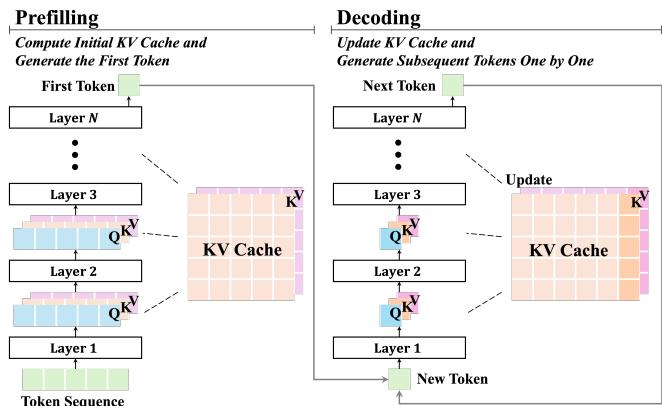  
Figure 1: The inference process of LLMRec. In the prefilling stage, LLM computes the initial KV Cache and generates the first token of the output; in the decoding stage, LLM updates the KV Cache and generates subsequent tokens one by one.

stages. As shown in Figure 1, given the input token sequence (user profile, historical interactions, etc.), the first is the prefilling stage, where LLM generates the first token of the output and caches computed Key-Value state pairs of all layers for every token. The second is the decoding stage, where LLM generates subsequent tokens autoregressively using pre-computed KV Cache, and updates KV Cache in each decoding step. As the input sequence length increases, the computational overhead of KV Cache grows greatly, significantly prolonging the inference latency. And when the KV Cache size is large, each decoding step requires accessing a substantial amount of memory, which can severely slow down the inference. In light of the above, the key to accelerating the inference of LLMRec lies in reducing the size of KV Cache.

To address this challenge, some research has been proposed. One of the representative works is cache compression [27, 44]. It selec tively removes less important KV pairs to reduce KV Cache size during decoding. However, recommendation tasks typically require few decoding steps to generate short output token sequences, such as item identifiers (around 1 to 5 tokens), limiting their acceleration potential in decoding. Another method is prompt compression [17, 44], which reduces initial KV Cache size during prefilling by condensating the input sequences, for instance, deleting unim portant tokens [14] or compressing the token sequence into a few tokens [18]. This technique not only decreases the computational load in prefilling but also alleviates the memory pressure in decoding. Although this method has achieved success in NLP [17, 44], it struggles to balance eficiency and accuracy in the context of LLMRec. In LLMRec, it is dificult to distinguish between important and unimportant items, which makes prompt compression method prone to discard crucial user interaction information, resulting in severe accuracy losses, or fail to achieve satisfactory acceleration in an efort to retain information. Hence, there is an urgent need for a method that enhances inference eficiency while preserving recommendation efectiveness.

To this end, we identify which information can be safely com pressed in LLMRec, by inspecting the attention score distributions [40] in LLMRec. Along two critical dimensions: layer order and token position, we observe two key characteristics of LLM-Rec across three diverse datasets, two mainstream LLMRec methods, and two distinct LLM architectures. For example, as shown in Figure 2, on the Llama model and Beauty dataset, we found the following (more similar evidence can be found in Appendix A.1):

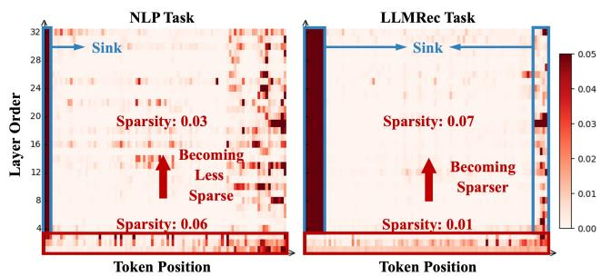  
Figure 2: The attention distributions of diferent layers on the NLP task (reading comprehension QA) and the LLMRec task (LC-Rec on Beauty dataset) on Head 0 of Llama model. In the LLMRec task, the first three layers are relatively dense, while subsequent layers are sparse, with sinking occurring on the head and tail tokens.

• Layer-wise attention sparsity inversion. Along the layer order dimension, we observe distinct sparsity between the NLP task and the LLMRec task. In the NLP task, the attention score distribution is sparse in the initial layers, but becomes relatively less sparse in the later layers (Sparsity: 0.06 → 0.03). Conversely, in the LLMRec task, the initial layers exhibit a relatively denser attention distribution, while the subsequent layers are highly sparse (Sparsity: 0.01 → 0.07).

• Dual attention sinks phenomenon. Along the token position dimension, while both the NLP task and the LLMRec task exhibit attention sinks [40], which means attention scores are highly concentrated on specific token positions, their distributions difer significantly. In the NLP task, sinks primarily emerge at the initial positions and a broad range of later tokens. In contrast, LLMRec demonstrates a distinctive dual concentration pattern - strong attention sinks at both head positions and a narrow tail region.

These findings suggest that in LLMRec: 1) In terms of the layer order, the early layers contain richer information, while the middle tokens in the later layers are redundant. In fact, previous studies have shown that the early layers of LLMs are capable of summarizing required information and important tokens [32], while the later layers tend to be increasingly redundant, and pruning of redundant parts has minimal impact on performance [13]. 2) In terms of the token position, the head and tail tokens carry the most important information. As explained in prior studies [7, 40], head tokens can absorb excess attention. Meanwhile, tail tokens interact with all previous tokens, which suggests that tail tokens of the prompt may possess the potential to summarize the preceding user interaction information.

Inspired by the above observations, we propose EARN, an Eficient inference Acceleration method for LLM-based Recommendation by register tokens (Figure 3), to enhance inference eficiency while maintaining recommendation efectiveness. Specifically, EARN introduces prefix and sufix register tokens - several learnable virtual tokens placed at the beginning and end of the input sequence, and leverages the first k layers of LLM to compress the user’s historical interaction information into register tokens. During inference, we use only register tokens for computation after k layers, thereby reducing the computational load and memory footprint of the KV Cache. We instantiate EARN on two mainstream LLMRec meth ods with two distinct LLM architectures, and conduct extensive experiments on three real-world datasets, validating the superiority of EARN in terms of both eficiency and accuracy. The code and datasets are available at https://github.com/transcend-0/EARN.

The contributions of our work are manifold:

• We identify the layer-wise attention sparsity inversion and dual attention sinks phenomenon in LLMRec, revealing that early layers as well as both head and tail tokens, retain the most critical information for LLMRec.

• We propose an eficient and efective method that leverages reg ister tokens to compress user historical interactions and prune redundant computations in later layers, striking a delicate balance between inference eficiency and recommendation efectiveness.

• We validate the efectiveness of EARN through extensive experiments conducted on three real-world datasets, demonstrating the superiority of EARN in achieving both high inference speed and recommendation accuracy.

## 2 Preliminary

## 2.1 LLM-based Generative Recommendation

In this work, we primarily discuss the LLM-based generative recommendation. The main idea of LLM-based generative recommendation is using LLMs as the core recommender model, i.e., taking the task instruction and a user’s historical interactions as the input prompt to generate item identifiers, such as typical item IDs. Formally, given a user’s historical interactions $H = \left( i _ { 1 } , \cdots , i _ { T } \right)$ in the chronological order, where $i _ { 1 }$ to ???? represent the items the user has interacted with in the past, LLM-based generative recommendation predicts the next item $i _ { T + 1 }$ the user is likely to interact with, $i . e . ,$

$$
f (H) = P (i _ {T + 1} \mid i _ {1}, \dots , i _ {T}),\tag{1}
$$

where ?? is the LLM, ?? is the probability distribution of the items.

## 2.2 Inference of LLMRec

LLM-based generative recommendation follows an auto-regressive decoding paradigm to generate item identifiers, which comprises two distinct computational stages: prefilling and decoding. Each stage exhibits unique inference characteristics and optimization requirements.

2.2.1 Prefilling. In this stage, the input prompt (containing the task instruction and the user’s historical interactions) is tokenized into the token sequence and fed into the transformer decoder. The most pivotal component is the multi-head attention module that exists in each layer of the model. Within each attention head, the input hidden states $\boldsymbol { X } \in \mathbb { R } ^ { n \times d }$ (?? denotes the sequence length, and ?? denotes the hidden dimension) undergo linear transformations:

$$
Q = X W _ {Q}, \quad K = X W _ {K}, \quad V = X W _ {V}.\tag{2}
$$

Subsequently, the attention mechanism computes the attention output as follows:

$$
O = \text { Softmax } \left(\frac {Q K ^ {T}}{\sqrt {d}}\right) V  .\tag{3}
$$

where $O \in \mathbb { R } ^ { n \times d }$ is the attention output, ??, $K , V \in \mathbb { R } ^ { n \times d }$ correspond to query states, key states, and value states, respectively. Since the generation of subsequent tokens utilizes key states ?? and value states ?? of preceding tokens, it is common practice to cache ?? and ?? for subsequent use, i.e., KV Cache. This caching strategy is crucial for maintaining the eficiency of the inference process.

During the prefilling stage, ??, ?? and ?? are all matrices, and matrix-matrix multiplication is compute-bound, meaning that the inference speed is primarily determined by the number of floating point operations (FLOPs). Reducing the computational load can efectively accelerate the prefilling stage. For instance, shortening the input token sequence length can help decrease the quadratic computational complexity $O ( \bar { n ^ { 2 } } d )$ of the attention mechanism. Besides, a shorter token sequence also reduces the size of KV Cache, thereby contributing to accelerating the decoding stage.

2.2.2 Decoding. In this stage, subsequent tokens are generated one by one, with the KV Cache being expanded accordingly. At each decoding step ??, the model first computes $Q _ { t } , K _ { t } , V _ { t } \in \mathbb { R } ^ { 1 \times d }$ then updates the KV Cache:

$$
\boldsymbol {K} _ {1: t} = \operatorname{Concat} \left(\boldsymbol {K} _ {1: t - 1}, \boldsymbol {K} _ {t}\right), \quad \boldsymbol {V} _ {1: t} = \operatorname{Concat} \left(\boldsymbol {V} _ {1: t - 1}, \boldsymbol {V} _ {t}\right).\tag{4}
$$

Next, the attention output is calculated via $Q _ { t } K _ { 1 : t } ^ { T }$

Unlike the prefilling stage, during the decoding stage, ?? is a vector, while ?? and ?? are matrices. The vector-matrix multiplication is memory-bound, meaning that the inference speed is primarily limited by the eficiency of memory access rather than the computational capacity. The latency is thus predominantly determined by the eficiency of memory access to the growing KV Cache rather than FLOPs. In other words, reducing the size of KV Cache allows the GPU computing cores to access them more rapidly, which is the key to accelerating inference in the decoding stage.

## 3 Method

In order to improve the inference eficiency while ensuring the recommendation efectiveness, we proposed EARN, which achieves inference acceleration through register tokens. The overview of our method is presented in Figure 3.

## 3.1 Register Tokens

3.1.1 Prefix Register. We introduce the prefix register, i.e., a set of learnable virtual tokens placed at the beginning of the input prompt. These tokens are designed to learn task-specific instructions, efectively signaling to the LLM that the current task is a recommendation problem. This method is inspired by the head sinks of the dual attention sinks phenomenon as elaborated in Section 1. Head sinks suggest that the head tokens can efectively divert attention away from task-irrelevant tokens in the subsequent layers. Drawing on the practice of prompt tuning [25, 26], where learnable virtual tokens are used to represent task instructions, we replace the BOS token, which the attention always sinks into, with the learnable prefix register. This substitution not only ful fills the attention-diverting function of the BOS token, but also serves the role of task indication to tell the model that this is a recommendation task.

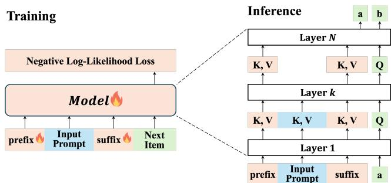  
Figure 3: Overview of the proposed EARN. During training, the prefix register and the sufix register are also trainable. During inference, after layer ??, EARN removes the prompt tokens to achieve acceleration.

3.1.2 Sufix Register. We introduce the sufix register, i.e., a set of learnable virtual tokens placed at the end of the input prompt, designed to summarize historical interactions and extract key in formation. This method is inspired by the tail sinks of the dual attention sinks phenomenon as elaborated in Section 1. The final tokens in a sequence have visibility over all preceding tokens, en dowing them with summarization capabilities. Prior studies have observed that semantically meaningless tokens can efectively sum marize preceding information during LLM inference [2, 30]. The occurrence of the tail sink phenomenon in the LLMRec task further corroborates this point. Building on this insight, we place learnable virtual tokens at the end of the input prompt and leverage the first ?? layers of the LLM to amplify this summarization capability.

## 3.2 Overall Pipeline

3.2.1 Training. During training, we employ next token predic tion to train our model, computing the loss on the target item identifier, i.e., minimizing the negative log-likelihood loss between the predicted next-item probabilities and the ground truth items. Formally, given a chronological sequence of user interactions $H =$ $\left[ i _ { 1 } , i _ { 2 } , . . . , i _ { T + 1 } \right]$ , we construct the input sequence as:

$$
X = \left[ R _ {\mathrm{prefix}}; P r o m p t; R _ {\mathrm{suffix}} \right],\tag{5}
$$

$$
Y = \left[ i _ {T + 1} \right],\tag{6}
$$

where $R _ { \mathrm { p r e f i x } }$ and $R _ { \mathrm { s u f f i x } }$ denote the prefix register and the sufix register, respectively. ??rompt is the user historical interactions $[ i _ { 1 } , i _ { 2 } , . . . , i _ { T } ]$ with the task instruction, and $Y$ is the target item identifier $i _ { T + 1 }$ . The loss function is formulated as,

$$
\mathcal {L} = - \sum_ {j = 1} ^ {| Y |} \log P (Y _ {j} \mid X, Y _ {<   j}),\tag{7}
$$

where $X$ is the input sequence of the sample, $Y$ is the corresponding item identifier, $Y _ { j }$ is the $j \cdot$ th token in the item identifier $Y ,$ and $Y _ { < j }$ denotes the tokens preceding $Y _ { j }$ in the item identifier.

When calculating the loss function, the main diference between our method and ordinary finetuning is the calculation of attention, where we exclude prompt tokens after layer ??, i.e.,

• For layer $l \leq k \colon$ All tokens participate in the attention calculation.

• For layer $l > k$ : Only register and generated tokens participate in the attention calculation.

3.2.2 Inference. During inference, for a model with ?? layers, the generation of each token consists of two processes:

(1) Full Computation Process (First ?? Layers): All tokens including task instructions, user historical interactions, prefix register and sufix register participate in the model computation. The model processes the complete input sequence to establish rich contextual representations.

(2) Register-Focused Process (Remaining ?? − ?? Layers): After ?? layers, we remove the original prompt tokens (task instructions and historical interactions), retaining only the register tokens and newly generated tokens. The attention mechanism in subsequent layers only operates on this reduced set of tokens:

• In the prefilling stage, the input hidden state of layer ?? is transformed from $X = [ X _ { \mathrm { p r e f i x } } ; X _ { \mathrm { P r o m p t } } ; X _ { \mathrm { s u f f x } } ]$ to $\begin{array} { r l } { X ^ { \prime } { \mathbf \Pi } = { \mathbf \Pi } } \end{array}$ $[ X _ { \mathrm { p r e f a x } } ; X _ { \mathrm { s u f f i x } } ]$ , significantly reducing the computational load and the initial KV Cache size.

• In the decoding stage, the input hidden state of layer ?? is transformed from $X = [ X _ { \mathrm { p r e f i x } } ; X _ { \mathrm { P r o m p t } } ; X _ { \mathrm { s u f f i x } } ; X _ { \mathrm { g e n e r a t e d } } ]$ to $X ^ { \prime } = [ X _ { \mathrm { p r e f i x } } ; X _ { \mathrm { s u f f i x } } ; X ^ { \phantom { \prime } }$ generated], significantly reducing KV Cache that needs to be accessed during decoding.

This approach maintains the model’s ability to leverage historical information through the learned register representations while avoiding redundant computations on lengthy prompt tokens.

## 3.3 Eficiency Analysis

Due to the removal of prompt tokens in the subsequent layers, we can significantly reduce both the computational load and memory footprint. Assume the model has ?? layers, $n _ { h }$ heads, an attention dimension of $d _ { a } ,$ a hidden state dimension of $d _ { h }$ , and an intermediate dimension of $d _ { f }$ . The length of the input prompt is $L ,$ , and the number of register tokens is $r \ \ll L .$ . If we remove the prompt tokens after ?? layers, the eficiency promotion can be analyzed through three key aspects:

• Computation Complexity: The FLOPs of the vanilla LLM are ?? $F L O P s _ { L L M l a y e r } = 4 N L [ n _ { h } d _ { a } ( 2 d _ { h } + L ) + d _ { h } d _ { f } ]$ (see Appendix $\mathrm { A } . 2$ for detailed derivation). In our EARN, it becomes $k F L O P s _ { L L M \ : l a y e r } + ( N - k ) \ : F L O P s _ { R e c }$ ???????????? ?????????? . Thus, the attention complexity ratio ??attn becomes:

$$
\begin{array}{l} \Gamma_ {a t t n} = \frac {k F L O P s _ {L L M l a y e r} + (N - k) F L O P s _ {R e g i s t e r l a y e r}}{N F L O P s _ {L L M l a y e r}} \\ \qquad = \frac {k}{N} + (1 - \frac {k}{N}) \frac {r [ n _ {h} d _ {a} (2 d _ {h} + r) + d _ {h} d _ {f} ]}{L [ n _ {h} d _ {a} (2 d _ {h} + L) + d _ {h} d _ {f} ]} \\ \qquad \approx \frac {k}{N}. \end{array}\tag{8}
$$

• KV Cache Size: The memory size of the KV Cache is $M _ { K V } N _ { K V }$ where $M _ { K V }$ represents the memory size of each KV pair, and $N _ { K V }$ denotes the total number of KV pairs. The original $N _ { K V }$ would be $n _ { h } N L$ , whereas now it becomes $n _ { h } ( k L + ( N - k ) r )$

Specifically, the KV Cache can be shrunk to $\frac { k L + ( N - k ) r } { N L }$ of its original size, reduced by $\frac { ( N - k ) ( L - r ) } { N L }$ . That is to say, the KV cache size reduction ratio $\gamma _ { \mathrm { c a c h e } }$ is:

$$
\begin{array}{c} \Gamma_ {c a c h e} = 1 - \frac {k L + (N - k) r}{N L} \\ = \frac {(N - k) (L - r)}{N L} \\ \approx \frac {N - k}{N}. \end{array}\tag{9}
$$

• Theoretical Speedup: Assuming that FLOPS of the device is $v _ { c } ,$ and HBM rate is $v _ { m }$ . The estimated time cost is

$$
T = T _ {P} + T _ {D} = T _ {P} + n _ {g e n e r a t e} T _ {d},\tag{10}
$$

where

$$
T _ {P} = \frac {F L O P s _ {p r e f i l l i n g}}{v _ {c}},\tag{11}
$$

$$
T _ {d} = \max (\frac {\text {Cache}}{v _ {m}}, \frac {\text {FLOPs} _ {\text {attn}}}{v _ {c}}) + \frac {\text {FLOPs} _ {\text {FFN}}}{v _ {c}}.\tag{12}
$$

The theoretical speedup is

$$
\Omega = \frac {T _ {v a n i l l a}}{T _ {E A R N}} \approx \frac {N}{k}.\tag{13}
$$

For typical values $( N = 3 2 , \ n _ { h } = 3 2 , \ d _ { a } = 1 2 8 , \ d _ { h } = 4 0 9 6 , d _ { f } =$ 11008, $L = 5 1 2 , \ k = 8 , \ r = 2 )$ , EARN reduces the KV Cache size to 75% of the original, and the speedup ratio can reach 4x.

## 4 Experiment

In this section, we conduct extensive experiments to answer the following research questions:

• RQ1: How does our proposed EARN perform compared to com mon inference acceleration methods?

• RQ2: How is the eficiency scalability of EARN under diferent batch sizes and sequence lengths?

• RQ3: How do diferent hyper-parameters afect the trade-of between inference eficiency and recommendation efectiveness of EARN?

• RQ4: How do diferent components contribute to EARN?

## 4.1 Experimental Settings

4.1.1 Models and Datasets. We conduct experiments on two mainstream LLMRec methods: LC-Rec [43] and TIGER [31], with two distinct LLM architectures: Llama-7B [35] using multi-head attention and Qwen2.5-7B [34] using grouped-query attention. We test EARN on three real-world recommendation datasets: 1) Beauty contains user interactions with the beauty products. 2) Games cov ers user interactions with the video games. 3) MovieLens-1M col lects user interactions with movies. More details of the datasets and experimental implementation details can be found in Appendix A.3.

4.1.2 Baselines. We compare our approach against commonly used practices and existing SOTA methods, serving as our baselines:

• Basic Methods

– Finetune: Standard full finetuning of the model.

– SkipLayers: Skipping redundant subsequent layers.

• Prompt Compression: Methods targeting the prefilling stage. – POD [11]: Distilling task instructions in the prompt into few virtual tokens.

– 500xCompressor [18]: Compressing the context (user historical interactions in our scenario) within the prompt into one single special token, by employing frozen original LLM and trainable additional LoRA parameters.

• Cache Compression: Methods targeting the decoding stage.

– StreamingLLM [40]: Statically retaining initial tokens and fixedlength recent tokens.

– SnapKV [15]: Dynamically caching clustered important tokens.

• Gist Methods: Methods using the register token idea.

– Gist [28]: Employing LLM itself to compress task instructions in the prompt into few gist tokens.

– AnLLM [30]: Employing LLM itself to compress segmented sentences into the anchor token at the end of the sentence.

4.1.3 Evaluation Metrics. Referring to previous work in the field of recommendation systems and LLM inference acceleration[8], we use the following metrics to evaluate our method:

• Time Eficiency

– Walltime Speedup ??: The actual test speedup relative to vanilla auto-regressive decoding by comparing the wall clock time.

– Throughput ??: The number of new tokens that the model generates per second.

• Space Eficiency

– KV Cache Reduction ??: The empirically measured percentage reduction of the KV Cache.

– KV Cache Memory ??: The average GPU memory usage (GB) of the KV Cache when generating the last token.

• Recommendation Efectiveness

– Recall@K (R@K): A widely used measure of the model’s ability to retrieve relevant items, which is defined as the proportion of relevant items that are recommended out of the total number of relevant items available.

– NDCG@K (N@K): Normalized Discounted Cumulative Gain (NDCG) is a measure that takes into account both the order of relevant items and the relevance score of each item.

## 4.2 Overall Performance (RQ1)

The overall results of baselines and EARN instantiated on LC-Rec on three datasets and two LLM models are presented in Table 1. The results instantiated on TIGER are similar, which are moved to Appendix A.4. We draw a few observations as follows:

• Qwen-based implementations outperform Llama-based implementations in both inference eficiency and recommendation efectiveness. This superiority arises from: 1) Qwen’s groupedhead attention architecture achieves a smaller KV Cache and lower inference latency while maintaining semantic capability; 2) Qwen’s expanded tokenizer vocabulary (151,851 vs. Llama’s 32,000) that shortens input prompts, reducing semantic fragmentation; 3) Qwen is trained on a more massive dataset with approximately 18 trillion tokens, which provides it with a richer knowledge base and better language understanding capabilities.

• Among all inference acceleration baselines, although cache compression methods (StreamingLLM and SnapKV) achieve the highest cache reduction (over 90%), their end-to-end speedup is not as significant as prompt compression methods. This is because cache compression methods do not optimize the prefilling stage,

Table 1: Overall performance comparison between the baselines and EARN instantiated on LC-Rec. The best results are highlighted in bold and the second-best results are underlined.

<table><tr><td rowspan="2">Dataset</td><td rowspan="2">Model</td><td rowspan="2">Method</td><td colspan="2">Time Efficiency</td><td colspan="2">Space Efficiency</td><td colspan="4">Recommendation Effectiveness</td></tr><tr><td> $\omega$ </td><td> $\tau$ </td><td> $\gamma$ </td><td> $\sigma$ </td><td>R@10</td><td>R@20</td><td>N@10</td><td>N@20</td></tr><tr><td rowspan="18">Beauty</td><td rowspan="9">Llama</td><td>Finetune</td><td>1.00</td><td>505.2</td><td>0.0</td><td>85.45</td><td>0.0145</td><td>0.0225</td><td>0.0084</td><td>0.0108</td></tr><tr><td>SkipLayers</td><td>1.79</td><td>895.4</td><td>44.4</td><td>47.50</td><td>0.0013</td><td>0.0013</td><td>0.0013</td><td>0.0013</td></tr><tr><td>POD</td><td>1.15</td><td>585.0</td><td>14.7</td><td>72.87</td><td>0.0045</td><td>0.0074</td><td>0.0032</td><td>0.0041</td></tr><tr><td>500xCompressor</td><td>2.31</td><td>1168.6</td><td>74.8</td><td>21.55</td><td>0.0005</td><td>0.0006</td><td>0.0002</td><td>0.0003</td></tr><tr><td>StreamingLLM</td><td>1.22</td><td>611.2</td><td>96.4</td><td>3.09</td><td>0.0005</td><td>0.0005</td><td>0.0004</td><td>0.0004</td></tr><tr><td>SnapKV</td><td>1.20</td><td>600.7</td><td>94.5</td><td>4.73</td><td>0.0054</td><td>0.0061</td><td>0.0030</td><td>0.0032</td></tr><tr><td>Gist</td><td>1.18</td><td>597.6</td><td>17.5</td><td>70.50</td><td>0.0048</td><td>0.0077</td><td>0.0028</td><td>0.0036</td></tr><tr><td>AnLLM</td><td>1.24</td><td>625.1</td><td>92.2</td><td>6.70</td><td>0.0000</td><td>0.0000</td><td>0.0000</td><td>0.0000</td></tr><tr><td>EARN</td><td>3.79</td><td>1844.8</td><td>80.5</td><td>16.68</td><td>0.0167</td><td>0.0265</td><td>0.0095</td><td>0.0124</td></tr><tr><td rowspan="9">Qwen</td><td>Finetune</td><td>1.00</td><td>622.1</td><td>0.0</td><td>14.08</td><td>0.0145</td><td>0.0248</td><td>0.0087</td><td>0.0117</td></tr><tr><td>SkipLayers</td><td>1.73</td><td>1056.1</td><td>58.0</td><td>5.92</td><td>0.0000</td><td>0.0000</td><td>0.0000</td><td>0.0000</td></tr><tr><td>POD</td><td>1.09</td><td>679.3</td><td>8.4</td><td>12.90</td><td>0.0082</td><td>0.0127</td><td>0.0047</td><td>0.0061</td></tr><tr><td>500xCompressor</td><td>2.56</td><td>1587.1</td><td>91.1</td><td>1.26</td><td>0.0003</td><td>0.0003</td><td>0.0001</td><td>0.0001</td></tr><tr><td>StreamingLLM</td><td>1.05</td><td>652.6</td><td>92.0</td><td>1.12</td><td>0.0088</td><td>0.0147</td><td>0.0058</td><td>0.0075</td></tr><tr><td>SnapKV</td><td>1.02</td><td>634.5</td><td>69.5</td><td>4.29</td><td>0.0097</td><td>0.0165</td><td>0.0058</td><td>0.0077</td></tr><tr><td>Gist</td><td>1.15</td><td>715.4</td><td>20.0</td><td>11.30</td><td>0.0084</td><td>0.0161</td><td>0.0050</td><td>0.0074</td></tr><tr><td>AnLLM</td><td>1.06</td><td>659.3</td><td>80.5</td><td>2.70</td><td>0.0000</td><td>0.0000</td><td>0.0000</td><td>0.0000</td></tr><tr><td>EARN</td><td>2.71</td><td>1662.6</td><td>75.2</td><td>3.49</td><td>0.0155</td><td>0.0265</td><td>0.0091</td><td>0.0122</td></tr><tr><td rowspan="18">Games</td><td rowspan="9">Llama</td><td>Finetune</td><td>1.00</td><td>571.4</td><td>0.0</td><td>78.10</td><td>0.0167</td><td>0.0273</td><td>0.0106</td><td>0.0138</td></tr><tr><td>SkipLayers</td><td>1.85</td><td>1045.3</td><td>45.0</td><td>42.93</td><td>0.0002</td><td>0.0002</td><td>0.0003</td><td>0.0003</td></tr><tr><td>POD</td><td>1.09</td><td>623.3</td><td>15.9</td><td>65.69</td><td>0.0088</td><td>0.0147</td><td>0.0052</td><td>0.0070</td></tr><tr><td>500xCompressor</td><td>2.11</td><td>1205.3</td><td>72.5</td><td>21.45</td><td>0.0014</td><td>0.0021</td><td>0.0009</td><td>0.0011</td></tr><tr><td>StreamingLLM</td><td>1.23</td><td>702.5</td><td>96.0</td><td>3.13</td><td>0.0013</td><td>0.0013</td><td>0.0014</td><td>0.0014</td></tr><tr><td>SnapKV</td><td>1.22</td><td>688.5</td><td>93.5</td><td>5.04</td><td>0.0102</td><td>0.0110</td><td>0.0070</td><td>0.0072</td></tr><tr><td>Gist</td><td>1.12</td><td>639.9</td><td>18.0</td><td>64.00</td><td>0.0091</td><td>0.0146</td><td>0.0053</td><td>0.0070</td></tr><tr><td>AnLLM</td><td>1.25</td><td>715.5</td><td>91.6</td><td>6.60</td><td>0.0003</td><td>0.0003</td><td>0.0003</td><td>0.0003</td></tr><tr><td>EARN</td><td>3.53</td><td>1930.6</td><td>80.8</td><td>14.98</td><td>0.0180</td><td>0.0291</td><td>0.0107</td><td>0.0142</td></tr><tr><td rowspan="9">Qwen</td><td>Finetune</td><td>1.00</td><td>568.1</td><td>0.0</td><td>13.03</td><td>0.0193</td><td>0.0316</td><td>0.0127</td><td>0.0155</td></tr><tr><td>SkipLayers</td><td>1.52</td><td>858.4</td><td>57.3</td><td>5.57</td><td>0.0000</td><td>0.0000</td><td>0.0000</td><td>0.0000</td></tr><tr><td>POD</td><td>1.35</td><td>767.5</td><td>8.1</td><td>11.98</td><td>0.0129</td><td>0.0209</td><td>0.0075</td><td>0.0100</td></tr><tr><td>500xCompressor</td><td>2.60</td><td>1475.4</td><td>97.1</td><td>0.38</td><td>0.0013</td><td>0.0023</td><td>0.0008</td><td>0.0011</td></tr><tr><td>StreamingLLM</td><td>1.05</td><td>594.7</td><td>98.4</td><td>0.21</td><td>0.0129</td><td>0.0202</td><td>0.0075</td><td>0.0098</td></tr><tr><td>SnapKV</td><td>1.02</td><td>576.2</td><td>67.9</td><td>4.19</td><td>0.0138</td><td>0.0226</td><td>0.0083</td><td>0.0110</td></tr><tr><td>Gist</td><td>1.41</td><td>801.3</td><td>22.9</td><td>10.00</td><td>0.0121</td><td>0.0154</td><td>0.0077</td><td>0.0088</td></tr><tr><td>AnLLM</td><td>1.09</td><td>616.9</td><td>95.2</td><td>0.60</td><td>0.0003</td><td>0.0003</td><td>0.0003</td><td>0.0003</td></tr><tr><td>EARN</td><td>3.11</td><td>1711.3</td><td>75.1</td><td>3.24</td><td>0.0197</td><td>0.0312</td><td>0.0122</td><td>0.0157</td></tr><tr><td rowspan="18">MovieLens</td><td rowspan="9">Llama</td><td>Finetune</td><td>1.00</td><td>704.3</td><td>0.0</td><td>55.39</td><td>0.0247</td><td>0.0449</td><td>0.0197</td><td>0.0288</td></tr><tr><td>SkipLayers</td><td>2.52</td><td>1302.9</td><td>67.6</td><td>17.93</td><td>0.0022</td><td>0.0022</td><td>0.0043</td><td>0.0043</td></tr><tr><td>POD</td><td>1.17</td><td>827.4</td><td>18.0</td><td>45.40</td><td>0.0066</td><td>0.0118</td><td>0.0062</td><td>0.0087</td></tr><tr><td>500xCompressor</td><td>1.92</td><td>1352.8</td><td>61.1</td><td>21.54</td><td>0.0004</td><td>0.0005</td><td>0.0003</td><td>0.0003</td></tr><tr><td>StreamingLLM</td><td>1.20</td><td>836.2</td><td>95.2</td><td>2.66</td><td>0.0000</td><td>0.0000</td><td>0.0000</td><td>0.0000</td></tr><tr><td>SnapKV</td><td>1.19</td><td>829.2</td><td>91.9</td><td>4.50</td><td>0.0000</td><td>0.0000</td><td>0.0000</td><td>0.0000</td></tr><tr><td>Gist</td><td>1.01</td><td>711.3</td><td>22.3</td><td>43.10</td><td>0.0232</td><td>0.0421</td><td>0.0118</td><td>0.0250</td></tr><tr><td>AnLLM</td><td>1.20</td><td>846.9</td><td>89.5</td><td>5.80</td><td>0.0006</td><td>0.0008</td><td>0.0005</td><td>0.0006</td></tr><tr><td>EARN</td><td>3.21</td><td>2250.2</td><td>79.7</td><td>11.26</td><td>0.0259</td><td>0.0452</td><td>0.0247</td><td>0.0341</td></tr><tr><td rowspan="9">Qwen</td><td>Finetune</td><td>1.00</td><td>752.9</td><td>0.0</td><td>10.71</td><td>0.0289</td><td>0.0421</td><td>0.0247</td><td>0.0315</td></tr><tr><td>SkipLayers</td><td>1.87</td><td>1124.7</td><td>76.6</td><td>2.50</td><td>0.0000</td><td>0.0000</td><td>0.0000</td><td>0.0000</td></tr><tr><td>POD</td><td>1.41</td><td>1061.7</td><td>40.1</td><td>6.42</td><td>0.0139</td><td>0.0177</td><td>0.0115</td><td>0.0131</td></tr><tr><td>500xCompressor</td><td>2.09</td><td>1577.8</td><td>77.6</td><td>2.40</td><td>0.0006</td><td>0.0009</td><td>0.0006</td><td>0.0007</td></tr><tr><td>StreamingLLM</td><td>1.05</td><td>766.8</td><td>88.9</td><td>1.19</td><td>0.0258</td><td>0.0372</td><td>0.0197</td><td>0.0244</td></tr><tr><td>SnapKV</td><td>1.00</td><td>731.9</td><td>76.5</td><td>2.52</td><td>0.0248</td><td>0.0428</td><td>0.0192</td><td>0.0266</td></tr><tr><td>Gist</td><td>1.06</td><td>799.0</td><td>30.0</td><td>7.50</td><td>0.0287</td><td>0.0441</td><td>0.0244</td><td>0.0305</td></tr><tr><td>AnLLM</td><td>1.03</td><td>772.4</td><td>75.9</td><td>2.60</td><td>0.0022</td><td>0.0022</td><td>0.0043</td><td>0.0043</td></tr><tr><td>EARN</td><td>2.84</td><td>2136.7</td><td>66.7</td><td>3.56</td><td>0.0298</td><td>0.0591</td><td>0.0252</td><td>0.0382</td></tr></table>

whereas prompt compression methods (POD and 500xCompres sor) reduce the input sequence length in the prefilling stage, thereby improving both computational and memory eficiency. This highlights the greater potential for acceleration in the prefilling stage for LLMRec. However, despite the notable inference eficiency gains of the baselines, they sufer from catastrophic recommendation efectiveness degradation. This highlights that user historical interactions in recommendation scenarios cannot be simply compressed at a high ratio using NLP methods.

• Although gist methods (Gist and AnLLM) also employ the idea of register tokens, they fail to achieve a significant speedup. This is because they utilize all layers of the LLM to compress information, resulting in substantial computational costs. In contrast, EARN only uses the first ?? layers, significantly reducing the computational burden. In terms of space eficiency, Gist only compresses the task instruction within the input sequence, thus saving only about 20% of cache memory. Although AnLLM can reduce cache memory by 90%, it comes at the cost of catastrophic loss in recommendation efectiveness. AnLLM’s recommendation efectiveness is nearly zero. This is due to its attempt to compress the intricate user interaction history into a single token, which is highly challenging and leads to severe information loss and poor performance. Gist shows a decline in recommendation ef fectiveness. This is because Gist compresses the task instruction in isolation within the language space, while the items in recom mendations are not within the LLM’s language space. Without direct interaction between the task instruction and historical items, the LLM struggles to understand the recommendation task’s requirements to predict items outside its vocabulary. This impedes the method’s applicability to recommendation tasks.

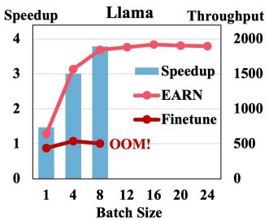

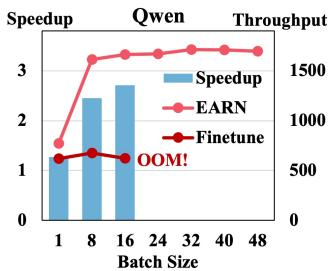  
Figure 4: Eficiency under diferent batch sizes.

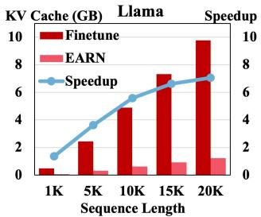

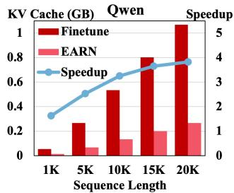  
Figure 5: Eficiency under diferent sequence lengths.

• EARN significantly achieves SOTA time eficiency (2.71-3.79x speedup) with excellent space eficiency (66.7-80.8% cache reduc tion), and also demonstrates a notable improvement over Finetune in terms of recommendation efectiveness. This suggests that the register tokens used in EARN can efectively summarize useful information, thereby ensuring that recommendation efec tiveness is maintained while inference eficiency is improved.

## 4.3 Eficiency Scalability (RQ2)

To investigate the eficiency scalability of EARN, we evaluate the in ference eficiency of EARN as compared to Finetune under varying batch sizes and sequence lengths.

4.3.1 Eficiency under Diferent Batch Sizes. To verify the acceleration efect of EARN under diferent batch sizes, we test the inference eficiency of EARN and Finetune with batch size in {1, 4, 8, · · · , 24} on Llama and {1, 8, 16, · · · , 48} on Qwen. As shown in Figure 4, EARN maintains significantly higher throughput than Finetune across all batch sizes. The speedup of EARN over Finetune increases as the batch size grows. Moreover, EARN can handle a larger batch size, which is particularly useful for practical scenarios. For example, on Llama, Finetune runs into out-of-memory (OOM) errors when the batch size exceeds 8, while EARN can still support larger batch sizes. The results clearly demonstrate that EARN significantly improves eficiency compared to Finetune across diferent batch sizes. Its ability to maintain high throughput on large batch sizes highlights its superior eficiency and practical inference capabilities. This makes EARN a more suitable choice for real-world applications where eficient and scalable inference is crucial.

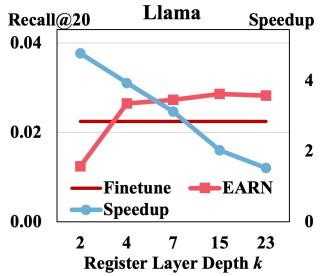

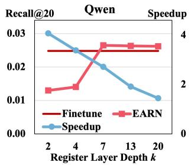  
Figure 6: Efect of register layer depth ??.

4.3.2 Eficiency under Diferent Sequence Lengths. In industrial settings, user interaction histories can be extensive. Therefore, it is essential to assess the eficiency of EARN on longer sequences. To simulate this scenario, we pad our dataset to specific lengths (1K, 5K, · · ·, 20K) to test the acceleration efects. From Figure 5, we can see EARN consistently uses significantly less KV Cache than Finetune across all sequence lengths. Moreover, the larger the sequence length, the more significant the acceleration efect, achieving a speedup of up to 7x when the sequence length is 20K on Llama. This is highly desirable in practice, especially for long-term sequential recommendation, where user historical interaction sequences are stored for a long time, thus learning user preferences comprehensively. The results clearly demonstrate that EARN significantly improves eficiency compared to Finetune across diferent sequence lengths. Its ability to maintain a low KV Cache size and achieve higher speedup, especially for longer sequences, highlights its superior eficiency and practical inference capabilities. This makes EARN a more suitable choice for real-world applications where eficient and scalable inference is crucial, particularly when dealing with long sequences.

## 4.4 Hyper-parameter Analysis (RQ3)

To investigate the trade-of between inference eficiency and recommendation efectiveness caused by variations in hyper-parameters, we train and evaluate EARN with diferent register layer depth ?? and register token number ??.

4.4.1 Efect of Register Layer Depth ??. Figure 6 reveals the trade-of between inference eficiency and recommendation efectiveness when varying the register layer depth ??: 1) Too shallow: When the register layer depth is too shallow (e.g., < 4 on Llama, and < 7 on Qwen), although the speedup is high, the recall sufers a significant loss. 2) Optimal range: In the range of ?? = 4 − 7, EARN strikes a balance between speedup and recall. The speedup remains reasonably high, while Recall@20 improves notably. This suggests that the model can efectively capture the necessary information for recommendations without a substantial loss in inference eficiency. 3) Too deep: When the register layer depth is too deep $( e . g . , k \ge 1 3 )$ the speedup decreases significantly, but Recall@20 does not show a proportional improvement. For example, on Qwen, the speedup drops sharply when $k = 1 3 \mathrm { o r } k = 2 0$ , while Recall@20 does not in crease substantially. This indicates that increasing the register layer depth beyond a certain point leads to diminishing returns in terms of recommendation efectiveness while significantly compromising inference eficiency.

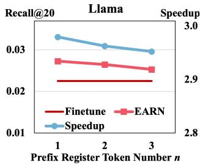

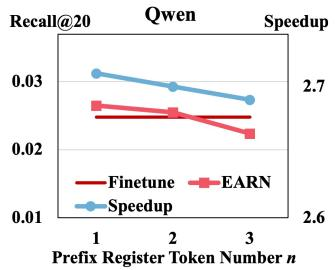

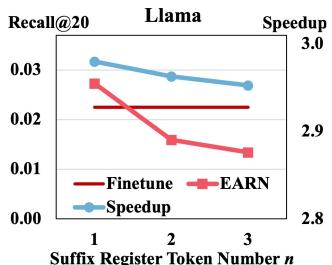

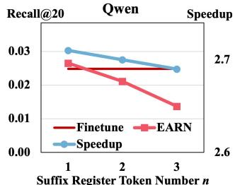  
Figure 7: Efect of register token number ??.

4.4.2 Efect of Register Token Number ??. Figure 7 reveals the trade-of between inference eficiency and recommendation efectiveness when varying the register token number ??, from which we can observe that: 1) For both the prefix register and the sufix regis ter, as the register token number ?? varies from 1 to 3, the speedup gradually decreases. This is primarily because, as the register token number increases, the size of the KV Cache that needs to be com puted and cached also grows, leading to increased inference latency. 2) There is a decline in Recall@20 as the register token number ?? increases for both the prefix register and the sufix register. This phenomenon may be attributed to the interactions among multiple tokens in the later layers of the model, which can lead to a progressive distortion of the summarized information. The impact of this accuracy degradation is relatively minor for the prefix register but more pronounced for the sufix register. This discrepancy is likely due to the fact that user interaction history summarized by the sufix register is more complex and challenging to condense compared to task instructions summarized by the prefix register.

Although the above results show that a single register token is optimal, as prompt length increases, the optimal number of register tokens may need to be adjusted to maintain the performance. There fore, we conduct further experiments to investigate how EARN performs under diferent prompt lengths and whether the optimal number of register tokens should be adjusted as the prompt length increases. We segmented the dataset into three groups based on prompt length (50-100, 100-150, and 150-200 tokens) to evaluate our

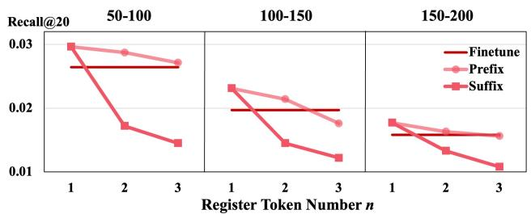  
Figure 8: Efect of register token number ?? under diferent prompt length.

EARN’s performance across diferent prompt lengths. As shown in Figure 8, EARN consistently outperforms the Finetune baseline, and a single register token remains optimal across all prompt lengths. However, we observed an interesting trend for the sufix register token: the performance gap between 1 and 2 register tokens narrows as prompt length increases. This suggests that the optimal number of register tokens may rise for very long prompts. Nevertheless, experimental results on three real-world datasets (Table 1) demonstrate that employing a single sufix register token could achieve excellent recommendation performance, which is applicable to the majority of recommendation scenarios.

4.4.3 Hyper-parameter Recommendation. We experimentally validated that EARN’s hyper-parameters can be selected through simple heuristics rather than exhaustive tuning. And we validated that setting the register layer and using a single register token at one-fourth achieves significant acceleration without accuracy loss on three real-world datasets. This configuration is broadly applicable for most recommendation tasks. Detailed analysis is as follows: 1) Register layer depth ??: Firstly, the lower the register layer ??, the greater the acceleration efect achieved. Secondly, our sensitivity analysis indicates that there is essentially no loss in recommendation efectiveness when ?? is set to at least one-fourth of the total layers. 2) Register token number ??: Across two distinct LLM models (Llama and Qwen), we consistently found that one register token is optimal. Additionally, to assess if the number needs adjustment as prompt length increases, we conducted grouped experiments by length, and found that a single register token remains optimal under diferent prompt lengths. Thus, for most LLMRec scenarios, we propose a default configuration:

(1) ??: One-fourth of the total layers as the register layer depth.

(2) ??: One prefix register token and one sufix register token.

This setting could achieve a favorable speedup and KV Cache reduction while maintaining strong recommendation performance. And it’s easily adjustable for various deployment scenarios.

## 4.5 Ablation Studies (RQ4)

To study the contribution of each component of the proposed EARN, we conduct ablation studies on the register training strategy and the register token.

4.5.1 Efect of Register Training. We first investigate the necessity of register training by comparing it with direct register inference on fully finetuned models. As shown in Table 2, models without RT sufer significant performance degradation across all metrics. Specifically for Llama with ?? = 7, removing RT leads to 72% relative drop in R@10 (from 0.0174 to 0.0048) and 80% reduction in N@20 (from 0.0127 to 0.0025). This demonstrates that directly applying register inference without dedicated training fails to efectively capture task-specific knowledge. With RT, both models achieve consistent improvements over Finetune. Llama with ?? = 7 gains 17% higher R@10 (0.0174 vs. 0.0145) and 15% better N@20 (0.0127 vs. 0.0108). This indicates that register training enables the model to summarize key information from user historical interactions into the register token.

Table 2: Ablation study of the register training (RT).

<table><tr><td>Model</td><td>k</td><td>Method</td><td>R@10</td><td>R@20</td><td>N@10</td><td>N@20</td></tr><tr><td rowspan="5">Llama</td><td></td><td>Finetune</td><td>0.0145</td><td>0.0225</td><td>0.0084</td><td>0.0108</td></tr><tr><td rowspan="2">7</td><td>EARN</td><td>0.0174</td><td>0.0273</td><td>0.0098</td><td>0.0127</td></tr><tr><td>w/o RT</td><td>0.0048</td><td>0.0060</td><td>0.0021</td><td>0.0025</td></tr><tr><td rowspan="2">15</td><td>EARN</td><td>0.0168</td><td>0.0286</td><td>0.0093</td><td>0.0127</td></tr><tr><td>w/o RT</td><td>0.0053</td><td>0.0083</td><td>0.0029</td><td>0.0038</td></tr><tr><td rowspan="5">Qwen</td><td></td><td>Finetune</td><td>0.0145</td><td>0.0248</td><td>0.0087</td><td>0.0117</td></tr><tr><td rowspan="2">7</td><td>EARN</td><td>0.0155</td><td>0.0265</td><td>0.0091</td><td>0.0122</td></tr><tr><td>w/o RT</td><td>0.0074</td><td>0.0093</td><td>0.0044</td><td>0.0050</td></tr><tr><td rowspan="2">13</td><td>EARN</td><td>0.0156</td><td>0.0263</td><td>0.0098</td><td>0.0129</td></tr><tr><td>w/o RT</td><td>0.0072</td><td>0.0095</td><td>0.0043</td><td>0.0050</td></tr></table>

Table 3: Ablation study of the prefix register (PR) and the sufix register (SR).

<table><tr><td>Model</td><td>k</td><td>Method</td><td>R@10</td><td>R@20</td><td>N@10</td><td>N@20</td></tr><tr><td rowspan="6">Llama</td><td rowspan="3">7</td><td>EARN</td><td>0.0174</td><td>0.0273</td><td>0.0098</td><td>0.0127</td></tr><tr><td>w/o PR</td><td>0.0172</td><td>0.0252</td><td>0.0108</td><td>0.0132</td></tr><tr><td>w/o SR</td><td>0.0041</td><td>0.0075</td><td>0.0021</td><td>0.0031</td></tr><tr><td rowspan="3">15</td><td>EARN</td><td>0.0168</td><td>0.0286</td><td>0.0093</td><td>0.0127</td></tr><tr><td>w/o PR</td><td>0.0166</td><td>0.0260</td><td>0.0103</td><td>0.0131</td></tr><tr><td>w/o SR</td><td>0.0074</td><td>0.0119</td><td>0.0035</td><td>0.0047</td></tr><tr><td rowspan="6">Qwen</td><td rowspan="3">7</td><td>EARN</td><td>0.0155</td><td>0.0265</td><td>0.0091</td><td>0.0122</td></tr><tr><td>w/o PR</td><td>0.0153</td><td>0.0217</td><td>0.0097</td><td>0.0116</td></tr><tr><td>w/o SR</td><td>0.0044</td><td>0.0071</td><td>0.0023</td><td>0.0031</td></tr><tr><td rowspan="3">13</td><td>EARN</td><td>0.0156</td><td>0.0263</td><td>0.0098</td><td>0.0129</td></tr><tr><td>w/o PR</td><td>0.0153</td><td>0.0230</td><td>0.0102</td><td>0.0124</td></tr><tr><td>w/o SR</td><td>0.0065</td><td>0.0106</td><td>0.0036</td><td>0.0049</td></tr></table>

4.5.2 Efect of Prefix Register and Sufix Register. We further dissect the contribution of the prefix register and the sufix reg ister through component-wise ablation. Table 3 reveals three key observations: 1) Sufix register dominates performance: Removing the sufix register (w/o SR) causes significant performance collapse for both Llama and Qwen. This confirms our design intuition that summarizing historical interactions in the sufix register is crucial for recommendation tasks. 2) Prefix register enhances task awareness: Though not as severe as removing the sufix register (w/o SR), removing the prefix register (w/o PR) still leads to a certain degree of performance degradation. This suggests the prefix register efec tively primes the model for recommendation task identification. 3) Layer-depth interaction: The impact of removing the sufix register is more pronounced in the lower layers (e.g., ?? = 7 exhibits a greater performance drop than ?? = 15 on Llama), indicating that the sufix register plays a more significant summarization role in the lower layers. The lower layers rely more heavily on the compressed historical interaction information encoded in the sufix register.

## 5 Related Work

Inference Acceleration of LLMRec. While LLM-based generative recommendations have shown remarkable performance [10, 16, 20–22, 36, 38], their practical application is hindered by high inference latency [12, 37, 44]. To tackle this issue, various research has been proposed. Several techniques leverage knowledge distillation to transfer comprehensible knowledge [4] or abstract knowledge [33] from a teacher LLM to a smaller student language model. Additionally, some methods apply speculative decoding to achieve lossless decoding acceleration [23, 39]. Besides, some approaches attempt to design eficient attention mechanisms to reduce computational complexity, such as sparse attention [6], linear attention [24], and slimming architecture [19].

KV Cache Reduction. It’s common practice to utilize KV Cache to reduce redundant computations during LLM inference. However, the use of KV Cache introduces new challenges. KV Cache will increase linearly with the length of the sequence, and the memory required will become larger and larger. To address this challenge, diverse methods have been proposed to reduce KV Cache, including two primary groups of work, i.e., prompt compression and cache compression. Prompt compression reduces the initial KV Cache size during prefilling by shortening the input token sequence. Hard compression methods like SelectiveContext [14] and LLMLingua [9] filter redundant tokens while preserving natural language syntax, albeit at the cost of fluency. Soft compression techniques, such as AutoCompressor [3] and 500xCompressor [18], encode prompts into dense latent tokens, achieving higher compression ratios but sacrificing human interpretability. Cache compression reduces KV cache during decoding. Existing work employs eviction or merging strategies. Evict-based methods like StreamingLLM [40] and SnapKV [15] selectively evict less important KV Cache through specific rules. Merge-based approaches (e.g., CAM [42] and DMC [29]) adaptively merge to-be-evicted caches into the remaining ones.

## 6 Conclusion

In this work, we address the critical challenge of inference eficiency in LLM-based recommendation systems (LLMRec), where the massive computational overhead and memory pressure of KV Cache severely hinders practical deployment. Through systematic analysis of LLMRec’s attention patterns, we identify two pivotal characteristics: 1) layer-wise attention sparsity inversion, where in early layers retain dense informative patterns while later layers exhibit high redundancy, and 2) the dual attention sinks phenomenon, where attention scores concentrate on both head and tail tokens of input sequences. These insights motivate our proposed EARN method, which introduces prefix and sufix register tokens to compress task instructions and user interaction histories, implementing layer-wise computation pruning. EARN achieves an 80% reduction of KV Cache while maintaining essential information integrity. Extensive experiments conducted on three benchmark datasets and two distinct LLM architectures reveal that our EARN attains 3.79x inference acceleration with superior accuracy compared to conventional finetuning approaches. This breakthrough efectively reconciles the longstanding trade-of between inference eficiency and recommendation quality in LLMRec, presenting tangible deployment benefits for industrial-scale recommendation services.

## References

[1] Beidi Chen, Tri Dao, Eric Winsor, Zhao Song, Atri Rudra, and Christopher Ré. 2021. Scatterbrain: Unifying sparse and low-rank attention. Advances in Neural Information Processing Systems 34 (2021), 17413–17426.

[2] Guoxuan Chen, Han Shi, Jiawei Li, Yihang Gao, Xiaozhe Ren, Yimeng Chen, Xin Jiang, Zhenguo Li, Weiyang Liu, and Chao Huang. 2024. SepLLM: Accelerate large language models by compressing one segment into one separator. arXiv preprint arXiv:2412.12094 (2024).

[3] Alexis Chevalier, Alexander Wettig, Anirudh Ajith, and Danqi Chen. 2023. Adapt ing language models to compress contexts. In Proceedings of the 2023 Conference on Empirical Methods in Natural Language Processing. 3829–3846.

[4] Yu Cui, Feng Liu, Pengbo Wang, Bohao Wang, Heng Tang, Yi Wan, Jun Wang, and Jiawei Chen. 2024. Distillation matters: empowering sequential recommenders to match the performance of large language models. In Proceedings of the 18th ACM Conference on Recommender Systems. 507–517.

[5] Yichuan Deng, Zhao Song, Jing Xiong, and Chiwun Yang. 2024. How Sparse Attention Approximates Exact Attention? Your Attention is Naturally ?? -Sparse. arXiv preprint arXiv:2404.02690 (2024).

[6] Xinyan Fan, Zheng Liu, Jianxun Lian, Wayne Xin Zhao, Xing Xie, and Ji-Rong Wen. 2021. Lighter and better: low-rank decomposed self-attention networks for next-item recommendation. In Proceedings of the 44th International ACM SIGIR Conference on Research and Development in Information Retrieval. 1733–1737.

[7] Xiangming Gu, Tianyu Pang, Chao Du, Qian Liu, Fengzhuo Zhang, Cunxiao Du, Ye Wang, and Min Lin. 2025. When attention sink emerges in language models: An empirical view. In The 13th International Conference on Learning Representations.

[8] Dan Hendrycks, Collin Burns, Steven Basart, Andy Zou, Mantas Mazeika, Dawn Song, and Jacob Steinhardt. 2021. Measuring massive multitask language under standing. In The 9th International Conference on Learning Representations.

[9] Huiqiang Jiang, Qianhui Wu, Chin-Yew Lin, Yuqing Yang, and Lili Qiu. 2023. LLMLingua: Compressing prompts for accelerated inference of large language models. In Proceedings of the 2023 Conference on Empirical Methods in Natural Language Processing. 13358–13376.

[10] Sein Kim, Hongseok Kang, Seungyoon Choi, Donghyun Kim, Minchul Yang, and Chanyoung Park. 2024. Large language models meet collaborative filtering: An eficient all-round LLM-based recommender system. In Proceedings of the 30th ACM SIGKDD Conference on Knowledge Discovery and Data Mining. 1395–1406.

[11] Lei Li, Yongfeng Zhang, and Li Chen. 2023. Prompt distillation for eficient LLM based recommendation. In Proceedings of the 32nd ACM International Conference on Information and Knowledge Management. 1348–1357.

[12] Lei Li, Yongfeng Zhang, Dugang Liu, and Li Chen. 2024. Large language models for generative recommendation: A survey and visionary discussions. In Proceedings of the 2024 Joint International Conference on Computational Linguistics, Language Resources and Evaluation (LREC-COLING 2024). 10146–10159.

[13] Pengxiang Li, Lu Yin, and Shiwei Liu. 2025. Mix-LN: Unleashing the power of deeper layers by combining Pre-LN and Post-LN, In The 13th Internationa Conference on Learning Representations. arXiv preprint arXiv:2412.13795

[14] Yucheng Li, Bo Dong, Frank Guerin, and Chenghua Lin. 2023. Compressing context to enhance inference eficiency of large language models. In Proceedings of the 2023 Conference on Empirical Methods in Natural Language Processing. 6342–6353.

[15] Yuhong Li, Yingbing Huang, Bowen Yang, Bharat Venkitesh, Acyr Locatelli, Hanchen Ye, Tianle Cai, Patrick Lewis, and Deming Chen. 2024. SnapKV: LLM knows what you are looking for before generation. Advances in Neural Information Processing Systems 37 (2024), 22947–22970.

[16] Yongqi Li, Xinyu Lin, Wenjie Wang, Fuli Feng, Liang Pang, Wenjie Li, Liqiang Nie, Xiangnan He, and Tat-Seng Chua. 2024. A survey of generative search and recom mendation in the era of large language models. arXiv preprint arXiv:2404.16924 (2024).

[17] Zongqian Li, Yinhong Liu, Yixuan Su, and Nigel Collier. 2024. Prompt compression for large language models: A survey. In Proceedings of the 2025 Conference of the Nations of the Americas Chapter of the Association for Computational Linguistics: Human Language Technologies (Volume 1: Long Papers). 7182–7195.

[18] Zongqian Li, Yixuan Su, and Nigel Collier. 2024. 500xCompressor: Generalized prompt compression for large language models. arXiv preprint arXiv:2408.03094 (2024).

[19] Jianghao Lin, Xinyi Dai, Rong Shan, Bo Chen, Ruiming Tang, Yong Yu, and Weinan Zhang. 2025. Large language models make sample-eficient recommender systems. Frontiers of Computer Science 19, 4 (2025), 194328.

[20] Jianghao Lin, Xinyi Dai, Yunjia Xi, Weiwen Liu, Bo Chen, Hao Zhang, Yong Liu, Chuhan Wu, Xiangyang Li, Chenxu Zhu, et al. 2025. How can recommender systems benefit from large language models: A survey. ACM Transactions on Information Systems 43, 2 (2025), 1–47.

[21] Xinyu Lin, Wenjie Wang, Yongqi Li, Fuli Feng, See-Kiong Ng, and Tat-Seng Chua. 2024. Bridging items and language: A transition paradigm for large language model-based recommendation. In Proceedings of the 30th ACM SIGKDD Conference on Knowledge Discovery and Data Mining. 1816–1826.

[22] Xinyu Lin, Wenjie Wang, Yongqi Li, Shuo Yang, Fuli Feng, Yinwei Wei, and Tat-Seng Chua. 2024. Data-eficient fine-tuning for LLM-based recommendation. In Proceedings of the 47th International ACM SIGIR Conference on Research and Development in Information Retrieval. 365–374.

[23] Xinyu Lin, Chaoqun Yang, Wenjie Wang, Yongqi Li, Cunxiao Du, Fuli Feng, See-Kiong Ng, and Tat-Seng Chua. 2025. Eficient inference for large language model-based generative recommendation. In The 13th International Conference on Learning Representations.

[24] Langming Liu, Liu Cai, Chi Zhang, Xiangyu Zhao, Jingtong Gao, Wanyu Wang, Yifu Lv, Wenqi Fan, Yiqi Wang, Ming He, et al. 2023. Linrec: Linear attention mechanism for long-term sequential recommender systems. In Proceedings of the 46th International ACM SIGIR Conference on Research and Development in Information Retrieval. 289–299.

[25] Xiao Liu, Kaixuan Ji, Yicheng Fu, Weng Tam, Zhengxiao Du, Zhilin Yang, and Jie Tang. 2022. P-tuning v2: Prompt tuning can be comparable to fine-tuning universally across scales and tasks. In Proceedings of the 60th Annual Meeting of the Association for Computational Linguistics (Volume 2: Short Papers). 61–68.

[26] Xiao Liu, Yanan Zheng, Zhengxiao Du, Ming Ding, Yujie Qian, Zhilin Yang, and Jie Tang. 2024. GPT understands, too. AI Open 5 (2024), 208–215.

[27] Shi Luohe, Hongyi Zhang, Yao Yao, Zuchao Li, et al. 2024. Keep the cost down: A review on methods to optimize LLM’s KV-Cache consumption. In The 1st Conference on Language Modeling (COLM).

[28] Jesse Mu, Xiang Li, and Noah Goodman. 2023. Learning to compress prompts with gist tokens. Advances in Neural Information Processing Systems 36 (2023), 19327–19352.

[29] Piotr Nawrot, Adrian Łańcucki, Marcin Chochowski, David Tarjan, and Edoardo M Ponti. 2024. Dynamic memory compression: retrofitting LLMs for accelerated inference. In The 41st International Conference on Machine Learning. 37396–37412.

[30] Jianhui Pang, Fanghua Ye, Derek Wong, Xin He, Wanshun Chen, and Longyue Wang. 2024. Anchor-based large language models. In Findings of the Association for Computational Linguistics. 4958–4976.

[31] Shashank Rajput, Nikhil Mehta, Anima Singh, Raghunandan Hulikal Keshavan, Trung Vu, Lukasz Heldt, Lichan Hong, Yi Tay, Vinh Tran, Jonah Samost, et al. 2023. Recommender systems with generative retrieval. Advances in Neural Information Processing Systems 36 (2023), 10299–10315.

[32] Zhenmei Shi, Yifei Ming, Xuan-Phi Nguyen, Yingyu Liang, and Shafiq Joty. 2024. Discovering the gems in early layers: Accelerating long-context LLMs with 1000x input token reduction. arXiv preprint arXiv:2409.17422 (2024).

[33] Wenqi Sun, Ruobing Xie, Junjie Zhang, Wayne Xin Zhao, Leyu Lin, and Ji-Rong Wen. 2024. Distillation is all you need for practically using diferent pre-trained recommendation models. arXiv preprint arXiv:2401.00797 (2024).

[34] Qwen Team. 2024. Qwen2.5: A party of foundation models. https://qwenlm. github.io/blog/qwen2.5

[35] Hugo Touvron, Thibaut Lavril, Gautier Izacard, Xavier Martinet, Marie-Anne Lachaux, Timothée Lacroix, Baptiste Rozière, Naman Goyal, Eric Hambro, Faisal Azhar, et al. 2023. Llama: Open and eficient foundation language models. arXiv preprint arXiv:2302.13971 (2023).

[36] Wenjie Wang, Xinyu Lin, Fuli Feng, Xiangnan He, and Tat-Seng Chua. 2023. Generative recommendation: Towards next-generation recommender paradigm. arXiv preprint arXiv:2304.03516 (2023).

[37] Haotian Wu, Yingpeng Du, Zhu Sun, Tianjun Wei, Jie Zhang, and Ong Yew Soon. 2024. A survey on eficient solutions of large language models for recommenda tion. Authorea Preprints (2024).

[38] Likang Wu, Zhi Zheng, Zhaopeng Qiu, Hao Wang, Hongchao Gu, Tingjia Shen, Chuan Qin, Chen Zhu, Hengshu Zhu, Qi Liu, et al. 2024. A survey on large language models for recommendation. World Wide Web 27, 5 (2024), 60.

[39] Yunjia Xi, Hangyu Wang, Bo Chen, Jianghao Lin, Menghui Zhu, Weiwen Liu, Ruiming Tang, Weinan Zhang, and Yong Yu. 2025. Eficiency unleashed: Inference acceleration for LLM-based recommender systems with speculative decoding. arXiv preprint arXiv:2408.05676 (2025).

[40] Guangxuan Xiao, Yuandong Tian, Beidi Chen, Song Han, and Mike Lewis. 2024. Eficient streaming language models with attention sinks. In The 12th International Conference on Learning Representations.

[41] Jiaqi Zhai, Lucy Liao, Xing Liu, Yueming Wang, Rui Li, Xuan Cao, Leon Gao, Zhaojie Gong, Fangda Gu, Jiayuan He, et al. 2024. Actions speak louder than words: trillion-parameter sequential transducers for generative recommendations. In The 41st International Conference on Machine Learning. 58484–58509.

[42] Yuxin Zhang, Yuxuan Du, Gen Luo, Yunshan Zhong, Zhenyu Zhang, Shiwei Liu, and Rongrong Ji. 2024. CaM: Cache merging for memory-eficient LLMs inference. In The 41st International Conference on Machine Learning. 58840–58850.

[43] Bowen Zheng, Yupeng Hou, Hongyu Lu, Yu Chen, Wayne Xin Zhao, Ming Chen, and Ji-Rong Wen. 2024. Adapting large language models by integrating collaborative semantics for recommendation. In 2024 IEEE 40th International Conference on Data Engineering (ICDE). 1435–1448.

[44] Zixuan Zhou, Xuefei Ning, Ke Hong, Tianyu Fu, Jiaming Xu, Shiyao Li, Yuming Lou, Luning Wang, Zhihang Yuan, Xiuhong Li, et al. 2024. A survey on eficient inference for large language models. arXiv preprint arXiv:2404.14294 (2024).

## A Appendix

## A.1 Detailed Analysis of Attention Score Distributions

In this section, we provide a systematic analysis of attention score distributions in LLMRec through quantitative measurements across two critical dimensions: layer order and token position. To ensure comprehensive insights, we conduct experiments across 13 NLP tasks and three real-world recommendation datasets, two main stream LLMRec methods, and two distinct LLM architectures. Ta ble 4 presents the overall results. More detailed quantitative results and visual figures can be found in our GitHub repository2. Our findings reveal fundamental diferences in attention patterns be tween NLP tasks and LLMRec tasks, ofering critical guidance for designing eficient compression strategies.

Quantitative Measurements of Attention Score Distribu tions. Given a sequence’s attention scores $\left[ { p _ { 1 } , p _ { 2 } , \cdots , p _ { n } } \right]$ , we test its sparsity by threshold-based sparsity ratio adapted from prior studies [1, 5]:

$$
S p a r s i t y = \frac {1}{n} \sum_ {i = 1} ^ {n} \mathbb {I} (p _ {i} > \epsilon),\tag{14}
$$

where ?? is the threshold. Here we set $\epsilon = 0 . 0 5 ,$ , according to the distribution characteristics of attention scores.

We test its sink by position-based total attention scores:

$$
S i n k _ {h e a d} = \sum_ {i = 1} ^ {T _ {h}} p _ {i}, S i n k _ {t a i l} = \sum_ {i = T _ {t}} ^ {n} p _ {i},\tag{15}
$$

where $T _ { h }$ and $T _ { t }$ is the position of the head and tail respectively. Here we set $T _ { h } = 3 , T _ { t } = n { - } 3$ , according to the distribution characteristics of attention scores.

Attention Diferences across Layer Orders. As measured in Table 4, we identify a layer-wise atention sparsity inversion between NLP tasks and LLMRec tasks. In NLP tasks, the atten tion sparsity is high in early layers, but decreases in later layers $( S p _ { e a r l y } > S p _ { l a t t e r } )$ . Conversely, LLMRec tasks display an inverted pattern: the attention sparsity is relatively low in early layers, but increases in later layers $( S p _ { e a r l y } < S p _ { l a t t e r } )$ . This indicates that the less sparse early layers in LLMRec retain more user preference in formation, while high sparsity in later layers suggests redundancy.

Attention Diferences across Token Positions. Table 4 re veals a dual atention sinks phenomenon that distinguishes LLMRec from NLP tasks. There is significant $S i n k _ { h e a d }$ for both tasks, while LLMRec exhibits a larger $S i n k _ { t a i l } \ : ( S i n k _ { t a i l } \mathrm { ( L L M R e c ) } >$ $S i n k _ { t a i l } ( \mathrm { N L P } ) )$ . This indicates that both head and tail tokens in LLMRec are crucial for recommendation performance.

Implications for Compression Strategy. These findings indi cate that in LLMRec, the early layers contain richer information, while the middle tokens in the later layers are redundant. Our ap proach takes into account the unique attention score distributions in LLMRec and formulates a reasonable compression scheme from a global perspective. It focuses on preserving information from critical token positions and early layers while pruning redundant parts in later layers. This ensures that it can improve eficiency while maintaining accuracy.

Table 4: Measurements of attention sink and sparsity (averaged across 13 NLP tasks, 3 real-world recommendation datasets, 2 LLMRec backbones, and 2 LLM models). Here, $\boldsymbol { s p _ { e a r l y } }$ denotes $S p a r s i t y _ { e a r l y \ l a y e r s } ,$ and $\boldsymbol { S p } _ { l a t t e r }$ denotes ???????? ?? ???????????? ?????? ???????????? .

<table><tr><td>Model</td><td>Task</td><td> $Sp_{early}$ </td><td> $Sp_{latter}$ </td><td> $Sink_{head}$ </td><td> $Sink_{tail}$ </td></tr><tr><td rowspan="2">Llama</td><td>NLP</td><td>0.064</td><td>0.026</td><td>0.73</td><td>0.07</td></tr><tr><td>LLMRec</td><td>0.025</td><td>0.048</td><td>0.56</td><td>0.09</td></tr><tr><td rowspan="2">Qwen</td><td>NLP</td><td>0.074</td><td>0.046</td><td>0.30</td><td>0.15</td></tr><tr><td>LLMRec</td><td>0.047</td><td>0.059</td><td>0.30</td><td>0.24</td></tr></table>

## A.2 Computational Complexity of LLM

For a decoder-only LLM with ?? decoder layers, the computational operations comprise three components: embedding, ?? stacked decoder layers, and de-embedding. Since embedding and de-embedding mainly involve lightweight lookup and projection steps, the computational bottleneck lies in the decoder layers. Specifically, each decoder layer consists of two core components: Multi-Head Attention (MHA) and Feed-Forward Network (FFN), whose FLOPs are analyzed as follows:

Multi-Head Attention (MHA). Let ?? denote the sequence length, $d _ { h }$ the hidden dimension, $d _ { a }$ the attention head dimension, and $n _ { h }$ the number of attention heads. We approximate the FLOPs of matrix multiplication $X ^ { L \times d _ { h } } \times W ^ { d _ { h } \times d _ { a } }$ as $2 L d _ { h } d _ { a }$ . For a single attention head, the FLOPs include: 1) Projections for ??, ?? and $V \colon 2 L d _ { h } d _ { a } \times 3 = 6 L d _ { h } d _ { a } ; 2 )$ Attention computation for $Q K ^ { T }$ and $( \cdot ) V \colon 2 L ^ { 2 } d _ { a } + 2 L ^ { 2 } d _ { a } = 4 L ^ { 2 } d _ { a }$ . Aggregating across $n _ { h }$ heads, plus $2 L n _ { h } d _ { a } d _ { h }$ FLOPs of the final output projection, the total MHA FLOPs per decoder layer are:

$$
F L O P s _ {M H A} = n _ {h} (8 L d _ {h} d _ {a} + 4 L ^ {2} d _ {a}).\tag{16}
$$

Feed-Forward Network (FFN). The FFN module involves two projections with intermediate dimension $d _ { f } \mathbf { \cdot } \mathbf { 1 } )$ Up-projection: $2 L d _ { h } d _ { f } ;$ 2) Down-projection: $2 L d _ { f } d _ { h }$ . This yields total FFN FLOPs of:

$$
F L O P s _ {F F N} = 4 L d _ {h} d _ {f}.\tag{17}
$$

Total FLOPs. Combining both components, the FLOPs for a single decoder layer are:

$$
\begin{array}{r} F L O P s _ {L L M l a y e r} = n _ {h} (8 L d _ {h} d _ {a} + 4 L ^ {2} d _ {a}) + 4 L d _ {h} d _ {f} \\ = 4 L [ n _ {h} d _ {a} (2 d _ {h} + L) + d _ {h} d _ {f} ]. \end{array}\tag{18}
$$

## A.3 Experimential Details

Datasets Details. For all three datasets, all historical interactions are sorted according to the global timestamps, and then split into training, validation, and testing sets with the ratio of 8:1:1. For the item identifier, we follow LC-Rec [43] and TIGER [31] to set the length $L = 4 ,$ i.e., the token sequence length of a generated item would be 4.

Implementation details. All training and inference experiments are conducted on a single NVIDIA H100 80GB GPU. For the training setup, we employ full finetuning with AdamW optimizer and an overall batch size of 128 by leveraging gradient accumulation. The learning rate is set to 0.001, and is adjusted dynamically by a cosine learning rate scheduler with a warmup ratio of 0.02. For the inference setup, we set the beam size to 20 and use the maximum batch size that the GPU could accommodate. For the hyper-parameters of EARN in Table 1, EARN on Llama uses $k = 4$ and ?? = 1, and EARN on Qwen uses ?? = 7 and ?? = 1.

Table 5: Overall performance comparison between the baselines and EARN instantiated on TIGER.

<table><tr><td rowspan="2">Method</td><td colspan="2">Time Efficiency</td><td colspan="2">Space Efficiency</td><td colspan="4">Recommendation Effectiveness</td></tr><tr><td> $\omega$ </td><td> $\tau$ </td><td> $\gamma$ </td><td> $\sigma$ </td><td>R@10</td><td>R@20</td><td>N@10</td><td>N@20</td></tr><tr><td colspan="9">Beauty, Llama</td></tr><tr><td>Finetune</td><td>1.00</td><td>602.50</td><td>0.0</td><td>68.18</td><td>0.0108</td><td>0.0198</td><td>0.0071</td><td>0.0096</td></tr><tr><td>SkipLayers</td><td>1.78</td><td>1069.7</td><td>44.5</td><td>37.87</td><td>0.0010</td><td>0.0010</td><td>0.0011</td><td>0.0011</td></tr><tr><td>POD</td><td>1.17</td><td>701.7</td><td>14.8</td><td>58.11</td><td>0.0033</td><td>0.0065</td><td>0.0027</td><td>0.0039</td></tr><tr><td>500xCompressor</td><td>2.31</td><td>1389.1</td><td>74.8</td><td>17.16</td><td>0.0003</td><td>0.0003</td><td>0.0001</td><td>0.0001</td></tr><tr><td>StreamingLLM</td><td>1.21</td><td>730.0</td><td>96.4</td><td>2.44</td><td>0.0003</td><td>0.0005</td><td>0.0005</td><td>0.0003</td></tr><tr><td>SnapKV</td><td>1.19</td><td>718.1</td><td>94.5</td><td>3.76</td><td>0.0041</td><td>0.0053</td><td>0.0027</td><td>0.0031</td></tr><tr><td>EARN</td><td>3.44</td><td>1972.4</td><td>80.9</td><td>13.04</td><td>0.0115</td><td>0.0199</td><td>0.0075</td><td>0.0098</td></tr><tr><td colspan="9">Beauty, Qwen</td></tr><tr><td>Finetune</td><td>1.00</td><td>714.3</td><td>0.0</td><td>12.72</td><td>0.0095</td><td>0.0162</td><td>0.0061</td><td>0.0081</td></tr><tr><td>SkipLayers</td><td>1.69</td><td>1208.1</td><td>57.9</td><td>5.35</td><td>0.0000</td><td>0.0000</td><td>0.0000</td><td>0.0000</td></tr><tr><td>POD</td><td>1.10</td><td>784.4</td><td>8.4</td><td>11.65</td><td>0.0056</td><td>0.0084</td><td>0.0032</td><td>0.0044</td></tr><tr><td>500xCompressor</td><td>2.55</td><td>1819.2</td><td>91.4</td><td>1.09</td><td>0.0003</td><td>0.0005</td><td>0.0002</td><td>0.0005</td></tr><tr><td>StreamingLLM</td><td>1.05</td><td>751.6</td><td>91.7</td><td>1.06</td><td>0.0057</td><td>0.0096</td><td>0.0040</td><td>0.0052</td></tr><tr><td>SnapKV</td><td>1.02</td><td>728.7</td><td>69.6</td><td>3.87</td><td>0.0063</td><td>0.0110</td><td>0.0043</td><td>0.0055</td></tr><tr><td>EARN</td><td>2.58</td><td>1805.9</td><td>75.5</td><td>3.11</td><td>0.0104</td><td>0.0164</td><td>0.0065</td><td>0.0089</td></tr><tr><td colspan="9">Games, Llama</td></tr><tr><td>Finetune</td><td>1.00</td><td>695.8</td><td>0.0</td><td>61.40</td><td>0.0126</td><td>0.0216</td><td>0.0080</td><td>0.0107</td></tr><tr><td>SkipLayers</td><td>1.83</td><td>1272.4</td><td>45.0</td><td>33.76</td><td>0.0001</td><td>0.0001</td><td>0.0003</td><td>0.0003</td></tr><tr><td>POD</td><td>1.08</td><td>757.8</td><td>15.8</td><td>51.67</td><td>0.0054</td><td>0.0098</td><td>0.0032</td><td>0.0045</td></tr><tr><td>500xCompressor</td><td>2.11</td><td>1470.2</td><td>72.5</td><td>16.88</td><td>0.0010</td><td>0.0015</td><td>0.0007</td><td>0.0008</td></tr><tr><td>StreamingLLM</td><td>1.22</td><td>850.7</td><td>96.0</td><td>2.46</td><td>0.0010</td><td>0.0010</td><td>0.0010</td><td>0.0009</td></tr><tr><td>SnapKV</td><td>1.21</td><td>837.6</td><td>93.5</td><td>3.98</td><td>0.0064</td><td>0.0075</td><td>0.0045</td><td>0.0045</td></tr><tr><td>EARN</td><td>3.12</td><td>2062.7</td><td>81.2</td><td>11.56</td><td>0.0138</td><td>0.0212</td><td>0.0085</td><td>0.0108</td></tr><tr><td colspan="9">Games, Qwen</td></tr><tr><td>Finetune</td><td>1.00</td><td>673.2</td><td>0.0</td><td>10.81</td><td>0.0131</td><td>0.0224</td><td>0.0085</td><td>0.0113</td></tr><tr><td>SkipLayers</td><td>1.51</td><td>1014.3</td><td>57.0</td><td>4.65</td><td>0.0000</td><td>0.0000</td><td>0.0000</td><td>0.0000</td></tr><tr><td>POD</td><td>1.36</td><td>912.1</td><td>8.5</td><td>9.88</td><td>0.0087</td><td>0.0150</td><td>0.0050</td><td>0.0073</td></tr><tr><td>500xCompressor</td><td>2.60</td><td>1752.0</td><td>96.7</td><td>0.35</td><td>0.0002</td><td>0.0004</td><td>0.0001</td><td>0.0001</td></tr><tr><td>StreamingLLM</td><td>1.06</td><td>708.8</td><td>98.4</td><td>0.17</td><td>0.0088</td><td>0.0145</td><td>0.0050</td><td>0.0072</td></tr><tr><td>SnapKV</td><td>1.02</td><td>686.4</td><td>67.6</td><td>3.50</td><td>0.0094</td><td>0.0161</td><td>0.0056</td><td>0.0081</td></tr><tr><td>EARN</td><td>2.86</td><td>1841.3</td><td>72.1</td><td>3.02</td><td>0.0137</td><td>0.0231</td><td>0.0086</td><td>0.0119</td></tr><tr><td colspan="9">MovieLens, Llama</td></tr><tr><td>Finetune</td><td>1.00</td><td>852.50</td><td>0.0</td><td>39.79</td><td>0.0245</td><td>0.0446</td><td>0.0244</td><td>0.0323</td></tr><tr><td>SkipLayers</td><td>1.85</td><td>1577.0</td><td>67.6</td><td>12.89</td><td>0.0022</td><td>0.0024</td><td>0.0059</td><td>0.0051</td></tr><tr><td>POD</td><td>1.18</td><td>1003.9</td><td>18.1</td><td>32.57</td><td>0.0068</td><td>0.0122</td><td>0.0088</td><td>0.0103</td></tr><tr><td>500xCompressor</td><td>1.93</td><td>1640.0</td><td>61.1</td><td>15.48</td><td>0.0004</td><td>0.0006</td><td>0.0004</td><td>0.0003</td></tr><tr><td>StreamingLLM</td><td>1.18</td><td>1007.9</td><td>95.2</td><td>1.89</td><td>0.0000</td><td>0.0000</td><td>0.0000</td><td>0.0000</td></tr><tr><td>SnapKV</td><td>1.18</td><td>1002.50</td><td>91.8</td><td>3.28</td><td>0.0000</td><td>0.0000</td><td>0.0000</td><td>0.0000</td></tr><tr><td>EARN</td><td>2.85</td><td>2437.4</td><td>77.7</td><td>8.87</td><td>0.0269</td><td>0.0544</td><td>0.0221</td><td>0.0340</td></tr><tr><td colspan="9">MovieLens, Qwen</td></tr><tr><td>Finetune</td><td>1.00</td><td>897.4</td><td>0.0</td><td>7.75</td><td>0.0238</td><td>0.0455</td><td>0.0224</td><td>0.0312</td></tr><tr><td>SkipLayers</td><td>1.49</td><td>1340.5</td><td>76.9</td><td>1.79</td><td>0.0002</td><td>0.0002</td><td>0.0002</td><td>0.0002</td></tr><tr><td>POD</td><td>1.41</td><td>1260.9</td><td>39.8</td><td>4.66</td><td>0.0114</td><td>0.0192</td><td>0.0106</td><td>0.0131</td></tr><tr><td>500xCompressor</td><td>2.10</td><td>1882.1</td><td>77.9</td><td>1.71</td><td>0.0004</td><td>0.0009</td><td>0.0005</td><td>0.0007</td></tr><tr><td>StreamingLLM</td><td>1.01</td><td>912.2</td><td>88.3</td><td>0.91</td><td>0.0213</td><td>0.0402</td><td>0.0180</td><td>0.0241</td></tr><tr><td>SnapKV</td><td>0.97</td><td>872.4</td><td>76.5</td><td>1.82</td><td>0.0204</td><td>0.0464</td><td>0.0174</td><td>0.0263</td></tr><tr><td>EARN</td><td>2.56</td><td>2292.8</td><td>45.5</td><td>4.23</td><td>0.0274</td><td>0.0474</td><td>0.0273</td><td>0.0355</td></tr></table>

Table 6: Overall comparison between baselines and EARN instantiated on HSTU. Here, the unit of ?? is MB.

<table><tr><td rowspan="2">Method</td><td colspan="2">Time Efficiency</td><td colspan="2">Space Efficiency</td><td colspan="4">Recommendation Effectiveness</td></tr><tr><td>ω</td><td>τ</td><td>γ</td><td>σ</td><td>R@10</td><td>R@20</td><td>N@10</td><td>N@20</td></tr><tr><td colspan="9">Beauty</td></tr><tr><td>Finetune</td><td>1.00</td><td>2735.5</td><td>0.0</td><td>439.5</td><td>0.0446</td><td>0.0693</td><td>0.0269</td><td>0.0328</td></tr><tr><td>SkipLayers</td><td>1.72</td><td>4685.6</td><td>27.8</td><td>317.5</td><td>0.0248</td><td>0.0322</td><td>0.0116</td><td>0.0136</td></tr><tr><td>EARN</td><td>2.01</td><td>5414.9</td><td>49.5</td><td>222.0</td><td>0.0520</td><td>0.0594</td><td>0.0311</td><td>0.0329</td></tr><tr><td colspan="9">Games</td></tr><tr><td>Finetune</td><td>1.00</td><td>3425.2</td><td>0.0</td><td>532.9</td><td>0.0557</td><td>0.0846</td><td>0.0362</td><td>0.0435</td></tr><tr><td>SkipLayers</td><td>1.69</td><td>5797.2</td><td>27.9</td><td>384.4</td><td>0.0371</td><td>0.0520</td><td>0.0200</td><td>0.0237</td></tr><tr><td>EARN</td><td>1.97</td><td>6770.9</td><td>50.3</td><td>264.9</td><td>0.0586</td><td>0.0735</td><td>0.0384</td><td>0.0421</td></tr><tr><td colspan="9">MovieLens</td></tr><tr><td>Finetune</td><td>1.00</td><td>3187.9</td><td>0.0</td><td>546.9</td><td>0.0756</td><td>0.1073</td><td>0.0405</td><td>0.0485</td></tr><tr><td>SkipLayers</td><td>1.75</td><td>5602.4</td><td>34.6</td><td>357.7</td><td>0.0780</td><td>0.1207</td><td>0.0429</td><td>0.0536</td></tr><tr><td>EARN</td><td>2.06</td><td>6555.8</td><td>50.5</td><td>270.6</td><td>0.0793</td><td>0.1268</td><td>0.0429</td><td>0.0551</td></tr></table>

Table 7: Overall performance comparison between Finetune and EARN with diferent register layer ?? on Llama (total 32 layers) on MMLU.

<table><tr><td>RegisterLayer k</td><td> $\omega$ </td><td> $\tau$ </td><td> $\gamma$ </td><td> $\sigma$ </td><td>Accuracy</td></tr><tr><td>Finetune</td><td>1.0</td><td>76.0</td><td>0.0</td><td>266.0</td><td>0.51</td></tr><tr><td>4</td><td>6.9</td><td>523.6</td><td>83.3</td><td>44.5</td><td>0.27</td></tr><tr><td>7</td><td>4.3</td><td>331.3</td><td>73.3</td><td>71.0</td><td>0.28</td></tr><tr><td>11</td><td>2.9</td><td>219.0</td><td>61.3</td><td>103.0</td><td>0.28</td></tr><tr><td>15</td><td>2.2</td><td>163.4</td><td>49.3</td><td>135.0</td><td>0.46</td></tr><tr><td>19</td><td>1.7</td><td>130.3</td><td>38.2</td><td>164.5</td><td>0.50</td></tr><tr><td>23</td><td>1.4</td><td>104.3</td><td>26.1</td><td>196.5</td><td>0.50</td></tr><tr><td>27</td><td>1.2</td><td>91.6</td><td>14.2</td><td>228.3</td><td>0.50</td></tr></table>

## A.4 Additional Results on TIGER

Table 5 shows the overall performance comparison between the baselines and EARN instantiated on TIGER. Our EARN achieves the best performance in terms of time eficiency and recommendation efectiveness, while also demonstrating excellent space eficiency. These results further validate the efectiveness of EARN.

## A.5 Additional Results on HSTU

We also conduct experiments on HSTU [41], the first industrydeployed generative recommendation system. As shown in Table 6, our EARN is also efective for HSTU, demonstrating excellent time and space eficiency (2x speedup and 50% memory savings), with minimal impact on recommendation efectiveness. It is important to note that HSTU difers from other popular LLM-based generative recommendation methods (e.g., LC-Rec). Specifically, in HSTU model, there are no textual inputs and no concept of prompts as seen in NLP tasks. And HSTU directly generates the predicted item embeddings, akin to generating only one token, which means it only has the prefilling stage and no decoding stage. These render that the baselines of prompt compression, cache compression, and gist methods in NLP are not applicable. Therefore, we primarily compared Finetune, SkipLayer, and EARN.

## A.6 Additional Results on NLP Tasks

To validate the generalizability of EARN beyond recommendation tasks, we conducted experiments on MMLU dataset [8]—a general NLP dataset spanning 57 tasks (e.g., math, science, and humanities).

Results in Table 7 demonstrate EARN’s efectiveness: 1) Eficiencyaccuracy trade-of: As the register layer ?? decreases, EARN achieves higher speedup and cache reduction at the cost of reduced accuracy. However, when $k \geq 1 5 ,$ the accuracy loss remains within 10%, indicating that EARN can still deliver satisfactory performance for general NLP tasks. 2) Comparison with LLMRec tasks: Unlike LLM-Rec tasks, where EARN incurs no accuracy loss at ?? ≥ 4 and even boosts accuracy by pruning noisy information (refer to Figure 6), NLP tasks require a higher ?? to curb accuracy degradation.

In summary, while optimal ?? varies across tasks, it consistently enables eficient inference with controlled accuracy trade-ofs, showcasing its broader applicability beyond recommendation tasks.