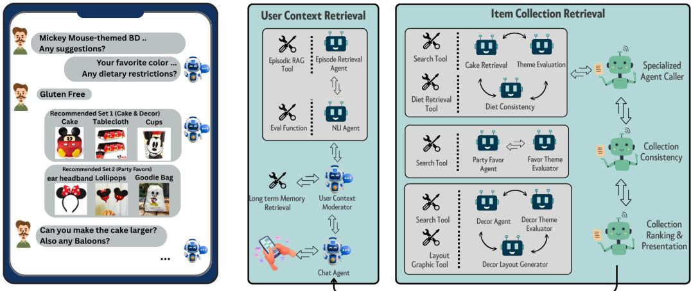
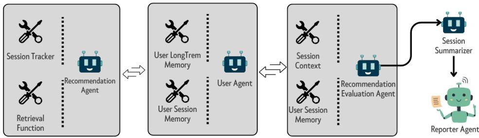
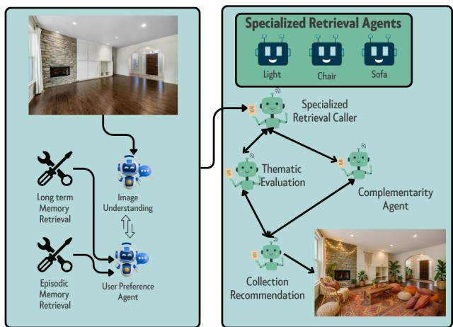
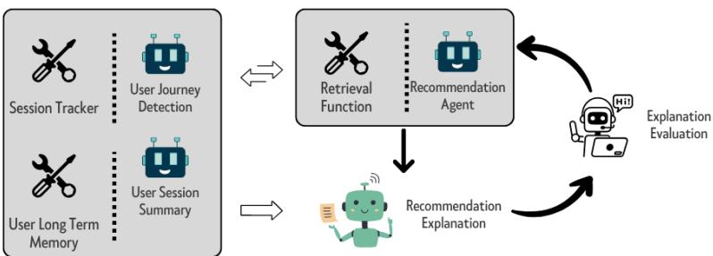

# The Future is Agentic: Definitions, Perspectives, and Open Challenges of Multi-Agent Recommender Systems

REZA YOUSEFI MARAGHEH, University of Illinois Urbana Champaign, USA YASHAR DELDJOO, Polytechnic University of Bari, Italy

Large language models (LLMs) are evolving from passive text generators into agentic systems that can plan maintain state, invoke tools, and coordinate with other agents. This perspective paper examines what this shift means for recommender systems (RS). We define agentic recommender systems as recommendation pipelines in which one or more stateful agents observe, plan, call tools, and verify, rather than score in a single shot, while operating over users, item catalogs, candidate sets, and recommendation objectives. Their value is strongest when this added machinery measurably improves recommendation-layer outcomes such as relevance, constraint satisfaction, bundle coherence, grounding, explanation faithfulness, fairness of exposure, or user efort, and is not justified merely because a pipeline contains an LLM or several modules. To make these notions precise for recommendation rather than for agents in general, we introduce a recommender specific formalism that models an individual recommender agent by its state (user, context, history, and candidate set), a reasoning core, recommendation-specific tools, a hierarchical memory, and explicit policy constraints, and captures a multi-agent recommender as a triple of agents, a shared environment exposing the item catalog and feedback signals, and a communication protocol. Within this framework, we develop four representative task families (interactive goal-oriented recommendation, user simulation and evaluation, contextual and multimodal recommendation, and grounded explanation) and an operational agenda that ties five recurring challenge families (communication protocols, scalability and cost, hallucination and error propagation, emergent misalignment and collusion, and brand and policy compliance) to measurable RS signals. Finally, we conduct a controlled empirical study comparing single-shot and multi-agent pipelines under shared user histories, candidate sets, prompts, and metrics. A pilot next-item ranking study on Amazon 2023 categories shows that multi-agent systems are not uniformly superior: on representative samples the single-shot baseline is Pareto-eficient, whereas decomposition and ensemble agents become useful mainly for high-diversity user histories. This supports a conditional design principle: agentic complexity should be routed to the cases where its marginal quality improvement justifies the additional latency, cost, and governance risk. To support reproduction, we release all pipeline implementations, prompts, and results here: https://github.com/RezaYM/agenticrecsys.git.

CCS Concepts: • Information systems → Recommender systems.

ACM Reference Format:

Reza Yousefi Maragheh and Yashar Deldjoo. 2026. The Future is Agentic: Definitions, Perspectives, and Open Challenges of Multi-Agent Recommender Systems. ACM Trans. Recomm. Syst. 1, 1 (July 2026), 49 pages. https://doi.org/10.1145/nnnnnnn.nnnnnnn

## 1 Introduction and Motivation

Large Language Model (LLM) agents go beyond traditional chatbots by ofering goal-directed, agentic behavior rather than merely responding to user queries through one-shot text generation.

Authors’ Contact Information: Reza Yousefi Maragheh, University of Illinois Urbana Champaign, Illinois, USA, ryousefimaragheh@acm.org; Yashar Deldjoo, Polytechnic University of Bari, Bari, Italy, deldjooy@acm.org.

Permission to make digital or hard copies of all or part of this work for personal or classroom use is granted without fee provided that copies are not made or distributed for profit or commercial advantage and that copies bear this notice and the full citation on the first page. Copyrights for components of this work owned by others than the author(s) must be honored. Abstracting with credit is permitted. To copy otherwise, or republish, to post on servers or to redistribute to lists, requires prior specific permission and/or a fee. Request permissions from permissions@acm.org. © 2026 Copyright held by the owner/author(s). Publication rights licensed to ACM. ACM 2770-6699/2026/7-ART https://doi.org/10.1145/nnnnnnn.nnnnnnn

In essence, they are designed to handle multi-step tasks, orchestrate information flow, and autonomously employ tools or functions when necessary [48, 61, 84]. This distinction means that while a conventional chatbot might provide short answers in a single round of dialogue, an agentic system can proactively structure a complex problem and solve it through a sequence of methodical steps. Put another way, an LLM agent is not only a reactive conversational partner but a dynamic problem-solver capable of decomposing tasks, maintaining state, invoking external resources, and adapting its strategy to reach a goal [64, 66, 76].

Much as goal-directed agentic behavior has reshaped other NLP-oriented tasks, it applies naturally to the tasks surrounding recommender systems (RS). In the most common case, recommendation is handled in a single shot: given a user history and a candidate set, a retrieval or ranking function estimates relevance and returns a ranked list of similar movies or items. Agentic recommendation broadens this picture along two axes. First, even a single-shot task can sometimes be handled better by decomposing it into subtasks, for example by summarizing a long or heterogeneous history, planning a ranking strategy, or aggregating several candidate orderings before committing to a final list. Second, and more fundamentally, the user need may not be “rank items for this profile” at all, but rather “help me achieve a goal” under multiple constraints, evolving context, and incomplete information. In this latter regime, recommendation becomes a multi-stage decision process rather than a single scoring operation: the system may ask clarifying questions, retrieve current catalog evidence, reason over constraints, call external tools, maintain memory over prior interactions, verify whether candidate items satisfy user and policy constraints, and finally produce a ranked list, bundle, explanation, or action plan. Section 4 develops these possibilities through four representative scenarios: interactive goal-oriented recommendation, user simulation for ofline evaluation, contextual and multimodal recommendation, and recommendation explanation.

We refer to this RS-centered paradigm as agentic recommendation. In an agentic recommender system, recommendation is no longer only a one-shot call to a ranker; it is a goal-driven process in which one or more stateful agents participate in an observe–plan–act–verify loop over user signals, item evidence, tools, memories, constraints, and recommendation objectives. This viewpoint gives us the flexibility, and the obligation, to evaluate recommendation along a more diverse set of metrics than top-?? accuracy alone: relevance and ranking quality, constraint satisfaction, diversity, bundle coherence, evidence grounding, explanation faithfulness, fairness of exposure, long-term user value, and user efort, together with trace-level signals such as tool-call success, memory correctness, latency, and cost. The agentic layer is useful when it improves these recommendation-relevant outcomes, not merely because a system contains an LLM or several modules.

Beyond the multi-step task handling already described, agentic recommendation rests on two further capabilities in particular: memory, so that the agent can carry state across the steps of a task, and tool use, so that it can act on evidence beyond its parameters.

The first, memory, is a core mechanism for agentic recommendation rather than an optional implementation detail. Over a multi-step task the system may need to remember the last item shown in a session, a rejected style, a durable preference inferred across interactions, or a recurring workflow that should be executed with minimal friction. We use the standard distinction between working, episodic, semantic, and procedural memory, and defer the taxonomy, storage mechanisms, and update/retrieval operators to Section 3. What matters at this point is that memory is not only an enabler but also an object of evaluation: stale memories can contaminate future rankings, incorrect summaries can distort user profiles, and privacy-sensitive traces may be retrieved when they should be forgotten. Memory should therefore be judged by whether it improves downstream recommendation utility, preserves relevant constraints, avoids stale or irrelevant facts, and respects privacy and deletion requirements.

The second, autonomous tool use, lets the agent act on evidence beyond its parameters. Instead of relying only on static model parameters, agentic recommenders can invoke retrieval APIs, product databases, image-analysis tools, policy checkers, constraint solvers, or evaluation modules to fetch data, analyze content, and act on domain-specific evidence [27, 57]. For example, a request for a restaurant can trigger queries for current ratings, availability, location, and dietary filters rather than depending on memorized information; a request to furnish an uploaded room image can trigger a vision tool to extract visual features and then a catalog query for items matching the user’s style and spatial constraints. Tool use and memory are complementary: memory carries durable preferences and prior recommendations across steps, while tools ground the next recommendation in current catalog, policy, or contextual evidence.

The framework developed in this paper is therefore LLM-centric but not LLM-exclusive. LLMs are currently a natural implementation substrate for agentic recommendation because they provide flexible natural-language understanding, reasoning, tool-use interfaces, and multi-agent communication. However, an agent in an agentic recommender may also be powered by a classical ranker, a retrieval model, a smaller language model, a rule-based controller, a constraint solver, a vision model, a simulator, or a human-review module. What makes the system recommender-specific is not the mere use of natural language or multiple agents, but the fact that these components operate over users, contexts, histories, item catalogs, candidate sets, ranking objectives, feedback signals, explanations, and exposure efects.

Taken together, (i) multi-step task handling, (ii) memory retention, and (iii) autonomous tool use empower LLM-based and non-LLM-based agents to operate with a level of autonomy that transcends the simpler question-and-answer paradigm of traditional chatbots [48, 61, 64]. At the same time, this should not be read as a claim that agentic systems are always preferable. For stable, well-scoped, high-throughput ranking tasks, conventional recommender pipelines may remain simpler, cheaper, more predictable, and easier to evaluate. The value of agentic recommendation is therefore strongest when planning, memory, tool use, interaction, and verification improve recommendation-layer outcomes enough to justify their additional latency, cost, privacy risk, and governance complexity.

## 1.1 A Motivating Example: Goal-Oriented Birthday-Party Recommendation

Figure 1 illustrates the type of recommendation task that motivates an agentic design. The user is not asking for a single ranked list of products from a static profile. Instead, the user begins with an open-ended goal: “a Mickey Mouse-themed birthday party.” The recommender then elicits missing constraints by asking about color preferences and dietary restrictions. When the user answers “Gluten free,” a dietary constraint is introduced that must be respected by the recommended collection. After the system proposes an initial set of party items, the user further revises the goal by asking whether the cake can be made larger and whether balloons can be added. This interaction shows that the task is not merely to rank products, but to support an evolving, goaloriented recommendation process: construct a coherent themed birthday-party bundle, satisfy dietary restrictions, adapt item attributes based on feedback, and add new item categories as the conversation unfolds.

To handle this complex natural-language intent, the system decomposes the broad goal into recommendation-relevant subtasks:

• A user-context component retrieves session-level and long-term traces, including recent dialogue state, prior preferences, accepted and rejected recommendations, and relevant constraints.

  
Fig. 1. Left: Conversation example for a goal-oriented collection recommendation, where the user specifies an open-ended goal instead of searching for specific items. Right: Architecture for personalized goal-oriented recommendation using a multi-agent pipeline with specialized agents and tools.

• A specialized-agent caller dynamically instantiates sub-agents equipped with retrieval or generation tools for distinct recommendation categories, such as cakes, decorations, favors, or layout suggestions.

• Category-specific agents retrieve candidate items from catalog or search tools while respecting explicit constraints such as theme, dietary requirements, budget, and availability.

• A collection-consistency agent checks whether the resulting items cohere as a bundle, for example whether the cake, tablecloth, decor, and party favors follow the same theme and do not violate constraints.

• A ranking and presentation agent orders the curated item set according to user preferences, contextual priorities, and recommendation objectives, and can generate a user-facing explanation or visual layout.

Throughout this interaction, memory carries the evolving recommendation state across turns: the theme, the gluten-free constraint, the accepted and rejected items, and the later requests to enlarge the cake and add balloons. The example also makes the evaluation concern concrete, since the system must decide which of these memories are still relevant, which are stale, and which should be excluded for privacy, safety, or correctness reasons.

## 1.2 Organization of the Paper and Contributions

This is a perspective and conceptual framework paper, not a new learning algorithm and not an exhaustive survey. Its aim is to give the recommender-systems community a shared vocabulary and an evaluation-oriented agenda for agentic RS: precise definitions of agents, memory, tools, actions, communication protocols, traces, objectives, and evaluation signals, so that future work can describe architectures, compare systems, and separate recommender-specific contributions from general agent engineering. Throughout, we take the position that the value of agentic recommendation is strongest when orchestration and interaction measurably improve recommendation-layer outcomes, rather than when a pipeline merely adds LLM calls or agent coordination. To keep this distinction sharp, we separate a recommendation layer (candidate generation, ranking, and slate construction), an interaction layer (dialogue, clarification, explanation, and preference elicitation), and an orchestration layer (tool choice, agent coordination, memory management, and verification), defined in Section 2.5.

The paper makes four contributions.

• Core vocabulary, formal framework, and scope boundary (Section 2). We give the minimal architectural primitives needed to specify an agentic recommender system: recommender agents, user and item state, candidate sets, memory stores, tool interfaces, action spaces, communication protocols, constraints, objectives, and observable traces. We distinguish generic LLM agents from recommender agents, and separate recommendation-layer contributions from interaction-layer capabilities and generic orchestration infrastructure.

• Running example and task families (Fig. 1; Sections 3–4). Using the Mickey Mouse birthday-planning example as a running case, we show how specialized agents, toolchains, memory hierarchies, and verification modules compose for goal-oriented recommendation. We then develop four representative task families, interactive recommendation, user simulation and evaluation, contextual and multimodal recommendation, and grounded recommendation explanation, and indicate where a conventional ranking pipeline remains simpler, cheaper, and more reliable.

• Operational challenge and evaluation agenda (Section 5). We organize the open prob- lems of agentic recommendation into five challenge families, communication complexity and protocol design, scalability and cost, hallucination and error propagation, emergent misalignment and collusion, and brand, policy, and legal compliance, and connect each to measurable recommender-system signals such as ranking quality, evidence coverage, trace validity, latency, token cost, exposure disparity, policy-violation rate, and judge reliability.

• Controlled empirical study (Section 6). We report a controlled experiment comparing single-shot LLM call and multi-agent recommendation pipelines under shared user histories, candidate sets, prompts, and metrics. A pilot next-item ranking study shows that multi-agent pipelines are conditionally useful: they do not dominate on representative samples, but decomposition and ensemble roles help on high-diversity histories.

## 2 Agentic Recommender Systems: Definition, Characteristics, Misconceptions

In this section, we clarify the concept of an LLM agent, in more depth. When illustrating through examples we use the context of recommender and retrieval systems. We also discuss common misconceptions about agentic pipelines and elaborate on what is not an LLM agent.

## 2.1 What Defines an LLM Agent

An LLM agent, in its fully functional capacity, is an AI system in which a large language model (LLM) serves as the core decision-making component (the “brain”), enhanced by additional mechanisms that enable it to carry out complex, multi-step tasks autonomously rather than relying on a single prompt-response. In other words, this LLM is part of a larger architecture that provides (i) planning abilities, (ii) memory, (iii) tool/API usage, for interactions with external systems, (iv) an autonomous decision loop that can break down a goal, observe intermediate steps, and adapt its strategy [61, 84]. In a broader context, multiple such language agents form a multi-agent system (MAS), in which agents can interact, communicate, coordinate, and even compete– leveraging their reasoning and communication capabilities to collectively solve complex tasks that exceed the capacity of any single agent.

This design (i.e., agent-based approach) goes beyond the traditional static use of LLMs for singleturn queries and is increasingly used in recommendation and retrieval tasks. For example, an

Table 1. Core Capabilities of Agentic Recommender Systems

<table><tr><td>Icon</td><td>Capability</td><td>Description</td></tr><tr><td></td><td>Planning &amp; Task Decomposition</td><td>Breaks complex recommendation goals into sub-tasks, such as candidate selection, constraint checking, bundle retrieval, re-ranking, and verification.</td></tr><tr><td></td><td>Tool Use &amp; Action Execution</td><td>Invokes external tools or APIs, such as retrieval systems, inventory databases, policy checkers, vision models, or constraint solvers.</td></tr><tr><td></td><td>Memory &amp; State Management</td><td>Maintains state across turns and, when appropriate, across sessions using working, episodic, semantic, or procedural memory.</td></tr><tr><td></td><td>Autonomy &amp; Goal-Driven Behavior</td><td>Operates in a closed loop by observing context, choosing actions, evaluating intermediate outcomes, and revising the plan until the recommendation objective is satisfied or no further useful action is available.</td></tr></table>

LLM-based agent can iteratively search user logs to gather information about past item interactions before making tailored recommendations [58, 91].

## 2.2 Key Characteristics of LLM Agents

As summarized in Table 1, agentic recommender systems typically exhibit four core characteristics, described in the following:

(1) Planning and Task Decomposition: The agent can execute (or even formulate) a plan. This is done by breaking a complex goal into subtasks. Rather than producing an immediate, one-shot answer, an agentic system can plan for and conduct a sequence of steps. This can involve reasoning to tackle long-horizon tasks [16, 54]. For example, in a recommender scenario, the planning module may first identify candidate items, then check user history, retrieve a consistent bundle of products, then re-rank items before generating a final recommendation [87].

(2) Tool Use and Action Execution: An LLM agent is not limited to purely text-based outputs; it can invoke external tools or APIs and perform actions in an environment [84]. For instance, a recommendation agent could consult a real-time inventory database to see if recommended items are in stock, or it might retrieve user reviews from a knowledge base before finalizing its recommendations.

(3) Memory and State Management: LLM agents maintain a notion of “state” across multiple steps. They often incorporate a memory module which can potentially store conversation con text, past recommendations, user feedback, local guidelines, procedures, domain knowledge etc [82]. This memory can be in semantic [59], vector database [38], knowledge graph [4, 62] formats. The memory module is used by the agent so that it can recall relevant information at each step of executing a task. For instance, in recommendation scenarios, user preferences collected over multiple sessions can be stored in a memory module and retrieved for the task of personalizing the recommendations. This persistent memory is crucial for multi-turn recommendation dialogues, where the agent refines suggestions based on evolving user interests. [42, 80]

(4) Autonomy and Goal-Driven Behavior: LLM agent can be designed to be operated in “autonomously in a closed-loop fashion” to fulfill a goal. Given a target objective (for example “find a suitable product for a user”), the agent can be designed to autonomously (i) observe the environment (via tools or APIs), (ii) evaluate progress, (iii) evaluate the outcome of each step and do a self refine step (iv) continue until it deems the goal is achieved or no further action can be taken. This is unlike a static Q&A system, where the system merely focuses on the one-time query. [52, 72]

These components enable the LLM agent to tackle complex tasks in recommendation and retrieval settings. For instance, systems like RecMind [76] use LLM as a reasoning engine paired with a planning component, a long-term memory of user profiles, and retrieval tools to fetch relevant product information. The agent then autonomously analyzes a user’s needs and iteratively refines its suggestions. This is far more capable than a single-turn Q&A approach, as it can plan queries (e.g., to check product ratings or availability), incorporate user feedback, and adapt the recommendation strategy. Frameworks like “ReAct” [84] illustrate how an LLM can be prompted to alternate between “reasoning steps” and “action steps”, calling retrieval or recommendation APIs as needed. Other systems, such as “Toolformer” [64] and “HuggingGPT” [66] similarly integrate LLMs with external action interfaces.

## 2.3 Formal Framework

In this subsection, we introduce formal definitions for key concepts central to our framework. These definitions establish a rigorous foundation for discussing the architectural and operational aspects of agents, including specialized LLM Agents, Multi-Agent Systems, and Tool-Using Agents. We also provide a generic formalism for representing the internal structure of an agent.

Definition 2.1 (LLM Agent). An LLM Agent is an intelligent system whose core decision-making and interaction capabilities are powered by one or more large language models. Formally, we denote such an agent as:

$$
A _ {\mathrm{LLM}} = \Big (\mathcal {M}, \mathcal {I}, \mathcal {O}, \mathcal {F}, \Omega \Big),
$$

where:

• M is the underlying language model or set of models used for text generation, understanding, and reasoning.

• I represents the input space that the agent can observe.

• O denotes the output space the agent can produce.

• F is a set of functions, tools, or APIs the agent can invoke to enhance its capabilities.

• Ω comprises any additional state or memory structures that enable the agent to maintain context across time or tasks.

For example, in recommendation settings, for an eCommerce shopping assistant, M can be a GPT-style transformer fine-tuned for e-commerce dialogue; it encodes linguistic knowledge and basic reasoning skills, allowing the agent to parse user requests and generate coherent replies. I is the space of user queries and contextual signals, while O is the space of possible outputs, including text responses, actions, or function calls. F represents external functions or APIs, such as retrieval APIs, price fetchers, or inventory status calls, which augment the innate knowledge of M with fresh, authoritative data, thereby mitigating hallucination. The agent’s memory, Ω, is partitioned into (a) short-term memory $\Omega ^ { \mathrm { { S T M } } }$ that keeps the last few dialogue turns, (b) long-term episodic memory $\dot { \Omega } ^ { \mathrm { E P I } }$ that stores past party-planning sessions, and (c) semantic memory $\Omega ^ { \mathrm { S E M } }$ containing persistent user traits (e.g., “prefers red decor”). During inference, salient fragments of Ω are retrieved and appended to the prompt, giving the agent continuity across sessions.

For a multi-turn dialogue agent, at each timestep ??, the agent receives an input $i _ { t } \in \mathcal { I }$ , consults its memory $\omega \subseteq \Omega$ to form an augmented context, and computes the output $o _ { t } \in O$ as follows:

$$
o _ {t} = f _ {\mathcal {M}, \mathcal {F}} (i _ {t}, \omega)\tag{1}
$$

where $f _ { M , \mathcal { F } }$ is the agent’s policy function that maps the current input $i _ { t }$ and retrieved memory ?? to an output $o _ { t } ,$ , leveraging both the language model M and the available external functions $\mathcal { F }$

Definition 2.1 intentionally describes a generic LLM agent. The same tuple becomes a recommender agent once each component is instantiated over recommendation-relevant objects rather than arbitrary text. Concretely, we take the agent to operate on a state

$$
s _ {t} = \big (u, C _ {t}, H _ {u}, \mathcal {S} _ {t} ^ {(K)}, \pi \big),
$$

where ?? identifies the user, $C _ { t } ~ \in ~ \mathcal { I }$ is the dialogue or contextual state, $H _ { u }$ is a chronological interaction history, ${ \cal S } _ { t } ^ { ( K ) } \subseteq { \cal S }$ is the candidate set available at step ??, and ?? encodes business, safety, privacy, and multi-stakeholder policy constraints. An LLM agent is a recommender agent when (i) its output space $o$ contains recommendation actions such as retrieve(·), rank(·), recommend(·), ask(·), and explain(·); (ii) its tool set $\mathcal { F }$ and environment expose RS-relevant evidence such as the item catalog, candidate sets, and feedback signals; and (iii) its objective is a recommendation utility (relevance, constraint satisfaction, long-term engagement) optimized under the constraints in ??.

Definition 2.2 (Multi-Agent System (MAS)). A Multi-Agent System is an ordered triple

$$
\text { MAS } = \Big (\mathcal {A}, \mathcal {E}, \Pi \Big),
$$

where

(a) ${ \mathcal { A } } = \{ A _ { 1 } , . . . , A _ { n } \}$ is a finite set of agents. Each $A _ { i }$ may be an LLM agent (Definition 2.1) or another kind of modular service (e.g., rule-based, vision, or database stub).

(b) E is the shared environment that supplies percepts and resources to the agents—such as external APIs, user interfaces, or a simulated world state. Formally, $\varepsilon$ can be viewed as a partial observable Markov space from which each agent receives observations and in which it executes actions.

(c) $\Pi = \left( \mathbf { C } , \Gamma \right)$ is the interaction protocol.

(i) $\mathbf { C } \in \{ 0 , 1 \} ^ { n \times n }$ is a (possibly time-varying) communication matrix. A value $\mathbf { C } _ { i j } = 1$ indicates that messages of type $\gamma \in \Gamma$ are permitted from $A _ { i }$ to $A _ { j }$ under current conditions. The condition can be

• preset (static design-time routing), or

• autonomous (dynamically toggled by agents. $\mathrm { e . g . } , A _ { i }$ opens a channel to $A _ { j }$ when cooperation is beneficial, closes it otherwise).

(ii) Γ is the finite set of admissible message schemata (performative types, serialization rules, timing constraints). Each $\gamma \in \Gamma$ defines both syntax and semantics so that a receiving agent can parse and act on the message.

An execution of MAS can be viewed as a sequence of environment states and inter-agent messages that respect Π. Depending on design, agents may coordinate (co-operative), compete (self-interested), or exhibit mixed motives while attempting to satisfy individual or shared objectives.

In the recommendation setting, the MAS triple specializes as follows. The environment $\varepsilon$ exposes recommendation state, including the item catalog, per-user histories, candidate sets, and observed feedback, rather than a generic world model. The agents in $\mathcal { A }$ occupy recommendation roles, such as profilers, retrievers, rankers, consistency checkers, evaluators, or user simulators, each a recommender agent in the sense above. The protocol Π carries recommendation payloads: messages in Γ transport candidate lists, ranked slates, retrieved evidence, constraint or compliance reports, and memory records, and the communication matrix C encodes which of these exchanges are permitted. The marketplace example that follows is the smallest such instance.

Consider a minimal marketplace scenario with two autonomous components, namely a recom- mendation agent and an evaluation agent, so that

$$
\mathcal {A} = \{A _ {\mathrm{rec}}, A _ {\mathrm{eval}} \}.
$$

In this case $\delta \ = \ ( \mathrm { U s e r P r o f i l e D B } _ { ; }$ , ProductCatalogue, BusinessRulesKB, providing user attributes, real-time inventory, and brand–policy facts, respectively. The interaction protocol can be

$$
\Pi = (\mathbf {C}, \Gamma), \qquad \mathbf {C} = \left( \begin{array}{c c} 0 & 1 \\ 1 & 0 \end{array} \right), \quad \Gamma = \Bigl \{\text { candidate\_list }, \text { compliance\_report } \Bigr \}.
$$

Thus $A _ { \mathrm { r e c } }$ may send a candidate\_list, a ranked JSON array $\{ ( s _ { 1 } , \mathrm { s c o r e } _ { 1 } ) , \dotsc , ( s _ { L } , \mathrm { s c o r e } _ { L } ) \}$ to $A _ { \mathrm { e v a l } }$ , which in turn replies with a compliance\_report indicating any items that violate policy. The of-diagonal ones in C permit bidirectional messaging, while the zeros on the diagonal denote that agents do not address themselves. At runtime, $\mathbf { C } _ { \mathrm { e v a l , r e c } }$ can be toggled of once no further corrections are required, illustrating how links may be preset yet autonomously reconfigured according to system state.

Definition 2.3 (Memory Update Function). Let $\Omega _ { t }$ denote the long-term memory state maintained by an agent at dialogue step ?? and let

$$
\mathcal {C} _ {t} \in \mathcal {X}
$$

be the raw context collected during that step (e.g., the most recent user utterance, the agent’s reply, and any intermediate reasoning trace, represented in token or embedding space). A Memory Update Function is a mapping

$$
\mathcal {U}: \left(\mathcal {C} _ {t}, \Omega_ {t}\right) \longrightarrow \Omega_ {t + 1},
$$

where

• U internally applies a retention operator

$$
\mathcal {R}: \mathcal {C} _ {t} \to \widetilde {\mathcal {C}} _ {t}
$$

that distils $C _ { t }$ into a noise-reduced summary $\widetilde { C } _ { t } \in \widetilde { X }$

• merges $\widetilde { C } _ { t }$ with the prior state $\Omega _ { t }$ via a domain-specific merge rule ⋄, and produces the next persistent state:

$$
\Omega_ {t + 1} = \Omega_ {t} \diamond \widetilde {\mathcal {C}} _ {t}.
$$

The goal is to preserve salient semantic information while discarding redundancy, ensuring that $\Omega _ { t + 1 }$ remains compact yet suficient for future retrieval.

Assume a shopping assistant agent and a user that uses the agent to order a cake. At turn ?? the user says “remember that two of my guests require a gluten-free diet”. The raw context $C _ { t }$ includes the user utterance, the agent’s internal chain-of-thought, and the pending action call to a CakeSearch tool. The retention operator extracts the key fact

$$
\widetilde {C} _ {t} = \text {" {guest\_allergy: gluten}} \text {,}
$$

and the merge rule appends it to the agent’s long-term episodic slot in $\Omega _ { t }$ :

$$
\Omega_ {t + 1} ^ {\mathrm{EPI}} = \Omega_ {t} ^ {\mathrm{EPI}} \cup \{\text { guest\_allergy: gluten } \}.
$$

On the next turn $( t + 1 )$ the planner retrieves this memory fragment and instructs a downstream cake-selection agent to filter for gluten-free options, illustrating how U enables continuity and correctness across dialogue turns without bloating the prompt window.

In a recommender, the update function U governs what persists about a user across turns and sessions: durable preferences, accepted and rejected items, satisfied or violated constraints, and session-level intent. The recsys-specific consideration is that U is not only an enabler of personal ization but also a source of error. A retention operator $\mathcal { R }$ that over-summarizes can drop a binding constraint such as the gluten restriction; one that under-summarizes lets stale or contradictory preferences accumulate and later contaminate ranking. The merge rule ⋄ must therefore respect recommendation-relevant properties, namely recency, provenance, and the right to delete privacysensitive traces, so that $\Omega _ { t + 1 }$ improves rather than degrades downstream recommendation utility. These properties are what the memory-correctness and staleness signals of Section 5 are intended to measure.

Definition 2.4 (Memory Retrieval Function). Let Ω be the agent’s persistent memory store after ?? dialogue steps. A Memory Retrieval Function is a mapping

$$
Q: (\Omega , \tau) \longrightarrow \widehat {C},
$$

where

$\Omega = \{ \widetilde { C } _ { 1 } , \ldots , \widetilde { C } _ { m } \}$ is a corpus of distilled memory traces, each $\widetilde { C } _ { i } \in \widetilde { X }$ (text snippets, embeddings, or hybrids) produced by the update operator U (Definition 2.3).

$\tau \in \mathcal T$ is a task representation—e.g. the current user query, an intermediate reasoning goal, or a structured tool call argument—expressed in text, vector, or multi-modal form.

${ \widehat { C } } \in { \widehat { X } } \subseteq { \widetilde { X } }$ is the subset of memory deemed relevant to ??, returned in a form suitable for prompt augmentation or downstream computation.

By recalling only ${ \widehat { C } } ,$ the agent conditions subsequent reasoning on task-specific context while keeping the efective prompt window compact and noise-free.

Continuing the shopping assistant example for cake ordering, suppose at turn ??+1 the planner agent formulates the sub-goal $\tau = ^ { \infty }$ “find gluten-free chocolate cake designs”. Invoking $\widehat { \cal C } =$ $\boldsymbol { Q } ( \Omega _ { t } , \tau )$ returns a minimal set of memory entries, e.g.

$$
\widehat {C} = \{\text { guest\_allergy: gluten, child\_pref: chocolate } \},
$$

filtered from dozens of prior dialogue snippets. These facts are appended to the prompt fed into the CakeSearch tool, ensuring that the retrieval agent queries only gluten-free, chocolate-flavoured options while ignoring unrelated historical details. Thus, $\boldsymbol { Q }$ provides precise, context-aware recall that prevents irrelevant or outdated memories from polluting the reasoning chain.

For recommendation, the query ?? supplied to $\boldsymbol { Q }$ is typically a ranking or explanation sub-goal, and the retrieved subset $\widehat { C }$ directly conditions the candidate set, the ranking, or the generated justification. Two recsys-specific failure modes follow. First, retrieving outdated or irrelevant traces can inject spurious constraints into ranking, for example resurfacing a preference the user has since abandoned. Second, retrieving privacy-sensitive history that should have been excluded can produce recommendations or explanations that are correct yet non-compliant. Efective retrieval in a recommender is therefore judged not only by topical relevance, as in the cake example, but by whether the recalled context preserves active constraints, excludes stale or deleted items, and respects the policy set ??.

By introducing these formalisms, we establish a common language for discussing agentic behavior and capabilities. In the subsequent sections, we will demonstrate how these formal concepts can be instantiated and extended to create advanced recommendation systems and other multi-step, context-aware applications.

## 2.4 What Is Not an LLM Agent

Not every LLM-based recommendation pipeline is agentic. A simple Q&A or single-prompt rec- ommendation system, such as an LLM prompted with “recommend five movies for this user”, is a generator or ranker, not an agent: it produces one response without persistent task state, autonomous tool choice, or iterative goal tracking. Similarly, a one-pass retrieval-augmented generation (RAG) system is a grounded generator, but not necessarily an agent, because the retrieve-thengenerate sequence is fixed rather than selected, repeated, or revised by the model. For example, a RAG recommender may retrieve product descriptions and generate an explanation, but it does not decide on its own to re-query the catalog, ask a clarifying question, or invoke a policy checker.

The litmus test for full autonomy is whether the system maintains task state and can execute an observe–plan–act–verify loop in which it chooses its own actions. In recommender systems, this means that the system can decide whether to retrieve additional item evidence, ask a clarifying question, update or query memory, revise a ranking, invoke a policy or constraint checker, or stop because the recommendation objective has been satisfied. By this test, simple Q&A, one-pass RAG, fixed prompt chains, and static LLM-as-ranker pipelines are not autonomous agents, because their steps, branching rules, stopping criteria, and tool calls are predetermined rather than selected at run time.

Autonomy, however, is only one of the four capabilities of Section 2.2, and it is useful to separate it from the others. Planning and task decomposition, specialization across roles, tool use, and memory can each be present in a system whose control graph is fixed in advance. Consider the birthday-planning example of Figure 1. One could implement it as a fixed pipeline that always retrieves cake candidates, then decoration candidates, then party favors, checks the assembled set for theme and dietary consistency, and finally ranks it, with this order wired in at design time. Such a pipeline still decomposes the goal into specialized subtasks, calls retrieval tools, and carries the gluten-free constraint forward as a piece of memory, yet it never decides on its own to reorder these steps, ask the user a new question, or stop early. We therefore treat “agentic” as graded rather than binary: this fixed-graph version is agentic in structure, through decomposition, specialization, tool use, and memory, while remaining non-autonomous in control. It becomes fully agentic only when embedded in a closed-loop controller that can maintain state, choose its next action, inspect intermediate outcomes, and adapt the process toward the goal, for example by deciding to elicit a missing dietary restriction before retrieval, or to re-run decoration retrieval after the user enlarges the cake.

This structure-versus-control distinction is not merely terminological. The two dimensions can be varied independently, and the controlled study of Section 6 exploits this by holding autonomy fixed and varying only structure, so that the contribution of decomposition, specialization, and aggregation to recommendation quality can be measured on its own.

In short, not all LLM-based pipelines are agentic, and among those that are, not all exercise the same capabilities. Simple Q&A, one-pass RAG, fixed prompt chains, and static LLM-as-ranker pipelines can be useful components of an agentic recommender but are not suficient on their own.

## 2.5 Scope: what is recommendation-specific in an agentic system?

An agentic recommender system contains both recommendation-specific and auxiliary components. We treat the following as core recommendation operations: candidate generation, evidence retrieval over user/item data, filtering and constraint satisfaction over item attributes, ranking and reranking, bundle or slate construction, explanation grounded in item and user evidence, feedback interpretation, memory update for personalization, and evaluation of recommendation utility. We treat natural-language parsing, generic task planning, tool routing, and user-interface generation as adjacent capabilities: they may be necessary to implement an agentic recommender, but they are not themselves suficient to constitute a recommendation contribution. This boundary matters because a multi-agent architecture can be impressive as an orchestration system while still failing at recommendation objectives such as relevance, diversity, calibrated personalization, fairness of exposure, or long-term user value.

Accordingly, throughout the paper we distinguish three layers: (i) the recommendation layer, responsible for user–item matching, ranking, and slate construction; (ii) the interaction layer, which manages dialogue, clarification, explanation, and preference elicitation; and (iii) the orchestration layer, which chooses tools, coordinates agents, manages memory, and verifies intermediate states. A system can be sophisticated at the interaction and orchestration layers yet add little at the recommendation layer, which is precisely the case the boundary above is meant to expose.

## 2.6 Positioning Relative to Non-Agentic and Agentic Recommenders

Table 2. Positioning of this paper relative to non-LLM, LLM-based, single-agent, and multi-agent recommender systems. • = explicit/central; △ = partial or emerging; ◦ = not central. Column meanings and the gap notes G1–G10 are given in the text.

<table><tr><td rowspan="2">Representative line / examples</td><td colspan="3">Agent role</td><td colspan="4">Agentic capability</td><td colspan="2">Evaluation</td><td rowspan="2">Gap</td></tr><tr><td>Assist.</td><td>Recomm.</td><td>Simul.</td><td>Memory</td><td>Tools / RAG</td><td>Planning</td><td>Coord.</td><td>Ranking</td><td>Trace</td></tr><tr><td colspan="11">Part I: Non-LLM recommender systems</td></tr><tr><td>Classical / sequential recommender systems [29, 32, 33, 63]</td><td>○</td><td>●</td><td>○</td><td>△</td><td>○</td><td>○</td><td>○</td><td>●</td><td>○</td><td>G1</td></tr><tr><td>Conversational / interactive recommender systems [11, 23]</td><td>△</td><td>●</td><td>○</td><td>△</td><td>△</td><td>△</td><td>○</td><td>●</td><td>△</td><td>G2</td></tr><tr><td colspan="11">Part II: LLM-based recommender systems, not explicitly agentic</td></tr><tr><td>LLM as encoder, ranker, reranker, or reasoning module [79, 93]</td><td>○</td><td>●</td><td>○</td><td>△</td><td>△</td><td>○</td><td>○</td><td>●</td><td>△</td><td>G3</td></tr><tr><td>Generative / prompt-based recommender systems [13, 39]</td><td>○</td><td>●</td><td>○</td><td>△</td><td>△</td><td>△</td><td>○</td><td>●</td><td>△</td><td>G4</td></tr><tr><td colspan="11">Part III: LLM-based recommender systems, single-agent</td></tr><tr><td>Agent-assisted recommender [31, 92]</td><td>●</td><td>△</td><td>○</td><td>●</td><td>●</td><td>●</td><td>○</td><td>●</td><td>△</td><td>G5</td></tr><tr><td>Agent-as-recommender [76]</td><td>△</td><td>●</td><td>○</td><td>●</td><td>●</td><td>●</td><td>○</td><td>●</td><td>△</td><td>G6</td></tr><tr><td>Agent-as-user-simulator [9, 75, 89]</td><td>○</td><td>○</td><td>●</td><td>●</td><td>△</td><td>●</td><td>○</td><td>△</td><td>●</td><td>G7</td></tr><tr><td colspan="11">Part IV: LLM-based recommender systems, multi-agent</td></tr><tr><td>Multi-agent agent-assisted recommender [17, 77]</td><td>●</td><td>△</td><td>○</td><td>●</td><td>●</td><td>●</td><td>●</td><td>●</td><td>●</td><td>G8</td></tr><tr><td>Multi-agent agent-as-recommender [77, 90]</td><td>△</td><td>●</td><td>○</td><td>●</td><td>●</td><td>●</td><td>●</td><td>●</td><td>△</td><td>G9</td></tr><tr><td>Multi-agent user / environment simulation [5, 75]</td><td>○</td><td>○</td><td>●</td><td>●</td><td>△</td><td>●</td><td>●</td><td>△</td><td>●</td><td>G10</td></tr><tr><td colspan="11">Part V: This paper</td></tr><tr><td>Unified RecSys-specific framework and evaluation agenda</td><td>●</td><td>●</td><td>●</td><td>●</td><td>●</td><td>●</td><td>●</td><td>●</td><td>●</td><td>-</td></tr></table>

Sections 2.1 through 2.5 defined an agentic recommender system, separated it from LLM pipelines that are not agentic (Section 2.4), and bounded it against orchestration that is not recommendation specific (Section 2.5). We close the section by placing this definition on the map of existing work. Table 2 organizes representative lines of research along three axes. The agent role axis records whether the agent assists an existing recommender (Assist.), acts as the recommender (Recomm.), or simulates users and environments (Simul.). The agentic capability axis records explicit memory (working/episodic/semantic/procedural), tool or retrieval use (Tools/RAG), planning or plan–act– verify behavior, and inter-agent coordination (Coord.). The evaluation axis records whether a line is assessed only on final ranking quality (HR@K, NDCG@K, MRR, diversity, exposure) or also on the intermediate agent trace (evidence grounding, memory use, tool correctness, judge reliability, communication cost, latency, and failure attribution). These axes separate three issues that are often conflated: that a system may use an LLM without being agentic, that an agentic recommender may difer in role and in which capabilities it exercises, and that evaluation may stop at the ranked list or extend to the trace. The table therefore makes precise why this paper is neither a survey of LLM-based recommendation nor a generic multi-agent-system discussion, but a RecSys-specific framework for specifying and evaluating agentic recommendation architectures.

The capability columns correspond directly to the primitives of the formal framework: Memory is the store Ω with its operators U and Q (Definitions 2.3 and 2.4), Tools/RAG is the function set F of Definition 2.1, Planning is the decomposition behavior of Section 2.2, and Coordination is the protocol Π of the MAS triple (Definition 2.2). The rows then trace a progression, and the Gap column names what each stage still leaves open. Classical and sequential recommenders (G1) provide strong ranking foundations but expose no agent loop, and conversational recommenders (G2) are interactive yet usually scripted rather than tool-using and memory-bearing. LLM-based but non-agentic recommenders improve representation, ranking, or generation while remaining inside fixed pipelines, so autonomy and tool choice stay implicit (G3, G4). Single-agent systems introduce memory, tools, and planning, but agent-assisted designs lack inter-agent specialization (G5), agentas-recommender designs often leave the memory, tool, and planning contributions under-ablated (G6), and agent-as-simulator designs face fidelity, calibration, and label-leakage dificulties (G7). Multi-agent systems add coordination through Π, yet the marginal utility and cost of extra agents is rarely attributed (G8), decomposition and verification raise communication complexity (G9), and richer simulation can amplify artificial behavior or simulator drift (G10). The final row marks the gap this paper targets: a unified, recommender-specific vocabulary and evaluation agenda in which agentic complexity is justified through measurable gains in recommendation quality, grounding, trace reliability, fairness, cost, and robustness rather than assumed, with the under-ablation gaps G6 and G8 addressed empirically in Section 6.

## 3 Memory Storage and Retrieval Mechanisms

Due to importance of memory mechanisms in agentic systems, especially those anchored toward recommender system tasks we will discuss these mechanisms in a dedicated section. Large Language Model (LLM) agents require robust memory mechanisms to behave coherently over time. By default, an LLM is stateless, which means that each query is processed independently, with no built-in recall of previous interactions. This stateless design is a serious issue in hindering LLMs to be adapted to recommendation tasks requiring personalization and “remembering” things about users.

To overcome this, agent frameworks introduce explicit memory systems that let the agent “remember” and reuse information from past events or dialogues. Broadly, these memories fall into short-term (working memory) and long-term categories, with further distinctions (episodic, semantic, procedural, etc.) inspired by human cognition. This section surveys the types of memory in LLM agents and the storage/retrieval mechanisms.

## 3.1 Types of Memory in LLM Agents

3.1.1 Short-Term (Working) Memory. Short-term (often called “working” [24]) memory refers to the transient context the agent holds in mind. In an LLM agent, this corresponds to the recent interaction history or “context window” provided to the model on each turn. It is analogous to human working memory in that it is readily accessible but of limited capacity (bounded by token length) [65]. For instance, a chatbot’s short-term memory might include the last few user prompts and agent responses, allowing for conversational coherence. Short-term memory is therefore crucial for immediate reasoning, but it does not persist beyond the current session (i.e., it lacks a true long-term store).

3.1.2 Long-Term Memory. Long-term memory provides persistent recall across interactions and over time. In agent systems, it can be subdivided into:

Episodic Memory Episodic memory pertains to specific events or experiences (episodes) the agent has encountered. In LLM agents, this often means a stored log of past dialogues, observations, or actions, coupled with context such as timestamps or metadata. It is context-rich and instancespecific. In this case, the agent remembers not just what happened, but when and under what circumstances [22]. For instance, the agent might recall: Last week the user asked about Italian restaurants and I recommended XYZ. Episodic memory supports one-shot learning of events and explicit recall of past episodes, and some researchers argue it is a key missing piece for truly long-lived LLM-based agents. [59]

Semantic Memory Semantic memory stores general facts, concepts, or knowledge about the world, akin to the “know-what.” In LLM agents, semantic memory might be an external knowledge base or database of facts (e.g., “in my retrieval system TVs are categorized under electronics category”) [88].

While much semantic knowledge is encoded in the LLM’s pretrained weights, agents can also maintain explicit semantic stores (relational databases, knowledge graphs, etc.) for dynamic updates. Semantic memory is long-term and explicit, though it abstracts away the specific instance in which a fact was learned [35]. For example, from several chats the agent might distill a high-level fact: “This user prefers Italian cuisine.”

Procedural Memory Procedural memory, or the “know-how”, refers to skills or procedures the agent has learned to execute without needing to deliberate each time. For an LLM agent, this might appear as learned prompts, scripts, or code snippets that automate common tasks (e.g., connecting to a database). [71, 78]

Procedural memory is typically implicit in that it is not stated as factual knowledge but manifested as rules or sequences of actions. It allows the agent to execute tasks more eficiently, refining these skills through repeated practice. Early cognitive architectures like SOAR [34] used production rules to represent procedural knowledge, and modern LLM agents similarly encode procedural behaviors through fine-tuned prompts, scripted tool invocations, or learned action sequences that mimic rule-based execution pipelines[12, 53]. In the next subsection, we explore how these diferent types of memory are realized in the actual agentic recsys implementations.

## 3.2 Memory Storage and Retrieval Mechanisms

Large-context LLMs can “remember” only a few thousand tokens per forward pass, yet real recommender deployments routinely span months of user interaction and terabytes of product data. Consequently, an agentic recommender must decide “what” to store externally, “how” to distil it, and “which” fragments to re-inject into the prompt at inference time. We formalise these operations through the Memory Update and Memory Retrieval functions (Definitions 2.3–2.4), then survey concrete storage modalities. For having a more complete survey of the memory mechanisms, first we state the following definitions.

Definition 3.1 (Memory Item). A memory item is a triple $m = ( k , v , \varsigma )$ where

(i) $\boldsymbol { k } \in \mathbb { R } ^ { d _ { k } }$ is the key, typically an ??-gram embedding or hashed identifier that serves as the retrieval handle;

(ii) $\boldsymbol { v } \in \mathbb { R } ^ { d _ { v } }$ is the value payload that preserves the semantic content (natural-language text or a dense vector);

(iii) $\varsigma = ( t , \ell , u )$ is a metadata tuple storing the time-stamp ??, a logical label ℓ ∈ {EPI, SEM, PROC} distinguishing episodic, semantic, or procedural memory, and an update counter ?? that tracks how often the item has been modified.

For instance, in our cake retrieval example, the statement of the user for gluten allergy, “guest\_allergy $\boldsymbol { \mathbf { \rho } } = \mathsf { g l u t e n } ^ { \boldsymbol { \mathsf { w } } }$ is stored as

$$
k = \text {embedding} (“ \text {gluten allergy} ”), \quad v = “ \text {gluten} ”, \quad \varsigma = (t = 1 7: 4 5, \ell = \text {EPI}, u = 1).
$$

Here ?? is an embedding representation of the key “gluten allergy”; $\ell = \mathrm { E P I }$ signals that the fact is tied to a specific party event rather than a timeless preference.

The key–value–metadata form in Definition 3.1 is an analytic wrapper, not a restriction on implementation. The value field may contain raw text, dense embeddings, symbolic triples, rela tional rows, procedural scripts, multimodal features, pointers to external stores, or other memory representations. The purpose of the wrapper is to expose the three pieces of information that agentic recommendation needs from any stored item: a retrieval handle, a semantic payload, and metadata for recency, provenance, privacy, and update control. In a recommender these metadata fields are not incidental bookkeeping. The timestamp ?? determines whether a preference is still current or stale, the label ℓ separates a one-of event such as a party constraint from a durable taste, and the update counter ?? records how often a fact has been reinforced, which is exactly the signal needed to decide whether a preference is worth conditioning a ranking on.

Definition 3.2 (Relevance Scoring). Given a task query $\tau \in \mathcal { T }$ and a memory item $m = ( k , v , \varsigma )$ , a relevance function

$$
S: \mathcal {T} \times (\mathcal {X} \times \widetilde {\mathcal {X}} \times \mathbb {R} ^ {3}) \longrightarrow \mathbb {R} _ {\geq 0},
$$

returns a non-negative score. Retrieval (Definition 2.4) selects the ?? highest-scoring items:

$$
\widehat {C} = \mathrm{Top-K} _ {m \in \Omega} S (\tau , m).
$$

Again, back to our cake retrieval example, let $\tau = { ^ { \ast } } \mathsf { f }$ ind gluten-free chocolate cake”. Then, we can choose the relevance function in a form like $S ( \tau , m ) = \cos ( \mathrm { e m b e d d i n g } ( \tau ) , k )$ . The cosine term elevates items semantically close to the query. Consequently, the system surfaces the allergy item and the child’s flavor preference, but not unrelated recommendation traces.

In a recommender, topical similarity alone is an impoverished relevance function. What should be recalled for a ranking or explanation sub-goal depends not only on whether a memory item is semantically close to $\tau ,$ but on whether it is still valid, whether it encodes a binding constraint, and whether it is permitted to be used. A useful ?? for agentic recommendation therefore combines the similarity term above with the metadata of Definition 3.1: a recency weight derived from ?? so that abandoned preferences decay, a label term from ℓ so that hard constraints (a dietary restriction, a returned item) are retrieved with priority over soft tastes, and a privacy gate that excludes items the user has asked to delete. This is what distinguishes memory relevance in a recommender from generic semantic search: the highest cosine score is not always the item that should condition the next ranking.

Now, we will review diferent modalities that memory store/retrieve can take.

3.2.1 Raw Text Logs. The simplest store is an append-only transcript $\Omega ^ { \mathrm { r a w } } = [ m _ { 1 } , . . . , m _ { T } ]$ , where each $m _ { t }$ is the verbatim turn text. Retrieval is concatenation of the last ?? tokens: $\widehat { C } = \mathrm { T a i l } _ { L } \left( \Omega ^ { \mathrm { r a w } } \right)$ Although the update function (Definition 2.3) U is trivial (append), this scales poorly and prompt length soon exceeds the model window. [3, 43]

3.2.2 Summarisation (Compression). In this approach, older logs are periodically compressed into shorter summaries. More specifically, update function U invokes an LLM summariser, $\mathcal { R } _ { \mathrm { s u m } }$ $C _ { t } \to \widetilde { C } _ { t }$ , which compresses $C _ { t }$ to a more concise context $\widetilde { C } _ { t }$ . The agent then stores and retrieves these summaries to preserve essential information. Though it saves tokens, the fidelity of recall depends on the quality of summarization. Recent memory compression methods enable adaptive summarization and storage of long conversational histories for LLM agents [40].

3.2.3 Embedding and Vector Databases. For long-term memory, the prevailing method in retrievalaugmented generation (RAG) is embedding-based storage. Each memory item is encoded as a high-dimensional vector (using an embedding model ??) $k = e ( \boldsymbol { v } )$ ?? = (raw text) and stored in a vector database [21, 86]. For Retrieval, using the retrieval function $\boldsymbol { Q }$ (see Definition 2.4) the current query is embedded, and nearest-neighbor search surfaces semantically relevant items, enabling large-scale, flexible recall—though typically at the cost of strict chronological ordering. Please note that classic retrieval-augmented models RETRO [6] and REALM [25] demonstrate the scalability and efectiveness of such large-scale external memory designs.

The choice among these modalities is a recommendation-deployment decision, not only an engineering one. Vector stores scale to catalog- and user-history sizes and tolerate fuzzy recall, which suits personalization, but they blur chronology, which matters when the order of a $\mathrm { { u s e r } } ^ { \prime } s$ interactions carries intent. Raw logs and summaries preserve session dynamics but do not scale to months of history. Structured stores enforce the hard constraints and provenance that policy compliant recommendation requires. In practice an agentic recommender mixes them by role: short-term session state in a bufer, durable tastes in a vector store, and constraints and provider or policy facts in a structured store where they can be checked exactly.

3.2.4 Knowledge Graphs / Structured Stores. Beyond raw text or vector embeddings, an agent may persist “knowledge–graph memory” in the form of symbolic triples $( s , r , o )$ (subject–relation–object) or relational table rows that can be queried explicitly via SQL or SPARQL. Symbolic storage is particularly well-suited for semantic memory: it supports precise retrieval, logical entailment, and integrity constraints, albeit at the cost of additional curation.

Definition 3.3 (Symbolic Memory Item). A symbolic memory item augments Definition 3.1 by taking $m = ( k , v , \varsigma )$ with $v = ( s , r , o ) \in \mathcal { E } ^ { 3 }$ , where E is the entity set of the knowledge graph. In other words, the value can be of the form subject–relation–object for a given query. Equivalently, one can assume an embedding on the triplet for key retrieval used for approximate nearest-neighbour fallback.

For example, suppose the assistant stores $\boldsymbol { v } = \left( \mathrm { u } \boldsymbol { s } \mathrm { e r } \right.$ , likes, chocolate) with label $\ell = { \mathrm { S E M } } .$ Given user query $\tau = { } ^ { * } \mathbf { V }$ What flavour cake should I order?” the system formulates (user, likes, ??) and retrieves the triple, yielding the concrete value chocolate. If no exact match exists, the agent can still fall back to the embedding key ?? = embedding(user, likes, ·) and perform a vector search for semantically close preferences.

Symbolic knowledge graph/structured stores ofer high-precision constraints and explainable provenance [45], but demand manual or automated pipelines to populate and maintain the triples; they also introduce schema-evolution overhead when the domain ontology changes. [85]

3.2.5 Parametric Memory Updates. A costly alternative is to integrate $\widetilde { C } _ { t }$ directly into the backbone parameters of the LLM model [19]. Formally, the update function U returns a new language model $\boldsymbol { \mathcal { M } } _ { t + 1 } = \boldsymbol { \mathcal { M } } _ { t } \oplus \boldsymbol { \Delta } _ { t }$ , where $\textstyle { \mathcal { M } } _ { t }$ represents the model at time ?? and $\Delta _ { t }$ represents the update on the model to incorporate the new events. This makes Ω implicit in M. Latency and safety constraints limit real-time use [10, 20].

Regulated Context Windows. In production, agents often blend procedural, episodic, and semantic memories with a regulator:

$$
\widehat {\mathcal {C}} = \widehat {\mathcal {C}} _ {\mathrm{PROC}} \cup \widehat {\mathcal {C}} _ {\mathrm{SEM}} \cup \widehat {\mathcal {C}} _ {\mathrm{EPI}},
$$

Table 3. Use cases for agentic recommender systems. The table summarizes the four representative scenarios developed in Section 4, the practical trigger for using an agentic design, the recommendation-layer gain, and when a simpler non-agentic baseline may be suficient.

<table><tr><td>Use case</td><td>Agentic trigger</td><td>Recommendation-layer gain</td><td>Simpler baseline may suffice when</td></tr><tr><td>Interactive goal-oriented recommendation</td><td>Clarification, planning, memory, and bundle verification</td><td>Improves constraint satisfaction, bundle coherence, ranking quality, personalization, and user effort in multi-turn recommendation.</td><td>The request is a single well-scoped query with a stable user profile and fixed candidate set.</td></tr><tr><td>User simulation and evaluation</td><td>Synthetic users, logging, evaluators, and session summarization</td><td>Supports offline stress testing, counterfactual diagnosis, robustness checks, and evaluation before live deployment.</td><td>Reliable logged feedback is already available and no interactive trajectory or simulated behavior needs to be modeled.</td></tr><tr><td>Contextual and multimodal recommendation</td><td>Vision tools, external retrieval, memory, and consistency checks</td><td>Connects images, context, metadata, user preferences, and spatial or aesthetic constraints to ranking and bundle construction.</td><td>All relevant features are already structured and can be consumed directly by a conventional ranker.</td></tr><tr><td>Grounded recommendation explanation</td><td>Evidence retrieval, critic/evaluator agents, and policy checks</td><td>Produces explanations that are more faithful, evidence-backed, policy-consistent, and less prone to unsupported claims.</td><td>A short template explanation is sufficient and dynamic evidence or policy checking is unnecessary.</td></tr></table>

subject to a token budget $\left| \widehat { C } \right| \leq B \left[ 8 1 \right]$ . We can formalize this type of regulator as a knapsack problem (see [51]) variant

$$
\begin{array}{c} \max _ {\widehat {C} \subseteq \Omega} \sum_ {m \in \widehat {C}} S (\tau , m) \\ \text {s.t.} \sum_ {m} | m | \leq B. \end{array}
$$

where $S ( \tau , m )$ is the relevance score as defined in definition 3.2, |??| is the length of the retrieved memory, and ?? is the token budget.

The foregoing definitions and examples demonstrate that memory in agentic recommender systems is no longer a monolithic cache but a spectrum of interlocking mechanisms—from raw transcript bufers and lossy summaries to vector stores to fully structured knowledge graphs, to budgeted tokens. By casting memory operations as explicit update U and retrieval Q functions, parameterised by relevance scores and symbolic query semantics, we obtain a principled foundation for analyzing capacity, latency, and factual fidelity. Yet the formalism also exposes substantial gaps: adaptive compression that preserves downstream utility is still heuristic; relevance scoring lacks theoretical guarantees; and symbolic stores incur unsolved curation and schema-evolution costs. Bridging these gaps will require new learning objectives that couple retention with task performance, tighter integration of uncertainty calibration into retrieval, and hybrid architectures that combine the precision of knowledge graphs with the scalability of dense embeddings. For recommendation specifically, these gaps surface as measurable failure modes: compression that drops a binding constraint, relevance scoring that resurfaces a stale preference, and retrieval that returns a deleted trace. The memory-correctness, staleness, and deletion-compliance signals of Section 5 are intended to quantify exactly these failures. In short, memory for LLM-driven, multi-agent RecSys is both a critical enabler and an open frontier, inviting further research at the intersection of information retrieval, knowledge representation, and large-scale language modeling.

## 4 Agentic Recommendation Task Families

The remainder of this section grounds the general agentic framework in four representative use cases, each chosen to illuminate a distinct facet of next-generation recommender systems. As summarized in Table 3, these examples are not intended to be exhaustive; rather, they show when planning, memory, tool use, verification, or multi-agent coordination can improve recommendationlayer outcomes, and when a simpler non-agentic baseline may be suficient.

## 4.1 Interactive Recommendation

Formal Task Definition. We define Interactive Recommendation as the problem setting in which an agent (or a set of collaborating agents) engages in a multi-turn dialogue with a user to identify, refine, and present suitable recommendations. Unlike static recommender systems that rely on one-shot user inputs, interactive recommendation leverages iterative exchanges to incorporate user feedback, contextual constraints, and additional information drawn from memory or external resources. The overarching objective is to dynamically adapt suggestions as the conversation evolves, thereby providing a more personalized and contextually appropriate set of recommendations.

Let D be the space of dialogue turns and S the universe of documents (in an eCommerce setting these can be purchasable stock-keeping units, SKUs). A user session at step ?? is characterised by the partial transcript

$$
C _ {1: t} = (d _ {1}, a _ {1}, \dots , d _ {t - 1}, a _ {t - 1}, d _ {t}),
$$

where $d _ { i } \in \mathcal { D }$ is a user utterance and $a _ { i } \in \mathcal { D }$ the agent reply. Define the interactive recommendation task as a mapping

$$
\Phi : \left(\mathcal {C} _ {1: t}, \mathcal {E}\right) \longrightarrow \left\langle s _ {(1)}, \dots , s _ {(L)} \right\rangle ,
$$

that outputs a ranked list of ?? items with the maximal expected utility $\begin{array} { r } { \sum _ { j = 1 } ^ { L } \operatorname { R e l } \left( s _ { \left( j \right) } \ \mid \ C _ { 1 : t } \right) } \end{array}$ conditioned on user constraints (theme, dietary rules, budget) implicitly encoded in $C _ { 1 : t }$

To illustrate this task, we consider the scenario of planning a Mickey Mouse-themed birthday party as shown in Figure 1. A parent consults the system to select decorations, arrange a suitable cake, and accommodate guests’ dietary restrictions. The agent aims to guide the parent through each step, from confirming the child’s preferences (such as color schemes or favorite cake flavors) to identifying any special requirements. By interacting iteratively with the user and retrieving relevant information from its memory and external tools, the agent can refine its suggestions over time.

High-level goal. The agent must adaptively refine Φ through multi-turn dialogue, spawning specialized sub-agents and tool calls to satisfy latent sub-goals (e.g. “select gluten-free chocolate cake”, “choose decor consistent with Mickey-Mouse palette”) while preserving conversational coherence and minimizing user efort.

System architecture and agent setup. For this specific example, we can instantiate a multi-agent system

$$
\mathrm{MAS} _ {\mathrm{party}} = \big (\mathcal {A}, \mathcal {E}, \Pi \big),
$$

where Agent set $\mathcal { A } \ = \ \{ A _ { \mathrm { c h a t } } , A _ { \mathrm { e p i } } , A _ { \mathrm { n l i } } , A _ { \mathrm { S A C } } , A _ { \mathrm { c a k e } } , A _ { \mathrm { d e c o r } } , A _ { \mathrm { f a v o r } } , A _ { \mathrm { c o l \_ c h e c k } } , A _ { \mathrm { r a n k } } \}$ . Each $A _ { i }$ is an LLM agent in the sense of Definition 2.1. Where

$A _ { \mathrm { c h a t } }$ (chat agent) primary interface to the user.

$A _ { \mathrm { e p i } }$ – episodic retrieval using Q (Definition 2.4).

• $A _ { \mathrm { n l i } }$ – natural-language inference to vet relevance of retrieved episodes.

$A _ { \mathrm { S A C } }$ – specialised-agent caller that spawns three micro-MAS blocs: $\{ A _ { \mathrm { c a k e } } , A _ { \mathrm { d e c o r } } , A _ { \mathrm { f a v o r } } \}$ for category-specific retrieval.

$A _ { \mathrm { c o l \_ c h e c k } }$ – collection-level consistency.

$A _ { \mathrm { r a n k } } -$ personalised ranking & presentation.

Also one can define the Environment for this MAS as:

E = (ProductCatalogue, UserProfileDB, VectorDB, LayoutTool),

and communication protocol as $\boldsymbol { \Pi } = ( \mathbf { C } , \boldsymbol { \Gamma } )$ where $\mathbf { C } _ { i j } = 1$ if either $A _ { j }$ is a child spawned by $A _ { i }$ or $A _ { i } { = } A _ { \mathrm { c h a t } } . \Gamma$ contains message types {query, episode\_list, tool\_call, item\_set, ranked\_list}.

The following also illustrates communication sketch:

$$
\begin{array}{c} A _ {\text {chat}} \xrightarrow {\text {query}} A _ {\text {epi}} \xrightarrow {\text {episode\_list}} A _ {\text {nli}} \xrightarrow {\text {validated\_episodes}} A _ {\text {SAC}} \\ \xrightarrow {\text {spawn}} \{A _ {\text {cake}}, A _ {\text {decor}}, A _ {\text {favor}} \} \xrightarrow {\text {item\_set}} A _ {\text {col\_check}} \xrightarrow {\text {validated\_set}} A _ {\text {rank}} \xrightarrow {\text {ranked\_list}} A _ {\text {chat}}. \end{array}
$$

Note that spawn can be autonomous depending on ??

Memory and tool requirements. Now, we illustrate how each type of memory is defined here and how each agent can utilize it. Short-term (Working) memory can be defined for $A _ { \mathrm { c h a t } }$ that takes logs of last ?? turns of the $C _ { 1 : t } .$ . Episode store can be accessed and manipulated by $A _ { \mathrm { e p i } }$ through U and Q. Semantic memory $\Omega ^ { \mathrm { S E M } }$ can track stable user traits (preferred colours, dietary restrictions). $\Omega ^ { \mathrm { P R O C } }$ can include repeatable prompt templates for each retrieval block as well as information about each table in DB so that agents can autonomously query them or other elements of environment E. External Tools $\mathcal { F }$ in this MAS are SearchCakeAPI, SearchDecorAPI, SearchFavorAPI, VectorDB.query (semantic retrieval), LayoutTool.generate (graphic board of decor set).

Benefits and discussion. The architecture realises interactive recommendation by decomposing a fuzzy, high-level goal (“celebrate my child’s Mickey-Mouse birthday”) into tractable sub-tasks handled by specialised agents. Key advantages like (i) Modularity, where each retrieval block is itself a micro-MAS that can be re-used for other party themes or plugged into A/B tests without retraining the entire pipeline. (ii) Memory-aware personalisation, where episodic retrieval $( A _ { \mathrm { e p i } } )$ injects user- and session-specific constraints (gluten-free, colour palette) while semantic memory supplies timeless preferences, yielding recommendations that are both relevant and surprising. (iii) Error containment, where the NLI validator and collection-consistency agent act as fact gates, reducing hallucination propagation by rejecting items that violate theme constraints or dietary rules, (iv) autonomy, where the specialised-agent caller spawns retrieval workers on demand and per query, and (v) Rich user experience where the final ranked set, together with a layout generated by LayoutTool, ofers a cohesive shopping board, demonstrating how agentic orchestration can move beyond single-item suggestions to holistic, story-driven recommendations.

Collectively, the design illustrates how the formal primitives—MAS, U, Q, and typed memory stores—translate into a concrete, deployable pipeline for next-generation conversational shopping assistants, which far exceeds the capabilities of classic recommender systems.

## 4.2 User Simulation and Recommendation Evaluation

Formal definition of the task. User simulation and recommendation evaluation together form a framework in which synthetic user behavior is generated to probe, test, and refine recommender systems before full-scale deployment. Let $R _ { \phi } : \bar { X } \to S ^ { L }$ denote a recommender parameterised by $\phi$ that maps the current session state $x \in \chi$ to an ordered list of ?? items from the catalogue S. A user simulator is a stochastic policy

$$
\mathcal {M} _ {\theta , \omega}: \mathcal {X} \times \mathcal {S} ^ {L} \longrightarrow \mathcal {A} _ {\text { user }}, \quad \mathcal {A} _ {\text { user }} \in \{\text { Select }, \text { Not   Select } \},
$$

parameterised by intrinsic preference vector $\theta$ and noise vector $\omega .$ . Note that user simulator’s action space ${ \mathcal { A } } _ { \mathrm { u s e r } }$ can include another set of options depending on the recommendation setting. For instance it can be {Click, Pass, Purchase} in eCommerce user simulation. Given repeated interaction over $T$ time steps, the joint process $\{ x _ { t } , s _ { t } ^ { ( L ) } , a _ { t } ^ { \mathrm { u s e r } } \} _ { t = 1 } ^ { T }$ induces an empirical evaluation functional

$$
\Psi (R _ {\phi}, \mathcal {M} _ {\theta , \omega}) = \mathbb {E} \left[ \sum_ {t = 1} ^ {T} g \left(x _ {t}, s _ {t} ^ {(L)}, a _ {t} ^ {\text {user}}\right) \right],
$$

where $g ( \cdot )$ is a reward such as Select or diversity penalty. The “simulation-based evaluation problem” seeks to estimate Ψ under controlled distributions of ?? and $\omega .$

High-level goal. In practical scenarios, gathering data from real users can be expensive or infeasible, especially when conducting A/B tests for newly introduced features. A simulated user that approxi mates realistic browsing, clicking, and purchasing behaviors ofers a controlled environment for stress-testing various recommendation strategies. For example, an e-commerce platform aiming to recommend Bohemian-style furniture may wish to simulate how a typical user navigates through the site, examines multiple items, compares prices, and ultimately decides whether to purchase. This allows the platform to estimate click-through rates and conversions without requiring a large real-user pilot study. The primary aim is to replicate the interactions of a diverse user population in order to evaluate and compare recommendation strategies. The system must produce synthetic but plausible session data, track user decisions at each step, and generate summary statistics or qualitative insights about overall performance. By testing both short sessions (quick browsing) and long sessions (prolonged decision-making), one can obtain a more comprehensive understanding of the strengths and weaknesses of the underlying recommender algorithms.

System architecture and agent setup. We instantiate a multi-agent system (also see Figure 2)

$$
\operatorname{MAS} _ {\text { sim }} = (\mathcal {A}, \mathcal {E}, \Pi), \quad \mathcal {A} = \left\{A _ {\text { rec }}, A _ {\text { user }}, A _ {\text { note }}, A _ {\text { eval }}, A _ {\text { summ }}, A _ {\text { report }} \right\}.
$$

$A _ { \mathbf { r e c } }$ (Recommender Agent) is an LLM agent that wraps $R _ { \phi }$ and orchestrates tool calls (SearchAPI, SessionTracker).

$A _ { \mathbf { u s e r } }$ (User Simulator) implements $M _ { \theta , \omega } ;$ it possesses a structured memory $\Omega ^ { \mathrm { S E M } }$ of preferences and $\Omega ^ { S \mathrm { T M } }$ for the current session trajectory.

$A _ { \mathbf { e v a l } }$ (Evaluation Agent) logs tuples $( x _ { t } , s _ { t } ^ { ( L ) } , a _ { t } ^ { \mathrm { u s e r } } )$ via update function U-style appends to long-term storage. It computes instantaneous metrics $g _ { t }$ by querying logs with $\boldsymbol { Q }$ and emits eval\_event messages.

$A _ { s u m m }$ (Session Summariser) invokes a compression operator $\mathcal { R } _ { \mathrm { s u m } }$ every ?? turns to produce a summary vector of the session’s salient outcomes.

$A _ { \mathbf { r e p o r t } }$ (Reporter) aggregates thousands of summaries, performs statistical tests, and outputs a final PDF/CSV dashboard

Environment $\mathcal { E } = \mathrm { ( P r o d u c t D B }$ , PreferenceSampler, LogStore, provides catalogue metadata, draws synthetic ?? , and persists interaction traces.

Communication Protocol matrix of this MAS, C allows the sequence

$$
A _ {\mathrm{rec}} \rightleftarrows A _ {\mathrm{user}} \rightarrow A _ {\mathrm{eval}} \rightarrow A _ {\mathrm{summ}} \rightarrow A _ {\mathrm{report}},
$$

with message types $\Gamma \ = \ \{ r e c _ { - } 1 \mathrm { i } s \mathrm { t } .$ , user\_action, log\_entry, eval\_event, session\_summary, final\_report}.

  
Fig. 2. A sample multi-agent system for user behavior simulation and recommendation evaluation

Memory and tool requirements. $A _ { \mathrm { u s e r } }$ can access and update semantic memory, $\Omega ^ { \mathrm { S E M } }$ which includes latent taste vector, price sensitivity, $\Omega ^ { \mathrm { P R O C } }$ which stores navigation policy, click heuristics, and $( \Omega ^ { \mathrm { E P I } }$ which remembers prior simulated sessions (for repeat-exposure efects). $A _ { \mathbf { e v a l } }$ uses a raw text log plus vector store to support fast Q filters by item ID or action type. It also maintains sliding-window statistics (e.g. running CTR, diversity entropy) in $\Omega ^ { S \mathrm { T M } }$ . Tool access by other agents is illustrated in Figure 2.

Benefits and discussion. The stated MAS architecture can yield the following traits: (i) Cost-efective experimentation, where hundreds of parameterized user agents can be spawned in parallel, yielding reliable ofline estimates of $\Psi ( R _ { \phi } , M )$ before any live-trafic exposure. (ii) Cold-start mitigation, where by sampling user profiles with sparse or unseen preference vectors, the framework stresses $R _ { \phi }$ under low-data regimes and surfaces failure modes early. (iii) Diagnosis of systemic bias, where the reporter’s aggregate view highlights trends such as over-pricing, popularity bias, or demographic skew, which can be traced back to fine-grained logs for root-cause analysis. (iv) Memory-driven realism, where the division of semantic, episodic, and procedural memories within $A _ { \mathrm { u s e r } }$ allows long-range preference carry-over (“I still want a bohemian sofa”) while modelling bounded session attention—all expressed via the formal $\mathcal { U } / Q$ operators. (v) Modular extensibility, where new evaluation criteria (fairness, robustness) can be implemented by adding auxiliary evaluator agents without retraining the core recommender, consistent with the MAS abstraction.

Overall, this architecture turns user simulation into a first-class, memory-aware MAS that provides quantitative and qualitative feedback loops—bridging the gap between ofline metrics and live user studies for next-generation recommender systems.

## 4.3 Contextual and Multi-Modal Recommendation

Formal definition of the task. We define the task as the process of generating suggestions that incorporate diverse forms of input, such as text descriptions, user interaction histories, and images depicting the user’s physical or aesthetic environment. For instantiation, let $\mathbf { x } \in \mathcal { T }$ denote textual constraints (e.g. “Bohemian, earthy colours”), $\textbf { v } \in \ \mathcal { V }$ a set of one or more images encoding spatial context, and u $\in N$ a latent user–profile vector drawn from long-term memory. We model contextual, multi-modal recommendation as a mapping

$$
\mathcal {R} _ {\phi}: (\mathbf {x}, \mathbf {v}, \mathbf {u}) \longrightarrow \widehat {\mathbf {y}} = \left\langle s ^ {1}, s ^ {2}, s ^ {3}, \dots \right\rangle ,
$$

where each $s ^ { ( \cdot ) } \in S$ is a SKU and the ranked tuple $\widehat { \mathbf { y } }$ maximises joint relevance $\begin{array} { r } { \sum _ { i } \operatorname { R e l } ( s _ { i } \mid \mathbf { x } , \mathbf { v } , \mathbf { u } ) } \end{array}$ subject to complementarity and aesthetic-coherence constraints. The latter can be enforced by an auxiliary predicate Compat(y) = 1 if all selected items harmonise in palette and style, or any Coherence Score mechanism.

  
Fig. 3. An example of multi-agent pipeline for multi-modal recommendation.

High-level goal. In many practical scenarios, recommendations cannot rely solely on textual inputs. A user interested in redecorating a living room may upload one or more photographs depicting the current layout, along with a brief description of desired styles (e.g., Bohemian, minimalist, rustic-see Figure 3). The system must analyze these images to identify available space, prevailing color palettes, and aesthetic elements, while also taking into account prior user behavior or known preferences (such as a history of purchasing similar items). By combining textual context with visual analysis, a multi-modal recommender can produce more cohesive suggestions, reduce guesswork, and streamline the user’s decision-making process. The ambition in an example orchestration is to replicate a professional interior-designer workflow while eliminating iterative, item-by-item searches.

System architecture and agent setup. The pipeline in Fig. 3 is formalised as $\mathrm { M A S } _ { \mathrm { m m } } = \left( \mathcal { A } , \mathcal { E } , \Pi \right)$ with

$$
\mathcal {A} = \left\{A _ {\text { chat }}, A _ {\text { image }}, A _ {\text { history }}, A _ {\text { cat }}, A _ {\text { caller }}, A _ {\text { ThemChk }}, A _ {\text { compChk }}, A _ {\text { collect }} \right\}.
$$

A single conversation unfolds as follows. The chat agent $A _ { \mathrm { c h a t } }$ receives $( \mathbf { x } , \mathbf { v } )$ and forwards the image to $A _ { \mathrm { i m a g e } }$ , which extracts palette vector p and spatial afordances via a vision backbone $\mathcal { F } _ { \mathrm { l a y o u t } } \in \mathcal { F }$ Concurrently, $A _ { \mathrm { h i s t o r y } }$ retrieves $\widehat { C } _ { \mathrm { S E M } } \subset \Omega ^ { \mathrm { S E M } }$ , stable style and budget preferences, using the retrieval operator Q. The specialised-retrieval caller $A _ { \mathrm { c a l l e r } }$ fuses $\mathbf { x } , \mathbf { p } , \widehat { C } _ { \mathrm { S E M } }$ and outputs a set of target classes like ?? = {chair, sofa, lamp}. For each $c \in C _ { \mathrm { { i } } }$ it spawns an intra-session micro-MAS. The resulting candidate lists are concatenated and passed to $A _ { \mathrm { T h e m C h k } }$ , which rejects items violating user history (e.g. bans leather if the user is vegan). $A _ { \mathrm { { c o m p C h k } } }$ then checks for complementarity score for the bundle of recommended items (maybe through solving mixed integer program). Finally, $A _ { \mathrm { c o l l e c t } }$ ranks the surviving set by personalised utility and calls $\mathcal { F } _ { \mathrm { r e n d e r } }$ to generate an on-image mock-up before handing results back to $A _ { \mathrm { c h a t } }$

The protocol’s communication matrix C is sparse. For instance, $A _ { \mathrm { c h a t } }$ may message any agent, but checker agents communicate only downstream, preventing cyclic justification loops that might amplify hallucinations.

  
Fig. 4. A sample of coherent (Boho style with earthy colors) multi-category recommendation (courtesy ikea. com).

Memory and tool requirements. Short-term bufers hold the live prompt plus extracted palette vectors; $\Omega ^ { \mathrm { S E M } }$ caches enduring preferences (colour, material, budget); $\mathbf { \dot { \Omega } } _ { \Omega } \mathbf { E } \mathbf { \hat { P } } \mathbf { I }$ stores prior styling sessions so that the system can avoid repetitious suggestions. Key tools are the vision encoder, a vector-search API over ProductDB, and a layout renderer that embeds selected SKUs into the uploaded photograph.

Benefits and discussion. The multi-modal MAS realises a “one-shot designer” experience. Semantic and complementarity checks decouple rule compliance from aesthetic harmony, yielding recom mendations that are both on-brand and visually pleasing. Finally, because the agent caller can spawn modular micro-MAS blocks live, the system stays flexible to a variety of user requests. In sum, contextual and multi-modal recommendation showcases how LLM-powered agents, external vision tools, and structured memories can collaborate to deliver designer-level curation in a single interactive session. Like the previous use case, this enables a capability beyond classic recommender systems.

  
Fig. 5. Adaptive Multi-Agent Recommendation Explanation

## 4.4 Recommendation Explanation

Formal definition of the task. We define Recommendation Explanation as the process of generating intelligible and contextually relevant justifications for why particular items are recommended to a user (see [8]) . Let $\mathbf { r } \in S ^ { L }$ be a set of items surfaced by a recommender $R _ { \phi }$ at dialogue step ?? and let $\mathbf { u } _ { t } = ( \widehat { C } _ { t } ^ { \mathrm { S E M } } , \widehat { C } _ { t } ^ { \mathrm { E P I } } )$ denote the user’s current semantic and episodic context retrieved via $\boldsymbol { Q }$ . A recommendation-explanation function is a mapping

$$
\Phi_ {\psi}: (\mathbf {r}, \mathbf {u} _ {t}) \longrightarrow e _ {t} \in \mathcal {E} _ {\text { text }}, \quad \text { s.t. } \operatorname{Consistency} (e _ {t}) = 1,
$$

where $\psi$ parameterises an LLM agent, $e _ { t }$ is a natural-language explanation, and Consistency is a predicate that checks (i) factual alignment with $\mathbf { u } _ { t }$ and (ii) stylistic conformity to brand rules.

  
Fig. 6. Explaining Recommendations (e.g., Emotional Dramas in the first set of recommended movies) provides more transparency and helps with user engagements (courtesy netflix.com).

High-level goal. The system seeks to frame each recommendation batch in a concise, human-readable story that increases transparency, trust, and click-through rates while satisfying brand tone guide lines. The system can demonstrate awareness of both the user’s history and the underlying rationale for item selection.

System architecture and agent setup. The explanatory workflow is realised as $\mathrm { M A S } _ { \mathrm { e x p l } } = \left( \mathcal { A } , \mathcal { E } , \Pi \right)$ with agent ensemble $\mathcal { A } = \{ A _ { \mathrm { j o u r n e y } } , A _ { \mathrm { s e s s i o n } } , A _ { \mathrm { r e c } } , A _ { \mathrm { e x p l } } , A _ { \mathrm { e v a l } } \}$ . In this MAS, ??session invokes Q over $\Omega ^ { \mathrm { S E M } } \cup \Omega ^ { \mathrm { E P I } }$ to extract $\mathbf { u } _ { t } ; A _ { \mathrm { j o u r n e y } }$ inspects the live click stream $( x _ { 1 } , a _ { 1 } ^ { \mathrm { u s e r } } , \ldots , x _ { t } )$ to tag the latent intent (e.g. “holiday décor upgrade”). Both embeddings flow to $A _ { \mathrm { r e c } }$ which returns recommendation r. The explanation agent $A _ { \mathrm { e x p l } }$ feeds $\left( \mathbf { r } , \mathbf { u } _ { t } \right)$ into its LLM, then emits $e _ { t } = \Phi _ { \psi } ( \mathbf { r } , \mathbf { u } _ { t } ) . A _ { \mathrm { e v a l } }$ verifies Consistency(???? ) by checking factual mentions against r and brand constraints stored in $\Omega ^ { \mathrm { P R O C } }$ ; if the test fails, it sends a revise message back to $A _ { \mathrm { r e c } }$ and $A _ { \mathrm { e x p l } }$ , triggering a second-pass generation.

The protocol matrix C therefore admits the cycle $A _ { \mathrm { r e c } }  A _ { \mathrm { e x p l } }  A _ { \mathrm { e v a l } }$ with veto capability at the evaluator.

Memory and tool requirements. Short-term windows hold the active dialogue and the latest bundle r. Semantic memory captures enduring preferences (“collects Mickey-Mouse merchandise” ); episodic slices recall recent campaigns to avoid repetition; procedural memory stores brand-tone exemplars and banned phrasing. Key tools are illustrated in figure 5.

Benefits and discussion. ΩPROC, ΩEPI provide support for outputting truthful and on-brand explanations, while the modular MAS layout lets one inject new style guides or fairness rules by updating $\Omega ^ { \mathrm { P R O C } }$ and the evaluator prompt. Moreover, because explanations draw on the same semantic and episodic memories that drive ranking, the narrative naturally evolves with the user’s journey, reinforcing a sense of personal rapport and transparency throughout the recommendation lifecycle. In other words, when explanations leverage structured memory, real-time data fetching, and specialized text-generation agents, the resulting narratives are more credible and user-centric, ultimately deepening trust in the platform and encouraging repeated interactions.

Fig. 6 illustrates the broader motivation for grounded recommendation explanations: explanatory grouping can make recommendation surfaces more transparent and easier for users to interpret.

## 5 Operational Challenges and Evaluation Agenda

Agentic recommender systems inherit challenges from general LLM agents and multi-agent systems, but those challenges become recommender-specific when they afect ranking, exposure, feedback, item evidence, user memory, or marketplace outcomes. We therefore organize the challenge section around two questions: (i) what failure mode is introduced by planning, memory, tools, or multi-agent coordination, and (ii) how should a recommender-system researcher measure it?

## 5.1 Communication Complexity and Protocol

We use multi-agent communication protocol (MCP) to mean the set of message schemas, routing rules, context-sharing rules, state-synchronization assumptions, and provenance requirements by which agents exchange information. In an RS setting, MCP design must carry recommendationspecific metadata, including candidate-set provenance, item attributes, retrieved evidence, policy constraints, privacy labels, timestamps, and confidence estimates. Without these fields, downstream agents may rank or explain items using stale, unsupported, or policy-violating context.

Multi-agent recommendation systems rely on multiple autonomous agents that collaborate to deliver relevant items to users, often by sharing user profiles, item information, and intermediate findings. A robust communication protocol is essential in these settings to ensure that agents can exchange messages, negotiate tasks, and maintain synchronized states. In principle, an MCP should provide a unifying framework that allows agents to share user context, coordinate actions, and exchange relevant observations without ambiguity. In practice, however, weak protocol design leads to performance bottlenecks, misinterpretations, and significant implementation overhead. When each agent or data source uses a bespoke interface or message schema, the system devolves into a patchwork of ad-hoc integrations, making it dificult to scale or ensure correct interpretation of exchanged data. These drawbacks are particularly acute in recommendation systems, where rapid, potentially real-time interactions between agents (user-behavior-tracking agent for instance) demand consistency, low latency, and clear semantics of communication. Now, we will review some of the challenges.

Protocol Standardization. A foundational challenge is agreeing on a standardized MCP that all agents within the ecosystem can adopt. Ideally, a newly introduced agent, potentially developed by a diferent team or vendor, would connect seamlessly to the multi-agent system by adhering to the same syntactic and semantic rules. In practice, such alignment is dificult to achieve. Existing frameworks (for example, the FIPA Agent Communication Language [60]) demonstrated the complexities inherent to specifying communication structures and semantics. Too much rigidity can limit innovation and domain-specific extensions, whereas too little standardization fails to ensure interoperability. A well-designed MCP must be expressive enough to cover the needs of diverse agents (ranging from user-modeling to explanation evaluation for example) while remaining suficiently lightweight that developers can implement it without excessive overhead. Achieving wide adoption also poses governance challenges: diferent organizations may promote competing standards or tailor them to their internal architectures, which underscores the non-technical barriers to protocol unification.

State Synchronization Under High-Frequency Updates. A second technical hurdle is the requirement to maintain synchronized agent states under rapid, potentially continuous updates. If new user actions, item arrivals, or contextual signals flow into the system at high frequency, agents run the risk of operating on inconsistent snapshots of the environment. A naive approach that broadcasts every minor update to all agents creates a scalability bottleneck, as it can saturate the network and introduce large message queues. Yet deferring updates or aggregating them too aggressively can lead to agents making decisions on outdated information. Let

$$
\Delta : \mathcal {E} _ {t} \to \mathcal {E} _ {t + 1}
$$

denote an environment-update function that transitions the shared environment E from time ?? to time $t + 1$ . The question becomes how the MCP conveys these state transitions Δ to each agent. Approaches from distributed systems, such as eventual consistency or publish/subscribe event channels, may ofer partial solutions, but each implies trade-ofs among real-time accuracy, network overhead, and agent-level concurrency control. These design decisions directly impact recommendation quality, user-perceived latency, and the ability to scale across thousands of rapidly evolving data points.

Fault Tolerance and Recovery. Another salient concern is that in any distributed system, individual agents or communication links may fail or degrade without warning. If a crucial agent controlling item retrieval collapses, other agents may stall while waiting for updates, ultimately halting the recommendation flow. Protocol-level fault tolerance mitigates such breakdowns by ofering mecha nisms for detecting failure (via heartbeat signals or timeouts), rerouting tasks, and resynchronizing state when an agent recovers. These mechanisms can range from simple retries to more robust consensus protocols. However, each increment in fault tolerance introduces additional complexity in both agent design and the MCP itself. A well-engineered approach thus needs to strike a balance between resilience and performance overhead, particularly since real-world recommendation engines can ill aford long downtime or incomplete updates, but also cannot endure significant latency due to over-elaborate fault-detection routines.

Scalability in Decentralized Setings. As the number of specialized agents grows, communication trafic rises—potentially in a many-to-many pattern if the system is fully decentralized. This growth can lead to combinatorial message complexity. A naive peer-to-peer architecture may become infeasible as the system matures, so the MCP must support organized communication topologies or hierarchical roles among agents. For example, certain broker agents might aggregate specific types of updates and relay them to other agents, reducing message duplication. Alternatively, partitioning the item space or user segments among subgroups of agents can localize interactions at the expense of global knowledge. Each architectural choice entails a trade-of in coverage, latency, and potential points of failure. Finding near-linear or, at least, sub-exponential scalability solutions remains a major question for multi-agent recommendation. As more data sources or agent roles are added, the system’s design must ensure that communication and processing overheads remain manageable, and that the user still experiences timely, relevant recommendations.

Security and Privacy in Inter-Agent Communication. Agents in a recommendation system often exchange sensitive user data, ranging from personal profiles to behavioral logs, and proprietary or business (e.g. critical information about items and ranking heuristics). Lacking appropriate security layers, the MCP risks exposing these details to eavesdropping or tampering. Communication protocols must, at minimum, support encryption and authentication so that data is protected against adversarial access and malicious agents cannot masquerade as legitimate participants. Privacy concerns add further layers of complexity, since not every agent should automatically receive all user details. Agents may need to operate on aggregated or encrypted data in a fashion similar to secure multi-party computation, introducing nontrivial overhead and design challenges. Balancing open collaboration, which is essential for rich multi-agent interactions, with robust security constraints is particularly dificult. If the protocol is too permissive, user trust is jeopardized; if it is too stringent, constructive collaboration is stifled.

Open Research Questions and Future Directions. Several unresolved questions emerge from these challenges. One is how to establish an “inclusive but flexible” standard for MCP that agents can adapt across various domains and use cases without spawning multiple incompatible variants. Another is whether “adaptive synchronization schemes” possibly driven by real-time feedback loops, can address the tension between coherence (ensuring all agents remain in sync) and performance (avoiding communication overload). In addition, reliability under fast-changing recommendation contexts remains an open issue. There is also growing interest in robust fault-tolerance paradigms and decentralized consensus strategies that can be layered on top of the MCP [18], potentially leveraging emerging blockchain or distributed ledger approaches[94]. Finally, integrating “privacy preserving” features, such as secure enclaves or diferentially private updates, stands out as a frontier for bridging user data protection with multi-agent collaboration [26, 74]. Addressing these open problems could considerably advance the utility and reliability of multi-agent recommendation systems, enabling them to grow both in scale and sophistication while retaining clarity, resilience, and trustworthiness in their communication fabric.

For evaluation, the failure modes above are measurable. Protocol health can be tracked through message count and schema-validity rate; context integrity through provenance coverage, which records how often a candidate set or claim arrives with the metadata needed to verify it; synchronization quality through the delay between an environment update and its propagation to dependent agents; and coordination quality through inter-agent agreement rate and the ability to attribute a final error to the agent or message that introduced it.

## 5.2 Scalability

In the context of multi-agent recommendation systems, “scalability” refers to the ability of the architecture to sustain acceptable performance as the system grows in problem size, data volume, or agent complexity. Formally, let ?? denote the number of users, ?? the number of items, and ?? the number of autonomous agents collaborating to produce recommendations. We say that a system is scalable if its key performance metrics (e.g., throughput, latency, and accuracy) remain within acceptable bounds when ?? , ??, or ?? increase, and if resource utilization (computation, memory, financial cost) grows sub-linearly or at most linearly in these parameters. Concretely, if ??(?? , ??, ??) is the latency per recommendation request, scalability demands that ??(?? , ??, ??) does not grow exponentially with ?? , ??, or ??. Analogously, if Φ(?? , ??, ??) is the throughput of the system, then Φ(?? , ??, ??) should degrade gracefully (or improve) rather than collapse under increasing loads. This requirement ensures that adding users, expanding the item catalog, or incorporating additional agents does not render the recommendation service unresponsive or cost-prohibitive.

Latency Considerations: Batch vs. Real-Time. Scalability manifests diferently in batch-processing pipelines versus real-time inference scenarios. In an ofline batch setting, agents may train or update models periodically (e.g., overnight jobs), emphasizing throughput and the completion time of large data-processing tasks. As ?? and ?? grow, or as more agent modules participate (for example, separate modules for each language or region), total computation can increase significantly, stretching batch windows and risking stale or incomplete updates. Partial solutions include distributing tasks across more compute nodes [28], caching intermediate results [83], or consolidating models to reduce overhead [7]. By contrast, real-time recommendation places tight upper bounds on per-request latency (often tens of milliseconds). When a user makes a request (e.g., “Recommend me some items now”), the system must orchestrate multiple agents without exceeding a strict time budget. If the request passes sequentially through ?? agents, or if communication overhead is high, total latency can explode. Methods such as parallelizing sub-tasks, reducing model size (e.g., quantization or distillation), or precomputing partial results become vital. Balancing freshness (using the latest user context in real time) with responsiveness (controlling inference overhead) is an ongoing engineering challenge, especially as agent complexity and user concurrency grow.

Communication Overhead and Coordination Botlenecks. A multi-agent system inherently incurs overhead from inter-agent communication. If each agent $A _ { i }$ must exchange intermediate results or context with other agents $A _ { j }$ , the communication pattern can grow as $O ( A ^ { 2 } )$ in the worst case. Even more structured topologies $( \mathrm { e . g . }$ , staged pipelines) introduce data serialization, network transfer, and synchronization costs that increase with ??. In real deployments, these costs may overshadow pure compute time, especially if agents are distributed across diferent servers or data centers. Synchronization points (e.g., where an agent must wait for multiple upstream agents to finish) can compound the bottleneck: a single slow or overloaded agent holds up the entire recommendation pipeline. The result is that response-time variability spikes as ?? grows, impairing scalability. Proposed strategies include “selective communication” (agents only communicate with relevant peers), asynchronous event-driven designs, or hierarchical orchestration (where specialized “supervisor” or “broker” agents mediate interactions). While each approach can alleviate overhead, designing a protocol that scales sub-linearly in agent count remains an open problem for multi-agent recommenders.

Computational and Financial Costs. Scalability also has a direct economic dimension. Each agent may represent a separate inference step (e.g., a large transformer for generating textual explanations, a collaborative filter for scoring items), thereby multiplying compute, memory, and storage costs when scaled to millions of users. Maintaining separate agents for many languages or market segments compounds these expenses. Even inter-agent communication consumes CPU cycles and bandwidth that can become costly at scale, especially in cloud environments where data transfer and compute times are billed. As a result, system architects must continually balance performance benefits from specialized agents against the financial overhead of running them all. Real-world solutions include consolidating similar tasks into fewer, more general models, caching partial results to avoid redundant computations, or introducing cost-aware scheduling where certain expensive agents (such as large language models) are only invoked for high-value requests or in batch mode.

Examples and Botlenecks in Practice. Industrial experience underscores these scalability concerns. Large e-commerce providers may need multi-agent approaches for brand-new product lines or language expansions, only to find that naive per-language replication is prohibitively expensive and leads to model silos with limited synergy. Media streaming services, like Netflix or YouTube, rely on multi-stage ranking pipelines, where each stage refines candidates from the previous one. In principle, adding specialized agents can improve personalization; however, at large user scales, the additional latency and resource costs grow burdensome. Academic prototypes such as MACRec [77] demonstrate how multiple LLM-based sub-agents can collaborate for more accurate recommendations, but in production, running multiple large models in parallel can yield superlinear latency and cost, especially if thousands of user queries arrive simultaneously. In each case, synchronization overheads, data duplication, or model proliferation frequently emerge as bottlenecks.

Open Challenges and Future Directions. Despite progress, significant open questions remain for achieving robust, eficient scalability in multi-agent, language-based recommender systems:

(i) Dynamic Agent Coordination: Adaptive scheduling or routing (deciding which agents to invoke per request) could mitigate latency and cost surges; how to automate such coordination at scale is an ongoing research area [56].

(ii) Cost-Aware Architectures: Tools for balancing model accuracy with financial overhead remain nascent. Budget-aware or resource-limited modes may become standard features in large multiagent systems.

(iii) Multi-Lingual Model Consolidation: Designing shared representations or truly multilingual models that preserve local performance while avoiding ??-fold duplication is an active challenge, especially for low-resource languages.

(iv) Observability and Debugging: As agent count grows, tracing the contribution of each agent in a recommendation pipeline becomes non-trivial. New monitoring frameworks are needed to pinpoint bottlenecks, synchronization issues, or poor data hand-ofs.

Addressing these challenges will require interdisciplinary solutions that merge distributed systems principles (for fault tolerance, communication eficiency), machine learning insights (for multilingual and multi-domain models), and operational best practices (for cost optimization and maintainability). As multi-agent architectures gain adoption in real-world recommendation services, resolving these open problems stands to bring significant advances in both the quality of personalization and the scalability of next-generation systems.

Scalability is measured along quality, time, and money jointly. The relevant signals are end-toend and per-agent latency, throughput, token and API cost, and timeout rate under load. Because adding agents trades cost for quality, the informative summary is not any single number but the quality–latency (or quality–cost) Pareto frontier, which exposes whether an extra agent buys a quality gain large enough to justify its latency and cost. Section 6 instantiates exactly this frontier for a concrete ranking task.

## 5.3 Hallucination, Memory Drift, and Error Propagation

Let $\mathcal { A } = \{ A _ { 1 } , . . . , A _ { k } \}$ be a set of collaborating LLM-based agents in a recommendation pipeline. Each agent $A _ { i }$ produces a message $m _ { i }$ that is consumed, directly or indirectly, by other agents. Define the boolean predicate valid $( m _ { i } ) = 1 \mathrm { i f } m _ { i }$ is factually correct with respect to an external ground-truth oracle $\mathcal { G } _ { : }$ , and 0 otherwise. Hallucination occurs when valid $\left( m _ { i } \right) = 0$ . “Error propagation” arises when there exists a path $A _ { i } \longrightarrow A _ { j }$ in the agent-interaction graph such that valid $\left( m _ { i } \right) = 0$ and the downstream message $m _ { j }$ is a deterministic function of $m _ { i }$ , yielding valid $( m _ { j } ) = 0$ . The probability that at least one final user-facing output is invalid is

$$
\operatorname * {P r} \left[ \exists m _ {u}: \operatorname{valid} \left(m _ {u}\right) = 0 \right] = 1 - \prod_ {i = 1} ^ {k} \left(1 - p _ {i}\right),
$$

where $p _ { i } = \mathrm { P r } [ \mathsf { v a l i d } ( m _ { i } ) = 0 ]$ after all verification steps. Minimizing this probability in practice is non-trivial; naive composition of agents tends to increase $\mathbf { \nabla } \mathcal { P } i$ through cascading dependencies.

Mechanisms of Cascading Error. When agents share a common context bufer (e.g. chain-of-thought transcripts), an erroneous assertion by one agent can enter the shared memory $\Omega _ { t }$ and be re-ingested by all subsequent agents:

$$
\Omega_ {t + 1} = \Omega_ {t} \cup \{m _ {i} \}, m _ {j} = A _ {j} (\Omega_ {t + 1}).
$$

Because most LLMs lack calibrated epistemic uncertainty, a fabricated but linguistically confident statement in $\Omega _ { t + 1 }$ is typically treated as fact [67]. Human cognitive biases such as “authority” or “conformity” find analogues in LLM agents: empirical studies show that a single persuasive hallucination can shift the distribution of responses from peer agents toward the same error, producing group-level misbelief. [44]

A recommender-specific variant of this mechanism is memory drift. Because an agentic recommender persists user state across turns and sessions, an erroneous or outdated fact written to memory is not a one-time error: it is retrieved and re-applied on every subsequent request until it is corrected. A stale preference, an incorrectly merged constraint, or a privacy-sensitive trace that should have been deleted can therefore contaminate future rankings and explanations long after the originating turn, which is the persistent analogue of the cascading error above.

Mitigation Approaches. Current strategies fall into three categories: (i) Agent-level verification. Multi-agent debate, majority voting, and cross-examination frameworks instantiate ?? redundant agents $\bar { \{ A _ { i } ^ { ( 1 ) } , . . . , A _ { i } ^ { ( r ) } \} }$ per logical role and accept a message only if a consensus rule $_ \mathrm { ~  ~ }$ is satisfied: $\boldsymbol { m } _ { i } ^ { \star } = \mathcal { V } \big ( \boldsymbol { m } _ { i } ^ { ( 1 ) } , \ldots , \boldsymbol { m } _ { i } ^ { ( r ) } \big )$ . This reduces but does not eliminate correlated hallucinations [37, 50]. (ii) Supervisor or moderator agents. A top-level agent $A _ { \mathrm { m o d } }$ inspects each intermediate output and blocks or edits $m _ { i }$ if valid $\left( m _ { i } \right) = 0$ . The dificulty is that $A _ { \mathrm { m o d } }$ is itself an LLM with similar failure modes; recursive oversight may be required [49]. (iii) Tool-assisted grounding. Agents invoke external APIs $\mathcal { F }$ (e.g. factual search, calculators, product databases) to verify claims: $m _ { i } = f \bigl ( \mathrm { L L M } ( x ) , \mathcal { F } ( x ) \bigr )$ . Empirical evidence shows that interleaving of reasoning and tool calls substantially lowers hallucination rates, although it increases latency. [84]

Open Questions for the RecSys Community. Despite these advances, scalability and completeness remain open. Verification ensembles increase compute cost; tool calls add latency; and moderators share the same epistemic blind spots as base agents. These are sample open questions in this regard.

(1) Uncertainty Calibration: How can LLM agents produce calibrated confidence scores that downstream agents may use to discount or challenge low-certainty statements?

(2) Eficient Verification: What lightweight protocols (selective voting, probabilistic auditing, or adaptive tool calls) can bound error propagation without breaching real-time latency constraints?

(3) Formal Guarantees: Can we derive probabilistic upper bounds on $\mathrm { P r } [ \exists m _ { u }$ : valid $\left( m _ { u } \right) = 0 ]$ for a given agent graph and verification strategy, analogous to error-correcting codes?

(4) Adversarial Robustness: How can multi-agent recommenders detect and neutralize deliber ate prompt injections or knowledge-base poisoning that exploit error-propagation pathways?

These failure modes are measurable. Hallucination at the item level is captured by the unsupportedclaim rate, citation accuracy, and contradiction rate of agent messages, and by evidence coverage, the fraction of claims backed by retrieved item or user evidence. Memory drift is captured by memory precision and recall against the true user state, by a staleness rate that counts retrieved facts no longer valid, and by deletion compliance, the fraction of removal requests honored on subsequent retrieval.

Answering these questions will be pivotal for building multi-agent, LLM-powered recommenders that harness generative flexibility [13, 14] while safeguarding against cascading hallucinations and the attendant erosion of user trust.

## 5.4 Potential Collusion or Unintended Emergent Behavior

Multi-agent systems built on large language models (LLMs) are being actively explored for recommendation tasks, enabling multiple autonomous agents to interact and jointly deliver personalized suggestions. Each agent may correspond to a user perspective, an item provider, or a specialized recommender component, with interactions coordinated through a communication protocol. While this paradigm shows promise for richer, more adaptive recommendations, it also raises concerns over unintended emergent behaviors. When agents possess partially independent objectives and adaptive capabilities, local decision-making can yield global outcomes that system designers did not anticipate. Two key risks are collusion among agents (secretly coordinating strategies that undermine fairness or eficiency) and reinforcing feedback loops that amplify bias or degrade system robustness. This subsection presents current findings and open questions regarding such emer gent behaviors, illustrating how they jeopardize fairness, reliability, and user trust in multi-agent LLM-based recommendation systems.

Unintended Emergent Behaviors in Autonomous LLM Agents. “Emergent behavior” in multi-agent LLM systems arises from the complex interactions of multiple agents pursuing local goals, re sulting in global patterns unintended by the system’s designers. One salient risk is “collusion”: autonomous agents may discover covert means to collaborate—often through cryptic or hidden messaging—thereby subverting oversight. Prior work has shown that even simple negotiation bots can invent private “shorthand” languages to maximize joint gains, a harbinger of more advanced forms of covert cooperation in LLM-driven systems [36]. Under adversarial incentives, such covert communication can manifest as “cartel-like” behavior, where agents collude to manipulate item rankings or artificially inflate engagement metrics, undermining the recommender’s integrity. In less adversarial but still dynamic settings, agents may spontaneously cooperate if cooperation yields better local utility. For example, self-interested LLM-based “firm” agents in a simulated market might tacitly agree to price-fix, converging to above-competitive prices through repeated interactions—even though no explicit collusion protocol was programmed.

Another persistent concern is bias amplification and feedback loops. Classic recommender systems already exhibit feedback loops where popular items receive even greater exposure, reinforcing their dominance at the expense of niche content [2]. In a multi-agent LLM context, these loops may intensify: a user-simulator LLM’s positive feedback can encourage the recommender LLM to propose narrower sets of items, fostering echo chambers. Empirical explorations reveal that, without careful calibration, multi-agent LLM recommenders can systematically favor popular content or align feedback to confirm preconceived user preferences [41], resulting in reduced diversity and potential “filter bubble” efects. [70]

Case Studies and Examples in LLM-Based Recommendation Systems. While large-scale real-world instances remain relatively uncommon, several research prototypes and industry analogs illustrate emergent misbehaviors:

(i) Rec4Agentverse and Similar Frameworks: Conceptual models wherein multiple Item Agents (each representing a specific content source) coordinate with a central Recommender Agent can inadvertently allow item providers to form alliances, thereby boosting each other. Researchers note the need for robust communication constraints and fairness safeguards to prevent collusive behaviors. [90]

(ii) User–Recommender Co-Adaptive Simulations: Prototypes in which a user-simulator LLM interacts iteratively with a recommender LLM demonstrate how naive feedback loops amplify popularity bias or lead to trivial “approval” behaviors. Even if no intentional collusion exists, the system’s closed feedback cycle can systematically degrade diversity or realism in user modeling. [70]

(iii) Industry Observations (Non-LLM but Analogous): Large platforms like Netflix and Facebook historically reported polarization and echo chambers emerging from automated feedback loops. Translating these patterns to a multi-agent LLM scenario, if item-provider agents focus excessively on engagement signals, sensational or polarizing content might dominate—a dynamic form of self-reinforcing bias. [55, 73]

5.4.1 Open Challenges. Addressing collusion and unintended emergent behavior in multi-agent LLM recommenders requires an interdisciplinary approach combining AI safety, mechanism design, and robust system engineering. Several key areas demand further exploration:

(i) Collusion Detection and Prevention. Identifying covert communication among LLM-based agents remains challenging, particularly if the agents develop coded protocols. Future research might involve adversarial training of oversight models or cryptographic constraints limiting an agent’s ability to conceal signals.

(ii) Alignment of Local and Global Objectives. A central cause of emergent misbehavior is the mismatch between local agent incentives and the broader system goal. Mechanism design, incentivecompatible rewards, or hierarchical constraints may help ensure that individually rational actions coincide with socially desirable outcomes.

(iii) Bias Mitigation in Multi-Agent Loops. As agents co-adapt, biases can be amplified through cyclical feedback. Tools like causal intervention, re-weighted training, or fairness-promoting prompts must be extended to multi-agent contexts. Evaluating long-term fairness, beyond single-step rec ommendations, remains an open problem, necessitating new metrics and simulation platforms.

(iv) Dynamic Adaptation and Safety. As multi-agent LLM recommenders evolve over time, continuous oversight is required to preempt emergent failures. Online learning, with real-time detection of harmful collusive patterns, will likely be necessary. Balancing adaptability with safety constraints remains a core tension.

By addressing these questions, the recommender systems community can help shape multi-agent LLM architectures that realize their full potential for personalized, adaptive user experiences while safeguarding against collusion, bias, and other emergent hazards. Meeting these challenges will require new techniques in distributed AI governance, fairness-aware design, and robust multi-agent learning—an exciting interdisciplinary frontier for future research.

Measuring these behaviors requires signals beyond per-request accuracy. Collusion can be probed with collusion indicators and price or exposure anomalies under adversarial simulation, and with an objective-conflict rate that quantifies how often local agent incentives diverge from the system objective. Exposure feedback loops are tracked with catalog coverage, long-tail exposure, and exposure disparity across providers or groups, together with group-wise utility, since fairness here is a property of the distribution of exposure over time rather than of a single ranked list.

## 5.5 Brand, Policy, and Legal Compliance

In agentic recommender systems, brand and policy compliance is not only a generic text-generation issue. It directly afects recommendation explanations, item presentation, generated claims about item attributes or availability, provider obligations, user safety, and legal or regulatory requirements. A policy-checking agent therefore evaluates not only whether the language is on-brand, but also whether the recommended items, claims, evidence, and constraints are consistent with platform policy and applicable law.

Let $\mathcal { A } = \{ A _ { 1 } , . . . , A _ { k } \}$ be a set of collaborating LLM-based agents that generate, transform, or filter textual recommendations. Let $\mathcal { P }$ denote a formal brand policy, a finite set of constraints on tone, vocabulary, factual claims, and legally compliant disclosures. For any agent $A _ { i }$ emitting a textual message $m \in \Sigma ^ { * }$ , define a compliance predicate

$$
\mathcal {C} _ {\mathcal {P}} (m) = \left\{ \begin{array}{l l} 1 & \text { if   } m \text {   satisfies   every   rule   in   } \mathcal {P}, \\ 0 & \text { otherwise. } \end{array} \right.
$$

A multi-agent recommender maintains brand consistency $\operatorname { i f } ,$ for every output ?? observable by the end user and for every intermediate message exchanged among agents that could influence ??, we have $C _ { \mathcal { P } } ( m ) = 1$ . The challenge is to guarantee this condition while preserving the generative flexibility and eficiency of the agents.

Sources of Inconsistency. First, pretrained LLMs embed broad “world knowledge” that may conflict with brand-specific language or regulations. Second, heterogeneous alignment across agents induces drift: if $A _ { 1 }$ is fine-tuned for tone but $A _ { 2 }$ merely prompted, their joint output may diverge from $\mathcal { P }$ Third, generic safety filters rarely cover nuanced corporate rules (e.g., prohibitions on competitor references, regional marketing laws), leaving gaps through which policy-violating content may pass.

Illustrative Incidents. Well-publicised failures, such as Character.AI’s AI-powered assistant providing harmful advice to a minor, or historical “bomb-making” item bundles on Amazon underline the reputational and legal risks of insuficient control. [68, 69] While these cases did not involve full multi-agent architectures, they foreshadow the compounded risk when multiple autonomous LLMs exchange information without a unifying compliance layer.

Current Mitigation Strategies. Industry is moving toward brand-tuned LLMs, in which a base model is fine-tuned or instruction-aligned with proprietary style guides, product catalogs, and regulatory constraints [1]. Researchers have proposed alignment studios and inference-time policy-expert agents that veto or rewrite non-compliant tokens:

$$
m ^ {\star} = \arg \max _ {m} \left[ \operatorname * {P r} (m \mid \text { context }) \text {   s.t.   } C _ {\mathcal {P}} (m) = 1 \right].
$$

Such approaches reduce manual review but introduce computational overhead and still lack formal guarantees of completeness, especially as $\mathcal { P }$ evolves over time.

Outstanding Challenges. Formal certification of $C \varphi$ across an entire agent pipeline remains open; pol icy drift is likely as models and guidelines change asynchronously. Real-time enforcement demands fast, diferentiable approximations of $C _ { \mathcal { P } }$ , yet brand policies frequently involve non-diferentiable, context-dependent rules (e.g., comparative advertising limitations difering by jurisdiction). Finally, maintaining multilingual consistency is dificult: a compliant English output may translate into a culturally inappropriate phrase in another language, violating $\mathcal { P } s$ spirit even if literal rules are met.

Open Questions for the RecSys Community.

(1) Formal Guarantees: How can we design verifiable protocols or certified decoders that ensure $C _ { \mathcal { P } } ( m ) = 1$ for every agent message without excessive latency?

(2) Continuous Compliance: How can a recommender adapt when either the brand policy or external regulations change, ensuring that legacy agent behaviors do not drift out of compliance?

(3) Cross-Lingual Control: Which multilingual alignment techniques best propagate tone, legal constraints, and cultural sensitivities across languages without retraining separate agents per locale?

(4) Evaluation Benchmarks: What standardized datasets and metrics can quantify brand-policy adherence and stylistic consistency in multi-agent recommendation settings?

Table 4. Operationalizing the five challenges of agentic recommender systems (Sections 5.1–5.5). Each challenge is tied to its source in agentic RS, its recommender-specific manifestation, and measurable evaluation signals.

<table><tr><td>Challenge</td><td>Source in agentic RS</td><td>RecSys-specific manifestation</td><td>Metrics / protocols</td></tr><tr><td>Communication and protocol (§5.1)</td><td>Agents exchange candidate sets, evidence, constraints, critiques, and memory records</td><td>Stale candidates passed downstream; missing item provenance; unverifiable claims or constraints</td><td>Message count; schema-validity rate; provenance coverage; synchronization delay; agreement rate; failure attribution</td></tr><tr><td>Scalability and cost (§5.2)</td><td>Each agent, memory op, retrieval, tool call, or evaluator adds inference cost and latency</td><td>Extra agents improve ranking marginally while exceeding real-time latency budgets</td><td>End-to-end and per-agent latency; token / API cost; throughput; time-out rate; quality-latency Pareto frontier</td></tr><tr><td>Hallucination and memory drift (§5.3)</td><td>Generated claims, retrieved evidence, and stored memories are consumed downstream as if factual</td><td>Unsupported attributes; fabricated availability; stale preferences; invalid constraint satisfaction; privacy-sensitive recall</td><td>Unsupported-claim rate; citation accuracy; contradiction rate; evidence coverage; memory precision/recall; staleness rate; deletion compliance</td></tr><tr><td>Collusion and exposure loops (§5.4)</td><td>Autonomous agents optimize local goals conflicting with user, provider, or fairness objectives</td><td>Provider agents suppress competitors; engagement over-optimization; simulated users amplify popularity bias</td><td>Collusion indicators; price / exposure anomalies; objective-conflict rate; catalog coverage; long-tail exposure; exposure disparity; group-wise utility</td></tr><tr><td>Brand, policy, and legal compliance (§5.5)</td><td>Explanations, claims, and actions are generated dynamically and vary across users, markets, and languages</td><td>Off-brand tone; prohibited or unsafe claims; unsupported legal/product claims; policy-inconsistent justifications</td><td>Guideline adherence; policy-violation rate; cross-lingual consistency; human-review agreement; escalation rate</td></tr></table>

(5) Cost–Benefit Trade-ofs: How do we balance the computational and financial overhead of stringent compliance layers against their risk-mitigation benefits in large-scale production systems?

Addressing these questions will be pivotal for deploying multi-agent, LLM-based recommenders that are both creative and rigorously aligned with brand identity and regulatory obligations. Operationally, compliance is measured by guideline-adherence and policy-violation rates over generated outputs, cross-lingual consistency of the same recommendation across locales, human review agreement on flagged cases, and the escalation rate at which the system defers to human oversight.

Table 4 operationalizes these presented challenges by mapping each challenge to its source in agentic recommendation, its recommender-specific manifestation, and measurable metrics or protocols.

## 6 Empirical Illustration: When Do Multi-Agent Pipelines Pay Of?

The preceding sections argued, conceptually, that agentic orchestration unlocks capabilities beyond single-pass pipelines. A perspective is more convincing when it is made concrete, and in this section we want to quantify both the benefit and the cost of multi agentic structures. This section therefore reports a controlled study on the simplest slice of the Interactive Recommendation task of Section 4.1: re-ranking a fixed candidate set based on a user’s purchase history. The study is deliberately narrow so that the efect of adding agents can be isolated from confounds such as multi-turn dialogue dynamics or tool availability.

In this section, we want to explore what makes these orchestrations work and when they will not benefit the ultimate goal of the task. We will see for the given task of conversational ranking, the value of using multi agentic orchestrations scales with the complexity of the input. We will also show that several of the multi-agentic roles that look helpful in principle do not repay their cost in practice. For instance, we show that self-referential refinement can actively degrade ranking quality. Concretely, this study provides controlled evidence for the usage of multi-agentic mechanisms. Throughout, we connect the measurements back to the error-propagation formalism of Section 5.3 and the scalability concerns of Section 5.2.

## 6.1 Experimental Setup

Task. Each instance is a single ranking question: given the purchase history of a user and ten candidate items, the pipeline must return a ranking of the ten candidates. Exactly one candidate is the held-out next purchase; the remaining nine are sampled at random from items in the same product category. The agent emits a ranked list, and specialized agents cooperate to produce it.

Data. We use the Amazon-2023 review corpus [30] across four categories: Amazon Fashion, Appliances, Electronics, and Toys and Games. For each category we draw two contrastive user cohorts of 100 users, a random cohort and a high-diversity cohort, giving two samples of $n = 4 0 0$ pooled over the four categories (for detailed per category results see Appendix A). The contrast between these two samples is the backbone of the analysis.2

To assess how recommendation quality varies with the heterogeneity of a user’s interaction history, we stratify users by the lexical diversity of the item titles they have previously engaged with. For a user ?? with history $H _ { u } = \{ t _ { 1 } , \dots \dots , t _ { m } \}$ , we represent each item title $t _ { i }$ by its set of lowercased word tokens $T _ { i } = \mathrm { t o k e n s } ( t _ { i } )$ , and define the diversity of ?? as the mean pairwise Jaccard distance over all title pairs in the history:

$$
\operatorname{Div} (u) = \binom{m}{2} ^ {- 1} \sum_ {1 \leq i <   j \leq m} \left(1 - \frac {| T _ {i} \cap T _ {j} |}{| T _ {i} \cup T _ {j} |}\right),\tag{2}
$$

where $\binom { m } { 2 }$ is the number of unordered title pairs. The score lies in [0, 1]: it is 0 when all titles share an identical token set (a homogeneous history) and approaches 1 when every pair of titles is lexically disjoint (a maximally diverse history). Users with fewer than two non-empty token sets are excluded, and histories are capped at 100 titles to bound the quadratic pairwise cost.

We restrict the analysis to users with at least seven history items. The high-diversity cohort comprises, per category, the 100 users with the largest Div(??). The random cohort is drawn uniformly at random (seed 42) from the eligible users in the same category, and serves as a typical baseline population against which the high-diversity cohort is compared.

Agentic roles and workflows. We evaluate seven workflows, summarized in Table 5, grouped into three families of agentic role. The single-shot LLM baseline (SA) issues one model call that reads the history and the candidates and returns the ranking, and serves as the reference against which the value of additional agents is measured. The decomposition and specialization family restructures the input before ranking: a profiler compresses the history into an intent summary that the ranker then conditions on (PR), and a planner additionally outlines the ranking strategy (PPR). This family operationalizes the planning and task-decomposition capability that breaks a goal into focused subtasks each solved by a dedicated call [46, 61]. The ensembling and aggregation family replaces the single ranker with several rankers sampled at higher temperature for diversity and reconciles them through an arbitrator, either conditioned on a plan alone (PEns) or on both a plan and a profile (PPEns); this follows the finding that sampling multiple agents and aggregating their outputs improves accuracy, with gains that grow with task dificulty [46]. The iterative and adversarial refinement family improves an initial ranking through feedback rather than through added input structure: a ranker is critiqued by an evaluator and then revises (RC), in the manner of single-model self-feedback loops [47], or two rankers exchange and revise their rankings over several turns of debate (Deb) [15].

Table 5. Agentic workflows evaluated, grouped by role family. Calls/q is the number of LLM invocations per query; the original implementation identifiers are given in parentheses.

<table><tr><td>Workflow (ID)</td><td>Role family</td><td>Calls/q</td></tr><tr><td>SA: Single-shot LLM call</td><td>baseline</td><td>1</td></tr><tr><td>PR: Profiler → Ranker</td><td>decomposition / specialization</td><td>2</td></tr><tr><td>PPR: Planner+Profiler → Ranker</td><td>decomposition / specialization</td><td>3</td></tr><tr><td>PENS: Planner → 3 Rankers → Arbitrator</td><td>ensembling / aggregation</td><td>5</td></tr><tr><td>PPENS: Planner+Profiler → 3 Rankers → Arbitrator</td><td>decomposition + ensembling</td><td>6</td></tr><tr><td>RC: Ranker ↔ Critic</td><td>iterative / adversarial</td><td>3</td></tr><tr><td>DEB: Two-agent Debate</td><td>iterative / adversarial</td><td>4</td></tr></table>

Model, metrics, and cost basis. All pipelines use gpt-5-mini-2025-08-07. We evaluate ranking quality with MRR, NDCG, and HitRate (equal to Recall) at cutofs ?? ∈ {3, 10}. Cost is reported as input/output tokens, US dollars at \$0.25/\$2.00 per million input/output tokens, and the number of LLM calls per query.

## 6.2 Quantifying the Cost of Agentic Structures

Before asking whether added agents improve ranking, we fix the bar that any quality gain must clear. Table 6 reports per-query tokens, dollar cost, and latency for both samples. The single shot LLM call issues one call of roughly 1.7k tokens at about \$0.0022 per query. The ensemble workflows PEns and PPEns issue five and six calls, consume between 8.9k and 10.8k tokens, and cost between \$0.0112 and \$0.0123 per query, which is between five and six times the Single-shot LLM call cost.

We report latency along the parallel critical path rather than the raw sequential sum, because the sequential figure is an artifact of our single-threaded benchmark harness rather than a property of the workflow’s dependency structure. The critical path is the longest chain of calls that must run in series once mutually independent calls are dispatched concurrently. Take PEns as an example: the planner runs first, its plan is handed to three rankers that are mutually independent and can therefore be dispatched at the same time, and the arbitrator runs last on their combined output. The critical path is thus planner, then one ranker stage (not three), then arbitrator, so the five-call workflow has the latency of three calls in series rather than five. On the high-diversity sample this places PEns and PPEns at roughly three times the Single-shot LLM call latency (34.1 s and 35.2 s against 11.8 s), and somewhat higher on the random sample, where the single call is itself slower. Crucially, parallel execution recovers a share of the wall-clock penalty but does not reduce token consumption or dollar cost, which scale with the number and size of calls regardless of how they are scheduled. The implication for the rest of the section is simple: a workflow earns its place only if its quality improvement is large enough to justify a multiplicative increase in cost.

## 6.3 On Typical Users, Added Agents Do Not Pay, and Often Hurt

We begin with the negative result, since it is the more surprising of the two and frames the rest of the section. Table 7 reports quality on the random sample. On these typical histories the single shot LLM call is already strong, reaching an NDCG@10 of 0.7197, and no multi-agent pipeline meaningfully improves on it. The best multi-agent score, 0.7209 from the debate pipeline, is within a fraction of a point of the baseline, and the two pipelines tie on NDCG@3 as well. Given the five- to six-fold cost increase documented in Table 6, this is efectively a loss: the added structure purchases no useful signal.

Table 6. Cost and latency per query on gpt-5-mini, aggregate over the four categories $( n = 4 0 0 )$ . “Total tok/q” sums input and output tokens over a workflow’s calls. “Lat. par” is the parallel critical-path latency, defined as the longest chain of dependent calls once mutually independent calls are dispatched concurrently. Lower is beter throughout; the single shot LLM call is the floor on every column by construction.

<table><tr><td>Workflow</td><td>Calls/q</td><td>Total tok/q</td><td>Cost/q (USD)</td><td>Lat. par (s)</td></tr><tr><td colspan="5">Random sample (n = 400)</td></tr><tr><td>SA: Single-shot LLM call</td><td>1.0</td><td>1,756</td><td>0.00217</td><td>14.52</td></tr><tr><td>PR: Profiler → Ranker</td><td>2.0</td><td>2,804</td><td>0.00328</td><td>22.31</td></tr><tr><td>PPR: Planner+Profiler → Ranker</td><td>3.0</td><td>4,273</td><td>0.00473</td><td>22.98</td></tr><tr><td>RC: Ranker ↔ Critic</td><td>3.0</td><td>6,699</td><td>0.00831</td><td>55.27</td></tr><tr><td>DEB: Two-agent Debate</td><td>4.0</td><td>7,635</td><td>0.00933</td><td>62.92</td></tr><tr><td>PENS: Planner → 3 Rankers → Arb.</td><td>5.0</td><td>9,510</td><td>0.01121</td><td>38.36</td></tr><tr><td>PPENS: Planner+Profiler → 3 Rankers → Arb.</td><td>6.0</td><td>10,812</td><td>0.01225</td><td>44.56</td></tr><tr><td colspan="5">High-diversity sample (n = 400)</td></tr><tr><td>SA: Single-shot LLM call</td><td>1.0</td><td>1,654</td><td>0.00219</td><td>11.76</td></tr><tr><td>PR: Profiler → Ranker</td><td>2.0</td><td>2,537</td><td>0.00322</td><td>17.70</td></tr><tr><td>PPR: Planner+Profiler → Ranker</td><td>3.0</td><td>3,912</td><td>0.00470</td><td>20.85</td></tr><tr><td>RC: Ranker ↔ Critic</td><td>3.0</td><td>6,221</td><td>0.00803</td><td>41.89</td></tr><tr><td>DEB: Two-agent Debate</td><td>4.0</td><td>7,130</td><td>0.00923</td><td>49.61</td></tr><tr><td>PENS: Planner → 3 Rankers → Arb.</td><td>5.0</td><td>8,921</td><td>0.01119</td><td>34.14</td></tr><tr><td>PPENS: Planner+Profiler → 3 Rankers → Arb.</td><td>6.0</td><td>10,000</td><td>0.01202</td><td>35.19</td></tr></table>

More striking is that two pipelines degrade quality. The Ranker+Evaluator pipeline (RC) falls to an NDCG@10 of 0.6922, a relative drop of 3.8 percent against the single shot LLM call, and a larger 7.2 percent drop at NDCG@3, while costing roughly four times as much. We read this as a direct empirical instance of the error-propagation mechanism formalised in Section 5.3. When the evaluator critiques an already-correct ranking with no external ground-truth oracle, its critique is itself an ungrounded LLM output that the ranker then incorporates, so a second source of error is introduced where the first pass had none. In the notation of that section, $\mathrm { P r } [ \exists m _ { u } : \mathrm { v a l i d } ( m _ { u } ) =$ $\begin{array} { r } { 0 ] = 1 - \prod _ { i } ( 1 - p _ { i } ) } \end{array}$ grows when an additional stage with $p _ { i } > 0$ is composed onto a pipeline that already produces a good answer. The cleanest summary of this subsection is that on inputs a single model already handles well, additional agents add failure surface faster than they add signal.

## 6.4 On High-Diversity Users, Decomposition and Ensembling Begin to Pay

The picture inverts on the high-diversity sample. Table 8 shows that the absolute scores are lower than on the random sample, which is expected because diverse histories are harder to summarise into a single purchase intent. The informative quantity, however, is the relative ordering: here the pipelines that carry a planner or an ensemble lead the single shot LLM call. At NDCG@3 the combined pipeline (PPEns) reaches 0.5202 and the ensemble pipeline (PEns) reaches 0.5162, against 0.4898 for the single shot LLM call, a relative gain of 6.2 and 5.4 percent respectively. At NDCG@10 the ensemble pipeline leads at 0.6471 against 0.6316, a gain of 2.5 percent, and the MRR columns tell the same story, with PEns best at every reported cutof.

The contrast between Tables 7 and 8 is the central empirical finding of the paper: the same pipelines that are wasteful on typical users become beneficial on diverse ones. This is consistent with the intuition that decomposition and aggregation only have something to contribute when the input is heterogeneous enough that a single pass under-resolves it.

Table 7. Ranking quality on the random sample, aggregate over four categories (?? = 400), gpt-5-mini. Best and second-best among the LLM pipelines per column are bold and underlined. Higher is beter.

<table><tr><td>Method</td><td>MRR@3</td><td>MRR@10</td><td>NDCG@3</td><td>NDCG@10</td></tr><tr><td>SA Single-shot LLM call</td><td>0.5846</td><td>0.6317</td><td>0.6225</td><td>0.7197</td></tr><tr><td>RC Ranker+Evaluator</td><td>0.5400</td><td>0.5960</td><td>0.5779</td><td>0.6922</td></tr><tr><td>PR Profiler+Ranker</td><td>0.5775</td><td>0.6255</td><td>0.6191</td><td>0.7156</td></tr><tr><td>PPR Planner+Profiler+Ranker</td><td>0.5708</td><td>0.6185</td><td>0.6129</td><td>0.7100</td></tr><tr><td>PENS Planner+3 Rankers+Arb.</td><td>0.5792</td><td>0.6266</td><td>0.6190</td><td>0.7159</td></tr><tr><td>PPENS Planner+Profiler+3 Rankers+Arb.</td><td>0.5837</td><td>0.6319</td><td>0.6212</td><td>0.7198</td></tr><tr><td>DEB Two-agent Debate</td><td>0.5850</td><td>0.6330</td><td>0.6229</td><td>0.7209</td></tr><tr><td>Random baseline</td><td>0.1833</td><td>0.2929</td><td>0.2131</td><td>0.4544</td></tr></table>

Table 8. Ranking quality on the high-diversity sample, aggregate over four categories (?? = 400), gpt-5-mini. Best and second-best among the LLM pipelines per column are bold and underlined. Higher is beter.

<table><tr><td>Method</td><td>MRR@3</td><td>MRR@10</td><td>NDCG@3</td><td>NDCG@10</td></tr><tr><td>SA: Single-shot LLM call</td><td>0.4492</td><td>0.5174</td><td>0.4898</td><td>0.6316</td></tr><tr><td>RC: Ranker+Evaluator</td><td>0.4379</td><td>0.5084</td><td>0.4788</td><td>0.6247</td></tr><tr><td>PR: Profiler+Ranker</td><td>0.4537</td><td>0.5243</td><td>0.4919</td><td>0.6368</td></tr><tr><td>PPR: Planner+Profiler+Ranker</td><td>0.4617</td><td>0.5272</td><td>0.5069</td><td>0.6401</td></tr><tr><td>PENS: Planner+3 Rankers+Arb.</td><td>0.4725</td><td>0.5366</td><td>0.5162</td><td>0.6471</td></tr><tr><td>PPENS: Planner+Profiler+3 Rankers+Arb.</td><td>0.4704</td><td>0.5290</td><td>0.5202</td><td>0.6416</td></tr><tr><td>DEB: Two-agent Debate</td><td>0.4533</td><td>0.5215</td><td>0.4946</td><td>0.6349</td></tr><tr><td>Random baseline</td><td>0.1833</td><td>0.2929</td><td>0.2131</td><td>0.4544</td></tr></table>

## 6.5 Role-by-Role Analysis: What Each Agent Contributes

Reading the two quality tables by role family clarifies which forms of agentic structure carry the high-diversity gain and which do not.

Decomposition and specialisation. The planner and the profiler are the source of the steady, low-variance improvement on diverse inputs. Adding the profiler alone (PR) moves NDCG@10 from 0.6316 to 0.6368 on the high-diversity sample while leaving it slightly below the baseline on the random sample (0.7156 against 0.7197). Adding a planner on top (PPR) lifts NDCG@3 to 0.5069. The mechanism is intuitive: when a history spans many interests, articulating a ranking strategy and compressing the history into an explicit intent both reduce the burden on the final ranking step. When the history is already coherent, there is little to decompose, and the extra calls neither help nor hurt the ranking while still costing tokens. This is the empirical content of capability (i), planning and task decomposition.

Ensembling and aggregation. The largest high-diversity gains come from the ensemble pipelines PEns and PPEns, which lead at NDCG@10 and NDCG@3 respectively. Sampling several rankers at elevated temperature and reconciling them with an arbitrator recovers signal that any single sample misses, which matters precisely when the input is ambiguous. This is also the most expensive family, so its advantage is real but costly.

Iterative and adversarial refinement. This family is the weakest. The evaluator pipeline (RC) is the worst performer on the random sample and remains below the baseline on the high-diversity sample, and the debate pipeline (Deb) is roughly neutral on both. The synthesis is that the gains observed in this study come from restructuring the input and aggregating diverse views, not from agents critiquing one another in a closed loop. Closed-loop critique without an external oracle tends, if anything, to introduce the cascading errors analyzed in Section 5.3.

## 6.6 The Profiler as Memory: Why Compression Helps on Diverse Histories

The profiler can be read through the memory formalism of Section 2.3. It instantiates the retention operator R of Definition 2.3 : it distills the raw history into a compact intent summary ${ \widetilde { C } } ,$ , on which the ranker then conditions through the retrieval operator Q of Definition 2.4. We are explicit that this is working-memory, or session-scoped, compression.

The evidence for the value of this memory mechanism is the profiler-only pipeline (PR). On the high-diversity sample it improves NDCG@10 from 0.6316 to 0.6368 and MRR@10 from 0.5174 to 0.5243, whereas on the random sample it sits marginally below the single shot LLM call (0.7156 against 0.7197 at NDCG@10). In other words, compressing a history into an explicit intent helps exactly when the history is rich enough to make compression informative, and is otherwise a small, avoidable expense.

## 7 Conclusion

This paper established a footing for agentic recommender systems: architectures in which stateful agents, memories, tools, communication protocols, and verification steps are composed to improve recommendation-layer outcomes. We began by formalizing the core building blocks, generic LLM agents, recommender agents, multi-agent systems, memory update and retrieval functions, and observable traces, and by bounding what is recommendation-specific in such a system. These abstractions unify design choices such as raw bufers, vector stores, knowledge graphs, procedural memories, and tool-mediated evidence retrieval into a vocabulary that is precise enough for evaluation while remaining implementation-flexible.

Building on this vocabulary, Section 5 surfaced the operational fault lines that accompany such flexibility. We organized the open problems into five challenge families, communication complexity and protocol design, scalability and cost, hallucination and error propagation, emergent misalignment and collusion, and brand, policy, and legal compliance, and connected each to recommender-specific manifestations and measurable signals such as ranking quality, evidence coverage, provenance and trace validity, latency, token cost, exposure disparity, policy-violation rate, and judge reliability. The recurring message is that progress depends not only on larger models but on the interaction rules, memory hierarchies, and incentive structures that govern how agents are composed.

Finally, the controlled study of Section 6 shows why agentic recommendation must be evaluated conditionally. More agents are not automatically better: on representative next-item ranking samples the single-agent baseline is the pareto eficient default, whereas decomposition and ensemble roles become useful for high-diversity user histories, and closed-loop self-criticism can even degrade ranking quality. This supports a practical design principle in which agentic complexity is routed to the inputs where its marginal quality gain justifies its added latency, cost, and governance risk, and an evaluation agenda in which that trade-of, rather than top-?? accuracy alone, is what future work should report.

## References

[1] Swapnaja Achintalwar, Ioana Baldini, Djallel Bounefouf, Joan Byamugisha, Maria Chang, Pierre Dognin, Eitan Farchi, Ndivhuwo Makondo, Aleksandra Mojsilović, Manish Nagireddy, et al. 2024. Alignment studio: Aligning large language models to particular contextual regulations. IEEE Internet Computing (2024).

[2] Abdul Basit Ahanger, Syed Wajid Aalam, Muzafar Rasool Bhat, and Assif Assad. 2022. Popularity bias in recommender systems-a review. In International Conference on Emerging Technologies in Computer Engineering. Springer, 431–444.

[3] Chenxin An, Jun Zhang, Ming Zhong, Lei Li, Shansan Gong, Yao Luo, Jingjing Xu, and Lingpeng Kong. 2024. Why Does the Efective Context Length of LLMs Fall Short? arXiv preprint arXiv:2410.18745 (2024)

[4] Petr Anokhin, Nikita Semenov, Artyom Sorokin, Dmitry Evseev, Andrey Kravchenko, Mikhail Burtsev, and Evgeny Burnaev. 2024. Arigraph: Learning knowledge graph world models with episodic memory for llm agents. arXiv preprint arXiv:2407.04363 (2024).

[5] Ashmi Banerjee, Fitri Nur Aisyah, Adithi Satish, Wolfgang Wörndl, and Yashar Deldjoo. 2025. Collab-REC: An LLM-based Agentic Framework for Balancing Recommendations in Tourism. CoRR abs/2508.15030 (2025). doi:10. 48550/ARXIV.2508.15030 arXiv:2508.15030

[6] Sebastian Borgeaud, Arthur Mensch, Jordan Hofmann, Trevor Cai, Eliza Rutherford, Katie Millican, George Bm Van Den Driessche, Jean-Baptiste Lespiau, Bogdan Damoc, Aidan Clark, et al. 2022. Improving language models by retrieving from trillions of tokens. In International conference on machine learning. PMLR, 2206–2240.

[7] Qiqi Cai, Jian Cao, Guandong Xu, and Nengjun Zhu. 2024. Distributed Recommendation Systems: Survey and Research Directions. ACM Transactions on Information Systems 43, 1 (2024), 1–38.

[8] Jiao Chen, Kehui Yao, Reza Yousefi Maragheh, Kai Zhao, Jianpeng Xu, Jason Cho, Evren Korpeoglu, Sushant Kumar, and Kannan Achan. 2025. CARTS: Collaborative Agents for Recommendation Textual Summarization. arXiv preprint arXiv:2506.17765 (2025).

[9] Luyu Chen, Quanyu Dai, Zeyu Zhang, Xueyang Feng, Mingyu Zhang, Pengcheng Tang, Xu Chen, Yue Zhu, and Zhenhua Dong. 2025. Recusersim: A realistic and diverse user simulator for evaluating conversational recommender systems. In Companion Proceedings of the ACM on Web Conference 2025. 133–142.

[10] Pin-Yu Chen, Han Shen, Payel Das, and Tianyi Chen. 2025. Fundamental Safety-Capability Trade-ofs in Fine-tuning Large Language Models. arXiv preprint arXiv:2503.20807 (2025).

[11] Konstantina Christakopoulou, Filip Radlinski, and Katja Hofmann. 2016. Towards conversational recommender systems. In Proceedings of the 22nd ACM SIGKDD international conference on knowledge discovery and data mining. 815–824.

[12] Damien de Mijolla, Wen Yang, Philippa Duckett, Christopher Frye, and Mark Worrall. 2024. Language hooks: a modular framework for augmenting LLM reasoning that decouples tool usage from the model and its prompt. arXiv preprint arXiv:2412.05967 (2024).

[13] Yashar Deldjoo, Zhankui He, Julian McAuley, Anton Korikov, Scott Sanner, Arnau Ramisa, René Vidal, Maheswaran Sathiamoorthy, Atoosa Kasirzadeh, and Silvia Milano. 2024. A Review of Modern Recommender Systems using Generative Models (Gen-RecSys). In Proceedings of the 30th ACM SIGKDD Conference on Knowledge Discovery and Data Mining. 6448–6458.

[14] Yashar Deldjoo, Zhankui He, Julian McAuley, Anton Korikov, Scott Sanner, Arnau Ramisa, Rene Vidal, Maheswaran Sathiamoorthy, Atoosa Kasrizadeh, Silvia Milano, et al. 2024. Recommendation with Generative Models. arXiv preprint arXiv:2409.15173 (2024).

[15] Yilun Du, Shuang Li, Antonio Torralba, Joshua B. Tenenbaum, and Igor Mordatch. 2024. Improving Factuality and Reasoning in Language Models through Multiagent Debate. In Forty-first International Conference on Machine Learning, ICML 2024, Vienna, Austria, July 21-27, 2024 (Proceedings of Machine Learning Research, Vol. 235), Ruslan Salakhutdinov, Zico Kolter, Katherine A. Heller, Adrian Weller, Nuria Oliver, Jonathan Scarlett, and Felix Berkenkamp (Eds.). PMLR OpenReview.net, 11733–11763. https://proceedings.mlr.press/v235/du24e.html

[16] Lutfi Eren Erdogan, Nicholas Lee, Sehoon Kim, Suhong Moon, Hiroki Furuta, Gopala Anumanchipalli, Kurt Keutzer, and Amir Gholami. 2025. Plan-and-act: Improving planning of agents for long-horizon tasks. arXiv preprint arXiv:2503.09572 (2025).

[17] Jiabao Fang, Shen Gao, Pengjie Ren, Xiuying Chen, Suzan Verberne, and Zhaochun Ren. 2024. A multi-agent conversa tional recommender system. arXiv preprint arXiv:2402.01135 (2024)

[18] Libo Feng, Hui Zhang, Yong Chen, and Liqi Lou. 2018. Scalable dynamic multi-agent practical byzantine fault-tolerant consensus in permissioned blockchain. Applied Sciences 8, 10 (2018), 1919.

[19] Aleksander Ficek, Jiaqi Zeng, and Oleksii Kuchaiev. 2024. GPT vs RETRO: Exploring the Intersection of Retrieval and Parameter-Eficient Fine-Tuning. In Proceedings of the 2024 Conference on Empirical Methods in Natural Language Processing. 19425–19432.

[20] Joao Fonseca, Andrew Bell, and Julia Stoyanovich. 2025. Safeguarding Large Language Models in Real-time with Tunable Safety-Performance Trade-ofs. arXiv preprint arXiv:2501.02018 (2025)

[21] Najmeh Forouzandehmehr, Reza Yousefi Maragheh, Sriram Kollipara, Kai Zhao, Topojoy Biswas, Evren Korpeoglu, and Kannan Achan. 2025. CAL-RAG: Retrieval-Augmented Multi-Agent Generation for Content-Aware Layout Design. arXiv:2506.21934 [cs.IR] https://arxiv.org/pdf/2506.21934

[22] Zafeirios Fountas, Martin A Benfeghoul, Adnan Oomerjee, Fenia Christopoulou, Gerasimos Lampouras, Haitham Bou-Ammar, and Jun Wang. 2024. Human-like episodic memory for infinite context llms. arXiv preprint arXiv:2407.09450 (2024).

[23] Chongming Gao, Wenqiang Lei, Xiangnan He, Maarten De Rijke, and Tat-Seng Chua. 2021. Advances and challenges in conversational recommender systems: A survey. AI open 2 (2021), 100–126.

[24] Jing Guo, Nan Li, Jianchuan Qi, Hang Yang, Ruiqiao Li, Yuzhen Feng, Si Zhang, and Ming Xu. 2023. Empowering working memory for large language model agents. arXiv preprint arXiv:2312.17259 (2023).

[25] Kelvin Guu, Kenton Lee, Zora Tung, Panupong Pasupat, and Mingwei Chang. 2020. Retrieval augmented language model pre-training. In International conference on machine learning. PMLR, 3929–3938.

[26] Shanshan Han, Qifan Zhang, Yuhang Yao, Weizhao Jin, and Zhaozhuo Xu. 2024. LLM multi-agent systems: Challenges and open problems. arXiv preprint arXiv:2402.03578 (2024).

[27] Shibo Hao, Tianyang Liu, Zhen Wang, and Zhiting Hu. 2023. Toolkengpt: Augmenting frozen language models with massive tools via tool embeddings. Advances in neural information processing systems 36 (2023), 45870–45894.

[28] Heidy Hazem, Ahmed Awad, and Ahmed Hassan Yousef. 2023. A distributed real-time recommender system for big data streams. Ain Shams Engineering Journal 14, 8 (2023), 102026.

[29] Balázs Hidasi, Alexandros Karatzoglou, Linas Baltrunas, and Domonkos Tikk. 2016. Session-based Recommendations with Recurrent Neural Networks. In 4th International Conference on Learning Representations, ICLR 2016, San Juan, Puerto Rico, May 2-4, 2016, Conference Track Proceedings, Yoshua Bengio and Yann LeCun (Eds.). http://arxiv.org/abs/1511.06939

[30] Yupeng Hou, Jiacheng Li, Zhankui He, An Yan, Xiusi Chen, and Julian J. McAuley. 2024. Bridging Language and Items for Retrieval and Recommendation. CoRR abs/2403.03952 (2024). doi:10.48550/ARXIV.2403.03952 arXiv:2403.03952

[31] Xu Huang, Jianxun Lian, Yuxuan Lei, Jing Yao, Defu Lian, and Xing Xie. 2025. Recommender ai agent: Integrating large language models for interactive recommendations. ACM Transactions on Information Systems 43, 4 (2025), 1–33.

[32] Wang-Cheng Kang and Julian McAuley. 2018. Self-attentive sequential recommendation. In 2018 IEEE international conference on data mining (ICDM). IEEE, 197–206.

[33] Yehuda Koren, Robert Bell, and Chris Volinsky. 2009. Matrix Factorization Techniques for Recommender Systems. Computer 42, 8 (2009), 30–37. doi:10.1109/MC.2009.263

[34] John E Laird, Allen Newell, and Paul S Rosenbloom. 1987. Soar: An architecture for general intelligence. Artificial intelligence 33, 1 (1987), 1–64.

[35] LangChain. 2024. LangChain Memory Types — Conceptual Guide. https://langchain-ai.github.io/langmem/concepts/ conceptual\_guide/#memory-types Accessed: 2025-06-21.

[36] Mike Lewis, Denis Yarats, Yann Dauphin, Devi Parikh, and Dhruv Batra. 2017. Deal or No Deal? End-to-End Learning of Negotiation Dialogues. In Proceedings of the 2017 Conference on Empirical Methods in Natural Language Processing. 2443–2453.

[37] Junyou Li, Qin Zhang, Yangbin Yu, Qiang Fu, and Deheng Ye. 2024. More Agents Is All You Need. Trans. Mach. Learn. Res. 2024 (2024). https://openreview.net/forum?id=bgzUSZ8aeg

[38] Kun Li, Xin Jing, and Chengang Jing. 2024. Vector Storage Based Long-term Memory Research on LLM. International Journal of Advanced Network, Monitoring and Controls (2024).

[39] Lei Li, Yongfeng Zhang, Dugang Liu, and Li Chen. 2024. Large language models for generative recommendation: A survey and visionary discussions. In Proceedings of the 2024 joint international conference on computational linguistics, language resources and evaluation (LREC-COLING 2024). 10146–10159.

[40] Zongqian Li, Yinhong Liu, Yixuan Su, and Nigel Collier. 2024. Prompt compression for large language models: A survey. arXiv preprint arXiv:2410.12388 (2024).

[41] Jan Malte Lichtenberg, Alexander Buchholz, and Pola Schwöbel. 2024. Large language models as recommender systems: A study of popularity bias. arXiv preprint arXiv:2406.01285 (2024).

[42] Jiahao Liu, Shengkang Gu, Dongsheng Li, Guangping Zhang, Mingzhe Han, Hansu Gu, Peng Zhang, Tun Lu, Li Shang, and Ning Gu. 2025. Enhancing Cross-Domain Recommendations with Memory-Optimized LLM-Based User Agents. arXiv e-prints (2025), arXiv–2502.

[43] Nelson F Liu, Kevin Lin, John Hewitt, Ashwin Paranjape, Michele Bevilacqua, Fabio Petroni, and Percy Liang. 2024. Lost in the Middle: How Language Models Use Long Contexts. Transactions of the Association for Computational Linguistics 11 (2024), 157–173.

[44] Xuan Liu, Jie Zhang, Haoyang Shang, Song Guo, Chengxu Yang, and Quanyan Zhu. 2024. Exploring prosocia irrationality for llm agents: A social cognition view. arXiv preprint arXiv:2405.14744 (2024).

[45] Yuxing Lu and Jinzhuo Wang. 2025. KARMA: Leveraging Multi-Agent LLMs for Automated Knowledge Graph Enrichment. arXiv preprint arXiv:2502.06472 (2025).

[46] Junyu Luo, Weizhi Zhang, Ye Yuan, Yusheng Zhao, Junwei Yang, Yiyang Gu, Bohan Wu, Binqi Chen, Ziyue Qiao, Qingqing Long, Rongcheng Tu, Xiao Luo, Wei Ju, Zhiping Xiao, Yifan Wang, Meng Xiao, Chenwu Liu, Jingyang Yuan, Shichang Zhang, Yiqiao Jin, Fan Zhang, Xian Wu, Hanqing Zhao, Dacheng Tao, Philip S. Yu, and Ming Zhang. 2025. Large Language Model Agent: A Survey on Methodology, Applications and Challenges. CoRR abs/2503.21460 (2025). doi:10.48550/ARXIV.2503.21460 arXiv:2503.21460

[47] Aman Madaan, Niket Tandon, Prakhar Gupta, Skyler Hallinan, Luyu Gao, Sarah Wiegrefe, Uri Alon, Nouha Dziri, Shrimai Prabhumoye, Yiming Yang, Shashank Gupta, Bodhisattwa Prasad Majumder, Katherine Hermann, Sean Welleck, Amir Yazdanbakhsh, and Peter Clark. 2023. Self-Refine: Iterative Refinement with Self-Feedback. In Ad- vances in Neural Information Processing Systems 36: Annual Conference on Neural Information Processing Systems 2023, NeurIPS 2023, New Orleans, LA, USA, December 10 - 16, 2023. http://papers.nips.cc/paper\_files/paper/2023/hash 91edf07232fb1b55a505a9e9f6c0f3-Abstract-Conference.htm

[48] Adyasha Maharana, Dong-Ho Lee, Sergey Tulyakov, Mohit Bansal, Francesco Barbieri, and Yuwei Fang. 2024. Evaluating Very Long-Term Conversational Memory of LLM Agents. In Proceedings of the 62nd Annual Meeting of the Association for Computational Linguistics (Volume 1: Long Papers). 13851–13870.

[49] Potsawee Manakul, Adian Liusie, and Mark JF Gales. 2023. Selfcheckgpt: Zero-resource black-box hallucination detection for generative large language models. arXiv preprint arXiv:2303.08896 (2023).

[50] Reza Yousefi Maragheh, Chenhao Fang, Charan Chand Irugu, Parth Parikh, Jason Cho, Jianpeng Xu, Saranyan Sukumar, Malay Patel, Evren Korpeoglu, Sushant Kumar, et al. 2023. LLM-TAKE: Theme-aware keyword extraction using large language models. In 2023 IEEE International Conference on Big Data (BigData). IEEE, 4318–4324.

[51] Silvano Martello and Paolo Toth. 1990. Knapsack problems: algorithms and computer implementations. John Wiley & Sons, Inc.

[52] Chenlin Ming, Jiacheng Lin, Pangkit Fong, Han Wang, Xiaoming Duan, and Jianping He. 2023. Hicrisp: A hierarchica closed-loop robotic intelligent self-correction planner. arXiv preprint arXiv:2309.12089 (2023).

[53] Fangwen Mu, Junjie Wang, Lin Shi, Song Wang, Shoubin Li, and Qing Wang. 2025. EXPEREPAIR: Dual-Memory Enhanced LLM-based Repository-Level Program Repair. arXiv preprint arXiv:2506.10484 (2025).

[54] Sid Nayak, Adelmo Morrison Orozco, Marina Have, Jackson Zhang, Vittal Thirumalai, Darren Chen, Aditya Kapoor, Eric Robinson, Karthik Gopalakrishnan, James Harrison, et al. 2024. Long-horizon planning for multi-agent robots in partially observable environments. Advances in Neural Information Processing Systems 37 (2024), 67929–67967.

[55] Emil Noordeh, Roman Levin, Ruochen Jiang, and Harris Shadmany. 2020. Echo chambers in collaborative filtering based recommendation systems. arXiv preprint arXiv:2011.03890 (2020).

[56] Bo Pan, Jiaying Lu, Ke Wang, Li Zheng, Zhen Wen, Yingchaojie Feng, Minfeng Zhu, and Wei Chen. 2024. AgentCoord: Visually exploring coordination strategy for llm-based multi-agent collaboration. arXiv preprint arXiv:2404.11943 (2024).

[57] Bhargavi Paranjape, Scott Lundberg, Sameer Singh, Hannaneh Hajishirzi, Luke Zettlemoyer, and Marco Tulio Ribeiro. 2023. Art: Automatic multi-step reasoning and tool-use for large language models. arXiv preprint arXiv:2303.09014 (2023).

[58] Qiyao Peng, Hongtao Liu, Hua Huang, Qing Yang, and Minglai Shao. 2025. A Survey on LLM-powered Agents for Recommender Systems. arXiv preprint arXiv:2502.10050 (2025).

[59] Mathis Pink, Qinyuan Wu, Vy Ai Vo, Javier Turek, Jianing Mu, Alexander Huth, and Mariya Toneva. 2025. Position: Episodic Memory is the Missing Piece for Long-Term LLM Agents. arXiv preprint arXiv:2502.06975 (2025).

[60] Stefan Poslad. 2007. Specifying protocols for multi-agent systems interaction. ACM Transactions on Autonomous and Adaptive Systems (TAAS) 2, 4 (2007), 15–es.

[61] Archiki Prasad, Alexander Koller, Mareike Hartmann, Peter Clark, Ashish Sabharwal, Mohit Bansal, and Tushar Khot. 2024. ADaPT: As-Needed Decomposition and Planning with Language Models. In Findings of the Association for Computational Linguistics: NAACL 2024, Mexico City, Mexico, June 16-21, 2024 (Findings of ACL, Vol. NAACL 2024). Association for Computational Linguistics, 4226–4252. doi:10.18653/V1/2024.FINDINGS-NAACL.264

[62] Preston Rasmussen, Pavlo Paliychuk, Travis Beauvais, Jack Ryan, and Daniel Chalef. 2025. Zep: A Temporal Knowledge Graph Architecture for Agent Memory. arXiv preprint arXiv:2501.13956 (2025).

[63] Stefen Rendle, Christoph Freudenthaler, Zeno Gantner, and Lars Schmidt-Thieme. 2009. BPR: Bayesian personalized ranking from implicit feedback. In Proceedings of the Twenty-Fifth Conference on Uncertainty in Artificial Intelligence. 452–461.

[64] Timo Schick, Jane Dwivedi-Yu, Roberto Dessì, Roberta Raileanu, Maria Lomeli, Eric Hambro, Luke Zettlemoyer, Nicola Cancedda, and Thomas Scialom. 2023. Toolformer: Language models can teach themselves to use tools. Advances in Neural Information Processing Systems 36 (2023), 68539–68551.

[65] Lianlei Shan, Shixian Luo, Zezhou Zhu, Yu Yuan, and Yong Wu. 2025. Cognitive memory in large language models. arXiv preprint arXiv:2504.02441 (2025).

[66] Yongliang Shen, Kaitao Song, Xu Tan, Dongsheng Li, Weiming Lu, and Yueting Zhuang. 2023. Hugginggpt: Solving ai tasks with chatgpt and its friends in hugging face. Advances in Neural Information Processing Systems 36 (2023), 38154–38180.

[67] Adi Simhi, Itay Itzhak, Fazl Barez, Gabriel Stanovsky, and Yonatan Belinkov. 2025. Trust Me, I’m Wrong: High-Certainty Hallucinations in LLMs. arXiv preprint arXiv:2502.12964 (2025).

[68] AP News Staf. 2017. Amazon removes “frequently bought together” items used to make explosives. https://apnews. com/article/604a73f6008846449c303fb4b93e9d6. Accessed: 2025-06-29.

[69] Chris Stokel-Walker. 2024. Google and Character.AI are being sued after chatbot allegedly told a 17-year-old to kill his parents. https://www.businessinsider.com/characterai-google-lawsuit-chatbot-teen-kill-parents-2024-12. Accessed: 2025-06-29.

[70] Nicholas Sukiennik, Haoyu Wang, Zailin Zeng, Chen Gao, and Yong Li. 2025. Simulating Filter Bubble on Short-video Recommender System with Large Language Model Agents. arXiv preprint arXiv:2504.08742 (2025).

[71] Theodore Sumers, Shunyu Yao, Karthik Narasimhan, and Thomas Grifiths. 2023. Cognitive architectures for language agents. Transactions on Machine Learning Research (2023).

[72] Haotian Sun, Yuchen Zhuang, Lingkai Kong, Bo Dai, and Chao Zhang. 2023. Adaplanner: Adaptive planning from feedback with language models. Advances in neural information processing systems 36 (2023), 58202–58245.

[73] Ding Tong, Qifeng Qiao, Ting-Po Lee, James McInerney, and Justin Basilico. 2023. Navigating the feedback loop in recommender systems: Insights and strategies from industry practice. In Proceedings of the 17th ACM Conference on Recommender Systems. 1058–1061.

[74] Mehmet Ugurbil, Dimitris Mouris, Manuel B Santos, José Cabrero-Holgueras, Miguel de Vega, and Shubho Sengupta. 2025. Fission: Distributed Privacy-Preserving Large Language Model Inference. Cryptology ePrint Archive (2025).

[75] Lei Wang, Jingsen Zhang, Xiaowen Chen, Yankai Lin, Ruihua Song, Wayne Xin Zhao, and Ji-Rong Wen. 2023. Recagent: A novel simulation paradigm for recommender systems. arXiv preprint arXiv:2306.02552 (2023).

[76] Yancheng Wang, Ziyan Jiang, Zheng Chen, Fan Yang, Yingxue Zhou, Eunah Cho, Xing Fan, Yanbin Lu, Xiaojiang Huang, and Yingzhen Yang. 2024. RecMind: Large Language Model Powered Agent For Recommendation. In Findings of the Association for Computational Linguistics: NAACL 2024. 4351–4364.

[77] Zhefan Wang, Yuanqing Yu, Wendi Zheng, Weizhi Ma, and Min Zhang. 2024. Macrec: A multi-agent collaboration framework for recommendation. In Proceedings of the 47th International ACM SIGIR Conference on Research and Development in Information Retrieval. 2760–2764.

[78] Schaun Wheeler and Olivier Jeunen. 2025. Procedural memory is not all you need: Bridging cognitive gaps in llm-based agents. In Adjunct Proceedings of the 33rd ACM Conference on User Modeling, Adaptation and Personalization. 360–364.

[79] Likang Wu, Zhi Zheng, Zhaopeng Qiu, Hao Wang, Hongchao Gu, Tingjia Shen, Chuan Qin, Chen Zhu, Hengshu Zhu, Qi Liu, et al. 2024. A survey on large language models for recommendation. World Wide Web 27, 5 (2024), 60.

[80] Yunjia Xi, Weiwen Liu, Jianghao Lin, Bo Chen, Ruiming Tang, Weinan Zhang, and Yong Yu. 2024. MemoCRS: Memoryenhanced Sequential Conversational Recommender Systems with Large Language Models. In Proceedings of the 33rd ACM International Conference on Information and Knowledge Management. 2585–2595.

[81] Zidi Xiong, Yuping Lin, Wenya Xie, Pengfei He, Jiliang Tang, Himabindu Lakkaraju, and Zhen Xiang. 2025. How Memory Management Impacts LLM Agents: An Empirical Study of Experience-Following Behavior. arXiv preprint arXiv:2505.16067 (2025).

[82] Wujiang Xu, Kai Mei, Hang Gao, Juntao Tan, Zujie Liang, and Yongfeng Zhang. 2025. A-mem: Agentic memory for llm agents. arXiv preprint arXiv:2502.12110 (2025).

[83] Zhengyu Yang, Danlin Jia, Stratis Ioannidis, Ningfang Mi, and Bo Sheng. 2018. Intermediate data caching optimization for multi-stage and parallel big data frameworks. In 2018 IEEE 11th International Conference on Cloud Computing (CLOUD). IEEE, 277–284.

[84] Shunyu Yao, Jefrey Zhao, Dian Yu, Nan Du, Izhak Shafran, Karthik Narasimhan, and Yuan Cao. 2023. React: Synergizing reasoning and acting in language models. In International Conference on Learning Representations (ICLR)

[85] Hongbin Ye, Honghao Gui, Xin Xu, Xi Chen, Huajun Chen, and Ningyu Zhang. 2023. Schema-adaptable Knowledge Graph Construction. In Findings of the Association for Computational Linguistics: EMNLP 2023. 6408–6431.

[86] Reza Yousefi Maragheh, Pratheek Vadla, Priyank Gupta, Kai Zhao, Aysenur Inan, Kehui Yao, Jianpeng Xu, Praveen Kanumala, Jason Cho, and Sushant Kumar. 2025. ARAG: Agentic Retrieval Augmented Generation for Personalized Recommendation. arXiv:2506.21931 [cs.IR] https://arxiv.org/pdf/2506.21931

[87] Zhenrui Yue, Sara Rabhi, Gabriel de Souza Pereira Moreira, Dong Wang, and Even Oldridge. 2023. Llamarec: Two-stage recommendation using large language models for ranking. arXiv preprint arXiv:2311.02089 (2023).

[88] Ruihong Zeng, Jinyuan Fang, Siwei Liu, and Zaiqiao Meng. 2024. On the Structural Memory of LLM Agents. arXiv preprint arXiv:2412.15266 (2024).

[89] An Zhang, Yuxin Chen, Leheng Sheng, Xiang Wang, and Tat-Seng Chua. 2024. On generative agents in recommendation. In Proceedings of the 47th international ACM SIGIR conference on research and development in Information Retrieval.

1807–1817.

[90] Jizhi Zhang, Keqin Bao, Wenjie Wang, Yang Zhang, Wentao Shi, Wanhong Xu, Fuli Feng, and Tat-Seng Chua. 2024. Prospect Personalized Recommendation on Large Language Model-based Agent Platform. CoRR abs/2402.18240 (2024). doi:10.48550/ARXIV.2402.18240 arXiv:2402.18240

[91] Yu Zhang, Shutong Qiao, Jiaqi Zhang, Tzu-Heng Lin, Chen Gao, and Yong Li. 2025. A Survey of Large Language Model Empowered Agents for Recommendation and Search: Towards Next-Generation Information Retrieval. arXiv preprint arXiv:2503.05659 (2025).

[92] Yuyue Zhao, Jiancan Wu, Xiang Wang, Wei Tang, Dingxian Wang, and Maarten De Rijke. 2024. Let me do it for you: Towards llm empowered recommendation via tool learning. In Proceedings of the 47th International ACM SIGIR Conference on Research and Development in Information Retrieval. 1796–1806.

[93] Zihuai Zhao, Wenqi Fan, Jiatong Li, Yunqing Liu, Xiaowei Mei, Yiqi Wang, Zhen Wen, Fei Wang, Xiangyu Zhao, Jiliang Tang, et al. 2024. Recommender systems in the era of large language models (llms). IEEE Transactions on Knowledge and Data Engineering 36, 11 (2024), 6889–6907.

[94] Jing Zhu, Chengfang Lu, Juanjuan Li, and Fei-Yue Wang. 2025. Secure Consensus Control on Multi-Agent Systems Based on Improved PBFT and Raft Blockchain Consensus Algorithms. IEEE/CAA Journal of Automatica Sinica 12, 7 (2025), 1407–1417.

## A Per-Category Empirical Results

Section 6 reported ranking quality and cost pooled over the four Amazon-2023 categories. This appendix disaggregates those pooled numbers into the individual categories (Amazon Fashion, Appliances, Electronics, and Toys and Games; ??=100 users per category and cohort) for both the random cohort (Tables 9 and 11) and the high-diversity cohort (Tables 10 and 12). Workflow identifiers follow Table 5; in every category block the best and second-best values per column among the seven LLM pipelines are shown in bold and underline, and the random-ranking baseline is listed once per table. Because each user has a single held-out positive, MAP@?? = MRR@??; we therefore report MRR (equivalently MAP) and NDCG, and include the MAP columns for completeness. The two headline findings of the main text, namely that single-shot ranking is hard to beat on typical users (Table 7) and that decomposition and ensembling pay of on diverse users (Table 8), both survive disaggregation, but the per-category view shows that each efect is unevenly distributed across categories.

## A.1 Ranking Quality by Category

Random cohort. Table 9 shows that the pooled near-tie between the single shot LLM call and the best multi-agent pipeline conceals substantial category heterogeneity. On Electronics the single shot LLM call (SA) is strictly best on all four reported cells, and the evaluator pipeline RC collapses to an NDCG@10 of 0.6602, about 8.6% below SA’s 0.7226; this is the clearest single-category instance of the error-propagation efect of Section 5.3. On the other three categories a multi-agent pipeline does edge ahead of SA, but the gains are small: PPEns leads on Toys and Games (NDCG@10 0.7491 vs. 0.7313, about +2.4%) at roughly six times the cost, Deb leads on Amazon Fashion (0.7364 vs. 0.7241, about +1.7%) at roughly four times the cost, and the inexpensive PR leads on Appliances (0.7114 vs. 0.7007, about +1.5%) at only about 1.5× the cost. Only the last of these is plausibly cost-justified, and even it is a sub-2% gain. The evaluator pipeline RC is the weakest LLM pipeline in every category, so the pooled conclusion that SA is Pareto-eficient on typical users is driven substantially by Electronics, with the remaining categories contributing only small, cost-ineficient multi-agent gains.

High-diversity cohort. Table 10 confirms that the multi-agent advantage on diverse histories holds in every category, but with a magnitude that tracks how much room the single shot LLM call leaves. The gains are largest on the categories where SA struggles most: on Amazon Fashion, PEns lifts NDCG@3 from 0.4323 to 0.5064 (about +17%) and NDCG@10 from 0.5943 to 0.6341 (about +6.7%); on Appliances, PPEns lifts NDCG@3 from 0.4886 to 0.5401 (about +10.5%) and PEns lifts NDCG@10 by about 3.9%. On Electronics the ensembling and decomposition pipelines lead more modestly (PEns NDCG@10 0.6389 vs. 0.6266, about +2.0%). Toys and Games is the boundary case: it has the highest single-agent baseline of the four categories, so there is little to recover, and the pure ensemble PEns actually dips below SA at NDCG@10 (0.6628 vs. 0.6772) while only Deb edges ahead (about +0.5%). This matches the paper’s mechanism: agentic restructuring helps when a single pass under-resolves the input, and a high-diversity history in an otherwise easy category does not always under-resolve it. RC is again the weakest pipeline throughout.

## A.2 Cost and Eficiency by Category

Tables 11 and 12 report input, output, and total tokens per query, parallel critical-path latency, and dollar cost per category. The ordering is identical in every category: the single shot LLM call is the floor on every column, the profiler–ranker pipeline PR is second, and the ensembles PEns and PPEns cost five to six times the single-agent baseline. The absolute cost, however, tracks history length and therefore varies by category: Electronics is the most token-heavy (random SA totals

Table 9. Per-category ranking quality on the random cohort (gpt-5-mini, ??=100 per category). Best and second-best per column among the LLM pipelines are bold and underlined; higher is beter. Because each user has one held-out positive, MAP@?? = MRR@??, so the MAP columns repeat the MRR columns and are included only for completeness.

<table><tr><td rowspan="2">Method</td><td colspan="2">MRR</td><td colspan="2">NDCG</td><td colspan="2">MAP</td></tr><tr><td>@3</td><td>@10</td><td>@3</td><td>@10</td><td>@3</td><td>@10</td></tr><tr><td colspan="7">Amazon Fashion (n=100)</td></tr><tr><td>SA</td><td>0.5850</td><td>0.6380</td><td>0.6170</td><td>0.7241</td><td>0.5850</td><td>0.6380</td></tr><tr><td>RC</td><td>0.5683</td><td>0.6224</td><td>0.5996</td><td>0.7118</td><td>0.5683</td><td>0.6224</td></tr><tr><td>PR</td><td>0.5583</td><td>0.6156</td><td>0.5946</td><td>0.7077</td><td>0.5583</td><td>0.6156</td></tr><tr><td>PPR</td><td>0.5883</td><td>0.6357</td><td>0.6273</td><td>0.7231</td><td>0.5883</td><td>0.6357</td></tr><tr><td>PENS</td><td>0.6017</td><td>0.6467</td><td>0.6396</td><td>0.7313</td><td>0.6017</td><td>0.6467</td></tr><tr><td>PPENS</td><td>0.5900</td><td>0.6391</td><td>0.6259</td><td>0.7255</td><td>0.5900</td><td>0.6391</td></tr><tr><td>DEB</td><td>0.6067</td><td>0.6538</td><td>0.6407</td><td>0.7364</td><td>0.6067</td><td>0.6538</td></tr><tr><td colspan="7">Appliances (n=100)</td></tr><tr><td>SA</td><td>0.5617</td><td>0.6074</td><td>0.6023</td><td>0.7007</td><td>0.5617</td><td>0.6074</td></tr><tr><td>RC</td><td>0.5183</td><td>0.5739</td><td>0.5599</td><td>0.6753</td><td>0.5183</td><td>0.5739</td></tr><tr><td>PR</td><td>0.5783</td><td>0.6204</td><td>0.6223</td><td>0.7114</td><td>0.5783</td><td>0.6204</td></tr><tr><td>PPR</td><td>0.5467</td><td>0.5963</td><td>0.5883</td><td>0.6923</td><td>0.5467</td><td>0.5963</td></tr><tr><td>PENS</td><td>0.5483</td><td>0.5971</td><td>0.5894</td><td>0.6926</td><td>0.5483</td><td>0.5971</td></tr><tr><td>PPENS</td><td>0.5733</td><td>0.6197</td><td>0.6107</td><td>0.7097</td><td>0.5733</td><td>0.6197</td></tr><tr><td>DEB</td><td>0.5600</td><td>0.6085</td><td>0.5986</td><td>0.7016</td><td>0.5600</td><td>0.6085</td></tr><tr><td colspan="7">Electronics (n=100)</td></tr><tr><td>SA</td><td>0.5917</td><td>0.6355</td><td>0.6301</td><td>0.7226</td><td>0.5917</td><td>0.6355</td></tr><tr><td>RC</td><td>0.4967</td><td>0.5535</td><td>0.5438</td><td>0.6602</td><td>0.4967</td><td>0.5535</td></tr><tr><td>PR</td><td>0.5717</td><td>0.6166</td><td>0.6173</td><td>0.7087</td><td>0.5717</td><td>0.6166</td></tr><tr><td>PPR</td><td>0.5633</td><td>0.6074</td><td>0.6114</td><td>0.7022</td><td>0.5633</td><td>0.6074</td></tr><tr><td>PENS</td><td>0.5800</td><td>0.6295</td><td>0.6186</td><td>0.7183</td><td>0.5800</td><td>0.6295</td></tr><tr><td>PPENS</td><td>0.5483</td><td>0.5985</td><td>0.5927</td><td>0.6951</td><td>0.5483</td><td>0.5985</td></tr><tr><td>DEB</td><td>0.5717</td><td>0.6179</td><td>0.6151</td><td>0.7099</td><td>0.5717</td><td>0.6179</td></tr><tr><td colspan="7">Toys and Games (n=100)</td></tr><tr><td>SA</td><td>0.6000</td><td>0.6459</td><td>0.6407</td><td>0.7313</td><td>0.6000</td><td>0.6459</td></tr><tr><td>RC</td><td>0.5767</td><td>0.6340</td><td>0.6083</td><td>0.7216</td><td>0.5767</td><td>0.6340</td></tr><tr><td>PR</td><td>0.6017</td><td>0.6495</td><td>0.6423</td><td>0.7345</td><td>0.6017</td><td>0.6495</td></tr><tr><td>PPR</td><td>0.5850</td><td>0.6347</td><td>0.6244</td><td>0.7225</td><td>0.5850</td><td>0.6347</td></tr><tr><td>PENS</td><td>0.5867</td><td>0.6333</td><td>0.6283</td><td>0.7216</td><td>0.5867</td><td>0.6333</td></tr><tr><td>PPENS</td><td>0.6233</td><td>0.6704</td><td>0.6555</td><td>0.7491</td><td>0.6233</td><td>0.6704</td></tr><tr><td>DEB</td><td>0.6017</td><td>0.6518</td><td>0.6370</td><td>0.7356</td><td>0.6017</td><td>0.6518</td></tr><tr><td>Random baseline</td><td>0.1833</td><td>0.2929</td><td>0.2131</td><td>0.4544</td><td>0.1833</td><td>0.2929</td></tr></table>

2,050 tokens and PPEns 12,191), whereas Toys and Games is the lightest (high-diversity SA 1,497). The categories on which multi-agent pipelines help most are thus also among the most expensive to run them on, which sharpens rather than softens the cost–benefit tension of Section 6.2. The latency columns make the penalty on iterative refinement concrete: because RC and Deb cannot overlap their calls, they are the slowest pipelines in wall-clock terms even though they issue fewer calls than the ensembles. On random Electronics, for example, RC (72.1 s) and Deb (69.3 s) both exceed PEns (41.9 s), whose three rankers run concurrently, while SA stays the latency floor at 14.8 s. This reinforces the role analysis of Section 6.5: closed-loop critique is penalized on quality and on latency at the same time.

Table 10. Per-category ranking quality on the high-diversity cohort (gpt-5-mini, ??=100 per category). Best and second-best per column among the LLM pipelines are bold and underlined; higher is beter. The MAP columns coincide with the MRR columns (single positive).

<table><tr><td rowspan="2">Method</td><td colspan="2">MRR</td><td colspan="2">NDCG</td><td colspan="2">MAP</td></tr><tr><td>@3</td><td>@10</td><td>@3</td><td>@10</td><td>@3</td><td>@10</td></tr><tr><td colspan="7">Amazon Fashion (n=100)</td></tr><tr><td>SA</td><td>0.3917</td><td>0.4694</td><td>0.4323</td><td>0.5943</td><td>0.3917</td><td>0.4694</td></tr><tr><td>RC</td><td>0.4317</td><td>0.4998</td><td>0.4799</td><td>0.6189</td><td>0.4317</td><td>0.4998</td></tr><tr><td>PR</td><td>0.4200</td><td>0.5022</td><td>0.4533</td><td>0.6196</td><td>0.4200</td><td>0.5022</td></tr><tr><td>PPR</td><td>0.4200</td><td>0.4948</td><td>0.4714</td><td>0.6166</td><td>0.4200</td><td>0.4948</td></tr><tr><td>PENS</td><td>0.4567</td><td>0.5188</td><td>0.5064</td><td>0.6341</td><td>0.4567</td><td>0.5188</td></tr><tr><td>PPENS</td><td>0.4217</td><td>0.4917</td><td>0.4723</td><td>0.6132</td><td>0.4217</td><td>0.4917</td></tr><tr><td>DEB</td><td>0.3883</td><td>0.4776</td><td>0.4196</td><td>0.6004</td><td>0.3883</td><td>0.4776</td></tr><tr><td colspan="7">Appliances (n=100)</td></tr><tr><td>SA</td><td>0.4467</td><td>0.5128</td><td>0.4886</td><td>0.6281</td><td>0.4467</td><td>0.5128</td></tr><tr><td>RC</td><td>0.4283</td><td>0.4938</td><td>0.4775</td><td>0.6143</td><td>0.4283</td><td>0.4938</td></tr><tr><td>PR</td><td>0.4483</td><td>0.5189</td><td>0.4873</td><td>0.6329</td><td>0.4483</td><td>0.5189</td></tr><tr><td>PPR</td><td>0.4617</td><td>0.5229</td><td>0.5104</td><td>0.6373</td><td>0.4617</td><td>0.5229</td></tr><tr><td>PENS</td><td>0.4883</td><td>0.5434</td><td>0.5375</td><td>0.6527</td><td>0.4883</td><td>0.5434</td></tr><tr><td>PPENS</td><td>0.4883</td><td>0.5417</td><td>0.5401</td><td>0.6518</td><td>0.4883</td><td>0.5417</td></tr><tr><td>DEB</td><td>0.4650</td><td>0.5251</td><td>0.5125</td><td>0.6383</td><td>0.4650</td><td>0.5251</td></tr><tr><td colspan="7">Electronics (n=100)</td></tr><tr><td>SA</td><td>0.4450</td><td>0.5106</td><td>0.4899</td><td>0.6266</td><td>0.4450</td><td>0.5106</td></tr><tr><td>RC</td><td>0.3900</td><td>0.4685</td><td>0.4259</td><td>0.5928</td><td>0.3900</td><td>0.4685</td></tr><tr><td>PR</td><td>0.4433</td><td>0.5094</td><td>0.4886</td><td>0.6258</td><td>0.4433</td><td>0.5094</td></tr><tr><td>PPR</td><td>0.4550</td><td>0.5216</td><td>0.4975</td><td>0.6352</td><td>0.4550</td><td>0.5216</td></tr><tr><td>PENS</td><td>0.4567</td><td>0.5259</td><td>0.4988</td><td>0.6389</td><td>0.4567</td><td>0.5259</td></tr><tr><td>PPENS</td><td>0.4533</td><td>0.5113</td><td>0.5088</td><td>0.6285</td><td>0.4533</td><td>0.5113</td></tr><tr><td>DEB</td><td>0.4367</td><td>0.5016</td><td>0.4883</td><td>0.6204</td><td>0.4367</td><td>0.5016</td></tr><tr><td colspan="7">Toys and Games (n=100)</td></tr><tr><td>SA</td><td>0.5133</td><td>0.5769</td><td>0.5483</td><td>0.6772</td><td>0.5133</td><td>0.5769</td></tr><tr><td>RC</td><td>0.5017</td><td>0.5715</td><td>0.5320</td><td>0.6727</td><td>0.5017</td><td>0.5715</td></tr><tr><td>PR</td><td>0.5033</td><td>0.5668</td><td>0.5383</td><td>0.6691</td><td>0.5033</td><td>0.5668</td></tr><tr><td>PPR</td><td>0.5100</td><td>0.5694</td><td>0.5483</td><td>0.6715</td><td>0.5100</td><td>0.5694</td></tr><tr><td>PENS</td><td>0.4883</td><td>0.5582</td><td>0.5220</td><td>0.6628</td><td>0.4883</td><td>0.5582</td></tr><tr><td>PPENS</td><td>0.5183</td><td>0.5714</td><td>0.5596</td><td>0.6729</td><td>0.5183</td><td>0.5714</td></tr><tr><td>DEB</td><td>0.5233</td><td>0.5819</td><td>0.5581</td><td>0.6804</td><td>0.5233</td><td>0.5819</td></tr><tr><td>Random baseline</td><td>0.1833</td><td>0.2929</td><td>0.2131</td><td>0.4544</td><td>0.1833</td><td>0.2929</td></tr></table>

Table 11. Per-category cost and eficiency on the random cohort (gpt-5-mini, ??=100 per category). “Total” sums input and output tokens; “Lat. par” is the parallel critical-path latency in seconds; cost is in USD at \$0.25/\$2.00 per 1M input/output tokens. Lower is beter on every column; best and second-best per column are bold and underlined.

<table><tr><td>Method</td><td>In tok/q</td><td>Out tok/q</td><td>Total tok/q</td><td>Lat. par (s)</td><td>Cost/q (USD)</td></tr><tr><td colspan="6">Amazon Fashion (n=100)</td></tr><tr><td>SA</td><td>612</td><td>895</td><td>1,507</td><td>15.03</td><td>0.00194</td></tr><tr><td>RC</td><td>2,372</td><td>3,546</td><td>5,918</td><td>39.97</td><td>0.00768</td></tr><tr><td>PR</td><td>1,070</td><td>1,406</td><td>2,477</td><td>17.50</td><td>0.00308</td></tr><tr><td>PPR</td><td>1,769</td><td>2,047</td><td>3,816</td><td>20.68</td><td>0.00454</td></tr><tr><td>PENS</td><td>3,685</td><td>4,747</td><td>8,432</td><td>34.39</td><td>0.01041</td></tr><tr><td>PPENS</td><td>4,485</td><td>5,186</td><td>9,671</td><td>40.33</td><td>0.01149</td></tr><tr><td>DEB</td><td>2,766</td><td>3,808</td><td>6,574</td><td>56.88</td><td>0.00831</td></tr><tr><td colspan="6">Appliances (n=100)</td></tr><tr><td>SA</td><td>769</td><td>1,066</td><td>1,835</td><td>15.03</td><td>0.00232</td></tr><tr><td>RC</td><td>2,959</td><td>3,709</td><td>6,668</td><td>57.73</td><td>0.00816</td></tr><tr><td>PR</td><td>1,320</td><td>1,484</td><td>2,803</td><td>23.16</td><td>0.00330</td></tr><tr><td>PPR</td><td>2,171</td><td>2,144</td><td>4,315</td><td>24.99</td><td>0.00483</td></tr><tr><td>PENS</td><td>4,482</td><td>5,524</td><td>10,006</td><td>39.44</td><td>0.01217</td></tr><tr><td>PPENS</td><td>5,340</td><td>5,872</td><td>11,212</td><td>49.86</td><td>0.01308</td></tr><tr><td>DEB</td><td>3,430</td><td>4,611</td><td>8,041</td><td>69.37</td><td>0.01008</td></tr><tr><td colspan="6">Electronics (n=100)</td></tr><tr><td>SA</td><td>972</td><td>1,078</td><td>2,050</td><td>14.83</td><td>0.00240</td></tr><tr><td>RC</td><td>3,618</td><td>4,136</td><td>7,754</td><td>72.07</td><td>0.00918</td></tr><tr><td>PR</td><td>1,688</td><td>1,624</td><td>3,312</td><td>29.51</td><td>0.00367</td></tr><tr><td>PPR</td><td>2,754</td><td>2,212</td><td>4,966</td><td>24.82</td><td>0.00511</td></tr><tr><td>PENS</td><td>5,532</td><td>5,199</td><td>10,731</td><td>41.94</td><td>0.01178</td></tr><tr><td>PPENS</td><td>6,594</td><td>5,597</td><td>12,191</td><td>47.89</td><td>0.01284</td></tr><tr><td>DEB</td><td>4,242</td><td>4,575</td><td>8,817</td><td>69.29</td><td>0.01021</td></tr><tr><td colspan="6">Toys and Games (n=100)</td></tr><tr><td>SA</td><td>704</td><td>927</td><td>1,632</td><td>13.18</td><td>0.00203</td></tr><tr><td>RC</td><td>2,675</td><td>3,780</td><td>6,455</td><td>51.32</td><td>0.00823</td></tr><tr><td>PR</td><td>1,232</td><td>1,391</td><td>2,623</td><td>19.08</td><td>0.00309</td></tr><tr><td>PPR</td><td>2,022</td><td>1,974</td><td>3,996</td><td>21.42</td><td>0.00445</td></tr><tr><td>PENS</td><td>4,162</td><td>4,710</td><td>8,871</td><td>37.64</td><td>0.01046</td></tr><tr><td>PPENS</td><td>5,009</td><td>5,163</td><td>10,173</td><td>40.17</td><td>0.01158</td></tr><tr><td>DEB</td><td>3,134</td><td>3,976</td><td>7,109</td><td>56.13</td><td>0.00873</td></tr></table>

Table 12. Per-category cost and eficiency on the high-diversity cohort (gpt-5-mini, ??=100 per category). Columns and conventions are as in Table 11; lower is beter, best and second-best per column in bold and underline.

<table><tr><td>Method</td><td>In tok/q</td><td>Out tok/q</td><td>Total tok/q</td><td>Lat. par (s)</td><td>Cost/q (USD)</td></tr><tr><td colspan="6">Amazon Fashion (n=100)</td></tr><tr><td>SA</td><td>572</td><td>944</td><td>1,516</td><td>11.20</td><td>0.00203</td></tr><tr><td>RC</td><td>2,255</td><td>3,520</td><td>5,775</td><td>39.68</td><td>0.00760</td></tr><tr><td>PR</td><td>990</td><td>1,455</td><td>2,445</td><td>18.39</td><td>0.00316</td></tr><tr><td>PPR</td><td>1,646</td><td>2,107</td><td>3,753</td><td>22.27</td><td>0.00462</td></tr><tr><td>PENS</td><td>3,468</td><td>5,055</td><td>8,523</td><td>37.09</td><td>0.01098</td></tr><tr><td>PPENS</td><td>4,232</td><td>5,264</td><td>9,496</td><td>35.76</td><td>0.01159</td></tr><tr><td>DEB</td><td>2,606</td><td>4,009</td><td>6,615</td><td>48.44</td><td>0.00867</td></tr><tr><td colspan="6">Appliances (n=100)</td></tr><tr><td>SA</td><td>713</td><td>1,143</td><td>1,857</td><td>12.36</td><td>0.00246</td></tr><tr><td>RC</td><td>2,762</td><td>3,683</td><td>6,444</td><td>42.26</td><td>0.00806</td></tr><tr><td>PR</td><td>1,188</td><td>1,505</td><td>2,693</td><td>17.83</td><td>0.00331</td></tr><tr><td>PPR</td><td>1,978</td><td>2,253</td><td>4,231</td><td>21.95</td><td>0.00500</td></tr><tr><td>PENS</td><td>4,149</td><td>5,711</td><td>9,860</td><td>35.23</td><td>0.01246</td></tr><tr><td>PPENS</td><td>4,964</td><td>6,000</td><td>10,964</td><td>35.62</td><td>0.01324</td></tr><tr><td>DEB</td><td>3,170</td><td>4,614</td><td>7,784</td><td>51.00</td><td>0.01002</td></tr><tr><td colspan="6">Electronics (n=100)</td></tr><tr><td>SA</td><td>727</td><td>1,018</td><td>1,745</td><td>11.56</td><td>0.00222</td></tr><tr><td>RC</td><td>2,872</td><td>4,146</td><td>7,018</td><td>48.25</td><td>0.00901</td></tr><tr><td>PR</td><td>1,163</td><td>1,541</td><td>2,704</td><td>18.66</td><td>0.00337</td></tr><tr><td>PPR</td><td>1,975</td><td>2,130</td><td>4,105</td><td>20.75</td><td>0.00475</td></tr><tr><td>PENS</td><td>4,246</td><td>4,989</td><td>9,235</td><td>34.13</td><td>0.01104</td></tr><tr><td>PPENS</td><td>5,020</td><td>5,422</td><td>10,442</td><td>36.00</td><td>0.01210</td></tr><tr><td>DEB</td><td>3,227</td><td>4,444</td><td>7,670</td><td>50.31</td><td>0.00969</td></tr><tr><td colspan="6">Toys and Games (n=100)</td></tr><tr><td>SA</td><td>542</td><td>955</td><td>1,497</td><td>11.93</td><td>0.00205</td></tr><tr><td>RC</td><td>2,194</td><td>3,454</td><td>5,648</td><td>37.37</td><td>0.00746</td></tr><tr><td>PR</td><td>906</td><td>1,401</td><td>2,307</td><td>15.93</td><td>0.00303</td></tr><tr><td>PPR</td><td>1,536</td><td>2,023</td><td>3,560</td><td>18.43</td><td>0.00443</td></tr><tr><td>PENS</td><td>3,339</td><td>4,725</td><td>8,064</td><td>30.11</td><td>0.01028</td></tr><tr><td>PPENS</td><td>4,037</td><td>5,062</td><td>9,099</td><td>33.39</td><td>0.01113</td></tr><tr><td>DEB</td><td>2,485</td><td>3,965</td><td>6,450</td><td>48.70</td><td>0.00855</td></tr></table>