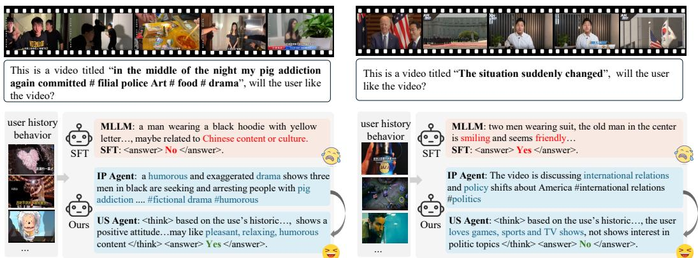
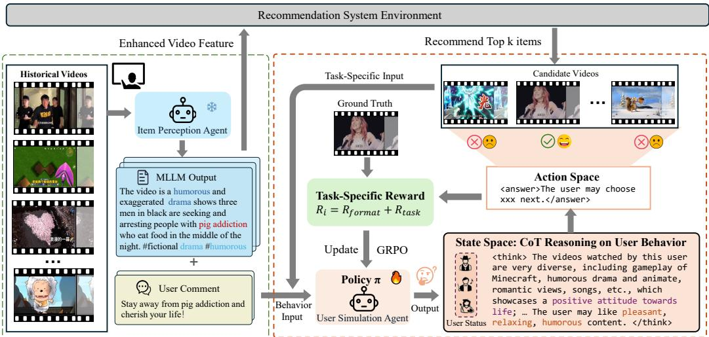
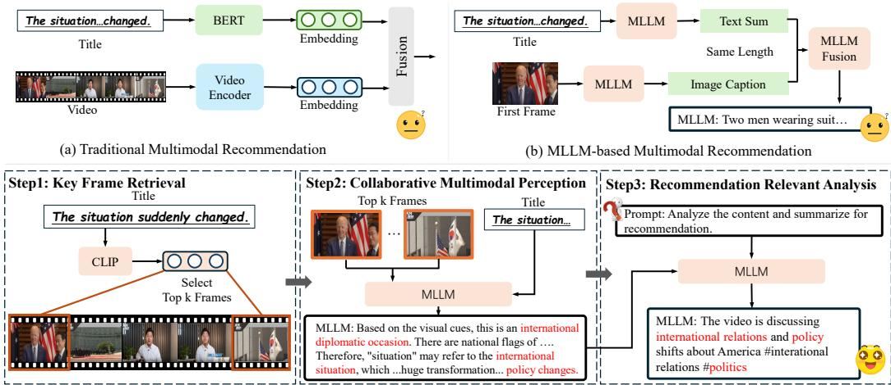
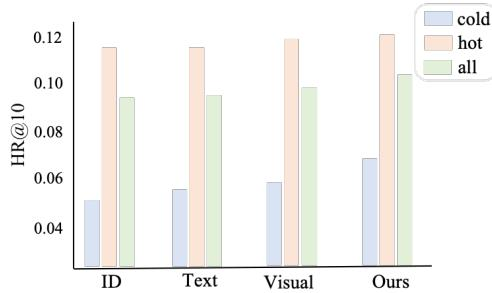
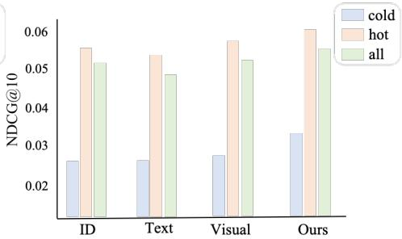
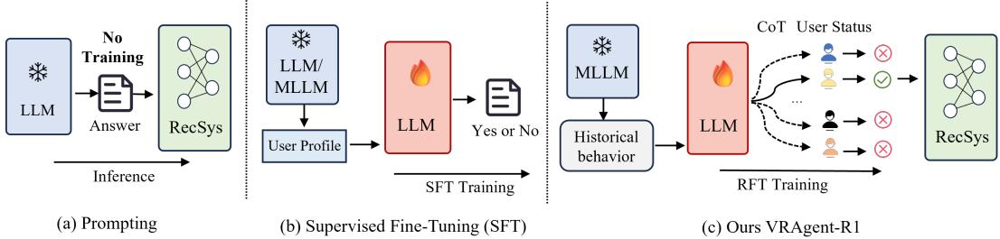

# VRAgent-R1: Boosting Video Recommendation with MLLM-based Agents via Reinforcement Learning

Chen Siran1,2, Chen Boyu1,2, Yu Chenyun3, Luo Yuxiao1, Yi Ouyang2, Cheng Lei2, Zhuo Chengxiang2, Li Zang2, Wang Yali1,4

1SIAT@MMLab, 2 Platform and Content Group, Tencent, 3Sun Yat-sen University, 4Shanghai AILab,

## Abstract

Owing to powerful natural language processing and generative capabilities, large language model (LLM) agents have emerged as a promising solution for enhancing recommendation systems via user simulation. However, in the realm of video recommendation, existing studies predominantly resort to prompt-based simulation using frozen LLMs and encounter the intricate challenge of multimodal content understanding. This frequently results in suboptimal item modeling and user preference learning, thereby ultimately constraining recommendation performance. To address these challenges, we introduce VRAgent-R1, a novel agent-based paradigm that incorporates human-like intelligence in user simulation. Specifically, VRAgent-R1 comprises two distinct agents: the Item Perception (IP) Agent and the User Simulation (US) Agent, designed for interactive user-item modeling. Firstly, the IP Agent emulates human-like progressive thinking based on MLLMs, effectively capturing hidden recommendation semantics in videos. With a more comprehensive multimodal content understanding provided by the IP Agent, the video recommendation system is equipped to provide higher-quality candidate items. Subsequently, the US Agent refines the recommended video sets based on in-depth chain-of-thought (CoT) reasoning and achieves better alignment with real user preferences through reinforcement learning. Experimental results on a large-scale video recommendation benchmark have demonstrated the effectiveness of our proposed VRAgent-R1 method, e.g., the IP Agent achieves a 6.0% improvement in NDCG@10 on the MicroLens-100k dataset, while the US Agent shows approximately 45.0% higher accuracy in user decision simulation compared to state-of-the-art baselines.

## 1 Introduction

With the widespread adoption of online multimedia services, particularly the booming popularity of short video platforms like TikTok and Kuaishou, Multimodal Recommendation Systems (MRS) have attracted considerable attention from both academia and industry. Unlike conventional recommendation technologies [1, 2, 3, 4, 5] that rely on ID-based user/item representation learning, MRS focuses on effectively integrating data associated with items from diverse modalities, such as text, images, videos, and audio, which aims to offer more personalized recommendations by deep semantic understanding of item and user characteristics. However, in video recommendations, existing approaches predominantly construct item representations based on text and images due to challenges in computational efficiency and processing heterogeneous information across modalities, the full potential of multimodal information in video recommendation systems remains largely unexplored.

  
Figure 1: Qualitative examples of VRAgent-R1 for Video Recommendation. Our VRAgent-R1 stands out from previous supervised fine-tuning of MLLM, which fails to give the correct prediction due to the lack of understanding of video items and deep thinking on user status.

Benefiting from the significant advancements in Multimodal Large Language Models (MLLMs), recent studies tend to utilize their strengths and potential to boost multimodal recommendation systems. On one hand, some approaches [6, 7, 8, 9, 10, 11, 12, 13] leverage the pre-trained MLLMs to directly convert each item’s multimodal information into a single embedding. However, fine-tuning MLLMs and achieving semantic alignment for recommendation requires abundant high-quality interaction data and computational resources. On the other hand, some methods [14, 15, 16, 17] directly apply LLMs or MLLMs to recommendation tasks, transforming the recommendation into a language generation problem. For instance, by analyzing user interaction history, item descriptions, or conversational context, LLMs perform in-depth inference to generate recommendation results. While effective in addressing the data sparsity issue, these methods often face challenges such as limited input length, computational inefficiency, and hallucinations, making them unsuitable for large-scale recommendations. Recently, growing attention has been paid to using LLM-based agents to enhance recommendation systems’ personalization and intelligence (e.g., user profiling, simulating interactions, improving satisfaction). However, existing methods [18, 14, 19] mostly use frozen LLMs, with the knowledge gap between vertical domains and LLMs/MLLMs limiting their adaptability and effectiveness.

Based on the above discussion, we propose to use LLMs/MLLMs to attain enhanced multimodal content comprehension and simulate user decision-making. Our objective is to optimize representation learning and human-centric recommendation outcomes, so as to align with real user preferences. In order to realize satisfactory MLLM-based user simulation for video recommendation, we are required to address the following challenges. 1) How to discriminately exploit the recommendationrelevant semantics hidden in video items? Most video recommendation systems heavily rely on understanding video items, which presents two major difficulties. Firstly, previous methods ignore the temporal relation within video frames and fail to identify key information among numerous contents. For example, some methods [20, 21] directly use randomly selected, pre-processed visual features, while MLLM-MSR [15] only takes the first image for video modeling, all of which fail to effectively utilize the characteristics of videos. Secondly, previous methods process each modality independently and conduct late feature fusion, which faces the problem of modality competition [22, 23], even leading to inferior performance compared to using a single modality [24]. Additionally, the lack of in-depth semantic interaction between raw modalities may also cause a misunderstanding of the high-level semantics of the video. As shown in Fig. 3 (a), (b), these methods merely obtain superficial modality embeddings while failing to identify the political topics expressed in the video. 2) How to effectively simulate user behavior that mirrors human deep thinking? LLMs show great promise for user simulation in the recommendation systems [18, 17, 14, 25] due to their excellent linguistic understanding capabilities. However, existing LLMs struggle with processing sequential multimodal inputs, which prevents direct modeling of multimodal user behavior sequences. Moreover, most user simulators [18, 14, 17, 19] primarily rely on prompt engineering to instruct frozen LLMs to generate responses without feedback, potentially leading to discrepancies between the agent and real user behavior when the model cannot be optimized. Some methods [16, 15] attempt to fine-tune the large model, but simple fine-tuning only yields binary ‘Yes’ or ‘No’ judgments without deep analysis of the user’s status, thus limiting the model’s generalizability as shown in Fig. 1.

  
Figure 2: Overview of our VRAgent-R1 framework. We propose a framework with two novel agents for better video recommendation. The IP Agent conducts collaborative multimodal understanding to obtain enhanced video features for the recommendation system and the US Agent. Meanwhile, the US Agent simulates user behavior via deep CoT reasoning based on user status. By reinforcement learning with actual behavior rewards, VRAgent-R1 achieves superior simulation performance and helps improve the recommendation accuracy.

To address the aforementioned challenges, we introduce VRAgent-R1, a novel agent-based paradigm for video recommendation. Unlike prior approaches built on frozen LLMs, VRAgent-R1 effectively mimics the human-like thinking for recommendation by leveraging multimodal collaborative understanding and reinforcement fine-tuning (RFT) on user simulation. Specifically, it consists of two distinct agents: the Item Perception (IP) Agent and the User Simulation (US) Agent. As illustrated in Fig. 2, The IP Agent aims to establish comprehensive multimodal content understanding for videos to improve item modeling through multi-round, in-depth semantic interaction with the MLLM. This process enables it to progressively discover key video content and effectively extract recommendation-relevant semantics from the items. Subsequently, the semantic summarization of videos generated by the IP Agent is used to optimize the fundamental video recommendation model via feature augmentation. This not only enhances the recommendation model but also facilitates the US Agent to capture user preferences and predict the next item based on historical interactions. The US Agent focuses on deep user behavior simulation and provides proxy feedback to refine the candidate set provided by the video recommendation system. To align user simulation with real decision-making, reinforcement learning is leveraged to enable the model to analyze historical user behavior (watched videos and comments) and comprehensively summarize user status with Chain-of-Thought (CoT) reasoning. Additionally, we design a reward mechanism associated with the user’s actual final behavior and update the fundamental LLM through policy optimization, i.e., GRPO [26]. Through the collaboration of IP and US agents, VRAgent-R1 effectively boosts video recommendation performance with step-by-step human-like thinking. The main contributions of this work can be summarized as follows:

• We propose VRAgent-R1, a novel agent-based framework designed to assist video recommendations from a user-centric perspective, which exhibits human-like intelligence for interpretable recommendations. By incorporating a user-like understanding, this framework significantly enhances the performance of recommendation system, demonstrating the effectiveness of the pipeline.

• Our IP Agent achieves more comprehensive multimodal understanding of videos by flexibly conducting in-depth semantic interactions between textual and visual contents. Furthermore, our US Agent is the first to use RFT for LLM-based user simulation, achieving more accurate simulation performance through deep thinking on user status with little training data.

• Extensive experiments demonstrate that the IP Agent significantly enhances the performance of existing video recommendation approaches, achieving a 4.3% improvement in HR@10 and a 6.0% improvement in NDCG@10 on the MicroLens-100k dataset [21]. Meanwhile, the US Agent outperforms commercial models such as GPT-4o [27] and SFT methods, attaining an accuracy of 64.1% in user simulation for next video selection, which represents a 45.0% enhancement over the

SFT baseline. Moreover, simulated user feedback can further boost the recommendation accuracy by reranking the candidate item set generated from the recommendation system.

## 2 Related Work

LLMs/MLLMs for Multi-Modal Recommendation. LLMs and MLLMs have performed a profound impact on their integration into current recommendation systems. Existing methods utilizing LLMs can be broadly categorized into implicit and explicit applications. The implicit methods [9, 10, 11, 12, 13, 6, 28, 29] directly utilize the pre-trained structure or parameters of large models to convert user and item information into embeddings. For example, LEARN [12] integrates key attributes such as the title, description, and brand of each item into a predefined prompt, and then uses the last layer feature of the LLM as the item embedding. NoteLLM-2 [6] employs an MLLM with end-to-end fine tuning to fuse multimodal information as the item embedding. Explicit methods [14, 17, 30, 15, 16] involve using the reasoning ability of MLLMs to expand item information and analyze user profiles or intentions, ultimately generating textual summarization to aid recommendations. For example, MLLM-MSR [15] uses MLLMs to generate detailed image captions and summarize user preferences for further recommendations. However, research on video recommendation with minute-level visual content is relatively scarce compared to text-based and image-based recommendations, and we are pioneers in using MLLMs for video recommendation.

LLM-based User Simulator. Considering the powerful semantic understanding and reasoning abilities, many works utilize LLM to assist user inference simulations [31, 17, 32, 18, 14]. For instance, iEvaLM [31] explores two types of interaction within a conversational recommendation benchmark: attribute-based question answering and free-form chit-chat using ChatGPT [33]. To simulate user search behavior, USimAgent [17] prompts an LLM agent to construct complete search sessions, including querying, clicking, and stopping behaviors, according to specific search tasks. Agent4Rec [18] initializes LLMs as agents with unique user profiles that encompass tastes and social traits to simulate more realistic user behaviors, thereby reflecting user preferences and social characteristics. Additionally, LLM\_Simulator [14] simulates user preferences by matching the positive and negative attributes of items with user preferences generated by the LLM to determine whether a user would like an item. However, previous LLM-based user simulation approaches have relied on frozen LLMs, and using them solely through prompting would risk discrepancies with real user behavior and potential hallucinations [18].

Training LLMs/MLLMs with RL. With the success of DeepSeek-R1 [34], reinforcement learning (RL) has demonstrated its remarkable ability to enhance the logical reasoning capabilities of LLMs with high data efficiency. There have been explorations to improve LLMs’ performance in reasoning tasks, such as solving mathematical puzzles [26, 35, 36] and coding [37, 38]. Furthermore, Visual-RFT [39] pioneers the enhancement of reasoning and visual perception in Large Vision Language Models with limited data. In the recommendation scenario, compared with SFT, the RL method requires less data to learn a reasoning strategy with good generalization, making it suitable for cold start scenarios and user simulation. To our knowledge, we are among the first to apply RFT of LLMs for user simulation and video recommendation.

## 3 Method

As shown in Fig. 2, our VRAgent-R1 framework mainly consists of two components: the Item Perception Agent (IP Agent) for video modeling and the User Simulation Agent (US Agent) for user modeling. In the following sections, we will detail how each agent works and how they collaborate to achieve better user simulation.

## 3.1 Item Perception Agent (IP Agent)

Existing video representation learning methods typically process visual and textual information separately by inputting them into distinct encoders for later feature fusion. However, due to the heterogeneity and the imbalance in information volumes between the two modalities, it is prone to modality competition, which in turn leads to a suboptimal semantic space for item representations [24]. To accurately localize and extract the high-level semantics of video for more precise recommendations, we propose a progressive approach that utilizes MLLMs to gradually mine video information through key frame retrieval, collaborative multimodal perception, and recommendation-relevant analysis, as illustrated in Fig. 3.

  
(c) Ours MLLM-based Video Item Perception AgentFigure 3: Video understanding by the IP Agent. We simulate the human video comprehension process through a progressive approach involving retrieval, collaborative perception, and analysis, so as to obtain a summary of the key video information that is applicable for recommendation.

Key Frame Retrieval (KFR). Given that videos contain a wealth of visual information, directly utilizing all video frames would introduce substantial redundant information and result in low computational efficiency. To identify the most crucial information in the visual representation while ensuring the algorithm’s efficiency, we uniformly sample 10 frames from the video. Subsequently, we employ CLIP [40] to compute the visual-text similarity scores between these sampled frames and the video title. The frames with the top 3 highest CLIP scores are then identified as the key visual information for the video’s representation.

Collaborative Multimodal Perception (CMP). After obtaining the retrieved frames, the next step is to identify the specific events and high-level semantics conveyed in the video. Our approach stands out from previous methods by fully leveraging the multi-modal understanding capabilities of the MLLM. Specifically, since some titles do not directly reflect the video’s topics, we input both the retrieved frames and titles into the MLLM and prompt it to understand the semantic context implied by the titles. During this process, MLLM can provide relevant explanations of the title and offer supplementary information. For instance, in Fig. 3, the term "situation" might pertain to international relations, while “change” could imply shifts in national policy. It is important to note that neither modality’s embedding could independently capture such nuanced semantics. Thus, the MLLM can now clearly comprehend the video information, including the main characters, general events, video genre, and the sentiment expressed in the video.

Recommendation Relevant Analysis (RRA). The captions initially generated by MLLM may not be well-suited for the specific recommendation scenario, as they may contain excessive redundant explanations or even hallucinations. To address this issue, we prompt the model to analyze the detailed video content jointly with the characteristics of scenario, as well as focusing on the key information that users are most likely to find interesting. The model then reformulates the video content into a concise and precise caption limited to approximately 35 words, which is close to the average length of the original titles. This process helps filter out unimportant details, resulting in a unified and comprehensive video caption. For more details, please refer to Appendix A.1. Note that the reformulated video caption not only can be used to enhance the representation learning for items, but also assist the process of user behavior simulation.

## 3.2 User Simulation Agent (US Agent)

After modeling the video items, we then consider simulating human behavior to refine the recommendation results. Although numerous LLM-based user agents are available [14, 18, 25, 19], most of them simply prompt frozen LLMs to generate fixed user profiles and make predictions without incorporating downstream feedback. Therefore, LLMs can not be optimized and the simulation outcomes may be unrealistic and prone to hallucinations. Moreover, simple supervised fine-tuning only enables models to memorize answers. Due to the lack of in-depth analysis of user behavior, this approach yields limited accuracy and lacks interpretability. To better align the model with the user decision-making process, we innovatively employ reinforcement learning to fine-tune the LLM within a simulated recommendation environment.

Environment and User Modeling. First, we identify the modeling of the recommendation environment and personalized user as shown in Fig .2. The environment aims to simulate a realistic recommendation scenario by generating candidate videos for the user, while the US Agent simulates the user to perform specific tasks. More specifically, for a user with N behaviors (including watched videos and corresponding comments), the first $N { - } 1$ behaviors are used for user profile modeling, and the N-th behavior is regarded as the prediction target. We use SASRec [21] to recommend 10 video items based on the user’s historical behaviors, simulating a rough recall process. Then m items are randomly selected as negative samples, and the real N-th item of user behavior is regarded as the positive one. These m+1 items collectively form the candidate video list for future tasks, which we will discuss in the following section. However, processing multiple video and text sequences simultaneously is challenging for the MLLM. To address this issue, the IP Agent converts the relevant multimodal videos into a textual format, enabling the US Agent to process the long text sequence instead. For a given task in the RFT process, we prompt the US Agent to first thoroughly analyze the user behavior to formulate a unique user status s (e.g., preferences and emotions) through CoT reasoning. The US Agent then analyzes the candidate videos and performs the appropriate action. Compared to previous methods, the user profile modeling here is dynamically updated based on task rewards, which allows for a learnable and more accurate simulation.

Task and Reward. To align the US Agent with real user preferences, we design two specific tasks for RFT, i.e., User Preference Judgment and Next Video Selection. In the first task, following settings of previous methods [15, 18, 14], the agent is given an item from the candidate list and then prompted to judge whether the user would like the recommended video. The action space A consists of $" \mathrm { Y e s } "$ and "No", corresponding to positive items and negative items, respectively. The Reward $R _ { 1 }$ for this task comprises two parts: the format reward $R _ { \mathrm { f o r m a t } }$ and the judgment reward $R _ { \mathrm { j u d } }$

$$
R _ {1} = R _ {\text { format }} + R _ {\text { jud }}.\tag{1}
$$

The format reward ensures the model adheres to the required response format, i.e., <think>the CoT thinking process</think>, <answer>the final answer</answer>. If the model’s answer is correctly formatted, it receives a score of 1; otherwise, scores are assigned according to the format specification presented in Appendix A.2. Additionally, we use a post-processing function f to parse the answer within the <answer> tag into a legal action, and check if it matches the ground truth. Here, $R _ { j u d }$ will be 1 for a correct simulation and -1 for a wrong situation.

In the second task, the agent first reviews all candidate items and selects the video that the user is most likely to watch next via prompt engineering. The action space $\mathcal { A }$ consists of choosing one item from the m+1 candidate videos. The reward $R _ { 2 }$ for this task includes the format reward $R _ { \mathrm { f o r m a t } }$ and the selection reward $R _ { \mathrm { s e l } }$

$$
R _ {2} = R _ {\text { format }} + R _ {\text { sel }}.\tag{2}
$$

Given the larger action space of $R _ { 2 }$ compared to $R _ { 1 }$ , this task is more complex, and we assign a score of 2 for correctly selecting the positive video to provide a higher reward.

GRPO Training. We employ Group Relative Policy Optimization (GRPO) [26] framework to train the agent, which compares groups of candidate responses directly, without requiring a critic model to evaluate policy performance. Given a problem q for the model $\pi _ { \theta } .$ , it samples to generate a group of distinct answers $o _ { i }$ , where $i = 1 , \bar { 2 , } . . . , G$ and $G$ is the sampled number in the group. Each answer involves different CoT reasoning for the user status and final answer, and we compute the corresponding reward $r _ { i } .$ . By comparing the relative advantage of the i-th answer ${ \hat { A } } _ { i }$

$$
\hat {A} _ {i} = \frac {r _ {i} - \operatorname{mean} (\mathbf {r})}{\operatorname{std} (\mathbf {r})}\tag{3}
$$

$\mathbf { r } = \{ r _ { 1 } , r _ { 2 } , . . . , r _ { G } \}$ , GRPO encourages the model to select the answer with higher reward within the group (more details are in Appendix A.4). We initially train the agent with an easy judgment task, then introduce the selection task. Via such a progressive training manner, the agent learns from simpler to more complex tasks, and the CoT process is gradually optimized, which provides thoughtful and interpretable recommendations for the user behavior.

## 4 Experiments

Datasets and Metrics. We have conducted extensive experiments on MicroLens-100K [21], an open-source, real-world video recommendation dataset that includes 100,000 users, 19,738 items, and 719,405 interactions, with a sparsity level of 99.96%. Notably, MicroLens is the first micro-video recommendation dataset to provide original video content, which enables us to analyze videos from raw frames. The average video duration is 161 seconds, featuring rich visual content. For traditional recommendation metrics across the entire dataset, we report standard recommendation metrics such as HR@10, NDCG@10, HR@20, and NDCG@20. For the evaluation of user behavior simulation, we report binary classification metrics such as accuracy (Acc) and F1 Score for preference judgment, as well as selection accuracy for next video selection.

Table 1: Comparison results on MicroLens-100K. The fusion of different modality features is achieved by weighted pooling. The underline T, I, V, F correspond to text, image, video, and fusion features, respectively. Our MLLM-enhanced features successfully boost the performance of different traditional sequence recommendation methods.

<table><tr><td>Class</td><td>Model</td><td>HR@10</td><td>NDCG@10</td><td>HR@20</td><td>NDCG@20</td></tr><tr><td rowspan="3">IDRec(CF)</td><td>DSSM [42]</td><td>0.0394</td><td>0.0193</td><td>0.0654</td><td>0.0258</td></tr><tr><td>LightGCN [43]</td><td>0.0372</td><td>0.0177</td><td>0.0618</td><td>0.0239</td></tr><tr><td>DeepFM [44]</td><td>0.0350</td><td>0.0170</td><td>0.0571</td><td>0.0225</td></tr><tr><td rowspan="3">IDRec(SR)</td><td>NextItNet [45]</td><td>0.0805</td><td>0.0442</td><td>0.1175</td><td>0.0535</td></tr><tr><td>GRU4Rec [46]</td><td>0.0782</td><td>0.0432</td><td>0.1147</td><td>0.0515</td></tr><tr><td>SASRec [47]</td><td>0.0909</td><td>0.0517</td><td>0.1278</td><td>0.0610</td></tr><tr><td rowspan="5">Modality</td><td> $NextItNet_V$ [21]</td><td>0.0862</td><td>0.0466</td><td>0.1246</td><td>0.0562</td></tr><tr><td> $SASRec_T$ [21]</td><td>0.0916</td><td>0.0490</td><td>0.1343</td><td>0.0598</td></tr><tr><td> $SASRec_I$ [21]</td><td>0.0942</td><td>0.0511</td><td>0.1358</td><td>0.0613</td></tr><tr><td> $SASRec_V$ [21]</td><td>0.0948</td><td>0.0515</td><td>0.1364</td><td>0.0619</td></tr><tr><td> $SASRec_F$ [21]</td><td>0.0953</td><td>0.0517</td><td>0.1362</td><td>0.0623</td></tr><tr><td rowspan="3">MLLM Enhanced</td><td>SASRec [47]+MLLM-MSR [15]</td><td>0.0606</td><td>0.0351</td><td>0.0911</td><td>0.0446</td></tr><tr><td>NextItNet [45]+Ours</td><td>0.0884</td><td>0.0478</td><td>0.1278</td><td>0.0583</td></tr><tr><td>SASRec [47]+Ours</td><td>0.0994+4.30%</td><td>0.0548+6.00%</td><td>0.1418+3.96%</td><td>0.0655+5.14%</td></tr></table>

  
Figure 4: User Group Performance. Our method has a great advantage in modeling cold-start users due to the good multimodal understanding, outperforming the baseline by more than 10%.

Implementation Details. We employ Qwen2.5-7b [41] for both the IP Agent and the US Agent. For video recommendation, we follow the official code of MicroLens-100K[21] benchmark for evaluation, and select the frames with the top 3 similarity scores generated by the IP Agent. In user simulation, we designate the actual last item of user behavior as the positive sample and employ SASRec [21] to generate the top 10 recommended items, from which m items are randomly chosen as negative samples to more accurately mimic real-world recommendation scenarios. We deploy 4 A100 80G GPUs for the reinforcement fine-tuning of the US Agent using information from 2000 users. The training configuration includes a batch size of 16, 16 sampled policy rollouts, and a KL coefficient of 0.001. We set the maximum number of input and response tokens to 2048 and train the model for 4 epochs, which takes approximately 10 hours. User simulation evaluation is conducted on 1000 randomly selected cold-start users and repeated three times to report the average performance. The specific prompts used for instructing models are detailed in Appendix A.1.

## 4.1 Performance Comparison for Video Recommendation

In this section, we evaluate the effectiveness of our IP Agent on the video recommendation baseline, following the experimental protocols in MicroLens [21]. We use the MLLM to generate outputs for collaborative reasoning and understanding, thereby enhancing the content of the original titles. As shown in Table 1, sequential recommendation models that incorporate multimodal information outperform both Collaborative Filtering (CF) models and simple ID embedding-based models. How ever, traditional multimodal methods rely on late fusion techniques (e.g., addition or concatenation) of ID, textual, and visual embeddings. Due to the significant differences between modalities, such coarse-grained fusion fails to fully leverage multimodal information. Moreover, the lack of in-depth understanding of video frames means that these fusion methods only achieve similar performance to single-modality approaches. We also experiment with directly using the MLLM to generate a detailed caption for the cover image, as in MLLM-MSR [15]. However, these captions often focus on unimportant details in the image, failing to capture key information and leading to a significant decline in performance. In contrast, our IP Agent integrates the pre-trained world knowledge of the MLLM to collaboratively understand multimodal content. It summarizes key information in a brief and unified format, which helps to boost HR@10 and NDCG@10 by 4.3% and 6.0%, respectively, compared to previous state-of-the-art methods.

Table 2: Evaluation on User Simulation. Our RFT method outperforms previous prompt and SFT-based simulation, with less training data and higher accuracy. m is the number of negative samples, and SFT methods have higher Recall scores since they tend to give positive answers.

<table><tr><td>Method</td><td>Acc</td><td>Recall</td><td>Pre</td><td>F1</td><td> $\text{Acc}_{m=3}$ </td><td> $\text{Acc}_{m=4}$ </td></tr><tr><td>GPT-4o [27]</td><td>0.535</td><td>0.480</td><td>0.533</td><td>0.505</td><td>0.307</td><td>0.269</td></tr><tr><td>DeepSeek-R1 [34]</td><td>0.528</td><td>0.556</td><td>0.526</td><td>0.541</td><td>0.264</td><td>0.231</td></tr><tr><td>Qwen2.5-7b [41]</td><td>0.491</td><td>0.512</td><td>0.490</td><td>0.500</td><td>0.245</td><td>0.197</td></tr><tr><td>LLM_Simulator [14]</td><td>0.523</td><td>0.539</td><td>0.519</td><td>0.529</td><td>-</td><td>-</td></tr><tr><td>Agent4Rec [18]</td><td>0.528</td><td>0.482</td><td>0.52</td><td>0.501</td><td>-</td><td>-</td></tr><tr><td>TALLREC (SFT) [16]</td><td>0.537</td><td>0.913</td><td>0.521</td><td>0.663</td><td>-</td><td>-</td></tr><tr><td>MLLM-MSR (SFT) [15]</td><td>0.585</td><td>0.882</td><td>0.553</td><td>0.679</td><td>0.442</td><td>0.381</td></tr><tr><td>VRAgent-R1</td><td>0.715</td><td>0.760</td><td>0.697</td><td>0.727</td><td>0.641</td><td>0.602</td></tr></table>

Table 3: Preference evaluation comparison on MovieLens with our US Agents.

<table><tr><td>Method</td><td>Acc</td><td>Recall</td><td>Pre</td><td>F1</td></tr><tr><td>GPT-4o [27]</td><td>0.584</td><td>0.626</td><td>0.577</td><td>0.600</td></tr><tr><td>RecAgent [25]</td><td>0.581</td><td>0.639</td><td>0.604</td><td>0.621</td></tr><tr><td>Agent4Rec [18]</td><td>0.691</td><td>0.746</td><td>0.691</td><td>0.698</td></tr><tr><td>VRAgent</td><td>0.832</td><td>0.846</td><td>0.823</td><td>0.834</td></tr></table>

Table 4: Optimizing RSs with VRAgent-R1.

<table><tr><td rowspan="2">Method</td><td colspan="2">All</td><td colspan="2">Cold</td></tr><tr><td>HR@10</td><td>NDCG@10</td><td>HR@10</td><td>NDCG@10</td></tr><tr><td>Original</td><td>0.0916</td><td>0.0490</td><td>0.0586</td><td>0.0278</td></tr><tr><td>+IP Agent</td><td>0.0994</td><td>0.0548</td><td>0.0663</td><td>0.0318</td></tr><tr><td>+US dislike</td><td>0.0988</td><td>0.0543</td><td>0.0654</td><td>0.0311</td></tr><tr><td>+US like</td><td>0.1003</td><td>0.0554</td><td>0.0678</td><td>0.0330</td></tr></table>

Considering that our method establishes a comprehensive understanding of multimodal items, it should also be helpful in handling cold-start users. Accordingly, we evaluate the performance of different methods on cold-start users (i.e., users with no more than 5 interacted videos), as shown in Fig. 4. It is evident that the ID-based method suffers the most significant performance degradation for cold-start users, as it relies solely on ID embeddings without incorporating multimodal information. In contrast, our method demonstrates a clear advantage in modeling cold-start users, outperforming the baseline by more than 10%.

## 4.2 Evaluation on User Simulation

In this subsection, we assess the performance of VRAgent-R1 and other user simulators in accurately modeling user behavior through two tasks: user preference prediction (estimating whether a user will like recommended items) and next video selection (choosing the most likely video a user will click next from candidates). Tab. 2 presents the results comparing our method with commercial models (GPT-4o [27], DeepSeek-R1 [34]) and several user simulation baseline methods. As shown in the table, directly prompting frozen LLMs to summarize user preferences based on textual inputs and then predict the answer yields poor results. This is because these LLMs rely solely on limited information from video titles and suffer from serious hallucination problems, leading to performance only slightly better than random guessing. For the SFT methods, such as ALLREC [16] and MLLM-MSR [15], training the models to predict user behavior based on summarized user preferences shows improved performance after fine-tuning with an additional 20,000 users’ information. MLLM-MSR performs better due to the inclusion of extra cover image information, but the results are still unsatisfactory, and the final model can only provide binary answers ("Yes" or "No") without a reasoning process. On the contrary, our VRAgent-R1 method achieves significantly higher prediction accuracy, e.g.,

Table 5: Ablation on the IP Agent.

<table><tr><td>Method</td><td>HR@10</td><td>NDCG@10</td><td>HR@20</td><td>NDCG@20</td></tr><tr><td>Baseline</td><td>0.0916</td><td>0.0490</td><td>0.1343</td><td>0.0598</td></tr><tr><td>w/o KFR</td><td>0.0980</td><td>0.0542</td><td>0.1422</td><td>0.0646</td></tr><tr><td>w/o CMP</td><td>0.0960</td><td>0.0519</td><td>0.1398</td><td>0.0629</td></tr><tr><td>w/o RRA</td><td>0.0816</td><td>0.0466</td><td>0.1182</td><td>0.0523</td></tr><tr><td>VRAgent-R1</td><td>0.0994</td><td>0.0548</td><td>0.1448</td><td>0.0655</td></tr></table>

Table 6: Ablation on the US Agent.

<table><tr><td>Method</td><td>Acc</td><td>F1</td><td> $\text{Acc}_{m=3}$ </td><td> $\text{Acc}_{m=4}$ </td></tr><tr><td>Baseline</td><td>0.491</td><td>0.500</td><td>0.245</td><td>0.197</td></tr><tr><td>SFT</td><td>0.585</td><td>0.679</td><td>0.442</td><td>0.381</td></tr><tr><td>w/o CoT Reasoning</td><td>0.580</td><td>0.592</td><td>0.324</td><td>0.263</td></tr><tr><td>w/o Comment</td><td>0.695</td><td>0.705</td><td>0.618</td><td>0.577</td></tr><tr><td>w/o IP Agent</td><td>0.680</td><td>0.686</td><td>0.609</td><td>0.569</td></tr><tr><td>VRAgent-R1</td><td>0.715</td><td>0.727</td><td>0.646</td><td>0.602</td></tr></table>

about 45% higher for the next video selection than MLLM-MSR, despite using less training data. Additionally, our model can be applied to different reasoning tasks without losing generality.

To verify the effectiveness of our method across different domains, we conduct user preference simulation tests [18] on the widely used MovieLens-1M [48] dataset. Since the understanding of movie content in this dataset primarily relies on text descriptions, we evaluate the performance using only the US Agent, without involving the IP Agent for multimodal processing. The results in Tab. 3 indicate that in text-dominated movie recommendation scenarios, our approach also significantly outperforms previous simulation agents [25, 18]. More discussion could be referred in Appendix A.3.

## 4.3 Optimizing RSs with VRAgent-R1

We conduct a preliminary experiment to assess whether VRAgent-R1’s simulation could enhance recommendation systems (RSs). Specifically, we randomly select 8,000 cold-start users and provide VRAgent-R1 with the top 10 items recommended by the original RSs. VRAgent-R1 simulates user decisions on which videos they might watch and which they would dislike. This simulated behaviors are then used to supplement the modeling of cold-start users and update the RSs. As shown in Tab. 4, incorporating feedback on user-liked videos improves recommendation performance. In contrast, simulated interactions with user-disliked videos have a negative impact. This outcome effectively demonstrates the feedback-driven recommendation augmentation process.

Ablation on the IP Agent. In this part, we ablate the progressive steps taken in our IP Agent. Specifically, "w/o KFR" denotes the absence of the key frame retrieval process, where we replace it with three randomly selected adjacent frames. "w/o CMP" indicates the removal of collaborative multimodal perception. In this scenario, the MLLM is employed to analyze visual frames and titles independently. "w/o RRA" signifies the exclusion of recommendation-relevant analysis, leading to the direct utilization of detailed long textual outputs for video comprehension. As shown in Tab. 5, both key frame extraction and collaborative multimodal interaction significantly enhance video modeling. The analysis process is also crucial, as excessive unimportant details can be noisy and degrade recommendation performance.

Ablation on the US Agent. We then conduct ablation studies to assess the impact of each component of VRAgent-R1 on simulation performance, as detailed in Tab. 6. First, we remove the CoT reasoning from the RFT process, and then the LLM directly predicts answers based on the user’s historical sequence, bypassing analysis of video contents and user status. This leads to a significant performance drop, underscoring the importance of CoT in reasoning tasks. Next, we evaluate the impact of user comments which aid in more accurate user modeling. Results show that the absence of them causes roughly 4% performance decline. Finally, we ablate the IP Agent, which is responsible for multimodal understanding. We can observe that the IP Agent boosts performance by approximately 6% over the baseline relying on original textual information.

## 5 Conclusion

In this paper, we propose a novel VRAgent-R1 framework for user simulation in video recommendation. It first utilizes an MLLM to collaboratively understand the retrieved multimodal content with pre-trained world knowledge, then analyzes the history sequence to establish user status and make final decision through RFT. By exploring different strategies and using real user decisions as verifiable rewards under different tasks, our VRAgent-R1 method achieves significant improvements in user behavior simulation for video recommendation. It outperforms SFT with minimal data and shows strong generalization. As a pioneering work, this study demonstrates the potential of applying RFT to LLMs in recommendation systems.

Limitations and Future Directions. Although the dataset used in this paper focuses on video recommendations, our VRAgent-R1 paradigm can be easily extended to various domains such as games, news, and e-commerce. Currently, the user action space in our experiments is relatively limited due to the dataset properties. In future work, we plan to explore adding more user behaviors, such as clicks and retention, to achieve more realistic user-system interactions. Moreover, verifying whether better user simulation feedback can further optimize existing recommendation systems is also a crucial direction for future exploration.

## References

[1] Y. Huang, B. Cui, W. Zhang, J. Jiang, and Y. Xu, “Tencentrec: Real-time stream recommendation in practice,” in Proceedings of the 2015 ACM SIGMOD international conference on management of data, 2015, pp. 227–238.

[2] L. Zheng, C.-T. Lu, F. Jiang, J. Zhang, and P. S. Yu, “Spectral collaborative filtering,” in Proceedings of the 12th ACM conference on recommender systems, 2018, pp. 311–319.

[3] R. Ying, R. He, K. Chen, P. Eksombatchai, W. L. Hamilton, and J. Leskovec, “Graph convolutional neural networks for web-scale recommender systems,” in Proceedings of the 24th ACM SIGKDD international conference on knowledge discovery & data mining, 2018, pp. 974–983.

[4] J. Yang, X. Yi, D. Zhiyuan Cheng, L. Hong, Y. Li, S. Xiaoming Wang, T. Xu, and E. H. Chi, “Mixed negative sampling for learning two-tower neural networks in recommendations,” in Companion proceedings of the web conference 2020, 2020, pp. 441–447.

[5] F. Yuan, X. He, A. Karatzoglou, and L. Zhang, “Parameter-efficient transfer from sequential behaviors for user modeling and recommendation,” in Proceedings of the 43rd International ACM SIGIR conference on research and development in Information Retrieval, 2020, pp. 1469–1478.

[6] C. Zhang, H. Zhang, S. Wu, D. Wu, T. Xu, X. Zhao, Y. Gao, Y. Hu, and E. Chen, “Notellm-2: Multimodal large representation models for recommendation,” arXiv preprint arXiv:2405.16789, 2024.

[7] J. Chen, L. Chi, B. Peng, and Z. Yuan, “Hllm: Enhancing sequential recommendations via hierarchical large language models for item and user modeling,” arXiv preprint arXiv:2409.12740, 2024.

[8] X. Luo, J. Cao, T. Sun, J. Yu, R. Huang, W. Yuan, H. Lin, Y. Zheng, S. Wang, Q. Hu et al., “Qarm: Quantitative alignment multi-modal recommendation at kuaishou,” arXiv preprint arXiv:2411.11739, 2024.

[9] F. Sun, J. Liu, J. Wu, C. Pei, X. Lin, W. Ou, and P. Jiang, “Bert4rec: Sequential recommendation with bidirectional encoder representations from transformer,” in Proceedings of the 28th ACM international conference on information and knowledge management, 2019, pp. 1441–1450.

[10] X. Ren, W. Wei, L. Xia, L. Su, S. Cheng, J. Wang, D. Yin, and C. Huang, “Representation learning with large language models for recommendation,” in Proceedings of the ACM Web Conference 2024, 2024, pp. 3464–3475.

[11] D.-H. Lee, A. Kraft, L. Jin, N. Mehta, T. Xu, L. Hong, E. H. Chi, and X. Yi, “Star: A simple training-free approach for recommendations using large language models,” arXiv preprint arXiv:2410.16458, 2024.

[12] J. Jia, Y. Wang, Y. Li, H. Chen, X. Bai, Z. Liu, J. Liang, Q. Chen, H. Li, P. Jiang et al., “Learn: Knowledge adaptation from large language model to recommendation for practical industrial application,” in Proceedings of the AAAI Conference on Artificial Intelligence, vol. 39, no. 11, 2025, pp. 11 861–11 869.

[13] C. Song, C. Shen, H. Gu, Y. Wu, L. Yi, J. Wen, and C. Chen, “Precise: Pre-training sequential recommenders with collaborative and semantic information,” arXiv preprint arXiv:2412.06308, 2024.

[14] Z. Zhang, S. Liu, Z. Liu, R. Zhong, Q. Cai, X. Zhao, C. Zhang, Q. Liu, and P. Jiang, “Llm-powered user simulator for recommender system,” in Proceedings of the AAAI Conference on Artificial Intelligence, vol. 39, no. 12, 2025, pp. 13 339–13 347.

[15] Y. Ye, Z. Zheng, Y. Shen, T. Wang, H. Zhang, P. Zhu, R. Yu, K. Zhang, and H. Xiong, “Harnessing multimodal large language models for multimodal sequential recommendation,” in Proceedings of the AAAI Conference on Artificial Intelligence, vol. 39, no. 12, 2025, pp. 13 069–13 077.

[16] K. Bao, J. Zhang, Y. Zhang, W. Wang, F. Feng, and X. He, “Tallrec: An effective and efficient tuning frame work to align large language model with recommendation,” in Proceedings of the 17th ACM Conference on Recommender Systems, 2023, pp. 1007–1014.

[17] E. Zhang, X. Wang, P. Gong, Y. Lin, and J. Mao, “Usimagent: Large language models for simulating search users,” in Proceedings of the 47th International ACM SIGIR Conference on Research and Development in Information Retrieval, 2024, pp. 2687–2692.

[18] A. Zhang, Y. Chen, L. Sheng, X. Wang, and T.-S. Chua, “On generative agents in recommendation,” in Proceedings of the 47th international ACM SIGIR conference on research and development in Information Retrieval, 2024, pp. 1807–1817.

[19] W. Xiang, H. Zhu, S. Lou, X. Chen, Z. Pan, Y. Jin, S. Chen, and L. Sun, “Simuser: Generating usability feedback by simulating various users interacting with mobile applications,” in Proceedings of the 2024 CHI Conference on Human Factors in Computing Systems, 2024, pp. 1–17.

[20] R. He, C. Fang, Z. Wang, and J. McAuley, “Vista: A visually, socially, and temporally-aware model for artistic recommendation,” in Proceedings of the 10th ACM conference on recommender systems, 2016, pp. 309–316.

[21] Y. Ni, Y. Cheng, X. Liu, J. Fu, Y. Li, X. He, Y. Zhang, and F. Yuan, “A content-driven micro-video recommendation dataset at scale,” arXiv preprint arXiv:2309.15379, 2023.

[22] Y. Shang, C. Gao, J. Chen, D. Jin, H. Ma, and Y. Li, “Enhancing adversarial robustness of multi-modal recommendation via modality balancing,” in Proceedings of the 31st ACM International Conference on Multimedia, 2023, pp. 6274–6282.

[23] Q. Liu, J. Hu, Y. Xiao, X. Zhao, J. Gao, W. Wang, Q. Li, and J. Tang, “Multimodal recommender systems: A survey,” ACM Computing Surveys, vol. 57, no. 2, pp. 1–17, 2024.

[24] H. Zhou, X. Zhou, Z. Zeng, L. Zhang, and Z. Shen, “A comprehensive survey on multimodal recommender systems: Taxonomy, evaluation, and future directions,” arXiv preprint arXiv:2302.04473, 2023.

[25] L. Wang, J. Zhang, H. Yang, Z.-Y. Chen, J. Tang, Z. Zhang, X. Chen, Y. Lin, H. Sun, R. Song et al., “User behavior simulation with large language model-based agents,” ACM Transactions on Information Systems, vol. 43, no. 2, pp. 1–37, 2025.

[26] Z. Shao, P. Wang, Q. Zhu, R. Xu, J. Song, X. Bi, H. Zhang, M. Zhang, Y. Li, Y. Wu et al., “Deepseekmath: Pushing the limits of mathematical reasoning in open language models,” arXiv preprint arXiv:2402.03300, 2024.

[27] A. Hurst, A. Lerer, A. P. Goucher, A. Perelman, A. Ramesh, A. Clark, A. Ostrow, A. Welihinda, A. Hayes, A. Radford et al., “Gpt-4o system card,” arXiv preprint arXiv:2410.21276, 2024.

[28] B. Chen, S. Chen, K. Li, Q. Xu, Y. Qiao, and Y. Wang, “Super encoding network: Recursive association of multi-modal encoders for video understanding,” arXiv preprint arXiv:2506.07576, 2025.

[29] ——, “Percept, chat, and then adapt: Multimodal knowledge transfer of foundation models for open-world video recognition,” arXiv preprint arXiv:2402.18951, 2024.

[30] Y. Hou, J. Zhang, Z. Lin, H. Lu, R. Xie, J. McAuley, and W. X. Zhao, “Large language models are zero-shot rankers for recommender systems,” in European Conference on Information Retrieval. Springer, 2024, pp. 364–381.

[31] X. Wang, X. Tang, W. X. Zhao, J. Wang, and J.-R. Wen, “Rethinking the evaluation for conversational recommendation in the era of large language models,” arXiv preprint arXiv:2305.13112, 2023.

[32] N. Corecco, G. Piatti, L. A. Lanzendörfer, F. X. Fan, and R. Wattenhofer, “Suber: An rl environment with simulated human behavior for recommender systems,” arXiv preprint arXiv:2406.01631, 2024.

[33] J. Achiam, S. Adler, S. Agarwal, L. Ahmad, I. Akkaya, F. L. Aleman, D. Almeida, J. Altenschmidt, S. Altman, S. Anadkat et al., “Gpt-4 technical report,” arXiv preprint arXiv:2303.08774, 2023.

[34] D. Guo, D. Yang, H. Zhang, J. Song, R. Zhang, R. Xu, Q. Zhu, S. Ma, P. Wang, X. Bi et al., “Deepseek-r1: Incentivizing reasoning capability in llms via reinforcement learning,” arXiv preprint arXiv:2501.12948, 2025.

[35] A. Yang, B. Zhang, B. Hui, B. Gao, B. Yu, C. Li, D. Liu, J. Tu, J. Zhou, J. Lin et al., “Qwen2. 5-math tech nical report: Toward mathematical expert model via self-improvement,” arXiv preprint arXiv:2409.12122, 2024.

[36] H. Ying, S. Zhang, L. Li, Z. Zhou, Y. Shao, Z. Fei, Y. Ma, J. Hong, K. Liu, Z. Wang et al., “Internlm-math: Open math large language models toward verifiable reasoning,” arXiv preprint arXiv:2402.06332, 2024.

[37] Y. Zhang, S. Wu, Y. Yang, J. Shu, J. Xiao, C. Kong, and J. Sang, “o1-coder: an o1 replication for coding,” arXiv preprint arXiv:2412.00154, 2024.

[38] K. Zhang, G. Li, Y. Dong, J. Xu, J. Zhang, J. Su, Y. Liu, and Z. Jin, “Codedpo: Aligning code models with self generated and verified source code,” arXiv preprint arXiv:2410.05605, 2024.

[39] Z. Liu, Z. Sun, Y. Zang, X. Dong, Y. Cao, H. Duan, D. Lin, and J. Wang, “Visual-rft: Visual reinforcement fine-tuning,” arXiv preprint arXiv:2503.01785, 2025.

[40] A. Radford, J. W. Kim, C. Hallacy, A. Ramesh, G. Goh, S. Agarwal, G. Sastry, A. Askell, P. Mishkin, J. Clark et al., “Learning transferable visual models from natural language supervision,” in International conference on machine learning. PmLR, 2021, pp. 8748–8763.

[41] A. Yang, B. Yang, B. Zhang, B. Hui, B. Zheng, B. Yu, C. Li, D. Liu, F. Huang, H. Wei et al., “Qwen2. 5 technical report,” arXiv preprint arXiv:2412.15115, 2024.

[42] P.-S. Huang, X. He, J. Gao, L. Deng, A. Acero, and L. Heck, “Learning deep structured semantic models for web search using clickthrough data,” in Proceedings of the 22nd ACM international conference on Information & Knowledge Management, 2013, pp. 2333–2338.

[43] X. He, K. Deng, X. Wang, Y. Li, Y. Zhang, and M. Wang, “Lightgcn: Simplifying and powering graph convolution network for recommendation,” in Proceedings of the 43rd International ACM SIGIR conference on research and development in Information Retrieval, 2020, pp. 639–648.

[44] H. Guo, R. Tang, Y. Ye, Z. Li, and X. He, “Deepfm: a factorization-machine based neural network for ctr prediction,” arXiv preprint arXiv:1703.04247, 2017.

[45] F. Yuan, A. Karatzoglou, I. Arapakis, J. M. Jose, and X. He, “A simple convolutional generative network for next item recommendation,” in Proceedings of the twelfth ACM international conference on web search and data mining, 2019, pp. 582–590.

[46] B. Hidasi, A. Karatzoglou, L. Baltrunas, and D. Tikk, “Session-based recommendations with recurrent neural networks,” arXiv preprint arXiv:1511.06939, 2015.

[47] W.-C. Kang and J. McAuley, “Self-attentive sequential recommendation,” in 2018 IEEE international conference on data mining (ICDM). IEEE, 2018, pp. 197–206.

[48] F. M. Harper and J. A. Konstan, “The movielens datasets: History and context,” Acm transactions on interactive intelligent systems (tiis), vol. 5, no. 4, pp. 1–19, 2015.

[49] J.-C. Shi, Y. Yu, Q. Da, S.-Y. Chen, and A.-X. Zeng, “Virtual-taobao: Virtualizing real-world online retail environment for reinforcement learning,” in Proceedings of the AAAI Conference on Artificial Intelligence, vol. 33, no. 01, 2019, pp. 4902–4909.

[50] X. Chen, S. Li, H. Li, S. Jiang, Y. Qi, and L. Song, “Generative adversarial user model for reinforcement learning based recommendation system,” in International conference on machine learning. PMLR, 2019, pp. 1052–1061.

[51] K. Zhao, S. Liu, Q. Cai, X. Zhao, Z. Liu, D. Zheng, P. Jiang, and K. Gai, “Kuaisim: A comprehensive simulator for recommender systems,” Advances in Neural Information Processing Systems, vol. 36, pp. 44 880–44 897, 2023.

[52] J. Jeong, Y. Chow, G. Tennenholtz, C.-W. Hsu, A. Tulepbergenov, M. Ghavamzadeh, and C. Boutilier, “Factual and personalized recommendations using language models and reinforcement learning,” arXiv preprint arXiv:2310.06176, 2023.

[53] C. Sun, Y. Liang, Y. Yang, S. Xu, T. Yang, and Y. Tong, “Rlrf4rec: Reinforcement learning from recsys feedback for enhanced recommendation reranking,” arXiv preprint arXiv:2410.05939, 2024.

[54] J. Lin, T. Wang, and K. Qian, “Rec-r1: Bridging generative large language models and user-centric recommendation systems via reinforcement learning,” arXiv preprint arXiv:2503.24289, 2025.

[55] R. S. Sutton, A. G. Barto et al., Reinforcement learning: An introduction. MIT press Cambridge, 1998, vol. 1, no. 1.

[56] A. Agarwal, N. Jiang, S. M. Kakade, and W. Sun, “Reinforcement learning: Theory and algorithms,” CS Dept., UW Seattle, Seattle, WA, USA, Tech. Rep, vol. 32, p. 96, 2019.

[57] J. Schulman, F. Wolski, P. Dhariwal, A. Radford, and O. Klimov, “Proximal policy optimization algorithms,” arXiv preprint arXiv:1707.06347, 2017.

## A Technical Appendices and Supplementary Material

Technical appendices with additional results, figures, graphs and proofs may be submitted with the paper submission before the full submission deadline (see above), or as a separate PDF in the ZIP file below before the supplementary material deadline. There is no page limit for the technical appendices.

## A.1 Prompt Templates for the Agents

In this section, we present the comprehensive set of prompt templates utilized in the experiments across various stages, as shown in Tab. 7. These prompts are meticulously designed to guide the Agent in effectively performing its tasks, ensuring seamless interactions and accurate responses.

<table><tr><td>Prompt</td><td>Content</td></tr><tr><td>Prompt to decide which parts of the video to focus on</td><td>You are a helpful assistant to help to understand a video. These are key {frames} from a video, and the title of the video is: {title}. Pay special attention to content related to the title.</td></tr><tr><td>Prompt for collaborative perception</td><td>Based on the textual and visual contents, identify what visual content aligns with or extends beyond the title&#x27;s description, note any discrepancies or additional context provided by the visuals. Now combined with your knowledge and understanding, give the key information about the video, including: main characters, core event and emotional appeal.</td></tr><tr><td>Prompt to generate summarization for recommendation</td><td>If you want to recommend the video, create a concise summary within 35 words on what the viewer would be interested in, following this format: [Core Content Description] + [Refined Tags]. The content should be clear and elegant, and tags should be brief and accurate to reflect the video topic. Here is a good example: &quot;the girl just drove the wrong way, but did not expect to encounter terrible things # thriller movie # movie commentary&quot;</td></tr><tr><td>Prompt for User Simulation</td><td>You are a helpful assistant. The assistant first thinks about the user&#x27;s video watching history and the comments, analyzes their current status, such as preferences and purpose, and predicts: which video they are most likely to watch next from the given candidates / if they like the next video. The reasoning process and answer are enclosed withinandtags, respectively, i.e.,reasoning process hereanswer here. After thinking, when you finally reach a conclusion, give the user status and the answer you predict withintags. i.e.,(1) User_status:....(2) Next_video:...User&#x27;s viewing history: {history_str}Candidate videos for the next watch: {candidates_str}</td></tr></table>

Table 7: The prompt templates used in our VRAgent-R1.

## A.2 Reward Score Computation

In this section, we give the concrete computation for the three reward scores as follows:

$$
R _ {f o r m a t} = \left\{ \begin{array}{l l} 1, & \text { if   the   answer   follows   the   standard   format } \\ 0. 5, & \text { if   the   order   of   <  think > , <  answer > tags   is   wrong } \\ 0, & \text { if   missing   <  think > or   <  answer > tags } \\ - 1, & \text { if   the   answer   cannot   be   parsed   or   is   missing } \end{array} \right.\tag{4}
$$

$$
R _ {j u d} = \left\{ \begin{array}{l l} 1, & \text { if   the   agent   preference   matches   the   ground   truth } \\ - 1, & \text { if   the   agent   preference   mismatches   the   ground   truth } \\ - 1, & \text { if   the   agent   preference   cannot   be   parsed   or   is   missing } \end{array} \right.\tag{5}
$$

$$
R _ {s e l} = \left\{ \begin{array}{l l} 2, & \text { if   the   agent   selection   matches   the   ground   truth } \\ - 1. 5, & \text { if   the   agent   selection   mismatches   the   ground   truth } \\ - 2, & \text { if   the   agent   selection   cannot   be   parsed   or   is   missing } \end{array} \right.\tag{6}
$$

  
Figure 5: Comparison with other user simulation for recommendation.

## A.3 Additional Experiment Discussion

Experiments on MovieLens. To verify the generality of our method in other domains, we also conduct user preference simulation tests on the widely used MovieLens-1M [48] dataset, which contains 1 million ratings from 6000 users on 4000 movies, and ratings above 3 are considered a positive like signal. Note that, though this dataset is related to movies, the understanding of movie contents mainly relies on text descriptions, while the visual information is not that important. Therefore, in this experiment, we only use the US Agent to do the evaluation, without considering the IP Agent for multimodal processing. We follow the setting of Agent4Rec [18], 1000 simulated users are randomly assigned 20 items, with varying ratios 1:m of positive and negative items. In our main paper, the reported results are all in a 1:1 ratio, here we also report the performance in 1:3 setting.

Table 8: Preference evaluation comparison on MovieLens with our US Agents.

<table><tr><td rowspan="2">Method</td><td colspan="4">1:1</td><td colspan="4">1:3</td></tr><tr><td>Acc</td><td>Recall</td><td>Pre</td><td>F1</td><td>Acc</td><td>Recall</td><td>Pre</td><td>F1</td></tr><tr><td>GPT-4o [27]</td><td>0.584</td><td>0.626</td><td>0.577</td><td>0.600</td><td>0.523</td><td>0.701</td><td>0.308</td><td>0.428</td></tr><tr><td>RecAgent [25]</td><td>0.581</td><td>0.639</td><td>0.604</td><td>0.621</td><td>0.508</td><td>0.740</td><td>0.399</td><td>0.518</td></tr><tr><td>Agent4Rec [18]</td><td>0.691</td><td>0.746</td><td>0.691</td><td>0.698</td><td>0.668</td><td>0.762</td><td>0.421</td><td>0.543</td></tr><tr><td>Ours</td><td>0.832</td><td>0.846</td><td>0.823</td><td>0.834</td><td>0.806</td><td>0.821</td><td>0.579</td><td>0.679</td></tr></table>

We can learn from the Tab. 8 that the user simulation results on MovieLens are better than those on MicroLens, indicating that the video recommendation task on MicroLens is more complex and challenging, where the multimodal information should be considered. And for textual dominated movie recommendation, our approach still has a great advantage compared with previous prompt-based simulation Agents [25, 18] like in Fig. 5, the prompt-based agents could not be optimized accordingly to recommendation, while our VRAgent-R1 learns to think deeply to simulate more realistic user behavior.

Statistical Significance For the video recommendation on MicroLens-100k, we follow the official implementation [21], with the IP Agent enhanced video understanding, we train the SASRec [47] with text information for three times, every time the test performance shows almost the same results, demonstrating the reproducibility of our experiments. For the user simulation, we use three random seeds to select 1000 cold-start users for evaluation, with 1-sigma error bars of 0.002, 0.005 for Acc and F1 in user performance judgment, 0.003 and 0.003 for $\mathrm { A c c } _ { m = 3 }$ and $\mathrm { A c c } _ { m = 4 }$ in next video selection. And the results consistently show that the performance of our method significantly outperforms previous agents (statistical tests using paired t-tests with 95% confidence intervals yield a p<0.002).

## A.4 Reinforcement Learning in Recommendation

Previous Works. In this section, we give a brief review of previous reinforcement learning methods for recommendation systems. Before the prevalence of LLMs, there were already many methods involving reinforcement learning (RL) for various objectives in recommendation. For example, previous methods use GANs [49, 50] or transformers [51] to simulate the user behavior, while they still involve the fitting of features essentially, relying on a large amount of data for reinforcement learning. They are limited to predefined tasks, unable to simulate users’ emotions and thinking processes, nor can they provide interpretive feedback. Recently, with the strong logical reasoning ability of LLMs, many researchers have begun to explore how to integrate RL and LLM to improve recommendation systems. $P ^ { 4 } \mathrm { L M }$ [52] applies RLHF to align a language model with factuality, personalization, and appeal to provide more interpretive explanations in movie recommendation scenario. RLRF4Rec [53] aims to enable the LLMs with the knowledge augmentation recommendation, and Rec-R1 [54] directly bridges the recommendation and LLMs, by optimizing the LLM with real time reward signals from the recommendation system. Different from above methods that generate better text outputs to help recommendation, we aim to simulate more realistic user behavior in multimodal situations, and our method has more application potential since it’s not limited to text-guided recommendation, it can not only evaluate the recommendation quality but also improve recommendation results through simulated feedback.

Basic RL Standards for LLM. Without loss of generality, we adhere to the standard notations presented in the classic works of reinforcement learning [55, 56]. More specifically, we use $s \in \mathcal S$ to denote the state space, $a \in { \mathcal { A } }$ to denote the action space, $r _ { k }$ to denote the reward function in step k, P to denote the transition dynamics, $\pi ( a | s )$ is the probability of performing action a in state s under policy π, and $\gamma \in [ 0 , 1 ]$ is the discount factor. The goal is to maximize the discounted cumulative returns for each trajectory as below,

$$
G _ {t} = \sum_ {k = t + 1} ^ {T} \gamma^ {k - t} r _ {k}\tag{7}
$$

where T is the maximum step numbers per episode. Instead of using the classic PPO [57] algorithm that requires a critic model to evaluate policy performance, we use the GRPO [26] to compare groups of candidate responses directly.

$$
\begin{array}{l} \mathcal {J} _ {\mathrm{GRPO}} (\theta) = \mathbb {E} _ {[ q \sim P (Q), \{o _ {i} \} _ {i = 1} ^ {G} \sim \pi_ {\theta_ {\mathrm{old}}} (O | q) ]} \\ \frac {1}{G} \sum_ {i = 1} ^ {G} \frac {1}{| o _ {i} |} \sum_ {t = 1} ^ {| o _ {i} |} \left\{\min \left[ \frac {\pi_ {\theta} ^ {i , t}}{\pi_ {\theta_ {\mathrm{old}}} ^ {i , t}} \hat {A} _ {i, t}, \operatorname{clip} \left(\frac {\pi_ {\theta} ^ {i , t}}{\pi_ {\theta_ {\mathrm{old}}} ^ {i , t}}, 1 - \epsilon , 1 + \epsilon\right) \hat {A} _ {i, t} \right] - \beta \mathbb {D} _ {\mathrm{KL}} [ \pi_ {\theta} \| \pi_ {\mathrm{ref}} ] \right\} \end{array}\tag{8}
$$

$$
\hat {A} _ {i, t} = \frac {r _ {i} - \operatorname{mean} (\mathbf {r})}{\operatorname{std} (\mathbf {r})}\tag{9}
$$

Given a problem q for the model $\pi \theta \cdot$ , it samples to generate a group of distinct answers $o _ { i } .$ , where $i = 1 , 2 , \dots , G$ G is the sampled number in the group. Each answer has a different length $\vert o _ { i } \vert . \~ \pi _ { \theta } ^ { i , t }$ is the policy probability of decoding the t-th token of the sampled answer. The KL term constrains that the distribution of $\pi \theta$ should not deviate too much from the original policy $\pi _ { \mathrm { r e f } }$ by penalty coefficient $\beta .$ Here, an optimized KL term is adopted, which has the characteristics of being unbiased and having a small variance. The clip strategy restricts the ratio between $\frac { \pi _ { \theta } } { \pi _ { \theta _ { o l d } } }$ , and by limiting the ratio within the interval $\varepsilon ,$ it prevents the new strategy from having large numerical updates. $\mathbf { r } = \{ r _ { 1 } , r _ { 2 } , \ldots , r _ { G } \}$ , and $\hat { A } _ { i , t }$ is the relative advantage of the i-th answer. Through the optimization of $\mathcal { G } _ { \mathrm { G R P O } } ( \theta )$ , GRPO encourages the model to choose the answer with higher reward within the group.

## A.5 Additional Visualization

In this section, we give more visualization results on the understanding of video items in Fig. 6. From the above contents, it is evident that models relying solely on original video titles or unimodal visual content (MLLM) struggle to capture the high-level semantic features of videos. Specifically, MLLM’s comprehension typically remains at the surface-level scene descriptions, failing to delve into the actual semantic relationships underlying the content. In contrast, our IP Agent framework achieves deep semantic fusion and comprehensive understanding of multimodal information by integrating the model’s a priori world knowledge. Through systematic evaluation by a human reviewer panel, the video semantic captions generated by this framework demonstrate significantly higher semantic accuracy and content congruence compared to the outputs of unimodal models, fully illustrating the effectiveness and necessity of multimodal knowledge fusion in video semantic understanding.

<table><tr><td rowspan="3"></td><td>Title: Full Level Human Have you evolved today? Toenail darts</td></tr><tr><td>MLLM: A solid yellow background, in the center is Chinese characters said..., below the text, there is a small graphic of cat&#x27;s face... The overall style of the image is minimalistic and modern, with a focus on the text and graphic.</td></tr><tr><td>IP Agent: Humorous depiction of daily life evolution, featuring quirky characters and unexpected situations. #fully # quirky characters</td></tr><tr><td rowspan="3"></td><td>Title: # I&#x27;m catching up on a good play in Fast hands</td></tr><tr><td>MLLM :a young individual with blonde hair and blue eyes, wearing a red mask with a distinctive X-shaped design over the eyes, the mask covers the eyes completely, leaving only ... There is text positioned at the bottom of the image...</td></tr><tr><td>IP Agent: Boy with superpowers faces challenges, risking everything. Intense action-packed drama. #superhero #action #drama</td></tr><tr><td rowspan="3"></td><td>Title: You must not have seen the electric rock Harem legend</td></tr><tr><td>MLLM: a woman in the center, she has a fair complexion and is adorned with elaborate traditional Asian attire. Her hair is styled in an updo...The style of the image ...for historical films or television series.</td></tr><tr><td>IP Agent: Humorous parody of &quot;Zhen Huan Legend&quot; featuring electric rock music. Amusing twist on classic drama. #funny #parody #ZhenHuanLegend&quot;</td></tr></table>

Figure 6: Additional Visualization Results for Video Understanding.

## NeurIPS Paper Checklist

## 1. Claims

Question: Do the main claims made in the abstract and introduction accurately reflect the paper’s contributions and scope?

Answer: [Yes]

Justification: The main claims made in the abstract and introduction accurately reflect the paper’s contributions and scope of MLLM-based video recommendation.

Guidelines:

• The answer NA means that the abstract and introduction do not include the claims made in the paper.

• The abstract and/or introduction should clearly state the claims made, including the contributions made in the paper and important assumptions and limitations. A No or NA answer to this question will not be perceived well by the reviewers.

• The claims made should match theoretical and experimental results, and reflect how much the results can be expected to generalize to other settings.

• It is fine to include aspirational goals as motivation as long as it is clear that these goals are not attained by the paper.

## 2. Limitations

Question: Does the paper discuss the limitations of the work performed by the authors?

Answer: [Yes]

Justification: We discuss the limitations at the end of the main paper.

Guidelines:

• The answer NA means that the paper has no limitation while the answer No means that the paper has limitations, but those are not discussed in the paper.

• The authors are encouraged to create a separate "Limitations" section in their paper.

• The paper should point out any strong assumptions and how robust the results are to violations of these assumptions (e.g., independence assumptions, noiseless settings, model well-specification, asymptotic approximations only holding locally). The authors should reflect on how these assumptions might be violated in practice and what the implications would be.

• The authors should reflect on the scope of the claims made, e.g., if the approach was only tested on a few datasets or with a few runs. In general, empirical results often depend on implicit assumptions, which should be articulated.

• The authors should reflect on the factors that influence the performance of the approach. For example, a facial recognition algorithm may perform poorly when image resolution is low or images are taken in low lighting. Or a speech-to-text system might not be used reliably to provide closed captions for online lectures because it fails to handle technical jargon.

• The authors should discuss the computational efficiency of the proposed algorithms and how they scale with dataset size.

• If applicable, the authors should discuss possible limitations of their approach to address problems of privacy and fairness.

• While the authors might fear that complete honesty about limitations might be used by reviewers as grounds for rejection, a worse outcome might be that reviewers discover limitations that aren’t acknowledged in the paper. The authors should use their best judgment and recognize that individual actions in favor of transparency play an important role in developing norms that preserve the integrity of the community. Reviewers will be specifically instructed to not penalize honesty concerning limitations.

## 3. Theory assumptions and proofs

Question: For each theoretical result, does the paper provide the full set of assumptions and a complete (and correct) proof?

Answer: [NA]

Justification: We don’t consider theoretical proof or result in the paper.

Guidelines:

• The answer NA means that the paper does not include theoretical results.

• All the theorems, formulas, and proofs in the paper should be numbered and cross-referenced.

• All assumptions should be clearly stated or referenced in the statement of any theorems.

• The proofs can either appear in the main paper or the supplemental material, but if they appear in the supplemental material, the authors are encouraged to provide a short proof sketch to provide intuition.

• Inversely, any informal proof provided in the core of the paper should be complemented by formal proofs provided in appendix or supplemental material.

• Theorems and Lemmas that the proof relies upon should be properly referenced.

## 4. Experimental result reproducibility

Question: Does the paper fully disclose all the information needed to reproduce the main experimental results of the paper to the extent that it affects the main claims and/or conclusions of the paper (regardless of whether the code and data are provided or not)?

Answer: [Yes]

Justification: We have fully disclose all the information in experiment details.

Guidelines:

• The answer NA means that the paper does not include experiments.

• If the paper includes experiments, a No answer to this question will not be perceived well by the reviewers: Making the paper reproducible is important, regardless of whether the code and data are provided or not.

• If the contribution is a dataset and/or model, the authors should describe the steps taken to make their results reproducible or verifiable.

• Depending on the contribution, reproducibility can be accomplished in various ways. For example, if the contribution is a novel architecture, describing the architecture fully might suffice, or if the contribution is a specific model and empirical evaluation, it may be necessary to either make it possible for others to replicate the model with the same dataset, or provide access to the model. In general. releasing code and data is often one good way to accomplish this, but reproducibility can also be provided via detailed instructions for how to replicate the results, access to a hosted model (e.g., in the case of a large language model), releasing of a model checkpoint, or other means that are appropriate to the research performed.

• While NeurIPS does not require releasing code, the conference does require all submissions to provide some reasonable avenue for reproducibility, which may depend on the nature of the contribution. For example

(a) If the contribution is primarily a new algorithm, the paper should make it clear how to reproduce that algorithm.

(b) If the contribution is primarily a new model architecture, the paper should describe the architecture clearly and fully.

(c) If the contribution is a new model (e.g., a large language model), then there should either be a way to access this model for reproducing the results or a way to reproduce the model (e.g., with an open-source dataset or instructions for how to construct the dataset).

(d) We recognize that reproducibility may be tricky in some cases, in which case authors are welcome to describe the particular way they provide for reproducibility. In the case of closed-source models, it may be that access to the model is limited in some way (e.g., to registered users), but it should be possible for other researchers to have some path to reproducing or verifying the results.

## 5. Open access to data and code

Question: Does the paper provide open access to the data and code, with sufficient instructions to faithfully reproduce the main experimental results, as described in supplemental material?

Answer: [No]

Justification: The data is open source to access and we will provide the code after the commercial approval.

Guidelines:

• The answer NA means that paper does not include experiments requiring code.

• Please see the NeurIPS code and data submission guidelines (https://nips.cc/public/ guides/CodeSubmissionPolicy) for more details.

• While we encourage the release of code and data, we understand that this might not be possible, so “No” is an acceptable answer. Papers cannot be rejected simply for not including code, unless this is central to the contribution (e.g., for a new open-source benchmark).

• The instructions should contain the exact command and environment needed to run to reproduce the results. See the NeurIPS code and data submission guidelines (https://nips.cc/public/ guides/CodeSubmissionPolicy) for more details.

• The authors should provide instructions on data access and preparation, including how to access the raw data, preprocessed data, intermediate data, and generated data, etc.

• The authors should provide scripts to reproduce all experimental results for the new proposed method and baselines. If only a subset of experiments are reproducible, they should state which ones are omitted from the script and why.

• At submission time, to preserve anonymity, the authors should release anonymized versions (if applicable).

• Providing as much information as possible in supplemental material (appended to the paper) is recommended, but including URLs to data and code is permitted.

## 6. Experimental setting/details

Question: Does the paper specify all the training and test details (e.g., data splits, hyperparameters, how they were chosen, type of optimizer, etc.) necessary to understand the results?

Answer: [Yes]

Justification: We specify the details in the experiments.

Guidelines:

• The answer NA means that the paper does not include experiments.

• The experimental setting should be presented in the core of the paper to a level of detail that is necessary to appreciate the results and make sense of them.

• The full details can be provided either with the code, in appendix, or as supplemental material.

## 7. Experiment statistical significance

Question: Does the paper report error bars suitably and correctly defined or other appropriate information about the statistical significance of the experiments?

Answer: [Yes]

Justification: The main table do not provide error bars since some results are from previous papers with no error bars, and some experiments may need GPT-4o with money cost. We report the bar of our main results in the appendix.

Guidelines:

• The answer NA means that the paper does not include experiments.

• The authors should answer "Yes" if the results are accompanied by error bars, confidence intervals, or statistical significance tests, at least for the experiments that support the main claims of the paper.

• The factors of variability that the error bars are capturing should be clearly stated (for example, train/test split, initialization, random drawing of some parameter, or overall run with given experimental conditions).

• The method for calculating the error bars should be explained (closed form formula, call to a library function, bootstrap, etc.)

• The assumptions made should be given (e.g., Normally distributed errors).

• It should be clear whether the error bar is the standard deviation or the standard error of the mean.

• It is OK to report 1-sigma error bars, but one should state it. The authors should preferably report a 2-sigma error bar than state that they have a 96% CI, if the hypothesis of Normality of errors is not verified.

• For asymmetric distributions, the authors should be careful not to show in tables or figures symmetric error bars that would yield results that are out of range (e.g. negative error rates).

• If error bars are reported in tables or plots, The authors should explain in the text how they were calculated and reference the corresponding figures or tables in the text.

## 8. Experiments compute resources

Question: For each experiment, does the paper provide sufficient information on the computer resources (type of compute workers, memory, time of execution) needed to reproduce the experiments?

Answer: [Yes]

Justification: We use 4 80G A100 GPUs for the RFT, and the training takes about 10 hours.

Guidelines:

• The answer NA means that the paper does not include experiments.

• The paper should indicate the type of compute workers CPU or GPU, internal cluster, or cloud provider, including relevant memory and storage.

• The paper should provide the amount of compute required for each of the individual experimental runs as well as estimate the total compute.

• The paper should disclose whether the full research project required more compute than the experiments reported in the paper (e.g., preliminary or failed experiments that didn’t make it into the paper).

## 9. Code of ethics

Question: Does the research conducted in the paper conform, in every respect, with the NeurIPS Code of Ethics https://neurips.cc/public/EthicsGuidelines?

Answer: [Yes]

Justification: We follow the NeurIPS code of Ethics.

Guidelines:

• The answer NA means that the authors have not reviewed the NeurIPS Code of Ethics.

• If the authors answer No, they should explain the special circumstances that require a deviation from the Code of Ethics.

• The authors should make sure to preserve anonymity (e.g., if there is a special consideration due to laws or regulations in their jurisdiction).

## 10. Broader impacts

Question: Does the paper discuss both potential positive societal impacts and negative societal impacts of the work performed?

Answer: [Yes]

Justification: Our work aims to improve video recommendation for users, enabling them to get more satisfying recommendation results. But we establish the user profile which may have privacy consideration problems.

Guidelines:

• The answer NA means that there is no societal impact of the work performed.

• If the authors answer NA or No, they should explain why their work has no societal impact or why the paper does not address societal impact.

• Examples of negative societal impacts include potential malicious or unintended uses (e.g., disinformation, generating fake profiles, surveillance), fairness considerations (e.g., deployment of technologies that could make decisions that unfairly impact specific groups), privacy considerations, and security considerations.

• The conference expects that many papers will be foundational research and not tied to particular applications, let alone deployments. However, if there is a direct path to any negative applications, the authors should point it out. For example, it is legitimate to point out that an improvement in the quality of generative models could be used to generate deepfakes for disinformation. On the other hand, it is not needed to point out that a generic algorithm for optimizing neural networks could enable people to train models that generate Deepfakes faster.

• The authors should consider possible harms that could arise when the technology is being used as intended and functioning correctly, harms that could arise when the technology is being used as intended but gives incorrect results, and harms following from (intentional or unintentional) misuse of the technology.

• If there are negative societal impacts, the authors could also discuss possible mitigation strategies (e.g., gated release of models, providing defenses in addition to attacks, mechanisms for monitor ing misuse, mechanisms to monitor how a system learns from feedback over time, improving the efficiency and accessibility of ML).

## 11. Safeguards

Question: Does the paper describe safeguards that have been put in place for responsible release of data or models that have a high risk for misuse (e.g., pretrained language models, image generators, or scraped datasets)?

Answer: [NA]

Justification: The paper poses no such risks.

Guidelines:

• The answer NA means that the paper poses no such risks.

• Released models that have a high risk for misuse or dual-use should be released with necessary safeguards to allow for controlled use of the model, for example by requiring that users adhere to usage guidelines or restrictions to access the model or implementing safety filters.

• Datasets that have been scraped from the Internet could pose safety risks. The authors should describe how they avoided releasing unsafe images.

• We recognize that providing effective safeguards is challenging, and many papers do not require this, but we encourage authors to take this into account and make a best faith effort.

## 12. Licenses for existing assets

Question: Are the creators or original owners of assets (e.g., code, data, models), used in the paper, properly credited and are the license and terms of use explicitly mentioned and properly respected?

Answer: [Yes]

Justification: We cite all relevant works for the original owners of assets.

Guidelines:

• The answer NA means that the paper does not use existing assets.

• The authors should cite the original paper that produced the code package or dataset.

• The authors should state which version of the asset is used and, if possible, include a URL.

• The name of the license (e.g., CC-BY 4.0) should be included for each asset.

• For scraped data from a particular source (e.g., website), the copyright and terms of service of that source should be provided.

• If assets are released, the license, copyright information, and terms of use in the package should be provided. For popular datasets, paperswithcode.com/datasets has curated licenses for some datasets. Their licensing guide can help determine the license of a dataset.

• For existing datasets that are re-packaged, both the original license and the license of the derived asset (if it has changed) should be provided.

• If this information is not available online, the authors are encouraged to reach out to the asset’s creators.

## 13. New assets

Question: Are new assets introduced in the paper well documented and is the documentation provided alongside the assets?

Answer: [Yes]

Justification: The new assets are well documented. We prepare the documentation of our code for future reproduction and will release it afterward.

## Guidelines:

• The answer NA means that the paper does not release new assets.

• Researchers should communicate the details of the dataset/code/model as part of their submissions via structured templates. This includes details about training, license, limitations, etc.

• The paper should discuss whether and how consent was obtained from people whose asset is used.

• At submission time, remember to anonymize your assets (if applicable). You can either create an anonymized URL or include an anonymized zip file.

## 14. Crowdsourcing and research with human subjects

Question: For crowdsourcing experiments and research with human subjects, does the paper include the full text of instructions given to participants and screenshots, if applicable, as well as details about compensation (if any)?

Answer: [NA]

Justification: The paper does not involve crowdsourcing nor research with human subjects.

Guidelines:

• The answer NA means that the paper does not involve crowdsourcing nor research with human subjects.

• Including this information in the supplemental material is fine, but if the main contribution of the paper involves human subjects, then as much detail as possible should be included in the main paper.

• According to the NeurIPS Code of Ethics, workers involved in data collection, curation, or other labor should be paid at least the minimum wage in the country of the data collector.

## 15. Institutional review board (IRB) approvals or equivalent for research with human subjects

Question: Does the paper describe potential risks incurred by study participants, whether such risks were disclosed to the subjects, and whether Institutional Review Board (IRB) approvals (or an equivalent approval/review based on the requirements of your country or institution) were obtained?

Answer: [NA]

Justification: The paper does not involve crowdsourcing nor research with human subjects.

Guidelines:

• The answer NA means that the paper does not involve crowdsourcing nor research with human subjects.

• Depending on the country in which research is conducted, IRB approval (or equivalent) may be required for any human subjects research. If you obtained IRB approval, you should clearly state this in the paper.

• We recognize that the procedures for this may vary significantly between institutions and locations, and we expect authors to adhere to the NeurIPS Code of Ethics and the guidelines for their institution.

• For initial submissions, do not include any information that would break anonymity (if applicable), such as the institution conducting the review.

## 16. Declaration of LLM usage

Question: Does the paper describe the usage of LLMs if it is an important, original, or non-standard component of the core methods in this research? Note that if the LLM is used only for writing, editing, or formatting purposes and does not impact the core methodology, scientific rigorousness, or originality of the research, declaration is not required.

Answer: [Yes]

Justification: We use MLLM to help understand video contents and and train the LLM with reinforce ment fine-tuning to simulate user decision.

Guidelines:

• The answer NA means that the core method development in this research does not involve LLMs as any important, original, or non-standard components.

• Please refer to our LLM policy (https://neurips.cc/Conferences/2025/LLM) for what should or should not be described.