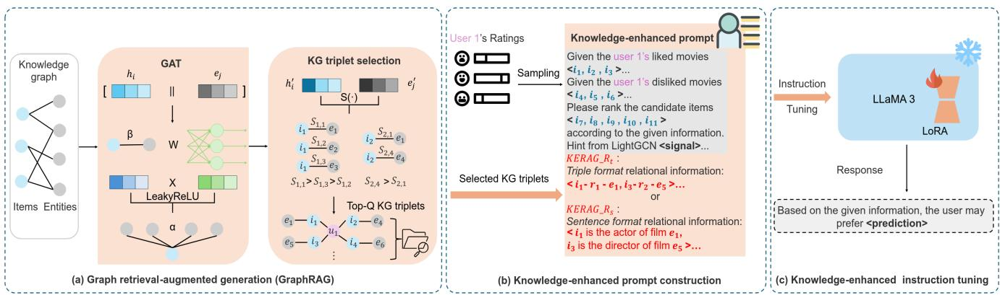
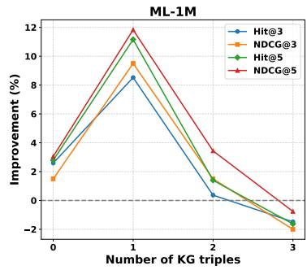
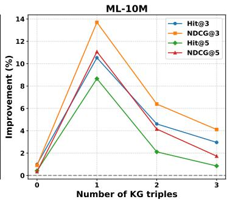
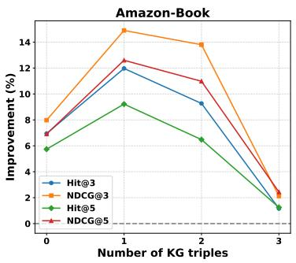

# KERAG\_R: Knowledge-Enhanced Retrieval-Augmented Generation for Recommendation

Zeyuan Meng University of Glasgow Glasgow, UK z.meng.2@research.gla.ac.uk

Zixuan Yi University of Glasgow Glasgow, UK z.yi.1@research.gla.ac.uk

Iadh Ounis University of Glasgow Glasgow, UK iadh.ounis@glasgow.gla.ac.uk

## Abstract

Large Language Models (LLMs) have notably enhanced perfor mance across various tasks, including in recommender systems, due to their strong capabilities for contextual learning and gener alisation. Existing LLM-based recommendation approaches typi cally formulate the recommendation task using specialised prompts designed to leverage their contextual abilities, and aligning their outputs closely with human preferences to yield an improved rec ommendation performance. However, the use of LLMs for recom mendation tasks is limited by the absence of domain-specific knowl edge. This lack of relevant relational knowledge about the items to be recommended in the LLM’s pre-training corpus can lead to inaccuracies or hallucinations, resulting in incorrect or mislead ing recommendations. Moreover, directly using information from the knowledge graph introduces redundant and noisy informa tion, which can afect the LLM’s reasoning process or exceed its input context length, thereby reducing the performance of LLM based recommendations. To address the lack of domain-specific knowledge, we propose a novel model called Knowledge-Enhanced Retrieval-Augmented Generation for Recommendation (KERAG\_R). Specifically, we leverage a graph retrieval-augmented generation (GraphRAG) component to integrate additional information from a knowledge graph (KG) into instructions, enabling the LLM to collab oratively exploit recommendation signals from both text-based user interactions and the knowledge graph to better estimate the users preferences in a recommendation context. In particular, we per form graph RAG by pre-training a graph attention network (GAT) to select the most relevant triple for the target users for the used LLM, thereby enhancing the LLM while reducing redundant and noisy information. Moreover, we leverage a knowledge-enhanced instruction tuning approach to incorporate relational knowledge during the LLM’s tuning stage, thereby enhancing the adaptation of the used LLM in recommender systems. Our extensive experiments on three public datasets show that our proposed KERAG\_R model significantly outperforms ten existing state-of-the-art recommenda tion methods. In particular, our KERAG\_R model outperforms the best baseline, namely RecRanker, an LLM-based recommendation model by up to 14.89% on the Amazon-Book dataset. We also find that using graph RAG to retrieve the most relevant KG information is more efective than using additional KG triples, and that rela tional KG triple representations outperform natural KG sentence representations in the prompts.

## CCS Concepts

• Information systems → Recommender systems.

Keywords Retrieval-Augmented Generation, Knowledge Graph, Large Language Model, Recommender System

ACM Reference Format: Zeyuan Meng, Zixuan Yi, and Iadh Ounis. 2024. KERAG\_R: Knowledge-Enhanced Retrieval-Augmented Generation for Recommendation. In Proceedings of x (x ’XX). ACM, New York, NY, USA, 10 pages. https://doi.org/ XXXXXXX.XXXXXXX

## 1 Introduction

Large Language Models (LLMs) [1, 54, 82] have demonstrated re markable capabilities in text understanding [41], generation [35], and reasoning [2]. Leveraging their strong generalisation ability, LLMs have been actively integrated into various domains, including recommender systems, to enhance personalisation and user experience [48, 83]. Recommender systems [14, 37, 56, 72, 75] is a widely used application, which aims to recommend potential items to the target users in various online services. In particular, LLMs have been incorporated into various recommendation tasks, including collaborative filtering and sequential recommendation [60, 66, 77]. Early LLM-based recommendation models encoded user features from historical interactions [50, 79], but often struggled to process the full interaction history within a single prompt due to the limited input token length of LLMs [13, 49]. To address this limitation, later LLM-based recommendation models proposed filtering the most rel evant textual information of items and users input to LLMs, thereby improving the recommendation performance [6, 57]. Despite these improvements, these enhanced approaches still use LLMs directly without specific fine-tuning for the recommendation tasks. This general application of LLMs without adaptation to the task at hand can misalign the models with their actual recommendation task, thereby limiting the performance of these models [50, 57]. Instead, more recent studies [39, 68, 69, 71, 77] have proposed using natural language instruction adaptation to better align the LLMs to specific recommendation tasks. RecRanker [39] is a typical example, which uses adaptive user sampling to construct representative prompts for instruction tuning to align the Llama-2 model [54] with the top-?? recommendation task at hand. Nevertheless, the existing LLM-based recommendation models still predominantly depend on the content of the user interactions and the LLM’s pre-training corpus, and might sufer from the absence of domain-specific knowl edge to support the recommendation task at hand. Although LLMs have excellent context representation abilities, the lack of relevant relational knowledge about the items to be recommended in the LLM’s pre-training corpus can cause these LLMs to “hallucinate” and thus produce incorrect or misleading recommendations. We argue that the adequate integration of external knowledge sources into the LLM-based recommendation models is important to en hance the LLMs’ ability to learn specific domain knowledge in a recommendation scenario.

Recently, Retrieval-augmented Generation (RAG) has been pro posed to alleviate the problem of LLM’s lack of domain-specific knowledge by querying external sources and incorporating rel evant factual knowledge into the generated responses [25, 44]. Some works [5, 17] used RAG to capture textual content and in formation in a text corpus to complement the LLMs with domain specific knowledge. However, these RAG-based methods typically rely on the input textual query to retrieve the textual information, ignoring the structural relational information between text con tents [34]. To bridge this gap, Graph Retrieval-Augmented Genera tion (GraphRAG) [8, 25] has been proposed to obtain relational infor mation from graphs. Unlike conventional RAG methods, GraphRAG incorporates graph learning into RAG, allowing to retrieve graph elements – such as nodes, triples, or subgraphs – that contain rela tional knowledge relevant to a given query from a pre-constructed graph database [44]. This GraphRAG method can leverage var ious types of graph data for retrieval and generation, including knowledge graphs [65]. Knowledge graphs (KGs) [16, 59], which are rich in item-related entity relational triples, provide domain specific knowledge that, we argue, could enhance the user/item representations in top-?? recommender systems. Building on the GraphRAG method, we propose a novel recommendation model named Knowledge-Enhanced Retrieval-Augmented Generation for efective Recommendation (KERAG\_R). Specifically, we leverage a GraphRAG component to integrate external knowledge from a KG into LLM prompts, enabling the used LLM (e.g., Llama 3.1) to learn domain-specific knowledge tailored for a top-?? recommen dation task, thereby improving the used LLM’s ability to capture context and infer user preferences. Moreover, to reduce the possible redundant and noisy relational information in the prompt, we incor porate a graph attention network (GAT)-based KG triple selection method into the GraphRAG component. This selection method se lects the knowledge graph triples that are most relevant to the user interactions, reducing noise and redundant information, thereby enhancing the recommendation performance of the LLM-based model. Additionally, we propose a knowledge-enhanced instruc tion tuning approach to further enable the LLM to to incorporate structured knowledge about item relations from the KG during the tuning stage.

Overall, the contributions of our work are summarised as follows: (1) Our new KERAG\_R model leverages a GraphRAG component to integrate external knowledge from a KG into LLM prompts, thereby enhancing LLM’s reasoning in the top−?? recommendation task. To reduce the introduction of redundant and noisy information from the KG, we use a KG triple selection method to select the most rele vant triple for the target users. To enhance the adaptation of LLMs in recommender systems, we incorporate relational knowledge through a knowledge-enhanced instruction tuning approach dur ing the LLM’s tuning stage; (2) We conduct extensive experiments on three public datasets to evaluate our proposed KERAG\_R model. We show that our KERAG\_R model significantly outperforms ten existing state-of-the-art recommendation models, in particular out performing the strongest baseline, RecRanker, across the three used public datasets; (3) We conduct an ablation study that confirms the efectiveness of KERAG\_R’s GraphRAG component as well as our KG triple selection method; (4) Moreover, we show that retrieving the most relevant triple for each interaction of each user performs better than using additional KG triples, and that relational KG triple representations outperform natural KG sentence representations in the prompts.

## 2 Related Work

In this section, we position our work and introduce two related works that are relevant to our work, namely LLM-based recommendation and retrieval-augmented generation.

## 2.1 LLM-based Recommendation

Recently, large language models (LLMs) have demonstrated strong reasoning capabilities and have found applications across various domains, including recommender systems [13, 43, 43, 52, 70, 71, 73, 74]. In the context of recommendation models, LLM applications typically employ either zero-shot or fine-tuned approaches. Zeroshot methods leverage the inherent capabilities of LLMs to handle recommendation tasks without any specific model training. These methods typically use prompts derived from user interaction data to guide the LLMs in predicting the users’ preferences. For exam ple, Sileo et al. [50] extracted user/item side information – such as movie titles – from textual descriptions to create prompts, and then used GPT-2[45] to predict potential items for the target users. However, zero-shot methods may face challenges due to a funda mental misalignment between the LLMs’ general capabilities and the specific demands of specific recommendation tasks, often requiring additional model adjustments. On the other hand, fine-tuned methods involve explicitly adapting the LLMs to specific recommendation tasks, and were generally shown to be more efective than zero-shot approaches [6, 30]. For instance, Zhang et al. [77] developed an instruction template designed to organise task inputs for the LLMs during the fine-tuning phase – typically this includes a task definition, an input context, and an output specification – efectively guiding the LLM to perform specific recommendation tasks. RecRanker [39] further enhanced this instruction format by incorporating adaptive user sampling to generate more efective prompts during the instruction tuning stage, in particular adapt ing the LLM for top-?? ranking tasks, such as a listwise ranking task [62]. However, these fine-tuned models still predominantly rely on user interaction data and the broad knowledge base of the LLM’s pre-training corpus, which may lack the domain-specific information necessary for accurate recommendations. This inherent limitation can also lead to errors such as the well-known “halluci nation” problem, where LLMs generate incorrect recommendations for the target users [28]. To address the absence of domain-specific knowledge, we propose a knowledge-enhanced instruction tuning approach that incorporates relational knowledge (i.e., item-entity triples) during the LLM’s tuning stage, thereby supporting the LLMs with additional knowledge to tackle specific recommendation tasks. To the best of our knowledge, we are the first to incorporate relational knowledge in instruction tuning for efective LLM-based recommendation models.

## 2.2 Retrieval-Augmented Generation

Recently, Retrieval-Augmented Generation (RAG) has demonstrated its ability to capture large corpora of text from external sources, incorporating domain-specific knowledge into the responses generated by the large language model, thereby enabling LLMs to produce more cohesive and contextually relevant responses [9, 12, 26, 44]. Indeed, RAG aims to capture textual content and information, which are contextually relevant to a given textual query [17, 25, 61]. For example, REALM [17] employed a RAG method to retrieve relevant documents for each input query from external sources, thereby improving their performance on the Open-QA task. However, these

RAG methods primarily rely on retrieving textual content based on query-text matching overlooking the underlying structural and relational information between textual contents. This oversight can result in the generation of inaccurate responses by the LLMs [34, 36]. To address this limitation, Graph Retrieval-Augmented Generation (GraphRAG) [8, 25] has been recently proposed to capture structural relational information between textual contents within the LLM’s prompts. Unlike conventional RAG, GraphRAG considers the interconnections among the key entities within the textual contents, thereby enhancing the quality of the generated responses by leveraging such structural relationships [42, 44]. For example, G-Retriever [22] introduced the first RAG method for textual graphs, which allows the LLM to be fine-tuned to enhance graph understanding in the OpenQA task. Therefore, we propose the use of the GraphRAG method with knowledge graphs to integrate LLMs with domain-specific knowledge in a top-?? recommendation scenario. To the best of our knowledge, we are the first to apply a GraphRAG method to LLM-based top-?? recommendation task. In addition, in order to reduce noise and redundant information that could be in troduced by the used KG, we leverage a pre-trained graph attention network (GAT) model to perform a KG triples selection method, which allows to obtain the most relevant triples for each of a given user interacted items.

## 3 Methodology

In this section, we start by introducing some preliminary back ground information (Section 3.1) as well as the notations we will be using in the remainder of the paper. Next, in Section 3.2, we describe our proposed $\mathrm { K E R A G \_ R }$ model and its model architecture (as illustrated in Figure 1). Sections 3.3 and 3.4 present our proposed GraphRAG method and the prompt construction approach for the top-?? recommendation task. Then, Section 3.5 presents our knowledge-enhanced instruction tuning method for top-?? rec ommendation. Finally, we analyse the eficiency of our model in Section 3.6.

## 3.1 Preliminaries

A vanilla instruction tuning process in recommendation systems typically involves three key steps: (i) instruction prompt construction, (ii) instruction tuning the LLM and (iii) top-?? ranking.

Instruction prompt construction: An instruction prompt for the top-?? recommendation task consists of user-item interactions, candidate items for the target user, the task description and the output specification. We define U and I to represent the users set and the items set, respectively: $\mathcal { U } = \{ u _ { 1 } , u _ { 2 } , . . . , u _ { M } \}$ and $\boldsymbol { \mathcal { T } } =$ $\{ i _ { 1 } , i _ { 2 } , . . . , i _ { N } \}$ . We also define the user-item interactions matrix as $\mathbf { Y } \in \mathbb { R } ^ { M \times N }$ , where ?? and ?? represent the number of users and items, respectively. In an LLM-based approach, we also need to interpret the recommendation task of user ?? into natural language using prompts to match the input requirements of the used LLM. Specifically, we obtain each sampled user’s likes and dislikes from their historical interactions based on high and low ratings, respectively. To construct the candidate item list $S _ { u } \subset I$ for each user $u \subset { \mathcal { U } } ,$ we follow RecRanker [39] for training and inference: during training, we combine liked and disliked items with non-interacted items gen erated via negative sampling [47, 67]; during inference, we adopt a traditional recommender, LightGCN, to retrieve the candidate set. Then, we express the user-item interactions information, along with the corresponding candidate item list, in natural language as the task description. Finally, we constrain the LLM’s output with an output specification within the instruction prompt to ensure the generation of the potential top-?? items for the target user.

Instruction tuning the LLM: After constructing the instruction prompts, we use $P r o m p t _ { u }$ as the input query to perform instruction tuning, efectively fine-tuning the used LLM (e.g., Llama 3) for a listwise ranking task with the cross-entropy loss [80]. This fine-tuning process updates the model’s parameters from the pretrained state ?? to the fine-tuned state $\theta ^ { \prime } { } _ { ; }$ , adapting the LLM to a top-?? recommendation scenario.

Top-?? ranking: The objective of the top-?? recommendation task is to estimate the users’ preferences through an LLM-based recommendation model $f _ { \theta } \left( \mathrm { e . g . } \right.$ , Llama-3), which recommends the top-?? items for the target user ??. After the instruction tuning of the LLM model, we obtain an updated LLM, $f _ { \theta ^ { \prime } }$ , specifically trained on a listwise ranking task, which has been shown to be a more efective method than using pairwise and pointwise ranking approaches [39]. We then input a prompt ?????????????? to this updated LLM to generate a list of top-?? items $ { s _ { u } ^ { \prime } }$ for each user ?? $\in { \mathcal { U } }$ , based on the candidate item list $s _ { u }$

## 3.2 Model Overview

Figure 1 illustrates the architecture of our proposed KERAG\_R model, which involves three major components: Graph Retrieval Augmented Generation (GraphRAG), knowledge-enhanced prompt construction and knowledge-enhanced instruction tuning. These components are executed sequentially, as illustrated in Figure 1 (a), (b), and (c), respectively.

Graph retrieval-augmented generation: The GraphRAG component (as illustrated in Figure 1 (a)) first retrieves the top-?? relevant entities for each item to construct the instruction prompt (as illustrated in Figure 1 (b)). Specifically, we use a Graph Attention Network (GAT) to pre-train the item/entity embeddings of the KG. Using these item/entity embeddings, we compute dot product similarity scores to rank candidate entities and select the most relevant triples for each of the user’s interacted items.

Knowledge-enhanced prompt construction: As shown in Figure 1 (b), after identifying the most relevant triples for each of the user’s interacted items using the GraphRAG component, we incorporate these selected triples into the instruction prompt, as well as the user’s like and dislike item lists, and a primary ranking list from a recommender (i.e., LightGCN).

Knowledge-enhanced instruction tuning: We then use the constructed instruction prompt, which incorporates item-entity triples from the GraphRAG component as relational knowledge, to finetune the used LLM for the top-?? recommendation task, as illustrated in Figure 1 (c). Specifically, we use Llama-3.1-8B-Instruct [7] as the backbone model because of its efectiveness in various tasks [11, 38]. For the fine-tuning process, we employ the parametereficient tuning method, LoRA [23] to optimise Llama-3 for this proposed knowledge-enhanced instruction tuning. Once fine-tuned with the selected triples, we obtain an instruction-tuned LLM that generates a listwise set of items for the target user.

## 3.3 GraphRAG for LLM-based Recommendation

As discussed in Section 2.2, we aim to retrieve the most relevant KG triples for each item and integrate them into the LLM to mitigate the absence of domain-specific knowledge. To achieve this, we begin by pre-training the item/entity embeddings using a GAT model for later retrieval. Subsequently, we retrieve the top-?? relevant triples for each item by comparing the dot product similarities between the updated items and the entities embeddings through the KG triple selection method

  
Figure 1: The architecture of our proposed KERAG\_R model with three parts: (a) Graph retrieval-augmented generation (GraphRAG), (b) Knowledge-enhanced prompt construction and (c) Knowledge-enhanced instruction tuning.

3.3.1 GAT Pre-training for Triple Retrieval. As described in Section 3.2 , we aim to leverage a GAT [55] model to retrieve the top-?? relevant triples for the target user’s interactions. Initially, we input triple data from the knowledge graph $\mathcal { G } _ { k } = \{ ( h , r , t ) \}$ , where ℎ, ?? , and ?? denote the head item, relation, and tail entity, respectively. We map items and entities to unique indices and initialise the embed ding matrix using the Xavier initialiser. Subsequently, we perform a graph aggregation operation by adaptively assigning weights to neighbour entities ?? for each item ?? through a self-attention mechanism as follows:

$$
\alpha_ {i j} = \frac {\exp (\text {LeakyReLU} (\beta^ {\top} [ W h _ {i} \| W e _ {j} ]))}{\sum_ {k \in \mathcal {N} (i)} \exp (\text {LeakyReLU} (\beta^ {\top} [ W h _ {i} \| W e _ {k} ]))},\tag{1}
$$

$$
h _ {i} ^ {\prime} = \sum_ {j \in \mathcal {N} (i)} \alpha_ {i j} W e _ {j},\tag{2}
$$

where $h _ { i }$ and $e _ { j }$ represent the item and entity embeddings, ?? is a learnable weight matrix, $k \in N ( i )$ represents the set of neighbours of item node ?? and $h _ { i } ^ { \prime }$ is the updated item embedding. || represents the vector concatenation operation, $\beta \in  { \mathbb { R } } ^ { 2 d }$ is a learnable atten tion weight vector that computes the attention weights and ?? is the embedding dimension. As such, this graph aggregation operation enables more enriched and context-aware entity embeddings from relevant neighbouring items. Moreover, we use a contrastive loss to optimise the GAT pre-training process [18]. Specifically, we select the triples that exist in the KG as the positive pairs $( h _ { i } , e _ { k } )$ , while the triples that do not exist in the KG are considered as negative pairs $( h _ { i } , e _ { j } )$

$$
\mathcal {L} = \frac {1}{N} \sum_ {(i, j) \in E} \max (0, \phi (h _ {i}, e _ {k}) - \phi (h _ {i}, e _ {j})),\tag{3}
$$

where $\phi ( \cdot )$ denotes the inner products to determine the similarity between the positive and negative pairs, and ?? is the set of all posi tive samples. As such, we can leverage this well-trained GAT model to generate efective item/entity embeddings for the subsequent triple selection.

Table 1: Illustrative examples of instruction for ranking task.

<table><tr><td>Variant</td><td>Instruction</td></tr><tr><td>Original</td><td>The historical interactions of a user include:.How would the user rank the?</td></tr><tr><td>KERAG_Rt</td><td>You are a movie recommender system. Your task is to rank a given list of candidate movies based on user preferences and return the top five recommendations.User&#x27;s Liked movies:.User&#x27;s Disliked movies:.Question: How would the user rank the candidate item list:?Hint 1: Another recommender model suggests.Hint 2: These are corresponding entities and relationships for above model&#x27;s recommendation for more context information:.</td></tr><tr><td>KERAG_RS</td><td>You are a movie recommender system. Your task is to rank a given list of candidate movies based on user preferences and return the top five recommendations.User&#x27;s Liked movies:.User&#x27;s Disliked movies:.Question: How would the user rank the candidate item list:?Hint 1: Another recommender model suggests.Hint 2: These are corresponding entities and relationships for above model&#x27;s recommendation for more context information:.</td></tr></table>

3.3.2 Knowledge Graph Triple Selection. Our next step is to select the triples from the knowledge graph (KG) that are most relevant to the item. This selection is based on the embeddings of the items and entities and the attention weights derived from the GAT. Specifically, we calculate the dot product similarity between the item and entity embeddings, which is then refined by applying the attention weights as follows:

$$
S _ {i j} = \alpha_ {i j} (h _ {i} ^ {\prime} \cdot e _ {j}),\tag{4}
$$

Based on the computed similarity scores, we select the top-?? entities for each item to obtain the final triples set:

$$
T _ {i} = \operatorname{Top} - Q (S _ {i j}), \quad e _ {j} \in \mathcal {N} (i),\tag{5}
$$

where $T _ { i }$ represents the Q highest-scoring entities associated with each item. As such, we retrieve the top-?? related triples for each item by similarity calculation, thereby alleviating the noise and redundant information in KG

## 3.4 Knowledge-Enhanced Prompt Construction

3.4.1 User Sampling and Candidate Items Selection. As mentioned in the Introduction section, the input token length of LLMs prevents directly inputting a large number of user interactions and a complete set of candidate items. Therefore, our aim is to obtain representative users through selective user sampling and to streamline the candidate item set to meet the input constraints of an LLM.

We follow the same methods as [39] to perform user sampling and candidate item selection. Specifically, for user sampling, we first prioritise sampling from users with more interactions, which provide more reliable and consistent data. Next, we cluster user embeddings using the K-Means [20] clustering algorithm and sam ple proportionally from each cluster, thereby preventing certain user groups from being over-concentrated obtaining representative users from diferent clusters. Finally, we perform probability decay [40] for users selected by clustering-based sampling to reduce their repeated sampling rate.

3.4.2 Instruction Prompt Construction. Once we obtain the sam pled users, we can combine them with the previously retrieved top-?? KG triples set from the GraphRAG component to construct prompts. Table 1 shows an illustrative listwise and two variants prompts (KERAG ${ \bf \underline { { R } } } _ { t }$ and KERAG ${ \bf \underline { { R } } } _ { s } )$ that we designed. In general, we construct the knowledge-enhanced prompt with the following parts: the top-?? task description, the user’s historical interactions, the task objective, rankings from another recommendation model, and the KG information. Specifically, as shown in Figure 1 (a), we retrieve the top-?? triples with the higher similarity scores from the GraphRAG for the user’s interacted items and candidate items, and integrate these triples into our prompt. Furthermore, in order to integrate collaborative signals from traditional recommendation models into the LLM for top-?? recommendation, we use Light GCN [21], which efectively captures collaborative signals while maintaining computational eficiency, to predict users’ preferences , and then convert these predictions into natural language descrip tions and integrate them into prompts as a hint. As shown in Figure 1 (b), to determine the best representation format for integrating KG triples in the instruction prompt, we design two types knowledge enhanced prompts with relational knowledge between items and entities : the first type of prompt incorporates the KG information obtained by knowledge-enhanced GraphRAG into the prompt in the format of triples, represented as "item text - relation text - entity text" (e.g., Cameron - director\_film - The Terminator). As for the second variant prompt, we incorporate the KG information in the format of natural language sentences (e.g., Cameron is the director of The Terminator). As such, we construct knowledge-enhanced prompts with relational information and use them for subsequent instruction tuning (see Figure 1 (c)).

## 3.5 Knowledge-Enhanced Instruction Tuning

As discussed in Section 2.1, instruction tuning enables LLMs to better capture and follow task-specific instructions, enhancing their adaptability and performance across diverse downstream applica tions [53, 78]. In this paper, we adopt a lightweight tuning method - LoRA [23] - to eficiently tune large language models (LLMs) with three parameters while maintaining efectiveness. The core premise of this lightweight tuning method is that current LLMs have an excessive number of parameters, with information concentrated in a lower intrinsic dimensionality [3, 82]. To eficiently adapt the Llama-3.1-8B-Instruct [7] , we apply LoRA to introduce low-rank matrices to constrain the weight updates, significantly reducing computational overhead while preserving the model’s efectiveness. In general, our objective is to fine-tune the Llama-3.1-8B-Instruct [7] using instruction tuning by minimising the cross entropy loss:

$$
\mathcal {L} = \min _ {\Theta} \sum_ {(x, y) \in \mathcal {D} _ {t r a i n}} \sum_ {t = 1} ^ {| y |} - \log P _ {\Theta} \left(y _ {t} \mid x, y _ {[ 1: t - 1 ]}\right),\tag{6}
$$

where Θ represents the parameters of the LLM, $\mathcal { D } _ { t r a i n }$ is the training data, |??| is the length of the target sequence ??, and $P _ { \Theta }$ represents the probability of generating the ??-th token ???? in the target output ??, given the input ?? and the previous token ??. We minimise this loss function to fine-tune the LLM parameters $\Theta ,$ enabling the LLM to capture user preferences expressed and structured relational knowledge in natural language. This training efectively adapts the LLM to the recommendation system task. As such, the instruction-tuned LLM obtained through this process allows to incorporate domainspecific knowledge into the recommendation task, enabling the generation of recommendations that are more contextually aware and better aligned with the users’ preferences, thereby improving the recommendation performance.

## 3.6 Eficiency Analysis

We analyse the eficiency of our KERAG\_R model by reporting the training time, inference time, and model size of its key components: GraphRAG and knowledge-enhanced instruction tuning. For knowledge-enhanced instruction tuning, we train Llama-3.1 (8B) on 1,000 instructions using a single A6000 GPU, which takes approximately 74 hours. The average inference time per instruction is around 6.2 seconds. In comparison, RecRanker takes approximately 68 hours to train 1,000 instructions and about 4.2 seconds per instruction for inference on the same hardware. This demonstrates that our model maintains comparable compute usage. Our backbone LLM (Llama-3.1) contains 8 billion parameters, while the additional GAT model used in GraphRAG introduces only 0.68 million trainable parameters, making its contribution to the total model size marginal in comparison. Thus, the overall computational cost remains dominated by the LLM. In summary, KERAG\_R maintains comparable training and inference eficiency to RecRanker while incorporating a lightweight GAT-based retrieval module that only requires marginal additional parameters.

## 4 Experiments

We conduct experiments on three datasets to evaluate the performance of our KERAG\_R model. We compare with several diferent groups of models, addressing three research questions:

RQ1: How does KERAG\_R perform compared to existing state-ofthe-art recommendation models?

RQ2: How do the main components (LLM, GraphRAG, KG triple selection and knowledge-enhanced instruction tuning) of KERAG\_R afect the recommendation performance?

RQ3: How does the selection of diferent numbers of KG triples afect KERAG\_R’s performance?

## 4.1 Experimental Settings

4.1.1 Datasets. Following [3, 39], we conduct experiments to evaluate our KERAG\_R model on three public and widely-used datasets, namely MovieLens-1M (ML-1M)1, MovieLens-10m (ML-10M)2 and Amazon-book3. The MovieLens dataset is used as a standard bench mark for movie recommendation, and includes users’ ratings of movies. We use two datasets from MovieLens [19]: MovieLens-1M (ML-1M), which contains about 1,000,000 user ratings of movie items, and ML-10M (ML-10M), which is expanded to more than 10,000,000 ratings. As for the Amazon-book dataset, it contains user ratings from 1 to 5 and is often used for book recommendation tasks. For these three datasets, we follow the same settings as [39], where we remove users and items with less than 10 interactions in the historical interaction information in order to improve the quality of the dataset. The statistics of the datasets, which are also widely used for KG-based recommendations, are shown in Table 2. For these three datasets, we map all items to the Freebase entities via title matching to obtain the corresponding knowledge graphs [4, 81].

Table 2: Statistics of the used datasets.

<table><tr><td></td><td>ML-1M</td><td>ML-10M</td><td>Amazon-book</td></tr><tr><td>Users</td><td>6,040</td><td>71,567</td><td>28,104</td></tr><tr><td>Items</td><td>3,952</td><td>10,681</td><td>24,903</td></tr><tr><td>Interactions</td><td>1,000,209</td><td>10,000,054</td><td>582,321</td></tr><tr><td>Interaction density(%)</td><td>0.0419</td><td>0.0131</td><td>0.0008</td></tr><tr><td>Entities</td><td>31,380</td><td>32,754</td><td>23,780</td></tr><tr><td>Relations</td><td>31</td><td>31</td><td>10</td></tr><tr><td>Triples</td><td>70,444</td><td>133,245</td><td>102,149</td></tr></table>

4.1.2 Data Preprocessing. We evaluate all models using a leaveone-out strategy [24, 39], partitioning the dataset consistently with previous studies. This strategy typically splits the dataset based on timestamps: for each user, the most recent interaction is considered as the test instance, the second most recent interaction is used for validation, and all prior interactions form the training set. In this work, following RecRanker [39], we sample 1,000 user interactions as instructions from each dataset to fine-tune the LLM. During the instruction tuning process, we also follow [39] to construct a candidate list by randomly selecting three highest-rated items, two second-highest-rated items, and five unrated items, and then we select the top five highest-rated items as ground truth. The preprocessing scripts we use are given in the provided anonymous repository linked in the abstract.

4.1.3 Evaluation Protocol and Implementation Details. Following previous studies [3, 39], we use two representative metrics, namely Hit Ratio (HR) and Normalized Discounted Cumulative Gain (NDCG), to evaluate the efectiveness of our KERAG\_R model in comparison to the baselines. Existing LLM-based models [39, 77] typically set ?? , the number of candidate items used in top-?? evaluation metrics, to 3 and 5 due to the input token length limitations of LLMs. Following this approach, we use the same settings in our experiments. We choose Llama-3.1-8B-Instruct [7] for experiments because of its strong performance among open source models. Indeed, we also experimented with several open-source LLMs such as Llama-2 (7B) and Llama-2 (13B) [54], but Llama-3.1-8B-Instruct was consistently the most efective. For the GAT pre-training, we set the input em bedding dimension to 16, batch size and chunk size to 10 and 50 respectively. During the training phase of Llama-3.1(8B), we uniformly adopt a learning rate of 2e-5 and a context length of 2048. We train in epochs and implement a cosine scheduler, integrating a preliminary warm-up phase of 50 steps. We use LoRA [23] to eficiently train these models. For the rank size ?? and scaling factor alpha of LoRA, we vary this value within {8, 16, 32, 64}. In the inference phase, we follow [39] to use the vLLM [33] framework, setting the temperature parameter to 0.1, top-?? sampling to 40, and nucleus sampling to 0.1. We optimise our KERAG\_R model and baselines using the Adam optimiser[31], and initialise the embeddings with Xavier initialisation [15].

## 4.1.4 Baselines: We compare our KERAG\_R model with four different groups of existing baselines:

(1) Collaborative filtering recommendation models: MF [32] is the first model to decompose the user-item interaction matrix into two lower-dimensional matrices to capture hidden features that drive user preferences and item characteristics; LightGCN [21] simpli fies the convolution operations for the information propagation between users and items by removing nonlinear activations and transformation matrices, resulting in an improved efectiveness; MixGCF [27] generates synthetic negative samples by aggregating embeddings from diferent layers in the neighbourhood of the original negative samples, efectively extracting negative signals from implicit feedback.

(2) Sequential Recommendation Models: SASRec [29] leverages a masked multi-head attention mechanism to model the users’ sequential interactions; BERT4Rec [51] BERT4Rec is the first to use deep bidirectional self-attention to capture the sequential information of user interactions; CL4SRec [63] obtains self-supervisory signals from the original user behaviour sequences. Diferent from SASRec and BERT4Rec, CL4SRec uses three data augmentation methods to enhance the users’ representations.

(3) Knowledge Graph Recommendation Models: CKE [76] uses a heterogeneous network embedding approach, extracting structural representations of items by considering the heterogeneity of nodes and relations, thereby improving the learning of user preferences; KGAT [58] distinguishes itself from CKE by emphasising the importance of neighbouring nodes in the knowledge graph through an attention mechanism and enriches item representation learning by aggregating information from adjacent nodes to the item.

(4) LLM-based Recommendation Model: P5 [13] is a T5-based [46] encoder–decoder generative model that unifies various recommendation tasks into a single LLM framework. We adopt OpenP5 [64], the open-source implementation of P5, and use the variant designed for the top-?? recommendation task as our baseline; RecRanker [39] uses adaptive user sampling to construct prompts and leverages an instruction-tuned LLM to perform recommendations by combining three types of ranking tasks in top-?? recommendation.

We omit the comparison with other LLM-based recommendation models such as TALLRec [3], InstructRec [77], and LLMRec [60] due to significant diferences in task settings, availability, or the lack of open-source implementations. Specifically, TALLRec models the sequence of user interactions using the Llama-7B as its backbone in a sequential recommendation setting, which difers from our top-?? recommendation task. InstructRec relies on a closed-source GPT model that does not support instruction tuning, making it incompatible with our experimental setup that requires full access for model adaptation. LLMRec lacks publicly available implementation details and key preprocessing scripts, preventing full replication of its pipeline.

Table 3: Performance comparison results between two variants of KERAG\_R and other baselines on three datasets. The best result is bolded and the second best result is underlined. The superscript ∗ indicates that the results are significantly diferent from the KERAG $\mathbf { \Delta } _ { - } \mathbf { R } _ { t }$ results using the Holm-Bonferroni corrected paired t-test with p-value<0.05.

<table><tr><td>Dataset</td><td colspan="4">ML-1M</td><td colspan="4">ML-10M</td><td colspan="4">Amazon-Book</td></tr><tr><td>Methods</td><td>HR@3</td><td>NDCG@3</td><td>HR@5</td><td>NDCG@5</td><td>HR@3</td><td>NDCG@3</td><td>HR@5</td><td>NDCG@5</td><td>HR@3</td><td>NDCG@3</td><td>HR@5</td><td>NDCG@5</td></tr><tr><td>MF</td><td>0.0224*</td><td>0.0163*</td><td>0.0363*</td><td>0.0220*</td><td>0.0273*</td><td>0.0199*</td><td>0.0420*</td><td>0.0259*</td><td>0.0189*</td><td>0.0136*</td><td>0.0296*</td><td>0.0180*</td></tr><tr><td>LightGCN</td><td>0.0250*</td><td>0.0182*</td><td>0.0413*</td><td>0.0251*</td><td>0.0285*</td><td>0.0205*</td><td>0.0459*</td><td>0.0281*</td><td>0.0222*</td><td>0.0161*</td><td>0.0330*</td><td>0.0205*</td></tr><tr><td>MixGCF</td><td>0.0184*</td><td>0.0130*</td><td>0.0274*</td><td>0.0166*</td><td>0.0221*</td><td>0.0155*</td><td>0.0413*</td><td>0.0193*</td><td>0.0151*</td><td>0.0104*</td><td>0.0208*</td><td>0.0149*</td></tr><tr><td>SASRec</td><td>0.0139*</td><td>0.0095*</td><td>0.0219*</td><td>0.0127*</td><td>0.0233*</td><td>0.0150*</td><td>0.0386*</td><td>0.0213*</td><td>0.0112*</td><td>0.0064*</td><td>0.0191*</td><td>0.0096*</td></tr><tr><td>BERT4Rec</td><td>0.0096*</td><td>0.0065*</td><td>0.0174*</td><td>0.0098*</td><td>0.0104*</td><td>0.0072*</td><td>0.0172*</td><td>0.0100*</td><td>0.0101*</td><td>0.0065*</td><td>0.0192*</td><td>0.0103*</td></tr><tr><td>CL4SRec</td><td>0.0129*</td><td>0.0089*</td><td>0.0192*</td><td>0.0115*</td><td>0.0229*</td><td>0.0149*</td><td>0.0382*</td><td>0.0211*</td><td>0.0093*</td><td>0.0054*</td><td>0.0175*</td><td>0.0087*</td></tr><tr><td>CKE</td><td>0.0267*</td><td>0.0194*</td><td>0.0378*</td><td>0.0239*</td><td>0.0288*</td><td>0.0209*</td><td>0.0455*</td><td>0.0277*</td><td>0.0231*</td><td>0.0169*</td><td>0.0351*</td><td>0.0218*</td></tr><tr><td>KGAT</td><td>0.0265*</td><td>0.0194*</td><td>0.0404*</td><td>0.0250*</td><td>0.0289*</td><td>0.0208*</td><td>0.0460*</td><td>0.0281*</td><td>0.0240*</td><td>0.0173*</td><td>0.0362*</td><td>0.0223*</td></tr><tr><td>P5</td><td>0.0194*</td><td>0.0145*</td><td>0.0303*</td><td>0.0190*</td><td>0.0273*</td><td>0.0190*</td><td>0.0470*</td><td>0.0270*</td><td>0.0020*</td><td>0.0038*</td><td>0.0015*</td><td>0.0023*</td></tr><tr><td>RecRanker</td><td>0.0270*</td><td>0.0200*</td><td>0.0430*</td><td>0.0262*</td><td>0.0304*</td><td>0.0219*</td><td>0.0473*</td><td>0.0289*</td><td>0.0259*</td><td>0.0188*</td><td>0.0401*</td><td>0.0246*</td></tr><tr><td>KERAG $_{Rs}$ </td><td>0.0287*</td><td>0.0210*</td><td>0.0469*</td><td>0.0284*</td><td>0.0324*</td><td>0.0240*</td><td>0.0492*</td><td>0.0309*</td><td>0.0283*</td><td>0.0210*</td><td>0.0430*</td><td>0.0269*</td></tr><tr><td>KERAG $_{Rt}$ </td><td>0.0293</td><td>0.0219</td><td>0.0478</td><td>0.0293</td><td>0.0336</td><td>0.0249</td><td>0.0514</td><td>0.0321</td><td>0.0290</td><td>0.0216</td><td>0.0438</td><td>0.0277</td></tr><tr><td>Improve%</td><td>+8.52%</td><td>+9.50%</td><td>+11.16%</td><td>+11.83%</td><td>+10.53%</td><td>+13.70%</td><td>+8.67%</td><td>+11.07%</td><td>+11.97%</td><td>+14.89%</td><td>+7.23%</td><td>+9.35%</td></tr></table>

## 4.2 Performance Comparison (RQ1)

Table 3 reports the results of comparing our two KERAG\_R variants (KERAG $\mathbf { R } _ { t } , \mathrm { K E R A G \_ R } _ { s } )$ with all the baselines described in Sec tion 4.1.4. We evaluate KER $\mathrm { A G } \_ { \mathrm { R } _ { t } }$ and $\mathrm { K E R A G \_ R } _ { s }$ in comparison to four distinct recommendation approaches: collaborative filtering models (MF, LightGCN, MixGCF), sequential models (SASRec, BERT4Rec, CL4SRec), KG models (CKE, KGAT) and LLM-based models (P5, RecRanker). Recall that KERAG ${ \bf \underline { { R } } } _ { t }$ incorporates relational information into the instruction prompt using a triple representation, while KERAG ${ \bf R } _ { s }$ uses a sentence representation. In Table 3, the best and second-best performances are indicated in bold and underlined, respectively. From the results in Table 3, we observe the following:

• For all three datasets, we observe that both the KERAG ${ \bf \underline { { R } } } _ { t }$ and KERAG ${ \bf R } _ { s }$ variants significantly outperform all groups of baselines on both used metrics as confirmed by a paired t-test with the Holm-Bonferroni correction. The improvements can be attributed to the integration of the GraphRAG component and the knowledge-enhanced instruction tuning method, which incorpo rate domain-specific knowledge from the KG into LLM prompts. Notably, our KERAG\_R variants also outperform the strongest LLM-based baseline, RecRanker, on all used datasets by a large margin. This result indicates that incorporating relational knowl edge (i.e., item-entity triples) during the instruction tuning stage can improve the efectiveness of the LLM-based recommendation.

• By comparing the KERAG ${ \bf \underline { { R } } } _ { t }$ and KERAG ${ \bf R } _ { s }$ variants, we observe from Table 3 that KERAG ${ \bf \delta } _ { - } \mathrm { R } _ { t }$ outperforms KERAG ${ \bf R } _ { s }$ in all instances. These results indicate that presenting relational information in the format of triples is more efective than using the natural language sentences. The advantage of triples lies in their conciseness and the reduced presence of non-relevant in formation, which enriches the context provided for the users’ interacted items, hence allowing the used LLM to more efectively estimate the user preferences. A recent study [10] also made a similar observation on a diferent task, namely that KG triples provide more accurate relational knowledge than sentences in question-answering tasks.

• Table 3 also shows that the KG models (CKE, KGAT) and the LLM model (RecRanker) are generally more efective than the collaborative filtering models (MF, LightGCN, MixGCF) and the sequential models (SASRec, BERT4Rec, CL4SRec). This result indicates that it is beneficial to introduce additional knowledge (i.e., a KG) to enrich the user/item representations in the top-?? recommendation task.

In answer to RQ1, we conclude that both our KERAG\_R variants successfully leverage GraphRAG and knowledge-enhanced instruction tuning to enhance the recommendation performance and outperform all the existing strong baselines.

## 4.3 Ablation Study (RQ2)

In this section, we ablate each of the key components of our proposed KERAG\_R model by introducing four variants, namely (i) ??/?? − ????????ℎ?????? (ii) ??/?? − ?????????????????????? (iii) ??/?? − ?????????????????? and (iv) ??/?? − ??????????3. In particular, ??/?? − ????????ℎ?????? is a variant that removes the GraphRAG component; ??/??−?????????????????????? is a variant that removes the knowledge-enhanced instruction tuning component; ??/?? − ?????????????????? is a variant that replaces the use of the knowledgeenhanced triple selection method with a random selection of triples from the KG; ??/?? − ??????????3 is a variant that replaces the used LLM, Llama-3.1-8B-Instruct, with Llama-2 (7B) [54]. We compare these variants to our KERAG\_R?? variant due to its promising efectiveness, as observed in Table 3. Note that the same conclusions are drawn with the KERAG ${ \bf R } _ { s }$ variant.

• To explore the impact of GraphRAG in our KERAG\_R model, we remove the GraphRAG component and maintain the original instruction tuning for the top-?? recommendation task. We observe from Table 4 that the ??/?? − ????????ℎ?????? variant underperforms KERAG\_ ${ \mathrm { R } } _ { t }$ on all three datasets. This result indicates the importance of incorporating domain-specific knowledge in the instruction prompt to efectively guide the used LLM in estimating the users’ potential interactions.

• As discussed in Section 3.3.2, we aim to investigate the efectiveness of our triple selection method for GraphRAG. We substitute the top-Q selection method with a random selection for each user’s interacted items. Table 4 shows that KERAG ${ \bf \underline { { R } } } _ { t }$ outperforms ??/?? − ?????????????????? across all used datasets by a large margin. This superior performance demonstrates the suitability of selecting the most relevant triples for each target user’s interacted items, thereby enhancing the LLM’s reasoning ability in the top-?? recommendation scenario.

Table 4: Results of the ablation study. The ∗ indicates that the result is significantly diferent from KERAG $\underline { { \mathbf { R } } } _ { t }$ using the Holm-Bonferroni corrected paired t-test with p-value<0.05.

<table><tr><td>Dataset</td><td colspan="4">ML-1M</td><td colspan="4">ML-10M</td><td colspan="4">Amazon-Book</td></tr><tr><td>Methods</td><td>HR@3</td><td>NDCG@3</td><td>HR@5</td><td>NDCG@5</td><td>HR@3</td><td>NDCG@3</td><td>HR@5</td><td>NDCG@5</td><td>HR@3</td><td>NDCG@3</td><td>HR@5</td><td>NDCG@5</td></tr><tr><td>w/o - Llama3</td><td>0.0238*</td><td>0.0171*</td><td>0.0421*</td><td>0.0245*</td><td>0.0271*</td><td>0.0194*</td><td>0.0434*</td><td>0.0261*</td><td>0.0242*</td><td>0.0175*</td><td>0.0393*</td><td>0.0240*</td></tr><tr><td>w/o - graphrag</td><td>0.0277*</td><td>0.0203*</td><td>0.0442*</td><td>0.0270*</td><td>0.0307*</td><td>0.0221*</td><td>0.0475*</td><td>0.0290*</td><td>0.0277*</td><td>0.0203*</td><td>0.0424*</td><td>0.0263*</td></tr><tr><td>w/o - instruction</td><td>0.0282*</td><td>0.0205*</td><td>0.0436*</td><td>0.0267*</td><td>0.0309*</td><td>0.0225*</td><td>0.0476*</td><td>0.0294*</td><td>0.0280*</td><td>0.0210*</td><td>0.0429*</td><td>0.0266*</td></tr><tr><td>w/o - selection</td><td>0.0286*</td><td>0.0207*</td><td>0.0455*</td><td>0.0280*</td><td>0.0320*</td><td>0.0232*</td><td>0.0491*</td><td>0.0306*</td><td>0.0286*</td><td>0.0214*</td><td>0.0430*</td><td>0.0269*</td></tr><tr><td>KERAG_Rt</td><td>0.0293</td><td>0.0219</td><td>0.0478</td><td>0.0293</td><td>0.0336</td><td>0.0249</td><td>0.0514</td><td>0.0321</td><td>0.0290</td><td>0.0216</td><td>0.0438</td><td>0.0277</td></tr></table>

  
Figure 2: Performance of our KERAG\_R model with respect to diferent numbers of triples.

• To investigate the efectiveness of our knowledge-enhanced instruction tuning component, we remove this component and use Llama-3 in a zero-shot configuration for the top-?? recommendation task. As shown in Table 4, we observe that the $w / o \mathrm { ~ - ~ }$ ?????????????????????? variant underperforms $\mathrm { K E R A G \_ R } _ { t } .$ . This result indicates the importance of instruction tuning in guiding the LLM using additional knowledge, thereby enhancing the LLM’s adapt ability to the recommendation scenario at hand.

• To investigate the usefulness of the used LLM, Llama-3, we conduct a comparative analysis by replacing the Llama-3 model with Llama-2 as the used LLM. From Table 4, we observe that KERAG ${ \bf \underline { { R } } } _ { t }$ significantly outperforms ??/?? − ??????????3 across all datasets. This finding confirms the efectiveness of an instruction tuned Llama-3 in facilitating reasoning within the top-?? recom mendation task.

Overall, in response to RQ2, we conclude that our KERAG\_R model successfully leverages each of its components to provide an efective LLM-based approach for an enhanced top-?? recommendation.

## 4.4 Impact of the Number of Retrieved KG Triples (RQ3)

We now examine the impact of the number of retrieved KG triples on the performance of our KERAG\_R model within the proposed GraphRAG component. For brevity, we report the results of the KERAG ${ \bf \underline { { R } } } _ { t }$ variant since we observe similar conclusions on the KER $\mathsf { A G } \_ \mathrm { R } _ { s }$ variant. As mentioned in Section 3.3.2, we use a GAT model to retrieve the top-Q triples for each item. We conduct this analysis by varying the number of triples retrieved for each of the user’s interacted items in a range of {0, 1, 2, 3}. In our initial ex periments, we noted that retrieving more than four triples results in out-of-memory errors on a single GPU due to longer input sequences. Figure 2 shows that our KERAG\_R model consistently achieves its peak performance when retrieving one triple across all three datasets. In particular, we observe performance decreases when adding additional triples for each item. These results sug gest that a single triple provides suficient relational knowledge to efectively enhance the LLM’s reasoning capabilities for the top-?? recommendation task. In contrast, integrating more triples in GraphRAG might lead to noise and redundancy that could detract the LLM’s decision-making process.

In response to RQ3, we conclude that a single triple per userinteracted item is suficiently efective. Conversely, additional triples can hinder the LLM’s reasoning process in top-?? recommendation.

## 5 Conclusions

We proposed a novel recommendation model called Knowledge-Enhanced Retrieval-Augmented Generation for Recommendation (KERAG\_R) to address the absence of domain-specific knowledge in the existing LLM-based recommendation models for top-?? recommendation. Specifically, KERAG\_R included a novel GraphRAG component and a knowledge-enhanced instruction tuning method to integrate external knowledge from a knowledge graph (KG) into the LLM (i.e., Llama-3) prompts, thereby enhancing the LLM’s reasoning in the top-?? recommendation task. Our extensive experiments on three datasets showed that our KERAG\_R model significantly outperformed ten strong recommendation baselines, including the existing state-of-the-art LLM-based model, RecRanker. In addition, our ablation study showed the positive impact of each component of our KERAG\_R model on the recommendation performance. We also conducted a study to determine the best number of triples for each user’s interacted item within the used LLM’s input token length. In particular, we found that retrieving the most relevant KG information is more efective than using additional KG triples, and that relational KG triple representations outperform natural KG sentence representations in the prompts.

## References

[1] Josh Achiam, Steven Adler, Sandhini Agarwal, Lama Ahmad, Ilge Akkaya, Floren cia Leoni Aleman, Diogo Almeida, Janko Altenschmidt, Sam Altman, Shyamal Anadkat, et al. 2023. Gpt-4 technical report. arXiv preprint arXiv:2303.08774 (2023).

[2] Maryam Amirizaniani, Elias Martin, Maryna Sivachenko, Afra Mashhadi, and Chirag Shah. 2024. Can LLMs Reason Like Humans? Assessing Theory of Mind Reasoning in LLMs for Open-Ended Questions. In Proc. of CIKM.

[3] Keqin Bao, Jizhi Zhang, Yang Zhang, Wenjie Wang, Fuli Feng, and Xiangnan He. 2023. Tallrec: An efective and eficient tuning framework to align large language model with recommendation. In Proc. of RecSys.

[4] Kurt Bollacker, Colin Evans, Praveen Paritosh, Tim Sturge, and Jamie Taylor. 2008. Freebase: a collaboratively created graph database for structuring human knowledge. In Proc. of SIGMOD.

[5] Sebastian Borgeaud, Arthur Mensch, Jordan Hofmann, Trevor Cai, Eliza Ruther ford, Katie Millican, George Bm Van Den Driessche, Jean-Baptiste Lespiau, Bog dan Damoc, Aidan Clark, et al. 2022. Improving language models by retrieving from trillions of tokens. In Proc. of ICML.

[6] Zeyu Cui, Jianxin Ma, Chang Zhou, Jingren Zhou, and Hongxia Yang. 2022. M6-rec: Generative pretrained language models are open-ended recommender systems. arXiv preprint arXiv:2205.08084 (2022).

[7] Abhimanyu Dubey, Abhinav Jauhri, Abhinav Pandey, Abhishek Kadian, Ahmad Al-Dahle, Aiesha Letman, Akhil Mathur, Alan Schelten, Amy Yang, Angela Fan, et al. 2024. The llama 3 herd of models. arXiv preprint arXiv:2407.21783 (2024).

[8] Darren Edge, Ha Trinh, Newman Cheng, Joshua Bradley, Alex Chao, Apurva Mody, Steven Truitt, and Jonathan Larson. 2024. From local to global: A graph rag approach to query-focused summarization. arXiv preprint arXiv:2404.16130 (2024).

[9] Wenqi Fan, Yujuan Ding, Liangbo Ning, Shijie Wang, Hengyun Li, Dawei Yin, Tat-Seng Chua, and Qing Li. 2024. A survey on rag meeting llms: Towards retrieval-augmented large language models. In Proc. of KDD

[10] Jinyuan Fang, Zaiqiao Meng, and Craig Macdonald. 2024. TRACE the Evidence: Constructing Knowledge-Grounded Reasoning Chains for Retrieval-Augmented Generation. In Proc. of ACL (Findings)

[11] Qingkai Fang, Shoutao Guo, Yan Zhou, Zhengrui Ma, Shaolei Zhang, and Yang Feng. 2024. Llama-omni: Seamless speech interaction with large language models. arXiv preprint arXiv:2409.06666 (2024).

[12] Yunfan Gao, Yun Xiong, Xinyu Gao, Kangxiang Jia, Jinliu Pan, Yuxi Bi, Yi Dai, Jiawei Sun, and Haofen Wang. 2023. Retrieval-augmented generation for large language models: A survey. arXiv preprint arXiv:2312.10997 (2023).

[13] Shijie Geng, Shuchang Liu, Zuohui Fu, Yingqiang Ge, and Yongfeng Zhang. 2022. Recommendation as language processing: A unified pretrain, personalized prompt & predict paradigm (p5). In Proc. of RecSys.

[14] Zhabiz Gharibshah and Xingquan Zhu. 2021. User response prediction in online advertising. Computing Surveys (2021).

[15] Xavier Glorot and Yoshua Bengio. 2010. Understanding the dificulty of training deep feedforward neural networks. In Proc. of PMLR (JMLR Workshop).

[16] Qingyu Guo, Fuzhen Zhuang, Chuan Qin, Hengshu Zhu, Xing Xie, Hui Xiong, and Qing He. 2020. A survey on knowledge graph-based recommender systems. Transactions on Knowledge and Data Engineering (2020).

[17] Kelvin Guu, Kenton Lee, Zora Tung, Panupong Pasupat, and Mingwei Chang. 2020. Retrieval augmented language model pre-training. In Proc. of ICML. 3929– 3938.

[18] Raia Hadsell, Sumit Chopra, and Yann LeCun. 2006. Dimensionality reduction by learning an invariant mapping. In Proc. of CVPR.

[19] F Maxwell Harper and Joseph A Konstan. 2015. The movielens datasets: History and context. Transactions on Interactive Intelligent Systems (2015), 1–19.

[20] John A Hartigan and Manchek A Wong. 1979. Algorithm AS 136: A k-means clustering algorithm. Journal of the royal statistical society. series c (applied statistics) 28, 1 (1979), 100–108.

[21] Xiangnan He, Kuan Deng, Xiang Wang, Yan Li, Yongdong Zhang, and Meng Wang. 2021. Lightgcn: Simplifying and powering graph convolution network for recommendation. In Proc. of SIGIR

[22] Xiaoxin He, Yijun Tian, Yifei Sun, Nitesh V Chawla, Thomas Laurent, Yann LeCun, Xavier Bresson, and Bryan Hooi. 2024. G-retriever: Retrieval-augmented generation for textual graph understanding and question answering. In Proc. of NeurIPS.

[23] Edward J Hu, Yelong Shen, Phillip Wallis, Zeyuan Allen-Zhu, Yuanzhi Li, Shean Wang, Lu Wang, and Weizhu Chen. 2022. Lora: Low-rank adaptation of large language models. In Proc. of ICLR.

[24] Jun Hu, Wenwen Xia, Xiaolu Zhang, Chilin Fu, Weichang Wu, Zhaoxin Huan, Ang Li, Zuoli Tang, and Jun Zhou. 2024. Enhancing sequential recommendation via llm-based semantic embedding learning. In Proc. of WWW.

[25] Yuntong Hu, Zhihan Lei, Zheng Zhang, Bo Pan, Chen Ling, and Liang Zhao. 2024. GRAG: Graph Retrieval-Augmented Generation. arXiv preprint arXiv:2405.16506 (2024).

[26] Yucheng Hu and Yuxing Lu. 2024. Rag and rau: A survey on retrieval-augmented language model in natural language processing. arXiv preprint arXiv:2404.19543 (2024).

[27] Tinglin Huang, Yuxiao Dong, Ming Ding, Zhen Yang, Wenzheng Feng, Xinyu Wang, and Jie Tang. 2021. Mixgcf: An improved training method for graph neural network-based recommender systems. In Proc. KDD.

[28] Ziwei Ji, Zihan Liu, Nayeon Lee, Tiezheng Yu, Bryan Wilie, Min Zeng, and Pascale Fung. 2023. RHO: Reducing Hallucination in Open-domain Dialogues with Knowledge Grounding. In Proc. of ACL (Findings).

[29] Wang-Cheng Kang and Julian McAuley. 2018. Self-attentive sequential recommendation. In Proc. of ICDM

[30] Wang-Cheng Kang, Jianmo Ni, Nikhil Mehta, Maheswaran Sathiamoorthy, Lichan Hong, Ed Chi, and Derek Zhiyuan Cheng. 2023. Do llms understand user preferences? evaluating llms on user rating prediction. arXiv preprint arXiv:2305.06474 (2023).

[31] Diederik P Kingma. 2014. Adam: A method for stochastic optimization. In Proc. of ICLR.

[32] Yehuda Koren, Robert Bell, and Chris Volinsky. 2009. Matrix factorization techniques for recommender systems. Computer (2009).

[33] Woosuk Kwon, Zhuohan Li, Siyuan Zhuang, Ying Sheng, Lianmin Zheng, Cody Hao Yu, Joseph Gonzalez, Hao Zhang, and Ion Stoica. 2023. Eficient memory management for large language model serving with pagedattention. In Proc. of SOSP.

[34] Patrick Lewis, Ethan Perez, Aleksandra Piktus, Fabio Petroni, Vladimir Karpukhin, Naman Goyal, Heinrich Küttler, Mike Lewis, Wen-tau Yih, Tim Rocktäschel, et al. 2020. Retrieval-augmented generation for knowledge-intensive nlp tasks. In Proc. of NeurIPS. 9459–9474.

[35] Lei Li, Yongfeng Zhang, Dugang Liu, and Li Chen. 2023. Large language models for generative recommendation: A survey and visionary discussions. arXiv preprint arXiv:2309.01157 (2023).

[36] Nelson F Liu, Kevin Lin, John Hewitt, Ashwin Paranjape, Michele Bevilacqua, Fabio Petroni, and Percy Liang. 2024. Lost in the middle: How language models use long contexts. Transactions of the Association for Computational Linguistics (2024).

[37] Shang Liu, Zhenzhong Chen, Hongyi Liu, and Xinghai Hu. 2019. User-video co-attention network for personalized micro-video recommendation. In Proc. of WWW.

[38] Qijun Luo, Hengxu Yu, and Xiao Li. 2024. BAdam: A memory eficient full parameter optimization method for large language models. In Proc. of NeurIPS.

[39] Sichun Luo, Bowei He, Haohan Zhao, Wei Shao, Yanlin Qi, Yinya Huang, Aojun Zhou, Yuxuan Yao, Zongpeng Li, Yuanzhang Xiao, et al. 2023. Recranker: Instruction tuning large language model as ranker for top-k recommendation. Transactions on Information Systems (2023).

[40] Sichun Luo, Chen Ma, Yuanzhang Xiao, and Linqi Song. 2023. Improving long-tail item recommendation with graph augmentation. In Proc. of CIKM.

[41] Sichun Luo, Jiansheng Wang, Aojun Zhou, Li Ma, and Linqi Song. 2024. Large Language Models Augmented Rating Prediction in Recommender System. In Proc. of ICASSP.

[42] Costas Mavromatis and George Karypis. 2024. GNN-RAG: Graph Neural Retrieval for Large Language Model Reasoning. arXiv preprint arXiv:2405.20139 (2024).

[43] Zeyuan Meng, Iadh Ounis, Craig Macdonald, and Zixuan Yi. 2024. Knowledge Graph Cross-View Contrastive Learning for Recommendation. In European Conference on Information Retrieval. Springer, 3–18.

[44] Boci Peng, Yun Zhu, Yongchao Liu, Xiaohe Bo, Haizhou Shi, Chuntao Hong, Yan Zhang, and Siliang Tang. 2024. Graph retrieval-augmented generation: A survey. arXiv preprint arXiv:2408.08921 (2024).

[45] Alec Radford, Jefrey Wu, Rewon Child, David Luan, Dario Amodei, Ilya Sutskever, et al. 2019. Language models are unsupervised multitask learners. OpenAI blog (2019).

[46] Colin Rafel, Noam Shazeer, Adam Roberts, Katherine Lee, Sharan Narang, Michael Matena, Yanqi Zhou, Wei Li, and Peter J Liu. 2020. Exploring the limits of transfer learning with a unified text-to-text transformer. Journal of machine learning research (2020).

[47] Stefen Rendle, Christoph Freudenthaler, Zeno Gantner, and Lars Schmidt-Thieme. 2012. BPR: Bayesian personalized ranking from implicit feedback. In Proc. of UAI.

[48] Fu Shang, Fanyi Zhao, Mingxuan Zhang, Jun Sun, and Jiatu Shi. 2024. Personalized recommendation systems powered by large language models: Integrating semantic understanding and user preferences. International Journal of Innovative Research in Engineering and Management (2024).

[49] Kyuyong Shin, Hanock Kwak, Kyung-Min Kim, Minkyu Kim, Young-Jin Park, Jisu Jeong, and Seungjae Jung. 2021. One4all user representation for recommender systems in e-commerce. arXiv preprint arXiv:2106.00573 (2021).

[50] Damien Sileo, Wout Vossen, and Robbe Raymaekers. 2022. Zero-shot recommendation as language modeling. In Proc. of ECIR.

[51] Fei Sun, Jun Liu, Jian Wu, Changhua Pei, Xiao Lin, Wenwu Ou, and Peng Jiang. 2019. BERT4Rec: Sequential recommendation with bidirectional encoder repre sentations from transformer. In Proc. of CIKM.

[52] Weiwei Sun, Lingyong Yan, Xinyu Ma, Shuaiqiang Wang, Pengjie Ren, Zhumin Chen, Dawei Yin, and Zhaochun Ren. 2023. Is ChatGPT good at search? investi gating large language models as re-ranking agents. In Proc. of ACL.

[53] Jiabin Tang, Yuhao Yang, Wei Wei, Lei Shi, Lixin Su, Suqi Cheng, Dawei Yin, and Chao Huang. 2024. Graphgpt: Graph instruction tuning for large language models. In Proc. of SIGIR

[54] Hugo Touvron, Louis Martin, Kevin Stone, Peter Albert, Amjad Almahairi, Yas mine Babaei, Nikolay Bashlykov, Soumya Batra, Prajjwal Bhargava, Shruti Bhos ale, et al. 2023. Llama 2: Open foundation and fine-tuned chat models. arXiv preprint arXiv:2307.09288 (2023).

[55] Petar Veličković, Guillem Cucurull, Arantxa Casanova, Adriana Romero, Pietro Lio, and Yoshua Bengio. 2017. Graph attention networks. arXiv preprint arXiv:1710.10903 (2017).

[56] Jianling Wang, Raphael Louca, Diane Hu, Caitlin Cellier, James Caverlee, and Liangjie Hong. 2020. Time to shop for valentine’s day: Shopping occasions and sequential recommendation in e-commerce. In Proc. of WSDM.

[57] Lei Wang and Ee-Peng Lim. 2023. Zero-shot next-item recommendation using large pretrained language models. arXiv preprint arXiv:2304.03153 (2023).

[58] Xiang Wang, Xiangnan He, Yixin Cao, Meng Liu, and Tat-Seng Chua. 2019. Kgat: Knowledge graph attention network for recommendation. In Proc. of KDD.

[59] Yu Wang, Zhiwei Liu, Ziwei Fan, Lichao Sun, and Philip S Yu. 2021. Dskreg: Diferentiable sampling on knowledge graph for recommendation with relational gnn. In Proc. of CIKM.

[60] Wei Wei, Xubin Ren, Jiabin Tang, Qinyong Wang, Lixin Su, Suqi Cheng, Junfeng Wang, Dawei Yin, and Chao Huang. 2024. Llmrec: Large language models with graph augmentation for recommendation. In Proc. of WSDM.

[61] Junda Wu, Cheng-Chun Chang, Tong Yu, Zhankui He, Jianing Wang, Yupeng Hou, and Julian McAuley. 2024. Coral: collaborative retrieval-augmented large language models improve long-tail recommendation. In Proc. of KDD.

[62] Fen Xia, Tie-Yan Liu, Jue Wang, Wensheng Zhang, and Hang Li. 2008. Listwise approach to learning to rank: theory and algorithm. In Proc. of ICML.

[63] Xu Xie, Fei Sun, Zhaoyang Liu, Shiwen Wu, Jinyang Gao, Jiandong Zhang, Bolin Ding, and Bin Cui. 2022. Contrastive learning for sequential recommendation. In Proc. of ICDE.

[64] Shuyuan Xu, Wenyue Hua, and Yongfeng Zhang. 2024. Openp5: An open-source platform for developing, training, and evaluating llm-based recommender sys tems. In Proc. of SIGIR.

[65] Zhentao Xu, Mark Jerome Cruz, Matthew Guevara, Tie Wang, Manasi Deshpande, Xiaofeng Wang, and Zheng Li. 2024. Retrieval-augmented generation with knowledge graphs for customer service question answering. In Proc. of SIGIR.

[66] Fan Yang, Zheng Chen, Ziyan Jiang, Eunah Cho, Xiaojiang Huang, and Yanbin Lu. 2023. Palr: Personalization aware llms for recommendation. arXiv preprint arXiv:2305.07622 (2023).

[67] Ji Yang, Xinyang Yi, Derek Zhiyuan Cheng, Lichan Hong, Yang Li, Simon Xiaom ing Wang, Taibai Xu, and Ed H Chi. 2020. Mixed negative sampling for learning two-tower neural networks in recommendations. In Prof. of WWW.

[68] Zixuan Yi, Zijun Long, Iadh Ounis, Craig Macdonald, and Richard Mccreadie. 2023. Large multi-modal encoders for recommendation. arXiv preprint arXiv:2310.20343 (2023).

[69] Zixuan Yi, Zijun Long, Iadh Ounis, Craig Macdonald, and Richard Mccreadie. 2025. Enhancing recommender systems: Deep modality alignment with large multi-modal encoders. ACM Transactions on Recommender Systems 3, 4 (2025), 1–25.

[70] Zixuan Yi and Iadh Ounis. 2024. A unified graph transformer for overcom ing isolations in multi-modal recommendation. In Proceedings of the 18th ACM Conference on Recommender Systems. 518–527.

[71] Zixuan Yi and Iadh Ounis. 2025. A multi-modal recipe for improved multi-domain recommendation. In European Conference on Information Retrieval. Springer, 421– 436.

[72] Zixuan Yi, Iadh Ounis, and Craig Macdonald. 2023. Contrastive graph prompt tuning for cross-domain recommendation. ACM Transactions on Information Systems 42, 2 (2023), 1–28.

[73] Zixuan Yi, Iadh Ounis, and Craig Macdonald. 2023. Graph contrastive learning with positional representation for recommendation. In European Conference on Information Retrieval. Springer, 288–303.

[74] Zixuan Yi, Xi Wang, and Iadh Ounis. 2024. A directional difusion graph trans former for recommendation. arXiv preprint arXiv:2404.03326 (2024).

[75] Zixuan Yi, Xi Wang, Iadh Ounis, and Craig Macdonald. 2022. Multi-modal graph contrastive learning for micro-video recommendation. In Proceedings of the 45th International ACM SIGIR Conference on Research and Development in Information Retrieval. 1807–1811.

[76] Fuzheng Zhang, Nicholas Jing Yuan, Defu Lian, Xing Xie, and Wei-Ying Ma. 2016. Collaborative knowledge base embedding for recommender systems. In Proc. of KDD.

[77] Junjie Zhang, Ruobing Xie, Yupeng Hou, Xin Zhao, Leyu Lin, and Ji-Rong Wen. 2023. Recommendation as instruction following: A large language model em powered recommendation approach. Transactions on Information Systems (2023)

[78] Shengyu Zhang, Linfeng Dong, Xiaoya Li, Sen Zhang, Xiaofei Sun, Shuhe Wang, Jiwei Li, Runyi Hu, Tianwei Zhang, Fei Wu, et al. 2023. Instruction tuning for large language models: A survey. arXiv preprint arXiv:2308.10792 (2023).

[79] Yuhui Zhang, Hao Ding, Zeren Shui, Yifei Ma, James Zou, Anoop Deoras, and Hao Wang. 2021. Language models as recommender systems: Evaluations and limitations. Amazon Science Blog (2021).

[80] Zhilu Zhang and Mert Sabuncu. 2018. Generalized cross entropy loss for training deep neural networks with noisy labels. In Proc. of NeurIPS.

[81] Wayne Xin Zhao, Gaole He, Kunlin Yang, Hongjian Dou, Jin Huang, Siqi Ouyang, and Ji-Rong Wen. 2019. Kb4rec: A data set for linking knowledge bases with recommender systems. Data Intelligence (2019).

[82] Wayne Xin Zhao, Kun Zhou, Junyi Li, Tianyi Tang, Xiaolei Wang, Yupeng Hou, Yingqian Min, Beichen Zhang, Junjie Zhang, Zican Dong, et al. 2023. A survey of large language models. arXiv preprint arXiv:2303.18223 (2023).

[83] Zihuai Zhao, Wenqi Fan, Jiatong Li, Yunqing Liu, Xiaowei Mei, Yiqi Wang, Zhen Wen, Fei Wang, Xiangyu Zhao, Jiliang Tang, et al. 2024. Recommender systems in the era of large language models. Transactions on Knowledge and Data Engineering (2024).