# NLGCL: Naturally Existing Neighbor Layers Graph Contrastive Learning for Recommendation

Jinfeng Xu jinfeng@connect.hku.hk The University of Hong Kong HongKong SAR, China

Jinze Li lijinze-hku@connect.hku.hk The University of Hong Kong HongKong SAR, China

Zheyu Chen zheyu.chen@connect.polyu.hk The Hong Kong Polytechnic University HongKong SAR, China

Hewei Wang heweiw@andrew.cmu.edu Carnegie Mellon University Pittsburgh, PA, USA

Xiping Hu huxp@bit.edu.cn Beijing Institute of Technology Beijing, China

Shuo Yang shuoyang.ee@gmail.com The University of Hong Kong HongKong SAR, China

Wei Wang ehomewang@ieee.org Shenzhen MSU-BIT University Shenzhen, China

Edith Ngai∗ chngai@eee.hku.hk The University of Hong Kong HongKong SAR, China

## Abstract

Graph Neural Networks (GNNs) are widely used in collaborative filtering to capture high-order user-item relationships. To address the data sparsity problem in recommendation systems, Graph Contrastive Learning (GCL) has emerged as a promising paradigm that maximizes mutual information between contrastive views. How- ever, existing GCL methods rely on augmentation techniques that introduce semantically irrelevant noise and incur significant com putational and storage costs, limiting efectiveness and eficiency.

To overcome these challenges, we propose NLGCL, a novel con trastive learning framework that leverages naturally contrastive views between neighbor layers within GNNs. By treating each node and its neighbors in the next layer as positive pairs, and other nodes as negatives, NLGCL avoids augmentation-based noise while pre serving semantic relevance. This paradigm eliminates costly view construction and storage, making it computationally eficient and practical for real-world scenarios. Extensive experiments on four public datasets demonstrate that NLGCL outperforms state-of-the art baselines in efectiveness and eficiency.

## CCS Concepts

• Information systems → Recommender systems;.

## Keywords

Recommender System, Contrastive Learning

ACM Reference Format: Jinfeng Xu, Zheyu Chen, Shuo Yang, Jinze Li, Hewei Wang, Wei Wang, Xiping Hu, and Edith Ngai. 2025. NLGCL: Naturally Existing Neighbor Layers Graph Contrastive Learning for Recommendation. In Proceedings of the Nineteenth ACM Conference on Recommender Systems (RecSys ’25), September 22–26, 2025, Prague, Czech Republic. ACM, New York, NY, USA, 11 pages. https://doi.org/10.1145/3705328.3748059

## 1 Introduction

The proliferation of the internet has led to an explosion of informa- tion, making recommender systems indispensable in modern society, including domains such as social media [9, 15, 49], e-commerce [8, 33, 47], and short video platforms [11, 43]. Traditional recom-mender systems typically model user preferences based on histori- cal user-item interactions [17, 46]. With advances in graph representation learning [20, 39], Graph Neural Networks (GNNs) have been introduced to extract collaborative signals from high-order neigh- bors, enhancing representation learning in recommender systems [17, 23, 37, 56]. Despite their popularity and efectiveness, learning high-quality user and item representations remains challenging due to the data sparsity problem and label dependency. To mitigate data sparsity, self-supervised learning (SSL) ofers a promising avenue by generating supervised signals from unlabeled data [24, 25]. Among SSL paradigms, contrastive learning (CL) [18] has shown potential by maximizing mutual information between positive pairs in contrastive views, thereby leveraging self-supervised signals to enhance learnin . Recentl , ra h contrastive learnin (GCL) methods [40, 50, 51] have garnered significant attention in the recommender system field. Typically, GCL methods construct contrastive views using data augmentation techniques such as node deletion, edge perturbation, feature masking, and noise addition [1, 28]. For exam-ple, SGL [40] applies stochastic perturbations to nodes and edges, while SimGCL [51] and LightGCL [2] manipulate graph structures via noise addition and singular value decomposition, respectively. Other methods like NCL [22] use clustering algorithms, and DCCF [29] and BIGCF [54] focus on disentangled representations through SSL.

However, existing GCL methods have significant limitations regarding both efectiveness and eficiency, which are discussed and validated in Section 3 by comprehensive investigation. Efectiveness: While augmentation techniques enable models to learn robust and invariant features, they can introduce semantically ir relevant noise [40, 51] that distorts critical structural and feature information. Random alterations may not preserve the underly ing semantics of the graph, potentially hindering model perfor mance [22, 29]. Eficiency: Constructing and storing augmented contrastive views increases computational and storage overhead, leading to higher time complexity and reduced scalability [2, 54]. In practical scenarios where quick responses and resource eficiency are crucial, these additional costs limit the applicability of existing methods.

To this end, we propose a simple yet efective paradigm called Neighbor Layers Graph Contrastive Learning (NLGCL). Unlike existing GCL methods relying on data augmentation, NLGCL lever ages naturally existing contrastive views within GNNs. Specifically, NLGCL treats each node and its neighbors in the next layer as posi tive pairs, and each node and other nodes as negative pairs. In the recommendation field, graphs are constructed from historical user item interactions. Users and items with similar interaction histories share similar semantic information after neighbor aggregation in GNNs. By utilizing the naturally existing contrastive views between neighbor layers, NLGCL avoids introducing irrelevant noise and eliminates the need for additional augmented views, reducing com putational costs. We conduct extensive experiments to validate the superiority of our NLGCL over various state-of-the-art baselines in terms of efectiveness and eficiency.

## 2 Preliminary

## 2.1 Definition

In this section, we provide some essential notations and definitions. The historical user-item interactions can be naturally represented as a bipartite graph $\mathcal { G } = ( \mathcal { V } , \mathcal { E } )$ . The node set V includes user nodes $\mathcal { U } = \{ u _ { 1 } , u _ { 2 } , . . . , u _ { | \mathcal { U } | } \}$ and item nodes $\boldsymbol { \mathcal { I } } = \{ i _ { 1 } , i _ { 2 } , . . . , i _ { | \mathcal { I } | } \}$ The edge set E consists of undirected edges between user nodes and item nodes. The user-item interaction matrix is denoted as $\mathcal { R } \in \{ 0 , 1 \} ^ { | \mathcal { U } | \times | \bar { \mathcal { I } } | }$ . Specifically, each entry $\mathcal { R } _ { u , i }$ indicates whether the user � is connected to item �, with a value of 1 representing a connection and 0 otherwise. The entire user-item interaction matrix can be divided into an observed user-item interaction matrix $\mathcal { R } ^ { + } \ \in \ \{ \mathcal { R } _ { u , i } | u \ \in \ \mathcal { U } , i \ \in \ Z , \mathcal { R } _ { u , i } \ = \ 1 \}$ and an unobserved user- item interaction matrix $\mathcal { R } ^ { - } \in \{ \mathcal { R } _ { u , i } | u \in \mathcal { U } , i \in J , \mathcal { R } _ { u , i } = 0 \}$ . It is clear that the number of undirected edges |E | equals the number of observed user-item interactions $| { \mathcal { R } } ^ { + } |$ in the training data. We random initialize $\mathbf { E } _ { u } \in \mathbb { R } ^ { d \times | \mathcal { U } | }$ and $\dot { \bf E } _ { i } \in \mathbb { R } ^ { d \times | \cal T | }$ to represent user and item embeddings, respectively. The graph structure of G can be denoted as the adjacency matrix $\mathcal { A } \in \tilde { \mathbb { R } } ^ { ( | \mathcal { U } | + | \mathcal { I } | ) \times ( | \mathcal { U } | + | \mathcal { I } | ) }$ formally:

$$
\mathcal {A} = \left[ \begin{array}{c c} _ {0} | \mathcal {U} | \times | \mathcal {U} | & \mathcal {R} \\ \mathcal {R} ^ {T} & _ {0} | \mathcal {I} | \times | \mathcal {I} | \end{array} \right].\tag{1}
$$

The symmetrically normalized matrix is $\tilde { \mathcal { A } } = \tilde { \mathcal { D } } ^ { - \frac { 1 } { 2 } } \mathcal { A } \mathcal { D } ^ { - \frac { 1 } { 2 } }$ , where D represents diagonal degree matrix.

## 2.2 GNNs for Recommendation

GNNs update node representation through aggregating messages from their neighbors. The core of the graph-based CF paradigm consists of two steps: S1: message propagation and S2: node representation aggregation. Thus, message propagation for the user/item node can be formulated as: $\mathbf { e } _ { u } ^ { ( l ) } = \bar { \mathrm { A g g r } ^ { ( l ) } } ( \{ \mathbf { e } _ { i } ^ { ( l - 1 ) }$ : � ∈ $N _ { u } \} )$ ) and $\mathbf { e } _ { i } ^ { ( l ) } = \mathrm { A g g r } ^ { ( l ) } ( \{ \mathbf { e } _ { u } ^ { ( l - 1 ) } : u \in N _ { i } \} )$ , where $N _ { u }$ and N� denote the neighborhood set of nodes � and �, respectively, and � de- notes the �-th layer of GNNs. Then, the final user/item embeddings can be formulated as: $\bar { \mathbf { E } } _ { u } ~ = ~ \mathrm { R e a d o u t } ( [ \mathbf { E } _ { u } ^ { ( 0 ) } , \mathbf { E } _ { u } ^ { ( 1 ) } , . . . , \mathbf { E } _ { u } ^ { ( L ) } ] )$ and $\bar { \mathbf { E } } _ { i } = \mathrm { R e a d o u t } ( [ \mathbf { E } _ { i } ^ { ( 0 ) } , \mathbf { E } _ { i } ^ { ( 1 ) } , . . . , \mathbf { E } _ { i } ^ { ( L ) } ] )$ , where the Readout(·) function can be any diferentiable function, and � is the layer num- ber of GNN. In the recommendation scenario, LightGCN [17] is currently the most popular GNN backbone, which efectively cap- tures high-order information through neighborhood aggregation. For eficient training and to ensure that diverse neighborhood in- formation is integrated, final embeddings are aggregated from all layers: $\begin{array} { r l r } { \bar { \bf E } _ { u } } & { { } = } & { \frac { 1 } { I + 1 } ( { \bf E } _ { u } ^ { ( 0 ) } + \tilde { \mathcal { A } } ^ { 1 } { \bf E } _ { u } ^ { ( 0 ) } + \ldots + \tilde { \mathcal { A } } ^ { L } { \bf E } _ { u } ^ { ( 0 ) } ) } \end{array}$ and $\bar { \bf E } _ { i } \mathrm { ~  ~ \ b ~ = ~ }$ $\begin{array} { r } { \frac { 1 } { L + 1 } ( \mathbf { E } _ { i } ^ { ( 0 ) } + \tilde { \mathcal { A } } ^ { 1 } \mathbf { E } _ { i } ^ { ( 0 ) } + \ldots + \tilde { \mathcal { A } } ^ { L } \mathbf { E } _ { i } ^ { ( 0 ) } ) } \end{array}$ , where $\bar { \mathbf { E } } _ { u }$ and $\bar { \bf E } _ { i }$ denote fi- nal embeddings for user and item, respectively. Subsequently, we derive scores for all unobserved user-item pairs using the inner product of the final embeddings of the user and item, denoted as $y _ { u , i } = \bar { \mathbf { e } } _ { u } ^ { \top } \bar { \mathbf { e } } _ { i }$ , where $\bar { \mathbf { e } } _ { u }$ and $\bar { \bf e } _ { i }$ represent the final representations of user � and item �, respectively. The items with the top-� highest score are recommended to the user.

To provide efective item recommendations from user-item interactions, a typical training objective is the pair-wise loss function. We take the most widely adopted BPR [31] loss as an example:

$$
\mathcal {L} _ {b p r} = \sum_ {(u, p, n) \in \mathcal {O}} - \ln \sigma (y _ {u, p} - y _ {u, n}),\tag{2}
$$

where $O = \{ ( u , p , n ) \mid ( u , p ) \in \mathcal { R } ^ { + } , ( u , n ) \in \mathcal { R } ^ { - } \}$ denotes the pair- wise training data, �(·) denotes sigmoid function. Essentially, BPR aims to widen the predicted preference margin between the positive item � and negative item � for user �.

## 2.3 CL for Recommendation

Recent studies [2, 40, 50, 51] have demonstrated that CL, through the generation of self-supervised signals, efectively mitigates the challenge of the data sparsity problem in recommender systems. CL-based methods construct contrastive views through various data augmentation strategies and optimize the mutual information between contrastive views, thereby obtaining self-supervised sig- nals. By maximizing the consistency among positive samples and minimizing the consistency among negative samples, most of the existing CL methods mainly adopt InfoNCE [26] for optimization:

$$
\mathcal {L} _ {c l} = - \sum_ {u \in \mathcal {U}} \log \frac {\exp (\frac {\hat {\mathbf {e}} _ {u} ^ {\top} \tilde {\mathbf {e}} _ {u}}{\tau})}{\sum_ {v \in \mathcal {U}} \exp (\frac {\hat {\mathbf {e}} _ {u} ^ {\top} \tilde {\mathbf {e}} _ {v}}{\tau})} - \sum_ {i \in \mathcal {I}} \log \frac {\exp (\frac {\hat {\mathbf {e}} _ {i} ^ {\top} \tilde {\mathbf {e}} _ {i}}{\tau})}{\sum_ {j \in \mathcal {I}} \exp (\frac {\hat {\mathbf {e}} _ {i} ^ {\top} \tilde {\mathbf {e}} _ {j}}{\tau})},\tag{3}
$$

where $\hat { \mathbf { e } } _ { u } / \hat { \mathbf { e } } _ { i }$ and $\widetilde { \mathbf { e } } _ { u } / \widetilde { \mathbf { e } } _ { i }$ represent representation of item/user in different contrastive views. � denotes the temperature hyper-parameter. However, existing CL-based approaches inevitably require the construction of multiple views, which imposes significant computational overheads. Therefore, we raise a question: Is it necessary to construct contrastive views? To answer this question, we provide an investigation in Section 3.

## 3 Investigation

In this section, we analyze existing CL methods and their computa tional costs, identify key limitations, and emphasize the naturally existing contrastive views in GNNs. These views eliminate the need for costly view construction while preserving essential information and avoiding irrelevant noise.

## 3.1 Computational Cost Analysis

Existing studies on CL emphasize the critical role of data augmen tation in creating diverse contrastive views necessary for efec tive implementation [2, 22, 40, 50, 51, 53, 54]. In recommendation, there are two types: (1) graph augmentation and (2) representation augmentation. Graph augmentation typically involves generating augmented graphs by randomly discarding edges or nodes from the original graph: $\scriptstyle { { \mathcal { G } } ^ { \prime } = }$ Dropout(G (V, E), �), where $\mathcal { G }$ denotes the original graph and $\scriptstyle { G ^ { \prime } }$ is the augmented graph, and $\mathcal { P }$ represents the keep rate. Representation augmented introduces noise into the graph convolution process: ${ \bf e } ^ { \prime } = { \bf e } + \Delta _ { { \scriptscriptstyle \mathrm { \scriptsize { \perp } } } }$ , where e denotes embed ding, Δ denotes the added noise. While these contrastive views are efective, data augmentation inevitably compromises the quality of embeddings: (1) Graph augmentation methods, which discard edges when generating contrastive views, result in relatively poor embedding features and density distributions. (2) Representation augmentation methods introduce noise into graph convolutions. Although the impact of some noises on distributions is less afected than that of graph augmentation, it still leads to less smooth density distributions. Furthermore, data augmentation is computationally intensive: (1) Graph augmentation methods require generating multiple augmented graphs, which is highly time-consuming. (2) Representation augmentation methods necessitate repeated graph convolution or modeling operations to obtain contrastive views, further increasing computational time. In Table 4, we empirically analyze the time consumption of advanced CL-based models, sup- porting our observations.

## 3.2 Contrastive Learning Analysis

Constructing contrastive views is the primary source of computa tional cost in CL-based models. Therefore, we analyze the role of view construction in contrastive learning. Existing works [50, 51] suggest that CL enables the recommendation to learn more uni formly distributed user and item representations, thereby mitigating the prevalent popularity bias in CF. Specifically, the added noise in the contrastive views propagates as part of the gradient. The uniformity is then regularized to a higher level by sampling the noise from a uniform distribution. However, we state that existing CL methods commonly face two serious problems.

P1: As shown in Figure 1 (a), existing CL methods on two contrastive views can be seen as pulling each node closer to its repre sentation in the other view and arbitrarily pushing it farther away from all other nodes in the other view, which can lead to nodes that have similar semantics being irrationally pushed farther away.

P2: Existing CL methods construct contrastive views by adding random noise, which inevitably discards crucial information and introduces irrelevant noise during view construction.

To address these challenges, we aim to compensate for the repre- sentation of similar nodes (P1) and construct semantically relevant contrastive views (P2). Interestingly, we find that multiple groups of such contrastive views naturally exist within GCNs. These views not only share explicit semantic relevance but also implicitly com-pensate for the representation of similar nodes during training.

## 3.3 Naturally Contrastive Views within GCN

We point out that heterogeneous nodes in neighbor layers constitute contrastive views (e.g., $( \mathbf { E } _ { u } ^ { ( 0 ) } ; \mathbf { E } _ { i } ^ { ( 1 ) } )$ and $( \mathbf { E } _ { i } ^ { ( 0 ) } ; \mathbf { E } _ { u } ^ { ( 1 ) } ) )$ . To substantiate this, we first formulate the message-passing in GCNs:

$$
\mathbf {e} _ {u} ^ {(l)} = \sum_ {\tilde {i} \in \mathcal {N} _ {u}} \frac {\mathbf {e} _ {\tilde {i}} ^ {(l - 1)}}{\sqrt {| \mathcal {N} _ {u} |   | \mathcal {N} _ {\tilde {i}} |}}, \quad \mathbf {e} _ {i} ^ {(l)} = \sum_ {\tilde {u} \in \mathcal {N} _ {i}} \frac {\mathbf {e} _ {\tilde {u}} ^ {(l - 1)}}{\sqrt {| \mathcal {N} _ {i} |   | \mathcal {N} _ {\tilde {u}} |}},\tag{4}
$$

where $\mathcal { N } _ { u }$ and $N _ { i }$ denote neighbor sets for user � and item $i ,$ respectively. $N _ { \tilde { i } }$ and $\mathcal { N } _ { \tilde { u } }$ denote neighbor sets for item $\tilde { i } \in N _ { u }$ and user $\tilde { u } \in N _ { i }$ , respectively. Note that all users in $N _ { \tilde { i } }$ have the same interacted item ˜� with user � and all items in $\mathcal { N } _ { \tilde { u } }$ have the same interacted user �˜ with item �. Then we rewrite the message-passing in GCNs:

$$
\mathbf {e} _ {\tilde {i}} ^ {(l)} = \sum_ {\bar {u} \in \mathcal {N} _ {\tilde {i}}} \frac {\mathbf {e} _ {\tilde {u}} ^ {(l - 1)}}{\sqrt {| \mathcal {N} _ {\tilde {i}} |   | \mathcal {N} _ {\bar {u}} |}}, \quad \mathbf {e} _ {\tilde {u}} ^ {(l)} = \sum_ {\bar {i} \in \mathcal {N} _ {\bar {u}}} \frac {\mathbf {e} _ {\tilde {i}} ^ {(l - 1)}}{\sqrt {| \mathcal {N} _ {\bar {u}} |   | \mathcal {N} _ {\bar {i}} |}}.\tag{5}
$$

Since item $\tilde { i }$ ∈ $\mathcal { N } _ { u }$ and user $\tilde { u } \in N _ { i } ,$ user � and � are involved in $N _ { \tilde { i } }$ and $N _ { \tilde { u } } ,$ , respectively. By associating Eq (4) and Eq (5), we know that representation ${ \bf e } _ { \tilde { i } } ^ { ( l ) }$ of item ˜� in (�)-th layer can be regarded as a weighted aggregation of the representation $\mathbf { e } _ { u } ^ { ( l - 1 ) }$ of user � in (�−1)-th layer and the representation $\underline { { \underline { { \mathbf { \Pi } } } } } _ { \bar { u } } ^ { ( l - 1 ) }$ ofother users �¯ ∈ $N _ { \tilde { i } }$ in (�−1)-th layer who interact with item ˜�. In contrast, representation $\mathbf { e } _ { \tilde { u } } ^ { ( l ) }$ of user �˜ in (�)-th layer can be regarded as an equal-weighted aggregation of the representation $\mathbf { e } _ { i } ^ { ( l - 1 ) }$ of item � in (�−1)-th layer and the representation ${ \bf e } _ { \bar { i } } ^ { ( l - 1 ) }$ of other items $\bar { i } \in  { N _ { \tilde { u } } }$ in (�−1)-th layer who interact with user �˜. Users with similar preferences generally share a part of semantics, aligning with the GCN’s goal to enhance representations by aggregating neighbor nodes. Thus the representations $\mathbf { e } _ { u } ^ { ( l - 1 ) }$ and ${ \bf e } _ { i } ^ { ( l - 1 ) }$ of user � and item � in (�−1)-th layer form positive pairs with the representations ${ \bf e } _ { \tilde { i } } ^ { ( l ) }$ and $\mathbf { e } _ { \tilde { u } } ^ { ( l ) }$ of their neighbor nodes items ˜� ∈ $N _ { u }$ and users �˜ ∈ ${ \cal N } _ { i }$ in (�)-th layer, respectively. Thus, we find that heterogeneous nodes in neighbor layers naturally constitute contrastive views. For each (�−1)-th layer user �, the items $\tilde { i } \in N _ { u }$ in (�)-th layer that interact with it are treated as positive samples, and the other items $\hat { i } \in ( \mathcal { I } \setminus N _ { u } )$ in (�)-th layer that without interact with it are treated as negative samples. Similar tendencies are presented for items. For a clearer understanding, we present the naturally existing contrastive views between neighbor layers in Figure 1 (b).

We argue that leveraging natural contrastive views removes com-putational overhead and addresses the limitations of existing CL methods in Section 3.2. For P1, in the (�−1)-th layer view, positive samples in the neighbor layer � are aggregated from the repre- sentations of both the node itself and semantically similar nodes, compensating for the negative impact of arbitrarily treating semantically similar nodes as negative samples in traditional CL. For P2, while nodes with similar preferences share semantics, indi vidual personalization leads to diferences that GCNs exploit to enhance representations through neighbor aggregation. These se mantic diferences can be viewed as beneficial noise in constructing contrastive views, enhancing rather than hindering representation learning.

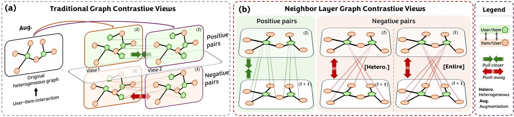  
Figure 1: Overview of contrastive learning. Left: traditional contrastive learning paradigm; Right: our NLGCL.

## 4 Methodology

In this section, we introduce a novel CL-based recommendation paradigm called Neighbor Layers Graph Contrastive Learning (NL GCL). Specifically, we first introduce the naturally existing con trastive views in neighbor layers. Then, we detailed our tailored loss function. Finally, a deeper analysis of our NLGCL is further proposed.

## 4.1 Contrastive Views

We use LightGCN as our graph convolution backbone, obtaining node embeddings $\mathbf { e } _ { u } ^ { ( 0 ) } / \mathbf { e } _ { i } ^ { ( 0 ) } , \mathbf { \tilde { e } } _ { u } ^ { ( 1 ) } / \mathbf { e } _ { i } ^ { ( 1 ) } , . . . , \mathbf { e } _ { u } ^ { ( L ) } / \mathbf { e } _ { i } ^ { ( L ) }$ , at each layer, as in Eq (4). We introduce two scopes of contrastive views: (a) heterogeneous and (b) entire. In the heterogeneous scope, based on the analysis in Section 3.3, all item embeddings in layer (�−1) and all user embeddings in layer � form one pair of naturally contrastive views; conversely, all user embeddings in layer (� − 1) and all item embeddings in layer � form another pair. In the entire scope, we consider all embeddings in layer (� − 1) and all embeddings in layer � as naturally contrastive views. Next, we define the positive and negative pairs within these contrastive views.

4.1.1 Positive Pairs. Two scopes have the same positive pairs. Given a user �, the neighbor set for � is $N _ { u } .$ . For user �, the (�)-th layer embeddings of �’s neighbors construct the positive pairs with the (�−1)-th layer embedding $\mathbf { e } _ { u } ^ { ( l - 1 ) }$ of user �. Specifically, $\mathbf { e } _ { u } ^ { ( l - 1 ) }$ con-structs positive pairs with ${ \bf e } _ { \tilde { i } } ^ { ( l ) }$ , where $\tilde { i } \in N _ { u }$ . The reason for this because ${ \bf e } _ { \tilde { i } } ^ { ( l ) }$ are weighted aggregated by ${ \bf e } _ { \bar { u } } ^ { ( l - 1 ) }$ , where $\bar { u } \in  { N _ { \tilde { i } } { \scriptscriptstyle \dag } }$ (as Eq (5)). Similar positive pairs are defined for item �.

4.1.2 Negative Pairs. In the heterogeneous scope, the (�)-th layer embeddings of all items, excluding items ˜�, construct negative pairs with the (�−1)-th la er embeddin $\mathbf { e } _ { u } ^ { ( l - 1 ) }$ of user �, where $\tilde { i } \in N _ { u }$ Similar negative pairs are defined for item �. In the entire scope, the (�)-th layer embeddings of all users additionally construct negative pairs with the (�−1)-th layer embedding $\mathbf { e } _ { u } ^ { ( l - 1 ) }$ of user �, while still maintains all negative pairs in the heterogeneous scope. Similar negative pairs are defined for item �. We categorize the positive and negative pairs in Table 1.

Table 1: Positive and Negative pairs in Contrastive Views.

<table><tr><td>Node</td><td>Scope</td><td>Positive Pairs</td><td>Negative Pairs</td></tr><tr><td>u:  $\mathbf{e}_{u}^{(l-1)}$ </td><td>Heterogeneous</td><td> $\mathbf{e}_{\tilde{i}}^{(l)}|\tilde{i}\in\mathcal{N}_{u}$ </td><td> $\mathbf{e}_{\hat{i}}^{(l)}|\hat{i}\notin\mathcal{N}_{u}$ </td></tr><tr><td>u:  $\mathbf{e}_{u}^{(l-1)}$ </td><td>Entire</td><td> $\mathbf{e}_{\tilde{i}}^{(l)}|\tilde{i}\in\mathcal{N}_{u}$ </td><td> $\mathbf{e}_{\hat{i}}^{(l)}\cup\mathbf{e}_{u}^{(l)}|\hat{i}\notin\mathcal{N}_{u},u\in\mathcal{U}$ </td></tr><tr><td>i:  $\mathbf{e}_{i}^{(l-1)}$ </td><td>Heterogeneous</td><td> $\mathbf{e}_{\tilde{u}}^{(l)}|\tilde{u}\in\mathcal{N}_{i}$ </td><td> $\mathbf{e}_{\hat{u}}^{(l)}|\hat{u}\notin\mathcal{N}_{i}$ </td></tr><tr><td>i:  $\mathbf{e}_{i}^{(l-1)}$ </td><td>Entire</td><td> $\mathbf{e}_{\tilde{u}}^{(l)}|\tilde{u}\in\mathcal{N}_{i}$ </td><td> $\mathbf{e}_{\hat{u}}^{(l)}\cup\mathbf{e}_{i}^{(l)}|\hat{u}\notin\mathcal{N}_{i},i\in\mathcal{I}$ </td></tr></table>

Analysis: Unlike traditional contrastive learning, our approach associates each node with multiple positive samples, where noise among positives arises from semantically similar nodes. This enhances the alignment of positive samples while reducing the impact of random noise. Additionally, it addresses the limitation of tradi- tional CL, which arbitrarily treats semantically similar nodes as negatives. Both scopes use the same positive sample selection, but the entire scope provides a broader range of negatives. While a larger negative sample scope can improve positive feature learning, it may hinder semantic alignment between users and items and increase computational costs. We empirically validate the efective-ness and eficiency of both scopes in Sections 5.3 and 5.4.

## 4.2 Contrastive Learning Loss

As discussed in Section 3.2, traditional CL considers a node and its counterpart in another view as positive pairs, while treating the node and all other nodes in diferent views as negative pairs. However, having a small number of positive pairs and arbitrarily defined negative pairs can irrationally push nodes with similar semantics farther away. In contrast, our tailored CL method assigns each node a set of positive pairs, enhancing alignment and reducing the impact of random noise. In an �-layer GNN, up to � groups of contrastive views can be constructed, but this incurs additional computational overhead. Let � denote the number of contrastive view groups, where $G \leq L ,$ . Selecting these � groups is crucial, and we theoretically prove in Theorem 1 (Appendix A.1) that the first � groups are optimal.

Theorem 1. In GCNs, contrastive views that naturally exist between layer (�) and layer (�+1) are more efective for contrastive learning when (�) is smaller.

Based on Theorem 1, selecting the first � layers and their neigh bor layers as contrastive views achieves optimal results. We introduce our tailored CL loss for two scopes of contrastive views, respectively.

4.2.1 Heterogeneous Scope. For the heterogeneous scope, our neighbor layer CL loss can be formulated as: (a)T (a+1)

$$
\mathcal {L} _ {n l _ {u}} = - \frac {1}{G | \mathcal {U} |} \sum_ {g = 0} ^ {G - 1} \sum_ {u \in \mathcal {U}} \frac {1}{| \mathcal {N} _ {u} |} \log \frac {\prod_ {i ^ {+} \in \mathcal {N} _ {u}} \exp (\mathbf {e} _ {u} ^ {(g) ^ {\top}} \mathbf {e} _ {i ^ {+}} ^ {(g + 1)} / \tau)}{\sum_ {\hat {i} \in \mathcal {I}} \exp (\mathbf {e} _ {u} ^ {(g) ^ {\top}} \mathbf {e} _ {\hat {i}} ^ {(g + 1)} / \tau)},\tag{6}
$$

$$
\mathcal {L} _ {n l _ {i}} = - \frac {1}{G | \mathcal {I} |} \sum_ {g = 0} ^ {G - 1} \sum_ {i \in \mathcal {I}} \frac {1}{| \mathcal {N} _ {i} |} \log \frac {\prod_ {u ^ {+} \in \mathcal {N} _ {i}} \exp (\mathbf {e} _ {i} ^ {(g) ^ {\top}} \mathbf {e} _ {u ^ {+}} ^ {(g + 1)} / \tau)}{\sum_ {\hat {u} \in \mathcal {U}} \exp (\mathbf {e} _ {i} ^ {(g) ^ {\top}} \mathbf {e} _ {\hat {u}} ^ {(g + 1)} / \tau)},\tag{7}
$$

where positive samples $i ^ { + } / u ^ { + }$ refer to all neighbors of each �/�, while negative samples $\hat { i } / \hat { u }$ are drawn from the entire set of I or U. We compute the average over the first � layers for all users/items.

4.2.2 Entire Scope. For the entire scope, our neighbor layer CL loss can be formulated as:

$$
\mathcal {L} _ {n l _ {u}} = - \frac {1}{G | \mathcal {U} |} \sum_ {g = 0} ^ {G - 1} \sum_ {u \in \mathcal {U}} \frac {1}{| \mathcal {N} _ {u} |} \log \frac {\prod_ {i ^ {+} \in \mathcal {N} _ {u}} \exp (\mathbf {e} _ {u} ^ {(g) ^ {\top}} \mathbf {e} _ {i ^ {+}} ^ {(g + 1)} / \tau)}{\sum_ {\hat {x} \in \mathcal {V}} \exp (\mathbf {e} _ {u} ^ {(g) ^ {\top}} \mathbf {e} _ {\hat {x}} ^ {(g + 1)} / \tau)},\tag{8}
$$

$$
\mathcal {L} _ {n l _ {i}} = - \frac {1}{G | \mathcal {I} |} \sum_ {g = 0} ^ {G - 1} \sum_ {i \in \mathcal {I}} \frac {1}{| \mathcal {N} _ {i} |} \log \frac {\prod_ {u ^ {+} \in \mathcal {N} _ {i}} \exp (\mathbf {e} _ {i} ^ {(g) ^ {\top}} \mathbf {e} _ {u ^ {+}} ^ {(g + 1)} / \tau)}{\sum_ {\hat {x} \in \mathcal {V}} \exp (\mathbf {e} _ {i} ^ {(g) ^ {\top}} \mathbf {e} _ {\hat {x}} ^ {(g + 1)} / \tau)},\tag{9}
$$

where positive samples $i ^ { + } / u ^ { + }$ refer to all neighbors of each �/�, while negative samples �ˆ are drawn from the entire set $\mathcal { V } = \mathcal { I } \cup \mathcal { U } .$ We compute the average over the first � layers for all users/items.

For any scope, we get the final loss ${ \mathcal { L } } _ { n l }$ by summing both user- side loss $\mathcal { L } _ { n l _ { u } }$ and item-side loss $\mathcal { L } _ { n l _ { i } }$ , formally: $\mathcal { L } _ { n l } = \mathcal { L } _ { n l _ { u } } + \mathcal { L } _ { n l _ { i } }$

Eficiency: Although our NLGCL introduces a computational complexity proportional to $G ,$ the cost of constructing contrastive views in traditional CL is significantly higher than the cost of com-puting the CL loss itself. By leveraging the naturally existing contrastive views within GCNs, our NLGCL eliminates the substantial overhead of view construction. Detailed analysis of time eficiency is provided in Appendices A.2.

## 4.3 Model Optimization

To extract node representations in NLGCL, we adopt a multi-task training strategy that jointly optimizes the traditional BPR loss (Eq (2)) and our neighbor layers graph contrastive learning loss:

$$
\mathcal {L} = \mathcal {L} _ {b p r} + \lambda_ {1} \mathcal {L} _ {n l} + \lambda_ {2} \| \boldsymbol {\Theta} \| ^ {2},\tag{10}
$$

where $\lambda _ { 1 }$ and $\lambda _ { 2 }$ are balancing hyper-parameters of CL and $L _ { 2 }$ regularization term, respectively. Θ denotes model parameters.

Table 2: Statistics of four datasets.

<table><tr><td>Dataset</td><td># Users</td><td># Items</td><td># Interaction</td><td>Sparsity</td></tr><tr><td>Yelp</td><td>45,477</td><td>30,708</td><td>1,777,765</td><td>99.873%</td></tr><tr><td>Pinterest</td><td>55,188</td><td>9,912</td><td>1,445,622</td><td>99.736%</td></tr><tr><td>QB-Video</td><td>30,324</td><td>25,731</td><td>1,581,136</td><td>99.797%</td></tr><tr><td>Alibaba</td><td>300,001</td><td>81,615</td><td>1,607,813</td><td>99.993%</td></tr></table>

## 5 Experiments

In this section, we briefly describe our experimental settings and then conduct extensive experiments on four public datasets to eval- uate our proposed NLGCL by answering the following research questions: RQ1: How does our proposed NLGCL perform in comparison to various state-of-the-art recommender systems? RQ2: How do the diferent scopes of our NLGCL impact its performance? RQ3: How eficient is our NLGCL compared with various state-of-the-art recommender systems? RQ4: Can our NLGCL learn high-quality representations with uniform distribution? RQ5: How do diferent hyper-parameters influence?

## 5.1 Experimental Settings

5.1.1 Datasets. To validate the efectiveness ofNLGCL, we conduct experiments on four public datasets, namely Yelp [22], Pinterest [13], QB-Video [52], and Alibaba [6]. These datasets originate from diverse domains, exhibiting variances in both scale and spar- sity. To ensure the quality of the data, we employ the 15-core setting for the Yelp and Alibaba datasets, which ensures a minimum of 15 interactions between users and items. For the Pinterest and QB-Video datasets, users and items with less than 5 interactions are filtered out. Table 2 summarizes statistical information for all datasets. We use the user-based split approach to divide the data for experimentation. Specifically, we divide training, validation, and test sets into a ratio of 8:1:1, respectively. Moreover, we employ pair-wise sampling, where a negative interaction is randomly cho-sen for each interaction in the training set to construct the training sample.

5.1.2 Metrics. To evaluate the top-� recommendation task performance fairly, we adopt two widely-used metrics: Recall and Normalized Discounted Cumulative Gain (NDCG). The values of � are set to 10, 20, 50. Following previous work [22], we adopt the all-rank protocol which ranks all candidate items that users have not interacted with during evaluation.

5.1.3 Implementation Details. To ensure a fair comparison, we implement our NLGCL2 and all baselines using the RecBole and RecBole-GNN [55], unified frameworks for traditional recommendation models and graph-based traditional recommendation mod- els, respectively. We use the Adam optimizer [19] and Xavier initialization [14] with default parameters, and conduct extensive hyper-parameter tuning for all baselines. For our NLGCL, we fix the batch size to 4096, set $\lambda _ { 2 }$ for $L _ { 2 }$ regularization to $1 0 ^ { - 4 }$ , and use an embedding size of 64. Early stopping is applied with an e och limit of 20, monitored b NDCG@10. For our NLGCL, we tune hyper-parameters $\lambda _ { 1 } \in \{ \overset { . } { 1 } 0 ^ { - 6 } , 1 0 ^ { - 5 } , 1 0 ^ { - 4 } \}$ , temperature � ∈ {0.1, 0.2, 0.3, 0.4}, the number of GCN layers � ∈ {1, 2, 3, 4}, and the number of contrastive view groups $G \in \{ 1 , . . . , L \}$

Table 3: Performance comparison of baselines and our NLGCL in terms of Recall@K(R@K) and NDCG@K(N@K). The superscript ∗ indicates the improvement is statistically significant where the �-value is less than 0.01.

<table><tr><td rowspan="2"></td><td>Model</td><td>MF-BPR</td><td>NGCF</td><td>LightGCN</td><td>IMP-GCN</td><td>LayerGCN</td><td>SGL</td><td>NCL</td><td>SimGCL</td><td>LightGCL</td><td>DCCF</td><td>BIGCF</td><td>NLGCL</td><td rowspan="2">Improv.</td></tr><tr><td>Metric</td><td>[30]</td><td>[37]</td><td>[17]</td><td>[23]</td><td>[56]</td><td>[40]</td><td>[22]</td><td>[51]</td><td>[2]</td><td>[29]</td><td>[54]</td><td>Our</td></tr><tr><td rowspan="6">Yelp</td><td>R@10</td><td>0.0643</td><td>0.0630</td><td>0.0730</td><td>0.0751</td><td>0.0771</td><td>0.0833</td><td>0.0902</td><td>0.0908</td><td>0.0766</td><td>0.0818</td><td>0.0880</td><td>0.0952*</td><td>4.85%</td></tr><tr><td>R@20</td><td>0.1043</td><td>0.1026</td><td>0.1163</td><td>0.1182</td><td>0.1208</td><td>0.1288</td><td>0.1325</td><td>0.1331</td><td>0.1188</td><td>0.1268</td><td>0.1311</td><td>0.1414*</td><td>6.24%</td></tr><tr><td>R@50</td><td>0.1862</td><td>0.1864</td><td>0.2016</td><td>0.2017</td><td>0.2041</td><td>0.2100</td><td>0.2127</td><td>0.2130</td><td>0.2008</td><td>0.2107</td><td>0.2119</td><td>0.2327*</td><td>9.25%</td></tr><tr><td>N@10</td><td>0.0458</td><td>0.0446</td><td>0.0520</td><td>0.0539</td><td>0.0560</td><td>0.0601</td><td>0.0673</td><td>0.0682</td><td>0.0551</td><td>0.0596</td><td>0.0630</td><td>0.0713*</td><td>4.55%</td></tr><tr><td>N@20</td><td>0.0580</td><td>0.0567</td><td>0.0652</td><td>0.0662</td><td>0.0684</td><td>0.0739</td><td>0.0811</td><td>0.0823</td><td>0.0681</td><td>0.0741</td><td>0.0779</td><td>0.0859*</td><td>4.37%</td></tr><tr><td>N@50</td><td>0.0793</td><td>0.0784</td><td>0.0875</td><td>0.0885</td><td>0.0901</td><td>0.0964</td><td>0.1033</td><td>0.1039</td><td>0.0899</td><td>0.0974</td><td>0.1005</td><td>0.1094*</td><td>5.29%</td></tr><tr><td rowspan="6">Pinterest</td><td>R@10</td><td>0.0855</td><td>0.0870</td><td>0.1000</td><td>0.0985</td><td>0.1004</td><td>0.1080</td><td>0.1033</td><td>0.1051</td><td>0.0881</td><td>0.1040</td><td>0.1040</td><td>0.1148*</td><td>6.30%</td></tr><tr><td>R@20</td><td>0.1409</td><td>0.1428</td><td>0.1621</td><td>0.1603</td><td>0.1620</td><td>0.1704</td><td>0.1609</td><td>0.1576</td><td>0.1322</td><td>0.1613</td><td>0.1619</td><td>0.1793*</td><td>5.22%</td></tr><tr><td>R@50</td><td>0.2599</td><td>0.2633</td><td>0.2862</td><td>0.2845</td><td>0.2880</td><td>0.2963</td><td>0.2887</td><td>0.2442</td><td>0.2383</td><td>0.2871</td><td>0.2894</td><td>0.3089*</td><td>4.25%</td></tr><tr><td>N@10</td><td>0.0537</td><td>0.0545</td><td>0.0635</td><td>0.0624</td><td>0.0635</td><td>0.0701</td><td>0.0666</td><td>0.0705</td><td>0.0534</td><td>0.0661</td><td>0.0680</td><td>0.0760*</td><td>7.80%</td></tr><tr><td>N@20</td><td>0.0708</td><td>0.0721</td><td>0.0830</td><td>0.0814</td><td>0.0826</td><td>0.0897</td><td>0.0833</td><td>0.0871</td><td>0.0673</td><td>0.0828</td><td>0.0864</td><td>0.0948*</td><td>5.69%</td></tr><tr><td>N@50</td><td>0.1001</td><td>0.1018</td><td>0.1136</td><td>0.1113</td><td>0.1121</td><td>0.1209</td><td>0.1150</td><td>0.1086</td><td>0.0981</td><td>0.1157</td><td>0.1155</td><td>0.1267*</td><td>4.80%</td></tr><tr><td rowspan="6">QB-Video</td><td>R@10</td><td>0.1120</td><td>0.1261</td><td>0.1275</td><td>0.1278</td><td>0.1291</td><td>0.1341</td><td>0.1372</td><td>0.1337</td><td>0.1330</td><td>0.1350</td><td>0.1341</td><td>0.1427*</td><td>4.01%</td></tr><tr><td>R@20</td><td>0.1741</td><td>0.1943</td><td>0.1969</td><td>0.1966</td><td>0.1990</td><td>0.2030</td><td>0.2089</td><td>0.2030</td><td>0.2018</td><td>0.2044</td><td>0.2056</td><td>0.2167*</td><td>3.73%</td></tr><tr><td>R@50</td><td>0.2969</td><td>0.3237</td><td>0.3251</td><td>0.3259</td><td>0.3271</td><td>0.3342</td><td>0.3414</td><td>0.3356</td><td>0.3258</td><td>0.3281</td><td>0.3423</td><td>0.3501*</td><td>2.28%</td></tr><tr><td>N@10</td><td>0.0782</td><td>0.0888</td><td>0.0900</td><td>0.0899</td><td>0.0904</td><td>0.0932</td><td>0.0964</td><td>0.0945</td><td>0.0921</td><td>0.0951</td><td>0.0928</td><td>0.0996*</td><td>3.32%</td></tr><tr><td>N@20</td><td>0.0977</td><td>0.1099</td><td>0.1109</td><td>0.1105</td><td>0.1123</td><td>0.1141</td><td>0.1189</td><td>0.1151</td><td>0.1130</td><td>0.1150</td><td>0.1144</td><td>0.1219*</td><td>2.52%</td></tr><tr><td>N@50</td><td>0.1303</td><td>0.1438</td><td>0.1448</td><td>0.1447</td><td>0.1461</td><td>0.1482</td><td>0.1530</td><td>0.1501</td><td>0.1459</td><td>0.1508</td><td>0.1503</td><td>0.1573*</td><td>2.81%</td></tr><tr><td rowspan="6">Alibaba</td><td>R@10</td><td>0.0303</td><td>0.0382</td><td>0.0457</td><td>0.0400</td><td>0.0448</td><td>0.0461</td><td>0.0477</td><td>0.0474</td><td>0.0459</td><td>0.0490</td><td>0.0502</td><td>0.0531*</td><td>5.78%</td></tr><tr><td>R@20</td><td>0.0467</td><td>0.0615</td><td>0.0692</td><td>0.0635</td><td>0.0680</td><td>0.0692</td><td>0.0713</td><td>0.0691</td><td>0.0716</td><td>0.0729</td><td>0.0744</td><td>0.0773*</td><td>3.90%</td></tr><tr><td>R@50</td><td>0.0799</td><td>0.1081</td><td>0.1144</td><td>0.1110</td><td>0.1138</td><td>0.1141</td><td>0.1165</td><td>0.1092</td><td>0.1204</td><td>0.1199</td><td>0.1205</td><td>0.1238*</td><td>2.74%</td></tr><tr><td>N@10</td><td>0.0161</td><td>0.0198</td><td>0.0246</td><td>0.0221</td><td>0.0238</td><td>0.0248</td><td>0.0259</td><td>0.0262</td><td>0.0239</td><td>0.0257</td><td>0.0266</td><td>0.0299*</td><td>12.41%</td></tr><tr><td>N@20</td><td>0.0203</td><td>0.0257</td><td>0.0299</td><td>0.0271</td><td>0.0285</td><td>0.0307</td><td>0.0319</td><td>0.0317</td><td>0.0305</td><td>0.0311</td><td>0.0322</td><td>0.0361*</td><td>12.11%</td></tr><tr><td>N@50</td><td>0.0269</td><td>0.0349</td><td>0.0396</td><td>0.0369</td><td>0.0393</td><td>0.0396</td><td>0.0409</td><td>0.0397</td><td>0.0410</td><td>0.0404</td><td>0.0415</td><td>0.0450*</td><td>8.43%</td></tr></table>

Table 4: Eficiency comparison of diferent methods across four datasets, including average training time per epoch, number of epochs to converge, total training time (T/E: Time/Epoch, #E: #Epoch, TT: Total Time, N@10: NDCG@10; s: second, m: minute, h: hour). We highlight the optimal and suboptimal models for the TT metric in bold and underline, respectively.

<table><tr><td rowspan="2">Model</td><td colspan="4">Yelp</td><td colspan="4">Pinterest</td><td colspan="4">QB-Video</td><td colspan="4">Alibaba</td></tr><tr><td>T/E↓</td><td>#E↓</td><td>TT↓</td><td>N@10↑</td><td>T/E↓</td><td>#E↓</td><td>TT↓</td><td>N@10↑</td><td>T/E↓</td><td>#E↓</td><td>TT↓</td><td>N@10↑</td><td>T/E↓</td><td>#E↓</td><td>TT↓</td><td>N@10↑</td></tr><tr><td>LightGCN</td><td>22.42s</td><td>332</td><td>2h9m</td><td>0.0520</td><td>8.40s</td><td>194</td><td>27m</td><td>0.0635</td><td>25.32s</td><td>283</td><td>1h59m</td><td>0.0900</td><td>21.55s</td><td>371</td><td>2h13m</td><td>0.0246</td></tr><tr><td>SGL</td><td>104.19s</td><td>55</td><td>1h36m</td><td>0.0601</td><td>42.71s</td><td>43</td><td>31m</td><td>0.0701</td><td>124.44s</td><td>61</td><td>2h7m</td><td>0.0932</td><td>95.37s</td><td>83</td><td>2h12m</td><td>0.0248</td></tr><tr><td>NCL</td><td>94.42s</td><td>102</td><td>2h41m</td><td>0.0673</td><td>35.10s</td><td>83</td><td>49m</td><td>0.0666</td><td>108.98s</td><td>90</td><td>2h43m</td><td>0.0964</td><td>85.79s</td><td>88</td><td>2h6m</td><td>0.0477</td></tr><tr><td>SimGCL</td><td>98.33s</td><td>155</td><td>4h14m</td><td>0.0682</td><td>37.31s</td><td>121</td><td>1h15m</td><td>0.0705</td><td>110.92s</td><td>167</td><td>5h9m</td><td>0.0945</td><td>87.31s</td><td>241</td><td>5h51m</td><td>0.0262</td></tr><tr><td>LightGCL</td><td>100.51s</td><td>64</td><td>1h47m</td><td>0.0551</td><td>38.87s</td><td>51</td><td>33m</td><td>0.0534</td><td>119.18s</td><td>57</td><td>1h53m</td><td>0.0921</td><td>92.24s</td><td>69</td><td>1h46m</td><td>0.0459</td></tr><tr><td>DCCF</td><td>221.31s</td><td>38</td><td>2h20m</td><td>0.0596</td><td>76.39s</td><td>32</td><td>41m</td><td>0.0661</td><td>228.21s</td><td>38</td><td>2h25m</td><td>0.0951</td><td>180.08s</td><td>49</td><td>2h27m</td><td>0.0257</td></tr><tr><td>BIGCF</td><td>208.19s</td><td>41</td><td>2h22m</td><td>0.0630</td><td>70.11s</td><td>35</td><td>41m</td><td>0.0680</td><td>206.60s</td><td>38</td><td>2h11m</td><td>0.0928</td><td>167.12s</td><td>42</td><td>1h57m</td><td>0.0266</td></tr><tr><td>NLGCL-H</td><td>46.93s</td><td>63</td><td>49m</td><td>0.0713</td><td>19.55s</td><td>40</td><td>13m</td><td>0.0760</td><td>53.19s</td><td>55</td><td>49m</td><td>0.0996</td><td>44.73s</td><td>74</td><td>55m</td><td>0.0299</td></tr><tr><td>NLGCL-E</td><td>61.32s</td><td>82</td><td>1h28m</td><td>0.0689</td><td>28.81s</td><td>51</td><td>24m</td><td>0.0729</td><td>72.99s</td><td>62</td><td>1h15m</td><td>0.0969</td><td>59.67s</td><td>79</td><td>1h19m</td><td>0.0279</td></tr></table>

5.1.4 Baselines. To assess the efectiveness of NLGCL, we compare it against two categories of baselines: (1) CF-based models (MF-BPR [30], NGCF [37], LightGCN [17], IMP-GCN [23], and LayerGCN [56]) and (2) CL-based models (SGL [40], NCL [22], SimGCL [51], LightGCL [2], DCCF [29], and BIGCF [54]).

## 5.2 Overall Performance (RQ1)

Table 3 reports the recommendation performance of all baselines on four public datasets. From the results, we observed that: Observation1: Our proposed NLGCL achieves the best perfor-mance, outperforming all baselines and demonstrating its efec tiveness in recommendation tasks. Specifically, NLGCL improves

NDCG@10 by 4.55%, 5.69%, 2.52%, and 12.11% on Yelp, Pinterest, QB-Video, and Alibaba, respectively, compared to the strongest baseline. These results highlight NLGCL’s strong capability in providing personalized recommendations.

Observation2: Across all datasets, CL-based methods generally outperform CF-based methods, highlighting the benefits of inte- grating contrastive learning with collaborative filtering. However, existing CL-based methods often lose crucial information and intro- duce noise during view construction. In contrast, NLGCL mitigates this issue by associating multiple positive samples with each node, where noise among these samples reflects other nodes with similar preferences.

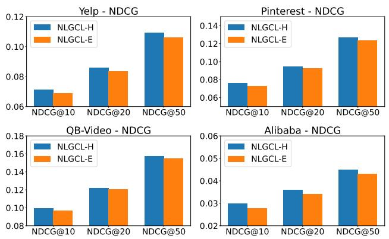  
Figure 2: The influence of the scope of contrastive views.

## 5.3 The Influence of Diferent Scopes in Contrastive Views (RQ2)

To validate the efectiveness of diferent scopes of contrastive views, we conduct experiments on all datasets. We design the follow- ing variants: 1) NLGCL-H, which adopts the heterogeneous scope. 2) NLGCL-E, which adopts the entire scope. In Figure 2, we ob-served that NLGCL-H consistently outperforms NLGCL-E across all datasets. This advantage is attributable to the scope ofNLGCL-H being more accurate than NLGCL-E. Specifically, there is an inevitable semantic gap between users and items. To this end, arbitrarily treat ing all nodes as negative samples will aggravate semantic noise in user/item representation and hurt recommendation accuracy. Moreover, NLGCL-E also requires higher computational resources than NLGCL-H, which we detail in Section 5.4.

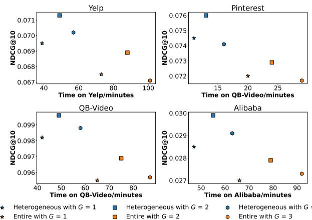  
Figure 3: Eficiency study in terms of NDCG@10.

## 5.4 Eficiency Study (RQ3)

We provide theoretical analysis for the eficiency of our proposed NLGCL in Appendix A.2. In this section, we further validate it with an empirical study. We conduct experiments across all CL-based baselines using four datasets. In Table 4, we present the eficiency of NLGCL and CL-based baselines in terms of average training time per epoch, the number of epochs to converge, and total training time. Our results show that NLGCL achieves competitive per-epoch training eficiency and the fastest convergence among all models. This indicates that NLGCL not only reduces computational time but also reaches optimal performance swiftly, making it ideal for scenarios with limited time or computational resources, such as rapid deployment and frequent updates. As analyzed in Appendix A.2, our NLGCL-H and NLGCL-E further reduce training time by adjusting hyper-parameter �. Figure 3 illustrates the trade-of between performance and eficiency across diferent values of�. By tuning �, NLGCL adapts to diverse computational environments, balancing eficiency and efectiveness. This flexibility ensures its suitability for real-world applications, even in resource-limited scenarios, while maintaining strong performance.

## 5.5 Visualization Analysis (RQ4)

We validate the efectiveness of NLGCL in learning high-quality, uniformly distributed representations, thereby maximizing the ben-efits of CL. Specifically, we randomly sample 3,000 users from the Yelp and Pinterest datasets and project their final embeddings from the optimal model onto 2-dimensional unit vectors using t-SNE [34]. As shown in Figure 4, we plot the feature distributions and estimate their angular densities using Gaussian Kernel Density Es- timation (KDE) [7]. Figure 4 demonstrates that the representations learned by NLGCL are more uniformly distributed. Consistent with prior studies [35, 36, 51, 54], such uniform distribution enhances the intrinsic quality of representations and maximizes information retention, leading to a better ability to preserve unique user preferences.

## 5.6 Hyper-parameter Study (RQ5)

This section investigates the sensitivity of hyper-parameters on the recommendation performance of NLGCL. The evaluation results in terms of NDCG@10 are reported in Figure 5 and Figure 6.

Performance Comparison $w . r . t . \lambda _ { 1 }$ and �: We analyze the hyper-parameter sensitivity for contrastive learning by varying the bal-ancing hyper-parameter $\lambda _ { 1 }$ from $1 0 ^ { - 6 }$ to $1 0 ^ { - 4 }$ and temperature parameter � from 0.1 to 0.4. As shown in Figure 5, NLGCL con-sistently achieves the best performance with $\lambda _ { 1 } = 1 0 ^ { - 5 }$ and � = 0.2 across all datasets, aligning with hyper-parameter settings in traditional CL.

Performance Comparison �.�.�. � and �: We analyze the influence of GCN layer number � and contrastive view group number � across all datasets. Figure 6 shows that � = 2 is optimal across all datasets, while the optimal � is 2 for Yelp and Alibaba datasets, and 3 for Pinterest and QB-Video datasets. Notably, even with � = 1, NLGCL maintains strong performance, consistent with the eficiency analysis in Section 5.4.

## 6 Related Work

## 6.1 GNN-based Recommendation

Graph Neural Networks (GNNs) are widely applied in recommendation systems due to their ability to capture high-order relational information in user-item bipartite graphs. NGCF [37] pioneered the use of GNNs for aggregating high-order neighborhood information, laying the foundation for subsequent advancements. GCCF [3] and LightGCN [17] enhanced encoding quality by removing non-linear transformations during propagation, which has since become a standard backbone. Further developments include IMP-GCN [23], which applies GNNs to sub-graphs, and LayerGCN [56], which in corporates residual networks into GNN architectures. FourierKAN-GCF [45] optimizes non-linear transformations using Fourier se ries. Beyond traditional recommendation, GNNs have been applied in multimodal [16, 38, 48, 57], social [12, 21, 27, 37], and group [5, 32, 41, 44] recommendations to leverage the structural richness of graphs. However, GNN-based methods often rely heavily on supervised signals, limiting their performance on sparse datasets.

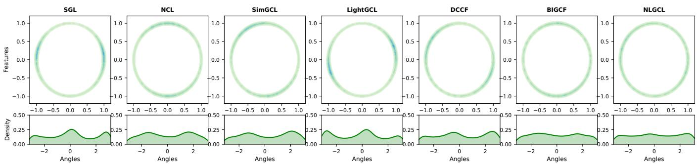  
Figure 4: We follow previous work [51] to plot feature distributions with Gaussian kernel density estimation (KDE) in $\textstyle { \mathcal { R } } ^ { 2 }$ (the darker the color is, the more points fall in that area.) and KDE on angles (i.e., arctan2(y, x) for each point (x,y)).

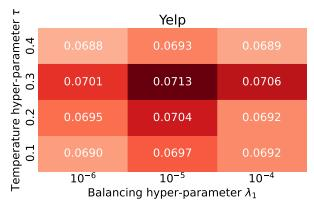

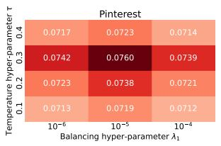  
Figure 5: Performance Comparison � .� .� . $\lambda _ { 1 }$ and �.

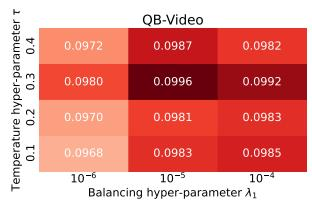

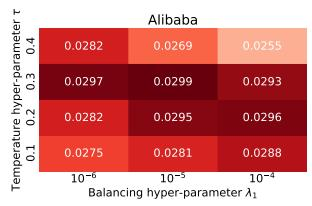

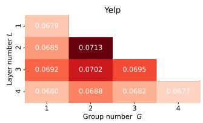

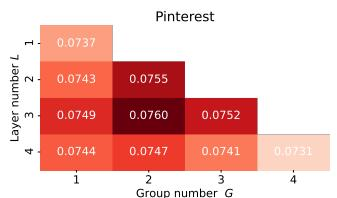

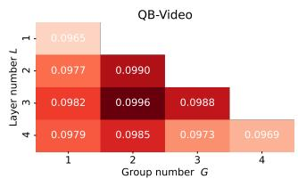

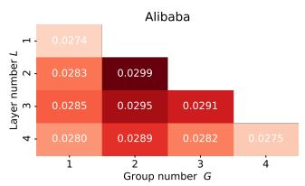  
Figure 6: Performance Comparison �.�.�. � and �.

## 6.2 CL-based Recommendation

Contrastive Learning (CL) addresses data sparsity in recommenda tion by leveraging self-supervised signals to construct contrastive views and maximize mutual information in embeddings. SGL [40] ensures consistency between views using random corruption oper ators, such as node/edge deletion and random walks. SimGCL [51] adds noise during graph convolution, while LightGCL [2] employs Singular Value Decomposition (SVD) to generate views. HCCF [42] integrates global information via hypergraph neural networks. NCL [22] introduces EM clusterin , and DCCF [29] learns disentan led representations using self-supervised signals. BIGCF [54] explores the individuality and collectivity of user intents with tailored sig- nals. While efective, existing CL methods incur additional com-putational costs and introduce irrelevant noise during contrastive view construction. Our NLGCL leverages naturally existing contrastive views within GNNs, reducing computational overhead and ensuring that the noise between contrastive views is semantically related, thereby achieving both improvements in efectiveness and eficiency.

## 7 Conclusion

In this paper, we propose a simple yet efective paradigm, NLGCL, which leverages naturally existing contrastive views between neighbor layers within GNNs. By treating each node and its neighbors in the next layer as positive pairs and other nodes as negatives, NLGCL avoids augmentation-based noise while preserving semantic relevance. This approach reduces irrelevant noise and elimi-nates the additional time and space costs of traditional contrastive learning methods. We demonstrate the superiority of NLGCL over state-of-the-art baselines in terms of both efectiveness and efi- ciency through theoretical analysis and empirical evaluation. By eliminating the need to construct and store additional contrastive views, NLGCL breaks the limitations of traditional GCL-based rec ommendation paradigms and opens new avenues for research. In the future, we plan to extend this paradigm to other domains, such as multimodal, social, and group recommendations.

## Acknowledgments

This work was supported by the Hong Kong UGC General Research Fund no. 17203320 and 17209822, and the project grants from the HKU-SCF FinTech Academy.

## A Appendix

## A.1 Proof of Theorem 1

Formal Restatement: In GNNs, the efectiveness of naturally existing contrastive views between adjacent layers � − 1 and � diminishes as the layer index � increases. Specifically, let the information gain $\mathbf { I } ( \mathbf { E } ^ { ( l - 1 ) } ; \mathbf { E } ^ { ( l ) } )$ denote the mutual information between embeddings of adjacent layers. Then, monotonically decreases as � increases. Notation: (Mutual Information) Define mutual information between adjacent layers as:

$$
\mathbf {I} (\mathbf {E} ^ {(l - 1)}; \mathbf {E} ^ {(l)}) = \mathbf {H} (\mathbf {E} ^ {(l - 1)}) - \mathbf {H} (\mathbf {E} ^ {(l - 1)} | \mathbf {E} ^ {(l)}),\tag{11}
$$

where H(·) denotes the entropy function.

(Spectral Decomposition) Let $\tilde { \mathcal { A } } = \mathbf { U } \boldsymbol { \Lambda } \mathbf { U } ^ { \top }$ be the eigendecompo- sition of A˜ where $\boldsymbol { \Lambda } = \operatorname { d i a g } \left( \lambda _ { 1 } , \ldots , \lambda _ { n } \right)$ and $\lambda _ { 1 } \geq \lambda _ { 2 } \geq \cdots \geq \lambda _ { n }$

Lemma 1. (Entropy Reduction via Low-Pass Filtering). For any layer �, the entropy ofembeddings satisfies:

$$
\mathbf {H} (\mathbf {E} ^ {(l)}) \leq \mathbf {H} (\mathbf {E} ^ {(l - 1)})
$$

Proof: Propagation process $\mathbf { E } ^ { ( l ) } = \tilde { \mathcal { A } } \mathbf { E } ^ { ( l - 1 ) }$ acts as a low-pass filter in the spectral domain. Specifically, the frequency response at the �-th eigencomponent is attenuated by $\lambda _ { k } ^ { l }$ . Since $\lambda _ { k } \le 1$ for all �, higher-frequency components (associated with $\lambda _ { k } < 1 )$ are suppressed exponentially with �, reducing the variance of $\mathbf { E } ^ { ( l ) }$ . From the entropy-power inequality [10]:

$$
\begin{array}{r l} & {\mathbf {H} (\mathbf {E} ^ {(l)}) = \frac {1}{2} \log ((2 \pi e) ^ {d} | \Sigma^ {(l)} |)} \\ & {\qquad \leq \frac {1}{2} \log ((2 \pi e) ^ {d} | \Sigma^ {(l - 1)} |) = \mathbf {H} (\mathbf {E} ^ {(l - 1)}),} \end{array}\tag{12}
$$

where $| \Sigma ^ { ( l ) } |$ is the determinant of the covariance matrix, and � is the embedding dimension.

Corollary 1. (Exponential Mutual Information Decay). The mutual information between adjacent layers decays as:

$$
\mathbf {I} (\mathbf {E} ^ {(l - 1)}; \mathbf {E} ^ {(l)}) \propto \lambda_ {\mathrm{max}} ^ {2 l},
$$

where $\lambda _ { \operatorname* { m a x } } = \operatorname* { m a x } _ { k } | \lambda _ { k } | < 1 .$

Proof: From Lemma $1 , \mathbf { H } ( \mathbf { E } ^ { ( l ) } )$ decreases monotonically. For a Gaussian embedding distribution, mutual information simplifies to:

$$
\mathbf {I} (\mathbf {E} ^ {(l - 1)}; \mathbf {E} ^ {(l)}) = \frac {1}{2} \log (\frac {| \Sigma^ {(l - 1)} |}{| \Sigma^ {(l)} |}).\tag{13}
$$

Substituting $\Sigma ^ { ( l ) } = \tilde { \mathcal { A } } ^ { 2 } \Sigma ^ { ( l - 1 ) } \left( \mathrm { f r o m } \mathbf { E } ^ { ( l ) } = \tilde { \mathcal { A } } \mathbf { E } ^ { ( l - 1 ) } \right)$ ), we derive:

$$
| \Sigma^ {(l)} | = | \tilde {\mathcal {A}} ^ {2} | | \Sigma^ {(l - 1)} | = \prod_ {k = 1} ^ {n} \lambda_ {k} ^ {2} \cdot | \Sigma^ {(l - 1)} |.\tag{14}
$$

Thus:

$$
\mathbf {I} (\mathbf {E} ^ {(l - 1)}; \mathbf {E} ^ {(l)}) = \frac {1}{2} \log (\prod_ {k = 1} ^ {n} \lambda_ {k} ^ {- 2}) = - \sum_ {k = 1} ^ {n} \log \lambda_ {k}.\tag{15}
$$

For dominant eigenvalues $\lambda _ { \operatorname* { m a x } } .$ , this decays as $O ( \lambda _ { \operatorname* { m a x } } ^ { 2 l } )$ . There- fore, contrastive views constructed from lower layers (l = 1) maximize the signal-to-noise ratio (SNR) for contrastive learning, as they preserve higher mutual information. The SNR of contrastive pairs is proportional to $\mathbf { I } ( \mathbf { E } ^ { ( l - 1 ) } ; \mathbf { E } ^ { ( l ) } )$ . From Corollary 1, SNR decays exponentially with �, making lower layers preferable.

Table 5: Comparison of time complexity. -H and -E denote heterogeneous and entire scopes, respectively.

<table><tr><td></td><td>Encoder</td><td>BPR Loss</td><td>CL Loss</td></tr><tr><td>LightGCN</td><td> $O(2|\mathcal{E}|Ld)$ </td><td> $O(2dB)$ </td><td>-</td></tr><tr><td>SGL</td><td> $O(2(1+2\hat{\rho})|\mathcal{E}|Ld)$ </td><td> $O(2dB)$ </td><td> $O(2MdB)$ </td></tr><tr><td>NCL</td><td> $O(2(|\mathcal{E}|+K)Ld)$ </td><td> $O(2dB)$ </td><td> $O(4MdB)$ </td></tr><tr><td>SimGCL</td><td> $O(6|\mathcal{E}|Ld)$ </td><td> $O(2dB)$ </td><td> $O(2MdB)$ </td></tr><tr><td>LightGCL</td><td> $O(2(|\mathcal{E}|+q|\mathcal{V}|)Ld)$ </td><td> $O(2dB)$ </td><td> $O(2MdB)$ </td></tr><tr><td>DCCF</td><td> $O(2(|\mathcal{E}|+|\mathcal{K}||\mathcal{V}|)Ld)$ </td><td> $O(2dB)$ </td><td> $O(6MdB)$ </td></tr><tr><td>BIGCF</td><td> $O(2(|\mathcal{E}|Ld+|\mathcal{K}||\mathcal{V}|d))$ </td><td> $O(2dB)$ </td><td> $O(6MdB)$ </td></tr><tr><td>NLGCL-H</td><td> $O(2|\mathcal{E}|Ld)$ </td><td> $O(2dB)$ </td><td> $O(2GMdB)$ </td></tr><tr><td>NLGCL-E</td><td> $O(2|\mathcal{E}|Ld)$ </td><td> $O(2dB)$ </td><td> $O(4GMdB)$ </td></tr></table>

## A.2 Eficiency Analysis of NLGCL

We analyze the complexity of NLGCL and compare it with Light-GCN, SGL, NCL, SimGCL, LightGCL, DCCF, and BIGCF. The discus- sion is within a single batch since the in-batch negative sampling is a widel used trick in CL [4]. As Table 5 shows, we divide computational complexity into three components: Encoder, BPR Loss, and CL Loss. LightGCN is the basic graph encoder, the time com-plexity of the process is �(2|E|��), where |E| is the number of edges in graph ${ \mathcal { G } } ,$ � represents the node number in a batch, � is layer number, and � is the dimension of embeddings. �ˆ is the edge keep probability of SGL. � is the number of clusters in NCL. � is the required rank for SVD in LightGCL. |K| denotes the collective intent number for all user and item nodes. For our NLGCL, � is the number of groups of contrastive views. NLGCL-E requires double samples compared to NLGCL-H in CL loss. In Section 5.2 and Section 5.4, we empirically verify that NLGCL-H achieves su- perior results than NLGCL-E in terms of both efectiveness and eficiency. Since NLGCL-H does not construct additional contrast views through data augmentation, there is no additional cost to the Encoder beyond the backbone LightGCN. For CL Loss, it requires � times the computational cost of other CL-based models due to the multiple groups of natural contrast views. Note that we also empirically prove that (In Section 5.4): When � = 1, the performance of NLGCL-H has exceeded the existing baselines.

## References

[1] Markus Bayer, Marc-André Kaufhold, and Christian Reuter. 2022. A survey on data augmentation for text classification. Comput. Surveys 55, 7 (2022), 1–39.

[2] Xuheng Cai, Chao Huang, Lianghao Xia, and Xubin Ren. 2023. LightGCL: Simple Yet Efective Graph Contrastive Learning for Recommendation. In The Eleventh International Conference on Learning Representations

[3] Lei Chen, Le Wu, Richang Hong, Kun Zhang, and Meng Wang. 2020. Revisiting graph based collaborative filtering: A linear residual graph convolutional network approach. In Proceedings of the AAAI conference on artificial intelligence, Vol. 34. 27–34.

[4] Ting Chen, Simon Kornblith, Mohammad Norouzi, and Geofrey Hinton. 2020. A sim le framework for contrastive learnin of visual re resentations. In International conference on machine learning. PMLR, 1597–1607.

[5] Tong Chen, Hongzhi Yin, Jing Long, Quoc Viet Hung Nguyen, Yang Wang, and Meng Wang. 2022. Thinking inside the box: learning hypercube representations for group recommendation. In Proceedings ofthe 45th International ACM SIGIR Conference on Research and Development in Information Retrieval. 1664–1673.

[6] Wen Chen, Pipei Huang, Jiaming Xu, Xin Guo, Cheng Guo, Fei Sun, Chao Li, Andreas Pfadler, Huan Zhao, and Binqiang Zhao. 2019. POG: personalized outfit generation for fashion recommendation at Alibaba iFashion. In Proceedings of the 25th ACM SIGKDD international conference on knowledge discovery & data mining. 2662–2670.

[7] Yen-Chi Chen. 2017. A tutorial on kernel density estimation and recent advances. Biostatistics & Epidemiology 1, 1 (2017), 161–187.

[8] Zheyu Chen, Jinfeng Xu, and Haibo Hu. 2025. Don’t Lose Yourself: Boosting Multimodal Recommendation via Reducing Node-neighbor Discrepancy in Graph Convolutional Network. In ICASSP 2025-2025 IEEE International Conference on Acoustics, Speech and Signal Processing (ICASSP). IEEE, 1–5.

[9] Zheyu Chen, Jinfeng Xu, Yutong Wei, and Ziyue Peng. 2025. Squeeze and Excita tion: A Weighted Graph Contrastive Learning for Collaborative Filtering. arXiv preprint arXiv:2504.04443 (2025).

[10] Thomas M Cover. 1999. Elements ofinformation theory. John Wiley & Sons.

[11] Paul Covington, Jay Adams, and Emre Sargin. 2016. Deep neural networks for youtube recommendations. In Proceedings ofthe 10th ACM conference on recommender systems. 191–198.

[12] Wenqi Fan, Yao Ma, Qing Li, Yuan He, Eric Zhao, Jiliang Tang, and Dawei Yin. 2019. Graph neural networks for social recommendation. In The world wide web conference. 417–426.

[13] Xue Geng, Hanwang Zhang, Jingwen Bian, and Tat-Seng Chua. 2015. Learning ima e and user features for recommendation in social networks. In Proceedings ofthe IEEE international conference on computer vision. 4274–4282.

[14] Xavier Glorot and Yoshua Bengio. 2010. Understanding the dificulty of training deep feedforward neural networks. In Proceedings ofthe thirteenth international conference on artificial intelligence and statistics. JMLR Workshop and Conference Proceedings, 249–256.

[15] Fréderic Godin, Viktor Slavkovikj, Wesley De Neve, Benjamin Schrauwen, and Rik Van de Walle. 2013. Using topic models for twitter hashtag recommendation. In Proceedings ofthe 22nd international conference on world wide web. 593–596.

[16] Zhi ian Guo, Jianjun Li, Guohui Li, Chao an Wan , Si Shi, and Bin Ruan. 2024. LGMRec: Local and Global Gra h Learning for Multimodal Recommendation. In Proceedings ofthe AAAI Conference on Artificial Intelligence, Vol. 38. 8454–8462.

[17] Xiangnan He, Kuan Deng, Xiang Wang, Yan Li, Yongdong Zhang, and Meng Wang. 2020. Lightgcn: Simplifying and powering graph convolution network for recommendation. In Proceedings of the 43rd International ACM SIGIR conference on research and development in Information Retrieval. 639–648.

[18] Mengyuan Jing, Yanmin Zhu, Tianzi Zang, and Ke Wang. 2023. Contrastive self-supervised learning in recommender systems: A survey. ACM Transactions on Information Systems 42, 2 (2023), 1–39.

[19] Diederik P Kingma and Jimmy Ba. 2014. Adam: A method for stochastic opti mization. arXiv preprint arXiv:1412.6980 (2014).

[20] Thomas N Kipf and Max Welling. 2017. Semi-Supervised Classification with Graph Convolutional Networks. In International Conference on Learning Representations.

[21] Zongwei Li, Lianghao Xia, and Chao Huang. 2024. Recdif: Difusion model for social recommendation. In Proceedings ofthe 33rd ACM International Conference on Information and Knowledge Management. 1346–1355.

[22] Zihan Lin, Changxin Tian, Yupeng Hou, and Wayne Xin Zhao. 2022. Improving graph collaborative filtering with neighborhood-enriched contrastive learning. In Proceedings ofthe ACM web conference 2022. 2320–2329.

[23] Fan Liu, Zhiyong Cheng, Lei Zhu, Zan Gao, and Liqiang Nie. 2021. Interest-aware message-passing GCN for recommendation. In Proceedings ofthe web conference 2021. 1296–1305.

[24] Xiao Liu, Fanjin Zhang, Zhenyu Hou, Li Mian, Zhaoyu Wang, Jing Zhang, and Jie Tang. 2021. Self-supervised learning: Generative or contrastive. IEEE transactions on knowledge and data engineering 35, 1 (2021), 857–876.

[25] Yixin Liu, Ming Jin, Shirui Pan, Chuan Zhou, Yu Zheng, Feng Xia, and S Yu Philip. 2022. Graph self-supervised learning: A survey. IEEE transactions on knowledge

and data engineering 35, 6 (2022), 5879–5900.

[26] Aaron van den Oord, Yazhe Li, and Oriol Vinyals. 2018. Representation learning with contrastive predictive coding. arXiv preprint arXiv:1807.03748 (2018).

[27] Yuhan Quan, Jingtao Ding, Chen Gao, Lingling Yi, Depeng Jin, and Yong Li. 2023. Robust preference-guided denoising for graph based social recommendation. In Proceedings of the ACM Web Conference 2023. 1097–1108.

[28] Sylvestre-Alvise Rebufi, Sven Gowal, Dan Andrei Calian, Florian Stimberg, Olivia Wiles, and Timothy A Mann. 2021. Data augmentation can improve robustness. Advances in Neural Information Processing Systems 34 (2021), 29935–29948.

[29] Xubin Ren, Lianghao Xia, Jiashu Zhao, Dawei Yin, and Chao Huang. 2023. Disentangled contrastive collaborative filtering. In Proceedings ofthe 46th International ACM SIGIR Conference on Research and Development in Information Retrieval. 1137–1146.

[30] Stefen Rendle, Christoph Freudenthaler, Zeno Gantner, and Lars Schmidt-Thieme. 2009. BPR: Bayesian personalized ranking from implicit feedback. In Proceedings ofthe Twenty-Fifth Conference on Uncertainty in Artificial Intelligence. 452–461.

[31] Stefen Rendle, Christoph Freudenthaler, Zeno Gantner, and Lars Schmidt-Thieme. 2012. BPR: Bayesian personalized ranking from implicit feedback. arXiv preprint arXiv:1205.2618 (2012).

[32] Aravind Sankar, Yanhong Wu, Yuhang Wu, Wei Zhang, Hao Yang, and Hari Sundaram. 2020. Grou im: A mutual information maximization framework fo neural group recommendation. In Proceedings ofthe 43rd International ACM SIGIR conference on research and development in Information Retrieval. 1279–1288.

[33] Brent Smith and Gre Linden. 2017. Two decades of recommender s stems at Amazon. com. Ieee internet computing 21, 3 (2017), 12–18.

[34] Laurens Van der Maaten and Geofrey Hinton. 2008. Visualizing data using t-SNE. Journal ofmachine learning research 9, 11 (2008).

[35] Chenyang Wang, Yuanqing Yu, Weizhi Ma, Min Zhang, Chong Chen, Yiqun Liu, and Shaoping Ma. 2022. Towards representation alignment and uniformity in collaborative filtering. In Proceedings of the 28th ACM SIGKDD conference on knowledge discovery and data mining. 1816–1825.

[36] Tongzhou Wang and Phillip Isola. 2020. Understanding contrastive representation learning through alignment and uniformity on the hypersphere. In International conference on machine learning. PMLR, 9929–9939.

[37] Xiang Wang, Xiangnan He, Meng Wang, Fuli Feng, and Tat-Seng Chua. 2019. Neural graph collaborative filtering. In Proceedings ofthe 42nd international ACM SIGIR conference on Research and development in Information Retrieval. 165–174.

[38] Wei Wei, Chao Huang, Lianghao Xia, and Chuxu Zhang. 2023. Multi-Modal Self-Supervised Learning for Recommendation. In Proceedings ofthe ACM Web Conference 2023. 790–800.

[39] Felix Wu, Amauri Souza, Tianyi Zhang, Christopher Fifty, Tao Yu, and Kilian Weinberger. 2019. Simplifying graph convolutional networks. In International conference on machine learning. PMLR, 6861–6871.

[40] Jiancan Wu, Xiang Wang, Fuli Feng, Xiangnan He, Liang Chen, Jianxun Lian, and Xing Xie. 2021. Self-supervised graph learning for recommendation. In Proceedings ofthe 44th international ACM SIGIR conference on research and development in information retrieval. 726–735

[41] Xixi Wu, Yun Xiong, Yao Zhang, Yizhu Jiao, Jiawei Zhang, Yangyong Zhu, and Philip S Yu. 2023. Consrec: Learning consensus behind interactions for group recommendation. In Proceedings ofthe ACM Web Conference 2023. 240–250.

[42] Lianghao Xia, Chao Huang, Yong Xu, Jiashu Zhao, Dawei Yin, and Jimmy Huang. 2022. Hypergraph contrastive collaborative filtering. In Proceedings ofthe 45th International ACM SIGIR conference on research and development in information retrieval. 70–79.

[43] Jinfeng Xu, Zheyu Chen, Jinze Li, Shuo Yang, Hewei Wang, Yijie Li, Mengran Li, Puzhen Wu, and Edith CH Ngai. 2025. MDVT: Enhancing Multimodal Rec- ommendation with Model-Agnostic Multimodal-Driven Virtual Triplets. arXiv preprint arXiv:2505.16665 (2025).

[44] Jinfeng Xu, Zheyu Chen, Jinze Li, Shuo Yang, Hewei Wang, and Edith CH Ngai. 2024. AlignGroup: Learning and Aligning Group Consensus with Member Preferences for Grou Recommendation. In Proceedings ofthe 33rd ACM International Conference on Information and Knowledge Management. 2682–2691.

[45] Jinfeng Xu, Zheyu Chen, Jinze Li, Shuo Yang, Wei Wang, Xiping Hu, and Edith C-H Ngai. 2024. FourierKAN-GCF: Fourier Kolmogorov-Arnold Network–An Efective and Eficient Feature Transformation for Graph Collaborative Filtering. arXiv preprint arXiv:2406.01034 (2024).

[46] Jinfen Xu, Zhe u Chen, Zixiao Ma, Ji i Liu, and Edith CH N ai. 2024. Im-proving Consumer Experience With Pre-Purify Temporal-Decay Memory-Based Collaborative Filtering Recommendation for Graduate School Application. IEEE Transactions on Consumer Electronics (2024).

[47] Jinfeng Xu, Zheyu Chen, Wei Wang, Xiping Hu, Sang-Wook Kim, and Edith CH Ngai. 2025. COHESION: Composite Graph Convolutional Network with Dual-Stage Fusion for Multimodal Recommendation. arXiv preprint arXiv:2504.04452 (2025).

[48] Jinfeng Xu, Zheyu Chen, Shuo Yang, Jinze Li, Hewei Wang, and Edith CH Ngai. 2025. Mentor: multi-level self-supervised learning for multimodal recommen- dation. In Proceedings ofthe AAAI Conference on Artificial Intelligence, Vol. 39. 12908–12917.

[49] Jinfeng Xu, Zheyu Chen, Shuo Yang, Jinze Li, Wei Wang, Xiping Hu, Steven Hoi, and Edith Ngai. 2025. A Survey on Multimodal Recommender Systems: Recent Advances and Future Directions. arXiv preprint arXiv:2502.15711 (2025).

[50] Junliang Yu, Xin Xia, Tong Chen, Lizhen Cui, Nguyen Quoc Viet Hung, and Hongzhi Yin. 2023. XSimGCL: Towards extremely simple graph contrastive learning for recommendation. IEEE Transactions on Knowledge and Data Engineering (2023).

[51] Junliang Yu, Hongzhi Yin, Xin Xia, Tong Chen, Lizhen Cui, and Quoc Viet Hung Nguyen. 2022. Are graph augmentations necessary? simple graph contrastive learning for recommendation. In Proceedings of the 45th international ACM SIGIR conference on research and development in information retrieval. 1294–1303.

[52] Guanghu Yuan, Fajie Yuan, Yudong Li, Beibei Kong, Shujie Li, Lei Chen, Min Yang, Chenyun Yu, Bo Hu, Zang Li, et al. 2022. Tenrec: A large-scale multipurpose benchmark dataset for recommender systems. Advances in Neural Information Processing Systems 35 (2022), 11480–11493.

[53] Dan Zhang, Yangliao Geng, Wenwen Gong, Zhongang Qi, Zhiyu Chen, Xing Tang, Ying Shan, Yuxiao Dong, and Jie Tang. 2024. RecDCL: Dual Contrastive Learning for Recommendation. In Proceedings of the ACM on Web Conference 2024. 3655–3666.

[54] Yi Zhang, Lei Sang, and Yiwen Zhang. 2024. Exploring the Individuality and Collectivity of Intents behind Interactions for Graph Collaborative Filtering. In Proceedings ofthe 47th International ACM SIGIR Conference on Research and Development in Information Retrieval. 1253–1262.

[55] Wa ne Xin Zhao, Yu en Hou, Xin u Pan, Chen Yan , Ze u Zhan , Zihan Lin, Jin sen Zhan , Shu in Bian, Jiakai Tan , Wen i Sun, et al. 2022. RecBole 2.0: towards a more up-to-date recommendation library. In Proceedings ofthe 31st ACM International Conference on Information & Knowledge Management. 4722–4726.

[56] Xin Zhou, Donghui Lin, Yong Liu, and Chunyan Miao. 2023. Layer-refined graph convolutional networks for recommendation. In 2023 IEEE 39th International Conference on Data Engineering (ICDE). IEEE, 1247–1259.

[57] Xin Zhou and Zhiqi Shen. 2023. A tale of two graphs: Freezing and denoising graph structures for multimodal recommendation. In Proceedings of the 31st ACM International Conference on Multimedia. 935–943.