# Graph-R1: Towards Agentic GraphRAG Framework via End-to-end Reinforcement Learning

Haoran Luo $^{12}$ Haihong E $^{1}$ Guanting Chen $^{1}$ Qika Lin $^{3}$ Yikai Guo $^{4}$ Fangzhi Xu $^{5}$ Zemin Kuang $^{6}$ Meina Song $^{1}$ Xiaobao Wu $^{7}$ Yifan Zhu $^{1}$ Luu Anh Tuan $^{28}$

## Abstract

Retrieval-Augmented Generation (RAG) mitigates hallucination in LLMs by incorporating external knowledge, but relies on chunk-based retrieval that lacks structural semantics. GraphRAG methods improve RAG by modeling knowledge as entity-relation graphs, but still face challenges in high construction cost, fixed one-time retrieval, and reliance on long-context reasoning and prompt design. To address these challenges, we propose Graph-R1, the first agentic GraphRAG framework via end-to-end reinforcement learning (RL). It introduces lightweight knowledge hypergraph construction, models retrieval as a multi-turn agent-environment interaction, and optimizes the agent process via an end-to-end reward mechanism. Experiments on standard RAG datasets show that Graph-R1 outperforms traditional GraphRAG and RL-enhanced RAG methods in reasoning accuracy, retrieval efficiency, and generation quality. Our software and data are publicly available at https://github.com/LHRLAB/Graph-R1.

## 1. Introduction

Large Language Models (LLMs) (Zhao et al., 2025a) have achieved widespread success in NLP tasks. However, when applied to knowledge-intensive or proprietary knowledge-dependent applications, they still suffer from the hallucination problem (Zhang et al., 2025), generating inaccurate content. To improve credibility and factual consistency, Retrieval-Augmented Generation (RAG) (Lewis et al., 2020)

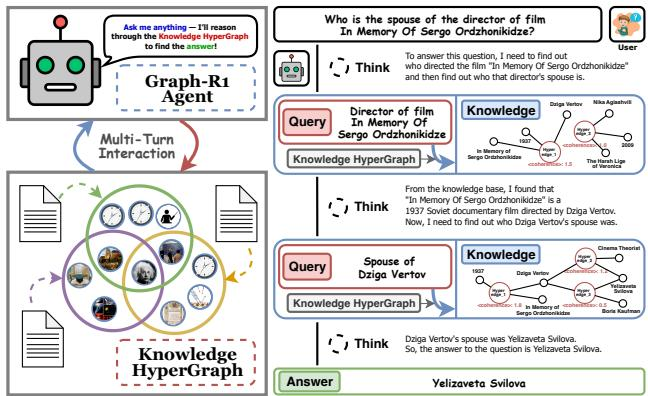  
Figure 1. An illustration of Graph-R1. Graph-R1 formulates GraphRAG as a multi-turn agentic retrieval process over a knowledge hypergraph, optimized via end-to-end reinforcement learning.

introduces external knowledge sources as references, alleviating the knowledge bottleneck of pure language modeling. Nevertheless, existing RAG methods mostly rely on chunk-based text blocks (Gao et al., 2024), which makes it difficult to capture complex knowledge structures among entities. To address this, GraphRAG methods (Edge et al., 2025; Guo et al., 2025b; Luo et al., 2025a) represent knowledge as entity-relation graphs, enhancing retrieval efficiency.

Generally, GraphRAG methods consist of three processes: knowledge graph construction, graph retrieval, and answer generation. First, knowledge graphs are typically constructed by LLMs to extract entities and relations from text, forming a graph structure (Xu et al., 2024). Second, the retrieval process queries relevant subgraphs or paths through subgraph retrieval or path pruning strategies (Chen et al., 2026; Gutiérrez et al., 2025). Finally, the generation process prompts LLMs to generate answers based on the retrieved graph-based knowledge (Xiao et al., 2025).

However, current GraphRAG methods still face three key challenges: (i) High cost and semantic loss in knowledge construction process. Compared to standard RAG, GraphRAG methods convert natural language knowledge into graph structures using LLMs, which results in high cost and often causes semantic loss relative to the original content (Luo et al., 2024; 2025a). (ii) Fixed retrieval process with only one-time interaction in graph retrieval process. Although existing GraphRAG methods design various retrieval strategies to improve efficiency, most of them aim to gather sufficient knowledge in a single fixed retrieval (Chen et al., 2026), which limits performance in complex queries. (iii) Dependence on large LLMs for long-context analysis and prompt quality in answer generation process. Generation based on retrieved graph-structured knowledge often requires strong long-context reasoning ability, making the output quality highly dependent on the LLM's parameter size and prompt design (Guo et al., 2025b).

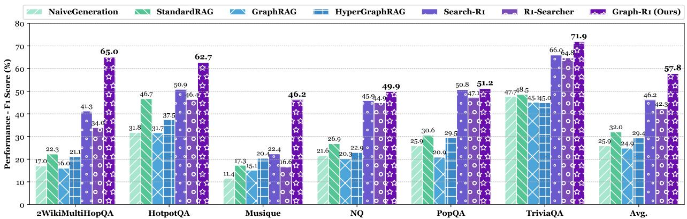  
Figure 2. Comparison of F1 scores across RAG benchmarks. Using a graph as the knowledge environment enables RL to achieve a higher performance ceiling compared to chunk-based knowledge. Graph-structured knowledge boosts accuracy by richer representation.

To address these challenges, we propose Graph-R1, as illustrated in Figure 1, the first agentic GraphRAG framework enhanced by end-to-end reinforcement learning (RL), inspired by DeepSeek-R1 (Guo et al., 2025a). First, we propose a lightweight knowledge hypergraph construction method to establish a standard agent environment for the query action space. Moreover, we model the retrieval process as a multi-turn agentic interaction process, enabling LLMs to repeatedly perform the reasoning loop of “think-retrieve-rethink-generate” within the knowledge hypergraph environment. Furthermore, we design an end-to-end reward mechanism that integrates generation quality, retrieval relevance, and structural reliability of graph paths into a unified optimization objective. Using RL, the agent learns a generalizable graph reasoning strategy and achieves tighter alignment between structured knowledge and language.

We perform experiments on various standard RAG datasets (Jin et al., 2025b). Experimental results demonstrate that Graph-R1 outperforms traditional GraphRAG methods and RAG combined with RL methods (Jin et al., 2025a; Song et al., 2025) in reasoning accuracy, retrieval efficiency, and generation quality. As shown in Figure 2, the end-to-end RL strategy guides the agent through multiple turns of interaction and goal-driven exploration in the graph, effectively bridging the gap between knowledge representation and language generation. This work lays a foundation for building the next generation of knowledge-driven and strategy-optimized agent-based generation systems.

## 2. Related Work

RAG and GraphRAG. Retrieval-Augmented Generation (RAG) (Lewis et al., 2020) improves LLM factuality by retrieving external knowledge, but struggles with data silos and limited structural reasoning. GraphRAG (Edge et al., 2025) mitigates these issues by incorporating graph-structured knowledge, inspiring enterprise systems (Wu et al., 2025; Liang et al., 2025; Wang et al., 2025a) and efficient variants like LightRAG (Guo et al., 2025b). Recent works further enhance representation power by diverse graph structures (Luo et al., 2025a; Feng et al., 2026a; Lin et al., 2025; Wang et al., 2025b; Xu et al., 2025; Zhuang et al., 2025), while retrieval optimization explores path-based exploration and pruning techniques (Chen et al., 2026; Gutiérrez et al., 2025; Liu et al., 2025; Wang & Han, 2025; Zhao et al., 2025b; Luo et al., 2025c; 2026; Lee et al., 2025; Dong et al., 2025; Yang et al., 2025b). In this work, we propose Graph-R1, the first agentic GraphRAG framework that learns a multi-turn retrieval policy via end-to-end RL.

Reinforcement Learning for LLMs. Reinforcement learning (RL) is increasingly adopted to enhance LLM reasoning (Wu, 2025; Luo et al., 2025b), as demonstrated by OpenAI's o1/o3/o4 (OpenAI et al., 2024b). DeepSeek-R1 (Guo et al., 2025a) achieves comparable capabilities and introduces the Group Relative Policy Optimization (GRPO) (Shao et al., 2024) for scalable end-to-end training, which has been extended to various downstream tasks (Ma et al., 2025; Feng et al., 2026b; Jiang et al., 2026). RL-enhanced agents have also shown strong performance in multi-turn interaction with different environments (Luo et al., 2025b; Feng et al., 2025; Jin et al., 2025a; Song et al., 2025; Liu et al., 2026), highlighting RL's potential in advancing agentic GraphRAG framework (Gao et al., 2025).

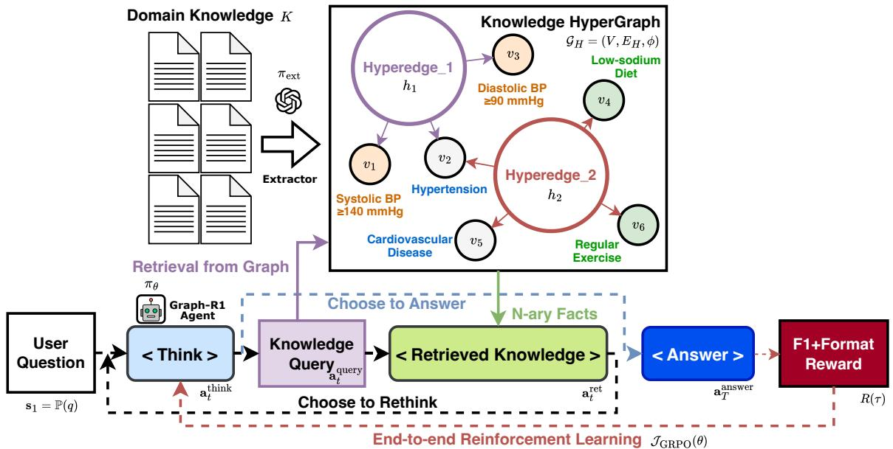  
Figure 3. Overview of the Graph-R1 framework: an RL-enhanced reasoning trajectory over knowledge hypergraph, where the agent iteratively decides to think, query from graph environment, retrieve n-ary facts as candidate knowledge, and answer the user question.

## 3. Preliminaries

We formalize the GraphRAG pipeline into three stages:

(a) Knowledge Graph Construction. Given a knowledge collection $K = \{d_{1}, d_{2}, \ldots, d_{N}\}$ , the goal is to extract facts $f_{d}$ from each semantic unit $d \in K$ into a unified graph $G_{K}$ :

$$
\mathcal {G} _ {K} \sim \sum_ {d \in K} \pi_ {\mathrm{ext}} (f _ {d} \mid d),\tag{1}
$$

where $\pi_{ext}$ denotes an LLM-based extractor that parses each d into a set of relation-entity pairs $f_{d} = \{(r_{i}, \mathcal{V}_{r_{i}})\}$ , with $r_{i}$ as the relation and $V_{r_{i}} = \{v_{1}, \ldots, v_{n}\}$ the entities.

(b) Graph Retrieval. Graph retrieval is formulated as a two-step process over $G_{K}$ : (1) retrieving candidate reasoning paths and (2) pruning irrelevant ones. Conditioned on a query q, the model first retrieves a candidate set $X_{q} = \{x_{1}, \ldots, x_{m}\}$ and then selects a relevant subset $Z_{q} \subseteq X_{q}$ . The overall objective is to maximize the joint likelihood:

$$
\begin{array}{l} \max _ {\theta} \mathbb {E} _ {\mathcal {Z} _ {q} \sim P (\mathcal {Z} _ {q} | q, \mathcal {G} _ {K})} \\ \left[ \prod_ {t = 1} ^ {T _ {x}} P _ {\theta} (x _ {t} \mid x _ {<   t}, q, \mathcal {G} _ {K}) \cdot \prod_ {t = 1} ^ {T _ {z}} P _ {\theta} (z _ {t} \mid z _ {<   t}, \mathcal {X} _ {q}, q) \right], \end{array}\tag{2}
$$

where $T_{x}$ & $T_{z}$ are numbers of retrieved & selected paths.

(c) Answer Generation. Given a query q and selected paths $Z_{q}$ , answer generation produces a natural language answer y grounded in graph-based evidence, formulated as:

$$
P (y \mid q, \mathcal {G} _ {K}) = \sum_ {\mathcal {Z} _ {q} \subseteq \mathcal {X} _ {q}} P (y \mid q, \mathcal {Z} _ {q}) \cdot P (\mathcal {Z} _ {q} \mid q, \mathcal {G} _ {K}),\tag{3}
$$

where $P(y \mid q, \mathcal{Z}_q)$ is generation likelihood and $P(\mathcal{Z}_q \mid q, \mathcal{G}_K)$ is retrieval-pruning distribution.

## 4. Methodology: Graph-R1

In this section, as illustrated in Figure 3, we introduce Graph-R1, including agent initialization, multi-turn graph interaction, and outcome-directed end-to-end RL optimization.

## 4.1. Agent Initialization

Graph-R1 adopts an LLM-driven agent, initialized with a knowledge hypergraph environment $G_{H}$ , the action space A, the state space S, and the answer target $y_{q}$ , given q.

Graph Environment $G_{H}$ . We propose a lightweight method for constructing a knowledge hypergraph $G_{H}$ from given domain knowledge $K = \{d_{1}, d_{2}, \ldots, d_{N}\}$ . For each chunk unit $d \in K$ , an LLM-based extractor $\pi_{ext}$ identifies m n-ary relational facts, where each comprises a semantic segment $h_{i}$ and a set of participating entities $\mathcal{V}_{h_{i}} = \{v_{1}, \ldots, v_{n}\}$ . A shared encoder $\phi(\cdot)$ is then used to generate semantic embeddings for both entities & relations:

$$
\begin{array}{l} \mathcal {G} _ {H} = (V, E _ {H}, \phi), \text {   where   } \pi_ {\mathrm{ext}} (d) \to \{(h _ {i}, \mathcal {V} _ {h _ {i}}) \} _ {i = 1} ^ {m}, \\ \text { and   } \phi (v) = \mathrm{Enc} (v), \phi (h _ {i}) = \mathrm{Enc} (h _ {i}), \end{array}\tag{4}
$$

where each $h_{i}$ defines a hyperedge $h_{i} \in E_{H}$ connecting its associated entities $V_{h_{i}}$ as $v \in V$ . The resulting hypergraph $G_{H}$ encodes n-ary relations with rich semantic grounding.

The Agent Action Space A. In Graph-R1, each agent action $a_{t} \in A$ comprises four sub-actions: Thinking $a_{t}^{think}$ , which decides whether to continue or terminate reasoning; Query Generation $a_{t}^{query}$ , which formulates a retrieval query; Graph Retrieval $a_{t}^{ret}$ , which extracts relevant knowledge from the hypergraph; and Answering $a_{t}^{ans}$ , which produces a final response if reasoning ends.

Table 1. Template for Graph-R1. question will be replaced with the specific user query. Note that the knowledge retrieved is placed within <knowledge>...</knowledge> after <query>...</query>.

You are a helpful assistant. Answer the given question. You can query from knowledge base provided to you to answer the question. You can query knowledge as many times as you want. You must first conduct reasoning inside <think>...</think>. If you need to query knowledge, you can set a query statement between <query>...</query> to query from knowledge base after <think>...</think>. When you have the final answer, you can output the answer inside <answer>...</answer>. Question: question. Assistant:

The agent action $a_{t}$ has two compositional forms, and the joint action log-likelihood $\log \pi(\mathbf{a}_{t} \mid \mathbf{s}_{t})$ is defined as:

$$
\left\{ \begin{array}{l l} \log \mathcal {G} _ {H} (\mathbf {a} _ {t} ^ {\text { ret }} \mid \mathbf {s} _ {t}, \mathbf {a} _ {t} ^ {\text { think }}, \mathbf {a} _ {t} ^ {\text { query }}) + \log \pi (\mathbf {a} _ {t} ^ {\text { query }} \mid \mathbf {s} _ {t}, \mathbf {a} _ {t} ^ {\text { think }}) + \\ \log \pi (\mathbf {a} _ {t} ^ {\text { think }} \mid \mathbf {s} _ {t}), & \text { if   } \mathbf {a} _ {t} ^ {\text { think }} \to \text { continue }, \\ \log \pi (\mathbf {a} _ {t} ^ {\text { ans }} \mid \mathbf {s} _ {t}, \mathbf {a} _ {t} ^ {\text { think }}) + \log \pi (\mathbf {a} _ {t} ^ {\text { think }} \mid \mathbf {s} _ {t}), & \text { if   } \mathbf {a} _ {t} ^ {\text { think }} \to \text { terminate }, \end{array} \right. \tag {5}\tag{5}
$$

where, at each step, the agent first performs Thinking, and then chooses between continuing reasoning (Query Generation and Graph Retrieval) or terminating via Answering.

The Agent State Space S and Target $y_{q}$ . At each step t, the state $s_{t} \in S$ is defined as $\mathbf{s}_{t} = (\mathbf{s}_{1}, \mathbf{a}_{1}, \ldots, \mathbf{a}_{t-1})$ , with $s_{1}$ initialized from the input query q. Once a termination action $a_{T}$ is issued, the agent reaches final state $s_{T}$ , where T is the total number of reasoning steps, and an answer $y_{q} \sim a_{T}^{ans}$ is produced to address q.

Proposition 1. Graph-structured knowledge boosts agent accuracy by richer representation.

Proof. We provide quantitative experimental results in Section 5.2 and qualitative proofs in Appendix B.1. $\square$

## 4.2. Reasoning via Multi-turn Graph Interaction

We model reasoning as a multi-turn interaction between an agent $\pi_{\theta}$ and a hypergraph $G_{H}$ . We first define the step-wise policy $\pi_{\theta}(\cdot \mid \mathbf{s}_{t})$ prompted by Table 1, then describe how to retrieve knowledge $\mathcal{G}_{H}(\mathbf{a}_{t}^{\mathrm{ret}} \mid \cdot, \mathbf{a}_{t}^{\mathrm{query}})$ based on $a_{t}^{query}$ , and finally present the objective to optimize $P(y_{q} \mid \cdot)$ .

Modeling the Step-wise Reasoning Policy. At each reasoning step $t$ , the LLM governs the agent's behavior by generating a structured output consisting of: (i) a thinking reflection $\mathbf{a}_t^{\text{think}}$ that summarizes the current state and highlights potential knowledge gaps; (ii) a composition indicator $\alpha_t \in \mathcal{A}_{\text{type}} = \{ (\text{query}, \text{retrieve}), (\text{answer}) \}$ that determines the sub-action structure; and (iii) a content output $\mathbf{a}_t^{\text{out}} \in \mathcal{A}_{\text{content}}$ , representing either a retrieval query or a final answer. We model this decision-making process as a hierarchical policy conditioned on the agent state $\mathbf{s}_t \in S$ . The policy is factorized as:

$$
\begin{array}{l} \pi_ {\theta} (\mathbf {a} _ {t} ^ {\text {think}}, \alpha_ {t}, \mathbf {a} _ {t} ^ {\text {out}} | \mathbf {s} _ {t}) = \\ \pi_ {\theta} (\mathbf {a} _ {t} ^ {\text {out}} | \alpha_ {t}, \mathbf {a} _ {t} ^ {\text {think}}, \mathbf {s} _ {t}) \cdot \pi_ {\theta} (\alpha_ {t} | \mathbf {a} _ {t} ^ {\text {think}}, \mathbf {s} _ {t}) \cdot \pi_ {\theta} (\mathbf {a} _ {t} ^ {\text {think}} | \mathbf {s} _ {t}), \end{array}\tag{6}
$$

where $\pi_{\theta}$ denotes the LLM-parameterized policy, which encourages three aligned behaviors: generating reflections $a_{t}^{think}$ that assess knowledge sufficiency, selecting $\alpha_{t}$ to balance exploration and termination, and producing $a_{t}^{out}$ that advances retrieval $a_{t}^{query}$ or yields a direct answer $a_{t}^{ans}$ .

Knowledge Interaction via Hypergraph Retrieval. Given a query $a_{t}^{query}$ generated by the reasoning LLM, we retrieve relevant knowledge $a_{t}^{ret}$ from the hypergraph $\mathcal{G}_{H} = (V, E_{H})$ through a dual-path interaction process: entity-based retrieval and direct hyperedge retrieval. The resulting n-ary relational facts are then aggregated via rank-based fusion to support downstream reasoning.

(i) Entity-based Hyperedge Retrieval. We first identify a set of top-ranked entities based on their similarity to the extracted entities $V_{a_{t}^{query}}$ , and collect hyperedges that connect to any retrieved entity:

$$
\begin{array}{l} \mathcal {R} _ {V} (\mathbf {a} _ {t} ^ {\text { query }}) = \underset {v \in V} {\operatorname{argmax}} ^ {k _ {V}} \left(\text { sim } (\phi (V _ {\mathbf {a} _ {t} ^ {\text { query }}}), \phi (v))\right), \\ \text { and } \mathcal {F} _ {V} ^ {*} = \bigcup_ {v _ {i} \in \mathcal {R} _ {V}} \{(e _ {H}, V _ {e _ {H}}) \mid v _ {i} \in V _ {e _ {H}}, e _ {H} \in E _ {H} \}, \end{array}\tag{7}
$$

where $\phi(V_{\mathbf{a}_{t}^{\mathrm{query}}})$ is the aggregated embedding of entities extracted from $a_{t}^{query}$ , $\phi(v)$ is the entity embedding, $k_{V}$ is the number of retrieved entities, and $V_{e_{H}}$ denotes the entity set of hyperedge $e_{H}$ .

(ii) Direct Hyperedge Retrieval. In parallel, we directly retrieve hyperedges based on query-hyperedge similarity, and collect their associated relational facts:

$$
\begin{array}{l} \mathcal {R} _ {H} (\mathbf {a} _ {t} ^ {\text { query }}) = \underset {e _ {H} \in E _ {H}} {\operatorname{argmax}} \left(\text { sim } (\phi (\mathbf {a} _ {t} ^ {\text { query }}), \phi (e _ {H}))\right), \\ \text { and } \mathcal {F} _ {H} ^ {*} = \bigcup_ {e _ {i} \in \mathcal {R} _ {H}} \{(e _ {i}, V _ {e _ {i}}) \mid V _ {e _ {i}} \subseteq V \}, \end{array}\tag{8}
$$

where $\phi(\mathbf{a}_{t}^{\mathrm{query}})$ is the query embedding, $\phi(e_{H})$ is the hyperedge embedding, $k_{H}$ is the number of retrieved hyperedges, and $V_{e_{i}}$ denotes the entity set of hyperedge $e_{i}$ .

(iii) Fusion via Reciprocal Rank Aggregation. To produce the final knowledge set, we merge results from both retrieval paths using reciprocal rank aggregation over hyperedges:

$$
\mathbf {a} _ {t} ^ {\text { ret }} = \mathcal {F} _ {\mathbf {a} _ {t} ^ {\text { query }}} ^ {*} = \text { Top- } k \left(\mathcal {F} _ {V} ^ {*} \cup \mathcal {F} _ {H} ^ {*}, \text { Score } (f) = \frac {1}{r _ {V}} + \frac {1}{r _ {H}}\right),\tag{9}
$$

where $r_{V}$ and $r_{H}$ are the ranks of n-ary relational fact f in $F_{V}^{*}$ and $F_{H}^{*}$ respectively (set to $\infty$ if absent), and k is the number of retrieved facts $a_{t}^{ret}$ returned to the agent.

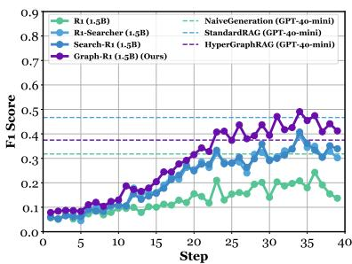  
(a) Qwen2.5-1.5B-Instruct

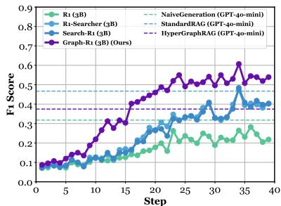

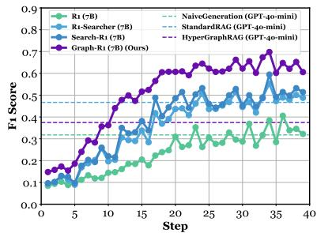  
(b) Qwen2.5-3B-Instruct  
(c) Qwen2.5-7B-Instruct  
Figure 4. Step-wise F1 score based on Qwen2.5 (1.5B, 3B, 7B), where Graph-R1 outperforms baselines and GPT-4o-mini variants.

Optimization Objective for Agent Trajectories. The agent aims to learn a reasoning trajectory $\tau\in T_{q}$ that yields a faithful and contextually grounded answer $y_{q}$ . Each trajectory $\tau=((\mathbf{s}_{1},\mathbf{a}_{1}),(\mathbf{s}_{2},\mathbf{a}_{2}),\ldots,(\mathbf{s}_{T},\mathbf{a}_{T}))$ comprises a sequence of actions executed over $G_{H}$ , defined as:

$$
\max _ {\theta} \mathbb {E} _ {\tau \sim \pi_ {\theta} (\mathcal {T} _ {q} | q; \mathcal {G} _ {H})} \left[ \log P (y _ {q} \mid \tau) \right],\tag{10}
$$

where $P(y_{q} \mid \tau)$ denotes the likelihood of the correct answer $y_{q} \sim a_{t}^{ans}$ under trajectory $\tau$ , guiding $\pi_{\theta}$ toward answer-consistent reasoning.

Proposition 2. Multi-turn interaction with the graph environment improves retrieval efficiency.

Proof. We provide quantitative experimental results in Section 5.5 and qualitative proofs in Appendix B.2. $\square$

## 4.3. Outcome-directed End-to-end RL Optimization

To optimize the reasoning policy $\pi_{\theta}$ toward generating faithful and well-structured answers, we adopt an end-to-end reinforcement learning objective based on Group Relative Policy Optimization (GRPO) (Shao et al., 2024) $\mathcal{J}_{\mathrm{GRPO}}(\theta)$ and design an outcome-directed reward function $R(\tau)$ .

End-to-end RL Objective $\mathcal{J}_{\mathrm{GRPO}}(\theta)$ . Given a dataset question $q \in D_{Q}$ , the agent interacts with the knowledge hypergraph $G_{H}$ to generate a group of multi-turn reasoning trajectories $\{\tau_{i}\}_{i=1}^{N} \subseteq T_{q}$ , where each $\tau_{i} = ((\mathbf{s}_{1}^{(i)}, \mathbf{a}_{1}^{(i)}), \ldots, (\mathbf{s}_{T}^{(i)}, \mathbf{a}_{T}^{(i)}))$ denotes a sequence of state-action pairs sampled from the environment. We optimize the policy $\pi_{\theta}$ using the GRPO-based objective:

$$
\begin{array}{l} \mathcal {J} _ {\mathrm{GRPO}} (\theta) = \mathbb {E} _ {\left[ \mathbf {s} _ {1} \sim \{\mathbb {P} (q) | q \in \mathcal {D} _ {Q} \}, \{\tau_ {i} \} _ {i = 1} ^ {N} \sim \pi_ {\theta_ {\mathrm{old}}} (\mathcal {T} _ {q} | \mathbf {s} _ {1}; \mathcal {G} _ {H}) \right]} \\ \left[ \frac {1}{N} \sum_ {i = 1} ^ {N} \frac {1}{| \tau_ {i} |} \sum_ {t = 1} ^ {| \tau_ {i} |} \min \Big (\rho_ {\theta} (\mathbf {a} _ {t} ^ {(i)}) \hat {A} (\tau_ {i}), \operatorname{clip} \Big (\rho_ {\theta} (\mathbf {a} _ {t} ^ {(i)}), 1 \pm \epsilon \Big) \hat {A} (\tau_ {i}) \Big) \right. \end{array}
$$

$-\beta \mathbb{D}_{\mathrm{KL}}(\pi_{\theta}||\pi_{\mathrm{ref}})]$ , where $\rho_{\theta}(\mathbf{a}_t^{(i)}) = \frac{\pi_\theta(\mathbf{a}_t^{(i)}|\mathbf{s}_{t - 1}^{(i)};\mathcal{G}_H))}{\pi_{\theta_{\mathrm{old}}}(\mathbf{a}_t^{(i)}|\mathbf{s}_{t - 1}^{(i)};\mathcal{G}_H))},$

and $\hat{A} (\tau_i) = \frac{R(\tau_i) - \mathrm{mean}\left(\{R(\tau_j)\}_{j = 1}^N\right)}{F_{\mathrm{norm}}\left(\{R(\tau_j)\}_{j = 1}^N\right)}.$

(11)

Here, $\pi_{\theta}$ is the current policy, and $\pi_{\theta_{old}}$ is the behavior policy used for sampling. The importance ratio $\rho_{\theta}(\mathbf{a}_{t}^{(i)})$ adjusts for distribution shift, while the advantage $\hat{A}(\tau_{i})$ normalizes the reward using a scaling function $F_{\mathrm{norm}}(\cdot)$ (e.g., standard deviation). The $\operatorname{clip}(\cdot)$ operator stabilizes updates by constraining policy shifts. A KL term $\mathrm{D}_{\mathrm{KL}}(\pi_{\theta} \parallel \pi_{\mathrm{ref}})$ regularizes toward a reference policy $\pi_{ref}$ , with $\beta$ controlling its strength. This objective encourages high-reward, stable reasoning over $G_{H}$ .

Outcome-directed Reward Function $R(\tau)$ . To meet outcome requirements, we define a reward function $R(\tau)$ composed of two parts: a format reward $R_{\mathrm{format}}(\tau)$ and an answer reward $R_{\mathrm{answer}}(\mathbf{a}_{T}^{\mathrm{ans}})$ , promoting both thoughtful retrieval and accurate answer generation.

(i) Format Reward. The format reward $R_{\mathrm{format}}(\tau)$ encourages the agent to follow the intended reasoning structure. At each step $(\mathbf{s}_{t}, \mathbf{a}_{t})$ , we check whether the output includes a well-formed block $(\mathbf{a}_{t}^{\mathrm{think}}, \alpha_{t}, \mathbf{a}_{t}^{\mathrm{out}})$ . Each valid step receives 0.5 reward, capped at 1.0 overall:

$$
R _ {\text { format }} (\tau) = \min \left(1. 0, 0. 5 \cdot \sum_ {t = 1} ^ {T} \mathbb {I} \left\{\left(\mathbf {a} _ {t} ^ {\text { think }}, \alpha_ {t}, \mathbf {a} _ {t} ^ {\text { out }}\right) \right\}\right)\tag{12}
$$

where $I\{\cdot\}$ is an indicator function that returns 1 if the step output matches the expected format.

(ii) Answer Reward. The answer reward $R_{\text{answer}}(\mathbf{a}_{T}^{\text{ans}})$ measures the semantic correctness of the generated answer $a_{T}^{ans}$ by comparing it with the ground-truth answer $y_{q}^{*}$ using a token-level F1 score $R_{\text{answer}}(\mathbf{a}_{T}^{\text{ans}})$ .

(iii) Overall Outcome Reward. The total reward for a reasoning trajectory $\tau$ is defined as:

$$
R (\tau) = - 1. 0 + R _ {\text { format }} (\tau) + \mathbb {I} \left\{R _ {\text { format }} (\tau) = 1. 0 \right\} \cdot R _ {\text { answer }} \left(\mathbf {a} _ {T} ^ {\text { ans }}\right),\tag{13}
$$

where $a_{T}^{ans} \in \tau$ , ensuring that answer correctness is only rewarded when the format is structurally valid.

Proposition 3. End-to-end RL bridges the gap between graph-based knowledge and language.

Proof. We provide quantitative experimental results in Section 5.6 and qualitative proofs in Appendix B.3. $\square$

Table 2. Main results with best in bold. ⊕ means prompt engineering, ⊙ means training, ∅ means no knowledge interaction, □□ means chunk-based knowledge, and ✗× means graph-based knowledge.

<table><tr><td rowspan="2" colspan="2">Method</td><td colspan="2">2Wiki.</td><td colspan="2">HotpotQA</td><td colspan="2">Musique</td><td colspan="2">NQ</td><td colspan="2">PopQA</td><td colspan="2">TriviaQA</td><td colspan="4">Avg.</td></tr><tr><td>F1</td><td>G-E</td><td>F1</td><td>G-E</td><td>F1</td><td>G-E</td><td>F1</td><td>G-E</td><td>F1</td><td>G-E</td><td>F1</td><td>G-E</td><td>EM</td><td>F1</td><td>R-S</td><td>G-E</td></tr><tr><td colspan="18">GPT-4o-mini</td></tr><tr><td>∅</td><td>NaiveGeneration</td><td>17.03</td><td>74.86</td><td>31.79</td><td>78.48</td><td>11.45</td><td>76.61</td><td>21.59</td><td>84.64</td><td>25.95</td><td>72.75</td><td>47.73</td><td>83.33</td><td>11.36</td><td>25.92</td><td>-</td><td>78.45</td></tr><tr><td>∅</td><td>StandardRAG</td><td>22.31</td><td>73.02</td><td>46.70</td><td>81.88</td><td>17.31</td><td>74.93</td><td>26.85</td><td>84.55</td><td>30.58</td><td>69.42</td><td>48.55</td><td>84.63</td><td>18.10</td><td>32.05</td><td>52.68</td><td>78.07</td></tr><tr><td>∅</td><td>GraphRAG</td><td>16.02</td><td>72.81</td><td>31.67</td><td>77.37</td><td>15.14</td><td>74.43</td><td>20.31</td><td>82.36</td><td>20.92</td><td>65.88</td><td>45.13</td><td>82.76</td><td>12.50</td><td>24.87</td><td>32.48</td><td>75.94</td></tr><tr><td>∅</td><td>LightRAG</td><td>16.59</td><td>71.94</td><td>30.70</td><td>73.42</td><td>14.39</td><td>73.75</td><td>19.09</td><td>80.20</td><td>20.47</td><td>67.76</td><td>40.18</td><td>81.60</td><td>9.77</td><td>23.57</td><td>47.42</td><td>74.78</td></tr><tr><td>∅</td><td>PathRAG</td><td>12.42</td><td>67.19</td><td>23.12</td><td>71.81</td><td>11.49</td><td>69.94</td><td>20.01</td><td>81.99</td><td>15.65</td><td>60.58</td><td>37.44</td><td>80.94</td><td>7.03</td><td>20.02</td><td>46.71</td><td>72.08</td></tr><tr><td>∅</td><td>HippoRAG2</td><td>16.27</td><td>68.78</td><td>31.78</td><td>76.43</td><td>12.37</td><td>73.05</td><td>24.56</td><td>84.65</td><td>21.10</td><td>63.31</td><td>46.86</td><td>83.55</td><td>13.80</td><td>25.49</td><td>36.41</td><td>74.96</td></tr><tr><td>∅</td><td>HyperGraphRAG</td><td>21.14</td><td>76.76</td><td>37.46</td><td>80.50</td><td>20.40</td><td>79.29</td><td>22.95</td><td>81.22</td><td>29.48</td><td>70.55</td><td>44.95</td><td>85.20</td><td>13.15</td><td>29.40</td><td>61.82</td><td>78.92</td></tr><tr><td colspan="18">Qwen2.5-1.5B-Instruct</td></tr><tr><td>∅</td><td>NaiveGeneration</td><td>7.78</td><td>49.13</td><td>4.27</td><td>45.77</td><td>2.35</td><td>46.63</td><td>6.03</td><td>46.74</td><td>10.06</td><td>42.67</td><td>8.10</td><td>52.92</td><td>1.17</td><td>6.43</td><td>-</td><td>47.31</td></tr><tr><td>∅</td><td>StandardRAG</td><td>11.46</td><td>55.38</td><td>9.93</td><td>52.91</td><td>3.18</td><td>39.46</td><td>11.39</td><td>59.73</td><td>13.08</td><td>50.29</td><td>17.43</td><td>60.52</td><td>5.73</td><td>11.08</td><td>52.84</td><td>53.05</td></tr><tr><td>∅</td><td>SFT</td><td>13.26</td><td>34.72</td><td>13.61</td><td>38.93</td><td>5.14</td><td>28.50</td><td>11.56</td><td>46.61</td><td>15.61</td><td>31.35</td><td>26.18</td><td>46.66</td><td>9.83</td><td>14.23</td><td>-</td><td>37.80</td></tr><tr><td>∅</td><td>R1</td><td>26.28</td><td>47.48</td><td>20.07</td><td>44.43</td><td>4.84</td><td>39.12</td><td>16.75</td><td>45.95</td><td>21.36</td><td>44.50</td><td>34.78</td><td>48.59</td><td>14.19</td><td>20.68</td><td>-</td><td>45.01</td></tr><tr><td>∅</td><td>Search-R1</td><td>28.43</td><td>60.61</td><td>39.99</td><td>64.16</td><td>4.69</td><td>39.32</td><td>20.26</td><td>59.93</td><td>39.63</td><td>58.19</td><td>44.16</td><td>63.01</td><td>23.18</td><td>29.53</td><td>50.45</td><td>57.54</td></tr><tr><td>∅</td><td>R1-Searcher</td><td>28.01</td><td>58.81</td><td>41.50</td><td>61.54</td><td>6.26</td><td>38.31</td><td>36.86</td><td>60.79</td><td>38.37</td><td>56.02</td><td>42.57</td><td>61.24</td><td>23.70</td><td>32.26</td><td>50.68</td><td>56.12</td></tr><tr><td>∅</td><td>Graph-R1 (ours)</td><td>35.13</td><td>65.73</td><td>40.62</td><td>65.30</td><td>28.28</td><td>58.82</td><td>35.62</td><td>59.13</td><td>43.55</td><td>66.46</td><td>57.36</td><td>70.83</td><td>31.90</td><td>40.09</td><td>59.35</td><td>64.38</td></tr><tr><td colspan="18">Qwen2.5-3B-Instruct</td></tr><tr><td>∅</td><td>NaiveGeneration</td><td>7.59</td><td>55.00</td><td>11.16</td><td>53.75</td><td>3.67</td><td>54.00</td><td>8.90</td><td>57.18</td><td>10.89</td><td>49.08</td><td>10.89</td><td>48.16</td><td>3.26</td><td>8.85</td><td>-</td><td>52.86</td></tr><tr><td>∅</td><td>StandardRAG</td><td>12.52</td><td>60.01</td><td>15.41</td><td>62.51</td><td>2.92</td><td>50.40</td><td>10.69</td><td>65.13</td><td>14.70</td><td>57.25</td><td>21.92</td><td>68.43</td><td>3.39</td><td>13.03</td><td>52.69</td><td>60.62</td></tr><tr><td>∅</td><td>SFT</td><td>12.40</td><td>52.31</td><td>16.48</td><td>51.35</td><td>5.04</td><td>51.31</td><td>11.23</td><td>58.20</td><td>16.95</td><td>46.42</td><td>33.02</td><td>59.98</td><td>9.64</td><td>15.85</td><td>-</td><td>53.26</td></tr><tr><td>∅</td><td>R1</td><td>28.45</td><td>56.92</td><td>25.33</td><td>55.38</td><td>8.07</td><td>47.53</td><td>21.51</td><td>55.11</td><td>27.11</td><td>48.65</td><td>47.91</td><td>60.74</td><td>19.66</td><td>26.40</td><td>-</td><td>54.06</td></tr><tr><td>∅</td><td>Search-R1</td><td>38.04</td><td>54.39</td><td>43.84</td><td>69.32</td><td>7.65</td><td>46.43</td><td>37.96</td><td>52.90</td><td>38.67</td><td>63.74</td><td>47.99</td><td>60.37</td><td>28.65</td><td>35.69</td><td>49.99</td><td>57.86</td></tr><tr><td>∅</td><td>R1-Searcher</td><td>23.50</td><td>55.86</td><td>42.44</td><td>64.60</td><td>12.81</td><td>50.07</td><td>36.53</td><td>63.33</td><td>40.18</td><td>66.23</td><td>54.00</td><td>60.52</td><td>27.08</td><td>34.91</td><td>49.98</td><td>60.10</td></tr><tr><td>∅</td><td>Graph-R1 (ours)</td><td>57.56</td><td>76.45</td><td>56.75</td><td>77.46</td><td>40.51</td><td>67.84</td><td>44.75</td><td>69.92</td><td>45.65</td><td>71.27</td><td>62.31</td><td>75.01</td><td>42.45</td><td>51.26</td><td>60.19</td><td>72.99</td></tr><tr><td colspan="18">Qwen2.5-7B-Instruct</td></tr><tr><td>∅</td><td>NaiveGeneration</td><td>12.25</td><td>66.75</td><td>16.58</td><td>65.31</td><td>4.06</td><td>65.47</td><td>13.00</td><td>69.56</td><td>12.82</td><td>60.50</td><td>24.51</td><td>72.65</td><td>3.12</td><td>13.87</td><td>-</td><td>66.71</td></tr><tr><td>∅</td><td>StandardRAG</td><td>12.75</td><td>60.06</td><td>21.10</td><td>66.13</td><td>4.53</td><td>59.84</td><td>15.97</td><td>70.49</td><td>16.10</td><td>60.86</td><td>24.90</td><td>73.71</td><td>5.34</td><td>15.89</td><td>52.67</td><td>65.18</td></tr><tr><td>∅</td><td>SFT</td><td>20.28</td><td>63.85</td><td>27.59</td><td>65.65</td><td>10.02</td><td>63.50</td><td>19.02</td><td>68.19</td><td>27.93</td><td>56.31</td><td>39.21</td><td>70.25</td><td>15.57</td><td>24.01</td><td>-</td><td>64.63</td></tr><tr><td>∅</td><td>R1</td><td>30.99</td><td>59.19</td><td>37.05</td><td>60.12</td><td>14.53</td><td>49.39</td><td>28.45</td><td>57.63</td><td>30.35</td><td>53.38</td><td>57.33</td><td>66.73</td><td>25.91</td><td>33.12</td><td>-</td><td>57.74</td></tr><tr><td>∅</td><td>Search-R1</td><td>41.29</td><td>70.26</td><td>50.85</td><td>73.85</td><td>22.35</td><td>57.68</td><td>45.88</td><td>67.58</td><td>50.76</td><td>66.08</td><td>65.98</td><td>76.15</td><td>38.54</td><td>46.19</td><td>51.60</td><td>68.60</td></tr><tr><td>∅</td><td>R1-Searcher</td><td>33.96</td><td>69.61</td><td>46.36</td><td>74.56</td><td>16.63</td><td>59.05</td><td>44.93</td><td>68.54</td><td>47.12</td><td>66.74</td><td>64.76</td><td>75.95</td><td>34.51</td><td>42.29</td><td>51.26</td><td>69.08</td></tr><tr><td>∅</td><td>Graph-R1 (ours)</td><td>65.04</td><td>82.42</td><td>62.69</td><td>80.03</td><td>46.17</td><td>71.42</td><td>49.87</td><td>70.97</td><td>51.22</td><td>73.43</td><td>71.93</td><td>79.11</td><td>48.57</td><td>57.82</td><td>60.40</td><td>76.23</td></tr></table>

## 5. Experiments

This section presents the experimental setup, main results, and analysis. We answer the following research questions (RQs): RQ1: Does Graph-R1 outperform other methods? RQ2: Does the main component of Graph-R1 work, and how is its comparative analysis? RQ3-5: How are construction cost, retrieval efficiency, and generation quality?

## 5.1. Experimental Setup

Datasets. To evaluate the performance of Graph-R1, we conduct experiments across six standard RAG datasets (Jin et al., 2025b): 2WikiMultiHopQA (2Wiki.) (Ho et al., 2020), HotpotQA (Yang et al., 2018), Musique (Trivedi et al., 2022), Natural Questions (NQ) (Kwiatkowski et al., 2019), PopQA (Mallen et al., 2023), and TriviaQA (Joshi et al., 2017). More details are in Appendix D.

Baselines. We mainly compare Graph-R1 with NaiveGeneration, StandardRAG (Lewis et al., 2020), SFT (Zheng et al., 2024), R1 (Shao et al., 2024), Search-R1 (Jin et al., 2025a), and R1-Searcher (Song et al., 2025) at three Qwen2.5 (Qwen et al., 2025) scales: 1.5 B, 3 B, and 7 B. We also compare GraphRAG (Edge et al., 2025), LightRAG (Guo et al., 2025b), PathRAG (Chen et al., 2026), HippoRAG2 (Gutiérrez et al., 2025), and HyperGraphRAG (Luo et al., 2025a) based on GPT-4o-mini (OpenAI et al., 2024a) as a reference. More details are in Appendix E.

Evaluation Metrics. We evaluate Graph-R1 and baselines with four metrics: Exact Match (EM), F1, Retrieval Similarity (R-S), and Generation Evaluation (G-E), which together assess answer correctness, retrieval relevance, and overall generation quality. These metrics provide a comprehensive evaluation of both retrieval and generation components of the framework. More details are in Appendix F.

Implementation Details. We use GPT-4o-mini for knowledge construction in Graph-R1 and GraphRAG baselines. For retrieval, we use bge-large-en-v1.5 (Chen et al., 2023) in all variants. All experiments are done on 4 NVIDIA A100 GPUs (80GB) with identical training and inference settings. More details are in Appendix G.

<table><tr><td rowspan="2">Method</td><td colspan="4">2Wiki.</td><td colspan="4">HotpotQA</td><td colspan="4">Avg.</td></tr><tr><td>EM</td><td>F1</td><td>R-S</td><td>G-E</td><td>EM</td><td>F1</td><td>R-S</td><td>G-E</td><td>EM</td><td>F1</td><td>R-S</td><td>G-E</td></tr><tr><td colspan="13">Qwen2.5-3B-Instruct</td></tr><tr><td>Graph-R1</td><td>50.00</td><td>57.56</td><td>55.78</td><td>76.45</td><td>50.78</td><td>56.75</td><td>54.74</td><td>77.46</td><td>50.39</td><td>57.16</td><td>55.26</td><td>76.96</td></tr><tr><td>w/o K.C.</td><td>36.33</td><td>44.94</td><td>53.46</td><td>65.83</td><td>40.63</td><td>47.27</td><td>53.23</td><td>72.69</td><td>38.48</td><td>46.11</td><td>53.35</td><td>69.26</td></tr><tr><td>w/o M.I.</td><td>21.88</td><td>34.34</td><td>54.70</td><td>66.59</td><td>30.86</td><td>37.64</td><td>53.34</td><td>64.75</td><td>26.37</td><td>35.99</td><td>54.02</td><td>65.67</td></tr><tr><td>w/o R.L.</td><td>0.78</td><td>8.91</td><td>10.16</td><td>47.14</td><td>5.47</td><td>12.56</td><td>14.44</td><td>58.60</td><td>3.13</td><td>10.74</td><td>12.30</td><td>52.87</td></tr><tr><td colspan="13">Qwen2.5-7B-Instruct</td></tr><tr><td>Graph-R1</td><td>55.47</td><td>65.04</td><td>55.24</td><td>82.42</td><td>57.03</td><td>62.69</td><td>56.27</td><td>80.03</td><td>56.25</td><td>63.87</td><td>55.76</td><td>81.23</td></tr><tr><td>w/o K.C.</td><td>44.14</td><td>51.81</td><td>54.10</td><td>75.90</td><td>49.22</td><td>55.93</td><td>54.14</td><td>76.78</td><td>46.68</td><td>53.87</td><td>54.12</td><td>76.34</td></tr><tr><td>w/o M.I.</td><td>37.50</td><td>44.78</td><td>54.54</td><td>69.98</td><td>40.63</td><td>47.04</td><td>54.58</td><td>69.63</td><td>39.07</td><td>45.91</td><td>54.56</td><td>69.81</td></tr><tr><td>w/o R.L.</td><td>0.00</td><td>18.25</td><td>54.63</td><td>75.81</td><td>3.12</td><td>17.33</td><td>53.80</td><td>78.92</td><td>1.56</td><td>17.79</td><td>54.22</td><td>77.37</td></tr></table>

(a) Ablation Study

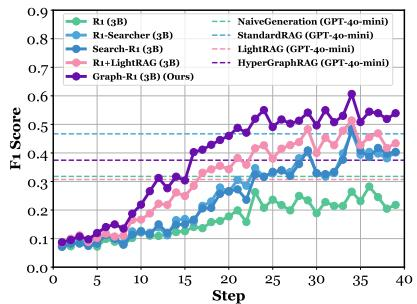  
(b) Representations

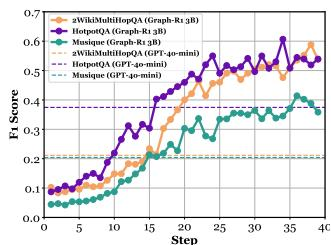  
(c) Datasets

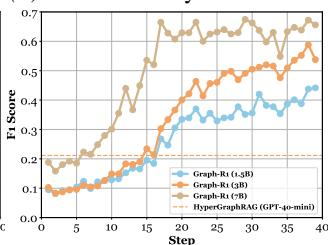  
(d) Parameters

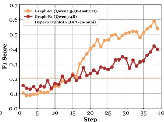  
(e) Qwen3

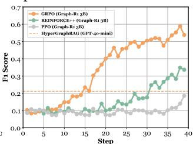  
(f) Algorithms  
Figure 5. (a) Ablation study of Graph-R1. (b–f) Performance comparison across different kinds of knowledge representations, RAG datasets, model parameters, Qwen versions, and RL algorithms.

## 5.2. Main Results (RQ1)

As shown in Table 2, we compare Graph-R1 with baselines across different base models, and observe that Graph-R1 consistently outperforms all baselines. In addition, we have two key observations.

RL Unlocks the Power of Graph Representations. Prompt-only GraphRAG methods often underperform StandardRAG, showing that graph structures alone are not sufficient. Graph-R1, with multi-turn RL optimization, fully exploits structural signals, achieving 57.28 F1 under Qwen2.5-7B-Instruct, surpassing StandardRAG (32.05), HyperGraphRAG (29.40) and Search-R1 (46.19).

Larger Base Model Further Enhances Performance. As base model size increases from 1.5B to 3B and 7B, Graph-R1 achieves steadily higher F1 scores: 40.09, 51.26, and 57.82. Moreover, its gap over other RL-enhanced baselines such as Search-R1 and R1-Searcher becomes increasingly evident. This shows that larger models better exploit the synergy between graph structures and RL.

## 5.3. Ablation Study and Comparative Analysis (RQ2)

Figures 6 shows an ablation study and comparative analysis.

Ablation Study. We remove three core components of Graph-R1: knowledge construction (K.C.), multi-turn interaction (M.I.), and reinforcement learning (R.L.), to assess their individual contributions. As shown in Figure 5a, removing any module leads to performance degradation.

Comparison with Different Knowledge Representations. As shown in Figures 4 and 5b, models without external knowledge (green) perform the worst. Chunk-based knowledge with RL (blue) performs better, but is still inferior to graph-based methods using binary relations (pink), while hypergraph-based knowledge with RL (red) achieves the highest ceiling. This demonstrates that, when combined with RL, stronger knowledge representations yield higher performance potential.

Comparison across Datasets and Base Models. As shown in Figures 5c and 5d, Graph-R1 consistently outperforms baselines across different datasets and parameter sizes, showcasing strong scalability. Interestingly, Figure 5e shows that when Graph-R1 is trained on Qwen3 (4B) (Yang et al., 2025a), which is already well trained by RL, the model tends to over-rely on its own internal reasoning. Despite a stronger starting point, its overall performance ceiling appears slightly lower.

Comparison with Different RL Algorithms. Figure 5f compares different RL strategies. GRPO significantly outperforms REINFORCE++ (Hu et al., 2025) and PPO (Schulman et al., 2017), achieving the highest F1. This confirms that GRPO facilitates more stable training and stronger multi-turn graph reasoning, making it a favorable choice for training agentic GraphRAG models.

## 5.4. Analysis of Graph-R1's Construction Cost (RQ3)

As shown in Table 6a, we utilize metrics: time per 1K tokens (TP1KT), cost per 1M tokens (CP1MT), number of nodes & edges, time per query (TPQ), cost per 1K queries (CP1KQ), and final F1 score.

Construction Cost. Graph-R1 requires only 5.69 seconds and \$2.81 per 1K tokens for knowledge construction, lower than GraphRAG (8.04s, \$3.35) and HyperGraphRAG (6.76s, \$4.14). Generating over 120K nodes and 98K edges, Graph-R1 maintains a semantically rich structure.

<table><tr><td rowspan="2">Method</td><td colspan="4">Knowledge Construction</td><td colspan="3">Retrieval &amp; Generation</td></tr><tr><td>TP1KT</td><td>CP1MT</td><td>#Node</td><td>#Edge</td><td>TPQ</td><td>CP1KQ</td><td>F1</td></tr><tr><td>NaiveGeneration</td><td>0 s</td><td>0 $</td><td>-</td><td>-</td><td>3.7 s</td><td>0.16 $</td><td>17.0</td></tr><tr><td>StandardRAG</td><td>0 s</td><td>0 $</td><td>-</td><td>-</td><td>4.1 s</td><td>1.35 $</td><td>22.3</td></tr><tr><td>GraphRAG</td><td>8.04 s</td><td>3.35 $</td><td>7,771</td><td>4,863</td><td>7.4 s</td><td>3.97 $</td><td>16.0</td></tr><tr><td>LightRAG</td><td>6.84 s</td><td>4.07 $</td><td>59,197</td><td>24,596</td><td>12.2 s</td><td>8.11 $</td><td>16.6</td></tr><tr><td>PathRAG</td><td>6.84 s</td><td>4.07 $</td><td>59,197</td><td>24,596</td><td>15.8 s</td><td>8.28 $</td><td>12.4</td></tr><tr><td>HippoRAG2</td><td>3.25 s</td><td>1.26 $</td><td>11,819</td><td>40,654</td><td>8.8 s</td><td>7.68 $</td><td>16.3</td></tr><tr><td>HyperGraphRAG</td><td>6.76 s</td><td>4.14 $</td><td>173,575</td><td>114,426</td><td>9.6 s</td><td>8.76 $</td><td>21.1</td></tr><tr><td>Graph-R1 (7B) (ours)</td><td>5.69 s</td><td>2.81 $</td><td>120,499</td><td>98,073</td><td>7.0 s</td><td>0 $</td><td>65.0</td></tr></table>

(a)

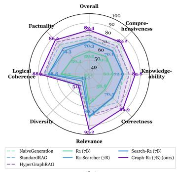  
(b)  
Figure 6. (a) Time & Cost Comparisons on 2Wiki. (b) Generation Evaluations.

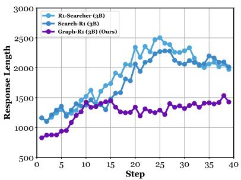  
(a) Response Length

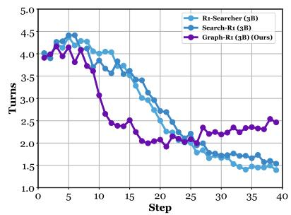  
(b) Turns of Interaction

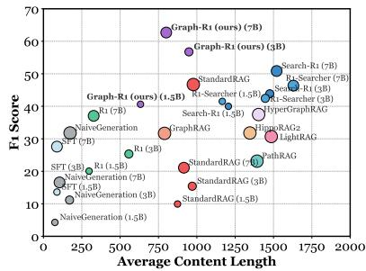  
(c) Efficiency Comparison  
Figure 7. Step-wise response length & turns of interaction, and efficiency comparison on HotpotQA.

Generation Cost. By leveraging end-to-end RL and localized knowledge retrieval, Graph-R1 achieves not only the best F1 but also a response time of 7.0s per query and a generation cost of \$0, outperforming baselines such as HyperGraphRAG (9.6s, \$8.76), highlighting its superior potential for real-world deployment.

## 5.5. Analysis of Graph-R1's Retrieval Efficiency (RQ4)

As shown in Figure 7, to evaluate Graph-R1's retrieval efficiency, we analyze it from (a) response length, (b) number of interaction turns, and (c) performance with average retrieval content lengths.

Tendency toward More Concise Thinking and Adequate Interaction. As shown in Figures 7a and 7b, Graph-R1 generates shorter responses and conducts more interaction turns, averaging around 1200-1500 tokens and 2.3-2.5 turns, leading to more stable and accurate retrieval.

Balancing Performance and Retrieved Content Length. As shown in Figure 7c, Graph-R1 achieves the highest F1 scores with a moderate amount of average retrieved content compared to other methods, balancing input length and performance through its multi-turn interaction strategy.

## 5.6. Analysis of Graph-R1's Generation Quality (RQ5)

As shown in Figure 6b, we evaluate the generation quality in seven dimensions and present a case study in Table 4.

High-Quality Generation Performance. Graph-R1 outperforms all RL-based baselines and achieves generation quality comparable to GPT-4o-mini-based methods like HyperGraphRAG, with strong results in Correctness (86.9), Relevance (95.2), and Logical Coherence (88.5).

RL Bridges the Gap Between Graph & Language. HyperGraphRAG performs similarly to StandardRAG, indicating limited gains from graph structure alone. In contrast, Graph-R1 achieves a much higher Overall score (82.4 vs. 70.3) than Search-R1, showing that graph-based reasoning becomes truly effective when combined with RL.

## 6. Conclusion

In this work, we introduce Graph-R1, the agentic GraphRAG framework powered by end-to-end RL. By introducing lightweight knowledge hypergraph construction and modeling retrieval as a multi-turn interaction process, Graph-R1 bridges graph-structured knowledge with natural language generation. A unified reward mechanism enables outcome-directed reasoning. Experiments across six benchmarks demonstrate Graph-R1's superiority in accuracy, retrieval efficiency, and generation quality.

## Acknowledgments

This work is supported by the National Natural Science Foundation of China (Grant No. 62473271, Grant No. 62176026, and Grant No. 62406036) and the Fundamental Research Funds for the Beijing University of Posts and Telecommunications (Grant No. 2025AI4S03). We also acknowledge the support from the Engineering Research Center of Information Networks, Ministry of Education, China. This work is also supported by the National Research Foundation, Singapore, under its Frontier Competitive Research Programme (NRF-F-CRP-2024-0005). Any opinions, findings and conclusions or recommendations expressed in this material are those of the authors and do not reflect the views of National Research Foundation, Singapore.

## Impact Statement

This work poses no significant ethical concerns, as it relies solely on publicly available datasets, and its broader societal impact is expected to be positive by advancing reliable and structured knowledge-grounded reasoning for retrieval-augmented generation systems.

## References

Chen, B., Guo, Z., Yang, Z., Chen, Y., Chen, J., Liu, Z., Shi, C., and Yang, C. Pathrag: Pruning graph-based retrieval augmented generation with relational paths. Proceedings of the AAAI Conference on Artificial Intelligence, 40(36):30183–30191, Mar. 2026. doi: 10.1609/aaai.v40i36.40268. URL https://ojs.aaai.org/index.php/AAAI/article/view/40268.

Chen, J., Xiao, S., Zhang, P., Luo, K., Lian, D., and Liu, Z. Bge m3-embedding: Multi-lingual, multifunctionality, multi-granularity text embeddings through self-knowledge distillation, 2023.

Dong, J., An, S., Yu, Y., Zhang, Q.-W., Luo, L., Huang, X., Wu, Y., Yin, D., and Sun, X. Youtu-graphrag: Vertically unified agents for graph retrieval-augmented complex reasoning, 2025. URL https://arxiv.org/abs/2508.19855.

Edge, D., Trinh, H., Cheng, N., Bradley, J., Chao, A., Mody, A., Truitt, S., Metropolitansky, D., Ness, R. O., and Larson, J. From local to global: A graph rag approach to query-focused summarization, 2025. URL https://arxiv.org/abs/2404.16130.

Feng, L., Xue, Z., Liu, T., and An, B. Group-in-group policy optimization for llm agent training. In Belgrave, D., Zhang, C., Lin, H., Pascanu, R., Koniusz, P., Ghassemi, M., and Chen, N. (eds.), Advances in Neural Informa-

tion Processing Systems, volume 38, pp. 46375–46408. Curran Associates, Inc., 2025.

Feng, Y., Hu, H., Ying, S., Hou, X., Liu, S., Yang, M., Li, J., Du, S., Zheng, N., Hu, H., and Gao, Y. Hyperrag: combating llm hallucinations using hypergraph-driven retrieval-augmented generation. Nature Communications, 2026a. ISSN 2041-1723. doi: 10.1038/s41467-026-71411-1. URL https://doi.org/10.1038/s41467-026-71411-1.

Feng, Y., Luo, H., Feng, L., Zhao, S., and Luu, A. T. From stimuli to minds: Enhancing psychological reasoning in llms via bilateral reinforcement learning. Proceedings of the AAAI Conference on Artificial Intelligence, 40(1):274–282, Mar. 2026b. doi: 10.1609/aaai.v40i1.36988. URL https://ojs.aaai.org/index.php/AAAI/article/view/36988.

Gao, Y., Xiong, Y., Gao, X., Jia, K., Pan, J., Bi, Y., Dai, Y., Sun, J., Wang, M., and Wang, H. Retrieval-augmented generation for large language models: A survey, 2024. URL https://arxiv.org/abs/2312.10997.

Gao, Y., Xiong, Y., Zhong, Y., Bi, Y., Xue, M., and Wang, H. Synergizing rag and reasoning: A systematic review, 2025. URL https://arxiv.org/abs/2504.15909.

Guo, D., Yang, D., Zhang, H., Song, J., Wang, P., Zhu, Q., Xu, R., Zhang, R., Ma, S., Bi, X., et al. Deepseek-r1 incentivizes reasoning in llms through reinforcement learning. Nature, 645(8081):633–638, 2025a.

Guo, Z., Xia, L., Yu, Y., Ao, T., and Huang, C. LightRAG: Simple and fast retrieval-augmented generation. In Christodoulopoulos, C., Chakraborty, T., Rose, C., and Peng, V. (eds.), Findings of the Association for Computational Linguistics: EMNLP 2025, pp. 10746–10761, Suzhou, China, November 2025b. Association for Computational Linguistics. ISBN 979-8-89176-335-7. doi: 10.18653/v1/2025.findings-emnlp.568. URL https://aclanthology.org/2025.findings-emnlp.568/.

Gutiérrez, B. J., Shu, Y., Qi, W., Zhou, S., and Su, Y. From RAG to memory: Non-parametric continual learning for large language models. In Singh, A., Fazel, M., Hsu, D., Lacoste-Julien, S., Berkenkamp, F., Maharaj, T., Wagstaff, K., and Zhu, J. (eds.), Proceedings of the 42nd International Conference on Machine Learning, volume 267 of Proceedings of Machine Learning Research, pp. 21497–21515. PMLR, 13–19 Jul 2025. URL https://proceedings.mlr.press/v267/gutierrez25a.html.

Ho, X., Duong Nguyen, A.-K., Sugawara, S., and Aizawa, A. Constructing a multi-hop QA dataset for comprehensive evaluation of reasoning steps. In Scott, D., Bel, N., and Zong, C. (eds.), Proceedings of the 28th International Conference on Computational Linguistics, pp. 6609–6625, Barcelona, Spain (Online), December 2020. International Committee on Computational Linguistics. doi: 10.18653/v1/2020.coling-main.580. URL https://aclanthology.org/2020.coling-main.580/.

Hu, J., Liu, J. K., Xu, H., and Shen, W. Reinforce++: Stabilizing critic-free policy optimization with global advantage normalization, 2025. URL https://arxiv.org/abs/2501.03262.

Jiang, Y., Wang, J., Shen, Z., Lin, Z., Wang, J., Yang, Y., Dai, K., and Luo, H. Rethinking scientific modeling: Toward physically consistent and simulation-executable programmatic generation, 2026. URL https://arxiv.org/abs/2602.07083.

Jin, B., Zeng, H., Yue, Z., Yoon, J., Arik, S. O., Wang, D., Zamani, H., and Han, J. Search-r1: Training LLMs to reason and leverage search engines with reinforcement learning. In Second Conference on Language Modeling, 2025a. URL https://openreview.net/forum?id=Rwhi91ideu.

Jin, J., Zhu, Y., Dou, Z., Dong, G., Yang, X., Zhang, C., Zhao, T., Yang, Z., and Wen, J.-R. Flashrag: A modular toolkit for efficient retrieval-augmented generation research. In Companion Proceedings of the ACM on Web Conference 2025, WWW '25, pp. 737–740, New York, NY, USA, 2025b. Association for Computing Machinery. ISBN 9798400713316. doi: 10.1145/3701716.3715313. URL https://doi.org/10.1145/3701716.3715313.

Joshi, M., Choi, E., Weld, D., and Zettlemoyer, L. TriviaQA: A large scale distantly supervised challenge dataset for reading comprehension. In Barzilay, R. and Kan, M.-Y. (eds.), Proceedings of the 55th Annual Meeting of the Association for Computational Linguistics (Volume 1: Long Papers), pp. 1601–1611, Vancouver, Canada, July 2017. Association for Computational Linguistics. doi: 10.18653/v1/P17-1147. URL https://aclanthology.org/P17-1147/.

Kwiatkowski, T., Palomaki, J., Redfield, O., Collins, M., Parikh, A., Alberti, C., Epstein, D., Polosukhin, I., Devlin, J., Lee, K., Toutanova, K., Jones, L., Kelcey, M., Chang, M.-W., Dai, A. M., Uszkoreit, J., Le, Q., and Petrov, S. Natural questions: A benchmark for question answering research. Transactions of the Association for Computational Linguistics, 7:452–466,

2019. doi: 10.1162/tacl\_a\_00276. URL https://aclanthology.org/Q19-1026/.

Lee, M.-C., Zhu, Q., Mavromatis, C., Han, Z., Adeshina, S., Ioannidis, V. N., Rangwala, H., and Faloutsos, C. HybGRAG: Hybrid retrieval-augmented generation on textual and relational knowledge bases. In Che, W., Nabende, J., Shutova, E., and Pilehvar, M. T. (eds.), Proceedings of the 63rd Annual Meeting of the Association for Computational Linguistics (Volume 1: Long Papers), pp. 879–893, Vienna, Austria, July 2025. Association for Computational Linguistics. ISBN 979-8-89176-251-0. doi: 10.18653/v1/2025.acl-long.43. URL https://aclanthology.org/2025.acl-long.43/.

Lewis, P., Perez, E., Piktus, A., Petroni, F., Karpukhin, V., Goyal, N., Küttler, H., Lewis, M., Yih, W.-t., Rocktäschel, T., Riedel, S., and Kiela, D. Retrieval-augmented generation for knowledge-intensive nlp tasks. In Larochelle, H., Ranzato, M., Hadsell, R., Balcan, M., and Lin, H. (eds.), Advances in Neural Information Processing Systems, volume 33, pp. 9459–9474. Curran Associates, Inc., 2020.

Liang, L., Bo, Z., Gui, Z., Zhu, Z., Zhong, L., Zhao, P., Sun, M., Zhang, Z., Zhou, J., Chen, W., Zhang, W., and Chen, H. Kag: Boosting llms in professional domains via knowledge augmented generation. In Companion Proceedings of the ACM on Web Conference 2025, WWW '25, pp. 334–343, New York, NY, USA, 2025. Association for Computing Machinery. ISBN 9798400713316. doi: 10.1145/3701716.3715240. URL https://doi.org/10.1145/3701716.3715240.

Lin, Z., Tan, Y., Chen, J., Zhang, H., Chen, C., Wang, S., and Yang, C. Unified heterogeneous hypergraph construction for incomplete multimedia recommendation. ACM Transactions on Information Systems, 43(5):1–31, 2025.

Liu, H., Wang, Z., Chen, X., Li, Z., Xiong, F., Yu, Q., and Zhang, W. HopRAG: Multi-hop reasoning for logic-aware retrieval-augmented generation. In Che, W., Nabende, J., Shutova, E., and Pilehvar, M. T. (eds.), Findings of the Association for Computational Linguistics: ACL 2025, pp. 1897–1913, Vienna, Austria, July 2025. Association for Computational Linguistics. ISBN 979-8-89176-256-5. doi: 10.18653/v1/2025.findings-acl.97. URL https://aclanthology.org/2025.findings-acl.97/.

Liu, W., Luo, H., Lin, X., Liu, H., Shen, T., Wang, J., Mao, R., and Cambria, E. Prompt-r1: Collaborative automatic prompting framework via end-to-end reinforcement learning, 2026. URL https://arxiv.org/abs/2511.01016.

Luo, H., E, H., Yang, Y., Yao, T., Guo, Y., Tang, Z., Zhang, W., Peng, S., Wan, K., Song, M., Lin, W., Zhu, Y., and Luu, A. T. Text2nkg: Fine-grained n-ary relation extraction for n-ary relational knowledge graph construction. In Globerson, A., Mackey, L., Belgrave, D., Fan, A., Paquet, U., Tomczak, J., and Zhang, C. (eds.), Advances in Neural Information Processing Systems, volume 37, pp. 27417–27439. Curran Associates, Inc., 2024.

Luo, H., E, H., Chen, G., Zheng, Y., Wu, X., Guo, Y., Lin, Q., Feng, Y., Kuang, Z., Song, M., Zhu, Y., and Luu, A. T. Hypergraphrag: Retrieval-augmented generation via hypergraph-structured knowledge representation. In Belgrave, D., Zhang, C., Lin, H., Pascanu, R., Koniusz, P., Ghassemi, M., and Chen, N. (eds.), Advances in Neural Information Processing Systems, volume 38, pp. 152206–152234. Curran Associates, Inc., 2025a.

Luo, H., E, H., Guo, Y., Lin, Q., Wu, X., Mu, X., Liu, W., Song, M., Zhu, Y., and Luu, A. T. KBQA-o1: Agentic knowledge base question answering with Monte Carlo tree search. In Singh, A., Fazel, M., Hsu, D., Lacoste-Julien, S., Berkenkamp, F., Maharaj, T., Wagstaff, K., and Zhu, J. (eds.), Proceedings of the 42nd International Conference on Machine Learning, volume 267 of Proceedings of Machine Learning Research, pp. 41177–41199. PMLR, 13–19 Jul 2025b. URL https://proceedings.mlr.press/v267/luo25d.html.

Luo, L., Zhao, Z., Haffari, R., Phung, D., Gong, C., and Pan, S. Gfm-rag: Graph foundation model for retrieval augmented generation. In Belgrave, D., Zhang, C., Lin, H., Pascanu, R., Koniusz, P., Ghassemi, M., and Chen, N. (eds.), Advances in Neural Information Processing Systems, volume 38, pp. 36371–36405. Curran Associates, Inc., 2025c.

Luo, L., Zhao, Z., Liu, J., Qiu, Z., Dong, J., Panev, S., Gong, C., Vu, T.-T., Haffari, G., Phung, D., Liew, A. W.-C., and Pan, S. G-reasoner: Foundation models for unified reasoning over graph-structured knowledge. In The Fourteenth International Conference on Learning Representations, 2026. URL https://openreview.net/forum?id=zJm9nmoahk.

Ma, P., Zhuang, X., Xu, C., Jiang, X., Chen, R., and Guo, J. Sql-r1: Training natural language to sql reasoning model by reinforcement learning. In Belgrave, D., Zhang, C., Lin, H., Pascanu, R., Koniusz, P., Ghassemi, M., and Chen, N. (eds.), Advances in Neural Information Processing Systems, volume 38, pp. 174505–174537. Curran Associates, Inc., 2025.

Mallen, A., Asai, A., Zhong, V., Das, R., Khashabi, D., and Hajishirzi, H. When not to trust language models: Investigating effectiveness of parametric and nonparametric memories. In Rogers, A., Boyd-Graber, J., and

Okazaki, N. (eds.), Proceedings of the 61st Annual Meeting of the Association for Computational Linguistics (Volume 1: Long Papers), pp. 9802–9822, Toronto, Canada, July 2023. Association for Computational Linguistics. doi: 10.18653/v1/2023.acl-long.546. URL https://aclanthology.org/2023.acl-long.546/.

OpenAI, :, Hurst, A., Lerer, A., Goucher, A. P., Perelman, A., Ramesh, A., Clark, A., Ostrow, A., Welihinda, A., Hayes, A., Radford, A., et al. Gpt-4o system card, 2024a. URL https://arxiv.org/abs/2410.21276.

OpenAI, :, Jaech, A., Kalai, A., Lerer, A., Richardson, A., El-Kishky, A., Low, A., Helyar, A., Madry, A., Beutel, A., Carney, A., et al. Openai o1 system card, 2024b. URL https://arxiv.org/abs/2412.16720.

Qwen, :, Yang, A., Yang, B., Zhang, B., Hui, B., Zheng, B., Yu, B., Li, C., Liu, D., Huang, F., Wei, H., et al. Qwen2.5 technical report, 2025. URL https://arxiv.org/abs/2412.15115.

Schulman, J., Wolski, F., Dhariwal, P., Radford, A., and Klimov, O. Proximal policy optimization algorithms, 2017. URL https://arxiv.org/abs/1707.06347.

Shao, Z., Wang, P., Zhu, Q., Xu, R., Song, J., Bi, X., Zhang, H., Zhang, M., Li, Y. K., Wu, Y., and Guo, D. Deepseekmath: Pushing the limits of mathematical reasoning in open language models, 2024. URL https://arxiv.org/abs/2402.03300.

Song, H., Jiang, J., Min, Y., Chen, J., Chen, Z., Zhao, W. X., Fang, L., and Wen, J.-R. R1-searcher: Incentivizing the search capability in llms via reinforcement learning, 2025. URL https://arxiv.org/abs/2503.05592.

Trivedi, H., Balasubramanian, N., Khot, T., and Sabharwal, A. MuSiQue: Multihop questions via single-hop question composition. Transactions of the Association for Computational Linguistics, 10:539–554, 2022. doi: 10.1162/tacl\_a\_00475. URL https://aclanthology.org/2022.tacl-1.31/.

Wang, J. and Han, J. PropRAG: Guiding retrieval with beam search over proposition paths. In Christodoulopoulos, C., Chakraborty, T., Rose, C., and Peng, V. (eds.), Proceedings of the 2025 Conference on Empirical Methods in Natural Language Processing, pp. 6212–6227, Suzhou, China, November 2025. Association for Computational Linguistics. ISBN 979-8-89176-332-6. doi: 10.18653/v1/2025.emnlp-main.317. URL https://aclanthology.org/2025.emnlp-main.317/.

Wang, J., Fu, J., Wang, R., Song, L., and Bian, J. Pikerag: specialized knowledge and rationale augmented generation, 2025a. URL https://arxiv.org/abs/2501.11551.

Wang, N., Han, X., Singh, J., Ma, J., and Chaudhary, V. CausalRAG: Integrating causal graphs into retrieval-augmented generation. In Che, W., Nabende, J., Shutova, E., and Pilehvar, M. T. (eds.), Findings of the Association for Computational Linguistics: ACL 2025, pp. 22680–22693, Vienna, Austria, July 2025b. Association for Computational Linguistics. ISBN 979-8-89176-256-5. doi: 10.18653/v1/2025.findings-acl.1165. URL https://aclanthology.org/2025.findings-acl.1165/.

Wu, J., Zhu, J., Qi, Y., Chen, J., Xu, M., Menolascina, F., Jin, Y., and Grau, V. Medical graph RAG: Evidence-based medical large language model via graph retrieval-augmented generation. In Che, W., Nabende, J., Shutova, E., and Pilehvar, M. T. (eds.), Proceedings of the 63rd Annual Meeting of the Association for Computational Linguistics (Volume 1: Long Papers), pp. 28443–28467, Vienna, Austria, July 2025. Association for Computational Linguistics. ISBN 979-8-89176-251-0. doi: 10.18653/v1/2025.acl-long.1381. URL https://aclanthology.org/2025.acl-long.1381/.

Wu, X. A comprehensive survey on learning from rewards for large language models: Reward models and learning strategies. In Christodoulopoulos, C., Chakraborty, T., Rose, C., and Peng, V. (eds.), Findings of the Association for Computational Linguistics: EMNLP 2025, pp. 17847–17875, Suzhou, China, November 2025. Association for Computational Linguistics. ISBN 979-8-89176-335-7. doi: 10.18653/v1/2025.findings-emnlp.970. URL https://aclanthology.org/2025.findings-emnlp.970/.

Xiao, Y., Dong, J., Zhou, C., Dong, S., Zhang, Q., Yin, D., Sun, X., and Huang, X. Graphrag-bench: Challenging domain-specific reasoning for evaluating graph retrieval-augmented generation, 2025. URL https://arxiv.org/abs/2506.02404.

Xu, D., Chen, W., Peng, W., Zhang, C., Xu, T., Zhao, X., Wu, X., Zheng, Y., Wang, Y., and Chen, E. Large language models for generative information extraction: a survey. Front. Comput. Sci., 18(6), November 2024. ISSN 2095-2228. doi: 10.1007/s11704-024-40555-y. URL https://doi.org/10.1007/s11704-024-40555-y.

Xu, T., Zheng, H., Li, C., Chen, H., Liu, Y., Chen, R., and Sun, L. Noderag: Structuring graph-based rag with heterogeneous nodes, 2025. URL https://arxiv.org/abs/2504.11544.

Yang, A., Li, A., Yang, B., Zhang, B., Hui, B., Zheng, B., Yu, B., Gao, C., Huang, C., Lv, C., et al. Qwen3 technical report, 2025a. URL https://arxiv.org/abs/2505.09388.

Yang, C., Wu, X., Lin, X., Xu, C., Jiang, X., Sun, Y., Li, J., Xiong, H., and Guo, J. Graphsearch: An agentic deep searching workflow for graph retrieval-augmented generation, 2025b. URL https://arxiv.org/abs/2509.22009.

Yang, Z., Qi, P., Zhang, S., Bengio, Y., Cohen, W., Salakhutdinov, R., and Manning, C. D. HotpotQA: A dataset for diverse, explainable multi-hop question answering. In Riloff, E., Chiang, D., Hockenmaier, J., and Tsujii, J. (eds.), Proceedings of the 2018 Conference on Empirical Methods in Natural Language Processing, pp. 2369–2380, Brussels, Belgium, October-November 2018. Association for Computational Linguistics. doi: 10.18653/v1/D18-1259. URL https://aclanthology.org/D18-1259/.

Zhang, Y., Li, Y., Cui, L., Cai, D., Liu, L., Fu, T., Huang, X., Zhao, E., Zhang, Y., Chen, Y., Wang, L., Luu, A. T., Bi, W., Shi, F., and Shi, S. Siren's song in the ai ocean: A survey on hallucination in large language models. Computational Linguistics, 51(4):1373–1418, 12 2025. ISSN 0891-2017. doi: 10.1162/COLI.a.16. URL https://doi.org/10.1162/COLI.a.16.

Zhao, W. X., Zhou, K., Li, J., Tang, T., Wang, X., Hou, Y., Min, Y., Zhang, B., Zhang, J., Dong, Z., Du, Y., Yang, C., Chen, Y., Chen, Z., Jiang, J., Ren, R., Li, Y., Tang, X., Liu, Z., Liu, P., Nie, J.-Y., and Wen, J.-R. A survey of large language models, 2025a. URL https://arxiv.org/abs/2303.18223.

Zhao, Y., Zhu, J., Guo, Y., He, K., and Li, X. E2graphrag: Streamlining graph-based rag for high efficiency and effectiveness, 2025b. URL https://arxiv.org/abs/2505.24226.

Zheng, Y., Zhang, R., Zhang, J., Ye, Y., and Luo, Z. LlamaFactory: Unified efficient fine-tuning of 100+ language models. In Cao, Y., Feng, Y., and Xiong, D. (eds.), Proceedings of the 62nd Annual Meeting of the Association for Computational Linguistics (Volume 3: System Demonstrations), pp. 400–410, Bangkok, Thailand, August 2024. Association for Computational Linguistics. doi: 10.18653/v1/2024.acl-demos.38. URL https://aclanthology.org/2024.acl-demos.38/.

Zhuang, L., Chen, S., Xiao, Y., Zhou, H., Zhang, Y., Chen, H., Zhang, Q., and Huang, X. Linearrag: Linear graph retrieval augmented generation on large-scale corpora, 2025. URL https://arxiv.org/abs/2510.10114.

Appendix
A. Prompts Used in Graph-R1
A.1. Knowledge HyperGraph Construction Prompt

As shown in Figure 8, we use the same n-ary relation-extraction prompt as HyperGraphRAG (Luo et al., 2025a). Moreover, we streamline knowledge-hypergraph construction by skipping confidence-score calculations and adopting a simpler semantic-retrieval method, reducing construction costs while maintaining equivalent knowledge-representation.

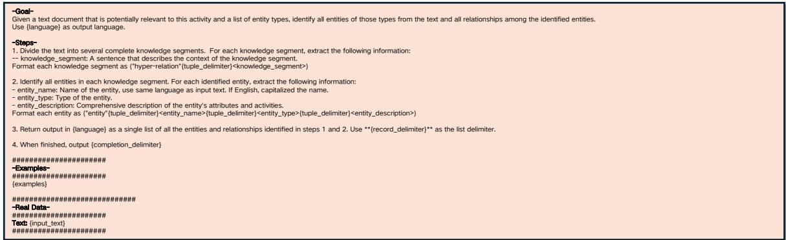  
Figure 8. Prompt for n-ary relation extraction $\pi_{ext}$ in Equation 4.

## A.2. Agentic Knowledge Reasoning Prompt

The initial knowledge-reasoning prompt has been shown in Table 1. Through several rounds of interaction with the environment, the Graph-R1 agent keeps adding information, readying the prompt for the next exchange. As shown in Figure 9, we present a case of the final prompt produced by the full agentic knowledge-reasoning process.

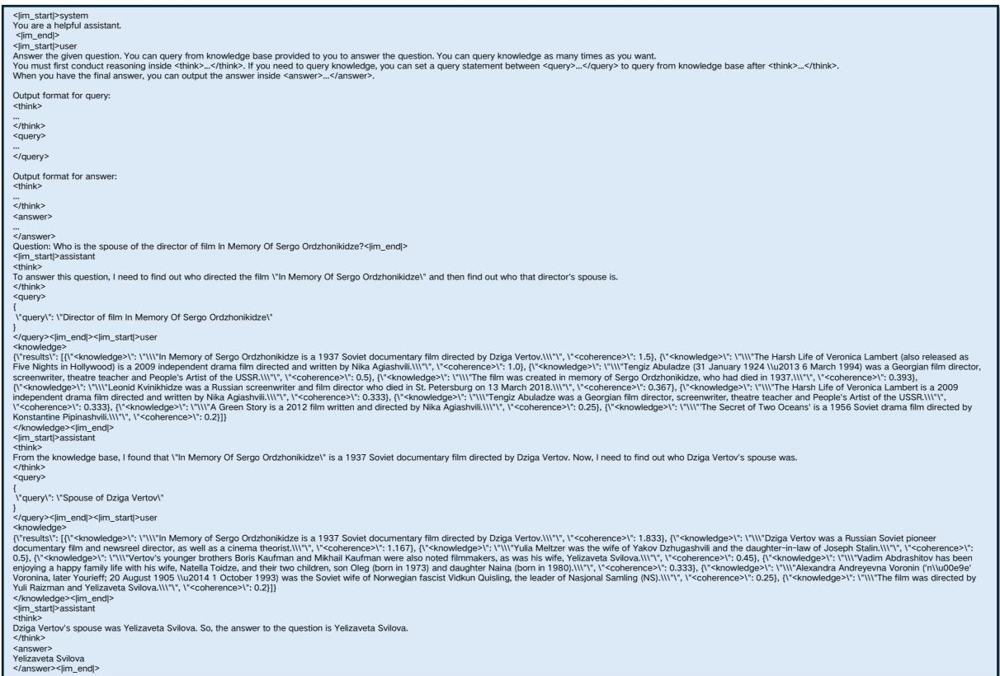  
Figure 9. Prompt for agentic knowledge reasoning $\pi_{\theta}$ in Equation 6.

## B. Theoretical Proof

## B.1. Proof of Proposition 1

## Proposition 1. Graph-structured knowledge boosts agent accuracy by richer representation.

Proof. Let the knowledge base $\mathcal{K}$ be encoded into two forms: a graph $R_{G}$ and a linear chunk set $R_{C}$ , where $R_{C} = g(R_{G})$ is a deterministic transformation that discards edge information. For a query $Q$ and ground-truth answer $A^{\star}$ , the agent's internal belief at step $t$ is $h_t$ . Each step performs retrieval $\mathcal{E}_t(R)$ and Bayesian update, forming the recurrence:

$$
h _ {t + 1} = f (h _ {t}, R).\tag{14}
$$

Define the Lyapunov function as $V_{R}(h_{t}) = -\log P(A^{\star} \mid h_{t})$ , measuring how far the agent is from certainty. Its update is:

$$
\Delta V _ {R} (h _ {t}) = - \log \frac {P (\mathcal {E} _ {t} (R) \mid A ^ {\star})}{\sum_ {a} P (a \mid h _ {t}) P (\mathcal {E} _ {t} (R) \mid a)}.\tag{15}
$$

Graphs can capture more relevant facts in shorter contexts due to explicit edges, leading to higher information density $\delta_{R}$ and more negative $\Delta V_{R}(h_{t})$ in expectation. Thus, $V_{R}(h_{t})$ decreases faster with graphs, indicating faster convergence. From an information-theoretic view, the mutual information evolves as:

$$
I (A ^ {\star}; h _ {t + 1} \mid Q) = I (A ^ {\star}; h _ {t} \mid Q) + I (A ^ {\star}; \mathcal {E} _ {t} (R) \mid h _ {t}, Q),\tag{16}
$$

and since graphs provide denser evidence, we have $I_{R_G}(A^\star; h_T \mid Q) \geq I_{R_C}(A^\star; h_T \mid Q)$ . Then by Fano's inequality,

$$
P _ {e} (R) \leq \frac {H (A ^ {\star} \mid Q) - I _ {R} (A ^ {\star} ; h _ {T} \mid Q) + 1}{\log | \mathcal {A} |},\tag{17}
$$

which implies $P_{e}(R_{G}) \leq P_{e}(R_{C})$ , i.e., $\operatorname{Acc}(R_{G}) \geq \operatorname{Acc}(R_{C})$ , with strict inequality when the graph contains structural relations not recoverable from text.

In summary, the graph-structured representation offers higher information density per retrieval, accelerates belief convergence via Lyapunov descent, and accumulates more mutual information, leading to provably higher answer accuracy.

## B.2. Proof of Proposition 2

## Proposition 2. Multi-turn interaction with the graph environment improves retrieval efficiency.

Proof. Let the graph-structured knowledge base be denoted by $R_{G}$ , and let $A^{\star}$ be the ground-truth answer. Suppose the retrieval cost is measured by the number of tokens retrieved, and we fix a total budget of B tokens. A single-turn retrieval strategy selects a fixed token set $E_{static}$ of size B, independent of any intermediate reasoning. This leads to a posterior belief $P(A^{\star} \mid Q, \mathcal{E}_{\text{static}})$ and yields total information gain

$$
I _ {\text { static }} = I (A ^ {\star}; \mathcal {E} _ {\text { static }} \mid Q) = H (A ^ {\star} \mid Q) - H (A ^ {\star} \mid Q, \mathcal {E} _ {\text { static }}),\tag{18}
$$

where Q is the query and $H(\cdot)$ denotes entropy. In contrast, an adaptive multi-turn strategy $\pi$ divides the budget across T rounds as $B = \sum_{t=1}^{T} B_{t}$ . At each round t, the agent uses prior evidence $H_{t-1} = \{E_{1}, \ldots, E_{t-1}\}$ to update its internal belief $h_{t-1}$ and selects new evidence $E_{t}$ of size $B_{t}$ by actively exploring the graph based on current uncertainty. The updated belief $h_{t}$ is obtained via Bayesian inference, and the entire process forms a dynamic system:

$$
h _ {t} = f (h _ {t - 1}, \mathcal {E} _ {t}, R _ {G}).\tag{19}
$$

To evaluate retrieval progress, we define a Lyapunov-style potential function $V_{t} = H(A^{\star} \mid Q, \mathcal{H}_{t})$ , which quantifies the remaining uncertainty after round $t$ . Each retrieval step reduces entropy by:

$$
V _ {t - 1} - V _ {t} = I (A ^ {\star}; \mathcal {E} _ {t} \mid Q, \mathcal {H} _ {t - 1}),\tag{20}
$$

which is precisely the mutual information from $E_{t}$ given past evidence. Let $\rho_{t}$ denote information gain per token at round t:

$$
\rho_ {t} = \frac {I (A ^ {\star} ; \mathcal {E} _ {t} \mid Q , \mathcal {H} _ {t - 1})}{B _ {t}},\tag{21}
$$

and define the average information density of the static strategy as:

$$
\rho_ {\mathrm{static}} = \frac {I _ {\mathrm{static}}}{B}.\tag{22}
$$

Since the adaptive agent tailors each $E_{t}$ to the current belief state and selects high-impact graph regions, it is expected that $\rho_{t} \geq \rho_{static}$ each round. When the graph allows pruning irrelevant branches via early evidence, this inequality becomes strict with non-zero probability. Summing over all rounds, the total information gain of the adaptive strategy satisfies:

$$
\mathbb {E} _ {\pi} \left[ \sum_ {t = 1} ^ {T} I (A ^ {\star}; \mathcal {E} _ {t} \mid Q, \mathcal {H} _ {t - 1}) \right] = \mathbb {E} _ {\pi} \left[ I (A ^ {\star}; \mathcal {H} _ {T} \mid Q) \right] \geq I _ {\text { static }},\tag{23}
$$

with strict inequality under the above conditions. From a Bayesian viewpoint, retrieval efficiency can be seen as how much uncertainty is reduced per token. Because the adaptive policy achieves a greater entropy reduction under the same budget, or requires fewer tokens to reach the same posterior certainty, it is strictly more efficient. Moreover, by Fano's inequality,

$$
P _ {e} \leq \frac {H (A ^ {\star} \mid Q) - I (A ^ {\star} ; \mathcal {H} _ {T} \mid Q) + 1}{\log | \mathcal {A} |},\tag{24}
$$

we conclude that the lower the conditional entropy, the lower the expected error. Therefore, greater mutual information directly translates into improved answer accuracy.

In conclusion, multi-turn interaction enables the agent to reason over what has already been retrieved, selectively expanding into the most informative parts of the graph, leading to more efficient and accurate question answering.

## B.3. Proof of Proposition 3

Proposition 3. End-to-end RL bridges the gap between graph-based knowledge and language.

Proof. Let $G_{H}$ denote the graph-structured knowledge base, and q a given query. The agent (parameterized by $\theta$ ) interacts over multiple steps, forming a trajectory $\tau = (s_{1}, a_{1}, \ldots, s_{T}, a_{T})$ where each $a_{t}$ is either a graph query or a natural-language output. The policy induces an answer distribution:

$$
P _ {\theta} (y \mid q, G _ {H}) = \sum_ {\tau : \text { answer } (\tau) = y} \pi_ {\theta} (\tau \mid q, G _ {H}).\tag{25}
$$

To align graph usage with answer generation, we define a trajectory-level reward:

$$
R (\tau) = r _ {\mathrm{fmt}} (\tau) + \mathbb {I} \left\{r _ {\mathrm{fmt}} (\tau) = 1 \right\} \cdot r _ {\text { ans }} \left(y _ {T}, y _ {q} ^ {\star}\right) - 1,\tag{26}
$$

where $r_{fmt}$ ensures proper structure (e.g., retrieve before answer), and $r_{ans}$ measures answer quality. Only valid, grounded answers receive positive reward. The expected reward is maximized via policy gradient:

$$
\nabla_ {\theta} J (\theta) \propto \mathbb {E} _ {\tau \sim \pi_ {\theta}} \left[ \sum_ {t = 1} ^ {T} \nabla_ {\theta} \log \pi_ {\theta} (a _ {t} \mid s _ {t}; G _ {H}) \cdot \hat {A} (\tau) \right],\tag{27}
$$

where $\hat{A}(\tau)$ derives from $R(\tau)$ . Trajectories that retrieve the right subgraph and generate correct answers are reinforced, linking graph retrieval to accuracy. As training progresses, the expected log-likelihood of the gold answer increases:

$$
\mathcal {L} _ {\theta} = - \log \sum_ {\tau} \pi_ {\theta} (\tau | q, G _ {H}) P (y _ {q} ^ {\star} | \tau),\tag{28}
$$

which lower-bounds the ideal $\log P^{\star}(y_{q}^{\star} \mid q, G_{H})$ . In the limit, we approach:

$$
P _ {\theta} (\cdot \mid q, G _ {H}) \to P ^ {\star} (\cdot \mid q, G _ {H}).\tag{29}
$$

This also manifests as a reduction in conditional entropy:

$$
H _ {\theta} (Y \mid Q, G _ {H}) <   H (Y \mid Q),\tag{30}
$$

since ungrounded answers are discouraged and graph-consistent ones are promoted. By Fano's inequality, lower entropy implies lower error.

Thus, end-to-end RL not only learns to query the graph but also binds retrieved knowledge to answer generation, effectively bridging the gap between structure and language.

## C. Graph-R1 Algorithm Details

To illustrate the mechanism of Graph-R1, we present its full workflow in Algorithm 1, comprising three key phases: (1) Hypergraph Construction. An LLM-based extractor $\pi_{\mathrm{ext}}$ extracts $n$ -ary relational facts from the corpus $K$ to build a semantic hypergraph $\mathcal{G}_H = (V, E_H, \phi)$ , where all elements are encoded via $\operatorname{Enc}(\cdot)$ . (2) Multi-turn Agentic Reasoning. Given query $q$ , the agent performs reflection, intent selection, and action generation over $T$ steps under policy $\pi_\theta$ . Queries trigger dual-path hypergraph retrieval; answers terminate reasoning. (3) End-to-end RL Optimization. The policy is optimized using GRPO, guided by format and answer rewards. The objective $\mathcal{J}_{\mathrm{GRPO}}$ is computed from sampled trajectories $\{\tau_i\}$ with clipped advantage-weighted updates.

Algorithm 1 Graph-R1: Agentic GraphRAG via End-to-end RL

Require: Query q, knowledge corpus  $K = \{d_1, \ldots, d_N\}$ , policy  $\pi_\theta$ , reward function  $R(\tau)$ 

Ensure: Final answer  $y_q$ 

1: // 1: Knowledge Hypergraph Construction

2: Initialize hypergraph  $G_H = (V, E_H, \phi)$ 

3: for each document  $d \in K$  do

4: Extract relational facts:  $\{(h_i, V_{h_i})\} \sim \pi_{\text{ext}}(d)$ 

5: for each  $(h_i, V_{h_i})$  do

6:  $E_H \leftarrow E_H \cup \{h_i\}$ ,  $V \leftarrow V \cup V_{h_i}$ 

7:  $\phi(h_i) \leftarrow \text{Enc}(h_i)$ ,  $\phi(v) \leftarrow \text{Enc}(v)$  for  $v \in V_{h_i}$ 

8: end for

9: end for

10: // 2: Multi-turn Graph Reasoning

11: Initialize state  $s_1 \leftarrow q$ , trajectory  $\tau \leftarrow \emptyset$ 

12: for t = 1 to T do

13: Generate reasoning plan:  $a_t^{think} \sim \pi_\theta(\cdot | s_t)$ 

14: Choose intent:  $\alpha_t \sim \pi_\theta(\cdot | a_t^{think}, s_t)$ 

15: if  $\alpha_t = (\text{answer})$  then

16: Output answer:  $a_t^{ans} \sim \pi_\theta(\cdot | a_t^{think}, s_t)$ 

17:  $\tau \leftarrow \tau \cup \{(s_t, a_t^{query}, a_t^{ans})\}$ ; return  $y_q = a_t^{ans}$ 

18: else if  $\alpha_t = (\text{query}, \text{retrieve})$  then

19: Generate query:  $a_t^{query} \sim \pi_\theta(\cdot | a_t^{think}, s_t)$ 

20: Entity retrieval:  $R_V = argmax_{v \in V}^{k_V} sim(\phi(v), \phi(V_{a_t^{query}}))$ 

21: Hyperedge retrieval:  $R_H = argmax_{h \in E_H}^{k_H} sim(\phi(h), \phi(a_t^{query}))$ 

22: Rank fusion:  $a_t^{ret} = Top-k\left(\mathcal{F}_V^* \cup \mathcal{F}_H^*, Score(f) = \frac{1}{r_V(f)} + \frac{1}{r_H(f)}\right)$ 

23: Update state  $s_{t+1} \leftarrow s_t \cup \{(s_t, a_t^{think}, a_t^{query}, a_t^{ret})\}$ 

24:  $\tau \leftarrow \tau \cup \{(s_t, a_t^{think}, a_t^{query}, a_t^{ret})\}$ 

25: end if

26: end for

27: // 3: End-to-end Policy Optimization (GRPO)

28: Sample N trajectories  $\{\tau_i\} \sim \pi_\theta_{old}$ 

29: for each  $\tau_i$  do

30: Compute reward:  $R(\tau_i) = -1 + R_{\text{format}}(\tau_i) + I\{R_{\text{format}} = 1\} \cdot R_{\text{answer}}(y_T, y_q^\star)$ 

31: Compute advantage:  $\hat{A}(\tau_i) = \frac{R(\tau_i) - mean(\{R(\tau_j)\})}{std(\{R(\tau_j)\})}$ 

32: end for

33: Update policy via GRPO:  $J_{GRPO} \sim \sum_{i=1}^N \sum_{t=1}^{|\tau_i|} min\left(\rho_\theta(a_t^{(i)})\hat{A}(\tau_i), clip(\rho_\theta(a_t^{(i)}), 1 \pm e)\hat{A}(\tau_i)\right)$ 

34: where  $\rho_\theta(a_t^{(i)}) = \frac{\pi_\theta(a_t^{(i)}|s_{t-1}^i)}{\pi_\theta_{old}(a_t^{(i)}|s_{t-1}^i)}$

Complexity Analysis. Graph-R1 involves three computational components corresponding to phases. First, hypergraph construction scales with the total token count $T_{K}$ of the knowledge corpus and the number of extracted relational facts F, yielding complexity $O(T_{K}) + O(F)$ . Second, during multi-turn reasoning, the agent performs T steps of action sampling and dual-path retrieval. At each step, similarity computations over $|V|$ nodes and $|E_{H}|$ hyperedges with embedding dimension d yield $O((|V| + |E_{H}|)d)$ per step. Third, for policy optimization, GRPO processes N sampled trajectories of max length T, with gradient updates costing $O(NTd)$ . Each component is computationally tractable and benefits from parallelization and localized retrieval over compact hypergraph subsets.

## D. Dataset Details

We conduct experiments on six widely-used RAG benchmarks selected from the FlashRAG toolkit (Jin et al., 2025b), covering both single-hop and multi-hop question answering tasks:

\- 2WikiMultiHopQA (2Wiki.) (Ho et al., 2020): A multi-hop dataset requiring reasoning across two Wikipedia documents.

\- HotpotQA (Yang et al., 2018): A challenging multi-hop QA dataset with sentence-level supporting facts and diverse question types.

\- Musique (Trivedi et al., 2022): Multi-hop questions needing chains of inference, often involving three or more reasoning steps.

\- Natural Questions (NQ) (Kwiatkowski et al., 2019): A large-scale single-hop QA dataset grounded in real Google search questions with Wikipedia passages.

\- PopQA (Mallen et al., 2023): An open-domain QA dataset focused on popular culture questions sourced from Wikipedia.

\- TriviaQA (Joshi et al., 2017): A large-scale dataset containing trivia-style questions with distantly supervised evidence documents.

To ensure consistency across datasets and maintain manageable training and evaluation workloads, we uniformly sample 5,120 instances per dataset for training and 128 instances for testing.

## E. Baseline Details

Our experiments compare Graph-R1 with two groups of baselines using different backbone LLMs:

E.1. Baselines with GPT-4o-mini

\- NaiveGeneration (GPT-4o-mini): Zero-shot generation using GPT-4o-mini without retrieval, evaluating base model capacity.

\- StandardRAG (GPT-4o-mini) (Lewis et al., 2020): Chunk-based RAG using GPT-4o-mini as the generator with retrieval over text chunks.

\- GraphRAG (Edge et al., 2025): Graph-structured retrieval baseline that constructs entity graphs and performs one-shot retrieval with GPT-4o-mini for answer generation.

\- LightRAG (Guo et al., 2025b): A lightweight GraphRAG variant that builds compact graphs for more efficient retrieval and GPT-4o-mini generation.

\- PathRAG (Chen et al., 2026): Retrieval via path-based pruning on entity graphs, followed by GPT-4o-mini answer synthesis.

\- HippoRAG2 (Gutiérrez et al., 2025): Hierarchical path planner over knowledge graphs to improve retrieval efficiency, with GPT-4o-mini used for generation.

\- HyperGraphRAG (Luo et al., 2025a): Constructs n-ary relational hypergraphs to support a single retrieval step, and uses GPT-4o-mini for answer writing.

## E.2. Baselines with Qwen2.5 (1.5B, 3B, 7B)

\- NaiveGeneration: Direct generation by Qwen2.5 given the question prompt, without any retrieval, serving as a lower bound baseline.

\- StandardRAG (Lewis et al., 2020): Classic chunk-based retrieval-augmented generation pipeline with semantic retriever and Qwen2.5 decoder.

\- SFT (Zheng et al., 2024): Supervised fine-tuning of Qwen2.5 on QA pairs, without multi-turn reasoning or reinforcement optimization.

\- R1 (Shao et al., 2024): A GRPO-trained policy that generates final answers directly from question prompts without retrieval, optimized only on answer quality.

\- Search-R1 (Jin et al., 2025a): A multi-turn chunk-based retrieval method trained with GRPO, capable of iterative query refinement and retrieval under a unified policy.

\- R1-Searcher (Song et al., 2025): A two-stage GRPO-based method with chunk-based retrieval: first using only format-level rewards to produce structured traces, then adding answer rewards.

## F. Evaluation Details

Inspired by Luo et al. (2025a); Jin et al. (2025a), we evaluate model performance using four metrics:

(i) Exact Match (EM). EM measures whether the predicted answer exactly matches the ground truth. Let norm( $\cdot$ ) denote the normalization function:

$$
\mathrm{EM} = \frac {1}{N} \sum_ {i = 1} ^ {N} \mathbb {I} \left\{\operatorname{norm} (y _ {i}) = \operatorname{norm} (y _ {i} ^ {\star}) \right\}.\tag{31}
$$

(ii) F1 Score. The F1 score measures the token-level overlap between the predicted answer $y_{i}$ and the ground-truth answer $y^{\star}$ using the harmonic mean of precision and recall:

$$
\mathrm{F} 1 = \frac {1}{N} \sum_ {i = 1} ^ {N} \frac {2 \cdot | \operatorname{tokens} (y _ {i}) \cap \operatorname{tokens} (y _ {i} ^ {\star}) |}{| \operatorname{tokens} (y _ {i}) | + | \operatorname{tokens} (y _ {i} ^ {\star}) |}.\tag{32}
$$

(iii) Retrieval Similarity (R-S). R-S assesses semantic similarity between retrieved $k_{\mathrm{retr}}^{(i)}$ and gold knowledge $k_{\mathrm{retr}}^{(i)}$ . Let $\operatorname{Enc}(\cdot)$ be the semantic embedding function:

$$
\mathrm{R-S} = \frac {1}{N} \sum_ {i = 1} ^ {N} \cos \left(\operatorname{Enc} (k _ {\text { retr }} ^ {(i)}), \operatorname{Enc} (k _ {\text { gold }} ^ {(i)})\right).\tag{33}
$$

(iv) Generation Evaluation (G-E). G-E reflects generation quality. Let $s_{i,d}$ be GPT-4o-mini scores across 7 criteria (Figure 10):

$$
\mathrm{G-E} = \frac {1}{N} \sum_ {i = 1} ^ {N} \left(\frac {1}{7} \sum_ {d = 1} ^ {7} s _ {i, d}\right).\tag{34}
$$

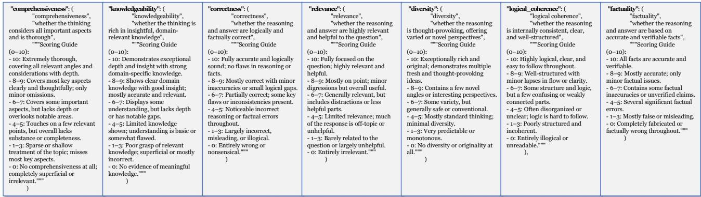  
Figure 10. Seven Dimensions for Generation Evaluation.

## G. Implementation Details

As shown in Table 3, we summarize the detailed hyperparameter configurations used throughout our experiments, including model backbone, input limits, training configuration, and retrieval setup.

Table 3. Hyperparameter settings for baselines and Graph-R1.

<table><tr><td>Method</td><td>Backbone</td><td>Batch Size</td><td>Max Length</td><td>Top-K</td><td>Algo</td><td>Epochs</td></tr><tr><td>NaiveGeneration</td><td>Qwen2.5 / GPT-4o-mini</td><td>-</td><td>∞</td><td>N/A</td><td>-</td><td>-</td></tr><tr><td>StandardRAG</td><td>Qwen2.5 / GPT-4o-mini</td><td>-</td><td>∞</td><td>5 Chunks</td><td>-</td><td>-</td></tr><tr><td>GraphRAG</td><td>GPT-4o-mini</td><td>-</td><td>∞</td><td>60</td><td>-</td><td>-</td></tr><tr><td>LightRAG</td><td>GPT-4o-mini</td><td>-</td><td>∞</td><td>60</td><td>-</td><td>-</td></tr><tr><td>PathRAG</td><td>GPT-4o-mini</td><td>-</td><td>∞</td><td>60</td><td>-</td><td>-</td></tr><tr><td>HippoRAG2</td><td>GPT-4o-mini</td><td>-</td><td>∞</td><td>60</td><td>-</td><td>-</td></tr><tr><td>HyperGraphRAG</td><td>GPT-4o-mini</td><td>-</td><td>∞</td><td>60</td><td>-</td><td>-</td></tr><tr><td>SFT</td><td>Qwen2.5 (1.5B, 3B, 7B)</td><td>16</td><td>4096</td><td>N/A</td><td>LoRA</td><td>3</td></tr><tr><td>R1</td><td>Qwen2.5 (1.5B, 3B, 7B)</td><td>128</td><td>4096</td><td>N/A</td><td>GRPO</td><td>1</td></tr><tr><td>Search-R1</td><td>Qwen2.5 (1.5B, 3B, 7B)</td><td>128</td><td>4096</td><td>5 Chunks / Turn</td><td>GRPO</td><td>1</td></tr><tr><td>R1-Searcher</td><td>Qwen2.5 (1.5B, 3B, 7B)</td><td>128</td><td>4096</td><td>5 Chunks / Turn</td><td>GRPO</td><td>1</td></tr><tr><td>Graph-R1 (ours)</td><td>Qwen2.5 (1.5B, 3B, 7B)</td><td>128</td><td>4096</td><td>5 / Turn</td><td>GRPO</td><td>1</td></tr></table>

## H. Case Study Analysis

Table 4. Case study on generation quality under a query, comparing NaiveGeneration, StandardRAG, HyperGraphRAG based on GPT-4o-mini, with R1 (7B), Search-R1 (7B), and Graph-R1 (7B).

<table><tr><td>Query</td><td colspan="9">When was the director of film Ingmar&#x27;s Inheritance born?</td></tr><tr><td>Golden Answers</td><td colspan="9">[&#x27;18 November 1888&#x27;]</td></tr><tr><td>GPT-4o-mini</td><td colspan="3">NaiveGeneration</td><td colspan="3">StandardRAG</td><td colspan="3">HyperGraphRAG</td></tr><tr><td rowspan="3">Generation</td><td rowspan="3" colspan="3"></td><td rowspan="3" colspan="3"></td><td rowspan="3" colspan="3"></td></tr><tr></tr><tr></tr><tr><td rowspan="2">Evaluation Score</td><td>F1</td><td>R-S</td><td>G-E</td><td>F1</td><td>R-S</td><td>G-E</td><td>F1</td><td>R-S</td><td>G-E</td></tr><tr><td>0.00</td><td>-</td><td>55.71</td><td>3.70</td><td>39.52</td><td>55.71</td><td>0.00</td><td>38.93</td><td>60.00</td></tr><tr><td>Qwen2.5-7B-Instruct</td><td colspan="3">R1 (7B)</td><td colspan="3">Search-R1 (7B)</td><td colspan="3">Graph-R1 (7B)</td></tr><tr><td rowspan="5">Generation</td><td rowspan="5" colspan="3"></td><td rowspan="5" colspan="3"></td><td rowspan="5" colspan="3"></td></tr><tr></tr><tr></tr><tr></tr><tr></tr><tr><td rowspan="2">Evaluation Score</td><td>F1</td><td>R-S</td><td>G-E</td><td>F1</td><td>R-S</td><td>G-E</td><td>F1</td><td>R-S</td><td>G-E</td></tr><tr><td>0.00</td><td>-</td><td>41.43</td><td>0.00</td><td>40.02</td><td>64.29</td><td>37.50</td><td>45.83</td><td>88.57</td></tr></table>

As shown in Table 4, NaiveGeneration and R1 fail to provide the correct answer, and both StandardRAG and HyperGraphRAG also fall short despite using structured prompts. Search-R1, though RL-enhanced, shows limited improvement due to weak retrieval grounding. In contrast, Graph-R1 accurately identifies both the director and birthdate, achieves the highest G-E score (88.57), and demonstrates that RL is more effective with graph-based knowledge interaction.

## I. Analysis of Graph-R1's Generalizability on O.O.D. Settings

As shown in Figure 11, to verify generalization, we conduct O.O.D. cross-validation for Search-R1 (3B) & Graph-R1 (3B) across six datasets: (a-b) F1 comparison, and (c-d) O.O.D.-to-I.I.D. ratios.

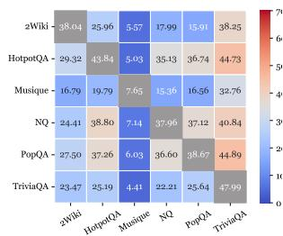  
(a) Datasets

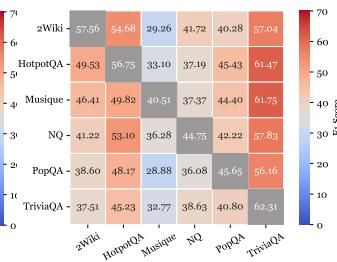  
(b) Parameters

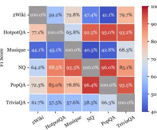  
(c) Qwen3

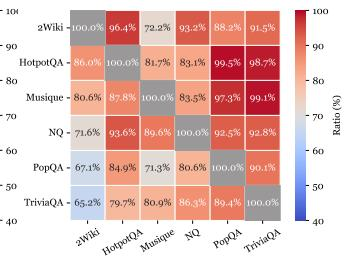  
(d) Algorithms  
Figure 11. F1 comparison and performance ratios across six datasets under O.O.D. cross-validation.

F1 Performance Across Datasets. Figures 11a and 11b show that Graph-R1 outperforms Search-R1 on six datasets in O.O.D. validation, with notable gains on NQ and TriviaQA. Its multi-turn interaction with hypergraph retrieval ensures more stable performance under distribution shifts.

Robust Generalization Ability. Figures 11c and 11d show that Graph-R1 achieves higher O.O.D.-to-I.I.D. ratios than Search-R1, often above 85% and exceeding 90% in some cases, reflecting its strong robustness and cross-domain generalizability via end-to-end RL over knowledge hypergraph.

## J. Details of Knowledge HyperGraph Construction

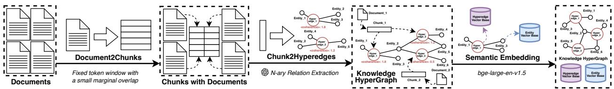  
Figure 12. Knowledge HyperGraph Construction in Graph-R1.

As shown in Figure 12, Graph-R1 constructs the Knowledge HyperGraph through a streamlined yet expressive three-stage pipeline.

First, we segment raw documents into fixed-size textual units to maintain stable local semantics. Specifically, each document is divided using a 1200-token window with a 50-token overlap, ensuring that adjacent chunks retain sufficient contextual continuity. This windowing strategy preserves semantically meaningful boundaries while preventing the loss of cross-sentence information.

Second, each chunk is processed using a GPT-4o-mini-based n-ary relation extraction module. We adopt the carefully designed prompt shown in Appendix A.1, Figure 8, which guides the model to identify sets of entities and the higher-order relations binding them. Each extracted relational fact is represented as a hyperedge, and we assign a coherence score that reflects the internal semantic consistency and reliability of the extracted n-ary relation. This step transforms linear text into a structured hypergraph where nodes represent entities and hyperedges capture rich n-ary facts.

Third, to enable semantic retrieval and reasoning over the constructed hypergraph, we generate dense embeddings for both entities and hyperedges using the large-scale embedding model bge-large-en-v1.5. The resulting entity vector base and hyperedge vector base form the foundation of Graph-R1's retrieval module, allowing subsequent reasoning steps.

Compared with the original HyperGraphRAG implementation, we introduce several architectural and engineering optimizations, particularly in parallelization, prompt efficiency, storage layout, and vectorization. These improvements reduce token consumption and computational overhead, yielding a more efficient hypergraph construction pipeline, as evidenced in Table 6a of Section 5.4.

## K. More Experimental Results on O.O.D. Settings

To rigorously assess the out-of-domain (O.O.D.) robustness and cross-domain generalization of Graph-R1, we evaluate the model under three distinct training regimes, each designed to isolate a different aspect of domain transferability. These settings provide a comprehensive picture of how retrieval structures (chunks vs. hypergraphs) behave when training and testing domains differ.

(i) In-Domain (I.I.D.) Training Setting. The first setting follows the same configuration as in Table 2. Here, each model is trained exclusively on the training split of its own dataset, meaning the supervision is fully aligned with the target domain. This represents the upper-bound scenario in which rich in-domain training data are available, allowing us to evaluate whether Graph-R1 can surpass Search-R1 even without requiring cross-domain generalization.

(ii) Single O.O.D. Training Setting. The second setting corresponds to the cross-dataset training paradigm illustrated in Figures 11. For each target dataset, the model is trained not on its own data, but on the training split of a different dataset. We use the results and compute the average performance. This setting stresses the ability to extract transferable information and tests whether hypergraph-based retrieval yields more robust inductive biases than chunk-based retrieval under dataset shift.

(iii) Combined-Dataset Training Setting. The third regime evaluates the model in a mixed-domain learning scenario. We first merge all six datasets into a single training pool and then uniformly downsample 1/6 of the combined data to ensure that the total training data volume remains identical to the I.I.D. setting. The resulting training set contains balanced signals drawn from diverse domains while strictly controlling for data quantity. This design allows us to examine whether Graph-R1 can exploit heterogeneous multi-domain relational structures to improve generalization, while ruling out gains attributable merely to increased training size.

## K.1. Results and Analysis on Six Open-Domin Datasets

Table 5. Comparison between Search-R1 (3B) and Graph-R1 (3B) across six multi-hop and open-domain datasets under three training regimes. Best results are in bold and second in underline.

<table><tr><td rowspan="2">Method</td><td colspan="2">2Wiki.</td><td colspan="2">HotpotQA</td><td colspan="2">Musique</td><td colspan="2">NQ</td><td colspan="2">PopQA</td><td colspan="2">TriviaQA</td><td colspan="2">Avg.</td></tr><tr><td>EM</td><td>F1</td><td>EM</td><td>F1</td><td>EM</td><td>F1</td><td>EM</td><td>F1</td><td>EM</td><td>F1</td><td>EM</td><td>F1</td><td>EM</td><td>F1</td></tr><tr><td colspan="15">Qwen2.5-3B-Instruct (Results When Trained on Its Own I.I.D. Dataset)</td></tr><tr><td>Search-R1 (3B)</td><td>31.25</td><td>38.04</td><td>38.28</td><td>43.84</td><td>3.91</td><td>7.65</td><td>24.22</td><td>37.96</td><td>33.59</td><td>38.67</td><td>40.62</td><td>47.99</td><td>28.65</td><td>35.69</td></tr><tr><td>Graph-R1 (3B)</td><td>50.00</td><td>57.56</td><td>50.78</td><td>56.75</td><td>32.81</td><td>40.51</td><td>30.47</td><td>44.75</td><td>37.50</td><td>45.65</td><td>53.13</td><td>62.31</td><td>42.45</td><td>51.26</td></tr><tr><td colspan="15">Qwen2.5-3B-Instruct (Average Performance When Trained on a Single O.O.D. Dataset)</td></tr><tr><td>Search-R1 (3B)</td><td>-</td><td>24.30</td><td>-</td><td>29.40</td><td>-</td><td>5.64</td><td>-</td><td>25.46</td><td>-</td><td>26.59</td><td>-</td><td>40.29</td><td>-</td><td>25.28</td></tr><tr><td>Graph-R1 (3B)</td><td>-</td><td>42.65</td><td>-</td><td>50.20</td><td>-</td><td>32.06</td><td>-</td><td>38.20</td><td>-</td><td>42.63</td><td>-</td><td>58.85</td><td>-</td><td>44.10</td></tr><tr><td colspan="15">Qwen2.5-3B-Instruct (Results When Trained on Combined Datasets)</td></tr><tr><td>Search-R1 (3B)</td><td>25.00</td><td>29.68</td><td>36.72</td><td>41.59</td><td>10.16</td><td>15.48</td><td>21.09</td><td>34.78</td><td>35.16</td><td>39.07</td><td>42.97</td><td>50.92</td><td>28.52</td><td>35.25</td></tr><tr><td>Graph-R1 (3B)</td><td>42.97</td><td>51.07</td><td>46.88</td><td>54.97</td><td>32.03</td><td>38.29</td><td>27.34</td><td>41.00</td><td>38.28</td><td>45.32</td><td>50.00</td><td>58.49</td><td>39.58</td><td>48.19</td></tr></table>

Table 5 reports the performance of Search-R1 and Graph-R1 under three training regimes (I.I.D., single O.O.D., and combined), covering six multi-hop and open-domain datasets.

First, Graph-R1 achieves consistent and clear improvements over Search-R1 across all datasets and all training settings. This confirms the advantage of hypergraph-structured retrieval, which provides more coherent and relationally grounded evidence than chunk-based retrieval, leading to stronger reasoning and higher EM/F1 scores.

Second, comparing the three regimes, the results follow a stable pattern: I.I.D. training performs best, combined-dataset training ranks second, and single O.O.D. training performs worst. This indicates that dataset-aligned supervision remains the most effective, but exposure to balanced multi-dataset data is still substantially better than training on a completely mismatched dataset.

## K.2. Additional O.O.D. Results on Five Specialized Domains

Table 6. Domain-wise results on five specialized datasets. Results of GPT-4o-mini baselines are reported from the HyperGraphRAG paper (Luo et al., 2025a). Best results are in bold and second in underline.

<table><tr><td rowspan="2">Method</td><td colspan="2">Medicine</td><td colspan="2">Agriculture</td><td colspan="2">CS</td><td colspan="2">Legal</td><td colspan="2">Mix</td><td colspan="2">Avg.</td></tr><tr><td>EM</td><td>F1</td><td>EM</td><td>F1</td><td>EM</td><td>F1</td><td>EM</td><td>F1</td><td>EM</td><td>F1</td><td>EM</td><td>F1</td></tr><tr><td colspan="13">GPT-4o-mini</td></tr><tr><td>NaiveGeneration</td><td>-</td><td>12.89</td><td>-</td><td>12.74</td><td>-</td><td>18.65</td><td>-</td><td>21.64</td><td>-</td><td>16.93</td><td>-</td><td>16.57</td></tr><tr><td>StandardRAG</td><td>-</td><td>27.90</td><td>-</td><td>27.43</td><td>-</td><td>28.93</td><td>-</td><td>37.34</td><td>-</td><td>43.20</td><td>-</td><td>32.96</td></tr><tr><td>GraphRAG</td><td>-</td><td>17.60</td><td>-</td><td>21.28</td><td>-</td><td>23.33</td><td>-</td><td>30.11</td><td>-</td><td>19.27</td><td>-</td><td>22.32</td></tr><tr><td>LightRAG</td><td>-</td><td>12.79</td><td>-</td><td>18.24</td><td>-</td><td>22.72</td><td>-</td><td>31.64</td><td>-</td><td>27.03</td><td>-</td><td>22.48</td></tr><tr><td>PathRAG</td><td>-</td><td>14.94</td><td>-</td><td>21.30</td><td>-</td><td>26.73</td><td>-</td><td>31.29</td><td>-</td><td>37.07</td><td>-</td><td>26.27</td></tr><tr><td>HippoRAG2</td><td>-</td><td>21.34</td><td>-</td><td>12.63</td><td>-</td><td>17.34</td><td>-</td><td>18.53</td><td>-</td><td>21.53</td><td>-</td><td>18.27</td></tr><tr><td>HyperGraphRAG</td><td>-</td><td>35.35</td><td>-</td><td>33.89</td><td>-</td><td>31.30</td><td>-</td><td>43.81</td><td>-</td><td>48.71</td><td>-</td><td>38.61</td></tr><tr><td colspan="13">Qwen2.5-3B-Instruct (Zero-Shot Results Without Domain Training)</td></tr><tr><td>Search-R1 (3B)</td><td>12.70</td><td>21.84</td><td>11.33</td><td>17.65</td><td>17.97</td><td>25.39</td><td>14.65</td><td>24.84</td><td>23.83</td><td>31.90</td><td>16.10</td><td>24.32</td></tr><tr><td>Graph-R1 (3B)</td><td>24.22</td><td>37.18</td><td>25.98</td><td>37.39</td><td>27.54</td><td>37.45</td><td>21.48</td><td>33.66</td><td>38.48</td><td>50.60</td><td>27.54</td><td>39.26</td></tr></table>

To further assess zero-shot generalization, Table 6 evaluates the model, trained only under the combined setting, on five specialized domain datasets introduced in HyperGraphRAG. For GPT-4o-mini baselines, we report the original results from the HyperGraphRAG paper.

Across Medicine, Agriculture, CS, Legal, and the Mixed domain, Graph-R1 (3B) consistently surpasses Search-R1 by sizeable margins in both EM and F1. Notably, Graph-R1 delivers strong improvements even in knowledge-intensive fields (e.g., Medicine and CS), where structured multi-entity relationships are crucial. These findings suggest that the relational inductive biases encoded by the hypergraph representation transfer effectively across specialized verticals not seen during training.

Collectively, these experiments demonstrate that Graph-R1 offers superior cross-domain robustness, strong transferability to unseen fields, and stable zero-shot performance, significantly outperforming chunk-based RAG baselines across both horizontal (general) and vertical (specialized) domains.