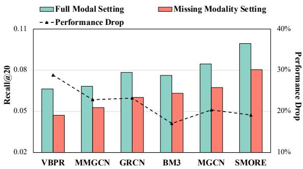
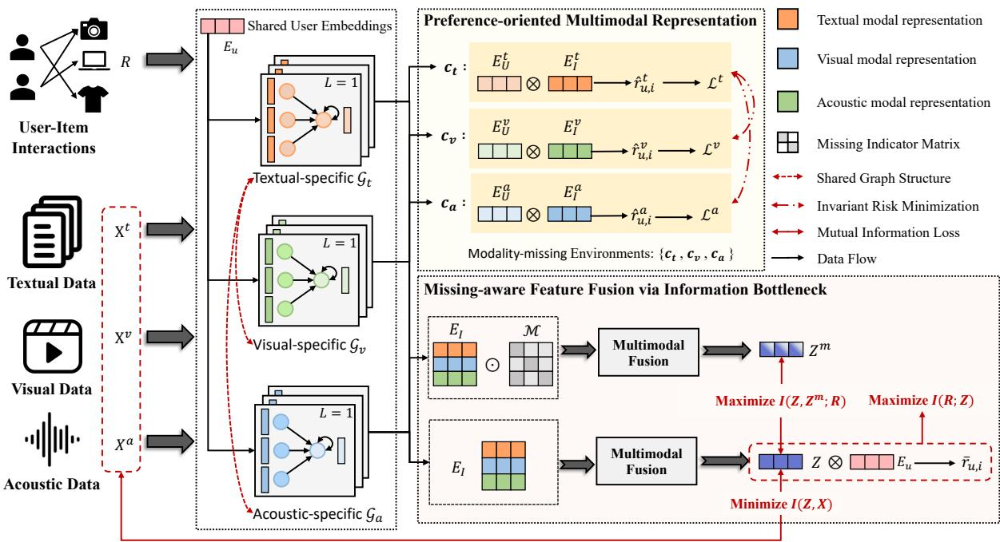
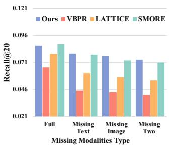
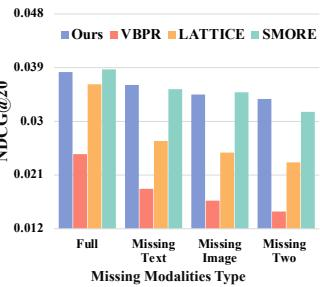
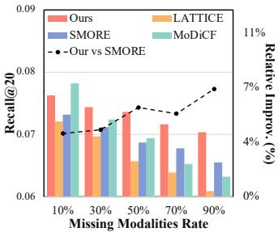
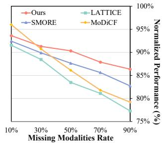

# I3-MRec: Invariant Learning with Information Botleneck for Incomplete Modality Recommendation

Huilin Chen Hefei University of Technology Anhui, China ClownClumsy@outlook.com

Zhiyong Cheng∗ Hefei University of Technology Anhui, China jason.zy.cheng@gmail.com

Miaomiao Cai Hefei University of Technology Anhui, China cmm.hfut@gmail.com

Richang Hong Hefei University of Technology Anhui, China hongrc.hfut@gmail.com

Fan Liu National University of Singapore Singapore, Singapore liufancs@gmail.com

Meng Wang Hefei University of Technology Anhui, China eric.mengwang@gmail.com

## Abstract

Multimodal recommender systems (MRS) improve recommendation performance by integrating complementary semantic information from multiple modalities. However, the assumption of complete multimodality rarely holds in practice due to missing images and incomplete descriptions, hindering model robustness and general ization. To address these challenges, we introduce a novel method called I3-MRec, which uses Invariant learning with Information bottleneck principle for Incomplete Modality Recommendation. To achieve robust performance in missing modality scenarios, I3- MRec enforces two pivotal properties: (i) cross-modal preference invariance, ensuring consistent user preference modeling across varying modality environments, and (ii) compact yet efective multi modal representation, as modality information becomes unreliable in such scenarios, reducing the dependence on modality-specific information is particularly important. By treating each modality as a distinct semantic environment, I3-MRec employs invariant risk minimization (IRM) to learn preference-oriented representations. In parallel, a missing-aware fusion module is developed to explicitly simulate modality-missing scenarios. Built upon the Information Bottleneck (IB) principle, the module aims to preserve essential user preference signals across these scenarios while efectively compressing modality-specific information. Extensive experiments conducted on three real-world datasets demonstrate that I3-MRec consistently outperforms existing state-of-the-art MRS methods across various modality-missing scenarios, highlighting its efec tiveness and robustness in practical applications.

## CCS Concepts

• Information systems → Personalization; Recommender systems; Collaborative filtering.

∗Corresponding author.

Keywords Multimodal Recommendation, Invariant Learning, Information Bottleneck, Collaborative Filtering

ACM Reference Format: Huilin Chen, Miaomiao Cai, Fan Liu, Zhiyong Cheng, Richang Hong, and Meng Wang. 2025. I3-MRec: Invariant Learning with Information Bottleneck for Incomplete Modality Recommendation. In Proceedings ofthe 33rd ACM International Conference on Multimedia (MM ’25), October 27–31, 2025, Dublin, Ireland. ACM, New York, NY, USA, 10 pages. https://doi.org/10.1145/3746027. 3755410

## 1 Introduction

Multimodal data has experienced explosive growth across various online platforms, including Amazon 1, YouTube2, and TikTok3. To mitigate information overload and help users discover relevant items, Multimodal Recommender Systems (MRS) [24–26, 30, 54, 59, 65, 69, 76] leverage rich information from various modalities (e.g., item images, review texts) to model user preferences and generate more accurate recommendations. However, most existing MRS methods assume the availability of complete modality information to efectively extract recommendation-relevant signals [3, 35]. This assumption often fails in real-world settings, where incomplete modality data is often encountered in real-world applications, such as information retrieval [36, 49, 63], computer vision [50], and video-sharing platforms [23]. As illustrated in Fig. 1, many existing multimodal recommendation models sufer from performance degradation or even fail when confronted with missing modalities4. This frequent occurrence poses a substantial challenge to the robustness and practical applicability of MRS in real-world deployments.

To address the challenge of missing modalities, several eforts have been proposed [3, 13, 23, 27, 39, 49, 53, 63]. Early approaches often resorted to discarding items with incomplete modality information [39, 53], but this strategy worsens data sparsity and leads to substantial performance degradation. More recent eforts have attempted to recover missing modality data through various content generation techniques [3, 13, 23, 27, 49, 63]. For instance,

  
Figure 1: Performance of MRS methods on the Baby dataset under two settings. “Full Modality” indicates no missing modality during training and testing. “Missing Modality” follows the MTMT setup (Section 4.3), with random modality missingness in both phases.

CI2MG [27] employs hypergraph convolution and cross-modal transport to generate missing modality features. In addition, representation learning approaches, such as feature propagation [36] and invariant learning [3], have been proposed to learn robust prefer ence representations that remain efective under missing modality scenarios.

Although these methods have demonstrated promising efective ness, the core challenges associated with missing modalities remain inadequately addressed: How should an optimal recommender system perform when confronted with modality missingness? On the one hand, generative methods [23, 27] often require extensive and time consuming pre-training for each modality. This requirement contradicts the missing modality assumption, as it presumes the avail ability of large-scale, fully annotated multimodal data. On the other hand, existing representation-based approaches overlook the distinct characteristics of each modality. For example, MILK [3] adopts a modality-wise mixup strategy to simulate modality-missing envi ronments. However, such operations can disrupt modality-specific semantic structures, ultimately making the model more vulnerable to performance degradation under real-world missing modality conditions.

We argue that a robust recommendation model should satisfy two key properties:

• Cross-modal Preference Invariance: User preferences are inherently stable across diferent modality sources [11]. A ro bust model should therefore learn preference-oriented user/item representations that remain invariant across modalities. This ensures that each individual modality representation can sufi ciently support accurate preference prediction, thereby mitigating the negative impact of missing modalities.

• Compact yet Efective Multimodal Representation: The learned multimodal representations should maximally preserve user preference information pertinent to recommendation tasks while minimizing dependence on the raw modality information. As modality information becomes unreliable in such scenarios, especially when missing modalities randomly occur during train ing, reducing the dependence on modality-specific information is particularly important [34, 42, 62].

These two principles together promote recommendation robustness by ensuring robust representations and reducing the model’s dependency on potentially unavailable modality data. To address this critical challenge, we propose I3-MRec (Invariant learning with Information Bottleneck for Incomplete-Modality Recommendation), a unified framework specifically designed for robust recommendation under modality-missing scenarios. To achieve the goal, I3-MRec adopts an invariant learning framework that explicitly treats each modality as a distinct semantic environment. It leverages a GCN-based architecture combined with Invariant Risk Minimization (IRM) to learn robust user and item representations (thereby satisfying the first property). Furthermore, we introduce a missing-aware fusion module guided by the Information Bottleneck (IB) principle [19, 46, 47] to explicitly simulate diverse modality missing scenarios during training, maximizing mutual information between multimodal representations across these scenarios while minimizing the mutual information between the multimodal representation and each raw-modality feature. (in alignment with the second property). We have released the code and relevant parameter settings to facilitate repeatability as well as further research5.

In summary, the main contributions of this work are as follows:

• We propose I3-MRec, a novel framework that addresses the limitations of existing multimodal recommender systems in modalitymissing scenarios. By integrating invariant learning with the information bottleneck principle, our method enhances model robustness and generalization.

• We introduce a principled invariant learning approach that models each modality as a distinct semantic environment. This enables learning of preference-oriented user/item representations, improving resilience to missing modality inputs.

• We design a missing-aware fusion module guided by the Information Bottleneck principle, which selectively retains preferencerelevant information while compressing modality-specific information, resulting in compact yet efective multimodal representations.

• We have conducted extensive experiments on three real-world datasets, demonstrating the superiority of our method over stateof-the-art baselines.

## 2 Related Work

## 2.1 Multimodal Recommendation and Modality Missingness

Multimodal Recommender Systems leverage various multimedia content to enhance user-item interactions, ofering significant advantages in applications such as online shopping [20, 29], video sharing platforms [5, 61], and social networks [75]. Early approaches [7, 16, 20] incorporated multimodal data as auxiliary features to enhance item representations. For instance, VBPR [16] integrates visual embeddings with item ID embeddings to better model user preferences. With the development of Graph Neural Networks (GNNs)[18, 31, 32, 55], subsequent work extended these models to incorporate multimodal signals into graph-based learning[6, 33, 60, 61], improving the quality of user and item node representations. Some methods, such as LATTICE [72], capture item-item semantic afinities via modality-aware graphs. while DualGNN [52] models user-user relations to reveal latent preference patterns. In addition, recent advances have incorporated attention mechanisms [29], self supervised learning [45, 76], and contrastive learning [27, 58] to better align and integrate cross-modality information.

Despite their efectiveness, these methods typically assume the availability of complete modality information. In practice, missing modalities can lead to significant performance degradation [3, 35]. To address this challenge, existing solutions fall into two broad cat egories: Generation-based approaches aim to reconstruct missing modality features through modality generation techniques [3, 13, 23, 27, 49, 63]. While efective in controlled settings, these meth ods typically incur high computational costs and lack flexibility when handling random or modality-specific missing patterns. $\mathrm { e . g . }$ MoDiCF [23] requires an auxiliary difusion model to reconstruct missing modalities. Representation Learning-based methods focus on directly learning robust representations that remain efective even when specific modalities are missing [3, 36]. For instance, MILK [3] introduces a modality-invariant learning strategy; how ever, it assumes complete modality availability during training, which limits its applicability in real-world scenarios. By formulating the task within an invariant learning framework and incorporating an IB-guided fusion strategy, I3-MRec generalizes efectively across various modality-missing scenarios.

## 2.2 Invariant Learning in Recommendation

Invariant learning (IL) [1, 2, 9, 22, 41] is emerging as a pivotal technique to enhance model generalization. This approach often posits that certain stable features exist within the data that causally determine the target labels. Moreover, the relationship between these stable features and labels remains invariant in diferent en vironments [68]. Recently, eforts have been made to incorporate invariant learning principles into recommendation systems [3, 11, 56, 70, 73]. For example, InvPref [56] estimates heterogeneous environments corresponding to diferent types of latent bias, while InvRL [11] exploits spurious correlations in user-item interactions caused by modality noise to diferentiate environment sets. Depart ing from MILK [3], which ensures that modality-specific preferences remain stable in cyclic mixup-based heterogeneous modality environments, we treat modality-missing patterns as heterogeneous environments to learn stable, preference-oriented modality repre sentations.

## 2.3 Information Bottleneck

The Information Bottleneck (IB) principle, based on information theory, is widely applied in machine learning tasks such as model robustness [10, 64, 71], fairness [14], explainability [12, 51], and recommendation systems [57, 66, 67, 74]. For input data �, hid den representation $Z ,$ and prediction label �, IB principle suggests that an efective representation retains minimal suficient informa tion for the prediction task [19, 46, 47]: ��� : $I ( Y ; Z ) - \beta I ( X ; Z )$ where �(�; �) and �(�; �) are the mutual information between variables, with � balancing the two terms. Calculating mutual in formation for continuous variables is dificult, especially in deep learning. Approximations using neural networks, such as MINE [4], InfoNCE [38], and variational methods [47], are commonly used.

Recently, CLUB [8] has emerged to estimate the upper bound of mutual information using a log-ratio contrastive loss, which is more general for high-dimensional tasks without prior assumptions.

This work applies IB learning to multimodal recommender systems, making them robust to modality missingness. Given the difficulty of estimating the upper bound of mutual information, we use InfoNCE and CLUB to approximate and optimize the mutual information between modality features.

## 3 Preliminaries

## 3.1 Multimodal Recommendation Task

Let U and I denote the sets of users and items, with $| \mathcal { U } | = N _ { u }$ and $| { \cal T } | = N _ { i }$ representing the number of users and items. Items associated with multimodal features $\pmb { X } \in \mathbb { R } ^ { N \times D _ { k } }$ , where � is the number of modalities, and $k \in \{ v , t , a \}$ indexes modality types (visual, textual, and acoustic); $D _ { k }$ is the dimension of �-th raw modality feature. The historical user-item interaction is denoted by the interaction matrix $\mathcal { R } \in \mathbb { R } ^ { | U | \times | I | }$ , where $r _ { u , i } = 1$ indicates an observed interaction between user � and item �; otherwise, $r _ { u , i } = 0$ Thus, the multimodal recommendation task can be formally defined as predicting the probability $\bar { r } _ { u , i }$ of user � and item �:

$$
\bar {r} _ {u, i} = \Gamma (u, i, X _ {i} | \Theta).\tag{1}
$$

Here, $\Gamma ( \cdot )$ is any recommender learning function parameterized by Θ to predict preference probability. $X _ { i }$ represents the multimodal feature set of item �.

## 3.2 Modality Missingness Problem

MRS typically models user preferences by first extracting modality features and then fusing them into a unified item representation. Formally, this process can be described as:

$$
\boldsymbol {E} ^ {k} = g _ {\theta_ {1}} (\boldsymbol {X} ^ {k}), \qquad \boldsymbol {Z} = h _ {\theta_ {2}} (\boldsymbol {E} ^ {a}, \boldsymbol {E} ^ {t}, \boldsymbol {E} ^ {v}),\tag{2}
$$

where $g _ { \theta _ { 1 } } ( \cdot )$ learns task-relevant semantic representations $E ^ { k }$ from each modality input $X ^ { k }$ , and $h _ { \theta _ { 2 } } ( \cdot )$ integrates them into a unified item representation � for user preference prediction. The overall objective is defined as:

$$
\mathcal {L} _ {0} = \mathcal {L} (p (E _ {u}, Z), R),\tag{3}
$$

where $E _ { u }$ denotes user embeddings derived from user $\mathrm { I D } s ^ { 6 } ;$ , and � is the ground-truth interaction label.

However, this modeling paradigm heavily depends on the availability of complete multimodal inputs. When certain modalities are missing, both the feature extraction and fusion stages become unreliable, resulting in degraded preference modeling. To mitigate this, we propose a robust framework that integrates invariant learning and the information bottleneck principle.

## 4 Methodology

In this section, we present $\mathrm { I } ^ { 3 } { \mathrm { - } } \mathrm { M R e c }$ (Invariant learning with Information Bottleneck for Incomplete-Modality Recommendation), as illustrated in Fig. 2, which consists of Preference-oriented Multimodal Representation Learning and Missing-aware Feature

  
Figure 2: Overview of the proposed I3-MRec framework. The model first learns preference-oriented user/item representations using a graph-based approach, guided by IRM to ensure invariance across modalities. Then, an IB-based fusion module generates compact yet efective representations by maximizing preference-relevant information while compressing modality-specific information.

Fusion via Information Bottleneck . Next, we provide a detailed description of the overall optimization procedure.

## 4.1 Preference-oriented Multimodal Representation Learning

Existing invariant learning methods [1, 3, 11] commonly construct environments via synthetic distribution shifts, such as spurious correlations or artificial noise. In contrast, modalities in multimodal recommendation (e.g., text, image) naturally encode diverse yet complementary semantics. Given the consistency of user prefer ences across modalities [11], we treat each modality as a distinct environment to exploit this semantic invariance.

4.1.1 Collaborative Modality Graph Learning. Formally, given � modalities, we define the environment set $C = \{ c _ { k } : 1 \leq k \leq K \}$ where $c _ { k }$ represents the scenario where only the �-th modality is available. Then, we adopt modality-specific graphs to perform the representation learning of users and items. From the interaction ma trix ${ \mathcal { R } } ,$ we construct user-item interaction graph $\mathcal { G } = \{ \mathcal { G } _ { a } , \mathcal { G } _ { t } , \mathcal { G } _ { v } \}$ Each graph $\mathcal { G } _ { k }$ maintains the same graph structure and only re tains the item features associated with each modality. Note that all modality-specific graphs share the same user embeddings for each user ID [61].

Given the raw modality features, we first employ a non-linear transformation to project each raw modality feature into a lowdimensional vector space:

$$
\pmb {F} ^ {k} = \sigma (\pmb {W} _ {k} \pmb {X} ^ {k} + b _ {k}),\tag{4}
$$

where $W _ { k } \in \mathbb { R } ^ { D _ { k } \times d _ { k } }$ and $b _ { k } \ \in \ \mathbb { R } ^ { d _ { k } }$ denote the weight matrices and bias vectors for the �−th modality, respectively. $\sigma ( \cdot )$ is the activation function. To capture high-order collaborative signals, we employ the same message-passing strategy as LightGCN [18] to propagate and refine user and item representations across the user-item interaction graph. The �-th layer propagation is defined as:

$$
\boldsymbol {E} ^ {(k, l)} = (\boldsymbol {D} ^ {- 1 / 2} \boldsymbol {A} \boldsymbol {D} ^ {- 1 / 2}) \boldsymbol {E} ^ {(k, l - 1)},\tag{5}
$$

where � is the adjacency matrix built from user-item interactions R and its transpose $\mathcal { R } ^ { T }$ , and � is the corresponding diagonal degree matrix. By aggregating node features across � propagation layers, the final preference-oriented embeddings can be obtained:

$$
\pmb {E} ^ {k} = \frac {1}{L + 1} \sum_ {l = 0} ^ {L} \pmb {E} ^ {(k, l)}.\tag{6}
$$

Here, $E ^ { k } = \{ E _ { _ { I J } } ^ { k } , E _ { _ { I } } ^ { k } \}$ represents preference-oriented representations of users and items. Based on the learned representations, we can estimate the preference score of the user � for item � in the �-th modality environment:

$$
\hat {r} _ {u, i} ^ {k} = \mathcal {F} (e _ {u} ^ {k}, e _ {i} ^ {k}),\tag{7}
$$

where $\mathcal { F } ( \cdot )$ denotes the prediction function, implemented as the inner product between user and item embeddings.

4.1.2 Invariant Learning Optimization. After obtaining predictions across � modality environments, we explicitly encourage the consistency and stability of the learned representations across modalities. Specifically, we employ Invariant Risk Minimization [1, 2, 11] to guide the learning of preference-oriented representations that remain invariant across environments. The corresponding opti mization objective is formulated as follows:

$$
\mathcal {L} _ {I R M} = \mathbb {E} _ {k \in \{a, t, v \}} \mathcal {L} ^ {k} + \delta \| V a r _ {k \in \{a, t, v \}} (\nabla_ {\theta_ {1}} \mathcal {L} ^ {k}) \| ^ {2}.\tag{8}
$$

The first term, $\mathcal { L } ^ { k } ,$ , represents the modality-specific loss for each environment. The second term penalizes the variance of the gradients (with respect to the shared parameters $\theta _ { 1 } )$ between diferent modal ities. Minimizing this gradient variance encourages the model to capture invariant preference features that are stable across modality environments, thereby reducing its sensitivity to missing modali ties.

To ensure efective learning of user preferences, we adopt the Bayesian Personalized Ranking (BPR) loss as the modality-specific objective:

$$
\mathcal {L} ^ {k} = \sum_ {(u, i ^ {+}, i ^ {-}) \in O} - l n \sigma (\hat {r} _ {u, i ^ {+}} ^ {k} - \hat {r} _ {u, i ^ {-}} ^ {k}),\tag{9}
$$

where $O = ( u , i ^ { + } , i ^ { - } ) | ( u , i ^ { + } ) \in \mathcal { R } ^ { + } , ( u , i ^ { - } ) \in \mathcal { R } ^ { - }$ − is the training triplet set, (�, �+) represents observed (positive) interactions, and $( u , i ^ { - } )$ denotes randomly sampled negative interactions. $\sigma ( \cdot )$ is the sigmoid activation function. Through this design, our method ensures stable and accurate user preference prediction even in modality-missing scenarios.

## 4.2 Missing-aware Feature Fusion

To ensure robust performance under modality-missing scenarios, we design a missing-aware feature fusion module grounded in the Information Bottleneck (IB) principle, as illustrated in the lower part of Figure 3. As discussed above, modality-specific informa tion can become unreliable in such scenarios, which may hinder accurate user preference prediction. To address this, the module is guided to preserve preference-relevant information while compress ing modality-specific information, thereby generating compact yet efective multimodal representations.

4.2.1 Modality-Missing Scenarios Simulation. Instead of di rectly integrating all modality features, we introduce a binary mask to simulate modality-missing scenarios, which is dynamically sam pled during training. Specifically, the mask vector $\boldsymbol { \mathcal { M } } \in \{ 0 , 1 \} ^ { K }$ is applied to replace the features of missing modalities with zero vectors, where $m _ { k } = 0$ indicates that the �-th modality is absent. The resulting masked representation is then fed into a single-layer MLP-based fusion function to generate the final item embedding:

$$
z _ {i, m} = h _ {\theta_ {2}} (\{e _ {i} ^ {a}, e _ {i} ^ {t}, e _ {i} ^ {v} \} _ {m}), \quad m \in \mathcal {M}.\tag{10}
$$

This strategy exposes the proposed model to various modalitymissing scenarios during training, thus encouraging the fusion module to generate robust multimodal representations that ensure stable and consistent recommendation performance across diferent modality-missing conditions.

4.2.2 Information Botleneck-guided Feature Fusion. Given generated representations, we employ the Information Bottleneck principle [19, 46, 47] to guide the optimization of the feature fusion module. It explicitly balances mutual information maximization and minimization, encouraging the model to retain task-relevant signals while compressing modality-specific information. Inspired by previous works [28, 57, 67], the Information Bottleneck optimization objective in recommender systems can be formulated as:

Table 1: Basic statistics of the experimental datasets.

<table><tr><td>Dataset</td><td>#User</td><td>#Item</td><td>#interactions</td><td>#Modalities</td><td>Sparsity</td></tr><tr><td>Baby</td><td>19,445</td><td>7,050</td><td>160.792</td><td>V,T</td><td>99.88%</td></tr><tr><td>Clothing</td><td>39,387</td><td>23,033</td><td>278,677</td><td>V,T</td><td>99.97%</td></tr><tr><td>Tiktok</td><td>9,319</td><td>6,710</td><td>68,722</td><td>V,A,T</td><td>99.89%</td></tr></table>

$$
I B = I (Z; R) + I (Z, Z ^ {m}; R) - \beta I (X; Z),\tag{11}
$$

here, $I ( Z ; R )$ encourages the model to preserve information relevant to the recommendation task; $I ( Z , Z ^ { m } ; R )$ promotes consistency across representations generated under diferent modality-missing conditions; and $I ( X ; Z )$ penalizes excessive dependence on raw modality content, controlled by a trade-of parameter $\beta .$

Term1: Maximizing Mutual Information with Recommendation Signals. This term aims to maximize the mutual information between generated representations and the recommendation target. Given the user embedding $e _ { u }$ and the generated representation $z _ { i } ,$ the predicted preference score is computed as $\bar { r } _ { u , i } ^ { k } = e _ { u } ^ { T } , z _ { i } .$ We select popular BPR ranking loss [40] to optimize this term:

$$
\mathcal {L} _ {r e c} = \sum_ {(u, i ^ {+}, i ^ {-}) \in \mathcal {O}} - l n \sigma (\bar {r} _ {u, i ^ {+}} - \bar {r} _ {u, i ^ {-}}),\tag{12}
$$

Term2: Promoting Robust Item Representation Consistency. In general, enforcing consistency across diferent views has been shown to improve performance in downstream tasks [48]. Motivated by this, we encourage semantic alignment between item representations generated under diferent masking conditions. Following standard contrastive learning setups [38, 44], we employ the InfoNCE loss [15] to estimate the mutual information $I ( Z , Z ^ { m } ; R )$

$$
\mathcal{L}_{pcon} = \sum_{\substack{m,m^{\prime}\in \mathcal{M},\\ m\neq m^{\prime}}}\sum_{i\in \mathcal{I}} - \log \frac{exp(\int(z_{i,m}\cdot z_{i,m^{\prime}}) / \tau)}{\sum_{j\in\mathcal{B}}exp(\int(z_{i,m}\cdot z_{j,m}) / \tau)},\tag{13}
$$

where $f ( \cdot )$ measures the similarity between two representations, we employ the widely used cosine similarity function in our work; $\tau \in \mathbb { R } ^ { + }$ indicates the temperature parameter. Note that negative examples of each item are updated at each epoch due to item � being sampled from the current batch training data.

Term3: Minimizing Mutual Information for Redundancy Reduction. This term aims to compress the negative impact of modality-specific information by minimizing the mutual information between the generated representation and the raw modality input. In other words, it reduces the model’s reliance on potentially unreliable modality information. However, directly comput ing mutual information between two high-dimensional variables is intractable. To address this, we adopt the Contrastive Log-ratio Upper Bound (CLUB) [8] in our work, which uses a variational distribution $q _ { \phi } ^ { k } ( \cdot | \cdot )$ for each modality to approximate the mutual information:

$$
\mathcal {L} _ {c o m p} = \frac {1}{| K |} \sum_ {k \in \{a, t, v \}} \sum_ {i \in \mathcal {I}} \left[ \log q _ {\phi^ {k}} ^ {k} (z _ {i} | e _ {i} ^ {k}) - \log q _ {\phi^ {k}} ^ {k} (z _ {i} | x _ {i} ^ {k}) \right]\tag{14}
$$

here, $q _ { \phi } ^ { k } ( \cdot | \cdot )$ is implemented as a two-layer MLP with modalityspecific parameter $\phi ^ { k }$ , optimized in a sample-based manner. Minimizing $\bar { \mathcal { L } } ^ { c o m p }$ efectively reduces the task-irrelevant and modality information, yielding a more compact and efective representation.

Model Training The overall training objective optimization of our framework is defined as:

$$
\mathcal {L} = \mathcal {L} _ {r e c} + \mathcal {L} _ {I R M} + (\alpha \mathcal {L} _ {p c o n} + \beta \mathcal {L} _ {c o m p}).\tag{15}
$$

This unified loss function integrates four components: the recommendation loss $( \mathcal { L } _ { r e c } ) _ { : }$ , the invariant representation learning loss $( \mathcal { L } _ { I R M } )$ , the preference consistency loss $( \mathcal { L } _ { p c o n } )$ , and the information compression loss $( \mathcal { L } _ { c o m p } ) .$ . The hyperparameters � and $\beta$ control the relative importance of the mutual information regu larization terms. $\mathrm { B y }$ jointly optimizing these objectives, the model learns compact and efective preference representations that generalize well to modality-missing scenarios.

## 5 Experiments

## 5.1 Experimental Setup

5.1.1 Datasets. We evaluate our method on three widely used real-world datasets: Amazon Baby, Amazon Clothing, and TikTok, following the 5-core setting adopted in prior works [37, 60, 76]. The Amazon datasets7 consist of user-item interactions derived from product ratings. For each item, we extract 4096-dimensional visual features using VGG16 [43] (from the second fully connected layer), and 1024-dimensional textual features using BERT [21], based on the concatenation of brand, title, description, and category, follow ing [30]. The TikTok dataset [3] contains user viewing histories on short videos, with pre-extracted visual, acoustic, and textual features. We directly use the released modality features and data splits to ensure consistency and fair comparison. Following [30], we adopt the same training, validation, and test partition strategy. Dataset statistics are summarized in Table 1.

5.1.2 Missing Modality Seting. Similar to previous works $[ 3 ,$ 23, 27], we evaluate the efectiveness of our method under missing modality scenarios using the following experimental settings.

• Full Training Missing Test (FTMT): In this setting, all training data are assumed to have complete modality information. During testing, we simulate missing modalities by randomly selecting 50% of the test items and replacing their modality features with zero vectors. For datasets with two modalities, each selected item may randomly lose one or both modalities. For datasets with three modalities, each item is randomly assigned one or two missing modalities to simulate diverse missing scenarios.

• Missing Training Missing Test (MTMT): This setting simu lates a more realistic scenario in which missing modalities also occur during training. Specifically, 30% of the training items are randomly assigned missing modalities, using the same missing strategy as in the test phase. The test phase follows the same setup as FTMT.

5.1.3 Baselines. To verify the eficacy of our proposed method, we conduct comprehensive benchmarking against a diverse set of state-of-the-art (SOTA) recommender models, which can be broadly categorized into three main groups: Unimodal Recommendation Methods: MF-BPR [40], InvPref [56], and LightGCN [18]. These methods rely solely on user-item interaction data to infer user preferences, without incorporating auxiliary content features. Multimodal Recommendation Methods: feature-based models (VBPR [16], BM3 [76], InRL [11]), graph-based models (GRCN [60], MMGCN [61], LATTICE [72], DualGNN [52]), and hybrid models (MGCN [69], SMORE [37]). Incomplete Modality Recommendation Methods: These models are specifically designed to alleviate modality-missing problems, which include representative approaches (MILK [3], SIBRAR [13]), and Generative models(MoDiCF [23]).

5.1.4 Evaluation Metrics. Two widely-used evaluation metrics are adopted for top-� recommendation: Recall and Normalized Discounted Cumulative Gain (NDCG) [17]. Recommendation accuracy is calculated for each metric based on the top 20 results. Note that the reported results are the average values across all testing users.

5.1.5 Parameter Setings. The PyTorch framework 8 is adopted to implement the proposed model. In our experiments, all hyperparameters are carefully tuned. For all datasets, the embedding size of the users and items is set to 64. The mini-batch size is fixed to 1024. The learning rate for the optimizer is searched from $\{ 1 0 ^ { - 5 } , 1 0 ^ { - 4 } , \cdot \cdot \cdot , 1 0 ^ { + 1 } \}$ }, and the model weight decay is searched in the range $\{ 1 0 ^ { - 5 } , 1 0 ^ { - 4 } , \cdot \cdot \cdot , 1 0 ^ { - 1 } \}$ . In the mutual information $I ( Z , Z ^ { m } ; R )$ , the temperature � is tuned from $\left\{ 1 e - 2 , 1 e - 1 , 1 , 1 e + 1 \right\}$ We carefully searched the best parameters of $\alpha , \beta ,$ and �, and found that I3-MRec achieves the best performance when {1�−3, 1�−5, 300} on Baby, $\{ 1 e - 2 , 1 e - 3 , 1 \}$ on Clothing, and $\left\{ 1 e - 3 , 1 e - 6 , 1 0 0 0 \right\}$ on TikTok dataset. Besides, the early stopping strategy is adopted. Specifically, the training process will stop if recall@20 does not increase for 20 successive epochs.

## 5.2 Overall Comparisons

Table 2 presents the performance comparison between $\mathrm { I } ^ { 3 }$ -MRec and several SOTA baselines across three datasets. To better simulate real-world scenarios where modality information may be randomly missing during both training and inference, we conduct evaluations under two experimental settings: Full Training Missing Test (FTMT) and Missing Training Missing Test (MTMT). The key observations are summarized as follows:

The first block reports the performance of unimodal recommender methods, including MFBPR, InvPref, and LightGCN, which are unafected by modality missingness. InvPref achieves noticeable improvements over MFBPR, demonstrating the efectiveness of invariant learning in enhancing robustness and generalization. LightGCN further outperforms both MFBPR and InvPref by leveraging high-order neighborhood information to enrich user and item representations, underscoring the strengths of graph-based methods in mitigating data sparsity and improving representation quality. Building upon a similar GNN-based architecture, the proposed I3-MRec additionally integrates invariant learning to learn robust multimodal representations.

The second block presents the performance of multimodal recommender methods. As shown, most MRS methods outperform unimodal baselines by leveraging richer semantic inputs. However, since they are not specifically designed for modality-missing scenarios, their performance remains sensitive to modality missingness. For instance, MMGCN relies on complete modality for node initial ization and message passing. When modalities are missing during testing (FTMT), their performance drops below that of unimodal models. Introducing missing modalities during training (MTMT) results in a substantial performance drop of up to 23%, indicating the model’s vulnerability to modality-missing problems across the learning process. In contrast, I3-MRec explicitly accounts for modal ity missingness during training, yielding consistently strong perfor mance across various modality-missing scenarios. InRL also adopts the invariant learning paradigm to learn preference-invariant rep resentations. However, it relies on raw multimedia content to infer interaction environments, which becomes unreliable under missing modalities, causing performance degradation of up to 25%. These findings highlight the importance of explicitly alleviating modality missing problems in multimodal recommendations.

Table 2: Performance of our method and the competitors over three datasets.

<table><tr><td>Settings</td><td colspan="6">Full Training Missing Test (FTMT)</td><td colspan="6">Missing Training Missing Test (MTMT)</td></tr><tr><td>Datasets</td><td colspan="2">Baby</td><td colspan="2">Clothing</td><td colspan="2">Tiktok</td><td colspan="2">Baby</td><td colspan="2">Clothing</td><td colspan="2">Tiktok</td></tr><tr><td>Metric</td><td>Recall@20</td><td>NDCG@20</td><td>Recall@20</td><td>NDCG@20</td><td>Recall@20</td><td>NDCG@20</td><td>Recall@20</td><td>NDCG@20</td><td>Recall@20</td><td>NDCG@20</td><td>Recall@20</td><td>NDCG@20</td></tr><tr><td>MFBPR</td><td>0.0554</td><td>0.0237</td><td>0.0346</td><td>0.1256</td><td>0.0558</td><td>0.0220</td><td>0.0554</td><td>0.0237</td><td>0.0346</td><td>0.1256</td><td>0.0558</td><td>0.0220</td></tr><tr><td>InvPref</td><td>0.0562</td><td>0.0241</td><td>0.0356</td><td>0.0147</td><td>0.0572</td><td>0.0272</td><td>0.0562</td><td>0.0241</td><td>0.0356</td><td>0.0147</td><td>0.0572</td><td>0.0272</td></tr><tr><td>LightGCN</td><td>0.0687</td><td>0.0320</td><td>0.0436</td><td>0.0145</td><td>0.0736</td><td>0.0382</td><td>0.0687</td><td>0.0320</td><td>0.0436</td><td>0.0149</td><td>0.0736</td><td>0.0382</td></tr><tr><td>VBPR</td><td>0.0472</td><td>0.0205</td><td>0.0462</td><td>0.0207</td><td>0.0406</td><td>0.0170</td><td>0.0433</td><td>0.0162</td><td>0.0413</td><td>0.0184</td><td>0.0359</td><td>0.0150</td></tr><tr><td>MMGCN</td><td>0.0527</td><td>0.0218</td><td>0.0289</td><td>0.012</td><td>0.0874</td><td>0.0368</td><td>0.0402</td><td>0.0165</td><td>0.0258</td><td>0.0107</td><td>0.0753</td><td>0.0306</td></tr><tr><td>GRCN</td><td>0.0602</td><td>0.0255</td><td>0.0381</td><td>0.0161</td><td>0.0709</td><td>0.0280</td><td>0.0572</td><td>0.0242</td><td>0.0340</td><td>0.0144</td><td>0.0602</td><td>0.0236</td></tr><tr><td>DualGNN</td><td>0.0622</td><td>0.0275</td><td>0.0432</td><td>0.0193</td><td>0.0716</td><td>0.0340</td><td>0.0538</td><td>0.0247</td><td>0.0386</td><td>0.0172</td><td>0.0603</td><td>0.0297</td></tr><tr><td>LATTICE</td><td>0.0632</td><td>0.0278</td><td>0.0511</td><td>0.0215</td><td>0.0743</td><td>0.0324</td><td>0.0542</td><td>0.0241</td><td>0.0437</td><td>0.0187</td><td>0.0627</td><td>0.0284</td></tr><tr><td>InRL</td><td>0.0663</td><td>0.0284</td><td>0.0568</td><td>0.0237</td><td>0.0752</td><td>0.0321</td><td>0.0551</td><td>0.0237</td><td>0.0421</td><td>0.0178</td><td>0.0618</td><td>0.0276</td></tr><tr><td>BM3</td><td>0.0683</td><td>0.0296</td><td>0.0572</td><td>0.0252</td><td>0.0760</td><td>0.0319</td><td>0.0611</td><td>0.0257</td><td>0.0510</td><td>0.0225</td><td>0.0670</td><td>0.0287</td></tr><tr><td>MGCN</td><td>0.0788</td><td>0.0322</td><td>0.0591</td><td>0.0268</td><td>0.0861</td><td>0.0352</td><td>0.0697</td><td>0.0272</td><td>0.0527</td><td>0.0239</td><td>0.0745</td><td>0.0310</td></tr><tr><td>SMORE</td><td>0.0792</td><td>0.0332</td><td>0.0610</td><td>0.0278</td><td>0.0903</td><td>0.0372</td><td>0.0712</td><td>0.0308</td><td>0.0540</td><td>0.0247</td><td>0.0756</td><td>0.0316</td></tr><tr><td>MILK</td><td>0.0415</td><td>0.0184</td><td>0.0226</td><td>0.009</td><td>0.0399</td><td>0.0182</td><td>0.0375</td><td>0.0168</td><td>0.0202</td><td>0.0084</td><td>0.0352</td><td>0.0157</td></tr><tr><td>SIBRAR</td><td>0.0472</td><td>0.0217</td><td>0.0264</td><td>0.011</td><td>0.0542</td><td>0.0218</td><td>0.0429</td><td>0.0198</td><td>0.0236</td><td>0.0098</td><td>0.0468</td><td>0.0190</td></tr><tr><td>MoDiCF</td><td>0.0798</td><td>0.0348</td><td>0.0602</td><td>0.0273</td><td>0.0902</td><td>0.0385</td><td>0.0724</td><td>0.0318</td><td>0.0537</td><td>0.0244</td><td>0.0775</td><td>0.0329</td></tr><tr><td>Ours</td><td> $0.0815^*$ </td><td> $0.0361^*$ </td><td> $0.0635^*$ </td><td> $0.0285^*$ </td><td> $0.0929^*$ </td><td> $0.0398^*$ </td><td> $0.0744^*$ </td><td> $0.0325^*$ </td><td> $0.0551^*$ </td><td> $0.0254^*$ </td><td> $0.0804^*$ </td><td> $0.0343^*$ </td></tr><tr><td>Improv.</td><td>2.10%</td><td>3.62%</td><td>3.94%</td><td>2.49%</td><td>2.76%</td><td>3.65%</td><td>2.70%</td><td>2.17%</td><td>2.14%</td><td>3.54%</td><td>3.63%</td><td>4.22%</td></tr></table>

The symbol \* denotes that the improvement is significant with � − ����� < 0.05 based on a two-tailed paired t-test.

In the third block, we analyze the performance ofmissing modality aware recommender methods. Both SiBraR and MILK are primarily designed for cold-start scenarios, and thus do not fully exploit col laborative filtering signals [13]. This partly explains their lower performance compared to unimodal baselines. Nevertheless, these models show strong robustness to missing modalities. For example, on the Baby dataset (top-20), SiBraR’s performance only drops from 0.0472 (FTMT) to 0.0429 (MTMT), a decrease ofjust 9.1%, indicating better stability than other multimodal baselines in modality-missing scenarios. Second, MoDiCF performs well on the Baby dataset due to its efective generation and debiasing design, but its performance drops notably on TikTok and Clothing. This is because TikTok’s uneven three-modality structure and weak cross-modal correla tion hinder reliable imputation, while Clothing depends heavily on visual features, making image absence particularly damaging. In contrast, I3-MRec avoids reconstruction and achieves consistently strong results across all datasets and settings (FTMT and MTMT).

These observations highlight the inherent limitations of existing multimodal methods in realistic modality-missing scenarios. In contrast, our proposed method consistently delivers stable and superior performance across all datasets and settings, demonstrating its efectiveness and robustness.

  
(a)

  
(b)  
Figure 3: Performance on diferent types of missing modality on the Amazon Baby dataset. The “Full” setting indicates that the baseline models were trained with complete modality scenarios.

## 5.3 Improvements on Modality Missingness

5.3.1 Performance at Diferent Missing Modality Types. In Figure 3, we evaluate the performance of the proposed model and MRS (e.g., VBPR, LATTICE, SMORE) across diferent types of missing modalities. To simulate the real-world scenario, we select the MTMT strategy as the experimental setting9. From the observation of the figure, we can find that 1) I3-MRec consistently outperformed all baselines across all modality-missing scenarios. This demonstrates the efectiveness of our framework in learning robust representations even in the absence oftwo modalities. 2) Benefiting from the introduction of invariant learning and information bottleneck, I3-MRec can yield compact yet efective representation, which maximally preserves user preference information while minimizing dependence on the raw modality content. As shown in the figure, our model maintains stable performance regardless of which modality is missing. while traditional MRS models are especially sensitive to the absence of visual features, leading to a sharp performance drop. 3) Beyond robustness under modality-missing conditions, I3-MRec also per forms competitively in full-modality settings, achieving results on par with the recent work SMORE. Interestingly, the motivation of SMORE is to capture both uni-modal and fusion preferences while simultaneously suppressing modality noise. This suggests that re ducing modality dependence through the Information Bottleneck principle benefits generalization in modality-missing scenarios.

  
(a)

  
(b)  
Figure 4: (a) Recall@20 under varying missing modality rates on the Amazon Baby dataset. (b) Normalized performance with respect to the full-modality setting.

5.3.2 Performance under Varying Missing Ratios. To evaluate the robustness of I3-MRec under varying degrees of modality missingness, we conduct experiments with missing ratios of {10%, 30%, 50%, 70%, 90%} in the MTMT setting. For each item, both the items with missing modalities and the types of missing modalities are ran domly selected and fixed across all settings. For example, if an item’s textual modality is missing at a 10% ratio, the same modality for that item remains missing at higher ratios.

Figure 4(a) reports the Recall@20 results of I3-MRec compared with LATTICE, SMORE, and MoDiCF on the Amazon Baby dataset. I3-MRec consistently outperforms all baselines across all missing ratios. While existing methods sufer substantial performance degra dation as the missing rate increases, I3-MRec remains notably sta ble. The relative improvement over the strongest baseline, SMORE, increases steadily with the missing ratio and reaches over 7% at 90%, highlighting the efectiveness of our method under both mod erate and extreme modality-missing conditions. Figure 4(b) fur ther presents the normalized performance with respect to the full modality setting. I3-MRec demonstrates the smallest performance drop, with only a 12% degradation at a 90% missing rate, clearly indicating superior robustness compared to all other methods.

Interestingly, MoDiCF performs well under low missing ratios, retaining 98% of full-modality performance at 10%. However, as missingness increases (50%-90%), its efectiveness declines sharply, with recall dropping by nearly 20%, revealing the limitations of generation-based strategies in modality-missing scenarios. In contrast, I3-MRec learns compact and efective representations, maintaining stable performance even when most modalities are unavail able, demonstrating the model’s robustness and generalization.

## 5.4 Ablation Study

Table 3 presents the ablation results of I3-MRec under the FTMT and MTMT settings. We first analyze the individual contributions of the IRM and IB modules to user preference modeling in the presence of missing modalities. The variant I3-MRecIRM, which applies only invariant learning across modality-specific environments, outperforms the IB-only variant $\mathbf { I } ^ { 3 } \mathbf { - } M \mathbf { R e c } _ { \mathbf { I B } }$ , demonstrating that environment-based invariant learning efectively enhances robustness under modality-missing conditions. IRM encourages consistency in user preference modeling across diferent modalities, leading to better generalization.

While I3-MRecIB is less efective on its own, it still improves upon a naive baseline, confirming that the IB module contributes to robustness by guiding the model to learn compact yet efective representations focused on preference-relevant semantics, thereby reducing the impact of modality missingness.

To further examine the role of the IB module, we introduce I3- MRec∗, a variant that incorporates both IRM and IB but omits the information compression (minimization) term. Its performance lags behind the full model, particularly under the MTMT setting, indicating that without information compression, the model becomes more susceptible to missing modality inputs during training.

Table 3: Ablation studies on the components of our proposed method.

<table><tr><td>Settings</td><td colspan="2">FTMT</td><td colspan="2">MTMT</td></tr><tr><td>Variants</td><td>Recall@20</td><td>NDCG@20</td><td>Recall@20</td><td>NDCG@20</td></tr><tr><td> $I^{3}$ -MRec $_{IB}$ </td><td>0.0763</td><td>0.0338</td><td>0.0596</td><td>0.0254</td></tr><tr><td> $I^{3}$ -MRec $_{IRM}$ </td><td>0.0799</td><td>0.0348</td><td>0.0638</td><td>0.0279</td></tr><tr><td> $I^{3}$ -MRec*</td><td>0.0809</td><td>0.0351</td><td>0.0727</td><td>0.0307</td></tr><tr><td> $I^{3}$ -MRec</td><td>0.0817</td><td>0.0361</td><td>0.0744</td><td>0.0325</td></tr></table>

## 6 Conclusion

In this work, we make a principled contribution to robust multimodal recommendation by explicitly identifying two fundamental properties essential for efective recommendation under missing modality conditions: (i) cross-modal preferences invariance and (ii) compact, preference-oriented representation. Grounded in these properties, we propose I3-MRec, a novel and generalizable framework that integrates Invariant Risk Minimization (IRM) and the Information Bottleneck (IB) principle. Specifically, IRM enables the model to learn stable, reference-oriented representations across modality-specific environments, while IB encourages the model to preserve preference-relevant information and reduce reliance on modality-specific information. This design allows I3- MRec to achieve robust and accurate recommendations in realistic modality-missing scenarios. Extensive experiments on three real-world datasets demonstrate that I3-MRec consistently outperforms unimodal, multimodal, and modality-missing aware baselines across a range of missing ratios and evaluation settings (FTMT and MTMT). These results validate the robustness and generalization capabilities of our framework.

## 7 Acknowledgments

This research is supported by the National Natural Science Foundation of China (Nos. 62272254, 72188101, 62020106007, 62476071). And, the computation is completed on the HPC Platform of Hefei University of Technology. Any opinions, findings, and conclusions or recommendations expressed in this material are those of the au thor(s) and do not reflect the views of the National Natural Science Foundation of China.

## References

[1] Kartik Ahuja, Karthikeyan Shanmugam, Kush Varshney, and Amit Dhurandhar. 2020. Invariant risk minimization games. In International Conference on Machine Learning. 145–155.

[2] Martin Arjovsky, Léon Bottou, Ishaan Gulrajani, and David Lopez-Paz. 2019. Invariant risk minimization. arXiv preprint arXiv:1907.02893 (2019).

[3] Haoyue Bai, Le Wu, Min Hou, Miaomiao Cai, Zhuangzhuang He, Yuyang Zhou, Richang Hong, and Meng Wang. 2024. Multimodality invariant learning for multimedia-based new item recommendation. In Proceedings ofthe 47th International ACM SIGIR Conference on Research and Development in Information Retrieval. 677–686.

[4] Mohamed Ishmael Belghazi, Aristide Baratin, Sai Rajeshwar, Sherjil Ozair, Yoshua Bengio, Aaron Courville, and Devon Hjelm. 2018. Mutual information neura estimation. In International conference on machine learning. 531–540.

[5] Desheng Cai, Shengsheng Qian, Quan Fang, Jun Hu, and Changsheng Xu. 2022. Adaptive anti-bottleneck multi-modal graph learning network for personalized micro-video recommendation. In Proceedings of the 30th ACM International Conference on Multimedia. 581–590.

[6] Desheng Cai, Shengsheng Qian, Quan Fang, and Changsheng Xu. 2021. Hetero geneous hierarchical feature aggregation network for personalized micro-video recommendation. IEEE Transactions on Multimedia (2021), 805–818.

[7] Jingyuan Chen, Hanwang Zhang, Xiangnan He, Liqiang Nie, Wei Liu, and Tat Seng Chua. 2017. Attentive collaborative filtering: Multimedia recommendation with item-and component-level attention. In Proceedings ofthe 40th International ACM SIGIR conference on Research and Development in Information Retrieval. 335-344.

[8] Pengyu Cheng, Weituo Hao, Shuyang Dai, Jiachang Liu, Zhe Gan, and Lawrence Carin. 2020. Club: A contrastive log-ratio upper bound of mutual information. In International conference on machine learning. 1779–1788.

[9] Elliot Creager, Jörn-Henrik Jacobsen, and Richard Zemel. 2021. Environment inference for invariant learning. In International Conference on Machine Learning. 2189–2200.

[10] Shifei Ding, Wei Du, Ling Ding, Jian Zhang, Lili Guo, and Bo An. 2023. Robust multi-agent communication with graph information bottleneck optimization. IEEE Transactions on Pattern Analysis and Machine Intelligence (2023), 3096–3107.

[11] Xiaoyu Du, Zike Wu, Fuli Feng, Xiangnan He, and Jinhui Tang. 2022. Invariant representation learning for multimedia recommendation. In Proceedings ofthe 30th ACM International Conference on Multimedia. 619–628.

[12] Mateo Espinosa Zarlenga, Pietro Barbiero, Gabriele Ciravegna, Giuseppe Marra, Francesco Giannini, Michelangelo Diligenti, Zohreh Shams, Frederic Precioso, Stefano Melacci, Adrian Weller, et al. 2022. Concept embedding models: Beyond the accuracy-explainability trade-of. Advances in Neural Information Processing Systems (2022), 21400–21413.

[13] Christian Ganhör, Marta Moscati, Anna Hausberger, Shah Nawaz, and Markus Schedl. 2024. A Multimodal Single-Branch Embedding Network for Recommendation in Cold-Start and Missing Modality Scenarios. In Proceedings ofthe 18th ACM Conference on Recommender Systems. 380–390.

[14] Adam Gronowski, William Paul, Fady Alajaji, Bahman Gharesifard, and Philippe Burlina. 2023. Classification utility, fairness, and compactness via tunable in formation bottleneck and Rényi measures. IEEE Transactions on Information Forensics and Security (2023), 1630–1645.

[15] Michael Gutmann and Aapo Hyvärinen. 2010. Noise-contrastive estimation: A new estimation principle for unnormalized statistical models. In Proceedings ofthe thirteenth international conference on artificial intelligence and statistics. 297–304.

[16] Ruining He and Julian McAuley. 2016. VBPR: visual bayesian personalized ranking from implicit feedback. In Proceedings ofthe AAAI conference on artificial intelligence.

[17] Xiangnan He, Tao Chen, Min-Yen Kan, and Xiao Chen. 2015. Trirank: Reviewaware explainable recommendation by modeling aspects. In Proceedings ofthe 24th ACM international on conference on information and knowledge management. 1661–1670.

[18] Xiangnan He, Kuan Deng, Xiang Wang, Yan Li, Yongdong Zhang, and Meng Wang. 2020. Lightgcn: Simplifying and powering graph convolution network for recommendation. In Proceedings ofthe 43rd International ACM SIGIR conference

on research and development in Information Retrieval. 639–648.

[19] Shizhe Hu, Zhengzheng Lou, Xiaoqiang Yan, and Yangdong Ye. 2024. A survey on information bottleneck. IEEE Transactions on Pattern Analysis and Machine Intelligence (2024).

[20] Wang-Cheng Kang, Chen Fang, Zhaowen Wang, and Julian McAuley. 2017. Visually-aware fashion recommendation and design with generative image models. In 2017 IEEE International Conference on Data Mining. 207–216.

[21] Jacob Devlin Ming-Wei Chang Kenton, Lee Kristina Toutanova, et al. 2019. Bert: Pre-training of deep bidirectional transformers for language understanding. In Proceedings ofnaacL-HLT.

[22] Haoyang Li, Ziwei Zhang, Xin Wang, and Wenwu Zhu. 2022. Learning invariant graph representations for out-of-distribution generalization. Advances in Neural Information Processing Systems (2022), 11828–11841.

[23] Jin Li, Shoujin Wang, Qi Zhang, Shui Yu, and Fang Chen. 2025. Generating with fairness: A modality-difused counterfactual framework for incomplete multimodal recommendations. In Proceedings ofthe ACM on Web Conference 2025. 2787–2798.

[24] Zhenyang Li, Fan Liu, Yinwei Wei, Zhiyong Cheng, Liqiang Nie, and Mohan Kankanhalli. 2024. Attribute-driven Disentangled Representation Learning for Multimodal Recommendation. In Proceedings of the 32nd ACM International Conference on Multimedia. 9660–9669.

[25] Guojiao Lin, Meng Zhen, Dongjie Wang, Qingqing Long, Yuanchun Zhou, and Meng Xiao. 2024. GUME: Graphs and User Modalities Enhancement for Long-Tail Multimodal Recommendation. In Proceedings ofthe 33rd ACM International Conference on Information and Knowledge Management. 1400–1409.

[26] Xixun Lin, Rui Liu, Yanan Cao, Lixin Zou, Qian Li, Yongxuan Wu, Yang Liu, Dawei Yin, and Guandong Xu. 2025. Contrastive Modality-Disentangled Learning for Multimodal Recommendation. ACM Transactions on Information Systems (2025).

[27] Zhenghong Lin, Yanchao Tan, Yunfei Zhan, Weiming Liu, Fan Wang, Chaochao Chen, Shiping Wang, and Carl Yang. 2023. Contrastive intra-and inter-modality generation for enhancing incomplete multimedia recommendation. In Proceedings of the 31st ACM International Conference on Multimedia. 6234–6242.

[28] Dugang Liu, Pengxiang Cheng, Hong Zhu, Zhenhua Dong, Xiuqiang He, Weike Pan, and Zhong Ming. 2023. Debiased representation learning in recommendation via information bottleneck. ACM Transactions on Recommender Systems (2023), 1–27.

[29] Fan Liu, Huilin Chen, Zhiyong Cheng, Anan Liu, Liqiang Nie, and Mohan Kankanhalli. 2022. Disentangled multimodal representation learning for recommendation. IEEE Transactions on Multimedia 25 (2022), 7149–7159.

[30] Fan Liu, Huilin Chen, Zhiyong Cheng, Liqiang Nie, and Mohan Kankanhalli. 2023. Semantic-guided feature distillation for multimodal recommendation. In Proceedings ofthe 31st ACM International Conference on Multimedia. 6567–6575.

[31] Fan Liu, Zhiyong Cheng, Lei Zhu, Zan Gao, and Liqiang Nie. 2021. Interest-aware message-passing GCN for recommendation. In Proceedings ofthe web conference 2021. 1296–1305.

[32] Fan Liu, Yaqi Liu, Huilin Chen, Zhiyong Cheng, Liqiang Nie, and Mohan Kankanhalli. 2025. Understanding before recommendation: Semantic aspect-aware review exploitation via large language models. ACM Transactions on Information Systems (2025), 1–26.

[33] Haokai Ma, Yimeng Yang, Lei Meng, Ruobing Xie, and Xiangxu Meng. 2024. Multimodal conditioned difusion model for recommendation. In Companion Proceedings ofthe ACM Web Conference 2024. 1733–1740.

[34] Mengmeng Ma, Jian Ren, Long Zhao, Sergey Tulyakov, Cathy Wu, and Xi Peng. 2021. Smil: Multimodal learning with severely missing modality. In Proceedings ofthe AAAI conference on artificial intelligence. 2302–2310.

[35] Daniele Malitesta, Emanuele Rossi, Claudio Pomo, Tommaso Di Noia, and Fragkiskos D Malliaros. 2024. Do We Really Need to Drop Items with Missing Modalities in Multimodal Recommendation?. In Proceedings ofthe 33rd ACM International Conference on Information and Knowledge Management. 3943–3948.

[36] Daniele Malitesta, Emanuele Rossi, Claudio Pomo, Fragkiskos D Malliaros, and Tommaso Di Noia. 2024. Dealing with Missing Modalities in Multimodal Recommendation: a Feature Propagation-based Approach. arXiv preprint arXiv:2403.19841 (2024).

[37] Rongqing Kenneth Ong and Andy WH Khong. 2025. Spectrum-based Modality Representation Fusion Graph Convolutional Network for Multimodal Recommendation. In Proceedings of the Eighteenth ACM International Conference on Web Search and Data Mining. 773–781.

[38] Aaron van den Oord, Yazhe Li, and Oriol Vinyals. 2018. Representation learning with contrastive predictive coding. arXiv preprint arXiv:1807.03748 (2018).

[39] Srinivas Parthasarathy and Shiva Sundaram. 2020. Training strategies to handle missing modalities for audio-visual expression recognition. In Companion Publication ofthe 2020 International Conference on Multimodal Interaction. 400–404.

[40] Stefen Rendle, Christoph Freudenthaler, Zeno Gantner, and Lars Schmidt-Thieme. 2009. BPR: Bayesian personalized ranking from implicit feedback. In Proceedings ofthe Twenty-Fifth Conference on Uncertainty in Artificial Intelligence. 452–461.

[41] Mateo Rojas-Carulla, Bernhard Schölkopf, Richard Turner, and Jonas Peters. 2018. Invariant models for causal transfer learning. Journal ofMachine Learning Research (2018), 1–34.

[42] Muhammad Saad Saeed, Shah Nawaz, Muhammad Zaigham Zaheer, Muham mad Haris Khan, Karthik Nandakumar, Muhammad Haroon Yousaf, Hassan Sajjad, Tom De Schepper, and Markus Schedl. 2024. Modality Invariant Multi modal Learning to Handle Missing Modalities: A Single-Branch Approach. arXiv preprint arXiv:2408.07445 (2024).

[43] K Simonyan and A Zisserman. 2015. Very deep convolutional networks for large-scale image recognition. In 3rd International Conference on Learning Representations.

[44] Fan-Yun Sun, Jordan Hofmann, Vikas Verma, and Jian Tang. 2019. Infograph: Un supervised and semi-supervised graph-level representation learning via mutual information maximization. arXiv preprint arXiv:1908.01000 (2019).

[45] Zhulin Tao, Xiaohao Liu, Yewei Xia, Xiang Wang, Lifang Yang, Xianglin Huang, and Tat-Seng Chua. 2022. Self-supervised learning for multimedia recommenda tion. IEEE Transactions on Multimedia (2022), 5107–5116.

[46] Naftali Tishby, Fernando C Pereira, and William Bialek. 2000. The information bottleneck method. arXiv preprint physics/0004057 (2000)

[47] Naftali Tishby and Noga Zaslavsky. 2015. Deep learning and the information bottleneck principle. In 2015 IEEE information theory workshop (itw). IEEE, 1–5.

[48] Zhibin Wan, Changqing Zhang, Pengfei Zhu, and Qinghua Hu. 2021. Multi view information-bottleneck representation learning. In Proceedings ofthe AAAI conference on artificial intelligence. 10085–10092.

[49] Cheng Wang, Mathias Niepert, and Hui Li. 2018. LRMM: Learning to recommend with missing modalities. arXiv preprint arXiv:1808.06791 (2018).

[50] Hu Wang, Yuanhong Chen, Congbo Ma, Jodie Avery, Louise Hull, and Gustavo Carneiro. 2023. Multi-modal learning with missing modality via shared-specific feature modelling. In Proceedings ofthe IEEE/CVF Conference on Computer Vision and Pattern Recognition. 15878–15887.

[51] Jihong Wang, Minnan Luo,Jundong Li, Yun Lin, Yushun Dong,Jin Song Dong, and Qinghua Zheng. 2023. Empower post-hoc graph explanations with information bottleneck: A pre-training and fine-tuning perspective. In Proceedings of the 29th ACM SIGKDD Conference on Knowledge Discovery and Data Mining. 2349–2360.

[52] Qifan Wang, Yinwei Wei, Jianhua Yin, Jianlong Wu, Xuemeng Song, and Liqiang Nie. 2021. Dualgnn: Dual graph neural network for multimedia recommendation. IEEE Transactions on Multimedia 25 (2021), 1074–1084.

[53] Qi Wang, Liang Zhan, Paul Thompson, andJiayu Zhou. 2020. Multimodal learning with incomplete modalities by knowledge distillation. In Proceedings ofthe 26th ACM SIGKDD International Conference on Knowledge Discovery & Data Mining. 1828–1838.

[54] Wenjie Wang, Xinyu Lin, Fuli Feng, Xiangnan He, and Tat-Seng Chua. 2023. Generative recommendation: Towards next-generation recommender paradigm. arXiv preprint arXiv:2304.03516 (2023).

[55] Xiang Wang, Xiangnan He, Meng Wang, Fuli Feng, and Tat-Seng Chua. 2019. Neural graph collaborative filtering. In Proceedings ofthe 42nd international ACM SIGIR conference on Research and development in Information Retrieval. 165–174.

[56] Zimu Wang, Yue He, Jiashuo Liu, Wenchao Zou, Philip S Yu, and Peng Cui. 2022. Invariant preference learning for general debiasing in recommendation. In Proceedings of the 28th ACM SIGKDD Conference on Knowledge Discovery and Data Mining. 1969–1978.

[57] Chunyu Wei, Jian Liang, Di Liu, and Fei Wang. 2022. Contrastive graph structure learning via information bottleneck for recommendation. Advances in neural information processing systems (2022), 20407–20420.

[58] Wei Wei, Chao Huang, Lianghao Xia, and Chuxu Zhang. 2023. Multi-modal self-supervised learning for recommendation. In Proceedings ofthe ACM Web Conference 2023. 790–800.

[59] Yinwei Wei, Wenqi Liu, Fan Liu, Xiang Wang, Liqiang Nie, and Tat-Seng Chua. 2023. Lightgt: A light graph transformer for multimedia recommendation. In Proceedings ofthe 46th international ACM SIGIR conference on research and development in information retrieval. 1508–1517.

[60] Yinwei Wei, Xiang Wang, Liqiang Nie, Xiangnan He, and Tat-Seng Chua. 2020. Graph-refined convolutional network for multimedia recommendation with implicit feedback. In Proceedings ofthe 28th ACM international conference on multimedia. 3541–3549.

[61] Yinwei Wei, Xiang Wang, Liqiang Nie, Xiangnan He, Richang Hong, and Tat-Seng Chua. 2019. MMGCN: Multi-modal graph convolution network for personalized recommendation of micro-video. In Proceedings ofthe 27th ACM international conference on multimedia. 1437–1445.

[62] Sangmin Woo, Sumin Lee, Yeonju Park, Muhammad Adi Nugroho, and Changick Kim. 2023. Towards good practices for missing modality robust action recognition. In Proceedings ofthe AAAIConference on Artificial Intelligence, Vol. 37. 2776–2784.

[63] Le Wu, Yonghui Yang, Kun Zhang, Richang Hong, Yanjie Fu, and Meng Wang. 2020. Joint item recommendation and attribute inference: An adaptive graph convolutional network approach. In Proceedings of the 43rd International ACM SIGIR conference on research and development in Information Retrieval. 679–688.

[64] Tailin Wu, Hongyu Ren, Pan Li, and Jure Leskovec. 2020. Graph information bottleneck. Advances in Neural Information Processing Systems 33 (2020), 20437– 20448.

[65] Jinfeng Xu, Zheyu Chen, Shuo Yang, Jinze Li, Hewei Wang, and Edith C-H Ngai. 2024. Mentor: multi-level self-supervised learning for multimodal recommenda tion. arXiv preprint arXiv:2402.19407 (2024).

[66] Yonghui Yang, Le Wu, Zhuangzhuang He, Zhengwei Wu, Richang Hong, and Meng Wang. 2025. Less is More: Information Bottleneck Denoised Multimedia Recommendation. arXiv preprint arXiv:2501.12175 (2025).

[67] Yonghui Yang, Le Wu, Zihan Wang, Zhuangzhuang He, Richang Hong, and Meng Wang. 2024. Graph bottlenecked social recommendation. In Proceedings of the 30th ACM SIGKDD Conference on Knowledge Discovery and Data Mining. 3853–3862.

[68] Yuning You, Tianlong Chen, Yongduo Sui, Ting Chen, Zhangyang Wang, and Yang Shen. 2020. Graph contrastive learning with augmentations. Advances in neural information processing systems 33 (2020), 5812–5823.

[69] Penghang Yu, Zhiyi Tan, Guanming Lu, and Bing-Kun Bao. 2023. Multi-view graph convolutional network for multimedia recommendation. In Proceedings of the 31st ACM international conference on multimedia. 6576–6585.

[70] An Zhang, Jingnan Zheng, Xiang Wang, Yancheng Yuan, and Tat-Seng Chua. 2023. Invariant collaborative filtering to popularity distribution shift. In Proceedings of the ACM Web Conference 2023. 1240–1251.

[71] Cenyuan Zhang, Xiang Zhou, Yixin Wan, Xiaoqing Zheng, Kai-Wei Chang, and Cho-Jui Hsieh. 2022. Improving the adversarial robustness of NLP models by information bottleneck. arXiv preprint arXiv:2206.05511 (2022).

[72] Jinghao Zhang, Yanqiao Zhu, Qiang Liu, Shu Wu, Shuhui Wang, and Liang Wang. 2021. Mining latent structures for multimedia recommendation. In Proceedings ofthe 29th ACM international conference on multimedia. 3872–3880.

[73] Yang Zhang, Tianhao Shi, Fuli Feng, Wenjie Wang, Dingxian Wang, Xiangnan He, and Yongdong Zhang. 2023. Reformulating CTR prediction: Learning invariant feature interactions for recommendation. In Proceedings ofthe 46th International ACM SIGIR Conference on Research and Development in Information Retrieval. 1386–1395.

[74] Wenkuan Zhao, Shanshan Zhong, Yifan Liu, Wushao Wen, Jinghui Qin, Mingfu Liang, and Zhongzhan Huang. 2025. DVIB: Towards Robust Multimodal Recommender Systems via Variational Information Bottleneck Distillation. In Proceedings ofthe ACM on Web Conference 2025. 2549–2561.

[75] Hongyu Zhou, Xin Zhou, Lingzi Zhang, and Zhiqi Shen. 2023. Enhancing dyadic relations with homogeneous graphs for multimodal recommendation. In ECAI 2023. IOS Press, 3123–3130.

[76] Xin Zhou, Hongyu Zhou, Yong Liu, Zhiwei Zeng, Chunyan Miao, Pengwei Wang, Yuan You, and Feijun Jiang. 2023. Bootstrap latent representations for multimodal recommendation. In Proceedings of the ACM web conference 2023. 845–854.