# Multi-Modal Multi-Behavior Sequential Recommendation with Conditional Difusion-Based Feature Denoising

Xiaoxi Cui∗ Takway.AI Beijing, China cxxneu@163.com

Weihai Lu∗† Peking University Beijing, China luweihai@pku.edu.cn

Yiheng Li Shanghai University of International Business Shanghai, China 23349096@suibe.edu.cn

Yu Tong Wuhan University Wuhan, China yutchina02@gmail.com

Zhejun Zhao Microsoft Beijing, China anjou1997@gmail.com

## Abstract

The sequential recommendation system utilizes historical user interactions to predict preferences. Efectively integrating diverse user behavior patterns with rich multimodal information of items to en hance the accuracy of sequential recommendations is an emerging and challenging research direction. This paper focuses on the prob lem of multi-modal multi-behavior sequential recommendation, aiming to address the following challenges: (1) the lack of efective characterization of modal preferences across diferent behaviors, as user attention to diferent item modalities varies depending on the behavior; (2) the dificulty of efectively mitigating implicit noise in user behavior, such as unintended actions like accidental clicks; (3) the inability to handle modality noise in multi-modal representations, which further impacts the accurate modeling of user preferences. To tackle these issues, we propose a novel Multi-Modal Multi-Behavior Sequential Recommendation model (M3BSR). This model first removes noise in multi-modal representations using a Conditional Difusion Modality Denoising Layer. Subsequently, it utilizes deep behavioral information to guide the denoising of shallow behavioral data, thereby alleviating the impact of noise in implicit feedback through Conditional Difusion Behavior Denois ing. Finally, by introducing a Multi-Expert Interest Extraction Layer, M3BSR explicitly models the common and specific interests across behaviors and modalities to enhance recommendation performance. Experimental results indicate that M3BSR significantly outperforms existing state-of-the-art methods on benchmark datasets.

CCS Concepts • Information systems → Recommender systems.

Keywords sequential recommendation system, multi behavior, multi modal, expert net, conditional difusion modal

ACM Reference Format: Xiaoxi Cui, Weihai Lu, Yu Tong, Yiheng Li, and Zhejun Zhao. 2025. Multi-Modal Multi-Behavior Sequential Recommendation with Conditional Difusion-Based Feature Denoising. In Proceedings of the 48th International ACM SIGIR Conference on Research and Development in Information Retrieval (SIGIR ’25), July 13–18, 2025, Padua, Italy. ACM, New York, NY, USA, 10 pages. https://doi.org/10.1145/3726302.3730044

## 1 Introduction

With the explosive growth of internet information, recommendation systems have become a crucial bridge connecting users to vast amounts of data. Sequential recommendation, which leverages users’ historical interactions to predict preferences, has emerged as a significant research direction. Traditional sequential recommendation methods primarily rely on modeling single user behaviors and item features. However, in real-world scenarios, user behaviors are diverse[13, 29, 32], such as browsing, clicking, favoriting, and purchasing, while items are rich in multi-modal information[23, 37], including visual, textual, and auditory features. Efectively integrating users’ diverse behavioral patterns and items’ rich multi-modal information to more accurately capture user interests has become a highly promising research direction in the field of sequential recommendation[3, 24].

In recent years, significant progress has been made in both multi-behavior sequential recommendation and multi-modal sequential recommendation. Multi-behavior sequential recommendation aims to leverage users’ interaction information across different behaviors to more comprehensively characterize user interests [6, 10, 15, 35, 35]. Multi-modal sequential recommendation focuses on integrating items’ multi-modal features to enhance the quality of user interest representation and recommendation efectiveness [16, 24, 40]. Despite these advancements, efectively combining multi-behavior and multi-modal information for sequential recommendation remains challenging. Specifically, existing methods still face the following critical issues:

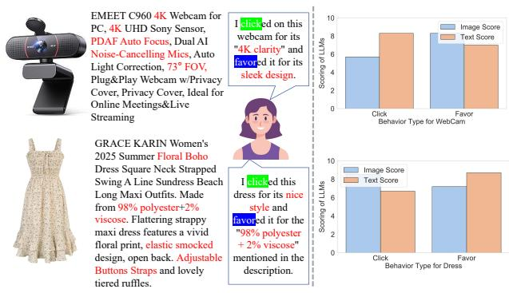

EMEET C960 4K Webcam for PC, 4K UHD Sony Sensor, PDAF Auto Focus, Dual AI Noise-Cancelling Mics, Auto Light Correction, 73° FOV, Plug&Play Webcam w/Privacy Cover, Privacy Cover, Ideal for Online Meetings&Live Streaming

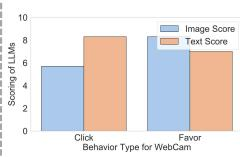  
GRACE KARIN Women's 2025 Summer Floral Boho Dress Square Neck Strapped Swing A Line Sundress Beach Long Maxi Outfits. Made from 98% polyester+2% viscose. Flattering strappy maxi dress features a vivid floral print, elastic smocked design, open back. Adjustabl Buttons Straps and lovely tiered ruffles.

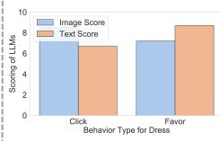  
Figure 1: The importance of images and text in influencing user behavior varies depending on the type of behavior. On the left, a real-world example is presented, demonstrating that user actions such as "click" and "favor" exhibit certain diferences in relation to the modality of the item. On the right, the evaluation results from multiple multimodal large language models (GPT-4o, Claude-3.5-Sonnet, and Gemini 1.5 Pro Exp-1206) are displayed, showing the statistical scores for the attractiveness of the item’s image and text. Higher scores indicate greater content attractiveness. From this analysis, it can be observed that for the item "Dress," the image typically attracts users to "click," while the final decision to "favor" relies equally on textual information such as material and composition.

(1) Lack of efective characterization of modal preferences across diferent behaviors: Users exhibit varying preferences for diferent modalities depending on their behaviors. As illustrated in Figure 1, in click behavior, visual elements might be more attention-grabbing, whereas in save behav iors, textual details and product specifications may receive greater focus. However, the lack of comprehensive research on multi-behavior multi-modal sequential recommendation has resulted in inefective methods for characterizing users’ modal preferences across behaviors.

(2) Dificulty in efectively mitigating implicit noise in user behaviors: Implicit user behavior data often contains noise from accidental clicks or impulsive actions[18–20, 25, 31], which can distort the modeling of true user interests and lead to irrelevant recommendations. When a user accidentally clicks on an unwanted item, it introduces misleading noise that undermines the model’s understanding of preferences. Additionally, noisy behaviors complicate the characterization of modal preferences, as they may not accurately reflect users’ genuine interests. In multi-behavior and multi-modal contexts, efectively identifying and mitigating the impact of such noise on modal preference modeling is a critical challenge.

(3) Inability to handle noise in multi-modal representations: Noise in multi-modal representations negatively im pacts the modeling of user preferences. Multi-modal features, such as image and text embeddings, often contain modality specific noise unrelated to user preferences, as observed in prior work [37]. This noise can propagate through the recommendation pipeline, further complicating the efective integration of multi-modal and multi-behavior information.

To address these challenges, we propose a novel Multi-Modal Multi-Behavior Sequential Recommendation (M3BSR) model, which aims to more precisely model users’ modal preferences across diferent behaviors while efectively mitigating noise in behavior data and multi-modal representations. Inspired by difusion models, M3BSR first employs a conditional difusion model to remove noise from multi-modal representations (e.g., irrelevant details and noise from pre-trained models) under the guidance of user interests, thereby obtaining more accurate multi-modal preferences. Additionally, inspired by the observation that deeper user behaviors (e.g., "favorite") represent more accurate behavioral preferences [6, 8, 35], M3BSR uses deeper behavior information as a condition to guide the difusion model in denoising shallow behavior information (e.g., "click"), thereby improving the signal-to-noise ratio ofuser behavior representations. Finally, the Multi-Expert Interest Extraction Layer comprehensively models common and specific interests across behaviors and modalities through shared and dedicated expert networks, capturing the synergistic relationships between behaviors and modalities to enhance recommendation performance.

Our contributions are as follows:

• We propose a novel Multi-Modal Multi-Behavior sequential recommendation (M3BSR) model to improve the accuracy of sequential recommendation. To the best of our knowledge, this is the first work to explicitly model modal preferences across diferent behaviors.

• We design a Conditional Difusion Modal Denoising Layer, a Conditional Difusion Behavior Denoising Layer, and a Multi-Expert Interest Extraction Layer, which efectively remove noise from both modal and behavioral representations while explicitly modeling the synergistic relationships between behaviors and modalities, thereby enhancing recommendation performance.

• Extensive experiments on benchmark datasets demonstrate that M3BSR significantly outperforms state-of-the-art methods.

## 2 Related work

## 2.1 Multi-modal Sequential Recommendation

In recommender systems, multi-modal information is increasingly used to enhance accuracy and capture user preferences. MM-rec [27] extracts image ROIs and employs co-attentional Transformers for text-ROI modeling, alongside a crossmodal attention network for user modeling. UniSRec [24] leverages item descriptions and contrastive pre-training for universal sequence representations. MISS-Rec [24] introduces a Transformer-based encoder-decoder for multimodal synergy and adaptive item representations. MMSBR [40] enhances session-based recommendations with pseudo-modality contrastive learning and a hierarchical transformer. MMMLP [16] proposes an MLP-based architecture with Feature and Fusion Mixers, achieving state-of-the-art performance with linear complexity. CMCLRec [33] addresses user cold-start via cross-modal mapping and simulated behavior sequences. IISAN [5] adopts a Decoupled

PEFT structure for intra- and inter-modal adaptation, matching full fine-tuning performance with reduced GPU memory usage.

## 2.2 Multi-behavior Sequential Recommendation

The utilization of multi-behavior data has emerged as a crucial re search direction to enhance recommendation precision and capture users’ complex preferences. NMTR [6] learns from multi-behavior data by modeling cascading relationships among behaviors and optimizing within a multi-task learning framework. DIPN [8] im proves real-time purchasing intent prediction by incorporating touch-interactive behavior and using a hierarchical attention mech anism. Feedrec [28] unifies explicit and implicit feedbacks to infer both positive and negative user interests, enhancing news feed recommendation. SGDL [7] introduces a novel denoising para digm that utilizes memorized interactions during early training to enhance the robustness of recommendation models by guiding subsequent training with adaptive denoising signals. MB-STR [38] models multi-behavior sequential dynamics with a multi-behavior transformer layer and behavior-aware prediction module. KMCLR [34] enhances multi-behavior recommendation through knowledge graphs and contrastive learning tasks. EBM [9] addresses eficiency and noise in multi-behavior sequential recommendation with hard and soft denoising modules. MISSL [26] combines multi-behavior and multi-interest modeling using a hypergraph transformer network and self-supervised learning.

## 3 PRELIMINARY

## 3.1 Problem Statement

Let the user set be $U = \{ u _ { 1 } , u _ { 2 } , \cdots \}$ . Following the work of $[ 2 , 7 ]$ , we denote clicks as implicit feedback and favorites as explicit feedback. We define the set of behaviors $B = \{ c l , f a \}$ , where �� represents clicking behavior and �� represents favoring behavior. Let the item set be $I = \{ i _ { 1 } , i _ { 2 } , \cdots , i _ { n } \}$ . Each item � has three modalities: item iden tifier ��, image ��, and text ��. We denote the set of modalities as $M = \{ i d , i m , t e \}$ . For each user $u ,$ there are two behavior sequences, namely $S _ { u , c l } = ( s _ { u , c l , 1 } , s _ { u , c l , 2 } , \cdot \cdot \cdot )$ and $S _ { u , f a } = ( s _ { u , f a , 1 } , s _ { u , f a , 2 } , \cdot \cdot \cdot )$ where $s _ { u , c l , 1 }$ represents the clicking behavior of user � at time 1 and $s _ { u , f a , 1 }$ represents the favoring behavior of user � at time 1. And for each behavior sequence, since each item has three modal ities, there are three corresponding modality sequences. For example, the item identifier sequence for the clicking behavior of user � can be denoted as ${ S _ { u , c l } ^ { i { \dot { d } } } } ~ = ~ ( s _ { u , c l , 1 } ^ { i d } , s _ { u , c l , 2 } ^ { i d } , \cdots )$ , the image sequence as ${ \cal S } _ { u , c l } ^ { i m } = ( s _ { u , c l , 1 } ^ { i m } , s _ { u , c l , 2 } ^ { i m } , \cdots )$ , and the text sequence as $\boldsymbol { S } _ { u , c l } ^ { t e } = ( s _ { u , c l , 1 } ^ { t e } , s _ { u , c l , 2 } ^ { t e } , \cdot \cdot \cdot )$ . The same applies to the favoring behav ior sequences $S _ { u , f a } ^ { i d } , S _ { u , f a } ^ { i m } ,$ and $S _ { u , f a } ^ { t e } .$ . The core task of this study is to accurately predict the next item ˆ� that user � will interact with based on the user’s multi-modal multi-behavior sequences $S _ { u , c l }$ and $S _ { u , f a } .$

## 3.2 Difusion Model

The general conditional difusion model [12] consists of a forward difusion process and a reverse denoising process. The forward difusion process is a Markov chain. At each time step �, according to the variance schedule $\beta _ { 1 } , \cdots , \beta _ { T }$ , Gaussian noise is gradually added to the data $x _ { 0 }$ to obtain $h _ { t } .$ , and the process can be expressed as the following formula:

$$
q (h _ {t} | h _ {t - 1}) = \mathcal {N} (h _ {t}; (1 - \beta_ {t}) h _ {t - 1}, \beta_ {t} \mathbf {I})\tag{1}
$$

Where $N$ denotes the normal distribution, $\beta _ { t }$ represents the variance parameter at time step �, and I is the identity matrix. This equation describes the probability distribution of the current state ℎ� given the previous state $h _ { t - 1 }$ at time step �. This distribution is a normal distribution with a mean of $( 1 - \beta _ { t } ) h _ { t - 1 }$ and a covariance of $\beta _ { t } \mathbf { I } .$ This means that $h _ { t }$ is obtained by adding a certain amount of Gaussian noise to $h _ { t - 1 }$ , with the amount of noise controlled by $\beta _ { t }$

The reverse denoising process focuses on learning an inverse transformation to successfully recover the original data $x _ { 0 }$ from the noisy data $h _ { t } ,$ and its definition is as follows:

$$
p (h _ {t - 1} | h _ {t}) = \mathcal {N} (h _ {t - 1}; \mu_ {t - 1} (h _ {t}, h ^ {c}), \Sigma_ {t - 1} (h _ {t}, h ^ {c}))\tag{2}
$$

Where $\mathop { p } ( h _ { t - 1 } | h _ { t } )$ is the probability distribution of the previous state $h _ { t - 1 }$ given the current state $h _ { t } . \mathcal { N }$ denotes the normal distribution. $\mu _ { t - 1 } ( h _ { t } , h ^ { c } )$ is the predicted mean function based on the current state $h _ { t }$ and conditional information $\begin{array} { r } { \begin{array} { r l } { h ^ { c } . \sum _ { t - 1 } ( h _ { t } , h ^ { c } ) } \end{array} } \end{array}$ is the predicted covariance function based on the current state $h _ { t }$ and conditional information $h ^ { c }$

## 4 Methodology

In this section, we propose the $\mathrm { M } ^ { \mathrm { 3 } } \mathrm { B S R }$ (Multi-Modal Multi-Behavior sequential recommendation) framework to address challenges in characterization ofmodal preferences across diferent behaviors and mitigating implicit noise in modalities and behaviors. $\mathrm { M } ^ { 3 } \mathrm { B S R }$ consists of three core components: the Conditional Difusion Modality Denoising Layer, which enhances multi-modal feature representation by capturing synergistic, common, and specific characteristics; the Conditional Difusion Behavior Denoising Layer, which improves the signal-to-noise ratio of user behavior representations by leveraging deep-level behavioral information; and the Multi-Expert Interest Extraction Layer, which models common and specific interests across behaviors and modalities to enhance recommendation performance. The framework’s structure is illustrated in Fig. 2, providing a comprehensive solution for multi-modal multi-behavior sequential recommendation tasks.

## 4.1 Multi-modal Multi-behavior Input Layer

Multiple diferent behavior sequences and multiple modalities in each behavior sequence are taken as inputs. For the behavior sequence $S _ { u }$ of user $u ,$ the three modalities of ��, image ��, and text �� of each item corresponding to each behavior $s _ { u , t }$ need to be processed separately. Given the challenges faced by existing multi behavior recommendations, the information of diferent modalities has significantly diferent impacts on diferent user behaviors. It is crucial to accurately extract and fuse this modal information. First, for the �� modality sequence $S _ { u } ^ { i d } = [ S _ { u , c l } ^ { i d } , S _ { u , f a } ^ { i d } ]$ of user $u ,$ due to their simplicity, we directly use a embedding layer for embedding:

$$
h ^ {i d} = M L P (S _ {u} ^ {i d})\tag{3}
$$

For the image modality sequence $S _ { u } ^ { i m } ~ = ~ [ S _ { u , c l } ^ { i m } , S _ { u , f a } ^ { i m } ]$ of �, we use the Contrastive Language-Image Pre-training (CLIP) [21] to extract features. Let the convolution operation be ����. After the convolution operation on the image $i m _ { i } ,$ the image feature vector $h ^ { i m }$ is obtained, and the process can be expressed as:

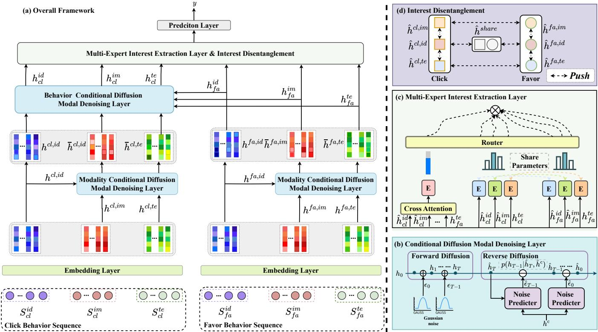  
Figure 2: (a) The overall framework of our proposed M3BSR framework, which illustrates the complete algorithmic workflow; (b) shows our proposed CDMD Layer; (c) presents our proposed MEIE module; (d) demonstrates the feature decoupling process for diferent features across various modalities and behaviors.

$$
h ^ {i m} = C L I P (S _ {u} ^ {i m})\tag{4}
$$

For the text modality sequence $S _ { u } ^ { t e } = [ S _ { u , c l } ^ { t e } , S _ { u , f a } ^ { t e } ]$ of�, we also use CLIP for embedding text information. After processing by the CLIP, the text feature vector $h ^ { t e }$ is obtained:

$$
h ^ {t e} = C L I P (S _ {u} ^ {t e})\tag{5}
$$

## 4.2 Conditional Difusion Model Denoising Layer

In this section, to address the noise issues in modal and behavioral features, we introduce the Conditional Difusion Model Denoising (CDMD) Layer for denoising.

4.2.1 Denoising for Diferent Modalities. As observed in previ ous works [1, 24, 40], image and text embeddings often contain modality-specific noise that is independent of user preferences. This noise can propagate further through the recommendation pipeline, amplifying the challenges of efectively aligning multi-modal and multi-behavior information. Currently, mainstream recommenda tion systems are ID-based, as ID features more directly reflect user preferences compared to the complex features of images and texts.

Inspired by conditional difusion model [12], we leverage ID features as conditions to guide the denoising of text and image modalities. The specific steps are as follows: Let the noisy image and text feature vectors at step � be $\hat { h } _ { t } ^ { i m }$ and $\hat { h } _ { t } ^ { t e }$ respectively. According to the conditional difusion model in Section 3.2, the denoising process can be expressed as:

Forward Difusion:

$$
q (h _ {t + 1} ^ {m} | h _ {t} ^ {m}) = \mathcal {N} (\hat {h} _ {t + 1} ^ {m}; (1 - \beta_ {t}) h _ {t} ^ {m}, \beta_ {t} \mathbf {I})\tag{6}
$$

Where � $\mathbf { \epsilon } \in \{ i m , t e \} . \hat { h } _ { t } ^ { m }$ is the feature of modality � at time step �. N denotes the normal distribution, $\beta _ { t }$ represents the variance parameter at time step �, and I is the identity matrix. This means that $\hat { h } _ { t } ^ { m }$ is obtained by adding a certain amount of Gaussian noise to $\hat { h } _ { t - } ^ { m }$ , with the amount of noise controlled by $\beta _ { t }$ . By using the reparameterization trick [12], the formula can be simplified to:

$$
\widetilde {h} _ {t + 1} ^ {m} = \sqrt {\alpha_ {t} ^ {m}} h _ {t} ^ {m} + \sqrt {1 - \alpha_ {t} ^ {m}} \epsilon_ {t} ^ {m}\tag{7}
$$

Where $\epsilon _ { t } ^ { m }$ represents the noise vector injected into feature $\widetilde { h } _ { t + 1 } ^ { b , m }$ at time step $t . \alpha _ { t } ^ { m }$ controls the degree of noise added to � at time step �.

Reverse Difusion: According to [12], the Reverse Difusion Equation can be expressed as:

$$
\bar {h} _ {t - 1} ^ {m} = \frac {1}{\sqrt {\alpha_ {t} ^ {m}}} \left(\widetilde {h} _ {t} ^ {m} - \frac {1 - \alpha_ {t} ^ {m}}{\sqrt {1 - \bar {\alpha} _ {t}}} \hat {\epsilon} _ {t} ^ {m}\right)\tag{8}
$$

where $\hat { \epsilon } _ { t } ^ { m }$ represents the noise vector removed from $\widetilde { h } _ { t } ^ { m }$ at time step �, and $\textstyle { \bar { \alpha } } _ { t } = \prod _ { i = 1 } ^ { t } \alpha _ { i }$ . Inspired by IP-Adapter [36], we employ conditional features and cross-attention mechanism [17] to guide the removal of noise from the feature $\widetilde { h } _ { t } ^ { m }$ . The $\hat { \epsilon } _ { t } ^ { m }$ can be calculated by following equation:

$$
\begin{array}{c} \hat {\epsilon} _ {t} ^ {m} = C I (h _ {t} ^ {m}, h ^ {c}) \\ C I (\bar {h} _ {t} ^ {m}, h _ {t} ^ {c}) = C r o s s A t t e n t i o n (h _ {t} ^ {m}, h ^ {c}, h ^ {c}) \end{array}\tag{9}
$$

Here, since the ID features can more directly reflect user pref erences and contain less noise compared to complex image and text features, we have $h ^ { c } = h ^ { i d }$ . Note that, for the favor behav ior, we denote the features obtained through Reverse Difusion as $h _ { f a } ^ { i m } , h _ { f a } ^ { t e } , a n d h _ { f a } ^ { i d }$ for image, text, and ID modalities, respectively.

Optimization: The reconstruction loss is used to measure the diference between the denoised and noisy image and text feature vectors, that is:

$$
\mathcal {L} _ {m} = \sum_ {t = 1} ^ {T} \sum_ {m} ^ {\hat {M}} \left(\| \widetilde {h} _ {t} ^ {m} - \bar {h} _ {t} ^ {m} \| _ {2} ^ {2} + \| \widetilde {h} _ {t} ^ {m} - \bar {h} _ {t} ^ {m} \| _ {2} ^ {2}\right)\tag{10}
$$

where $\hat { M } = i m , t e , \widetilde { h } _ { t } ^ { m }$ and $\widetilde { h } _ { t } ^ { m }$ are the noisy image and text feature vectors, and $\bar { h } _ { t } ^ { m }$ and $\bar { h } _ { t } ^ { m }$ are the denoised feature vectors. By minimizing the $\mathcal { L } _ { m }$ , it can be ensured that the denoised modal features more accurately reflect users’ true preferences.

4.2.2 Denoisingfor Diferent Behaviors. Since the noise levels and impacts of diferent behaviors vary, for example, favor behaviors usually better reflect users’ long-term interests and true preferences, while click behavior may contain more noise and temporary factors. click behavior may be caused by users’ casual browsing or misop erations and do not fully represent users’ real needs, while favor behaviors are decisions made after certain thinking and comparison and are more valuable for reference. Therefore, by denoising click behavior with favor behaviors as conditions, users’ true interests can be more accurately captured, and the accuracy and stability of recommendations can be improved. Hence, in the conditional difusion behavior denoising layer, explicit feedback (such as favor) are used as conditions to denoise implicit feedback behaviors (such as click). The specific steps are as follows: Let the feature vector of the implicit feedback behavior be $x _ { b } .$ , and the denoised behavior feature vector be $x _ { b } .$ . The conditional difusion behavior denoising process can be expressed as:

Forward Difusion:

$$
\widetilde {h} _ {t + 1} ^ {c l, m} = \sqrt {\alpha_ {t} ^ {c l , m}} \bar {h} _ {t} ^ {c l, m} + \sqrt {1 - \alpha_ {t} ^ {c l , m}} \epsilon_ {t} ^ {c l, m}\tag{11}
$$

Where $\widetilde { h } _ { t } ^ { c l , m }$ is the feature of behavior click for modality � at time step $t . \ \bar { h } _ { t } ^ { c l , m }$ is the denoising feature by Eq. (8) for modality � of behavior click. $\alpha _ { t } ^ { c l , m }$ controls the degree of noise added to behavior click for � at time step �.

Reverse Difusion:

$$
\begin{array}{c} \hat {h} _ {t - 1} ^ {c l, m} = \frac {1}{\sqrt {\alpha_ {t} ^ {c l , m}}} \left(\widetilde {h} _ {t + 1} ^ {c l, m} - \frac {1 - \alpha_ {t} ^ {c l , m}}{\sqrt {1 - \bar {\alpha} _ {t} ^ {c l , m}}} \hat {\epsilon} _ {t} ^ {c l, m}\right) \\ \hat {\epsilon} _ {t} ^ {c l, m} = C I (h _ {t} ^ {c l, m}, h ^ {c}) \\ ^ {l, m}, h _ {t} ^ {c}) = C r o s s A t t e n t i o n (h _ {t} ^ {c l, m}, h ^ {c}, h ^ {c}) \end{array}\tag{12}
$$

Compared to click behavior, which may be influenced by accidental actions or other factors, deeper behaviors (such as favoring) tend to exhibit a lower level of noise. Therefore, we can use the features of favor behaviors to guide the denoising of click behavior, we have $h ^ { c } = h ^ { f a , m }$ . Note that, for the click behavior, we denote the features obtained through Reverse Difusion as $h _ { c l } ^ { i m } , h _ { c l } ^ { t e } , a n d h _ { c l } ^ { i d }$ for image, text, and ID modalities, respectively.

Optimization: Similarly, the reconstruction loss is used to measure the diference between the denoised and noisy behavior feature vectors, that is:

$$
\mathcal {L} _ {b} = \sum_ {m} ^ {\hat {M}} \sum_ {t = 1} ^ {T} \| \hat {h} _ {t} ^ {c l, m} - \widetilde {h} _ {t} ^ {c l, m} \| _ {2} ^ {2}\tag{13}
$$

where $\widetilde { h } _ { t } ^ { c l , m }$ is the noisy behavior feature vector, and $\hat { h } _ { t } ^ { c l , m }$ is the denoised feature vector for modality � of behavior click. By minimizing this loss, the model can remove the noise in the click behavior features, more accurately model users’ real behavior, and thus improve the accuracy of recommendations.

## 4.3 Multi-Expert Interest Extraction Layer

In this section, we introduce the Multi-Expert Interest Extraction (MEIE) Layer, a novel approach designed to capture and aggregate diverse user interests from multi-modal and multi-behavior data. This layer efectively handles the complexity of user interactions by leveraging cross-attention mechanisms, Transformer architectures, and gating networks.

4.3.1 Common Feature Extraction. Users exhibit diverse behaviors and interaction modalities, yet often have a stable underlying preference. For example, a fan of science fiction movies keeps this preference whether browsing text-based movie info or watching video trailers. To capture user preferences, we must extract common features across diferent behaviors and modalities. Since these features are initially independent, we use a cross - attention mechanism. It dynamically calculates feature correlations, captures semantic relationships, and efectively aligns and fuses heterogeneous feature representations.

Specifically, the multi-modal features ofclick and favor behaviors are concatenated firstly:

$$
h _ {c l} = [ h _ {c l} ^ {i m}, h _ {c l} ^ {t e}, h _ {c l} ^ {i d} ]\tag{14}
$$

$$
h _ {f a} = [ h _ {f a} ^ {i m}, h _ {f a} ^ {t e}, h _ {f a} ^ {i d} ]\tag{15}
$$

where $h _ { c l / f a } ^ { i m / t e / i d }$ denotes the features obtained through the reverse difusion process.

Then, cross-attention is used to interact and align between click and favor behaviors:

$$
\hat {h} ^ {\text { share }} = \text { CrossAttention } (h _ {c l}, h _ {f a})\tag{16}
$$

Finally, considering that the Transformer can efectively capture long-range dependencies and complex interactions, we utilize the Transformer as the expert network to capture deeper common features:

$$
h _ {c o m m o n} = \mathrm{Transformer} (\hat {h} ^ {s h a r e})\tag{17}
$$

where $h _ { c o m }$ represents the common features across diferent behaviors and modalities.

4.3.2 Unique Feature Extraction for Click and Favor Behavior. In practical applications, apart from common features, users may also be attracted by the characteristics of modalities on products. For instance, users might focus more on the visual attractiveness of images or the accuracy of text descriptions. Moreover, user click behavior and favor behavior may exhibit distinct preferences across diferent modalities. Hence, extracting the unique modal features under diferent behaviors is essential for a better understanding of users’ specific interests for diferent modalities. Given the Trans former’s capability to dynamically attend to diverse sequence posi tions and capture intricate intra-modal dependencies, it efectively learns behavior-specific information representations. Thus, we em ploy the Transformer as the expert network to extract distinct modal features (image, text, and ID) for click and favor behaviors.

$$
h _ {c l} ^ {m} = \mathrm{Transformer} (h _ {c l} ^ {m})\tag{18}
$$

$$
h _ {f a} ^ {m} = \operatorname{Transformer} (h _ {f a} ^ {m})\tag{19}
$$

Here, ${ h } _ { c l } ^ { m } .$ , and $h _ { f a } ^ { m }$ represent the modality � features under click and favor behavior, respectively. � $\in \{ i d , i m , t e \}$

4.3.3 Interest Disentanglement: To ensure that the feature represen tations of diferent modalities and behaviors can be distinguished and capture their unique characteristics, we design a contrastive loss function for feature disentanglement. This encourages the fea ture representations $h _ { c l } ^ { i d } , h _ { c l } ^ { i m } , h _ { c l } ^ { t \bar { e } } , h _ { f a } ^ { i d } , h _ { f a } ^ { i m } , h _ { f a } ^ { t e }$ , and ℎ������ to be separated in the feature space. The purpose of this design is to avoid confusion between features and ensure that each modality and behavior’s feature representation can independently capture its unique semantic information. Specifically, We use the following contrastive loss function to encourage the separation of diferent feature representations:

$$
\mathcal {L} _ {\text { contrast }} = - \sum_ {i \neq j} \log \frac {\exp (\text { sim } (h _ {i} , h _ {j}) / \tau)}{\sum_ {k \neq i} \exp (\text { sim } (h _ {i} , h _ {k}) / \tau)}\tag{20}
$$

where $h _ { i }$ and $h _ { j }$ represent diferent feature representations $( \mathrm { e . g . }$ $h _ { c l } ^ { i d } , h _ { c l } ^ { i m } , h _ { c l } ^ { t e } , h _ { f a } ^ { i d } , h _ { f a } ^ { i m } , h _ { f a } ^ { t e }$ , and $h _ { c o m m o n } ) .$ sim $( h _ { i } , h _ { j } )$ is a simi larity measure between features $h _ { i }$ and $h _ { j }$ , typically using cosine similarity. � is a hyperparameter, known as the temperature pa rameter, which controls the sensitivity to similarity in contrastive learning.

4.3.4 Interest Routing Fusion. Users may exhibit varying preferences across diferent modalities. Additionally, the feature data often contains noise unrelated to user interests, which can interfere with the accurate extraction and modeling of true user preferences. Therefore, we employ a routing network to dynamically control the weights of diferent features during fusion. This network prioritizes features that are more aligned with user preferences and less af fected by noise, ensuring a more robust and precise representation of user interests. The routing network can be represented as:

$$
h _ {c l} = [ h _ {c l} ^ {i m}, h _ {c l} ^ {t e}, h _ {c l} ^ {i d} ]
$$

$$
h _ {f a} = [ h _ {f a} ^ {i m}, h _ {f a} ^ {t e}, h _ {f a} ^ {i d} ]\tag{21}
$$

$$
g = \sigma (W _ {g} \cdot [ h _ {c o m m o n}; h _ {c l}; h _ {f a} ] + b _ {g})
$$

$$
y = g \cdot h _ {c o m m o n} + (1 - g) \cdot [ h _ {c l}; h _ {f a} ]\tag{22}
$$

Table 1: Statistics of Rec-Tmal and Kuaishou datasets.

<table><tr><td>Dataset</td><td>Users</td><td>Items</td><td>Interactions</td><td>Avg. Clicks</td><td>Avg. Favors</td></tr><tr><td>Rec-Tmal</td><td>72051</td><td>93466</td><td>328387</td><td>4.16</td><td>1.73</td></tr><tr><td>Kuaishou</td><td>22793</td><td>618529</td><td>5852725</td><td>255.02</td><td>40.96</td></tr></table>

here, � is the sigmoid function, $W _ { g }$ and $b _ { g }$ are learnable parameters, and $y$ is the final fused feature.

## 4.4 Prediction & Optimization

4.4.1 cross-entropy loss: After completing the multi-modal multibehavior interest extraction, the user preference representation � is input into the prediction layer. This layer uses a fully-connected neural network to map the preference representation to the probability distribution of items:

$$
p (i | y) = \operatorname{softmax} (W y + b)\tag{23}
$$

To train the model, we use the cross-entropy loss function to measure the diference between the predicted results and the actual results. The specific formula is as follows:

$$
\mathcal {L} _ {\mathrm{main}} = - \sum_ {u \in U} \log p (i _ {u} | y _ {u})\tag{24}
$$

where $i _ { u }$ is the actual item selected by user $u ,$ and $y _ { u }$ is the user preference representation extracted by the model for user �.

4.4.2 Total Loss Function: The total loss function is:

$$
\mathcal {L} = \mathcal {L} _ {m a i n} + \lambda_ {c} \mathcal {L} _ {\mathrm{contrast}} + \lambda_ {m} \mathcal {L} _ {m} + \lambda_ {b} \mathcal {L} _ {b}\tag{25}
$$

where $\lambda _ { c } , \lambda _ { m }$ , and $\lambda _ { b }$ are hyperparameters that balance the contributions of the contrastive loss, modal denoising loss, and behavior denoising loss, respectively. Minimizing the total loss function ensures that the model comprehensively captures user preferences while reducing noise and enhancing feature representations. This holistic approach leads to more robust and accurate recommendations.

## 5 Experiment

In this section, we evaluate the $M ^ { 3 }$ BSR framework on two public datasets, Rec-Tmal and Kuaishou, to address the following research questions:

• Efectiveness (RQ1). Does the M3BSR model outperform various state-of-the-art (SOTA) baselines?

• Thoroughness (RQ2). How do the specific designs in M3BSR impact the model’s performance?

• Robustness (RQ3). How do changes in the module’s parameters afect the model’s efectiveness?

• Cold Start (RQ4). How is the performance of our method under the cold start scenario?

• Visualization (RQ5). Can our method efectively remove noise?

## 5.1 Experimental Settings

5.1.1 Dataset. Due to the scarcity of research specifically focused on multi - modal multi - behavior recommendation systems, we introduced two new datasets for our experiments: "Rec-Tmal" and "Kuaishou". The Rec-Tmal dataset1 is sourced from Tmall2, and the Kuaishou dataset3 comes from the Kuaishou platform. These two datasets ofer diverse multi-modal and multi-behavior data, which are essential for comprehensively evaluating the performance of our proposed M3BSR model in such a novel research area. For the two datasets, we utilized product images for visual information representation and product titles for textual information. For Rec-Tmal, the ID information included item ID, brand ID, user ID, and seller ID. Each user in this dataset has two types of behaviors: click and favor. For Kuaishou, the ID modality includes user ID and video ID. The detailed parameters are shown in Table 1

Table 2: Performance Comparison on Rec-Tmal and Kuaishou datasets.

<table><tr><td rowspan="2">Method</td><td colspan="4">Rec-Tmal</td><td colspan="4">Kuaishou</td></tr><tr><td>HR@10</td><td>NDCG@10</td><td>HR@20</td><td>NDCG@20</td><td>HR@10</td><td>NDCG@10</td><td>HR@20</td><td>NDCG@20</td></tr><tr><td colspan="9">Traditional Sequential Recommendation Methods</td></tr><tr><td>GRU4Rec (2015)</td><td>0.1498</td><td>0.0431</td><td>0.2015</td><td>0.0492</td><td>0.0853</td><td>0.0021</td><td>0.1360</td><td>0.0103</td></tr><tr><td>SASRec (2018)</td><td>0.1662</td><td>0.0578</td><td>0.2145</td><td>0.0635</td><td>0.1001</td><td>0.0083</td><td>0.1490</td><td>0.0141</td></tr><tr><td>BERT4Rec (2019)</td><td>0.2123</td><td>0.0964</td><td>0.2629</td><td>0.1078</td><td>0.1435</td><td>0.0494</td><td>0.1958</td><td>0.0549</td></tr><tr><td>STOSA (2022)</td><td>0.2568</td><td>0.1370</td><td>0.3080</td><td>0.1420</td><td>0.1930</td><td>0.0908</td><td>0.2420</td><td>0.1135</td></tr><tr><td>SSDRec (2024)</td><td>0.2827</td><td>0.1637</td><td>0.3315</td><td>0.1680</td><td>0.2176</td><td>0.1151</td><td>0.2671</td><td>0.1198</td></tr><tr><td colspan="9">Multi-modal Sequential Recommendation Methods</td></tr><tr><td>MISSRec (2023)</td><td>0.2786</td><td>0.1601</td><td>0.3322</td><td>0.1623</td><td>0.2179</td><td>0.1120</td><td>0.2654</td><td>0.1186</td></tr><tr><td>MMSBR (2023)</td><td>0.2897</td><td>0.1660</td><td>0.3336</td><td>0.1702</td><td>0.2209</td><td>0.1188</td><td>0.2711</td><td>0.1253</td></tr><tr><td>MMMLP (2023)</td><td>0.2928</td><td>0.1753</td><td>0.3421</td><td>0.1789</td><td>0.2284</td><td>0.1285</td><td>0.2769</td><td>0.1332</td></tr><tr><td>M3SRec (2023)</td><td>0.2997</td><td>0.1803</td><td>0.3486</td><td>0.1851</td><td>0.2315</td><td>0.1293</td><td>0.2859</td><td>0.1354</td></tr><tr><td>CMCLRec (2024)</td><td>0.3075</td><td>0.1886</td><td>0.3602</td><td>0.1937</td><td>0.2394</td><td>0.1375</td><td>0.2918</td><td>0.1450</td></tr><tr><td colspan="9">Multi-behavior Sequential Recommendation Methods</td></tr><tr><td>NMTR (2019)</td><td>0.2738</td><td>0.1524</td><td>0.3225</td><td>0.1563</td><td>0.2096</td><td>0.1061</td><td>0.2583</td><td>0.1088</td></tr><tr><td>DIPN (2019)</td><td>0.2786</td><td>0.1602</td><td>0.3307</td><td>0.1654</td><td>0.2153</td><td>0.1111</td><td>0.2623</td><td>0.1156</td></tr><tr><td>SGDL (2022)</td><td>0.2861</td><td>0.1670</td><td>0.3359</td><td>0.1708</td><td>0.2212</td><td>0.1181</td><td>0.2672</td><td>0.1209</td></tr><tr><td>MB-STR (2022)</td><td>0.2931</td><td>0.1741</td><td>0.3447</td><td>0.1795</td><td>0.2290</td><td>0.1282</td><td>0.2794</td><td>0.1344</td></tr><tr><td>KMCLR (2023)</td><td>0.3025</td><td>0.1800</td><td>0.3518</td><td>0.1857</td><td>0.2372</td><td>0.1334</td><td>0.2806</td><td>0.1382</td></tr><tr><td>EBM (2024)</td><td>0.3083</td><td>0.1877</td><td>0.3601</td><td>0.1953</td><td>0.2420</td><td>0.1395</td><td>0.2882</td><td>0.1423</td></tr><tr><td> $M^3BSR$ (Ours)</td><td>0.3207</td><td>0.2028</td><td>0.3815</td><td>0.2130</td><td>0.2603</td><td>0.1630</td><td>0.3101</td><td>0.1612</td></tr></table>

For all datasets, we selected user behavior sequences with a minimum length of 5. Additionally, we retained the 50 most recent historical records for each user. For the training and test data, we adopt the same setting as described in [30, 41]. Table 1 displays the relevant statistical information for each dataset. Following [9, 35, 38], we define the target behavior as "favor" and use "click" as the auxiliary behavior, enabling the model to capture the relationship between diferent user behaviors and their impact on recommendations. To ensure a realistic evaluation scenario, we treat the last favor behavior in each user sequence as the test sample and the preceding ones as validation samples, allowing the model to predict future user preferences based on historical interactions. Additionally, to enhance the robustness of our evaluation, we pair each positive sample with 99 randomly selected negative instances, as suggested in [9, 35, 38].

5.1.2 Evaluation Metrics. In our evaluation, we employ Hit Rate at � (HR@�) and Normalized Discounted Cumulative Gain at � (NDCG@�) to assess prediction quality, widely accepted in sequential recommendation. HR@� measures whether the target item appears in the top-� recommendations, while NDCG@� evaluates the item’s ranking position, prioritizing higher ranks. We use � = 10 and 20 to comprehensively test the model’s performance across varying recommendation lengths.

5.1.3 Implementation Details. The proposed model is implemented using the PyTorch framework4. To ensure a fair comparison, we utilize our pipeline framework to reproduce all of the baselines, and each baseline model is experimented with multiple times to obtain optimal results. The size of IDs modality is set to 16, and image and text modalities embeddings are set to 512 for the complexity of image and text features compared to IDs. We use a fixed minibatch size of 1024. When searching for optimal values, we explore learning rates in the set $\{ 1 0 ^ { - 5 } , 1 0 ^ { - 4 } , 1 0 ^ { - \frac { 5 } { 3 } } \}$ , and hidden sizes in the set {64, 128, 256, 512}. The time step � for the difusion models is set to 15. The level of the difusion noise, denoted as �, are initialized in the range of [0.001, 0.1] to ensure efective noise scheduling during training. Additionally, we search for the weights in Eq. (25) within the range of 0.01 to 0.15. To prevent overfitting and optimize performance, we employ an early stopping strategy. Specifically, if the NDCG@10 metric does not improve for 10 consecutive epochs, the training process will be halted.

5.1.4 Comparison Methods. We compare our framework with SOTA sequential recommendation methods across three categories. Traditional Sequential Recommendation Methods: GRU4Rec [11], SAS Rec [14], BERT4Rec [22], STOSA [4], SSDRec [39]; Multi-modal Sequential Recommendation Methods: MISSRec [24], MMSBR [40], MMMLP [16], M3SRec [1], CMCLRec [33]; Multi-behavior Sequential Recommendation Methods: NMTR [6], DIPN [8], SGDL [7], MB-STR [38], KMCLR [34], EBM [9].

## 5.2 Performance Comparison (RQ1)

To validate the efectiveness of our proposed model, we performed experiments on two diferent datasets. The results, presented in Ta ble 2, compare the performance of M3BSR with that of the baseline models across diferent categories. Based on these results, we made the following observations:

• M3BSR consistently achieves the best performance in terms of HR@10, HR@20, NDCG@10, and NDCG@20 across both datasets. This demonstrates the superior efec tiveness ofour proposed framework in handling multi-modal multi-behavior sequential recommendation tasks. Besides, the consistent gains across diferent datasets further under score the robustness and generalizability of M3BSR.

• Compared to traditional sequential recommendation methods (GRU4Rec, SASRec, BERT4Rec, STOSA, SS DRec), M3BSR shows significant improvements. This is attributed to M3BSR’s ability to leverage multi-modal information and model inter-behavior dependencies, which are not considered by these simpler sequential models.

• M3BSR also outperforms state-of-the-art multi-modal sequential recommendation methods (MISSRec, MMSBR, MMMLP, M3SRec, CMCLRec). The improvements highlight the efectiveness of M3BSR’s conditional difusion denoising mechanisms in removing noise from both modal and behavioral representations, leading to more accurate user preference modeling. For example, while methods like MISS-Rec focus on multi-modal synergy, they may not explicitly address noise in the same way as M3BSR.

• Furthermore, M3BSR surpasses multi-behavior sequential recommendation methods (NMTR, DIPN, SGDL, MB-STR, KMCLR, EBM). This indicates the advantage of M3BSR in jointly modeling multi-modalities and multibehaviors. While methods like NMTR focus on cascading behavior relationships, they lack the explicit handling of multi-modal information and noise that M3BSR provides.

## 5.3 Ablation Study (RQ2)

In this section, we conduct an ablation study to evaluate the impact of diferent components of the M3BSR framework on the perfor mance of recommender systems.

• w/o CDMD-M: We remove the Conditional Difusion Model Denoising (CDMD) module for modalities, which is respon sible for denoising multi-modal feature representations.

• w/o CDMD-B: We remove the CDMD module for behaviors, which denoises behavior feature representations.

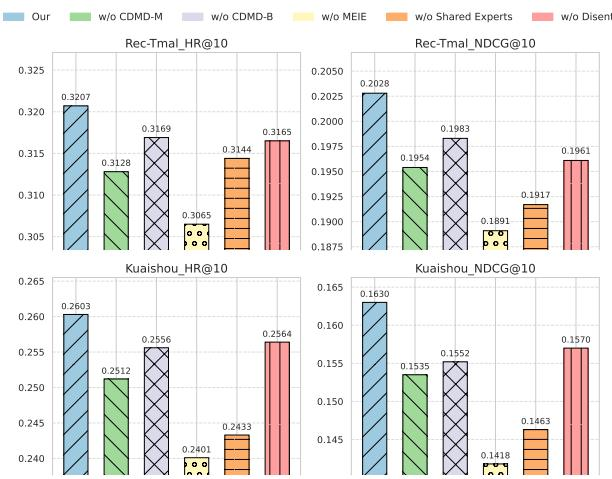  
Figure 3: Performance for Ablation Study

• w/o MEIE: We remove the Multi-Expert Interest Extraction (MEIE) layer that extracts and decouples user interests from multi-modal and multi-behavior data.

• w/o Shared Expert: We remove the shared expert network, which plays a role in modeling common interests across modalities and behaviors.

• w/o Disent: We remove the Interest Disentanglement module from the proposed model.

The ablation study in Fig. 3 evaluates the impact of key modules on recommendation performance. (1) Removing the CDMD for module modalities reduces HR@10 and NDCG@10, demonstrating the importance of denoising multi-modal features for accurate user preference modeling. (2) Similarly, eliminating the CDMD module for behaviors degrades performance, emphasizing the need to mitigate noise in behavior sequences. (3) The most significant performance drop occurs when removing the MEIE Layer, highlighting its critical role in modeling common and specific interests across modalities and behaviors. (4) Ablating the Shared Expert also reduces performance, as it disrupts the modeling of synergistic relationships between data sources. (5) Finally, removing the Interest Disentanglement module diminishes performance, confirming its role in separating feature representations and reducing confusion across modalities and behaviors.

## 5.4 In-depth Analysis (RQ3)

5.4.1 Efect ofBehavior Denoising Difusion. Figs.4a and4d show HR@10 performance for varying behavior denoising steps and loss weights on the Rec-Tmal and Kuaishou datasets. On Rec-Tmal, the peak HR@10 (0.3207) occurred at 10 steps / 0.02 weight, balancing denoising and specificity; excessive steps/weight (e.g., 25 / 0.15) caused over-regularization (HR@10 0.3155). Similarly, Kuaishou achieved its best HR@10 (0.2603) at 10 steps / 0.02 weight, ensuring efective denoising without over-regularization. Insuficient denoising (e.g., 5 steps / 0.01) reduced performance (HR@10 0.2583). Consistently, the optimal range across both datasets is around 10 difusion steps with a 0.02 loss weight, achieving the best trade-of.

5.4.2 Efect of Modality Denoising Difusion. Figs.4a and4d show HR@10 performance for varying behavior denoising steps and loss weights on the Rec-Tmal and Kuaishou datasets. On Rec-Tmal, the peak HR@10 (0.3207) occurred at 10 steps / 0.02 weight, balancing denoising and specificity; excessive steps/weight (e.g., 25 / 0.15) caused over-regularization (HR@10 0.3155). Similarly, Kuaishou achieved its best HR@10 (0.2603) at 10 steps / 0.02 weight, ensuring efective denoising without over-regularization. Insuficient denoising (e.g., 5 steps / 0.01) reduced performance (HR@10 0.2583). Consistently, the optimal range across both datasets is around 10 difusion steps with a 0.02 loss weight, achieving the best trade-of.

(a) Rec-Tmal:�� & �� (b) Rec-Tmal: $T _ { m } \& \lambda _ { m }$  
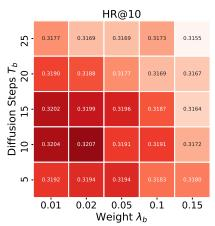

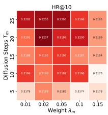

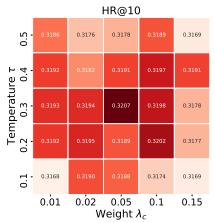  
(c) Rec-Tmal:� & $\lambda _ { c }$

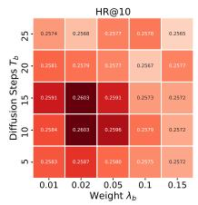

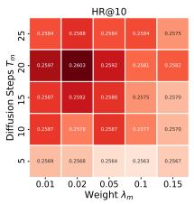

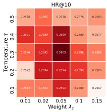  
(d) Kuaishou: $T _ { b }$ & $\lambda _ { b }$ (e) Kuaishou: $: T _ { m }$ $\& \lambda _ { m }$ (f) Kuaishou:� & $\lambda _ { c }$  
Figure 4: Heatmaps for diferent weights and difusion steps

5.4.3 Efect ofContrastive Learning. Figs.4c and4f show the interplay between temperature and contrastive loss weight. On Rec-Tmal, peak HR@10 (0.3207) occurred at 0.3 temperature / 0.05 weight, balancing sample separation and alignment. Lower settings (e.g., 0.01 temp/0.01 weight) caused incorrect pairings (HR@10 0.3168), while higher settings (e.g., 0.5 temp/0.15 weight) hindered separation (HR@10 0.3169). Similarly, Kuaishou’s best HR@10 (0.2603) was at 0.3 temp / 0.05 weight, ensuring proper separation. Lower settings (0.01/0.01) dropped HR@10 to 0.2583, and higher ones (0.5/0.15) to 0.2580. Consistently, optimal performance across both datasets requires a 0.3 temperature and 0.05 loss weight.

## 5.5 Cold Start Experiment (RQ4)

In cold-start evaluations on Kuaishou users with sparse history (≤10 interactions), M3BSR demonstrated significantly better performance (HR@10, NDCG@10) than strong baselines. This advantage arises from its ability to efectively infer preferences from multi modal data (images/text via CDMD), identify broader modality based interests independent ofdeep interaction history (using MEIE & Interest Disentanglement), and reduce noise impact through fea ture denoising.

## 5.6 TSNE Visualization (RQ5)

To visualize the efectiveness of the CDMD module, we performed t-distributed stochastic neighbor embedding (t-SNE) on the item embeddings learned from the Kuaishou dataset. As shown in Fig. 5, the embeddings processed by CDMD exhibit compact clusters, indicating that CDMD efectively reduces noise. In contrast, when CDMD is replaced with a Multilayer Perceptron (MLP), the embeddings only undergo translational shifts without significant changes in their overall distribution. The resulting clusters remain dispersed and noisy, failing to achieve the denoising efect observed with CDMD.

Table 3: Performance on Cold-Start Users (Rec-Tmal)

<table><tr><td>Method</td><td>HR@10</td><td>NDCG@10</td></tr><tr><td>STOSA</td><td>0.2186</td><td>0.1459</td></tr><tr><td>MMMLP</td><td>0.2413</td><td>0.1672</td></tr><tr><td>EBM</td><td>0.2560</td><td>0.1819</td></tr><tr><td> $M^{3}BSR$  (Ours)</td><td>0.2897</td><td>0.2146</td></tr></table>

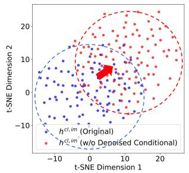

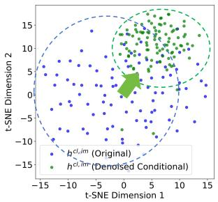  
Figure 5: Visualization of CMDM Efectiveness

Table 4: Time Eficiency Comparison on Kuaishou Dataset

<table><tr><td>Method</td><td>Training Time per Epoch (s)</td><td>Inference Time per Prediction (s)</td></tr><tr><td>STOSA</td><td>25.3</td><td>0.07</td></tr><tr><td>MMMLP</td><td>28.7</td><td>0.09</td></tr><tr><td>EBM</td><td>32.5</td><td>0.13</td></tr><tr><td> $M^{3}BSR$  (Ours)</td><td>35.2</td><td>0.16</td></tr></table>

## 5.7 Time Eficiency Experiment

M3BSR’s time eficiency was evaluated on Kuaishou. We fix the batch-size as 128. Table 4 shows the average training time per epoch and the average inference time per prediction for each method.While its added complexity increases training time, this is manageable given significant performance gains. Its inference time is comparable to complex baselines, making it practical for online recommendation due to its parallelizable modular design.

## 6 Conclusion

This paper proposes M3BSR to address multi-modal recommendation challenges. Using specialized modules (CDMD for Modalities/Behaviors, MEIE & Feature Decoupling) and contrastive loss, it denoises inputs and models common/specific interests. These components work together to denoise multi-modal features, mitigate noise in user behavior sequences, and explicitly model common and specific interests across modalities and behaviors. Experiments show M3BSR outperforms baselines, improving preference modeling and recommendation accuracy.

## References

[1] Shuqing Bian, Xingyu Pan, Wayne Xin Zhao, Jinpeng Wang, Chuyuan Wang, and Ji-Rong Wen. 2023. Multi-modal mixture of experts represetation learning for sequential recommendation. In Proceedings ofthe 32nd ACM International Conference on Information and Knowledge Management. 110–119.

[2] Zhi Bian, Shaojun Zhou, Hao Fu, Qihong Yang, Zhenqi Sun, Junjie Tang, Guiquan Liu, Kaikui Liu, and Xiaolong Li. 2021. Denoising user-aware memory network for recommendation. In Proceedings of the 15th ACM Conference on Recommender Systems. 400–410.

[3] Xiaoqing Chen, Zhitao Li, Weike Pan, and Zhong Ming. 2023. A Survey on Multi-Behavior Sequential Recommendation. arXiv preprint arXiv:2308.15701 (2023).

[4] Ziwei Fan, Zhiwei Liu, Yu Wang, Alice Wang, Zahra Nazari, Lei Zheng, Hao Peng, and Philip S Yu. 2022. Sequential recommendation via stochastic self-attention. In Proceedings ofthe ACM web conference 2022. 2036–2047.

[5] Junchen Fu, Xuri Ge, Xin Xin, Alexandros Karatzoglou, Ioannis Arapakis, Jie Wang, and Joemon M Jose. 2024. IISAN: Eficiently adapting multimodal repre sentation for sequential recommendation with decoupled PEFT. In Proceedings ofthe 47th International ACM SIGIR Conference on Research and Development in Information Retrieval. 687–697.

[6] Chen Gao, Xiangnan He, Dahua Gan, Xiangning Chen, Fuli Feng, Yong Li, Tat-Seng Chua, and Depeng Jin. 2019. Neural multi-task recommendation from multi-behavior data. In 2019 IEEE 35th international conference on data engineering (ICDE). IEEE, 1554–1557.

[7] Yunjun Gao, Yuntao Du, Yujia Hu, Lu Chen, Xinjun Zhu, Ziquan Fang, and Baihua Zheng. 2022. Self-guided learning to denoise for robust recommendation. In Proceedings ofthe 45th International ACM SIGIR Conference on Research and Development in Information Retrieval. 1412–1422.

[8] Long Guo, Lifeng Hua, Rongfei Jia, Binqiang Zhao, Xiaobo Wang, and Bin Cui. 2019. Buying or browsing?: Predicting real-time purchasing intent us ing attention-based deep network with multiple behavior. In Proceedings ofthe 25th ACM SIGKDD international conference on knowledge discovery & data mining. 1984–1992.

[9] Yongqiang Han, Hao Wang, Kefan Wang, Likang Wu, Zhi Li, Wei Guo, Yong Liu, Defu Lian, and Enhong Chen. 2024. Eficient Noise-Decoupling for Multi-Behavior Sequential Recommendation. In Proceedings ofthe ACM on Web Conference 2024. 3297–3306.

[10] Jiao He, Weihai Lu, and Jianjun Yuan. 2022. A Novel Eficient Unclick Behavior Modeling Framework for Click-Through Rate Prediction. In 2022 IEEE 34th International Conference on Tools with Artificial Intelligence (ICTAI). IEEE, 112–121.

[11] B Hidasi. 2015. Session-based Recommendations with Recurrent Neural Networks. arXiv preprint arXiv:1511.06939 (2015)

[12] Jonathan Ho, Ajay Jain, and Pieter Abbeel. 2020. Denoising difusion probabilistic models. Advances in neural information processing systems 33 (2020), 6840–6851.

[13] Bowen Jin, Chen Gao, Xiangnan He, Depeng Jin, and Yong Li. 2020. Multi behavior recommendation with graph convolutional networks. In Proceedings ofthe 43rd international ACM SIGIR conference on research and development in information retrieval. 659–668.

[14] Wang-Cheng Kang and Julian McAuley. 2018. Self-attentive sequential recom mendation. In 2018 IEEE international conference on data mining (ICDM). IEEE 197–206.

[15] Yiheng Li and Weihai Lu. 2024. MHHCR: Multi-behavior Heterogeneous Hyper graph Contrastive Recommendation. In International Conference on Web Information Systems Engineering. Springer, 91–102.

[16] Jiahao Liang, Xiangyu Zhao, Muyang Li, Zijian Zhang, Wanyu Wang, Haochen Liu, and Zitao Liu. 2023. Mmmlp: Multi-modal multilayer perceptron for sequen tial recommendations. In Proceedings of the ACM Web Conference 2023. 1109–1117.

[17] Hezheng Lin, Xing Cheng, Xiangyu Wu, and Dong Shen. 2022. Cat: Cross atten tion in vision transformer. In 2022 IEEE international conference on multimedia and expo (ICME). IEEE, 1–6.

[18] Huiting Liu, Huaxiu Zhang, Peipei Li, Peng Zhao, and Xindong Wu. 2024. Denoising Implicit Feedback for Graph Collaborative Filtering via Causal Intervention. IEEE Transactions on Big Data (2024).

[19] Minghao Mo, Weihai Lu, Qixiao Xie, Xiang Lv, Zikai Xiao, Hong Yang, and Yanchun Zhang. 2024. MIN: Multi-stage Interactive Network for Multimodal Recommendation. In International Conference on Web Information Systems Engineering. Springer, 191–205.

[20] Minghao Mo, Weihai Lu, Qixiao Xie, Zikai Xiao, Xiang Lv, Hong Yang, and Yanchun Zhang. 2025. One multimodal plugin enhancing all: CLIP-based pre training framework enhancing multimodal item representations in recommenda tion systems. Neurocomputing (2025), 130059.

[21] Alec Radford, Jong Wook Kim, Chris Hallacy, Aditya Ramesh, Gabriel Goh, Sandhini Agarwal, Girish Sastry, Amanda Askell, Pamela Mishkin, Jack Clark, et al. 2021. Learning transferable visual models from natural language supervision.

In International conference on machine learning. PMLR, 8748–8763.

[22] Fei Sun, Jun Liu, Jian Wu, Changhua Pei, Xiao Lin, Wenwu Ou, and Peng Jiang. 2019. BERT4Rec: Sequential recommendation with bidirectional encoder representations from transformer. In Proceedings of the 28th ACM international conference on information and knowledge management. 1441–1450.

[23] Zhulin Tao, Yinwei Wei, Xiang Wang, Xiangnan He, Xianglin Huang, and Tat Seng Chua. 2020. Mgat: Multimodal graph attention network for recommendation. Information Processing & Management 57, 5 (2020), 102277.

[24] Jinpeng Wang, Ziyun Zeng, Yunxiao Wang, Yuting Wang, Xingyu Lu, Tianxiang Li, Jun Yuan, Rui Zhang, Hai-Tao Zheng, and Shu-Tao Xia. 2023. MISSRec: Pre training and transferring multi-modal interest-aware sequence representation for recommendation. In Proceedings of the 31st ACM International Conference on Multimedia. 6548–6557.

[25] Wenjie Wang, Fuli Feng, Xiangnan He, Liqiang Nie, and Tat-Seng Chua. 2021. Denoising implicit feedback for recommendation. In Proceedings of the 14th ACM international conference on web search and data mining. 373–381.

[26] Binquan Wu, Yu Cheng, Haitao Yuan, and Qianli Ma. 2024. When Multi-Behavior Meets Multi-Interest: Multi-Behavior Sequential Recommendation with Multi-Interest Self-Supervised Learning. In 2024 IEEE 40th International Conference on Data Engineering (ICDE). IEEE, 845–858

[27] Chuhan Wu, Fangzhao Wu, Tao Qi, and Yongfeng Huang. 2021. Mm-rec: multi modal news recommendation. arXiv preprint arXiv:2104.07407 (2021).

[28] Chuhan Wu, Fangzhao Wu, Tao Qi, Qi Liu, Xuan Tian, Jie Li, Wei He, Yongfeng Huang, and Xing Xie. 2022. Feedrec: News feed recommendation with various user feedbacks. In Proceedings ofthe ACM Web Conference 2022. 2088–2097.

[29] Yiqing Wu, Ruobing Xie, Yongchun Zhu, Xiang Ao, Xin Chen, Xu Zhang, Fuzhen Zhuang, Leyu Lin, and Qing He. 2022. Multi-view multi-behavior contrastive learning in recommendation. In International conference on database systems for advanced applications. Springer, 166–182.

[30] Fangxiong Xiao, Lixi Deng, Jingjing Chen, Houye Ji, Xiaorui Yang, Zhuoye Ding, and Bo Long. 2022. From Abstract to Details: A Generative Multimodal Fusion Framework for Recommendation. In Proceedings ofthe 30th ACM International Conference on Multimedia. 258–267.

[31] Xin Xin, Xiangyuan Liu, Hanbing Wang, Pengjie Ren, Zhumin Chen, Jiahuan Lei, Xinlei Shi, Hengliang Luo, Joemon M Jose, Maarten de Rijke, et al. 2023. Improving implicit feedback-based recommendation through multi-behavior alignment. In Proceedings of the 46th international ACM SIGIR conference on research and development in information retrieval. 932–941.

[32] Jingcao Xu, Chaokun Wang, Cheng Wu, Yang Song, Kai Zheng, Xiaowei Wang, Changping Wang, Guorui Zhou, and Kun Gai. 2023. Multi-behavior selfsupervised learning for recommendation. In Proceedings ofthe 46th International ACM SIGIR Conference on Research and Development in Information Retrieval. 496–505.

[33] Xiaolong Xu, Hongsheng Dong, Lianyong Qi, Xuyun Zhang, Haolong Xiang, Xiaoyu Xia, Yanwei Xu, and Wanchun Dou. 2024. Cmclrec: Cross-modal contrastive learning for user cold-start sequential recommendation. In Proceedings of the 47th International ACM SIGIR Conference on Research and Development in Information Retrieval. 1589–1598

[34] Hongrui Xuan, Yi Liu, Bohan Li, and Hongzhi Yin. 2023. Knowledge enhancement for contrastive multi-behavior recommendation. In Proceedings ofthe sixteenth ACM international conference on web search and data mining. 195–203.

[35] Yuhao Yang, Chao Huang, Lianghao Xia, Yuxuan Liang, Yanwei Yu, and Chenliang Li. 2022. Multi-behavior hypergraph-enhanced transformer for sequential recommendation. In Proceedings of the 28th ACM SIGKDD conference on knowledge discovery and data mining. 2263–2274.

[36] Hu Ye, Jun Zhang, Sibo Liu, Xiao Han, and Wei Yang. 2023. Ip-adapter: Text compatible image prompt adapter for text-to-image difusion models. arXiv preprint arXiv:2308.06721 (2023).

[37] Penghang Yu, Zhiyi Tan, Guanming Lu, and Bing-Kun Bao. 2023. Multi-view graph convolutional network for multimedia recommendation. In Proceedings of the 31st ACM International Conference on Multimedia. 6576–6585.

[38] Enming Yuan, Wei Guo, Zhicheng He, Huifeng Guo, Chengkai Liu, and Ruiming Tang. 2022. Multi-behavior sequential transformer recommender. In Proceedings ofthe 45th international ACM SIGIR conference on research and development in information retrieval. 1642–1652.

[39] Chi Zhang, Qilong Han, Rui Chen, Xiangyu Zhao, Peng Tang, and Hongtao Song. 2024. SSDRec: Self-Augmented Sequence Denoising for Sequential Recommendation. arXiv preprint arXiv:2403.04278 (2024)

[40] Xiaokun Zhang, Bo Xu, Fenglong Ma, Chenliang Li, Liang Yang, and Hongfei Lin. 2023. Beyond co-occurrence: Multi-modal session-based recommendation. IEEE Transactions on Knowledge and Data Engineering (2023).

[41] Guorui Zhou, Xiaoqiang Zhu, Chenru Song, Ying Fan, Han Zhu, Xiao Ma, Yanghui Yan, Junqi Jin, Han Li, and Kun Gai. 2018. Deep interest network for click-through rate prediction. In Proceedings of the 24th ACM SIGKDD international conference on knowledge discovery & data mining. 1059–1068.