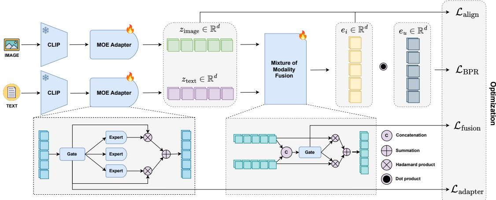
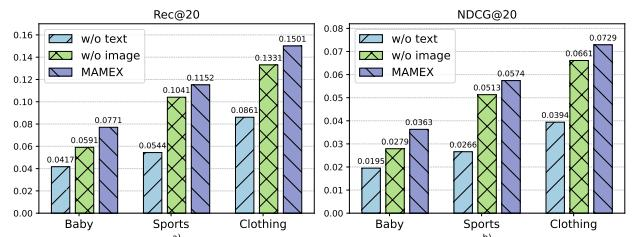
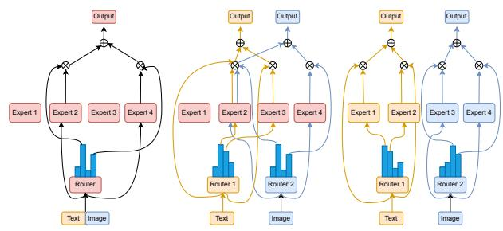

# Multi-modal Adaptive Mixture of Experts for Cold-start Recommendation

Van-Khang Nguyen VNU University of Engineering and Technology Hanoi, VietNam 21020768@vnu.edu.vn

Cam-Van Thi Nguyen VNU University of Engineering and Technology Hanoi, VietNam vanntc@vnu.edu.vn

Duc-Hoang Pham VNU University of Engineering and Technology Hanoi, VietNam 22021200@vnu.edu.vn

Hoang-Quynh Le VNU University of Engineering and Technology Hanoi, VietNam lhquynh@vnu.edu.vn

Huy-Son Nguyen Delft University of Technology Delft, The Netherlands H.S.Nguyen@tudelft.nl

Duc-Trong Le VNU University of Engineering and Technology Hanoi, VietNam trongld@vnu.edu.vn

## Abstract

Recommendation systems have faced significant challenges in cold start scenarios, where new items with a limited history of interaction need to be efectively recommended to users. Though multi modal data (e.g., images, text, audio, etc.) ofer rich information to address this issue, existing approaches often employ simplistic in tegration methods such as concatenation, average pooling, or fixed weighting schemes, which fail to capture the complex relationships between modalities. Our study proposes a novel Mixture of Ex perts (MoE) framework for multimodal cold-start recommendation, named MAMEX, which dynamically leverages latent representation from diferent modalities. MAMEX utilizes modality-specific expert networks and introduces a learnable gating mechanism that adap tively weights the contribution of each modality based on its con tent characteristics. This approach enables MAMEX to emphasize the most informative modalities for each item while maintaining robustness when certain modalities are less relevant or missing. Extensive experiments on benchmark datasets show that MAMEX outperforms state-of-the-art methods in cold-start scenarios, with superior accuracy and adaptability. For reproducibility, the code has been made available on Github.1.

## CCS Concepts

• Information systems → Recommender systems.

## Keywords

Cold-start recommendation, Dynamic gating, Mixture of experts.

## 1 Introduction

Recommendation systems have become indispensable in modern digital ecosystems, enabling personalized content delivery in ecommerce, streaming services, and social media [10, 12, 16]. However, these systems often face the cold-start problem [3, 5, 7, 21], particularly in item cold-start scenarios, where recommendations must be made for new items with little or no interaction data. In these cases, traditional collaborative filtering methods usually do not work well because they depend on user-item interaction history to make accurate suggestions [3, 5]. To address this issue, recent research [3, 6, 11, 22] has explored the integration of multimodal data, such as product images, textual descriptions, and audio features, which ofer complementary information that can enrich item representations and improve the precision of the recommendation, especially in item cold-start scenarios. For example, the image of a fashion product can convey a visual style, while its textual description provides semantic attributes such as material or brand. Using such diverse modalities, models can make more informed predictions even when behavioral data are sparse. Despite this potential, efectively fusing multimodal information remains a nontrivial task. Many existing methods [2, 11, 17, 26, 27] rely on straightforward fusion techniques, such as concatenation or averaging, which treat each modality equally and independently. These approaches often overlook the inherent diferences in modality characteristics and fail to capture complex cross-modal relationships efectively. Moreover, they lack adaptability in assigning importance to diferent modalities across varying items, which is crucial in heterogeneous data environments and even more so in item cold-start scenarios. These limitations motivate the need for a more adaptive and content-aware fusion strategy. In this work, we propose MAMEX (Multimodal Adaptive Mixture ofExperts), a novel recommendation framework that addresses the limitations of conventional multimodal fusion by leveraging the Mixture of Experts (MoE) paradigm. Our model introduces a multi-stage expert architecture that dynamically adapts to the content structure of each item, allowing it to selectively emphasize the most informative modalities.

## 2 Related Work

Cold-start recommendation is challenging due to the scarcity of user-item interaction [5, 23]. To mitigate this, multimodal methods incorporate heterogeneous data such as images and text [8, 12, 17, 26]. Yet, conventional fusion approaches, like simple concatenation [15, 26] or averaging [17], often fail to adequately capture the complex relationships among diferent modalities [2, 10]. Although attention mechanisms improve fusion, they struggle with variable quality or missing modalities, limiting efectiveness. The Mixture of Experts (MoE) framework, which adaptively combines specialized networks via a gating function [14], has shown promise in multitask learning [25] and sequential recommendation [4] but remains underexplored for multimodal cold-start recommendation [4, 5, 24].

Some methods apply MoE to handle each modality independently, demonstrating its potential in modeling sequential and modality specific signals. However, these works typically treat modalities in isolation and lack efective cross-modal interaction modeling. Thus, the integration of MoE to jointly fuse multiple modalities, especially under cold start conditions, remains underexplored.

Our work addresses this gap with a dual-level MoE framework combining modality-specific experts and cross-modal interaction via a dynamic gating mechanism. Furthermore, we introduce a bal ance regularization term to prevent modality collapse and enhance robustness in diverse cold-start scenarios.

## 3 Methodology

The MAMEX architecture, as shown in Fig. 1, consists of 2 key modules: a Modality Extraction Module that processes and aligns individual modality features; and a Modality Fusion Module that adaptively combines these features leveraging a gating mechanism.

## 3.1 Preliminaries

Let U, I denotes the sets of users and items, respectively. Each item $i \in \mathcal { I }$ has modality-specific raw features $\{ x _ { i } ^ { 1 } , x _ { i } ^ { 2 } , . . . , x _ { i } ^ { | \mathcal { M } | } \}$ each from a distinct modality. Within I, we identify a subset $\scriptstyle { \mathcal { T } } ^ { \prime } \subset$ I comprising newly added items with little or no user feedback. User-item interactions are represented by a sparse matrix X ∈ $\mathbb { R } ^ { | \mathcal { U } | \times | \mathcal { T } | }$ , where each entry $x _ { u , i }$ denotes the presence or intensity of interaction between user � and item �. The objective is to learn a multimodal recommendation function $g : \mathcal { U } \times \bar { J } ^ { \prime } \to$ R that estimates the relevance score between users and cold-start items:

$$
y _ {u, i ^ {\prime}} = g (u, i ^ {\prime}, \{x _ {i ^ {\prime}} ^ {1}, x _ {i ^ {\prime}} ^ {2}, \ldots , x _ {i ^ {\prime}} ^ {| \mathcal {M} |} \}, \mathcal {X})\tag{1}
$$

where $y _ { u , i ^ { \prime } }$ is the predicted relevance between � and $i ^ { \prime } \in \mathcal { I } ^ { \prime }$

## 3.2 Modality Extraction Module

We process each modality with specialized extractors and refine them via a MoE to align and enhance features.

3.2.1 Feature Extraction. Each modality � is extracted initial feature representations through modality-specific pre-trained models:

$$
h _ {m} = E _ {m} (x _ {m})\tag{2}
$$

where $E _ { m }$ represents the feature extractor for modality � (e.g., CLIP [19] for image and text, wav2vec [1] for audio), and $x _ { m }$ denotes the raw for that modality. After extraction, the input data $x _ { m }$ is transformed into a modality representation $h _ { m } \in \mathbb { R } ^ { d }$

3.2.2 Modality-Specific Adaptation. To better adapt the extracted features for recommendation, we introduce a modality-specific MoE layer with � expert networks and a gating mechanism that dynamically weights experts based on the input:

$$
z _ {m} = \sum_ {k \in \mathcal {T}} \left(\hat {g} _ {m} ^ {k} (h _ {m}) E _ {m} ^ {k} (h _ {m})\right)\tag{3}
$$

where $E _ { m } ^ { k } ( h _ { m } ) \in \mathbb { R } ^ { d }$ denotes the �-th expert network, imple mented as a linear transformation. The sparse gating weights $\hat { g } _ { m } ^ { k }$ select only the top-� experts with indices in T, where T represents the indices of experts with the highest gating value.

To mitigate the challenge of expert underutilization in MoE framework, we propose a load balancing loss that encourages more uniform data allocation across experts:

$$
\mathcal {L} _ {\mathrm{adapter}} = \sum_ {m \in \mathcal {M}} D _ {\mathrm{KL}} \left(\frac {1}{N} \sum_ {i = 1} ^ {N} g _ {m} ^ {k} (h _ {m} ^ {i}) \bigg \| \frac {1}{K} \mathbf {1}\right)\tag{4}
$$

where $D _ { \mathrm { K L } } ( P \parallel Q )$ is the Kullback-Leibler divergence, which quantifies the discrepancy between two probability distributions. The first term inside the divergence denotes the empirical average of the gating function outputs across a batch of input samples, efectively capturing the actual routing probability distribution over � experts. The target ${ \scriptstyle { \frac { 1 } { K } } } .$ 1 is a uniform distribution over experts, ensuring equal expert utilization.

## 3.3 Mixture of Modality Fusion

The second component of MAMEX combines the representations of aligned modality adaptively through a dynamic fusion mechanism.

3.3.1 Adaptive Fusion Mechanism. We form unified item representations by weighted-summing embeddings from all available modalities. For image and text, weights are computed via a sparse softmax gating function �(·) over their concatenation:

$$
\alpha = G \left(z _ {\text { image }} \parallel z _ {\text { text }}\right)\tag{5}
$$

Based on the modality features and their corresponding weights, the final representation of item is calculated as follow:

$$
e _ {i} = \sum_ {m \in \mathcal {M}} \alpha_ {m} \cdot z _ {m}\tag{6}
$$

where M denotes the set of modalities $( \mathrm { e . g . }$ , {image, text}), $z _ { m } \in \mathbb { R } ^ { d }$ are modality-specific embeddings, and $\alpha _ { m } \in \mathbb { R } ^ { m }$ are the corresponding sparse softmax gating weights.

3.3.2 Balanced Fusion Regularization. To mitigate modality collapse, characterized by the predominance of one modality over another, we introduce a balance regularization term:

$$
\mathcal {L} _ {\mathrm{fusion}} = D _ {\mathrm{KL}} \left( \right.\frac {1}{N} \sum_ {i = 1} ^ {N} \alpha^ {(i)} \left. \right\rVert \frac {1}{m} \mathbf {1}\left. \right),\tag{7}
$$

where $D _ { \mathrm { K L } }$ is the Kullback-Leibler divergence, $\boldsymbol { \alpha } ^ { ( i ) }$ represents the fusion weights for the �-th item, and $\textstyle { \frac { 1 } { m } } 1$ (with $m = 2$ for the two modalities) denotes a uniform distribution over modalities.

3.3.3 Modality Alignment Loss. To ensure that the final representation $i _ { \mathrm { f i n a l } }$ captures the semantic traits of each modality, we use a Mean Squared Error-based alignment loss is computed as:

$$
\mathcal {L} _ {\mathrm{align}} = \sum_ {m \in \mathcal {M}} | | e _ {i} - z _ {m} | | _ {2} ^ {2}\tag{8}
$$

This alignment loss is added to the overall training objective without altering the aggregation formula for modality embeddings.

## 3.4 Recommendation Training

For top-K recommendation, we employ the Bayesian Personalized Ranking loss [20]. Given a user embedding $e _ { u } \in \mathbb { R } ^ { d }$ and the final item embedding $e _ { i } \in \mathbb { R } ^ { d } ;$ , the prediction score is computed using dot product as follows:

  
Figure 1: The overview architecture of our proposed framework MAMEX.

$$
s _ {u, i} = e _ {u} ^ {T} e _ {i}\tag{9}
$$

The Bayesian Personalized Ranking [20] loss is subsequently adopted:

$$
\mathcal {L} _ {\mathrm{BPR}} = \sum_ {(u, i, j) \in \mathcal {D}} - \ln \sigma (s _ {u, i} - s _ {u, j})\tag{10}
$$

where $( u , i , j )$ is a training triplet with user �, positive item �, and negative item �, and � is the sigmoid function. The total loss is computed by aggregating the individual loss components:

$$
\mathcal {L} = \mathcal {L} _ {\mathrm{BPR}} + \lambda_ {1} \mathcal {L} _ {\mathrm{align}} + \lambda_ {2} \mathcal {L} _ {\mathrm{adapter}} + \lambda_ {3} \mathcal {L} _ {\mathrm{fusion}} + \lambda_ {4} | | \Theta | | _ {2} ^ {2}\tag{11}
$$

where $\lambda _ { 1 - 4 }$ are hyperparameters weighting the cross-modal align ment, adapter balance, fusion balance, and L2 regularization losses, respectively, and Θ represents all trainable parameters.

## 4 Results and Discussion

This section presents the experimental results of our approach, including the setup, baseline comparisons, and ablation studies.

## 4.1 Experimental Setup

4.1.1 Datasets. We evaluate our approach on three Amazon Reviews datasets: Baby, Clothing, and Sport [13]. All datasets include product images, textual descriptions, and user reviews. Data are split into 8 : 1 : 1 ratio for training, validation, and test sets and completely remove all interactions for items in the development and test sets to simulate realistic cold-start scenarios.

4.1.2 Evaluation Metrics. Inspired by previous works [3], we evaluate performance using Recall@K and NDCG@K for $K \in \{ 1 0 , 2 0 \}$

4.1.3 Hyperparameter Setup. Our MoE adapter is tuned over expert numbers $\{ 4 , 6 , 8 \}$ and top-� routing with $k \in \{ 2 , 3 , 4 \}$ , ensuring both model expressiveness and computational eficiency. We set the learning rate to 0.001, $\lambda \in \{ 1 , 0 . 1 , 0 . 0 1 \}$ to mitigate modality collapse, and Adam [9] for optimization.

4.1.4 Baseline Methods. We evaluate our approach against several state-of-the-art methods for cold-start recommendation, such as: MTPR [7], AlignRec [11], CLCRec [22], GAR [6], MILK [3], DropoutNet [21], MetaEmbed [18].

## 4.2 Overall Performance

Table 1 compares MAMEX with state-of-the-art baselines on three Amazon datasets [13], showing consistent superiority across all metrics. Notably, MAMEX achieves outstanding performance in Recall@10 and NDCG@10: 10.11% and 7.75% on Amazon Baby; 5.75% and 6.13% on Amazon Clothing; 16.17% and 20.51% on Amazon Sport, respectively. These results highlight the efectiveness of our dual-level MoE architecture in capturing modality-specific information while dynamically integrating multimodal signals. The gains over all baselines confirm that balance regularization and dynamic gating help prevent modality collapse and improve representation quality, especially in cold-start scenarios.

## 4.3 Ablation Studies

4.3.1 Impact ofDiferent Components. To validate the efectiveness of each component in our framework, we conducted ablation studies by selectively removing key components 2, such as: w/o MoE: Replace the modality-specific MoE layers with standard neural networks; w/o Alignment: Remove the modality alignment loss; w/o MMF: Replace the adaptive fusion mechanism with simple averaging.

As shown in Table 2, the results clearly indicate that the removal of any key component leads to performance degradation. In particular, omitting the MoE layers or the adaptive fusion mechanism results in significant drops in NDCG@10 (approximately 5.4% and 4.8% respectively). Notably, excluding the cross-modal alignment loss leads to the largest performance decline, emphasizing its critical role in bridging the gap between diferent modalities. These findings confirm that each component contributes complementarily to the overall efectiveness of our model.

Table 1: Overall performance on Amazon benchmark datasets from across diverse domains such as Baby, Clothing, and Sport. The ‘bold’ numbers present the most outstanding results, while the ‘underline’ figures depict the second best performances.

<table><tr><td rowspan="2">Method</td><td colspan="4">Amazon Baby</td><td colspan="4">Amazon Clothing</td><td colspan="4">Amazon Sport</td></tr><tr><td>Rec@10</td><td>Rec@20</td><td>NDCG@10</td><td>NDCG@20</td><td>Rec@10</td><td>Rec@20</td><td>NDCG@10</td><td>NDCG@20</td><td>Rec@10</td><td>Rec@20</td><td>NDCG@10</td><td>NDCG@20</td></tr><tr><td>MTPR</td><td>0.0130</td><td>0.0246</td><td>0.0066</td><td>0.0097</td><td>0.0215</td><td>0.0377</td><td>0.0110</td><td>0.0153</td><td>0.0146</td><td>0.0241</td><td>0.0076</td><td>0.0102</td></tr><tr><td>AlignRec</td><td>0.0224</td><td>0.0440</td><td>0.0107</td><td>0.0166</td><td>0.0425</td><td>0.0658</td><td>0.0234</td><td>0.0298</td><td>0.0274</td><td>0.0465</td><td>0.0153</td><td>0.0205</td></tr><tr><td>MetaEmbed</td><td>0.0264</td><td>0.0459</td><td>0.0132</td><td>0.0187</td><td>0.0352</td><td>0.0602</td><td>0.0188</td><td>0.0256</td><td>0.0349</td><td>0.0629</td><td>0.0173</td><td>0.0250</td></tr><tr><td>DropoutNet</td><td>0.0174</td><td>0.0315</td><td>0.0083</td><td>0.0122</td><td>0.0152</td><td>0.0277</td><td>0.0091</td><td>0.0125</td><td>0.0171</td><td>0.0301</td><td>0.0089</td><td>0.0125</td></tr><tr><td>CLCRec</td><td>0.0263</td><td>0.0437</td><td>0.0136</td><td>0.0180</td><td>0.0348</td><td>0.0481</td><td>0.0181</td><td>0.0221</td><td>0.0271</td><td>0.0421</td><td>0.0139</td><td>0.0177</td></tr><tr><td>GAR</td><td>0.0119</td><td>0.0238</td><td>0.0057</td><td>0.0090</td><td>0.0368</td><td>0.0629</td><td>0.0206</td><td>0.0276</td><td>0.0360</td><td>0.0641</td><td>0.0201</td><td>0.0278</td></tr><tr><td>MILK</td><td>0.0465</td><td>0.0730</td><td>0.0271</td><td>0.0344</td><td>0.0991</td><td>0.1436</td><td>0.0571</td><td>0.0691</td><td>0.0668</td><td>0.0998</td><td>0.0390</td><td>0.0483</td></tr><tr><td>MAMEX</td><td>0.0512</td><td>0.0771</td><td>0.0292</td><td>0.0363</td><td>0.1048</td><td>0.1501</td><td>0.0606</td><td>0.0729</td><td>0.0776</td><td>0.1152</td><td>0.0470</td><td>0.0574</td></tr><tr><td>% Improv.</td><td>10.11</td><td>5.62</td><td>7.75</td><td>5.52</td><td>5.75</td><td>4.53</td><td>6.13</td><td>5.50</td><td>16.17</td><td>15.43</td><td>20.51</td><td>18.84</td></tr></table>

Table 2: Ablation Study Results on Amazon Baby Dataset.

<table><tr><td>Datasets</td><td colspan="2">Baby</td><td colspan="2">Clothing</td><td colspan="2">Sports</td></tr><tr><td>Metrics</td><td>Rec@20</td><td>NDCG@20</td><td>Rec@20</td><td>NDCG@20</td><td>Rec@20</td><td>NDCG@20</td></tr><tr><td>w/o MoE</td><td>0.0746</td><td>0.0339</td><td>0.1388</td><td>0.0647</td><td>0.0983</td><td>0.0462</td></tr><tr><td>w/o Align</td><td>0.0571</td><td>0.0260</td><td>0.1152</td><td>0.0545</td><td>0.0832</td><td>0.0399</td></tr><tr><td>w/o MMF</td><td>0.0752</td><td>0.0353</td><td>0.1429</td><td>0.0679</td><td>0.1084</td><td>0.0528</td></tr><tr><td>MAMEX</td><td>0.0771</td><td>0.0363</td><td>0.1501</td><td>0.0729</td><td>0.1152</td><td>0.0574</td></tr></table>

  
Figure 2: The impact of diferent modalities on three datasets.

4.3.2 Impact of single modality vs. multi-modalities. Figure 2 shows that the textual modality performs better than the visual modal ity, probably due to its richer semantics and more specific details, while images struggle with abstract attributes such as style or com fort. Furthermore, multimodal information surpasses any single modality. This finding underscores that the fusion approach successfully integrates multiple modalities, thus improving the overall performance of the MAMEX model.

4.3.3 MoE Adapter Design Analysis. To further investigate fusion strategies, we evaluate three Mixture of Experts approaches: (a) Joint Router: concatenates all input modalities and employs a sin gle router with shared experts; (b) Modality-Specific Router: uses separate routers for each modality while maintaining a common set of experts; and (c) MAMEX: assigns both dedicated routers and experts to each modality, thus facilitating maximum specializa tion, as illustrated in Figure 3. MAMEX consistently outperforms both modality-specific router and joint router baselines in all eval uation metrics and datasets. On the Clothing dataset, it achieves relative gains of 0.94% in Recall@20 and 1.72% in NDCG@20 over the strongest baseline. Similarly, on the Sports dataset, it yields im provements of 3.61% in Recall@20 and 5.60% in NDCG@20. These consistent gains highlight the efectiveness of MAMEX’s structure, which combines modality-sensitive input with expert selection and specialized routing. This design enables more precise modeling of modality-specific features, surpassing the performance of conventional and partially specialized methods.

  
Figure 3: Three MoE adapter designs evaluated in our study.

Table 3: Comparison of MoE Variants on Amazon Datasets.

<table><tr><td>Datasets</td><td colspan="2">Clothing</td><td colspan="2">Sports</td></tr><tr><td>Metrics</td><td>Rec@20</td><td>NDCG@20</td><td>Rec@20</td><td>NDCG@20</td></tr><tr><td>Joint Router</td><td>0.0847</td><td>0.2206</td><td>0.0664</td><td>0.1714</td></tr><tr><td>Mod-Specific</td><td>0.0847</td><td>0.2207</td><td>0.0640</td><td>0.1714</td></tr><tr><td>MAMEX</td><td>0.0855</td><td>0.2245</td><td>0.0688</td><td>0.1810</td></tr></table>

## 5 Conclusion

This paper presents MAMEX, a dual-level Mixture of Experts framework for cold-start recommendation. By integrating modalityspecific MoE layers with a learnable gating fusion, MAMEX captures modality-specific representations while dynamically balancing their contributions. Experiments on three Amazon datasets show consistent improvements in Recall and NDCG compared to state-of-the-art baselines, highlighting the efectiveness of the proposed architecture and regularization strategies. The core concept of MAMEX can also inspire research in multi-objective recommendation and interpretability. Future work should aim at addressing missing modalities, improving cross-modal generation, adding temporal MoE layers, and optimizing expert routing to enhance scalability and adaptability to evolving user preferences.

## References

[1] Alexei Baevski, Yuhao Zhou, Abdelrahman Mohamed, and Michael Auli. 2020. wav2vec 2.0: A framework for self-supervised learning of speech representations. Advances in neural information processing systems 33 (2020), 12449–12460.

[2] Haoyue Bai, Min Hou, Le Wu, Yonghui Yang, Kun Zhang, Richang Hong, and Meng Wang. 2023. Gorec: a generative cold-start recommendation framework. In Proceedings ofthe 31st ACM international conference on multimedia. 1004–1012.

[3] Haoyue Bai, Le Wu, Min Hou, Miaomiao Cai, Zhuangzhuang He, Yuyang Zhou, Richang Hong, and Meng Wang. 2024. Multimodality invariant learning for multimedia-based new item recommendation. In Proceedings ofthe 47th International ACM SIGIR Conference on Research and Development in Information Retrieval. 677–686.

[4] Shuqing Bian, Xingyu Pan, Wayne Xin Zhao, Jinpeng Wang, Chuyuan Wang, and Ji-Rong Wen. 2023. Multi-modal mixture of experts represetation learning for sequential recommendation. In Proceedings ofthe 32nd ACM international conference on information and knowledge management. 110–119.

[5] Tuan-Nghia Bui, Huy-Son Nguyen, Cam-Van Thi Nguyen, Hoang-Quynh Le, and Duc-Trong Le. 2025. Personalized Difusion Model Reshapes Cold-Start Bundle Recommendation. In Companion Proceedings ofthe ACM on Web Conference 2025. 3088–3091.

[6] Hao Chen, Zefan Wang, Feiran Huang, Xiao Huang, Yue Xu, Yishi Lin, Peng He, and Zhoujun Li. 2022. Generative adversarial framework for cold-start item recommendation. In Proceedings of the 45th International ACM SIGIR Conference on Research and Development in Information Retrieval. 2565–2571.

[7] Xiaoyu Du, Xiang Wang, Xiangnan He, Zechao Li, Jinhui Tang, and Tat-Seng Chua. 2020. How to learn item representation for cold-start multimedia recom mendation?. In Proceedings ofthe 28th ACM International Conference on Multimedia. 3469–3477.

[8] Christian Ganhör, Marta Moscati, Anna Hausberger, Shah Nawaz, and Markus Schedl. 2024. A Multimodal Single-Branch Embedding Network for Recommen dation in Cold-Start and Missing Modality Scenarios. In Proceedings ofthe 18th ACM Conference on Recommender Systems. 380–390.

[9] Diederik P Kingma and Jimmy Ba. 2014. Adam: A method for stochastic opti mization. arXiv preprint arXiv:1412.6980 (2014).

[10] Qidong Liu, Jiaxi Hu, Yutian Xiao, Xiangyu Zhao, Jingtong Gao, Wanyu Wang, Qing Li, and Jiliang Tang. 2024. Multimodal recommender systems: A survey. Comput. Surveys 57, 2 (2024), 1–17.

[11] Yifan Liu, Kangning Zhang, Xiangyuan Ren, Yanhua Huang, Jiarui Jin, Yingjie Qin, Ruilong Su, Ruiwen Xu, Yong Yu, and Weinan Zhang. 2024. AlignRec: Aligning and Training in Multimodal Recommendations. In Proceedings ofthe 33rd ACM International Conference on Information and Knowledge Management. 1503–1512.

[12] Daniele Malitesta, Giandomenico Cornacchia, Claudio Pomo, Felice Antonio Merra, Tommaso Di Noia, and Eugenio Di Sciascio. 2025. Formalizing multime dia recommendation through multimodal deep learning. ACM Transactions on Recommender Systems 3, 3 (2025), 1–33.

[13] Julian McAuley, Christopher Targett, Qinfeng Shi, and Anton Van Den Hengel. 2015. Image-based recommendations on styles and substitutes. In Proceedings ofthe 38th international ACM SIGIR conference on research and development in information retrieval. 43–52.

[14] Siyuan Mu and Sen Lin. 2025. A comprehensive survey of mixture-of-experts: Algorithms, theory, and applications. arXiv preprint arXiv:2503.07137 (2025).

[15] Huy-Son Nguyen, Tuan-Nghia Bui, Long-Hai Nguyen, Duy-Cat Can, Cam-Van Thi Nguyen, Duc-Trong Le, and Hoang-Quynh Le. 2023. HHMC: a heterogeneous x homogeneous graph-based network for multimodal cross-selling recommendation. In 2023 15th International Conference on Knowledge and Systems Engineering (KSE). IEEE, 1–6.

[16] Huy-Son Nguyen, Tuan-Nghia Bui, Long-Hai Nguyen, Hung Hoang, Cam-Van Thi Nguyen, Hoang-Quynh Le, and Duc-Trong Le. 2024. Bundle Recommendation with Item-Level Causation-Enhanced Multi-view Learning. In Joint European Conference on Machine Learning and Knowledge Discovery in Databases. Springer, 324–341.

[17] Huy-Son Nguyen, Quang-Huy Nguyen, Duc-Hoang Pham, Duc-Trong Le, Hoang Quynh Le, Padipat Sitkrongwong, Atsuhiro Takasu, and Masoud Mansoury. 2025. RaMen: Multi-Strategy Multi-Modal Learning for Bundle Construction. arXiv preprint arXiv:2507.14361 (2025).

[18] Feiyang Pan, Shuokai Li, Xiang Ao, Pingzhong Tang, and Qing He. 2019. Warm up cold-start advertisements: Improving ctr predictions via learning to learn id embeddings. In Proceedings ofthe 42nd International ACM SIGIR Conference on Research and Development in Information Retrieval. 695–704.

[19] Alec Radford, Jong Wook Kim, Chris Hallacy, Aditya Ramesh, Gabriel Goh, Sandhini Agarwal, Girish Sastry, Amanda Askell, Pamela Mishkin, Jack Clark, et al. 2021. Learning transferable visual models from natural language supervision. In International conference on machine learning. PmLR, 8748–8763.

[20] Stefen Rendle, Christoph Freudenthaler, Zeno Gantner, and Lars Schmidt-Thieme. 2012. BPR: Bayesian personalized ranking from implicit feedback. arXiv preprint arXiv:1205.2618 (2012).

[21] Maksims Volkovs, Guangwei Yu, and Tomi Poutanen. 2017. Dropoutnet: Addressing cold start in recommender systems. Advances in neural information processing systems 30 (2017).

[22] Yinwei Wei, Xiang Wang, Qi Li, Liqiang Nie, Yan Li, Xuanping Li, and Tat-Seng Chua. 2021. Contrastive learning for cold-start recommendation. In Proceedings ofthe 29th ACM International Conference on Multimedia. 5382–5390.

[23] Xiaolong Xu, Hongsheng Dong, Lianyong Qi, Xuyun Zhang, Haolong Xiang, Xiaoyu Xia, Yanwei Xu, and Wanchun Dou. 2024. Cmclrec: Cross-modal contrastive learning for user cold-start sequential recommendation. In Proceedings ofthe 47th International ACM SIGIR Conference on Research and Development in Information Retrieval. 1589–1598.

[24] Shengzhe Zhang, Liyi Chen, Dazhong Shen, Chao Wang, and Hui Xiong. 2025. Hierarchical Time-Aware Mixture of Experts for Multi-Modal Sequential Recom mendation. In Proceedings ofthe ACM on Web Conference 2025. 3672–3682.

[25] Zijian Zhang, Shuchang Liu, Jiaao Yu, Qingpeng Cai, Xiangyu Zhao, Chunxu Zhang, Ziru Liu, Qidong Liu, Hongwei Zhao, Lantao Hu, et al. 2024. M3oe: Multi-domain multi-task mixture-of experts recommendation framework. In Proceedings of the 47th International ACM SIGIR Conference on Research and Development in Information Retrieval. 893–902.

[26] Hongyu Zhou, Xin Zhou, Lingzi Zhang, and Zhiqi Shen. 2023. Enhancing dyadic relations with homogeneous graphs for multimodal recommendation. In ECAI 2023. IOS Press, 3123–3130.

[27] Zhihui Zhou, Lilin Zhang, and Ning Yang. 2023. Contrastive collaborative filtering for cold-start item recommendation. In Proceedings ofthe ACM Web Conference 2023. 928–937.