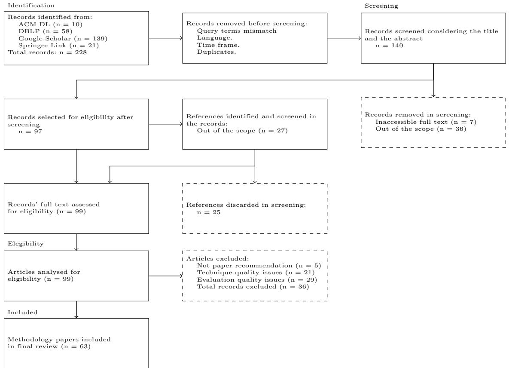
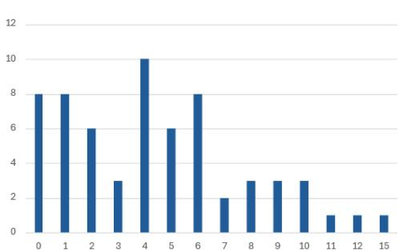
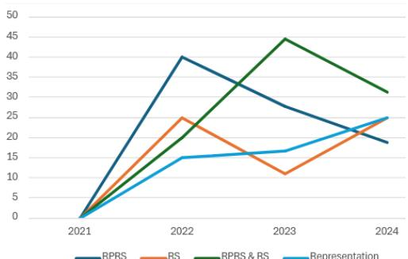
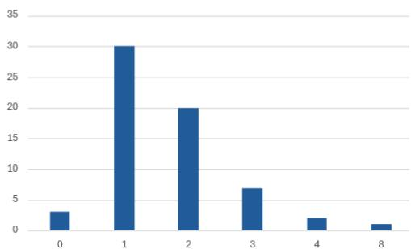

# Recent Advances and Trends in Research Paper Recommender Systems: A Comprehensive Survey

Iratxe Pinedo1, Mikel Larra˜naga1, Ana Arruarte1\*

1Languages and Information Systems, University of the Basque Country UPV/EHU, Manuel Lardizabal Ibilbidea, 1, Donostia, 20018, Basque Country, Spain.

\*Corresponding author(s). E-mail(s): a.arruarte@ehu.eus; Contributing authors: iratxe.pinedo@ehu.eus; mikel.larranaga@ehu.eus;

## Abstract

As the volume of scientific publications grows exponentially, researchers increasingly face dificulties in locating relevant literature. Research Paper Recommender Systems have become vital tools to mitigate this information overload by delivering personalized suggestions. This survey provides a comprehensive analysis of Research Paper Recommender Systems developed between November 2021 and December 2024, building upon prior reviews in the field. It presents an extensive overview of the techniques and approaches employed, the datasets utilized, the evaluation metrics and procedures applied, and the status of both enduring and emerging challenges observed during the research. Unlike prior surveys, this survey goes beyond merely cataloguing techniques and models, providing a thorough examination of how these methods are implemented across diferent stages of the recommendation process. By furnishing a detailed and structured reference, this work aims to function as a consultative resource for the research community, supporting informed decision-making and guiding future investigations in the advances of efective Research Paper Recommender Systems.

Keywords: Research Paper Recommender Systems, Academic Information Retrieval, Literature Review, ResearchTrends

## 1 Introduction

Global scientific publications are projected to continue growing significantly in the coming years. The overall market for scientific publishing is expected to grow at a Compound Annual Growth Rate (CAGR) of 3.3% from 2024 to 2030 [39]. For example, computer science publications are projected to reach 580,000 annually by 2025, reflecting a surge driven by advances in fields such as artificial intelligence and quantum computing [22]. In the case of the medical sector, it is expected to see a 5-7% annual increase in publications through 2025, driven b Artificial Intelligence (AI) and biotechnology. Meanwhile, the percentage of publications available through open access is forecasted to reach 45% by 2025, up from 38% in 2023 [4]. These trends reflect a broader, robust expansion in scientific research output across disciplines, particularly in computer science, fueled by technological advances and growing research investments.

While this expansion makes research more accessible, it also presents challenges such as information overload. Furthermore, this overwhelming growth makes it increasingly dificult for researchers and scholars to find relevant papers aligned with their specific interests. However, tools such as Research-Paper Recommender Systems (RP-RSs) help address these issues by ofering tailored research suggestions, facilitating the discovery of high-quality works, and allowing researchers to stay focused and up-to-date.

RP-RSs have evolved by adapting to new technologies, and although some of the underlying ideas and procedures remain, current systems are quite diferent from the first systems developed in the early 1990s. Deep Learning (DL)[27, 48, 60, 62, 69], and Large Languages Models (LLMs)[3, 12, 44, 47, 56] are more and more present in new proposals. In addition, Scientific Social Networks (SSNs)[16, 58, 59] also ofer new opportunities that are undoubtedly being exploited. Despite the successful incorporation of all these advances, there is still significant room for improvement in both the evaluation approaches and the adoption of these systems in real world scenarios [49].

In this survey, an in-depth analysis of the current state of research on RP-RSs is provided, using as a starting point one of the most recent, complete and comprehensive surveys on the subject [30]. Since the work by [30] encompasses data up to October 2021, this new review extends the analysis to cover the period from November 2021 to December 2024, maintaining consistency by employing the same bibliographic review methodology. The main goal of this work is to answer the following research question:

• RQ1: How do the RP-RSs generate the recommendations?

• RQ2: What datasets are used to train and evaluate the RP-RSs?

• RQ3: How are the RP-RSs evaluated?

• RQ4: What are the main challenges addressed by the RP-RSs?

• RQ5: What new challenges have arisen?

The survey is structured as follows. Section 2 introduces the methodology and approach followed in designing the survey, including the data collection techniques and the overall research framework. Section 3 provides an indepth analysis of the works found in the literature review. Section 4 presents a discussion on challenges identified in previous surveys, examines their current status, and highlights new challenges emerging from the present survey. Finally, Section 5 concludes the survey, summarizing the key findings and ofering an overall conclusion, including suggestions for future research.

## 2 Methodology

The main goal of this work is to provide insight into the field of RP-RSs, analyzing the trends of the last few years and comparing its evolution with previous systematic literature reviews. To this end, this work aims to answer the following research questions:

• RQ1: How do the RP-RSs generate the recommendations?

The aim of this research question is to classify the works presented and to gain an understanding of how the systems generate the recommendations. In the literature, RP-RSs have traditionally been classified according to the taxonomy proposed by [9], even in literature reviews such as [6]. However, as stated by [30], this taxonomy has limitations to categorize RP-RSs that have been developed considering newer approaches and techniques. Therefore, this work classifies the RP-RSs considering the technology used and the purpose of the technique. To this end, RQ1 has been divided into the following questions:

◦ RQ1.1: What type of input do the RP-RSs use to generate the recommendations?

◦ RQ1.2: What kinds of information do the RP-RSs use to generate the recommendations?

◦ RQ1.3: How do the RP-RSs represent the papers?

◦ RQ1.4: How do the RP-RSs represent the users?

◦ RQ1.5: How do the RP-RSs generate the recommendations?

• RQ2: What datasets are used to train and evaluate RP-RSs?

Understanding which datasets are used to train and evaluate RP-RSs is fundamental for the advance of research in the field. This includes examining the origins, characteristics, modifications and availability of these datasets to assess their suitability and impact on reproducibility and real-world applicability.

• RQ3: How are the RP-RSs evaluated?

The main goal of this research question is to let the readers know how the RP-RSs are evaluated. To this end, the procedure followed, including the baselines and the metrics the authors used in the evaluation of their proposals, are analyzed. This question is, therefore, divided into the following questions:

◦ RQ3.1: What are the relevance criteria used to evaluate the recommendations?

◦ RQ3.2: What metrics are used in the evaluation process?

◦ RQ3.3: How are the evaluations conducted?

• RQ4: What are the main challenges addressed by the RP-RSs?

Many of the works aim to solve, or at least mitigate, challenges such as scalability or cold start. In this question, the challenges addressed, if any, are analyzed.

• RQ5: What new challenges have arisen?

The adoption of new technology opens new opportunities but may also lead to new challenges. This question aims at identifying those new challenges

To answer these questions and to compare the current state of the research with previous surveys, the methodology implemented in [30], has been followed. The literature search has been conducted using the same digita libraries: ACM DL1, DBLP2, Google Scholar 3, and Springer 4. The search query requested papers that contain the terms paper, article or publication in the title along with some form of recommendation, as in [30], and were published between 2021 and 2024. As the period considered in this work spans from November 2021 to December 2024, all the works published beyond that period were discarded.

Initially, 228 records were identified from ACM DL, DBLP, Google Scholar, and Springer Link. Records that did not meet the query terms, language, time frame requirements, or were duplicates were first removed. Then, a screening process considering the title and abstract was carried out, resulting in 140 papers. After this screening, papers whose full text was inaccessible or those which did not align with the scope of this work were discarded, leaving 97 articles to be analyzed for eligibility assessment. Additionally, references cited by these 97 papers and meeting the criteria were screened, resulting in 2 additional papers included for further analysis. This led to a total of 99 full-text articles assessed for eligibility.

Subsequently, papers that did not provide suficient information to describe their approach, i.e., to answer RQ1, or did not explain how their system was evaluated, i.e., to answer RQ3, were excluded from the review Consequently, 36 articles were discarded during the final analysis step, resulting in a total of 63 papers analyzed.

Figure 1 graphically shows the bibliographic review process carried out.

  
Fig. 1 Literature review process

## 3 Results

In this section, the works found in the literature are categorized considering three key aspects: approach, which discusses the main methodologies and techniques used; datasets, which covers the diferent datasets employed and their characteristics; and evaluation, which examines the evaluation methods, metrics, and baselines used to assess the efectiveness of the approaches. In addition, the current status of the challenges highlighted in previous surveys has been analyzed. Finally, the new challenges that have emerged due to the adoption of newer technologies have been identified.

1https://dl.acm.org/ 2https://dblp.uni-trier.de/ 3https://scholar.google.com/ 4https://link.springer.com/

## 3.1 How do the RP-RSs generate the recommendations?

In order to answer RQ1, diferent aspects were considered and, therefore, the research question was formulated into five questions. The results for each questions are presented in the corresponding subsection. Section 3.1.1 discusses and analyzes the diferent input types used in RP-RSs. Section 3.1.2 explores the information employed in the process to generate the recommendations. Section 3.1.3 reviews how content (titles, abstracts, keywords, etc.) and/or structural relations (interactions, citations, co-authorships, etc.) are processed to generate the representation of the papers. Section 3.1.4 addresses user representations, examining how user profiles and preferences are modelled. Finally, Section 3.1.5 looks at the recommendation generation processes, detailing how recommendations are generated and optimized based on the aforementioned components.

## 3.1.1 What type of input do the RP-RSs use to generate the recommendations?

Three primary kinds of inputs, namely paper, user and text, were identified in the literature analysis performed. The works which use papers as inputs were labeled as paper. Regarding the works that employ user information as input, in the analysis carried out it was observed that a remarkable percentage of them actually use paper authors as users. Therefore, in this analysis the works that use authors as inputs are classified into the user(a) category while the remaining works that use users as inputs are classified as user. Works which use any kind of text input were categorized as text. Some works also combine diferent kinds of inputs. Table 1 summarizes the classification of the works according to the type of inputs used.

30.16% of the works use a Paper of Interest (POI) as the input for the recommendation process. The goal of the RP-RSs that use this type of input is to generate recommendations based on the content of the POI, using its content and other relevant features to identify similar or related relevant papers.

RP-RSs which provide personalized recommendations must be aware of the interests of the users to provide them with appropriate recommendations. 53.97% of the systems analyzed use this kind of input. 28.57% of them classified as user and 25.4% as user(a).

The third major kind of input is textual content (text), where a text that represents the interests of the users is used as input for the recommendation process. This approach has been followed by three works (4.76%). [54] uses paper abstracts as input. [48] takes a search query string as input. Finally, [7] uses diferent sections of the paper.

To a much lesser extent, combinations of the aforementioned types have also been found; [58] uses information of the research groups (group) in order to predict SSN group-paper ratings. [13] uses both the information of the paper and the user (user&paper ) to predict the likelihood that user u will cite paper p. [70] uses the information of authors and papers (user(a)&paper ) to recommend papers by predicting the occurrence of co-authorship given a co-author ternary (a , p , a ). Some works use author information and text (user(a)&text) to construct a query vector [21] or to search domain literature that reflects the characteristics and hot information of the domain [11]. [68] allows the users to specify their interests by introducing the authors, keywords, venues, organizations or funds (author|keyword|venue|organization|fund). Finally, [49] relies on user information along with text or papers and the publication year to represent the interests of the users (user&(text|papers)&publication year ).

Table 1: Classification according to the input type

<table><tr><td>Personalization</td><td>Input type</td><td>Works</td><td>pct</td></tr><tr><td></td><td>paper</td><td>[3, 8, 14, 17, 18, 26, 31, 32, 34, 35, 38, 44, 45, 46, 50, 55, 56, 57, 72]</td><td>30.16%</td></tr><tr><td>√</td><td>user</td><td>[1, 2, 10, 19, 20, 23, 24, 27, 28, 36, 42, 52, 53, 59, 65, 66, 67, 73]</td><td>28.57%</td></tr><tr><td>√</td><td>user(a)</td><td>[12, 15, 16, 25, 33, 37, 41, 43, 47, 60, 61, 62, 63, 64, 69, 71]</td><td>25.4%</td></tr><tr><td></td><td>text</td><td>[7, 48, 54]</td><td>4.76%</td></tr><tr><td>√</td><td>user(a)&amp;text</td><td>[11, 21]</td><td>3.17%</td></tr><tr><td>√</td><td>user&amp;paper</td><td>[13]</td><td>1.59%</td></tr><tr><td>√</td><td>user(a)&amp;paper</td><td>[70]</td><td>1.59%</td></tr><tr><td>√</td><td>group</td><td>[58]</td><td>1.59%</td></tr><tr><td>√</td><td>user&amp;(text|papers)&amp;publication year</td><td>[49]</td><td>1.59%</td></tr><tr><td></td><td>author|keyword|venue|organization|fund</td><td>[68]</td><td>1.59%</td></tr></table>

## 3.1.2 What kinds of information do the RP-RSs use to generate the recommendations?

RP-RSs can be classified into two main categories according to the information they use to recommend research papers, in addition to user information: RP-RSs that use the information explicitly contained in the article (25%), and RP-RSs that, in addition to the information explicitly included in the paper, use additional relational data (75%).

Only the information available in the dataset or data sources used by the analyzed works is presented in this analysis. Any information extracted by the approach, which is considered part of the representation or recommendation process, is analyzed in the corresponding section.

Table 2 summarizes the papers that rely on the content explicitly included in the paper, along with information about the users, in the case of personalized recommendations [10], indicating the type of information used: title (Tit.), abstract (Abs.), keyword (Key), text (Txt.), author (Aut.), user (Us.), venue (Ven.), others (Oth.). The text category correspond to any textual content in the paper other than the title, abstract, authors and keywords.

Most of the works make use of the textual information contained in the papers. 68.75% of the papers use the title, 68.75% the abstract, and 18.75% use the keywords. 31.25% of the works use other kinds or unspecified type of text inputs. [8, 11] do not specify the kind of text used, while [41, 45] use the full text of the paper and [7] experiments with diferent parts of the text to examine the impact of text length (short, medium, and long texts are represented by abstract, abstract–introduction combination, and full text, respectively).

Author information is also widely used (37.5%). In particular, [11, 41, 64] use authors as input (user(a)) for the recommendation process. [38, 56] use the information of the authors to generate the representations of the papers. [68] uses authors as nodes in a graph-based approach. The use of venues (12.5%) is residual.

Table 2: Kinds of information used in RP-RSs that rely on the content explicitly included in the paper

<table><tr><td>Tit.</td><td>Abs.</td><td>Key.</td><td>Txt.</td><td>Aut.</td><td>Us.</td><td>Ven.</td><td>Oth.</td><td>Works</td></tr><tr><td>√</td><td>√</td><td></td><td></td><td></td><td></td><td></td><td></td><td>[17, 31, 44]</td></tr><tr><td>√</td><td>√</td><td></td><td></td><td></td><td></td><td></td><td>√</td><td>[55, 58]</td></tr><tr><td></td><td></td><td></td><td>√</td><td></td><td></td><td></td><td></td><td>[8, 45]</td></tr><tr><td></td><td></td><td></td><td>√</td><td>√</td><td></td><td></td><td></td><td>[11, 41]</td></tr><tr><td>√</td><td>√</td><td></td><td>√</td><td></td><td></td><td></td><td></td><td>[7]</td></tr><tr><td>√</td><td>√</td><td>√</td><td></td><td>√</td><td></td><td></td><td></td><td>[38]</td></tr><tr><td>√</td><td>√</td><td>√</td><td></td><td></td><td>√</td><td></td><td></td><td>[10]</td></tr><tr><td>√</td><td>√</td><td></td><td></td><td>√</td><td></td><td></td><td>√</td><td>[56]</td></tr><tr><td>√</td><td>√</td><td></td><td></td><td>√</td><td></td><td>√</td><td></td><td>[64]</td></tr><tr><td>√</td><td></td><td>√</td><td></td><td>√</td><td></td><td>√</td><td>√</td><td>[68]</td></tr><tr><td></td><td>√</td><td></td><td></td><td></td><td></td><td></td><td></td><td>[54]</td></tr></table>

68.75% 68.75% 18.75% 31.25% 37.5% 6.25% 12.5% 25%

Table 3 describes the RP-RSs which, besides the content of the paper, consider relational data to achieve their goal. Therefore, in addition to the information explicitly contained in the article, the use of relational data, such as interactions (Int.), citations (Cit.) and co-authors (Co-Aut.) is also analyzed. These relational data are used to improve the representation of papers and users, and therefore, generate better recommendations. For example, [25, 35, 37, 59] use the collaboration network of the authors to this end. [50] uses a hybrid similarity metric that combines text similarity and citation similarity to determine how close are the candidate paper and the POI. To achieve this goal, the citation network is used to calculate the similarity between the candidate papers and POI according to the articles that each of them refers to.

As in Table 2, most of the works that also use relational information, and since they rely on a solution that is totally or partially content-based, make extensive use of fields with more substantial text content, such as the title (78.72%) or the abstract (72.34%). Regarding the rest of the content-based data, it is worth highlighting the greater use of venues (25%) and others (48.93%), largely due to the growing reliance on graph-based solutions, in which these types of data are significantly utilized.

The most commonly used relational data are citations (78.72%), probably because the information is easily accessible. 38.29% of the works rely on user information and 34.04% use interactions to generate the recommendations. In fact, most works ofering personalized solutions based on users rely on interactions [1, 42, 65, 66, 67], such as browsing history or tagging, to extract user interests. In contrast, when the users are the authors themselves, citations serve as the primary source for extracting these interests [12, 15, 21, 60, 61, 71]. The co-author data is the least used of the three relational types (23.40%), and in most cases it is used together with citations [16, 26, 37, 57, 62, 63].

Table 3: Kinds of information used in RP-RSs that rely on relational information

<table><tr><td>Tit.</td><td>Abs.</td><td>Key.</td><td>Aut.</td><td>Us.</td><td>Ven.</td><td>Oth.</td><td>Int.</td><td>Cit.</td><td>Co-Aut.</td><td>Works</td></tr><tr><td>√</td><td>√</td><td></td><td></td><td>√</td><td></td><td></td><td>√</td><td></td><td></td><td>[2, 27, 52]</td></tr><tr><td>√</td><td>√</td><td></td><td></td><td></td><td></td><td></td><td></td><td>√</td><td></td><td>[14, 18, 50]</td></tr><tr><td>√</td><td>√</td><td></td><td></td><td></td><td></td><td>√</td><td></td><td>√</td><td></td><td>[34, 46, 49]</td></tr><tr><td>√</td><td>√</td><td></td><td></td><td>√</td><td></td><td>√</td><td>√</td><td>√</td><td></td><td>[66, 67]</td></tr><tr><td>√</td><td>√</td><td>√</td><td></td><td>√</td><td></td><td></td><td>√</td><td>√</td><td></td><td>[19, 20]</td></tr><tr><td>√</td><td>√</td><td></td><td>√</td><td></td><td></td><td></td><td></td><td>√</td><td>√</td><td>[35, 37]</td></tr><tr><td>√</td><td>√</td><td>√</td><td>√</td><td></td><td>√</td><td></td><td></td><td></td><td>√</td><td>[69, 70]</td></tr><tr><td></td><td></td><td></td><td>√</td><td></td><td></td><td></td><td></td><td>√</td><td>√</td><td>[16, 26]</td></tr><tr><td colspan="11">Continued on next page</td></tr></table>

Table 3 – continued from previous page

<table><tr><td>Tit.</td><td>Abs.</td><td>Key.</td><td>Aut.</td><td>Us.</td><td>Ven.</td><td>Oth.</td><td>Int.</td><td>Cit.</td><td>Co-Aut.</td><td>Works</td></tr><tr><td>✓</td><td>✓</td><td>✓</td><td></td><td>✓</td><td></td><td></td><td>✓</td><td>✓</td><td></td><td>[73]</td></tr><tr><td>✓</td><td>✓</td><td>✓</td><td>✓</td><td></td><td></td><td>✓</td><td></td><td>✓</td><td></td><td>[12]</td></tr><tr><td>✓</td><td>✓</td><td>✓</td><td>✓</td><td></td><td></td><td></td><td></td><td>✓</td><td></td><td>[25]</td></tr><tr><td>✓</td><td>✓</td><td>✓</td><td></td><td>✓</td><td></td><td></td><td>✓</td><td></td><td></td><td>[36]</td></tr><tr><td>✓</td><td>✓</td><td></td><td></td><td>✓</td><td></td><td></td><td></td><td>✓</td><td></td><td>[13]</td></tr><tr><td>✓</td><td>✓</td><td></td><td>✓</td><td></td><td></td><td></td><td></td><td>✓</td><td></td><td>[15]</td></tr><tr><td>✓</td><td>✓</td><td></td><td>✓</td><td></td><td>✓</td><td>✓</td><td></td><td>✓</td><td>✓</td><td>[57]</td></tr><tr><td>✓</td><td>✓</td><td></td><td>✓</td><td>✓</td><td>✓</td><td></td><td>✓</td><td></td><td></td><td>[28]</td></tr><tr><td>✓</td><td></td><td></td><td></td><td></td><td></td><td>✓</td><td></td><td>✓</td><td></td><td>[47]</td></tr><tr><td>✓</td><td></td><td></td><td></td><td></td><td></td><td></td><td></td><td>✓</td><td></td><td>[32]</td></tr><tr><td>✓</td><td>✓</td><td></td><td>✓</td><td></td><td></td><td>✓</td><td></td><td>✓</td><td>✓</td><td>[62]</td></tr><tr><td>✓</td><td>✓</td><td></td><td>✓</td><td></td><td>✓</td><td></td><td></td><td>✓</td><td>✓</td><td>[72]</td></tr><tr><td>✓</td><td>✓</td><td></td><td>✓</td><td></td><td></td><td>✓</td><td></td><td>✓</td><td></td><td>[3]</td></tr><tr><td>✓</td><td>✓</td><td></td><td>✓</td><td></td><td></td><td>✓</td><td></td><td>✓</td><td></td><td>[21]</td></tr><tr><td>✓</td><td>✓</td><td></td><td>✓</td><td>✓</td><td>✓</td><td></td><td></td><td>✓</td><td></td><td>[53]</td></tr><tr><td>✓</td><td></td><td>✓</td><td>✓</td><td></td><td>✓</td><td>✓</td><td></td><td>✓</td><td></td><td>[33]</td></tr><tr><td>✓</td><td>✓</td><td>✓</td><td></td><td></td><td></td><td></td><td></td><td>✓</td><td></td><td>[48]</td></tr><tr><td>✓</td><td></td><td></td><td>✓</td><td></td><td></td><td>✓</td><td></td><td>✓</td><td>✓</td><td>[63]</td></tr><tr><td>✓</td><td>✓</td><td></td><td></td><td>✓</td><td></td><td>✓</td><td>✓</td><td></td><td></td><td>[1]</td></tr><tr><td>✓</td><td>✓</td><td></td><td>✓</td><td></td><td></td><td>✓</td><td></td><td>✓</td><td>✓</td><td>[43]</td></tr><tr><td></td><td></td><td></td><td></td><td>✓</td><td></td><td>✓</td><td>✓</td><td></td><td></td><td>[59]</td></tr><tr><td></td><td></td><td></td><td>✓</td><td></td><td>✓</td><td>✓</td><td></td><td>✓</td><td></td><td>[61]</td></tr><tr><td></td><td></td><td></td><td></td><td>✓</td><td></td><td>✓</td><td>✓</td><td>✓</td><td></td><td>[65]</td></tr><tr><td></td><td>✓</td><td>✓</td><td>✓</td><td></td><td>✓</td><td>✓</td><td></td><td>✓</td><td></td><td>[71]</td></tr><tr><td></td><td></td><td></td><td></td><td>✓</td><td></td><td>✓</td><td>✓</td><td></td><td></td><td>[42]</td></tr><tr><td></td><td></td><td></td><td>✓</td><td></td><td>✓</td><td>✓</td><td></td><td>✓</td><td></td><td>[60]</td></tr><tr><td></td><td></td><td></td><td>✓</td><td>✓</td><td>✓</td><td>✓</td><td>✓</td><td>✓</td><td></td><td>[23]</td></tr><tr><td></td><td></td><td></td><td>✓</td><td>✓</td><td>✓</td><td>✓</td><td>✓</td><td>✓</td><td></td><td>[24]</td></tr></table>

78.72% 72.34% 23.40% 51.06% 38.29% 25.53% 48.93% 34.04% 78.72% 23.40%

In addition to the common data previously mentioned, other types of information, which are used to enrich or optimize the generation of recommendations, have also been identified in this review (see Table 4)

Field of Study (FoS) has been used to generate paper embeddings [56, 57], capture researcher preferences in relation to papers and authors [3], and assist in clustering publications [49].

Topics are integrated into heterogeneous networks to obtain embeddings for papers and users [60, 61, 63]. Tags serve as nodes for meta-path creation and application of random walk algorithms [23, 24]. They are also fused with other information contained in the papers to extract meaningful features [1, 65, 66, 67].

Funding and organization data work similarly to tags, supporting meta-path creation and embedding generation in [33, 68]. Research groups are used in group-aware systems to create embeddings for papers, users, and groups [58, 59]. Claims are used as one part of an intra-document pair (e.g., paired with the title/abstract) in a patent dataset to form positive samples for contrastive learning [55]. Screenshots capture visual layout preferences, helping users select papers based on style [47]. The year indicates the novelty of the research [12], captures recency of papers, authors, and journals [72], and afects the decay of author interests, adjusting relevance in time-based heterogeneous graphs [21, 43]. Finally, named entities are used to create paper and user profiles [42].

Table 4: Other used information

<table><tr><td>Label</td><td>Works</td><td>pct</td></tr><tr><td>Year</td><td>[12, 21, 33, 43, 46, 62, 71, 72]</td><td>12.70%</td></tr><tr><td>Tag</td><td>[1, 23, 24, 65, 66, 67]</td><td>9.52%</td></tr><tr><td>Field of Study</td><td>[3, 49, 56, 57]</td><td>6.35%</td></tr><tr><td>Topic</td><td>[60, 61, 63]</td><td>4.76%</td></tr><tr><td>Organization</td><td>[33, 68]</td><td>3.17%</td></tr><tr><td>Group</td><td>[58, 59]</td><td>3.17%</td></tr><tr><td>Named entity</td><td>[42]</td><td>1.59%</td></tr><tr><td>Fund</td><td>[68]</td><td>1.59%</td></tr><tr><td>Screenshot</td><td>[47]</td><td>1.59%</td></tr><tr><td>Claim</td><td>[55]</td><td>1.59%</td></tr></table>

## 3.1.3 How do the RP-RSs represent the papers?

When analyzing the approaches implemented to represent the papers, it was observed that 11.11% of the works encode papers using graph-based strategies and 79.37% use Vector Space Model (VSM) representation techniques. Only one work represent the paper employing a text-based approach using keyphrases [45].

Regarding graph-based representation, only one work, [68], focuses solely on textual content, representing papers as nodes along with other content-related entities such as authors, keywords, venues, funds, and organizations. In contrast, several works combine textual content with relational information. For example, in [23, 24], Heterogeneous Information Networks (HINs) nodes include papers, authors, users, venues, and tags. [21] represents papers, authors, words, and topics as nodes, while [53] includes users, papers, terms, authors, and venues. Additionally, [72] defines the popularity network by weighting citation links according to the diference in popularity scores between cited and citing papers, emphasizing connections involving more popular articles.

VSM approaches can also in turn be classified into subcategories considering the technique used. The irruption of DL has remarkably influenced the field of RP-RSs, as can be concluded from the fact that 50.79% of the works represent papers using embeddings.

Works that rely solely on textual content predominantly employ transformer-like models. For instance, [54] leverage LLMs trained on scientific paper corpora, such as SciBERT, alongside BERT. In addition, [56] incorporate SciBERT and Recurrent Neural Networks (RNN). Lastly, [44] adopt SPECTER. However, some current works continue to apply classical embedding techniques such as Word2Vec [41] and Doc2Vec [11, 17], demonstrating their ongoing relevance alongside newer methods.

Within this content-based embedding landscape, diferent techniques are combined to generate embeddings. [47] combine BERT with ResNets. [27] integrate RNNs and Convolution Neural Networks (CNNs). [48] explore fusing Word2Vec embeddings with RNNs.

Works that combine textual content with relational information primarily rely on transformers-based models. Some use simpler approaches, employing only transformers to generate paper embeddings [12, 28]. In contrast, others integrate transformers with graph-based methods. For example, several works [13, 25, 33, 37, 46, 57, 71] combine transformers with Neural Network (NN)-based graph approaches, while [64] pairs transformers with meta-paths to generate final paper representations. Additionally, [63] integrates transformers with both NN-based graph and meta-path techniques. On the other hand, works that rely more heavily on meta-paths often combine them with various NN models. Specifically, [60] integrate meta-paths with RNNs. [65] combine meta-paths with Graph Neural Networks (GNNs). [69] combine meta-paths with both GNNs and CNNs. [70] combine meta-paths with RNNs and GNNs.

17.46% of the works represent papers using Latent Feature Vectors (LFVs). A purely content-based approach is presented in [58], which uses TF-IDF. Works that combine textual content with relational information typically use Matrix Factorization (MF) methods. Some apply MF techniques alone, such as Alternating Least Squares (ALS), Bayesian Personalized Ranking (BPR), and Probabilistic Matrix Factorizatio (PMF) [20, 42]. However, most combine MF with text-based approaches to address the cold start problem. These include Topic Modeling (TM) [2, 19, 43] and transformers [15, 52]. Auto-encoders are also combined with MF [49, 66].

Feature Vector (FV) and Topic Distribution (TD) represent 6.35% and 4.76% of the representations, respectively. For FV, TF-IDF is the main technique used in works that combine textual content with relational information [14, 28, 36]. Regarding TD, some works use solely content-based information by applying Latent Dirichlet Allocation (LDA) [7, 8], while others combine content-based and relational-based information [18].

Finally, some works produce diferent paper representations using embeddings and FV techniques [31], which use purely content-based information, or FV and LFV techniques [42], which combine content-based and relational information, to create diferent recommendation sets that are then fused with hybridization techniques.

In Table 5, a detailed summary of paper representation strategies is presented.

Table 5: Classification according to paper single representation

<table><tr><td>Label</td><td>Representation</td><td>Technique</td><td>Model</td><td>Graph type</td><td>Works</td></tr><tr><td rowspan="3">Graph-based</td><td rowspan="2">HIN</td><td>-</td><td>-</td><td>HIN</td><td>[21, 23, 24, 53, 68]</td></tr><tr><td>Factor analysis</td><td>-</td><td>HoIN(PN)</td><td>[72]</td></tr><tr><td>HoIN</td><td>-</td><td>-</td><td>HoIN(CN)</td><td>[26]</td></tr><tr><td rowspan="9">VSM</td><td rowspan="9">Embedding</td><td rowspan="9">DL</td><td rowspan="3">Transformer, GNN</td><td>HoIN(CN)</td><td>[25, 46]</td></tr><tr><td>HIN</td><td>[57]</td></tr><tr><td>BG</td><td>[13]</td></tr><tr><td>Transformer, GNN, Meta-path</td><td>HIN</td><td>[63]</td></tr><tr><td rowspan="2">Transformer, GCN</td><td>HIN</td><td>[33, 71]</td></tr><tr><td>HoIN(CN)</td><td>[37]</td></tr><tr><td>Transformer, RNN, Meta-path, RW, TF-IDF</td><td>HIN</td><td>[64]</td></tr><tr><td>Transformer, RNN, CNN</td><td>HIN(KG)</td><td>[62]</td></tr><tr><td>Transformer, RNN</td><td>-</td><td>[56]</td></tr><tr><td colspan="6">Continued on next page</td></tr></table>

Table 5 – continued from previous page

<table><tr><td>Label</td><td>Representation</td><td>Technique</td><td>Model</td><td>Graph type</td><td>Works</td></tr><tr><td rowspan="18">VSM</td><td rowspan="18">Embedding</td><td rowspan="17">DL</td><td>Transformer,MLP</td><td>HIN</td><td>[3]</td></tr><tr><td>Transformer,Residual network</td><td>-</td><td>[47]</td></tr><tr><td>Transformer</td><td>-</td><td>[12, 28, 34, 44, 54]</td></tr><tr><td>NN</td><td>-</td><td>[11, 17, 41]</td></tr><tr><td>NN, RNN</td><td>-</td><td>[48]</td></tr><tr><td>NN, Topic modeling</td><td>-</td><td>[31]</td></tr><tr><td rowspan="2">GCN</td><td>APRHG</td><td>[73]</td></tr><tr><td>-</td><td>[16]</td></tr><tr><td>CNN</td><td>-</td><td>[55]</td></tr><tr><td>GNN, CNN</td><td>HoIN(CoN)</td><td>[35]</td></tr><tr><td>GNN, Meta-path</td><td>HIN</td><td>[65]</td></tr><tr><td>HGNN, RW</td><td>HIN</td><td>[59]</td></tr><tr><td>RNN, Highway network, CNN</td><td>-</td><td>[27]</td></tr><tr><td>RNN, GNN, Meta-path</td><td>HIN</td><td>[70]</td></tr><tr><td>RNN, CNN, Meta-path</td><td>HIN(AHG)</td><td>[69]</td></tr><tr><td>RNN, Meta-path</td><td>HIN</td><td>[60]</td></tr><tr><td>RNN, GAT</td><td>HIN</td><td>[61]</td></tr><tr><td>DL,MF</td><td>HAN, MF</td><td>-</td><td>[1]</td></tr><tr><td rowspan="15">VSM</td><td rowspan="9">LFV</td><td rowspan="5">DL,MF</td><td>Transformer, Cosine similarity, MF</td><td>Graph structure</td><td>[15]</td></tr><tr><td>MLP, AutoEncoder, MF</td><td>HIN(BG)</td><td>[66]</td></tr><tr><td>Dual-AutoEncoder, MF</td><td>-</td><td>[49]</td></tr><tr><td>TF-IDF, GNN, MF</td><td>HoIN(CN)</td><td>[67]</td></tr><tr><td>Transformer, MF, CNN</td><td>-</td><td>[52]</td></tr><tr><td rowspan="3">MF</td><td>Topic modeling, MF</td><td>HoIN(CN)</td><td>[19]</td></tr><tr><td>MF, Topic modeling</td><td>-</td><td>[2]</td></tr><tr><td>MF, TF-IDF MF</td><td>-</td><td>[58] [20, 42]</td></tr><tr><td>MF, Statistical method</td><td>Topic modeling, MF</td><td>HIN</td><td>[43]</td></tr><tr><td rowspan="5">FV</td><td>Weighted entity vector</td><td>-</td><td>-</td><td>[42]</td></tr><tr><td rowspan="3">Statistical method</td><td>TF-IDF</td><td>-</td><td>[14, 28, 36]</td></tr><tr><td>TF-IDF, Topic modeling</td><td>-</td><td>[31]</td></tr><tr><td>TF</td><td>-</td><td>[38]</td></tr><tr><td>Statistical method, Feature engineering</td><td>Topic modeling</td><td>-</td><td>[10]</td></tr><tr><td>TD</td><td>Statistical method</td><td>Topic modeling</td><td>-</td><td>[7, 8, 18]</td></tr><tr><td>Text-based</td><td>keyphrases</td><td>-</td><td>Keyphrase extraction</td><td>-</td><td>[45]</td></tr></table>

It is worth mentioning that a very small percentage of works use some kind of multi-representation approach, that is, the same paper has diferent representations (see Table 6). VSM and graph-based node representations are combined to produce combined recommendations based in cosine similarity and citation similarity [32, 50].

Table 6: Classification according to paper multi-representation

<table><tr><td>Label</td><td>Representation</td><td>Technique</td><td>Graph type</td><td>Work</td></tr><tr><td>Vector Space Model</td><td>Term frequency</td><td>-</td><td>-</td><td>[50]</td></tr><tr><td>Graph-based</td><td>HoIN(CN)</td><td>-</td><td>HoIN(CN)</td><td>[50]</td></tr><tr><td>Vector Space Model</td><td>Feature vector</td><td>-</td><td>-</td><td>[32]</td></tr><tr><td>Graph-based</td><td>HoIN(CN)</td><td>-</td><td>HoIN(CN)</td><td>[32]</td></tr></table>

## 3.1.4 How do the RP-RSs represent the users?

61.9% of the analyzed works use some type of representation to model users that allows the generation of personalized recommendations. 10% encode users using graph-based strategies, 87.5% use VSM representation techniques and only one work used other kind of representation by generating a vectorizer and a classifier to define or represent the user [28].

Regarding graph-based representation, unlike papers, users are represented only as nodes in a HIN, since Citation Networks (CNs) contain only paper nodes. User nodes in a HIN appear alongside other types of nodes, as already stated in Section 3.1.3.

The subcategories and percentages of usage identified in the VSM are very similar to those for papers, except that, in this case, there are no TD representations as none of the works analyzed use this approach to model the profile of the users. 50% of the works represent users as embeddings, 30% use LFV to model users while 7.5% of the works use FV.

The works that use embedding representation techniques to model users rely mainly in graph-based techniques. NN-based approaches such as, Graph Convolution Networks (GCNs) [11, 16, 73], GNNs [12, 13], RNNs [37, 61], Multi Layer Perceptrons (MLPs) [62] or Random Walk (RW) [59]. [33, 63, 71] use GNNs along with transformers to get the user embeddings. Some works combine RNNs with meta-paths in order to model the users [60, 64, 69, 70].

However, approaches that do not rely on graph-based techniques can also be found among the works that rely on embedding representations, namely, Word2Vec [41], a combination of RNN with CNN [27] or transformers used with CNN [25].

There are works that only rely on MF to represent users [1, 20, 42, 52, 58]. Other works combine MF with TM [2, 19, 43], with auto-encoders [49, 66], transformers [15] or GNNs [67].

FV represent the 7.5% of the approaches, where TF-IDF [36] and TM [10] are the techniques used.

Table 7 presents a detailed summary of the user representation strategies identified in this analysis.

Table 7: Classification according to User representation

<table><tr><td>Label</td><td>Representation</td><td>Technique</td><td>Model</td><td>Graph type</td><td>Works</td></tr><tr><td>Graph-based</td><td>HIN</td><td>-</td><td>-</td><td>HIN</td><td>[21, 23, 24, 53]</td></tr><tr><td rowspan="16">VSM</td><td rowspan="16">Embedding</td><td rowspan="16">DL</td><td>Transformer, CNN</td><td>-</td><td>[25]</td></tr><tr><td>Transformer, GNN, Meta-path</td><td>HIN</td><td>[63]</td></tr><tr><td>Transformer, GCN</td><td>HIN</td><td>[33, 71]</td></tr><tr><td>RNN, Meta-path</td><td>HIN</td><td>[60]</td></tr><tr><td>RNN, Meta-path, GNN</td><td>HIN</td><td>[70]</td></tr><tr><td>RNN, Meta-path, TF-IDF, RW</td><td>HIN</td><td>[64]</td></tr><tr><td>RNN, Highway network, CNN</td><td>Graph structure</td><td>[27]</td></tr><tr><td>RNN, GAT</td><td>HIN</td><td>[61]</td></tr><tr><td>RNN, GCN</td><td>HoIN(CN)</td><td>[37]</td></tr><tr><td>GCN</td><td>APRHG</td><td>[73]</td></tr><tr><td></td><td>-</td><td>[16]</td></tr><tr><td></td><td>HIN(KG)</td><td>[11]</td></tr><tr><td>GNN</td><td>BG</td><td>[13]</td></tr><tr><td></td><td>KG(HIN)</td><td>[12]</td></tr><tr><td>GNN, MLP</td><td>HIN(KG)</td><td>[62]</td></tr><tr><td>HGNN, RW</td><td>HIN</td><td>[59]</td></tr><tr><td colspan="6">Continued on next page</td></tr></table>

Table 7 – continued from previous page

<table><tr><td>Label</td><td>Representation</td><td>Technique</td><td>Model</td><td>Graph type</td><td>Works</td></tr><tr><td rowspan="12">VSM</td><td rowspan="3">Embedding</td><td rowspan="3">DL</td><td>LSTM, CNN, Meta-path</td><td>HIN(AHG)</td><td>[69]</td></tr><tr><td rowspan="2">NN</td><td>HIN</td><td>[65]</td></tr><tr><td>-</td><td>[41]</td></tr><tr><td rowspan="8">LFV</td><td rowspan="7">MF</td><td>MF</td><td>-</td><td>[1, 20, 42, 52, 58]</td></tr><tr><td>MF, Topic modeling</td><td>HoIN(CN)</td><td>[19]</td></tr><tr><td>MF, Topic modeling, ARM</td><td>-</td><td>[2]</td></tr><tr><td>MF, Transformer, Cosine similarity</td><td>Graph type</td><td>[15]</td></tr><tr><td>MF, MLP, AutoEncoder</td><td>HIN(BG)</td><td>[66]</td></tr><tr><td>MF, Dual-AutoEncoder</td><td>-</td><td>[49]</td></tr><tr><td>MF, GNN</td><td>HoIN(CN)</td><td>[67]</td></tr><tr><td>MF, Statistical method</td><td>MF, Topic modeling</td><td>HIN</td><td>[43]</td></tr><tr><td>FV</td><td>Statistical method, Feature engineering</td><td>Topic modeling</td><td>-</td><td>[10]</td></tr><tr><td rowspan="2">VSM</td><td rowspan="2">FV</td><td>Statistical method</td><td>TF-IDF</td><td>-</td><td>[36]</td></tr><tr><td>Weighted entity vector</td><td>-</td><td>-</td><td>[42]</td></tr><tr><td>Other</td><td>Vectorized &amp; Classifier</td><td>-</td><td>-</td><td>-</td><td>[28]</td></tr></table>

## 3.1.5 How do the RP-RSs generate the recommendations?

The recommendation generation step entails the last stage in RP-RSs, once the paper and/or user representations have been obtained. In the set of the analyzed works, four major categories have been identified: the inner productbased methods are used in 36.51% of the works analyzed, followed by similarity-based methods with 28.57%, Machine Learning (ML)-based methods with 19.05%, and graph-based methods with 7.94%. However, with some works presenting alternative or hybrid approaches.

All works that use the inner product-based method generate personalized recommendations by calculating the similarity between user and paper vector representations through the dot product. 52.17% of the works that use inner product are based on embedding representations using graph-based techniques as a part of a complex model. In these models, various training strategies are employed, ranging from well-established methods such as BPR loss [13, 59], cross-entropy loss [12, 25, 33, 60], and tuple-wise loss [73], to more specialized approaches [11, 16, 61]. Additionally, works utilizing transformer-based [47] and RNN-based embeddings [27], which adopt BPR loss and Weighted Mean Squared (WMS) loss respectively as training strategies, have also been identified.

47.83% of the works that utilize inner products as part of the recommendation generation process involve complex models based on MF to produce user and paper representations. Some of these incorporate MF with autoencoder architectures, either leveraging ALS to minimize the objective function [66] or using the cross-entropy loss [49]. Others combine transformers with MF models, applying BPR loss [15] or Mean Square Error (MSE) loss [52]. In certain cases, when recommendations are generated for a group of users, the Evidential Reasoning (ER) rule is applied to aggregate member ratings [58] before computing the inner product. Finally, works that incorporate GNN and Hierarchical Attention Network (HAN) are integrated with MF and inner products, with cross-entropy loss [67] applied in the former and Weighted Approximate-Rank Pairwise (WARP) loss [1] in the latter.

19.05% of the works utilize a ML approach, 66.6% of them producing personalized recommendations. Most of them employ a MLP framework, with several incorporating cross-entropy loss [63, 70], while others opt for ad-hoc loss functions [62, 69]. In addition to MLP, a work combining RNN and Support Vector Machine (SVM) models [10], a GCN integrated with BPR loss for training [65], and a NN with cross-entropy loss [71] have also been found to yield personalized recommendations. Those works that do not provide personalized recommendations (33.3%) typically employ various NN architectures. [57] uses cross-entropy loss, while [56] uses MSE loss, and [46] adopts a customized loss function.

28.57% of the works rely on similarity-based methods, 77.78% of them producing personalized recommendations. The most used is cosine similarity [7, 17, 31, 35, 38, 41, 44, 54]. [32, 50] use both cosine similarity and citation similarity. [45] applies cosine similarity along with Jaccard similarity. [64] also uses cosine similarity after applying a clustering process to reduce the computation time. [55] uses contrastive loss with cosine similarity to increase similarity within document paragraphs and decrease similarity across diferent documents. In [34] the hierarchical loss balances global themes and fine-grained aspects by jointly optimizing general and aspect-specific embeddings. Other similarity measures have also been identified in the analysis. [68] combines PathSim with RW. [8] uses Jensen-Shannon Divergence (JSD), while [18] integrates JSD with PageRank.

Works employing graph-based approaches to generate recommendations utilize RW algorithms with restart [21, 23, 24] or without restart[53]. All of them provide personalized recommendations. [48] is the only graph-based approach which does not provide personalized recommendations. This work uses the COOT optimizing algorithm to eficiently identify highly influential papers.

Finally, some other approaches, which represent 7.94% of the total analyzed works, have been identified. Only one of these works presents a personalized recommendation system. This work, [42], uses inner product and a relevance score to generate the recommendations. The rest of the works found in this group use co-citation and bibliographic coupling [26]. The hybrid solution presented in [14] combines bibliographic coupling, cosine similarity, PubMed Related Article (PMRA), and BM25. Other approaches use a personalized score [72] or a Na¨ıve Bayes classifier [28].

In Table 8 a detailed summary of diferent recommendation procedure strategies is presented.

Table 8: Classification according to the recommendation procedure strategy

<table><tr><td>Label</td><td>Technique</td><td>Training features</td><td>Graph type</td><td>Works</td></tr><tr><td rowspan="9">Inner product</td><td rowspan="9">-</td><td>Cross-entropy loss</td><td>-</td><td>[12, 25, 33, 60, 67]</td></tr><tr><td>Tuple-wise loss</td><td>-</td><td>[73]</td></tr><tr><td>WMS loss</td><td>-</td><td>[27]</td></tr><tr><td>-</td><td>-</td><td>[2, 16, 19, 20, 43, 49, 58, 61, 66]</td></tr><tr><td>BRP loss</td><td>-</td><td>[15]</td></tr><tr><td>BPR loss</td><td>-</td><td>[13, 47, 59]</td></tr><tr><td>Cutomized loss</td><td>-</td><td>[11]</td></tr><tr><td>WARP loss</td><td>-</td><td>[1]</td></tr><tr><td>MSE loss</td><td>-</td><td>[52]</td></tr><tr><td rowspan="11">Similarity</td><td>Cosine similarity, Jaccard similarity</td><td>-</td><td>-</td><td>[45]</td></tr><tr><td rowspan="3">Cosine similarity</td><td>Hierarchical loss</td><td>-</td><td>[34]</td></tr><tr><td>Contrastive loss</td><td>-</td><td>[55]</td></tr><tr><td>-</td><td>-</td><td>[7, 17, 31, 35, 38, 41, 44, 54]</td></tr><tr><td>Cosine similarity, Citation similarity</td><td>-</td><td>-</td><td>[50]</td></tr><tr><td>JSD, PageRank</td><td>-</td><td>-</td><td>[18]</td></tr><tr><td>Cosine similarity, Clustering</td><td>-</td><td>-</td><td>[64]</td></tr><tr><td>Cosine limilarity, Citation similarity</td><td>-</td><td>HoIN(CN)</td><td>[32]</td></tr><tr><td>Meta-path, RW, PathSim</td><td>-</td><td>HIN</td><td>[68]</td></tr><tr><td>JSD</td><td>-</td><td>-</td><td>[8]</td></tr><tr><td>Term Frequency-based</td><td>-</td><td>-</td><td>[36]</td></tr><tr><td rowspan="8">ML-based</td><td rowspan="4">NN</td><td>Cross-entropy loss</td><td>-</td><td>[57, 63, 70, 71]</td></tr><tr><td>Customized loss</td><td>-</td><td>[62, 69]</td></tr><tr><td>MSE loss</td><td>-</td><td>[56]</td></tr><tr><td>-</td><td>-</td><td>[46]</td></tr><tr><td rowspan="3">Memory network Auto-Encoder RNN, SVM</td><td>Cross-entropy loss</td><td>-</td><td>[3]</td></tr><tr><td>Customized loss</td><td>-</td><td>[37]</td></tr><tr><td></td><td>-</td><td>[10]</td></tr><tr><td>GCN, Outer product</td><td>BPR loss</td><td>-</td><td>[65]</td></tr><tr><td rowspan="4">Graph-based</td><td>Meta-path, RW</td><td>BPR loss</td><td>HIN</td><td>[53]</td></tr><tr><td>COOT algorithm</td><td>-</td><td>CN</td><td>[48]</td></tr><tr><td>Meta-path, RWR</td><td>-</td><td>HIN</td><td>[23, 24]</td></tr><tr><td>RWR</td><td>-</td><td>HIN</td><td>[21]</td></tr><tr><td colspan="5">Continued on next page</td></tr></table>

Table 8 – continued from previous page

<table><tr><td>Label</td><td>Technique</td><td>Training features</td><td>Graph type</td><td>Works</td></tr><tr><td rowspan="5">Other</td><td rowspan="2">Co-citation, Bibliographic coupling Personalized(Naïve Bayes classifier/- Softmax)</td><td>-</td><td>HoIN(CN)</td><td>[26]</td></tr><tr><td>-</td><td>-</td><td>[28]</td></tr><tr><td>Personalized score, PPR</td><td>-</td><td>-</td><td>[72]</td></tr><tr><td>Bibliographic coupling, Similarity</td><td>-</td><td>-</td><td>[14]</td></tr><tr><td>Hybrid(Relevance score + Inner product)</td><td>-</td><td>-</td><td>[42]</td></tr></table>

## 3.2 What datasets are used to train and evaluate the RP-RSs?

In this section, a detailed explanation of the datasets used by the analyzed works is provided.

The datasets used to develop and evaluate systems, algorithms, and models on RP-RSs are crucial. The efectiveness of a solution often depends heavily on the data used. The profiles of users, researchers, and papers are influenced not only by the type of data but also by its quantity and, most importantly, its quality. The proposed solution (including its approach, techniques, etc.) and its purpose (such as context and scope) primarily determine the most suitable type of dataset to use.

A total of 72 diferent databases have been identified in the analyzed works. These datasets have been categorized based on the original dataset used. Four main dataset families (ACL, DBLP, AMiner and CiteULike) have been identified according to their origin, which are further divided into diferent versions depending on their intended purpose. However, some version or source used could not be determined due to a lack of information or inaccurate data. In those cases, the version of the dataset has been labeled as unknown (?).

The following subsections describe each of these families and their diferent versions, if applicable. In most cases, when one of these datasets is used, it involves generating a customized version —either by adding additiona information from other data sources or by applying filtering or cleaning procedures to obtain a partial version. Therefore, the datasets generated from the public versions are also detailed in additional tables.

Besides the datasets corresponding to these four families, two other groups have been identified. On the one hand, publicly available datasets which are rarely used have been identified, typically being utilized only once —either in their original version or with modifications. These datasets represent 13.89% of the total. On the other hand, the datasets that have been created ad-hoc to develop or evaluate the proposed solutions can be considered. Those datasets represent 29.17% of the total.

## 3.2.1 ACL dataset

In the Association for Computational Linguistics (ACL) ecosystem, the Anthology Reference Corpus $( A R C ) ^ { 5 }$ and the ACL Anthology Network $( A A N ) ^ { 6 }$ datasets are available. The ARC is a structured collection of papers with metadata for content-based analysis, while the AAN is a citation network that captures relationships between papers for network and citation analysis. Table 9 summarizes the details of both datasets.

Table 9: ACL datasets main characteristics

<table><tr><td colspan="2">ACL Anthology Network (AAN)</td></tr><tr><td>Year</td><td>&lt;2015</td></tr><tr><td>Disciplines</td><td>Computational linguistics; NLP</td></tr><tr><td>Papers</td><td>23,766</td></tr><tr><td>Authors</td><td>18,862</td></tr><tr><td>Venues</td><td>373</td></tr><tr><td>Paper citations</td><td>124,857</td></tr><tr><td>Author collaborations</td><td>142,450</td></tr><tr><td>Citation network diameter</td><td>22</td></tr><tr><td>Collaboration network diameter</td><td>15</td></tr><tr><td colspan="2">ACL Anthology Reference Corpus (ARC)</td></tr><tr><td>Year</td><td>1979–2015</td></tr><tr><td>Disciplines</td><td>Computational linguistics; NLP</td></tr><tr><td>Papers</td><td>18,288</td></tr><tr><td>Tokens</td><td>74,875,938</td></tr><tr><td>Words</td><td>62,196,334</td></tr><tr><td>Sentences</td><td>2,380,457</td></tr></table>

Among the works analyzed, 7.9% utilize datasets from the ACL dataset ecosystem, with the AAN version being the most commonly used. It is worth mentioning that all these works apply some form of preprocessing, often involving pruning and refinement, to the original ACL dataset before using it in their experiments—meaning the datasets are never used in their original, unmodified form.

Table 10 provides a summary of the various dataset versions derived and utilized by the analyzed works. This includes information on the specific original dataset versions, their principal characteristics, and the availability of the corresponding processed datasets. The availability is specified in the A? column, where ✓ indicates that the dataset is publicly available, ur denotes availability upon request, ✗ indicates that the dataset is not available, and ? signifies that the availability cannot be determined.

Table 10: ACL datasets-based customizations main characteristics

<table><tr><td>Work</td><td>Version</td><td>A?</td><td colspan="3">Content description provided by authors</td></tr><tr><td>[69]</td><td>?</td><td>ur</td><td>Papers: 18,743Citations: 96,209</td><td>Authors: 14,455Tags: 27,570</td><td>Venues: 247</td></tr><tr><td>[3]</td><td>AAN</td><td> $\chi$ </td><td>Papers: 21,450Citations: 113,355</td><td>Authors: 17,335</td><td>Venues: 311</td></tr><tr><td>[35]</td><td>AAN</td><td> $\chi$ </td><td>Papers: 16,664</td><td>Authors: 13,934</td><td>Citations: 81,379</td></tr><tr><td>[15]</td><td>AAN $^{7}$ </td><td> $\chi$ </td><td>Papers: 13,375Sparsity: 99.89%</td><td>Authors: 3,936Cold-start papers:6.25%</td><td>Citations: 56,002</td></tr><tr><td>[21]</td><td>AAN</td><td> $\chi$ </td><td>Papers: 13,426</td><td>Authors: 10,927</td><td>Venues: 297</td></tr></table>

## 3.2.2 DBLP

The DBLP collection is the source of two main datasets: the DBLP Bibliographic dataset8 and the DBLP Citation Network dataset9 (Table 11). The DBLP Bibliographic dataset provides detailed metadata for research papers, including title, doi, authors, publication year, and conference or journal information. The DBLP Citation Network dataset, on the other hand, enriches this data by incorporating citation relationships from AMiner, linking papers based on references to form a structured citation network. Both datasets are regularly updated to ensure they stay current.

Table 11: DBLP datasets main characteristics

<table><tr><td colspan="2">DBLP (Digital Bibliography &amp; Library Project)</td></tr><tr><td>Release Date</td><td>2023-06-28</td></tr><tr><td>Disciplines</td><td>Computer Science</td></tr><tr><td>Papers</td><td>&gt;7,600,000</td></tr><tr><td>Authors</td><td>&gt;3,600,000</td></tr><tr><td>Venues</td><td>&gt;6,800</td></tr><tr><td>Journals</td><td>&gt;1,800</td></tr><tr><td colspan="2">DBLP-CN (DBLP Citation Network)</td></tr><tr><td>Last Release Name</td><td>V14</td></tr><tr><td>Last Release Date</td><td>2023-01-31</td></tr><tr><td>Disciplines</td><td>Computer science</td></tr><tr><td>Features</td><td>titles, abstracts, keywords, topics, and citation relationships</td></tr><tr><td>#Papers</td><td>5,259,858</td></tr><tr><td>#Citation Relationship</td><td>36,630,661</td></tr></table>

Among the works analyzed, 34.92% utilize some DBLP version, accounting for 29.16% of the total datasets used. Some of these works employ the original, unmodified versions of the DBLP datasets, specifically versions V12 and V13, which are also the most commonly used versions. These unmodified datasets represent 26.92% of all DBLP datasets used, while the remaining 73.08% correspond to modified versions, where various forms of preprocessing—such as pruning and refinement—have been applied before using the datasets in their experiments.

Table 12 provides a summary of the various dataset versions derived and utilized by the analyzed works.

Table 12: DBLP datasets-based customizations main characteristics

<table><tr><td>Work</td><td>Version</td><td>A?</td><td colspan="2">Content description provided by authors</td></tr><tr><td>[12]</td><td>DBLP</td><td> $\times$ </td><td>Papers: 1,201,716Keywords: 6,817,901</td><td>Authors: 701,923Citations: 5,340,639</td></tr><tr><td></td><td></td><td></td><td colspan="2">Continued on next page</td></tr></table>

Table 12 – continued from previous page

<table><tr><td>Work</td><td>Version</td><td>A?</td><td colspan="2">Content description provided by authors</td></tr><tr><td>[11]</td><td>DBLP</td><td> $\chi$ </td><td>Papers-Keywords: 8,037,502Papers-Authors: 3,721,531Papers: 14,376Phrases: 8,920Papers-Authors: 41,794Sub-disciplines:databases, DM, AI, IR</td><td>Authors: 14,475Papers-Tags: 114,624</td></tr><tr><td>[64]</td><td>DBLP</td><td> $\chi$ </td><td>Papers: 21,044Conferences: 18</td><td>Authors: 28,646</td></tr><tr><td>[53]</td><td>DBLP</td><td> $\chi$ </td><td>Papers: 2,126,267Authors: 1,221,259Terms: 256,214Paper-Paper: 402,8245Paper-Venue: 2,126,267</td><td>Users: 3,765Venues: 8,686Paper-User: 56,235Paper-Term: 17,578,799Paper-Author: 5,772,357</td></tr><tr><td>[70]</td><td>DBLP</td><td>ur</td><td>Papers: 60,034Keywords: 163,468Author Relations:Co-author: 20,585Co-journal: 200,619Paper Relations:Co-authored: 36,622Co-journal: 225,598</td><td>Authors: 196,957Journals: 2,669Co-keyword: 1,584,187</td></tr><tr><td>[61]</td><td>DBLP-CN-?</td><td> $\chi$ </td><td>Papers: 10,291Topics: 3,990User-Writing links: 30,464Paper-Topic: 39,641User-Reading links: 135,881Sub-disciplines:computer graphics</td><td>Co-keyword: 6,268,075User(Author): 17,616Venues: 747Paper-Paper: 98,982Paper-Venue: 10,291Years: 1996-2005</td></tr><tr><td>[13]</td><td>DBLP-CN-?</td><td> $\chi$ </td><td>Papers: 38,714Citations: 1,343,297</td><td>Users(Authors): 26,941d: 0,00129</td></tr><tr><td>[60]</td><td>DBLP-CN-?</td><td> $\chi$ </td><td>Papers: 9,566tp: 3,844u-p-p: 29,266p-p: 13,978p-v: 9,566Years: 2000-2005</td><td>Users(Authors): 16,863v: 752u-p-c: 54,803p-t: 32,320c.s-u: 4,957</td></tr><tr><td>[60]</td><td>DBLP-CN-?</td><td> $\chi$ </td><td>Papers: 28,930Topics: 1,983u-p-p: 99,816p-p: 47,872p-v: 28,929Years: 2005-2015</td><td>Users(Authors): 7,126Venues: 1,983u-p-c: 220,815p-t: 89,921c.s-u: 16,566</td></tr><tr><td>[18]</td><td>DBLP-CN-V4</td><td> $\chi$ </td><td>Large-scale dataset:Papers: 653,506</td><td>Subset:Papers: 46,870</td></tr><tr><td>[55]</td><td>DBLP-CN-V10</td><td> $\checkmark^{10}$ </td><td>Papers: 21,000</td><td>Years: 1967-2017</td></tr><tr><td>[25]</td><td>DBLP-CN-V11</td><td> $\chi$ </td><td>Papers: 23,012j-r: 2,200</td><td>s-r: 1,037r: 146,635</td></tr><tr><td>[47]</td><td>DBLP-CN-V11</td><td> $\chi$ </td><td>Papers: 17,414u-p-p: 20,676Sparcity: 99.75%</td><td>Users(Authors): 3,866u-p-c: 181,254</td></tr><tr><td>[69]</td><td>DBLP-CN-V11</td><td>ur</td><td>Papers: 3,212,633</td><td>Authors: 219,732</td></tr><tr><td>[62]</td><td>DBLP-CN-V11</td><td>ur</td><td>Papers: 716,549Years: 5a-pi: 571,659</td><td>Authors: 976,544pi: 4,023</td></tr><tr><td>[3]</td><td>DBLP-CN-V12</td><td> $\chi$ </td><td>Papers: 3,501,133Citations: 21,143,557Terms: 3,513,508</td><td>Citations: 25,022,314Venues: 14,135</td></tr><tr><td>[15]</td><td>DBLP-CN-V12</td><td> $\chi$ </td><td>Papers:14,545Citations:10,921Proportion of cold-start data in the test set: 20%</td><td>Authors:3,768Sparcity: 99.98%</td></tr><tr><td>[21]</td><td>DBLP-CN-V12</td><td> $\chi$ </td><td>Papers: 60,407Sub-disciplines:IR, ML, CV, Net, C.Security</td><td>Authors: 77,172c: 15</td></tr><tr><td>[47]</td><td>DBLP-CN-V13</td><td> $\chi$ </td><td>Papers: 51,686u-p-p: 76,007</td><td>Users(Authors): 12,068u-p-c: 809,986</td></tr></table>

A significant number of works have used published versions of this dataset collection (see Table 11) to conduct experiments without performing any data extraction or modifications. These include DBLP-CN-V12 [26, 56, 57] and DBLP-CN-V13 [48, 49, 56, 57]

## 3.2.3 AMiner

The AMiner datasets repository11 is a collection of publicly available datasets focused on academic research, particularly in computer science and related fields (Table 13). It provides data on academic papers, authors, citations, and conferences, which support tasks such as citation analysis, Recommender Systems (RSs) and graphbased learning. These datasets help researchers advance work in ML, Information Retrieval (IR), and Natural Language Processing (NLP).

Table 13: AMiner dataset main characteristic

<table><tr><td colspan="2">Academic Social Network (ASN) $^{12}$ </td></tr><tr><td>Papers</td><td>2,092,356</td></tr><tr><td>Authors</td><td>1,712,433</td></tr><tr><td>Citations</td><td>8,024,869</td></tr><tr><td>Co-authorships</td><td>4,258,615</td></tr></table>

11.11% of the analyzed works employ an AMiner dataset, representing 9.72% of the total datasets utilized. Similar to the ACL datasets, every work applies some type of preprocessing to the original AMiner dataset before utilizing it. In some cases, additional data from other sources is integrated to construct the final datasets.

Table 14 provides a summary of the various dataset versions derived and utilized by the analyzed works.

Table 14: AMiner dataset-based customizations main characteristics

<table><tr><td>Work</td><td>Version</td><td>A?</td><td colspan="2">Content description provided by authors</td></tr><tr><td rowspan="3">[69]</td><td rowspan="3">?</td><td rowspan="3">ur</td><td>Papers: 3,499,032</td><td>Authors: 325,341</td></tr><tr><td>Venues: 15,225</td><td>Citations: 25,725,440</td></tr><tr><td>Terms: 4,872,411</td><td></td></tr><tr><td rowspan="2">[37]</td><td rowspan="2">?</td><td rowspan="2"> $\chi$ </td><td>Nodes: 39,021</td><td>Edges: 201,436</td></tr><tr><td>Authors: 1000,000</td><td>Years: 2004-2014</td></tr><tr><td rowspan="3">[12]</td><td rowspan="3">?</td><td rowspan="3"> $\chi$ </td><td>Papers: 961,254</td><td>Authors: 623,706</td></tr><tr><td>Keywords: 4,121,783</td><td>Paper-Paper: 2,811,720</td></tr><tr><td>Paper-Keyword: 6,125,526</td><td>Paper-Author: 2,193,514</td></tr><tr><td>[11]</td><td>?</td><td> $\chi$ </td><td>Papers: 500,000</td><td>Keywords: 9,668</td></tr><tr><td rowspan="3">[72]</td><td rowspan="3">ASN + Scopus</td><td rowspan="3"> $\checkmark^{13}$ </td><td>Papers: 12,611</td><td>Authors: 22,603</td></tr><tr><td>Nodes: 41,894</td><td>Edges: 108,850</td></tr><tr><td>Sparcity: 0.999%</td><td></td></tr><tr><td rowspan="3">[59]</td><td rowspan="3">ASN</td><td rowspan="3">ur</td><td>Papers: 47,863</td><td>Researchers: 2,030</td></tr><tr><td>Groups: 400</td><td>Researcher-Paper: 584,807</td></tr><tr><td>Group-Researcher: 3,867</td><td></td></tr><tr><td rowspan="6">[16]</td><td rowspan="6">ASN + AFT $^{14}$ </td><td rowspan="6"> $\chi$ </td><td>Papers: 89,013</td><td>Students: 10,929</td></tr><tr><td>Ratings: 281,319</td><td>Social relations: 90,686</td></tr><tr><td>Rating density: 0.0289%</td><td></td></tr><tr><td>Disciplines: Computer Science</td><td></td></tr><tr><td>Neuroscience, Mathematics</td><td></td></tr><tr><td>Chemistry, Physics, Education</td><td></td></tr></table>

## 3.2.4 CiteULike

CiteULike was a free platform for managing references and bookmarking academic papers. It allowed users to organize, save, and share scholarly articles, facilitating the discovery of new content and collaboration through tagging and categorization. The service was discontinued in 2019. However, several publicly available datasets derived from CiteULike data—such as bibliographic metadata, user interactions, and tags—remain accessible for research purposes. CiteULike-based datasets, particularly the CiteULike-a15 and CiteULike-t16 releases, are among the most widely used in RP-RSs with both enriched by external citation data from Google Scholar (Table 15).

Table 15: CiteULike datasets main characteristics

<table><tr><td colspan="2">CiteULike-a</td></tr><tr><td>Disciplines</td><td>Multidisciplinary</td></tr><tr><td>Papers</td><td>16,980</td></tr><tr><td>Users</td><td>5,551</td></tr><tr><td>User-Paper interactions</td><td>204,987</td></tr><tr><td>Tags</td><td>46,391</td></tr><tr><td>Citations</td><td>44,709</td></tr><tr><td>Sparsity</td><td>99.78%</td></tr><tr><td colspan="2">CiteULike-t</td></tr><tr><td>Disciplines</td><td>Multidisciplinary</td></tr><tr><td>Papers</td><td>25,975</td></tr><tr><td>Users</td><td>7,947</td></tr><tr><td>User-Paper interactions</td><td>134,860</td></tr><tr><td>Tags</td><td>52,946</td></tr><tr><td>Citations</td><td>32,565</td></tr><tr><td>Sparsity</td><td>99.93%</td></tr></table>

Among the works analyzed, 26.98% utilize some CiteULike version, yet these represent only 8.3% of the total datasets used, showing a greater reusability of the CiteULike dataset compared to others. In fact, almost all works that use CiteULike rely on CiteULike-a [1, 2, 13, 19, 20, 27, 52, 65, 66, 67, 72] and CiteULike-t [13, 19, 20, 27, 52, 65, 66, 67] without applying any filtering or modification.

Table 16 provides a summary of the various dataset versions derived and utilized by the analyzed works.

Table 16: CiteULike dataset-based customizations main characteristics

<table><tr><td>Work</td><td>Version</td><td>A?</td><td colspan="2">Content description provided by authors</td></tr><tr><td>[58, 59]</td><td>?</td><td>ur</td><td>Papers: 82,376Groups: 718User-Group: 3,073User-Paper sparcity: 99.85%</td><td>Users: 1,659User-Paper:480,399Group-Paper: 198,744User-Group sparcity: 99.74%</td></tr><tr><td>[73]</td><td>CiteULike-a</td><td> $\chi$ </td><td>Papers:11,845Interactions: 172,267Keywords: 582</td><td>Users: 4,880Citations: 31,517</td></tr><tr><td>[10]</td><td>CiteULike-a</td><td> $\chi$ </td><td>Papers: 1,000Tags: 1,050</td><td>Users: 10,327User-Paper: 14,500</td></tr><tr><td>[23, 24]</td><td>CiteULike-a</td><td> $\checkmark^{17}$ </td><td>Papers: 16,980Authors: 5,037Venues: 1,230</td><td>Users: 5,551Tags: 7,386</td></tr></table>

## 3.2.5 Other source datasets

In addition to the previously mentioned datasets, there exists another group of publicly available datasets that, while published, are less frequently utilized in the analyzed works. Of the works analyzed, 17.46% utilize some of these datasets, representing 13.89% of the total datasets used; however, only three of these works employ the datasets in their original, unmodified form [8, 38, 41].

Table 17 provides a summary of the datasets, either original or derived, utilized by the analyzed works.

Table 17: Publicly available other datasets main characteristics

<table><tr><td>Work</td><td>Version</td><td>A?</td><td>Content description by authors</td><td>provided</td></tr><tr><td>[38, 41]</td><td>Sugiyama $^{18}$ [29, 51]</td><td>√</td><td>Researchers: 50Average publication per researcher: 10Average citation per publication: 14.8Average references per publication: 15.0</td><td>Candidate Papers: 100,351Average citation per candidate papers: 17.9</td></tr><tr><td>[8]</td><td>Elsevier OACC-BY Corpus $^{19}$ </td><td>√</td><td>Papers: 40,091</td><td>Disciplines: Biology, Chemistry, Engineering, Health Sciences, Mathematics, Physics</td></tr><tr><td></td><td></td><td></td><td>Years: 2014-2020</td><td></td></tr><tr><td colspan="5">Continued on next page</td></tr></table>

Table 17 – continued from previous page

<table><tr><td>Work</td><td>Version</td><td>A?</td><td colspan="2">Content description provided by authors</td></tr><tr><td rowspan="2">[14]</td><td>TREC 2005</td><td></td><td></td><td></td></tr><tr><td> $Genomics Track^{20}$ </td><td>✘</td><td>Papers: 3,098</td><td></td></tr><tr><td>[71]</td><td> $US patent^{21}$ </td><td>✘</td><td>Papers: 182,260Years: 2017</td><td>Authors: 73,974</td></tr><tr><td>[34]</td><td> $PWC^{22}$ [40]</td><td>ur</td><td>Papers: 88,940</td><td>Disciplines: Machine Learning</td></tr><tr><td>[34]</td><td> $SCICITE^{23}$ </td><td>ur</td><td>Papers: 8,045</td><td>Disciplines: Computer Science, Medicine</td></tr><tr><td>[61]</td><td> $Spotify^{24}$ </td><td>✘</td><td>Papers: 11,703</td><td>Users: 1,720</td></tr><tr><td>[61]</td><td> $Yelp^{25}$ </td><td>✘</td><td>Papers: 19,479</td><td>Users: 10,918</td></tr><tr><td>[11]</td><td>Metallurgical DB</td><td>?</td><td>Papers: 5,702Phrases: 2,000Paper-Term: 37,316</td><td>Authors: 3,268Paper-Author: 7,375</td></tr><tr><td>[35]</td><td>Arxiv  $HEP-TH^{26}$ </td><td>✘</td><td>Papers: 18,066Citations: 153,414</td><td>Authors: 11,879</td></tr></table>

In many works, authors create ad-hoc datasets specifically designed to train and evaluate their recommendation models. These datasets are often derived from well-established digital libraries, such as Scopus27, Semantic Scholar28, $A r X i v ^ { 2 9 }$ $P u b M e d ^ { 3 0 }$ , Web of Science $( W o S ) ^ { 3 1 }$ , and the ACM Digital $L i b r a r y ^ { 3 2 }$ , all of which provide comprehensive collections of scholarly content. Within the works analyzed, 36.51% utilize some ad-hoc dataset, representing 31.94% of the total datasets used.

Table 18 provides a summary of the ad-hoc datasets created and utilized by the analyzed works.

Table 18: Ad-hoc datasets main characteristics

<table><tr><td>Work</td><td>Version</td><td>A?</td><td colspan="2">Content description provided by authors</td></tr><tr><td>[45]</td><td>?</td><td>ur</td><td>Disciplines: Computer Science</td><td></td></tr><tr><td>[50]</td><td>?</td><td> $\chi$ </td><td>Papers: 2,271</td><td>Disciplines: Carbon, Chemical Physics, Nature Chemistry, Physics of Plasmas, X-Ray Spectrometry</td></tr><tr><td>[32]</td><td>DBLP</td><td> $\chi$ </td><td>Papers: 700</td><td></td></tr><tr><td>[68]</td><td>CNKI $^{33}$ </td><td>ur</td><td>Disciplines: Intergenerational Mobility of education Paper-Author: Nodes: 3,386-4,621 Paper-Keyword: Nodes: 3,386-6,049 Paper-Venue: Nodes: 3,386-1,312 Paper-Organization: Nodes: 3,386-2,654 Paper-Fund: Nodes: 3,386-3,202</td><td>Years: 1987-2021 Edges: 5,888 Edges: 12,429 Edges: 3,386 Edges: 4,610 Edges: 4,800</td></tr><tr><td>[68]</td><td>CNKI</td><td>ur</td><td>Disciplines: Data Mining and Intelligent Media Paper-Author: Nodes: 2,975-6,802 Paper-Keyword: Nodes: 2,975-7,019 Paper-Venue: Nodes: 2,975-724 Paper-Organization: Nodes: 2,975-2,654 Paper-Funds: Nodes: 2,975-3,927</td><td>Years: 1997-2021 Edges: 8,272 Edges: 12,935 Edges: 3,340 Edges:4,762 Edges: 4,829</td></tr><tr><td></td><td></td><td></td><td>Continued on next page</td><td></td></tr></table>

Table 18 – continued from previous page

<table><tr><td>Work</td><td>Version</td><td>A?</td><td colspan="2">Content description provided by authors</td></tr><tr><td>[72]</td><td>WoS</td><td> $\checkmark^{34}$ </td><td>Papers: 27,442Nodes: 76,133Sparsity: 0.999%</td><td>Authors: 40,408Edges: 223,452Disciplines:Information systems,Physics</td></tr><tr><td>[70]</td><td>WoS</td><td>ur</td><td>Papers: 6,037Keywords: 10,295Author Relations:Co-author: 20,585Co-journal: 200,619Paper Relations:Co-author: 36,622Co-journal: 225,598</td><td>Authors: 80,375Journals: 235Co-keyword: 1,584,187Co-keyword: 6,268,075Disciplines: Astronomy,Physics, Education,Psychology</td></tr><tr><td>[43]</td><td>MAS API</td><td>✘</td><td>Papers: 2,794Years: 2000-2010</td><td>Citations: 764Cold start ratio: 72.66%</td></tr><tr><td>[46]</td><td>PaperWithCode + ArXiv + PubMed</td><td>✘</td><td rowspan="2">Papers: 313,278Disciplines:Nature scienceYears: &gt;2018</td><td rowspan="2">Edges: 2,233,780Users: 6(artificial)</td></tr><tr><td>[28]</td><td>PubMed</td><td> $\checkmark^{35}$ </td></tr><tr><td>[7]</td><td>Springer Nature API</td><td>✘</td><td>Papers: 87,196</td><td>Words: 297,227</td></tr><tr><td>[31]</td><td>ArXiv</td><td>✘</td><td>Papers: 41,000Years: 1993-2018</td><td>Users: 24,707Disciplines:Computer Science,Economics, Mathematics,Physics, Electrical engineering,Systems science, Statistics</td></tr><tr><td>[17]</td><td>ArXiv</td><td>✘</td><td>Papers: 122,825</td><td>Disciplines: Computer science</td></tr><tr><td>[55]</td><td>ArXiv</td><td> $\checkmark^{36}$ </td><td>Papers: 21,000</td><td>Years: 1991-2016</td></tr><tr><td>[71]</td><td>Scopus</td><td>✘</td><td>Papers: 1,304,907Years: 2008-2017Nenues: 7,653</td><td>Authors: 482,602Keywords: 127,630Disciplines: 27</td></tr><tr><td>[10]</td><td>Scopus</td><td>✘</td><td>Size: 2000Tags: 10Computer Science</td><td>Authors: 430Disciplines:</td></tr><tr><td>[33]</td><td>ACM</td><td>✘</td><td>Papers: 31,889Entities: 148,376(e1,r,e2): 491,679</td><td>Users:44,953Relations: 7</td></tr><tr><td>[71]</td><td>ACM</td><td>✘</td><td>Papers: 3,056,388Keywords: 354,693Clases: 11Years: 2000-2019</td><td>Authors: 1,752,401Venues: 11,397Affiliation: 15,376</td></tr><tr><td>[54]</td><td>Semantic Scholar</td><td>✘</td><td>Papers: 805,063Sub-disciplines: 56</td><td>Disciplines: Engineering,Computer science</td></tr><tr><td>[44]</td><td>Semantic Scholar + ACM</td><td> $\checkmark^{37}$ </td><td>Papers: 15,359Disciplines: Deep Learning NLP, Hypertext,Social media</td><td>Publication Pairs:117,941,761</td></tr><tr><td>[42]</td><td>Semantic Scholar + artificial interactions</td><td> $\checkmark^{38}$ </td><td>Papers: 1795Interactions: 350,000</td><td>Users: 736Disciplines: 107 Computer Science3 Medicine</td></tr><tr><td>[63]</td><td>ACM</td><td>✘</td><td>Papers: 3,025Topics: 56</td><td>Authors: 5,835</td></tr><tr><td>[55]</td><td>USPTO</td><td> $\checkmark^{39}$ </td><td>Papers: 21,000</td><td>Years: 2002-2018</td></tr></table>

## 3.3 How are the RP-RSs evaluated?

Evaluating the performance of a RP-RS is essential to ensure it provides accurate and relevant article suggestions to users. The evaluation of a RP-RS helps assess the quality of the recommendations and identifies areas where the system can be improved to better meet the needs of the researchers.

Evaluating RP-RSs is a crucial task to ensure that they efectively support researchers in discovering relevant papers. The evaluation process involves several key components, starting with relevancy and target selection, which can either be based on pre-labeled datasets or human assessments. These processes help determine how accurately the system recommends papers that align with the research interest or queries of the user, with ground truth often being established through user interactions, relevance labels, or human judgments.

To assess the performance of RP-RSs, a variety of metrics are used. These metrics measure diferent aspects of recommendation quality, including precision, recall, diversity, novelty, and user satisfaction, each providing insights into how well the system is meeting user needs. The evaluation procedure itself involves testing the system under various configurations, performing ablation studies to isolate the impact of specific components, and comparing results to baseline models for a clearer understanding of improvements. Additionally, the choice of datasets plays a crucial role in the evaluation process, as diferent datasets provide diverse benchmarks to test the robustness and generalizability of the system.

This paper explores these evaluation aspects in detail, discussing the methods used for assessing relevancy, the specific metrics applied, and the procedures followed to comprehensively evaluate the efectiveness of RP-RSs.

## 3.3.1 What are the relevance criteria used to evaluate the recommendations?

Relevance criteria refer to the factors used to assess the quality and accuracy of the recommendations generated by RP-RSs. Several relevance criteria were identified in the analyzed works, including: paper references, which use citations as a ground truth by considering the references cited by a paper as relevant (e.g., the references a paper cites are deemed relevant to that paper); user interactions, where papers that the user has interacted with (e.g., clicked on, read, downloaded, or added to a personal library) are considered relevant based on their historical interactions; labeled papers, where pre-classified documents serve as benchmarks for system performance (e.g., papers labeled as relevant or irrelevant, or assigned to specific topics or categories); and human judgment, where experts evaluate the relevance of recommended papers based on their expertise (e.g., researchers manually reviewing suggestions).

44.29% of the works use references as a relevance criterion. 38.71% of them consider the author as the user, so the papers referenced by authors in their publications are used as a basis for relevance [11, 12, 15, 16, 25, 37, 43, 47, 60, 61, 69, 71]. 38.71% of the works using references as relevance criteria rely on references found in the input paper [3, 17, 18, 21, 32, 35, 46, 50, 55, 56, 57, 72]. 12.9% of the works using references, even if the authors are not established as users, use datasets that only consider citation information for evaluating the system, so authors are considered the users, and their references are treated as interactions [10, 13, 53, 59]. 6.45% of the works use references from the same paper that is used to extract the input text [48, 54]. [62] not only considers positive examples the articles referenced by each author, but also the papers they have published.

Out of the total works that use actual user interactions as a relevance criterion, 85% utilize the CiteULike dataset. The remaining works either use non-RPRS-specific datasets, such as Spotify or Yelp [61], or rely on artificially generated interactions [28, 49].

12.86% of the works use some kind of label to identify relevant papers. These labels can be discipline classification labels that help match academic fields between users and recommended papers [33, 63] or between POI and recommended papers [8, 31]. Citation intent, which reflects the task or focus of the paper, is also used [34]. In addition, more explicit labels are sometimes applied to indicate relevance to particular authors [41, 41] or topics [14].

Only 8.57% of the works use human judgment to evaluate the recommendations obtained. This relevance criterion can help assess the recommendations by better aligning them with actual needs, leading to more accurate evaluations. The choice of criteria depends on the level of detail required and the specific context in which the evaluation is conducted. Some systems use simple binary ratings, such as categorizing publications as either relevant or irrelevant [36], or correct or incorrect with reasoning [42]. Others implement more nuanced scales, assigning points based on similarity or relevance strength [7, 44, 45]. In addition to rating systems, some evaluations involve assessing the satisfaction of the users, highlighting the subjective nature of relevance judgment [26].

Finally, alternative relevancy criteria in evaluating recommendations include assessing co-authorship potential by evaluating research compatibility [70], determining success based on the inclusion of papers by scientific research users [64], and matching recommendations with user input parameters such as research topics and academic afiliations [68].

In Table 19 a detailed summary of diferent relevancy criteria is presented.

Table 19: Classification according to relevance criteria

<table><tr><td>Relevancy</td><td>Works</td><td>pct</td></tr><tr><td>Paper references</td><td>[3, 10, 11, 12, 13, 15, 16, 17, 18, 21, 25, 32, 35, 37, 43, 46, 47, 48, 50, 53, 54, 55, 56, 57, 59, 60, 61, 62, 69, 71, 72]</td><td>44.29%</td></tr><tr><td>Interactions</td><td>[1, 2, 10, 13, 19, 20, 23, 24, 27, 28, 49, 52, 58, 59, 61, 65, 66, 67, 72, 73]</td><td>28.57%</td></tr><tr><td>Labeled Paper</td><td>[8, 14, 31, 33, 34, 38, 41, 55, 63]</td><td>12.86%</td></tr><tr><td>Human judgment</td><td>[7, 26, 36, 42, 44, 45]</td><td>8.57%</td></tr><tr><td>Others</td><td>[64, 68, 70]</td><td>4.29%</td></tr></table>

## 3.3.2 What metrics are used in the evaluation process?

The analyzed works are mainly evaluated based on metrics that measure how accurately they suggest relevant papers. These include precision, recall, and F-score, which assess the relevance of recommendations, as well as Mean Average Precision (MAP), Normalized Discounted Cumulative Gain (NDCG), and Mean Reciprocal Rank (MRR), which evaluate ranking and the efectiveness of the recommendation order. These metrics typically depend on the k parameter, which sets the cut-of point for the top recommendations to evaluate.

Among the predictive metrics, the most commonly used are recall, precision, and F-score, with 73.02%, 49.21%, and 22.22% of the works utilizing them, respectively. These metrics are widely employed to assess the accuracy and relevance of recommendations, with recall focusing on the completeness of relevant items retrieved, precision measuring the correctness of the recommendations, and F-score providing a balance between precision and recall.

Ranking metrics, which assess the ability of the system to order items based on their relevance to the user or POI are also extensively used. Notably, NDCG is employed by 43.54% of the works, MRR by 30.16%, and MAP by 22.22%. These metrics help evaluate the efectiveness of the recommendation ranking and the system’s ability to present the most relevant items at the top.

11.11% of the works evaluate their proposals using a single metric [1, 7, 14, 27, 45, 50, 54]. 55.56% of the works use both predictive and ranking quality metrics [2, 3, 10, 12, 13, 15, 16, 18, 20, 21, 23, 24, 25, 35, 37, 41, 42, 46, 47, 48, 49, 52, 55, 56, 57, 58, 59, 60, 61, 62, 66, 67, 69, 72, 73]. 31.75% of the works use only predictive metrics [1, 7, 8, 14, 17, 19, 27, 28, 31, 32, 33, 36, 38, 43, 50, 53, 63, 64, 68, 70]. Lastly, 11.11% of the works employ only ranking metrics [11, 26, 34, 45, 54, 65, 71].

In Table 20 a detailed summary of used metrics is presented.

Table 20: Classification according to measure metric

<table><tr><td>P</td><td>R</td><td>F-score</td><td>nDCG</td><td>MRR</td><td>MAP</td><td>Others</td><td>Works</td></tr><tr><td>✓</td><td>✓</td><td>✓</td><td>✓</td><td>✓</td><td></td><td>✓</td><td>[23, 24]</td></tr><tr><td>✓</td><td>✓</td><td>✓</td><td>✓</td><td></td><td>✓</td><td>✓</td><td>[55]</td></tr><tr><td>✓</td><td>✓</td><td>✓</td><td></td><td></td><td></td><td>✓</td><td>[70]</td></tr><tr><td>✓</td><td>✓</td><td>✓</td><td></td><td></td><td></td><td></td><td>[28, 31, 36, 38, 64, 68]</td></tr><tr><td>✓</td><td>✓</td><td></td><td>✓</td><td>✓</td><td>✓</td><td></td><td>[35]</td></tr><tr><td>✓</td><td>✓</td><td></td><td>✓</td><td>✓</td><td></td><td></td><td>[12]</td></tr><tr><td>✓</td><td>✓</td><td></td><td>✓</td><td></td><td></td><td></td><td>[10, 16, 59, 73]</td></tr><tr><td>✓</td><td>✓</td><td></td><td></td><td>✓</td><td>✓</td><td>✓</td><td>[72]</td></tr><tr><td>✓</td><td>✓</td><td></td><td></td><td>✓</td><td>✓</td><td></td><td>[58, 69]</td></tr><tr><td>✓</td><td>✓</td><td></td><td></td><td>✓</td><td></td><td></td><td>[25, 46, 48]</td></tr><tr><td>✓</td><td>✓</td><td></td><td></td><td></td><td></td><td></td><td>[8, 17, 19, 32, 53]</td></tr><tr><td></td><td>✓</td><td></td><td>✓</td><td></td><td>✓</td><td></td><td>[3]</td></tr><tr><td></td><td>✓</td><td></td><td>✓</td><td></td><td></td><td></td><td>[13, 15, 20, 49, 66, 67]</td></tr><tr><td></td><td>✓</td><td></td><td></td><td>✓</td><td>✓</td><td></td><td>[18, 21, 56, 57]</td></tr><tr><td></td><td>✓</td><td></td><td></td><td>✓</td><td></td><td></td><td>[2]</td></tr><tr><td></td><td>✓</td><td></td><td>✓</td><td></td><td></td><td></td><td>[37, 52]</td></tr><tr><td></td><td>✓</td><td></td><td></td><td></td><td></td><td></td><td>[1, 27]</td></tr><tr><td></td><td>✓</td><td></td><td></td><td></td><td></td><td>✓</td><td>[43, 47]</td></tr><tr><td></td><td></td><td>✓</td><td>✓</td><td></td><td></td><td>✓</td><td>[60, 61]</td></tr><tr><td></td><td></td><td></td><td>✓</td><td>✓</td><td>✓</td><td></td><td>[26, 71]</td></tr><tr><td></td><td></td><td></td><td>✓</td><td></td><td></td><td>✓</td><td>[11, 65]</td></tr><tr><td></td><td></td><td></td><td>✓</td><td></td><td></td><td></td><td>[45]</td></tr><tr><td></td><td></td><td></td><td></td><td></td><td></td><td>✓</td><td>[7, 14]</td></tr><tr><td></td><td></td><td>✓</td><td></td><td></td><td></td><td>✓</td><td>[33, 63]</td></tr><tr><td>✓</td><td>✓</td><td></td><td>✓</td><td></td><td></td><td>✓</td><td>[62]</td></tr><tr><td></td><td></td><td></td><td>✓</td><td></td><td>✓</td><td></td><td>[34]</td></tr><tr><td></td><td></td><td></td><td></td><td></td><td>✓</td><td></td><td>[54]</td></tr><tr><td>✓</td><td></td><td></td><td></td><td>✓</td><td></td><td></td><td>[42]</td></tr><tr><td>✓</td><td></td><td></td><td>✓</td><td>✓</td><td></td><td></td><td>[41]</td></tr><tr><td>✓</td><td></td><td></td><td></td><td></td><td></td><td></td><td>[50]</td></tr><tr><td>49.21%</td><td>73.02%</td><td>22.22%</td><td>44.44%</td><td>30.16%</td><td>22.22%</td><td>25.40%</td><td></td></tr></table>

In addition to the previously mentioned metrics, other metrics have also been observed in 25.40% of the works, with Area Under the Curve (AUC) and Hit Rate (HR) being the most commonly used. AUC evaluates the ability of the system to distinguish between relevant and irrelevant papers, while HR is the ratio of the number of relevant documents in the Top-N recommendation list to the total number of relevant documents in the dataset. Another, less known metric, bpref, has been used in one work [55]; it measures retrieval efectiveness by counting how often non-relevant documents are ranked before relevant ones using binary relevance judgments.

Only a small number of works use behavioral metrics that go ’beyond accuracy’ and evaluate important qualities of a RP-RS, such as diversity, recency, and scalability, among others.

Table 21 summarizes other metrics found.

Table 21: Other measure metrics

<table><tr><td>Label</td><td>Works</td><td>pct</td></tr><tr><td>AUC</td><td>[14, 33, 43, 60, 61, 70]</td><td>9.52%</td></tr><tr><td>HR</td><td>[11, 47, 62, 65]</td><td>6.35%</td></tr><tr><td>ACC</td><td>[63, 70]</td><td>3.17%</td></tr><tr><td>Success</td><td>[23, 24]</td><td>3.17%</td></tr><tr><td>Scalability</td><td>[72]</td><td>1.59%</td></tr><tr><td>Recency</td><td>[72]</td><td>1.59%</td></tr><tr><td>High citation popularity</td><td>[72]</td><td>1.59%</td></tr><tr><td>Diversity</td><td>[72]</td><td>1.59%</td></tr><tr><td>True Negative Rate (TNR)</td><td>[70]</td><td>1.59%</td></tr><tr><td>MSE</td><td>[70]</td><td>1.59%</td></tr><tr><td>bpref</td><td>[55]</td><td>1.59%</td></tr></table>

## 3.3.3 How are the evaluations conducted?

When analyzing the evaluation procedures, the various types of evaluations, experiments, and tests identified in the analyzed works have been considered. Both quantitative evaluations, based on datasets, and qualitative evaluations, derived from expert opinions through user studies or case studies, have been observed. In many instances, additional experiments and tests are carried out. On the one hand, ablation studies are conducted, where specific components of the models are removed to assess partial system performance. On the other hand, tests involving diferent parameter configurations are performed. Finally, in a few cases, runtime performance is also assessed.

Moreover, a brief examination of the use of both datasets and baselines in these systems has been carried out, as both are crucial for the evaluation procedure.

76.19% of the analyzed papers focus on quantitative assessments. 31.25% of them are complemented by both, ablation studies and configuration tests [3, 16, 18, 20, 21, 25, 46, 57, 58, 59, 60, 65, 69, 71, 73]. 29.17% are complemented by ablation studies [11, 13, 19, 23, 24, 33, 37, 47, 48, 56, 62, 63, 70, 72] and 10.42% by configuration tests [15, 32, 41, 43, 49]. Additionally, 8.33% of the works that conduct exclusively quantitative evaluations also assess execution time [20, 28, 49, 63].

14.29% of the works carry out both quantitative and qualitative evaluation, of which 44.44% [35, 55, 61, 67] complement it with some type of ablation study and 44.44% [10, 12, 34, 66] with an ablation study and configuration test.

9.52% of the works conduct only a qualitative evaluation [7, 26, 36, 42, 44, 45], only one includes an additional analysis [42] to evaluate execution time and only 2 conduct online evaluations [10, 36].

Table 22 summarizes the evaluation procedures followed.

Table 22: Classification according to evaluation procedure

<table><tr><td>Off.</td><td>On.</td><td>Quan.</td><td>Qual.</td><td>Abl.</td><td>Conf.</td><td>Usr. Std.</td><td>Exec.</td><td>Works</td></tr><tr><td>√</td><td></td><td>√</td><td>√</td><td>√</td><td>√</td><td></td><td></td><td>[12, 34, 66]</td></tr><tr><td>√</td><td></td><td>√</td><td>√</td><td>√</td><td></td><td></td><td></td><td>[35, 55, 61]</td></tr><tr><td>√</td><td></td><td>√</td><td>√</td><td></td><td></td><td></td><td></td><td>[52]</td></tr><tr><td>√</td><td></td><td>√</td><td></td><td>√</td><td>√</td><td></td><td></td><td>[3, 16, 18, 21, 25, 46, 57, 58, 59, 60, 65, 69, 71, 73]</td></tr><tr><td>√</td><td></td><td>√</td><td></td><td>√</td><td>√</td><td></td><td>√</td><td>[20]</td></tr><tr><td>√</td><td></td><td>√</td><td></td><td>√</td><td></td><td></td><td></td><td>[11, 13, 19, 23, 24, 33, 37, 47, 48, 56, 62, 70, 72]</td></tr><tr><td>√</td><td></td><td>√</td><td></td><td></td><td>√</td><td></td><td></td><td>[15, 32, 41, 43]</td></tr><tr><td>√</td><td></td><td>√</td><td></td><td></td><td></td><td></td><td>√</td><td>[28]</td></tr><tr><td>√</td><td></td><td>√</td><td></td><td></td><td></td><td></td><td></td><td>[1, 2, 8, 14, 17, 27, 31, 38, 50, 53, 54, 64, 68]</td></tr><tr><td>√</td><td></td><td></td><td>√</td><td></td><td></td><td>√</td><td></td><td>[26]</td></tr><tr><td>√</td><td></td><td>√</td><td>√</td><td>√</td><td></td><td>√</td><td></td><td>[67]</td></tr><tr><td>√</td><td>√</td><td>√</td><td>√</td><td>√</td><td>√</td><td>√</td><td></td><td>[10]</td></tr><tr><td>√</td><td></td><td></td><td>√</td><td></td><td></td><td>√</td><td></td><td>[44]</td></tr><tr><td>√</td><td></td><td></td><td>√</td><td></td><td></td><td></td><td></td><td>[7]</td></tr><tr><td>√</td><td></td><td>√</td><td></td><td></td><td>√</td><td></td><td>√</td><td>[49]</td></tr><tr><td>√</td><td></td><td></td><td>√</td><td></td><td></td><td>√</td><td></td><td>[45]</td></tr><tr><td></td><td>√</td><td></td><td>√</td><td></td><td></td><td></td><td></td><td>[36]</td></tr><tr><td>√</td><td></td><td></td><td>√</td><td></td><td></td><td>√</td><td>√</td><td>[42]</td></tr><tr><td>√</td><td></td><td>√</td><td></td><td>√</td><td></td><td></td><td>√</td><td>[63]</td></tr><tr><td>98.41%</td><td>3.17%</td><td>92.06%</td><td>23.81%</td><td>58.73%</td><td>38.10%</td><td>9.52%</td><td>7.94%</td><td></td></tr></table>

Two diferent analyses were conducted to study the use of baselines. First, the number of baselines used in the works was analyzed; second, the types of baselines employed were examined. Three diferent types were identified: RSs or algorithms not focused on scientific articles, RP-RSs or algorithms oriented toward scientific articles, and representation systems or algorithms

Only 12.70% of the works do not compare their systems or algorithms with others [7, 14, 28, 32, 42, 44, 45, 68], 50% of which rely solely on qualitative evaluations.

Another interesting aspect is that among the works using three or more baselines, 92.68% perform some type of complementary analysis, either ablation or configuration. In contrast, in works using fewer than three baselines, this percentage drops to 21.43%.

Regarding the types of baselines employed, 28.57% of the works utilized a combination of RP-RS and RSs baselines [10, 11, 13, 15, 16, 19, 20, 23, 24, 25, 53, 59, 65, 66, 67, 69, 70, 71], followed by 25.40% that employed only RP-RS baselines [2, 3, 8, 12, 17, 21, 26, 27, 35, 38, 43, 48, 52, 56, 57, 72], and 17.46% that used RSs baselines [1, 33, 37, 47, 49, 58, 60, 61, 62, 64, 73]. Notably, 15.87% of the works did not compare recommendation algorithms but rather focused on paper and user representation algorithms [18, 31, 34, 36, 41, 46, 50, 54, 55, 63]. Although the analyzed time period is relatively brief, the data suggest a potential shift in trend towards the latter.

Regarding datasets, the majority of works (79.37%) use between one and two datasets. More specifically, 47.62% use only one dataset for the evaluation [1, 2, 8, 14, 16, 17, 23, 24, 25, 26, 28, 31, 32, 33, 37, 38, 41, 42, 43, 44, 46, 48, 49, 50, 53, 54, 58, 62, 64, 73], while 31.75% use two datasets [3, 10, 12, 15, 19, 20, 21, 27, 34, 35, 47, 52, 56, 57, 59, 60, 63, 65, 68]. An additional 11.11% use three datasets [11, 13, 55, 61, 69, 71, 72]. It is worth noting that works utilizing more than four or eight datasets to evaluate their results typically rely on a base dataset, building diferent versions of these to assess specific aspects. In [18], up to four versions of each dataset are generated by randomly selecting 25%, 50%, 75%, and 100% of the data, while in [67, 70], two versions of each base dataset are created to obtain dense and sparse versions.

Fig. 2 presents the graphs which illustrate the use of commented datasets and baselines.

  
(a) Number of baselines used

  
(b) Types of baselines used per year

  
(c) Number of datasets used  
Fig. 2 Baselines and datasets

## 3.4 What are the main challenges addressed by the RP-RSs?

Previous surveys in the field identified several open issues in their reviews [5, 6, 30]. In the rapidly evolving field of RP-RSs significant advances have been made in recent years. However, despite these strides, several challenges persist that hinder the full realization of potential benefits.

## User modeling.

The challenge of disregarding user modeling in RP-RSs persists, as many systems rely on generic texts or specific papers provided by users, rather than incorporating personalized user profiles. This approach assumes that the information needs of the user are implicit and not tailored to individual preferences, which limits the overall efectiveness and relevance of recommendations. Personalization, which adapts the recommendations to the unique needs and behaviors of each user, plays a critical role in improving user satisfaction. Compared to [30], the current work shows a 10% increase in the adoption of user modeling, with 61.90% of the reviewed works now addressing this issue and aiming to ofer more personalized recommendations.

## Evaluation metrics.

Relying solely on precision as the primary evaluation metric in RP-RSs overlooks key factors such as recall, ranking, novelty, diversity, and serendipity. While precision measures the accuracy of the top recommendations, recall focuses on completeness, and ranking metrics like NDCG, MAP, and MRR assess how well the system orders relevant papers. However, other important aspects such as novelty (the ability to suggest new and unexpected papers), diversity (ofering a broad range of topics), and serendipity (providing surprisingly relevant recommendations) are often under-explored due to their complexity and rarity in use. These factors are crucial for ensuring that recommendations are not only relevant but also engaging and broad in scope, contributing to a richer user experience. Compared to [30], there has been a 25.65% increase in the use of recall and a 18.12% increase in NDCG, but the adoption of less common metrics has decreased by 21.21%, with AUC and HR being the most widely used metrics at 9.52% and 6.35%, respectively.

## Serendipity.

In the field of RP-RSs serendipity refers to the process of suggesting unexpected yet valuable papers, thereby facil itating the discovery of novel ideas. However, challenges such as balancing novelty with relevance, assessing the impact of serendipitous recommendations, and personalizing the recommendation process have led to serendipity being underemphasized in recent literature, which has predominantly focused on improving accuracy and personalization. Despite these challenges, serendipity holds significant potential in fostering innovation and expanding the scope of research. Among the works reviewed, only one paper explicitly addresses the concept of serendipit [18]. To address this challenge, in [18] the authors propose a citation recommendation framework that integrates multi-topic communities into a modified version of PageRank.

## Relevance and diversity.

[30] discusses the balance between relevance and diversity in RP-RSs, highlighting that focusing only on relevance can lead to similar recommendations. Diversity in the generated recommendations can better satisfy the needs of the users. The use of MRR as a quality metric reflected the recognition of this issue, as MRR helps ensure that the suggestions are both relevant and diverse. A small number of recent works have specifically targeted the diversity issue in RP-RSs. [41] identifies a new feature capturing the diversity of research interests, moving beyond the recency of publications to model varied researcher interests. [49] introduces a graph of FoS, which uncovers latent knowledge paths to enhance recommendation diversity by discovering relationships in scientific areas. [72] proposes measuring diversity by calculating the sum of shortest paths between pairs of items in the recommendation list helping quantify diversity. [16] focuses on enhancing diversity by utilizing indirect social ties within academic teams, narrowing down candidate papers based on shared preferences. [10] promotes diversity through a Knowledg Discovery Model (KDM), which evaluates paper relevance by the degree of keyword association, aiming to provide diverse topics and sub-topics. Lastly, [12] employs a heterogeneous network and RippleNet to explore potential connections and expand user interests, enhancing the diversity of the recommendations. In the current survey, a small increment in the use of the MRR metric has been detected, making it the fourth most used metric, with 30.16% of the works employing it.

## Lack of detailed documentation.

Many works in RP-RSs fail to provide suficient documentation, such as details about experimental setups, algorithms, or data sources. This lack of transparency makes it dificult for other researchers to replicate or fully understand the methods and findings. A clear indication that this issue remains unresolved is that 21 works were excluded from further analysis in this survey due to missing essential information. It is worth noting that while [30] did not identify any works sharing their code, this survey has found 6 works that have made their developed code accessible [10, 28, 41, 45, 49, 55].

## Evaluation procedure.

Evaluation remains a significant challenge in RP-RSs due to the subjective nature of relevance, the absence of a definitive ground truth, and the dificulties associated with applying traditional evaluation metrics. Conventional metrics such as precision and recall fail to account for critical factors such as novelty, diversity, and user satisfaction. Furthermore, the cold start problem—where new users or papers lack suficient interaction data—adds an additional layer of complexity to the evaluation process. As highlighted by [30], user evaluation is essential for assessing how well recommendations align with individual research needs, yet obtaining direct user feedback in academic contexts remains a challenge. Moreover, given the rapid evolution of research fields and the often indirect nature of feedback, evaluating how well these systems meet the dynamic demands of researchers becomes particularly dificult. Due to these challenges, there remains a scarcity of works that incorporate user-centered evaluation approaches. Recent works on RP-RSs involve user studies with varying configurations. [7] uses a three-point rating scale for paper similarity evaluation but provided no details about participants. [44] conducted a qualitative user study with four participants (two junior and two senior researchers) who evaluated publication similarity and complementarity across 20 starting points. [26] involved ten researchers in assessing the ability of the system to recommend older papers and those with no citations, but no further participant details were provided. [42] engaged 30 domain experts to evaluate recommendations across 10 research areas, with experts providing feedback on the relevance of the suggested articles. [10] conducted an online study with 112 participants, using a 1-5 like scale to assess recommendation quality, but no expert information was provided . [45] relied on experts from the Computer Science domain to manually rank articles for a chronological learning-based system, though no further expert details were given. [36] used a survey for participants to evaluate publication relevance, but no participant or expert details were provided.

## Research to practise.

In previous surveys, it was highlighted that few approaches were available as prototypes, and there was often a disconnect between methods described in papers and real-world systems, a situation that remains unchanged to date. Among the works analyzed in this new survey, [28] emphasizes the scalability problem when applying stateof-the-art models. [28] states that while BERT models show outstanding performance in experiments using test data from model organism databases, the need for scalability led to the deployment of a simpler approach based on TF-IDF vectorization and a Na¨ıve Bayes classifier. [49] points out that state-of-the-art machine learning RSs in the literature are typically limited to datasets with only a few thousand users and items, creating a significant gap between the datasets used in published systems and those available in real-world applications. [72] demonstrates the applicability of community detection to various scenarios in order to achieve more scalable results, which is crucial in the current age of digital libraries . Currently, only 9.52% of the works analyzed address this challenge by developing actual prototypes [10, 28, 42, 44, 50] or applying algorithms to real systems [36], while some others, plan to develop real web applications [32, 46]

## Cold start and sparsity.

These issues are particularly evident in collaborative filtering systems, which rely on user interaction history to provide personalized suggestions. Recent advances have led to approaches that go beyond pure collaborative filtering, incorporating additional techniques to address these challenges. Current research follows the trends outlined in previous surveys. In recent research, 95.23% of works utilize content-based information to mitigate the cold start and sparsity issues. A significant portion of these works specifically targets overcoming the cold start problem [8, 11, 12, 19, 24, 25, 35, 38, 42, 43, 67] or the sparsity problem [20, 52]. Another set of works attempts to tackle both problems [15, 48, 49, 52, 66]. In some cases, test performance is carried out in cold start and sparse scenarios [3, 15, 27, 49, 69]

## Privacy.

The main privacy challenges in RP-RSs include protecting sensitive user data, ensuring proper anonymization without losing personalization, obtaining informed user consent, and securing data against breaches. Additionally, there is a lack of transparency in how user data is used, complicating privacy management. Compliance with privacy regulations, such as the General Data Protection Regulation (GDPR), adds further complexity, and there are concerns about potential biases and discrimination arising from how data is handled. The current situation remains largely the same, as many methods still overlook privacy concerns in their designs. No privacy conflicts were found in the works analyzed for this survey, as the data used in the various works are either public (see Table 3.2.1, Table 3.2.3, Table 3.2.2), labeled [51], anonymized (Table 3.2.4), or artificial [28, 49] .

## Target audience.

As stated in [30], numerous RP-RSs failed to clearly define their target audience, thus overlooking the distinct needs of various user groups in their evaluations. While some works identified specific audiences, such as junior or senior researchers, most did not adequately consider how these diferences influenced the recommendation process. Recent works, however, provide some examples that address this issue. [16] introduces a student academic paper social recommendation model to address the interaction challenges between students and academic papers. [25] focuses on cold start junior researchers, recognizing the dificulty in learning research interests for users with limited publications. [68] targets postgraduates, [28] researches and curators, and [23] emphasize the need to diferentiate between novice and experienced researchers in RP-RSs. [59] study researchers within scientific social networks, and [10] propose a ranking approach that distinguishes between new and experienced users. [47] focuses on recommending papers for researchers to cite. While these recent works reflect a growing awareness of the importance of target audience considerations, only about 12.69% of the analyzed works discuss or mention the target audience in their evaluations, highlighting that very few works address this aspect.

## Explainability.

[30] underlines the importance of explainability in RP-RSs noting that while accuracy often takes priority, confidence and trust in the system are crucial for user satisfaction. Explainability enhances trust and engagement by making recommendations more transparent and understandable. However, in the works surveyed in this study, explainability remains largely unaddressed, and the increasing complexity of the proposed systems (see Section 3.1.3, Section 3.1.4, Section 3.1.5) further complicates the provision of clear and understandable justifications for recommendations.

## Datasets.

[30] highlights that RP-RSs often rely on a variety of datasets, many of which are proprietary and not publicl accessible. Although some approaches incorporate open datasets for evaluation, a considerable portion still fails to prioritize this aspect. They emphasize the importance of utilizing publicly available datasets or developing datasets that are shared and accessible to enhance the reproducibility of research in this domain. Even when public datasets are employed, modifications resulting from filtration or cleansing procedures—frequently lacking adequate documentation—compromise the ability to reproduce findings (see Table 3.2). Specifically, 9.90% of datasets are either modified or created by the authors and made publicly available, while 13.86% are accessible upon request. Furthermore, 27.72% of datasets, originally publicly available, are employed without any further modifications, and the remaining 47.52% consist of datasets that are either originally publicly available or ad-hoc constructed datasets, but are not accessible. These final datasets represent nearly 50% of all datasets employed, highlighting a significant barrier to reproducibility in the field.

## Comparability.

[30] discusses comparability issues in RP-RSs noting that many approaches identify as RP-RSs but are often evaluated against general RSs or methodologies from diferent sub-domains. Emphasizing that even when approaches claim broader applicability, they should still be compared with systems specifically designed for paper recommendation to assess their relevance. Furthermore, cases where baselines are not established systems but artificial ones or entirely absent are highlighted. [30] stresses that evaluations of RP-RSs should always include at least one dedicated RP-RS to ensure a clear assessment of relevance within the field. Regarding the current situation 28.57% of works utilize a combination of RP-RSs and general RSs baselines, followed by 25.40% that employ onl RP-RSs baselines, and 17.46% that use RSs baselines. Notably, 15.87% of works do not compare recommendation algorithms but focus instead on paper and user representation algorithms. These trends still reflect ongoin challenges in ensuring proper comparability and comprehensive evaluation in the field

## 3.5 What new challenges have arisen?

New challenges have emerged during the course of this survey, including dataset-related issues namely multidis ciplinary scenarios, data augmentation and what-if scenarios, as well as time-awareness considerations, group or scientific social network dynamics, and multi-task settings. By synthesizing these findings, this section aims to ofer a comprehensive overview of the current landscape, highlighting key areas that warrant further exploration and development.

## Multidisciplinarity.

Although this issue was initially highlighted in the work of [6], it has not remained a primary focus in subsequent research. However, with the increasing interdisciplinarity of modern research, the need to accommodate the diversity of disciplines in RP-RSs has become an emerging challenge. Research on RP-RSs often relies on datasets that are limited to specific fields of study, which can hinder the generalization and applicability of these systems across various academic and research domains. Datasets containing papers from multiple disciplines ar crucial for developing RP-RSs that can provide valuable suggestions to a broader audience. The research carried out indicates that only 28.91% of datasets are multidisciplinary, while 59.03% are not, and 12.04% do not provide information on the disciplines represented in the dataset. Furthermore, many works identify this issue as an aspect to be addressed in future research [15, 25, 32, 45, 63, 68]. This challenge should be reintroduced into the discussion, as it remains critical for the development of more generalizable and robust systems.

## Dynamic preferences.

Dynamic preferences refer to the evolving interests and needs of users over time. In the context of RP-RSs academic interests of the researchers are subject to change, often influenced by factors such as new developments within their primary field, emerging topics, or the exploration of adjacent areas of study. As these preferences shift, RP-RSs must be capable of adapting to these changes in order to provide timely and relevant suggestions. Traditional RP-RSs however, tend to assume a degree of stability in user preferences, which can limit their ability to reflect the dynamic and interdisciplinary nature of the academic journey of the researcher. To address this, RP-RSs need mechanisms that can track and predict the evolution of user preferences, ensuring recommendations align with the changing academic trajectories of users. In the current research, some works focus on incorporating dynamic trends in user interests by leveraging temporal data and heterogeneous information networks, while others explore the integration of attention mechanisms to capture evolving patterns in user behavior. Despite these eforts, only 15.87% of the works analyzed specifically tackle the issue of dynamic preferences [10, 20, 25, 41, 43, 47, 60, 61, 62, 70].

## Emergence of social media.

The increasing availability of data from social media platforms ofers significant opportunities to enhance RP-RSs. Social media data, such as the online activity of the researchers, collaborations, and discussions, can provide valuable insights into dynamic academic trends and shifting interests, complementing traditional sources such as citations and publication history. However, integrating such data presents challenges, including ensuring data quality, managing diverse and noisy information, and addressing privacy concerns. Recently, some works have begun exploring the use of social media and structural data in RP-RSs, focusing on group dynamics and collaboration networks to enhance recommendation accuracy and mitigate issues such as sparsity and cold-start problems. These works utilize techniques such as heterogeneous graph neural networks with hierarchical attention mechanisms [59], PMF with evidential reasoning [58], and hypergraph convolutional networks to model complex academic social structures [16]. The emergence of social media opens up new opportunities for research groups that are worth exploiting.

## Multi-task recommendations.

Multitasking in RP-RSs refers to the simultaneous execution of multiple related tasks within a single model to enhance the accuracy and relevance of paper recommendations. This approach goes beyond simply recommending papers based on user preferences by integrating additional tasks. In the analyzed works, only 4 papers employed such characteristics: [27] proposes a multi-task RP-RS that simultaneously predicts paper recommendations and generates meta-data, such as keywords. Similarly, [37] combines models for academic paper link prediction and paper recommendation. Furthermore, [1] suggests the potential of extending their approach by integrating multitask learning, where a single model is trained for both tag prediction and paper recommendation tasks. More recently, [63] introduces a graph neural network model to handle diferent tasks such as paper and co-author recommendation. While multitasking has been a concept scarcely mentioned in prior RP-RSs, it now appears to be gaining traction. This shift opens up new opportunities in the field, although it also introduces challenges, such as balancing task priorities, ensuring eficient resource use, and preventing interference between tasks.

Handling what-if scenarios in RP-RSs is a key consideration for the development of systems capable of predicting or providing recommendations under hypothetical or alternative academic contexts. These scenarios may involve changes in user interests, shifts in collaboration networks, the emergence of new academic fields, or the need for larger datasets to address scalability challenges. For RP-RSs to efectively respond to such dynamic conditions, the datasets employed must reflect realistic academic environments that are able to simulate these variations. However, many existing datasets lack the necessary complexity to capture these dynamics, which limits the adaptability of RP-RSs to evolving trends and changing user needs. When algorithms or models are designed to tackle specific challenges within RP-RSs, it is therefore essential that the datasets used accurately represent the corresponding scenarios. Despite its relevance for modeling controlled or hypothetical academic settings, synthetic data has not been explicitly considered in the reviewed works. Exploring its full potential may enable the development of more adaptable and scalable RP-RSs.

## 4 Discussion

As global scientific publications continue to grow, researchers face challenges like information overload and dificulty finding relevant papers. RP-RSs help alleviate these issues by providing tailored research suggestions. This survey ofers an in-depth analysis of the current state of RP-RSs and explores advances in the field from November 2021 to December 2024.

To address these challenges, this survey investigates key aspects related to the techniques used, datasets employed, evaluation methods, and the challenges faced by RP-RSs. By prioritizing the techniques and specifying where these are applied within the recommendation process, this work fills the gap left by prior surveys, which did not explicitly explore these stages. Specifically, RQ1 examines how RP-RSs generate recommendations, breaking this down into specific questions regarding inputs, information used, representations of papers and users, and the recommendation generation process. RQ2 explores the datasets used for training and evaluation, with an emphasis on their characteristics and availability. RQ3 delves into the evaluation methods, focusing on relevance criteria, metrics, and procedures. RQ4 addresses the key challenges RP-RSs aim to solve, such as scalability and the cold start problem, while RQ5 identifies emerging challenges related to the adoption of advanced technologies.

• On How do the RP-RSs generate the recommendations? (RQ1). Since the previous surveys did not always specify the stages at which each technique was applied, comparing their findings with ours is somewhat challenging. In the following, we address the last three key aspects by highlighting the most relevant findings from our survey.

◦ On What type of input do the RP-RSs use to generate the recommendations? (RQ1.1), we can conclude that, compared to the previous survey, the current analysis shows an increase in the adoption of personalized input. Specifically, 53.97% of the systems now use user input, up from 36.92%. The use of paper input has slightly decreased from 30.77% to 30.15%, while text input has dropped from 12.31% to just 4.76%. Additionally, the other category, which includes various combinations of inputs, has increased from 10.77% to 15.87%.

◦ On What kinds of information do the RP-RSs use to generate the recommendations?(RQ1.2). Regarding content data, there has been a notable increase in the use of several content-based features. The inclusion of paper titles in recommendation models rose substantially from 40% in the previous survey to approximately 76.19% in the current survey. Similarly, abstracts saw increased usage, climbing from 32.31% to 71.43%. Conversely, the use of keywords decreased from 33.85% to 22.22%, and the utilization of text dropped sharply from 43.08% to 7.94%. These changes likely stem from diferences in how data usage was reported: earlier works often lacked clarity on which paper content was used, leading to higher reports of text or keyword usage, while current works specify content sources more clearly, focusing on titles and abstracts. Additionally, the current survey reports the use of new content-related features that were not documented in the previous survey: user information is utilized in about 30.16% of works, author information in 47.62%, and venue information in 22.22%.

In terms of relational data, the previous survey showed that such data—encompassing citations, interactions, and co-authorship—was used in 81.5% of the analyzed works. The current survey finds a slight decrease in relational data usage, now present in 74.60% of works. This decline is primarily attributed to a significant drop in the use of interaction data, which fell from 44.6% to 25.39%. Citations, however, have remained essential, with their usage rising from 53.84% to 58.73%, underscoring their ongoing importance in assessing the relevance of research papers. Additionally, co-authorship data, which was not reported in the prior survey, has now been utilized in 17.46% of the analyzed works, signaling a growing interest in collaborative research and author networks. This shift could reflect an increased awareness of privacy concerns, as the collection and use of interaction data may pose greater risks to user privacy compared to more established forms of relational data, such as citations.

◦ On How do the RP-RSs represent the papers? (RQ1.3). The majority of works (79.37%) use VSM techniques for paper representation, while 11.11% employ graph-based methods, with some works combining both approaches. Graph-based techniques often represent papers as nodes in HINs, involving entities such as authors, venues, and topics. VSM methods predominantly rely on deep learning, with 68% using embeddings, including models like Word2Vec, Doc2Vec, and BERT. Additionally, some works integrate text with visual or graph-based techniques. LFVs and MF techniques, employed in 17.56% of works, are often combined with other methods to address cold start issues. FV and TD representations are less common, relying on TF-IDF and LDA, respectively.

◦ On How do the RP-RSs represent the users? (RQ1.4). Approximately 63.49% of the analyzed works focus on user modeling for personalized recommendations, with 10% using graph-based strategies in HINs, where users are represented as nodes alongside entities such as papers and authors. The majority (87.5%) of the works VSM techniques, with embeddings being the most popular representation method (50%), followed by LFV at 30%, and FV at 7.5%. Embedding-based approaches, often combined with graph-based techniques such as GCNs and GNNs, dominate, reflecting the growing use of DL for more semantically aware user representations. Despite this shift, MF and simpler techniques like TF-IDF are still in use, indicating a continued reliance on hybrid and traditional approaches.

◦ On How do the RP-RSs generate the recommendations? (RQ1.5). The methods for generating recommendations are divided into 4 major categories: Inner product methods (36.51%), similarity-based methods (28.57%), ML-based methods (19.05%), and graph-based methods (7.94%), with some works using hybrid or alternative approaches. Inner product methods calculate the similarity between user and paper vector representations through the dot product, with 52.17% using embeddings and graph-based techniques as part of more complex models. Training strategies include BPR loss, cross-entropy loss, and tuple-wise loss. ML-based methods, mainly using MLP architectures, account for 66.6% of personalized recommendations, employing cross-entropy loss and ad-hoc loss functions. Similarity-based methods account for 28.57% of the works, with 77.78% of them generating personalized recommendations, often using cosine similarity. Other similarity measures, such as citation similarity or Jaccard similarity, are also used in some cases. Graph-based methods, including RW algorithms with or without restart, are employed by 7.94% of works, with most providing personalized recommendations. Alternative methods, such as co-citation, bibliographic coupling, and Na¨ıve Bayes classifiers, are also found, with only one work ofering personalized recommendations.

• On What datasets are used to train and evaluate the RP-RSs? (RQ2). The analysis of datasets in the surveyed works reveals key trends and challenges. A total of 72 datasets were identified, most of which originated from four main families: ACL, DBLP, AMiner, and CiteULike, often with customized versions for specific research needs Some works relied on publicly available datasets, typically used only once, while others created ad-hoc datasets for their works. A notable challenge was the lack of transparency regarding dataset versions and sources, making replication dificult. Additionally, many works utilized modified versions of public datasets, complicating eforts to evaluate the generalizability of results. A recurring issue in the literature is the scalability of models. While advanced models perform well in research settings, they often struggle with larger, real-world datasets. This scalability problem highlights the need for datasets that better reflect real-world conditions, stressing that, for research to be applicable in practical environments, models must be able to scale efectively while using data that mirrors actual user behavior and content distribution.

• On How are the RP-RSs evaluated? (RQ3). Evaluating RP-RSs is essential to assess their ability to provide accurate and relevant recommendations. The evaluation process involves determining relevance criteria, selecting appropriate metrics, and conducting rigorous procedure. Additionally, the choice of datasets plays a key role in ensuring the robustness of the system. RQ3 addresses these aspects through three specific questions: the relevance criteria for the recommendations, the metrics employed, and the evaluation procedure used.

◦ On What are the relevance criteria used to evaluate the recommendations? (RQ3.1) Relevance criteria in RP-RSs have evolved over time. When comparing the data from the current survey with those of a previous survey [30], several notable diferences emerge. Paper references are the most frequently used criterion in the current survey, accounting for 44.29% of the methods, compared to 24.07% in the previous survey. This increase likely reflects a growing reliance on citation-based relevance, driven by the increasing importance of citation metrics and the availability of citation-based datasets, which are more accessible and scalable compared to user interaction data. User interactions, including clicks, reads, and downloads, are utilized by 28.57% of the systems in the current survey, showing a slight decline from 31.48% in the earlier survey. This decrease can be attributed to the challenges of acquiring real user interaction data, particularly in large-scale settings, and the increasing concern around user privacy. Human judgment was employed in 8.57% of the methods in the current survey, compared to 27.78% in the previous survey. This decline reflects the resource-intensive nature of manual evaluation, leading to a preference for automated or semi-automated evaluation methods that can handle larger datasets more eficiently. Labeled papers, now at 12.86%, were previously included in the other category. Finally, the other category has seen a significant reduction, from 24.07% in the previous survey to just 4.29% in the current one. This shift indicates a movement toward more explicit, standardized, and structured evaluation approaches, as researchers are increasingly prioritizing well-defined, reproducible criteria. Overall, the increase in the use of paper references points to a growing focus on citation-based relevance, while the decline in user interactions and human judgment reflects the growing emphasis on scalability, data availability, and the challenges of manual evaluation.

◦ On What metrics are used in the evaluation process? (RQ3.2). The metrics used to evaluate RP-RSs primarily include precision, recall, F-score, NDCG, MRR, and MAP, each assessing diferent aspects of recommendation quality. Precision, employed in 49.21% of the works in the current survey, is slightly higher than the 45.61% from the previous survey, confirming its fundamental role in evaluating the accuracy of recommendations. Recall, which measures the completeness of relevant papers, shows a significant increase to 73.02% in the current survey, compared to 47.37% in the previous one, suggesting a growing emphasis on retrieving a broader set of relevant recommendations. F-score, used in 22.22% of the works in the current survey, remains stable, slightly decreasing from 22.81% in the earlier survey, reflecting its ongoing role in balancing precision and recall, albeit less prominently. NDCG, which evaluates the ranking quality of recommendations, has increased substantially to 44.44% from 26.32%, indicating a stronger focus on the ordering of recommendations in the current evaluation landscape. MRR, used in 30.16% of the works, has slightly increased from 26.32%, showing continued importance in evaluating the efectiveness of ranking the most relevant recommendations at the top. MAP remains stable at 22.22% in the current survey, showing consistency in its use for assessing ranking performance. Meanwhile, the category of other metrics, which previously accounted for 45.61% of the works, has dropped significantly to 25.40%, suggesting that the use of more standard, widely accepted metrics has become more prominent in the current survey.

◦ On How are the evaluations conducted? (RQ3.3). The evaluation procedures in the current survey encompass a broader range of methodologies, including both quantitative and qualitative approaches, as well as more specialized techniques such as ablation studies and configuration tests. Quantitative evaluation procedures are featured in 90.06% of the works, a dimension not specifically analyzed in the previous survey, where data on this procedure was not provided. Similarly, qualitative evaluation procedures are used in 23.81% of the current works, an aspect that was not covered in the prior survey. Ablation studies are present in 58.73% of the works in the current survey, while the previous survey did not include analysis of this procedure. Configuration tests are employed in 38.10% of the current works, a dimension also not addressed in the prior survey. In contrast, user studies are featured in 9.52% of the works in the current survey, showing a decrease from the 21.05% observed in the previous survey. Execution time analysis, which appears in 7.94% of the works in the current survey, reflects an increased emphasis on system eficiency, a dimension not covered in the earlier survey. Regarding baselines, 12.70% of the works in the current survey did not include baseline comparisons, with half of these relying solely on qualitative evaluations. This aspect was not specifically examined in the prior survey. In terms of datasets, 79.37% of the works in the current survey utilize one to two datasets, though this dimension was not addressed in the previous survey. Therefore, while the current survey provides a more comprehensive overview of evaluation procedure dimensions, the absence of specific data in the previous survey precludes a more detailed comparative analysis of these evaluation procedure dimensions.

• On What are the main challenges addressed by the RP-RSs? (RQ4). RP-RSs continue to face several key challenges that hinder their full potential. One prominent issue is the insuficient incorporation of user modeling, as many systems still rely on text-based content or specific papers rather than personalized user profiles, although there has been a 10% increase in the adoption of user modeling in recent years. Additionally, the overreliance on precision as the primary evaluation metric persists, despite growing recognition of the need for more comprehensive metrics such as recall, NDCG, novelty, and user satisfaction, which help ensure relevance diversity, and temporal accuracy [5, 6, 30]. The gap between theoretical advancements and practical application remains significant, with only 9.52% of works focusing on real-world prototypes or systems, indicating scalability challenges. Similarly, the lack of detailed documentation persists, with many works failing to provide adequate transparency for replicability. Cold start and sparsity issues are ongoing, with a dominant focus on contentbased methods to address these challenges, reflecting the continued complexity of these problems in real-world settings. Privacy concerns also remain underaddressed, as many works still overlook how to protect sensitive data and ensure proper anonymization. Serendipity, though crucial for fostering innovation, has not received suficient attention, with few works explicitly focusing on it. The evaluation of RP-RSs remains limited to traditional accuracy metrics, necessitating a broader adoption of metrics that account for novelty, diversity, and user satisfaction, as highlighted by recent works in the field. Furthermore, the lack of a clearly defined target audience in many systems continues to hinder the design of user-centered recommendations, with only 12.69% of works explicitly considering audience diferentiation. Lastly, dataset accessibility issues persist, with a significant portion of datasets being either proprietary, modified, or inaccessible, complicating reproducibilit eforts. These ongoing challenges indicate that while progress has been made, there is still much to be addressed for RP-RSs to achieve their full potential.

• On What new challenges have arisen? (RQ5). A primary issue is the lack of multidisciplinary datasets, which limits the generalizability of recommendations across diferent academic domains, hindering the development of more robust systems. Additionally, RP-RSs must address dynamic user preferences, as interests of the researchers evolve over time, necessitating systems that can adapt to these shifts. The integration of social media data also presents both opportunities and challenges; while it can provide valuable insights into collabo ration networks and academic trends, it introduces complexities related to data quality, privacy, and integration. Moreover, multi-task learning in RP-RSs—where multiple related tasks are performed simultaneously—ofers potential for enhancing recommendation accuracy but raises issues concerning task prioritization and resource allocation. Finally, what-if scenarios are key for adapting RP-RSs to changing academic contexts. While synthetic data has been explored, its full potential for enhancing system scalability and adaptability remains underutilized.

## 5 Conclusion

In this survey, a deep and detailed analysis of RP-RSs from November 2021 to December 2024, building upon the previous surveys by [5, 6, 30] is provided. A total of 63 works have been analyzed in depth, providing a comprehensive snapshot of the current trends and challenges in RP-RSs. Unlike prior surveys, this survey goes beyond simply examining the techniques and models, ofering a through exploration of how these methods are applied at various stages of the recommendation process, which was not fully addressed in previous surveys. Additionally, multiple tables that organize and summarize the key elements of RP-RSs are presented, providing valuable insights into the current status of the field. By addressing key research questions—such as how RP-RSs generate recommendations, the datasets used, evaluation methods, the challenges faced, and the emerging challenges in the field—a comprehensive understanding of the current status of RP-RSs is gained.

Although RP-RSs have made significant progress, several challenges remain. User modeling, although improving with a 10% increase in its use compared to previous surveys, still faces limitations as many systems continue to rely on generic approaches rather than fully personalized profiles, which impacts recommendation relevance. Evaluation metrics have seen some progress, with increased use of recall and ranking measures. However, there is still limited adoption of more nuanced metrics like novelty, serendipity, and user judgment metrics, which are crucial for a richer user experience.

Beyond these aspects, other critical issues remain underexplored. The lack of detailed documentation, the privacy challenges, and the target audience misalignment are prominent areas requiring attention for further development. Moreover, despite the recognition of the importance of diversity and fairness in recommendations, very few works explicitly tackle these concerns.

A key challenge is the research-to-practice gap, primarily driven by scalability concerns. While there have been significant advancements in the technical aspects of RP-RSs, translating these developments into real-world applications remains dificult. The challenge lies in applying state-of-the-art models at scale, which limits the practical deployment of these systems. Bridging this gap will be critical to ensuring the real-world impact and long-term success of RP-RSs.

With the incorporation of new advances and sources of information, new challenges also arise, alongside the need to revisit and push forward aspects that have not received enough attention. Key emerging challenges include the need for multidisciplinary datasets, the ability to adapt to dynamic user preferences, and the integration of social media data. Additionally, the rise of multi-task learning and the potential of synthetic data for what if scenarios introduce new opportunities for enhancing recommendation accuracy, adaptability, and scalability. Addressing these issues, while ensuring practical application, will be crucial for advancing the field of RP-RSs.

## Acknowledgements

Funding: This work is supported by RTI2018-096846-B-C21 (MCIU/ AEI/FEDER, UE – Spanish Ministry of Science, Innovation and University/Spanish State Research Agency/European Regional Development Fund), the project DeepMinor (CNS2023-144375) funded by MCIN/AEI/10.13039/501100011033 and European Union NextGenerationEU/PRTR and ADIAN grant IT980-16 (Basque Government).

## References

[1] A. Mohamed H, Sansonetti G, Micarelli A (2020) Tag-aware document representation for research paper recommendation. arXiv https://doi.org/10.48550/arXiv.2209.03660

[2] Ahmedi L, Rexhepi E, Byty¸ci E (2022) Using association rule mining to enrich user profiles with research paper recommendation. International Journal of Computing and Digital Systems 11:1141–1146. https://doi. org/10.12785/ijcds/110192

[3] Ali Z, Qi G, Kefalas P, et al (2022) Spr-smn: scientific paper recommendation employing specter with memory network. Scientometrics 127:6763–6785. URL https://api.semanticscholar.org/CorpusID:249944615

[4] Association S (2024) Uptake of open access (oa). STM Reports Accessed: 2025-03-28. Available at https: //stm-assoc.org/oa-dashboard/oa-dashboard-2024/uptake-of-open-access/

[5] Bai X, Wang M, Lee I, et al (2019) Scientific paper recommendation: A survey. IEEE Access 7:9324–9339. https://doi.org/10.1109/ACCESS.2018.2890388

[6] Beel J, Gipp B, Langer S, et al (2015) Research-paper recommender systems: a literature survey. International Journal on Digital Libraries 17:305 – 338. URL https://api.semanticscholar.org/CorpusID:207035184

[7] Blazevic M, Sina LB, Secco CA, et al (2023) Recommendation of scientific publications—a real-time text analysis and publication recommendation system. Electronics 12(7). https://doi.org/10.3390/electronics12071699, URL https://www.mdpi.com/2079-9292/12/7/1699

[8] Boussaadi S, Aliane H, Ouahabi A (2023) Using an explicit query and a topic model for scientific article recommendation. Education and Information Technologies 28. https://doi.org/10.1007/s10639-023-11817-2

[9] Burke R (2002) Hybrid Recommender Systems: Survey and Experiments. User Modeling and User-Adapted Interaction 12(4):331–370. https://doi.org/10.1023/A:1021240730564, URL https://doi.org/10. 1023/A:1021240730564

[10] Chaudhuri A, Sarma M, Samanta D (2022) Share: Designing multiple criteria-based personalized research paper recommendation system. Information Sciences 617:41–64. https://doi.org/https://doi.org/10.1016/j. ins.2022.09.064, URL https://www.sciencedirect.com/science/article/pii/S002002552201115X

[11] Chen W, Zhang Y, Xian Y, et al (2023) Hotspot information network and domain knowledge graph aggregation in heterogeneous network for literature recommendation. Applied Sciences 13(2). https://doi.org/10. 3390/app13021093, URL https://www.mdpi.com/2076-3417/13/2/1093

[12] Gao L, Lan Y, Yu Z, et al (2023) A personalized paper recommendation method based on knowledge graph and transformer encoder with a self-attention mechanism. Applied Intelligence 53:1–18. https://doi.org/10. 1007/s10489-023-05108-z

[13] Guan S, Jiang T (2022) A hybrid model based on pre-trained language model and graph neural networks for scientific paper recommendation. pp 372–378, https://doi.org/10.1109/MLBDBI58171.2022.00078

[14] Guo H, Shen Z, Zeng J, et al (2022) Hybrid Methods of Bibliographic Coupling and Text Similarity Measurement for Biomedical Paper Recommendation, vol 290. https://doi.org/10.3233/SHTI220080

[15] Guo P, Zhou G, Lu J, et al (2024) Paper recommendation using specter with low-rank and sparse matrix factorization. KSII Transactions on Internet and Information Systems 18(5):1163–1185. https://doi.org/10. 3837/tiis.2024.05.002

[16] Guo Y, Zhou Z (2024) Ssres: A student academic paper social recommendation model based on a heterogeneous graph approach. Mathematics 12:1667. https://doi.org/10.3390/math12111667

[17] G¨undo˘gan E, Kaya M (2022) A novel hybrid paper recommendation system using deep learning. Scientometrics 127:1–19. https://doi.org/10.1007/s11192-022-04420-8

[18] Hadhiatma A, Azhari A, Suyanto Y (2023) A scientific paper recommendation framework based on multi-topic communities and modified pagerank. IEEE Access PP:1–1. https://doi.org/10.1109/ACCESS.2023.3251189

[19] Huang W, Liu B, Wang Z (2023) Paper recommendation via correlation pattern mining and attention mechanism. Journal of Sensors 2023:1–14. https://doi.org/10.1155/2023/3311363

[20] Huang W, Liu B, Wang Z (2024) A novel interest drift sensitivity academic paper recommender based on implicit feedback. Egyptian Informatics Journal 28:100538. https://doi.org/https://doi.org/10.1016/j.eij. 2024.100538, URL https://www.sciencedirect.com/science/article/pii/S1110866524001014

[21] Huang Z, Tang D, Zhao R, et al (2024) A scientific paper recommendation method using the time decay heterogeneous graph. Scientometrics 129(3):1589–1613. https://doi.org/10.1007/s11192-024-04933-4, URL https://doi.org/10.1007/s11192-024-04933-4

[22] Insights P (2025) Global research inflection: Research in 2025 URL https://insights.pluto.im global-research-in-2025/, accessed: 2025-03-28

[23] Jafari E, Shams B, Haratizadeh S (2021) Isprec: Integrated scientific paper recommendation using heterogeneous information network. In: 2021 12th International Conference on Information and Knowledge Technology (IKT), pp 112–118, https://doi.org/10.1109/IKT54664.2021.9686013

[24] Jafari E, Shams B, Haratizadeh S (2022) Isprec++: Learning edge type importance in networkoriented paper recommendation. AUT Journal of Modeling and Simulation 54(2):197–210. https://doi.org/10.22060/miscj.2023.21212.5275, URL https://miscj.aut.ac.ir/article 5152.html, https://miscj.aut.ac.ir/article 5152 884d95c8447a6e41ce3458044134fc7e.pdf

[25] Jiang C, Ma X, Zeng J, et al (2023) Taprec: time-aware paper recommendation via the modeling of researchers’ dynamic preferences. Scientometrics 128(6):3453–3471. https://doi.org/10.1007/s11192-023-04731-4, URL https://doi.org/10.1007/s11192-023-04731-4

[26] Kanwal T, Amjad T (2024) Research paper recommendation system based on multiple features from citation network. Scientometrics 129. https://doi.org/10.1007/s11192-024-05109-w

[27] Karimi A, Dobnik S (2022) Multi-task recommendation system for scientific papers with high-way networks. ArXiv abs/2204.09930. URL https://api.semanticscholar.org/CorpusID:248299932

[28] Kart O, Mestiashvili A, Lachmann K, et al (2022) Emati: a recommender system for biomedical literature based on supervised learning. Database 2022. https://doi.org/10.1093/database/baac104

[29] Kazunari Sugiyama MYK (2013) Scholarly paper recommendation datasets scholarbank@nus repository. [dataset] URL ⟨ahref=”https://doi.org/10.25540/BBCH-QTT8”target=” blank”⟩https://doi.org/10.25540 BBCH-QTT8⟨/a

[30] Kreutz C, Schenkel R (2022) Scientific paper recommendation systems: a literature review of recent publications. International Journal on Digital Libraries 23:1–35. https://doi.org/10.1007/s00799-022-00339-w

[31] Kus I, Bozkurt S, Okyay S (2023) A novel article recommendation system empowered by the hybrid combinations of content-based state-of-the-art methods. International Journal of Applied Mathematics Electronics and Computers 11:1–12. https://doi.org/10.18100/ijamec.1199886

[32] Li W (2024) Scientific paper recommender system using deep learning and link prediction in citation network. Heliyon 10(14):e34685. https://doi.org/https://doi.org/10.1016/j.heliyon.2024.e34685, URL https: //www.sciencedirect.com/science/article/pii/S2405844024107165

[33] Li W, Xie Y, Sun Y (2022) Joint embedding multiple feature and rule for paper recommendation. In: Sun Y, Lu T, Cao B, et al (eds) Computer Supported Cooperative Work and Social Computing. Springer Nature Singapore, Singapore, pp 52–65

[34] Long K, Li S, Tang J, et al (2025) Leveraging multiple control codes for aspect-controllable related paper recommendation. Information Processing and Management 62(1):103879. https://doi.org/https://doi.org/10. 1016/j.ipm.2024.103879, URL https://www.sciencedirect.com/science/article/pii/S0306457324002383

[35] Mei X, Cai X, Xu S, et al (2022) Mutually reinforced network embedding: An integrated approach to research paper recommendation. Expert Systems with Applications 204:117616. https://doi.org/10.1016/j.eswa.2022. 117616

[36] M¨ungen AA (2024) Personalised publication recommendation service for open-access digital archives. Journal of Information Science 50(3):703–712. https://doi.org/10.1177/01655515221101837, URL https://doi.org/10. 1177/01655515221101837, https://doi.org/10.1177/01655515221101837

[37] Niu Y, Jiang T, Chen Z, et al (2024) Dynamic feature collaborative variational auto-encoders for academic paper recommendation. In: Proceedings of the 2023 7th International Conference on Electronic Information Technology and Computer Engineering. Association for Computing Machinery, New York, NY, USA, EITCE ’23, p 1620–1627, https://doi.org/10.1145/3650400.3650671, URL https://doi.org/10.1145/3650400.3650671

[38] Nura M, Adamu Hamisu Z (2024) An author-centric scientific paper recommender system to improve content-based filtering approach. International Journal of Software Engineering and Computer Systems 10(1):40–49. https://doi.org/10.15282/ijsecs.10.1.2024.4.0122, URL https://journal.ump.edu.my/ijsecs article/view/10478

[39] Orbis Research (2023) Scientific and technical publication - global market share and ranking, overall sales and demand forecast 2024-2030. Orbis Research Reports Accessed: 2025-03-28. Available at https://www.orbisresearch.com/reports/index/ scientific-and-technical-publication-global-market-share-and-ranking-overall-sales-and-demand-forecast-2024-2030

[40] Ostendorf M, Blume T, Ruas T, et al (2022) Specialized document embeddings for aspect-based similarity of research papers. pp 1–12, https://doi.org/10.1145/3529372.3530912

[41] Pan X, Wang S, Liu T, et al (2024) Enhancing scholarly paper recommendation by modelling diversity of research interests. In: Nguyen N, Wojtkiewicz K, Chbeir R, et al (eds) Recent Challenges in Intelligent Information and Database Systems, Communications in Computer and Information Science, vol 2. Springer Science and Business Media Deutschland GmbH, Germany, pp 182–194, https://doi.org/10.1007/ 978-981-97-5934-7 16, publisher Copyright: © The Author(s), under exclusive license to Springer Nature Singapore Pte Ltd. 2024.; 16th Asian Conference on Intelligent Information and Database Systems , ACIIDS 2024 ; Conference date: 15-04-2024 Through 18-04-2024

[42] Pinedo Letamendi I, Larra˜naga M, Arruarte A (2024) Arzigo: A recommendation system for scientific articles. Information Systems 122:102367. https://doi.org/10.1016/j.is.2024.102367

[43] Ren W, Liu D, Li Q, et al (2022) Newly-published paper recommendation with a joint multi-relational model. IEEE Access PP:1–1. https://doi.org/10.1109/ACCESS.2022.3223679

[44] Roßner D, Peinl R, Atzenbeck C (2023) Sporenlp: A spatial recommender system for scientific literature. pp 429–436, https://doi.org/10.5220/0012210400003584

[45] Sarwar TB, Noor NM, Miah MSU, et al (2021) Recommending research articles: A multi-level chronological learning-based approach using unsupervised keyphrase extraction and lexical similarity calculation. IEEE Access 9:160797–160811. https://doi.org/10.1109/ACCESS.2021.3131470

[46] Shen J, Haqqani M, Hu B, et al (2024) Temporal graph neural network-powered paper recommendation on dynamic citation networks. arXiv https://doi.org/10.48550/arXiv.2408.15371

[47] Shen X, Su L, Xiao X, et al (2024) Multi-interest learning for multi-modal paper recommendation. pp 6925– 6929, https://doi.org/10.1109/ICASSP48485.2024.10446181

[48] Sivasankari R, Dhilipan J (2024) Hybrid scientific article recommendation system with coot optimization. Data Science and Management 7(2):99–107. https://doi.org/https://doi.org/10.1016/j.dsm.2023.11.002, URL https://www.sciencedirect.com/science/article/pii/S2666764923000516

[49] Stergiopoulos V, Vassilakopoulos M, Tousidou E, et al (2024) An academic recommender system on large citation data based on clustering, graph modeling and deep learning. Knowledge and Information Systems 66:1–34. https://doi.org/10.1007/s10115-024-02094-7

[50] Sterling JA, Montemore MM (2022) Combining citation network information and text similarity for research article recommender systems. IEEE Access 10:16–23. https://doi.org/10.1109/ACCESS.2021.3137960

[51] Sugiyama K, Kan MY (2013) Exploiting potential citation papers in scholarly paper recommendation. https: //doi.org/10.1145/2467696.2467701

[52] Switrayana IN, Maulidevi NU (2022) Collaborative convolutional autoencoder for scientific article recommendation. In: 2022 9th International Conference on Information Technology, Computer, and Electrical Engineering (ICITACEE), pp 96–101, https://doi.org/10.1109/ICITACEE55701.2022.9924130

[53] T R M, V V, M K, et al (2023) Rprshn: Research paper recommendations based on the heterogeneous networks using personalized weight of meta-paths and impact factors. https://doi.org/10.21203/rs.3.rs-3211701/v1

[54] Takahashi T, Katsurai M (2022) SolutionTailor: Scientific Paper Recommendation Based on Fine-Grained Abstract Analysis, pp 316–320. https://doi.org/10.1007/978-3-030-99739-7 40

[55] Tan S, Zhang T, Zhao S, et al (2023) Self-supervised scientific document recommendation based on contrastive learning. Scientometrics 128(9):5027–5049. https://doi.org/10.1007/s11192-023-04782-7, URL https://doi. org/10.1007/s11192-023-04782-7

[56] Thierry N, Bao B, Ali Z (2023) Rar-sb: research article recommendation using scibert with bigru. Scientometrics 128:6427 – 6448. URL https://api.semanticscholar.org/CorpusID:264412218

[57] Thierry N, Bao BK, Ali Z, et al (2023) Prm-kged: paper recommender model using knowledge graph embed ding and deep neural network. Applied Intelligence 53:1–15. https://doi.org/10.1007/s10489-023-05162-7

[58] Wang G, Zhang X, Wang H, et al (2021) Group-oriented paper recommendation with probabilistic matrix factorization and evidential reasoning in scientific social network. IEEE Transactions on Systems, Man, and Cybernetics: Systems PP:1–15. https://doi.org/10.1109/TSMC.2021.3072426

[59] Wang G, Zhou L, Gong J, et al (2024) Heterogeneous graph neural network with hierarchical attention for group-aware paper recommendation in scientific social networks. Applied Soft Computing 167:112448. https: //doi.org/https://doi.org/10.1016/j.asoc.2024.112448, URL https://www.sciencedirect.com/science/article pii/S1568494624012225

[60] Wang J, Zhou J, Wu Z, et al (2022) Toward Paper Recommendation by Jointly Exploiting Diversity and Dynamics in Heterogeneous Information Networks, pp 272–280. https://doi.org/10.1007/978-3-031-00126-0 19

[61] Wang J, Zhou J, Wu Z, et al (2023) Marec: A multi-attention aware paper recommendation method. Expert Systems with Applications 232:120847. https://doi.org/https://doi.org/10.1016/j.eswa.2023.120847, URL https://www.sciencedirect.com/science/article/pii/S0957417423013490

[62] Wang L, Du W, Chen Z (2024) Multi-feature-enhanced academic paper recommendation model with knowledge graph. Applied Sciences 14(12). https://doi.org/10.3390/app14125022, URL https://www.mdpi.com 2076-3417/14/12/5022

[63] Wang Z, Jiang T (2024) Heterogeneous graph neural network for metapath aggregation optimization for paper recommendation. pp 365–370, https://doi.org/10.1109/SEAI62072.2024.10674400

[64] Wei A (2024) Paper recommendation method based on attention mechanism and graph neural network Journal of Electrical Systems 20:88–95. https://doi.org/10.52783/jes.1101

[65] Wu J, Liu B, Shen X (2022) Heterogeneous information network enhanced academic paper recommendation. In: 2022 International Seminar on Computer Science and Engineering Technology (SCSET), pp 259–266, https://doi.org/10.1109/SCSET55041.2022.00067

[66] Xi L, Hu Q, Liu H (2023) Graph-embedding-inspired article recommendation model. Expert Systems with Applications 214:119100. https://doi.org/https://doi.org/10.1016/j.eswa.2022.119100, URL https://www. sciencedirect.com/science/article/pii/S0957417422021182

[67] Xi L, He D, Meng X, et al (2024) Dual-autoencoder and bipartite graph embedding for article recommendation. Soft Computing 28:1–16. https://doi.org/10.1007/s00500-024-09768-y

[68] Xiao X, Jin B, Zhang CD (2022) Personalized paper recommendation for postgraduates using multi-semantic path fusion. Applied Intelligence 53. https://doi.org/10.1007/s10489-022-04017-x

[69] Xiao X, Huang J, Wang H, et al (2023) Openmetarec: Open-metapath heterogeneous dual attention network for paper recommendation. Expert Systems with Applications 231:120806. https://doi.org/https://doi.org/ 10.1016/j.eswa.2023.120806, URL https://www.sciencedirect.com/science/article/pii/S0957417423013088

[70] Xiao X, Xu J, Huang J, et al (2023) Tcrec: A novel paper recommendation method based on ternary coauthor interaction. Knowledge-Based Systems 280:111065. https://doi.org/10.1016/j.knosys.2023.111065

[71] Xie Y, Li W, Sun Y, et al (2022) Subspace embedding based new paper recommendation. In: 2022 IEEE 38th International Conference on Data Engineering (ICDE), pp 1767–1780, https://doi.org/10.1109/ICDE53745. 2022.00178

[72] Yadav P, Pervin N (2022) Towards eficient navigation in digital libraries: Leveraging popularity, semantics and communities to recommend scholarly articles. Journal of Informetrics 16(4):101336. https:// doi.org/https://doi.org/10.1016/j.joi.2022.101336, URL https://www.sciencedirect.com/science/article/pii/ S175115772200089X

[73] Yu J, He J, Xu L (2022) Hypergraph-Based Academic Paper Recommendation, pp 449–462. https://doi.org/ 10.1007/978-3-031-10989-8 36