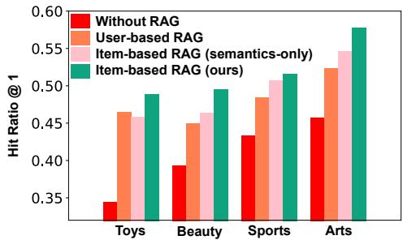
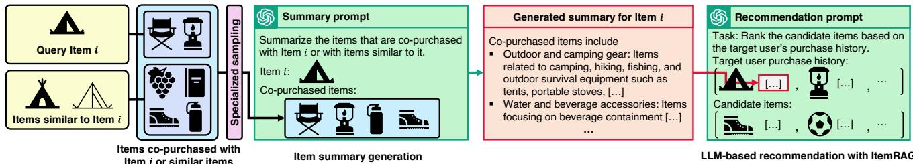
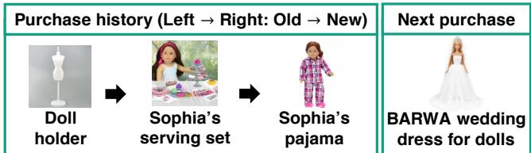

# ItemRAG: Item-Based Retrieval-Augmented Generation for LLM-Based Recommendation

Sunwoo Kim KAIST Seoul, South Korea kswoo97@kaist.ac.kr

Geon Lee KAIST Seoul, South Korea geonlee0325@kaist.ac.kr

Jaemin Yoo Seoul National University Seoul, South Korea jaeminyoo@snu.ac.kr

Kyungho Kim KAIST Seoul, South Korea kkyungho@kaist.ac.kr

Kijung Shin KAIST Seoul, South Korea kijungs@kaist.ac.kr

## Abstract

Recently, large language models (LLMs) have been widely used as recommender systems, owing to their reasoning capability and efectiveness in handling cold-start items. A common approach prompts an LLM with a target user’s purchase history to recom mend items from a candidate set, often enhanced with retrieval augmented generation (RAG). Most existing RAG approaches retrieve purchase histories of users similar to the target user; however, these histories often contain noisy or weakly relevant information and provide little or no useful information for candidate items. To address these limitations, we propose ItemRAG, a novel RAG approach that shifts focus from coarse user-history retrieval to finegrained item-level retrieval. ItemRAG augments the description of each item in the target user’s history or the candidate set by retriev ing items relevant to each. To retrieve items not merely semantically similar but informative for recommendation, ItemRAG leverages co purchase information alongside semantic information. Especially, through their careful combination, ItemRAG prioritizes more informative retrievals and also benefits cold-start items. Through exten sive experiments, we demonstrate that ItemRAG consistently out performs existing RAG approaches under both standard and cold start item recommendation settings. Supplementary materials, code, and datasets are provided at https://github.com/kswoo97/ItemRAG.

## CCS Concepts

• Information systems → Recommender systems.

## Keywords

large language model, retrieval augmented generation

## ACM Reference Format:

Sunwoo Kim, Geon Lee, Kyungho Kim, Jaemin Yoo, and Kijung Shin. 2026. ItemRAG: Item-Based Retrieval-Augmented Generation for LLM-Based Rec ommendation. In Proceedings of the 49th International ACM SIGIR Conference on Research and Development in Information Retrieval (SIGIR ’26), July 20– 24, 2026, Melbourne, VIC, Australia. ACM, New York, NY, USA, 5 pages. https://doi.org/10.1145/3805712.3809942

  
Figure 1: Strong performance of ItemRAG, our proposed itembased RAG method. ItemRAG consistently (1) improves the zero-shot LLM-based recommender (Without RAG) and (2) outperforms both the strongest user-based RAG baseline (CoRAL [23]), and a semantics-only item-based RAG method.

## 1 Introduction

Recommender systems are core to modern web services, retrieving items that match user interests from vast item pools [1, 7–10, 12, 16, 17]. By inferring users’ preferences from their purchase histories, recommender systems provide personalized recommendations that improve user satisfaction and drive business revenue.

In recent years, there have been significant eforts to use large language models (LLMs) as a recommender system. In standard practice, given a target user’s purchase history, an LLM is prompted to recommend items from a candidate set (e.g., a small subset of the full item set) [11, 14]. Owing to LLM’s strong reasoning and zero-/few-shot capabilities, LLM-based recommenders can handle coldstart items efectively and can also provide intuitive explanations that improve users’ understanding of the recommendation results.

To better adapt LLMs for the recommendation tasks, various retrieval-augmented generation (RAG) techniques have been used [4, 12]. Such methods typically focus on user retrieval [21, 25], retrieving users similar to a target user and supplying their purchase histories together with the target user’s own history to the LLM.

However, user retrieval has several limitations. First, retrieved users, although coarsely similar to the target user, may still include a considerable amount of irrelevant information, which can introduce noise. Specifically, because individual users typically exhibit diverse interests, the retrieved purchase histories are likely to reflect the target user’s preferences only partially, with a large portion being less relevant. Second, this approach does not explicitly retrieve information with respect to candidate items, which are equally important to users in recommendations. Although the retrieved user histories may implicitly contain information relevant to candidate items, the lack of explicit conditioning can limit their efectiveness.

  
Figure 2: An example case of ItemRAG, our item-based RAG method. For retrieving relevant items for item ??, we first identify items that are co-purchased with (1) item ?? itself and/or (2) items whose textual descriptions are similar to that of item ??. Then, we sample a specified number of items from this pool, with selection probabilities proportional to their co-purchase frequencies with item ??. Subsequently, we prompt an LLM to generate a summary of the sampled items and incorporate the summary into the final recommendation prompt, guiding the LLM to understand the co-purchase patterns among items.

To address these limitations, we propose ItemRAG, whose key idea is to retrieve information relevant to individual items at a fine-grained level, instead of coarse-grained retrieval at the user level. Especially, ItemRAG applies this retrieval not only to items in the user’s purchase history but also to each candidate item, aug menting each item with descriptions of relevant items retrieved from the full item corpus. This item-level augmentation (1) mitigates noise introduced by irrelevant information from partially relevant users in user-level augmentation, and (2) also ofers explicit, recommendation-beneficial evidence for each candidate item.

As is intuitive, the success of ItemRAG depends on the retrieved items and their relevance. However, a straightforward extension of a semantics-based retriever, a common design choice in natural lan guage processing [6] that retrieves items with semantically similar descriptions, may be less efective for recommendation, as shown by its limited gains over the user-based approach [23] in Figure 1.

To enable recommendation-aligned retrieval, ItemRAG leverages item co-purchase relations alongside semantic information through a carefully designed retrieval strategy, which leads to sub stantial empirical performance gains (see Figure 1). Specifically, to reduce the impact of less-relevant, incidentally co-purchased items, ItemRAG selectively samples retrieved items in proportion to their co-purchase frequencies, rather than using all retrieved items. Moreover, to better handle cold-start items with few or no co-purchase neighbors, ItemRAG expands the retrieval set by addi tionally retrieving items that were co-purchased not with the query item itself, but with items that are semantically similar to it.

Through extensive experiments, we demonstrate the efective ness of ItemRAG in both (1) standard LLM-based recommendation and (2) cold-start item recommendation. In particular, ItemRAG consistently outperforms user-based RAG baselines in both set tings, yielding up to 11% gains on the Toys dataset (in terms of Hit-Ratio@1) over the strongest user-based RAG baseline.

Our key contributions are summarized below:

• New concept. We propose item-based RAG for LLM-based recommendation, a fine-grained approach that enriches the descrip tions of each target-user purchased item and candidate item.

• New method. We propose ItemRAG, an item-based RAG approach that integrates co-purchase relations and semantic information for relevant item retrieval.

• Strong performance. ItemRAG consistently outperforms userbased RAG baselines in both (1) standard LLM-based recommendation and (2) cold-start item recommendation.

Supplementary materials, code, and datasets are provided at https: //github.com/kswoo97/ItemRAG.

## 2 Related work and preliminary

In this section, we review related studies and present the prelimi nary concepts relevant to our work

Related work. Thanks to their strong reasoning capabilities and ability to handle cold-start items, using LLMs as recommender systems has attracted substantial attention [11, 14]. To better adapt them to recommendation tasks, retrieval-augmented generation (RAG) techniques have been widely explored [4, 12]. One line of work applies RAG in specific settings, including conversational recommendation [19, 26] and knowledge–graph–based recommendation [18, 22]. Another line of RAG work aims to improve generalpurpose recommenders that rely primarily on user–item interactions [4, 21, 25], which is our focus. They are mostly user-based approaches, with inherent limitations detailed in Section 1.

Preliminary. The user set and the item set are denoted by U and I, respectively. We consider a sequential recommendation setting, and therefore, each user $u \in \mathcal { U }$ is represented by her purchase history sequence: u := $[ i _ { 1 } ^ { ( u ) } , i _ { 2 } ^ { ( u ) } , \cdot \cdot \cdot , i _ { n u } ^ { ( u ) } ]$ , where $i _ { s } ^ { ( \dot { u } ) }$ denotes the ??-th item purchased by user ?? and $n _ { u }$ is the number of items purchased by ??. Each item ?? ∈ I has a text description $\mathit { t } _ { i } ,$ such as item title.

## 3 Proposed method

In this section, we introduce ItemRAG, an item-based retrievalaugmented generation (RAG) method for LLM-based recommendation. We first give an overview of the ItemRAG pipeline (Section 3.1) and detail our retrieval strategy (Section 3.2).

## 3.1 Overall pipeline of ItemRAG

We consider an LLM-based recommendation pipeline in which an LLM is given (1) the target user’s purchase history and (2) a set of candidate items. Then, the LLM is prompted to rank the candidates by their likelihood of being the target user’s next purchase.1 Here, each item is represented by its textual description (e.g., item title).

By using ItemRAG, we enhance the description of each query item ?? that is (1) purchased by the target user or (2) a recommendation candidate—by retrieving items relevant to item ??. Specifically, for each query item ??, we retrieve items relevant to it, and then pro vide a summary of the retrieved items together with the original textual description of item ??. Notably, as discussed in Section 1, this augments individual items in a fine-grained manner, in contrast to widely-used coarse target user-level augmentation. In Section 3.2, we present key challenges in the relevant-item decision process and introduce our retrieval strategy that overcomes them.

## 3.2 Retrieval strategy of ItemRAG

One way to retrieve items related to a query item is to select those that are co-purchased with it. However, this faces two challenges: (C1) it performs poorly—and may be infeasible—for cold-start query items with little or no co-purchase data, and (C2) some co-purchased items are incidental and thus weakly relevant.

To address the cold-start challenge (C1), for each query item ??, we retrieve not only items co-purchased with ?? but also items copurchased with items whose text descriptions are similar to ??. Our rationale is that items similar to ?? often share co-purchase patterns with ??, giving strong complementary co-purchase information for ??.

To address the weak-relevance challenge (C2), we score each query–retrieved item pair by its co-purchase frequency and use this score for the probability of the item being selected in the final retrieval. Our rationale is that frequent co-purchases indicate strong relevance and are less likely to be incidental.

Based on these intuitions, we formally elaborate on our retrieval strategy. We start with presenting two notations. We denote a set of items purchased by user ?? as $\mathcal { M } ( u ) \ ( { \mathrm { i . e . , ~ } } M ( u ) = \{ i _ { s } ^ { ( u ) } \ : \ s \ \in $ $\{ 1 , 2 , \cdots , n _ { u } \} \}$ ). We also denote a set of items co-purchased with item ?? as $N ( i ) \ { \mathrm { ( i . e . , } } N ( i ) = \{ j : i \neq j , \exists u \in { \mathcal { U } } \ { \mathrm { s . t . } } \ \{ i , j \} \subseteq { \mathcal { M } } ( u ) \} )$

In retrieval for a query item ??, we first find the top-?? whose textual descriptions are most similar to ??; we denote this set as $\mathcal { T } ( i )$ . Specifically, for each $j \in \mathcal { I } ,$ we encode its text description $t _ { j }$ via a pre-trained language model LM, obtaining the representation $\mathbf { z } _ { j } \in \mathbb { R } ^ { d } \ ( \mathrm { i . e . , } \ \mathbf { z } _ { j } = \mathsf { L M } ( \boldsymbol { \mathcal { t } } _ { j } ) )$ . We then compute the cosine similarity between ?? and each other item $j \in { \cal { J } } \backslash \{ i \} ( \mathrm { i . e . , } ( \mathbf { z } _ { i } ^ { T } \mathbf { z } _ { j } ) / ( \| \mathbf { z } _ { i } \| _ { 2 } \| \mathbf { z } _ { j } \| _ { 2 } ) )$ and select the top-?? by similarity; the resulting set is T (??).

We subsequently derive a retrieval pool $\mathcal { P } ( i )$ comprising items co-purchased with (1) item ?? itself $( N ( i ) )$ and/or (2) items having similar descriptions to $i ( \mathcal { T } ( i ) )$ . Formally, the pool is defined as:

$$
\mathcal {P} (i) = \mathcal {N} (i) \cup \{j: \exists q \in \mathcal {T} (i) \text {s.t.} j \in \mathcal {N} (q) \}.\tag{1}
$$

After, instead of retrieving all the items within $\mathcal { P } ( i )$ , we sam ple ?? number of items proportional to co-purchase frequencies. Formally, let a co-purchase frequency of items ?? and ?? as ???? ?? (i.e., $\begin{array} { r } { c _ { i j } = \sum _ { u \in \mathcal { U } } 1 [ \{ i , j \} \in \mathcal { M } ( u ) ] } \end{array}$ , where 1[·] is an indicator function). Then, a sampling weight ?????? of item ?? being retrieved for query item ?? is defined as: $\begin{array} { r } { w _ { i j } = c _ { i j } + \frac { 1 } { | \mathcal { T } ( i ) | } \sum _ { q \in \mathcal { T } ( i ) } c _ { q j } , } \end{array}$ where $c _ { i j }$ denotes the co-purchase frequency between items ?? and ??, and the rest in dicates the mean of co-purchase frequencies between item ?? and items that are semantically similar to item ??.

Subsequently, we sample ?? items from the retrieval pool $\mathcal { P } ( i )$ (Eq. (1)), where each item $j \in \mathcal { P } ( i )$ is drawn with the probability of $\begin{array} { r } { w _ { i j } / ( \sum _ { q \in \mathcal { P } ( i ) } w _ { i q } ) } \end{array}$ . Lastly, we prompt an LLM to summarize the sampled items and append this summary to the original description of item ??, helping the LLM-based recommender capture co-purchase information of item ??. Note that the co-purchase summary generation is independent of the target user; thus, the summary for a given item can be used for diferent target users.

## 4 Experiment

In this section, we analyze the efectiveness of ItemRAG in the LLMbased recommendation tasks. We answer the questions below:

RQ1. How efective is ItemRAG for LLM-based recommendation?

RQ2. How accurate is ItemRAG at recommending cold-start items?

RQ3. Do LLM-based recommender systems make efective use of the item information retrieved by ItemRAG?

RQ4. Do all ItemRAG key components contribute to performance?

## 4.1 Experimental setting

Datasets and evaluation protocol. We use four domains from the latest Amazon Reviews dataset [3]: Sports & Outdoors (Sports), Toys & Games (Toys), Beauty & Personal Care (Beauty), and Arts, Crafts & Sewing (Arts). Further details, including preprocessing steps and dataset statistics, are provided in Appendix [13]. For evaluation, following prior work [14, 23], we use a leave-one-out protocol: for each user, the last purchased item is held out for testing, and the remaining history is used as input. Also, following [14], we prompt the LLM to rank 10 candidate items for the target user’s next purchase; the set includes 1 ground-truth item and 9 randomly sampled items, and results with larger candidate sets are reported in Appendix [13]. We run each experiment three times and report the mean metrics. We further conduct a Wilcoxon signed-rank test between ItemRAG and each baseline to assess statistical significance. In addition, we provide an inference runtime analysis of ItemRAG in the appendix [13].

Baseline methods and ItemRAG. For comparison, we use 9 baseline methods: two graph-based models (LightGCN [2] and Light-GCN++ [15]), two sequential models (SASRec [5] and BERT4Rec [20]), one naive zero-shot LLM-based recommender, and four user-based RAG methods (ICL [21], AdaptRec [25], ReACT [4], and CoRAL [23]). For LLM-based methods, we use GPT-4.1-mini as the backbone. For the retrieval process in ItemRAG, we use 5 similar items per item and sample 50 items in the final retrieval set. Further details on baselines, hyperparameters, and prompts are given in Appendix [13].

## 4.2 RQ1. Standard LLM-based recommendation

Setup. For each method, we construct the training data and retrieval database from users’ purchase histories after withholding each user’s last interaction, which is reserved exclusively for evaluation. For testing, we evaluate each method on 1,000 randomly sampled users under the evaluation protocol detailed in Section 4.1.

Result. As shown in Table 1, ItemRAG outperforms all the baseline methods in 18 out of 20 settings. Two points stand out. First, Item-RAG consistently improves the naive zero-shot LLM recommender, by up to 42% in Hit-Ratio@1 on the Beauty & Personal Care dataset. Second, ItemRAG outperforms user-based RAG methods, outperforming the strongest baseline (CoRAL) by up to 11% in terms of Hit-Ratio@1 on the Toys & Games dataset.

Table 1: (RQ1&4) LLM-based recommendation performance. All metrics are multiplied by 100 for better readability. H@K and N@K denote Hit-Ratio@K and NDCG@K, respectively. We do not report N@1, since it is equal to H@1. Best results are highlighted with a green box, and \* indicates that ItemRAG achieves statistically significant improvement over the corresponding baseline at the 0.05 significance level. Notably, ItemRAG outperforms the baseline methods in 18 out of 20 cases

<table><tr><td rowspan="2">Methods</td><td colspan="5">Beauty &amp; Personal Care</td><td colspan="5">Toys &amp; Games</td><td colspan="5">Sports &amp; Outdoors</td><td colspan="5">Arts, Crafts &amp; Sewing</td></tr><tr><td>H@1</td><td>H@3</td><td>H@5</td><td>N@3</td><td>N@5</td><td>H@1</td><td>H@3</td><td>H@5</td><td>N@3</td><td>N@5</td><td>H@1</td><td>H@3</td><td>H@5</td><td>N@3</td><td>N@5</td><td>H@1</td><td>H@3</td><td>H@5</td><td>N@3</td><td>N@5</td></tr><tr><td>LightGCN [2]</td><td>35.8*</td><td>62.8*</td><td>78.8*</td><td>51.2*</td><td>57.9*</td><td>40.9*</td><td>67.7*</td><td>81.5*</td><td>56.4*</td><td>62.1*</td><td>45.3*</td><td>70.6*</td><td>83.3*</td><td>60.2*</td><td>65.5*</td><td>51.7*</td><td>78.2*</td><td>88.0*</td><td>67.1*</td><td>71.1*</td></tr><tr><td>LightGCN++ [15]</td><td>38.3*</td><td>65.2*</td><td>80.2*</td><td>53.4*</td><td>59.7*</td><td>42.2*</td><td>68.5*</td><td>82.5*</td><td>57.3*</td><td>63.1*</td><td>46.0*</td><td>70.8*</td><td>84.0*</td><td>60.5*</td><td>65.9*</td><td>53.0*</td><td>79.9*</td><td>88.8*</td><td>68.2*</td><td>72.2*</td></tr><tr><td>SASRec [5]</td><td>35.2*</td><td>62.6*</td><td>78.7*</td><td>51.9*</td><td>57.5*</td><td>32.4*</td><td>58.5*</td><td>75.1*</td><td>47.0</td><td>54.6*</td><td>44.0*</td><td>68.9*</td><td>82.1*</td><td>57.9*</td><td>63.3*</td><td>47.4*</td><td>72.9*</td><td>86.5*</td><td>62.5*</td><td>69.6*</td></tr><tr><td>BERT4Rec [20]</td><td>36.1*</td><td>63.2*</td><td>78.9*</td><td>52.3*</td><td>57.7*</td><td>32.0*</td><td>58.7*</td><td>75.8*</td><td>47.1*</td><td>55.5*</td><td>44.2*</td><td>70.5*</td><td>83.8*</td><td>59.4*</td><td>65.3*</td><td>48.2*</td><td>74.6*</td><td>87.1*</td><td>63.3*</td><td>69.9*</td></tr><tr><td>Zero-shot</td><td>34.6*</td><td>57.7*</td><td>72.9*</td><td>48.0*</td><td>54.2*</td><td>39.3*</td><td>62.5*</td><td>76.5*</td><td>52.7*</td><td>58.5*</td><td>43.4*</td><td>66.6*</td><td>81.6*</td><td>56.7*</td><td>62.9*</td><td>45.7*</td><td>72.2*</td><td>83.8*</td><td>61.1*</td><td>65.6*</td></tr><tr><td>ICL [21]</td><td>37.7*</td><td>61.9*</td><td>76.7*</td><td>51.5*</td><td>57.5*</td><td>41.3*</td><td>66.4*</td><td>80.6*</td><td>55.7*</td><td>61.1*</td><td>46.4*</td><td>70.2*</td><td>84.1*</td><td>59.8*</td><td>65.7*</td><td>46.3*</td><td>75.3*</td><td>86.7*</td><td>63.1*</td><td>67.8*</td></tr><tr><td>AdaptRec [25]</td><td>34.7*</td><td>58.2*</td><td>74.9*</td><td>47.9*</td><td>55.1*</td><td>37.8*</td><td>63.3*</td><td>77.5*</td><td>52.2*</td><td>58.1*</td><td>44.4*</td><td>67.8*</td><td>83.2*</td><td>57.5*</td><td>63.6*</td><td>46.4*</td><td>74.4*</td><td>85.8*</td><td>62.9*</td><td>67.9*</td></tr><tr><td>ReACT [4]</td><td>34.4*</td><td>57.7*</td><td>73.5*</td><td>47.6*</td><td>54.2*</td><td>38.5*</td><td>61.7*</td><td>75.9*</td><td>51.7*</td><td>57.8*</td><td>44.7*</td><td>68.7*</td><td>83.5*</td><td>58.2*</td><td>64.4*</td><td>46.9*</td><td>73.0*</td><td>83.8*</td><td>61.9*</td><td>66.4*</td></tr><tr><td>CoRAL [23]</td><td>46.5*</td><td>69.9*</td><td>82.0*</td><td>60.2*</td><td>65.0*</td><td>44.6*</td><td>70.1*</td><td>81.2*</td><td>59.4*</td><td>64.0*</td><td>48.5*</td><td>73.2*</td><td>87.1*</td><td>62.5*</td><td>68.3*</td><td>52.4*</td><td>80.7*</td><td>91.1*</td><td>68.9*</td><td>73.3*</td></tr><tr><td>w/o cand-aug.</td><td>36.9*</td><td>59.2*</td><td>73.8*</td><td>49.8*</td><td>55.8*</td><td>42.1*</td><td>63.7*</td><td>78.9*</td><td>54.6*</td><td>60.8*</td><td>44.8*</td><td>68.2*</td><td>81.8*</td><td>57.5*</td><td>63.3*</td><td>47.3*</td><td>72.8*</td><td>84.4*</td><td>62.0*</td><td>66.8*</td></tr><tr><td>w/o co-purch.</td><td>46.1*</td><td>68.9*</td><td>82.1*</td><td>59.1*</td><td>64.7*</td><td>46.4*</td><td>70.8*</td><td>81.9*</td><td>60.6*</td><td>65.1*</td><td>50.6*</td><td>72.9*</td><td>86.2*</td><td>63.6*</td><td>68.9*</td><td>54.6*</td><td>80.1*</td><td>89.7*</td><td>69.5*</td><td>73.3*</td></tr><tr><td>w/o sim-items</td><td>47.5*</td><td>70.2*</td><td>82.8*</td><td>60.8*</td><td>66.3*</td><td>49.8</td><td>71.6*</td><td>83.9*</td><td>62.4*</td><td>67.7*</td><td>50.2*</td><td>74.0*</td><td>87.7*</td><td>64.5</td><td>70.0</td><td>56.0*</td><td>82.1*</td><td>91.1*</td><td>71.0*</td><td>74.6*</td></tr><tr><td>w/o co-freq.</td><td>47.7*</td><td>70.1</td><td>83.9</td><td>60.7*</td><td>66.6</td><td>48.1*</td><td>73.1*</td><td>83.5*</td><td>63.0*</td><td>67.0*</td><td>50.7*</td><td>74.1</td><td>87.9*</td><td>64.0</td><td>69.8*</td><td>56.2*</td><td>82.2*</td><td>91.0*</td><td>71.3*</td><td>75.0*</td></tr><tr><td>ItemRAG</td><td>49.1</td><td>71.0</td><td>83.8</td><td>61.5</td><td>66.9</td><td>49.5</td><td>74.2</td><td>85.0</td><td>63.8</td><td>68.1</td><td>51.6</td><td>74.7</td><td>88.3</td><td>64.6</td><td>70.3</td><td>57.8</td><td>82.6</td><td>91.9</td><td>72.3</td><td>76.1</td></tr></table>

Table 2: (RQ2) Cold-start item recommendation performance. All metrics are multiplied by 100 for better readability. H@K and N@K denote Hit-Ratio@K and NDCG@K, respectively. Best results are highlighted with a green box, and \* indicates that ItemRAG achieves statistically significant improvements over the corresponding baseline at the 0.05 significance level. Notably ItemRAG outperforms the baseline methods in every case.

<table><tr><td rowspan="2">Methods</td><td colspan="5">Beauty &amp; Personal care</td><td colspan="5">Toys &amp; Games</td><td colspan="5">Sports &amp; Outdoors</td><td colspan="5">Arts, Crafts &amp; Sewing</td></tr><tr><td>H@1</td><td>H@3</td><td>H@5</td><td>N@3</td><td>N@5</td><td>H@1</td><td>H@3</td><td>H@5</td><td>N@3</td><td>N@5</td><td>H@1</td><td>H@3</td><td>H@5</td><td>N@3</td><td>N@5</td><td>H@1</td><td>H@3</td><td>H@5</td><td>N@3</td><td>N@5</td></tr><tr><td>Zero-shot</td><td>34.6*</td><td>57.7*</td><td>72.9*</td><td>48.0*</td><td>54.2*</td><td>39.3*</td><td>62.5*</td><td>76.5*</td><td>52.7*</td><td>58.5*</td><td>43.4*</td><td>66.6*</td><td>81.6*</td><td>56.7*</td><td>62.9*</td><td>45.7*</td><td>72.2*</td><td>83.8*</td><td>61.1*</td><td>65.6*</td></tr><tr><td>ICL [21]</td><td>37.1*</td><td>61.6*</td><td>76.4*</td><td>51.3*</td><td>56.9*</td><td>40.5*</td><td>66.1*</td><td>79.1*</td><td>55.1*</td><td>60.7*</td><td>45.6*</td><td>69.7*</td><td>83.9*</td><td>59.4*</td><td>65.3*</td><td>45.0*</td><td>74.3*</td><td>85.8*</td><td>61.9*</td><td>66.6*</td></tr><tr><td>AdaptRec [25]</td><td>37.0*</td><td>60.4*</td><td>75.5*</td><td>50.1*</td><td>56.1*</td><td>38.2*</td><td>64.4*</td><td>78.6*</td><td>53.3*</td><td>59.7*</td><td>45.2*</td><td>68.9*</td><td>83.0*</td><td>58.8*</td><td>64.6*</td><td>49.5*</td><td>73.5*</td><td>85.0*</td><td>62.4*</td><td>67.1*</td></tr><tr><td>ReACT [4]</td><td>35.3*</td><td>58.4*</td><td>72.0*</td><td>50.4*</td><td>53.8*</td><td>39.0*</td><td>61.9*</td><td>76.2*</td><td>52.2*</td><td>57.9*</td><td>42.9*</td><td>66.4*</td><td>81.1*</td><td>56.0*</td><td>62.2*</td><td>47.2*</td><td>72.7*</td><td>84.4*</td><td>62.0*</td><td>66.8*</td></tr><tr><td>CoRAL [23]</td><td>38.5*</td><td>60.9*</td><td>73.3*</td><td>51.5*</td><td>56.8*</td><td>39.0*</td><td>61.2*</td><td>74.0*</td><td>51.7*</td><td>57.0*</td><td>45.0*</td><td>68.2*</td><td>81.4*</td><td>58.6*</td><td>63.4*</td><td>46.4*</td><td>73.4*</td><td>83.9*</td><td>61.8*</td><td>66.3*</td></tr><tr><td>ItemRAG</td><td>47.7</td><td>70.7</td><td>83.7</td><td>60.9</td><td>66.2</td><td>48.7</td><td>71.9</td><td>83.2</td><td>61.9</td><td>66.7</td><td>51.3</td><td>74.7</td><td>88.0</td><td>64.3</td><td>70.2</td><td>57.9</td><td>82.7</td><td>91.4</td><td>72.3</td><td>75.9</td></tr></table>

## 4.3 RQ2. Cold-start item recommendation

Setup. Given that the strength in cold-start item recommendation is the primary promise of LLM-based recommenders [24], we eval uate each method under an item cold-start setup. Specifically, for the 1, 000 sampled users described in Section 4.2, we remove the ground-truth test items for the users—together with all interactions involving that item—from both the training set and the retrieval database, making the corresponding items cold-start.2 We then evaluate each method’s ability to recommend such items to the corresponding users. Since the learning-based baselines we use cannot handle unseen (cold-start) items, we focus on LLM-based approaches. Other settings remain the same as in Section 4.2.

Result. As shown in Table 2, ItemRAG outperforms the baseline methods in all the cases, demonstrating its strong performance in recommending cold-start items. Notably, its performance decreases by only 1% on average relative to the standard setting (Table 1), suggesting that it remains efective in cold-start scenarios.

## LLM predictions and the rationale for its predictions

▪ Naïve zero-shot LLM: Jewelry kit for kids

LLM with ItemRAG: BARWA wedding dress for dolls LLM’s rationale: “The user’s purchase history shows strong patterns of interests in dolls and accessories […] This item has strong co-purchase associations with doll and doll accessory groups, making it the most likely candidate for purchase.”

Figure 3: (RQ3) Case study. While the naive zero-shot LLMbased recommender fails, augmenting it with co-purchase information retrieved by ItemRAG —information the model explicitly uses—yields an accurate recommendation.

## 4.4 RQ3. Case study

Setup. We examine whether the LLM-based recommender system leverages the item information retrieved by ItemRAG. To this end, on the Toys & Games dataset, we run a case study in which the LLM is prompted to give the rationale behind its recommendations. Additional cases in other datasets are reported in Appendix [13]. Result. Figure 3 presents a case where a naive zero-shot LLM-based recommender fails to provide an accurate recommendation. When the prompt is augmented with co-purchase information retrieved by ItemRAG, the LLM (1) recommends the correct item and (2) explic itly notes in its rationale that it relied on the retrieved co-purchase signals. This result suggests that ItemRAG’s retrieved information is indeed used and beneficial for improving performance.

## 4.5 RQ4. Ablation study

Setup. We assess the necessity of ItemRAG ’s key components by using four variants below:

(V1) w/o cand-aug: Does not augment candidate item descriptions.

(V2) w/o co-purch: Retrieves textually similar items instead of us ing co-purchase relations.

(V3) w/o sim-items: Uses its own co-purchase information for each item during retrieval

(V4) w/o co-freq: Replaces frequency-weighted sampling with uni form sampling.

Result. As shown in Table 1, the four variants underperform Item RAG in 18 out of 20 settings, demonstrating the efectiveness of the ItemRAG’s key components in LLM-based recommendation.

## 5 Conclusion and discussion

In this work, we introduce ItemRAG, an item-based RAG technique for LLM-based recommendation. The key idea is to augment indi vidual items in the target user’s purchase history or the candidate set, instead of relying on coarse user-level augmentation. Especially, its carefully designed retrieval strategy, guided by co-purchase in formation, retrieves items that are recommendation-relevant rather than merely semantically similar, and also augments cold-start items. Through extensive experiments, we demonstrate the efec tiveness of ItemRAG for LLM-based recommendation and cold-start item recommendation. One limitation of ItemRAG is that incorpo rating additional retrieved information can increase the length of the input prompt to the LLM recommender, which in turn leads to higher API costs and longer inference time. Reducing the token usage by the retrieved information is thus an important direction for future work, especially for practical deployment.

Acknowledgements. This work was partly supported by the National Research Foundation of Korea (NRF) grant funded by the Korea government (MSIT) (No. RS-2024-00406985, 40%). This work was partly supported by Institute of Information & Communications Technology Planning & Evaluation (IITP) grant funded by the Korea government (MSIT) (No. RS-2022-II220871, Development of AI Autonomy and Knowledge Enhancement for AI Agent Collabo ration, 50%) (No. RS-2019-II190075, Artificial Intelligence Graduate School Program (KAIST), 10%).

## References

[1] Chongming Gao, Mengyao Gao, Chenxiao Fan, Shuai Yuan, Wentao Shi, and Xiangnan He. 2025. Process-supervised llm recommenders via flow-guided tuning. In SIGIR.

[2] Xiangnan He, Kuan Deng, Xiang Wang, Yan Li, Yongdong Zhang, and Meng Wang. 2020. Lightgcn: Simplifying and powering graph convolution network for recommendation. In SIGIR

[3] Yupeng Hou, Jiacheng Li, Zhankui He, An Yan, Xiusi Chen, and Julian McAuley. 2026. Bridging Language and Items for Retrieval and Recommendation: Bench marking LLMs as Semantic Encoders.. In ACL.

[4] Zheng Hu, Yongsen Pan, Zetao Li, Jiaming Huang, Satoshi Nakagawa, Jiawen Deng, Shimin Cai, and Fuji Ren. 2026. Retrieval-enhanced, Adaptively Collabora tive, and Temporal-aware user behavior comprehension for LLM-based sequential recommendation. Information Processing & Management 63, 1 (2026), 104354

[5] Wang-Cheng Kang and Julian McAuley. 2018. Self-attentive sequential recommendation. In ICDM.

[6] Vladimir Karpukhin, Barlas Oguz, Sewon Min, Ledell Wu, Sergey Edunov, Danqi Chen, and Wen-tau Yih. 2020. Dense Passage Retrieval for Open-Domain Question Answering.. In EMNLP.

[7] Kyungho Kim, Sunwoo Kim, Geon Lee, Jinhong Jung, and Kijung Shin. 2025. Multi-behavior recommender systems: a survey. In PAKDD.

[8] Kyungho Kim, Sunwoo Kim, Geon Lee, and Kijung Shin. 2024. Towards better utilization of multiple views for bundle recommendation. In CIKM.

[9] Kyungho Kim, Sunwoo Kim, Geon Lee, and Kijung Shin. 2025. A self-supervised mixture-of-experts framework for multi-behavior recommendation. In CIKM.

[10] Sunwoo Kim, Hyunjin Hwang, and Kijung Shin. 2026. Personalized Parameter-Eficient Fine-Tuning of Foundation Models for Multimodal Recommendation. In WWW.

[11] Sein Kim, Hongseok Kang, Seungyoon Choi, Donghyun Kim, Minchul Yang, and Chanyoung Park. 2024. Large language models meet collaborative filtering: An eficient all-round llm-based recommender system. In KDD.

[12] Sunwoo Kim, Geon Lee, Kyungho Kim, Liam Collins, Neil Shah, and Kijung Shin. 2025. Retrieval-Augmented Generation for LLM-based Recommender Systems: A Comprehensive Survey. HAL preprint (2025). https://hal.science/hal-05561909

[13] Sunwoo Kim, Geon Lee, Kyung ho Kim, Jaemin Yoo, and Kijung Shin. 2026. Supplementary materials, code, and datasets for this work. https://github.com/ kswoo97/ItemRAG.

[14] Genki Kusano, Kosuke Akimoto, and Kunihiro Takeoka. 2025. Revisiting Prompt Engineering: A Comprehensive Evaluation for LLM-based Personalized Recom mendation. In RecSys.

[15] Geon Lee, Kyungho Kim, and Kijung Shin. 2024. Revisiting LightGCN: Unexpected Inflexibility, Inconsistency, and A Remedy Towards Improved Recommendation. In RecSys.

[16] Namjun Lee and Jaekwang Kim. 2025. SEALR: Sequential Emotion-Aware LLM-Based Personalized Recommendation System. In SIGIR

[17] Jiayi Liao, Ruobing Xie, Sihang Li, Xiang Wang, Xingwu Sun, Zhanhui Kang, and Xiangnan He. 2025. Multi-Grained Patch Training for Eficient LLM-based Recommendation. In SIGIR.

[18] Zeyuan Meng, Zixuan Yi, and Iadh Ounis. 2025. KERAG\_R: Knowledge-Enhanced Retrieval-Augmented Generation for Recommendation. arXiv preprint arXiv:2507.05863 (2025).

[19] Zhangchi Qiu, Linhao Luo, Zicheng Zhao, Shirui Pan, and Alan Wee-Chung Liew. 2025. Graph Retrieval-Augmented LLM for Conversational Recommendation Systems. In PAKDD.

[20] Fei Sun, Jun Liu, Jian Wu, Changhua Pei, Xiao Lin, Wenwu Ou, and Peng Jiang. 2019. BERT4Rec: Sequential recommendation with bidirectional encoder repre sentations from transformer. In CIKM.

[21] Lei Wang and Ee-Peng Lim. 2024. The whole is better than the sum: Using aggregated demonstrations in in-context learning for sequential recommendation. In NAACL.

[22] Shijie Wang, Wenqi Fan, Yue Feng, Shanru Lin, Xinyu Ma, Shuaiqiang Wang, and Dawei Yin. 2025. Knowledge graph retrieval-augmented generation for llm-based recommendation. In ACL.

[23] Junda Wu, Cheng-Chun Chang, Tong Yu, Zhankui He, Jianing Wang, Yupeng Hou, and Julian McAuley. 2024. Coral: collaborative retrieval-augmented large language models improve long-tail recommendation. In KDD.

[24] Likang Wu, Zhi Zheng, Zhaopeng Qiu, Hao Wang, Hongchao Gu, Tingjia Shen, Chuan Qin, Chen Zhu, Hengshu Zhu, Qi Liu, et al. 2024. A survey on large language models for recommendation. World Wide Web 27, 5 (2024), 60.

[25] Tong Zhang. 2025. AdaptRec: A Self-Adaptive Framework for Sequential Recommendations with Large Language Models. arXiv:2504.08786 (2025).

[26] Yaochen Zhu, Chao Wan, Harald Steck, Dawen Liang, Yesu Feng, Nathan Kallus, and Jundong Li. 2025. Collaborative Retrieval for Large Language Model-based Conversational Recommender Systems. In WWW.