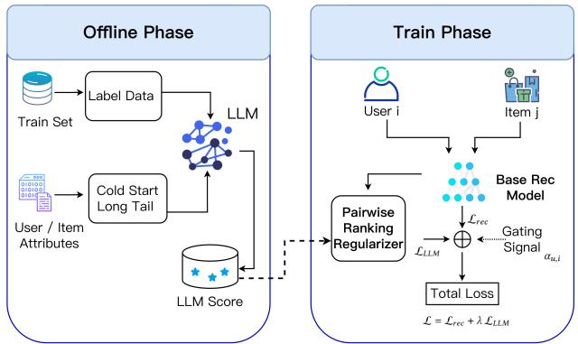
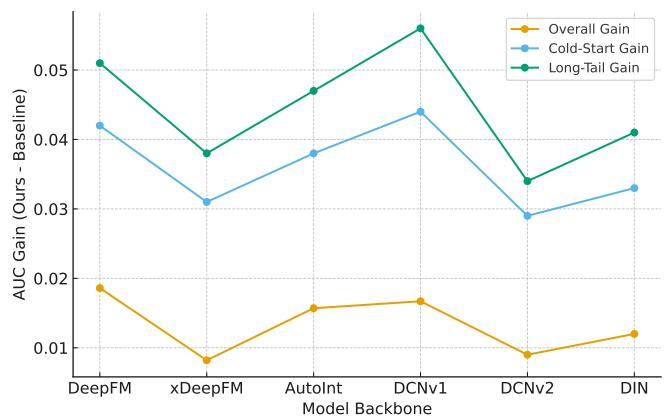

# Selective LLM-Guided Regularization for Enhancing Recommendation Models

Shanglin Yang∗

Zhan Shi∗

kudoysl@gmail.com

ashi2@scu.edu

## Abstract

Large language models (LLMs) provide rich semantic priors and strong reasoning capabilities, making them promising auxiliary signals for recommendation. However, prevailing approaches ei ther deploy LLMs as standalone recommenders or apply global knowledge distillation, both of which sufer from inherent drawbacks. Standalone LLM recommenders are costly, biased, and un reliable across large regions of the user–item space, while global distillation forces the downstream model to imitate LLM predictions even when such guidance is inaccurate. Meanwhile, recent studies show that LLMs excel particularly in re-ranking and chal lenging scenarios, rather than uniformly across all contexts. We introduce Selective LLM-Guided Regularization (S-LLMR), a modelagnostic and computation-eficient framework that activates LLM based pairwise ranking supervision only when a trainable gating mechanism-informed by user history length, item popularity, and model uncertainty predicts the LLM to be reliable. All LLM scoring is done ofline, transferring knowledge without increasing inference cost. Experiments across multiple datasets show that this selective strategy consistently improves overall accuracy and yields substan tial gains in cold-start and long-tail regimes, outperforming global distillation baselines.

## Keywords

Recommender Systems, Large Language Models, Regularization, Cold-Start, Long-Tail, Knowledge Transfer

## ACM Reference Format:

Shanglin Yang and Zhan Shi. 2025. Selective LLM-Guided Regularization for Enhancing Recommendation Models. In . ACM, New York, NY, USA, 6 pages. https://doi.org/10.1145/nnnnnnn.nnnnnnn

## 1 Introduction

Recommendation systems underpin modern digital platforms by enabling content discovery, personalization, and user engagement across domains such as e-commerce, entertainment, and online media. Classical approaches—including collaborative filtering (CF), matrix factorization (MF), neural recommenders, and graph-based models achieve strong performance when user interaction histories are suficiently dense. However, their efectiveness deteriorates in sparse regimes, such as cold-start users, long-tail items, and scenarios where user preferences are weakly expressed.

Large language models (LLMs) have emerged as powerful auxiliary knowledge sources for recommendation, ofering rich semantic priors and strong reasoning capabilities that enable preference inference even from minimal user interaction data [10]. This makes them particularly promising in cold-start and sparsely observed regions where traditional recommenders tend to underperform. However, existing approaches to leveraging LLM signals remain fundamentally limited. Directly deploying LLMs as recommenders is prohibitively expensive and prone to issues such as position bias and hallucinated predictions. Meanwhile, global knowledge transfer methods [15, 20] require the downstream model to imitate LLM outputs uniformly across the entire user–item space, regardless of whether the LLM is reliable for a given instance. Recent attempts to distill LLM knowledge into classical models partially alleviate these issues, but they often depend on fine-tuned LLMs and still struggle to deliver consistent gains across diferent architectures or datasets.

Empirical motivation. Beyond high-level intuition, recent evaluations of LLM-based recommenders report localized strengths (notably on short histories and re-ranking) alongside systematic weaknesses including strong candidate position bias and occasional hallucinations [7]. These phenomena imply that LLM signals are contextually reliable rather than uniformly trustworthy. Our design follows directly from this evidence: instead of global imitation, we selectively invoke LLM guidance under reliability conditions predicted by a lightweight, learnable gating mechanism.

We propose Selective LLM-Guided Regularization (S-LLMR), a training framework that treats LLM knowledge as a conditional regularizer rather than a global supervisory signal. Instead of enforcing uniform imitation of LLM predictions, S-LLMR incorporates LLM-generated soft rankings only in regions where LLMs exhibit empirical advantages. This selective integration ensures that LLM guidance is beneficial rather than disruptive. We prompt an LLM using a compact representation of each user’s recent interaction history to generate soft relevance scores over candidate items. All scoring is performed ofline, introducing no inference-time overhead.A gating function controls whether LLM supervision is activated for a given user–item pair. This gate identifies regions where LLM signals are empirically reliable. With the gate ctive, we apply a weighted pairwise ranking loss that encourages the recommender to align its relative item ordering with LLM soft rankings, while automatically suppressing the influence of unreliable LLM predictions.

Extensive experiments across multiple datasets and diverse recommendation backbones show that S-LLMR consistently surpasses global distillation baselines, delivering substantial improvements in sparse regimes such as cold-start and long-tail scenarios. The contribution of our paper:

• We introduce a gated LLM-based regularization paradigm that selectively incorporates LLM signals, avoiding the draw backs of global distillation and remaining fully model-agnostic.

• We design S-LLMR, which combines a reliability-aware gat ing mechanism with an LLM-guided pairwise ranking loss for targeted knowledge transfer.

• Extensive experiments across multiple backbones show con sistent AUC improvements, with especially strong gains in cold-start and long-tail scenarios.

## 2 Related Work

Classical collaborative filtering (CF) forms the foundation of mod ern recommender systems. Matrix factorization (MF) [9] models user–item afinities through latent factors and has been widely adopted due to its scalability and strong generalization ability. Neu ral extensions such as Neural Collaborative Filtering (NCF) [4] leverage multilayer perceptrons to capture nonlinear preference interactions. Graph-based recommenders, including NGCF [23], LightGCN [3], and PinSage [24] leverage user–item signals through graph structures to improve high-order connectivity modeling.

Despite their strong performance in dense regimes, these mod els degrade significantly under cold-start [16] and long-tail [14] conditions.

Recent hybrid approaches such as UniSRec [5] unify textual and collaborative filtering signals to improve robustness, but still rely on large-scale metadata and do not exploit LLM reasoning. Existing approaches either use LLMs as direct recommenders, e.g., RankLLM [17], or distill LLM outputs into recommendation models in a global manner, such as SLMRec [11] and LLM-CF [19]. However, these methods do not account for the empirical finding that LLM signals are only locally reliable—being highly beneficial in semantic or sparse contexts, but noisy or misleading in others [6, 8].

To address this gap, we adopt a diferent perspective that LLM outputs should be treated as conditionally reliable auxiliary signals, rather than unconditional ground truth. Our work operationalizes this idea by introducing a selective LLM integration framework equipped with a lightweight, learnable gating mechanism to de termine when LLM guidance should be trusted. This allows the model to avoid global distillation while selectively leveraging LLM strengths in the contexts where they are most efective.

## 3 Method

As shown in Figure 1, The Selective LLM-Guided Regulariza-tion for Recommendation (S-LLMR) is a model-agnostic training framework that selectively leverages large language models (LLMs) to regularize classical recommender models only in regions where LLM predictions are empirically reliable. Formally, given a user ?? and item ??, a base recommender produces a predicted relevance score $s _ { u , i } ,$ while the LLM provides a soft preference score $s _ { u , i } ^ { L L M }$ Our goal is to integrate LLM guidance selectively through pairwise ranking supervision with an gating signal. There are three main modules included in the pipeline.

  
Figure 1: Illustration of our selective LLM-guided regularization framework. Left: In the ofline phase, the LLM is prompted to produce soft relevance scores Right: In the training phase, a base recommender produces prediction scores, and the LLM signals are incorporated through a pairwise ranking regularizer whose contribution is controlled by a gating function.

## 3.1 LLM-Generated Soft Rankings

For each user ??, we construct a succinct textual summary of the user’s recent interaction history and query an LLM with a prompt of the form:

“Given that the user recently interacted with items $\{ i _ { 1 } , i _ { 2 } , \dots \}$ , rank the following candidate items by their likelihood of matching the user’s preferences.”

The LLM returns a soft score $s _ { u , i } ^ { L L M } \in [ 0 , 1 ]$ for each candidate item, computed via normalized logits or temperature-scaled soft ranking. All LLM scoring is performed ofline, and therefore introduces no inference-time overhead. To improve supervision coverage in sparse regions, we additionally construct two synthetic candidate sets:

• Cold-start user candidates: Users with short histories (<=3) are paired with diverse sampled items to elicit LLM judgments for user-item combinations not present in training data.

• Long-tail items (bottom 10% popularity): Items whose popularity falls in the lowest 10% of the catalog are paired with sampled users so that the LLM can evaluate these underrepresented items and provide supervision where collaborative filtering is weakest.

These augmented LLM-scored pairs expand the ofline supervision table and cover precisely the settings where classical recommenders lack suficient signals.

## 3.2 LLM-Guided Pairwise Ranking Regularizer

Motivated LLM is better for reranking, compared to the llm directly loss. Given LLM soft scores, we impose an auxiliary pairwise ranking constraint that encourages the recommender to follow the ordering implied by the LLM whenever appropriate. For user ??, if $s _ { u , i } ^ { L L M } \ > \ s _ { u , j } ^ { L L M }$ for two items (??, ??), the model is encouraged to produce $s _ { u , i } > s _ { u , j }$ with a margin.

The pairwise LLM loss is defined as:

$$
\mathcal {L} _ {L L M} = \sum_ {(u, i, j) \in \mathcal {P}} \alpha_ {u, i, j} \max \bigl (0, m - (s _ {u, i} - s _ {u, j}) \bigr),
$$

where $\alpha _ { u , i , j }$ is a selective gating weight defined later.

User-consistent pair construction. To ensure semantic alignment, pairs are constructed within individual users. In each batch, we sample one or more users, extract items associated with those users, filter valid LLM scores, sort them by LLM ranking, and form ordered pairs (??, ?? ) where $s _ { u , i } ^ { L L M } > s _ { u , j } ^ { L L M }$ . This avoids mixing signals from unrelated users.

User-consistent pair construction. Because batches may contain varying numbers of users or valid LLM entries, we employ an adaptive strategy: given a target maximum of ?? pairs, the efective number $\tilde { K }$ is adjusted based on batch structure. The algorithm selects up to ??˜ highest-confidence pairs ranked by their LLM score diference, ensuring (i) at least one pair when possible, and (ii) avoidance of over-regularization.

Overall, this regularizer enables selective, reliability-aware knowl edge transfer: the recommender follows LLM rankings when they are trustworthy, while naturally resisting noisy or inconsistent supervision.

## 3.3 Selective Gating Mechanism

LLM supervision is not uniformly reliable. We therefore define a per-pair gate $\alpha _ { u , i } \in [ 0 , 1 ]$ that scales the contribution of the LLM regularizer.

Signals. We compute: (i) a cold-start indicator $\mathrm { C o l d } ( u ) = \mathbb { 1 } \left[ | \mathcal { H } ( u ) | < \right]$ ${ \tau _ { u } } ] , ( \mathrm { i i } )$ a long-tail indicator Tai $ { \lvert { ( i ) } \ = \ \mathbb { 1 } \left[  { \mathrm { p o p } } ( i ) \ < \ \tau _ { i } \right] }$ , and (iii) a continuous uncertainty score $q _ { u , i } \in [ 0 , 1 ]$ from the base model $( \mathrm { e . g . }$ predictive entropy or ensemble variance normalized to [0, 1]).

Learnable gate. Let $z _ { u , i } = \left[ \mathrm { C o l d } ( u ) , \mathrm { T a i l } ( i ) , q _ { u , i } \right] \in \mathbb { R } ^ { 3 }$ . We use a one-layer gating network

$$
\alpha_ {u, i} = \sigma \big (\mathbf {w} ^ {\top} z _ {u, i} + b \big),
$$

with parameters $\theta _ { g } = \{ \mathbf { w } , b \}$ learned jointly by back-propagation from the full objective (Sec. 3.4). For pairwise supervision, we set $\begin{array} { r } { \alpha _ { u , i , j } = \frac { 1 } { 2 } ( \alpha _ { u , i } + \alpha _ { u , j } ) } \end{array}$

Uncertainty instantiations. We consider (a) confidence-based $q _ { u , i } =$ 1 − max?? ???? (?? |??, ??), (b) entropy-based $q _ { u , i } \ = \ \mathrm { H } ( p _ { \theta } ( \cdot | u , i ) )$ , or (c) dropout/ensemble variance. We select the best on validation.

The gating parameters $\theta _ { g }$ are learned jointly with the backbone through back-propagation from the LLM regularization loss. When LLM-guided pairs reduce the hinge loss, gradients increase $\alpha _ { u , i } ;$ when LLM signals are unhelpful, the gate is driven downward. This allows the model to automatically learn when LLM supervision is reliable without manual thresholds—focusing LLM influence on cold-start, long-tail, and high-uncertainty cases.

Algorithm 1 S-LLMR Training with Learnable Gating
Require: Base model $\theta$, gating params $\theta_g$, LLM table T_LLM, margins $m$, weights $\lambda$
1: while not converged do
2:    Sample minibatch of users $\mathcal{B}$ and their interactions
3:    for each $u \in \mathcal{B}$ do
4:    Compute base scores $s_{u,i}$ for items in batch
5:    Build user-consistent ordered pairs $\mathcal{P}_u = \{(i,j) : s_{u,i}^{\text{LLM}} &gt; s_{u,j}^{\text{LLM}}\}$ from T_LLM
6:    For each $(u,i)$ compute signals: Cold $(u)$, Tail $(i)$, $q_{u,i}$
7:    Gate: $\alpha_{u,i} = \sigma(\mathbf{w}^\top[\text{Cold}(u),\text{Tail}(i),q_{u,i}] + b)$
8:    end for
9:    $\mathcal{L}_{\text{rec}} \leftarrow$ base loss (e.g., BCE/BPR/InfoNCE)
10:    $\mathcal{L}_{\text{LLM}} \leftarrow \sum_{(u,i,j) \in \cup_u \mathcal{P}_u} \frac{\alpha_{u,i} + \alpha_{u,j}}{2} \cdot \max(0, m - (s_{u,i} - s_{u,j}))$
11:    Update $\theta, \theta_g$ by SGD on $\mathcal{L} = \mathcal{L}_{\text{rec}} + \lambda \mathcal{L}_{\text{LLM}}$
12: end while

## 3.4 Training Objective and Optimization Procedure

Algorithm 1 summarizes the full optimization procedure, including the construction of user-consistent LLM ranking pairs, computation of gating signals, and joint gradient updates of the base recommender and gating parameters. This design ensures that LLM knowledge is injected in a targeted and reliability-aware manner without interfering with the core training dynamics of the underlying model. The full training objective is:

$$
\mathcal {L} = \mathcal {L} _ {r e c} + \lambda \mathcal {L} _ {L L M},
$$

with ?? controlling the strength of the regularizer.

## 4 Experimental Setup

## 4.1 Backbone Models

To evaluate the model-agnostic nature of S-LLMR, we integrate it with six widely adopted and architecturally diverse recommendation backbones: DeepFM [1], xDeepFM [12], AutoInt [18], DCNv1 [21], DCNv2 [22], and DIN [25]. These models span a broad spectrum of interaction modeling strategies, including factorization-machine style feature crossing (DeepFM), vector-wise compressed interactions (xDeepFM), self-attentive feature learning (AutoInt), explicit cross layers (DCNv1/DCNv2), and attention over user behavior sequences (DIN). This diversity enables a comprehensive assessment of how selectively injected LLM signals generalize across diferent inductive biases.

To contextualize S-LLMR within the landscape of LLM-assisted recommendation, we compare against three representative paradigms:

• KD Distillation Baseline Following prior work [10, 15],the soft logits from a fine-tuned LLaMA2-7B model into each backbone, representing the standard global LLM-to-recommender imitation approach.

• KAR (Knowledge-Augmented Recommendation) KAR [13] aligns user and item representations with LLM-derived open-world knowledge, capturing the representation-enrichment paradigm of using LLMs in recommendation.

• LLM-CF LLM-CF [20] distills LLM world knowledge and reasoning ability into collaborative filtering, formulating

Table 1: Dataset statistics for the three Amazon domains.

<table><tr><td>Metric</td><td>Sports</td><td>Beauty</td><td>Toys</td></tr><tr><td>#Users</td><td>35,598</td><td>22,363</td><td>19,412</td></tr><tr><td>#Items</td><td>18,357</td><td>12,101</td><td>11,924</td></tr><tr><td>#Reviews</td><td>379,086</td><td>262,826</td><td>218,722</td></tr><tr><td rowspan="2">Cold-start interactions(% of interactions)</td><td>190,756</td><td>119,854</td><td>103,314</td></tr><tr><td>50.3%</td><td>45.6%</td><td>47.2%</td></tr><tr><td rowspan="2">Long-tail items(% of items)</td><td>3,659</td><td>2,400</td><td>2,326</td></tr><tr><td>19.9%</td><td>19.8%</td><td>19.5%</td></tr></table>

LLM-derived semantic signals as soft preference labels. This approach represents the state of the art in LLM-enhanced CF models.

Together, these baselines cover the three dominant LLM-forrecommendation paradigms: global distillation, representation alignment, and LLM-assisted collaborative filtering. Our comparison highlights the conceptual distinction and empirical advantages of selective over global LLM integration.

## 4.2 Datasets

We evaluate S-LLMR on three domains of the Amazon Review dataset [2], consistent with widely used recommendation bench marks. Dataset statistics are shown in Table 1. We use the Sports & Outdoors, Beauty, and Toys & Games subsets.

Across all domains, the data exhibit significant sparsity: nearly half of all interactions originate from cold-start users, and roughly 20% of items fall into the long-tail. These characteristics make the datasets particularly suitable for evaluating algorithms designed to improve performance in sparse regimes—precisely where LLM based semantic guidance is expected to be most beneficial.

## 4.3 Ofline LLM Scoring Pipeline

To obtain LLM-derived soft preference signals without adding inference-time overhead, we generate all scores $s _ { u , i } ^ { L L M }$ ofline through a lightweight pipeline. For each user ??, we extract a recent history $\mathcal { H } _ { L } ( u )$ (last $L = 1 0$ interactions) and sample ?? candidate items from a top-?? popularity pool. Each tuple $( u , \mathcal { H } _ { L } ( u ) , C ( u ) )$ is converted into a concise natural-language prompt and sent to GPT-4o-mini, which returns structured (item\_id, score) pairs in [0, 1]. Returned scores are normalized, missing values default to 0.5, and all results are stored as a lookup table $( \bar { u } , i ) \mapsto s _ { u , i } ^ { L L M }$ . During training, these ofline scores are used exclusively by the selective regularizer and never afect the base model’s loss or inference cost. This design provides flexible control over the number of scored users and can didates, enabling an eficient balance between LLM query cost and supervision coverage.

## 4.4 Training Protocol

All models are trained using the Adam optimizer with a learning rate of $1 0 ^ { - 3 } :$ , a batch size of 128, and an embedding dimension of 64, following common practice in CTR and implicit-feedback recommendation. For Selective-LLM-Reg, we set the regularization weight to $\lambda = 0 . 1$ , and select the final value based on validation

Table 2: AUC performance across three Amazon domains using six backbone architectures. For each domain, the highest AUC within a backbone group is bolded. Across all models and datasets, S-LLMR consistently achieves the strongest performance.

<table><tr><td rowspan="2">Backbone</td><td rowspan="2">Framework</td><td colspan="3">AUC↑</td></tr><tr><td>Sports</td><td>Beauty</td><td>Toys</td></tr><tr><td rowspan="5">DeepFM</td><td>None</td><td>0.7990</td><td>0.7853</td><td>0.7681</td></tr><tr><td>KD</td><td>0.8043</td><td>0.7959</td><td>0.7713</td></tr><tr><td>KAR</td><td>0.7991</td><td>0.7870</td><td>0.7698</td></tr><tr><td>LLM-CF</td><td>0.8137</td><td>0.8044</td><td>0.7881</td></tr><tr><td>Ours</td><td>0.8176</td><td>0.8101</td><td>0.7961</td></tr><tr><td rowspan="5">xDeepFM</td><td>None</td><td>0.8158</td><td>0.8065</td><td>0.7836</td></tr><tr><td>KD</td><td>0.8169</td><td>0.8104</td><td>0.7865</td></tr><tr><td>KAR</td><td>0.8161</td><td>0.8101</td><td>0.7898</td></tr><tr><td>LLM-CF</td><td>0.8196</td><td>0.8113</td><td>0.7947</td></tr><tr><td>Ours</td><td>0.8240</td><td>0.8183</td><td>0.7985</td></tr><tr><td rowspan="5">AutoInt</td><td>None</td><td>0.8003</td><td>0.7949</td><td>0.7630</td></tr><tr><td>KD</td><td>0.8012</td><td>0.7961</td><td>0.7635</td></tr><tr><td>KAR</td><td>0.8039</td><td>0.7939</td><td>0.7683</td></tr><tr><td>LLM-CF</td><td>0.8088</td><td>0.8090</td><td>0.7754</td></tr><tr><td>Ours</td><td>0.8161</td><td>0.8145</td><td>0.7849</td></tr><tr><td rowspan="5">DCNv1</td><td>None</td><td>0.8023</td><td>0.8146</td><td>0.7621</td></tr><tr><td>KD</td><td>0.8040</td><td>0.8147</td><td>0.7652</td></tr><tr><td>KAR</td><td>0.8024</td><td>0.8165</td><td>0.7651</td></tr><tr><td>LLM-CF</td><td>0.8092</td><td>0.8182</td><td>0.7702</td></tr><tr><td>Ours</td><td>0.8190</td><td>0.8189</td><td>0.7960</td></tr><tr><td rowspan="5">DCNv2</td><td>None</td><td>0.8110</td><td>0.8028</td><td>0.7774</td></tr><tr><td>KD</td><td>0.8112</td><td>0.8057</td><td>0.7827</td></tr><tr><td>KAR</td><td>0.8087</td><td>0.8003</td><td>0.7759</td></tr><tr><td>LLM-CF</td><td>0.8131</td><td>0.8033</td><td>0.7812</td></tr><tr><td>Ours</td><td>0.8150</td><td>0.8177</td><td>0.7927</td></tr><tr><td rowspan="5">DIN</td><td>None</td><td>0.7986</td><td>0.7861</td><td>0.7586</td></tr><tr><td>KD</td><td>0.8023</td><td>0.7934</td><td>0.7652</td></tr><tr><td>KAR</td><td>0.7971</td><td>0.7861</td><td>0.7620</td></tr><tr><td>LLM-CF</td><td>0.8089</td><td>0.7967</td><td>0.7783</td></tr><tr><td>Ours</td><td>0.8100</td><td>0.8010</td><td>0.7829</td></tr></table>

AUC. No additional hyperparameter tuning is performed unless explicitly noted.  
  
Figure 2: AUC improvements in cold-start and long-tail regimes across backbones. S-LLMR delivers the strongest boosts for cold-start users and long-tail items—often exceeding generalrelative improvement.

Table 3: Ablation study on DCNv2: We compare global vs. gated LLM regularization, and pointwise vs. pairwise LLM supervision.

<table><tr><td rowspan="2">Method</td><td colspan="3">Sports</td><td colspan="3">Beauty</td><td colspan="3">Toys</td></tr><tr><td>Overall</td><td>Cold</td><td>LongTail</td><td>Overall</td><td>Cold</td><td>LongTail</td><td>Overall</td><td>Cold</td><td>LongTail</td></tr><tr><td colspan="10">Global vs. Gated LLM Regularization</td></tr><tr><td>DCNv2</td><td>0.811</td><td>0.8140</td><td>0.7677</td><td>0.8028</td><td>0.8006</td><td>0.7702</td><td>0.7774</td><td>0.7868</td><td>0.7402</td></tr><tr><td>DCN + Global LLM Regularization</td><td>0.8114</td><td>0.8140</td><td>0.7640</td><td>0.7911</td><td>0.7797</td><td>0.7330</td><td>0.7887</td><td>0.7858</td><td>0.7390</td></tr><tr><td>DCN + Gated LLM Regularization (Ours)</td><td>0.8150</td><td>0.8170</td><td>0.7877</td><td>0.8177</td><td>0.8063</td><td>0.7716</td><td>0.7927</td><td>0.7917</td><td>0.7502</td></tr><tr><td colspan="10">Pointwise vs. Pairwise LLM Supervision</td></tr><tr><td>DCNv2 (Backbone)</td><td>0.811</td><td>0.8140</td><td>0.7677</td><td>0.8028</td><td>0.8006</td><td>0.7702</td><td>0.7774</td><td>0.7868</td><td>0.7402</td></tr><tr><td>DCN + LLM Pointwise MSE</td><td>0.8069</td><td>0.8119</td><td>0.7571</td><td>0.7999</td><td>0.7922</td><td>0.7445</td><td>0.7705</td><td>0.7671</td><td>0.7391</td></tr><tr><td>DCN + Pairwise Ranking (Ours)</td><td>0.8150</td><td>0.8170</td><td>0.7877</td><td>0.8177</td><td>0.8063</td><td>0.7716</td><td>0.7927</td><td>0.7917</td><td>0.7502</td></tr></table>

## 4.5 Evaluation Protocol

We adopt the standard full-ranking evaluation setting, where each test interaction is ranked against all items that the user has not interacted with in the training or validation sets. Since our goal is to assess both global predictive accuracy and robustness in sparse regions, we report AUC as the sole evaluation metric.To further evaluate model performance under challenging conditions, we report AUC on two key sub-populations:

• Cold-start users: test interactions belonging to users with fewer than ?? historical interactions, i.e., |H (??)| < ??. We set ?? = 3 in our experiments.

• Long-tail items: items in the bottom 20% of the popularity distribution based on training data. We first identify long-tail item IDs from the training set and then select the correspond ing interactions from the test set to form the long-tail subset.

These stratified subsets isolate the efect of S-LLMR in sparse and semantically challenging regimes, enabling a clearer understanding of how selective LLM guidance improves recommendation quality under conditions where traditional models typically struggle.

## 5 Results

Our results show that S-LLMR consistently improves AUC across all backbones and domains, delivers the largest gains in cold-start and long-tail scenarios.

## 5.1 Overall Performance Across Backbones

The overall performance are shown in Table 2. Across all six backbone models including DeepFM, xDeepFM, AutoInt, DCNv1, DCNv2, and DIN. S-LLMR achieves the strongest AUC scores on every Amazon domain. The improvements over non-LLM baselines (None, KD, KAR) are consistent and sizable, and our method further surpasses the LLM-CF approach by margins of 0.003–0.01 AUC depending on the model and dataset. Architectures that struggle more with seman tic sparsity, such as AutoInt and DCNv1, exhibit particularly large gains: AUC improvements reach 0.007–0.01 on Sports and exceed 0.02 on the Toys domain. These results validate that selectively in corporating LLM signals rather than distilling them globally allows the recommender to capitalize on LLM strengths while avoiding the noise and positional bias present in many LLM outputs, yield ing reliable improvements across heterogeneous architectures and domains.

## 5.2 Efectiveness in Sparse and Hard Regimes

As shwon in Figure 2. Across all datasets, S-LLMR delivers the strongest boosts for cold-start users and long-tail items—often exceeding generalrelative improvement. This pattern confirms that the selective gating mechanism efectively activates LLM guidance where collaborative-filtering signals are weakest. Cold-start gains demonstrate that the method leverages LLM semantic priors to compensate for short interaction histories, while long-tail gains highlight improved robustness on niche items that lack suficient popularity-based signals. Together, these results indicate that the primary benefit of S-LLMR lies in its ability to reinforce the recommender precisely in the regions where traditional models fail, rather than merely improving global accuracy.

## 5.3 Ablation Study on Module Efectiveness

Across all three domains and evaluation subsets shown in Table 3, the ablations demonstrate that our gated selective LLM-guided regularization is the only strategy that consistently improves performance in both overall and sparse regimes. Applying LLM loss globally often degrades long-tail accuracy and substantially harms Beauty-domain performance, highlighting that LLM predictions are not uniformly reliable. Pointwise (BCE/MSE) LLM supervision also fails to deliver meaningful improvements and frequently underperforms the backbone. In contrast, our selective gating mechanism combined with a pairwise ranking loss yields the strongest gains across all settings—most notably on cold-start and long-tail subsets, where AUC improvements reach +0.02 to +0.04 over the backbone and up to +0.05 over global or pointwise LLM methods. These results confirm that (i) LLM signals must be used selectively, and (ii) ranking-based supervision is the most efective way to transfer LLM semantic knowledge without amplifying LLM noise.

## 6 Conclusion

This paper introduced S-LLMR, a selective LLM-guided regularization framework that integrates LLM semantic knowledge into classical recommendation models in a reliability-aware manner. Rather than imitating LLM predictions globally, our method activates LLM-based pairwise ranking supervision only in regions where LLMs exhibit clear empirical advantages—cold-start users, long-tail items, and high-uncertainty predictions. Extensive experiments across six backbone recommenders and three Amazon domains demonstrate that S-LLMR not only improves overall AUC but yields particularly large gains in sparse and semantically challenging regimes, confirming that LLM signals are most beneficial when applied selectively. Our ablations further show that global LLM loss can degrade performance, whereas gated pairwise regularization consistently strengthens model robustness. Overall, S-LLMR pro vides a simple, model-agnostic, and computation-eficient approach for leveraging LLM knowledge to bridge long-standing weaknesses in collaborative filtering, ofering a promising direction for future reliability-aware LLM–recommender integration.

## Acknowledgments

To Robert, for the bagels and explaining CMYK and color spaces.

## References

[1] Huifeng Guo, Ruiming Tang, Yunming Ye, Zhenguo Li, and Xiuqiang He. 2017. DeepFM: A Factorization-Machine Based Neural Network for CTR Prediction. In IJCAI.

[2] Ruining He and Julian McAuley. 2016. Ups and Downs: Modeling the Visual Evo lution of Fashion Trends with One-Class Collaborative Filtering. In Proceedings of the 25th International Conference on World Wide Web. 507–517.

[3] Xiangnan He, Kuan Deng, Xiang Wang, Yan Li, Yongdong Zhang, and Meng Wang. 2020. Lightgcn: Simplifying and powering graph convolution network for recommendation. In Proceedings of the 43rd International ACM SIGIR conference on research and development in Information Retrieval. 639–648.

[4] Xiangnan He, Lizi Liao, Hanwang Zhang, Liqiang Nie, Xia Hu, and Tat-Seng Chua. 2017. Neural collaborative filtering. In Proceedings of the 26th international conference on world wide web. 173–182.

[5] Yupeng Hou, Shanlei Mu, Wayne Xin Zhao, Yaliang Li, Bolin Ding, and Ji-Rong Wen. 2022. Towards universal sequence representation learning for recommender systems. In Proceedings of the 28th ACM SIGKDD conference on knowledge discovery and data mining. 585–593.

[6] Lei Huang et al. 2023. A Survey on Hallucination in Large Language Models. arXiv:2311.05232 (2023).

[7] Chumeng Jiang, Jiayin Wang, Weizhi Ma, Charles LA Clarke, Shuai Wang, Chuhan Wu, and Min Zhang. 2025. Beyond Utility: Evaluating LLM as Recommender. In Proceedings of the ACM on Web Conference 2025. 3850–3862.

[8] Xiang Jiang et al. 2024. Beyond Utility: Evaluating LLM as Recommender. arXiv:2411.00331 (2024).

[9] Yehuda Koren, Robert Bell, and Chris Volinsky. 2009. Matrix factorization tech niques for recommender systems. Computer 42, 8 (2009), 30–37.

[10] Lei Li, Zhenhua Sun, et al. 2023. LLM4Rec: Large Language Models for Recom mendation. arXiv preprint arXiv:2306.10997 (2023).

[11] Xinyu Li et al. 2025. SLMRec: Distilling Large Language Models into Small Models for Sequential Recommendation. ICLR (2025).

[12] Jianxun Lian, Xiaohuan Li, Yujing Zhang, Guangzhong Sun, and Xing Xie. 2018. xDeepFM: Combining Explicit and Implicit Feature Interactions for Recommender Systems. In KDD.

[13] Xi Lin, Bowen Du, et al. 2024. Towards Open-World Recommendation with Knowl edge Augmentation from Large Language Models. arXiv preprint arXiv:2306.10933 (2024).

[14] Jing Qin. 2021. A survey of long-tail item recommendation methods. Wireless Communications and Mobile Computing 2021, 1 (2021), 7536316.

[15] Kan Ren and et al. Zhang. 2024. LLM-Distill: Distilling Large Language Models into Recommendation Models. arXiv preprint arXiv:2402.03852 (2024).

[16] Martin Saveski and Amin Mantrach. 2014. Item cold-start recommendations: learning local collective embeddings. In Proceedings of the 8th ACM Conference on Recommender systems. 89–96.

[17] Sahel Sharifymoghaddam et al. 2025. RankLLM: A Python Package for Reranking with LLMs. SIGIR (2025).

[18] Weiping Song, Chence Shi, Zhiping Xiao, Zhijian Duan, Yewen Xu, Ming Zhang, and Jian Tang. 2019. AutoInt: Automatic Feature Interaction Learning via Self Attentive Neural Networks. In CIKM.

[19] Z. Sun et al. 2024. Large Language Models Enhanced Collaborative Filtering. arXiv:2403.17688 (2024).

[20] Zhongxiang Sun, Zihua Si, Xiaoxue Zang, Kai Zheng, Yang Song, Xiao Zhang, and Jun Xu. 2024. Large language models enhanced collaborative filtering. In Proceedings of the 33rd ACM International Conference on Information and Knowledge Management. 2178–2188.

[21] Ruoxi Wang, Bin Fu, Gang Fu, and Mingliang Wang. 2017. Deep & Cross Network for Ad Click Predictions. In ADKDD.

[22] Ruoxi Wang, Rakesh Shivanna, Derek Zhiyuan Cheng, Sagar Jain, Dong Lin, Michael Bendersky, and Marc Najork. 2021. DCN V2: Improved Deep & Cross Network and Practical Lessons for Web-scale Learning to Rank Systems. In WWW.

[23] Xiang Wang, Xiangnan He, Meng Wang, Fuli Feng, and Tat-Seng Chua. 2019. Neural graph collaborative filtering. In Proceedings of the 42nd international ACM SIGIR conference on Research and development in Information Retrieval. 165–174.

[24] Rex Ying, Ruining He, Kaifeng Chen, Pong Eksombatchai, William L Hamilton, and Jure Leskovec. 2018. Graph convolutional neural networks for web-scale recommender systems. In Proceedings of the 24th ACM SIGKDD international conference on knowledge discovery & data mining. 974–983.

[25] Guorui Zhou, Chengru Song, Xiaoqiang Zhu, Ying Fan Ma, Ying Yan, Xiangnan He, et al. 2018. Deep Interest Network for Click-Through Rate Prediction. In KDD.