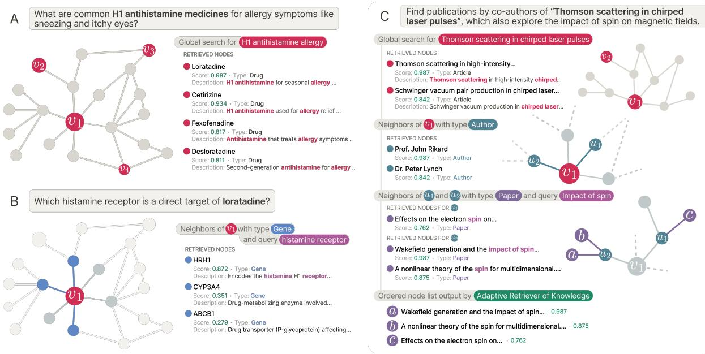
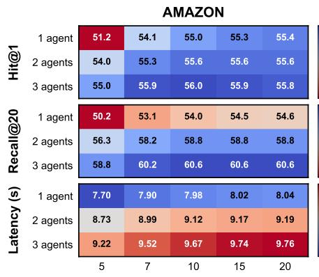
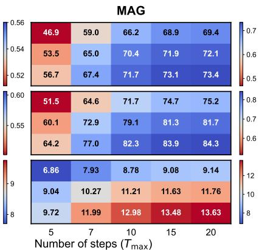
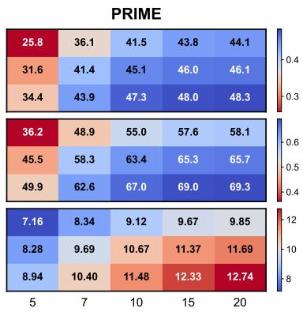
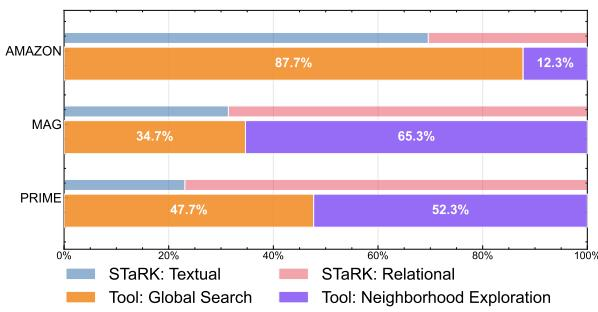
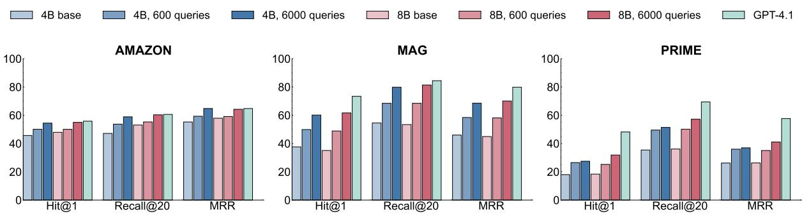
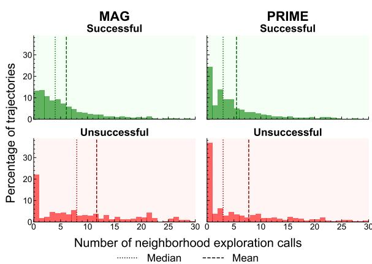

# Autonomous Knowledge Graph Exploration with Adaptive Breadth-Depth Retrieval

Joaquín Polonuer1,2,∗ , Lucas Vittor1,∗ , Iñaki Arango1,∗ , Ayush Noori1,3,∗ , David A. Clifton3,4 , Luciano Del Corro5,6,†,‡, Marinka Zitnik1,6,7,8,†,‡

1Department of Biomedical Informatics, Harvard Medical School, Boston, MA, USA 2Departamento de Computación, FCEyN, Universidad de Buenos Aires, Buenos Aires, Argentina 3Department of Engineering Science, University of Oxford, Oxford, UK 4Oxford Suzhou Centre for Advanced Research, University of Oxford, Suzhou, Jiangsu, China 5ELIAS Lab, Departamento de Ingeniería, Universidad de San Andrés, Victoria, Argentina 6Kempner Institute for the Study of Natural and Artificial Intelligence, Allston, MA, USA 7Broad Institute of MIT and Harvard, Cambridge, MA, USA 8Harvard Data Science Initiative, Cambridge, MA, USA ∗Equal contribution †Co-senior authors ‡Correspondence: delcorrol@udesa.edu.ar, marinka@hms.harvard.edu

## Abstract

Retrieving evidence for language model queries from knowledge graphs (KGs) requires balancing broad search across the graph with multi-hop traversal to follow relational links. Similarity-based retrievers provide coverage but remain shallow, whereas traversal-based methods rely on selecting seed nodes to start exploration, which can fail when queries span multiple entities and relations. We introduce ARK: ADAPTIVE RETRIEVER OF KNOWL-EDGE, a tool-using KG retriever that gives a language model control over this breadth-depth tradeoff using a two-operation toolset: global lexical search over node descriptors and onehop neighborhood exploration that composes into multi-hop traversal. ARK alternates between breadth-oriented discovery and depthoriented expansion without depending on a fragile seed selection, a pre-set hop depth, or requiring retrieval training. ARK adapts tool use to queries, using global search for language heavy queries and neighborhood exploration for relation-heavy queries. On STaRK, ARK reaches 59.1% average Hit@1 and 67.4 average MRR, improving average Hit@1 by up to 31.4% and average MRR by up to 28.0% over retrieval-based and agent-based training-free methods. Finally, we distill ARK’s tool-use trajectories from a large teacher into an 8B model via label-free imitation, improving Hit@1 by +7.0, +26.6, and +13.5 absolute points over the base 8B model on AMAZON, MAG, and PRIME datasets, respectively, while retaining up to 98.5% of the teacher’s Hit@1 rate.

## 1 Introduction

Large language models rely on knowledge retrieval to ground and align their outputs in external evidence (Ren et al., 2025; Wang et al., 2025a; Xia et al., 2025a; Zhang et al., 2024), from retrievalaugmented generation (RAG) to systems and memory modules that operate over semi-structured knowledge bases (SKB) that mix text with relational information (Lewis et al., 2020; Guu et al., 2020; Karpukhin et al., 2020; Izacard and Grave, 2021; Mavromatis and Karypis, 2025; Chen et al., 2025; Li et al., 2025c). Knowledge graphs (KGs) are a natural data representation for this setting because they organize evidence around entities and typed edges, support reuse across queries, and enforce relational constraints that a flat text index cannot express. This has motivated graph-aware retrievers and graph-grounded generation methods, including graph-based RAG and SKB retrievers that combine text and relational data (Edge et al., 2025; Zhu et al., 2025b; Xia et al., 2025b; Yao et al., 2025; Jeong et al., 2025).

Retrieving evidence from KGs is challenging because it requires coordinating two competing search modes (Wu et al., 2024b; Lee et al., 2025; Zhu et al., 2025a; Yan et al., 2026). Many queries require breadth: they mention multiple entities or loosely connected concepts, so the retriever must cover the graph broadly to reach the right region. Other queries require depth: the supporting evidence only appears after following specific multihop relational paths. Similarity-based retrievers provide global coverage but often remain shallow and underuse relational structure, whereas traversal based methods can be brittle because they must choose seed entities to start exploration; when seeds are incomplete or ambiguous, the search stays local and misses evidence elsewhere.

  
Figure 1: Overview of ADAPTIVE RETRIEVER OF KNOWLEDGE. ARK interacts with a KG through a minimal two-tool interface: (a) For text-dominant queries, ARK emphasizes breadth by issuing G S to retrieve a broad set of candidates. (b) For relation-focused queries, ARK applies NEIGHBORHOOD EXPLORATION starting from a previously retrieved node (in this case, a drug) and expanding to related entities, enabling targeted relationa retrieval. (c) For relation-dominant queries, ARK performs multi-hop retrieval by alternating GLOBAL SEARCH and NEIGHBORHOOD EXPLORATION: it retrieves an initial node (e.g., an article), expands to related entities (e.g., co-authors), and continues expanding and filtering (e.g., papers connected to each author that match query keywords) to recover an ordered set of relevant evidence.

Existing work tackles these breadth-depth requirements in isolation rather than jointly (Ko et al., 2025; Ma et al., 2025; Wang et al., 2025b). Structure-aware retrievers extend text-based retrieval with relational structure, for example, by learning node embeddings that aggregate information from nearby neighbors or by generating candidates using a local graph neighborhood before ranking them (Lee et al., 2025; Zhu et al., 2025b; Lei et al., 2025). These methods capture local structure, but they typically encode a fixed neighborhood around each node, so deeper multi-hop queries require expanding the encoded context or stacking additional message-passing and retrieval stages, which increases complexity and cost (Wan et al., 2025; Hu et al., 2025a; Verma et al., 2024). By contrast, traversal-based approaches perform multi-hop exploration, but they depend on identifying a small set of seed entities from which exploration begins (Markowitz et al., 2024; Sun et al., 2024). When seeds are incomplete or ambiguous, exploration stays local and misses relevant information elsewhere in the graph (Liu et al., 2025; Ma et al., 2025). Many systems also rely on task- or graph-specific training to learn traversal or scoring policies, which limits transfer across domains and graph schemas (Li et al., 2025a; Lei et al., 2025; Wu et al., 2024a; Yu et al., 2025). As a result, existing methods struggle to combine global search with targeted relational reasoning for adaptive retrieval.

Present work. We introduce ARK: ADAPTIVE RETRIEVER OF KNOWLEDGE, a tool-using KG retriever that gives a language model control over evidence discovery using a minimal set of tools for global lexical search and neighborhood exploration. ARK does not require selecting seed entities to start exploration or establishing a maximum hop depth in advance; instead, the model alternates between broad global search and targeted multihop traversal based on the query and what it has retrieved so far. We evaluate ARK on the heterogeneous graphs in the STaRK retrieval benchmark and show consistent gains across all settings. We further study compute-accuracy tradeoffs by varying the tool-call budget and the number of parallel agents, and we distill ARK’s tool-use policy into an 8B model via label-free trajectory imitation, preserving most of the performance of teacher model at substantially lower inference cost (Kang et al., 2025).

Our contributions are threefold. (i) We introduce ADAPTIVE RETRIEVER OF KNOWLEDGE, a training-free retrieval framework that equips language models with a minimal but expressive tool interface for adaptive retrieval from KGs. (ii) We show that ARK balances breadth-oriented retrieval with depth-oriented multi-hop traversal without task- or graph-specific training, achieving strong performance on STaRK. (iii) We distill ARK’s tooluse policy without labeled supervision into a compact Qwen3-8B model (Yang et al., 2025a; Kang et al., 2025), preserving retrieval quality while reducing inference cost.

## 2 Related Work

Knowledge graphs for document-centric RAG. Retrieval-augmented generation grounds LLM outputs in external evidence (Lewis et al., 2020; Guu et al., 2020). Recent work injects structure by building graphs to aggregate evidence. GraphRAG performs local-to-global retrieval over entity-centric graphs (Edge et al., 2025), and related methods retrieve textual subgraphs for multi-hop queries (Zhu et al., 2025b; Hu et al., 2025b; He et al., 2024; Li et al., 2025b). These approaches improve how evidence is organized but the retrieval process itself remains static.

Retrieval over semi-structured knowledge bases. Complementary to document-centric graph indices, semi-structured knowledge base retrievers directly combine text and explicit relations. KAR grounds query expansion in KG structure (Xia et al., 2025b), GraphSearch mixes graph and text channels with iterative refinement (Yang et al., 2025b) and Hyb-GRAG routes queries across a bank of retrieval modules with self-reflection (Lee et al., 2025); CoRAG highlights cooperative hybrid retrieval that preserves global semantic access beyond local neighborhoods (Zheng et al., 2025). In parallel, parametric retrievers such as MoR and mFAR learn to fuse lexical, semantic, and structural signals for ranking (Lei et al., 2025; Li et al., 2025a). Across these variants, retrieval is framed as scoring candidates from a static index. ARK differs in that retrieval is formulated as an interactive process: the model dynamically switches between global search and neighborhood expansion, guided by the query requirements and without relying on task-specific supervision.

Agents for multi-hop KG retrieval. A separate line of work treats the KG as an environment for iterative interaction. Earlier agents follow relation paths using reinforcement learning or learned policies (Das et al., 2018; Xiong et al., 2017; Sun et al., 2019; Asai et al., 2020). In the LLM era, tool-use frameworks such as ReAct (Yao et al., 2023) and prompt-optimization methods such as AvaTaR (Wu et al., 2024a) enable interactive evidence gathering. Within KG retrieval, traversal-based approaches expand from seed entities using prompted heuristics or learned policies, including Tree-of-Traversals, Think-on-Graph, and GraphFlow (Markowitz et al., 2024; Sun et al., 2024; Yu et al., 2025; Ma et al., 2025); related KG-grounded reasoning methods also emphasize multi-step planning or navigation on the KG (Luo et al., 2024; Sun et al., 2025). Traversal-based agents are effective when the correct starting entities are known, but they are prone to anchoring errors and can over-commit to local neighborhoods once exploration begins. In ARK, global search remains available throughout the trajectory, allowing the agent to retain a complete view of the KG at each step. This design enables coordination between global discovery and multihop expansion within a single retrieval. Recent work also explores using reinforcement learning to enable LLMs to explore reasoning paths over KGs (Yan et al., 2026; Wang and Yu, 2026).

Existing work varies in whether it treats retrieval as static ranking over an index or as sequential decision-making on the graph, and in whether it requires graph-specific supervision to learn a ranking function or a traversal policy. ARK adapts its search strategy online through a minimal, graphnative tool interface. It is training-free; when needed, its tool-use policy can be distilled into compact models from interaction trajectories without ground-truth relevance labels, improving efficiency while preserving retrieval quality.

## 3 Adaptive Retriever of Knowledge

We study retrieval over a knowledge graph $G = \langle V , E , \phi _ { V } , \phi _ { E } , d _ { V } \rangle$ , where V and E denote entities and edges, ϕ and ϕ assign a type to each node and relation, and $d _ { V } ( v )$ denotes the text attributes associated with node $v ,$ such as titles, descriptions, or other metadata. Given a naturallanguage query $Q ,$ retrieval is formulated as an interactive process in which an agent $\mathcal { A } = \langle \mathrm { L L M } , \mathcal { T } \rangle$ queries the graph through a tool interface $\tau$ (Yao et al., 2023; Schick et al., 2023) and produces a trajectory $\tau = \left( ( s _ { 1 } , A _ { 1 } , o _ { 1 } ) , \dots , ( s _ { T } , A _ { T } , o _ { T } ) \right)$ . At step $t , \ s _ { t }$ contains $Q$ and the interaction history, $A _ { t }$ is a sequence of tool invocations, and $O t$ is the observation returned after executing $A _ { t }$

Throughout the trajectory, the agent maintains an ordered list of retrieved nodes R. At each step, it can SELECT nodes returned by tools and append them to $\mathcal { R } ,$ or terminate by issuing a dedicated FINISH action. Execution ends either when the agent calls FINISH or when the maximum trajectory length $T _ { \mathrm { m a x } }$ is reached. The final retrieval output is the ranked list $\mathcal { R } = ( v _ { 1 } , v _ { 2 } , . . . )$ , where earlier selections receive higher rank.

To rank candidate nodes returned by tools, we use a relevance function re $( q , d _ { V } ( v ) ) \in \mathbb { R } _ { \geq 0 }$ that scores node v for a textual subquery q provided by the agent as a tool parameter. We implement rel with BM25 (Robertson and Zaragoza, 2009) over an inverted index of node textual attributes (Manning et al., 2008), yielding fast and stable scoring for the many short, evolving subqueries issued during exploration.

## 3.1 Tools

We implement the interaction described above through a small set of retrieval tools. Each tool returns a candidate set of nodes, which the agent may append to $\mathcal { R }$ or use to guide subsequent steps.

Global search retrieves the k highest-scoring nodes in the graph under rel for an agent-issued subquery q, as shown in Figure 1a:

$$
\operatorname{Search} _ {G} (q, k) := \underset {v \in V} {\text { Top - k }} \operatorname{rel} (q, d _ {V} (v))
$$

This tool provides broad entry points into the graph and is primarily used (i) to locate entities related to the user query $Q ,$ which will then be used for further exploration, and (ii) to handle cases where direct text matching suffices without requiring multi-hop reasoning.

Neighborhood exploration returns adjacent nodes of a node v filtered by optional node and edge type constraints $F : = \left( F _ { V } , F _ { E } \right)$ selected by the agent as tool parameters, and optionally ranked using an agent-generated subquery q (Figure 1b).

The filtered one-hop neighborhood $N _ { F }$ of a node v is defined as:

$$
N _ {F} (v) := \left\{u \in N (v) \left| \begin{array}{l} \phi_ {V} (u) \in F _ {V}, \\ \phi_ {E} (\{u, v \}) \in F _ {E} \end{array} \right. \right\}
$$

where $N ( v )$ denotes the open neighborhood of v and $\{ u , v \}$ denotes the edge connecting v and $u ,$ regardless of direction. Edge directionality and relation types are exposed in the tool output. To control the size of the retrieved neighborhood, we introduce a fixed retrieval budget $k \in \mathbb N \cdot$

$$
\text { Neighbors } (v, q, F) := \underset {u \in N _ {F} (v)} {\text { Top - k }} \text { rel } (q, d _ {V} (u))
$$

Each call to Neighbors retrieves a single-hop neighborhood. The agent performs multi-hop retrieval by calling this operator multiple times in sequence, optionally interleaved with global reanchoring (Figure 1c). The number of hops is not fixed in advance; the agent decides when to stop expanding based on what it has retrieved so far.

## 3.2 Parallel Exploration

We increase robustness by running n independent instances of the same agent in parallel and aggregating their retrieved lists, akin to self-consistency and voting-based ensembling in LLM reasoning (Wang et al., 2023; Kaesberg et al., 2025). Each agent produces an ordered list of retrieved nodes $\bar { \mathcal { R } } ^ { ( i ) } = ( v _ { 1 } ^ { ( i ) } , v _ { 2 } ^ { ( i ) } , \ldots )$ from an independent trajectory. We then combine these lists using a simple rank-fusion rule inspired by classical rank aggregation and data fusion methods (Fagin et al., 2003; Cormack et al., 2009).

Concretely, we concatenate the per-agent lists in agent order to form:

$$
L := \mathcal {R} ^ {(1)} \| \mathcal {R} ^ {(2)} \| \dots \| \mathcal {R} ^ {(n)},
$$

and let $\mathcal { V } _ { L }$ be the set of unique nodes in $L .$ . The final ranking R orders nodes by decreasing frequency in L (vote count), breaking ties by the earliest position at which a node appears in any trajectory, favoring nodes discovered earlier during exploration.

## 3.3 Agent Distillation

While ARK operates on off-the-shelf models, its behavior can be distilled into a smaller language model to reduce inference cost and latency (Hinton et al., 2015). We adopt a standard teacher–student paradigm in which a student model imitates the tool-usage trajectories of a stronger teacher LLM via supervised fine-tuning (Schick et al., 2023).

Trajectory generation. For each training query Q on a given graph G, we run the teacher agent to collect trajectories τ as defined in Section 3. Each trajectory contains the full interaction record: the agent’s tool calls and parameters interleaved with the resulting tool observations.

Training objective. The student is trained with next-token prediction on the collected trajectories (Ouyang et al., 2022). We compute loss only on assistant-authored tokens; user messages and tool outputs are masked (Huerta-Enochian and Ko, 2024; Shi et al., 2024). This trains the student to reproduce the teacher’s decisions, which tools to invoke and how to parameterize them, while tool execution remains external to the model.

Label-free supervision. Importantly, distillation does not require ground-truth evidence nodes for queries. Supervision is derived solely from teacher trajectories, making the approach applicable in realistic settings where relevance labels are unavailable: one can run a strong teacher to generate trajectories on a target graph and then fine-tune a smaller model directly from these interactions (Schick et al., 2023; Kang et al., 2025).

## 4 Experimental Setup

We measure retrieval performance on STaRK, a benchmark for entity-level retrieval over heterogeneous, text-rich KGs (Wu et al., 2024b).

## 4.1 Benchmark

STaRK comprises three large, heterogeneous knowledge graphs. AMAZON is an e-commerce graph with roughly 1M entities and 9.4M relations, constructed from Amazon metadata, reviews (He and McAuley, 2016), and question–answer pairs (McAuley et al., 2015). MAG is a scholarly graph with 1.9M entities and 39.8M relations derived from the Microsoft Academic Graph (Wang et al., 2020). PRIME is a biomedical graph built from PrimeKG (Chandak et al., 2023), containing 129K entities and 8.1M relations. Each node is associated with text-rich attributes, making STaRK a natural testbed for hybrid retrieval over structured and textual signals. Given a query, the retriever must return a ranked list of nodes that support the answer. We report agent configuration and hyperparameters in Appendix A.2.

## 4.2 Baselines and metrics

We compare with representative retrieval-based and agent-based baselines, focusing on methods that report results on all three graphs, as our goal is to evaluate performance consistently across different regimes and assess generality.

Retrieval-based. BM25 (Robertson and Zaragoza, 2009) is the same sparse, lexical retriever used for global search. We also include dense embedding retrievers that rank nodes by cosine similarity, using ada-002 and GritLM-7B, an instruction-tuned 7B encoder (Muennighoff et al., 2025). mFAR (Li et al., 2025a) is a multi-field adaptive retriever that combines keyword matching with embedding similarity to learn query-dependent weights over different node fields. KAR (Xia et al., 2025b) augments queries with knowledge-aware expansions and applies relation-type constraints during retrieval. MoR (Lei et al., 2025) is a trained retriever that combines multiple retrieval objectives.

Agent-based. Think-on-Graph (Sun et al., 2024) is a training-free LLM agent that iteratively expands paths in the graph using beam search. GraphFlow (Yu et al., 2025) learns a policy for generating multi-hop retrieval trajectories using GFlowNets (Bengio et al., 2021). AvaTaR (Wu et al., 2024a) is a tool-using agent that optimizes prompting from positive and negative trajectories.

Results for KAR, mFAR, MoR, AvaTaR, and GraphFlow are reported as in their respective papers, which evaluate on the official STaRK splits and metrics. For Think-on-Graph, we report the numbers provided in the GraphFlow study, which includes a direct comparison to Think-on-Graph under the same STaRK setup (Yu et al., 2025; Sun et al., 2024).

Metrics. We follow the STaRK protocol and report Hit@1, Hit@5, Recall@20 (R@20), and Mean Reciprocal Rank (MRR), which capture top-rank precision, coverage of the ground-truth set, and overall ranking quality. Note that Hit@5 is reported in Table 5 in the Appendix.

Backbones. Our primary configuration uses GPT-4.1 as the backbone LLM throughout the paper. Appendix Table 5 additionally reports results with GPT-4o for comparability with prior KG retrievers such as KAR and Think-on-Graph, and with GPT-5.2 to verify that the retrieval interface transfers to a newer backbone on the same splits.

<table><tr><td rowspan="2">Category</td><td rowspan="2">Method</td><td colspan="3">AMAZON</td><td colspan="3">MAG</td><td colspan="3">PRIME</td><td colspan="3">Average</td></tr><tr><td>Hit@1</td><td>R@20</td><td>MRR</td><td>Hit@1</td><td>R@20</td><td>MRR</td><td>Hit@1</td><td>R@20</td><td>MRR</td><td>Hit@1</td><td>R@20</td><td>MRR</td></tr><tr><td rowspan="9">Training-free</td><td>Retrieval-based</td><td></td><td></td><td></td><td></td><td></td><td></td><td></td><td></td><td></td><td></td><td></td><td></td></tr><tr><td>BM25</td><td>44.94</td><td>53.77</td><td>55.30</td><td>25.85</td><td>45.69</td><td>34.91</td><td>12.75</td><td>31.25</td><td>19.84</td><td>27.85</td><td>43.57</td><td>36.68</td></tr><tr><td>ada-002</td><td>39.16</td><td>53.29</td><td>50.35</td><td>29.08</td><td>48.36</td><td>38.62</td><td>12.63</td><td>36.00</td><td>21.41</td><td>26.96</td><td>45.88</td><td>36.79</td></tr><tr><td>GritLM-7B</td><td>42.08</td><td>56.52</td><td>53.46</td><td>37.90</td><td>46.40</td><td>47.25</td><td>15.57</td><td>39.09</td><td>24.11</td><td>31.85</td><td>47.34</td><td>41.61</td></tr><tr><td>KAR</td><td>54.20</td><td>57.24</td><td>61.29</td><td>50.47</td><td>60.28</td><td>57.51</td><td>30.35</td><td>50.81</td><td>39.22</td><td>45.01</td><td>56.11</td><td>52.67</td></tr><tr><td>Agent-based</td><td></td><td></td><td></td><td></td><td></td><td></td><td></td><td></td><td></td><td></td><td></td><td></td></tr><tr><td>Think-on-Graph + GPT-4o</td><td>20.67</td><td>25.81</td><td>30.90</td><td>23.33</td><td>48.03</td><td>36.38</td><td>16.67</td><td>54.35</td><td>27.02</td><td>20.22</td><td>42.73</td><td>31.43</td></tr><tr><td>Think-on-Graph + LLaMA3</td><td>4.21</td><td>2.61</td><td>5.25</td><td>12.00</td><td>6.77</td><td>12.67</td><td>21.92</td><td>33.84</td><td>26.61</td><td>12.71</td><td>14.41</td><td>14.84</td></tr><tr><td>ARK</td><td>55.82</td><td>60.61</td><td>64.77</td><td>73.40</td><td>84.47</td><td>79.87</td><td>48.20</td><td>69.46</td><td>57.68</td><td>59.14</td><td>71.51</td><td>67.44</td></tr><tr><td rowspan="7">Requires training on target graph</td><td>Retrieval-based</td><td></td><td></td><td></td><td></td><td></td><td></td><td></td><td></td><td></td><td></td><td></td><td></td></tr><tr><td>mFAR</td><td>53.0</td><td>66.3</td><td>64.3</td><td>55.9</td><td>74.1</td><td>64.3</td><td>40.0</td><td>72.6</td><td>52.0</td><td>49.63</td><td>71.00</td><td>60.20</td></tr><tr><td>MoR</td><td>52.19</td><td>59.92</td><td>62.24</td><td>58.19</td><td>75.01</td><td>67.14</td><td>36.41</td><td>63.48</td><td>46.92</td><td>48.93</td><td>66.14</td><td>58.77</td></tr><tr><td>Agent-based</td><td></td><td></td><td></td><td></td><td></td><td></td><td></td><td></td><td></td><td></td><td></td><td></td></tr><tr><td>GraphFlow</td><td>47.85</td><td>36.15</td><td>55.49</td><td>39.09</td><td>57.18</td><td>47.82</td><td>51.39</td><td>79.71</td><td>61.37</td><td>46.11</td><td>57.68</td><td>54.89</td></tr><tr><td>AvaTaR</td><td>49.90</td><td>60.60</td><td>58.70</td><td>44.36</td><td>50.63</td><td>51.15</td><td>18.40</td><td>39.30</td><td>26.73</td><td>37.55</td><td>50.18</td><td>45.53</td></tr><tr><td>ARK distilled</td><td>54.99</td><td>60.31</td><td>64.24</td><td>61.66</td><td>81.39</td><td>70.09</td><td>31.87</td><td>57.22</td><td>41.08</td><td>49.51</td><td>66.31</td><td>58.47</td></tr></table>

Table 1: Retrieval performance on STaRK synthetic test sets. Dark green and light green indicate best and second-best in the training-free category, respectively. Dark blue and light blue indicate best and second-best in the requires-training category, respectively. Bold indicates the best result overall for each metric column.

## 4.3 Distillation Setup

For each graph, we collect teacher trajectories on the training split to distill ARK into a smaller, lower-cost model (Section 3.3), offering a viable alternative when under tighter compute budgets. Using GPT-4.1 as the teacher, we run ARK three times per training query with stochastic decoding (temperature = 0.7), producing three trajectories per query. We cap the distillation budget by subsampling up to 6,000 training queries per graph, yielding at most 18,000 trajectories per graph (full statistics in Table 6) and summing to 94.4 million tokens. Each trajectory is limited to $T _ { \mathrm { m a x } } { = } 2 0$ steps and ends when the agent issues FINISH or reaches the step limit. We apply no trajectory filtering or rejection sampling, preserving a label-free setting. We then distill a Qwen3-8B (Yang et al., 2025a) student via supervised fine-tuning with LoRA adapters (Hu et al., 2021), using next-token prediction over assistant-authored tokens only. We train for one epoch with a 16,384-token context length using AdamW (Loshchilov and Hutter, 2019) at learning rate $1 \times 1 0 ^ { - 5 }$ , selecting checkpoints via early stopping on the official validation split. Training runs on a single NVIDIA H100 GPU and completes in approximately five hours.

## 5 Results

## 5.1 Benchmarking

Table 1 reports retrieval performance on STaRK, grouped by training regime. Across all methods assessed, ARK achieves the best average performance.

Classical retrievers remain strong baselines on AMAZON, when queries are predominantly descriptive. By incorporating local structural cues, KAR improves over lexical methods, but its shallow neighborhood expansion is limited on multihop queries (Xia et al., 2025b).

Think-on-Graph and GraphFlow highlight the benefits of multi-hop traversal, performing well on PRIME. Think-on-Graph is appealing due to its training-free setup, and GraphFlow shows that strong performance can be achieved with smaller backbones through reinforcement learning. However, both degrade on AMAZON’s text-heavy, broad queries, as they lack global search primitives and can be sensitive to brittle anchoring and entity identification (Sun et al., 2024; Yu et al., 2025).

ARK performs consistently across regimes and is especially strong on MAG. This pattern aligns with its tool design. Global search offers a reliable anchor for text-heavy queries and supports strong top-rank accuracy on AMAZON. Typed, queryranked one-hop expansion enables controlled multihop evidence gathering in relational settings, contributing to the best results on MAG and solid performance on PRIME, where it is surpassed only by the RL-trained GraphFlow.

While ARK uses a large backbone, the distilled variant preserves most of these gains with a substantially smaller Qwen3-8B model via label-free trajectory imitation (Section 5.7).

## 5.2 Text vs. Relational Adaptive Retrieval

STaRK reports, for each graph, the average share of queries that are primarily textual versus primarily relational (multi-hop) (Fig. 5 in Wu et al. (2024b)). We use these proportions as a reference and compare them to ARK’s tool-call allocation on our evaluation split. Concretely, we treat the fraction of global search calls as a proxy for text-centric evidence use and the fraction of neighborhood exploration calls as a proxy for relation-centric evidence. Figure 3 shows a proportional match: on AMA-ZON, where queries are mostly textual, ARK relies almost entirely on global search (87.7%), whereas on MAG and PRIME, where relational requirements dominate, ARK shifts toward neighborhood exploration to traverse multi-hop evidence (65.3% and 52.3%, respectively). Appendix A.4 complements this call-frequency view with trajectory-level statistics on re-anchoring after the first step and on tool mixing among successful runs.

Figure 2: Retrieval quality and latency as a function of inference-time budget. Heatmaps report Hit@1, Recall@20, and end-to-end latency (seconds) on each STaRK graph. Moving from the top left (shallow trajectories, single agent) to the bottom right (deeper trajectories, multi-agent) allocates more compute and improves retrieval performance at the cost of higher latency. Color scales are normalized within each graph and metric for readability.  
  
Figure 3: Thin bars show the share of text- vs. relationcentric queries in STaRK; thick bars show ARK’s toolcall use. These STaRK annotations are not provided to ARK; instead, ARK autonomously shifts tool use to match the dominant query type.

## 5.3 Impact of Toolset Design

We conduct various ablation studies to assess the impact of toolset design choices. Table 2 demonstrates that neighborhood exploration is the main source of gains on relational, multi-hop queries. Removing this tool decreases performance on MAG and PRIME as the system is then limited to global lexical search without graph traversal. On AMA-ZON, performance drops more moderately and moves toward lexical baselines (Table 1).

<table><tr><td rowspan="2">Setup</td><td colspan="2">AMAZON</td><td colspan="2">MAG</td><td colspan="2">PRIME</td></tr><tr><td>Hit@1</td><td>R@20</td><td>Hit@1</td><td>R@20</td><td>Hit@1</td><td>R@20</td></tr><tr><td>Full</td><td>58.5</td><td>60.2</td><td>79.2</td><td>83.3</td><td>49.2</td><td>73.3</td></tr><tr><td>w/o Neighbors</td><td>54.5</td><td>55.4</td><td>30.5</td><td>39.4</td><td>23.1</td><td>40.5</td></tr><tr><td>Neighbors w/o q</td><td>56.0</td><td>57.9</td><td>72.1</td><td>79.8</td><td>44.7</td><td>68.3</td></tr><tr><td>Neighbors w/o F</td><td>55.5</td><td>59.9</td><td>79.2</td><td>84.8</td><td>42.2</td><td>65.0</td></tr></table>

Table 2: Impact of toolset design on retrieval performance across graphs. w/o Neighbors removes neighborhood exploration entirely. Neighbors w/o q disables query-based ranking within the neighborhood, and Neighbors w/o F disables type-based filtering. Results are reported on a random 10% subset of the test split.

We further separate two complementary controls in neighborhood exploration. Disabling querybased ranking causes smaller but consistent drops, suggesting that lexical matching within a local neighborhood helps surface relevant neighbors and prevents drift toward high-degree distractors. Disabling type-based filtering is more detrimental, especially in heterogeneous graphs such as PRIME (Table 7). In such environments, type constraints are important to direct the agent towards semantically relevant edges and nodes, preventing search from drifting into unrelated parts of the graph.

Note that we do not ablate global search because it is required: it maps query text to candidate nodes and provides the node identifiers needed to start neighborhood expansion. Without this initial anchor, the agent cannot reliably enter the right part of the graph, so the system fails outright.

  
Figure 4: Evaluation of the same ARK pipeline on the STaRK test sets while varying the underlying model and the distillation budget. “600 queries” and “6000 queries” denote Qwen backbones fine-tuned on trajectories generated by GPT-4.1 from 600 or 6000 training queries per graph, respectively (three trajectories per query; tool calls and observations only; no label supervision).

## 5.4 Compute-Performance Trade-offs

We next study how retrieval quality scales with the inference-time budget. Figure 2 shows that performance improves monotonically as compute increases, moving from single-agent settings to parallel multi-agent configurations. We also report a single-agent vs. multi-agent comparison under the same total step budget in Appendix A.3.

Additional compute helps most on queries that require multi-hop expansion, and yields smaller gains when global lexical search is already sufficient. Parallelization yields performance benefits with minimal overhead. Increasing the agent count, particularly the transition from one to two agents, results in substantial gains while only modestly increasing latency. Because agents run independently, end-to-end latency is determined by the bottleneck of the slowest agent rather than the cumulative runtime of all agents.

ARK provides an interpretable budgetperformance landscape. Practitioners can fix a latency or compute budget and choose an operating point in Figure 2 that matches their needs, trading off depth and parallelism to balance quality and cost across graph regimes.

## 5.5 Aggregation Strategy Comparison

Aggregation quality also matters once multiple trajectories have been collected. Table 3 compares our voting rule against two simpler ways of combining the outputs of three agents. Voting consistently outperforms both ordering-based merging and random merging, with the largest gains on MAG and PRIME. This supports the view that parallel exploration helps not only by increasing sampling diversity, but also by exposing a stable consensus signal over retrieved nodes.

<table><tr><td rowspan="2">Setup</td><td colspan="2">AMAZON</td><td colspan="2">MAG</td><td colspan="2">PRIME</td></tr><tr><td>Hit@1</td><td>R@20</td><td>Hit@1</td><td>R@20</td><td>Hit@1</td><td>R@20</td></tr><tr><td>Voting</td><td>55.82</td><td>60.61</td><td>73.40</td><td>84.47</td><td>48.20</td><td>69.46</td></tr><tr><td>Ordering</td><td>55.39</td><td>60.06</td><td>71.24</td><td>84.15</td><td>44.70</td><td>68.78</td></tr><tr><td>Random</td><td>17.65</td><td>57.55</td><td>38.04</td><td>83.03</td><td>26.30</td><td>67.50</td></tr></table>

Table 3: Comparison of strategies for aggregating the outputs of three parallel agents. Voting ranks nodes by frequency across trajectories and breaks ties by earliest occurrence. Ordering concatenates trajectories and keeps first appearance, while Random shuffles the union of retrieved nodes.

5.6 Relevance Function (Lexical vs. Dense)

<table><tr><td rowspan="2">Setup</td><td colspan="2">AMAZON</td><td colspan="2">MAG</td><td colspan="2">PRIME</td></tr><tr><td>Hit@1</td><td>R@20</td><td>Hit@1</td><td>R@20</td><td>Hit@1</td><td>R@20</td></tr><tr><td>BM25</td><td>55.82</td><td>60.61</td><td>73.40</td><td>84.47</td><td>48.20</td><td>69.46</td></tr><tr><td>Dense</td><td>47.13</td><td>58.13</td><td>75.88</td><td>85.11</td><td>43.23</td><td>68.58</td></tr></table>

Table 4: BM25 vs. dense retrieval inside ARK on the full STaRK synthetic test sets. The dense retriever uses text-embedding-3-large.

The relevance function rel used to rank candidate nodes for agent-issued subqueries (Section 3) can be implemented with either lexical (BM25) or dense retrieval. Table 4 compares the two options inside ARK. BM25 is notably more precise on AMAZON and PRIME, while differences on MAG are marginal in both directions. This suggests that the advantage of dense retrieval in singlepass settings does not directly carry over to iterative retrieval: the agent can compensate for weaker lexical matching by issuing refined subqueries over successive steps and by discovering relevant nodes through neighborhood exploration rather than text similarity alone.

## 5.7 Impact of Distillation

We also study how the distillation budget affects final performance. Figure 4 compares Qwen3-4B and Qwen3-8B students trained on increasing numbers of teacher trajectories across the three STaRK graphs; full results for all metrics are in Table 5.

Distillation is data-efficient: using 10% of the trajectories recovers roughly half of the total improvement achieved with the full training set. This makes distillation practical when collecting trajectories is costly. In our setup, distilling the 600- query setting can be done in 30 minutes on a single H100 GPU.

Student size matters most on PRIME. Because base models perform poorly in this regime, distillation is more important, and the teacher-student gap is the largest. The stronger performance of the 8B student suggests that higher-capacity models better absorb the long-horizon, high-branching exploration patterns required for complex biomedical reasoning in PRIME.

## 5.8 Neighborhood Exploration vs. Retrieval

  
Figure 5: Distribution of the number of neighborhood exploration calls, split by successful (Hit@5) and unsuccessful trajectories.

We next examine how neighborhood exploration relates to retrieval success on MAG and PRIME. Here, successful trajectories refers to the runs (i.e., tool call sequences) that retrieve the correct nodes and therefore score as correct on the retrieval metric for that query. Figure 5 shows two failure modes. First, many failed runs make no neighborhood calls at all, suggesting the agent does not recognize when relational evidence is needed and never moves beyond global anchoring into multi-hop expansion. Second, failed runs also show a long tail with many neighborhood calls, indicating the opposite problem: the agent keeps expanding without converging on relevant support, consistent with drift in highbranching parts of the graph.

In contrast, successful trajectories use neighborhood exploration sparingly, rarely exceeding ten calls, suggesting that strong retrieval relies on selective expansion rather than indiscriminate multi-hop traversal. These results underscore the need for retrieval methods like ARK that balance the breadthdepth tradeoff: when ARK succeeds, it adaptively switches from global anchoring to neighborhood expansion, and it stops expanding once it has found the needed support.

## 6 Conclusion

We introduced ADAPTIVE RETRIEVER OF KNOWLEDGE, a training-free retrieval framework that exposes knowledge graphs through a minimal set of primitives for global search and local relational expansion. Across all three STaRK graphs, ARK achieves strong and stable retrieval performance while exhibiting a clear and interpretable inference-time budget–performance tradeoff. We further show that this adaptive retrieval behavior can be transferred to a compact backbone via label-free trajectory distillation with modest data and compute, preserving nearly all of the teacher’s performance. Together, these results indicate that adaptive graph retrieval can be both practical and modular, and that exposing a small set of well-chosen retrieval operations is sufficient to unlock robust, general-purpose knowledge graph retrieval.

## 7 Limitations

Despite strong retrieval performance, ARK has limitations. First, agentic retrieval incurs higher latency than single-pass retrievers because it requires multiple LLM calls over an interaction trajectory. Larger budgets improve retrieval quality but also increase runtime. Second, our best-performing configuration relies on a large proprietary LLM, which can constrain scalability due to cost and availability. While ARK is LLM-agnostic, retrieval quality can drop with smaller models; we partially mitigate this via trajectory distillation into Qwen3-8B (Yang et al., 2025a), though distilled agents still trail the teacher on challenging regimes. Third, ARK assumes that node descriptors and relation information are sufficiently informative for BM25 global search and for ranking neighborhood expansions. Sparse or templated text can prevent the agent from locating relevant seed nodes or disambiguating them. Because the global search is lexical, mismatches in vocabulary (e.g., paraphrases and domain-specific aliases) can cause under-retrieval. Fourth, our evaluation is centered on text-rich KG benchmarks, so performance gains may not transfer to graphs with limited text descriptions.

Although ARK is a general retrieval approach, agentic graph exploration can create risks if used without safeguards. Retrieval errors can be treated as support for downstream decisions, and interaction traces may expose sensitive attributes if node text contains private information. Mitigation requires redaction for sensitive fields and bias audits prior to deployment.

## 8 Ethical Considerations

This study does not use human annotators, crowdworkers, or research with human participants. Ethical concerns arise in downstream use of agentic retrieval over text-rich knowledge graphs. Retrieval errors can be treated as evidence and multi-step exploration can surface sensitive attributes present in graph text. The approach may also amplify biases in the underlying graph. If some languages and communities have sparse descriptions or different naming conventions, global lexical search and neighborhood ranking may under-retrieve relevant information, leading to unequal coverage across groups and reduced benefits for underrepresented stakeholders. We recommend safeguards before deployment, including redaction of sensitive fields and bias audits. Potential positive impact includes improving access to large knowledge graphs for language models, including information that may be difficult to access with text retrieval alone.

## 9 Code Availability

All code used in this study is publicly available at https://github.com/mims-harvard/ark. A terminal-based chat implementation of ARK is at https://github.com/mims-harvard/ark-age nt-cli.

## Acknowledgments

We gratefully acknowledge the support of NSF CAREER 2339524, ARPA-H Biomedical Data

Fabric (BDF) Toolbox Program, Harvard Data Science Initiative, Amazon Faculty Research, Google Research Scholar Program, AstraZeneca Research, Roche Alliance with Distinguished Scientists (ROADS) Program, Sanofi iDEA-iTECH Award, GlaxoSmithKline Award, Boehringer Ingelheim Award, Merck Award, Optum AI Research Collaboration Award, Pfizer Research, Gates Foundation (INV-079038), Aligning Science Across Parkinson’s Initiative (ASAP), Chan Zuckerberg Initiative, John and Virginia Kaneb Fellowship at Harvard Medical School, Biswas Computational Biology Initiative in partnership with the Milken Institute, Harvard Medical School Dean’s Innovation Fund for the Use of Artificial Intelligence, and the Kempner Institute for the Study of Natural and Artificial Intelligence at Harvard University. A.N. was supported by the Rhodes Scholarship. D.A.C. was funded by an NIHR Research Professorship (NIHR302440), a Royal Academy of Engineering Research Chair, and the InnoHK Hong Kong Centre for Cerebro-Cardiovascular Engineering, and was supported by the National Institute for Health Research Oxford Biomedical Research Centre and the Pandemic Sciences Institute at the University of Oxford. Any opinions, findings, conclusions, or recommendations expressed in this material are those of the authors and do not necessarily reflect the views of the funders.

## References

Akari Asai, Kazuma Hashimoto, Hannaneh Hajishirzi, Richard Socher, and Caiming Xiong. 2020. Learning to Retrieve Reasoning Paths over Wikipedia Graph for Question Answering. arXiv preprint. ArXiv:1911.10470 [cs].

Emmanuel Bengio, Moksh Jain, Maksym Korablyov, Doina Precup, and Yoshua Bengio. 2021. Flow Network based Generative Models for Non-Iterative Diverse Candidate Generation. arXiv preprint. Version Number: 2.

Payal Chandak, Kexin Huang, and Marinka Zitnik. 2023. Building a knowledge graph to enable precision medicine. Scientific Data, 10(1):67. Publisher: Nature Publishing Group.

Jialin Chen, Houyu Zhang, Seongjun Yun, Alejandro Mottini, Rex Ying, Xiang Song, Vassilis N. Ioannidis, Zheng Li, and Qingjun Cui. 2025. GRIL: Knowledge Graph Retrieval-Integrated Learning with Large Language Models. In Findings of the Association for Computational Linguistics: EMNLP 2025, pages 16306–16319, Suzhou, China. Association for Computational Linguistics.

Gordon V. Cormack, Charles L A Clarke, and Stefan Buettcher. 2009. Reciprocal rank fusion outperforms condorcet and individual rank learning methods. In Proceedings of the 32nd international ACM SIGIR conference on Research and development in informa tion retrieval, SIGIR ’09, pages 758–759, New York, NY, USA. Association for Computing Machinery.

Rajarshi Das, Shehzaad Dhuliawala, Manzil Zaheer, Luke Vilnis, Ishan Durugkar, Akshay Krishnamurthy, Alex Smola, and Andrew McCallum. 2018. Go for a Walk and Arrive at the Answer: Reasoning Over Paths in Knowledge Bases using Reinforcement Learning. arXiv preprint. ArXiv:1711.05851 [cs].

Darren Edge, Ha Trinh, Newman Cheng, Joshua Bradley, Alex Chao, Apurva Mody, Steven Truitt, Dasha Metropolitansky, Robert Osazuwa Ness, and Jonathan Larson. 2025. From Local to Global: A Graph RAG Approach to Query-Focused Summarization. arXiv preprint. ArXiv:2404.16130 [cs].

Ronald Fagin, Ravi Kumar, and D. Sivakumar. 2003. Efficient similarity search and classification via rank aggregation. In Proceedings of the 2003 ACM SIG-MOD international conference on Management of data, SIGMOD ’03, pages 301–312, New York, NY, USA. Association for Computing Machinery.

Kelvin Guu, Kenton Lee, Zora Tung, Panupong Pasupat, and Ming-Wei Chang. 2020. REALM: retrievalaugmented language model pre-training. In Proceedings of the 37th International Conference on Machine Learning, volume 119 of ICML’20, pages 3929–3938. JMLR.org.

Ruining He and Julian McAuley. 2016. Ups and Downs: Modeling the Visual Evolution of Fashion Trends with One-Class Collaborative Filtering. In Proceedings of the 25th International Conference on World Wide Web, WWW ’16, pages 507–517, Republic and Canton of Geneva, CHE. International World Wide Web Conferences Steering Committee.

Xiaoxin He, Yijun Tian, Yifei Sun, Nitesh V. Chawla, Thomas Laurent, Yann LeCun, Xavier Bresson, and Bryan Hooi. 2024. G-Retriever: Retrieval-Augmented Generation for Textual Graph Understanding and Question Answering. arXiv preprint. ArXiv:2402.07630 [cs].

Geoffrey Hinton, Oriol Vinyals, and Jeff Dean. 2015. Distilling the Knowledge in a Neural Network. arXiv preprint. ArXiv:1503.02531 [stat].

Edward J. Hu, Yelong Shen, Phillip Wallis, Zeyuan Allen-Zhu, Yuanzhi Li, Shean Wang, Lu Wang, and Weizhu Chen. 2021. LoRA: Low-Rank Adaptation of Large Language Models. arXiv preprint. ArXiv:2106.09685 [cs].

Yikuan Hu, Jifeng Zhu, Lanrui Tang, and Chen Huang. 2025a. ReMindRAG: low-cost LLM-guided knowl edge graph traversal for efficient RAG. NeurIPS.

Yuntong Hu, Zhihan Lei, Zheng Zhang, Bo Pan, Chen Ling, and Liang Zhao. 2025b. GRAG: Graph Retrieval-Augmented Generation. In Findings of the Association for Computational Linguistics: NAACL 2025, pages 4145–4157, Albuquerque, New Mexico. Association for Computational Linguistics.

Mathew Huerta-Enochian and Seung Yong Ko. 2024. Instruction Fine-Tuning: Does Prompt Loss Matter? In Proceedings of the 2024 Conference on Empirical Methods in Natural Language Processing, pages 22771–22795, Miami, Florida, USA. Association for Computational Linguistics.

Gautier Izacard and Edouard Grave. 2021. Leveraging Passage Retrieval with Generative Models for Open Domain Question Answering. In Proceedings of the 16th Conference of the European Chapter of the Association for Computational Linguistics: Main Volume, pages 874–880, Online. Association for Computational Linguistics.

Soyeong Jeong, Jinheon Baek, Sukmin Cho, Sung Ju Hwang, and Jong C Park. 2025. Database-augmented query representation for information retrieval. In Proceedings of the 2025 Conference on Empirical Methods in Natural Language Processing, pages 16622– 16644.

Lars Benedikt Kaesberg, Jonas Becker, Jan Philip Wahle, Terry Ruas, and Bela Gipp. 2025. Voting or Consensus? Decision-Making in Multi-Agent Debate. In Findings of the Association for Computational Linguistics: ACL 2025, pages 11640–11671. ArXiv:2502.19130 [cs].

Minki Kang, Jongwon Jeong, Seanie Lee, Jaewoong Cho, and Sung Ju Hwang. 2025. Distilling LLM Agent into Small Models with Retrieval and Code Tools. arXiv preprint. ArXiv:2505.17612 [cs].

Vladimir Karpukhin, Barlas Oguz, Sewon Min, Patrick Lewis, Ledell Wu, Sergey Edunov, Danqi Chen, and Wen-tau Yih. 2020. Dense Passage Retrieval for Open-Domain Question Answering. In Proceedings of the 2020 Conference on Empirical Methods in Natural Language Processing (EMNLP), pages 6769– 6781, Online. Association for Computational Linguistics.

Youmin Ko, Sungjong Seo, and Hyunjoon Kim. 2025. Cooperative retrieval-augmented generation for question answering: Mutual information exchange and ranking by contrasting layers. In NeurIPS.

Meng-Chieh Lee, Qi Zhu, Costas Mavromatis, Zhen Han, Soji Adeshina, Vassilis N. Ioannidis, Huzefa Rangwala, and Christos Faloutsos. 2025. HybGRAG: Hybrid Retrieval-Augmented Generation on Textual and Relational Knowledge Bases. In Proceedings of the 63rd Annual Meeting of the Association for Computational Linguistics (Volume 1: Long Papers), pages 879–893, Vienna, Austria. Association for Computational Linguistics.

Yongjia Lei, Haoyu Han, Ryan A. Rossi, Franck Dernoncourt, Nedim Lipka, Mahantesh M Halappanavar, Jiliang Tang, and Yu Wang. 2025. Mixture of Structuraland-Textual Retrieval over Text-rich Graph Knowledge Bases. In Findings of the Association for Computational Linguistics: ACL 2025, pages 18306– 18321, Vienna, Austria. Association for Computational Linguistics.

Patrick Lewis, Ethan Perez, Aleksandra Piktus, Fabio Petroni, Vladimir Karpukhin, Naman Goyal, Heinrich Küttler, Mike Lewis, Wen-tau Yih, Tim Rock täschel, Sebastian Riedel, and Douwe Kiela. 2020. Retrieval-augmented generation for knowledgeintensive NLP tasks. In Proceedings of the 34th International Conference on Neural Information Processing Systems, NIPS ’20, pages 9459–9474, Red Hook, NY, USA. Curran Associates Inc.

Millicent Li, Tongfei Chen, Benjamin Van Durme, and Patrick Xia. 2025a. Multi-Field Adaptive Retrieval. arXiv preprint. ArXiv:2410.20056 [cs].

Mufei Li, Siqi Miao, and Pan Li. 2025b. Simple Is Effective: The Roles of Graphs and Large Language Models in Knowledge-Graph-Based Retrieval-Augmented Generation. arXiv preprint. ArXiv:2410.20724 [cs].

Xiaoxi Li, Jiajie Jin, Yujia Zhou, Yongkang Wu, Zhonghua Li, Ye Qi, and Zhicheng Dou. 2025c. RetroLLM: Empowering large language models to retrieve fine-grained evidence within generation. In Proceedings of the 63rd Annual Meeting of the Association for Computational Linguistics (Volume 1: Long Papers), pages 16754–16779.

Runxuan Liu, Luobei Luobei, Jiaqi Li, Baoxin Wang, Ming Liu, Dayong Wu, Shijin Wang, and Bing Qin. 2025. Ontology-guided reverse thinking makes large language models stronger on knowledge graph question answering. In Proceedings of the 63rd Annual Meeting of the Association for Computational Linguistics (Volume 1: Long Papers), pages 15269– 15284.

Ilya Loshchilov and Frank Hutter. 2019. Decoupled Weight Decay Regularization. arXiv preprint. ArXiv:1711.05101 [cs].

Linhao Luo, Yuan-Fang Li, Gholamreza Haffari, and Shirui Pan. 2024. Reasoning on Graphs: Faithful and Interpretable Large Language Model Reasoning. arXiv preprint. ArXiv:2310.01061 [cs].

Shengjie Ma, Chengjin Xu, Xuhui Jiang, Muzhi Li, Huaren Qu, Cehao Yang, Jiaxin Mao, and Jian Guo. 2025. Think-on-graph 2.0: Deep and faithful large language model reasoning with knowledge-guided retrieval augmented generation. ICLR.

Christopher D. Manning, Prabhakar Raghavan, and Hinrich Schütze. 2008. Introduction to information retrieval. Cambridge university press, Cambridge.

Elan Markowitz, Anil Ramakrishna, Jwala Dhamala, Ninareh Mehrabi, Charith Peris, Rahul Gupta, Kai-Wei Chang, and Aram Galstyan. 2024. Treeof-Traversals: A Zero-Shot Reasoning Algorithm for Augmenting Black-box Language Models with Knowledge Graphs. In Proceedings of the 62nd Annual Meeting of the Association for Computational Linguistics (Volume 1: Long Papers), pages 12302– 12319, Bangkok, Thailand. Association for Computational Linguistics.

Costas Mavromatis and George Karypis. 2025. GNN-RAG: Graph Neural Retrieval for Efficient Large Language Model Reasoning on Knowledge Graphs. In Findings of the Association for Computational Linguistics: ACL 2025, pages 16682–16699, Vienna, Austria. Association for Computational Linguistics.

Julian McAuley, Rahul Pandey, and Jure Leskovec. 2015. Inferring Networks of Substitutable and Complementary Products. In Proceedings of the 21th ACM SIGKDD International Conference on Knowledge Discovery and Data Mining, KDD ’15, pages 785–794, New York, NY, USA. Association for Computing Machinery.

Niklas Muennighoff, Hongjin Su, Liang Wang, Nan Yang, Furu Wei, Tao Yu, Amanpreet Singh, and Douwe Kiela. 2025. Generative Representational Instruction Tuning. arXiv preprint. ArXiv:2402.09906 [cs].

Long Ouyang, Jeff Wu, Xu Jiang, Diogo Almeida, Carroll L. Wainwright, Pamela Mishkin, Chong Zhang, Sandhini Agarwal, Katarina Slama, Alex Ray, John Schulman, Jacob Hilton, Fraser Kelton, Luke Miller, Maddie Simens, Amanda Askell, Peter Welinder, Paul Christiano, Jan Leike, and Ryan Lowe. 2022. Training language models to follow instructions with human feedback. arXiv preprint. ArXiv:2203.02155 [cs].

Ruiyang Ren, Yuhao Wang, Yingqi Qu, Wayne Xin Zhao, Jing Liu, Hua Wu, Ji-Rong Wen, and Haifeng Wang. 2025. Investigating the factual knowledge boundary of large language models with retrieval augmentation. In Proceedings of the 31st International Conference on Computational Linguistics, pages 3697–3715.

Stephen Robertson and Hugo Zaragoza. 2009. The Probabilistic Relevance Framework: BM25 and Beyond. Found. Trends Inf. Retr., 3(4):333–389.

Timo Schick, Jane Dwivedi-Yu, Roberto Dessì, Roberta Raileanu, Maria Lomeli, Luke Zettlemoyer, Nicola Cancedda, and Thomas Scialom. 2023. Toolformer: Language Models Can Teach Themselves to Use Tools. arXiv preprint. ArXiv:2302.04761 [cs].

Zhengyan Shi, Adam X. Yang, Bin Wu, Laurence Aitchison, Emine Yilmaz, and Aldo Lipani. 2024. Instruction Tuning With Loss Over Instructions. arXiv preprint. ArXiv:2405.14394 [cs].

Haitian Sun, Tania Bedrax-Weiss, and William Cohen. 2019. PullNet: Open Domain Question Answering with Iterative Retrieval on Knowledge Bases and Text. In Proceedings of the 2019 Conference on Empirical Methods in Natural Language Processing and the 9th International Joint Conference on Natural Language Processing (EMNLP-IJCNLP), pages 2380– 2390, Hong Kong, China. Association for Computational Linguistics.

Jia Ao Sun, Hao Yu, Fabrizio Gotti, Fengran Mo, Yihong Wu, Yuchen Hui, and Jian-Yun Nie. 2025. Search-on-Graph: Iterative Informed Navigation for Large Language Model Reasoning on Knowledge Graphs. arXiv preprint. ArXiv:2510.08825 [cs].

Jiashuo Sun, Chengjin Xu, Lumingyuan Tang, Saizhuo Wang, Chen Lin, Yeyun Gong, Lionel M. Ni, Heung-Yeung Shum, and Jian Guo. 2024. Think-on-Graph: Deep and Responsible Reasoning of Large Language Model on Knowledge Graph. arXiv preprint. ArXiv:2307.07697 [cs].

Prakhar Verma, Sukruta Prakash Midigeshi, Gaurav Sinha, Arno Solin, Nagarajan Natarajan, and Amit Sharma. 2024. Plan\* RAG: Efficient testtime planning for retrieval augmented generation. arXiv:2410.20753.

Junhong Wan, Tao Yu, Kunyu Jiang, Yao Fu, Weihao Jiang, and Jiang Zhu. 2025. Digest the knowledge: Large language models empowered message passing for knowledge graph question answering. In Proceedings of the 63rd Annual Meeting of the Association for Computational Linguistics (Volume 1: Long Papers), pages 15426–15442.

Cunxiang Wang, Xiaoze Liu, Yuanhao Yue, Qipeng Guo, Xiangkun Hu, Xiangru Tang, Tianhang Zhang, Cheng Jiayang, Yunzhi Yao, Xuming Hu, and 1 others. 2025a. Survey on factuality in large language models. ACM Computing Surveys, 58(1):1–37.

Kuansan Wang, Zhihong Shen, Chiyuan Huang, Chieh-Han Wu, Yuxiao Dong, and Anshul Kanakia. 2020. Microsoft Academic Graph: When experts are not enough. Quantitative Science Studies, 1(1):396–413.

Liang Wang, Haonan Chen, Nan Yang, Xiaolong Huang, Zhicheng Dou, and Furu Wei. 2025b. Chain-ofretrieval augmented generation. In NeurIPS.

Shuai Wang and Yinan Yu. 2026. KG-Hopper: em powering compact open llms with knowledge graph reasoning via reinforcement learning. IJCNN.

Xuezhi Wang, Jason Wei, Dale Schuurmans, Quoc Le, Ed Chi, Sharan Narang, Aakanksha Chowdhery, and Denny Zhou. 2023. Self-Consistency Improves Chain of Thought Reasoning in Language Models. arXiv preprint. ArXiv:2203.11171 [cs].

Shirley Wu, Shiyu Zhao, Qian Huang, Kexin Huang, Michihiro Yasunaga, Kaidi Cao, Vassilis N. Ioannidis, Karthik Subbian, Jure Leskovec, and James Zou. 2024a. AvaTaR: Optimizing LLM Agents for Tool

Usage via Contrastive Reasoning. arXiv preprint. ArXiv:2406.11200 [cs].

Shirley Wu, Shiyu Zhao, Michihiro Yasunaga, Kexin Huang, Kaidi Cao, Qian Huang, Vassiiis N. Ioannidis, Karthik Suhhian, James Zou, and Jure Leskovec. 2024b. STARK: benchmarking LLM retrieval on textual and relational knowledge bases. In Proceedings of the 38th International Conference on Neural Information Processing Systems, volume 37 of NIPS ’24, pages 127129–127153, Red Hook, NY, USA. Curran Associates Inc.

Sirui Xia, Xintao Wang, Jiaqing Liang, Yifei Zhang, Weikang Zhou, Jiaji Deng, Fei Yu, and Yanghua Xiao. 2025a. Ground every sentence: Improving retrieval-augmented llms with interleaved referenceclaim generation. In Findings of the Association for Computational Linguistics: NAACL 2025, pages 969– 988.

Yu Xia, Junda Wu, Sungchul Kim, Tong Yu, Ryan A. Rossi, Haoliang Wang, and Julian McAuley. 2025b. Knowledge-Aware Query Expansion with Large Language Models for Textual and Relational Retrieval. arXiv preprint. ArXiv:2410.13765 [cs].

Wenhan Xiong, Thien Hoang, and William Yang Wang. 2017. DeepPath: A Reinforcement Learning Method for Knowledge Graph Reasoning. In Proceedings of the 2017 Conference on Empirical Methods in Natural Language Processing, pages 564–573, Copenhagen, Denmark. Association for Computational Linguistics.

Shiqi Yan, Yubo Chen, Ruiqi Zhou, Zhengxi Yao, Shuai Chen, Tianyi Zhang, Shijie Zhang, Wei Qiang Zhang, Yongfeng Huang, Haixin Duan, and 1 others. 2026. Explore-on-graph: Incentivizing autonomous exploration of large language models on knowledge graphs with path-refined reward modeling. ICLR.

An Yang, Anfeng Li, Baosong Yang, Beichen Zhang, Binyuan Hui, Bo Zheng, Bowen Yu, Chang Gao, Chengen Huang, Chenxu Lv, Chujie Zheng, Dayiheng Liu, Fan Zhou, Fei Huang, Feng Hu, Hao Ge, Haoran Wei, Huan Lin, Jialong Tang, and 41 others. 2025a. Qwen3 Technical Report. arXiv preprint. ArXiv:2505.09388 [cs].

Cehao Yang, Xiaojun Wu, Xueyuan Lin, Chengjin Xu, Xuhui Jiang, Yuanliang Sun, Jia Li, Hui Xiong, and Jian Guo. 2025b. GraphSearch: An Agentic Deep Searching Workflow for Graph Retrieval-Augmented Generation. arXiv preprint. ArXiv:2509.22009 [cs].

Shunyu Yao, Jeffrey Zhao, Dian Yu, Nan Du, Izhak Shafran, Karthik Narasimhan, and Yuan Cao. 2023. ReAct: Synergizing Reasoning and Acting in Language Models. arXiv preprint. ArXiv:2210.03629 [cs].

Sijia Yao, Pengcheng Huang, Zhenghao Liu, Yu Gu, Yukun Yan, Shi Yu, and Ge Yu. 2025. ExpandR: teaching dense retrievers beyond queries with LLM guidance. In Proceedings of the 2025 Conference on

Empirical Methods in Natural Language Processing, pages 19047–19065.

Junchi Yu, Yujie Liu, Jindong Gu, Philip Torr, and Dongzhan Zhou. 2025. Can Knowledge-Graph-based Retrieval Augmented Generation Really Retrieve What You Need? arXiv preprint. ArXiv:2510.16582 [cs].

Shuo Zhang, Liangming Pan, Junzhou Zhao, and William Yang Wang. 2024. The knowledge alignment problem: Bridging human and external knowl edge for large language models. In Findings of the Association for Computational Linguistics: ACL 2024, pages 2025–2038.

Zaiyi Zheng, Song Wang, Zihan Chen, Yaochen Zhu, Yinhan He, Liangjie Hong, Qi Guo, and Jundong Li. 2025. CoRAG: Enhancing Hybrid Retrieval-Augmented Generation through a Cooperative Retriever Architecture. In Findings of the Association for Computational Linguistics: EMNLP 2025, pages 16088–16101, Suzhou, China. Association for Computational Linguistics.

Rongzhi Zhu, Xiangyu Liu, Zequn Sun, Yiwei Wang, and Wei Hu. 2025a. Mitigating lost-in-retrieval problems in retrieval augmented multi-hop question answering. In Proceedings of the 63rd Annual Meeting of the Association for Computational Linguistics (Volume 1: Long Papers), pages 22362–22375, Vienna, Austria. Association for Computational Linguistics.

Xiangrong Zhu, Yuexiang Xie, Yi Liu, Yaliang Li, and Wei Hu. 2025b. Knowledge Graph-Guided Retrieval Augmented Generation. In Proceedings of the 2025 Conference of the Nations of the Americas Chapter of the Association for Computational Linguistics: Human Language Technologies (Volume 1: Long Papers), pages 8912–8924, Albuquerque, New Mexico. Association for Computational Linguistics.

<table><tr><td rowspan="2">Method</td><td colspan="4">AMAZON</td><td colspan="4">MAG</td><td colspan="4">PRIME</td></tr><tr><td>Hit@1</td><td>Hit@5</td><td>R@20</td><td>MRR</td><td>Hit@1</td><td>Hit@5</td><td>R@20</td><td>MRR</td><td>Hit@1</td><td>Hit@5</td><td>R@20</td><td>MRR</td></tr><tr><td>GPT-4o</td><td>55.13</td><td>76.37</td><td>57.18</td><td>64.29</td><td>67.01</td><td>86.67</td><td>79.79</td><td>75.46</td><td>36.01</td><td>60.17</td><td>60.13</td><td>46.44</td></tr><tr><td>GPT-4.1</td><td>55.82</td><td>75.80</td><td>60.61</td><td>64.77</td><td>73.40</td><td>87.92</td><td>84.47</td><td>79.87</td><td>48.20</td><td>69.57</td><td>69.46</td><td>57.68</td></tr><tr><td>GPT-5.2</td><td>56.12</td><td>77.76</td><td>58.62</td><td>65.71</td><td>73.13</td><td>91.11</td><td>86.21</td><td>81.01</td><td>50.64</td><td>71.44</td><td>70.04</td><td>59.55</td></tr><tr><td>Qwen3-4B</td><td>45.69</td><td>67.46</td><td>47.17</td><td>55.26</td><td>37.64</td><td>56.56</td><td>54.54</td><td>46.01</td><td>18.02</td><td>37.00</td><td>35.43</td><td>26.20</td></tr><tr><td>Qwen3-4B-600</td><td>50.10</td><td>71.26</td><td>53.73</td><td>59.32</td><td>49.90</td><td>69.21</td><td>68.47</td><td>58.43</td><td>26.52</td><td>47.27</td><td>49.54</td><td>36.01</td></tr><tr><td>Qwen3-4B-6000</td><td>54.46</td><td>74.66</td><td>58.91</td><td>64.78</td><td>60.16</td><td>78.79</td><td>79.88</td><td>68.59</td><td>27.46</td><td>49.15</td><td>51.40</td><td>36.95</td></tr><tr><td>Qwen3-8B</td><td>47.95</td><td>70.03</td><td>53.10</td><td>57.95</td><td>35.09</td><td>57.02</td><td>53.42</td><td>44.96</td><td>18.37</td><td>36.41</td><td>36.13</td><td>26.28</td></tr><tr><td>Qwen3-8B-600</td><td>50.06</td><td>70.07</td><td>55.29</td><td>59.13</td><td>48.89</td><td>69.41</td><td>68.48</td><td>58.13</td><td>25.24</td><td>47.20</td><td>50.16</td><td>35.08</td></tr><tr><td>Qwen3-8B-6000</td><td>54.99</td><td>74.35</td><td>60.31</td><td>64.24</td><td>61.66</td><td>80.41</td><td>81.39</td><td>70.09</td><td>31.87</td><td>51.10</td><td>57.22</td><td>41.08</td></tr></table>

Table 5: Retrieval performance on STaRK synthetic test sets across proprietary backbones and distilled Qwen3 students. Qwen3-4B/8B-600 and Qwen3-4B/8B-6000 denote students fine-tuned on GPT-4.1 trajectories collected from 600 or 6000 training queries per graph, respectively.

## A Appendix

## A.1 Dataset Statistics

<table><tr><td>Dataset</td><td>Train</td><td>Validation</td><td>Test</td></tr><tr><td>PRIME</td><td>6,162</td><td>2,240</td><td>2,016</td></tr><tr><td>MAG</td><td>7,993</td><td>2,664</td><td>2,664</td></tr><tr><td>AMAZON</td><td>5,915</td><td>1,547</td><td>1,638</td></tr></table>

Table 6: Number of queries per dataset split for each STaRK graph.

<table><tr><td>Dataset</td><td>Entity types</td><td>Relation types</td><td>Average degree</td><td>Entities</td><td>Relations</td><td>Tokens</td></tr><tr><td>AMAZON</td><td>4</td><td>5</td><td>18.2</td><td>1,035,542</td><td>9,443,802</td><td>592,067,882</td></tr><tr><td>MAG</td><td>4</td><td>4</td><td>43.5</td><td>1,872,968</td><td>39,802,116</td><td>212,602,571</td></tr><tr><td>PRIME</td><td>10</td><td>18</td><td>125.2</td><td>129,375</td><td>8,100,498</td><td>31,844,769</td></tr></table>

Table 7: Statistics of the constructed semi-structured knowledge graphs used in STaRK.

## A.2 Implementation Details

ADAPTIVE RETRIEVER OF KNOWLEDGE is run with n=3 parallel agents and a maximum trajectory length of $T _ { \mathrm { m a x } } { = } 2 0$

For the distilled variant, we use Qwen3-8B (Yang et al., 2025a) (matching the model scale used by GraphFlow and Think-on-Graph with LLaMA3), trained via imitation on ARK teacher trajectories, while keeping the tool interface and exploration hyperparameters fixed.

Each tool call is executed with a bounded retrieval budget. Neighborhood exploration uses a fixed budget of k=20 neighbors per expansion. Global search returns up to k nodes from the full graph. By default k=5, but the agent may override this value as a tool parameter.

Each agent outputs an ordered list of selected nodes. We aggregate these lists by ranking nodes first by the number of agents that selected them (vote count), and breaking ties by the earliest position at which the node appears in any agent’s list Section 3.2. The aggregated ranking is truncated to the top 20 nodes to compute Recall@20; Hit@1 and MRR are computed on the same ranking.

## A.3 Additional Multi-Agent Analyses

<table><tr><td rowspan="2">Setup</td><td colspan="2">AMAZON</td><td colspan="2">MAG</td><td colspan="2">PRIME</td></tr><tr><td>Hit@1</td><td>R@20</td><td>Hit@1</td><td>R@20</td><td>Hit@1</td><td>R@20</td></tr><tr><td>1 agent,  $T_{\text{max}} = 30$ </td><td>55.4</td><td>54.6</td><td>69.5</td><td>75.4</td><td>44.3</td><td>58.3</td></tr><tr><td>3 agents,  $T_{\text{max}} = 10$ </td><td>56.0</td><td>60.6</td><td>71.7</td><td>82.3</td><td>47.3</td><td>67.0</td></tr></table>

Table 8: Cost-controlled comparison between a single longer trajectory and three shorter parallel trajectories under the same total step budget (30 steps).

Table 8 compares a single longer trajectory with three shorter parallel trajectories under the same total step budget (30 steps). The three-agent configuration performs better on all three graphs, indicating that the gains from multi-agent inference are not explained solely by taking more total steps.

## A.4 Trajectory-Level Tool Usage

Table 9 summarizes tool usage at the trajectory level. Because every trajectory begins with GLOBAL SEARCH, runs either remain globalsearch-only or invoke both tools. On AMAZON, most trajectories, including successful ones, remain global-only, consistent with its text-heavy queries. On MAG and PRIME, by contrast, successful retrieval usually requires combining GLOBAL SEARCH with neighborhood expansion. Table 10 reports how often the agent returns to

<table><tr><td>Split</td><td>Dataset</td><td>Only global search</td><td>Both tools</td></tr><tr><td rowspan="3">All traj.</td><td>AMAZON</td><td>79.4</td><td>20.6</td></tr><tr><td>MAG</td><td>13.3</td><td>86.7</td></tr><tr><td>PRIME</td><td>24.4</td><td>75.6</td></tr><tr><td rowspan="3">Successful traj.</td><td>AMAZON</td><td>80.7</td><td>19.3</td></tr><tr><td>MAG</td><td>14.9</td><td>85.1</td></tr><tr><td>PRIME</td><td>29.2</td><td>70.8</td></tr></table>

Table 9: Trajectory-level tool usage percentages. Since every trajectory begins with GLOBAL SEARCH, runs are either global-search-only or use both tools. Successful trajectories are those with Hit@5.

<table><tr><td>Dataset</td><td>All traj.</td><td>Successful traj.</td></tr><tr><td>AMAZON</td><td>10.1</td><td>8.9</td></tr><tr><td>MAG</td><td>25.2</td><td>20.5</td></tr><tr><td>PRIME</td><td>36.9</td><td>35.8</td></tr></table>

Table 10: Percentage of trajectories that invoke GLOBAL SEARCH after step 1. Successful trajectories are those with Hit@5.

GLOBAL SEARCH after the initial step. Reanchoring is uncommon on AMAZON, but more frequent on MAG and especially PRIME, where retrieval more often requires shifting to a differ ent region of the graph mid-trajectory. Together, Tables 9 and 10 provide trajectory-level evidence for the two-tool design: AMAZON is often solved through lexical anchoring alone, whereas MAG and PRIME more often require combining global re-anchoring with local neighborhood expansion.

## A.5 Knowledge Graph Exploration Agent System Prompt

The system prompt instructs the agent on the available node and relation types, the two tool signatures (GLOBAL SEARCH and NEIGHBORHOOD EXPLO-RATION), output formatting, and the stopping criterion. The full prompt is included in the public repository of ARK at https://github.com/mim s-harvard/ark.