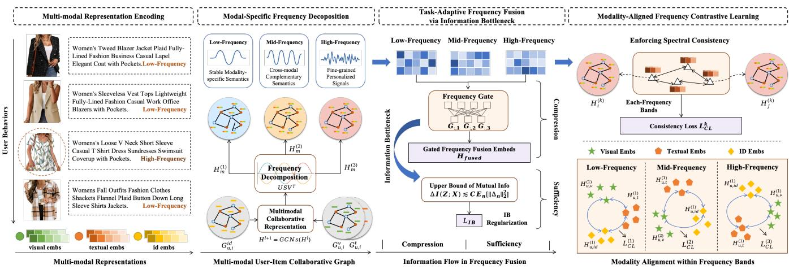
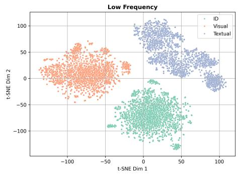
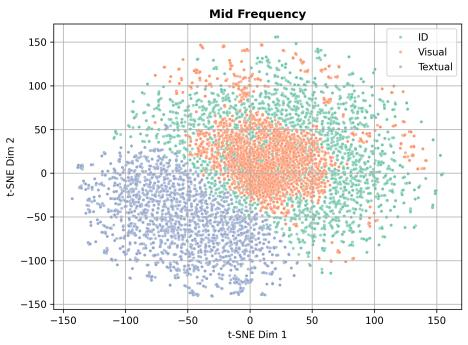
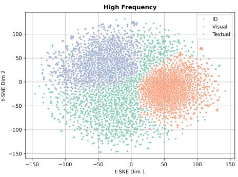
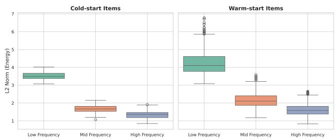
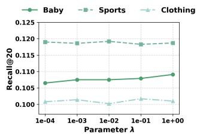
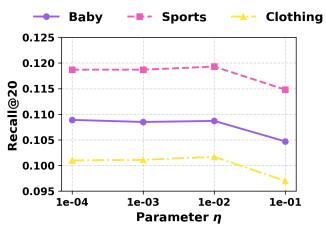
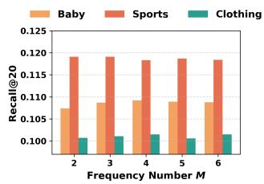
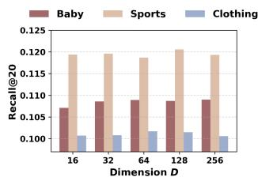

# FITMM: Adaptive Frequency-Aware Multimodal Recommendation via Information-Theoretic Representation Learning

Wei Yang∗ Kuaishou Technology Beijing, China yangwei08@kuaishou.com

Shixuan Li University of Southern California Los Angeles, CA, USA sli97750@usc.edu

Rui Zhong∗ Kuaishou Technology Beijing, China zhongrui@kuaishou.com

Heng Ping University of Southern California Los Angeles, CA, USA hping@usc.edu

Peng Jiang Kuaishou Technology Beijing, China jiangpeng@kuaishou.com

Yiqun Chen Renmin University of China Beijing, China chenyiqun990321@ruc.edu.cn

Chi Lu Kuaishou Technology Beijing, China luchi@kuaishou.com

## Abstract

Multimodal recommendation aims to enhance user preference mod eling by leveraging rich item content such as images and text. Yet dominant systems fuse modalities in the spatial domain, obscuring the frequency structure of signals and amplifying misalignment and redundancy. We adopt a spectral information-theoretic view and show that, under an orthogonal transform that approximately block-diagonalizes bandwise covariances, the Gaussian Information Bottleneck objective decouples across frequency bands, providing a principled basis for separate-then-fuse paradigm. Build ing on this foundation, we propose FITMM, a Frequency-aware Information-Theoretic framework for multimodal recommendation. FITMM constructs graph-enhanced item representations, performs modality-wise spectral decomposition to obtain orthogonal bands, and forms lightweight within-band multimodal components. A residual, task-adaptive gate aggregates bands into the final repre sentation. To control redundancy and improve generalization, we regularize training with a frequency-domain IB term that allocates capacity across bands (Wiener-like shrinkage with shut-of of weak bands). We further introduce a cross-modal spectral consistency loss that aligns modalities within each band. The model is jointly optimized with the standard recommendation loss. Extensive experiments on three real-world datasets demonstrate that FITMM consistently and significantly outperforms advanced baselines. The source code is available at: https://github.com/llm-ml/FITMM.

## CCS Concepts

• Information systems → Recommender systems; Multimedia and multimodal retrieval.

## Keywords

Frequency Representation, Multimodal Recommendation, Information Bottleneck, Graph Learning

## ACM Reference Format:

Wei Yang, Rui Zhong, Yiqun Chen, Shixuan Li, Heng Ping, Chi Lu, and Peng Jiang. 2025. FITMM: Adaptive Frequency-Aware Multimodal Recommendation via Information-Theoretic Representation Learning. In Proceedings of the 33rd ACM International Conference on Multimedia (MM ’25), October 27–31, 2025, Dublin, Ireland. ACM, New York, NY, USA, 10 pages. https://doi.org/10.1145/3746027.3755540

## 1 INTRODUCTION

With the surge of multimodal content in e-commerce, short video platforms, and social media, users are increasingly exposed to items described through diverse modalities such as product images, textual descriptions, videos, and reviews [5, 21, 22, 77, 90]. This has led to the emergence of Multi-Modal Recommender Systems (MMRS), which aim to leverage heterogeneous sources to better capture user preferences and improve recommendation performance [12, 42, 44, 67, 82]. Efectively modeling and integrating such multimodal information has become a central challenge in modern recommender system research [18, 35, 40, 41, 63, 74, 89].

Recent advances have centered on Graph Neural Networks (GNNs) to capture the high-order collaborative signals in user-item graphs [19, 29, 33, 39, 91]. The dominant paradigm, however, involves a critical flaw: after encoding, modalities are fused in the spatial domain using simple gating or attention mechanisms. This approach struggles with the inherent statistical discrepancies and semantic misalignment across heterogeneous modalities (e.g., image vs. text) [56, 76]. By forcing a direct projection into a shared space, these methods often lead to one modality’s signal overpowering another or critical information being diluted during fusion [2, 36, 85].

More fundamentally, this paradigm overlooks the intrinsic fre quency domain structure of multimodal signals. Information is not monolithic; it exists on a spectrum where diferent frequencies carry distinct semantic weight. Low-frequency components typi cally encode stable, cross-modal semantics (like general categories or style), whereas high-frequency components capture the finegrained, modality specific details that are crucial for personalization [14, 47]. Current models, by fusing signals in the spatial domain, indiscriminately mix these components, leading to over-smoothing where dominant low-frequency signals drown out valuable high frequency nuances. This lack of spectral awareness points to a deeper information-theoretic failure. An ideal model should not attempt to preserve all information, but rather isolate and retain only the most predictive frequency bands for the recommendation task. Without a principled mechanism to disentangle and filter in formation, current models create representations that are bloated with redundancy from low-frequency components and corrupted by noise from high-frequency ones. This compromises the model’s expressive power and generalization ability, underscoring the need for a new, theoretically-grounded approach.

To address these limitations, we present FITMM, a frequencyaware information-theoretic framework for multimodal recommendation. Our approach is grounded in a spectral view: an orthogonal or tight-frame transform approximately block-diagonalizes band wise covariances, and the Gaussian Information Bottleneck (IB) decouples across frequency bands. On this foundation, FITMM instantiates a principled “separate–then–fuse” pipeline. Concretely, we first build graph-enhanced representations for ID, visual, and tex tual signals and perform modality-wise spectral decomposition to obtain orthogonal bands. Within each band, we form a lightweight multimodal component to capture cross-modal collaboration while preserving band structure; a residual, task-adaptive gate then ag gregates bands into the final representation. To control redundancy and improve generalization, we regularize with a global frequency domain IB term that allocates capacity across bands (Wiener-style shrinkage of informative directions with shut-of of weak bands). We further introduce a cross-modal spectral consistency loss that aligns modalities. The model is trained end-to-end with a standard objective plus the IB-inspired and consistency terms.

In summary, the main contributions of this work are as follows:

• We establish a spectral information-theoretic basis. Under an orthogonal or tight-frame transform that approximately block-diagonalizes bands, the Gaussian IB decouples, supporting a frequency-first separate–then–fuse design.

• We instantiate this foundation in FITMM, with modalitywise spectral decomposition, within-band multimodal interaction, residual task-adaptive gating, and a global frequencydomain IB term for capacity allocation.

• We conduct extensive experiments on three real-world datasets with standard protocols, demonstrating that FITMM’s theoretically grounded design leads to significant performance gains over advanced baselines.

## 2 RELATED WORK

## 2.1 Multimodal Recommendation

The increasing availability of multimodal data in platforms such as e-commerce and short video services has notably expanded the scope of recommender systems. To move beyond the limitations of traditional collaborative filtering methods [31, 53], recent studies have explored incorporating various content modalities, including images, textual descriptions and audio, to better capture user preferences and address data sparsity [21, 75, 78, 87]. Early approaches often treated multimodal information as auxiliary input and combined it with high-order feature interactions to improve performance [9, 13, 23, 27]. Building on early multimodal fusion strategies, recent research [16, 80, 92] advances toward finegrained modeling. To further address the challenges of modality fusion and noise control, several advanced methods have been developed. MMIL [81] introduces a multi-intention framework that jointly learns intention prototypes and cross-modal semantics for personalized recommendation. AlignRec [43] improves integration by decomposing the learning objective into alignment tasks at the modality, ID, and user-item levels. SMORE [47] transforms multimodal signals into the frequency domain to suppress modalityspecific noise and incorporates spectral fusion with graph-based modeling. PromptMM [65] explores a knowledge distillation strategy that combines prompt tuning with modality-aware weighting. In addition, large language models have been widely applied in various downstream tasks[6, 10, 28, 34, 50, 79, 83]. Recent studies have brought notable improvements to recommendations [42, 69–71, 84].

## 2.2 Graph-augmented Recommendation

Graph-based modeling has become a prominent approach for capturing the relational structure between users and items [37, 38, 60]. By exploiting user-item interaction graphs, models such as MMGCN [67] and GRCN [66] enhance node representations through topologyaware message propagation. LATTICE [88] incorporates higherorder afinities, while FREEDOM [93] adopts denoising strategies to leverage frozen item-item relations for more stable learning. Recent advances further integrate graph learning with self-supervised and contrastive techniques. SGL [68] applies self-discrimination on user-item bipartite graphs to improve robustness, and MMGCL [86] constructs multimodal views using modality-aware augmentations such as edge dropout and masking. SLMRec [59] and BM3 [94] also employ feature-level augmentations and contrastive objectives to strengthen modality associations. Additional methods such as Dual-GNN [64] and MGCL [37] integrate multimodal inputs with graph structures and user intention modeling, achieving better adaptability in dynamic content environments. DifMM [25] introduces a difusion-based multimodal framework that aligns cross-modal signals with collaborative patterns. Together, these graph-enhanced methods emphasize the growing significance of combining structural relations, multimodal content, and contrastive learning for more robust and expressive recommendation.

## 3 The Proposed Model

In this section, we give a detailed introduction to the proposed method. The overall framework of the model is shown in Fig. 1.

  
Figure 1: The overall architecture of the proposed FITMM framework, which integrates modality-specific frequency decomposition, task-adaptive fusion, and information-theoretic regularization to enable fine-grained and robust recommendation.

## 3.1 A Spectral Information-Theoretic View of Multimodal Fusion

In multimodal recommendation, items are typically described using heterogeneous signals such as images and textual descriptions. These signals jointly capture the underlying user–item interaction patterns. Existing methods largely follow the classical paradigms of early or late fusion through concatenation or gating mechanisms [67, 93]. This implicitly assumes semantic information is uniformly distributed across the representation space. However, we argue that this assumption is flawed, as empirical evidence suggests otherwise:

• Cross-modal Collaborative Semantics (e.g., visual style, coarse categories, general sentiment), which are essential for recommendation, tend to reside in stable, low-frequency components of the signal.

• Modality-specific Details and Noise (e.g., fine-grained visual textures, specific writing styles, or background noise) often lie in more volatile mid- to high-frequency bands and vary significantly across modalities.

Fusing signals in the spatial domain before disentangling these components forces the model to learn both (a) how to extract the shared collaborative signal and (b) how to suppress modalityspecific noise simultaneously. This entanglement increases optimization complexity and risks diluting the core collaborative signal that drives efective recommendations.

To ground this design beyond heuristics, we pose a first-principles question:

## Underwhat structural and capacity assumptions does a frequency-domain “separate–then–fuse” strategy provably retain at least as much collaborative information as direct spatial fusion?

From filter banks to information bottlenecks. Classical multiresolution analysis and perfect-reconstruction filter banks (wavelets, Laplacian pyramids) show that signals can be stably decomposed into orthogonal (or tight-frame) subbands and then processed and recombined with perfect (or near-perfect) reconstruction under standard PR conditions [4, 45, 62]. In parallel, Wiener theory shows that in additive signal+noise models, the MMSE estimator is equivalently a spatial convolution whose frequency response performs perband SNR weighting, rather than a single band-agnostic spatial weight [8, 15, 26, 51, 54]. Together, these suggest that a decom position → per-band processing → fusion pipeline is a principled way to preserve informative structure while attenuating nuisance variability.

Proposition 3.1 (Bandwise Gaussian Information Bottleneck (GIB): existence of a band-separable optimum). Let � = concat $( X ^ { ( 1 ) } , \ldots , X ^ { ( K ) } )$ be modality-awarefrequency components obtained by an orthogonal (or tight-frame) decomposition of multimodal embeddings (e.g., SVD/wavelet/graph-wavelet). Suppose (�, �) are jointly Gaussian, and both $\Sigma _ { X X } = \operatorname { C o v } ( X )$ and $\scriptstyle \sum _ { X \mid Y } = \operatorname { C o v } ( X \mid Y )$ are block-diagonal in the same band basis. Consider the Information Bottleneck Lagrangian $\mathcal { L } _ { \mathrm { I B } } ( p ( Z | X ) ) = I ( Z ; X ) - \beta I ( Z ; Y )$ . Then:

(1) There exists an optimal encoder that respects the band partition $( i . e . , Z = \bigoplus _ { k } \bar { Z } ^ { ( k ) }$ with $p ( Z | X ) \ = \ \mathrm { \hat { \Pi } } \int _ { k } p ( Z ^ { ( k ) } | X ^ { ( k ) } ) )$ , for which the objective equals the sum ofbandwise objectives: $\begin{array} { r } { \mathcal { L } _ { \mathrm { I B } } = \sum _ { k = 1 } ^ { K } \mathcal { L } _ { \mathrm { I B } } ^ { ( k ) } } \end{array}$

(2) For each band, an optimal encoder is a (noisy) linear projection onto the eigenvectors of the generalized eigenproblem associated with the pair (��, �|�); equivalently, onto the eigenvectors of the CCA operator $\cdot \Sigma _ { X X } ^ { - 1 } \Sigma _ { X Y } \Sigma _ { Y Y } ^ { - 1 } \Sigma _ { Y X }$ , yielding a bandspecific shrinkage/gating that is monotone in a relevance-toredundancy tradeof [7, 61].

Proofsketch. For Gaussians, �(�; �) and �(�; �) reduce to log det expressions in covariances. Under block-diagonality in the same band basis, any band-respecting encoder yields additive mutual informations over bands; by standard convexity/orthogonality arguments for the Gaussian IB, an optimal solution can be chosen within this band-respecting class. The per-band minimizer is the Gaussian-IB linear–noisy projection aligned with the stated eigenproblems (closely related to CCA) with coeficients controlled by � [7, 61], unique up to within-band rotations.

Corollary 3.2 (Connection to Wiener weighting). In the special case where $Y = S$ (or any invertible linear observation of � on the relevant subspace) and $\dot { \boldsymbol { X } ^ { ( k ) } } = \boldsymbol { S } ^ { ( k ) } + \boldsymbol { N } ^ { ( k ) }$ with independent WSS signal/noise per band, the bandwise GIB encoder reduces to a linear shrinkage proportional to per-band SNR, recovering the classical Wienerform $\begin{array} { r } { G ^ { ( k ) } ( \omega ) = \frac { \Phi _ { S S } ^ { ( k ) } ( \omega ) } { \Phi _ { S S } ^ { ( k ) } ( \omega ) + \Phi _ { N N } ^ { ( k ) } ( \omega ) } } \end{array}$ up to a �-dependent scaling. $A s \beta \to \infty$ it approaches the pure MMSE/Wiener solution; for finite � it yields SNR-dependent shrinkage. Thus, a learnable gate per frequency band implements a data-driven Wiener-like relevance filter [8, 15, 54].

Why frequency-aware fusion helps GNNs. On graphs, message passing corresponds to low-pass filtering in the Laplacian spectrum; deep stacks tend toward over-smoothing (loss of high-frequency or heterophilous cues) [20, 48, 49, 55, 57, 73]. An explicit spectral decomposition (graph wavelets / spectral filters) with bandwise fu sion mitigates this by preserving both low-frequency collaborative semantics and mid-/high-frequency, modality-specific details.

Compatibility with deep networks’ spectral bias. Deep nets pref erentially learn low frequencies; high frequencies are learned late and are fragile [52]. Providing explicit frequency channels (and even Fourier features when appropriate) counteracts this bias and improves modeling of fine detail [58]. This aligns with our design: disentangle into frequency bands, apply learnable, IB-regularized gates, and then fuse.

## 3.2 Disentangled Spectral Representation and Adaptive Fusion

Building on the theoretical foundation of frequency-based information preservation, we now present a practical framework that operationalizes the principle of “separate first, fuse later”. Specif ically, we design a representation pipeline that first disentangles spectral components across modalities to isolate shared semantics from modality-specific residuals, and then performs adaptive fusion guided by task relevance. The pipeline consists of three key stages: structural modeling via item–user graphs, spectral decom position of modality inputs, and frequency-aware fusion tailored to downstream objectives.

3.2.1 Graph-based Multimodal Representation and Decomposition. Given a user-item interaction graph $G = ( { \mathcal { U } } \cup { \mathcal { I } } , { \mathcal { E } } )$ , we employ independent Graph Convolutional Networks (GCNs) to preserve modality-specific semantics and topological patterns. The layerwise propagation rule follows:

$$
H ^ {(l + 1)} = \sigma (\tilde {A} H ^ {(l)} W ^ {(l)}), \quad H ^ {(0)} = E,\tag{1}
$$

where $E \in \mathbb { R } ^ { N \times d }$ is the input feature matrix, $\tilde { A } \in \mathbb { R } ^ { N \times N }$ is the normalized adjacency matrix of the interaction graph, $W ^ { ( l ) } \in \mathbb { R } ^ { d \times d }$ is a trainable transformation, and $\sigma ( \cdot )$ is a non-linear activation. This is applied to $H _ { \mathrm { i d } } , H _ { \mathrm { v } } , H _ { \mathrm { t } } \in \mathbb { R } ^ { N \times d }$ to produce modality-specific representations for users and items. To enhance high-order reasoning, we optionally integrate user-user and item-item graphs, constructed via collaborative similarity or content similarity.

To further disentangle multi-scale semantics, we apply frequency decomposition on each modality through Singular Value Decom position, enabling an interpretable and orthogonal projection into

frequency subspaces:

$$
H _ {m} = U S V ^ {\top} = \sum_ {k = 1} ^ {K} U S ^ {(k)} V ^ {\top} = \sum_ {k = 1} ^ {K} H _ {m} ^ {(k)},\tag{2}
$$

where $S ^ { ( k ) }$ denotes the �-th frequency band after partitioning the diagonal matrix � by magnitude. Each $H _ { m } ^ { ( k ) }$ thus represents the latent structure encoded in the �-th frequency range.

We repeat this decomposition independently for ID, visual, and textual embeddings. Then, at each frequency band $k ,$ we construct multimodal representations by concatenation:

$$
H ^ {(k)} = \mathrm{concat} (H _ {\mathrm{id}} ^ {(k)}, H _ {\mathrm{v}} ^ {(k)}, H _ {\mathrm{t}} ^ {(k)}).\tag{3}
$$

This allows the model to preserve modality-specific semantics while enabling downstream frequency-aware operations.

3.2.2 Task-Adaptive Frequency Fusion. Not all frequency components contribute equally to the recommendation task: low-frequency bands typically encode general semantics, while high-frequency bands carry fine-grained personalization cues. To selectively retain task-relevant signals, we design a gated frequency fusion mechanism that dynamically reweights each frequency component based on its informativeness. We first compute the gating vector $G \in \mathbb { R } ^ { K }$ from the original task representation �:

$$
G = \sigma (W _ {g} H + b _ {g}),\tag{4}
$$

where $W _ { g }$ and $b _ { g }$ are learnable parameters and $\sigma ( \cdot )$ is a sigmoid activation to ensure $G _ { k } \in ( 0 , 1 )$

The final representation is obtained as a soft aggregation over frequency-specific features:

$$
H _ {\mathrm{fused}} = \sum_ {k = 1} ^ {K} G _ {k} \cdot H ^ {(k)}.\tag{5}
$$

Unlike traditional late fusion or modality attention, our method provides a fine-grained frequency selection mechanism, enabling the model to retain only semantically and structurally aligned information. This formulation underpins the subsequent frequencydomain IB regularization, with the gate controlling a global capacity budget that drives reverse water-filling across bands.

## 3.3 Incremental Frequency-Domain Information Bottleneck

While §3.1 shows that (under approximate block-diagonal covariances in the same band basis) the Gaussian-IB problem decouples at optimum $( \mathrm { i . e . , }$ it admits a band-respecting optimal encoder whose optimal value equals the sum of per-band optima), here we study how a global frequency-domain IB budget allocates capacity across bands and why the induced gates improve generalization.

Bandwise IB with a global budget. Let $H = \textstyle \bigoplus _ { k = 1 } ^ { K } H ^ { ( k ) }$ be the bandwise decomposition (orthonormal or tight-frame). We form pre-fusion variables

$$
\tilde {Z} ^ {(k)} = G ^ {(k)} \odot H ^ {(k)} + \xi^ {(k)}, \qquad Z = A \bigg (\bigoplus_ {k = 1} ^ {K} \tilde {Z} ^ {(k)} \bigg).\tag{6}
$$

with encoder noise $\xi ^ { ( k ) }$ and a band-respecting isometry �.

Identity-preserving gating. We use $G ^ { ( k ) } = 1 + \Delta ^ { ( k ) }$ with $\Delta ^ { ( k ) }$ initialized near zero, and control incremental informations relative to the identity baseline $\tilde { Z } _ { 0 } ^ { ( k ) }$ (where $\Delta ^ { ( k ) } = 0 ) \colon \Delta I _ { k } ^ { \mathrm { i n } } : = I ( \tilde { Z } ^ { ( k ) } ; H ^ { ( k ) } ) -$ $I ( \tilde { Z } _ { 0 } ^ { ( k ) } ; H ^ { ( k ) } ) , \Delta I _ { k } ^ { \mathrm { r e l } } : = I ( \tilde { Z } ^ { ( k ) } ; Y ) - I ( \tilde { Z } _ { 0 } ^ { ( k ) } ; Y )$ . We allocate a single K global budget on the increments:

$$
\max _ {\{p (\tilde {Z} ^ {(k)} | H ^ {(k)}) \}} \sum_ {k = 1} ^ {K} \Delta I _ {k} ^ {\mathrm{rel}} \quad \text {s.t.} \quad \sum_ {k = 1} ^ {K} \Delta I _ {k} ^ {\mathrm{in}} \leq \mathcal {B}.\tag{7}
$$

Under the same Gaussian/block-diagonal assumptions, decoupling at optimum and KKT/reverse water-filling remain valid for (7). More over, for a scalar direction in band � with gate $1 + \delta$ and $\gamma _ { k } : =$ Var $( H ^ { ( k ) } ) / \mathrm { V a r } ( \xi ^ { ( k ) } )$ ),

$$
\Delta I _ {k} ^ {\mathrm{in}} = \frac {1}{2} \log \frac {1 + \gamma_ {k} (1 + \delta) ^ {2}}{1 + \gamma_ {k}} \leq c _ {k} \delta^ {2}, \quad c _ {k} := \frac {\gamma_ {k}}{1 + \gamma_ {k}},\tag{8}
$$

and analogously $\begin{array} { r } { \sum _ { k } \Delta I _ { k } ^ { \mathrm { i n } } \lesssim \| \Delta \| _ { 2 } ^ { 2 } . } \end{array}$

Proposition 3.3 (Reverse water-filling for freqency-IB). Assume a Gaussian band model where (�, �) arejointly Gaussian and bandwise covariance blocks are (approximately) block-diagonal in the same band basis. Within each band, the Gaussian-IB optimal encoders are noisy linear projections aligned with a generalized eigenproblem for $\left( \Sigma _ { H H } , \Sigma _ { H | Y } \right)$ , equivalently the CCA operator $\Sigma _ { H H } ^ { - 1 } \bar { \Sigma _ { H Y } } \bar { \Sigma } _ { Y Y } ^ { - 1 } \Sigma _ { Y H }$ [7]. Then the constrained program (7) satisfies KKT conditions with reverse water-filling: there exists $\lambda > 0 \ s . t .$

$$
\frac {\partial \Delta I _ {k} ^ {\mathrm{rel}}}{\partial \Delta I _ {k} ^ {\mathrm{in}}} = \lambda \text {   for   active   bands }, \quad \frac {\partial \Delta I _ {k} ^ {\mathrm{rel}}}{\partial \Delta I _ {k} ^ {\mathrm{in}}} <   \lambda \text {   for   inactive   bands }.
$$

In particular, along active eigen-directions the optimal gate is a Wiener-like shrinkage (up to a �-dependent scaling), with shut-of below a data-dependent threshold; when $Y = S$ (or an invertible linear observation of�) and $X ^ { ( k ) } = S ^ { ( k ) } + N ^ { ( k ) }$ (independent WSS), letting $\beta \to$ ∞ recovers MMSE/Wiener.

Sketch. Gaussian-IB converts the informations to log-determinants on bandwise blocks and yields the stated linear encoders; a single budget on $\begin{array} { r } { \sum _ { k } \Delta I _ { k } ^ { \mathrm { i n } } } \end{array}$ equalizes marginal gain across active bands, mirroring Gaussian rate–distortion [1, 11].

Generalization via information control. Under standard condi tions (bounded/sub-Gaussian losses, randomized encoders, i.i.d. samples), |gen| $\begin{array} { r l r } { \mathrm { ~  ~ \lesssim ~ } } & { { } \sqrt { \frac { 2 } { n } I ( Z ; H ) } = \sqrt { \frac { 2 } { n } \sum _ { k } I _ { k } ^ { \mathrm { i n } } } [ 3 , 7 2 ] } \end{array}$ . Since $I _ { k } ^ { \mathrm { i n } } \ =$ $I ( \tilde { Z } _ { 0 } ^ { ( k ) } ; H ^ { ( k ) } ) + \Delta I _ { k } ^ { \mathrm { i n } }$ , controlling $\sum _ { k } \Delta I _ { k } ^ { \mathrm { i n } }$ controls the additional information beyond the baseline, giving an explicit $O ( { \sqrt { \mathcal { B } / n } } )$ bound.

Operational surrogate (global coupling). For the budget surrogate we use one scalar per band $G _ { n , k } = 1 + \Delta _ { n , k }$ . Using the bound above and lo $\begin{array} { r } { \mathrm { { g } } ( 1 + x ) \le x , \sum _ { k } { \Delta I _ { n , k } ^ { \mathrm { i n } } } \ \lesssim \ \| { \Delta _ { n } } \| _ { 2 } ^ { 2 } , \qquad \Delta _ { n } = ( { \Delta _ { n , 1 } } , . . . , { \Delta _ { n , K } } ) } \end{array}$ We adopt the nonnegative, globally coupled surrogate on increments:

$$
\mathcal {L} _ {\mathrm{IB}} = \alpha \frac {1}{N} \sum_ {n} \| \Delta_ {n} \| _ {2} ^ {2} + \mu \frac {1}{N} \sum_ {n} \| \Delta_ {n} \| _ {2} \left(\sum_ {k} [ \Delta_ {n, k} - \phi_ {+} ] _ {+}\right),\tag{9}
$$

with $[ x ] _ { + } = \operatorname* { m a x } ( x , 0 )$ and $\alpha , \mu > 0$ . The first term upper-bounds the incremental IB budget; the second induces cross-band competi tion via the shared factor $\| \Delta _ { n } \|$ (softplus is a smooth alternative).

## 3.4 Auxiliary Regularization: Enforcing Spectral Consistency

Our framework is grounded in a spectral information-theoretic basis in which an orthogonal or tight-frame transform approximately block-diagonalizes bandwise covariances and the Gaussian Information Bottleneck decouples across frequency bands. To further strengthen the model’s adherence to our first principle, we introduce a targeted auxiliary objective. This objective, termed Cross-Modal Spectral Consistency, ensures that for a given item, the representations from diferent modalities are explicitly aligned within each corresponding frequency band.

Let $H ^ { ( k ) } = [ H _ { \mathrm { i d } } ^ { ( \hat { k } ) } \Vert H _ { \mathrm { v i s } } ^ { ( k ) } \Vert H _ { \mathrm { t x t } } ^ { ( \hat { k } ) } ]$ be the concatenated representation for all items in the �-th frequency band, decomposed into its constituent modal parts. We enforce alignment by minimizing a squared cosine distance loss between all pairs of modalities:

$$
\mathcal {L} _ {\mathrm{CL}} = \sum_ {k = 1} ^ {K} \sum_ {u = 1} ^ {N} \sum_ {(i, j) \in \mathcal {P}} \left(1 - \cos \left(H _ {u, i} ^ {(k)}, H _ {u, j} ^ {(k)}\right)\right) ^ {2}\tag{10}
$$

where $\mathcal { P }$ is the set of modality pairs, i.e., {(id, vis), (id, txt), (vis, txt)}. This loss encourages the diferent modal views of an item to map to a consistent point in the embedding space for each frequency scale.

## 3.5 Training and Optimization

Our model aims to predict user-item interaction probabilities by leveraging historical behaviors and multimodal content. For each user � and item �, the final representations $\mathbf { h } _ { u }$ and $\mathbf { h } _ { i }$ are obtained through frequency-adaptive learning, and the interaction score is computed as $\hat { y } _ { u i } = \mathbf { h } _ { u } ^ { \top } \mathbf { h } _ { i }$ . The model is trained using the binary cross-entropy loss:

$$
\mathcal {L} _ {\mathrm{BCE}} = - \sum_ {(u, i) \in \mathcal {D}} \left[ y _ {u i} \log \hat {y} _ {u i} + (1 - y _ {u i}) \log (1 - \hat {y} _ {u i}) \right],\tag{11}
$$

where $y _ { u i } \in \{ 0 , 1 \}$ denotes the label and $\mathcal { D }$ is the training set.

The final objective combines the recommendation loss with two regularization terms: the information bottleneck loss and the contrastive loss:

$$
\mathcal {L} = \mathcal {L} _ {\mathrm{BCE}} + \lambda \mathcal {L} _ {\mathrm{IB}} + \eta \mathcal {L} _ {\mathrm{CL}},\tag{12}
$$

where � and � control the strength of each regularizer.

## 4 EXPERIMENTS

In this section, we conduct extensive experiments to address the following research questions:

• RQ1: - How does our proposed method perform compared to state-of-the-art (SOTA) multimodal baselines?

• RQ2: - Does our approach exhibit superior performance in cold-start scenarios compared to existing advanced models?

• RQ3: - How do frequency modeling and bottleneck regularization afect performance?

• RQ4: – What roles do diferent frequency components play in capturing modality-specific and shared semantics?

• RQ5: – How does the model improve representation quality for the cold-start prediction?

• RQ6: - How does the model behave under diferent hyperparameter settings?

Table 1: Overall recommendation performance on three Amazon datasets. Our proposed FITMM consistently outperforms all baselines across all metrics, demonstrating its superior capability in modeling multimodal signals.

<table><tr><td>Dataset</td><td>Metric</td><td>BPR</td><td>LightGCN</td><td>VBPR</td><td>MMGCN</td><td>GRCN</td><td>DualGNN</td><td>SLMRec</td><td>LATTICE</td><td>BM3</td><td>FREEDOM</td><td>DiffMM</td><td>MMIL</td><td>AlignRec</td><td>SMORE</td><td>FITMM</td></tr><tr><td rowspan="4">Baby</td><td>R@10</td><td>0.0357</td><td>0.0479</td><td>0.0418</td><td>0.0413</td><td>0.0538</td><td>0.0507</td><td>0.0533</td><td>0.0561</td><td>0.0573</td><td>0.0624</td><td>0.0617</td><td>0.0670</td><td>0.0674</td><td>0.0680</td><td>0.0716</td></tr><tr><td>R@20</td><td>0.0575</td><td>0.0754</td><td>0.0667</td><td>0.0649</td><td>0.0832</td><td>0.0782</td><td>0.0788</td><td>0.0867</td><td>0.0904</td><td>0.0985</td><td>0.0978</td><td>0.1035</td><td>0.1046</td><td>0.1035</td><td>0.1089</td></tr><tr><td>N@10</td><td>0.0192</td><td>0.0257</td><td>0.0223</td><td>0.0211</td><td>0.0285</td><td>0.0264</td><td>0.0291</td><td>0.0305</td><td>0.0311</td><td>0.0324</td><td>0.0321</td><td>0.0361</td><td>0.0363</td><td>0.0365</td><td>0.0387</td></tr><tr><td>N@20</td><td>0.0249</td><td>0.0328</td><td>0.0287</td><td>0.0275</td><td>0.0364</td><td>0.0335</td><td>0.0365</td><td>0.0383</td><td>0.0395</td><td>0.0416</td><td>0.0408</td><td>0.0455</td><td>0.0458</td><td>0.0457</td><td>0.0484</td></tr><tr><td rowspan="4">Sports</td><td>R@10</td><td>0.0432</td><td>0.0569</td><td>0.0561</td><td>0.0394</td><td>0.0607</td><td>0.0574</td><td>0.0667</td><td>0.0628</td><td>0.0659</td><td>0.0705</td><td>0.0687</td><td>0.0747</td><td>0.0758</td><td>0.0762</td><td>0.0809</td></tr><tr><td>R@20</td><td>0.0653</td><td>0.0864</td><td>0.0857</td><td>0.0625</td><td>0.0928</td><td>0.0881</td><td>0.0998</td><td>0.0961</td><td>0.0987</td><td>0.1077</td><td>0.1035</td><td>0.1133</td><td>0.1160</td><td>0.1142</td><td>0.1187</td></tr><tr><td>N@10</td><td>0.0241</td><td>0.0311</td><td>0.0305</td><td>0.0203</td><td>0.0335</td><td>0.0316</td><td>0.0366</td><td>0.0339</td><td>0.0357</td><td>0.0382</td><td>0.0357</td><td>0.0405</td><td>0.0414</td><td>0.0408</td><td>0.0441</td></tr><tr><td>N@20</td><td>0.0298</td><td>0.0387</td><td>0.0386</td><td>0.0266</td><td>0.0421</td><td>0.0393</td><td>0.0454</td><td>0.0431</td><td>0.0443</td><td>0.0478</td><td>0.0458</td><td>0.0505</td><td>0.0517</td><td>0.0506</td><td>0.0538</td></tr><tr><td rowspan="4">Clothing</td><td>R@10</td><td>0.0206</td><td>0.0361</td><td>0.0283</td><td>0.0221</td><td>0.0425</td><td>0.0447</td><td>0.0440</td><td>0.0503</td><td>0.0577</td><td>0.0616</td><td>0.0593</td><td>0.0643</td><td>0.0651</td><td>0.0659</td><td>0.0698</td></tr><tr><td>R@20</td><td>0.0303</td><td>0.0544</td><td>0.0418</td><td>0.0357</td><td>0.0661</td><td>0.0663</td><td>0.0655</td><td>0.0755</td><td>0.0845</td><td>0.0917</td><td>0.0874</td><td>0.0961</td><td>0.0993</td><td>0.0987</td><td>0.1017</td></tr><tr><td>N@10</td><td>0.0114</td><td>0.0197</td><td>0.0162</td><td>0.0116</td><td>0.0227</td><td>0.0237</td><td>0.0238</td><td>0.0277</td><td>0.0316</td><td>0.0333</td><td>0.0325</td><td>0.0348</td><td>0.0356</td><td>0.0360</td><td>0.0378</td></tr><tr><td>N@20</td><td>0.0138</td><td>0.0243</td><td>0.0196</td><td>0.0151</td><td>0.0283</td><td>0.0289</td><td>0.0293</td><td>0.0356</td><td>0.0387</td><td>0.0409</td><td>0.0396</td><td>0.0428</td><td>0.0437</td><td>0.0443</td><td>0.0457</td></tr></table>

Table 2: Statistics of the experimental Amazon datasets.

<table><tr><td>Dataset</td><td>User</td><td>Item</td><td>Interactions</td><td>Density</td></tr><tr><td>Baby</td><td>19,445</td><td>7,050</td><td>139,110</td><td>0.101%</td></tr><tr><td>Sports</td><td>35,598</td><td>18,357</td><td>256,308</td><td>0.039%</td></tr><tr><td>Clothing</td><td>39,387</td><td>23,033</td><td>237,488</td><td>0.026%</td></tr></table>

## 4.1 Experimental Settings

4.1.1 Datasets. We conduct experiments on three categories of the widely-used Amazon 1 Review dataset [32]: Baby, Sports and Outdoors, and Clothing, Shoes and Jewelry, abbreviated as Baby, Sports, and Clothing. Following common practice in FREEDOM [21] and SMORE[47], we apply the 5-core filtering and utilize the same multimodal inputs. Dataset statistics are summarized in Table 2.

4.1.2 Baselines. To evaluate the performance, we compared with the following baselines. Traditional collaborative filtering methods: BPR [53] and LightGCN [24]. Recent multimodal recommendation methods: VBPR [23], MMGCN [67], GRCN [66], DualGNN [64], SLMRec [59], LATTICE [88], BM3 [94], FREEDOM [93], DifMM [25], MMIL [81], AlignRec [43], SMORE [47].

4.1.3 Evaluation Protocols. We adopt the all-ranking protocol for top-K recommendation, where all candidate items are ranked for each user. Following standard practice [46], we report Recall@K and NDCG@K for K in {10, 20}, which measure retrieval accuracy and ranking quality, respectively. User interaction data is split into 80% training, 10% validation, and 10% testing. During training, negative sampling is applied by pairing each observed interaction with randomly sampled negative items.

4.1.4 Implementation Details. Our method is implemented in Py-Torch using the MMRec framework [92]. We set the embedding dimension to 64 and initialize parameters with Xavier initializa tion [17]. The model is optimized using Adam [30], with the learn ing rate tuned in {0.0001, 0.0005, 0.001, 0.005} and a batch size of 2048. Training runs with early stopping based on Recall@20, trig gered after 20 validation steps without improvement. We tune the information bottleneck weight � and contrastive loss weight � in {0.0001, 0.001, 0.01, 0.1, 1.0}, and vary the number of frequency bands � in {2, 3, 4, 5} to evaluate decomposition efectiveness. All experiments are conducted on a NVIDIA A100 GPU.

## 4.2 Overall Performance (RQ1)

Table 1 compares performance across three Amazon datasets. Our method consistently outperforms all state-of-the-art (SOTA) baselines on both Recall and NDCG. Specifically, it improves R@10 from 0.0680 to 0.0716 on Baby, from 0.0762 to 0.0809 on Sports, and from 0.0659 to 0.0698 on Clothing. These consistent gains across domains demonstrate the strength of our frequency-aware design. By decomposing multimodal representations into frequency bands and applying task-adaptive fusion guided by information bottleneck principles, our model efectively highlights informative components while suppressing noise, particularly in high-frequency ranges. Compared with MMIL and AlignRec, which enhance modeling through multi-intention learning or hierarchical alignment, our approach introduces a structured frequency-domain perspective. While SMORE also employs frequency-based denoising, it relies on global FFT filtering and a unified complex-valued filter, which limits interpretability and flexibility. In contrast, our method adopts component-wise decomposition and fine-grained, modalityaware fusion, further strengthened by contrastive and bottleneck regularization. These results confirm that our approach not only boosts accuracy but also provides a principled and interpretable framework for multimodal recommendation.

## 4.3 Cold-Start Recommendation (RQ2)

To evaluate performance under data sparsity, we conduct experiments on cold-start users who have no more than five interactions. As shown in Table 3, our method consistently outperforms all representative baselines across the three datasets. Interestingly, it even achieves better results on cold-start users than on the full user set, indicating strong generalization capability. This result reflects the efectiveness of our frequency decomposition and information bottleneck design, which enable the model to extract stable and task-relevant signals from multimodal content. The spectral energy analysis in Fig. 3 further reveals that cold-start items tend to concentrate information in low-frequency bands. This observation aligns with the model’s structural preference for capturing general semantics. In contrast, methods such as FREEDOM and LATTICE, which rely heavily on collaborative graph structures, show significant performance drops under cold-start conditions. Although SMORE and MMIL remain competitive by using frequency filtering and modality-aware intent modeling, our method provides a more comprehensive solution by jointly leveraging frequency semantics, modality structure, and task relevance. Through selective fusion across frequency components, the model ofers both robustness and interpretability in cold-start recommendation settings.

Table 3: Performance comparison under the cold-start scenario, where users with $\le 5$ interactions are used for experiment. FITMM achieves notable improvements over strong baselines, confirming its robustness and adaptability in data-sparse settings.

<table><tr><td rowspan="2">Model</td><td colspan="4">Amazon-Baby</td><td colspan="4">Amazon-Sports</td><td colspan="4">Amazon-Clothing</td></tr><tr><td>R@10</td><td>R@20</td><td>N@10</td><td>N@20</td><td>R@10</td><td>R@20</td><td>N@10</td><td>N@20</td><td>R@10</td><td>R@20</td><td>N@10</td><td>N@20</td></tr><tr><td>GRCN</td><td>0.0510</td><td>0.0770</td><td>0.0268</td><td>0.0333</td><td>0.0556</td><td>0.0814</td><td>0.0305</td><td>0.0370</td><td>0.0416</td><td>0.0648</td><td>0.0213</td><td>0.0271</td></tr><tr><td>BM3</td><td>0.0549</td><td>0.0845</td><td>0.0288</td><td>0.0363</td><td>0.0581</td><td>0.0920</td><td>0.0305</td><td>0.0390</td><td>0.0424</td><td>0.0614</td><td>0.0229</td><td>0.0276</td></tr><tr><td>LATTICE</td><td>0.0570</td><td>0.0827</td><td>0.0298</td><td>0.0362</td><td>0.0380</td><td>0.0570</td><td>0.0205</td><td>0.0252</td><td>0.0414</td><td>0.0555</td><td>0.0218</td><td>0.0254</td></tr><tr><td>FREEDOM</td><td>0.0535</td><td>0.0880</td><td>0.0297</td><td>0.0384</td><td>0.0622</td><td>0.0933</td><td>0.0328</td><td>0.0406</td><td>0.0444</td><td>0.0671</td><td>0.0241</td><td>0.0298</td></tr><tr><td>MMIL</td><td>0.0672</td><td>0.1014</td><td>0.0377</td><td>0.0463</td><td>0.0759</td><td>0.1141</td><td>0.0422</td><td>0.0517</td><td>0.0635</td><td>0.0948</td><td>0.0341</td><td>0.0423</td></tr><tr><td>SMORE</td><td>0.0687</td><td>0.1019</td><td>0.0381</td><td>0.0464</td><td>0.0788</td><td>0.1158</td><td>0.0420</td><td>0.0512</td><td>0.0676</td><td>0.0983</td><td>0.0369</td><td>0.0446</td></tr><tr><td>FITMM</td><td>0.0752</td><td>0.1109</td><td>0.0413</td><td>0.0503</td><td>0.0820</td><td>0.1218</td><td>0.0435</td><td>0.0535</td><td>0.0691</td><td>0.1003</td><td>0.0381</td><td>0.0459</td></tr></table>

## 4.4 Ablation Study (RQ3)

We conduct ablation studies to assess the contribution of each key module in our framework. Table 4 summarizes the performance of several variants: (1) r/p AF, which replaces the adaptive fre quency fusion with naive averaging; (2) w/o AF, which removes frequency decomposition and fusion entirely; (3) w/o IB, which discards the information bottleneck loss; (4) w/o CL, which removes contrastive learning; and (5) w/o MM, which eliminates all multi modal inputs. Among them, w/o AF shows the most significant performance drop, demonstrating that frequency modeling is cen tral to capturing multi-scale user preferences. Even the simpler variant r/p AF, which retains frequency components but lacks task awareness, results in substantial degradation (e.g., Baby R@10 drops from 0.0716 to 0.0646). These observations highlight the necessity of adaptive, task-aware fusion to prioritize semantically relevant frequency bands and suppress noise. Furthermore, removing the information bottleneck (w/o IB) leads to consistent drops across all datasets, verifying its role in filtering redundant components and enforcing informative compression. While the impact of removing contrastive learning (w/o CL) is less severe, this module remains important for enhancing modality alignment, which supports bet ter personalization. Finally, removing multimodal inputs (w/o MM) causes the steepest performance decline, emphasizing that visual and textual modalities are not only semantically rich but also pro vide essential frequency-diverse cues for fine-grained preference modeling.

## 4.5 Spectral Analysis of Cross-Modality Representations (RQ4)

To examine how the model captures semantics and cross-modal interactions from a frequency-domain perspective, we analyze ID, visual, and textual representations on the Sports dataset, as illustrated in Fig. 2. In the low-frequency band, the three modalities form distinct and well-separated clusters. This suggests that lowfrequency components primarily encode modality-specific structures, such as long-term user preferences in the ID modality, visual style in the visual modality, and category-level semantics in the textual modality. The clear separation demonstrates the efectiveness of frequency decomposition in isolating dominant features and supports the use of modality-aware fusion strategies that can selectively prioritize or reduce signals to improve robustness. As frequency increases, modality boundaries gradually blur. In the midfrequency band, diferent modalities begin to overlap, reflecting cross-modal interactions and shared semantics, such as common appearance cues between images and text. This pattern supports our model’s goal of learning collaborative representations. In the high-frequency band, representations become more entangled and less modality-specific. These components encode sparse but informative details, such as fine-grained item attributes or short-term behavioral patterns, which are critical for personalization. This behavior aligns with our information bottleneck design, which aims to preserve predictive information while reducing irrelevant noise.

<table><tr><td rowspan="2">Model</td><td colspan="2">Baby</td><td colspan="2">Sports</td><td colspan="2">Clothing</td></tr><tr><td>R10</td><td>N10</td><td>R10</td><td>N10</td><td>R10</td><td>N10</td></tr><tr><td>r/p AF</td><td>0.0646</td><td>0.0341</td><td>0.0767</td><td>0.0421</td><td>0.0659</td><td>0.0356</td></tr><tr><td>w/o AF</td><td>0.0554</td><td>0.0305</td><td>0.0605</td><td>0.0329</td><td>0.0402</td><td>0.0219</td></tr><tr><td>w/o IB</td><td>0.0702</td><td>0.0378</td><td>0.0785</td><td>0.0424</td><td>0.0681</td><td>0.0364</td></tr><tr><td>w/o CL</td><td>0.0708</td><td>0.0383</td><td>0.0791</td><td>0.0431</td><td>0.0688</td><td>0.0369</td></tr><tr><td>w/o MM</td><td>0.0517</td><td>0.0280</td><td>0.0539</td><td>0.0296</td><td>0.0373</td><td>0.0200</td></tr><tr><td>FITMM</td><td>0.0716</td><td>0.0387</td><td>0.0809</td><td>0.0441</td><td>0.0698</td><td>0.0378</td></tr></table>

Table 4: Ablation study of key components in FITMM. Each variant modifies one module to evaluate its contribution.

## 4.6 Frequency Characteristics under Cold-Start and Warm-Start Conditions (RQ5)

To investigate how diferent frequency bands contribute under varying data sparsity, we visualize the $L _ { 2 }$ energy distribution of coldstart and warm-start item representations across frequency components (Fig. 3). For cold-start items, energy is highly concentrated in the low-frequency band, suggesting the model relies more on stable modality-specific signals (e.g., visual or textual descriptions) to construct coarse-grained preferences in the absence of user history. This supports our design, where low-frequency components retain general and robust semantic cues. In contrast, warm-start items exhibit stronger responses in mid- and high-frequency bands. The mid-frequency band reflects cross-modal semantic alignment, while the high-frequency band captures personalized, fine-grained details derived from rich interaction signals. Notably, the high-frequency energy for cold-start items remains suppressed, indicating our frequency gating and information bottleneck mechanisms efectively filter uninformative components under sparse conditions. These ob servations confirm that our model adaptively allocates representational focus across frequency bands, enabling robust generalization for cold-start cases and personalize for warm-start items.

Figure 2: Spectral visualization of ID, visual, and textual representations across three frequency bands using t-SNE. Lowfrequency bands exhibit modality-specific clustering; mid-frequency bands show increasing cross-modal overlap; high frequency bands reflect task-specific, modality-agnostic semantic encoding, validating our frequency-aware modeling design.  
  
Figure 3: Comparison of frequency-wise energy distribution between cold-start and warm-start items.

## 4.7 Hyperparameter Sensitivity (RQ6)

We investigate the sensitivity of our model to four key hyperparameters, with results shown in Fig. 4. For the information bottleneck weight �, performance consistently improves as � increases, peak ing at 0.1 or 1.0. This indicates that appropriate regularization helps suppress redundant frequency signals and enhances generalization, while too small a � fails to constrain uninformative components efectively. Similarly, the contrastive loss weight � achieves the best results at 0.0001 or 0.01, suggesting that mild contrastive signals enhance modality alignment and high-frequency discriminability. However, excessive regularization $( \mathrm { e . g . } , \eta = 1 . 0 )$ harms performance, likely due to interference with the main optimization objective.

As for the number of frequency decomposition bands �, the model performs best at $K = 3$ to 5, validating the importance of moderate decomposition granularity: too coarse fails to capture multi-scale semantics, while too fine leads to sparse and unstable signals. Increasing the latent dimension � generally improves performance, but the optimal value varies across datasets $( \mathrm { e . g . , } d = 2 5 6$ for Baby, � = 128 for Sports), implying a trade-of between representation capacity and data complexity.

  
Figure 4: Sensitivity analysis of key hyperparameters. The model shows robust performance under moderate settings.

## 5 CONCLUSION

In this paper, we propose a novel frequency-aware multimodal recommendation framework, FITMM, which efectively integrates adaptive frequency decomposition with an information-theoretic representation learning paradigm. Extensive experiments on three real-world Amazon datasets demonstrate that FITMM consistently outperforms state-of-the-art baselines, particularly in cold-start scenarios. In future work, we plan to further explore personalized frequency modeling, such as user-dependent frequency selection, and investigate the integration ofpretrained multimodal foundation models to enhance semantic understanding and scalability.

## References

[1] Robert B Ash. 2012. Information theory. Courier Corporation.

[2] Haoyue Bai, Le Wu, Min Hou, Miaomiao Cai, Zhuangzhuang He, Yuyang Zhou, Richang Hong, and Meng Wang. 2024. Multimodality invariant learning for multimedia-based new item recommendation. In Proceedings ofthe 47th International ACM SIGIR Conference on Research and Development in Information Retrieval. 677–686.

[3] Yuheng Bu, Shaofeng Zou, and Venugopal V Veeravalli. 2020. Tightening mutual information-based bounds on generalization error. IEEE Journal on Selected Areas in Information Theory 1, 1 (2020), 121–130

[4] Peter J Burt and Edward H Adelson. 1987. The Laplacian pyramid as a compact image code. In Readings in computer vision. Elsevier, 671–679.

[5] Yukuo Cen, Jianwei Zhang, Xu Zou, Chang Zhou, Hongxia Yang, and Jie Tang. 2020. Controllable multi-interest framework for recommendation. In Proceedings ofthe 26th ACM SIGKDD International Conference on Knowledge Discovery & Data Mining. 2942–2951.

[6] Ching Chang, Yidan Shi, Defu Cao, Wei Yang, Jeehyun Hwang, Haixin Wang, Jiacheng Pang, Wei Wang, Yan Liu, Wen-Chih Peng, et al. 2025. A survey of reasoning and agentic systems in time series with large language models. arXiv preprint arXiv:2509.11575 (2025).

[7] Gal Chechik, Amir Globerson, Naftali Tishby, and Yair Weiss. 2003. Information bottleneck for Gaussian variables. Advances in Neural Information Processing Systems 16 (2003).

[8] Jingdong Chen, Jacob Benesty, Yiteng Huang, and Simon Doclo. 2006. New insights into the noise reduction Wiener filter. IEEE Transactions on audio, speech, and language processing 14, 4 (2006), 1218–1234.

[9] Xu Chen, Hanxiong Chen, Hongteng Xu, Yongfeng Zhang, Yixin Cao, Zheng Qin, and Hongyuan Zha. 2019. Personalized fashion recommendation with visual explanations based on multimodal attention network: Towards visually explainable recommendation. In Proceedings ofthe 42nd International ACM SIGIR Conference on Research and Development in Information Retrieval. 765–774.

[10] Yiqun Chen, Qi Liu, Yi Zhang, Weiwei Sun, Xinyu Ma, Wei Yang, Daiting Shi, Jiaxin Mao, and Dawei Yin. 2025. Tourrank: Utilizing large language models for documents ranking with a tournament-inspired strategy. In Proceedings ofthe ACM on Web Conference 2025. 1638–1652.

[11] Thomas M Cover. 1999. Elements ofinformation theory. John Wiley & Sons.

[12] Yashar Deldjoo, Markus Schedl, Paolo Cremonesi, and Gabriella Pasi. 2020. Rec ommender systems leveraging multimedia content. ACM Computing Surveys (CSUR) 53, 5 (2020), 1–38.

[13] Yashar Deldjoo, Markus Schedl, and Peter Knees. 2021. Content-driven music recommendation: Evolution, state of the art, and challenges. arXiv preprint arXiv:2107.11803 (2021).

[14] Xinyu Du, Huanhuan Yuan, Pengpeng Zhao, Jianfeng Qu, Fuzhen Zhuang, Guan feng Liu, Yanchi Liu, and Victor S Sheng. 2023. Frequency enhanced hybrid attention network for sequential recommendation. In Proceedings ofthe 46th International ACM SIGIR conference on research and development in information retrieval. 78–88.

[15] William A Gardner. 2002. Cyclic Wiener filtering: theory and method. IEEE Transactions on communications 41, 1 (2002), 151–163

[16] Shijie Geng, Juntao Tan, Shuchang Liu, Zuohui Fu, and Yongfeng Zhang. 2023. Vip5: Towards multimodal foundation models for recommendation. arXivpreprint arXiv:2305.14302 (2023).

[17] Xavier Glorot and Yoshua Bengio. 2010. Understanding the dificulty of training deep feedforward neural networks. In Proceedings ofthe thirteenth international conference on artificial intelligence and statistics. JMLR Workshop and Conference Proceedings, 249–256.

[18] Hao Gu, Rui Zhong, Yu Xia, Wei Yang, Chi Lu, Peng Jiang, and Kun Gai. 2025. R4ec: A Reasoning, Reflection, and Refinement Framework for Recommendation Systems. arXiv preprint arXiv:2507.17249 (2025).

[19] Zhiqiang Guo, Jianjun Li, Guohui Li, Chaoyang Wang, Si Shi, and Bin Ruan. 2024. Lgmrec: Local and global graph learning for multimodal recommendation. In Proceedings ofthe AAAI Conference on Artificial Intelligence, Vol. 38. 8454–8462.

[20] David K Hammond, Pierre Vandergheynst, and Rémi Gribonval. 2011. Wavelets on graphs via spectral graph theory. Applied and Computational Harmonic Analysis 30, 2 (2011), 129–150.

[21] Tengyue Han, Pengfei Wang, Shaozhang Niu, and Chenliang Li. 2022. Modality matches modality: Pretraining modality-disentangled item representations for recommendation. In Proceedings ofthe ACM Web Conference 2022. 2058–2066.

[22] Li He, Hongxu Chen, Dingxian Wang, Shoaib Jameel, Philip Yu, and Guandong Xu. 2021. Click-through rate prediction with multi-modal hypergraphs. In Proceedings ofthe 30th ACM International Conference on Information & Knowledge Management. 690–699.

[23] Ruining He and Julian McAuley. 2016. VBPR: visual bayesian personalized ranking from implicit feedback. In Proceedings ofthe AAAI conference on artificial intelligence, Vol. 30.

[24] Xiangnan He, Kuan Deng, Xiang Wang, Yan Li, Yongdong Zhang, and Meng Wang. 2020. Lightgcn: Simplifying and powering graph convolution network for

recommendation. In Proceedings of the 43rd International ACM SIGIR conference on research and development in Information Retrieval. 639–648.

[25] Yangqin Jiang, Lianghao Xia, Wei Wei, Da Luo, Kangyi Lin, and Chao Huang. 2024. Difmm: Multi-modal difusion model for recommendation. In Proceedings ofthe 32nd ACM International Conference on Multimedia. 7591–7599.

[26] Thomas Kailath. 1981. Lectures on Wiener and Kalman filtering. In Lectures on Wiener and Kalman Filtering. Springer, 1–143.

[27] Wang-Cheng Kang, Chen Fang, Zhaowen Wang, and Julian McAuley. 2017. Visually-aware fashion recommendation and design with generative image models. In 2017 IEEE international conference on data mining (ICDM). IEEE, 207–216.

[28] Saketh Reddy Karra and Theja Tulabandhula. 2024. Interarec: Interactive recommendations using multimodal large language models. In Pacific-Asia Conference on Knowledge Discovery and Data Mining. Springer, 32–43.

[29] Sungjune Kim, Seongjun Yun, Jongwuk Lee, Gyusam Chang, Wonseok Roh, Dae-Neung Sohn, Jung-Tae Lee, Hogun Park, and Sangpil Kim. 2024. Self-supervised multimodal graph convolutional network for collaborative filtering. Information Sciences 653 (2024), 119760.

[30] Diederik P Kingma and Jimmy Ba. 2014. Adam: A method for stochastic optimization. arXiv preprint arXiv:1412.6980 (2014).

[31] Yehuda Koren, Robert Bell, and Chris Volinsky. 2009. Matrix factorization techniques for recommender systems. Computer 42, 8 (2009), 30–37.

[32] Himabindu Lakkaraju, Julian McAuley, and Jure Leskovec. 2013. What’s in a name? understanding the interplay between titles, content, and communities in social media. In Proceedings ofthe International AAAI Conference on Web and Social Media, Vol. 7.

[33] Shuaiyang Li, Feng Xue, Kang Liu, Dan Guo, and Richang Hong. 2024. Multimodal graph causal embedding for multimedia-based recommendation. IEEE Transactions on Knowledge and Data Engineering 36, 12 (2024), 8842–8858.

[34] Shixuan Li, Wei Yang, Peiyu Zhang, Xiongye Xiao, Defu Cao, Yuehan Qin, Xiaole Zhang, Yue Zhao, and Paul Bogdan. 2025. Climatellm: Eficient weather forecasting via frequency-aware large language models. arXiv preprint arXiv:2502.11059 (2025).

[35] Yang Li, Junpeng Du, Chenzhan Wang, Zunlong Liu, Xiaomin Zhu, and Chen Lin. 2025. CROSS: Feedback-Oriented Multi-Modal Dynamic Alignment in Recommendation Systems. ACM Transactions on Recommender Systems (2025).

[36] Yang Li, Qi’Ao Zhao, Chen Lin, Jinsong Su, and Zhilin Zhang. 2024. Who To Align With: Feedback-Oriented Multi-Modal Alignment in Recommendation Systems. In Proceedings of the 47th International ACM SIGIR Conference on Research and Development in Information Retrieval. 667–676.

[37] Kang Liu, Feng Xue, Dan Guo, Peijie Sun, Shengsheng Qian, and Richang Hong. 2023. Multimodal graph contrastive learning for multimedia-based recommenda tion. IEEE Transactions on Multimedia 25 (2023), 9343–9355.

[38] Kang Liu, Feng Xue, Dan Guo, Le Wu, Shujie Li, and Richang Hong. 2023. MEGCF: Multimodal entity graph collaborative filtering for personalized recommendation. ACM transactions on information systems 41, 2 (2023), 1–27.

[39] Kang Liu, Feng Xue, Shuaiyang Li, Sheng Sang, and Richang Hong. 2022. Multimodal hierarchical graph collaborative filtering for multimedia-based recommen dation. IEEE Transactions on Computational Social Systems 11, 1 (2022), 216–227.

[40] Qijiong Liu, Jieming Zhu, Yanting Yang, Quanyu Dai, Zhaocheng Du, Xiao-Ming Wu, Zhou Zhao, Rui Zhang, and Zhenhua Dong. 2024. Multimodal pretraining, adaptation, and generation for recommendation: A survey. In Proceedings of the 30th ACM SIGKDD Conference on Knowledge Discovery and Data Mining. 6566–6576.

[41] Weiming Liu, Chaochao Chen, Jiahe Xu, Xinting Liao, Fan Wang, Xiaolin Zheng, Zhihui Fu, Ruiguang Pei, and Jun Wang. 2025. Joint similarity item exploration and overlapped user guidance for multi-modal cross-domain recommendation. In Proceedings ofthe ACM on Web Conference 2025. 2882–2893.

[42] Yuqing Liu, Yu Wang, Lichao Sun, and Philip S Yu. 2024. Rec-gpt4v: Multimodal recommendation with large vision-language models. arXiv preprint arXiv:2402.08670 (2024).

[43] Yifan Liu, Kangning Zhang, Xiangyuan Ren, Yanhua Huang, Jiarui Jin, Yingjie Qin, Ruilong Su, Ruiwen Xu, Yong Yu, and Weinan Zhang. 2024. AlignRec: Aligning and Training in Multimodal Recommendations. In Proceedings of the 33rd ACM International Conference on Information and Knowledge Management. 1503–1512.

[44] Daniele Malitesta, Giandomenico Cornacchia, Claudio Pomo, Felice Antonio Merra, Tommaso Di Noia, and Eugenio Di Sciascio. 2024. Formalizing multimedia recommendation through multimodal deep learning. ACM Transactions on Recommender Systems (2024).

[45] Stéphane Mallat. 1999. A wavelet tour of signal processing. Elsevier.

[46] Zongshen Mu, Yueting Zhuang, Jie Tan, Jun Xiao, and Siliang Tang. 2022. Learning Hybrid Behavior Patterns for Multimedia Recommendation. In Proceedings of the 30th ACM International Conference on Multimedia. 376–384.

[47] Rongqing Kenneth Ong and Andy WH Khong. 2024. Spectrum-based Modality Representation Fusion Graph Convolutional Network for Multimodal Recommendation. arXiv preprint arXiv:2412.14978 (2024).

[48] Kenta Oono and Taiji Suzuki. 2019. Graph neural networks exponentially lose expressive power for node classification. arXiv preprint arXiv:1905.10947 (2019).

[49] Antonio Ortega, Pascal Frossard, Jelena Kovačević, José MF Moura, and Pierre Vandergheynst. 2018. Graph signal processing: Overview, challenges, and appli cations. Proc. IEEE 106, 5 (2018), 808–828.

[50] Heng Ping, Shixuan Li, Peiyu Zhang, Anzhe Cheng, Shukai Duan, Nikos Kanakaris, Xiongye Xiao, Wei Yang, Shahin Nazarian, Andrei Irimia, et al. 2025. Hdlcore: A training-free framework for mitigating hallucinations in llm generated hdl. arXiv preprint arXiv:2503.16528 (2025)

[51] William K Pratt. 2006. Generalized Wiener filtering computation techniques. IEEE Trans. Comput. 100, 7 (2006), 636–641.

[52] Nasim Rahaman, Aristide Baratin, Devansh Arpit, Felix Draxler, Min Lin, Fred Hamprecht, Yoshua Bengio, and Aaron Courville. 2019. On the spectral bias of neural networks. In International conference on machine learning. PMLR, 5301– 5310.

[53] Stefen Rendle, Christoph Freudenthaler, Zeno Gantner, and Lars Schmidt-Thieme. 2012. BPR: Bayesian personalized ranking from implicit feedback. arXiv preprint arXiv:1205.2618 (2012).

[54] Enders A Robinson and Sven Treitel. 1967. Principles of digital Wiener filtering. Geophysical Prospecting 15, 3 (1967), 311–332.

[55] Aliaksei Sandryhaila and José MF Moura. 2013. Discrete signal processing on graphs. IEEE transactions on signal processing 61, 7 (2013), 1644–1656.

[56] Yu Shang, Chen Gao, Jiansheng Chen, Depeng Jin, and Yong Li. 2024. Improving item-side fairness of multimodal recommendation via modality debiasing. In Proceedings ofthe ACM Web Conference 2024. 4697–4705.

[57] David I Shuman, Sunil K Narang, Pascal Frossard, Antonio Ortega, and Pierre Vandergheynst. 2013. The emerging field of signal processing on graphs: Ex tending high-dimensional data analysis to networks and other irregular domains. IEEE signal processing magazine 30, 3 (2013), 83–98.

[58] Matthew Tancik, Pratul Srinivasan, Ben Mildenhall, Sara Fridovich-Keil, Nithin Raghavan, Utkarsh Singhal, Ravi Ramamoorthi, Jonathan Barron, and Ren Ng. 2020. Fourier features let networks learn high frequency functions in low di mensional domains. Advances in neural information processing systems 33 (2020), 7537–7547.

[59] Zhulin Tao, Xiaohao Liu, Yewei Xia, Xiang Wang, Lifang Yang, Xianglin Huang, and Tat-Seng Chua. 2022. Self-supervised learning for multimedia recommenda tion. IEEE Transactions on Multimedia (2022).

[60] Zhulin Tao, Yinwei Wei, Xiang Wang, Xiangnan He, Xianglin Huang, and Tat Seng Chua. 2020. Mgat: Multimodal graph attention network for recommendation. Information Processing & Management 57, 5 (2020), 102277.

[61] Naftali Tishby, Fernando C Pereira, and William Bialek. 2000. The information bottleneck method. arXiv preprint physics/0004057 (2000).

[62] Martin Vetterli and Jelena Kovacevic. 1995. Wavelets and subband coding. Vol. 87. Prentice Hall PTR Englewood Clifs, NJ.

[63] Fangye Wang, Yingxu Wang, Dongsheng Li, Hansu Gu, Tun Lu, Peng Zhang, and Ning Gu. 2023. CL4CTR: A Contrastive Learning Framework for CTR Prediction. In Proceedings ofthe Sixteenth ACM International Conference on Web Search and Data Mining. 805–813.

[64] Qifan Wang, Yinwei Wei, Jianhua Yin, Jianlong Wu, Xuemeng Song, and Liqiang Nie. 2021. Dualgnn: Dual graph neural network for multimedia recommendation. IEEE Transactions on Multimedia 25 (2021), 1074–1084.

[65] Wei Wei, Jiabin Tang, Lianghao Xia, Yangqin Jiang, and Chao Huang. 2024. Promptmm: Multi-modal knowledge distillation for recommendation with prompt-tuning. In Proceedings ofthe ACM Web Conference 2024. 3217–3228.

[66] Yinwei Wei, Xiang Wang, Liqiang Nie, Xiangnan He, and Tat-Seng Chua. 2020. Graph-refined convolutional network for multimedia recommendation with implicit feedback. In Proceedings ofthe 28th ACM international conference on multimedia. 3541–3549.

[67] Yinwei Wei, Xiang Wang, Liqiang Nie, Xiangnan He, Richang Hong, and Tat-Seng Chua. 2019. MMGCN: Multi-modal graph convolution network for personalized recommendation of micro-video. In Proceedings ofthe 27th ACM international conference on multimedia. 1437–1445.

[68] Jiancan Wu, Xiang Wang, Fuli Feng, Xiangnan He, Liang Chen, Jianxun Lian, and Xing Xie. 2021. Self-supervised graph learning for recommendation. In Proceedings of the 44th international ACM SIGIR conference on research and development in information retrieval. 726–735.

[69] Yu Xia, Rui Zhong, Hao Gu, Wei Yang, Chi Lu, Peng Jiang, and Kun Gai. 2025. Hierarchical Tree Search-based User Lifelong Behavior Modeling on Large Lan guage Model. In Proceedings ofthe 48th International ACM SIGIR Conference on Research and Development in Information Retrieval. 1758–1767.

[70] Yu Xia, Rui Zhong, Zeyu Song, Wei Yang, Junchen Wan, Qingpeng Cai, Chi Lu, and Peng Jiang. 2025. TrackRec: Iterative Alternating Feedback with Chain of-Thought via Preference Alignment for Recommendation. arXiv preprint arXiv:2508.15388 (2025).

[71] Ao Xiang, Bingjie Huang, Xinyu Guo, Haowei Yang, and Tianyao Zheng. 2024. A neural matrix decomposition recommender system model based on the multi modal large language model. In Proceedings of the 2024 7th International Conference on Machine Learning and Machine Intelligence (MLMI). 146–150.

[72] Aolin Xu and Maxim Raginsky. 2017. Information-theoretic analysis of gen eralization capability of learning algorithms. Advances in neural information processing systems 30 (2017).

[73] Bingbing Xu, Huawei Shen, Qi Cao, Yunqi Qiu, and Xueqi Cheng. 2019. Graph wavelet neural network. arXiv preprint arXiv:1904.07785 (2019).

[74] Jinfeng Xu, Zheyu Chen, Shuo Yang, Jinze Li, Wei Wang, Xiping Hu, Steven Hoi, and Edith Ngai. 2025. A Survey on Multimodal Recommender Systems: Recent Advances and Future Directions. arXiv preprint arXiv:2502.15711 (2025).

[75] Senrong Xu, Liangyue Li, Yuan Yao, Zulong Chen, Han Wu, Quan Lu, and Hanghang Tong. 2023. MUSENET: Multi-Scenario Learning for Repeat-Aware Personalized Recommendation. In Proceedings of the Sixteenth ACM International Conference on Web Search and Data Mining. 517–525.

[76] Wei Yang, Zhengru Fang, Tianle Zhang, Shiguang Wu, and Chi Lu. 2023. Modalaware bias constrained contrastive learning for multimodal recommendation. In Proceedings ofthe 31st ACM International Conference on Multimedia. 6369–6378.

[77] Wei Yang, Tengfei Huo, and Zhiqiang Liu. 2024. Enhancing Transformer-based Semantic Matching for Few-shot Learning through Weakly Contrastive Pretraining. In Proceedings ofthe 32nd ACM International Conference on Multimedia. 10611–10620.

[78] Wei Yang, Tengfei Huo, Zhiqiang Liu, and Chi Lu. 2023. based Multi-intention Contrastive Learning for Recommendation. In Proceedings ofthe 46th International ACM SIGIR Conference on Research and Development in Information Retrieval. 2339–2343.

[79] Wei Yang, Muyan Weng, Jiacheng Pang, Defu Cao, Heng Ping, Peiyu Zhang, Shixuan Li, Yue Zhao, Qiang Yang, Mengdi Wang, et al. 2025. Toward Evolutionary Intelligence: LLM-based Agentic Systems with Multi-Agent Reinforcement Learning. Available at SSRN 5819182 (2025)

[80] Wei Yang, Jie Yang, and Yuan Liu. 2023. Multimodal optimal transport knowledge distillation for cross-domain recommendation. In Proceedings ofthe 32nd ACM International Conference on Information and Knowledge Management. 2959–2968.

[81] Wei Yang and Qingchen Yang. 2024. Multimodal-aware Multi-intention Learning for Recommendation. In Proceedings ofthe 32nd ACM International Conference on Multimedia. 5663–5672.

[82] Wei Yang, Rui Zhong, Yiqun Chen, Chi Lu, and Peng Jiang. 2025. Structured Spectral Reasoning for Frequency-Adaptive Multimodal Recommendation. arXiv preprint arXiv:2512.01372 (2025).

[83] Wen Ye, Wei Yang, Defu Cao, Yizhou Zhang, Lumingyuan Tang, Jie Cai, and Yan Liu. 2024. Domain-Oriented Time Series Inference Agents for Reasoning and Automated Analysis. arXiv preprint arXiv:2410.04047 (2024).

[84] Yuyang Ye, Zhi Zheng, Yishan Shen, Tianshu Wang, Hengruo Zhang, Peijun Zhu, Runlong Yu, Kai Zhang, and Hui Xiong. 2025. Harnessing multimodal large language models for multimodal sequential recommendation. In Proceedings of the AAAI Conference on Artificial Intelligence, Vol. 39. 13069–13077.

[85] Zixuan Yi and Iadh Ounis. 2024. A unified graph transformer for overcoming isolations in multi-modal recommendation. In Proceedings of the 18th ACM Conference on Recommender Systems. 518–527.

[86] Zixuan Yi, Xi Wang, Iadh Ounis, and Craig Macdonald. 2022. Multi-modal graph contrastive learning for micro-video recommendation. In Proceedings ofthe 45th International ACM SIGIR Conference on Research and Development in Information Retrieval. 1807–1811.

[87] Junliang Yu, Hongzhi Yin, Xin Xia, Tong Chen, Lizhen Cui, and Quoc Viet Hung Nguyen. 2022. Are graph augmentations necessary? simple graph contrastive learning for recommendation. In Proceedings of the 45th International ACM SIGIR Conference on Research and Development in Information Retrieval. 1294–1303.

[88] Jinghao Zhang, Yanqiao Zhu, Qiang Liu, Shu Wu, Shuhui Wang, and Liang Wang. 2021. Mining latent structures for multimedia recommendation. In Proceedings ofthe 29th ACM International Conference on Multimedia. 3872–3880.

[89] Rui Zhao, Rui Zhong, Haoran Zheng, Wei Yang, Chi Lu, Beihong Jin, Peng Jiang, and Kun Gai. 2025. Hierarchical Sequence ID Representation of Large Language Models for Large-scale Recommendation Systems. In Companion Proceedings of the ACM on Web Conference 2025. 641–650.

[90] Hongyu Zhou, Xin Zhou, Zhiwei Zeng, Lingzi Zhang, and Zhiqi Shen. 2023. A comprehensive survey on multimodal recommender systems: Taxonomy, evaluation, and future directions. arXiv preprint arXiv:2302.04473 (2023).

[91] Hongyu Zhou, Xin Zhou, Lingzi Zhang, and Zhiqi Shen. 2023. Enhancing dyadic relations with homogeneous graphs for multimodal recommendation. In ECAI 2023. IOS Press, 3123–3130.

[92] Xin Zhou. 2023. Mmrec: Simplifying multimodal recommendation. In Proceedings ofthe 5th ACM International Conference on Multimedia in Asia Workshops. 1–2.

[93] Xin Zhou and Zhiqi Shen. 2023. A tale of two graphs: Freezing and denoising graph structures for multimodal recommendation. In Proceedings ofthe 31st ACM international conference on multimedia. 935–943.

[94] Xin Zhou, Hongyu Zhou, Yong Liu, Zhiwei Zeng, Chunyan Miao, Pengwei Wang, Yuan You, and FeijunJiang. 2023. Bootstrap latent representations for multi-modal recommendation. In Proceedings of the ACM Web Conference 2023. 845–854.