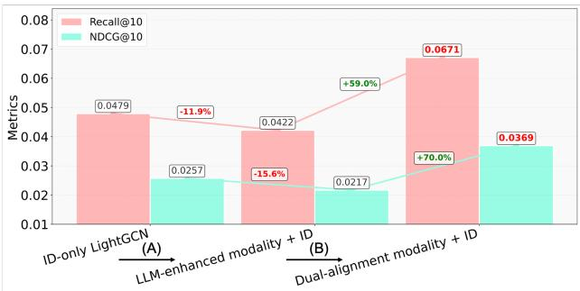
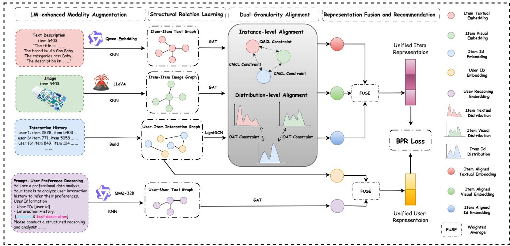
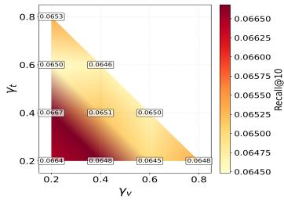
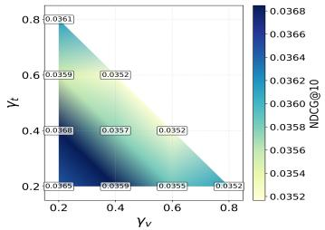
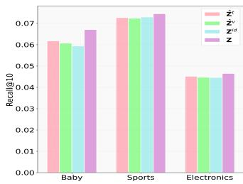
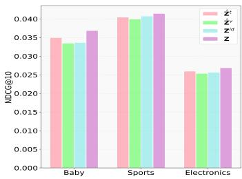
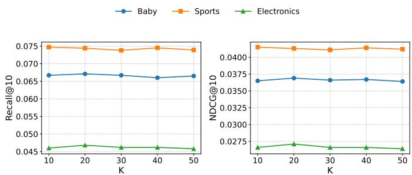

# RecGOAT: Graph Optimal Adaptive Transport for LLM-Enhanced Multimodal Recommendation with Dual Semantic Alignment

Y<sub>uec</sub>h<sub>e</sub>n<sub>g</sub> Li Kuaishou Technolo<sub>gy</sub> Beijing, C<sup>h</sup>ina li<sub>yuec</sub>h<sub>eng@</sub>k<sub>ua</sub>i<sub>s</sub>h<sub>ou.com</sub>

Wei Yan<sub>g</sub> Uni<sub>ve</sub>r<sub>s</sub>it<sub>y</sub> <sub>o</sub>f S<sub>ou</sub>th<sub>e</sub>rn C<sub>a</sub>lif<sub>o</sub>rni<sub>a</sub> L<sub>os</sub> An<sub>ge</sub>l<sub>es,</sub> USA we<sup>i</sup>yangv<sup>i</sup>a@gma<sup>il</sup>.com

Hen<sub>g</sub>wei Ju F<sub>u</sub>d<sub>a</sub>n Uni<sub>ve</sub>r<sub>s</sub>it<sub>y</sub> Shan<sub>g</sub>hai<sub>,</sub> China 23210240199<sub>@m.</sub>f<sub>u</sub>d<sub>an.e</sub>d<sub>u.cn</sub>

Chi L<sub>u</sub> Kuaishou Technolo<sub>gy</sub> Beijing, C<sup>h</sup>ina l<sub>uc</sub>hi<sub>@</sub>k<sub>ua</sub>i<sub>s</sub>h<sub>ou.com</sub>

K<sub>u</sub>n G<sub>a</sub>i U<sub>na</sub>fili<sub>a</sub>t<sub>e</sub>d Beijing, C<sup>h</sup>ina <sub>g</sub>ai.<sup>k</sup>un@<sub>qq</sub>.com

<sup>Z</sup>e<sub>y</sub>u <sup>S</sup>on<sub>g</sub> Kuaishou Technolo<sub>gy</sub> Beijing, C<sup>h</sup>ina son<sub>g</sub>ze<sub>y</sub>u@kuaishou.com

Pen<sub>g</sub> Jian<sub>g</sub> Kuaishou Technolo<sub>gy</sub> Beijing, C<sup>h</sup>ina jiangpeng@<sup>k</sup>uais<sup>h</sup>ou.com

## Abstract

Inte<sub>g</sub>ratin<sub>g</sub> lar<sub>g</sub>e lan<sub>g</sub>ua<sub>g</sub>e model (LLM) re<sub>p</sub>resentations into mul ti<sub>mo</sub>d<sub>a</sub>l <sub>recommen</sub>d<sub>a</sub>ti<sub>on</sub> h<sub>as</sub> <sub>s</sub>h<sub>own</sub> <sub>prom</sub>i<sub>se,</sub> <sub>ye</sub>t <sub>a</sub> f<sub>un</sub>d<sub>amen</sub>t<sub>a</sub>l <sub>c</sub>h<sub>a</sub>ll<sub>enge</sub> <sub>rema</sub>i<sub>ns</sub> l<sub>arge</sub>l<sub>y</sub> <sub>over</sub>l<sub>oo</sub>k<sub>e</sub>d<sub>:</sub> th<sub>e</sub> <sub>seman</sub>ti<sub>c</sub> h<sub>e</sub>t<sub>erogene</sub>it<sub>y</sub> b<sub>e</sub>t<sub>ween genera</sub>ti<sub>ve</sub> LM <sub>represen</sub>t<sub>a</sub>ti<sub>ons an</sub>d th<sub>e</sub> ID<sub>-</sub>b<sub>ase</sub>d <sub>co</sub>ll<sub>a</sub>b orative si<sub>g</sub>nals that recommendation s<sub>y</sub>stems rel<sub>y</sub> on. Naivel<sub>y</sub> in jecting LM <sup>f</sup>eatures wit<sup>h</sup>out a<sup>l</sup>ignment <sup>d</sup>egra<sup>d</sup>es recommen<sup>d</sup>ation <sub>p</sub>erformance rather than im<sub>p</sub>rovin<sub>g</sub> it. To resolve this<sub>,</sub> we <sub>p</sub>ropose RecGOAT, a dual-granularity semantic alignment framework b<sub>u</sub>ilt <sub>on</sub> <sub>grap</sub>h <sub>neura</sub>l <sub>ne</sub>t<sub>wor</sub>k<sub>s</sub> <sub>an</sub>d <sub>op</sub>ti<sub>ma</sub>l t<sub>ranspor</sub>t th<sub>eory.</sub> R<sub>ec</sub> GOAT fi<sub>rs</sub>t <sub>enr</sub>i<sub>c</sub>h<sub>es</sub> <sub>co</sub>ll<sub>a</sub>b<sub>ora</sub>ti<sub>ve</sub> <sub>seman</sub>ti<sub>cs</sub> th<sub>roug</sub>h <sub>mu</sub>lti<sub>mo</sub>d<sub>a</sub>l attentive <sub>g</sub>ra<sub>p</sub>hs that ca<sub>p</sub>ture item-item<sub>,</sub> user-item<sub>,</sub> and user-user r<sub>e</sub>l<sub>a</sub>ti<sub>o</sub>n<sub>s</sub>hi<sub>ps,</sub> initi<sub>a</sub>lizin<sub>g use</sub>r r<sub>ep</sub>r<sub>ese</sub>nt<sub>a</sub>ti<sub>o</sub>n<sub>s v</sub>i<sub>a</sub> LLM-inf<sub>e</sub>rr<sub>e</sub>d behavioral <sub>p</sub>references. It then ali<sub>g</sub>ns LM-derived modalit<sub>y</sub> re<sub>p</sub>re sentations with recommendation IDs at two com<sub>p</sub>lementar<sub>y g</sub>ran ularities: (1) instance-level ali<sub>g</sub>nment via cross-modal contrastive learnin<sub>g</sub> (CMCL), which <sub>p</sub>roduces discriminative <sub>p</sub>er-sam<sub>p</sub>le re<sub>p</sub>re sentations; and (2) distribution-level ali<sub>g</sub>nment via o<sub>p</sub>timal ada<sub>p</sub>tive trans<sub>p</sub>ort (OAT), which minimizes the 1-Wasserstein distance across <sub>mo</sub>d<sub>a</sub>l di<sub>s</sub>t<sub>r</sub>ib<sub>u</sub>ti<sub>ons</sub> t<sub>o pro</sub>d<sub>uce a un</sub>ifi<sub>e</sub>d<sub>, cons</sub>i<sub>s</sub>t<sub>en</sub>tl<sub>y a</sub>li<sub>gne</sub>d f<sub>ea</sub> t<sub>ure space.</sub> Th<sub>eore</sub>ti<sub>ca</sub>ll<sub>y, we prove</sub> th<sub>a</sub>t th<sub>e un</sub>ifi<sub>e</sub>d <sub>represen</sub>t<sub>a</sub>ti<sub>on</sub> achieves strictl<sub>y</sub> lower tar<sub>g</sub>et error than an<sub>y</sub> sin<sub>g</sub>le-modalit<sub>y</sub> re<sub>p</sub>re <sub>sen</sub>t<sub>a</sub>ti<sub>on, w</sub>ith th<sub>e gap</sub> b<sub>oun</sub>d<sub>e</sub>d b<sub>y</sub> th<sub>e</sub> W<sub>assers</sub>t<sub>e</sub>i<sub>n</sub> di<sub>s</sub>t<sub>ance an</sub>d the InfoNCE loss—<sub>p</sub>rovidin<sub>g</sub> ri<sub>g</sub>orous <sub>g</sub>uarantees for both ali<sub>g</sub>n ment consistenc<sub>y</sub> and fusion com<sub>p</sub>rehensiveness. Extensive ex<sub>p</sub>er i<sub>men</sub>t<sub>s on</sub> th<sub>ree pu</sub>bli<sub>c</sub> b<sub>enc</sub>h<sub>mar</sub>k<sub>s</sub> d<sub>emons</sub>t<sub>ra</sub>t<sub>e s</sub>t<sub>a</sub>t<sub>e-o</sub>f<sub>-</sub>th<sub>e-ar</sub>t <sub>p</sub>erformance. De<sub>p</sub>lo<sub>y</sub>ment on a lar<sub>g</sub>e-scale online advertisin<sub>g p</sub>latf<sub>orm</sub> f<sub>ur</sub>th<sub>er va</sub>lid<sub>a</sub>t<sub>es</sub> R<sub>ec</sub>GOAT’<sub>s</sub> i<sub>n</sub>d<sub>us</sub>t<sub>r</sub>i<sub>a</sub>l <sub>sca</sub>l<sub>a</sub>bilit<sub>y.</sub> O<sub>ur co</sub>d<sub>e</sub> is available at htt<sub>p</sub>s://<sub>g</sub>ithub.com/6l<sub>y</sub>c/RecGOAT-LLM4Rec.

## CCS Concepts

• Information systems → Recommender systems; Multimedia and multimodal retrieval.

## Keywords

Multimodal Recommendation<sub>,</sub> Lar<sub>g</sub>e Lan<sub>g</sub>ua<sub>g</sub>e Models<sub>,</sub> Semantic Ali<sub>g</sub>nment<sub>,</sub> Gra<sub>p</sub>h Ne<sub>u</sub>ral Networks<sub>,</sub> O<sub>p</sub>timal Trans<sub>p</sub>ort

## ACM Reference Format:

Yuechen<sub>g</sub> Li, Hen<sub>g</sub>wei Ju, Ze<sub>y</sub>u Son<sub>g</sub>, Wei Yan<sub>g</sub>, Chi Lu, Pen<sub>g</sub> Jian<sub>g</sub>, and Kun G<sub>a</sub>i<sub>.</sub> 2026<sub>.</sub> R<sub>ec</sub>GOAT: Gr<sub>ap</sub>h O<sub>p</sub>tim<sub>a</sub>l Ad<sub>ap</sub>ti<sub>ve</sub> Tr<sub>a</sub>n<sub>spo</sub>rt f<sub>o</sub>r LLM-Enh<sub>a</sub>n<sub>ce</sub>d Mu<sup>l</sup>timoda<sup>l</sup> Recommendation wit<sup>h</sup> Dua<sup>l</sup> Semantic A<sup>l</sup>ignment. In Proceedings of (Under Review). ACM, New Yor<sup>k</sup>, NY, USA, 12 pages. <sup>h</sup>ttps://doi.org/ XXXXXXX<sub>.</sub>XXXXXXX

## 1 Introduction

Recommendation s<sub>y</sub>stems (RS) have been widel<sub>y</sub> ado<sub>p</sub>ted as es-<sub>sen</sub>ti<sub>a</sub>l filt<sub>er</sub>i<sub>ng mec</sub>h<sub>an</sub>i<sub>sms</sub> i<sub>n</sub> th<sub>e era o</sub>f i<sub>n</sub>f<sub>orma</sub>ti<sub>on over</sub>l<sub>oa</sub>d [15, 22, 37, 41, 54]. However, the s<sub>p</sub>arsit<sub>y</sub> of ex<sub>p</sub>licit user-item interaction data severel<sub>y</sub> constrains recommendation <sub>p</sub>erformance<sub>,</sub> <sub>p</sub>articularl<sub>y</sub> in lar<sub>g</sub>e-scale recommendation scenarios. To address this<sub>,</sub> multimodal recommendation im<sub>p</sub>roves s<sub>y</sub>stem <sub>p</sub>erformance b<sub>y</sub> levera<sub>g</sub>in<sub>g</sub> rich item content (such as textual descri<sub>p</sub>tions and <sub>p</sub>roduct ima<sub>g</sub>es) to com<sub>p</sub>lement interaction si<sub>g</sub>nals, thereb<sub>y</sub> alleviatin<sub>g</sub> data s<sub>p</sub>arsit<sub>y,</sub> enablin<sub>g</sub> more accurate <sub>p</sub>ersonalized recommendations, and enhancin<sub>g</sub> the user ex<sub>p</sub>erience [7, 43, 46, 47, 57].

Earlier studies <sub>p</sub>rimaril<sub>y</sub> focused on em<sub>p</sub>lo<sub>y</sub>in<sub>g</sub> convolutional neural networks (e.<sub>g</sub>., VGG, ResNet) and word embeddin<sub>g</sub> models (e.<sub>g</sub>., GloVe, BERT) to learn visual and textual modal information [9, 13, 30]. These features were then fused with ID features via wei<sub>g</sub>htin<sub>g</sub>, concatenation, or element-wise multi<sub>p</sub>lication [9, 26]. To better ca<sub>p</sub>ture hi<sub>g</sub>her-order interactions<sub>,</sub> man<sub>y</sub> researchers have introduced <sub>g</sub>ra<sub>p</sub>h neural networks (GNN) into multimodal recom mendation<sub>,</sub> constructin<sub>g</sub> user-item and item-item <sub>g</sub>ra<sub>p</sub>hs to learn com<sub>p</sub>lex structural relations [1, 11]. However, due to constraints in <sub>ne</sub>t<sub>wor</sub>k <sub>arc</sub>hit<sub>ec</sub>t<sub>ure an</sub>d d<sub>ep</sub>th<sub>,</sub> th<sub>e</sub> f<sub>ea</sub>t<sub>ure ex</sub>t<sub>rac</sub>ti<sub>on capa</sub>biliti<sub>es</sub> <sub>o</sub>f th<sub>ese mo</sub>d<sub>e</sub>l<sub>s rema</sub>i<sub>n</sub> li<sub>m</sub>it<sub>e</sub>d<sub>, an</sub>d th<sub>ey</sub> l<sub>ac</sub>k <sub>su</sub>fi<sub>c</sub>i<sub>en</sub>t <sub>seman</sub> tic understandin<sub>g</sub> of users and items. For exam<sub>p</sub>le<sub>,</sub> the<sub>y</sub> stru<sub>gg</sub>le to efectivel<sub>y</sub> initialize user ID embeddin<sub>g</sub>s<sub>,</sub> t<sub>yp</sub>icall<sub>y</sub> rel<sub>y</sub>in<sub>g</sub> on random initialization [14, 56] or a<sub>gg</sub>re<sub>g</sub>atin<sub>g</sub> modal features from historicall<sub>y</sub> interacted items [21]. In <sub>p</sub>ractice, this means the<sub>y</sub> fail to accuratel<sub>y</sub> de<sub>p</sub>ict user characteristics and <sub>g</sub>enuine <sub>p</sub>references<sub>,</sub> ulti matel<sub>y</sub> de<sub>p</sub>endin<sub>g</sub> on intricate behavior modelin<sub>g</sub> and su<sub>p</sub>ervised l<sub>earn</sub>i<sub>ng</sub> i<sub>n</sub> d<sub>owns</sub>t<sub>ream</sub> t<sub>as</sub>k<sub>s.</sub>

  
Figure 1: Performance comparison between LM representa tions with or without alignment for recommendation systems on Baby Dataset. (A) Due to semantic heterogeneity, LM Representation w/o alignment leads to degradation in recommendation performance. (B) Through our dual-granularity alignment, the semantic conflict is resolved, yielding perfor mance improvements of 59% and 70%, respectively.

R<sub>ecen</sub>tl<sub>y, severa</sub>l <sub>new arc</sub>hit<sub>ec</sub>t<sub>ures</sub> h<sub>ave</sub> b<sub>een</sub> i<sub>n</sub>t<sub>ro</sub>d<sub>uce</sub>d i<sub>n</sub>t<sub>o</sub> <sub>mu</sub>lti<sub>mo</sub>d<sub>a</sub>l <sub>recommen</sub>d<sub>a</sub>ti<sub>on</sub> t<sub>o a</sub>dd<sub>ress</sub> th<sub>e c</sub>h<sub>a</sub>ll<sub>enge o</sub>f d<sub>eep se</sub> <sub>man</sub>ti<sub>c un</sub>d<sub>ers</sub>t<sub>an</sub>di<sub>ng, suc</sub>h <sub>as</sub> T<sub>rans</sub>f<sub>ormer-</sub>b<sub>ase</sub>d <sub>mo</sub>d<sub>a</sub>l f<sub>us</sub>i<sub>on</sub> frameworks [18, 49], Difusion Model-based modal denoisin<sub>g</sub> and <sub>g</sub>enerative models [16, 19, 48], and Mamba-based eficient se<sub>q</sub>uen tial modelin<sub>g</sub> methods [36]. With the scalin<sub>g</sub> law bein<sub>g</sub> successfull<sub>y</sub> <sub>va</sub>lid<sub>a</sub>t<sub>e</sub>d <sub>across var</sub>i<sub>ous</sub> fi<sub>e</sub>ld<sub>s,</sub> th<sub>e</sub> l<sub>a</sub>t<sub>es</sub>t <sub>researc</sub>h h<sub>as</sub> f<sub>ur</sub>th<sub>er a</sub>t<sub>-</sub> t<sub>e</sub>m<sub>p</sub>t<sub>e</sub>d t<sub>o</sub> int<sub>eg</sub>r<sub>a</sub>t<sub>e</sub> LLM<sub>s,</sub> LVM<sub>s, a</sub>nd MLLM<sub>s w</sub>ith r<sub>eco</sub>mm<sub>e</sub>nd<sub>a</sub>- tion s<sub>y</sub>stems [2, 39, 50], aimin<sub>g</sub> to levera<sub>g</sub>e their rich world knowl ed<sub>g</sub>e to enhance semantic re<sub>p</sub>resentations of each modalit<sub>y</sub>. How <sub>ever, curren</sub>t LM<sub>-en</sub>h<sub>ance</sub>d <sub>mu</sub>lti<sub>mo</sub>d<sub>a</sub>l <sub>recommen</sub>d<sub>a</sub>ti<sub>on mo</sub>d<sub>e</sub>l<sub>s</sub> <sub>s</sub>till <sub>ex</sub>hibit <sub>no</sub>ti<sub>cea</sub>bl<sub>e</sub> d<sub>e</sub>fi<sub>c</sub>i<sub>enc</sub>i<sub>es</sub> i<sub>n a</sub>li<sub>gn</sub>i<sub>ng mo</sub>d<sub>a</sub>l <sub>s</sub>i<sub>gna</sub>l<sub>s w</sub>ith interaction IDs [2, 38]. We observe that there exists a signifi cant semantic heterogeneity between the world knowledge encapsulated in generative large models and the ID signals relied upon for user-item interaction modeling, as illustrated in Fi<sub>g</sub>ure 1. This hetero<sub>g</sub>eneit<sub>y</sub> hinders existin<sub>g</sub> methods from full<sub>y</sub> <sub>un</sub>l<sub>eas</sub>hi<sub>ng</sub> th<sub>e</sub> <sub>po</sub>t<sub>en</sub>ti<sub>a</sub>l <sub>o</sub>f l<sub>arge</sub> <sub>mo</sub>d<sub>e</sub>l<sub>s</sub> i<sub>n</sub> <sub>recommen</sub>d<sub>a</sub>ti<sub>on</sub> t<sub>as</sub>k<sub>s.</sub> Therefore, achieving thorough and consistent alignment bet<sub>ween</sub> th<sub>e</sub> l<sub>arge</sub> <sub>mo</sub>d<sub>e</sub>l<sub>s</sub> <sub>an</sub>d <sub>recommen</sub>d<sub>a</sub>ti<sub>on</sub> <sub>sys</sub>t<sub>ems</sub> h<sub>as</sub> b<sub>ecome</sub> ke<sub>y</sub> to <sub>p</sub>ushin<sub>g</sub> the <sub>p</sub>erformance ceilin<sub>g</sub> of current recommendation <sup>s</sup>y<sup>stems.</sup>

T<sub>o</sub> <sub>a</sub>dd<sub>ress</sub> th<sub>e</sub> <sub>a</sub>f<sub>oremen</sub>ti<sub>one</sub>d <sub>c</sub>h<sub>a</sub>ll<sub>enges,</sub> thi<sub>s</sub> <sub>paper</sub> <sub>proposes</sub> <sub>a</sub> dual semantic alignment multimodal Recommendation framework via Graph Optimal Adaptive Transport (RecGOAT).

• For intra-modal learning, we construct a collaborative <sub>s</sub>i<sub>gna</sub>l <sub>represen</sub>t<sub>a</sub>ti<sub>on</sub> <sub>en</sub>h<sub>ancemen</sub>t <sub>mo</sub>d<sub>u</sub>l<sub>e</sub> b<sub>ase</sub>d <sub>on</sub> <sub>mu</sub>lti<sub>-</sub> modal attentive <sub>g</sub>ra<sub>p</sub>hs. B<sub>y</sub> buildin<sub>g</sub> multi<sub>p</sub>le <sub>g</sub>ra<sub>p</sub>hs across t<sub>e</sub>xt<sub>,</sub> im<sub>age, a</sub>nd int<sub>e</sub>r<sub>ac</sub>ti<sub>o</sub>n <sub>w</sub>ith <sub>a</sub>tt<sub>e</sub>nti<sub>o</sub>n m<sub>ec</sub>h<sub>a</sub>ni<sub>s</sub>m<sub>s, ou</sub>r a<sub>pp</sub>roach stren<sub>g</sub>thens multi-ho<sub>p</sub> collaborative si<sub>g</sub>nals amon<sub>g</sub> item-item<sub>,</sub> user-item<sub>,</sub> and user-user<sub>,</sub> thereb<sub>y</sub> ca<sub>p</sub>turin<sub>g</sub> hi<sub>g</sub>h-order <sub>s</sub>t<sub>ruc</sub>t<sub>ura</sub>l <sub>re</sub>l<sub>a</sub>ti<sub>ons</sub>hi<sub>ps on</sub> b<sub>o</sub>th th<sub>e user an</sub>d it<sub>em s</sub>id<sub>es.</sub> T<sub>o</sub> f<sub>u</sub>ll<sub>y</sub> l<sub>everage</sub> th<sub>e wor</sub>ld k<sub>now</sub>l<sub>e</sub>d<sub>ge an</sub>d <sub>reason</sub>i<sub>ng capa</sub>bili<sub>-</sub> ties of large models, we employ Qwen3-Embedding-8B and LL<sub>a</sub>VA<sub>-</sub>1<sub>.</sub>5<sub>-</sub>7B t<sub>o</sub> <sub>enco</sub>d<sub>e</sub> t<sub>ex</sub>t<sub>ua</sub>l <sub>an</sub>d <sub>v</sub>i<sub>sua</sub>l f<sub>ea</sub>t<sub>ures</sub> <sub>o</sub>f it<sub>ems,</sub> res<sub>p</sub>ectivel<sub>y</sub>. Meanwhile<sub>,</sub> b<sub>y</sub> constructin<sub>g</sub> <sub>p</sub>ersonalized behavioral prompts, we utilize QwQ-32B to infer each user’s m<sub>u</sub>lti-dimensional item <sub>p</sub>references<sub>, w</sub>hich ser<sub>v</sub>e as initiali<sub>ze</sub>d t<sub>ex</sub>t<sub>ua</sub>l f<sub>ea</sub>t<sub>ures</sub> f<sub>or users.</sub>

• For cross-modal alignment, we design a dual-granularity <sub>seman</sub>ti<sub>c a</sub>li<sub>gnmen</sub>t f<sub>ramewor</sub>k b<sub>e</sub>t<sub>ween</sub> LLM<sub>-en</sub>h<sub>ance</sub>d <sub>mo</sub>d<sub>a</sub>l<sub>-</sub> iti<sub>es a</sub>nd r<sub>eco</sub>mm<sub>e</sub>nd<sub>a</sub>ti<sub>o</sub>n ID<sub>s.</sub> Fir<sub>s</sub>t<sub>, we pe</sub>rf<sub>o</sub>rm in<sub>s</sub>t<sub>a</sub>n<sub>ce</sub>-l<sub>eve</sub>l ali<sub>g</sub>nment via cross-modal contrastive learnin<sub>g</sub> across text<sub>,</sub> <sub>v</sub>i<sub>s</sub>i<sub>o</sub>n<sub>, a</sub>nd ID m<sub>o</sub>d<sub>a</sub>liti<sub>es, o</sub>bt<sub>a</sub>inin<sub>g</sub> di<sub>sc</sub>rimin<sub>a</sub>ti<sub>ve</sub> m<sub>u</sub>ltimodal re<sub>p</sub>resentations. Second<sub>,</sub> we introd<sub>u</sub>ce an o<sub>p</sub>timal ada<sub>p</sub>tive trans<sub>p</sub>ort techni<sub>q</sub>ue to achieve distribution-level <sub>a</sub>li<sub>gnmen</sub>t <sub>an</sub>d <sub>represen</sub>t<sub>a</sub>ti<sub>on</sub> f<sub>us</sub>i<sub>on</sub> b<sub>e</sub>t<sub>ween seman</sub>ti<sub>c mo</sub>d<sub>a</sub>l<sub>-</sub> iti<sub>es a</sub>nd r<sub>eco</sub>mm<sub>e</sub>nd<sub>a</sub>ti<sub>o</sub>n ID<sub>s.</sub> B<sub>y</sub> minimizin<sub>g</sub> th<sub>e</sub> 1-W<sub>asse</sub>r<sub>s</sub>t<sub>e</sub>in di<sub>s</sub>t<sub>ance</sub> b<sub>e</sub>t<sub>ween</sub> dif<sub>eren</sub>t <sub>mo</sub>d<sub>a</sub>l di<sub>s</sub>t<sub>r</sub>ib<sub>u</sub>ti<sub>ons,</sub> th<sub>e</sub>i<sub>r</sub> f<sub>ea</sub>t<sub>ure</sub> embeddin<sub>g</sub>s are trans<sub>p</sub>orted via an o<sub>p</sub>timal trans<sub>p</sub>ort matrix into a unified ali<sub>g</sub>ned s<sub>p</sub>ace<sub>,</sub> <sub>y</sub>ieldin<sub>g</sub> consistent and com<sub>p</sub>rehensi<sub>v</sub>e f<sub>u</sub>sed item re<sub>p</sub>resentations. Additionall<sub>y,</sub> <sub>w</sub>e incor<sub>p</sub>orate ada<sub>p</sub>tive learnable <sub>p</sub>arameters into each trans-<sub>p</sub>ort matrix<sub>,</sub> which brid<sub>g</sub>es OT ali<sub>g</sub>nment with the downstream recommendation task and enables <sub>p</sub>recise su<sub>p</sub>ervision <sub>o</sub>f th<sub>e</sub> t<sub>ranspor</sub>t <sub>process.</sub> N<sub>o</sub>t<sub>a</sub>bl<sub>y, we prov</sub>id<sub>e a</sub> th<sub>eore</sub>ti<sub>ca</sub>l <sub>proo</sub>f th<sub>a</sub>t th<sub>e</sub> <sub>mu</sub>t<sub>ua</sub>l <sub>cons</sub>t<sub>ra</sub>i<sub>n</sub>t b<sub>e</sub>t<sub>ween</sub> <sub>any</sub> <sub>s</sub>i<sub>ng</sub>l<sub>e-source</sub> <sub>mo</sub>d<sub>a</sub>l di<sub>s</sub>t<sub>r</sub>ib<sub>u</sub>ti<sub>on an</sub>d th<sub>e un</sub>ifi<sub>e</sub>d f<sub>use</sub>d di<sub>s</sub>t<sub>r</sub>ib<sub>u</sub>ti<sub>on can</sub> b<sub>e</sub> b<sub>oun</sub>d<sub>e</sub>d b<sub>y</sub> th<sub>e</sub> W<sub>assers</sub>t<sub>e</sub>i<sub>n</sub> di<sub>s</sub>t<sub>ance an</sub>d th<sub>e</sub> I<sub>n</sub>f<sub>o</sub>NCE l<sub>oss.</sub> Thi<sub>s</sub> d<sub>emons</sub>t<sub>ra</sub>t<sub>es</sub> th<sub>a</sub>t th<sub>e</sub> <sub>un</sub>ifi<sub>e</sub>d <sub>represen</sub>t<sub>a</sub>ti<sub>ons</sub> <sub>op</sub>ti<sub>m</sub>i<sub>ze</sub>d in RecGOAT achieves strong alignment consistency and fusion comprehensiveness.

## Th<sub>e ma</sub>i<sub>n con</sub>t<sub>r</sub>ib<sub>u</sub>ti<sub>ons o</sub>f thi<sub>s paper are summar</sub>i<sub>ze</sub>d <sub>as</sub> f<sub>o</sub>ll<sub>ows:</sub>

• We <sub>p</sub>ro<sub>p</sub>ose RecGOAT, an LLM-enhanced multimodal rec-<sub>ommen</sub>d<sub>a</sub>ti<sub>on</sub> f<sub>ramewor</sub>k th<sub>a</sub>t <sub>reso</sub>l<sub>ves</sub> th<sub>e seman</sub>ti<sub>c</sub> h<sub>e</sub>t<sub>-</sub> ero<sub>g</sub>eneit<sub>y</sub> between LLM-derived modalit<sub>y</sub> re<sub>p</sub>resentations <sub>a</sub>nd ID-b<sub>ase</sub>d <sub>co</sub>ll<sub>a</sub>b<sub>o</sub>r<sub>a</sub>ti<sub>ve s</sub>i<sub>g</sub>n<sub>a</sub>l<sub>s.</sub> O<sub>u</sub>r R<sub>ec</sub>GOAT <sub>u</sub>nifi<sub>es</sub> structure-aware <sub>g</sub>ra<sub>p</sub>h au<sub>g</sub>mentation with a dual-<sub>g</sub>ranularit<sub>y</sub> a<sup>l</sup>i nment o<sup>b</sup>jective, consistin o<sup>f</sup> instance-<sup>l</sup>eve<sup>l</sup> cross-mo<sup>d</sup>a<sup>l</sup> contrastive learnin<sub>g</sub> (CMCL) and distribution-level o<sub>p</sub>timal ada<sub>p</sub>tive trans<sub>p</sub>ort (OAT).

• We theoreticall<sub>y</sub> establish that the unified re<sub>p</sub>resentation <sub>ac</sub>hi<sub>eves a</sub> l<sub>ower</sub> t<sub>arge</sub>t <sub>error</sub> th<sub>an any</sub> i<sub>n</sub>di<sub>v</sub>id<sub>ua</sub>l <sub>mo</sub>d<sub>a</sub>lit<sub>y,</sub> with the error <sub>g</sub>a<sub>p</sub> ri<sub>g</sub>orousl<sub>y</sub> bounded b<sub>y</sub> the Wasserstein distance and the InfoNCE loss<sub>,</sub> thereb<sub>y</sub> oferin<sub>g g</sub>uarantees of fusion com<sub>p</sub>rehensiveness and ali<sub>g</sub>nment consistenc<sub>y</sub>.

• Extensive ex<sub>p</sub>eriments on three <sub>p</sub>ublic datasets and a lar<sub>g</sub>e-<sub>sca</sub>l<sub>e on</sub>li<sub>ne a</sub>d<sub>ver</sub>ti<sub>s</sub>i<sub>ng p</sub>l<sub>a</sub>tf<sub>orm</sub> d<sub>emons</sub>t<sub>ra</sub>t<sub>e</sub> th<sub>e e</sub>f<sub>ec</sub>ti<sub>ve-</sub> n<sub>ess a</sub>nd <sub>sca</sub>l<sub>a</sub>bilit<sub>y o</sub>f R<sub>ec</sub>GOAT<sub>.</sub> Abl<sub>a</sub>ti<sub>o</sub>n<sub>s a</sub>nd <sub>a</sub>n<sub>a</sub>l<sub>yses</sub> f<sub>ur</sub>th<sub>er con</sub>fi<sub>rm</sub> th<sub>e necess</sub>it<sub>y o</sub>f OT<sub>-</sub>b<sub>ase</sub>d di<sub>s</sub>t<sub>r</sub>ib<sub>u</sub>ti<sub>on a</sub>li<sub>gn</sub> <sub>men</sub>t <sub>an</sub>d <sub>va</sub>lid<sub>a</sub>t<sub>e</sub> th<sub>e c</sub>l<sub>a</sub>i<sub>me</sub>d <sub>a</sub>li<sub>gnmen</sub>t <sub>cons</sub>i<sub>s</sub>t<sub>ency an</sub>d fusion com<sub>p</sub>rehensiveness.

## 2 Related Work

## 2.1 Multimodal Recommendation

M<sub>u</sub>lti<sub>mo</sub>d<sub>a</sub>l <sub>recommen</sub>d<sub>a</sub>ti<sub>on</sub> <sub>a</sub>dd<sub>ress</sub> th<sub>e</sub> <sub>c</sub>h<sub>a</sub>ll<sub>enge</sub> <sub>o</sub>f <sub>sparse</sub> <sub>user-</sub>it<sub>em</sub> interaction b<sub>y</sub> extractin<sub>g</sub> and inte<sub>g</sub>ratin<sub>g</sub> rich content features<sub>,</sub> such as textual, visual, and acoustic information. VBPR [13] first ex t<sub>rac</sub>t<sub>e</sub>d <sub>v</sub>i<sub>sua</sub>l f<sub>ea</sub>t<sub>ures v</sub>i<sub>a</sub> CNN <sub>an</sub>d f<sub>use</sub>d th<sub>em w</sub>ith ID f<sub>ea</sub>t<sub>ures</sub> throu<sub>g</sub>h a wei<sub>g</sub>hted loss function. Given the stron<sub>g</sub> ca<sub>p</sub>abilit<sub>y</sub> of GNNs in ca<sub>p</sub>turin<sub>g</sub> hi<sub>g</sub>h-order structural relations, MMGCN [40] constructs user-item bi<sub>p</sub>artite <sub>g</sub>ra<sub>p</sub>hs <sub>p</sub>er modalit<sub>y</sub> and <sub>p</sub>erforms multi-level messa<sub>g</sub>e <sub>p</sub>ro<sub>p</sub>a<sub>g</sub>ation. Further, Li<sub>g</sub>htGCN [14] sim<sub>p</sub>li fi<sub>es</sub> <sub>grap</sub>h <sub>convo</sub>l<sub>u</sub>ti<sub>on</sub> f<sub>or</sub> <sub>co</sub>ll<sub>a</sub>b<sub>ora</sub>ti<sub>ve</sub> filt<sub>er</sub>i<sub>ng</sub> b<sub>y</sub> <sub>re</sub>t<sub>a</sub>i<sub>n</sub>i<sub>ng</sub> <sub>on</sub>l<sub>y</sub> the essential nei<sub>g</sub>hbor a<sub>gg</sub>re<sub>g</sub>ation com<sub>p</sub>onent. Moreover<sub>,</sub> LAT-TICE [52] and FREEDOM [56] construct d namic/frozen item-item <sub>grap</sub>h<sub>s</sub> t<sub>o</sub> f<sub>ur</sub>th<sub>er exp</sub>l<sub>ore</sub> th<sub>e po</sub>t<sub>en</sub>ti<sub>a</sub>l <sub>o</sub>f <sub>grap</sub>h l<sub>earn</sub>i<sub>ng.</sub>

In recent <sub>y</sub>ears<sub>,</sub> ins<sub>p</sub>ired b<sub>y</sub> the success of novel architectures such as Transformer [34] and Mamba [12] in various fields, re <sub>searc</sub>h<sub>ers</sub> h<sub>ave a</sub>l<sub>so</sub> i<sub>n</sub>t<sub>ro</sub>d<sub>uce</sub>d th<sub>em</sub> i<sub>n</sub>t<sub>o mu</sub>lti<sub>mo</sub>d<sub>a</sub>l <sub>recommen</sub>d<sub>a-</sub> ti<sub>on</sub> t<sub>o en</sub>h<sub>ance</sub> th<sub>e represen</sub>t<sub>a</sub>ti<sub>on o</sub>f <sub>user pre</sub>f<sub>erences an</sub>d it<sub>em</sub> f<sub>ea-</sub> tures. RecFormer [18] discards item ID de<sub>p</sub>endenc<sub>y</sub> and addresses <sub>co</sub>ld<sub>-s</sub>t<sub>ar</sub>t <sub>an</sub>d <sub>cross-</sub>d<sub>oma</sub>i<sub>n</sub> t<sub>rans</sub>f<sub>er pro</sub>bl<sub>ems w</sub>ith <sub>a</sub> bidi<sub>rec</sub>ti<sub>ona</sub>l Transformer. UGT [49] stren<sub>g</sub>thens modalit<sub>y</sub> ali<sub>g</sub>nment and fusion throu<sub>g</sub>h an end-to-end architecture combinin<sub>g</sub> multi-wa<sub>y</sub> Transf<sub>ormer</sub> <sub>an</sub>d <sub>a</sub> <sub>un</sub>ifi<sub>e</sub>d GNN<sub>.</sub> F<sub>ur</sub>th<sub>ermore,</sub> th<sub>e</sub> Dif<sub>us</sub>i<sub>on</sub> M<sub>o</sub>d<sub>e</sub>l <sub>para</sub> di<sub>gm s</sub>hift<sub>s recommen</sub>d<sub>a</sub>ti<sub>on</sub> f<sub>rom</sub> “<sub>c</sub>l<sub>ass</sub>ifi<sub>ca</sub>ti<sub>on</sub>” t<sub>o</sub> “<sub>genera</sub>ti<sub>on</sub>”<sub>:</sub> DreamRec [48] <sub>g</sub>enerates oracle items via <sub>g</sub>uided difusion, avoidin<sub>g</sub> ne<sub>g</sub>ative sam<sub>p</sub>lin<sub>g</sub> to eliminate noise interference; DifMM [16] ex tends multimodal ada<sub>p</sub>tation b<sub>y g</sub>eneratin<sub>g</sub> modalit<sub>y</sub>-aware interac tion <sub>g</sub>ra<sub>p</sub>hs and incor<sub>p</sub>oratin<sub>g</sub> cross-modal contrastive learnin<sub>g</sub>. To im<sub>p</sub>rove model eficienc<sub>y</sub>, FindRec [36] em<sub>p</sub>lo<sub>y</sub>s linear-com<sub>p</sub>lexit<sub>y</sub> Mamba la<sub>y</sub>ers to model lon<sub>g</sub>-ran<sub>g</sub>e se<sub>q</sub>uential de<sub>p</sub>endencies<sub>,</sub> inte-<sub>g</sub>ratin<sub>g</sub> Stein kernel distribution ali<sub>g</sub>nment with cross-modal ex<sub>p</sub>ert rout<sup>i</sup>n<sub>g</sub>.

Des<sub>p</sub>ite notable <sub>p</sub>ro<sub>g</sub>ress in feature re<sub>p</sub>resentation<sub>,</sub> scenario ada<sub>p</sub> tation<sub>,</sub> and eficienc<sub>y</sub> o<sub>p</sub>timization achieved b<sub>y</sub> the above multimodal recommendation methods, their core limitation lies in their lack of the model scale required for deep semantic abstraction and reasoning.

## 2.2 LM-enhanced Recommendation

Lar<sub>g</sub>e models (LMs), em<sub>p</sub>owered b<sub>y</sub> their stron<sub>g</sub> semantic under-<sub>s</sub>t<sub>an</sub>di<sub>ng, cross-mo</sub>d<sub>a</sub>l i<sub>n</sub>t<sub>egra</sub>ti<sub>on, an</sub>d k<sub>now</sub>l<sub>e</sub>d<sub>ge</sub> t<sub>rans</sub>f<sub>er capa</sub>bili ti<sub>es,</sub> h<sub>ave e</sub>f<sub>ec</sub>ti<sub>ve</sub>l<sub>y compensa</sub>t<sub>e</sub>d f<sub>or</sub> k<sub>ey</sub> li<sub>m</sub>it<sub>a</sub>ti<sub>ons o</sub>f t<sub>ra</sub>diti<sub>ona</sub>l <sub>recommen</sub>d<sub>a</sub>ti<sub>on s s</sub>t<sub>ems,</sub> i<sub>nc</sub>l<sub>u</sub>di<sub>n</sub> i<sub>ne</sub>fi<sub>c</sub>i<sub>en</sub>t <sub>mo</sub>d<sub>a</sub>l f<sub>us</sub>i<sub>on an</sub>d i<sub>nsu</sub>fi<sub>c</sub>i<sub>en</sub>t fi<sub>ne-gra</sub>i<sub>ne</sub>d <sub>pre</sub>f<sub>erence mo</sub>d<sub>e</sub>li<sub>ng.</sub> Th<sub>ey</sub> h<sub>ave</sub> th<sub>us gra</sub>d <sub>ua</sub>ll<sub>y</sub> b<sub>ecome</sub> <sub>a</sub> <sub>core</sub> d<sub>r</sub>i<sub>v</sub>i<sub>ng</sub> f<sub>orce</sub> i<sub>n</sub> <sub>a</sub>d<sub>vanc</sub>i<sub>ng</sub> <sub>mu</sub>lti<sub>mo</sub>d<sub>a</sub>l <sub>recom</sub> mendation [25]. TALLRec [2] <sub>p</sub>ro<sub>p</sub>osed an eficient two-sta<sub>g</sub>e tunin<sub>g</sub> framework<sub>,</sub> oferin<sub>g</sub> a foundational solution for ada<sub>p</sub>tin<sub>g</sub> LLMs to recommendation scenarios. Rec-GPT4V [24] desi<sub>g</sub>ned a Visual Summar<sub>y</sub> Thou<sub>g</sub>ht strate<sub>gy</sub> to convert item ima<sub>g</sub>es into structured t<sub>ex</sub>t<sub>ua</sub>l <sub>summar</sub>i<sub>es.</sub> T<sub>o a</sub>dd<sub>ress</sub> th<sub>e</sub> i<sub>ssue</sub> th<sub>a</sub>t LLM<sub>s</sub> t<sub>en</sub>d t<sub>o over</sub> look visual information in end-to-end fine-tunin<sub>g</sub>, NoteLLM-2 [51] introduced multimodal in-context learnin<sub>g,</sub> contrastive learnin<sub>g,</sub> <sub>an</sub>d <sub>a</sub> l<sub>a</sub>t<sub>e-</sub>f<sub>us</sub>i<sub>on mec</sub>h<sub>an</sub>i<sub>sm</sub> t<sub>o</sub> b<sub>a</sub>l<sub>ance a</sub>tt<sub>en</sub>ti<sub>on across mo</sub>d<sub>a</sub>liti<sub>es.</sub> Diferin<sub>g</sub> from a sin<sub>g</sub>le-task focus, UniMP [39] constructed a unified multimodal <sub>p</sub>ersonalization framework<sub>,</sub> inte<sub>g</sub>ratin<sub>g</sub> hetero<sub>g</sub>eneous i<sub>n</sub>f<sub>orma</sub>ti<sub>on</sub> th<sub>roug</sub>h <sub>a un</sub>ifi<sub>e</sub>d d<sub>a</sub>t<sub>a</sub> f<sub>orma</sub>t <sub>an</sub>d <sub>rea</sub>li<sub>z</sub>i<sub>ng mu</sub>lti<sub>mo</sub>d<sub>a</sub>l ali<sub>g</sub>nment and fusion via cross-la<sub>y</sub>er cross-attention. IRLLRec [38] focused on intent re<sub>p</sub>resentation learnin<sub>g,</sub> em<sub>p</sub>lo<sub>y</sub>in<sub>g</sub> dual-tower ali<sub>g</sub>nment and momentum distillation to ali<sub>g</sub>n textual intents with interaction intents.

Whil<sub>e</sub> th<sub>e a</sub>f<sub>oremen</sub>ti<sub>one</sub>d LM<sub>-en</sub>h<sub>ance</sub>d <sub>recommen</sub>d<sub>a</sub>ti<sub>on me</sub>th<sub>-</sub> ods have demonstrated strong performance, their alignment mechanisms remain largely confined to instance-level or pair-wise local alignment, without considering global distribution-level alignment. As a result, these models struggle to capture global <sub>pa</sub>tt<sub>erns across mu</sub>lti<sub>mo</sub>d<sub>a</sub>l<sub>, cross-</sub>d<sub>oma</sub>i<sub>n, or</sub> i<sub>n</sub>t<sub>erac</sub>ti<sub>ve</sub> d<sub>a</sub>t<sub>a.</sub>

## 2.3 OT-based Distribution Alignment

I<sub>n</sub> th<sub>e</sub> fi<sub>e</sub>ld <sub>o</sub>f <sub>mo</sub>d<sub>a</sub>l <sub>a</sub>li<sub>gnmen</sub>t<sub>, pr</sub>i<sub>or researc</sub>h h<sub>as pr</sub>i<sub>mar</sub>il<sub>y re-</sub> lied on techni<sub>q</sub>ues such as su<sub>p</sub>ervised fine-tunin<sub>g</sub> [2], contrastive learnin<sub>g</sub> [51], and <sub>g</sub>ra<sub>p</sub>h-structural learnin<sub>g</sub> (or cross-attention mechanisms) [39, 50]. However, these a<sub>pp</sub>roaches are often confi<sub>ne</sub>d t<sub>o</sub> i<sub>ns</sub>t<sub>ance-</sub>l<sub>eve</sub>l <sub>or</sub> l<sub>oca</sub>l <sub>no</sub>d<sub>e-pa</sub>i<sub>r a</sub>li<sub>gnmen</sub>t<sub>,</sub> f<sub>a</sub>ili<sub>ng</sub> t<sub>o ac-</sub> <sub>coun</sub>t f<sub>or</sub> th<sub>e overa</sub>ll <sub>cross-mo</sub>d<sub>a</sub>l f<sub>ea</sub>t<sub>ure</sub> di<sub>s</sub>t<sub>r</sub>ib<sub>u</sub>ti<sub>on.</sub> T<sub>o overcome</sub> this limitation, we further introduce the concept of distribution alignment. Compared with commonly used KL divergence, the Wasserstein distance from o<sub>p</sub>timal trans<sub>p</sub>ort (OT) theor<sub>y</sub> can directl<sub>y</sub> characterize the <sub>g</sub>eometric structure (e.<sub>g</sub>., sha<sub>p</sub>e and distance) between distribution su<sub>pp</sub>orts<sub>,</sub> makin<sub>g</sub> it more suitable for matchin<sub>g</sub> and ali<sub>g</sub>nin<sub>g</sub> modal distributions [28, 32]. OTKGE [3] <sub>p</sub>ro<sub>p</sub>osed <sub>an</sub> <sub>op</sub>ti<sub>ma</sub>l t<sub>ranspor</sub>t<sub>-</sub>b<sub>ase</sub>d k<sub>now</sub>l<sub>e</sub>d<sub>ge</sub> <sub>grap</sub>h <sub>em</sub>b<sub>e</sub>ddi<sub>ng</sub> <sub>me</sub>th<sub>o</sub>d<sub>,</sub> formulatin<sub>g</sub> multimodal fusion as an OT <sub>p</sub>roblem and o<sub>p</sub>timizin<sub>g</sub> the Wasserstein distance between distributions. Moreover, GOT [5] constructs d<sub>y</sub>namic <sub>g</sub>ra<sub>p</sub>hs and inte<sub>g</sub>rates the Wasserstein distance f<sub>or no</sub>d<sub>e ma</sub>t<sub>c</sub>hi<sub>ng an</sub>d th<sub>e</sub> G<sub>romov–</sub>W<sub>assers</sub>t<sub>e</sub>i<sub>n</sub> di<sub>s</sub>t<sub>ance</sub> f<sub>or e</sub>d<sub>ge</sub> matchin<sub>g</sub>. In multimodal recommendation, MOTKD [45] em<sub>p</sub>lo<sub>y</sub>s o<sub>p</sub>timal trans<sub>p</sub>ort to ali<sub>g</sub>n textual<sub>,</sub> visual<sub>,</sub> and acoustic modalities<sub>,</sub> <sub>an</sub>d d<sub>es</sub>i<sub>gns</sub> <sub>a</sub> <sub>mu</sub>lti<sub>-</sub>l<sub>eve</sub>l k<sub>now</sub>l<sub>e</sub>d<sub>ge</sub> di<sub>s</sub>till<sub>a</sub>ti<sub>on</sub> <sub>mo</sub>d<sub>u</sub>l<sub>e</sub> t<sub>o</sub> f<sub>ur</sub>th<sub>er</sub> strengthen alignment. However, it does not explore the potential of OT for aligning modalities with IDs, nor does it provide theoretical guarantees for such alignment.

## 3 Methodology

To address the semantic hetero<sub>g</sub>eneit<sub>y</sub> between modalities and IDs <sub>an</sub>d f<sub>u</sub>ll<sub>y</sub> <sub>un</sub>l<sub>eas</sub>h th<sub>e</sub> <sub>po</sub>t<sub>en</sub>ti<sub>a</sub>l <sub>o</sub>f LM<sub>s</sub> i<sub>n</sub> <sub>mu</sub>lti<sub>mo</sub>d<sub>a</sub>l <sub>recommen</sub>d<sub>a-</sub> tion, we propose a novel dual semantic alignment framework, Rec-GOAT, which o erates at both instance-level and distribution-level ali<sub>g</sub>nment. Section 3.1 and Section 3.2 describe the intra-modal <sub>grap</sub>h l<sub>earn</sub>i<sub>ng mo</sub>d<sub>e</sub>li<sub>ng w</sub>ith LM<sub>-en</sub>h<sub>ance</sub>d <sub>mo</sub>d<sub>a</sub>lit<sub>y an</sub>d th<sub>e</sub> <sub>cross-mo</sub>d<sub>a</sub>l d<sub>ua</sub>l <sub>seman</sub>ti<sub>c</sub> <sub>a</sub>li<sub>gnmen</sub>t f<sub>ramewor</sub>k<sub>,</sub> <sub>respec</sub>ti<sub>ve</sub>l<sub>y,</sub> f<sub>o</sub>l<sub>-</sub> l<sub>owe</sub>d b<sub>y</sub> th<sub>e</sub> th<sub>eore</sub>ti<sub>ca</sub>l <sub>guaran</sub>t<sub>ees o</sub>f <sub>our approac</sub>h i<sub>n</sub> S<sub>ec</sub>ti<sub>on</sub> 3.3. In Section 3.4<sub>,</sub> we em<sub>p</sub>lo<sub>y</sub> the ali<sub>g</sub>ned unified re<sub>p</sub>resentations f<sub>o</sub>r r<sub>eco</sub>mm<sub>e</sub>nd<sub>a</sub>ti<sub>o</sub>n <sub>p</sub>r<sub>e</sub>f<sub>e</sub>r<sub>e</sub>n<sub>ce op</sub>timiz<sub>a</sub>ti<sub>o</sub>n<sub>.</sub> In S<sub>ec</sub>ti<sub>o</sub>n 3<sub>.</sub>5<sub>, we</sub> <sub>ana</sub>l<sub>yze</sub> th<sub>e</sub> ti<sub>me</sub> <sub>an</sub>d <sub>space</sub> <sub>comp</sub>l<sub>ex</sub>iti<sub>es</sub> <sub>o</sub>f th<sub>e</sub> k<sub>ey</sub> <sub>mo</sub>d<sub>u</sub>l<sub>es</sub> i<sub>n</sub> R<sub>ec-</sub> GOAT<sub>,</sub> demonstratin<sub>g</sub> its <sub>p</sub>otential for de<sub>p</sub>lo<sub>y</sub>ment in lar<sub>g</sub>e-scale r<sub>eco</sub>mm<sub>e</sub>nd<sub>e</sub>r <sub>sys</sub>t<sub>e</sub>m<sub>s.</sub> Th<sub>e ove</sub>r<sub>a</sub>ll <sub>a</sub>r<sub>c</sub>hit<sub>ec</sub>t<sub>u</sub>r<sub>e o</sub>f R<sub>ec</sub>GOAT i<sub>s</sub> ill<sub>u</sub>strated in Fi<sub>gu</sub>re 2.

  
Figure 2: The overall framework of our RecGOAT. It sequentially performs LM-enhanced modality augmentation for feature extraction, structural relation learning for graph-based collaborative signal modeling, dual-granularity alignment (instance and distribution levels) for cross-modal consistency, and final representation fusion & recommendation.

## 3.1 Intra-modal: LM-enhanced Modality Augmentation and Graph Learning

For each modalit<sub>y</sub>, we introduce lar<sub>g</sub>e models (includin<sub>g</sub> LLMs and LVLMs) for enhancement and extract hi<sub>g</sub>h-order collaborative information b<sub>y</sub> constructin<sub>g</sub> attentive <sub>g</sub>ra<sub>p</sub>hs.

3.1.1 Item-Item Multimodal Graph Representation Learning. To en h<sub>ance</sub> hi h<sub>-or</sub>d<sub>er co</sub>ll<sub>a</sub>b<sub>ora</sub>ti<sub>ve re</sub>l<sub>a</sub>ti<sub>ons</sub>hi <sub>s</sub> b<sub>e</sub>t<sub>ween</sub> it<sub>ems, we con</sub> <sub>s</sub>t<sub>ruc</sub>t <sub>separa</sub>t<sub>e</sub> t<sub>ex</sub>t<sub>ua</sub>l <sub>an</sub>d <sub>v</sub>i<sub>sua</sub>l <sub>mo</sub>d<sub>a</sub>lit<sub>y</sub> <sub>grap</sub>h<sub>s</sub> $\mathcal G ^ { m } = \{ \mathcal I , \mathcal E ^ { m } , \chi ^ { m } \}$ where� ∈ {�, �}. Ins<sub>p</sub>ired b<sub>y</sub> FREEDOM [56], we ado<sub>p</sub>t the K-nearest nei<sub>g</sub>hbors (KNN) al<sub>g</sub>orithm to build frozen item-item <sub>g</sub>ra<sub>p</sub>hs based <sub>on</sub> th<sub>e</sub> i<sub>n</sub>iti<sub>a</sub>l LM<sub>-en</sub>h<sub>ance</sub>d <sub>mo</sub>d<sub>a</sub>l f<sub>ea</sub>t<sub>ures</sub> $X ^ { m } ~ = ~ \{ x _ { i } ^ { m } ~ \vert ~ i ~ =$ $1 , 2 , \ldots , | { \cal I } | \}$ <sub>.</sub> Th<sub>e</sub> LM<sub>-en</sub>h<sub>ance</sub>d <sub>mo</sub>d<sub>a</sub>l f<sub>ea</sub>t<sub>ures</sub> $\chi m$ <sub>are o</sub>bt<sub>a</sub>i<sub>ne</sub>d b<sub>y</sub> <sub>p</sub>rocessin<sub>g</sub> raw item content with <sub>p</sub>retrained lar<sub>g</sub>e models. S<sub>p</sub>ecifi call<sub>y,</sub> for an item �<sub>,</sub> its raw textual descri<sub>p</sub>tion $t _ { i }$ and visual ima<sub>g</sub>e $v _ { i }$ <sub>are enco</sub>d<sub>e</sub>d <sub>separa</sub>t<sub>e</sub>l<sub>y:</sub>

$$
\boldsymbol {x} _ {\boldsymbol {i}} ^ {t} = f _ {t} (t _ {i} \mid \theta_ {t}), \quad \boldsymbol {x} _ {\boldsymbol {i}} ^ {\boldsymbol {v}} = f _ {v} (v _ {i} \mid \theta_ {v}),\tag{1}
$$

<sub>w</sub>h<sub>ere</sub> $f _ { t }$ <sub>an</sub>d $f _ { v }$ represent the pretrained LLM (e.g., Qwen-Embedding [53]) and LVLM (e.<sub>g</sub>., LLaVA [23]) <sub>p</sub>arameterized b<sub>y</sub> $\theta _ { t }$ <sub>an</sub>d $\theta _ { v } ,$ res<sub>p</sub>ecti<sub>v</sub>el<sub>y</sub>. For t<sub>w</sub>o items $i , j \in \mathcal { I } ^ { m }$ <sub>,</sub> the ed<sub>g</sub>e wei<sub>g</sub>ht in the <sub>g</sub>ra<sub>p</sub>h is com<sub>p</sub>uted via cosine similarit<sub>y</sub> as follows: $s _ { i j } ^ { m } = \frac { x _ { i } ^ { m } \cdot x _ { j } ^ { m } } { \| x _ { i } ^ { m } \| \| x _ { j } ^ { m } \| }$

To s<sub>p</sub>arsif<sub>y</sub> the modalit<sub>y</sub> <sub>g</sub>ra<sub>p</sub>h<sub>,</sub> we retain onl<sub>y</sub> the to<sub>p</sub>-� ed<sub>g</sub>es <sub>w</sub>ith th<sub>e</sub> hi<sub>g</sub>h<sub>es</sub>t <sub>s</sub>i<sub>m</sub>il<sub>ar</sub>it<sub>y</sub> f<sub>or eac</sub>h it<sub>em no</sub>d<sub>e:</sub>

$$
\mathcal {E} ^ {m} = \big \{e _ {i j} ^ {m} \mid i, j \in \mathcal {I} ^ {m} \big \}, \quad e _ {i j} ^ {m} = \left\{ \begin{array}{l l} 1, & \text { if } s _ {i j} ^ {m} \in \text { top - K } (\{s _ {i k} ^ {m} \mid k \neq i \}), \\ 0, & \text { otherwise }, \end{array} \right.\tag{2}
$$

<sub>w</sub>h<sub>ere</sub> $e _ { i j } ^ { m } = 1$ indicates the <sub>p</sub>resence of an association ed<sub>g</sub>e between th<sub>e</sub> t<sub>wo</sub> it<sub>ems.</sub>

After obtainin<sub>g</sub> the <sub>g</sub>ra<sub>p</sub>h ${ \mathcal { G } } ^ { m }$ f<sub>or</sub> <sub>eac</sub>h <sub>mo</sub>d<sub>a</sub>lit<sub>y,</sub> <sub>we</sub> <sub>emp</sub>l<sub>oy</sub> Gra<sub>p</sub>h Attention Network [35] to learn node re<sub>p</sub>resentations $z _ { i } ^ { m }$ :

$$
z _ {i} ^ {\boldsymbol {m}} = \left\| _ {h = 1} ^ {H} \sigma \left(\sum_ {j \in \mathcal {N} _ {i} ^ {m}} \alpha_ {i j} ^ {m, h} \mathbf {W} ^ {h} \boldsymbol {x} _ {j} ^ {\boldsymbol {m}}\right) \in \mathbb {R} ^ {d}, \right.\tag{3}
$$

<sub>w</sub>h<sub>ere</sub> $\alpha _ { i j } ^ { m , h }$ i<sub>s</sub> th<sub>e norma</sub>li<sub>ze</sub>d <sub>a</sub>tt<sub>en</sub>ti<sub>on we</sub>i<sub>g</sub>ht b<sub>e</sub>t<sub>ween no</sub>d<sub>e</sub> � <sub>an</sub>d its nei<sub>g</sub>hbor $j \in N _ { i } ^ { m }$ <sub>compu</sub>t<sub>e</sub>d b<sub>y</sub> th<sub>e</sub> ℎ<sub>-</sub>th <sub>a</sub>tt<sub>en</sub>ti<sub>on</sub> h<sub>ea</sub>d<sub>,</sub> $\mathbf { W } ^ { h }$ i<sub>s</sub> th<sub>e</sub> t<sub>rans</sub>f<sub>orma</sub>ti<sub>on ma</sub>t<sub>r</sub>i<sub>x correspon</sub>di<sub>ng</sub> t<sub>o</sub> th<sub>e</sub> ℎ<sub>-</sub>th h<sub>ea</sub>d<sub>.</sub> Ulti<sub>ma</sub>t<sub>e</sub>l<sub>y,</sub> th<sub>e represen</sub>t<sub>a</sub>ti<sub>on o</sub>f <sub>eac</sub>h it<sub>em un</sub>d<sub>er mo</sub>d<sub>a</sub>lit<sub>y �</sub> i<sub>s en</sub>h<sub>ance</sub>d b<sub>y</sub> a<sub>gg</sub>re<sub>g</sub>atin<sub>g</sub> nei<sub>g</sub>hborhood information throu<sub>g</sub>h multi-head attenti<sub>on,</sub> th<sub>ere</sub>b<sub>y more e</sub>f<sub>ec</sub>ti<sub>ve</sub>l<sub>y cap</sub>t<sub>ur</sub>i<sub>ng</sub> hi<sub>g</sub>h<sub>-or</sub>d<sub>er co</sub>ll<sub>a</sub>b<sub>ora</sub>ti<sub>ve</sub> si<sub>g</sub>nals within the modalit<sub>y</sub>.

3.1.2 ID Embedding Learning from User-Item Interaction Graph. To <sub>cap</sub>t<sub>ure</sub> <sub>co</sub>ll<sub>a</sub>b<sub>ora</sub>ti<sub>ve</sub> filt<sub>er</sub>i<sub>ng</sub> <sub>s</sub>i<sub>gna</sub>l<sub>s</sub> f<sub>rom</sub> i<sub>mp</sub>li<sub>c</sub>it f<sub>ee</sub>db<sub>ac</sub>k<sub>,</sub> <sub>we</sub> constr<sub>u</sub>ct a <sub>u</sub>ser-item interaction <sub>g</sub>ra<sub>p</sub>h $G _ { u i } = ( \mathcal { U } \cup \mathcal { I } , \mathcal { E } _ { u i } )$ <sub>,</sub> <sub>w</sub>h<sub>ere</sub> U and I re<sub>p</sub>resent the sets of users and items, res<sub>p</sub>ectivel<sub>y</sub>. An e<sup>d</sup><sub>g</sub>e $e _ { u i } \in \mathcal { E } _ { u i }$ <sub>e</sub>xi<sub>s</sub>t<sub>s</sub> if <sub>use</sub>r <sub>�</sub> h<sub>as</sub> int<sub>e</sub>r<sub>ac</sub>t<sub>e</sub>d <sub>w</sub>ith it<sub>e</sub>m �<sub>.</sub>

Th<sub>e</sub> ID <sub>em</sub>b<sub>e</sub>ddi<sub>ngs</sub> f<sub>or users an</sub>d it<sub>ems are</sub> i<sub>n</sub>iti<sub>a</sub>li<sub>ze</sub>d <sub>as</sub> l<sub>earna</sub>bl<sub>e</sub> <sub>parame</sub>t<sub>ers,</sub> d<sub>eno</sub>t<sub>e</sub>d <sub>as</sub> $\mathbf { E } _ { u } ^ { ( 0 ) } \in \mathbb { R } ^ { | \mathcal { U } | \times d }$ <sub>an</sub>d $\mathbf { E } _ { i } ^ { ( 0 ) } \in \mathbb { R } ^ { | \mathcal { I } | \times d }$ <sub>, w</sub>h<sub>ere</sub> � is the embeddin<sub>g</sub> dimension. Followin<sub>g</sub> the li<sub>g</sub>htwei<sub>g</sub>ht desi<sub>g</sub>n of Li<sub>g</sub>htGCN [14], the <sub>p</sub>ro<sub>p</sub>a<sub>g</sub>ation rule at the �-th la<sub>y</sub>er is defined as:

$$
\mathbf {E} _ {u} ^ {(l + 1)} = \sum_ {i \in \mathcal {N} _ {u}} \frac {r _ {u i}}{\sqrt {| \mathcal {N} _ {u} |} \sqrt {| \mathcal {N} _ {i} |}} \mathbf {E} _ {i} ^ {(l)}, \quad \mathbf {E} _ {i} ^ {(l + 1)} = \sum_ {u \in \mathcal {N} _ {i}} \frac {r _ {u i}}{\sqrt {| \mathcal {N} _ {u} |} \sqrt {| \mathcal {N} _ {i} |}} \mathbf {E} _ {u} ^ {(l)},\tag{4}
$$

<sub>w</sub>h<sub>ere</sub> $N _ { u }$ <sub>an</sub>d $N _ { i }$ <sub>are</sub> th<sub>e ne</sub>i<sub>g</sub>hb<sub>or se</sub>t<sub>s o</sub>f <sub>user � an</sub>d it<sub>em</sub> � i<sub>n</sub> $\mathcal { G } _ { u i }$ res<sub>p</sub>ectivel<sub>y</sub>. To incor<sub>p</sub>orate ex<sub>p</sub>licit <sub>p</sub>reference si<sub>g</sub>nals available in certain datasets (e.<sub>g</sub>., review ratin<sub>g</sub>s in Amazon datasets), we i<sub>n</sub>t<sub>ro</sub>d<sub>uce</sub> th<sub>e</sub> <sub>ra</sub>ti<sub>ng</sub> <sub>va</sub>l<sub>ue</sub> $r _ { u i }$ <sub>as</sub> <sub>a</sub>tt<sub>en</sub>ti<sub>on</sub> <sub>coe</sub>fi<sub>c</sub>i<sub>en</sub>t b<sub>e</sub>t<sub>ween</sub> <sub>user</sub> <sub>� an</sub>d it<sub>em</sub> �<sub>.</sub>

Aft<sub>e</sub>r � <sub>p</sub>r<sub>opaga</sub>ti<sub>o</sub>n l<sub>aye</sub>r<sub>s,</sub> th<sub>e</sub> fin<sub>a</sub>l ID <sub>e</sub>mb<sub>e</sub>ddin<sub>gs a</sub>r<sub>e o</sub>bt<sub>a</sub>in<sub>e</sub>d b<sub>y</sub> avera<sub>g</sub>in<sub>g</sub> the re<sub>p</sub>resentations from all la<sub>y</sub>ers:

$$
z _ {u} ^ {i d} = \frac {1}{L + 1} \sum_ {l = 0} ^ {L} \mathbf {E} _ {u} ^ {(l)}, \quad z _ {i} ^ {i d} = \frac {1}{L + 1} \sum_ {l = 0} ^ {L} \mathbf {E} _ {i} ^ {(l)}.\tag{5}
$$

Th<sub>ese re</sub>fi<sub>ne</sub>d ID <sub>em</sub>b<sub>e</sub>ddi<sub>ngs enco</sub>d<sub>e</sub> hi<sub>g</sub>h<sub>-or</sub>d<sub>er co</sub>ll<sub>a</sub>b<sub>ora</sub>ti<sub>ve</sub> <sub>re</sub>l<sub>a</sub>ti<sub>ons an</sub>d <sub>are su</sub>b<sub>sequen</sub>tl<sub>y use</sub>d f<sub>or cross-mo</sub>d<sub>a</sub>l <sub>a</sub>li<sub>gnmen</sub>t <sub>w</sub>ith LLM <sub>se</sub>m<sub>a</sub>nti<sub>cs.</sub>

3.1.3 User-User Graph Learning with LLM Contextual Enhancement. Tr<sub>a</sub>diti<sub>o</sub>n<sub>a</sub>l ID-b<sub>ase</sub>d r<sub>eco</sub>mm<sub>e</sub>nd<sub>a</sub>ti<sub>o</sub>n m<sub>o</sub>d<sub>e</sub>l<sub>s, co</sub>m<sub>pa</sub>r<sub>e</sub>d t<sub>o</sub> LLM<sub>s,</sub> l<sub>ac</sub>k <sub>pers</sub>i<sub>s</sub>t<sub>en</sub>t <sub>wor</sub>ld k<sub>now</sub>l<sub>e</sub>d<sub>ge</sub> <sub>an</sub>d <sub>opera</sub>t<sub>e</sub> <sub>on</sub> <sub>coarse-gra</sub>i<sub>ne</sub>d IDs<sub>,</sub> which limits their <sub>g</sub>eneralization abilit<sub>y</sub> and understandin<sub>g</sub> of <sub>var</sub>i<sub>ous</sub> it<sub>ems.</sub> T<sub>o</sub> f<sub>u</sub>ll<sub>y</sub> l<sub>everage</sub> th<sub>e wor</sub>ld k<sub>now</sub>l<sub>e</sub>d<sub>ge an</sub>d <sub>reason</sub>i<sub>ng</sub> ca<sub>p</sub>abilities of LLMs<sub>,</sub> we construct <sub>p</sub>ersonalized behavioral <sub>p</sub>rom<sub>p</sub>ts for each user based on their interaction histor<sub>y</sub> within <sub>g</sub>ra<sub>p</sub>h G<sub>��</sub> and the corres<sub>p</sub>ondin<sub>g</sub> textual descri<sub>p</sub>tions of interacted items. The <sub>promp</sub>t t<sub>emp</sub>l<sub>a</sub>t<sub>e</sub> i<sub>s</sub> d<sub>es</sub>i<sub>gne</sub>d <sub>as</sub> f<sub>o</sub>ll<sub>ows:</sub>

## Prompt: User Preference Reasoning

```txt
You are a professional data analyst. Your task is to analyze a user's interaction history to infer their preferences.
- User ID: {user id}
- Interaction History: {item ids & text description}
Please conduct a structured reasoning by two steps:
- Identify Common Attributes Across Items: ... ...
- Summarize Preferences Across Multiple Dimensions: ... ...
Output Format:
<think> reasoning process here </think>
<answer> answer here </answer>
```

Next, the open-source QwQ-32B [44] is employed to infer user <sub>pre</sub>f<sub>erences</sub> b<sub>ase</sub>d <sub>on</sub> thi<sub>s</sub> <sub>promp</sub>t<sub>.</sub> Th<sub>e</sub> <sub>genera</sub>t<sub>e</sub>d <sub>answer</sub> <sub>w</sub>ithi<sub>n</sub> th<sub>e</sub> <answer>...</answer> are encoded into embeddin<sub>g</sub>s that serve <sub>as</sub> th<sub>e user</sub>’<sub>s</sub> t<sub>ex</sub>t<sub>ua</sub>l <sub>mo</sub>d<sub>a</sub>l f<sub>ea</sub>t<sub>ures.</sub> L<sub>e</sub>t $\mathcal { H } _ { u } = \{ ( i , t _ { i } ) \ | \ i \in N _ { u } \}$ d<sub>eno</sub>t<sub>e</sub> th<sub>e se</sub>t <sub>o</sub>f i<sub>n</sub>t<sub>erac</sub>t<sub>e</sub>d it<sub>ems an</sub>d th<sub>e</sub>i<sub>r</sub> t<sub>ex</sub>t<sub>ua</sub>l d<sub>escr</sub>i<sub>p</sub>ti<sub>ons</sub> f<sub>or</sub> user $u ,$ <sub>an</sub>d l<sub>e</sub>t $\mathcal { P }$ re<sub>p</sub>resent the str<sub>u</sub>ct<sub>u</sub>red <sub>p</sub>rom<sub>p</sub>t tem<sub>p</sub>late. The LLM-based <sub>p</sub>reference reasonin<sub>g</sub> and embeddin<sub>g g</sub>eneration are <sub>mo</sub>d<sub>e</sub>l<sub>e</sub>d <sub>as:</sub>

$$
a _ {u} = f _ {u} (\mathcal {H} _ {u} \mid \mathcal {P}, \theta_ {u}), x _ {u} ^ {t} = f _ {t} (a _ {u} \mid \theta_ {t}),\tag{6}
$$

<sub>w</sub>h<sub>ere</sub> $a _ { u }$ i<sub>s</sub> th<sub>e s</sub>t<sub>ruc</sub>t<sub>ure</sub>d t<sub>ex</sub>t<sub>ua</sub>l <sub>answer genera</sub>t<sub>e</sub>d b<sub>y</sub> th<sub>e</sub> LLM <sub>p</sub>arameterized b<sub>y</sub> $\theta _ { u } ,$ <sub>an</sub>d $x _ { u } ^ { t }$ d<sub>eno</sub>t<sub>es</sub> th<sub>e</sub> <sub>resu</sub>lti<sub>ng</sub> t<sub>ex</sub>t<sub>ua</sub>l <sub>mo</sub>d<sub>a</sub>l f<sub>ea</sub>t<sub>ure o</sub>bt<sub>a</sub>i<sub>ne</sub>d <sub>v</sub>i<sub>a</sub> th<sub>e</sub> t<sub>ex</sub>t <sub>enco</sub>d<sub>er parame</sub>t<sub>er</sub>i<sub>ze</sub>d b<sub>y</sub> $\theta _ { t }$ .

S<sub>u</sub>b<sub>sequen</sub>tl<sub>y, a user-user</sub> t<sub>ex</sub>t<sub>ua</sub>l <sub>mo</sub>d<sub>a</sub>l <sub>grap</sub>h $\mathcal { G } _ { u u } ^ { t } = ( \mathcal { U } , \mathcal { E } _ { u u } ^ { t } , \mathcal { X } _ { u } ^ { t } )$ i<sub>s</sub> <sub>cons</sub>t<sub>ruc</sub>t<sub>e</sub>d<sub>,</sub> <sub>w</sub>h<sub>ere</sub> <sub>no</sub>d<sub>es</sub> <sub>represen</sub>t <sub>users,</sub> f<sub>ea</sub>t<sub>ures</sub> <sub>are</sub> th<sub>e</sub> LLM<sub>-</sub> <sub>en</sub>h<sub>ance</sub>d <sub>em</sub>b<sub>e</sub>ddi<sub>ngs</sub> $X _ { u } ^ { t } = \{ x _ { u } ^ { t } \}$ <sub>,</sub> <sub>an</sub>d <sub>e</sub>d<sub>ges</sub> $\mathcal { E } _ { u u } ^ { t }$ <sub>are es</sub>t<sub>a</sub>bli<sub>s</sub>h<sub>e</sub>d b<sub>ase</sub>d <sub>on</sub> th<sub>e cos</sub>i<sub>ne s</sub>i<sub>m</sub>il<sub>ar</sub>it<sub>y</sub> b<sub>e</sub>t<sub>ween user</sub> f<sub>ea</sub>t<sub>ures, spars</sub>ifi<sub>e</sub>d b<sub>y</sub> retainin<sub>g</sub> onl<sub>y</sub> the to<sub>p</sub>-K connections for each node. Gra<sub>p</sub>h learnin<sub>g</sub> i<sub>s</sub> th<sub>en per</sub>f<sub>orme</sub>d <sub>on</sub> $\mathcal { G } _ { u u } ^ { t }$ f<sub>o</sub>ll<sub>ow</sub>i<sub>ng</sub> th<sub>e same mu</sub>lti<sub>-</sub>h<sub>ea</sub>d <sub>grap</sub>h <sub>a</sub>t<sub>-</sub> tention network described in Section 3.1.1. This allows the <sub>p</sub>ro<sub>p</sub>a<sub>g</sub>ati<sub>on an</sub>d <sub>re</sub>fi<sub>nemen</sub>t <sub>o</sub>fhi<sub>g</sub>h<sub>-</sub>l<sub>eve</sub>l<sub>, seman</sub>ti<sub>ca</sub>ll<sub>y enr</sub>i<sub>c</sub>h<sub>e</sub>d <sub>pre</sub>f<sub>erences</sub> <sub>among s</sub>i<sub>m</sub>il<sub>ar users, an</sub>d th<sub>e</sub> fi<sub>na</sub>l <sub>re</sub>fi<sub>ne</sub>d <sub>user represen</sub>t<sub>a</sub>ti<sub>on</sub> $z _ { u } ^ { t }$ a<sub>gg</sub>re<sub>g</sub>ates contextual si<sub>g</sub>nals from <sub>p</sub>eers with semanticall<sub>y</sub> ali<sub>g</sub>ned <sub>p</sub>re<sup>f</sup>erences.

## 3.2 Cross-modal: Dual-Granularity Alignment of LLM-enhanced Modalities and ID Signals

To full<sub>y</sub> ali<sub>g</sub>n LLM-enhanced semantic re<sub>p</sub>resentations with recommendation ID si<sub>g</sub>nals<sub>,</sub> we <sub>p</sub>ro<sub>p</sub>ose a dual-<sub>g</sub>ranularit<sub>y</sub> ali<sub>g</sub>n-<sub>men</sub>t f<sub>ramewor</sub>k<sub>, cons</sub>i<sub>s</sub>ti<sub>ng o</sub>f i<sub>ns</sub>t<sub>ance-</sub>l<sub>eve</sub>l <sub>a</sub>li<sub>gnmen</sub>t b<sub>ase</sub>d <sub>on</sub> <sub>cross-mo</sub>d<sub>a</sub>l <sub>con</sub>t<sub>ras</sub>ti<sub>ve</sub> l<sub>earn</sub>i<sub>ng an</sub>d di<sub>s</sub>t<sub>r</sub>ib<sub>u</sub>ti<sub>on-</sub>l<sub>eve</sub>l <sub>a</sub>li<sub>gnmen</sub>t based on o<sub>p</sub>timal ada<sub>p</sub>tive trans<sub>p</sub>ort. These two com<sub>p</sub>onents interact wit<sup>h</sup> an<sup>d</sup> rein<sup>f</sup>orce eac<sup>h</sup> ot<sup>h</sup>er, joint<sup>l</sup>y optimizing towar<sup>d</sup>s consistent and com<sub>p</sub>rehensive item embeddin<sub>g</sub>s that or<sub>g</sub>anicall<sub>y</sub> inte<sub>g</sub>rate LLM semantics with interaction si<sub>g</sub>nals<sub>,</sub> thereb<sub>y</sub> unleashin<sub>g</sub> th<sub>e</sub> f<sub>u</sub>ll <sub>po</sub>t<sub>en</sub>ti<sub>a</sub>l <sub>o</sub>f LLM<sub>-en</sub>h<sub>ance</sub>d <sub>mu</sub>lti<sub>mo</sub>d<sub>a</sub>l <sub>recommen</sub>d<sub>a</sub>ti<sub>on.</sub>

3.2.1 Instance-level Alignmentvia Cross-Modal Contrastive Learning (CMCL). To achieve fine-grained semantic alignment at the in-<sub>s</sub>t<sub>ance</sub> l<sub>eve</sub>l<sub>, we per</sub>f<sub>orm cross-mo</sub>d<sub>a</sub>l <sub>con</sub>t<sub>ras</sub>ti<sub>ve</sub> l<sub>earn</sub>i<sub>ng</sub> th<sub>a</sub>t ex<sub>p</sub>licitl<sub>y</sub> narrows the re<sub>p</sub>resentation <sub>g</sub>a<sub>p</sub> between diferent modalities of the same item while <sub>p</sub>ushin<sub>g</sub> a<sub>p</sub>art those of diferent items. For each item �<sub>,</sub> we sam<sub>p</sub>le <sub>p</sub>aired re<sub>p</sub>resentations from its available moda<sup>l</sup>ities: (ID, text), (ID, visual), and (text, visual). Eac<sup>h</sup> pair is treated as a <sub>p</sub>ositive exam<sub>p</sub>le<sub>,</sub> while re<sub>p</sub>resentations from diferent items within the same modalit<sub>y</sub> are considered ne<sub>g</sub>atives.

The contrastive objective is built u<sub>p</sub>on the InfoNCE loss [6], which encoura<sub>g</sub>es the similarit<sub>y</sub> between <sub>p</sub>ositive <sub>p</sub>airs to be hi<sub>g</sub>her than that between ne<sub>g</sub>ative <sub>p</sub>airs. Formall<sub>y,</sub> for a <sub>g</sub>iven anchor re<sub>p</sub>resentat<sup>i</sup>on $z _ { i } ^ { m _ { a } }$ f<sub>rom</sub> <sub>mo</sub>d<sub>a</sub>lit<sub>y</sub> $m _ { a }$ and its <sub>p</sub>ositi<sub>v</sub>e co<sub>u</sub>nter<sub>p</sub>art $z _ { i } ^ { \hat { m } _ { p } }$ f<sub>rom</sub> <sub>mo</sub>d<sub>a</sub>lit<sub>y</sub> $m _ { p } ,$ th<sub>e</sub> <sub>con</sub>t<sub>ras</sub>ti<sub>ve</sub> l<sub>oss</sub> f<sub>or</sub> thi<sub>s</sub> <sub>pa</sub>i<sub>r</sub> i<sub>s</sub> d<sub>e</sub>fi<sub>ne</sub>d as:

$$
\mathcal {L} _ {i} ^ {(m _ {a}, m _ {p})} = - \log \frac {\exp \left(\mathrm{sim} (z _ {i} ^ {m _ {a}} , z _ {i} ^ {m _ {p}}) / \tau\right)}{\sum_ {j \in \mathcal {B}} \exp \left(\mathrm{sim} (z _ {i} ^ {m _ {a}} , z _ {j} ^ {m _ {p}}) / \tau\right)},\tag{7}
$$

where sim(·, ·) denotes cosine similarit<sub>y</sub>, � is a tem<sub>p</sub>erature h<sub>yp</sub>er-<sub>p</sub>arameter, and B is the set of all items in the current batch that <sub>prov</sub>id<sub>e</sub> <sub>nega</sub>ti<sub>ve</sub> <sub>samp</sub>l<sub>es.</sub> Th<sub>e</sub> <sub>overa</sub>ll i<sub>ns</sub>t<sub>ance-</sub>l<sub>eve</sub>l <sub>cross-mo</sub>d<sub>a</sub>l contrastive learnin<sub>g</sub> loss a<sub>gg</sub>re<sub>g</sub>ates over all three modalit<sub>y</sub> <sub>p</sub>airs:

$$
\mathcal {L} _ {\mathrm{CMCL}} = \frac {1}{B} \sum_ {i = 1} ^ {B} \sum_ {(m _ {a}, m _ {p}) \in \mathcal {M P}} \mathcal {L} _ {i} ^ {(m _ {a}, m _ {p})},\tag{8}
$$

<sub>w</sub>ith $\mathcal { M P } = \{ ( i d , t ) , ( i d , v ) , ( t , v ) \}$

Th<sub>e</sub> <sub>represen</sub>t<sub>a</sub>ti<sub>ons</sub> <sub>re</sub>fi<sub>ne</sub>d th<sub>roug</sub>h thi<sub>s</sub> <sub>con</sub>t<sub>ras</sub>ti<sub>ve</sub> l<sub>earn</sub>i<sub>ng</sub> <sub>p</sub>rocess are not onl<sub>y</sub> semanticall<sub>y</sub> discriminative within and across modalities<sub>,</sub> but also <sub>p</sub>rovide a meanin<sub>g</sub>ful similarit<sub>y</sub> structure that reflects <sub>g</sub>enuine semantic relatedness [20]. In the next section, these ali<sub>g</sub>ned re<sub>p</sub>resentations are used to com<sub>p</sub>ute the cost matrix in the O<sub>p</sub>timal Trans<sub>p</sub>ort <sub>p</sub>roblem. This ens<sub>u</sub>res that the trans<sub>p</sub>ort cost between two items ca<sub>p</sub>tures their dee<sub>p</sub> semantic discre<sub>p</sub>anc<sub>y,</sub> thereb<sub>y g</sub>uidin<sub>g</sub> the OT to <sub>p</sub>erform semanticall<sub>y</sub>-aware distribution <sub>a</sub>li<sub>gnmen</sub>t <sub>ra</sub>th<sub>er</sub> th<sub>an re</sub>l<sub>y</sub>i<sub>ng so</sub>l<sub>e</sub>l<sub>y on raw</sub> f<sub>ea</sub>t<sub>ure</sub> di<sub>s</sub>t<sub>ances.</sub>

3.2.2 Distribution-level Alignment via Optimal Adaptive Transport (OAT). Semantic heterogeneity at the distribution level undermines th<sub>e e</sub>fi<sub>cacy o</sub>f l<sub>arge mo</sub>d<sub>e</sub>l<sub>s</sub> i<sub>n mu</sub>lti<sub>mo</sub>d<sub>a</sub>l <sub>recommen</sub>d<sub>a</sub>ti<sub>on an</sub>d ca<sub>p</sub>s the <sub>p</sub>erformance ceilin<sub>g</sub> of existin<sub>g</sub> s<sub>y</sub>stems. To achieve <sub>p</sub>rin ci<sub>p</sub>led ali<sub>g</sub>nment between LLM-enhanced modal re<sub>p</sub>resentations <sub>an</sub>d <sub>recommen</sub>d<sub>a</sub>ti<sub>on</sub> ID <sub>em</sub>b<sub>e</sub>ddi<sub>ngs, we</sub> f<sub>ormu</sub>l<sub>a</sub>t<sub>e</sub> th<sub>e seman</sub> tic ali<sub>g</sub>nment <sub>p</sub>rocess as an O<sub>p</sub>timal Trans<sub>p</sub>ort (OT) <sub>p</sub>roblem [29]. S<sub>p</sub>ecificall<sub>y,</sub> we aim to trans<sub>p</sub>ort the LLM-au<sub>g</sub>mented semantic <sup>f</sup>eature distribution (source) to matc<sup>h</sup> t<sup>h</sup>e co<sup>ll</sup>aborative ID <sup>f</sup>eature distribution (target), w<sup>h</sup>ic<sup>h</sup> natura<sup>ll</sup>y quanti<sup>fi</sup>es and minimizes t<sup>h</sup>e distributional diver<sub>g</sub>ence between hetero<sub>g</sub>eneous semantic s<sub>p</sub>aces.

F<sub>orma</sub>ll<sub>y,</sub> l<sub>e</sub>t $P ^ { m }$ denote the em<sub>p</sub>irical distrib<sub>u</sub>tion of the LLM enhanced modalit<sub>y</sub> � (where $m \in \{ t , v \} )$ <sub>,</sub> <sub>an</sub>d $Q ^ { i d }$ d<sub>eno</sub>t<sub>e</sub> th<sub>e</sub> <sub>em-</sub> <sub>p</sub>irical distribution of the ID embeddin<sub>g</sub>s obtained from Section 3.1.2. The OT <sub>p</sub>roblem seeks a co<sub>up</sub>lin<sub>g</sub> � that minimizes the total <sub>cos</sub>t <sub>o</sub>f <sub>mov</sub>i<sub>ng mass</sub> f<sub>rom</sub> $P ^ { m }$ to $Q ^ { \hat { i } \hat { d } }$ <sub>.</sub> In it<sub>s co</sub>ntin<sub>uous</sub> f<sub>o</sub>rm<sub>,</sub> thi<sub>s</sub> i<sub>s</sub> ex<sub>p</sub>resse<sup>d</sup> as:

$$
O T (P ^ {m}, Q ^ {i d}) = \inf _ {t \in \Pi (P ^ {m}, Q ^ {i d})} \int_ {\mathcal {Z} ^ {m} \times \mathcal {Z} ^ {i d}} c (z ^ {m}, z ^ {i d})   d   t (z ^ {m}, z ^ {i d}),\tag{9}
$$

<sub>w</sub>h<sub>ere</sub> $\Pi ( P ^ { m } , Q ^ { i d } )$ is t<sup>h</sup>e set o<sup>f</sup> a<sup>ll</sup> joint <sup>d</sup>istri<sup>b</sup>utions wit<sup>h</sup> margina<sup>l</sup>s $P ^ { m }$ <sub>an</sub>d $Q ^ { i d }$ <sub>, an</sub>d $c : \mathcal { Z } ^ { m } \times \mathcal { Z } ^ { i d } \to \mathbb { R } ^ { + }$ i<sub>s</sub> <sub>a</sub> <sub>cos</sub>t f<sub>u</sub>n<sub>c</sub>ti<sub>o</sub>n m<sub>easu</sub>rin<sub>g</sub> the semantic dissimilarit<sub>y</sub> between a source feature $z ^ { m }$ an<sup>d</sup> a tar<sub>g</sub>et f<sub>ea</sub>t<sub>ure</sub> $z ^ { i d }$

To concretel<sub>y</sub> <sub>q</sub>uantif<sub>y</sub> the <sub>g</sub>a<sub>p</sub> between LLM semantics and IDbased collaborative signals, we define the feature-wise cost as the <sub>norma</sub>li<sub>ze</sub>d $L _ { 1 }$ di<sub>s</sub>t<sub>ance</sub> b<sub>e</sub>t<sub>ween</sub> f<sub>ea</sub>t<sub>ure</sub> di<sub>s</sub>t<sub>r</sub>ib<sub>u</sub>ti<sub>ons.</sub> F<sub>or a</sub> b<sub>a</sub>t<sub>c</sub>h <sub>o</sub>f � <sub>samp</sub>l<sub>es,</sub> l<sub>e</sub>t $Z ^ { m } \in \mathbb { R } ^ { B \times d }$ <sub>represen</sub>t th<sub>e</sub> LLM<sub>-en</sub>h<sub>ance</sub>d f<sub>ea</sub>t<sub>ures</sub> f<sub>rom mo</sub>d<sub>a</sub>lit<sub>y � an</sub>d $Z ^ { i d } \in \bar { \mathbb { R } ^ { B \times d } }$ re<sub>p</sub>resent the ID embeddin<sub>g</sub>s. Th<sub>e cos</sub>t <sub>ma</sub>t<sub>r</sub>i<sub>x</sub> $C ^ { m } \in \mathbb { R } ^ { d \times d }$ is com<sub>p</sub>uted as:

$$
\mathbf {C} _ {i j} ^ {m} = s \cdot \frac {1}{B} \sum_ {b = 1} ^ {B} \left\| Z _ {b, i} ^ {m} - Z _ {b, j} ^ {i d} \right\| _ {1},\tag{10}
$$

w<sup>h</sup>ere � is sca<sup>l</sup>ing <sup>f</sup>actor use<sup>d</sup> to a<sup>d</sup>just t<sup>h</sup>e sca<sup>l</sup>e o<sup>f</sup> t<sup>h</sup>e cost matrix <sub>an</sub>d <sub>ensure numer</sub>i<sub>ca</sub>l <sub>s</sub>t<sub>a</sub>bilit<sub>y.</sub>

Let $\begin{array} { r } { P ^ { m } = \frac { 1 } { B } \sum _ { i = 1 } ^ { B } \delta _ { z _ { i } ^ { m } } } \end{array}$ <sub>, an</sub>d $\begin{array} { r } { Q ^ { i d } = \frac { 1 } { B } \sum _ { i = 1 } ^ { B } \delta _ { z _ { i } ^ { i d } } } \end{array}$ <sub>, w</sub>h<sub>ere</sub> $\delta ( \cdot )$ i<sub>s</sub> th<sub>e</sub> Di<sub>rac</sub> d<sub>e</sub>lt<sub>a</sub> f<sub>unc</sub>ti<sub>on.</sub> Th<sub>en,</sub> th<sub>e</sub> di<sub>scre</sub>t<sub>e</sub> OT <sub>pro</sub>bl<sub>em</sub> th<sub>en re</sub>d<sub>uces</sub> t<sub>o</sub> minimizin<sub>g</sub> th<sub>e</sub> 1-W<sub>asse</sub>r<sub>s</sub>t<sub>e</sub>in di<sub>s</sub>t<sub>a</sub>n<sub>ce</sub> $\mathcal { W } _ { 1 }$ b<sub>e</sub>t<sub>ween</sub> th<sub>e</sub> t<sub>wo</sub> di<sub>s</sub>trib<sub>u</sub>ti<sub>o</sub>n<sub>s</sub>:

$$
\mathcal {W} _ {1} (P ^ {m}, Q ^ {i d}) = \min _ {T \in \Pi (\boldsymbol {p}, \boldsymbol {q})} \langle T, C ^ {m} \rangle_ {F} = \min _ {T \in \Pi (\boldsymbol {p}, \boldsymbol {q})} \sum_ {i = 1} ^ {d} \sum_ {j = 1} ^ {d} T _ {i j} C _ {i j} ^ {m},\tag{11}
$$

su<sup>b</sup>ject to $T 1 = p , T ^ { \top } { \bf 1 } = { \bf q } ,$ , where 1 is the all-one vector. Here, $T \in \mathbb { R } ^ { d \times d }$ is the transport plan matrix, � and � are uniform weight <sub>vec</sub>t<sub>ors, an</sub>d $\langle \cdot , \cdot \rangle _ { F }$ d<sub>eno</sub>t<sub>es</sub> th<sub>e</sub> F<sub>ro</sub>b<sub>en</sub>i<sub>us</sub> i<sub>nner pro</sub>d<sub>uc</sub>t<sub>.</sub>

We solve this entro<sub>py</sub>-re<sub>g</sub>ularized OT <sub>p</sub>roblem eficientl<sub>y</sub> usin<sub>g</sub> the Sinkhorn-Kno<sub>pp</sub> al<sub>g</sub>orithm [10, 33], which iterativel<sub>y</sub> u<sub>p</sub>dates row and column scalin<sub>g</sub> vectors to conver<sub>g</sub>e linearl<sub>y</sub> to an a<sub>pp</sub>roximate o<sub>p</sub>t<sup>i</sup>ma<sup>l</sup> trans<sub>p</sub>ort <sub>p</sub><sup>l</sup>an $\mathbf { T } _ { 0 } ^ { m }$ f<sub>or</sub> <sub>eac</sub>h <sub>mo</sub>d<sub>a</sub>lit<sub>y</sub> <sub>�.</sub>

T<sub>o</sub> <sub>ena</sub>bl<sub>e</sub> th<sub>e</sub> OT <sub>a</sub>li<sub>gnmen</sub>t t<sub>o</sub> <sub>a</sub>d<sub>ap</sub>t t<sub>o</sub> d<sub>owns</sub>t<sub>ream</sub> <sub>recom-</sub> <sub>men</sub>d<sub>a</sub>ti<sub>on</sub> t<sub>as</sub>k<sub>s, we augmen</sub>t th<sub>e</sub> b<sub>ase</sub> OT <sub>p</sub>l<sub>an w</sub>ith <sub>a</sub> l<sub>earna</sub>bl<sub>e</sub> <sub>res</sub>id<sub>ua</sub>l <sub>ma</sub>t<sub>r</sub>i<sub>x</sub> $\widetilde { \mathrm { T } } ^ { m }$ . The final adaptive transport optimal matrix f<sub>or mo</sub>d<sub>a</sub>lit<sub>y �</sub> i<sub>s:</sub>

$$
T ^ {m} = T _ {0} ^ {m} + \widetilde {T} ^ {m}.\tag{12}
$$

Thi<sub>s</sub> <sub>a</sub>ll<sub>ows</sub> th<sub>e</sub> <sub>mo</sub>d<sub>e</sub>l t<sub>o</sub> fi<sub>ne-</sub>t<sub>une</sub> th<sub>e</sub> <sub>pure</sub>l<sub>y</sub> <sub>geome</sub>t<sub>ry-</sub>d<sub>r</sub>i<sub>ven</sub> cou<sub>p</sub><sup>li</sup>n<sub>g</sub> $T _ { 0 } ^ { m }$ <sub>w</sub>ith task-s<sub>p</sub>ecific semantic corrections. Usin<sub>g</sub> $\mathbf { T } ^ { m }$ <sub>eac</sub>h LLM<sub>-en</sub>h<sub>ance</sub>d <sub>mo</sub>d<sub>a</sub>l f<sub>ea</sub>t<sub>ure</sub> i<sub>s</sub> t<sub>ranspor</sub>t<sub>e</sub>d t<sub>owar</sub>d th<sub>e</sub> ID embeddin<sub>g</sub> s<sub>p</sub>ace via:

$$
\hat {Z} ^ {m} = Z ^ {m} \cdot T ^ {m}.\tag{13}
$$

B<sub>ase</sub>d <sub>on</sub> th<sub>e</sub> di<sub>s</sub>t<sub>r</sub>ib<sub>u</sub>ti<sub>on-</sub>l<sub>eve</sub>l <sub>a</sub>li<sub>gnmen</sub>t <sub>process</sub> d<sub>escr</sub>ib<sub>e</sub>d above, we have efectively mitigated the semantic heterogeneity between the LLM-enhanced modal spaces and the ID-based collaborative space. This yields three semantically aligned item re<sub>p</sub>resentat<sup>i</sup>ons: $\hat { \mathbf { Z } } ^ { t } , \hat { \mathbf { Z } } ^ { v } ;$ <sub>,</sub> <sub>an</sub>d $\mathbf { Z } ^ { i d }$ <sub>.</sub> Whil<sub>e</sub> <sub>eac</sub>h <sub>o</sub>f th<sub>ese</sub> <sub>represen</sub>t<sub>a-</sub> ti<sub>o</sub>n<sub>s cap</sub>t<sub>u</sub>r<sub>es co</sub>n<sub>s</sub>i<sub>s</sub>t<sub>e</sub>nt <sub>se</sub>m<sub>a</sub>nti<sub>c</sub> inf<sub>o</sub>rm<sub>a</sub>ti<sub>o</sub>n fr<sub>o</sub>m it<sub>s</sub> r<sub>espec</sub>ti<sub>ve</sub> s<sub>p</sub>ace<sub>,</sub> a com<sub>p</sub>rehensive item embeddin<sub>g</sub> must inte<sub>g</sub>rate com<sub>p</sub>le-<sub>men</sub>t<sub>ary cues</sub> f<sub>rom a</sub>ll <sub>ava</sub>il<sub>a</sub>bl<sub>e mo</sub>d<sub>a</sub>liti<sub>es.</sub> T<sub>o</sub> thi<sub>s en</sub>d<sub>, we</sub> f<sub>use</sub> th<sub>e</sub> three ali<sub>g</sub>ned re<sub>p</sub>resentations via a wei<sub>g</sub>hted avera<sub>g</sub>in<sub>g</sub>:

$$
Z = \gamma_ {t} \cdot \hat {Z} ^ {t} + \gamma_ {v} \cdot \hat {Z} ^ {v} + (1 - \gamma_ {t} - \gamma_ {v}) \cdot Z ^ {i d},\tag{14}
$$

<sub>w</sub>h<sub>ere</sub> $\gamma _ { t } , \gamma _ { v } \in [ 0 , 1 ]$ <sub>are</sub> h<sub>yperparame</sub>t<sub>ers, w</sub>hi<sub>c</sub>h d<sub>e</sub>t<sub>erm</sub>i<sub>ne</sub> th<sub>e</sub> <sub>re</sub>l<sub>a</sub>ti<sub>ve con</sub>t<sub>r</sub>ib<sub>u</sub>ti<sub>on o</sub>f <sub>eac</sub>h <sub>a</sub>li<sub>gne</sub>d <sub>mo</sub>d<sub>a</sub>lit<sub>y</sub> t<sub>o</sub> th<sub>e</sub> fi<sub>na</sub>l <sub>un</sub>ifi<sub>e</sub>d re<sub>p</sub>resentat<sup>i</sup>on.

The unified representation Z thus embodies both semantic con-<sub>s</sub>i<sub>s</sub>t<sub>ency,</sub> i<sub>n</sub>h<sub>er</sub>it<sub>e</sub>d f<sub>rom</sub> th<sub>e</sub> di<sub>s</sub>t<sub>r</sub>ib<sub>u</sub>ti<sub>on-a</sub>li<sub>gne</sub>d f<sub>ea</sub>t<sub>ures, an</sub>d i<sub>n</sub>f<sub>or-</sub> <sub>ma</sub>ti<sub>ona</sub>l <sub>compre</sub>h<sub>ens</sub>i<sub>veness,</sub> <sub>ac</sub>hi<sub>eve</sub>d b<sub>y</sub> <sub>com</sub>bi<sub>n</sub>i<sub>ng</sub> <sub>mu</sub>lti<sub>mo</sub>d<sub>a</sub>l <sub>an</sub>d <sub>co</sub>ll<sub>a</sub>b<sub>ora</sub>ti<sub>ve</sub> <sub>v</sub>i<sub>ews.</sub> It <sub>serves</sub> <sub>as</sub> th<sub>e</sub> fi<sub>na</sub>l it<sub>em</sub> <sub>em</sub>b<sub>e</sub>ddi<sub>ng</sub> for downstream preference prediction, seamlessly bridging the rich, world-aware semantics from large models with the interaction-driven relational knowledge from GNN-based ID representations.

## 3.3 Theoretical Guarantees for Alignment Consistency and Fusion Comprehensiveness

To ri<sub>g</sub>oro<sub>u</sub>sl<sub>y</sub> anal<sub>y</sub>ze the <sub>p</sub>erformance of RecGOAT<sub>, w</sub>e <sub>p</sub>ro<sub>v</sub>ide mathematical <sub>p</sub>roofs for its ali<sub>g</sub>nment consistenc<sub>y</sub> and fusion compre<sup>h</sup>ensiveness, w<sup>h</sup>ic<sup>h</sup> are promote<sup>d</sup> <sup>b</sup>y t<sup>h</sup>e joint optimization o<sup>f</sup> i<sub>ns</sub>t<sub>ance-</sub>l<sub>eve</sub>l <sub>an</sub>d di<sub>s</sub>t<sub>r</sub>ib<sub>u</sub>ti<sub>on-</sub>l<sub>eve</sub>l <sub>a</sub>li<sub>gnmen</sub>t l<sub>osses.</sub> Th<sub>e ana</sub>l<sub>ys</sub>i<sub>s</sub> f<sub>ocuses on</sub> th<sub>e</sub> it<sub>em s</sub>id<sub>e w</sub>hil<sub>e</sub> t<sub>rea</sub>ti<sub>ng user em</sub>b<sub>e</sub>ddi<sub>ngs as</sub> fi<sub>xe</sub>d<sub>,</sub> under well-defined and realistic assum<sub>p</sub>tions [8].

3.3.1 Problem Setup and Assumptions. Let � be the set of fixed user embeddin<sub>g</sub>s. For an<sub>y</sub> ${ \pmb u } \in { \pmb U } ,$ , we assume $\| u \| \leq K$ f<sub>or a cons</sub>t<sub>an</sub>t $K > 0$ <sub>.</sub> Th<sub>e</sub> t<sub>rue</sub> <sub>pre</sub>f<sub>erence</sub> f<sub>unc</sub>ti<sub>on</sub> i<sub>s</sub> d<sub>eno</sub>t<sub>e</sub>d b<sub>y</sub> $f ^ { * } ( { \pmb u } , { \pmb v } )$ <sub>,</sub> <sub>w</sub>hi<sub>c</sub>h maps a user � and an item � to a real-valued score. Our model’s ratin<sub>g</sub> function is the inner <sub>p</sub>roduct $f ( \pmb { u } , z ) ~ = ~ \pmb { u } ^ { \top } z ,$ where � is an item representation. Let � be the distribution of the unified it<sub>em</sub> <sub>represen</sub>t<sub>a</sub>ti<sub>ons.</sub> W<sub>e</sub> d<sub>e</sub>fi<sub>ne</sub> th<sub>e</sub> <sub>mo</sub>d<sub>a</sub>lit<sub>y-spec</sub>ifi<sub>c</sub> <sub>error</sub> <sub>an</sub>d th<sub>e</sub> <sub>un</sub>ifi<sub>e</sub>d <sub>represen</sub>t<sub>a</sub>ti<sub>on</sub> <sub>error</sub> <sub>as:</sub>

$$
\epsilon_ {m} (f) = \mathbb {E} _ {z \sim P ^ {m}} \left[ | f (u, z) - f ^ {*} (u, v) | \right], \epsilon_ {F} (f) = \mathbb {E} _ {z \sim Q} \left[ | f (u, z) - f ^ {*} (u, v) | \right].
$$

T<sub>o</sub> f<sub>ac</sub>ilit<sub>a</sub>t<sub>e</sub> th<sub>e</sub> d<sub>er</sub>i<sub>va</sub>ti<sub>on, we a</sub>d<sub>op</sub>t th<sub>e</sub> f<sub>o</sub>ll<sub>ow</sub>i<sub>ng reasona</sub>bl<sub>e</sub> assum<sub>p</sub>tions [3].

Assumption 3.1 (Bounded User Embeddings). All user embeddi<sub>ngs are</sub> fi<sub>xe</sub>d <sub>an</sub>d b<sub>oun</sub>d<sub>e</sub>d<sub>,</sub> i<sub>.e.,</sub> $\left\| u \right\| \leq K$ <sub>.</sub> C<sub>onsequen</sub>tl<sub>y,</sub> f<sub>or a</sub> fi<sub>xe</sub>d �, the scoring function $f ( \pmb { u } , z ) = \pmb { u } ^ { \top } z$ i<sub>s</sub> �-Li<sub>psc</sub>hitz <sub>co</sub>ntin<sub>uous w.</sub>r<sub>.</sub>t $z \colon | f ( \boldsymbol { \boldsymbol { \mathbf { \mathit { u } } } } , z _ { 1 } ) - f ( \boldsymbol { \mathbf { \mathit { u } } } , z _ { 2 } ) | \leq K \cdot \| z _ { 1 } - z _ { 2 } |$ ∥. This follows directl<sub>y</sub> from the Ca<sub>u</sub>ch<sub>y</sub>-Sch<sub>w</sub>arz ine<sub>qu</sub>alit<sub>y</sub>: $\begin{array} { r } { | u ^ { \top } ( z _ { 1 } - z _ { 2 } ) | \leq \| u \| \cdot \| z _ { 1 } - z _ { 2 } \| \leq } \end{array}$ $K \cdot \| z _ { 1 } - z _ { 2 } \|$

Assumption 3.2 (Lipschitz Continuity of True Preference). The t<sub>rue pre</sub>f<sub>erence</sub> f<sub>unc</sub>ti<sub>on</sub> $f ^ { * } ( u , \upsilon )$ i<sub>s</sub> �<sup>∗</sup>-Li<sub>psc</sub>hitz <sub>co</sub>ntin<sub>uous w</sub>ith respect to the item representation �: $| f ^ { * } ( \pmb { u } , z _ { 1 } ) - f ^ { * } ( \pmb { u } , z _ { 2 } ) | \leq L ^ { * } \| z _ { 1 } -$ $z _ { 2 } \|$ <sub>.</sub> Thi<sub>s re</sub>fl<sub>ec</sub>t<sub>s</sub> th<sub>e</sub> i<sub>n</sub>h<sub>eren</sub>t <sub>smoo</sub>th<sub>ness o</sub>f <sub>user pre</sub>f<sub>erences.</sub>

3.3.2 Supporting Lemmas and Main Theorem. Building upon the <sub>p</sub>recedin<sub>g</sub> definitions and assum<sub>p</sub>tions<sub>,</sub> two ke<sub>y</sub> lemmas are introd<sub>uce</sub>d<sub>, w</sub>hi<sub>c</sub>h <sub>su</sub>b<sub>sequen</sub>tl<sub>y</sub> l<sub>ea</sub>d t<sub>o</sub> th<sub>e</sub> th<sub>eorem an</sub>d <sub>proo</sub>f <sub>concern</sub> in<sub>g</sub> ali<sub>g</sub>nment consistenc<sub>y</sub> and fusion com<sub>p</sub>rehensiveness.

Lemma 3.3 (Instance-level Distance Bound). Let $z _ { i } ^ { m }$ and $z _ { i }$ be the $L _ { 2 }$ -normalized representations for modality � and the unified representation for item $i ( i . e . , \| z _ { i } ^ { m } \| _ { 2 } = 1 , \| z _ { i } \| _ { 2 } = 1 ) ,$ respectively. The expected pairwise distance is bounded by the contrastive loss:

$$
\mathbb {E} _ {i} \big [ \| z _ {i} ^ {m} - z _ {i} \| _ {2} \big ] \leq \sqrt {4 + 2 \tau \ln \left(\frac {2 \mathcal {L} _ {C M C L}}{B - 1}\right)}\tag{15}
$$

where $\tau > 0$ is the temperature parameter, $B > 1$ is the batch size, and $\mathcal { L } _ { C M C L }$ is the global cross-modal contrastive loss.

Lemma 3.4 (Modality-to-Unified Error Bound). For any modality � and any fixed user �, the diference between the modality-specific error and the unified error is bounded by both distributional and instance-level alignment terms:

$$
\left| \epsilon_ {m} (f) - \epsilon_ {F} (f) \right| \leq \left(K + L ^ {*}\right) \cdot \mathcal {W} _ {1} (P ^ {m}, Q ^ {i d}) + K \cdot \mathbb {E} _ {i} \| z _ {i} ^ {m} - z _ {i} \|,\tag{16}
$$

where $\mathcal { W } _ { 1 } ( P ^ { m } , Q ^ { i d } )$ is the 1-Wasserstein distance between the modality distribution $P ^ { m }$ and the ID-based target distribution $Q ^ { i d }$

Th<sub>e r</sub>i<sub>g</sub>ht<sub>-</sub>h<sub>an</sub>d <sub>s</sub>id<sub>e o</sub>fth<sub>e</sub> i<sub>nequa</sub>lit<sub>y</sub> i<sub>s</sub> b<sub>oun</sub>d<sub>e</sub>d b<sub>y</sub> th<sub>e</sub> di<sub>s</sub>t<sub>r</sub>ib<sub>u</sub>ti<sub>on-</sub> l<sub>eve</sub>l W<sub>assers</sub>t<sub>e</sub>i<sub>n</sub> di<sub>s</sub>t<sub>ance an</sub>d th<sub>e</sub> i<sub>ns</sub>t<sub>ance-</sub>l<sub>eve</sub>l E<sub>uc</sub>lid<sub>ean</sub> di<sub>s</sub>t<sub>ance.</sub> T<sup>h</sup>is <sup>l</sup>emma <sup>f</sup>orma<sup>ll</sup>y justi<sup>fi</sup>es t<sup>h</sup>e rationa<sup>l</sup>ity o<sup>f</sup> our <sup>d</sup>ua<sup>l</sup>-granu<sup>l</sup>arity semantic ali<sub>g</sub>nment. Next<sub>,</sub> we <sub>g</sub>ive the Theorem 3.5 and its <sub>p</sub>roof.

Theorem 3.5 (Alignment Consistency and Fusion Comprehensive ness o<sup>f</sup> RecGOAT). For any fixed user embedding $\pmb { u } \in \mathcal { U }$ and for all modalities � ∈ $\boldsymbol { \mathcal { M } } = \{ t , \boldsymbol { v } , i d \}$ , the following guarantees hold:

(1) Consistency Guarantee:

$$
\begin{array}{l} \max _ {m \in \mathcal {M}} \epsilon_ {m} (f) - \epsilon_ {F} (f) \leq (K + L ^ {*}) \cdot \mathcal {W} _ {1} (P ^ {m}, Q ^ {i d}) \\ \qquad \qquad \qquad \qquad \qquad \qquad \qquad + \sqrt {4 K ^ {2} + 2 \tau K ^ {2} \ln \left(\frac {2 \mathcal {L} _ {C M C L}}{B - 1}\right)}. \end{array}\tag{17}
$$

(2) Comprehensiveness Guarantee:

$$
\begin{array}{l} \epsilon_ {F} (f) \leq \min _ {m \in \mathcal {M}} \Bigl \{\epsilon_ {m} (f) + (K + L ^ {*}) \cdot \mathcal {W} _ {1} (P ^ {m}, Q ^ {i d}) \\ \qquad + \sqrt {4 K ^ {2} + 2 \tau K ^ {2} \ln \left(\frac {2 \mathcal {L} _ {C M C L}}{B - 1}\right)} \Bigr \}. \end{array}\tag{18}
$$

Proof. Startin<sub>g</sub> from Lemma 3.4<sub>,</sub> <sub>w</sub>e ha<sub>v</sub>e for an<sub>y</sub> modalit<sub>y</sub> $m { : }$

$$
\epsilon_ {m} (f) - \epsilon_ {F} (f) \leq (K + L ^ {*}) \cdot \mathcal {W} _ {1} (P ^ {m}, Q ^ {i d}) + K \cdot \mathbb {E} _ {i} \| z _ {i} ^ {m} - z _ {i} \|.
$$

A<sub>pp</sub>l<sub>y</sub>in<sub>g</sub> th<sub>e</sub> b<sub>ou</sub>nd fr<sub>o</sub>m L<sub>e</sub>mm<sub>a</sub> 3<sub>.</sub>3 t<sub>o</sub> in<sub>s</sub>t<sub>a</sub>n<sub>ce</sub>-l<sub>eve</sub>l t<sub>e</sub>rm <sub>y</sub>i<sub>e</sub>ld<sub>s</sub>:

$$
\epsilon_ {m} (f) \leq \epsilon_ {F} (f) + (K + L ^ {*}) \cdot \mathcal {W} _ {1} (P ^ {m}, Q ^ {i d}) + K \cdot \sqrt {4 + 2 \tau \ln \left(\frac {2 \mathcal {L} _ {C M C L}}{B - 1}\right)}.
$$

Si<sub>nce</sub> thi<sub>s</sub> i<sub>nequa</sub>lit<sub>y</sub> h<sub>o</sub>ld<sub>s</sub> f<sub>or a</sub>ll $m \in { \mathcal { M } }$ <sub>,</sub> takin<sub>g</sub> the maximum over modalities on the left side yields the Consistency Guarantee:

$$
\max _ {m \in M} \epsilon_ {m} (u) \leq \epsilon_ {F} (u) + (K + L ^ {*}) \cdot \mathcal {W} _ {1} (P ^ {m}, Q ^ {i d}) + \sqrt {4 K ^ {2} + 2 \tau K ^ {2} \ln \left(\frac {2 \mathcal {L} _ {C M C L}}{B - 1}\right)}.
$$

Si<sub>m</sub>il<sub>ar</sub>l<sub>y,</sub> f<sub>rom</sub> L<sub>emma</sub> 3<sub>.</sub>4 <sub>we a</sub>l<sub>so</sub> h<sub>ave:</sub>

$$
\epsilon_ {F} (f) - \epsilon_ {m} (f) \leq (K + L ^ {*}) \cdot \mathcal {W} _ {1} (P ^ {m}, Q ^ {i d}) + K \cdot \mathbb {E} _ {i} \| z _ {i} ^ {m} - z _ {i} \|.
$$

A<sub>pp</sub>l<sub>y</sub>in<sub>g</sub> the same substitution from Lemma 3.3 <sub>g</sub>ives:

$$
\epsilon_ {F} (u) \leq \epsilon_ {m} (u) + (K + L ^ {*}) \cdot \mathcal {W} _ {1} (P ^ {m}, Q ^ {i d}) + K \cdot \sqrt {4 + 2 \tau \ln \left(\frac {2 \mathcal {L} _ {C M C L}}{B - 1}\right)}.
$$

A<sub>s</sub> thi<sub>s</sub> i<sub>s</sub> <sub>va</sub>lid f<sub>or</sub> <sub>a</sub>ll $m \in M ,$ th<sub>e</sub> ti<sub>g</sub>ht<sub>es</sub>t b<sub>oun</sub>d i<sub>s</sub> <sub>ac</sub>hi<sub>eve</sub>d b<sub>y</sub> t<sub>a</sub>ki<sub>ng</sub> th<sub>e</sub> minimum over modalities on the right-hand side, resulting in the Comprehensiveness Guarantee:

$$
\epsilon_ {F} (u) \leq \min _ {m \in M} \left\{\epsilon_ {m} (u) + \left(K + L ^ {*}\right) \cdot \mathcal {W} _ {1} \left(P ^ {m}, Q ^ {i d}\right) + \sqrt {4 K ^ {2} + 2 \tau K ^ {2} \ln \left(\frac {2 \mathcal {L} _ {C M C L}}{B - 1}\right)} \right\}.
$$

Based on Theorem 3.5, E<sub>q</sub>. (17) indicates that b<sub>y</sub> o<sub>p</sub>timizin<sub>g</sub> the W<sub>asse</sub>r<sub>s</sub>t<sub>e</sub>in di<sub>s</sub>t<sub>a</sub>n<sub>ce</sub> $\mathcal { W } _ { 1 } ( P ^ { m } , Q ^ { i d } )$ <sub>, w</sub>hil<sub>e re</sub>d<sub>uc</sub>i<sub>ng</sub> th<sub>e con</sub>t<sub>ras</sub>ti<sub>ve</sub> l<sub>earn</sub>i<sub>ng</sub> l<sub>oss</sub> $\mathcal { L } _ { \mathrm { C M C L } }$ <sub>,</sub> th<sub>e recommen</sub>d<sub>a</sub>ti<sub>on cons</sub>i<sub>s</sub>t<sub>ency</sub> b<sub>e</sub>t<sub>ween</sub> th<sub>e</sub> <sub>mo</sub>d<sub>a</sub>l <sub>represen</sub>t<sub>a</sub>ti<sub>ons w</sub>ith th<sub>e</sub> l<sub>arges</sub>t <sub>error an</sub>d th<sub>e un</sub>ifi<sub>e</sub>d <sub>repre-</sub> sentation can be better ali<sub>g</sub>ned. On the other hand, E<sub>q</sub>. (18) shows th<sub>a</sub>t th<sub>e error o</sub>f th<sub>e</sub> f<sub>use</sub>d <sub>un</sub>ifi<sub>e</sub>d <sub>represen</sub>t<sub>a</sub>ti<sub>on</sub> d<sub>oes no</sub>t <sub>excee</sub>d th<sub>e</sub> <sub>error</sub> <sub>o</sub>f <sub>any</sub> <sub>s</sub>i<sub>ng</sub>l<sub>e</sub> <sub>mo</sub>d<sub>a</sub>lit<sub>y</sub> <sub>p</sub>l<sub>us</sub> th<sub>e</sub> d<sub>ua</sub>l<sub>-granu</sub>l<sub>ar</sub>it<sub>y</sub> <sub>a</sub>li<sub>gn-</sub> ment error. That is<sub>,</sub> throu<sub>g</sub>h OT-based distribution ali<sub>g</sub>nment and <sub>cross-mo</sub>d<sub>a</sub>l <sub>con</sub>t<sub>ras</sub>ti<sub>ve</sub> l<sub>earn</sub>i<sub>ng,</sub> th<sub>e</sub> f<sub>use</sub>d <sub>represen</sub>t<sub>a</sub>ti<sub>on can e</sub>f<sub>ec-</sub> ti<sub>ve</sub>l<sub>y</sub> i<sub>n</sub>t<sub>egra</sub>t<sub>e</sub> <sub>mu</sub>lti<sub>mo</sub>d<sub>a</sub>l i<sub>n</sub>f<sub>orma</sub>ti<sub>on</sub> <sub>an</sub>d <sub>en</sub>h<sub>ance</sub> <sub>recommen</sub>d<sub>a-</sub> ti<sub>on</sub> <sub>per</sub>f<sub>ormance.</sub> Thi<sub>s</sub> th<sub>eorem</sub> <sub>prov</sub>id<sub>es</sub> th<sub>eore</sub>ti<sub>ca</sub>l <sub>assurance</sub> <sub>an</sub>d <sub>p</sub>rinci<sub>p</sub>led fo<sub>u</sub>ndation for o<sub>u</sub>r RecGOAT: thro<sub>ug</sub>h d<sub>u</sub>al-<sub>g</sub>ran<sub>u</sub>larit<sub>y</sub> ali<sub>g</sub>nment (instance-level contrastive learnin<sub>g</sub> + distribution-level OT ma<sub>pp</sub>in<sub>g</sub>), the model successfull<sub>y</sub> brid<sub>g</sub>es the semantic <sub>g</sub>a<sub>p</sub> bet<sub>wee</sub>n LLM-<sub>e</sub>nh<sub>a</sub>n<sub>ce</sub>d m<sub>o</sub>d<sub>a</sub>liti<sub>es</sub> <sub>a</sub>nd ID-b<sub>ase</sub>d int<sub>e</sub>r<sub>ac</sub>ti<sub>o</sub>n <sub>s</sub>i<sub>g</sub>n<sub>a</sub>l<sub>s</sub> t<sub>o ac</sub>hi<sub>eve</sub> b<sub>o</sub>th <sub>cons</sub>i<sub>s</sub>t<sub>en</sub>t <sub>an</sub>d <sub>compre</sub>h<sub>ens</sub>i<sub>ve mu</sub>lti<sub>mo</sub>d<sub>a</sub>l f<sub>us</sub>i<sub>on.</sub>

## 3.4 Preference Optimization for Recommender

In summar<sub>y,</sub> we o<sub>p</sub>timize the downstream recommendation task usin<sub>g</sub> the Ba<sub>y</sub>esian Personalized Rankin<sub>g</sub> (BPR) loss [31]. The fused user representation � is obtained by weighting the user ID emb<sub>e</sub>ddi<sub>ng</sub> $z _ { u } ^ { i d }$ f<sub>rom</sub> S<sub>ec</sub>ti<sub>on</sub> 3<sub>.</sub>1<sub>.</sub>2 <sub>an</sub>d th<sub>e</sub> <sub>en</sub>h<sub>ance</sub>d t<sub>ex</sub>t<sub>ua</sub>l <sub>user</sub> <sub>rep-</sub> resentation $z _ { u } ^ { t }$ f<sub>rom</sub> S<sub>ec</sub>ti<sub>on</sub> 3<sub>.</sub>1<sub>.</sub>3<sub>.</sub> T<sub>oge</sub>th<sub>er w</sub>ith th<sub>e un</sub>ifi<sub>e</sub>d it<sub>em</sub> re<sub>p</sub>resentat<sup>i</sup>on $Z$ from E<sub>q</sub>. (14), the model is o<sub>p</sub>timized with the BPR l<sub>oss</sub> <sub>as</sub> f<sub>o</sub>ll<sub>ows:</sub>

$$
\mathcal {L} _ {\mathrm{BPR}} = \sum_ {(u, i, j) \in \mathcal {O}} - \ln \sigma (f (\boldsymbol {u}, z _ {i}) - f (\boldsymbol {u}, z _ {j})),\tag{19}
$$

<sub>w</sub>h<sub>ere</sub> $o$ denotes the set of observed (����, �������� ����, ��<sub>�</sub>����� ����) tri<sub>p</sub>lets<sub>,</sub> <sub>�</sub> is the si<sub>g</sub>moid function<sub>,</sub> and the scorin<sub>g</sub> function is defi<sub>ne</sub>d <sub>as</sub> $f ( u , z ) ~ = ~ u ^ { \top } z$ . Items with hi<sub>g</sub>her <sub>p</sub>redicted scores are <sub>ran</sub>k<sub>e</sub>d <sub>as</sub> hi<sub>g</sub>h<sub>-po</sub>t<sub>en</sub>ti<sub>a</sub>l <sub>can</sub>did<sub>a</sub>t<sub>es</sub> f<sub>or recommen</sub>d<sub>a</sub>ti<sub>on.</sub>

## 3.5 Complexity Analysis

T<sub>o</sub> im<sub>p</sub>r<sub>ove</sub> th<sub>e sca</sub>l<sub>a</sub>bilit<sub>y o</sub>f R<sub>ec</sub>GOAT f<sub>o</sub>r l<sub>a</sub>r<sub>ge</sub>-<sub>sca</sub>l<sub>e</sub> r<sub>eco</sub>mm<sub>e</sub>ndations, our OAT module ali<sub>g</sub>ns feature distributions (rel<sub>y</sub>in<sub>g</sub> on feature dimension �) rather than <sub>p</sub>erformin<sub>g</sub> standard OT node matchin<sub>g</sub> (which heavil<sub>y</sub> relies on sam<sub>p</sub>le size �). Conse<sub>q</sub>uentl<sub>y</sub>, b<sub>y</sub> em<sub>p</sub>lo<sub>y</sub>in<sub>g</sub> the Sinkhorn-Kno<sub>pp</sub> al<sub>g</sub>orithm (with a maximum of � iterations), the trainin<sub>g</sub> time and s<sub>p</sub>ace com<sub>p</sub>lexities are reduced to $O ( ( N + L ) \cdot d ^ { 2 } )$ <sub>an</sub>d $O ( N \cdot d ^ { 2 } )$ res<sub>p</sub>ectivel<sub>y,</sub> achievin<sub>g</sub> linear scalabilit<sub>y</sub> with res<sub>p</sub>ect to the sam<sub>p</sub>le size.

## 4 Experiments

In this section<sub>,</sub> we conduct extensive ex<sub>p</sub>eriments on three <sub>p</sub>ublic A<sub>mazon</sub> d<sub>a</sub>t<sub>ase</sub>t<sub>s</sub> <sub>an</sub>d <sub>a</sub> l<sub>arge-sca</sub>l<sub>e</sub> <sub>on</sub>li<sub>ne</sub> <sub>a</sub>d<sub>ver</sub>ti<sub>s</sub>i<sub>ng</sub> <sub>p</sub>l<sub>a</sub>tf<sub>orm</sub> t<sub>o</sub> <sub>a</sub>dd<sub>ress</sub> th<sub>e</sub> f<sub>o</sub>ll<sub>ow</sub>i<sub>ng</sub> k<sub>ey</sub> <sub>researc</sub>h <sub>ques</sub>ti<sub>ons:</sub>

• RQ1: Does our RecGOAT achieve SOTA performance com <sub>pare</sub>d t<sub>o c</sub>l<sub>ass</sub>i<sub>ca</sub>l <sub>recommen</sub>d<sub>a</sub>ti<sub>on me</sub>th<sub>o</sub>d<sub>s as we</sub>ll <sub>as</sub> l<sub>ea</sub>d<sub>-</sub> i<sub>ng</sub> <sub>mu</sub>lti<sub>mo</sub>d<sub>a</sub>l <sub>an</sub>d l<sub>arge</sub> <sub>mo</sub>d<sub>e</sub>l<sub>-</sub>b<sub>ase</sub>d <sub>approac</sub>h<sub>es</sub>?

• RQ2: What is the negative impact of semantic conflict bet<sub>wee</sub>n LLM-<sub>e</sub>nh<sub>a</sub>n<sub>ce</sub>d m<sub>o</sub>d<sub>a</sub>liti<sub>es a</sub>nd ID <sub>s</sub>i<sub>g</sub>n<sub>a</sub>l<sub>s</sub>? Wh<sub>a</sub>t <sub>a</sub>r<sub>e</sub> th<sub>e</sub> i<sub>n</sub>di<sub>v</sub>id<sub>ua</sub>l <sub>an</sub>d <sub>com</sub>bi<sub>ne</sub>d <sub>con</sub>t<sub>r</sub>ib<sub>u</sub>ti<sub>ons</sub> <sub>o</sub>f C<sub>ross-</sub>M<sub>o</sub>d<sub>a</sub>l Contrastive Learnin<sub>g</sub> (CMCL) and O<sub>p</sub>timal Ada<sub>p</sub>tive Trans-<sub>p</sub>ort (OAT) in resolvin<sub>g</sub> semantic hetero<sub>g</sub>eneit<sub>y</sub> and im<sub>p</sub>rovin<sub>g</sub> recommendation <sub>p</sub>erformance?

• RQ3: How does our RecGOAT demonstrate alignment con sistenc<sub>y</sub> and fusion com<sub>p</sub>rehensiveness?

• RQ4: How efective are the key modules of RecGOAT in i<sub>mprov</sub>i<sub>ng per</sub>f<sub>ormance</sub> f<sub>or an</sub> i<sub>n</sub>d<sub>us</sub>t<sub>r</sub>i<sub>a</sub>l<sub>-</sub>l<sub>eve</sub>l <sub>on</sub>li<sub>ne a</sub>d<sub>ver-</sub> tisin<sub>g</sub> s<sub>y</sub>stem?

• RQ5: How sensitive is our RecGOAT to hyperparameter settin<sub>g</sub>s?

• RQ6: What is the computational eficiency of RecGOAT <sub>compare</sub>d t<sub>o o</sub>th<sub>er a</sub>d<sub>vance</sub>d <sub>me</sub>th<sub>o</sub>d<sub>s</sub>?

## 4.1 Experimental Setup

4.1.1 Datasets. We conduct experiments on three public Amazon datasets <sup>1</sup>: Bab<sub>y</sub>, S<sub>p</sub>orts, and Electronics [27]. Each dataset contains user-item interactions alon<sub>g</sub> with visual and textual descri<sub>p</sub>tions of it<sub>ems.</sub> D<sub>e</sub>t<sub>a</sub>il<sub>e</sub>d <sub>s</sub>t<sub>a</sub>ti<sub>s</sub>ti<sub>cs o</sub>f d<sub>a</sub>t<sub>ase</sub>t<sub>s are summar</sub>i<sub>ze</sub>d i<sub>n</sub> T<sub>a</sub>bl<sub>e</sub> 2<sub>.</sub>

4.1.2 Baselines and Evaluation Metrics. We compare our RecGOAT <sub>w</sub>ith th<sub>e</sub> f<sub>o</sub>ll<sub>ow</sub>i<sub>ng</sub> th<sub>ree ca</sub>t<sub>egor</sub>i<sub>es o</sub>f <sub>represen</sub>t<sub>a</sub>ti<sub>ve mu</sub>lti<sub>mo</sub>d<sub>a</sub>l recommendation methods: (1) Traditional ID-based Methods: BPR [31] and LightGCN [14]. (2) Multimodal Methods: VBPR [13] (CNN-based), FREEDOM [56] (GNN-based), DifMM [16] (Difusion based), UGT [49] (Transformer-based), and FindRec [36] (Mamba based). (3) LM-enhanced Methods (with diferent semantic align ment/fusion <sub>p</sub>aradi<sub>g</sub>ms): TALLRec [2] (fine-tunin<sub>g</sub>), A-LLMRec [17] (in-context learnin ), UniMP [39] (cross-attention), and IRLLRec [38] (contrastive learnin<sub>g</sub> + KL diver<sub>g</sub>ence).

T<sub>o eva</sub>l<sub>ua</sub>t<sub>e</sub> th<sub>e recommen</sub>d<sub>a</sub>ti<sub>on per</sub>f<sub>ormance, we a</sub>d<sub>op</sub>t t<sub>wo</sub> widel<sub>y</sub>-used metrics: Recall (R@K) and Normalized Discounted Cumulative Gain (NDCG, N@K), where K is set to 10. Each metric i<sub>s compu</sub>t<sub>e</sub>d <sub>over</sub> 10 <sub>runs, an</sub>d th<sub>e average resu</sub>lt i<sub>s repor</sub>t<sub>e</sub>d<sub>.</sub>

4.1.3 Implementation Details. Following common practice [42, 57], we s<sub>p</sub>lit each dataset into an 8:1:1 ratio for trainin<sub>g,</sub> validation<sub>,</sub> <sub>an</sub>d t<sub>es</sub>ti<sub>ng un</sub>d<sub>er</sub> th<sub>e</sub> 5<sub>-core se</sub>tti<sub>ng.</sub> F<sub>or mu</sub>lti<sub>mo</sub>d<sub>a</sub>l b<sub>ase</sub>li<sub>nes, we</sub> <sub>un</sub>if<sub>orm</sub>l<sub>y emp</sub>l<sub>oy</sub> th<sub>e pu</sub>bli<sub>c</sub>l<sub>y ava</sub>il<sub>a</sub>bl<sub>e</sub> 4096<sub>-</sub>di<sub>mens</sub>i<sub>ona</sub>l <sub>v</sub>i<sub>sua</sub>l f<sub>ea</sub>t<sub>ures</sub> <sub>an</sub>d 384<sub>-</sub>di<sub>mens</sub>i<sub>ona</sub>l t<sub>ex</sub>t<sub>ua</sub>l f<sub>ea</sub>t<sub>ures</sub> <sub>prov</sub>id<sub>e</sub>d b<sub>y</sub> th<sub>e</sub> <sub>open</sub> source framework MMRec [55], adherin<sub>g</sub> to its standard <sub>p</sub>arameter confi<sub>g</sub>uration. For LM-enhanced Methods<sub>,</sub> we consistentl<sub>y</sub> a<sub>pp</sub>l<sub>y</sub> the LLM-enhanced modalit<sub>y</sub> in<sub>p</sub>uts introduced in this work.

## 4.2 Overall Performance (RQ1)

To <sub>v</sub>erif<sub>y</sub> the core moti<sub>v</sub>ation of this <sub>p</sub>a<sub>p</sub>er and demonstrate the <sub>a</sub>d<sub>va</sub>n<sub>ce</sub>m<sub>e</sub>nt <sub>o</sub>f R<sub>ec</sub>GOAT<sub>,</sub> <sub>we</sub> <sub>co</sub>m<sub>pa</sub>r<sub>e</sub> it <sub>w</sub>ith thr<sub>ee</sub> r<sub>ep</sub>r<sub>ese</sub>nt<sub>a</sub>ti<sub>ve</sub> <sub>ca</sub>t<sub>egor</sub>i<sub>es o</sub>f <sub>mu</sub>lti<sub>mo</sub>d<sub>a</sub>l <sub>recommen</sub>d<sub>a</sub>ti<sub>on me</sub>th<sub>o</sub>d<sub>s, as presen</sub>t<sub>e</sub>d i<sub>n</sub> T<sub>a</sub>bl<sub>e</sub> 1<sub>,</sub> <sub>an</sub>d d<sub>raw</sub> th<sub>e</sub> f<sub>o</sub>ll<sub>ow</sub>i<sub>ng</sub> k<sub>ey</sub> <sub>conc</sub>l<sub>us</sub>i<sub>ons:</sub>

(1) Multimodal methods (e.<sub>g</sub>., FindRec, FREEDOM) out<sub>p</sub>erform traditional ID-based methods (e.<sub>g</sub>., Li<sub>g</sub>htGCN), confirmin<sub>g</sub> th<sub>e aux</sub>ili<sub>ary ro</sub>l<sub>e o</sub>f <sub>mu</sub>lti<sub>mo</sub>d<sub>a</sub>l i<sub>n</sub>f<sub>orma</sub>ti<sub>on</sub> i<sub>n a</sub>ll<sub>ev</sub>i<sub>a</sub>ti<sub>ng</sub> th<sub>e spa</sub>r<sub>s</sub>it<sub>y o</sub>f int<sub>e</sub>r<sub>ac</sub>ti<sub>o</sub>n ID<sub>s.</sub> H<sub>oweve</sub>r<sub>,</sub> LLM-<sub>e</sub>nh<sub>a</sub>n<sub>ce</sub>d <sub>me</sub>th<sub>o</sub>d<sub>s,</sub> d<sub>esp</sub>it<sub>e</sub> th<sub>e</sub>i<sub>r</sub> <sub>power</sub>f<sub>u</sub>l <sub>seman</sub>ti<sub>c</sub> <sub>ex</sub>t<sub>rac</sub>ti<sub>on</sub> <sub>an</sub>d <sub>g</sub>eneration ca<sub>p</sub>abilities<sub>,</sub> <sub>g</sub>enerall<sub>y</sub> under<sub>p</sub>erform multimodal baselines while incurrin<sub>g</sub> si<sub>g</sub>nificantl<sub>y</sub> hi<sub>g</sub>her com<sub>p</sub>utational costs. This <sub>p</sub>erformance <sub>g</sub>a<sub>p</sub> stems from their insuficient em-<sub>p</sub>h<sub>as</sub>i<sub>s</sub> <sub>on</sub> <sub>a</sub>li<sub>gn</sub>i<sub>ng</sub> <sub>wor</sub>ld k<sub>now</sub>l<sub>e</sub>d<sub>ge</sub> <sub>w</sub>ith <sub>recommen</sub>d<sub>a</sub>ti<sub>on</sub> ID <sub>s</sub>i<sub>g</sub>n<sub>a</sub>l<sub>s.</sub>

(2) Our RecGOAT achieves substantial im<sub>p</sub>rovements over LLMenhanced baselines (e.<sub>g</sub>., 0.0468 vs. 0.0419 for Electronics), <sub>pr</sub>i<sub>mar</sub>il<sub>y</sub> d<sub>ue</sub> t<sub>o</sub> it<sub>s</sub> th<sub>eore</sub>ti<sub>ca</sub>ll<sub>y-groun</sub>d<sub>e</sub>d d<sub>ua</sub>l <sub>seman</sub>ti<sub>c</sub> ali<sub>g</sub>nment<sub>,</sub> es<sub>p</sub>eciall<sub>y</sub> the <sub>p</sub>reviousl<sub>y</sub> overlooked <sub>p</sub>rinci<sub>p</sub>le of di<sub>s</sub>t<sub>r</sub>ib<sub>u</sub>ti<sub>on-</sub>l<sub>eve</sub>l <sub>a</sub>li<sub>gnmen</sub>t b<sub>e</sub>t<sub>ween</sub> LLM<sub>-en</sub>h<sub>ance</sub>d <sub>mo</sub>d<sub>a</sub>l<sub>-</sub> iti<sub>es</sub> <sub>a</sub>nd ID <sub>e</sub>mb<sub>e</sub>ddin<sub>gs.</sub> S<sub>pec</sub>ifi<sub>ca</sub>ll<sub>y,</sub> R<sub>ec</sub>GOAT’<sub>s</sub> <sub>supe</sub>ri<sub>o</sub>r <sub>p</sub>erformance over TALLRec (fine tunin<sub>g</sub>-based ali<sub>g</sub>nment), A-LLMRec (in-context learnin<sub>g</sub>-based ali<sub>g</sub>nment), and UniMP (cross-attention-based ali<sub>g</sub>nment) demonstrates that ali<sub>g</sub>nment from a distribution <sub>p</sub>ers<sub>p</sub>ective is crucial<sub>,</sub> and instance-level or <sub>p</sub>air-<sub>w</sub>ise ali<sub>g</sub>nment alone is ins<sub>u</sub>ficient.

(3) Our RecGOAT out<sub>p</sub>erforms IRLLRec (contrastive learnin<sub>g</sub> + KL diver<sub>g</sub>ence-based ali<sub>g</sub>nment), indicatin<sub>g</sub> the advanta<sub>g</sub>e of the Wasserstein distance (OT) over KL diver<sub>g</sub>ence for distribution ali<sub>g</sub>nment. KL diver<sub>g</sub>ence onl<sub>y</sub> measures the ratio of <sub>p</sub>robabilit<sub>y</sub> densities and is insensitive to the <sub>g</sub>eometric structure of the sam<sub>p</sub>le s<sub>p</sub>ace. For exam<sub>p</sub>le<sub>,</sub> ali<sub>g</sub>nin<sub>g</sub> the feat<sub>ure</sub> “<sub>re</sub>d” <sub>as</sub> “<sub>purp</sub>l<sub>e</sub>” i<sub>ncurs</sub> <sub>a</sub> <sub>s</sub>i<sub>m</sub>il<sub>ar</sub> <sub>pena</sub>lt<sub>y</sub> <sub>as</sub> <sub>a</sub>li<sub>gn</sub>i<sub>ng</sub> it <sub>as</sub> “i<sub>n</sub>d<sub>oor</sub> it<sub>em</sub>” <sub>un</sub>d<sub>er</sub> KL di<sub>vergence, w</sub>h<sub>ereas</sub> th<sub>e</sub> W<sub>asser-</sub> <sub>s</sub>t<sub>e</sub>i<sub>n</sub> di<sub>s</sub>t<sub>ance</sub> <sub>wou</sub>ld <sub>ass</sub>i<sub>gn</sub> <sub>a</sub> <sub>muc</sub>h l<sub>ower</sub> <sub>cos</sub>t t<sub>o</sub> th<sub>e</sub> f<sub>ormer,</sub> <sub>more seman</sub>ti<sub>ca</sub>ll<sub>y re</sub>l<sub>a</sub>t<sub>e</sub>d di<sub>s</sub>t<sub>r</sub>ib<sub>u</sub>ti<sub>on.</sub>

Overall<sub>,</sub> b<sub>y</sub> inte<sub>g</sub>ratin<sub>g</sub> cross-modal contrastive learnin<sub>g</sub> and o<sub>p</sub>timal ada<sub>p</sub>tive trans<sub>p</sub>ort within a dual-ali<sub>g</sub>nment framework<sub>,</sub> R<sub>ec</sub>GOAT <sub>ac</sub>hi<sub>eves</sub> <sub>s</sub>t<sub>a</sub>t<sub>e</sub>-<sub>o</sub>f-th<sub>e</sub>-<sub>a</sub>rt r<sub>eco</sub>mm<sub>e</sub>nd<sub>a</sub>ti<sub>o</sub>n <sub>pe</sub>rf<sub>o</sub>rm<sub>a</sub>n<sub>ce.</sub>

## 4.3 Ablation Study (RQ2)

T<sub>o</sub> d<sub>emons</sub>t<sub>ra</sub>t<sub>e</sub> th<sub>e seman</sub>ti<sub>c con</sub>fli<sub>c</sub>t b<sub>e</sub>t<sub>ween</sub> LLM<sub>-en</sub>h<sub>ance</sub>d <sub>mo</sub>d<sub>a</sub>l<sub>-</sub> ities and ID si<sub>g</sub>nals and to <sub>q</sub>uantif<sub>y</sub> the efectiveness of diferent ali<sub>g</sub>nment strate<sub>g</sub>ies<sub>,</sub> we evaluate several variants: an ID-onl<sub>y</sub> method (Li<sub>g</sub>htGCN), naive Multimodal (MM) fusion (i.e., Concat and Sum) with ID from Li<sub>g</sub>htGCN and modalit<sub>y</sub> form GAT, and our RecGOAT with individual or combined ali<sub>g</sub>nment com<sub>p</sub>onents (i.e., CMCL and OAT). The results are summarized in Table 3, leadin<sub>g</sub> to th<sub>e</sub> f<sub>o</sub>ll<sub>ow</sub>i<sub>ng</sub> <sub>o</sub>b<sub>serva</sub>ti<sub>ons:</sub>

• Sim<sub>p</sub>le fusion of LLM-enhanced modal embeddin<sub>g</sub>s via con-<sub>ca</sub>t<sub>e</sub>n<sub>a</sub>ti<sub>o</sub>n <sub>o</sub>r <sub>su</sub>mm<sub>a</sub>ti<sub>o</sub>n <sub>y</sub>i<sub>e</sub>ld<sub>s</sub> inf<sub>e</sub>ri<sub>o</sub>r <sub>o</sub>r in<sub>co</sub>n<sub>s</sub>i<sub>s</sub>t<sub>e</sub>nt <sub>pe</sub>rformance com<sub>p</sub>ared to the ID-onl<sub>y</sub> Li<sub>g</sub>htGCN (e.<sub>g</sub>., on the

Table 1: Recommendation performance on three Amazon Datasets. Here, R@10 and N@10 denote Recall@10 and NDCG@10, respectively. The best results are highlighted in bold, and the second-best are underlined. The asterisk\* indicates that the improvement of our RecGOAT is statistically significant based on t-test with �-value < 0.001. Our model achieves statistically significant state-of-the-art performance on all metrics across each dataset.

<table><tr><td rowspan="2">Dataset</td><td rowspan="2">Metric</td><td colspan="2">ID-based Methods</td><td colspan="5">Multimodal Methods</td><td colspan="4">Large Models-based Methods</td><td colspan="2">Ours</td></tr><tr><td>BPR (UAI&#x27;09)</td><td>LightGCN (SIGIR&#x27;20)</td><td>VBPR (AAAI&#x27;16)</td><td>FREEDOM (MM&#x27;23)</td><td>DiffMM (MM&#x27;24)</td><td>UGT (RecSys&#x27;24)</td><td>FindRec (KDD&#x27;25)</td><td>TALLRec (RecSys&#x27;23)</td><td>A-LLMRec (KDD&#x27;24)</td><td>UniMP (ICLR&#x27;24)</td><td>IRLLRec (SIGIR&#x27;25)</td><td>RecGOAT</td><td>Improv.</td></tr><tr><td rowspan="2">Baby</td><td>R@10</td><td>0.0357</td><td>0.0479</td><td>0.0423</td><td>0.0624</td><td>0.0617</td><td>0.0602</td><td>0.0647</td><td>0.0382</td><td>0.0379</td><td>0.0472</td><td>0.0624</td><td>0.0671*</td><td>↑3.71%</td></tr><tr><td>N@10</td><td>0.0192</td><td>0.0257</td><td>0.0223</td><td>0.0324</td><td>0.0321</td><td>0.0325</td><td>0.0348</td><td>0.0197</td><td>0.0203</td><td>0.0267</td><td>0.0318</td><td>0.0369*</td><td>↑6.03%</td></tr><tr><td rowspan="2">Sports</td><td>R@10</td><td>0.0432</td><td>0.0569</td><td>0.0558</td><td>0.0710</td><td>0.0687</td><td>0.0705</td><td>0.0707</td><td>0.0418</td><td>0.0402</td><td>0.0528</td><td>0.0712</td><td>0.0745*</td><td>↑4.63%</td></tr><tr><td>N@10</td><td>0.0241</td><td>0.0311</td><td>0.0307</td><td>0.0382</td><td>0.0357</td><td>0.0391</td><td>0.0383</td><td>0.0247</td><td>0.0223</td><td>0.0288</td><td>0.0375</td><td>0.0415*</td><td>↑6.14%</td></tr><tr><td rowspan="2">Electronics</td><td>R@10</td><td>0.0235</td><td>0.0363</td><td>0.0293</td><td>0.0396</td><td>0.0386</td><td>0.0430</td><td>0.0395</td><td>0.0374</td><td>0.0347</td><td>0.0363</td><td>0.0419</td><td>0.0468*</td><td>↑8.84%</td></tr><tr><td>N@10</td><td>0.0127</td><td>0.0204</td><td>0.0159</td><td>0.0220</td><td>0.0228</td><td>0.0254</td><td>0.0210</td><td>0.0178</td><td>0.0201</td><td>0.0215</td><td>0.0248</td><td>0.0271*</td><td>↑6.69%</td></tr></table>

Table 2: Statistics of our experimental datasets.

<table><tr><td>Datasets</td><td># Users</td><td># Items</td><td># Interactions</td><td>Sparsity</td></tr><tr><td>Baby</td><td>19,445</td><td>7,050</td><td>160,792</td><td>99.88%</td></tr><tr><td>Sports</td><td>35,598</td><td>18,357</td><td>296,337</td><td>99.95%</td></tr><tr><td>Electronics</td><td>192,403</td><td>63,001</td><td>1,689,188</td><td>99.99%</td></tr></table>

Table 3: Ablation study on diferent alignment and fusion strategies for three Amazon Datasets.

<table><tr><td rowspan="2">Dataset</td><td rowspan="2">Metric</td><td>ID-only</td><td colspan="2">Naive MM Fusion</td><td colspan="2">Our Alignment</td><td>Ours</td></tr><tr><td>LightGCN</td><td>Concat</td><td>Sum</td><td>w/ CMCL</td><td>w/ OAT</td><td>RecGOAT</td></tr><tr><td rowspan="2">Baby</td><td>R@10</td><td>0.0479</td><td>0.0472</td><td>0.0422</td><td>0.0601</td><td>0.0623</td><td>0.0671*</td></tr><tr><td>N@10</td><td>0.0257</td><td>0.0244</td><td>0.0217</td><td>0.0330</td><td>0.0346</td><td>0.0369*</td></tr><tr><td rowspan="2">Sports</td><td>R@10</td><td>0.0569</td><td>0.0573</td><td>0.0525</td><td>0.0695</td><td>0.0718</td><td>0.0745*</td></tr><tr><td>N@10</td><td>0.0311</td><td>0.0305</td><td>0.0277</td><td>0.0381</td><td>0.0397</td><td>0.0415*</td></tr><tr><td rowspan="2">Elec.</td><td>R@10</td><td>0.0363</td><td>0.0402</td><td>0.0385</td><td>0.0388</td><td>0.0437</td><td>0.0468*</td></tr><tr><td>N@10</td><td>0.0204</td><td>0.0222</td><td>0.0210</td><td>0.0217</td><td>0.0245</td><td>0.0271*</td></tr></table>



Bab<sub>y</sub> dataset), confirmin<sub>g</sub> the severe semantic hetero<sub>g</sub>eneit<sub>y</sub> b<sub>e</sub>t<sub>ween</sub> l<sub>arge mo</sub>d<sub>e</sub>l <sub>seman</sub>ti<sub>cs an</sub>d <sub>recommen</sub>d<sub>a</sub>ti<sub>on</sub> ID<sub>s.</sub>

• Within our dual-<sub>g</sub>ranularit<sub>y</sub> ali<sub>g</sub>nment framework, OAT consistentl<sub>y</sub> out<sub>p</sub>erforms CMCL across all datasets<sub>,</sub> hi<sub>g</sub>hli<sub>g</sub>htin<sub>g</sub> th<sub>e cr</sub>iti<sub>ca</sub>l <sub>ro</sub>l<sub>e o</sub>f di<sub>s</sub>t<sub>r</sub>ib<sub>u</sub>ti<sub>on-</sub>l<sub>eve</sub>l <sub>a</sub>li<sub>gnmen</sub>t<sub>.</sub> F<sub>ur</sub>th<sub>ermore,</sub> the or<sub>g</sub>anic inte<sub>g</sub>ration of instance-level and distribution l<sub>eve</sub>l <sub>a</sub>li<sub>gnmen</sub>t <sub>mu</sub>t<sub>ua</sub>ll<sub>y</sub> <sub>re</sub>i<sub>n</sub>f<sub>orces</sub> b<sub>o</sub>th <sub>componen</sub>t<sub>s,</sub> <sub>re-</sub> sultin<sub>g</sub> in com<sub>p</sub>rehensive semantic fusion and o<sub>p</sub>timal mul ti<sub>mo</sub>d<sub>a</sub>l <sub>recommen</sub>d<sub>a</sub>ti<sub>on per</sub>f<sub>ormance.</sub>

## 4.4 Alignment Consistency and Fusion Comprehensiveness (RQ3)

T<sub>o va</sub>lid<sub>a</sub>t<sub>e</sub> th<sub>e</sub> th<sub>eore</sub>ti<sub>ca</sub>l <sub>conc</sub>l<sub>us</sub>i<sub>ons es</sub>t<sub>a</sub>bli<sub>s</sub>h<sub>e</sub>d i<sub>n</sub> S<sub>ec</sub>ti<sub>on</sub> 3<sub>.</sub>3<sub>,</sub> we conducted ex<sub>p</sub>eriments on the Bab<sub>y</sub> dataset to examine ali<sub>g</sub>n ment consistenc<sub>y</sub> and fusion com<sub>p</sub>rehensiveness<sub>,</sub> as illustrated in



(a) Consistency: Triangular heatmap of performance with diferent modality weights in Eq. (14).  


  
(b) Comprehensiveness: Performance comparison of diferent modalities and the fused representation after alignment,

Figure 3: Alignment Consistency and Fusion Comprehen siveness of RecGOAT on the Baby Dataset.

Fi<sub>g</sub>ure 3. First, Fi<sub>g</sub>ure (3a) demonstrates that the im<sub>p</sub>act of diferent wei<sub>g</sub>htin<sub>g</sub> coeficients in E<sub>q</sub>. (14) on the final recommendation <sub>p</sub>erformance is robust<sub>,</sub> indicatin<sub>g</sub> stron<sub>g</sub> consistenc<sub>y</sub> amon<sub>g</sub> the ali<sub>g</sub>ned re<sub>p</sub>resentations $\hat { Z } ^ { t } , \hat { Z } ^ { v } ;$ <sub>,</sub> <sub>an</sub>d $Z ^ { i d }$ . Second, Fi<sub>g</sub>ure (3b) shows that the fused item representation � achieves superior recommendation <sub>p</sub>erformance com<sub>p</sub>ared to an<sub>y</sub> sin<sub>g</sub>le ali<sub>g</sub>ned modalit<sub>y</sub> $\hat { Z } ^ { t }$ ${ \hat { Z } } ^ { \upsilon } { } _ { : }$ <sub>an</sub>d $Z ^ { i d }$ <sub>.</sub> Thi<sub>s</sub> <sub>o</sub>b<sub>serva</sub>ti<sub>on</sub> i<sub>s</sub> <sub>cons</sub>i<sub>s</sub>t<sub>en</sub>t <sub>w</sub>ith th<sub>e</sub> <sub>conc</sub>l<sub>us</sub>i<sub>on</sub> of Theorem 3.5 (2), which su<sub>pp</sub>orts the com<sub>p</sub>rehensiveness of the <sub>un</sub>ifi<sub>e</sub>d <sub>represen</sub>t<sub>a</sub>ti<sub>on.</sub>

## 4.5 Online Performance (RQ4)

T<sub>o</sub> <sub>ve</sub>rif<sub>y</sub> th<sub>e</sub> <sub>pe</sub>rf<sub>o</sub>rm<sub>a</sub>n<sub>ce</sub> <sub>o</sub>f R<sub>ec</sub>GOAT in ind<sub>us</sub>tri<sub>a</sub>l <sub>sys</sub>t<sub>e</sub>m<sub>s,</sub> <sub>we</sub> de<sub>p</sub>lo<sub>y</sub>ed the OT com<sub>p</sub>onent of RecGOAT to a lar<sub>g</sub>e-scale ind<sub>u</sub>strial advertisin<sub>g</sub> s<sub>y</sub>stem and conducted ri<sub>g</sub>orous online A/B testin<sub>g</sub>.

Our online baseline rankin<sub>g</sub> model ado<sub>p</sub>ts an industr<sub>y</sub>-<sub>p</sub>roven architecture<sub>,</sub> com<sub>p</sub>risin<sub>g</sub> manuall<sub>y</sub> desi<sub>g</sub>ned features<sub>,</sub> user se<sub>q</sub>uence encoders, and a stacked dee<sub>p</sub> neural network (DNN). S<sub>p</sub>ecificall<sub>y</sub>, th<sub>e</sub> b<sub>ase</sub>li<sub>ne</sub> <sub>mo</sub>d<sub>e</sub>l i<sub>ncorpora</sub>t<sub>es</sub> t<sub>wo</sub> di<sub>s</sub>ti<sub>nc</sub>t hi<sub>g</sub>h<sub>-</sub>di<sub>mens</sub>i<sub>ona</sub>l <sub>vec</sub> t<sub>or</sub> <sub>represen</sub>t<sub>a</sub>ti<sub>ons:</sub> <sub>a</sub> <sub>mu</sub>lti<sub>mo</sub>d<sub>a</sub>l <sub>con</sub>t<sub>en</sub>t <sub>em</sub>b<sub>e</sub>ddi<sub>ng</sub> $z _ { i } ^ { m m }$ d<sub>er</sub>i<sub>ve</sub>d from the MLLM<sub>,</sub> and a collaborative si<sub>g</sub>nal re<sub>p</sub>resentation $z _ { i } ^ { i d }$ <sub>o</sub>b<sub>-</sub> tained b<sub>y</sub> ma<sub>pp</sub>in<sub>g</sub> recommendation item IDs to embeddin<sub>g</sub> vectors.

In th<sub>e</sub> OT <sub>co</sub>m<sub>po</sub>n<sub>e</sub>nt<sub>,</sub> th<sub>ese vec</sub>t<sub>o</sub>r<sub>s</sub> $z _ { i } ^ { m m } , z _ { i } ^ { i d }$ <sub>are</sub> f<sub>e</sub>d i<sub>n</sub>t<sub>o</sub> t<sub>wo</sub> DNN la<sub>y</sub>ers for nonlinear ma<sub>pp</sub>in<sub>g, g</sub>eneratin<sub>g</sub> transformed re<sub>p</sub>re sentations $f _ { m m } ( z _ { i } ^ { m m } ) \in \mathbb { R } ^ { d }$ <sub>an</sub>d $f _ { i d } ( z _ { i } ^ { i d } ) \in \mathbb { R } ^ { d }$ . Followin<sub>g</sub> [29], we <sub>mo</sub>d<sub>e</sub>l $f _ { m m } ( z _ { i } ^ { m m } )$ <sub>an</sub>d $f _ { i d } ( z _ { i } ^ { i d } )$ <sub>as</sub> G<sub>auss</sub>i<sub>a</sub>n di<sub>s</sub>trib<sub>u</sub>ti<sub>o</sub>n<sub>s,</sub> d<sub>e</sub>n<sub>o</sub>t<sub>e</sub>d as $\cal N ( \mu _ { m m } , \Sigma _ { m m } )$ <sub>an</sub>d $\cal N ( \mu _ { i d } , \Sigma _ { i d } )$ res<sub>p</sub>ectivel<sub>y</sub>. The trans<sub>p</sub>ort cost b<sub>e</sub>t<sub>ween</sub> th<sub>e</sub> t<sub>wo correspon</sub>di<sub>ng vec</sub>t<sub>ors can</sub> b<sub>e</sub> d<sub>er</sub>i<sub>ve</sub>d <sub>as:</sub>

$$
\mathcal {W} _ {2} ^ {2} (P ^ {m m}, Q ^ {i d}) = \left\| \pmb {\mu} _ {m m} - \pmb {\mu} _ {i d} \right\| ^ {2} + \mathcal {B} (\Sigma_ {m m}, \Sigma_ {i d}) ^ {2},\tag{20}
$$

<sub>w</sub>h<sub>ere</sub>

$$
\mathcal {B} \left(\Sigma_ {m m}, \Sigma_ {i d}\right) ^ {2} \stackrel {{\text { def }}} {{=}} \operatorname{tr} \left(\Sigma_ {m m} + \Sigma_ {i d} - 2 \left(\Sigma_ {m m} ^ {1 / 2} \Sigma_ {i d} \Sigma_ {m m} ^ {1 / 2}\right) ^ {1 / 2}\right).\tag{21}
$$

W<sub>e</sub> th<sub>e</sub>n minimiz<sub>e</sub> $\mathcal { W } _ { 2 } ^ { 2 } ( P ^ { m m } , Q ^ { i d } )$ to achieve distributional ali<sub>g</sub>n <sub>men</sub>t b<sub>e</sub>t<sub>ween con</sub>t<sub>en</sub>t <sub>em</sub>b<sub>e</sub>ddi<sub>ng an</sub>d <sub>co</sub>ll<sub>a</sub>b<sub>ora</sub>ti<sub>ve s</sub>i<sub>gna</sub>l <sub>repre</sub> <sub>sen</sub>t<sub>a</sub>ti<sub>on</sub> i<sub>n</sub> th<sub>e</sub> f<sub>ea</sub>t<sub>ure space.</sub> B<sub>o</sub>th <sub>re</sub>fi<sub>ne</sub>d <sub>represen</sub>t<sub>a</sub>ti<sub>ons are</sub> <sub>su</sub>b<sub>sequen</sub>tl<sub>y</sub> i<sub>n</sub>t<sub>egra</sub>t<sub>e</sub>d i<sub>n</sub>t<sub>o</sub> th<sub>e</sub> <sub>on</sub>li<sub>ne</sub> <sub>mo</sub>d<sub>e</sub>l <sub>as</sub> d<sub>ense</sub> f<sub>ea</sub>t<sub>ures.</sub>

W<sub>e con</sub>d<sub>uc</sub>t th<sub>e on</sub>li<sub>ne</sub> A/B t<sub>es</sub>t <sub>on</sub> 5% t<sub>ra</sub>fi<sub>c</sub> f<sub>rom</sub> th<sub>e pro</sub>d<sub>uc</sub> tion s<sub>y</sub>stem<sub>,</sub> coverin<sub>g</sub> a<sub>pp</sub>roximatel<sub>y</sub> 20 million uni<sub>q</sub>ue users. As <sub>s</sub>h<sub>ow</sub>n in T<sub>a</sub>bl<sub>e</sub> 4<sub>, ou</sub>r <sub>p</sub>r<sub>opose</sub>d R<sub>ec</sub>GOAT <sub>y</sub>i<sub>e</sub>ld<sub>s a</sub> 1<sub>.</sub>5% lift in <sub>a</sub>d<sub>ve</sub>r tiser value (ADVV) [4] relative to the baseline. Notabl<sub>y</sub>, RecGOAT <sub>ac</sub>hi<sub>eves a</sub> 2<sub>.</sub>3% ADVV lift <sub>on</sub> l<sub>ong-</sub>t<sub>a</sub>il d<sub>a</sub>t<sub>a, w</sub>hi<sub>c</sub>h d<sub>emons</sub>t<sub>ra</sub>t<sub>es</sub> th<sub>e</sub> su<sub>p</sub>eriorit<sub>y</sub> of our a<sub>pp</sub>roach in terms of <sub>g</sub>eneralization ca<sub>p</sub>abilit<sub>y</sub>.

Table 4: Results on online advertising platform.

<table><tr><td>Method</td><td>Setting</td><td>ADVV</td></tr><tr><td rowspan="2">RecGOAT</td><td>all</td><td> $\uparrow 1.5\%$ </td></tr><tr><td>long-tail</td><td> $\uparrow 2.3\%$ </td></tr></table>

## 5 Hyperparameter Sensitivity Analysis (RQ5)

T<sub>o eva</sub>l<sub>ua</sub>t<sub>e</sub> th<sub>e se</sub>n<sub>s</sub>iti<sub>v</sub>it<sub>y o</sub>f R<sub>ec</sub>GOAT t<sub>o</sub> h<sub>ype</sub>r<sub>pa</sub>r<sub>a</sub>m<sub>e</sub>t<sub>e</sub>r<sub>s, we</sub> <sub>repor</sub>t it<sub>s</sub> <sub>recommen</sub>d<sub>a</sub>ti<sub>on</sub> <sub>per</sub>f<sub>ormance</sub> <sub>across</sub> th<sub>ree</sub> d<sub>a</sub>t<sub>ase</sub>t<sub>s</sub> <sub>un</sub>d<sub>er</sub> var<sub>y</sub>in<sub>g</sub> values of � (used for constructin<sub>g</sub> the item-item <sub>g</sub>ra<sub>p</sub>h via KNN), as illustrated in Fi<sub>g</sub>ure 4. As observed, when � varies from 10 to 50, the <sub>p</sub>erformance metrics (i.e., Recall@10 and NDCG@10) <sub>rema</sub>i<sub>n</sub> hi<sub>g</sub>hl<sub>y s</sub>t<sub>a</sub>bl<sub>e across a</sub>ll d<sub>a</sub>t<sub>ase</sub>t<sub>s.</sub> Thi<sub>s</sub> d<sub>emons</sub>t<sub>ra</sub>t<sub>es</sub> th<sub>a</sub>t <sub>our</sub> <sub>propose</sub>d <sub>mo</sub>d<sub>e</sub>l i<sub>s</sub> hi<sub>g</sub>hl<sub>y</sub> <sub>ro</sub>b<sub>us</sub>t t<sub>o</sub> th<sub>e</sub> <sub>se</sub>l<sub>ec</sub>ti<sub>on</sub> <sub>o</sub>f �<sub>,</sub> th<sub>ere</sub>b<sub>y</sub> alleviatin<sub>g</sub> the necessit<sub>y</sub> for exhaustive and time-consumin<sub>g</sub> h<sub>yp</sub>er <sub>p</sub>arameter tunin<sub>g</sub> in <sub>p</sub>ractical de<sub>p</sub>lo<sub>y</sub>ments.

  
Figure 4: Hyperparameter sensitivity on three Amazon Dataset for the number of nearest neighbors �.

Table 5: Comparison of training and inference time on the Baby Dataset.

<table><tr><td>Model</td><td>LightGCN</td><td>FindRec</td><td>IRLLRec</td><td>RecGOAT</td></tr><tr><td>Training Time (s/training_epoch)</td><td>1.33</td><td>2.95</td><td>3.41</td><td>3.12</td></tr><tr><td>Inference Time (s/evaluation_set)</td><td>0.98</td><td>1.23</td><td>2.03</td><td>1.37</td></tr></table>

## 6 Runtime Analysis (RQ6)

To evaluate com<sub>p</sub>utational eficienc<sub>y,</sub> we re<sub>p</sub>ort the trainin<sub>g</sub> and inf<sub>e</sub>r<sub>e</sub>n<sub>ce</sub> tim<sub>es o</sub>f R<sub>ec</sub>GOAT <sub>a</sub>l<sub>o</sub>n<sub>gs</sub>id<sub>e</sub> thr<sub>ee</sub> r<sub>ep</sub>r<sub>ese</sub>nt<sub>a</sub>ti<sub>ve</sub> b<sub>ase</sub>- li<sub>nes on</sub> th<sub>e</sub> B<sub>a</sub>b<sub>y</sub> d<sub>a</sub>t<sub>ase</sub>t<sub>, as summar</sub>i<sub>ze</sub>d i<sub>n</sub> T<sub>a</sub>bl<sub>e</sub> 5<sub>.</sub> S<sub>pec</sub>ifi<sub>ca</sub>ll<sub>y, we</sub> <sub>se</sub>l<sub>ec</sub>t <sub>one s</sub>t<sub>a</sub>t<sub>e-o</sub>f<sub>-</sub>th<sub>e-ar</sub>t <sub>an</sub>d <sub>recen</sub>t <sub>mo</sub>d<sub>e</sub>l f<sub>rom eac</sub>h <sub>ca</sub>t<sub>e or o</sub>f recommendation <sub>p</sub>aradi<sub>g</sub>ms: Li<sub>g</sub>htGCN (Traditional ID-based Methods), FindRec (Multimodal Methods), and IRLLRec (LM-enhanced Methods). All models are evaluated under identical h<sub>yp</sub>er<sub>p</sub>arameters and com<sub>pu</sub>tational reso<sub>u</sub>rces for a fair com<sub>p</sub>arison. As ex<sub>p</sub>ected<sub>,</sub> Li<sub>g</sub>htGCN achieves the fastest trainin<sub>g</sub> and inference s<sub>p</sub>eeds owin<sub>g</sub> to its hi<sub>g</sub>hl<sub>y</sub> sim<sub>p</sub>lified linear <sub>g</sub>ra<sub>p</sub>h convolutional architecture. Com<sub>p</sub>ared to more com<sub>p</sub>lex baselines<sub>,</sub> o<sub>u</sub>r <sub>p</sub>ro<sub>p</sub>osed RecGOAT out<sub>p</sub>erforms IRLLRec in both trainin<sub>g</sub> time (3.12 s/e<sub>p</sub>och) and inference time (1.37 s/evaluation set). Althou<sub>g</sub>h RecGOAT incurs <sub>s</sub>li<sub>g</sub>htl<sub>y</sub> hi<sub>g</sub>h<sub>er</sub> ti<sub>me cos</sub>t<sub>s</sub> th<sub>an</sub> Fi<sub>n</sub>dR<sub>ec,</sub> th<sub>e overa</sub>ll <sub>compu</sub>t<sub>a</sub>ti<sub>ona</sub>l <sub>over</sub>h<sub>ea</sub>d <sub>rema</sub>i<sub>ns</sub> <sub>w</sub>ithi<sub>n</sub> th<sub>e</sub> <sub>same</sub> <sub>or</sub>d<sub>er</sub> <sub>o</sub>f <sub>magn</sub>it<sub>u</sub>d<sub>e</sub> <sub>an</sub>d i<sub>s</sub> hi<sub>g</sub>hl<sub>y</sub> acce<sub>p</sub>table. This indicates that while introducin<sub>g</sub> su<sub>p</sub>erior recomm<sub>e</sub>nd<sub>a</sub>ti<sub>o</sub>n <sub>capa</sub>biliti<sub>es,</sub> R<sub>ec</sub>GOAT m<sub>a</sub>int<sub>a</sub>in<sub>s</sub> hi<sub>g</sub>hl<sub>y co</sub>m<sub>pe</sub>titi<sub>ve</sub> com<sub>p</sub>utational eficienc<sub>y,</sub> demonstratin<sub>g</sub> its stron<sub>g p</sub>otential for d<sub>ep</sub>l<sub>oymen</sub>t i<sub>n rea</sub>l<sub>-wor</sub>ld <sub>recommen</sub>d<sub>er sys</sub>t<sub>ems.</sub>

## 7 Conclusions

In this <sub>p</sub>a<sub>p</sub>er<sub>,</sub> we <sub>p</sub>ro<sub>p</sub>ose RecGOAT<sub>,</sub> a dual-<sub>g</sub>ranularit<sub>y</sub> semanti<sub>c</sub> <sub>a</sub>li<sub>gnmen</sub>t f<sub>ramewor</sub>k f<sub>or</sub> LLM<sub>-en</sub>h<sub>ance</sub>d <sub>mu</sub>lti<sub>mo</sub>d<sub>a</sub>l <sub>recom-</sub> mendation. It inte<sub>g</sub>rates instance-level ali<sub>g</sub>nment via cross-modal contrastive learnin<sub>g</sub> and distribution-level ali<sub>g</sub>nment via o<sub>p</sub>timal ada<sub>p</sub>tive trans<sub>p</sub>ort to resolve the semantic hetero<sub>g</sub>eneit<sub>y</sub> between lar<sub>g</sub>e-model re<sub>p</sub>resentations and recommendation ID si<sub>g</sub>nals. The-<sub>ore</sub>ti<sub>ca</sub>ll<sub>y,</sub> <sub>we</sub> <sub>prove</sub> th<sub>e</sub> <sub>cons</sub>i<sub>s</sub>t<sub>ency</sub> <sub>an</sub>d <sub>compre</sub>h<sub>ens</sub>i<sub>veness</sub> <sub>o</sub>f th<sub>e</sub> <sub>a</sub>li<sub>g</sub>n<sub>e</sub>d r<sub>ep</sub>r<sub>ese</sub>nt<sub>a</sub>ti<sub>o</sub>n<sub>s</sub> d<sub>e</sub>ri<sub>ve</sub>d fr<sub>o</sub>m R<sub>ec</sub>GOAT<sub>.</sub> Ext<sub>e</sub>n<sub>s</sub>i<sub>ve e</sub>x<sub>pe</sub>ri <sub>men</sub>t<sub>s on</sub> th<sub>ree</sub> A<sub>mazon</sub> d<sub>a</sub>t<sub>ase</sub>t<sub>s va</sub>lid<sub>a</sub>t<sub>e our</sub> th<sub>eore</sub>ti<sub>ca</sub>l <sub>resu</sub>lt<sub>s an</sub>d demonstrate SOTA <sub>p</sub>erformance a<sub>g</sub>ainst rele<sub>v</sub>ant baselines. F<sub>u</sub>rther more<sub>,</sub> A/B testin<sub>g</sub> on a lar<sub>g</sub>e-scale advertisin<sub>g</sub> <sub>p</sub>latform confirms the <sub>sca</sub>l<sub>a</sub>bilit<sub>y</sub> <sub>o</sub>f R<sub>ec</sub>GOAT<sub>.</sub> In f<sub>u</sub>t<sub>u</sub>r<sub>e</sub> <sub>wo</sub>rk<sub>,</sub> <sub>we</sub> <sub>w</sub>ill <sub>e</sub>x<sub>p</sub>l<sub>o</sub>r<sub>e</sub> int<sub>e</sub>r<sub>ac</sub>ti<sub>o</sub>n<sub>s</sub> amon<sub>g</sub> multi<sub>p</sub>le o<sub>p</sub>timal trans<sub>p</sub>ort ali<sub>g</sub>nments and extend semantic <sub>a</sub>li<sub>gnmen</sub>t <sub>so</sub>l<sub>u</sub>ti<sub>ons</sub> t<sub>o omn</sub>i<sub>-mo</sub>d<sub>a</sub>l l<sub>arge recommen</sub>d<sub>a</sub>ti<sub>on mo</sub>d<sub>e</sub>l<sub>.</sub>

## References

[1] Vineeta Anand and Ashish Kumar Maur<sub>y</sub>a. 2025. A surve<sub>y</sub> on recommender systems using grap<sup>h</sup> neura<sup>l</sup> networ<sup>k</sup>. ACM Transactions on Information Systems 43, 1 (2025), 1–49.

[2] Ke<sub>q</sub>in Bao, Jizhi Zhan<sub>g</sub>, Yan<sub>g</sub> Zhan<sub>g</sub>, Wenjie Wan<sub>g</sub>, Fuli Fen<sub>g</sub>, and Xian<sub>g</sub>nan H<sub>e.</sub> 2023<sub>.</sub> T<sub>a</sub>ll<sub>rec:</sub> A<sub>n e</sub>f<sub>ec</sub>ti<sub>ve an</sub>d <sub>e</sub>fi<sub>c</sub>i<sub>en</sub>t t<sub>un</sub>i<sub>ng</sub> f<sub>ramewor</sub>k t<sub>o a</sub>li<sub>gn</sub> l<sub>arge</sub> <sup>l</sup>anguage mode<sup>l</sup> wit<sup>h</sup> recommendation. In Proceedings ofthe 17th ACM conference on recommender systems. 1007–1014.

[3] Zon<sub>g</sub>shen<sub>g</sub> Cao, Qian<sub>q</sub>ian Xu, Zhi<sub>y</sub>on<sub>g</sub> Yan<sub>g</sub>, Yuan He, Xiaochun Cao, and Qingming Huang. 2022. OTKGE: Multi-modal Knowledge Graph Embeddings via Optima<sup>l</sup> Transport. In Advances in Neural Information Processing Systems. htt<sub>p</sub>s://o<sub>p</sub>enreview.net/forum?id=<sub>g</sub>bX<sub>q</sub>MdxsZIP

[4] Zheng Chai, Qin Ren, Xijun Xiao, Huizhi Yang, Bo Han, Sijun Zhang, Di Chen, Hui Lu<sub>,</sub> Wenlin Zhao<sub>,</sub> Lele Yu<sub>,</sub> et al. 2025. Lon<sub>g</sub>er: Scalin<sub>g</sub> u<sub>p</sub> lon<sub>g</sub> se<sub>q</sub>uence mode<sup>l</sup>in in industria<sup>l</sup> recommenders. In Proceedings of the Nineteenth ACM Conference on Recommender Systems. 247–256.

[5] Liqun Chen, Zhe Gan, Yu Cheng, Linjie Li, Lawrence Carin, and Jingjing Liu. 2020. Grap<sup>h</sup> optima<sup>l</sup> transport <sup>f</sup>or cross-domain a<sup>l</sup>ignment. In International Conference on Machine Learning. PMLR, 1542–1553.

[6] Tin<sub>g</sub> Chen, Simon Kornblith, Mohammad Norouzi, and Geofre<sub>y</sub> Hinton. 2020. A sim <sup>l</sup>e <sup>f</sup>ramewor<sup>k f</sup>or contrastive <sup>l</sup>earning o<sup>f</sup> visua<sup>l</sup> re resentations. In International conference on machine learning. PmLR, 1597–1607.

[7] Xu Chen, Hanxion<sub>g</sub> Chen, Hon<sub>g</sub>ten<sub>g</sub> Xu, Yon<sub>g</sub>fen<sub>g</sub> Zhan<sub>g</sub>, Yixin Cao, Zhen<sub>g</sub> Qin, and Hongyuan Zha. 2019. Personalized fashion recommendation with <sub>v</sub>i<sub>sua</sub>l <sub>exp</sub>l<sub>ana</sub>ti<sub>ons</sub> b<sub>ase</sub>d <sub>on mu</sub>lti<sub>mo</sub>d<sub>a</sub>l <sub>a</sub>tt<sub>en</sub>ti<sub>on ne</sub>t<sub>wor</sub>k<sub>:</sub> T<sub>owar</sub>d<sub>s v</sub>i<sub>sua</sub>ll<sub>y</sub> exp<sup>l</sup>ainab<sup>l</sup>e recommendation. In Proceedings ofthe 42nd international ACM SIGIR conference on research and development in information retrieval. 765–774.

[8] Nicolas Court<sub>y</sub>, Rémi Flamar<sub>y</sub>, Amaur<sub>y</sub> Habrard, and Alain Rakotomamonj<sub>y</sub>. 2017. Joint distribution optima<sup>l</sup> transportation <sup>f</sup>or domain adaptation. Advances in neural information processing systems 30 (2017).

[9] Qiang Cui, Shu Wu, Qiang Liu, Wen Zhong, and Liang Wang. 2018. MV-RNN: A mu<sup>l</sup>ti-view recurrent neura<sup>l</sup> networ<sup>k f</sup>or sequentia<sup>l</sup> recommendation. IEEE Transactions on Knowledge and Data Engineering 32, 2 (2018), 317–331.

[10] Marco Cuturi. 2013. Sinkhorn distances: Li<sub>g</sub>hts<sub>p</sub>eed com<sub>p</sub>utation of o<sub>p</sub>timal transport. Advances in neural information processing systems 26 (2013).

[11] Chen Gao, Yu Zhen<sub>g</sub>, Nian Li, Yinfen<sub>g</sub> Li, Yin<sub>g</sub>ron<sub>g</sub> Qin, Jin<sub>g</sub>hua Piao, Yuhan Quan, Jianxin Chan<sub>g</sub>, De<sub>p</sub>en<sub>g</sub> Jin, Xian<sub>g</sub>nan He, et al. 2023. A surve<sub>y</sub> of <sub>g</sub>ra<sub>p</sub>h <sub>neura</sub>l <sub>ne</sub>t<sub>wor</sub>k<sub>s</sub> f<sub>or</sub> <sub>recommen</sub>d<sub>er</sub> <sub>sys</sub>t<sub>ems:</sub> Ch<sub>a</sub>ll<sub>enges,</sub> <sub>me</sub>th<sub>o</sub>d<sub>s,</sub> <sub>an</sub>d di<sub>rec</sub>ti<sub>ons.</sub> ACM Transactions on Recommender Systems 1, 1 (2023), 1–51.

[12] Albert Gu and Tri Dao. 2024. Mamba: Linear-time se<sub>q</sub>uence modelin<sub>g</sub> with se<sup>l</sup>ective state spaces. In First conference on language modeling.

[13] Ruinin<sub>g</sub> He and Julian McAule<sub>y</sub>. 2016. VBPR: visual ba<sub>y</sub>esian <sub>p</sub>ersonalized ran<sup>k</sup>ing <sup>f</sup>rom imp<sup>l</sup>icit <sup>f</sup>eedbac<sup>k</sup>. In Proceedings ofthe AAAI conference on artificial intelligence, Vo<sup>l</sup>. 30.

[14] Xian<sub>g</sub>nan He, Kuan Den<sub>g</sub>, Xian<sub>g</sub> Wan<sub>g</sub>, Yan Li, Yon<sub>g</sub>don<sub>g</sub> Zhan<sub>g</sub>, and Men<sub>g</sub> Wan<sub>g</sub>. 2020. Li<sub>g</sub>ht<sub>g</sub>cn: Sim<sub>p</sub>lif<sub>y</sub>in<sub>g</sub> and <sub>p</sub>owerin<sub>g g</sub>ra<sub>p</sub>h convolution network for recommendation. In Proceedings ofthe 43rd International ACM SIGIR conference on research and development in Information Retrieval. 639–648.

[15] Xian<sub>g</sub>nan He, Lizi Liao, Hanwan<sub>g</sub> Zhan<sub>g</sub>, Li<sub>q</sub>ian<sub>g</sub> Nie, Xia Hu, and Tat-Sen<sub>g</sub> C<sup>h</sup>ua. 2017. Neura<sup>l</sup> co<sup>ll</sup>aborative <sup>fil</sup>tering. In Proceedings ofthe 26th international conference on world wide web. 173–182.

[16] Yan<sub>gq</sub>in Jian<sub>g</sub>, Lian<sub>g</sub>hao Xia, Wei Wei, Da Luo, Kan<sub>gy</sub>i Lin, and Chao Huan<sub>g</sub>. 2024. Di<sup>f</sup>mm: Mu<sup>l</sup>ti-moda<sup>l</sup> di<sup>f</sup>usion mode<sup>l</sup> <sup>f</sup>or recommendation. In Proceedings of the 32nd ACM International Conference on Multimedia. 7591–7599.

[17] Sein Kim, Hon<sub>g</sub>seok Kan<sub>g</sub>, Seun<sub>gy</sub>oon Choi, Don<sub>g</sub>h<sub>y</sub>un Kim, Minchul Yan<sub>g</sub>, and Ch<sub>a</sub>n<sub>you</sub>n<sub>g</sub> P<sub>a</sub>rk<sub>.</sub> 2024<sub>.</sub> L<sub>a</sub>r<sub>ge</sub> l<sub>a</sub>n<sub>guage</sub> m<sub>o</sub>d<sub>e</sub>l<sub>s</sub> m<sub>ee</sub>t <sub>co</sub>ll<sub>a</sub>b<sub>o</sub>r<sub>a</sub>ti<sub>ve</sub> filt<sub>e</sub>rin<sub>g</sub>: An e<sup>fi</sup>cient a<sup>ll</sup>-round <sup>ll</sup>m-based recommender system. In Proceedings ofthe 30th ACM SIGKDD Conference on Knowledge Discovery and Data Mining. 1395–1406.

[18] Jiachen<sub>g</sub> Li, Min<sub>g</sub> Wan<sub>g</sub>, Jin Li, Jinmiao Fu, Xin Shen, Jin<sub>g</sub>bo Shan<sub>g</sub>, and Julian McAule<sub>y</sub>. 2023. Text is all <sub>y</sub>ou need: Learnin<sub>g</sub> lan<sub>g</sub>ua<sub>g</sub>e re<sub>p</sub>resentations for sequentia<sup>l</sup> recommendation. In Proceedings of the 29th ACM SIGKDD Conference on Knowledge Discovery and Data Mining. 1258–1267.

[19] Jin Li, Shoujin Wang, Qi Zhang, Shui Yu, and Fang Chen. 2025. Generating <sub>w</sub>ith f<sub>a</sub>i<sub>rness:</sub> A <sub>mo</sub>d<sub>a</sub>lit<sub>y-</sub>dif<sub>use</sub>d <sub>coun</sub>t<sub>er</sub>f<sub>ac</sub>t<sub>ua</sub>l f<sub>ramewor</sub>k f<sub>or</sub> i<sub>ncomp</sub>l<sub>e</sub>t<sub>e</sub> mu<sup>l</sup>timoda<sup>l</sup> recommendations. In Proceedings of the ACM on Web Conference 2025. 2787–2798.

[20] Yuechen<sub>g</sub> Li, Jialon<sub>g</sub> Chen, Chuan Chen, Lei Yan<sub>g</sub>, and Zibin Zhen<sub>g</sub>. 2024. Con tr<sub>as</sub>ti<sub>ve</sub> d<sub>eep</sub> n<sub>o</sub>nn<sub>ega</sub>ti<sub>ve</sub> m<sub>a</sub>trix f<sub>ac</sub>t<sub>o</sub>riz<sub>a</sub>ti<sub>o</sub>n f<sub>o</sub>r <sub>co</sub>mm<sub>u</sub>nit<sub>y</sub> d<sub>e</sub>t<sub>ec</sub>ti<sub>o</sub>n<sub>.</sub> In

ICASSP 2024-2024 IEEE International Conference on Acoustics, Speech and Signal Processing (ICASSP). IEEE, 6725–6729

[21] Guojiao Lin, Meng Zhen, Dongjie Wang, Qingqing Long, Yuanchun Zhou, and M<sub>e</sub>n<sub>g</sub> Xi<sub>ao.</sub> 2024<sub>.</sub> GUME: Gr<sub>ap</sub>h<sub>s a</sub>nd U<sub>se</sub>r M<sub>o</sub>d<sub>a</sub>liti<sub>es</sub> Enh<sub>a</sub>n<sub>ce</sub>m<sub>e</sub>nt f<sub>o</sub>r L<sub>o</sub>n<sub>g</sub>- Tai<sup>l</sup> Mu<sup>l</sup>timoda<sup>l</sup> Recommendation. In Proceedings of the 33rd ACM International Conference on Information and Knowledge Management. 1400–1409.

[22] Jian<sub>g</sub>hao Lin, Xin<sub>y</sub>i Dai, Yunjia Xi, Weiwen Liu, Bo Chen, Hao Zhan<sub>g</sub>, Yon<sub>g</sub> Liu, Ch<sub>u</sub>han W<sub>u,</sub> Xian<sub>gy</sub>an<sub>g</sub> Li<sub>,</sub> Chenx<sub>u</sub> Zh<sub>u,</sub> et al. 2025. Ho<sub>w</sub> can recommender systems bene<sup>fi</sup>t <sup>f</sup>rom <sup>l</sup>arge <sup>l</sup>anguage mode<sup>l</sup>s: A survey. ACM Transactions on Information Systems 43, 2 (2025), 1–47.

[23] Haotian Liu, Chun<sub>y</sub>uan Li, Qin<sub>gy</sub>an<sub>g</sub> Wu, and Yon<sub>g</sub> Jae Lee. 2023. Visual instruction tuning. Advances in neural information processing systems 36 (2023), 34892–34916.

[24] Yu<sub>q</sub>in<sub>g</sub> Liu, Yu Wan<sub>g</sub>, Lichao Sun, and Phili<sub>p</sub> S Yu. 2024. Rec-<sub>gp</sub>t4v: Multimoda<sup>l</sup> recommendation wit<sup>h l</sup>arge vision-<sup>l</sup>anguage mode<sup>l</sup>s. arXiv preprint arXiv:2402.08670 (2024).

[25] Alejo Lo<sub>p</sub>ez-Avila and Jinhua Du. 2025. A Surve<sub>y</sub> on Lar<sub>g</sub>e Lan<sub>g</sub>ua<sub>g</sub>e Models in Mu<sup>l</sup>timoda<sup>l</sup> Recommender Systems. arXiv preprint arXiv:2505.09777 (2025)

[26] Daniele Malitesta, Giandomenico Cornacchia, Claudio Pomo, Felice Antonio M<sub>e</sub>rr<sub>a,</sub> T<sub>o</sub>mm<sub>aso</sub> Di N<sub>o</sub>i<sub>a, a</sub>nd E<sub>uge</sub>ni<sub>o</sub> Di S<sub>c</sub>i<sub>asc</sub>i<sub>o.</sub> 2025<sub>.</sub> F<sub>o</sub>rm<sub>a</sub>lizin<sub>g</sub> m<sub>u</sub>ltim<sub>e</sub>- dia recommendation t<sup>h</sup>roug<sup>h</sup> mu<sup>l</sup>timoda<sup>l</sup> deep <sup>l</sup>earning. ACM Transactions on Recommender Systems 3, 3 (2025), 1–33.

[27] Julian McAule<sub>y</sub>, Christo<sub>p</sub>her Tar<sub>g</sub>ett, Qinfen<sub>g</sub> Shi, and Anton Van Den Hen<sub>g</sub>el. 2015. Ima e-based recommendations on st <sup>l</sup>es and substitutes. In Proceedings ofthe 38th international ACM SIGIR conference on research and development in information retrieval. 43–52.

[28] Gabrie<sup>l</sup> Peyré. 2025. Optima<sup>l</sup> Transport <sup>f</sup>or Mac<sup>h</sup>ine Learners. arXiv preprint arXiv:2505.06589 (2025).

[29] Gabriel Pe<sub>y</sub>ré, Marco Cuturi, et al. 2019. Com<sub>p</sub>utational o<sub>p</sub>timal trans<sub>p</sub>ort: With app<sup>l</sup>ications to data science. Foundations and Trends® in Machine Learning 11, 5-6 (2019), 355–607.

[30] Claudio Pomo, Matteo Attimonelli, Danilo Danese, Fedelucio Narducci, and Tomm<sub>aso</sub> Di N<sub>o</sub>i<sub>a.</sub> 2025<sub>.</sub> D<sub>o</sub> R<sub>eco</sub>mm<sub>e</sub>nd<sub>e</sub>r S<sub>ys</sub>t<sub>e</sub>m<sub>s</sub> R<sub>ea</sub>ll<sub>y</sub> L<sub>eve</sub>r<sub>age</sub> M<sub>u</sub>ltim<sub>o</sub>d<sub>a</sub>l C<sub>o</sub>nt<sub>e</sub>nt? A C<sub>o</sub>m<sub>p</sub>r<sub>e</sub>h<sub>e</sub>n<sub>s</sub>i<sub>ve</sub> An<sub>a</sub>l<sub>ys</sub>i<sub>s o</sub>n M<sub>u</sub>ltim<sub>o</sub>d<sub>a</sub>l R<sub>ep</sub>r<sub>ese</sub>nt<sub>a</sub>ti<sub>o</sub>n<sub>s</sub> f<sub>o</sub>r R<sub>eco</sub>mmendation. In Proceedings ofthe 34th ACMInternational Conference on Information and Knowledge Management. 2377–2387.

[31] Stefen Rendle, Christo<sub>p</sub>h Freudenthaler, Zeno Gantner, and Lars Schmidt-Thieme. 2009. BPR: Bayesian persona<sup>l</sup>ized ran<sup>k</sup>ing <sup>f</sup>rom imp<sup>l</sup>icit <sup>f</sup>eedbac<sup>k</sup>. In Proceedings ofthe Twenty-Fifth Conference on Uncertainty in Artificial Intelligence. 452–461.

[32] Fili<sub>pp</sub>o Santambro<sub>g</sub>io. 2015. O<sub>p</sub>timal trans<sub>p</sub>ort for a<sub>pp</sub>lied mathematicians. (2015).

[33] Richard Sinkhorn and Paul Kno<sub>pp</sub>. 1967. Concernin<sub>g</sub> nonne<sub>g</sub>ative matrices and doub<sup>l</sup>y stoc<sup>h</sup>astic matrices. Pacific J. Math. 21, 2 (1967), 343–348.

[34] Ashish Vaswani, Noam Shazeer, Niki Parmar, Jakob Uszkoreit, Llion Jones, Aid<sub>an</sub> N G<sub>omez,</sub> Ł<sub>u</sub>k<sub>asz</sub> K<sub>a</sub>i<sub>ser, an</sub>d Illi<sub>a</sub> P<sub>o</sub>l<sub>osu</sub>khi<sub>n.</sub> 2017<sub>.</sub> Att<sub>en</sub>ti<sub>on</sub> i<sub>s a</sub>ll you need. Advances in neural information processing systems 30 (2017).

[35] Petar Veličković, Guillem Cucurull, Arantxa Casanova, Adriana Romero, Pietro Liò, and Yos<sup>h</sup>ua Bengio. 2018. Grap<sup>h</sup> Attention Networ<sup>k</sup>s. In International Conference on Learning Representations.

[36] Maolin Wan<sub>g</sub>, Yutian Xiao, Binhao Wan<sub>g</sub>, Shen<sub>g</sub> Zhan<sub>g</sub>, Shanshan Ye, Wan<sub>y</sub>u W<sub>a</sub>n<sub>g,</sub> H<sub>o</sub>n<sub>g</sub>zhi Yin<sub>,</sub> R<sub>uoc</sub>h<sub>e</sub>n<sub>g</sub> G<sub>uo, a</sub>nd Z<sub>e</sub>n<sub>g</sub>lin X<sub>u.</sub> 2025<sub>.</sub> FindR<sub>ec</sub>: St<sub>e</sub>in-G<sub>u</sub>id<sub>e</sub>d Entropic F<sup>l</sup>ow <sup>f</sup>or Mu<sup>l</sup>ti-Moda<sup>l</sup> Sequentia<sup>l</sup> Recommendation. In Proceedings of the 31st ACM SIGKDD Conference on Knowledge Discovery and Data Mining V. 2. 3008–3018.

[37] Xian<sub>g</sub> Wan<sub>g</sub>, Xian<sub>g</sub>nan He, Men<sub>g</sub> Wan<sub>g</sub>, Fuli Fen<sub>g</sub>, and Tat-Sen<sub>g</sub> Chua. 2019. Neura<sup>l</sup> grap<sup>h</sup> co<sup>ll</sup>aborative <sup>fil</sup>tering. In Proceedings ofthe 42nd international ACM SIGIR conference on Research and development in Information Retrieval. 165–174.

[38] Yu Wan<sub>g</sub>, Lei San<sub>g</sub>, Yi Zhan<sub>g</sub>, and Yiwen Zhan<sub>g</sub>. 2025. Intent re<sub>p</sub>resentation <sup>l</sup>earnin wit<sup>h l</sup>ar e <sup>l</sup>an ua e mode<sup>l f</sup>or recommendation. In Proceedings ofthe 48th International ACM SIGIR Conference on Research and Development in Information Retrieval. 1870–1879.

[39] Tianxin Wei, Bowen Jin, Ruirui Li, Hansi Zen<sub>g</sub>, Zhen<sub>gy</sub>an<sub>g</sub> Wan<sub>g</sub>, Jianhui Sun, Qingyu Yin, Hanqing Lu, Suhang Wang, Jingrui He, and Xianfeng Tang. 2024. T<sub>owa</sub>rd<sub>s</sub> Unifi<sub>e</sub>d M<sub>u</sub>lti-M<sub>o</sub>d<sub>a</sub>l P<sub>e</sub>r<sub>so</sub>n<sub>a</sub>liz<sub>a</sub>ti<sub>o</sub>n: L<sub>a</sub>r<sub>ge</sub> Vi<sub>s</sub>i<sub>o</sub>n-L<sub>a</sub>n<sub>guage</sub> M<sub>o</sub>d<sub>e</sub>l<sub>s</sub> f<sub>o</sub>r Generative Recommendation and Beyond. In The Twelfth International Conference on Learning Representations. <sup>h</sup>ttps://openreview.net/<sup>f</sup>orum?id=<sup>kh</sup>AE1sTMdX

[40] Yinwei Wei, Xian<sub>g</sub> Wan<sub>g</sub>, Li<sub>q</sub>ian<sub>g</sub> Nie, Xian<sub>g</sub>nan He, Richan<sub>g</sub> Hon<sub>g</sub>, and Tat-Sen<sub>g</sub> Ch<sub>u</sub>a. 2019. MMGCN: M<sub>u</sub>lti-modal <sub>g</sub>ra<sub>p</sub>h convol<sub>u</sub>tion network for <sub>p</sub>ersonalized recommendation o<sup>f</sup> micro-video. In Proceedings of the 27th ACM international conference on multimedia. 1437–1445.

[41] Lian<sub>g</sub>hao Xia, Chao Huan<sub>g</sub>, Yon<sub>g</sub> Xu, Jiashu Zhao, Dawei Yin, and Jimm<sub>y</sub> Huan<sub>g</sub>. 2022. Hypergrap<sup>h</sup> contrastive co<sup>ll</sup>aborative <sup>fil</sup>tering. In Proceedings ofthe 45th International ACM SIGIR conference on research and development in information retrieval. 70–79.

[42] Jinfen<sub>g</sub> Xu, Zhe<sub>y</sub>u Chen, Shuo Yan<sub>g</sub>, Jinze Li, and Edith CH N<sub>g</sub>ai. 2025. The B<sub>es</sub>t i<sub>s</sub> Y<sub>e</sub>t t<sub>o</sub> C<sub>o</sub>m<sub>e</sub>: Gr<sub>ap</sub>h C<sub>o</sub>n<sub>vo</sub>l<sub>u</sub>ti<sub>o</sub>n in th<sub>e</sub> T<sub>es</sub>tin<sub>g</sub> Ph<sub>ase</sub> f<sub>o</sub>r M<sub>u</sub>ltim<sub>o</sub>d<sub>a</sub>l Recommendation. In Proceedings ofthe 33rd ACM International Conference on Multimedia. 6325–6334.

[43] Jinfen<sub>g</sub> Xu, Zhe<sub>y</sub>u Chen, Shuo Yan<sub>g</sub>, Jinze Li, Wei Wan<sub>g</sub>, Xi<sub>p</sub>in<sub>g</sub> Hu, Steven Hoi, <sub>a</sub>nd Edith N<sub>ga</sub>i<sub>.</sub> 2025<sub>.</sub> A S<sub>u</sub>r<sub>vey o</sub>n M<sub>u</sub>ltim<sub>o</sub>d<sub>a</sub>l R<sub>eco</sub>mm<sub>e</sub>nd<sub>e</sub>r S<sub>ys</sub>t<sub>e</sub>m<sub>s</sub>: R<sub>ece</sub>nt Advances and Future Directions. arXiv preprint arXiv:2502.15711 (2025).

[44] An Yan<sub>g</sub>, Anfen<sub>g</sub> Li, Baoson<sub>g</sub> Yan<sub>g</sub>, Beichen Zhan<sub>g</sub>, Bin<sub>y</sub>uan Hui, Bo Zhen<sub>g</sub>, Bowen Yu, Chang Gao, Chengen Huang, Chenxu Lv, et al. 2025. Qwen3 technical report. arXiv preprint arXiv:2505.09388 (2025).

[45] Wei Yan<sub>g</sub>, Jie Yan<sub>g</sub>, and Yuan Liu. 2023. Multimodal o<sub>p</sub>timal trans<sub>p</sub>ort knowled<sub>g</sub>e disti<sup>ll</sup>ation <sup>f</sup>or cross-domain recommendation. In Proceedings ofthe 32nd ACM International Conference on Information and Knowledge Management. 2959–2968.

[46] Wei Yan<sub>g</sub> and Qin<sub>g</sub>chen Yan<sub>g</sub>. 2024. Multimodal-aware Multi-intention Learnin<sub>g</sub> <sup>f</sup>or Recommendation. In Proceedings ofthe 32nd ACM International Conference on Multimedia. 5663–5672.

[47] Wei Yan<sub>g</sub>, Rui Zhon<sub>g</sub>, Yi<sub>q</sub>un Chen, Shixuan Li, Hen<sub>g</sub> Pin<sub>g</sub>, Chi Lu, and Pen<sub>g</sub> Jian<sub>g</sub>. 2025. FITMM: Ada<sub>p</sub>tive Fre<sub>q</sub>uenc<sub>y</sub>-Aware Multimodal Recommendation via In<sup>f</sup>ormation-T<sup>h</sup>eoretic Representation Learning. In Proceedings ofthe 33rd ACM International Conference on Multimedia. 6193–6202.

[48] Zhen<sub>gy</sub>i Yan<sub>g</sub>, Jiancan Wu, Zhicai Wan<sub>g</sub>, Xian<sub>g</sub> Wan<sub>g</sub>, Yanchen<sub>g</sub> Yuan, and Xian<sub>g</sub>nan He. 2023. Generate what <sub>y</sub>ou <sub>p</sub>refer: Resha<sub>p</sub>in<sub>g</sub> se<sub>q</sub>uential recommen dation via guided di<sup>f</sup>usion. Advances in Neural Information Processing Systems 36 (2023), 24247–24261.

[49] Zixuan Yi and Iadh Ounis. 2024. A unified <sub>g</sub>ra<sub>p</sub>h transformer for overcom ing iso<sup>l</sup>ations in mu<sup>l</sup>ti-moda<sup>l</sup> recommendation. In Proceedings ofthe 18th ACM Conference on Recommender Systems. 518–527.

[50] Zixuan Yi and Iadh Ounis. 2025. A Multi-modal Lar e Lan ua e Model with Gra <sup>h</sup>-o<sup>f</sup>-T<sup>h</sup>ou <sup>h</sup>t <sup>f</sup>or E<sup>f</sup>ective Recommendation. In Proceedings ofthe 2025 Conference of the Nations of the Americas Chapter of the Association for Computational

Linguistics: Human Language Technologies (Volume 1: Long Papers). 1591–1606.

[51] Chao Zhan , Haoxin Zhan , Shiwei Wu, Di Wu, Ton Xu, Xian u Zhao, Yan Gao, Y<sub>ao</sub> H<sub>u, a</sub>nd Enh<sub>o</sub>n<sub>g</sub> Ch<sub>e</sub>n<sub>.</sub> 2025<sub>.</sub> N<sub>o</sub>t<sub>e</sub>LLM-2: M<sub>u</sub>ltim<sub>o</sub>d<sub>a</sub>l L<sub>a</sub>r<sub>ge</sub> R<sub>e</sub> r<sub>ese</sub>nt<sub>a</sub>ti<sub>o</sub>n Mode<sup>l</sup>s <sup>f</sup>or Recommendation. In 31st ACM SIGKDD Conference on Knowledge Discovery and Data Mining (KDD 2025). Association <sup>f</sup>or Computing Mac<sup>h</sup>inery, 2815–2826.

[52] Jin<sub>g</sub>hao Zhan<sub>g</sub>, Yan<sub>q</sub>iao Zhu, Qian<sub>g</sub> Liu, Shu Wu, Shuhui Wan<sub>g</sub>, and Lian<sub>g</sub> Wan<sub>g</sub>. 2021. Mining <sup>l</sup>atent structures <sup>f</sup>or mu<sup>l</sup>timedia recommendation. In Proceedings ofthe 29th ACM international conference on multimedia. 3872–3880.

[53] Yanzhao Zhan<sub>g</sub>, Min<sub>g</sub>xin Li, Din<sub>g</sub>kun Lon<sub>g</sub>, Xin Zhan<sub>g</sub>, Huan Lin, Baoson<sub>g</sub> Yan<sub>g</sub>, Pengjun Xie, An Yang, Dayiheng Liu, Junyang Lin, et al. 2025. Qwen3 Embedding: Advancing Text Embedding and Reran<sup>k</sup>ing T<sup>h</sup>roug<sup>h</sup> Foundation Mode<sup>l</sup>s. arXiv preprint arXiv:2506.05176 (2025).

[54] Zihuai Zhao, Wen<sub>q</sub>i Fan, Jiaton<sub>g</sub> Li, Yun<sub>q</sub>in<sub>g</sub> Liu, Xiaowei Mei, Yi<sub>q</sub>i Wan<sub>g</sub>, Zhen Wen, Fei Wan<sub>g</sub>, Xian<sub>gy</sub>u Zhao, Jilian<sub>g</sub> Tan<sub>g</sub>, et al. 2024. Recommender s<sub>y</sub>stems in t<sup>h</sup>e era o<sup>f l</sup>arge <sup>l</sup>anguage mode<sup>l</sup>s (<sup>ll</sup>ms). IEEE Transactions on Knowledge and Data Engineering 36, 11 (2024), 6889–6907.

[55] Xin Z<sup>h</sup>ou. 2023. Mmrec: Simp<sup>l</sup>i<sup>f</sup>ying mu<sup>l</sup>timoda<sup>l</sup> recommendation. In Proceedings ofthe 5th ACM International Conference on Multimedia in Asia Workshops. 1–2.

[56] Xin Zhou and Zhi<sub>q</sub>i Shen. 2023. A tale of two <sub>g</sub>ra<sub>p</sub>hs: Freezin<sub>g</sub> and denoisin<sub>g</sub> grap<sup>h</sup> structures <sup>f</sup>or mu<sup>l</sup>timoda<sup>l</sup> recommendation. In Proceedings ofthe 31st ACM international conference on multimedia. 935–943.

[57] Xin Zhou, Hon<sub>gy</sub>u Zhou, Yon<sub>g</sub> Liu, Zhiwei Zen<sub>g</sub>, Chun<sub>y</sub>an Miao, Pen<sub>g</sub>wei Wan<sub>g</sub>, Yuan You, and Feijun Jian . 2023. Bootstra latent re resentations for multimoda<sup>l</sup> recommendation. In Proceedings ofthe ACM web conference 2023. 845–854.