# Modality-Guided Mixture of Graph Experts with Entropy-Triggered Routing for Multimodal Recommendation

JI DAI, Beijing University of Posts and Telecommunications, China QUAN FANG∗, Beijing University of Posts and Telecommunications, China DESHENG CAI, Tianjin University of Technology, China

Multimodal recommendation enhances ranking by integrating user-item interactions with item content (e.g., images and text), which is particularly efective under sparse feedback and long-tail distributions. However, multimodal signals are inherently heterogeneous and can conflict in specific contexts, making efective fusion both crucial and challenging. Existing approaches often rely on shared fusion pathways, leadin to entan led re resentations and modalit imbalance. Conversel , vanilla mixture-of-ex erts (MoE) models sufer from semantically ambiguous experts and unstable sparse routing. To address these issues, we ro ose MAGNET, a Modalit -Guided Mixture of Ada tive Gra h Ex erts Network with Pro ressive Entropy-Triggered Routing for Multimodal Recommendation, designed to enhance controllability, stability, and interpretability in multimodal fusion. MAGNET couples interaction-conditioned expert routing with structure-aware graph augmentation, so that both what to fuse and how to fuse are explicitly controlled and interpretable. At the representation level, a dual-view graph learning module augments the interaction graph with content-induced edges, improving coverage for sparse and long-tail items while preserving collaborative structure via parallel encoding and lightweight fusion. At the fusion level, MAGNET employs structured experts with explicit modality roles—dominant, balanced, and complementary—enabling a more interpretable and ada tive combination of behavioral, visual, and textual cues. To further stabilize s arse routing and revent expert collapse, we introduce a two-stage entropy-weighting mechanism that monitors routing entropy. This mechanism automatically transitions training from an early coverage-oriented regime to a later specialization oriented regime, progressively balancing expert utilization and routing confidence. Extensive experiments on public benchmarks demonstrate consistent improvements over strong baselines, with favorable eficiency accuracy trade-ofs. Furthermore, the learned routing weights provide transparent attribution of modality contributions and fusion strategies. Our code is publicly available at https://github.com/Walfred123/MAGNET.

CCS Concepts: • Information systems → Recommender systems; Multimedia information systems; • Computing methodologies → Neural networks.

Additional Key Words and Phrases: Multimedia recommendation, Graph Neural Network, Multimodal Fusion, Dual Graph Learning

## ACM Reference Format:

Ji Dai, Quan Fang, and DeSheng Cai. 2025. Modality-Guided Mixture of Graph Experts with Entropy-Triggered Routing for Multimodal Recommendation. J. ACM 37, 4, Article 111 (August 2025), 43 pages. https://doi.org 10.1145/nnnnnnn.nnnnnnn

∗Corresponding author: Quan Fang.

Authors’ Contact Information: Ji Dai, daiji@bupt.edu.cn, Beijing University of Posts and Telecommunications, China; Quan Fang, qfang@bupt.edu.cn, Beijing University of Posts and Telecommunications, Beijing, China; DeSheng Cai, caidsml@ gmail.com, Tianjin University of Technology, China.

Permission to make digital or hard copies of all or part of this work for personal or classroom use is granted without fee provided that copies are not made or distributed for profit or commercial advantage and that copies bear this notice and the full citation on the first page. Copyrights for components of this work owned by others than the author(s) must be honored. Abstracting with credit is permitted. To copy otherwise, or republish, to post on servers or to redistribute to lists, requires prior specific permission and/or a fee. Request permissions from permissions@acm.org. © 2025 Copyright held by the owner/author(s). Publication rights licensed to ACM.

  
Fig. 1. Illustration of how consumers integrate multiple signals to make purchasing decisions: the dress looks visually appealing, but negative reviews mention discomfort, and her past experience with the same brand was neutral. The final choice reflects a balance of these factors.

## 1 Introduction

Multimodal recommendation [29, 37, 60] aims to model user preferences by jointly leveraging interaction behaviors and item-side content signals such as images and text, and has become an important direction for improving recommendation quality in e-commerce, content feeds, and short-video platforms. Compared with traditional recommenders that rely only on collaborative signals, multimodal information is often closer to how users actually make decisions: users are influenced both by long-term preferences reflected in historical behaviors [16, 40, 57] and by item appearance [14], semantic descriptions, and review content [22]. Especially in real-world settings with sparse interactions, severe long-tail distributions, or rapid emergence of new items, content modalities provide additional discriminative cues and help the system make more reliable decisions when collaborative evidence is insuficient. However, multimodal signals are not naturally consistent; they can be complementary at the semantic level, yet they can also conflict with each other [59]. It is common for an item to exhibit discre ancies between visual attractiveness and textual evaluations, and diferent users may place markedly diferent weights on a particular modality even within the same category. As illustrated in Figure 1, while multiple evidence sources jointly shape user preferences, they can frequently provide conflicting cues: under the same interaction context, image, text, and behavioral evidence ofer diferent perspectives, and the model must decide, for each user–item pair, which evidence to rely on and how to fuse them.

To achieve this goal, existing research has broadly evolved from feature enhancement to structural modelin and then to self-su ervised refinement. Earl methods t icall treat visual or textual representations as side information and fuse them with collaborative representations in a shared space to improve generalization under sparsity. With the widespread adoption of graph neural networks in recommendation [15, 67, 71], researchers began to perform message passing on the user–item interaction graph and further incorporate multimodal content into graph structure or propagation, enhancing representation learning via multi-view modeling and neighborhood construction. More recent work emphasizes contrastive and self-supervised objectives [54, 62] for cross-view consistency [13, 36], denoising, and robustness, yielding more stable and generalizable multimodal representations. Meanwhile, some methods introduce gating or conditional computation so that fusion can vary with interaction context.

Despite substantial progress, achieving interaction-conditioned utilization of multimodal evidence still faces more nuanced and structural challenges. First, many methods rely on shared fusion modules that mix behavioral, visual, and semantic signals along a single computation path, which often leads to two consequences in practice. One is representational entanglement [1, 30, 51]: the model struggles to disentangle which information dominates in a given sample, and thus lacks clear decision grounds when modalities conflict. The other is training-time modality imbal ance [34, 38, 55, 72]: high-dimensional or easier-to-optimize modalities may dominate gradients, causing over-reliance on a single modality under long-tail [44] or noisy conditions and hurting generalization and robustness. Second, Mixture-of-Experts (MoE) and related conditional computa tion mechanisms [20, 32, 43] naturally support sample-wise selection of fusion paths, but directly adopting conventional homogeneous experts in multimodal recommendation often lacks semantic structure. Even if a router selects diferent experts, these experts are not guaranteed to correspond to interpretable fusion patterns[70], making it hard to explain why some cases require comple mentarity while others require dominance. More importantly, sparse routing is highly unstable during training, and commonly used single-stage load-balancing objectives or static regularizers cannot simultaneously satisfy two competing needs. Early training requires suficient exploration and coverage to avoid expert collapse, whereas later training demands more decisive and sharper routing to form stable specialization and division of labor. Therefore, we need a framework that is structurally interpretable at the expert level and stage-wise adaptive at the training level, so as to improve fusion controllability and the reliability of the learned routing strategy.

To address these issues, we propose MAGNET, a structured expert framework with entropy- triggered routing for multimodal recommendation. MAGNET learns reliable behavioral representations from collaborative signals and further injects content information through shallow structural augmentation. Specifically, beyond the original interaction graph, it induces a small number of user– item candidate edges using image and text similarities to form an augmented view, which is encoded in parallel with the original view and then fused in a lightweight manner, improving representations for sparse and long-tail cases while keeping structural modeling cost controlled. At the fusion level, MAGNET abandons a set of homogeneous experts and explicitly organizes the expert space as a “modality group × expert family” structure. It defines three modality groups—behavior, vision, and semantics—and within each group uses three expert families, namely dominant, balanced, and complementary, to characterize diferent fusion patterns, and instantiates an interpretable expert pool via triplet templates. Routing is generated only from behavior-conditioned signals and activates a small number of experts with Top-� selection, separating “when to use which fusion pattern” from “how to combine multimodal evidence.” At the optimization level, MAGNET introduces an entropy-triggered two-stage learning strategy. It suppresses collapse and encourages expert coverage in the early stage, and switches to confidence-driven specialization once the routing distribution becomes suficiently diverse, making routing gradually stable and sharp. Benefiting from explicit expert semantics, MAGNET further quantifies the contribution of each modality and expert family to an individual recommendation by aggregating routing weights, and supports visualization for analysis and diagnosis.

Our main contributions are summarized as follows:

– Structured expert space. We propose a structured MoE design organized as “modality group × expert family” and instantiate dominant, balanced, and complementary fusion patterns via triplet templates, avoiding the semantic ambiguity of homogeneous experts and improving controllability and interpretability.

– Entropy-triggered two-stage routing learning. We introduce a two-stage training mech anism from coverage to specialization and use routing entropy for adaptive switching and regularization scheduling, mitigating expert collapse and load imbalance in sparse routing and improving training stability and the reliability of specialization.

– Interpretability and modality contribution assessment. By aggregating routing weights over experts and expert families, we quantify the contribution of diferent modalities and fusion patterns to recommendation outcomes, and further support analysis and diagnosis through visualization.

– Systematic empirical validation and eficiency evaluation. We conduct extensive com-parisons and ablations on multiple public multimodal recommendation benchmarks to val- idate each component, and report training and inference costs to demonstrate favorable accuracy–eficiency trade-ofs.

## 2 Related Work

## 2.1 From Collaborative Filtering to Graph-based Multimodal Recommendation

Multimodal recommendation systems (MMRS) have progressed from matrix factorization with side information to graph-based models that better cope with sparse feedback in Collaborative Filtering (CF) [50]. Early factorization methods inject visual or textual signals into latent factors. VBPR [14] introduces CNN-derived visual features into the Bayesian Personalized Ranking (BPR) objective [40], while DeepCoNN [68] and VECF [5] leverage attention to model fine-grained semantic and visual preferences. These approaches are efective under sparsity but do not explicitly capture higher-order user–item connectivity. Graph Neural Networks (GNNs) address this by propagating messages on the interaction graph; NGCF [50] and LightGCN [15] show strong gains from graph-based collaborative modeling. Multimodal GNNs such as MMGCN [53] and GRCN [52] further incorporate modality-specific propagation and content-guided graph refinement. Recent work shifts toward latent structure learning and denoising to mitigate noisy or missing edges: LATTICE [67] and SLMRec [46] mine implicit item–item relations, FREEDOM [71] freezes reliable structures for eficiency, and SMORE [36] performs frequency-domain fusion for noise handling in heterogeneous graphs. Despite these advances, many methods still adopt coupled fusion pathways, which can entangle representations across modalities.

## 2.2 Contrastive and Self-Supervised Learning in Recommendation

Parallel to structural modeling, Self-Supervised Learning (SSL), particularly Contrastive Learning (CL) [23, 65], has become a major approach for improving representation quality and robustness under sparse feedback [63]. In general collaborative filtering, SGL [54] and SimGCL [62] construct auxiliary supervision by augmenting graph structure or perturbing embeddings, and train the model to keep user/item representations consistent across views. This idea extends naturally to multimodal recommendation by contrasting content modalities with collaborative signals. BM3 [72] streamlines training with a suficiency-and-disentanglement objective that avoids negative sampling while aligning modality features. Subsequent work tailors CL to multimodal challenges: MGCN [64] and MENTOR [59] adopt multi-level contrastive objectives to couple behavioral guidance with modality-specific views, encouraging visual and textual cues to follow interaction patterns. For long-tail items, GUME [26] maximizes mutual information so that tail representations benefit from head-item modalities. SOIL [44] uses contrastive signals to capture second-order user interests, and ITCoHD-MRec [13] combines topological pruning with modal contrast to reduce noise propagation. A limitation shared by many CL-based approaches is their reliance on tight cross-modal alignment, which can suppress modality-specific complementary information and may amplify noise when content cues conflict with user behavior.

## 2.3 Mixture of Experts (MoE) for Adaptive Fusion and Routing

The Mixture of Experts (MoE) architecture was introduced to scale model capacity through conditional computation [7, 10], and it is now widely used to cope with heterogeneous data and competing optimization signals. In recommender systems, MMoE [32] and PLE [45] employ gating to balance shared and task-specific experts, reducing negative transfer in multi-task learning (MTL). The same divide-and-conquer idea has since been applied to multimodal and graph settings. In vision–language models, V-MoE [41] and LIMoE [35] show that sparse routing can scale contrastive learning across modalities. In graph learning, GraphMoRE [11] allocates experts to diferent neigh borhood ranges, GMoE [24] uses hierarchical experts for node refinement, and GraphMETRO [56] and MMOE [61] further adapt MoE to distribution shifts and multimodal interactions. Overall, these studies suggest that specialization over distinct subspaces, whether topological or modal, improves representation expressiveness.

Adapting MoE to multimodal recommendation still faces two practical obstacles. First, experts are often generic feed-forward modules with limited semantic structure [25], so a routed decision is hard to attribute to visual, textual, or collaborative evidence. Second, sparse routing is unstable and can collapse to a small subset of experts, producing severe load imbalance [10, 73]. Standard load-balancing losses help, but their static form can conflict with the changing needs of training: early stages require exploration to avoid collapse, whereas later stages require sharper routing to support stable specialization. This motivates routing objectives that adapt to training dynamics.

## 2.4 Disentangled Representation Learning & Curriculum Optimization

Beyond holistic representation learning, Disentangled Representation Learning (DRL) [31, 47] aims to decompose user preferences into independent latent factors, improving interpretability and robustness [48]. MacridVAE [33] and DGCF [51] establish this line by factorizing user intents into macro-concepts and fine-grained preferences, respectively. In multimodal recommendation, DRL is further used to separate modality-specific interests from content-invariant preferences. DMRL [28] applies disentangled attention to model users’ varying focus on diferent modalities, while DICER [69] and DCCF [39] incorporate causal intervention and disentangled contrastive learning to reduce spurious correlations and confounding efects. A recurring dificulty is optimiza tion: disentanglement objectives, especially when combined with expert-style architectures, can be sensitive and prone to instability or collapse without additional guidance.

Curriculum Learning (CL) [49] provides a complementary training principle by scheduling learning from easier signals to harder ones, which helps avoid poor local optima. In sequential recommendation, Dif4Rec [58] and CCL [2] progressively increase augmentation dificulty to learn robust preferences from noisy behaviors. Similar ideas appear in graph-based learning: MixGCF [19] strengthens discrimination via progressively harder negatives, AdaGCL [21] adjusts contrastive views during training, and CDR [3] combines curriculum scheduling with disentanglement under noisy multi-feedback. These findings support our design: MAGNET couples explicit structural disentanglement, implemented through triplet-template experts, with progressive routing so that multimodal fusion[18, 66] remains stable while retaining interpretability.

## 2.5 Two-Stage Progressive Learning: From Exploration to Specialization

Balancing exploration and exploitation is central to training sparse neural architectures. Methods such as SAC [12] and PPO [42] often use fixed entropy regularization to maintain stochasticity, yet a constant strength rarely matches the needs of diferent training phases: early learning benefits from higher entropy to broaden search, whereas later learning benefits from lower entropy to consolidate specialization. This mismatch is especially pronounced in Mixture-of-Experts (MoE), where static load-balancing objectives may either fail to prevent expert collapse or over-constrain routing, weakening the formation of stable expert roles.

Recent progress in Agentic AI [4] ofers a two-stage, entropy-aware optimization perspective that is directly relevant to routing. ARPO [9] reports early-stage policy collapse and introduces entropy-adaptive rollouts to expand exploration when entropy is high, improving strategy diversity.

AEPO [8] further formalizes entropy-balanced optimization to trade of rollout diversity against policy stability and avoid convergence to suboptimal tool-use behaviors. REEP [6] provides empirical evidence that high-entropy regimes align with exploratory reasoning, while low-entropy regimes concentrate on decisive choices, motivating schedules that treat these phases diferently. MAGNET follows this principle for expert routing by using an entropy-triggered scheme that shifts from coverage-oriented exploration to confidence-driven specialization, reducing collapse and limiting the need for manual tuning.

## 3 Methods

## 3.1 Problem Setup and Overview

3.1.1 Task Definition and Notations. We study implicit-feedback multimodal recommendation, where observed user–item interactions provide the primary supervision signal, and item-side multimodal contents ofer complementary evidence, especially under sparsity and long-tail regimes. Each item is associated with appearance (visual) and semantic (text) features, while user-side modality profiles are typically unavailable.

Let U and I denote the sets of users and items, respectively, and let $\mathcal { D } _ { t r } \subseteq \mathcal { U } \times \mathcal { I }$ be the observed training interactions. We denote the observed edge set as $\mathcal { E } = \{ ( u , i ) : ( u , i ) \in \mathcal { D } _ { t r } \}$ , and represent implicit feedback by the binary interaction matrix $\mathbf { R } \in \{ 0 , 1 \} ^ { | \mathcal { U } | \times | \mathcal { I } | }$ , where $\mathbf { R } _ { u i } = 1$ if $( u , i ) \in \mathcal { E }$ For each user �, let $\mathcal { I } _ { u } = \{ i \in \mathcal { I } : ( u , i ) \in \mathcal { E } \}$ be the training-only history.

Throughout the paper, we use Behavior (B) to denote interaction-induced collaborative signals, and Appearance (A) and Semantics (S) to denote visual and textual modalities, respectively. We write the content-modality set as ${ \mathcal { M } } = \{ A , S \}$ b default. Here, M refers to item content modalities (visual/text), while � denotes the behavioral collaborative source from interactions; thus, the triplet $\{ B , A , S \}$ treats behavior as a third evidence source and is compatible with $M = \{ A , S \}$

Each item � is associated with raw modality features $\mathbf { x } _ { i } ^ { m }$ for $m \in { \mathcal { M } }$ . The goal is to learn a scoring function $\hat { y } _ { u i }$ for ranking items for each user. Unless otherwise specified, all learned embeddings and hidden representations are �-dimensional. Table 1 collates the key notations employed throughout the entirety of our method.

3.1.2 Model Overview. MAGNET mainly consists of three components, as shown in Figure 2:

1. Dual-view backbone with content-induced edges. (Section 3.2) Beyond the observed interaction graph, MAGNET builds an augmented view by adding a small set of contentinduced user–item edges derived from item similarity. The two views are encoded in parallel and fused, preserving collaborative structure while injecting content-informed connectivity for sparse and long-tail cases.

2. Triplet-template MoE for interpretable fusion. (Section 3.3) MAGNET uses a sparse Mixture-of-Experts prediction head whose experts are instantiated from shared triplet templates over {behavior, visual, text}. This yields explicit fusion patterns, with behavior-conditioned routing selecting experts and modality cues consumed inside experts, decoupling expert selection from modality aggregation.

3. Entropy-triggered progressive routing. (Section 3.4) MAGNET monitors routing entropy to drive a two-stage schedule: an early coverage stage that promotes broad expert utilization, and a later confidence stage that sharpens routing once utilization becomes diverse. This entropy-driven switch stabilizes training and supports reliable expert specialization.

## 3.2 High-order Graph Construction and Dual-view Structural Backbone

3.2.1 High-order Candidate Expansion. MAGNET leverages multimodal contents to construct optional high-order structural signals, while keeping the subsequent user–item propagation shallow.

Table 1. Summary of Key Notations

<table><tr><td>Notation</td><td>Description</td></tr><tr><td colspan="2">Sets and Graph Structures</td></tr><tr><td> $\mathcal{U},\mathcal{I}$ </td><td>Sets of users and items; sizes  $|\mathcal{U}|$  and  $|\mathcal{I}|$ .</td></tr><tr><td> $\mathcal{E},\mathcal{E}^{+}$ </td><td>Observed interaction edges  $\mathcal{E}$ , induced edges  $\mathcal{E}^{+}$  for the augmented view.</td></tr><tr><td> $\mathcal{B},b$ </td><td>A mini-batch  $\mathcal{B}\subset\mathcal{E}$  and batch size  $b:=|\mathcal{B}|$ .</td></tr><tr><td> $\mathcal{I}_{u},C(u)$ </td><td>Training-only history of user u and its expanded candidate set.</td></tr><tr><td> $G_{UI},G_{UIG}$ </td><td>Original user-item graph  $(\mathcal{U}\cup\mathcal{I},\mathcal{E})$  and augmented view  $(\mathcal{U}\cup\mathcal{I},\mathcal{E}\cup\mathcal{E}^{+})$ .</td></tr><tr><td>R</td><td>User-item interaction matrix of  $G_{UI},\mathbf{R}\in\{0,1\}^{|\mathcal{U}|\times|\mathcal{I}|}$ .</td></tr><tr><td> $\mathcal{N}(i),k;r$ </td><td>Modality-derived neighbor set  $\mathcal{N}(i)$  of item i (top-k) and expansion size r (top-r).</td></tr><tr><td> $\mathcal{M}$ </td><td>Content-modality set (default  $\mathcal{M}=\{A,S\}$ , i.e., visual/text).</td></tr><tr><td colspan="2">Features and Representations</td></tr><tr><td> $\mathbf{x}_{i}^{m},\mathbf{X}^{m}$ </td><td>Modality-mfeature of item i and its matrix over all items.</td></tr><tr><td> $\mathbf{e}_{u}^{(\ell)},\mathbf{e}_{i}^{(\ell)}$ </td><td>User/item embeddings at graph layer  $\ell$ ; aggregated to structural embeddings.</td></tr><tr><td> $z_{u}^{UI},z_{i}^{UI};z_{u}^{UIG},z_{i}^{UIG}$ </td><td>View-specific behavior embeddings encoded on  $G_{UI}$  and  $G_{UIG}$ .</td></tr><tr><td> $z_{u},z_{i}$ </td><td>Fused behavior embeddings (from dual views) used for routing and scoring.</td></tr><tr><td> $\mathbf{h}_{u}^{m},\mathbf{h}_{i}^{m}$ </td><td>Modality cues for user/item (history pooling and/or feature projection), m ∈  $\mathcal{M}$ .</td></tr><tr><td> $\mathbf{s}_{ui},\hat{\mathbf{y}}_{ui}$ </td><td>MoE-aggregated pair representation and predicted preference score.</td></tr><tr><td colspan="2">Model Architecture and Capacity</td></tr><tr><td>d,L</td><td>Embedding dimension and the number of message-passing layers in the graph encoder.</td></tr><tr><td>E,K</td><td>Total number of experts and the number of activated experts (Top-K).</td></tr><tr><td>F</td><td>Neighbor-sampling fanout, the fixed number of sampled neighbors per node per layer.</td></tr><tr><td colspan="2">MoE Routing and Experts</td></tr><tr><td> $\mathbf{q}_{ui},\pi_{ui}$ </td><td>Router query (e.g.,  $[\mathbf{z}_{u};\mathbf{z}_{i}]$ ) and dense routing distribution over E experts.</td></tr><tr><td> $\Gamma_{ui},\tilde{\pi}_{ui}$ </td><td>Activated expert index set  $\Gamma_{ui}=TopK(\pi_{ui},K)$  and renormalized weights.</td></tr><tr><td> $\Theta_{rt},\{\Theta_{e}\}_{e=1}^{E}$ </td><td>Router parameters and expert parameters for each expert e.</td></tr><tr><td colspan="2">Entropy-Guided Schedule and Optimization</td></tr><tr><td> $\Theta$ </td><td>All trainable parameters of MAGNET (encoder/router/experts).</td></tr><tr><td> $\alpha,\beta,\delta$ </td><td>Triplet-template controls for dominant/balanced/complementary expert compositions.</td></tr><tr><td> $\bar{\pi},H(\cdot)$ </td><td>Batch-meandenserouting and its entropy,  $\bar{\pi}=\frac{1}{|\mathcal{B}|}\sum_{(u,i)\in\mathcal{B}}\pi_{ui}$ .</td></tr><tr><td> $\tilde{H}$ </td><td>Normalized batch entropy,  $\tilde{H}=H(\tilde{\pi})/\log E$ .</td></tr><tr><td> $N_{\text{eff}}$ </td><td>Effective number of experts,  $N_{\text{eff}}=\exp(H(\tilde{\pi}))$ .</td></tr><tr><td> $H^{*},W$ </td><td>Normalized entropy threshold and window size for stage switching.</td></tr><tr><td>stage, n</td><td>Stage indicator and counter for consecutive steps with  $\tilde{H}\geq H^{*}$ .</td></tr><tr><td> $\mathcal{L}_{\text{BPR}},\mathcal{L}_{ctr}$ </td><td>Pairwise BPR loss and view-contrastive loss (InfoNCE) on dual views (optional).</td></tr><tr><td> $\rho$ </td><td>Negative sampling ratio in BPR training.</td></tr><tr><td>p,  $T_{\text{max}},N$ </td><td>Early-stopping patience, maximum training epochs, and evaluation cutoffs (top-N).</td></tr><tr><td> $L_{\text{cov}},L_{\text{conf}}$ </td><td>Stage-specific routing regularizers for coverage (Stage 1) and confidence (Stage 2).</td></tr><tr><td> $\lambda_{r}$ </td><td>Shared weight scaling routing regularization in progressive routing.</td></tr><tr><td> $\lambda_{s}(H)$ </td><td>Entropy-controlled weight for  $L_{s}$  with s ∈ {1,2} under the current stage.</td></tr><tr><td> $\eta,p_{\text{d}},\lambda,\lambda_{\text{ctr}},\tau$ </td><td>Learning rate, dropout rate, weight decay, contrastive weight, and temperature  $\tau$ .</td></tr><tr><td colspan="2">Variants and Abbreviations</td></tr><tr><td>B, A, S</td><td>Branch tags for Behavior/Appearance/Semantics expert groups.</td></tr><tr><td>Dom, Bal, Com</td><td>Template tags: dominant, balanced, and complementary expert compositions.</td></tr><tr><td>MAGNET-DV</td><td>Dual-view (default): use  $\mathcal{G}_{UI}+\mathcal{G}_{UIG}$  for routing/scoring (optional  $\mathcal{L}_{\text{ctr}}$ ).</td></tr><tr><td>MAGNET-SV</td><td>Single-view: use only  $\mathcal{G}_{UI}$  with  $\mathcal{E}^{+}=\emptyset$  (same MoE and losses).</td></tr></table>

Concretely, for each modality $m \in \{ A , S \}$ , we compute a modality-specific item–item similarity $s _ { i j } ^ { m }$

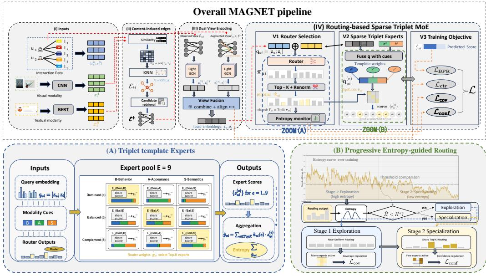  
Fig. 2. Overview of our proposed MAGNET framework. The first row presents the end-to-end pipeline: (I) inputs user–item interactions and item-side visual/text features; (II) constructs content-induced edges via similarity and KNN retrieval to augment the graph; (III) performs dual-view encoding on observed and augmented views and fuses them into unified user/item representations; (IV) applies a routing-based sparse triplet MoE as the prediction head, routing each query to a sparse set of experts and aggregating their outputs under a unified training objective. The second row provides complementary details: (A) illustrates the triplet-template expert pool covering behavior/appearance/semantics paterns, and (B) shows the progressive entropy-guided routing schedule that transitions from exploration to specialization during training.

from raw item features. Following prior work, we use cosine similarity:

$$
s _ {i j} ^ {m} = \frac {\left\langle \mathbf {x} _ {i} ^ {m} , \mathbf {x} _ {j} ^ {m} \right\rangle}{\left\| \mathbf {x} _ {i} ^ {m} \right\| \cdot \left\| \mathbf {x} _ {j} ^ {m} \right\|}, \qquad m \in \{A, S \}.\tag{1}
$$

For each item $i ,$ we retain only the top-� most similar items under each modality to form sparse neighbor sets $\boldsymbol { \mathcal { N } } ^ { A } ( i )$ and $N ^ { S } ( i )$ . For convenience, we write $N ( i ) = N ^ { A } ( i ) \cup N ^ { S } ( i )$ when the modality index is clear.

Given a user � with training-only history $\mathcal { T } _ { u }$ , we expand a candidate pool by traversing item– item neighborhoods from the user history. For each candidate item $j \notin \mathcal { I } _ { u }$ , we define a simple content-induced relevance score

$$
c _ {u, j} = \sum_ {i \in \mathcal {I} _ {u}} \frac {s _ {i j} ^ {A} + s _ {i j} ^ {S}}{2},\tag{2}
$$

and select the top-� candidates C (�) according to $c _ { u , j }$

We treat each observed training interaction $\left( u , i \right) \in \mathcal { D } _ { t r }$ as an edge and denote the observed edge set as $\mathcal { E } = \{ ( u , i ) : ( u , i ) \in \mathcal { D } _ { t r } \}$ . The induced edge set is constructed as

$$
\mathcal {E} ^ {+} = \{(u, j): u \in \mathcal {U},   j \in \mathcal {C} (u) \}.\tag{3}
$$

This step is graph augmentation rather than multi-hop message passing on the user–item graph: it injects additional content-informed edges as optional structural evidence, which is especially helpful under sparsity and long-tail regimes.

3.2.2 Dual-view Structural Graphs. Based on the observed edge set E and the induced edges $\delta ^ { + }$ , we construct two structural views: the original user–item graph $G _ { U I } = ( { \mathcal { U } } \cup { \mathcal { I } } , { \mathcal { E } } )$ and the augmented graph $\mathcal { G } _ { U I G } = ( \mathcal { U } \cup \mathcal { I } , \mathcal { E } \cup \mathcal { E } ^ { + } )$ . Dual-view (DV) is our primary formulation: we encode behavioral signals on both $G _ { U I }$ and $G _ { U I G }$ to obtain view-specific behavior embeddings $z _ { U I }$ and $z _ { U I G }$ , which are then fused into � for downstream routing and scoring via a lightweight mean fusion, i.e., $z \gets \frac { 1 } { 2 } ( z _ { U I } + z _ { U I G } )$ (see Section 3.2.3). This choice keeps the dual-view backbone eficient and avoids introducing extra fusion hyperparameters. Since a simple mean implicitly assumes the two views are in a comparable representation space, we optionally add a view-contrastive alignment loss $L _ { \mathrm { c t r } }$ (described in Section 3.4.3) to reduce the representation gap between $z _ { U I }$ and $z _ { U I G }$ , making the fused � more stable for routing and scoring.

Single-view (SV) is a variant that removes induced edges by setting ${ { \mathcal { E } } ^ { + } } = \emptyset$ , so that $\mathcal { G } _ { U I G }$ collapses to ${ \mathcal { G } } _ { U I }$ and only one structural view is used. Unless stated otherwise, we report DV as the default model.

3.2.3 Structural Encoding with Shallow Propagation. MAGNET adopts a LightGCN-style message passing to extract behavioral representations from each structural view. We share the same trainable ID embeddings ${ \bf e } _ { u } ^ { ( 0 ) }$ and ${ \bf e } _ { i } ^ { ( 0 ) }$ across views, and run shallow propagation on $\mathcal { G } _ { U I }$ and $\mathcal { G } _ { U I G }$ to obtain $\mathbf { z } ^ { U I }$ and $\mathbf { z } ^ { U I G }$ , respectively.

Let $\mathbf { e } _ { u } ^ { ( 0 ) }$ and ${ \bf e } _ { i } ^ { ( 0 ) }$ be trainable ID embeddings for user � and item �. For each view $\upsilon \in \{ U I , U I G \}$ and each layer $\dot { \ell } = 0 , \dots , L - 1$ , we update users and items by

$$
\mathbf {e} _ {u} ^ {(\ell + 1), v} = \sum_ {i \in N ^ {v} (u)} \frac {1}{\sqrt {| N ^ {v} (u) |   | N ^ {v} (i) |}} \mathbf {e} _ {i} ^ {(\ell), v}, \quad \mathbf {e} _ {i} ^ {(\ell + 1), v} = \sum_ {u \in N ^ {v} (i)} \frac {1}{\sqrt {| N ^ {v} (i) |   | N ^ {v} (u) |}} \mathbf {e} _ {u} ^ {(\ell), v},\tag{4}
$$

where $N ^ { v } ( u )$ and $N ^ { v } ( i )$ denote the neighbor sets in graph ${ \mathcal { G } } _ { v } .$ . For scalability on large graphs, we optionally adopt neighbor sampling in message passing. Specifically, we uniformly sample up to � neighbors from $N ^ { v } ( u )$ (and $N ^ { v } ( i ) )$ per layer when sampling is enabled, where $F$ is the sampling fanout.

We initialize $\mathbf { e } _ { u } ^ { ( 0 ) , v } { = } \mathbf { e } _ { u } ^ { ( 0 ) }$ and ${ \bf e } _ { i } ^ { ( 0 ) , v } { = } { \bf e } _ { i } ^ { ( 0 ) }$ for both views.

Following LightGCN, we obtain the view-specific behavior embeddings by layer-wise averaging:

$$
\mathbf {z} _ {u} ^ {v} = \frac {1}{L + 1} \sum_ {\ell = 0} ^ {L} \mathbf {e} _ {u} ^ {(\ell), v}, \quad \mathbf {z} _ {i} ^ {v} = \frac {1}{L + 1} \sum_ {\ell = 0} ^ {L} \mathbf {e} _ {i} ^ {(\ell), v}, \quad v \in \{U I, U I G \}.\tag{5}
$$

We then fuse the two views by simple averaging:

$$
\mathbf {z} _ {u} = \frac {1}{2} \left(\mathbf {z} _ {u} ^ {U I} + \mathbf {z} _ {u} ^ {U I G}\right), \quad \mathbf {z} _ {i} = \frac {1}{2} \left(\mathbf {z} _ {i} ^ {U I} + \mathbf {z} _ {i} ^ {U I G}\right)\tag{6}
$$

In the single-view variant, ${ \mathcal { E } } ^ { + } = \emptyset$ and we simply set $\mathbf { z } _ { u } = \mathbf { z } _ { u } ^ { U I }$ and ${ \bf z } _ { i } = { \bf z } _ { i } ^ { U I }$ . We refer to the default dual-view setting as MAGNET-DV and the single-view ablation $( E ^ { + } = \varnothing )$ as MAGNET-SV.

## 3.3 Triplet-template Mixture-of-Experts for Multimodal Fusion

MAGNET treats interaction-induced behavior as the primary supervision signal and uses item-side multimodal contents as complementary evidence. From the dual-view structural backbone (Section 3.2), we obtain fused behavior embeddings $z _ { u } , z _ { i } \in \mathbb { R } ^ { d }$ for each interaction token $( u , i )$ . We then build a structured Mixture-of-Experts (MoE) layer for adaptive multimodal fusion: each expert implements an interpretable triplet composition over $\{ B , A , S \}$ instantiated from shared templates, while a router learns token-wise sparse gating over this structured expert pool. Importantly, our “modality-guided” design comes from the expert space: the expert families and templates are pre- defined to reflect modality roles, and an entropy-triggered progressive routing scheme (Section 3.4) gradually relaxes routing regularization during training, reducing manual intervention and allowing the gating to become increasingly data-adaptive.

Algorithm 1: MAGNET Scoring via Modality-Guided MoE (Sparse Expert Activation)

Require: Behavior embeddings  $z_{u}, z_{i}$ ; modality cues  $\{h_{u}^{m}\}_{m\in M}, \{h_{i}^{m}\}_{m\in M}$ ;
Router parameters  $\Theta_{rt}$ ; expert parameters  $\{\Theta_{e}\}_{e=1}^{E}$ ; activated experts K.

Ensure: Preference score  $\hat{y}_{ui}$ , dense routing  $\pi_{ui}$ , activated expert set  $\Gamma_{ui}$ , and renormalized weights  $\tilde{\pi}_{ui}$ .

2 Step 0: Prepare modality cues
3 if  $\{h_{u}^{m}\}, \{h_{i}^{m}\}$  are not precomputed then
4 Compute modality cues  $\{h_{u}^{m}\}_{m\in M}$  and  $\{h_{i}^{m}\}_{m\in M}$ 
5 end
6 Step 1: Dense routing distribution // for entropy &amp; schedule (Algorithm 2)
7  $q_{ui} \leftarrow [z_{u}; z_{i}] \pi_{ui} \leftarrow \text{Softmax}(\text{Router}(q_{ui}; \Theta_{rt}))$  // dense routing (pre Top-K)
8 Step 2: Sparse expert activation &amp; modality-guided aggregation
9  $\Gamma_{ui} \leftarrow \text{TopK}(\pi_{ui}, K)$  // activate K experts
10  $\tilde{\pi}_{ui} \leftarrow \text{Renorm}(\pi_{ui}, \Gamma_{ui})$  //  $\sum_{e \in \Gamma_{ui}} \tilde{\pi}_{ui}^{(e)} = 1$ 
11  $s_{ui} \leftarrow 0$ 
12 foreach  $e \in \Gamma_{ui}$  do // template-guided expert forward
13
14  $s_{ui}^{(e)} \leftarrow \text{Expert}_{e}(z_{u}, z_{i}, \{h_{u}^{m}\}_{m\in M}, \{h_{i}^{m}\}_{m\in M}; \Theta_{e})$ 
15  $s_{ui} \leftarrow s_{ui} + \tilde{\pi}_{ui}^{(e)} \cdot s_{ui}^{(e)}$ 
16 end
17 Step 3: Scoring
18  $\hat{y}_{ui} \leftarrow \text{Score}(s_{ui})$ 
19 return ( $\hat{y}_{ui}, \pi_{ui}, \Gamma_{ui}, \tilde{\pi}_{ui}$ )

For clarity, we summarize the full MoE-based scoring procedure (from routing to aggregation and prediction) in Algorithm 1, which will be reused in the training pipeline.

3.3.1 Modality cues: item projection and history-induced user cues. Let M denote the item content modality set (default $M = \{ A , S \} )$ . For each item �, we compute projected modality cues

$$
h _ {i} ^ {A} = f _ {A} (x _ {i} ^ {A}), \qquad h _ {i} ^ {S} = f _ {S} (x _ {i} ^ {S}),\tag{7}
$$

where $x _ { i } ^ { m }$ is the raw modality-� feature and $f _ { m } ( \cdot )$ is a lightweight linear projection. Since user-side raw modality profiles are typically unavailable in implicit feedback, we derive weak user cues from training-only histories:

$$
h _ {u} ^ {A} = \frac {1}{| I _ {u} |} \sum_ {i \in I _ {u}} h _ {i} ^ {A}, \qquad h _ {u} ^ {S} = \frac {1}{| I _ {u} |} \sum_ {i \in I _ {u}} h _ {i} ^ {S},\tag{8}
$$

where $I _ { u }$ is the training-only interacted item set of user � (Table 1), constructed solely from observed training interactions. This design keeps behavior embeddings $( z _ { u } , z _ { i } )$ as the only direct user signal, while allowing contents to participate through history-induced cues without leaking test-time information.

3.3.2 Triplet experts with shared templates. We reuse the shorthand Behavior/Appearance/Semantics as B/A/S (Section 3.1.1). Define modality-specific representations under the global order [�, �, �]:

$$
\mathbf {r} _ {u} ^ {B} = \mathbf {z} _ {u}, \quad \mathbf {r} _ {i} ^ {B} = \mathbf {z} _ {i}, \qquad \mathbf {r} _ {u} ^ {A} = \mathbf {h} _ {u} ^ {A}, \mathbf {r} _ {i} ^ {A} = \mathbf {h} _ {i} ^ {A}, \qquad \mathbf {r} _ {u} ^ {S} = \mathbf {h} _ {u} ^ {S}, \mathbf {r} _ {i} ^ {S} = \mathbf {h} _ {i} ^ {S}.\tag{9}
$$

Each expert is specified by a nonnegative modality triplet $\textbf { w } = ~ [ w ^ { B } , w ^ { A } , w ^ { S } ] ^ { \top } ~ \in ~ \mathbb { R } _ { \ge 0 } ^ { 3 }$ with a normalized budget $\begin{array} { r } { \sum _ { m \in \{ B , A , S \} } w ^ { m } = 1 } \end{array}$ . Given an expert weight triplet w, we form expert-specific fused user/item representations by a simple, interpretable triplet fusion:

$$
\mathbf {x} _ {u} (\mathbf {w}) = \sum_ {m \in \{B, A, S \}} w ^ {m} \mathbf {r} _ {u} ^ {m}, \qquad \mathbf {x} _ {i} (\mathbf {w}) = \sum_ {m \in \{B, A, S \}} w ^ {m} \mathbf {r} _ {i} ^ {m}.\tag{10}
$$

An expert module then produces a pair representation (the internal head can be lightweight and expert-specific):

$$
\mathbf {s} _ {u i} ^ {(e)} = \mathrm{Expert} _ {e} \big (\mathbf {z} _ {u}, \mathbf {z} _ {i}, \{\mathbf {h} _ {u} ^ {m} \} _ {m \in \mathcal {M}}, \{\mathbf {h} _ {i} ^ {m} \} _ {m \in \mathcal {M}}; \Theta_ {e} \big) = \phi \Big ([ \mathbf {x} _ {u} (\mathbf {w} ^ {(e)}); \mathbf {x} _ {i} (\mathbf {w} ^ {(e)}) ]; \Theta_ {e} \Big),\tag{11}
$$

where $\mathbf { w } ^ { ( e ) }$ is the triplet of expert � (defined below), and $\phi (  { \boldsymbol { \cdot } } , \Theta _ { e } )$ is a lightweight transformation. This triplet form makes each expert directly interpretable and enables clean ablations over fusion patterns.

Core definitions: expert groups, expert types, and template instantiation. To make the expert pool explicit and interpretable, we formalize expert groups (by anchor modality) and shared type-level templates.

(1) Expert groups (anchor modality). We organize experts into three modality groups $g \in$ {�, �, �}, where each group specifies an anchor source(following Section 3.1.1). The anchor is a semantic label for structuring and analyzing experts; it does not hard-assign instances. This design enables group-wise analysis (e.g., utilization by anchor) and yields a compact $3 \times 3$ expert pool without introducing additional group-specific hyperparameters.

(2) Expert types (how the anchor participates). Within each group, we instantiate three expert types � ∈ {Dom, Bal, Com}: (i) Dominant (Dom): the anchor receives a large portion of the fusion budget, with auxiliaries down-weighted (and possibly approaching zero at the boundary); (ii) Balanced (Bal): a smoother trade-of with a bounded anchor bias; (iii) Complementary (Com): auxiliaries provide the major evidence while retaining a small anchor mass.

(3) Type-level templates in canonical order. A type-level template maps a scalar to a canonical triplet $\tilde { \mathbf { w } } ^ { t } ( \cdot ) \in \mathbb { R } ^ { 3 }$ under the order [anchor, aux1, aux2]:

$$
\tilde {\mathbf {w}} ^ {\mathrm{Dom}} (\alpha) = (1 - \alpha) \left[ \frac {1}{2}, \frac {1}{4}, \frac {1}{4} \right] + \alpha [ 1, 0, 0 ], \quad \alpha \in [ 0, 1 ],\tag{12}
$$

$$
\tilde {\mathbf {w}} ^ {\mathrm{Bal}} (\beta) = \left[ \frac {1}{3} + \frac {\beta}{6}, \frac {1}{3} - \frac {\beta}{1 2}, \frac {1}{3} - \frac {\beta}{1 2} \right], \qquad \beta \in [ 0, 1 ],\tag{13}
$$

$$
\tilde {\mathbf {w}} ^ {\mathrm{Com}} (\delta) = \left[ \epsilon , (1 - \epsilon) \delta , (1 - \epsilon) (1 - \delta) \right], \qquad \delta \in [ 0, 1 ],\tag{14}
$$

where $\delta$ controls the split between the two auxiliary modalities and $\epsilon > 0$ is a small fixed constant encoding a minimal anchor mass. When $g = B$ , this corresponds to retaining a minimal behavior anchor, reflecting the inductive bias of implicit feedback; when $g \in \{ A , S \}$ , it prevents the anchor modality from being entirely discarded. We treat $\alpha , \beta , \delta$ as template hyperparameters: they are type-level shared and fixed during training, and we analyze their sensitivity in Section 4.7.

(4) From templates to a $3 \times 3$ expert pool (group-specific instantiation). To obtain the final expert triplet in the global order [�, �, �], we apply a fixed permutation operator $P _ { g } ( \cdot )$ that maps the canonical order [anchor, aux1, aux2] to [�, �, �] according to group �:

$$
\mathbf {w} ^ {g, t} = P _ {g} \big (\tilde {\mathbf {w}} ^ {t} \big), \qquad g \in \{B, A, S \}, t \in \{\text { Dom }, \text { Bal }, \text { Com } \}.\tag{15}
$$

$P _ { g } ( \cdot )$ is deterministic and introduces no learnable parameters; thus the expert pool is fully specified once $( g , t )$ are chosen. We index experts by $e  ( g , t )$ , yielding $E = 9$ experts by default.

3.3.3 Behavior-conditioned routing with dense distributions. Given a training instance $( u , i )$ , MAG-NET routes the corresponding interaction token to a small subset of experts from the structured pool in Section 3.3.2. Because user-side raw modality profiles are not directly observed in implicit feedback, we condition routing on the fused behavior embeddings from the dual-view backbone by forming the router query

$$
q _ {u i} = [ z _ {u}; z _ {i} ] \in \mathbb {R} ^ {2 d}.\tag{16}
$$

Although the router is behavior-conditioned, the expert space is modality-guided: each expert implements a distinct triplet fusion over $\{ B , A , S \}$ and consumes modality cues $\{ h _ { u } ^ { m } , h _ { i } ^ { m } \} _ { m \in \mathcal { M } }$ through Eqs. (7) to (10).

Our progressive routing scheme follows standard sparse MoE training, while adding an entropy- triggered regularization schedule to make routing both usable (avoid early expert collapse/load imbalance) and adaptive (reduce manual guidance as training proceeds). The key idea is: we pre-structure experts into modality-aligned families via fixed templates (section 3.3), then use routing-entropy statistics to progressively relax regularization, transitioning from template-guided exploration to more data-driven gating.

Specifically $, q _ { u i }$ is defined in (16) and produces a dense routing distribution over all � experts:

$$
\boldsymbol {\pi} _ {u i} = \operatorname{Softmax} (\operatorname{Router} (\mathbf {q} _ {u i}; \Theta_ {\mathrm{rt}})) \in \mathbb {R} ^ {E}.\tag{17}
$$

We keep $\pmb { \pi } _ { u i }$ as dense probabilities for (i) computing entropy-based statistics and (ii) applying stage-wise routing regularization, while the forward aggregation still uses sparse Top-� experts (described in Section 3.3.4). Over a mini-batch B, we aggregate $\{ \pi _ { u i } \} _ { ( u , i ) \in \mathcal { B } }$ to estimate routing entropy and trigger stage switching in Section 3.4.

3.3.4 Sparse expert activation, aggregation, and scoring. For eficient computation, we activate only the Top-� experts under the dense distribution:

$$
\Gamma_ {u i} = \mathrm{TopK} (\pi_ {u i}, K).\tag{18}
$$

Following standard sparse MoE, we renormalize routing weights on $\Gamma _ { u i }$ and use the renormalized weights for aggregation:

$$
\tilde {\pi} _ {u i} ^ {(e)} = \frac {\pi_ {u i} ^ {(e)}}{\sum_ {e ^ {\prime} \in \Gamma_ {u i}} \pi_ {u i} ^ {(e ^ {\prime})}}, \qquad e \in \Gamma_ {u i}.\tag{19}
$$

Each activated expert $e \in  { \Gamma } _ { u i }$ produces an expert-specific pair representation $\mathbf { s } _ { u i } ^ { ( e ) }$ (Eq. (11)), and we aggregate them by routing weights:

$$
s _ {u i} = \sum_ {e \in \Gamma_ {u i}} \tilde {\pi} _ {u i} ^ {(e)} s _ {u i} ^ {(e)}.
$$

(20)

Finally, we obtain the preference prediction by a scoring head:

$$
\hat {y} _ {u i} = \mathrm{Score} (s _ {u i}).\tag{21}
$$

In all experiments we use $\tilde { \pi } _ { u i }$ for aggregation; the dense $\pi _ { u i }$ is retained for entropy statistics and progressive routing regularization (3.4). We adopt standard sparse MoE training: gradients are back-propagated through the selected experts and their corresponding router weights.

Algorithm 2: Progressive Routing Training of MAGNET

Require: Observed edges E; graphs  $G_{UI}$  and  $G_{UIG}$  (if  $E^{+} \neq \emptyset$ ); mini-batch  $B \subset E$  with  $b := |B|$ , neg. ratio  $\rho$ ; experts  $(E, K)$ ; entropy  $(H^{*}, W)$ ; weights  $(\lambda, \lambda_{\mathrm{ctr}}, \lambda_{r})$ ; temperature  $\tau$ ; iterations T; params  $\Theta$ 

Ensure: Trained parameters  $\Theta$ 

2 stage ← 1;  $n \leftarrow 0$    // stage ∈ {1, 2}, counter for consecutive  $\tilde{H} \geq H^{*}$ 

3 for t ← 1 to T do

4 Sample  $B \subset E$  with  $|B| = b$    // (I) mini-batch sampling on observed edges

5 foreach  $(u, i) \in B$  do

6 Sample negatives  $J_{u} \sim \text{NEG}(u; \rho)$  with  $j \notin I_{u}$ 

7  $L_{BPR} \leftarrow 0; \Pi \leftarrow \emptyset$    // (II) BPR loss + collect dense routings

8 foreach  $(u, i) \in B$  do

9  $(\hat{y}_{ui}, \pi_{ui}) \leftarrow \text{MAGNET-SCORE}(u, i; \Theta) \Pi \leftarrow \Pi \cup \{\pi_{ui}\} \{\hat{y}_{uj}\}_{j \in J_{u}} \leftarrow \text{MAGNET-SCORE}(u, J_{u}; \Theta).\hat{y}$    // reuse Alg. 1 (score only)

10  $L_{BPR} += \sum_{j \in J_{u}} -\log \sigma(\hat{y}_{ui} - \hat{y}_{uj})$ 

11  $L_{ctr} \leftarrow 0$    // (III) optional dual-view alignment

12 if  $E^{+} \neq \emptyset$  and  $\lambda_{ctr} &gt; 0$  then    // dual-view only

13  $L_{ctr} \leftarrow INFONCE(\cdot; \tau)$    // align  $z^{UI}$  vs  $z^{UIG}$  Section 3.4.3

14  $\bar{\pi} \leftarrow \frac{1}{|\Pi|} \sum_{\pi \in \Pi} \pi; \tilde{H} \leftarrow Ent(\bar{\pi}) / log E$    // (IV) Eqs. (23) and (24)

15 if  $\tilde{H} \geq H^{*}$  then

16  $n \leftarrow n + 1$    // consecutive “high-entropy” steps

17 else

18  $n \leftarrow 0$ 

19 if stage = 1 and n ≥ W then    // switch once

20 stage ← 2    // enter sharpening stage

21  $L_{cov} \leftarrow \sum_{e=1}^{E} \left( \bar{\pi}(e) - \frac{1}{E} \right)^{2}$    // load balancing, Equation (29)

22  $L_{conf} \leftarrow \frac{1}{|\Pi|} \sum_{\pi \in \Pi} Ent(\pi)$    // routing sharpness, Equation (30)

23  $(\lambda_{\mathrm{cov}}, \lambda_{\mathrm{conf}}) \leftarrow \lambda_{r} \cdot (\mathbb{I}[stage = 1](1 - \tilde{H}), \mathbb{I}[stage = 2]\tilde{H})$ 

24  $L_{\ell} &lt; L_{BPR} + \lambda_{ctr} L_{ctr} + \lambda_{cov} L_{cov} + \lambda_{conf} L_{conf} + \lambda \|O\|_{2}^{2}$

## 3.4 Entropy-triggered Progressive Routing for Training

3.4.1 Routing Entropy and Efective Experts. We summarize the full training procedure with entropytriggered progressive routing in Algorithm 2, and describe its key components below.

Given a mini-batch B, we define the batch-mean routing distribution

$$
\bar {\pi} = \frac {1}{| \mathcal {B} |} \sum_ {(u, i) \in \mathcal {B}} \pi_ {u i},\tag{22}
$$

and compute its Shannon entropy (using natural logarithm)

$$
H (\bar {\pi}) = - \sum_ {e = 1} ^ {E} \bar {\pi} (e) \log \bar {\pi} (e),\tag{23}
$$

where $H ( \bar { \pmb { \pi } } ) \in [ 0 , \log E ]$

Interpretation. Note that $H ( { \bar { \pmb { \pi } } } )$ measures batch-level utilization diversity: it becomes large when diferent training pairs in the batch are routed to diferent experts in aggregate. This is deliberately used to detect whether the router has escaped early collapse and started to utilize a broad set of experts, even when per-instance routing can already be sharp.

For comparability across diferent �, we also use the normalized entropy

$$
\tilde {H} = \frac {H (\bar {\pi})}{\log E} \in [ 0, 1 ],\tag{24}
$$

which will be used to control the strength of routing regularization in Section 3.4.3. Finally, we report the efective number of experts

$$
N _ {\mathrm{eff}} = \exp \bigl (H (\bar {\pi}) \bigr),\tag{25}
$$

which is directly interpretable as the number of uniformly-used experts.

3.4.2 Entropy-triggered Two-stage Schedule. We adopt an entropy-triggered two-stage schedule to progressively transition from guided exploration to adaptive exploitation in MoE routing. Intuitively, early in training the router is unstable and may collapse to a few experts; thus we first encourage broad expert utilization. Once the router reaches suficiently diverse utilization, we switch to a second stage that sharpens and stabilizes routing for more consistent expert specialization.

Concretely, at each training step we compute the normalized batch entropy $\tilde { H }$ in Eq. (24) and update a counter �:

$$
n \leftarrow \left\{ \begin{array}{l l} n + 1, & \text { if } \tilde {H} \geq H ^ {*}, \\ 0, & \text { otherwise }, \end{array} \right. \quad s t a g e \leftarrow \left\{ \begin{array}{l l} 2, & \text { if } n \geq W, \\ s t a g e, & \text { otherwise }, \end{array} \right.\tag{26}
$$

where $H ^ { * } \in [ 0 , 1 ]$ is an entropy threshold and � is a window size for requiring the condition to hold consistently.

Stage semantics. Stage 1 (coverage) emphasizes utilization to avoid early collapse; Stage 2 (confidence) emphasizes sharper and more stable routing after utilization becomes suficiently diverse. The two stage-specific regularizers are defined in next part.

3.4.3 Objective with Stage-specific Routing Regularization. For preference learning, we use a pair-wise BPR loss on triplets $( u , i , j )$ with $( u , i ) \in \mathcal { D } _ { t r }$ � and $j \notin \mathcal { I } _ { u }$ :

$$
\mathcal {L} _ {\mathrm{BPR}} = \sum_ {(u, i, j)} - \log \sigma (\hat {y} _ {u i} - \hat {y} _ {u j}).\tag{27}
$$

Optionally, for the dual-view setting, we add a view-contrastive alignment loss $L _ { \mathrm { c t r } }$ to reduce the representation discrepancy between the two structural views. Given a mini-batch $B \subset { \mathcal { E } }$ , let $\mathcal { U } _ { B } : = \{ u \ | \ ( u , i ) \in B \}$ and ${ \mathcal { I } } _ { B } : = \{ i \ | \ ( u , i ) \in B \}$ denote the user/item sets appearing in �. We treat $( z _ { u } ^ { U I } , z _ { u } ^ { U I G } )$ and $( z _ { i } ^ { U I } , z _ { i } ^ { U I G } )$ as positive pairs, and use other users/items within the same mini-batch as negatives. We use a symmetric (bi-directional) InfoNCE:

$$
L _ {\mathrm{ctr}} = \frac {1}{2} \left(L _ {\mathrm{ctr}} ^ {U I \rightarrow U I G} + L _ {\mathrm{ctr}} ^ {U I G \rightarrow U I}\right),\tag{28a}
$$

$$
L _ {\mathrm{ctr}, U} ^ {a \rightarrow b} = \frac {1}{| U _ {B} |} \sum_ {u \in U _ {B}} \left[ - \log \frac {\exp (\mathrm{sim} (z _ {u} ^ {a} , z _ {u} ^ {b}) / \tau)}{\sum_ {u ^ {\prime} \in U _ {B}} \exp (\mathrm{sim} (z _ {u} ^ {a} , z _ {u ^ {\prime}} ^ {b}) / \tau)} \right],\tag{28b}
$$

$$
L _ {\mathrm{ctr}, I} ^ {a \rightarrow b} = \frac {1}{| I _ {B} |} \sum_ {i \in I _ {B}} \left[ - \log \frac {\exp (\mathrm{sim} (z _ {i} ^ {a} , z _ {i} ^ {b}) / \tau)}{\sum_ {i ^ {\prime} \in I _ {B}} \exp (\mathrm{sim} (z _ {i} ^ {a} , z _ {i ^ {\prime}} ^ {b}) / \tau)} \right],\tag{28c}
$$

where $a , b \in \{ U I , U I G \} , L _ { \mathrm { c t r } } ^ { a  b } = L _ { \mathrm { c t r } , U } ^ { a  b } + L _ { \mathrm { c t r } , I } ^ { a  b }$ , and sim $\begin{array} { r } { ( x , y ) = \frac { x ^ { \top } y } { \| x \| _ { 2 } \| y \| _ { 2 } } } \end{array}$

Stage-specific routing regularizers. We regularize the dense routing distribution $\pmb { \pi } _ { u i }$ in a stagespecific manner: stage 1 encourages utilization (coverage) while stage 2 encourages sharper and more stable routing (confidence).

Coverage regularizer (Stage 1). To encourage broad expert utilization and avoid early expert collapse, we regularize the mini-batch mean routing distribution �¯ toward uniform:

$$
\mathcal {L} _ {\mathrm{cov}} = \sum_ {e = 1} ^ {E} \left(\bar {\pi} (e) - \frac {1}{E}\right) ^ {2}.\tag{29}
$$

which penalizes load imbalance at the batch level and is fully diferentiable w.r.t. router parame- ters.

Confidence regularizer (Stage 2). To stabilize specialization after utilization becomes diverse, we encourage per-instance routing to be sharp:

$$
\mathcal {L} _ {\mathrm{conf}} = \frac {1}{| \mathcal {B} |} \sum_ {(u, i) \in \mathcal {B}} H (\boldsymbol {\pi} _ {u i}),\tag{30}
$$

where $H ( \pmb { \pi } _ { u i } )$ is defined analogously to Eq. (23).

Entropy-controlled weights. To realize progressive relaxation, we gate the stage and also modulate the regularization strength by the normalized entropy $\tilde { H } { : }$

$$
\lambda_ {\mathrm{cov}} (H) = \mathbb {I} [ s t a g e = 1 ] \cdot \lambda_ {r} \cdot (1 - \tilde {H}), \qquad \lambda_ {\mathrm{conf}} (H) = \mathbb {I} [ s t a g e = 2 ] \cdot \lambda_ {r} \cdot \tilde {H}.\tag{31}
$$

This keeps a single tunable routing weight $\lambda _ { r }$ , while making the efective regularization automatically decrease as routing becomes more diverse (Stage 1) and self-adjust as routing sharpens (Stage 2).

Putting everything together, the overall objective is

$$
\mathcal {L} = \mathcal {L} _ {\mathrm{BPR}} + \lambda_ {\mathrm{ctr}} \mathcal {L} _ {\mathrm{ctr}} + \lambda_ {\mathrm{cov}} (H) \mathcal {L} _ {\mathrm{cov}} + \lambda_ {\mathrm{conf}} (H) \mathcal {L} _ {\mathrm{conf}} + \lambda \| \Theta \| _ {2} ^ {2},\tag{32}
$$

where Θ collects all trainable parameters (encoder/projection/router/experts).

## 4 Experiments

## 4.1 Datasets and Preprocessing

Following prior MMRec studies, we evaluate on four public Amazon review datasets: Baby, Sports, Clothing, and Electronics, which vary in domain and scale. To ensure fair comparison, we use a publicly released preprocessed package (including user–item interaction logs and extracted multimodal embeddings) from a public Google Drive repository.1 For item content features, we adopt the provided 4096-dimensional visual embeddings (ResNet50) and 384-dimensional textual embeddings (BERT). Basic statistics are summarized in Table 2.

We treat observed user–item interactions in � as positive implicit feedback. We filter the interaction logs by keeping users with at least four interactions, and apply the same preprocessing pipeline and fixed data splits for every baseline and every variant of our model. To avoid information leakage, any construction that relies on user histories, including the expanded candidate set $C ( u )$ and induced edges $\delta ^ { + }$ for the augmented view, is built solely from the training-only history $I _ { u }$ derived from the training split.

For data splitting, we randomly partition interactions into training/validation/test sets with an 8:1:1 ratio. To support reproducibility and reduce variance from a single split, we generate five fixed splits using random seeds {9, 672, 5368, 12784, 2025}, and report the mean and standard deviation across these splits for the main comparison results.

Table 2. Statistics of the Four Datasets

<table><tr><td>Dataset</td><td># Users</td><td># Items</td><td># Interactions</td><td># Density</td><td># Average Interactions per User</td></tr><tr><td>Baby</td><td>19,445</td><td>7,050</td><td>160,792</td><td>0.12%</td><td>8.27</td></tr><tr><td>Sports</td><td>35,598</td><td>18,357</td><td>296,337</td><td>0.05%</td><td>8.32</td></tr><tr><td>Clothing</td><td>39,387</td><td>23,033</td><td>278,677</td><td>0.03%</td><td>7.07</td></tr><tr><td>Electronics</td><td>192,403</td><td>63,001</td><td>1,689,188</td><td>0.01%</td><td>7.24</td></tr></table>

## 4.2 Baselines and Implementation Sources

We compare MAGNET against competitive baselines that progressively incorporate multimodal signals, from interaction-only collaborative filtering, through dual-graph/structure-learning multi- modal methods, to recent contrastive/self-supervised multimodal models:

• Interaction-only MMR BPR [40], LightGCN [15].

• Dual-graph learning MMR: LATTICE [67], FREEDOM [71].

• Contrastive / self-supervised MMR: MGCN [64], GUME [26], SOIL [44], SMORE [36], MIG-GT [17], MENTOR [59], CMDL [27], ITCoHD-MRec [13].

To ensure a reproducible and consistent comparison, we follow a unified execution rule. If oficial code is available, we run it under our preprocessing pipeline and the fixed splits in Section 4.1; otherwise, we re-implement the method based on the paper description. For all baselines, hyperparameters are tuned only on the validation set with the same early-stopping rule as in Section 4.3. For the Electronics dataset, if a baseline provides neither publicly available code nor reported results in the original paper, we mark the corresponding entry as “–”. Whenever results are obtained via re-implementation, we explicitly label them as re-implementations and evaluate them under the same validation and test protocol.

## 4.3 Training and Evaluation Protocol

4.3.1 Training Setup and Reproducibility. All methods are trained and evaluated under the same preprocessing pipeline and the fixed data splits described in Section 4.1 to ensure a fair comparison. For the main comparison results, we report the mean and standard deviation over the five fixed splits, while analysis experiments such as ablations and sensitivity studies are conducted on the fixed split with seed 2026.

We optimize models with mini-batch training. Unless otherwise specified, the batch size is 1024 and we use uniform negative sampling with a 1:1 positive-to-negative ratio (each positive interaction is paired with one unobserved item). We use Adam for optimization and apply early stopping on the validation set with a patience of 5 and a maximum of 200 epochs. For each run, the checkpoint is selected by the best validation performance (by default, NDCG@20).

4.3.2 Evaluation Protocol. We follow the standard top-� recommendation setting and evaluate all methods with Recall@� and NDCG@�, where $N \in \{ 1 0 , 2 0 \}$ . Unless otherwise specified, we use NDCG@20 on the validation set for model selection and report Recall@20 and NDCG@20 as the primary metrics.

4.3.3 Hardware and Measurement. All experiments are conducted on a single NVIDIA RTX 4090 GPU with 24 GB memory, using a machine equipped with a 16-core Intel Xeon(R) Platinum 8358P

CPU and 120 GB RAM. Training time is measured as wall-clock seconds per epoch, averaged over the training trajectory after a short warm-up to avoid one-time initialization efects. Peak GPU memory is reported as the maximum allocated GPU memory observed during training.

## 4.4 Hyperparameter Configuration

4.4.1 Final Setings and Selection Criterion. Table 3 reports the hyperparameter settings used in the main experiments. For each dataset, we select a single configuration based on validation performance and keep it fixed for all subsequent runs on that dataset. Model selection follows Section 4.3: we monitor validation NDCG@20 for early stopping and use the checkpoint with the best validation score for reporting. This setup keeps the comparison consistent and reduces tuning decisions that depend on a particular split.

4.4.2 Stage-wise Tuning Procedure. Since MAGNET involves multiple interacting components, tuning all hyperparameters jointly is computationally expensive and dificult to interpret. We therefore adopt a stage-wise procedure: we tune one group of hyperparameters at a time, carry the best setting forward to the next stage, and select primarily by validation NDCG@20.

Starting from the default configuration in Table 3, we tune the following groups in order: (i) optimization hyperparameters $( \eta , \lambda , p _ { \mathrm { d } } )$ ; (ii) graph construction hyperparameters $( k , r )$ and the view setting (SV/DV); (iii) progressive routing hyperparameters $( \lambda _ { r } , H ^ { * } , W , \lambda _ { s } ( \tilde { H } ) )$ ; and (iv) the remaining loss-related hyperparameters $( \tau , \lambda _ { \mathrm { c t r } } )$ . Within each stage, we vary a single hyperparameter while fixing all others to the current best configuration. Unless otherwise specified, we keep model capacity and template settings fixed throughout tuning, including the embedding size �, the number of GNN layers per view �, the number of experts �, the Top-� routing parameter �, and the triplet-template controls $( \alpha , \beta , \delta )$

4.4.3 Range Design and Wrap-up. For each hyperparameter, we choose a reasonable search interval before tuning, guided by common practice and a small number of pilot runs. Parameters that vary across orders of magnitude (e.g., � and regularization strengths) are explored with a coarse-to-fine schedule, while bounded thresholds or ratios $( \mathrm { e . g . , } H ^ { \ast }$ and dropout) are explored with a uniformly spaced grid within a fixed range. The final settings in Table 3 are the best-performing choices within these intervals on the validation set. Unless otherwise stated, all subsequent experiments in Section 4 follow the same fixed protocol in Section 4.3 and use the tuned hyperparameters in Table 3, so that diferences in results can be attributed to model design rather than inconsistent tuning.

## 4.5 Overall Performance

Table 4 reports the top-N recommendation results on four multimodal datasets. We use MAGNET -DV as our default setting and compare it against other baselines. Overall, MAGNET delivers the strongest and most stable performance across datasets and metrics, indicating that topology-aware propagation, our triplet-template MoE fusion, and progressive routing are complementary for multimodal recommendation.

– Consistent gains over strong SOTA baselines. Across the four datasets, MAGNET (Dualview) achieves an average relative improvement of about 3.0%–5.3% over the strongest non-MAGNET baseline (Baby: ∼3.0%, Sports: ∼4.5%, Clothing: ∼4.1%, Electronics: ∼5.3%). This pattern is consistent in both Recall and NDCG, suggesting that the improvement is not metric-specific. Here the “strongest baseline” is selected per dataset by validation NDCG@20, and all numbers are avera ed over the five fixed s lits.

– Improvements are more pronounced for longer recommendation lists. The advantages are clearer at top-20, which better reflects ranking quality when more items are returned. For example, compared to the strongest baseline, MAGNET (Dual-view) improves R@20 from 0.1165 to 0.1198 on Sports and from 0.0680 to 0.0716 on Electronics; similarly, it improves N@20 from 0.0466 to 0.0492 on Clothing and from 0.0310 to 0.0329 on Electronics. These gains indicate better top-N ordering rather than merely boosting a very short prefix.

Table 3. Hyperparameter setings for MAGNET on four datasets.

<table><tr><td>Hyperparameter</td><td>Baby</td><td>Sports</td><td>Clothing</td><td>Electronics</td></tr><tr><td colspan="5">Graph &amp; Views</td></tr><tr><td>k (item-item neighbors)</td><td>20</td><td>20</td><td>30</td><td>30</td></tr><tr><td>r (candidate expansion size)</td><td>150</td><td>200</td><td>200</td><td>200</td></tr><tr><td>View (SV/DV)</td><td>DV</td><td>DV</td><td>DV</td><td>DV</td></tr><tr><td colspan="5">Backbone &amp; MoE</td></tr><tr><td>d (embedding size)</td><td>64</td><td>64</td><td>48</td><td>48</td></tr><tr><td>L (GNN layers per view)</td><td>2</td><td>2</td><td>2</td><td>2</td></tr><tr><td>E (number of experts)</td><td>9</td><td>9</td><td>9</td><td>9</td></tr><tr><td>K (Top-K routing)</td><td>4</td><td>4</td><td>4</td><td>4</td></tr><tr><td colspan="5">Triplet-template Controls</td></tr><tr><td>α (Dom: anchor-dominance control)</td><td>0.6</td><td>0.6</td><td>0.6</td><td>0.6</td></tr><tr><td>β (Bal: bounded anchor-bias control)</td><td>0.2</td><td>0.2</td><td>0.1</td><td>0.2</td></tr><tr><td>δ (Com: auxiliary A/S split )</td><td>0.5</td><td>0.4</td><td>0.8</td><td>0.6</td></tr><tr><td>(α, β, δ)</td><td>(0.6, 0.2, 0.5)</td><td>(0.6, 0.2, 0.4)</td><td>(0.6, 0.1, 0.8)</td><td>(0.6, 0.2, 0.6)</td></tr><tr><td colspan="5">Progressive Routing</td></tr><tr><td>H* (entropy threshold)</td><td>0.90</td><td>0.87</td><td>0.90</td><td>0.87</td></tr><tr><td>W (trigger window)</td><td>3</td><td>4</td><td>5</td><td>5</td></tr><tr><td>λr (routing reg. strength)</td><td>0.30</td><td>0.30</td><td>0.40</td><td>0.30</td></tr><tr><td>λs(ˆH) (weight schedule)</td><td>Lin-Ent</td><td>Lin-Ent</td><td>Lin-Ent</td><td>Lin-Ent</td></tr><tr><td colspan="5">Optimization</td></tr><tr><td>η (learning rate)</td><td>1 × 10-3</td><td>1.5 × 10-3</td><td>1 × 10-3</td><td>1 × 10-3</td></tr><tr><td>λ (weight decay)</td><td>2 × 10-5</td><td>2 × 10-5</td><td>4 × 10-5</td><td>2 × 10-4</td></tr><tr><td>pd (dropout)</td><td>0.10</td><td>0.20</td><td>0.20</td><td>0.15</td></tr><tr><td>τ (contrastive temperature)</td><td>0.5</td><td>1.5</td><td>0.2</td><td>0.2</td></tr><tr><td>λctr (view contrastive weight)</td><td>0.01</td><td>0.01</td><td>0.01</td><td>0.01</td></tr><tr><td>Batch size (b)</td><td></td><td colspan="3">1024</td></tr><tr><td>Negative sampling ratio (ρ)</td><td></td><td colspan="3">1:1</td></tr><tr><td>Optimizer</td><td></td><td colspan="3">Adam</td></tr><tr><td>Early stopping patience (p)</td><td></td><td colspan="3">5</td></tr><tr><td>Max epochs (Tmax)</td><td></td><td colspan="3">200</td></tr><tr><td>Eval cutoff (N)</td><td></td><td colspan="3">{10, 20}</td></tr></table>

– Robustness against competitive contrastive multimodal methods. Among the compared approaches, contrastive-learning baselines are consistently strong, especially on Clothing and Electronics. MAGNET still maintains the lead, which suggests that explicit structural modeling (dual-view propagation) and adaptive modality fusion (MoE routing) provide additional benefits beyond contrastive alignment alone.

Table 4. Upper: Quantitative results on Baby and Sports. Lower: Quantitative results on Clothing and Electronics. Top-three performances are highlighted with red , blue , and green , respectively (all bold). Missing values do not participate in ranking.  
(a) Baby & Sports

<table><tr><td rowspan="2">Method</td><td rowspan="2">Venue</td><td colspan="4">Baby</td><td colspan="4">Sports</td></tr><tr><td>R@10</td><td>R@20</td><td>N@10</td><td>N@20</td><td>R@10</td><td>R@20</td><td>N@10</td><td>N@20</td></tr><tr><td colspan="10">Classical Methods</td></tr><tr><td>BPR</td><td>UAI&#x27;09</td><td>0.0357</td><td>0.0575</td><td>0.0192</td><td>0.0249</td><td>0.0432</td><td>0.0653</td><td>0.0241</td><td>0.0298</td></tr><tr><td>LightGCN</td><td>SIGIR&#x27;20</td><td>0.0479</td><td>0.0754</td><td>0.0257</td><td>0.0328</td><td>0.0569</td><td>0.0864</td><td>0.0311</td><td>0.0387</td></tr><tr><td colspan="10">Dual-Graph Learning Methods</td></tr><tr><td>LATTICE</td><td>MM&#x27;21</td><td>0.0536</td><td>0.0858</td><td>0.0287</td><td>0.0370</td><td>0.0618</td><td>0.0950</td><td>0.0337</td><td>0.0423</td></tr><tr><td>FREEDOM</td><td>MM&#x27;23</td><td>0.0627</td><td>0.0992</td><td>0.0330</td><td>0.0424</td><td>0.0717</td><td>0.1089</td><td>0.0385</td><td>0.0481</td></tr><tr><td colspan="10">Contrastive Learning Methods</td></tr><tr><td>MGCN</td><td>MM&#x27;23</td><td>0.0620</td><td>0.0964</td><td>0.0339</td><td>0.0427</td><td>0.0729</td><td>0.1106</td><td>0.0397</td><td>0.0496</td></tr><tr><td>GUME</td><td>CIKM&#x27;24</td><td>0.0673</td><td>0.1042</td><td>0.0365</td><td>0.0460</td><td>0.0778</td><td>0.1165</td><td>0.0427</td><td>0.0527</td></tr><tr><td>SOIL</td><td>MM&#x27;24</td><td>0.0680</td><td>0.1028</td><td>0.0365</td><td>0.0454</td><td>0.0786</td><td>0.1155</td><td>0.0435</td><td>0.0530</td></tr><tr><td>SMORE</td><td>WSDM&#x27;25</td><td>0.0680</td><td>0.1035</td><td>0.0365</td><td>0.0457</td><td>0.0762</td><td>0.1142</td><td>0.0408</td><td>0.0506</td></tr><tr><td>MIG-GT</td><td>AAAI&#x27;25</td><td>0.0665</td><td>0.1021</td><td>0.0361</td><td>0.0452</td><td>0.0753</td><td>0.1130</td><td>0.0414</td><td>0.0511</td></tr><tr><td>MENTOR</td><td>AAAI&#x27;25</td><td>0.0678</td><td>0.1048</td><td>0.0362</td><td>0.0450</td><td>0.0763</td><td>0.1139</td><td>0.0409</td><td>0.0511</td></tr><tr><td>CMDL</td><td>TOIS&#x27;25</td><td>0.0649</td><td>0.0910</td><td>0.0314</td><td>0.0393</td><td>0.0727</td><td>0.1100</td><td>0.0392</td><td>0.0473</td></tr><tr><td>ITCoHD-MRec</td><td>TOIS&#x27;25</td><td>0.0667</td><td>0.1016</td><td>0.0361</td><td>0.0451</td><td>0.0737</td><td>0.1105</td><td>0.0399</td><td>0.0494</td></tr><tr><td colspan="10">Our Methods</td></tr><tr><td>MAGNET (Single-view)</td><td>Ours</td><td>0.0694</td><td>0.1062</td><td>0.0375</td><td>0.0473</td><td>0.0821</td><td>0.1185</td><td>0.0452</td><td>0.0553</td></tr><tr><td>MAGNET (Dual-view)</td><td>Ours</td><td>0.0703</td><td>0.1076</td><td>0.0373</td><td>0.0478</td><td>0.0818</td><td>0.1198</td><td>0.0459</td><td>0.0560</td></tr></table>

(b) Clothing & Electronics

<table><tr><td rowspan="2">Method</td><td rowspan="2">Venue</td><td colspan="4">Clothing</td><td colspan="4">Electronics</td></tr><tr><td>R@10</td><td>R@20</td><td>N@10</td><td>N@20</td><td>R@10</td><td>R@20</td><td>N@10</td><td>N@20</td></tr><tr><td colspan="10">Classical Methods</td></tr><tr><td>BPR</td><td>UAI&#x27;09</td><td>0.0206</td><td>0.0303</td><td>0.0114</td><td>0.0138</td><td>0.0372</td><td>0.0557</td><td>0.0208</td><td>0.0256</td></tr><tr><td>LightGCN</td><td>SIGIR&#x27;20</td><td>0.0361</td><td>0.0544</td><td>0.0197</td><td>0.0243</td><td>0.0363</td><td>0.0540</td><td>0.0204</td><td>0.0250</td></tr><tr><td colspan="10">Dual-Graph Learning Methods</td></tr><tr><td>LATTICE</td><td>MM&#x27;21</td><td>0.0459</td><td>0.0702</td><td>0.0253</td><td>0.0306</td><td>-</td><td>-</td><td>-</td><td>-</td></tr><tr><td>FREEDOM</td><td>MM&#x27;23</td><td>0.0629</td><td>0.0941</td><td>0.0341</td><td>0.0420</td><td>0.0382</td><td>0.0588</td><td>0.0209</td><td>0.0262</td></tr><tr><td colspan="10">Contrastive Learning Methods</td></tr><tr><td>MGCN</td><td>MM&#x27;23</td><td>0.0641</td><td>0.0945</td><td>0.0347</td><td>0.0428</td><td>0.0442</td><td>0.0650</td><td>0.0246</td><td>0.0302</td></tr><tr><td>GUME</td><td>CIKM&#x27;24</td><td>0.0703</td><td>0.1024</td><td>0.0384</td><td>0.0466</td><td>0.0458</td><td>0.0680</td><td>0.0253</td><td>0.0310</td></tr><tr><td>SOIL</td><td>MM&#x27;24</td><td>0.0687</td><td>0.0998</td><td>0.0377</td><td>0.0456</td><td>0.0454</td><td>0.0677</td><td>0.0250</td><td>0.0304</td></tr><tr><td>SMORE</td><td>WSDM&#x27;25</td><td>0.0659</td><td>0.0987</td><td>0.0360</td><td>0.0443</td><td>-</td><td>-</td><td>-</td><td>-</td></tr><tr><td>MIG-GT</td><td>AAAI&#x27;25</td><td>0.0636</td><td>0.0934</td><td>0.0347</td><td>0.0422</td><td>-</td><td>-</td><td>-</td><td>-</td></tr><tr><td>MENTOR</td><td>AAAI&#x27;25</td><td>0.0668</td><td>0.0989</td><td>0.0360</td><td>0.0441</td><td>0.0439</td><td>0.0655</td><td>0.0244</td><td>0.0300</td></tr><tr><td>CMDL</td><td>TOIS&#x27;25</td><td>0.0536</td><td>0.0762</td><td>0.0277</td><td>0.0369</td><td>0.0338</td><td>0.0570</td><td>0.0214</td><td>0.0260</td></tr><tr><td>ITCoHD-MRec</td><td>TOIS&#x27;25</td><td>0.0565</td><td>0.0835</td><td>0.0311</td><td>0.0380</td><td>0.0427</td><td>0.0637</td><td>0.0237</td><td>0.0292</td></tr><tr><td colspan="10">Our Methods</td></tr><tr><td>MAGNET (Single-view)</td><td>Ours</td><td>0.0704</td><td>0.1028</td><td>0.0401</td><td>0.0485</td><td>0.0466</td><td>0.0702</td><td>0.0269</td><td>0.0331</td></tr><tr><td>MAGNET (Dual-view)</td><td>Ours</td><td>0.0729</td><td>0.1056</td><td>0.0399</td><td>0.0492</td><td>0.0480</td><td>0.0716</td><td>0.0266</td><td>0.0329</td></tr></table>

– Dual-view is the best overall trade-of, while single-view remains competitive. MAGNET (Dual-view) is generally better on the more decisive metrics (notably �@20 and �@20) across datasets, reflecting the benefit of jointly exploiting collaborative and content-induced views. MAGNET (Single-view) is slightly better on a few entries typically small-N or a single metric on a specific dataset), but the gaps are marginal and do not change the overall conclusion that dual-view is the strongest default configuration.

Table 5. Ablation study of MAGNET’s core modules. Best results in each column are boldfaced.

<table><tr><td rowspan="2">Method</td><td colspan="2">Baby</td><td colspan="2">Sports</td><td colspan="2">Clothing</td><td colspan="2">Electronics</td></tr><tr><td>R@20</td><td>N@20</td><td>R@20</td><td>N@20</td><td>R@20</td><td>N@20</td><td>R@20</td><td>N@20</td></tr><tr><td>w/o Routing Regularizers</td><td>0.1054</td><td>0.0463</td><td>0.1172</td><td>0.0541</td><td>0.1024</td><td>0.0474</td><td>0.0691</td><td>0.0316</td></tr><tr><td>w/o View-contrastive</td><td>0.1070</td><td>0.0475</td><td>0.1190</td><td>0.0556</td><td>0.1047</td><td>0.0489</td><td>0.0711</td><td>0.0326</td></tr><tr><td>Fixed-step Switch</td><td>0.1066</td><td>0.0472</td><td>0.1189</td><td>0.0554</td><td>0.1040</td><td>0.0486</td><td>0.0708</td><td>0.0324</td></tr><tr><td>Coverage-only</td><td>0.1068</td><td>0.0470</td><td>0.1186</td><td>0.0550</td><td>0.1038</td><td>0.0482</td><td>0.0709</td><td>0.0322</td></tr><tr><td>Confidence-only</td><td>0.1045</td><td>0.0456</td><td>0.1160</td><td>0.0530</td><td>0.1015</td><td>0.0469</td><td>0.0685</td><td>0.0310</td></tr><tr><td>w/o Templates</td><td>0.1057</td><td>0.0468</td><td>0.1178</td><td>0.0544</td><td>0.1030</td><td>0.0479</td><td>0.0699</td><td>0.0319</td></tr><tr><td>w/o MoE Fusion</td><td>0.1038</td><td>0.0452</td><td>0.1149</td><td>0.0524</td><td>0.0998</td><td>0.0458</td><td>0.0674</td><td>0.0304</td></tr><tr><td>MAGNET (full)</td><td>0.1076</td><td>0.0478</td><td>0.1198</td><td>0.0560</td><td>0.1056</td><td>0.0492</td><td>0.0716</td><td>0.0329</td></tr></table>

## 4.6 Ablation Study of Core Modules

To quantify the contribution of each core component in MAGNET, we conduct an ablation study on four datasets (Baby, Sports, Clothing, and Electronics). We evaluate a set of variants that disable one structural or optimization module at a time while keeping the rest of the training pipeline unchanged. Following the convention of recent multimedia recommendation literature, we report R@20 and N@20 as representative metrics. Since the single-view variant (MAGNET-SV) is already compared in Section 4.5, we focus here on ablations that retain the dual-view backbone and isolate the contributions of routing, templates, and training objectives.

Specifically, we consider the following variants, covering (i) view construction and cross-view alignment, (ii) progressive-routing schedules and stage-specific regularizers, and (iii) expert design choices (templates and MoE fusion):

• w/o Routing Regularizers: disables the stage-specific routing regularization by setting $\lambda _ { r } = 0$ (i.e., removing both ${ \mathcal { L } } _ { \mathrm { c o v } }$ and ${ \mathcal { L } } _ { \mathrm { c o n f } } )$ , while keeping the dual-view backbone and MoE routing/fusion unchanged.

• w/o View-contrastive: disables view-level alignment between the UI-view and UIG-view representations, while keeping the dual-view backbone and MoE fusion intact.

• Fixed-step Switch: keeps the two-stage regularization design but replaces entropy-triggered switching with a manually scheduled transition at $t = T / 2$

• Coverage-only: uses only the coverage-driven objective throughout training to encourage broad expert utilization, without introducing the specialization/confidence objective.

• Confidence-only: uses only the specialization/confidence objective throughout training, without the early-stage coverage encouragement.

• w/o Templates: removes the type-level triplet templates and learns each expert’s modality mixture independently (i.e., “free” experts under the same router).

• w/o MoE Fusion: replaces the MoE module with a simple non-expert fusion head $( \{ { \bf z } , { \bf h } ^ { A } , { \bf h } ^ { S } \} )$ , eliminating sparse routing and expert specialization.

The results in Table 5 demonstrate that the full MAGNET consistently delivers the strongest overall performance. By comparing the full model with its variants, we derive the following insights:

– Routing regularization is essential for efective expert utilization. Removing the routing regularizers (w/o Routing Regularizers) consistently degrades both R@20 and N@20 across all datasets (under the full MAGNET row, about 2.0%–3.5% relative drop in R@20 and 3.1%–4.0% in N@20), showing that MoE capacity alone is insuficient without explicit stage-wise guidance.

– Coverage and confidence provide complementary supervision. Coverage-only trails the full model, suggesting that encouraging broad expert usage alone cannot deliver optimal ranking without a later specialization pressure; conversely, Confidence-only yields the worst performance among training variants, consistent with premature over-sharpening that risks expert under-utilization and degraded generalization.

– MoE fusion is a major performance driver. Replacing MoE with a single fusion head causes the largest degradation across datasets, showing that a one-size-fits-all fusion function is insuficient to capture heterogeneous user–item preference patterns. In contrast, sparse routing enables conditional composition of behavioral and multimodal signals.

– Template-structured experts provide an efective inductive bias. The “w/o Templates” variant consistently underperforms the structured design, indicating that organizing experts into interpretable prototypes (rather than fully free mixtures) stabilizes training and yields more reliable specialization under the same routing mechanism.

– Entropy-triggered switching is preferable to manual scheduling. Although Fixedstep Switch still benefits from a two-stage recipe, it remains inferior to the entropy-guided transition, implying that a dataset-adaptive switching criterion better matches the evolving routing dynamics than a hand-tuned step boundary.

– View alignment is a lightweight yet consistent stabilizer. Disabling view-contrastive learning results in a small but steady drop, supporting the hypothesis that aligning UIview and UIG-view representations helps prevent view drift and improves robustness when training on an augmented graph.

– Overall, the gains come from a coherent stack rather than any single trick. Dual-view construction (analyzed in Section 4.10) mainly improves structural coverage, MoE enables conditional multimodal integration, and entropy-guided training ensures stable routing dynamics; removing any of these components weakens the final model to varying degrees.

## 4.7 Sensitivity of Triplet-template Controls

Following the expert-template instantiation in Section 3.3, we treat $( \alpha , \beta , \delta )$ as triplet-template controls. They are shared at the type level and fixed during training. Specifically, � adjusts the dominance strength in dominant-type experts, $\beta$ controls the behavior–content trade-of in balanced- type experts, and � determines the split between the two auxiliary modalities in the Com template.

We vary one hyper-parameter at a time while keeping the others at their default values, and report R@10, R@20, and N@20 on four datasets. All remaining configurations follow the default full-model setting. Expert capacity and sparsity $( E , K )$ are studied in Section 4.8, and dual-view diagnostics are reported in Section 4.10.

As shown in Figure 3, we make the following observations:

– Overall stability. Across all four datasets, the curves change smoothly as $( \alpha , \beta , \delta )$ vary, and the hollow-marker defaults are consistently competitive. This indicates that MAGNET is not sensitive to moderate template-control changes and can be used with minimal tuning.

– Metric-wise sensitivity. R@10/R@20 exhibit slightly larger fluctuations than N@20 in most subplots, suggesting that these controls mainly influence retrieval coverage, while the top-� ordering quality remains comparatively stable.

– � peaks mildly at mid-range values, and the default is near-optimal. Varying � typically yields a mild mid-range optimum, and most datasets achieve their best or near-best performance around the default value. Very small � weakens dominant-type experts, whereas very large � can suppress useful auxiliary signals.

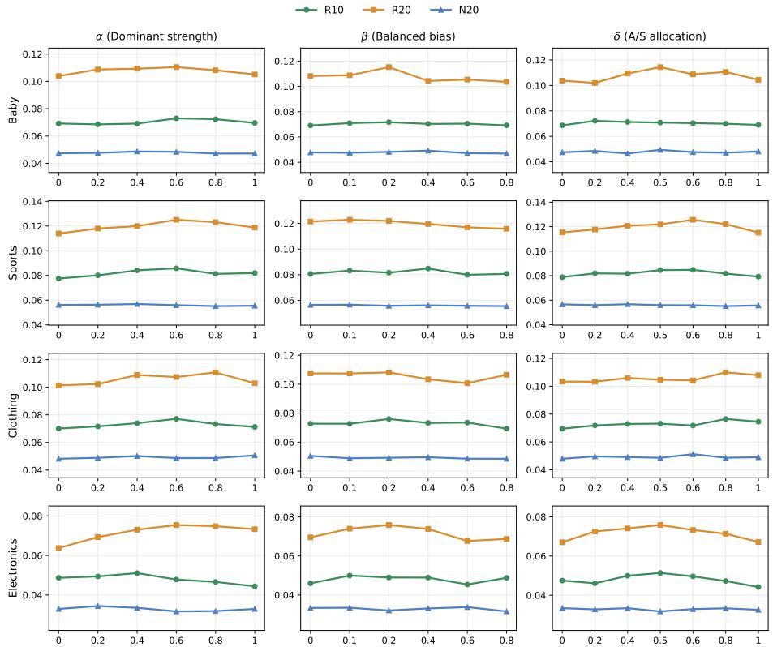  
Note: Each subplot uses an independently zoomed y-axis range to highlight relative trends; please refer to the main tables for absolute magnitudes.  
Fig. 3. Hyper-parameter sensitivity of MAGNET-DV with respect to the triplet-template controls (�, �, �). Each subplot adopts a zoomed y-axis range to reveal subtle yet consistent performance variations. Hollow markers indicate the default seting used in all main experiments. We sweep each control over a discrete set.

– � peaks mildly at mid-range values, and the default is near-optimal. Performance under � is generally stable for small-to-moderate values, while larger � can lead to slight degradation on some datasets. This supports a conservative bias in balanced-type experts when mixing behavior with content.

– � is more dataset dependent, while the default remains competitive. The � trends are more dataset dependent than those of � and �, reflecting diferent preferences between appearance and semantics across datasets. The default setting remains a robust choice, while � is the most relevant control to adjust when transferring to domains with shifted visual/text quality.

– Summary. Overall, the triplet-template controls provide a stable operating region: defaults are near-optimal across datasets, � and � are mildly sensitive with mid-range preferences, and � captures dataset-specific appearance–semantics balance. In practice, the model can be deployed with default settings and only requires a lightweight one-dimensional sweep when domain characteristics change substantially.

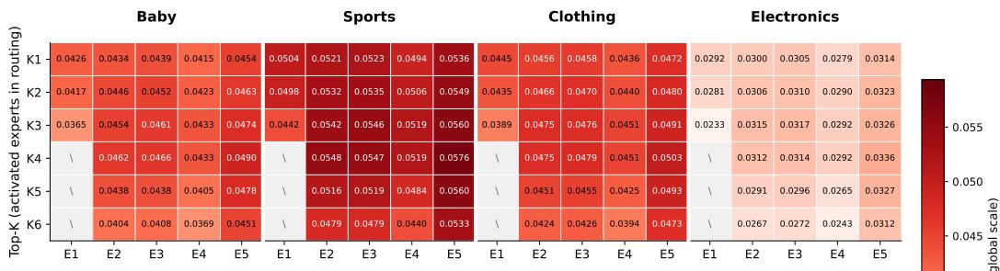  
(a) Upper: family-composition × Top-K (metric: N@20).  
(b) Lower: expert-splitting × Top-K (metric: N@20).  
Fig. 4. Sensitivity of MAGNET to expert capacity � and Top-� routing (metric: �@20). Upper: familycombination under $E \leq 9$ (E1–E5). Lower: expert-spliting with $\scriptstyle { E = 9 p }$ (E1–E5). K1–K6 denote Top-� routing with $K \in \{ 1 , \ldots , 6 \}$ ; invalid cells with $K > E$ are marked as “\”.

## 4.8 Hyper-parameter Study on Expert Capacity � and Top-� Routing

We further study two hyper-parameters in our structured MoE design: the total number of experts � and the number of activated experts � (Top-� routing). This study complements the main results by quantifying how expert capacity and routing sparsity afect specialization under the same training protocol. (Here, Top-� denotes the number of activated experts in MoE routing; the � in R@�/N@� is the evaluation cutof.)

Experimental setup. We visualize �@20 in Figure 4 as a compact summary for the 2D sweep; the same trends hold for �@20 and other top-� metrics reported in Secs. 4.5–4.7. We sweep $K \in \{ 1 , 2 , 3 , 4 , 5 , 6 \}$ (shown as K1–K6), and invalid configurations with $K > E$ are marked as “\”.

We consider two settings for �. In the Upper panel $( E \leq 9 )$ , we vary the expert-family composition. Since each template family (Dom/Bal/Com) instantiates one expert per modality group (three groups in total) following Section 3.3.2, a single family yields �=3 experts, any two families yield �=6, and the full set yields �=9. Accordingly, the x-axis labels E1–E5 in Figure 4(a) correspond to five fixed compositions: Bal-only (�=3), Bal+Dom (�=6), Bal+Com (�=6), Dom+Com (�=6), and Full (Bal+Dom+Com, �=9).

In the Lower panel, we study expert splitting by replicating each of the nine structured experts � times, so $E { = } 9 p$ with $p \in \{ 1 , 2 , 3 , 4 , 5 \}$ (thus $E \in \{ 9 , 1 8 , 2 7 , 3 6 , 4 5 \} )$ ; the x-axis labels E1–E5 in Figure 4(b) correspond to $p \in \{ 1 , \ldots , 5 \}$ . Unless specified, we keep the full MAGNET training protocol unchanged and only vary � and Top-� activation. Results are shown in Figure 4; we obtain the following findings:

– The full family set performs best. In the Upper panel, the Full setting (E5, �=9) almost achieves best �@20 across datasets under the favorable � region, indicating that combining Dom, Bal, and Com provides complementary capacity beyond partial compositions.

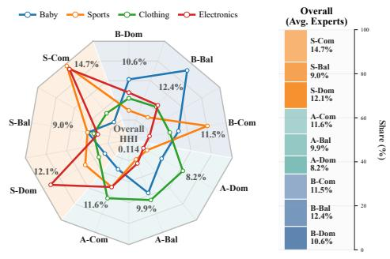  
(a) Expert Usage Radar

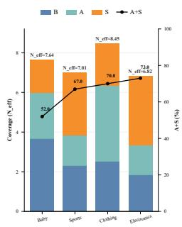  
(b) Modality Reliance

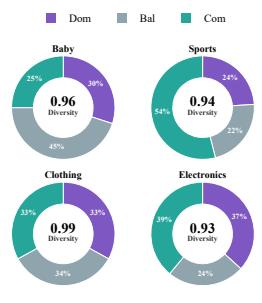  
(c) Fusion & Diversity  
Fig. 5. Analysis of 9-expert routing and usage paterns across domains and modalities. Left: Expert usage radar over a 9-expert pool. Middle: Modality reliance and coverage statistics. Right: Fusion regime composition and diversity metrics.

– Including Bal improves robustness under partial compositions. Among the �=6 settings in the Upper panel, combinations that include Bal (E2/E3) are generally more stable than Dom+Com (E4), suggesting that balancing-type experts help avoid overly brittle routing when capacity is limited.

– Top-� peaks at a moderate sparsity level. For most configurations with $E \geq 6 ,$ perfor-mance im roves from small � to a eak around K4, and then sli htl decreases for lar er � (K5/K6). We therefore use �=4 by default in the main experiments unless otherwise stated.

– Expert splitting provides small gains with early saturation. In the Lower panel, increasing � from 9 to 27 (E1→E3) yields modest but consistent improvements, while further scaling to 36/45 brings marginal returns, suggesting diminishing benefits once the structured expert roles are already covered.

## 4.9 Routing analysis of the 9-expert pool

Scope and reproducibility. Unless otherwise stated, we report routing statistics under the default configuration used in the main experiments (�=9 with Top-� routing and �=4), using the same training protocol. All statistics are computed from the same model checkpoint as the main results, aggregated over the same evaluation split. This subsection is intended as an interpretability diagnostic under the default setting rather than a comparison across capacity choices.

MAGNET routes each user–item interaction (�, �) through a pool of �=9 experts instantiated from the template structure (three modality groups and three expert families). Under the default setting, we examine whether routing (i) maintains broad expert usage rather than collapsing to a few experts, (ii) adjusts modality reliance across domains, and (iii) yields coherent family-level regimes instead of arbitrary mixing. Figure 5(a) shows expert-level usage, Figure 5(b) reports modality reliance with routing coverage, and Figure 5(c) summarizes family proportions with a normalized diversity score.

Bridge between training-time switching and analysis-time statistics. For each interaction $( u , i )$ , the router first outputs a dense distribution $\pmb { \pi } _ { u i } \in \mathbb { R } ^ { E }$ and then applies Top-� sparsification to obtain the renormalized $\tilde { \pmb { \pi } } _ { u i }$ for expert aggregation. In this subsection, all entropy/diversity statistics are com uted from the dense $\pmb { \pi } _ { u i }$ , while trainin -time sta e switchin (Section 3.4) relies on a windowed mini-batch mean; our analysis instead aggregates over the evaluation split at the dataset level.

Following the notation introduced earlier, we aggregate $\pmb { \pi } _ { u i }$ over interactions in the evaluation split of each dataset and summarize the resulting dataset-level profile. Let �¯ denote the mean routing vector on the evaluation split:

$$
\bar {\boldsymbol {\pi}} = \mathbb {E} _ {(u, i) \sim \mathcal {D} _ {\mathrm{eval}}} [ \boldsymbol {\pi} _ {u i} ], \quad \sum_ {e = 1} ^ {E} \bar {\pi} _ {e} = 1.\tag{33}
$$

We summarize routing coverage and dispersion from the dataset-level mean routing vector �¯ . Concretely, we report the efective expert count $N _ { \mathrm { e f f } }$ as a coverage indicator, and use HHI and Div to characterize concentration and uniformity, respectively, all defined in Equation (34).

$$
H (\bar {\boldsymbol {\pi}}) = - \sum_ {e = 1} ^ {E} \bar {\pi} _ {e} \log \bar {\pi} _ {e}, \quad N _ {\text { eff }} = \exp (H (\bar {\boldsymbol {\pi}})), \quad \mathrm{HHI} (\bar {\boldsymbol {\pi}}) = \sum_ {e = 1} ^ {E} \bar {\pi} _ {e} ^ {2}, \quad \operatorname{Div} (\bar {\boldsymbol {\pi}}) = \frac {H (\bar {\boldsymbol {\pi}})}{\log E} \in [ 0, 1 ].\tag{34}
$$

Here, HHI increases as routing becomes more concentrated, while Div increases as routing be- comes more uniform. Div(�¯ ) corresponds to a normalized entropy of the mean routing distribution, and uses the same normalization form as the entropy quantity in our progressive switching, but is computed from the dataset-level mean in Eq. (33).

For the modality-level view, we aggregate �¯ within each modality group to obtain modality reliance, and visualize these shares together with $N _ { \mathrm { e f f } } { \mathrm { ; } }$ ; we also report (�+�) to summarize the overall participation of content signals (appearance and semantics). For the family-level view, we aggregate �¯ within each expert family (Dom/Bal/Com) and visualize their proportions, together with Div(�¯ ) as a compact dispersion summary.

With these diagnostics in place, we summarize routing behavior under the default configuration in the following observations:

– Routing remains broadly covered rather than collapsing to a few experts. Figure 5(a) shows that overall expert usage is not dominated by a single expert or a single group, and the concentration score (HHI) is low. This is consistent with the high coverage reported in Figure 5(b), indicating broad participation of the expert pool under the default router.

– Modality reliance shifts across domains in a structured way. The modality view in Figure 5(b) shows that the content participation ratio (�+�) increases from behavior-anchored domains to more content-dependent domains, while the behavior component remains non- trivial throughout. This matches the intended role of behavior as an anchor, with appearance and semantics contributing more when they are informative.

– Baby exhibits a behavior-anchored, balanced routing style. In Figure 5(b), Baby has the lowest (�+�) among the evaluated datasets. Correspondingly, Figure 5(c) shows a strong Bal regime, suggesting routing that emphasizes stable trade-ofs with limited reliance on content signals.

– Sports is correction-oriented and dominated by complementary fusion. Figure 5(c) assigns the largest share to the Com family for Sports, indicating that content is frequently used as an auxiliary corrective signal. This is aligned with Figure 5(b), where Sports shows substantial content participation.

– Clothing is the most diverse among the four domains. Clothing achieves the highest coverage in Figure 5(b) and also the highest dispersion in Figure 5(c). Its near-maximal Div in (34) indicates that multiple experts and regimes remain simultaneously useful, leading the router to spread trafic across the pool rather than focusing on a narrow subset.

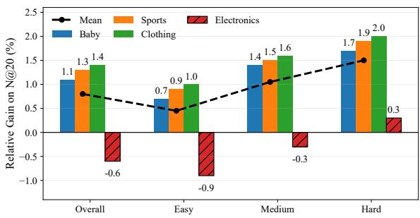  
(a) Dual-view vs Single-view Gain under Difficulty Regimes

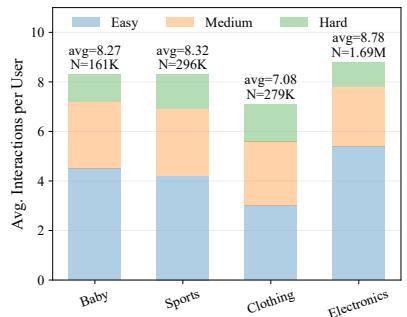  
(b) Bucket Composition

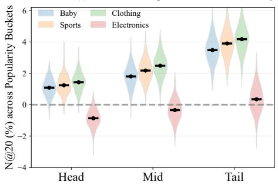  
(c) Per-user Gain Distribution

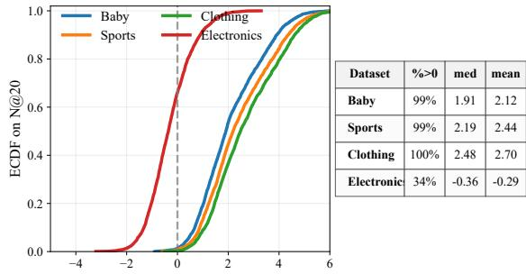  
(d) ECDF of Per-user Gain  
Fig. 6. Top Left (a): Dual-view vs. single-view gain under dificulty regimes. Top Right (b): Bucket composition of per-user interactions. Botom Left (c): Per-user gain distribution across popularity buckets. Botom Right (d): ECDF of per-user gain.

– Electronics is semantics-leaning and more selective. Electronics shows the strongest reliance on semantics in Figure 5(b), while exhibiting lower coverage and lower diversity in Figure 5(c). Together with the expert-level profile in Figure 5(a), this indicates that routing concentrates on a smaller subset of experts in this domain.

## 4.10 Why Dual-view Helps: Dificulty & Popularity Diagnostics

Dual-view encoding is always enabled in MAGNET-DV as specified in Section 3; here we provide a post-hoc diagnosis of which evaluation regimes contribute most to its Dual-view gain, rather than suggesting conditional activation. We compare MAGNET-DV with its Single-view counterpart MAGNET-SV, obtained by disabling induced edges $( E ^ { + } = \varnothing )$ so that the augmented view collapses to the UI-view, while keeping routing, templates, and the training/inference protocol identical. To isolate the efect of induced edges $E ^ { + }$ in the DV vs. SV comparison, we set $\lambda _ { \mathrm { c t r } } = 0$ (i.e., remove the optional alignment term $L _ { \mathrm { c t r } } )$ . Consistent with earlier sections, we focus on N@20 (top-� ranking cutof with �=20) as the representative metric. This diagnostic analysis complements the overall performance results in Section 4.6: Figure 6 decomposes the relative gain of MAGNET-DV over MAGNET-SV under diferent dificulty and popularity regimes. All regime assignments are post-hoc diagnostics, computed from training-only interaction histories and precomputed modality neighborhood statistics, and are not used by the model during training or inference.

We assign each evaluation case to dificulty and popularity buckets, and define the relative gain:

• Dificulty buckets (Easy/Medium/Hard). For each test interaction $( u , i )$ , we define a visibility score $v ( u , i ) \in [ 0 , 1 ]$ from the training-only history $I _ { u }$ and the modality neighbor

sets defined in Section 3.2.1:

$$
v (u, i) = \frac {| I _ {u} \cap N ^ {A} (i) | + | I _ {u} \cap N ^ {S} (i) |}{2 k},
$$

where $N ^ { A } ( i )$ and $N ^ { S } ( i )$ are the top-� nearest neighbors under visual/text features. We assign Easy: $v \geq 0 . 5 ;$ Medium: $0 < v < 0 . 5 ;$ Hard: $v = 0$

• Popularity buckets (Head/Mid/Tail). We proxy popularity by user activity $a _ { u } : = | I _ { u } |$ (number of observed training interactions). Users are ranked by $a _ { u }$ and split into three equal-sized buckets: Head (most active), Mid, and Tail (least active). When reporting bucket composition in Figure 6(b), we weight users by their interaction counts so that the composition reflects the fraction of interactions (rather than raw user counts).

• Relative gain. We report the relative gain of MAGNET-DV over MAGNET-SV on N@20 as $\Delta ( \% ) = ( \mathrm { N } @ 2 0 _ { \mathrm { D V } } - \mathrm { N } @ 2 0 _ { \mathrm { S V } } ) / \mathrm { N } @ 2 0 _ { \mathrm { S V } } \times 1 0 0$ , where both are computed under the same evaluation protocol as Section 4.5.

Figure 6 provides a post-hoc breakdown of the relative gain of MAGNET-DV over MAGNET-SV across dificulty and popularity regimes.

– Dificulty regimes explain where Dual-view helps (Top Left (a)). The gain increases monotonically from Easy $( v \geq 0 . 5 )$ →Medium $( 0 < v < 0 . 5 )$ )→Hard (� = 0), consistent with the intuition that induced edges supply missing structural evidence when the UI-view provides limited observable support. When target evidence is already largely observable (Easy), Single-view methods can often succeed, leaving less room for Dual-view to help. Electronics exhibits weaker/unstable gains in easier regimes (sometimes near-zero or negative), suggesting an informativeness-to-noise trade-of: for this domain, the extra view may introduce distracting context and dilute fine-grained attribute signals.

– Dataset composition modulates the overall magnitude (Top Right (b)). Figure 6(b) summarizes the composition of interactions across buckets, together with dataset scale (�) and average interactions per user. Datasets that allocate a larger interaction mass to Medium/Hard cases naturally contain more scenarios where Dual-view can provide missing evidence, thereby yielding larger overall gains (consistent with the trend in (a)). Notably, although Electronics has large �, its gains remain smaller and less stable, indicating that the limiting factor is not sample size but whether the second view supplies useful complementary signals for this domain.

– Who benefits: coverage across activity levels (Bottom Left (c) and Bottom Right (d)). We next examine per-user gain distributions. Figure 6(c) shows that the gain distribution is centered at positive values for each activity bucket (Head/Mid/Tail), with broader variance in Tail due to fewer interactions. Figure 6(d) further shows broad user-level coverage: the ECDF crosses 0 at high quantiles, indicating that DV improves N@20 for a large fraction of users, while Electronics can be more mixed and exhibit weaker improvements.

Overall, this suggests that Dual-view is most efective when the target item is poorly supported by the training history under modality neighborhoods (small �) and when users are in sparse/long- tail activity regimes (Tail). These findings motivate the subsequent eficiency analysis, where we evaluate whether the benefits can be retained under diferent computation and memory budgets.

## 4.11 Entropy-weighted routing stage analysis

In this subsection, we provide a mechanism-oriented analysis of the entropy-weighted routing stage on Electronics. Diferent from the main experiments that emphasize final recommendation quality, we focus on how routing behavior evolves during training and why the entropy-guided stage design leads to stable specialization. We track three complementary aspects of routing using quantities defined earlier: specialization strength from normalized routing entropy (i.e., SpecScore as the complement of entropy), decisiveness from routing concentration (Top3Mass, the probability mass on the top-3 experts), and collapse risk from load concentration (MaxLoad share, the maximum expert trafic fraction).

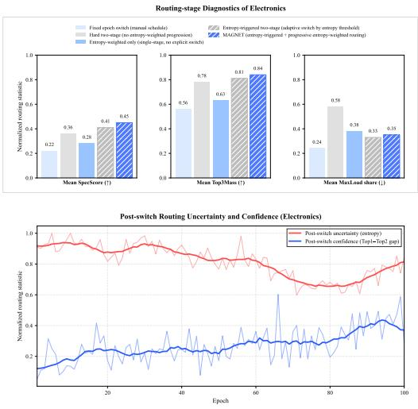

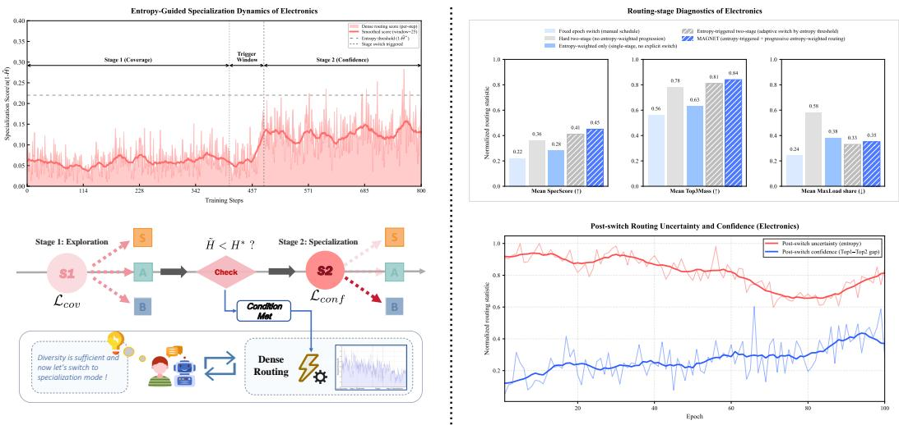  
Fig. 7. Mechanism visualization on Electronics. TOP LEFT: Step-wise specialization score with an entropytriggered switch from coverage to confidence stage. TOP RIGHT: Routing-stage diagnostics comparing control strategies via normalized specialization, concentration, and maximum load share. BOTTOM LEFT: Schematic of the entropy-conditioned two-stage routing procedure. BOTTOM RIGHT: Post-switch routing uncertainty decreases while confidence (top1–top2 gap) increases over training.

4.11.1 Mechanism dynamics on a representative dataset. Fig. 7 provides a mechanism-level visualization of entropy-weighted routing on Electronics. It links the entropy-triggered stage transition to the ensuing evolution of routing behavior, and complements these dynamics with strategy-level diagnostics and a procedural summary. Together, the four views clarify how the entropy-guided design yields stable specialization without pathological load concentration.

We first examine the stage transition process (TOP LEFT). The model starts in a coverage stage, where SpecScore stays relatively low and shows visible fluctuations due to mini-batch stochasticity, which is expected because the router is encouraged to maintain broad coverage across experts instead of committing early to a small subset. As training proceeds, the entropy-derived switching signal approaches the threshold; however, we do not switch at the first crossing. Instead, we mark a short trigger window as a decision bufer: we identify the first time the smoothed signal meets the switching condition and require it to remain satisfied for � consecutive steps under the same smoothing rule used by the stage controller. This design filters out spurious crossings caused by noisy batches and makes the transition point reproducible. After the trigger window, the controller enters the confidence/specialization stage, and SpecScore rises and stabilizes at a higher level, indicating that routing decisions become persistently more specialized.

We further examine routing behavior after the transition (BOTTOM RIGHT). Focusing on the confidence stage, we aggregate routing statistics at the epoch level to obtain a stable view of withinstage evolution. We report two complementary signals from the routing probability distribution: (i) normalized entropy as routing uncertainty (lower is better), and (ii) the top1–top2 probability gap as a margin-style confidence measure (higher is better), which complements concentration summaries such as Top3Mass. After the switch, uncertainty consistently decreases while confidence increases, indicating that the router progressively makes sharper and more decisive expert selections as training proceeds in the confidence stage. Residual fluctuations are expected due to mini-batch composition and hard examples, but the dominant trend is a sustained reduction in ambiguity accompanied by growing separation between the most likely experts.

Next, TOP RIGHT provides a strategy-level diagnostic to disentangle stronger specialization from pathological collapse. We compare several feasible routing-control variants under the same training protocol and summarize their routing behavior using three normalized statistics on a shared scale: specialization strength (SpecScore), routing decisiveness/concentration (Top3Mass), and load concentration risk (MaxLoad share). All three statistics are computed from the same underlying routing outputs and aggregated over a consistent post-switch window (a fixed portion of training after the stage transition), which enables a fair comparison across strategies. The proposed entropy-guided design achieves higher SpecScore together with increased Top3Mass, indicating that the router becomes more decisive and concentrates probability mass on a small set of experts when appropriate. Importantly, this increase in decisiveness does not translate into uncontrolled trafic collapse: MaxLoad share remains at a controllable level, suggesting that specialization is realized through stable expert selection rather than routing nearly all examples to a single expert. Overall, this diagnostic supports that the observed gains stem from meaningful specialization under the staged control, instead of an artifact of extreme load imbalance.

Finally, BOTTOM LEFT provides a compact procedural summary of entropy-conditioned twostage routing. Training starts in a coverage-oriented regime that encourages broad expert utilization while the controller monitors an entropy-derived switching signal. When the switching condition is met persistently, the trigger window acts as a robustness check: it enforces a �-step confirmation under the same smoothing rule to prevent noisy batches from causing premature or irreproducible switches. Once confirmed, the controller transitions into a confidence/specialization regime, where routing is encouraged to become sharper and more stable.

Overall, Fig. 7 presents a closed-loop view of the mechanism: the entropy signal yields a robust, reproducible stage transition; post-switch routing becomes sharper and more confident; and strategy-level diagnostics confirm that specialization emerges without harmful load concentration.

4.11.2 Cross-dataset consistency. To test whether the stage-wise specialization observed on Electronics generalizes, we track the same routing signals on all four benchmarks (Baby, Sports, Clothing, and Electronics) under the default protocol and early stopping.

Figure 8 reports three epoch-level statistics computed from the dense routing distribution $\pmb { \pi } _ { u i }$ (before Top-� sparsification), with each curve normalized to [0, 1]. Efective #Experts $( N _ { \mathrm { e f f } }$ entropy-derived; lower means fewer efectively used experts), Winner Share (Top-1 routing probability), and Concentration (normalized HHI-style peakedness) jointly show a consistent pattern across datasets: routing becomes more decisive and concentrated (Winner Share↑, Concentration↑) while the efective expert count decreases and then stabilizes (Efective #Experts↓), supporting the intended coverage-to-confidence transition induced by entropy-guided progressive routing.

The datasets difer in specialization rate and plateau: Clothing shows the fastest/strongest specialization, Baby is more conservative with a higher $N _ { \mathrm { e f f } }$ plateau, Sports lies in between, and Electronics exhibits a smoother, longer trajectory due to its larger training horizon; nevertheless, all follow the same qualitative direction, indicating a robust training dynamics rather than a dataset-specific artifact.

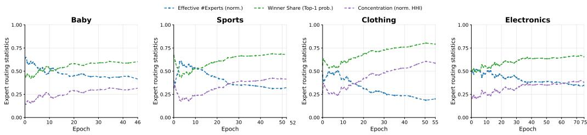  
Fig. 8. Cross-dataset routing dynamics (normalized to [0, 1]) measured from dense $\pi _ { u i }$ before Top-� sparsification: Efective #Experts $( N _ { \mathrm { e f f } } )$ , Winner Share (Top-1), and Concentration (normalized HHI). All datasets exhibit a stage-wise transition toward more confident and concentrated routing (Winner Share↑, Concentration↑, $N _ { \mathrm { e f f } }$ ↓ with saturation).

## 4.12 Hyper-parameter Analysis of Entropy-Triggered Two-Stage Routing

4.12.1 Overall Sensitivity Analysis Framework. Building on the routing dynamics analysis in previous section, which verifies that the proposed entropy-triggered two-stage scheme induces the intended training behavior, we further investigate its hyper-parameter sensitivity in this section. This additional study is necessary for two reasons: first, the routing schedule involves several coupled controls (stage weighting, switching condition, and regularization strength) that may afect the stability of stage transition and the balance between coverage and specialization; second, a systematic sensitivity report is essential to demonstrate that the observed gains do not rely on delicate tuning and to provide reproducible guidelines for practical adoption.

Accordingly, we organize this part around three complementary aspects of the routing schedule. Section 4.12.2 compares alternative entropy-weighting designs for $\lambda _ { s } ( \tilde { H } )$ to assess how the stage- weight mapping influences performance. Section 4.12.3 analyzes the joint efect of the switching threshold $H ^ { * }$ and trigger window $W ,$ which together determine when and how stably the model transitions between stages. Section 4.12.4 evaluates the robustness to the overall routing regularization strength $\lambda _ { r } ,$ identifying a stable operating range and the degradation patterns under underand over-regularization.

4.12.2 Stage-Weight Strategy Evaluation. To validate the design choice of entropy-controlled stage weights $\lambda _ { s } ( \tilde { H } ) ( \mathrm { E q } . 3 2 )$ in our progressive routing regularization, we conduct a controlled comparison against three alternative weighting strategies. All variants share the same routing architecture and switching rule, and only difer in the functional form used to scale the stage-wise regularizers.

• Lin-Ent (Ours): Uses Eq. 32 with $\lambda _ { \mathrm { c o v } } = \lambda _ { r } ( 1 - \tilde { H } )$ in Stage 1 and $\lambda _ { \mathrm { c o n f } } = \lambda _ { r } \tilde { H }$ in Stage 2, shifting regularization emphasis from coverage to confidence as routing becomes more decisive.

• Quad-Ent: Uses the same two-stage structure but applies a quadratic entropy mapping, with $\lambda _ { \mathrm { c o v } } = \lambda _ { r } ( 1 - \tilde { H } ) ^ { 2 }$ and $\lambda _ { \mathrm { c o n f } } = \lambda _ { r } \tilde { H } ^ { 2 }$ , making the stage weighting more concentrated at low/high-entropy regimes.

• Const: Keeps stage weights constant while preserving two-stage regularization, with $\lambda _ { \mathrm { c o v } } =$ $\lambda _ { r }$ in Stage 1 and $\lambda _ { \mathrm { c o n f } } = \lambda _ { r }$ in Stage $^ { 2 , }$ removing entropy adaptivity.

• Rev-Ent: Flips the entropy-to-weight coupling, with $\lambda _ { \mathrm { c o v } } = \lambda _ { r } \tilde { H }$ and $\lambda _ { \mathrm { c o n f } } = \lambda _ { r } ( 1 - \tilde { H } )$ across Stage $^ { 1 / 2 , }$ , serving as a directionality sanity check.

The ex erimental results are summarized in Table 6 below:

<table><tr><td rowspan="2">Strategy ( $\lambda_s$ )</td><td colspan="2">Baby</td><td colspan="2">Sports</td><td colspan="2">Clothing</td><td colspan="2">Electronics</td></tr><tr><td>R@20</td><td>N@20</td><td>R@20</td><td>N@20</td><td>R@20</td><td>N@20</td><td>R@20</td><td>N@20</td></tr><tr><td>Lin-Ent (Ours)</td><td>0.1076</td><td>0.0478</td><td>0.1198</td><td>0.0560</td><td>0.1056</td><td>0.0492</td><td>0.0716</td><td>0.0329</td></tr><tr><td>Quad-Ent</td><td>0.1068</td><td>0.0475</td><td>0.1190</td><td>0.0556</td><td>0.1048</td><td>0.0488</td><td>0.0710</td><td>0.0326</td></tr><tr><td>Const</td><td>0.1061</td><td>0.0471</td><td>0.1180</td><td>0.0550</td><td>0.1040</td><td>0.0483</td><td>0.0704</td><td>0.0323</td></tr><tr><td>Rev-Ent</td><td>0.1032</td><td>0.0462</td><td>0.1155</td><td>0.0537</td><td>0.1018</td><td>0.0472</td><td>0.0686</td><td>0.0312</td></tr></table>

Table 6. Efect of the stage-weight strategy $\lambda _ { s } ( \tilde { H } )$ (Eq. 32) on R@20 and N@20 (Dual-view). Unless otherwise stated, we fix $( H ^ { * } , W , \lambda _ { r } )$ to the default configuration in Table 3 for each dataset, and only vary the functional form of $\lambda _ { s } ( \tilde { H } )$ . The first row corresponds to the default seting reported in Table 4.

Based on these results, we draw the following observations:

– Entropy-controlled adaptation is beneficial beyond two-stage switching. Lin-Ent (Ours) consistently outperforms Const across datasets and metrics, indicating that dynamically scaling the regularization strength with $\tilde { H }$ provides additional gains compared to a fixed-weight two-stage schedule. This supports our motivation of reducing sensitivity to manual weighting choices.

– The direction of entropy weighting matters and matches the intended training dynamics. Rev-Ent yields a clear degradation relative to all other strategies, suggesting that encouraging confidence too early (when routing is still difuse) can hinder stable optimization, while forcing coverage after routing becomes confident can delay specialization. This validates the rationale of emphasizing coverage first and confidence later.

– Nonlinear weighting ofers limited benefit under a fixed switching rule. Quad-Ent performs close to the linear schedule but does not surpass it consistently, implying that the linear entropy-to-weight mapping is already a strong and robust choice. In practice, Lin-Ent achieves a better balance between stability and specialization without introducing extra sensitivity from a sharper nonlinear response.

4.12.3 Sensitivity to $( H ^ { * } , W )$ . This section studies the sensitivity of the entropy-triggered two-stage schedule to two key hyper-parameters: the entropy threshold $H ^ { * }$ and the trigger window length �. Since these parameters jointly determine when the training switches from Stage 1 to Stage 2, we aim to verify that our method remains robust under a broad operating range and that the default setting used in the main results is well-justified. The results are summarized in Fig. 9.

– Parameter meaning. $H ^ { * }$ specifies the entropy level required to activate the stage transition, while � controls how many consecutive steps must satisfy the trigger condition, reducing spurious switches caused by short-term fluctuations. Together, they regulate the switching timing and stability of the two-stage training process.

– Broad plateau indicates low sensitivity. Across all four datasets, the heatmaps exhibit a stable high-performance region around moderate values of $( H ^ { * } , W )$ , where Recall@20 varies only marginally. This suggests that the proposed schedule does not rely on delicate tuning and can generalize well across domains.

– Extreme settings lead to consistent degradation. Overly small � tends to make the trigger overly responsive, resulting in less stable switching behavior, while overly large � or extreme $H ^ { * }$ values can delay the transition and weaken the intended stage-wise efect. Both cases produce a mild yet consistent performance drop at the search grid boundaries.

– Dataset-specific optima with a shared robust region. The best-performing $( H ^ { * } , W )$ may difer slightly across datasets, but the near-optimal regions largely overlap. Notably, the default configuration $( H ^ { * } , W ) = ( 0 . 9 0 , 4 )$ (used throughout the main tables) lies within this shared plateau, providing a reliable and fair choice without per-dataset tuning.

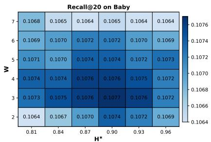

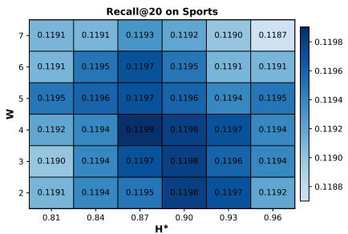

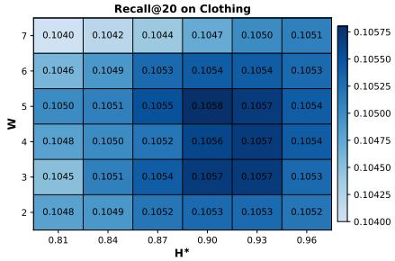

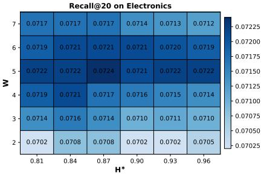  
Fig. 9. Hyper-parameter sensitivity of the entropy-triggered two-stage schedule w.r.t. $( H ^ { * } , W )$ on four datasets. We report Recall@20 under the Dual-view seting.

4.12.4 Sensitivity to Routing Regularization Strength $\lambda _ { r }$ . In this subsection, we investigate the sensitivity of our entropy-triggered two-stage routing scheme to the global regularization strength $\lambda _ { r }$ . Since $\lambda _ { r }$ globally scales the routing regularizers in both stages, it directly controls how strongly the router is constrained during training. Our goal is to examine whether the performance remains stable within a reasonable range of $\lambda _ { r } ,$ , and to identify practical operating regions across datasets.

The results are reported in Fig. 10. We vary $\lambda _ { r }$ over a logarithmic grid with refinement in the mid-range, namely $\lambda _ { r } \in \{ 0 . 0 1 , 0 . 0 2 , 0 . 0 5 , 0 . 1 0 , 0 . 1 5 , 0 . 2 0 , 0 . 3 0 , 0 . 4 0 , 0 . 6 0 , 0 . 8 0 \}$ , while keeping all other settings fixed (including $( H ^ { * } , W )$ and the entropy-weight schedule). We evaluate the Dual-view Recall@20 on four datasets.

– Under-regularization degrades performance. When $\lambda _ { r } \in [ 0 . 0 1 , 0 . 0 5 ]$ , the model consis- tently underperforms across all datasets. This indicates that insuficient routing regularization weakens the intended stage-wise constraints and makes it harder to establish stable expert utilization and specialization.

– A broad efective region yields robust performance. As $\lambda _ { r }$ increases, Recall@20 improves rapidly and reaches a stable high-performance plateau in the moderate range (roughly 0.15– 0.40). Within this region, performance diferences are marginal, suggesting that the proposed routing scheme does not rely on delicate tuning of $\lambda _ { r }$

– Over-regularization causes mild regression. Further increasing $\lambda _ { r }$ to large values (0.60– 0.80) leads to a small but consistent drop. This behavior aligns with the intuition that overly strong regularization may constrain router adaptivity and introduce optimization trade-ofs with the main recommendation objective.

Overall, these results confirm that our method is robust to the choice of $\lambda _ { r }$ within a wide operating range, and that selecting a moderate strength provides reliable performance. In practice, we recommend choosing $\lambda _ { r }$ within [0.15, 0.40] for stable and strong results. More fine-grained hyper-parameter settings and complementary analyses are provided in the parameter summary table for reference.

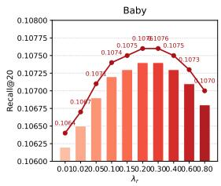

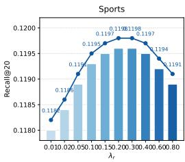

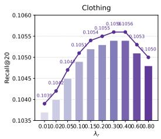

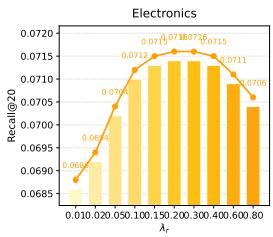

Fig. 10. Sensitivity of routing regularization strength $\lambda _ { r }$ on four datasets (Recall@20).  
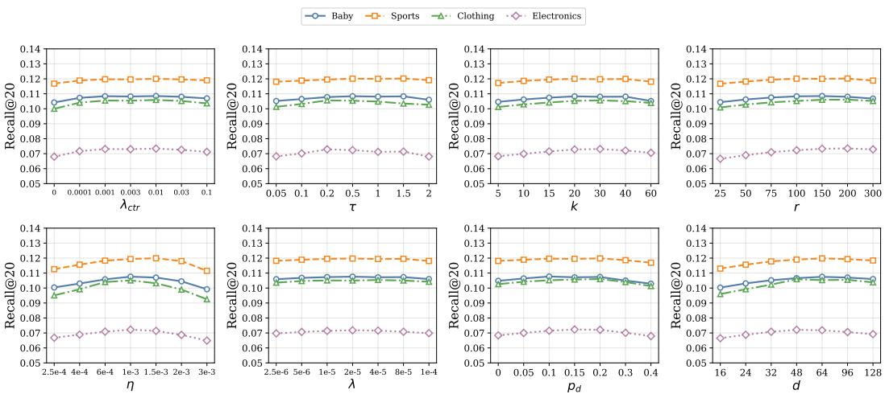  
Fig. 11. Hyperparameter sensitivity of MAGNET measured by Recall@20 on four datasets. Each subplot varies one hyperparameter while fixing the others to the default seting.

## 4.13 Efect of Hyperparameters

To improve reproducibility and quantify tuning sensitivity, we conduct a unified hyperparameter study for MAGNET. Unless otherwise stated, we vary one hyperparameter at a time while fixing all others to the default configuration reported Table 3. We report Recall@20 on Baby, Sports, Clothing, and Electronics, as shown in Fig. 11.

From Fig. 11, we have the following observations: $( 1 ) \lambda _ { \mathrm { c t r } }$ governs the strength of view alignment. When $\lambda _ { \mathrm { c t r } } = 0$ , performance drops consistently across datasets, indicating that the alignment term provides indispensable supervision. Once $\lambda _ { \mathrm { c t r } }$ becomes non-zero, Recall@20 rapidly improves and then enters a relatively flat region, suggesting that alignment is “easy to activate” and does not require delicate tuning; (2) � (the temperature in the contrastive objective) follows a moderate-isbest pattern. Extremely small � over-emphasizes hard negatives and can amplify noise, whereas overly large � weakens contrastive discrimination. In practice, we observe a broad near-optimal mid-range where the curves stay close, and the exact peak can shift slightly by dataset, reflecting diferent noise levels and modality consistency; (3) � (top-� item neighbors) improves performance initially by enriching local context for propagation/aggregation, but the gain saturates quickly.

Larger � brings limited additional benefit and may mildly degrade due to noisy neighbors, with the plateau typically appearing earlier on the more challenging Electronics dataset; (4) � (top- � candidate expansion) shows a similar but not identical trend: increasing � helps cover more plausible candidates and improves Recall@20 up to a moderate range, after which the improvement becomes marginal and may flatten (or slightly drop) as irrelevant candidates accumulate and cost increases; (5) � (learning rate) is relatively sensitive and exhibits a typical unimodal behavior. Too small � leads to slower progress and underfitting within a fixed training budget, while too large � can destabilize optimization and hurt generalization. Notably, diferent datasets may tolerate slightly diferent ranges, yet all show a clear preference for an intermediate region; (6) � (weight decay) has a mild impact over a wide range: removing weight decay can cause slight overfitting, whereas overly strong decay can underfit. Overall, the curves remain nearly flat, indicating that generalization is not overly dependent on precise regularization strength; (7) $\mathit { p _ { d } }$ (dropout rate) presents a gentle sweet spot. Moderate dropout improves generalization by reducing co-adaptation, while excessive dropout discards too much information and causes a more visible decline, which can be more pronounced on datasets with weaker signals (e.g., Electronics) or larger variance (e.g., Clothing); and (8) � (embedding size) increases performance as capacity grows from small values, but the gain saturates at moderate dimensions and may slightly recede at very large sizes due to over-parameterization and harder optimization, indicating that strong performance does not rely on excessively large embeddings.

Overall, this figure suggests that MAGNET achieves strong accuracy without brittle tuning and exhibits several consistent regularities across datasets. First, alignment- and optimization-related hyperparameters $( \lambda _ { \mathrm { { c t r } } } , \tau ,$ , and �) can influence performance more noticeably, yet they still admit broad near-optimal regions: $\lambda _ { \mathrm { c t } }$ r shows a clear “on/of” efect followed by a plateau, � remains stable in a moderate band, and � displays a standard unimodal trend rather than erratic sensitivity. Second, regularization and capacity parameters $( \lambda , p _ { d }$ , and �) are comparatively robust: weight decay is almost flat across practical settings, dropout only becomes harmful when pushed too high, and embedding size saturates at moderate values. Third, eficiency-related choices (� and �) exhibit rapid saturation, implying that aggressively increasing neighborhood size or candidate expansion mainly increases computation and noise exposure with limited gains. Finally, although datasets difer in absolute dificulty (Electronics is consistently lower), the relative trends are largely consistent, and the default configuration used in our main experiments falls within these stable regions across datasets, providing a reliable operating point without extensive dataset-specific hyperparameter search.

## 5 Special analysis

## 5.1 Complexity and Eficiency

Our model integrates dual-view graph learning and MoE-style routing to better capture cross-modal preference signals. While these components naturally introduce extra computation compared to single-view baselines, the resulting overhead is expected to be a controlled (mostly linear) increase rather than a prohibitive blow-up. In this subsection, we examine (i) where the asymptotic cost comes from, and (ii) how it translates into practical GPU memory usage, per-epoch runtime, and convergence behavior under early stopping. We report results for both MAGNET-SV (singleview) and MAGNET-DV (dual-view): the former serves as a resource-eficient alternative when computational budget is limited, while the latter is our default configuration.

Theoretical complexity. Let |� | denote the number of nodes involved in training, and let |�| denote the number of edges actually processed per layer under our training pipeline (i.e., sampled edges induced by neighbor sampling with fanout � ). Let � be the embedding dimension and �

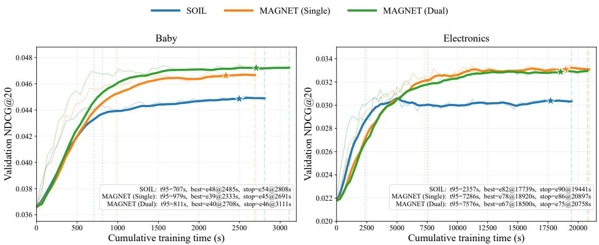  
Fig. 12. Validation NDCG@20 versus cumulative training time on Baby and Electronics. Faint lines show raw evaluation traces and solid lines show the smoothed trend. Vertical dashed lines mark the time to reach 95% of the final validation level $\left( { t _ { 9 5 } } \right)$ . Star markers indicate the early-stopped checkpoint. The inset box reports metrics for the best and early-stopping epochs.

Table 7. Eficiency summary. Upper: Peak GPU memory and training time per epoch. Lower: Convergence statistics under early stopping $( t _ { 9 5 }$ denotes time to reach 95% validation level).

Upper. Runtime and peak GPU memory per epoch.

<table><tr><td rowspan="2">Dataset</td><td colspan="3">Peak Memory (GB)</td><td colspan="3">Time (s/epoch)</td></tr><tr><td>SOIL</td><td>MAGNET-SV</td><td>MAGNET-DV</td><td>SOIL</td><td>MAGNET-SV</td><td>MAGNET-DV</td></tr><tr><td>Baby</td><td>2.44</td><td>3.10</td><td>3.52</td><td>1.49</td><td>1.66</td><td>1.83</td></tr><tr><td>Sports</td><td>3.73</td><td>4.18</td><td>4.62</td><td>3.86</td><td>4.32</td><td>4.78</td></tr><tr><td>Clothing</td><td>4.56</td><td>5.26</td><td>5.84</td><td>4.21</td><td>4.86</td><td>5.39</td></tr><tr><td>Electronics</td><td>6.18</td><td>7.05</td><td>7.76</td><td>20.60</td><td>21.95</td><td>23.30</td></tr></table>

Lower. Convergence statistics under early stopping.

<table><tr><td>Dataset</td><td>Method</td><td> $t_{95}$  (s)</td><td>Best (ep)</td><td>Best (s)</td><td>Stop (ep@s)</td></tr><tr><td rowspan="3">Baby</td><td>SOIL</td><td>707</td><td>48</td><td>2485</td><td>54@2808</td></tr><tr><td>MAGNET-SV</td><td>979</td><td>39</td><td>2333</td><td>45@2691</td></tr><tr><td>MAGNET-DV</td><td>811</td><td>40</td><td>2708</td><td>46@3111</td></tr><tr><td rowspan="3">Sports</td><td>SOIL</td><td>1180</td><td>52</td><td>3720</td><td>60@4180</td></tr><tr><td>MAGNET-SV</td><td>1560</td><td>44</td><td>3560</td><td>50@4320</td></tr><tr><td>MAGNET-DV</td><td>1335</td><td>45</td><td>4010</td><td>52@4680</td></tr><tr><td rowspan="3">Clothing</td><td>SOIL</td><td>1360</td><td>55</td><td>4310</td><td>64@5050</td></tr><tr><td>MAGNET-SV</td><td>1795</td><td>46</td><td>4120</td><td>53@4890</td></tr><tr><td>MAGNET-DV</td><td>1510</td><td>47</td><td>4680</td><td>55@5600</td></tr><tr><td rowspan="3">Electronics</td><td>SOIL</td><td>2357</td><td>82</td><td>17739</td><td>90@19441</td></tr><tr><td>MAGNET-SV</td><td>7286</td><td>78</td><td>18920</td><td>86@20897</td></tr><tr><td>MAGNET-DV</td><td>7576</td><td>67</td><td>18500</td><td>75@20758</td></tr></table>

the number of message-passing layers. For a single view, the dominant cost of graph message passing is $O ( L \cdot | E | \cdot d )$ . Under neighbor sampling with fanout �, we have $| E | = O ( | V | \cdot F )$ , hence the cost is equivalently $O ( L \cdot | V | \cdot F \cdot d )$ . The dual-view variant adds a second view and a lightweight fusion stage, so its total cost increases by a constant-factor multiple relative to the single-view backbone, but remains linear in the same problem dimensions. The routing module adds (i) a gating step that scores experts for each representation, which is linear in the number of routed tokens (nodes or minibatch instances), and (ii) the expert forward computations. With Top-� activation (small �), only a small subset of experts is executed per token, making the incremental cost grow approximately linearly with � rather than with the full expert pool. Overall, dual-view learning and routing primarily contribute bounded constant factors on top of the backbone, whereas the final training cost still depends on how quickly validation performance saturates under the chosen early-stopping protocol.

Practical measurement setup. We empirically evaluate eficiency by peak GPU memory, wall-clock time per epoch, and convergence statistics under early stopping. For comparability, all methods use the same implementation backbone and training protocol (optimizer, mixed precision if used, and the same stopping rule), with fixed architectural hyperparameters (e.g., �, �, and sampling configuration). Peak GPU memory is primarily determined by the active minibatch computation graph (embeddings/activations/optimizer states of the sampled subgraph), rather than the raw dataset size alone; consequently, larger datasets do not necessarily yield proportionally larger peak memory, while time per epoch generally increases with the number of training steps induced by dataset scale.

Peak memory and per-epoch runtime. Table 7 (Upper) reports peak GPU memory (GB) and runtime per epoch (seconds) across the four datasets. MAGNET-SV introduces a moderate overhead over the baseline due to multimodal fusion and routing, and MAGNET-DV further increases the cost by adding the second view. Importantly, the dual-view overhead remains consistently below a naive 2× factor since the two views share the overall training pipeline rather than duplicating computation end-to-end. Electronics exhibits substantially higher time per epoch because its interaction volume induces many more training steps, whereas peak memory increases more gently, consistent with minibatch- and sampling-based training.

Convergence behavior under early stopping. Per-epoch cost alone does not determine the total training budget; the time required to reach a stable validation level is equally important. Table 7 (Lower) reports convergence statistics under early stopping, including the cumulative time to reach 95% of the final validation level $\left( { t _ { 9 5 } } \right)$ , the best checkpoint (epoch and time), and the early- stopping checkpoint (epoch@time). Complementarily, Figure 12 plots validation NDCG@20 against cumulative training time on Baby (small-scale) and Electronics (large-scale), highlighting $t _ { 9 5 }$ and the early-stopped checkpoint to contextualize the end-to-end training budget. Together, they reveal how runtime overhead interacts with convergence speed, ofering a unified view of the quality–cost trade-of in practice.

– Controlled overhead in theory. Dual-view message passing and top-� routing introduce bounded constant factors on top of the backbone, remaining linear in $| \mathcal { V } | _ { \mathrm { ~ } }$ , | E |, and $d .$

– Peak memory is not purely data-size driven. Under minibatch/sampling training, peak GPU memory is dominated by active activations and optimizer states, so it increases moderately across datasets compared with the raw scale diferences.

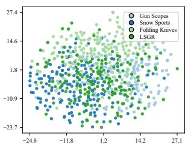  
(a1) Items (raw concat) — category

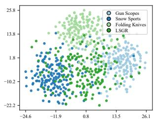  
(a2) Items (ours, MoE fusion) — category

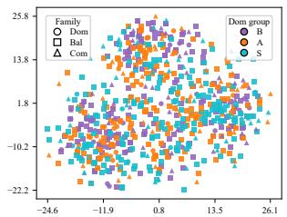  
(c1) Ours items — dom group (color) + family (marker)

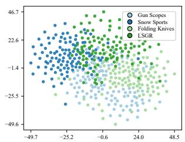  
(b1) Users (raw) — pref\_category

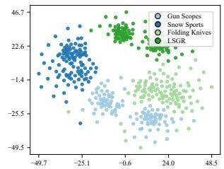  
(b2) Users (ours) — pref\_category

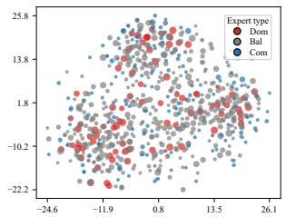  
(c2) Ours items — expert type; size=popularity  
Fig. 13. t-SNE visualization of item/user representations and MoE routing cues. Each panel is fited indepen dently; therefore, the axes are not comparable across panels and the figure is used for qualitative inspection of within-panel structure (mixing vs. separation) and routing interpretability.

– Per-epoch time reflects training steps. Larger datasets (Electronics) entail more training steps per epoch, leading to a noticeably higher time/epoch, while the dual-view overhead remains below a naive doubling.

– Eficiency should be judged end-to-end. The convergence statistics and time–performance curves (Table 7 (Lower) and Figure 12) connect per-epoch cost with early stopping to quantify the practical training budget.

– Deployment flexibility. MAGNET-DV is preferred when maximizing accuracy, while MAGNET SV is an eficient alternative for resource-constrained or rapid-iteration scenarios.

## 5.2 t-SNE Visualization and MoE Interpretability

We visualize the learned item/user representations and routing cues in Figure 13, from which we draw the following conclusions:

MoE fusion yields more structured embeddings. Unlike raw feature concatenation, MoE-fused item embeddings (a2) show clearer category-wise structure and less inter-category overlap than (a1). User embeddings aggregated from interactions exhibit more coherent preference-oriented groupings under MoE fusion (b2 vs. b1), qualitatively supporting the gains reported earlier.

Routing behaviors are structured and item-dependent. Using the same coordinates as (a2), (c1) re-annotates points by dominant routing group and expert family, revealing region-wise routing regularities. (c2) overlays expert types and item popularity, suggesting diferent experts are preferentially activated for items with diferent characteristics (e.g., head vs. tail), consistent with specialization.

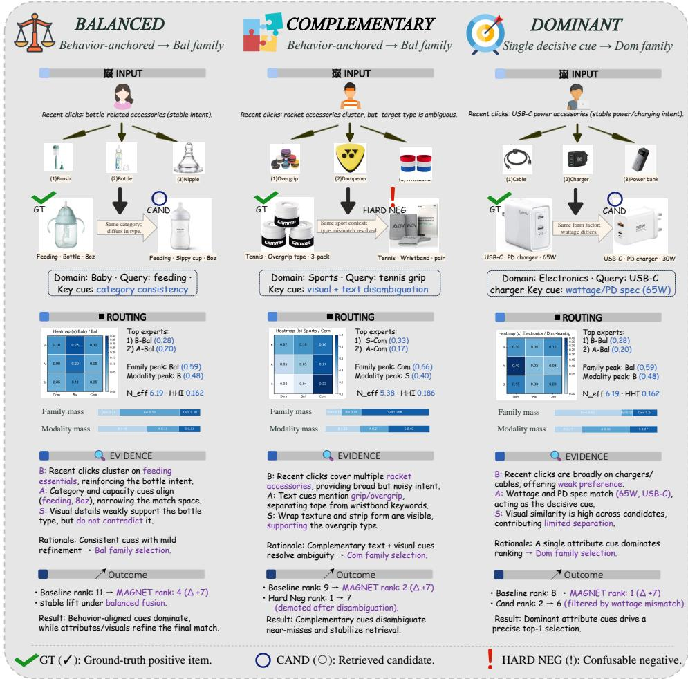  
Fig. 14. Case study of three representative retrieval instances illustrating three routing paterns: BALANCED, COMPLEMENTARY, and DOMINANT. Each column follows Input → Routing → Evidence → Outcome to visualize how the model routes and aggregates signals to produce the final ranking decision.

## 5.3 Case Study

5.3.1 How the cases are constructed. Each column in Figure 14 corresponds to a single retrieval instance from our evaluation pipeline: a user context (recent interactions), the current query/context, a labeled positive target item (GT), and the retrieved list containing a contrast item (CAND) and, when available, a confusable high-ranked negative (HARD NEG). During runs, we log the retrieved top-� list and the routing/gating weights over the 9 experts. CAND is selected from the top-� as a representative non-GT item for contrast, while HARD NEG is mined as a highly ranked negative most confusable with GT (e. ., similar surface form/attributes/visuals but incorrect b label).

We select three instances (one per column) by stratifying on the routing signature (dominant family pattern) and enforcing presentation constraints: complete modality/metadata fields (no missing image/text/attribute), a clear GT–(CAND/HARD NEG) contrast within the retrieved list, and coverage across diferent domains. All product images are original catalog thumbnails; they are only resized/cropped (and optionally background-removed) for layout consistency.

5.3.2 What is visualized in the routing block. For each instance, the model outputs routing weights over the 9 experts. We aggregate these weights into the 3×3 heatmap by grouping experts along the modality axis and the family axis, and normalize the aggregated masses so that the nine cells sum to 1 (routing mass). The two horizontal bars (“family mass” and “modality mass”) are the marginals of the same normalized heatmap. “Top experts” lists the highest-weight experts, while $N _ { \mathrm { e f f } }$ and HHI summarize diversity/concentration of the same routing distribution.

## 5.3.3 Key takeaways. From Figure 14, we draw the following conclusions:

– Balanced routing stabilizes intent while refining details. In the BALANCED case, rout ing mass spreads across complementary sources: behavior anchors the user intent, and at- tributes/visual cues provide mild refinement, improving ranking without over-committing to a single cue.

– Complementary routing resolves ambiguity and demotes confusable negatives. In the COMPLEMENTARY case, no single modality is suficient; cross-modal cues jointly disambiguate near-misses and can demote a high-ranked HARD NEG once the ambiguity is resolved.

– Dominant routing makes decisive selections under a single strong discriminator. In the DOMINANT case, a decisive attribute-level constraint drives a peaked routing distribution, leading to a precise top-1 selection, while other signals mainly play a supporting role.

Overall, the case study complements our quantitative results by making the evidence-to-routing- to-outcome chain explicit at the instance level.

## 6 Conclusion

This work studies multimodal recommendation under implicit feedback and proposes MAGNET, a stable and controllable framework for interaction-conditioned multimodal fusion with improved in- terpretability. MAGNET makes three key contributions. (i) Dual-view structural augmentation: startin from collaborative structures, it induces a small set of content-similarit user–item candi dates to form an augmented view, which is encoded in parallel with the original interaction view and integrated via lightweight fusion. (ii) Structured expert space for fusion: it organizes experts explicitly by modality groups and expert families, and instantiates interpretable fusion patterns— dominant, balanced, and complementary—via triplet templates. (iii) Behavior-conditioned sparse routing with stabilized learning: a Top-� router selects a small set of experts per interaction, and an entropy-triggered two-stage schedule transitions from broad expert coverage to confident specialization, mitigating expert collapse and improving routing stability.

We evaluate MAGNET on multiple public MMRec benchmarks against a wide range of strong baselines. MAGNET consistently achieves state-of-the-art ranking performance, and ablations confirm the necessity and complementarity of all its core components. Beyond accuracy, we analyze routing behavior and eficiency to characterize a controllable quality–cost trade-of between the single-view and dual-view variants. Finally, we provide instance-level attribution analyses that quantify modality contributions and ofer qualitative visualizations to clarify which evidence sources drive recommendations under diferent interaction contexts. Looking ahead, we will explore more adaptive routing and template learning, and improve robustness to noisy or missing modalities to keep explanations reliable.

## References

[1] Ignacio Avas, Liesbeth Allein, Katrien Laenen, and Marie-Francine Moens. 2024. Align MacridVAE: Multimoda Alignment for Disentangled Recommendations. In Proceedings ofthe 46th European Conference on Information Retrieval (ECIR ’24). 73–89. https://doi.org/10.1007/978-3-031-56027-9\_5

[2] Shuqing Bian, Wayne Xin Zhao, Kun Zhou, Jing Cai, Yancheng He, Cunxiang Yin, and Ji-Rong Wen. 2021. Contrastive Curriculum Learning for Sequential User Behavior Modeling via Data Augmentation. In Proceedings ofthe 30th ACM International Conference on Information and Knowledge Management (CIKM ’21). 3737–3746. https://doi.org/10.1145 3459637.3481905

[3] Hong Chen, Yudong Chen, Xin Wang, Ruobing Xie, Rui Wang, Feng Xia, and Wenwu Zhu. 2021. Curriculum Disentangled Recommendation with Noisy Multi-feedback. In Proceedings of the 35th International Conference on Neural Information Processing Systems (NeurIPS ’21). 26924–26936.

[4] Peter Chen, Xiaopeng Li, Ziniu Li, Wotao Yin, Xi Chen, and Tianyi Lin. 2025. Exploration vs Exploitation: Rethinking RLVR through Clipping, Entropy, and Spurious Reward. arXiv preprint arXiv:2512.16912 (2025). https://doi.org/10. 48550/arXiv.2512.16912

[5] Xu Chen, Hanxiong Chen, Hongteng Xu, Yongfeng Zhang, Yixin Cao, Zheng Qin, and Hongyuan Zha. 2019. Per sonalized Fashion Recommendation with Visual Ex lanations based on Multimodal Attention Network: Towards Visuall Ex lainable Recommendation. In Proceedings ofthe 42nd International ACM SIGIR Conference on Research and Development in Information Retrieval (SIGIR ’19). 765–774. https://doi.org/10.1145/3331184.3331254

[6] Daixuan Cheng, Shaohan Huang, Xuekai Zhu, Bo Dai, Wayne Xin Zhao, Zhenliang Zhang, and Furu Wei. 2025. Reasoning with Exploration: An Entropy Perspective. arXiv preprint arXiv:2506.14758 (2025). https://doi.org/10.48550/ arXiv.2506.14758

[7] Damai Dai, Chengqi Deng, Chenggang Zhao, R. X. Xu, Huazuo Gao, Deli Chen, Jiashi Li, Wangding Zeng, Xingkai Yu, Y. Wu, Zhenda Xie, Y. K. Li, Panpan Huang, Fuli Luo, Chong Ruan, Zhifang Sui, and Wenfeng Liang. 2024. DeepSeekMoE: Towards Ultimate Expert Specialization in Mixture-of-Experts Language Models. In Proceedings of the 62nd Annual Meeting ofthe Association for Computational Linguistics (ACL ’24). 128.

[8] Guanting Dong, Licheng Bao, Zhongyuan Wang, Kangzhi Zhao, Xiaoxi Li, Jiajie Jin, Jinghan Yang, Hangyu Mao, Fuzheng Zhang, Kun Gai, Guorui Zhou, Yutao Zhu, Ji-Rong Wen, and Zhicheng Dou. 2025. Agentic Entropy-Balanced Policy Optimization. arXiv preprint arXiv:2510.14545 (2025). https://doi.org/10.48550/arXiv.2510.14545

[9] Guanting Dong, Hangyu Mao, Kai Ma, Licheng Bao, Yifei Chen, Zhongyuan Wang, Zhongxia Chen, Jiazhen Du, Huiyang Wang, Fuzheng Zhang, Guorui Zhou, Yutao Zhu, Ji-Rong Wen, and Zhicheng Dou. 2025. Agentic Reinforced Policy Optimization. arXiv preprint arXiv:2507.19849 (2025). https://doi.org/10.48550/arXiv.2507.19849

[10] William Fedus, Barret Zoph, and Noam Shazeer. 2022. Switch Transformers: Scaling to Trillion Parameter Models with Simple and Eficient Sparsity. Journal of Machine Learning Research 23, 120 (2022), 1–39. https://jmlr.org/papers/v23/21- 0998.html

[11] Zihao Guo, Qingyun Sun, Haonan Yuan, Xingcheng Fu, Min Zhou, Yisen Gao, and Jianxin Li. 2025. GraphMoRE: Mitigating Topological Heterogeneity via Mixture of Riemannian Experts. In Proceedings of the 39th AAAI Conference on Artificial Intelligence (AAAI ’25). 12140–12148. https://doi.org/10.1609/aaai.v39i11.33279

[12] Tuomas Haarnoja, Aurick Zhou, Pieter Abbeel, and Sergey Levine. 2018. Soft Actor-Critic: Of-Policy Maximum Entropy Deep Reinforcement Learning with a Stochastic Actor. In Proceedings ofthe 35th International Conference on Machine Learning (ICML ’18). 1856–1865. http://proceedings.mlr.press/v80/haarnoja18b.html

[13] Xiulan Hao, Xinwei Li, Hua Wang, Zhonglong Zheng, Yunliang Jiang, and Yanchun Zhang. 2025. ITCoHD-MRec: An Independent Topological Preference-Aware and Cooperative Hypergraph Difusion-Based Multimodal Recommender Model. ACM Transactions on Information Systems 44, 1, Article 14 (2025), 29 pages. https://doi.org/10.1145/3767337

[14] Ruining He and Julian J. McAuley. 2016. VBPR: Visual Bayesian Personalized Ranking from Implicit Feedback. In Proceedings ofthe 30th AAAI Conference on Artificial Intelligence (AAAI ’16). 144–150. https://doi.org/10.1609/aaai. v30i1.9973

[15] Xiangnan He, Kuan Deng, Xiang Wang, Yan Li, Yong-Dong Zhang, and Meng Wang. 2020. LightGCN: Simplifying and Powerin Gra h Convolution Network for Recommendation. In Proceedings ofthe 43rd International ACM SIGIR Conference on Research and Development in Information Retrieval (SIGIR ’20). 639–648. https://doi.org/10.1145/3397271. 3401063

[16] Xiangnan He, Lizi Liao, Hanwang Zhang, Liqiang Nie, Xia Hu, and Tat-Seng Chua. 2017. Neural Collaborative Filtering. In Proceedings ofthe 26th International Conference on World Wide Web (WWW ’17). 173–182. htt s://doi.or /10.1145 3038912.3052569

[17] Jun Hu, Bryan Hooi, Bingsheng He, and Yinwei Wei. 2025. Modality-Independent Graph Neural Networks with Global Transformers for Multimodal Recommendation. In Proceedings ofthe AAAI Conference on Artificial Intelligence (AAAI ’25). htt s://a i.semanticscholar.or /Cor sID:274823082

[18] Yupeng Hu, Kun Wang, Meng Liu, Haoyu Tang, and Liqiang Nie. 2023. Semantic Collaborative Learning for Cross Modal Moment Localization. ACM Transactions on Information Systems 42 (2023), 1–26. https://api.semanticscholar. org/CorpusID:261558252

[19] Tinglin Huang, Yuxiao Dong, Ming Ding, Zhen Yang, Wenzheng Feng, Xinyu Wang, and Jie Tang. 2021. MixGCF: An Improved Training Method for Graph Neural Network-based Recommender Systems. In Proceedings ofthe 27th ACM SIGKDD Conference on Knowledge Discovery and Data Mining (KDD ’21). 665–674. https://doi.org/10.1145/3447548. 3467408

[20] Songtao Jiang, Tuo Zheng, Yan Zhang, Yeying Jin, Li Yuan, and Zuozhu Liu. 2024. Med-MoE: Mixture of Domain Specific Experts for Lightweight Medical Vision-Language Models. In Findings ofthe Association for Computational Linguistics: EMNLP 2024. 3843–3860. https://doi.org/10.18653/v1/2024.findings-emnlp.221

[21] Yangqin Jiang, Chao Huang, and Lianghao Huang. 2023. Adaptive Graph Contrastive Learning for Recommendation. In Proceedings ofthe 29th ACM SIGKDD Conference on Knowledge Discovery and Data Mining (KDD ’23). 4252–4261. https://doi.org/10.1145/3580305.3599768

[22] Amrita Kaur, Lakhwinder Kaur, and Ashima Singh. 2024. DeepCONN: patch-wise deep convolutional neural networks for the segmentation of multiple sclerosis brain lesions. Multimedia Tools and Applications 83, 8 (2024), 24401–24433. https://doi.org/10.1007/s11042-023-16292-y

[23] Phuc H. Le-Khac, Graham Healy, and Alan F. Smeaton. 2020. Contrastive Representation Learning: A Framework and Review. IEEE Access 8 (2020), 193907–193934. htt s://doi.or /10.1109/ACCESS.2020.3031172

[24] Bo Li, Yifei Shen, Jingkang Yang, Yezhen Wang, Jiawei Ren, Tong Che, Jun Zhang, and Ziwei Liu. 2022. Sparse Mixture-of-Experts are Domain Generalizable Learners. In Proceedings ofthe 10th International Conference on Learning Representations (ICLR ’22).

[25] Yunxin Li, Shenyuan Jiang, Baotian Hu, Longyue Wang, Wanqi Zhong, Wenhan Luo, Lin Ma, and Min Zhang. 2025. Uni-MoE: Scaling Unified Multimodal LLMs With Mixture of Experts. IEEE Transactions on Pattern Analysis and Machine Intelligence 47, 5 (2025), 3424–3439. https://doi.org/10.1109/TPAMI.2025.3532688

[26] Guojiao Lin, Zhen Meng, Dongjie Wang, Qingqing Long, Yuanchun Zhou, and Meng Xiao. 2024. GUME: Graphs and User Modalities Enhancement for Lon -Tail Multimodal Recommendation. In Proceedings ofthe 33rd ACM International Conference on Information and Knowledge Management (CIKM ’24). 1400–1409. https://doi.org/10.1145/3627673.3679620

[27] Xixun Lin, Rui Liu, Yanan Cao, Lixin Zou, Qian Li, Yongxuan Wu, Yang Liu, Dawei Yin, and Guandong Xu. 2025. Contrastive Modality-Disentangled Learning for Multimodal Recommendation. ACM Transactions on Information Systems 43 (2025), 1–31. https://api.semanticscholar.org/CorpusID:275961825

[28] Fan Liu, Huilin Chen, Zhiyong Cheng, Anan Liu, Liqiang Nie, and Mohan S. Kankanhalli. 2023. Disentangled Multimodal Representation Learning for Recommendation. IEEE Transactions on Multimedia 25 (2023), 7149–7159. https://doi.org/10.1109/TMM.2022.3217449

[29] Qidong Liu, Jiaxi Hu, Yutian Xiao, Xiangyu Zhao, Jingtong Gao, Wanyu Wang, Qing Li, and Jiliang Tang. 2025. Multimodal Recommender Systems: A Survey. Comput. Surveys 57, 2, Article 26 (2025), 17 pages. https://doi.org/10. 1145/369546

[30] Yiding Liu, Yulong Gu, Zhuoye Ding, Junchao Gao, Ziyi Guo, Yongjun Bao, and Weipeng Yan. 2020. Decoupled Graph Convolution Network for Inferring Substitutable and Complementary Items. In Proceedings ofthe 29th ACMInternational Conference on Information and Knowledge Management (CIKM ’20). 2621–2628. https://doi.org/10.1145/3340531.3412695

[31] Ziang Lu, Lei Guo, Xuzheng Yu, Zhiyong Cheng, Xiaohui Han, and Lei Zhu. 2025. Federated Semantic Learning for Privacy-preserving Cross-domain Recommendation. ACM Transactions on Information Systems 43 (2025), 1–27. https://api.semanticscholar.org/CorpusID:277452750

[32] Jiaqi Ma, Zhe Zhao, Xinyang Yi, Jilin Chen, Lichan Hong, and Ed H. Chi. 2018. Modeling Task Relationships in Multitask Learning with Multi-gate Mixture-of-Experts. In Proceedings ofthe 24th ACM SIGKDD International Conference on Knowledge Discovery and Data Mining (KDD ’18). 1930–1939. https://doi.org/10.1145/3219819.3220007

[33] Jianxin Ma, Chang Zhou, Peng Cui, Hongxia Yang, and Wenwu Zhu. 2019. Learning Disentangled Representations for Recommendation. In Proceedings ofthe 33rd International Conference on Neural Information Processing Systems (NeurIPS ’19). 5712–5723.

[34] Men men Ma, Jian Ren, Lon Zhao, Davide Testu ine, and Xi Pen . 2022. Are Multimodal Transformers Robust to Missin Modalit ?. In Proceedings ofthe IEEE/CVF Conference on Computer Vision and Pattern Recognition (CVPR ’22). 18156–18165. https://doi.org/10.1109/CVPR52688.2022.01764

[35] Basil Mustafa, Carlos Riquelme, Joan Puigcerver, Rodolphe Jenatton, and Neil Houlsby. 2022. Multimodal Contrastive Learning with LIMoE: The Language-Image Mixture of Experts. In Proceedings of the 36th International Conference on Neural Information Processing Systems (NeurIPS ’22). 9564–9576.

[36] Rongqing Kenneth Ong and Andy W. H. Khong. 2025. Spectrum-based Modality Representation Fusion Graph Convolutional Network for Multimodal Recommendation. In Proceedings ofthe 18th ACM International Conference on Web Search and Data Mining (WSDM ’25). 773–781. https://doi.org/10.1145/3701551.3703561

[37] Lin Pan, Zhiqiang Pan, Fei Cai, and Honghui Chen. 2026. Multimodal recommender systems: A survey ofrepresentation, modeling, and optimization. Information Fusion 128 (2026), 103991. https://doi.org/10.1016/j.infus.2025.103991

[38] Xiaokang Peng, Yake Wei, Andong Deng, Dong Wang, and Di Hu. 2022. Balanced Multimodal Learning via On-the-fly Gradient Modulation. In Proceedings ofthe IEEE/CVF Conference on Computer Vision and Pattern Recognition (CVPR ’22). 8228–8237. https://doi.org/10.1109/CVPR52688.2022.00806

[39] Xubin Ren, Lianghao Xia, Jiashu Zhao, Dawei Yin, and Chao Huang. 2023. Disentangled Contrastive Collaborative Filtering. In Proceedings ofthe 46th International ACM SIGIR Conference on Research and Development in Information Retrieval (SIGIR ’23). 1137–1146. https://doi.org/10.1145/3539618.3591665

[40] Stefen Rendle, Christoph Freudenthaler, Zeno Gantner, and Lars Schmidt-Thieme. 2009. BPR: Bayesian Personalized Ranking from Implicit Feedback. In Proceedings of the 25th Conference on Uncertainty in Artificial Intelligence (UAI ’09). AUAI Press, Montreal, QC, Canada, 452–461. https://www.auai.org/uai2009/papers/UAI2009\_0139\_ 48141db02b9f0b02bc7158819ebfa2c7.pdf

[41] Carlos Riquelme, Joan Puigcerver, Basil Mustafa, Maxim Neumann, Rodolphe Jenatton, André Susano Pinto, Daniel Keysers, and Neil Houlsby. 2021. Scaling Vision with Sparse Mixture of Experts. In Proceedings of the 35th International Conference on Neural Information Processing Systems (NeurIPS ’21). 8583–8595.

[42] John Schulman, Filip Wolski, Prafulla Dhariwal, Alec Radford, and Oleg Klimov. 2017. Proximal Policy Optimization Algorithms. arXiv preprint arXiv:1707.06347 (2017). https://doi.org/10.48550/arXiv.1707.06347

[43] Noam Shazeer, Azalia Mirhoseini, Krz sztof Maziarz, And Davis, Quoc V. Le, Geofre E. Hinton, and Jef Dean. 2017. Outrageously Large Neural Networks: The Sparsely-Gated Mixture-of-Experts Layer. In Proceedings ofthe 5th International Conference on Learning Representations (ICLR ’17). https://openreview.net/forum?id=B1ckMDqlg

[44] Hongzu Su, Jingjing Li, Fengling Li, Ke Lu, and Lei Zhu. 2024. SOIL: Contrastive Second-Order Interest Learning for Multimodal Recommendation. In Proceedings ofthe 32nd ACM International Conference on Multimedia (MM ’24). 5838–5846. https://doi.org/10.1145/3664647.3681207

[45] Hongyan Tang, Junning Liu, Ming Zhao, and Xudong Gong. 2020. Progressive Layered Extraction (PLE): A Novel Multi-Task Learning (MTL) Model for Personalized Recommendations. In Proceedings ofthe 14th ACM Conference on Recommender Systems (RecSys ’20). 269–278. htt s://doi.or /10.1145/3383313.3412236

[46] Zhulin Tao, Xiaohao Liu, Yewei Xia, Xiang Wang, Lifang Yang, Xianglin Huang, and Tat-Seng Chua. 2023. Self Supervised Learning for Multimedia Recommendation. IEEE Transactions on Multimedia 25 (2023), 5107–5116. https: //d i r /10 1109/TMM 2022 3187556

[47] Hao Wang, Mingjia Yin, Luankang Zhang, Sirui Zhao, and Enhong Chen. 2024. MF-GSLAE: A Multi-Factor User Representation Pre-Training Framework for Dual-Target Cross-Domain Recommendation. ACM Transactions on Information Systems 43 (2024), 1–28. https://api.semanticscholar.org/CorpusID:273604227

[48] Xin Wang, Hong Chen, Yuwei Zhou, Jianxin Ma, and Wenwu Zhu. 2023. Disentangled Representation Learning for Recommendation. IEEE Transactions on Pattern Analysis and Machine Intelligence 45, 1 (2023), 408–424. https: //doi.org/10.1109/TPAMI.2022.3153112

[49] Xin Wang, Yudong Chen, and Wenwu Zhu. 2022. A Survey on Curriculum Learning. IEEE Transactions on Pattern Analysis and Machine Intelligence 44 9 (2022) 4555–4576. htt s://doi.or /10.1109/TPAMI.2021.3069908

[50] Xiang Wang, Xiangnan He, Meng Wang, Fuli Feng, and Tat-Seng Chua. 2019. Neural Graph Collaborative Filtering. In Proceedings ofthe 42nd International ACM SIGIR Conference on Research and Development in Information Retrieval (SIGIR ’19). 165–174. htt s://doi.or /10.1145/3331184.3331267

[51] Xiang Wang, Hongye Jin, An Zhang, Xiangnan He, Tong Xu, and Tat-Seng Chua. 2020. Disentangled Graph Col laborative Filtering. In Proceedings ofthe 43rd International ACM SIGIR Conference on Research and Development in Information Retrieval (SIGIR ’20). 1001–1010. https://doi.org/10.1145/3397271.3401137

[52] Yinwei Wei, Xiang Wang, Liqiang Nie, Xiangnan He, and Tat-Seng Chua. 2020. Graph-Refined Convolutional Network for Multimedia Recommendation with Implicit Feedback. In Proceedings ofthe 28th ACM International Conference on Multimedia (MM ’20). 3541–3549. htt s://doi.or /10.1145/3394171.3413556

[53] Yinwei Wei, Xiang Wang, Liqiang Nie, Xiangnan He, Richang Hong, and Tat-Seng Chua. 2019. MMGCN: Multi modal Graph Convolution Network for Personalized Recommendation of Micro-video. In Proceedings ofthe 27th ACM International Conference on Multimedia (MM ’19). 1437–1445. https://doi.org/10.1145/3343031.3351034

[54] Jiancan Wu, Xian Wan , Fuli Fen , Xian nan He, Lian Chen, Jianxun Lian, and Xin Xie. 2021. Self-su ervised Graph Learning for Recommendation. In Proceedings of the 44th International ACM SIGIR Conference on Research and Development in Information Retrieval (SIGIR ’21). 726–735. https://doi.org/10.1145/3404835.3462862

[55] Nan Wu, Stanislaw Jastrzebski, Kyunghyun Cho, and Krzysztof J. Geras. 2022. Characterizing and Overcoming the Greedy Nature of Learning in Multi-modal Deep Neural Networks. In Proceedings of the 39th International Conference on Machine Learning (ICML ’22). 24043–24055. https://proceedings.mlr.press/v162/wu22d.htm

[56] Shirley Wu, Kaidi Cao, Bruno Ribeiro, James Zou, and Jure Leskovec. 2024. GraphMETRO: Mitigating Complex Graph Distribution Shifts via Mixture of Aligned Experts. In Proceedings of the 38th International Conference on Neural

Information Processing Systems (NeurIPS ’24). 9358–9387. https://doi.org/10.52202/079017-0297

[57] Yiqing Wu, Ruobing Xie, Zhao Zhang, Fuzhen Zhuang, Xu Zhang, Leyu Lin, Zhanhui Kang, and Yongjun Xu. 2024. ID-centric Pre-training for Recommendation. ACM Transactions on Information Systems 43 (2024), 1–29. https: //api.semanticscholar.org/CorpusID:269605611

[58] Zihao Wu, Xin Wang, Hong Chen, Kaidong Li, Yi Han, Lifeng Sun, and Wenwu Zhu. 2023. Dif4Rec: Sequential Recommendation with Curriculum-scheduled Difusion Augmentation. In Proceedings ofthe 31st ACM International Conference on Multimedia (MM ’23). 9329–9335. https://doi.org/10.1145/3581783.3612709

[59] Jinfeng Xu, Zheyu Chen, Shuo Yang, Jinze Li, Hewei Wang, and Edith C. H. Ngai. 2025. MENTOR: Multi-level Self-su ervised Learnin for Multimodal Recommendation. In Proceedings ofthe 39th AAAI Conference on Artificial Intelligence (AAAI ’25). 12908–12917. https://doi.org/10.1609/aaai.v39i12.33408

[60] Jinfeng Xu, Zheyu Chen, Shuo Yang, Jinze Li, Wei Wang, Xiping Hu, Steven Hoi, and Edith C. H. Ngai. 2025. A Survey on Multimodal Recommender Systems: Recent Advances and Future Directions. arXiv preprint arXiv:2502.15711 (2025). https://doi.org/10.48550/arXiv.2502.15711

[61] Haofei Yu, Zhengyang Qi, Lawrence Keunho Jang, Russ Salakhutdinov, Louis-Philippe Morency, and Paul Pu Liang. 2024. MMoE: Enhancing Multimodal Models with Mixtures of Multimodal Interaction Experts. In Proceedings of the 2024 Conference on Empirical Methods in Natural Language Processing (EMNLP ’24). 10006–10030. https://doi.org/10. 18653/v1/2024.emnlp-main.558

[62] Junliang Yu, Hongzhi Yin, Xin Xia, Tong Chen, Lizhen Cui, and Quoc Viet Hung Nguyen. 2022. Are Graph Aug mentations Necessary?: Simple Graph Contrastive Learning for Recommendation. In Proceedings of the 45th International ACM SIGIR Conference on Research and Development in Information Retrieval (SIGIR ’22). 1294–1303. htt s://doi.or /10.1145/3477495.353193

[63] Junliang Yu, Hongzhi Yin, Xin Xia, Tong Chen, Jundong Li, and Zi Huang. 2024. Self-Supervised Learning for Recommender Systems: A Survey. IEEE Transactions on Knowledge and Data Engineering 36, 1 (2024), 335–355. https://doi.org/10.1109/TKDE.2023.3282907

[64] Penghang Yu, Zhiyi Tan, Guanming Lu, and Bing-Kun Bao. 2023. Multi-View Graph Convolutional Network for Multimedia Recommendation. In Proceedings ofthe 31st ACM International Conference on Multimedia (MM ’23). 6576– 6585. https://doi.org/10.1145/3581783.3613915

[65] Tianzi Zang, Yidan Fan, Yixin Chen, Juan Li, Tong Zhang, and Yanmin Zhu. 2025. Mutual Knowledge Distillation and Contrastive Learning between Multi-View Graphs for Cross-Domain Recommendation. ACM Transactions on Information Systems 44 (2025), 1–31. https://api.semanticscholar.org/CorpusID:283194912

[66] Chengyuan Zhang, Yang Wang, Lei Zhu, Jiayu Song, and Hongzhi Yin. 2021. Multi-Graph Heterogeneous In teraction Fusion for Social Recommendation. ACM Transactions on Information Systems 40 (2021), 1–26. https: //api.semanticscholar.org/CorpusID:244172635

[67] Jinghao Zhang, Yanqiao Zhu, Qiang Liu, Shu Wu, Shuhui Wang, and Liang Wang. 2021. Mining Latent Structures for Multimedia Recommendation. In 29th ACM International Conference on Multimedia (MM 2021). ACM. https: //doi.org/10.1145/3474085.3475259

[68] Lei Zheng, Vahid Noroozi, and Philip S. Yu. 2017. Joint Deep Modeling of Users and Items Using Reviews for Recommendation. In Proceedings ofthe 10th ACM International Conference on Web Search and Data Mining (WSDM ’17). 425–434. htt s://doi.or /10.1145/3018661.3018665

[69] Yu Zheng, Chen Gao, Xiang Li, Xiangnan He, Yong Li, and Depeng Jin. 2021. Disentangling User Interest and Conformity for Recommendation with Causal Embedding. In Proceedings ofthe Web Conference 2021 (WWW ’21). 2980–2991. https://doi.org/10.1145/3442381.3449788

[70] Hong Zhou, Xixun Lin, Yanan Cao, Shichao Zhu, Renqi Jia, Xiangyu Zhao, Guangdong Xu, and Li Guo. 2026. D2TCDR: Disentangled Difusion-based Transfer for Cross-Domain Recommendation. ACM Transactions on Information Systems (2026). https://api.semanticscholar.org/CorpusID:285305202

[71] Xin Zhou and Zhi i Shen. 2023. A Tale of Two Gra hs: Freezin and Denoisin Gra h Structures for Multimodal Recommendation. In Proceedings ofthe 31st ACM International Conference on Multimedia (MM ’23). 935–943. htt s: //doi.or /10.1145/3581783.3611943

[72] Xin Zhou, Hongyu Zhou, Yong Liu, Zhiwei Zeng, Chunyan Miao, Pengwei Wang, Yuan You, and Feijun Jiang. 2023. Bootstra Latent Re resentations for Multi-modal Recommendation. In Proceedings ofthe ACM Web Conference 2023 (WWW ’23). 845–854. https://doi.org/10.1145/3543507.3583251

[73] Barret Zoph, Irwan Bello, Sameer Kumar, Nan Du, Yanping Huang, Jef Dean, Noam Shazeer, and William Fedus. 2022. ST-MoE: Designing Stable and Transferable Sparse Expert Models. arXiv preprint arXiv:2202.08906 (2022).