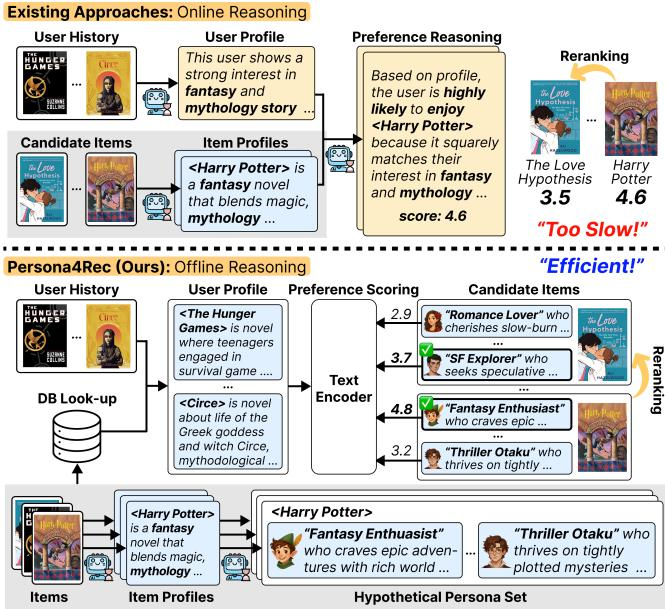
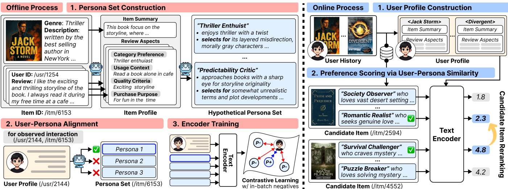
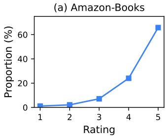
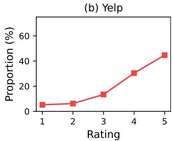
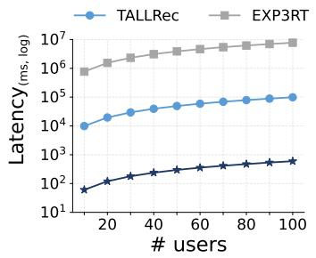
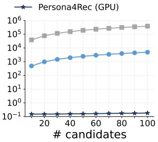
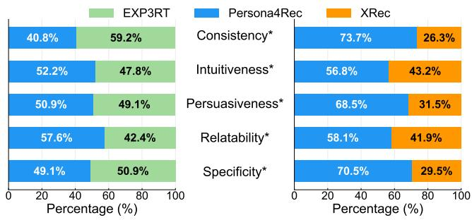
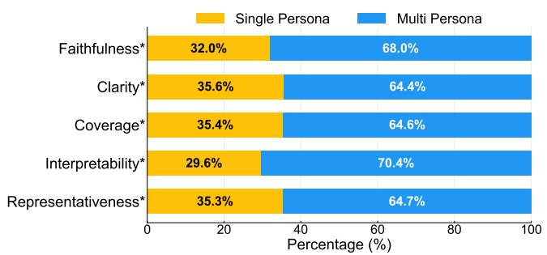

# Ofline Reasoning for Eficient Recommendation: LLM-Empowered Persona-Profiled Item Indexing

Deogyong Kim Yonsei University Seoul, South Korea legenduck@yonsei.ac.kr

Junseong Lee∗ Yonsei University Seoul, South Korea brulee@yonsei.ac.kr

Jeongeun Lee Yonsei University Seoul, South Korea ljeadec31@yonsei.ac.kr

Dongha Lee† Yonsei University Seoul, South Korea donalee@yonsei.ac.kr

Changhoe Kim NAVER Seongnam, South Korea andres.chkim@navercorp.co

Junguel Lee NAVER Seongnam, South Korea junguel.lee@navercorp.com

Jungseok Lee NAVER Seongnam, South Korea jungseok.lee@navercorp.com

## Abstract

Recent advances in large language models (LLMs) ofer new op portunities for recommender systems by capturing the nuanced semantics of user interests and item characteristics through rich semantic understanding and contextual reasoning. In particular, LLMs have been employed as rerankers that reorder candidate items based on inferred user–item relevance. However, these approaches often require expensive online inference-time reasoning, leading to high latency that hampers real-world deployment.

In this work, we introduce Persona4Rec, a recommendation framework that performs ofline reasoning to construct interpretable persona representations of items, enabling lightweight and scalable real-time inference. In the ofline stage, Persona4Rec leverages LLMs to reason over item reviews, inferring diverse user motiva tions that explain why diferent types of users may engage with an item; these inferred motivations are materialized as persona representations, providing multiple, human-interpretable views of each item. Unlike conventional approaches that rely on a single item representation, Persona4Rec learns to align user profiles with the most plausible item-side persona through a dedicated encoder, efectively transforming user–item relevance into user–persona relevance. At the online stage, this persona-profiled item index al lows fast relevance computation without invoking expensive LLM reasoning. Extensive experiments show that Persona4Rec achieves performance comparable to recent LLM-based rerankers while sub stantially reducing inference time. Moreover, qualitative analysis confirms that persona representations not only drive eficient scor ing but also provide intuitive, review-grounded explanations. These results demonstrate that Persona4Rec ofers a practical and inter pretable solution for next-generation recommender systems.1

∗Both authors contributed equally to this research. †Corresponding author 1https://github.com/legenduck/PERSONA4REC

  
Figure 1: Comparison between existing LLM-based item rerankers (Upper) and our Persona4Rec (Lower). Persona4Rec shifts LLM reasoning from online inference to ofline persona construction, enabling real-time recommendation via lightweight similarity scoring.

## Keywords

Large Language Models, Reasoning-enhanced Recommendation, User and Item Profiling, Eficient Reranking

## ACM Reference Format:

Deogyong Kim, Junseong Lee, Jeongeun Lee, Dongha Lee, Changhoe Kim, Junguel Lee, and Jungseok Lee. 2026. Ofline Reasoning for Eficient Recommendation: LLM-Empowered Persona-Profiled Item Indexing. In Proceedings of Make sure to enter the correct conference title from your rights confirmation email (Conference acronym ’XX). ACM, New York, NY, USA, 11 pages. https://doi.org/XXXXXXX.XXXXXXX

behind user preferences and item characteristics [8, 23, 50]. Recent advances in large language models (LLMs) have opened new oppor tunities for recommendation by leveraging their strong semantic understanding and contextual reasoning capabilities [11, 20, 21, 52]. These abilities allow LLMs to process complex textual inputs such as reviews and item descriptions, leading to richer user and item representations and more personalized recommendations [24, 51].

One widely adopted approach to employing LLMs in recommen dation is to construct user profiles [18, 31, 33]. These profiles are in ferred from user interaction histories, often by leveraging metadata and reviews, to capture their overall tendencies across behavioral patterns. By providing a compact yet expressive representation of user interests, user profiles enable models to enhance personaliza tion [46, 48] and serve as a foundation for various downstream recommendation tasks. For instance, they support explainable recommendation by aligning user interests with item attributes to generate concise, personalized justifications [43], improve rank ing quality by refining candidate ordering [16], and simulate user behavior in dynamic recommendation scenarios [4].

Another growing line of work has explored LLMs as rerankers to refine the candidate items retrieved by first-stage recommenders (i.e., candidate generators) such as CF models [9]. Early studies adopt prompt-only, zero/few-shot listwise reranking [1, 13, 28– 30, 37], where LLMs are prompted to directly output a permuta tion of the candidate set. Following approaches introduce domain adaptation and fine-tuning techniques [2, 26, 47] to improve con trollability and stability for recommendation tasks. More recent methods leverage LLM reasoning to infer user preferences from raw signals such as interaction histories and reviews [3, 7, 16], while others adopt reinforcement learning to further align reranking with recommendation objectives [25, 35]. Overall, this growing line of research highlights how LLMs can fundamentally advance recommendation by moving beyond traditional interaction signals toward more semantically rich and context-aware modeling.

Despite these advances, such approaches remain impractical for real-world deployment, where real-time recommendation is essen tial for user experience. Their online (inference) stage involves multiple time-consuming reasoning steps that cause substantial latency, whereas computation time is far less critical in the ofline (training) stage (Figure 1, Upper). Specifically, it includes (1) con structing user profiles from historical interactions such as ratings and reviews, (2) generating item profiles from metadata and user feedback, and (3) performing reasoning-based reranking by comparing candidate items through these profiles. Because user histories evolve dynamically, RSs must repeatedly infer user profiles from the latest interactions and then reason over them to assess item rel evance, which substantially increases inference latency and poses serious challenges for eficiency and scalability.

To address these challenges, we introduce a novel approach that achieves low-latency inference by leveraging item-side reasoning pre-computed ofline, thereby supporting both the eficient construction of user profiles and the eficient scoring of candidate items (Figure 1, Lower). This ofline reasoning step extracts fine grained, subjective preference aspects from item reviews, which can later be used to dynamically compose user profiles from their interaction histories. These extracted aspects are then re-organized into an item-side knowledge index that enables recommender systems to eficiently compute user–item relevance at inference time through lightweight semantic similarity scoring. This design not only enables scalable, real-time recommendation but also yields interpretable outputs, as each recommendation is grounded in reviewbased reasoning derived from the ofline process.

Table 1: Comparison of text-based reranking methods in terms of eficiency and reasoning paradigm. “Reasoning” denotes when the reasoning process is performed (online during inference or ofline as a pre-computation step).

<table><tr><td>Method</td><td>Latency</td><td>Scalability</td><td>Reasoning</td><td>Explain.</td></tr><tr><td>ZS-LLM [13]</td><td>High</td><td>Low</td><td>Online</td><td>✕</td></tr><tr><td>RankVicuna [29]</td><td>High</td><td>Low</td><td>Online</td><td>✕</td></tr><tr><td>TALLRec [2]</td><td>Middle</td><td>Low</td><td>Online</td><td>✕</td></tr><tr><td>EXP3RT [16]</td><td>High</td><td>Low</td><td>Online</td><td>√</td></tr><tr><td>PERSONA4Rec (ours)</td><td>Low</td><td>High</td><td>Offline</td><td>√</td></tr></table>

In this work, we propose Persona4Rec, which introduces the notion of hypothetical user personas—interpretable profiles that encode plausible rationales, extracted from item reviews, for why certain users might engage with the item. Rather than relying on a single representation per item, Persona4Rec represents items through multiple personas to reflect potential user motivations in a humanunderstandable form; each persona can also be interpreted as a latent user segment likely to prefer the corresponding item. During inference, user profiles aggregated from historical interactions are aligned with the most relevant persona via a lightweight encoder, trained on interaction-derived user-persona pairs to reflect realistic engagement patterns; this replaces direct user-item matching with user–persona alignment. In this way, recommendations are generated through eficient similarity scoring over a persona-profiled item index, where each persona serves as an independent retrieval unit linked to its source item, and the selected persona naturally provides an intuitive rationale for each ranked item.

Our extensive experiments mainly investigate the trade-of between recommendation accuracy and inference eficiency, comparing Persona4Rec against state-of-the-art LLM-based rerankers. The results show that Persona4Rec achieves comparable accuracy to state-of-the-art LLM-based rerankers while reducing inference time by up to 99.6%, demonstrating its practicality for large-scale deployment. Moreover, qualitative analysis confirms that the selected personas provide user-grounded and interpretable explanations.

The main contributions of this work are summarized as follows:

• We propose Persona4Rec, a novel framework that shifts reasoning ofline and enables eficient-yet-efective reranking through lightweight user–item relevance scoring.

• Extensive experiments demonstrate that Persona4Rec achieves real-time eficiency while maintaining performance comparable to state-of-the-art LLM-based rerankers.

• By leveraging precomputed item personas, Persona4Rec naturally provides faithful and human-readable explanations for recommendation outcomes.

  
Figure 2: Overview of our Persona4Rec framework. The ofline process (Left) constructs item personas and trains a userpersona alignment encoder. The online process (Right) reranks candidates via eficient similarity scoring

## 2 Related Work

## 2.1 LLM-based Reranking in Recommendation

Early studies demonstrated that LLMs guided by constructed prompts can act as rerankers without task-specific training, often in a listwise form that outputs a permutation over a candidate set [28– 30, 37, 38]. To alleviate long-context costs, follow-up work explored pairwise prompting via PRP [32] and setwise prompting that compares small subsets [54]. While these approaches report strong accuracy, their reliance on autoregressive decoding and long con texts often results in high latency and forces truncation or sliding window heuristics in practice [37, 38].

Recent approaches aligns LLMs with recommendation objectives through instruction tuning or reinforcement learning. TALLRec [2] aligns LLMs with recommendation tasks by instruction tuning on instruction–response pairs, enabling more accurate user–item ranking, and RLRF4Rec [35] directly optimizes a reranker from rec ommender feedback. Review-driven methods such as EXP3RT [16] extract preference evidence from reviews to improve rating pre diction and top-?? reranking. LLM4Rerank [7] further integrates multiple criteria—including accuracy, diversity, and fairness—by modeling them as interconnected nodes and applying CoT-style reasoning to automatically navigate these nodes during the rerank ing process. Despite these advances, existing reranker designs still depend on costly inference-time reasoning to extract or align pref erences, which limits their scalability in real-time recommendation.

## 2.2 User Profiling for Recommendation

Early recommender systems relied on static or schema-bound user profiles, such as demographics or genre preferences [6]. While these profiles ofered a simple way to represent users, they lacked the capacity to capture nuanced or context-dependent preferences. Subsequent feature-engineered approaches, such as UPCSim [42], attempted to measure profile similarity by correlating user and content attributes. However, hand-crafted features still struggled to reflect fine-grained signals and dynamic shifts in user interests.

To move beyond these limitations, recent studies employ LLMs to summarize, enrich, or generate user profiles directly from interaction histories and side texts. For example, RLMRec [33] integrates LLM-guided representations into collaborative filtering (CF), while KAR [45] and GPG [48] demonstrate that natural-language profile generation can enhance personalization. Other works such as PALR [46] and LettinGo [40] further explore LLM-native profile modeling conditioned on user histories. Taken together, existing work shows the strength of LLMs in modeling user preferences, but most approaches rely on online reasoning at inference time, which incurs high latency. In contrast, our work shifts both userand item-side profiling to an ofline stage, enabling eficient and scalable recommendation while retaining semantic richness.

## 3 Proposed Method

The key idea of Persona4Rec is to shift the costly reasoning process from online (inference) stage to the ofline stage by precomputing review-grounded item personas. Specifically, during ofline stage, Persona4Rec derives multiple personas for each item, where each persona captures a distinct motivation or preference pattern associated with the item. These personas are organized into a personaprofiled item index and serve as the primary units for aligning with user profiles, which summarize user historical interactions, rather than relying on direct alignment with raw item information. During online stage, user profiles are eficiently matched against pre-indexed personas, enabling real-time recommendation without invoking expensive reasoning. Moreover, the selected persona naturally provides a human-interpretable explanation for the recommendation, grounded in evidence from actual user reviews. As illustrated in Figure 2, Persona4Rec consists of two stages:

• Ofline process: Persona4Rec analyzes item information and reviews to generate multiple personas representing diverse user motivations. These personas are then paired with user profiles to produce user–persona alignment signals, which are used to train a lightweight encoder that embeds both into a shared space and constructs a persona-profiled item index for eficient scoring.

• Online process: During inference, Persona4Rec constructs user profiles on-the-fly from recent interaction histories, leveraging the precomputed persona representations. For each candidate item, its personas are scored against the user profile via eficient similarity computation, and relevance score is determined by the best-matching persona, which is used for reranking.

## 3.1 Ofline Reasoning

The ofline stage of Persona4Rec performs item-side reasoning through three coordinated steps that transform raw user reviews into structured personas, providing alignment signals for training the user–persona encoder:

(1) Persona Construction (§3.1.1): Persona4Rec integrates item metadata and user reviews to construct multiple distinct and interpretable personas for each item, enabling fine-grained align ment with diverse user preferences.

(2) User Profile–Persona Matching (§3.1.2): Persona4Rec pairs each user profile with the most relevant persona of an interacted item using an LLM-as-a-judge paradigm, producing user–persona alignment signals.

(3) Encoder Training (§3.1.3): Persona4Rec leverages the result ing matched user–persona pairs to train a lightweight encoder that assigns higher similarity scores to matched pairs than to mismatched ones.

This structured reasoning pipeline leverages an of-the-shelf LLM M to perform profile construction and reasoning over reviews,2 transforming text into structured supervision for encoder training.

3.1.1 Persona Construction. This step transforms item-side infor mation—objective metadata and subjective review signals—into multiple interpretable personas per item, each representing a dis tinct user motivation for engaging with the item. Metadata provides factual context about what the item is, while reviews reveal why users engaged with it; integrating both enables the LLM M to infer latent user motivations and generate hypothetical user profiles that capture plausible intent beyond explicit review content. 3

Item Summary Generation (Objective Information). For each item ??, we instruct the LLM M to produce a concise summary $s _ { i }$ that captures its core identity from the item metadata $m _ { i } ,$ which include fields such as title, description and category.

$$
s _ {i} = \mathcal {M} \big (m _ {i}, \mathcal {I} _ {\mathrm{sum}} \big).\tag{1}
$$

Here, $\mathcal { I } _ { \mathrm { s u m } }$ denotes an instruction prompt to summarize the infor mation of the item. The resulting summary provides a compact representation of the item and serves as an objective reference point for interpreting review-based signals. Importantly, the sum mary also enables persona generation for items with sparse or missing reviews, allowing metadata alone to support efective per sona construction in cold-start settings that commonly occur in practice.

Aspect Extraction (Subjective Information). For item ??, the LLM M extracts an aspect tuple $a _ { u , i }$ from each review by user ??:

$$
a _ {u, i} = \mathcal {M} (r _ {u, i}, \mathcal {I} _ {\mathrm{asp}})\tag{2}
$$

Table 2: Example of persona construction for item “The Shadow in the Glass”—a dark retelling of Cinderella.

<table><tr><td>Review Aspects (user AEPTNCI3X5)</td></tr><tr><td>Category Preference: Dark fantasy, gothic retellingsPurchase Purpose: Interest in morally complex reinterpretations of classic fairy talesQuality Criteria: Tension, surprising twists, and morally ambiguous charactersUsage Context: Immersive reading during leisure hours</td></tr><tr><td>Constructed Persona</td></tr><tr><td>Name: The Dark Storyline SeekerDescription: This reader is attracted to darker storylines filled with suspense and moral complexity. They enjoy unpredictable twists and flawed characters whose motives remain uncertain. Rather than seeking comfort, they appreciate stories that challenge expectations and evoke unease.Preference Rationale: This persona appreciates this item because they enjoy a darker storyline with surprises and morally questionable characters, as frequently mentioned in reviews describing the story’s tension and sense of danger.</td></tr></table>

Here, $\mathcal { I } _ { \mathrm { a s p } }$ denotes an instruction prompt that specifies a domainspecific schema with slots such as category preference, purchase purpose, quality criteria, and usage context. To ensure suficient informational coverage, tuples with more than 75% of slots being null fields are discarded. The remaining tuples constitute the item-level aspect pool ${ \mathcal { A } } _ { i } ,$ which serves as input for the subsequent persona generation process. Unlike metadata, which describes what the item is, these aspects capture how users actually experienced and valued the item—providing subjective signals essential for understanding diverse user motivations and informing persona construction.

Persona Generation. Finally, the LLM M integrates the item summary ????(objective context) and review-grounded aspect pool $\mathcal { A } _ { i }$ (subjective review signals)to generate personas:

$$
\mathcal {M}: (s _ {i}, \mathcal {A} _ {i}, \mathcal {I} _ {\mathrm{per}}) \to \Pi_ {i} = \{\pi_ {i} ^ {(1)}, \ldots , \pi_ {i} ^ {(K)} \},\tag{3}
$$

Here, $\boldsymbol { \mathcal { I } } _ { \mathrm { p e r } }$ denotes an instruction prompt for persona generation. The number of personas $K \in [ 2 , 7 ]$ varies based on the diversity of review signals: items with heterogeneous feedback yield more personas, while items with uniform reviews produce fewer. This adaptive range balances persona expressiveness against indexing and scoring overhead. Each persona $\pi _ { i } ^ { ( k ) }$ is a structured record of three fields: name simply describes the persona’s core identity, description provides a brief summary outlining its general tendencies, motivations, and overall attitude toward the item, and preference rationale explains why this persona would appreciate the item, grounded in evidence from $\mathcal { A } _ { i }$ such as review patterns or aspectlevel cues. These fields are serialized into a unified text template.

Table 2 illustrates an example of how review aspects are aggregated into a coherent persona. For the item “The Shadow in the Glass”, its review (written by user AEPTNCI3X5) and the extracted aspects are encapsulated in the persona “P3: Dark Sto- ryline Seeker”, which captures readers drawn to tension, moral ambiguity, and darker reinterpretations of classic tales.

3.1.2 User-Persona Alignment. This step pairs user profiles with the most relevant persona from each interacted item via LLM-based alignment, producing supervision signals for encoder training.

First, we build user profile $P _ { u } ,$ given a user’s interaction history $H _ { u } ,$ , that summarizes the user’s preferences across recently consumed items by combining objective and subjective signals:

$$
P _ {u} = \left\{\left(s _ {i}, a _ {u, i}\right) \mid i \in H _ {u} \right\}\tag{4}
$$

where we collect, for each item ?? in the user’s history, the item summary ???? paired with the aspect tuple $a _ { u , i }$ extracted from the user’s review $r _ { u , i }$ of that item. Since these components are precomputed during the previous persona construction step, assembling user profiles is eficient and requires no additional reasoning.

For each observed interaction $( u , i )$ we employ LLM-as-a-judge approach to select the persona from the target item persona set Π?? that best explains why the user engaged with the item. Given the user profile $P _ { u } ,$ , the target item title $t _ { i , }$ and its persona set $\Pi _ { i } ,$ the LLM M, guided by an alignment instruction $\tau _ { \mathrm { a l i g n } }$ , evaluates their semantic alignment and outputs the most relevant persona $\pi _ { ( u , i ) } ^ { + }$ along with a concise justification $j _ { ( u , i ) } ^ { + } \colon$

$$
\mathcal {M}: (P _ {u}, t _ {i}, \Pi_ {i}, \mathcal {I} _ {\mathrm{align}}) \to \left(j _ {(u, i)} ^ {+}, \pi_ {(u, i)} ^ {+}\right)\tag{5}
$$

This process links each user’s historical preferences with the most representative persona of the target item, yielding the align ment dataset $\mathcal { D } _ { \mathrm { a l i g n } } = \{ ( u , i , \pi _ { ( u , i ) } ^ { + } ) \}$ that converts implicit interac tions into explicit, interpretable supervision for encoder training.

3.1.3 Encoder Training. This step trains a lightweight encoder to embed user profiles and personas into a shared vector space, enabling eficient similarity-based scoring. Using the alignment dataset $\mathcal { D } _ { \mathrm { a l i g n } ; }$ , we train an encoder $E _ { \theta }$ via contrastive learning.

User Profile & Persona Embedding. We encode both user pro- files and personas using the same encoder $E _ { \theta }$ . For a user $u ,$ we encode the ??-th most recent interaction as:

$$
e _ {u, l} = E _ {\theta} (\mathrm{concat} (s _ {i _ {l}}, a _ {u, i _ {l}})),\tag{6}
$$

where $l \in \{ 1 , \ldots , L \}$ and $i _ { l }$ denotes the item at position ??. To obtain a user embedding, we aggregate interaction-level embeddings with a temporal decay factor to account for recency efects:

$$
e _ {u} = \frac {\sum_ {l = 1} ^ {L} \gamma^ {l - 1} \cdot e _ {u , l}}{\sum_ {l = 1} ^ {L} \gamma^ {l - 1}},\tag{7}
$$

where $\gamma \in ( 0 ,$ 1] controls the influence of older interactions. Simi larly, each persona ?? ∈ $\Pi _ { i }$ is embedded as

$$
e _ {\pi} = E _ {\theta} (\pi),\tag{8}
$$

Contrastive Learning. We optimize the encoder on the align ment dataset $\mathcal { D } _ { \mathrm { a l i g n } }$ using the InfoNCE objective [39]:

$$
\mathcal {L} = - \log \frac {\exp (\text { sim } (e _ {u} , e _ {\pi^ {+}}) / \tau)}{\sum_ {j = 1} ^ {B} \exp (\text { sim } (e _ {u} , e _ {\pi_ {j} ^ {-}}) / \tau)},\tag{9}
$$

where ?? is the batch size, ?? is the temperature, with in-batch negatives. This contrastive objective trains the encoder to approxi mate the LLM-derived alignment supervision by mapping aligned user–persona pairs closer in the embedding space than mismatched pairs. After training, all item personas are encoded once to build a persona-profiled item index, enabling eficient similarity-based scoring during inference without additional LLM reasoning.

Table 3: Statistics of the datasets.

<table><tr><td>Dataset</td><td>#Interactions</td><td>#Users</td><td>#Items</td><td>Sparsity</td></tr><tr><td>Amazon-Books</td><td>309,287</td><td>26,173</td><td>25,130</td><td>99.9530%</td></tr><tr><td>Yelp</td><td>103,774</td><td>7,968</td><td>2,942</td><td>99.5573%</td></tr></table>

  
Figure 3: Rating distribution of the two dataset

## 3.2 Online Inference

The online stage of Persona4Rec enables eficient real-time recommendation by combining precomputed persona embeddings $e _ { \pi }$ with user profiles $P _ { u }$ composed from the user’s latest interactions. Since all personas are indexed ofline, online inference avoids LLM invocation and requires only lightweight user encoding and similarity scoring against cached embeddings.

User Encoding. At the online stage, the user embedding $e _ { u }$ is computed by aggregating interaction-level embeddings through the same temporally weighted scheme as in training. Our method operates with as few as one interaction, though richer histories enable more precise persona alignment. When a new interaction occurs with an associated review, the aspect is extracted and cached asynchronously to avoid latency overhead.

Candidate Item Scoring and Reranking. For each candidate item $i \in C _ { u }$ , the relevance score is computed as the maximum similarity between the user embedding and the item’s personas:

$$
\operatorname{score} (u, i) = \max _ {\pi \in \Pi_ {i}} \operatorname{sim} (e _ {u}, e _ {\pi}).\tag{10}
$$

Items are reranked by this score, and the persona achieving the maximum similarity serves as a human-interpretable explanation by providing its description and preference rationale.

## 4 Experiments

In this section, we design and conduct experiments to answer the following research questions.

• RQ1 (Reranking Performance): How well does Persona4Rec rerank candidates produced by first-stage recommenders, and how robust is it across sparsity scenarios?

• RQ2 (Eficiency & Scalability): How do inference latency and memory footprint compare to LLM-based rerankers, and how do they scale with request volume?

• RQ3 (Recommendation Explainability): How efectively do persona-based rationales convey clear, consistent, and engaging explanations of recommendations?

Table 4: Top-?? recommendation performance of Persona4Rec and other LLM-based reranking methods on both datasets. For each user, candidate items are initially retrieved by two CF models: BPR-MF and LightGCN. ( \* : p < 0.05 )

<table><tr><td rowspan="2">Dataset</td><td rowspan="2">Generator</td><td rowspan="2">Reranker</td><td colspan="3">@5</td><td colspan="3">@10</td><td colspan="3">@20</td></tr><tr><td>HR</td><td>MRR</td><td>NDCG</td><td>HR</td><td>MRR</td><td>NDCG</td><td>HR</td><td>MRR</td><td>NDCG</td></tr><tr><td rowspan="12">Amazon-Books</td><td rowspan="6">BPR-MF</td><td>-</td><td>0.0639</td><td>0.0340</td><td>0.0414</td><td>0.1000</td><td>0.0388</td><td>0.0531</td><td></td><td>0.0419</td><td>0.0643</td></tr><tr><td>ZS-LLM</td><td>0.0664</td><td>0.0357</td><td>0.0433</td><td>0.1025</td><td>0.0405</td><td>0.0550</td><td>|</td><td>0.0434</td><td>0.0655</td></tr><tr><td>TALLRec</td><td>0.0346</td><td>0.0166</td><td>0.0210</td><td>0.0667</td><td>0.0207</td><td>0.0313</td><td rowspan="2">0.1446</td><td>0.0258</td><td>0.0505</td></tr><tr><td>EXP3RT</td><td>0.0498</td><td>0.0238</td><td>0.0302</td><td>0.0865</td><td>0.0286</td><td>0.0420</td><td>0.0326</td><td>0.0565</td></tr><tr><td>PERSONA4Rec (vanilla)</td><td>0.0668</td><td>0.0389</td><td>0.0457</td><td>0.1007</td><td>0.0433</td><td>0.0567</td><td rowspan="2">|</td><td>0.0464</td><td>0.0678</td></tr><tr><td>PERSONA4Rec (fine-tuned)</td><td> $\underline{0.0707}^{*}$ </td><td> $\underline{0.0385}$ </td><td> $\underline{0.0464}$ </td><td> $\underline{0.1081}^{*}$ </td><td> $\underline{0.0434}$ </td><td> $\underline{0.0585}^{*}$ </td><td> $\underline{0.0460}$ </td><td> $\underline{0.0679}$ </td></tr><tr><td rowspan="6">LightGCN</td><td>-</td><td>0.0671</td><td>0.0353</td><td>0.0432</td><td>0.1071</td><td>0.0406</td><td>0.0561</td><td></td><td>0.0440</td><td>0.0681</td></tr><tr><td>ZS-LLM</td><td>0.0673</td><td>0.0364</td><td>0.0440</td><td>0.1071</td><td>0.0417</td><td>0.0568</td><td>|</td><td>0.0450</td><td>0.0690</td></tr><tr><td>TALLRec</td><td>0.0365</td><td>0.0166</td><td>0.0215</td><td>0.0716</td><td>0.0211</td><td>0.0327</td><td rowspan="2">0.1555</td><td>0.0265</td><td>0.0534</td></tr><tr><td>EXP3RT</td><td>0.0455</td><td>0.0213</td><td>0.0273</td><td>0.0828</td><td>0.0262</td><td>0.0392</td><td>0.0311</td><td>0.0574</td></tr><tr><td>PERSONA4Rec (vanilla)</td><td>0.0696</td><td>0.0401</td><td>0.0474</td><td>0.1055</td><td>0.0449</td><td>0.0590</td><td rowspan="2">|</td><td> $\underline{0.0483}$ </td><td> $\underline{0.0716}$ </td></tr><tr><td>PERSONA4Rec (fine-tuned)</td><td> $\underline{0.0757}^{*}$ </td><td> $\underline{0.0410}$ </td><td> $\underline{0.0495}^{*}$ </td><td> $\underline{0.1151}^{*}$ </td><td> $\underline{0.0462}^{*}$ </td><td> $\underline{0.0622}^{*}$ </td><td> $\underline{0.0491}^{*}$ </td><td> $\underline{0.0726}^{*}$ </td></tr><tr><td rowspan="12">Yelp</td><td rowspan="6">BPR-MF</td><td>-</td><td>0.0334</td><td>0.0157</td><td>0.0200</td><td> $\underline{0.0557}$ </td><td>0.0186</td><td>0.0272</td><td></td><td>0.0213</td><td>0.0370</td></tr><tr><td>ZS-LLM</td><td>0.0285</td><td>0.0132</td><td>0.0169</td><td> $\underline{0.0499}$ </td><td>0.0160</td><td>0.0238</td><td>|</td><td>0.0191</td><td>0.0351</td></tr><tr><td>TALLRec</td><td>0.0278</td><td>0.0125</td><td>0.0162</td><td>0.0537</td><td>0.0159</td><td>0.0245</td><td rowspan="2">0.0949</td><td>0.0187</td><td>0.0349</td></tr><tr><td>EXP3RT</td><td>0.0265</td><td>0.0110</td><td>0.0148</td><td>0.0516</td><td>0.0141</td><td>0.0227</td><td>0.0171</td><td>0.0336</td></tr><tr><td>PERSONA4Rec (vanilla)</td><td>0.0349</td><td>0.0175</td><td>0.0217</td><td>0.0555</td><td>0.0201</td><td>0.0283</td><td rowspan="2">|</td><td>0.0228</td><td>0.0382</td></tr><tr><td>PERSONA4Rec (fine-tuned)</td><td> $\underline{0.0351}^{*}$ </td><td> $\underline{0.0181}^{*}$ </td><td> $\underline{0.0223}^{*}$ </td><td> $\underline{0.0599}^{*}$ </td><td> $\underline{0.0214}^{*}$ </td><td> $\underline{0.0303}^{*}$ </td><td> $\underline{0.0238}^{*}$ </td><td> $\underline{0.0391}^{*}$ </td></tr><tr><td rowspan="6">LightGCN</td><td>-</td><td>0.0388</td><td>0.0195</td><td>0.0242</td><td> $\underline{0.0682}$ </td><td>0.0233</td><td> $\underline{0.0336}$ </td><td></td><td>0.0258</td><td>0.0430</td></tr><tr><td>ZS-LLM</td><td> $\underline{0.0398}$ </td><td> $\underline{0.0201}$ </td><td> $\underline{0.0249}$ </td><td> $\underline{0.0664}$ </td><td> $\underline{0.0236}$ </td><td> $\underline{0.0334}$ </td><td>|</td><td> $\underline{0.0262}$ </td><td> $\underline{0.0432}$ </td></tr><tr><td>TALLRec</td><td>0.0325</td><td>0.0147</td><td>0.0191</td><td>0.0616</td><td> $\underline{0.0185}$ </td><td>0.0284</td><td rowspan="2">0.0106</td><td> $\underline{0.0215}$ </td><td> $\underline{0.0394}$ </td></tr><tr><td>EXP3RT</td><td>0.0292</td><td>0.0125</td><td>0.0166</td><td>0.0561</td><td>0.0160</td><td>0.0252</td><td>0.0193</td><td>0.0376</td></tr><tr><td>PERSONA4Rec (vanilla)</td><td>0.0351</td><td>0.0180</td><td>0.0222</td><td>0.0595</td><td>0.0211</td><td>0.0300</td><td rowspan="2">|</td><td>0.0242</td><td>0.0416</td></tr><tr><td>PERSONA4Rec (fine-tuned)</td><td> $\underline{0.0395}$ </td><td> $\underline{0.0199}$ </td><td> $\underline{0.0247}$ </td><td> $\underline{0.0694}$ </td><td> $\underline{0.0238}$ </td><td> $\underline{0.0343}$ </td><td> $\underline{0.0264}$ </td><td> $\underline{0.0436}$ </td></tr></table>

• RQ4 (Efect of Multi-Persona Modeling): How well does modeling multiple personas per item capture diverse and fine grained user motivations for engagement?

## 4.1 Experimental Settings

4.1.1 Datasets. To evaluate the efectiveness and robustness of Persona4Rec across domains, we experiment with two real-world datasets: Amazon-Books [12] and Yelp.4

• Amazon-Books: We use the Books category from the Amazon Reviews 2023 dataset [12]. The dataset provides user ratings on a 1-5 scale, along with textual reviews and metadata.

• Yelp: We focus on the restaurant and food categories in the Philadelphia region. Similar to Amazon-Books, it provides user ratings on a 1-5 scale, textual reviews, and metadata.

Following established practices in LLM-based recommendation [2, 15, 16, 47], we subsample approximately 100K-300K interactions to manage the computational cost of LLM-based methods, and apply both metadata and 5-core filtering to ensure data quality. The detailed statistics are summarized in Table 3 and Figure 3.

4.1.2 Baselines. For the top-?? item recommendation task, we adopt a multi-stage ranking pipeline, where an initial candidate set is generated by a first-stage retriever and subsequently refined by a second-stage reranker. Within this framework, our main baselines are LLM-based rerankers, which directly apply LLMs during inference to reorder candidates. We compare Persona4Rec against two widely adopted LLM-based rerankers, ZS-LLM [37] and TALL-Rec [2], as well as the recent state-of-the-art method EXP3RT [16]. For the first-stage candidate retrievers, we use CF models includ- ing BPR-MF [34] and LightGCN [9]. Additionally, for explainability comparison, we include two review-based rationale generators: XRec [27] and EXP3RT [16].

4.1.3 Evaluation Protocol. For our main evaluation, we focus on the top-?? reranking task and report HR@??, MRR@??, and NDCG@??. for ?? = {5, 10, 20} as the evaluation metric, following the established practices in previous work [16, 47]. We adopt leave-one-out (LOO) splitting for train/validation/test [36, 47, 53].

4.1.4 Implementation Details. Following the existing convention of constructing user profile [2], we set history length ?? = 10, and gamma is set through validation. For encoder training, we fine-tune the BGE-M3 [5] model using LoRA [14] with rank ?? = 16, alpha ?? = 32, and dropout 0.05. We use a global batch size of 72 and learning rate of $\bar { 1 } \times 1 0 ^ { - 5 }$ across all experiments.

## 4.2 RQ1: Reranking Performance

We first examine whether Persona4Rec can efectively enhance top-?? recommendation accuracy when used to rerank candidates produced by CF models, to verify that shifting reasoning ofline does not compromise ranking quality.

4.2.1 Overall Performance. Table 4 shows Persona4Rec consistently outperforms CF generators and LLM-based rerankers across datasets. Notably, LLM-based rerankers struggle under real-world data conditions, with some falling behind CF generators due to dataset-specific limitations. In Amazon-Books, extreme rating skew toward 5-stars (Figure 3) undermines EXP3RT; when most items share similar ratings, rating-based reasoning loses discriminative power. On the other hand, ZS-LLM’s generic prompting and TALL Rec’s instruction-tuned approach fail to capture nuanced collaborative patterns. In Yelp, rating skew is less extreme than Amazon-Books but still exhibits significant imbalance (Figure 3). When this unbalanced distribution is combined with sparse metadata (e.g., “WiFi available,” “child-friendly”), it provides insuficient diferentiation for reasoning-based methods.

Table 5: Reranking performance across cold-start and warm-start scenarios on Amazon-Books dataset, with relative improvements (%) over CF baseline, denoted by “-”. (∗: p-value < 0.05)

<table><tr><td rowspan="2">Generator</td><td rowspan="2">Reranker</td><td colspan="2">Warm Users@10</td><td colspan="2">Cold Users@10</td><td colspan="2">Head Items@10</td><td colspan="2">Tail Items@10</td></tr><tr><td>HR</td><td>NDCG</td><td>HR</td><td>NDCG</td><td>HR</td><td>NDCG</td><td>HR</td><td>NDCG</td></tr><tr><td rowspan="6">BPR-MF</td><td>-</td><td>0.0469</td><td>0.0236</td><td>0.1380</td><td>0.0757</td><td>0.1662</td><td>0.0868</td><td>0.0310</td><td>0.0185</td></tr><tr><td>ZS-LLM</td><td>0.0490</td><td>0.0251</td><td>0.1409</td><td>0.0778</td><td>0.1696</td><td>0.0897</td><td>0.0323</td><td>0.0191</td></tr><tr><td>TALLRec</td><td>0.0451</td><td>0.0216</td><td>0.0749</td><td>0.0333</td><td>0.1120</td><td>0.0530</td><td>0.0160</td><td>0.0076</td></tr><tr><td>EXP3RT</td><td>0.0486</td><td>0.0236</td><td>0.1109</td><td>0.0528</td><td>0.1457</td><td>0.0683</td><td>0.0268</td><td>0.0160</td></tr><tr><td>PERSONA4Rec (ours)</td><td>0.0599*</td><td>0.0320*</td><td>0.1432</td><td>0.0789</td><td>0.1707</td><td>0.0904</td><td>0.0360*</td><td>0.0196</td></tr><tr><td>improv. over BPR-MF</td><td>+27.7%</td><td>+35.6%</td><td>+3.8%</td><td>+4.2%</td><td>+2.7%</td><td>+4.1%</td><td>+16.1%</td><td>+5.9%</td></tr><tr><td rowspan="6">LightGCN</td><td>-</td><td>0.0552</td><td>0.0267</td><td>0.1479</td><td>0.0782</td><td>0.1671</td><td>0.0858</td><td>0.0383</td><td>0.0225</td></tr><tr><td>ZS-LLM</td><td>0.0536</td><td>0.0273</td><td>0.1474</td><td>0.0803</td><td>0.1658</td><td>0.0858</td><td>0.0385</td><td>0.0235</td></tr><tr><td>TALLRec</td><td>0.0462</td><td>0.0213</td><td>0.0841</td><td>0.0363</td><td>0.1124</td><td>0.0519</td><td>0.0235</td><td>0.0106</td></tr><tr><td>EXP3RT</td><td>0.0445</td><td>0.0211</td><td>0.1049</td><td>0.0495</td><td>0.1295</td><td>0.0591</td><td>0.0330</td><td>0.0170</td></tr><tr><td>PERSONA4Rec (ours)</td><td>0.0621*</td><td>0.0328*</td><td>0.1545*</td><td>0.0850*</td><td>0.1697*</td><td>0.0905*</td><td>0.0455*</td><td>0.0233</td></tr><tr><td>improv. over LightGCN</td><td>+12.5%</td><td>+22.8%</td><td>+4.5%</td><td>+8.7%</td><td>+1.6%</td><td>+5.5%</td><td>+18.8%</td><td>+3.6%</td></tr></table>

Table 6: Simulating items without reviews on Amazon-Books. Results at @10 with relative improvement over CF baseline.

<table><tr><td>Generator</td><td>Reranker</td><td>HR</td><td>NDCG</td></tr><tr><td rowspan="3">BPR-MF</td><td>-</td><td>0.1000</td><td>0.0531</td></tr><tr><td>Summary Only</td><td> $\underline{0.1043 (+4.3\%)}$ </td><td> $\underline{0.0560 (+5.5\%)}$ </td></tr><tr><td>Full (Ours)</td><td> $\underline{0.1081 (+8.1\%)}$ </td><td> $\underline{0.0585 (+10.2\%)}$ </td></tr><tr><td rowspan="3">LightGCN</td><td>-</td><td>0.1071</td><td>0.0561</td></tr><tr><td>Summary Only</td><td> $\underline{0.1112 (+3.8\%)}$ </td><td> $\underline{0.0591 (+5.3\%)}$ </td></tr><tr><td>Full (Ours)</td><td> $\underline{0.1151 (+7.5\%)}$ </td><td> $\underline{0.0622 (+10.9\%)}$ </td></tr></table>

Persona4Rec overcomes these limitations by extracting personas primarily from review contents rather than focus on metadata or ratings. While LLM rerankers are afected by noisy raw metadata for reasoning, we refine this noisy metadata into structured summaries. This refinement process provides more objective and dense information for constructing personas, even when metadata is sparse. Besides, even though ratings are skewed, personas can capture diverse aspects from review semantics. This allows our model to avoid the loss of discriminative power that hinders rating based reasoning approaches. Beyond this textual refinement, our framework learns to align user interaction histories with these per sonas through contrastive learning, enabling the model to capture implicit behavioral preferences. This alignment process allows the encoder to recognize subtle preference patterns embedded in users’ actual engagement histories. This synergy between semantic understanding and behavioral alignment ensures robust and reliable performance even under challenging data conditions. Even without fine-tuning, the vanilla variant with pre-trained BGE-M3 outperforms LLM baselines, validating the efectiveness of our personabased textual refinement. Fine-tuning adds further gains by learning from interaction patterns through user-persona alignment training.

4.2.2 Cold-/Warm-start Scenario Analysis. We partition test interactions by review count into user/item segments to test robustness under sparsity (warm/head: top 20%, cold/tail: bottom 20%). As shown in Table 5, Persona4Rec exhibits gains across all regimes. Tail items deliver the suitable gains. These items remain sparsely connected within the dataset, causing CF generators to produce unreliable rankings from weak collaborative patterns. In contrast, Persona4Rec infers structured personas from the available reviews—even when reviews are few, they provide richer semantic signals than interaction counts alone. This review-grounded evidence enables robust reranking where CF struggles most.

Warm users show strong relative improvements. Despite start- ing from low baseline performance, warm users achieve substantial relative gains. This suggests that persona-based matching provides significant value when users have extensive histories, as richer context enables alignment with more specialized personas that capture preference nuances invisible to collaborative filtering.

Head items show modest gains. Two factors may contribute to this ceiling. First, abundant interactions enable CF to learn robust patterns, reducing the marginal value of semantic augmentation. Second, popular items often exhibit broader preference diversity than what our current persona generation framework can capture. Although Persona4Rec limits each item to a maximum of seven personas for computational eficiency, highly reviewed items might benefit from a more fine-grained representation.

Cold users show moderate improvements. Cold users exhibit smaller relative improvements as sparse histories limit coherent preference profiling—especially when consuming popular items with generic taste signals. In contrast, warm users’ extensive histories reveal consistent patterns (e.g., recurring themes, quality criteria) enabling precise alignment with specialized personas. This confirms that persona semantics provide value across sparsity levels, but optimal matching requires suficient interaction data.

Table 7: Comparison of inference eficiency between LLM based rerankers and Persona4Rec. Latency for ZS-LLM is measured as end-to-end API latency.

<table><tr><td>Method</td><td>Inference Latency (ms)</td><td>Memory Footprint (GB)</td></tr><tr><td>ZS-LLM</td><td> $5,537 \pm 3,094.13$ </td><td>-</td></tr><tr><td>TALLRec</td><td> $979.17 \pm 13.29$ </td><td>12.57</td></tr><tr><td>EXP3RT</td><td> $77,974.08 \pm 1,229.99$ </td><td>14.96</td></tr><tr><td rowspan="2">PERSONA4Rec</td><td> $0.52 \pm 0.01$  (CPU)</td><td>-</td></tr><tr><td> $0.75 \pm 0.02$  (GPU)</td><td>0.1</td></tr></table>

  
Figure 4: Comparison of inference scalability with respect to the number of user samples and candidate items.

4.2.3 Robustness to Missing Reviews. A common limitation of reviewbased methods is their inability to handle items lacking reviews, which frequently occurs for newly listed items in real-world plat forms. To evaluate robustness when items have metadata but no reviews yet, we simulate this by using the same trained encoder but indexing items with their summary $e _ { i } = E _ { \theta } { \bigl ( } s _ { i } { \bigr ) }$ instead of personas (Summary Only). As shown in Table 6, this variant still outper forms the CF baseline across all settings, demonstrating that our framework can efectively serve cold-start items before reviews accumulate, as the encoder has already learned summary seman tics through user profiles during training. When reviews become available, the Full model yields additional gains, confirming the complementary value of review-grounded persona reasoning.

Overall, Persona4Rec demonstrates robust improvements across all data —including complete cold-start scenarios where no reviews are available—confirming our method efectively complements CFbased candidate generation under diverse conditions.

## 4.3 RQ2: Eficiency & Scalability

We evaluate inference eficiency on a single A6000 GPU, measuring latency and memory usage against LLM-based baselines.

4.3.1 Single-Query Performance. In Table 7, Persona4Rec achieves 0.75ms latency (GPU) or 0.52ms (CPU), representing 1,300× speedup over TALLRec and 104,000× over EXP3RT. Memory footprint is similarly reduced: 0.1GB versus 12–15GB for baselines. This eficiency stems from replacing LLM inference with dot-product operations over pre-computed persona embeddings.

4.3.2 Scalability Evaluation. Beyond single-query speed, we assess how Persona4Rec scales under realistic deployment conditions—a critical requirement for production recommender systems serving millions of users. Figure 4 evaluates two dimensions: batch size (concurrent user requests) and item candidate set size.

Table 8: Human evaluation criteria for recommendation explanation quality (RQ3).

<table><tr><td>Evaluation Criteria for Recommendation Explanation</td></tr><tr><td>Intuitiveness: How immediately comprehensible is the explanation? Does it clearly convey why the recommendation makes sense without requiring extensive interpretation?</td></tr><tr><td>Relatability: How well does the explanation connect to the user&#x27;s actual experiences and lifestyle context? Does it resonate with real-world usage scenarios?</td></tr><tr><td>Consistency: How well does the explanation align with the user&#x27;s demonstrated preferences and interaction history? Does it accurately reflect their past behavior patterns?</td></tr><tr><td>Persuasiveness: How convincing is the explanation in demonstrating that the item would appeal to the user? Does it effectively communicate the item&#x27;s value for this specific user?</td></tr><tr><td>Specificity: How personalized and detailed is the explanation for this particular user-item pair? Does it provide concrete, individualized rationale rather than generic statements?</td></tr></table>

User scaling. In Figure 4 Left, as the number of concurrent users increases from 1 to 100, LLM-based methods exhibit superlinear growth due to sequential processing constraints. TALLRec’s latency grows from 104ms to 105ms (∼100 seconds), while EXP3RT deteriorates from 106ms to over 107ms (exceeding 2 hours). In contrast, Persona4Rec’s latency increased from 102ms to only 103ms.

Candidate scaling. In Figure 4 Right, when the candidate set size grows from 20 to 100 items, Persona4Rec maintains near-constant latency (flat at ∼1ms) via eficient vector operations. TALLRec scales moderately due to per-item reasoning costs, while EXP3RT remains prohibitively slow regardless of candidate count. This insensitivity to candidate size enables reranking without latency penalties.

Overall, these results confirm that Persona4Rec not only achieves superior eficiency but also exhibits fundamentally diferent scaling characteristics. The architectural advantage of ofline persona construction is amplified under high load, making real-time recommendation at scale practical with lower computational cost.

## 4.4 RQ3: Recommendation Explainability

We evaluate whether persona-based rationales efectively explain recommendations through pairwise comparisons against EXP3RT (online reasoning) and XRec (single-review summary). We evaluate five user-facing criteria that capture the explanatory efectiveness: Intuitiveness, Persuasiveness, Relatability, Consistency, and Specificity. These collectively measure the explainability of recommendation rationales from the target user’s perspective. (Refer to Table 8 for more details.) Following prior work [16, 17], we sample 100 examples per dataset. To ensure objectivity, we employed impartial annotators via Amazon Mechanical Turk (AMT), assigning three independent annotators per example.

In Figure 5, Persona4Rec achieves near-parity with EXP3RT while dominating XRec. Against EXP3RT, we trade specificity for eficiency structure. EXP3RT’s real-time reasoning enables highly personalized rationales tailored to individual contexts, whereas our pre-constructed personas represent aggregated patterns. However, we match EXP3RT in intuitiveness and persuasiveness through structured formatting consistent persona templates, which enhance comprehensibility and review-grounded evidence that provides tangible social proof. Critically, this balanced trade-of delivers in ference speedup, making real-time deployment practical. Compared to XRec, our approach dominates across all dimensions, including specificity. Persona4Rec extracts 2–7 review-grounded personas per item, each capturing a distinct user motivation, while XRec represents each item with a single item profile that aggregates all review signals, limiting its ability to distinguish between dif ferent user motivations. Overall, Persona4Rec delivers efective explainability through ofline pre-defined personas.

  
Figure 5: Human evaluation of Recommendation Explain ability across compared methods. (∗: p-value < 0.05)

Table 9: Human evaluation criteria for persona quality comparison between single-persona and multi-persona ap proaches (RQ4).

<table><tr><td>Evaluation Criteria for Persona Quality</td></tr><tr><td>Faithfulness: Are the personas genuinely grounded in actual user reviews of this item? Do they reflect real opinions rather than fabricated or generic descriptions?</td></tr><tr><td>Clarity: Are the personas tailored to this specific item&#x27;s characteristics? Do they capture unique aspects rather than broad, generic user types?</td></tr><tr><td>Coverage: Do the personas collectively cover diverse and meaningful reasons why different users might engage with this item? Are both major and minor preference dimensions represented?</td></tr><tr><td>Interpretability: Are the personas logically coherent and easy to understand? Does each persona present a clear, well-defined user archetype?</td></tr><tr><td>Representativeness: Are the personas sufficiently distinct from each other? Do they effectively represent different user segments rather than redundant variations?</td></tr></table>

## 4.5 RQ4: Efect of Multi-Persona Modeling

We now examine how the number of personas per item (??) influ ences both the quality of the constructed personas and their impact on recommendation performance. Specifically, we analyze whether increasing ?? enhances the faithfulness and clarity of personas and leads to greater improvements in recommendation accuracy.

4.5.1 Efect of the Number of Personas on Quality. We compare Single-Persona (one aggregated persona) with Multi-Persona (our de fault, $K \in [ 2 , 7 ] )$ using human evaluation on five criteria. We adopt these five criteria that cover the key aspects of persona quality in the construction stage: Faithfulness, Clarity, Coverage, Interpretability, and Representativeness. (Refer to Table 9 for more details.)

  
Figure 6: Human evaluation on the persona construction quality in single- and multi-persona. (∗: p-value < 0.05)

Table 10: Impact of the number of generated personas per item with BPR-MF in Amazon-Books.

<table><tr><td rowspan="2"># Personas</td><td colspan="2">@5</td><td colspan="2">@10</td><td colspan="2">@20</td></tr><tr><td>HR</td><td>NDCG</td><td>HR</td><td>NDCG</td><td>HR</td><td>NDCG</td></tr><tr><td>1</td><td>0.0488</td><td>0.0301</td><td>0.0824</td><td>0.0408</td><td rowspan="2">|</td><td>0.0507</td></tr><tr><td>3</td><td>0.0519</td><td>0.0322</td><td>0.0835</td><td>0.0423</td><td>0.0520</td></tr><tr><td>5</td><td>0.0532</td><td>0.0335</td><td>0.0843</td><td>0.0435</td><td rowspan="2">0.1212</td><td>0.0529</td></tr><tr><td>7</td><td>0.0541</td><td>0.0338</td><td>0.0848</td><td>0.0437</td><td>0.0530</td></tr></table>

As shown in Figure 6, Multi-persona generation achieved substantially higher scores across all five evaluation criteria, with improvements of over 30 percentage points in faithfulness and interpretability. These results confirm that aggregating all signals into a single persona leads to oversimplification and loss of nuance, whereas modeling items with multiple distinct personas provides more consistent and specific rationales that better reflect heterogeneous user motivations.

4.5.2 Efect of the Number of Personas on Performance. Moreover, to evaluate how the number of personas per item influences recommendation performance, we design an ablation study on the Amazon-Books dataset using BPR-MF as the candidate generator. For each item, we vary the number of generated personas (1, 3, 5, and 7) and use them for reranking evaluation, reporting HR and NDCG at cutof levels. This experiment is conducted on the 13,302 users whose candidate item persona pool contains exactly seven personas. By restricting evaluation to this setting, we can directly compare the impact of the number of personas (1–7) while keeping the candidate pool consistent. As shown in Table 10, increasing the number of personas consistently improves ranking performance, with the best results observed at 7 personas. Even a moderate number of personas (e.g., 5 personas) yields steady gains, demonstrating that representing items with multiple distinct personas is more effective than compressing all review signals into a single aggregated profile. Overall, these findings suggest that multi-persona gener- ation provides a finer-grained profiling of user motivations, capturing both majority and minority perspectives. This richer representation not only improves ranking metrics but also enhances the explainability of recommendations by reflecting diverse user preferences across heterogeneous groups.

## 5 Conclusion

This work introduced Persona4Rec, a novel recommendation framework that shifts online LLM reasoning to the ofline by constructing diverse review-grounded item personas. By reframing recommen dation as a user-persona alignment task trained on LLM-derived supervision, it enables real-time inference with lightweight encoder scoring while naturally providing interpretable explanations. Exten sive experiments show that Persona4Rec consistently outperforms state-of-the-art LLM-based rerankers, achieving robust gains for cold users and tail items while reducing inference latency by orders of magnitude. Overall, Persona4Rec ofers a practical and scal able solution bridging eficiency, accuracy, and interpretability, and paves the way for extending persona-based alignment to richer user feedback and hybrid reasoning framework that combines ofline knowledge construction with adaptive online refinement.

## References

[1] Mofetoluwa Adeyemi, Akintunde Oladipo, Ronak Pradeep, and Jimmy Lin. 2024. Zero-Shot Cross-Lingual Reranking with Large Language Models for Low Resource Languages. In Proceedings of the 62nd Annual Meeting of the Association for Computational Linguistics (Volume 2: Short Papers). 650–656.

[2] Keqin Bao, Jizhi Zhang, Yang Zhang, Wenjie Wang, Fuli Feng, and Xiangnan He. 2023. Tallrec: An efective and eficient tuning framework to align large language model with recommendation. In Proceedings of the 17th ACM conference on recommender systems. 1007–1014.

[3] Maciej Besta, Nils Blach, Ales Kubicek, Robert Gerstenberger, Michal Podstawski, Lukas Gianinazzi, Joanna Gajda, Tomasz Lehmann, Hubert Niewiadomski, Piotr Nyczyk, et al. 2024. Graph of thoughts: Solving elaborate problems with large language models. In Proceedings of the AAAI conference on artificial intelligence, Vol. 38. 17682–17690.

[4] Hongru Cai, Yongqi Li, Wenjie Wang, Fengbin Zhu, Xiaoyu Shen, Wenjie Li, and Tat-Seng Chua. 2025. Large language models empowered personalized web agents. In Proceedings of the ACM on Web Conference 2025. 198–215.

[5] Jianlv Chen, Shitao Xiao, Peitian Zhang, Kun Luo, Defu Lian, and Zheng Liu. 2024. BGE M3-Embedding: Multi-Lingual, Multi-Functionality, Multi-Granularity Text Embeddings Through Self-Knowledge Distillation. arXiv:2402.03216 [cs.CL] https://arxiv.org/abs/2402.03216

[6] Ting Chen, Wei-Li Han, Hai-Dong Wang, Yi-Xun Zhou, Bin Xu, and Bin-Yu Zang. 2007. Content recommendation system based on private dynamic user profile. In 2007 International conference on machine learning and cybernetics, Vol. 4. IEEE, 2112–2118.

[7] Jingtong Gao, Bo Chen, Xiangyu Zhao, Weiwen Liu, Xiangyang Li, Yichao Wang, Wanyu Wang, Huifeng Guo, and Ruiming Tang. 2025. Llm4rerank: Llm-based auto-reranking framework for recommendations. In Proceedings of the ACM on Web Conference 2025. 228–239.

[8] Shijie Geng, Shuchang Liu, Zuohui Fu, Yingqiang Ge, and Yongfeng Zhang. 2022. Recommendation as language processing (rlp): A unified pretrain, personalized prompt & predict paradigm (p5). In Proceedings of the 16th ACM conference on recommender systems. 299–315.

[9] Xiangnan He, Kuan Deng, Xiang Wang, Yan Li, Yongdong Zhang, and Meng Wang. 2020. Lightgcn: Simplifying and powering graph convolution network for recommendation. In Proceedings of the 43rd International ACM SIGIR conference on research and development in Information Retrieval. 639–648.

[10] Xiangnan He, Lizi Liao, Hanwang Zhang, Liqiang Nie, Xia Hu, and Tat-Seng Chua. 2017. Neural collaborative filtering. In Proceedings of the 26th international conference on world wide web. 173–182.

[11] Ryang Heo, Yongsik Seo, Junseong Lee, and Dongha Lee. 2025. Can Large Language Models be Efective Online Opinion Miners? arXiv preprint arXiv:2505.15695 (2025).

[12] Yupeng Hou, Jiacheng Li, Zhankui He, An Yan, Xiusi Chen, and Julian McAuley. 2024. Bridging language and items for retrieval and recommendation. arXiv preprint arXiv:2403.03952 (2024).

[13] Yupeng Hou, Junjie Zhang, Zihan Lin, Hongyu Lu, Ruobing Xie, Julian McAuley, and Wayne Xin Zhao. 2024. Large language models are zero-shot rankers for recommender systems. In European Conference on Information Retrieval. Springer, 364–381.

[14] Edward J Hu, Yelong Shen, Phillip Wallis, Zeyuan Allen-Zhu, Yuanzhi Li, Shean Wang, Lu Wang, Weizhu Chen, et al. 2022. Lora: Low-rank adaptation of large language models. ICLR 1, 2 (2022), 3.

[15] Mathias Jackermeier, Jiaoyan Chen, and Ian Horrocks. 2024. Dual box embeddings for the description logic EL++. In Proceedings of the ACM Web Conference 2024.

2250–2258.

[16] Jieyong Kim, Hyunseo Kim, Hyunjin Cho, SeongKu Kang, Buru Chang, Jinyoung Yeo, and Dongha Lee. 2025. driven Personalized Preference Reasoning with Large Language Models for Recommendation. In Proceedings of the 48th International ACM SIGIR Conference on Research and Development in Information Retrieval. 1697–1706.

[17] Minjin Kim, Minju Kim, Hana Kim, Beong-woo Kwak, Soyeon Chun, Hyunseo Kim, SeongKu Kang, Youngjae Yu, Jinyoung Yeo, and Dongha Lee. 2024. Pearl: A review-driven persona-knowledge grounded conversational recommendation dataset. arXiv preprint arXiv:2403.04460 (2024).

[18] Kirill Kronhardt, Sebastian Hofmann, Fabian Adelt, and Jens Gerken. 2024. Personær-transparency enhancing tool for llm-generated user personas from live website visits. In Proceedings of the International Conference on Mobile and Ubiquitous Multimedia. 527–531.

[19] Jeongeun Lee, Seongku Kang, Won-Yong Shin, Jeongwhan Choi, Noseong Park, and Dongha Lee. 2024. Graph Signal Processing for Cross-Domain Recommendation. arXiv preprint arXiv:2407.12374 (2024)

[20] Jeongeun Lee, Youngjae Yu, and Dongha Lee. 2025. HIPPO-Video: Simulating Watch Histories with Large Language Models for Personalized Video Highlight ing. arXiv preprint arXiv:2507.16873 (2025).

[21] Sangam Lee, Ryang Heo, SeongKu Kang, and Dongha Lee. 2025. Imagine All The Relevance: Scenario-Profiled Indexing with Knowledge Expansion for Dense Retrieval. arXiv preprint arXiv:2503.23033 (2025).

[22] Caiwen Li, Iskandar Ishak, Hamidah Ibrahim, Maslina Zolkepli, Fatimah Sidi, and Caili Li. 2023. Deep learning-based recommendation system: Systematic review and classification. IEEE Access 11 (2023), 113790–113835

[23] Jiacheng Li, Ming Wang, Jin Li, Jinmiao Fu, Xin Shen, Jingbo Shang, and Julian McAuley. 2023. Text is all you need: Learning language representations for sequential recommendation. In Proceedings of the 29th ACM SIGKDD Conference on Knowledge Discovery and Data Mining. 1258–1267.

[24] Qidong Liu, Xiangyu Zhao, Yuhao Wang, Yejing Wang, Zijian Zhang, Yuqi Sun, Xiang Li, Maolin Wang, Pengyue Jia, Chong Chen, et al. 2025. Large Language Model Enhanced Recommender Systems: Methods, Applications and Trends. In Proceedings of the 31st ACM SIGKDD Conference on Knowledge Discovery and Data Mining V. 2. 6096–6106.

[25] Wensheng Lu, Jianxun Lian, Wei Zhang, Guanghua Li, Mingyang Zhou, Hao Liao, and Xing Xie. 2024. Aligning large language models for controllable recommendations. arXiv preprint arXiv:2403.05063 (2024).

[26] Sichun Luo, Bowei He, Haohan Zhao, Wei Shao, Yanlin Qi, Yinya Huang, Aojun Zhou, Yuxuan Yao, Zongpeng Li, Yuanzhang Xiao, et al. 2025. Recranker: Instruction tuning large language model as ranker for top-k recommendation. ACM Transactions on Information Systems 43, 5 (2025), 1–31.

[27] Qiyao Ma, Xubin Ren, and Chao Huang. 2024. Xrec: Large language models for explainable recommendation. arXiv preprint arXiv:2406.02377 (2024).

[28] Xueguang Ma, Xinyu Zhang, Ronak Pradeep, and Jimmy Lin. 2023. Zeroshot listwise document reranking with a large language model. arXiv preprint arXiv:2305.02156 (2023).

[29] Ronak Pradeep, Sahel Sharifymoghaddam, and Jimmy Lin. 2023. Rankvicuna: Zero-shot listwise document reranking with open-source large language models. arXiv preprint arXiv:2309.15088 (2023).

[30] Ronak Pradeep, Sahel Sharifymoghaddam, and Jimmy Lin. 2023. RankZephyr: Efective and Robust Zero-Shot Listwise Reranking is a Breeze! arXiv preprint arXiv:2312.02724 (2023).

[31] Erasmo Purificato, Ludovico Boratto, and Ernesto William De Luca. 2024. User modeling and user profiling: A comprehensive survey. arXiv preprint arXiv:2402.09660 (2024).

[32] Zhen Qin, Rolf Jagerman, Kai Hui, Honglei Zhuang, Junru Wu, Le Yan, Jiaming Shen, Tianqi Liu, Jialu Liu, Donald Metzler, et al. 2023. Large language models are efective text rankers with pairwise ranking prompting. arXiv preprint arXiv:2306.17563 (2023).

[33] Xubin Ren, Wei Wei, Lianghao Xia, Lixin Su, Suqi Cheng, Junfeng Wang, Dawei Yin, and Chao Huang. 2024. Representation learning with large language models for recommendation. In Proceedings of the ACM web conference 2024. 3464–3475.

[34] Stefen Rendle, Christoph Freudenthaler, Zeno Gantner, and Lars Schmidt-Thieme. 2012. BPR: Bayesian personalized ranking from implicit feedback. arXiv preprint arXiv:1205.2618 (2012).

[35] Chao Sun, Yaobo Liang, Yaming Yang, Shilin Xu, Tianmeng Yang, and Yunhai Tong. 2024. Rlrf4rec: Reinforcement learning from recsys feedback for enhanced recommendation reranking. arXiv e-prints (2024), arXiv–2410.

[36] Fei Sun, Jun Liu, Jian Wu, Changhua Pei, Xiao Lin, Wenwu Ou, and Peng Jiang. 2019. BERT4Rec: Sequential recommendation with bidirectional encoder representations from transformer. In Proceedings of the 28th ACM international conference on information and knowledge management. 1441–1450.

[37] Weiwei Sun, Lingyong Yan, Xinyu Ma, Shuaiqiang Wang, Pengjie Ren, Zhumin Chen, Dawei Yin, and Zhaochun Ren. 2023. Is ChatGPT good at search? investigating large language models as re-ranking agents. arXiv preprint arXiv:2304.09542 (2023).

[38] Manveer Singh Tamber, Ronak Pradeep, and Jimmy Lin. 2023. Scaling down, litting up: Eficient zero-shot listwise reranking with seq2seq encoder-decoder models. arXiv preprint arXiv:2312.16098 (2023).

[39] Aaron van den Oord, Yazhe Li, and Oriol Vinyals. 2018. Representation Learning with Contrastive Predictive Coding. arXiv:1807.03748

[40] Lu Wang, Di Zhang, Fangkai Yang, Pu Zhao, Jianfeng Liu, Yuefeng Zhan, Hao Sun, Qingwei Lin, Weiwei Deng, Dongmei Zhang, et al. 2025. LettinGo: Explore User Profile Generation for Recommendation System. In Proceedings of the 31st ACM SIGKDD Conference on Knowledge Discovery and Data Mining V. 2. 2985–2995.

[41] Xiang Wang, Xiangnan He, Meng Wang, Fuli Feng, and Tat-Seng Chua. 2019. Neural graph collaborative filtering. In Proceedings of the 42nd international ACM SIGIR conference on Research and development in Information Retrieval. 165–174.

[42] Triyanna Widiyaningtyas, Indriana Hidayah, and Teguh B Adji. 2021. User pro file correlation-based similarity (UPCSim) algorithm in movie recommendation system. Journal of Big Data 8, 1 (2021), 52.

[43] Stanisław Woźniak, Jacek Duszenko, Jan Kocoń, and Przemysaw Kazienko. 2025. Improving LLM-based recommender systems with user-controllable profiles. In Companion Proceedings of the ACM on Web Conference 2025. 2102–2111.

[44] Jiancan Wu, Xiang Wang, Fuli Feng, Xiangnan He, Liang Chen, Jianxun Lian, and Xing Xie. 2021. Self-supervised graph learning for recommendation. In Proceedings of the 44th international ACM SIGIR conference on research and development in information retrieval. 726–735.

[45] Yunjia Xi, Weiwen Liu, Jianghao Lin, Xiaoling Cai, Hong Zhu, Jieming Zhu, Bo Chen, Ruiming Tang, Weinan Zhang, and Yong Yu. 2024. Towards open-world recommendation with knowledge augmentation from large language models. In Proceedings of the 18th ACM Conference on Recommender Systems. 12–22.

[46] Fan Yang, Zheng Chen, Ziyan Jiang, Eunah Cho, Xiaojiang Huang, and Yanbin Lu. 2023. Palr: Personalization aware llms for recommendation. arXiv preprint arXiv:2305.07622 (2023).

[47] Zhenrui Yue, Sara Rabhi, Gabriel de Souza Pereira Moreira, Dong Wang, and Even Oldridge. 2023. Llamarec: Two-stage recommendation using large language models for ranking. arXiv preprint arXiv:2311.02089 (2023).

[48] Jiarui Zhang. 2024. Guided profile generation improves personalization with llms. arXiv preprint arXiv:2409.13093 (2024).

[49] Shuai Zhang, Lina Yao, Aixin Sun, and Yi Tay. 2019. Deep learning based recommender system: A survey and new perspectives. ACM computing surveys (CSUR) 52, 1 (2019), 1–38.

[50] Yang Zhang, Fuli Feng, Jizhi Zhang, Keqin Bao, Qifan Wang, and Xiangnan He. 2025. Collm: Integrating collaborative embeddings into large language models for recommendation. IEEE Transactions on Knowledge and Data Engineering (2025).

[51] Zijian Zhang, Shuchang Liu, Ziru Liu, Rui Zhong, Qingpeng Cai, Xiangyu Zhao, Chunxu Zhang, Qidong Liu, and Peng Jiang. 2025. Llm-powered user simulator for recommender system. In Proceedings of the AAAI Conference on Artificial Intelligence, Vol. 39. 13339–13347.

[52] Zihuai Zhao, Wenqi Fan, Jiatong Li, Yunqing Liu, Xiaowei Mei, Yiqi Wang, Zhen Wen, Fei Wang, Xiangyu Zhao, Jiliang Tang, et al. 2024. Recommender systems in the era of large language models (llms). IEEE Transactions on Knowledge and Data Engineering 36, 11 (2024), 6889–6907

[53] Kun Zhou, Hui Wang, Wayne Xin Zhao, Yutao Zhu, Sirui Wang, Fuzheng Zhang, Zhongyuan Wang, and Ji-Rong Wen. 2020. S3-rec: Self-supervised learning for sequential recommendation with mutual information maximization. In Proceedings of the 29th ACM international conference on information & knowledge management. 1893–1902.

[54] Shengyao Zhuang, Honglei Zhuang, Bevan Koopman, and Guido Zuccon. 2024. A setwise approach for efective and highly eficient zero-shot ranking with large language models. In Proceedings of the 47th International ACM SIGIR Conference on Research and Development in Information Retrieval. 38–47.