# CAMMSR: Category-Guided Attentive Mixture of Experts for Multimodal Sequential Recommendation

1st Jinfeng Xu The University of Hong Kong Hong Kong SAR, China jinfeng@connect.hku.hk ORCID: 0009-0001-7876-3740

4th Jinze Li The University of Hong Kong Hong Kong SAR, China lijinze-hku@connect.hku.hk ORCID: 0009-0002-6749-5442

7th Jianheng Tang Peking University Beijing, China tangentheng@gmail.com ORCID: 0000-0002-4762-5943

2nd Zheyu Chen Beijing Institute of Technology Beijing, China zheyu.chen@bit.edu.cn ORCID: 0009-0003-5779-3523

5th Hewei Wang Carnegie Mellon University Pittsburgh, USA stephenw2026@gmail.com ORCID: 0000-0002-6952-0886

8th Yunhuai Liu Peking University Beijing, China yunhuai.liu@pku.edu.cn ORCID: 0000-0002-1180-8078

3rd Shuo Yang The University of Hong Kong Hong Kong SAR, China shuoyang.ee@gmail.com ORCID: 0000-0003-1638-9623

6th Yijie Li Carnegie Mellon University Pittsburgh, USA yijie.li2022@gmail.com ORCID: 0000-0003-2118-2280

9th Edith C. H. Ngai\* The University of Hong Kong Hong Kong SAR, China chngai@eee.hku.hk ORCID: 0000-0002-3454-8731

Abstract—The explosion of multimedia data in informationrich environments has intensified the challenges of personalized content discovery, positioning recommendation systems as an essential form of passive data management. Multimodal sequential recommendation, which leverages diverse item information such as text and images, has shown great promise in enriching item representations and deepening the understanding of user interests. However, most existing models rely on heuristic fusion strategies that fail to capture the dynamic and context-sensitive nature of user-modal interactions. In real-world scenarios, user preferences for modalities vary not only across individuals but also within the same user across different items or categories. Moreover, the synergistic effects between modalities—where combined signals trigger user interest in ways isolated modalities cannot—remain largely underexplored.

To this end, we propose CAMMSR, a Category-guided Attentive Mixture of Experts model for Multimodal Sequential Recommendation. Our framework integrates multimodal content from behavioral sequences and timestamps to improve recommendation robustness and contextual alignment. At its core, CAMMSR introduces a category-guided attentive mixture of experts (CAMoE) module, which learns specialized item representations from multiple perspectives and explicitly models intermodal synergies. This component dynamically allocates modality weights guided by an auxiliary category prediction task, enabling adaptive fusion of multimodal signals. Additionally, we design a modality swap contrastive learning task to enhance cross-modal representation alignment through sequence-level augmentation. Extensive experiments on four public datasets demonstrate that CAMMSR consistently outperforms state-of-the-art baselines, validating its effectiveness in achieving adaptive, synergistic, and user-centric multimodal sequential recommendation.

Index Terms—Multimodal, Recommendation, Sequential Recommendation, Mixture of Experts

## I. INTRODUCTION

The exponential growth of internet-scale data has made active information seeking and personal data management increasingly challenging for users, who struggle to articulate their long-term preferences and filter heterogeneous, quality-varying multimedia content effectively [1], [2], [3], [4], [5], [6]. Within this context, recommendation systems have emerged as a crucial form of passive data management—intelligently filtering irrelevant information and surfacing personalized content by inferring user interests from historical behavioral interactions. Such systems alleviate user burden by transforming raw interaction data into structured, actionable insights, thereby enabling high-quality, automated information management [7], [8], [9]. Among these, sequential recommender systems [10], [11] stand out by modeling the temporal dynamics of user behavior, thereby providing a scalable mechanism for user-centric data management in dynamic information environments. By capturing evolving preferences from interaction sequences [12], [13], these systems provide a scalable and sustainable approach to user-centric data management in increasingly information-rich digital environments.

Building upon the foundation of sequential modeling, recent efforts have sought to further enhance the expressiveness and discriminative power of recommender systems by incorporating auxiliary multimodal data signals, such as item descriptions and images, to improve recommendation fidelity and alignment with nuanced user preferences [14], [15]. By leveraging rich multimodal information associated with items—spanning textual metadata, visual content, and categorical attributes—researchers have developed multimodal sequential recommendation models [16], [17], [18], [19]. These works aim to construct more fine-grained item representations, enabling a deeper understanding of user intents and interest shifts across sequential interactions [20], [21], [22], [23]. As a result, multimodal sequential recommender systems have garnered substantial attention from both academic and industrial communities, positioning themselves as a promising pathway toward more intelligent and human-aligned data management.

Despite these advances, existing multimodal sequential models often fall short in dynamically adapting to the contextdependent nature of user-modal interactions. Users’ interests in different modalities are inherently dynamic, varying not only across individuals but also within the same user depending on the specific item or situational context [24], [22]. For example, while some users may prioritize visual appearances when browsing fashion items, others—or even the same user in a different session—may rely more heavily on textual descriptions for product specifications or reviews. Such modal preference shifts are often influenced by item category, purchase intent, or other contextual factors [25], [12]. Compounding this challenge, the synergistic effects between modalities remain largely underexplored in prior work [22], [23]. A product may fail to attract interest through any single modality alone, yet the combined presence of complementary signals—such as branded text alongside distinctive visual motifs—can trigger significant engagement. Effectively modeling such crossmodal synergies is critical to closing the gap between static multimodal fusion and real-world user decision processes.

To this end, we propose CAMMSR, a Category-guided Attentive Mixture of Experts model for Multimodal Sequential Recommendation. Our framework holistically integrates multimodal content from item sequences and their corresponding timestamps to achieve more robust and context-aware recommendations. At its core, CAMMSR introduces a categoryguided attentive mixture of experts (CAMoE) component, which captures specialized item representations and user interests from multi-perspective experts while explicitly modeling inter-modal synergies. This module dynamically allocates modality-specific weights under the guidance of an auxiliary category prediction task, enabling the model to adaptively balance multimodal signals based on item type and user behavior. Furthermore, we design a modality swap contrastive learning objective to enhance cross-modal alignment and exploit latent correlations between modalities through sequence-level augmentation. Extensive experiments on four public real-world datasets validate the superiority of CAMMSR over state-ofthe-art baselines, demonstrating its effectiveness in advancing multimodal sequential recommendation toward more adaptive, synergistic, and user-centric data management. In summary, our work makes the following contributions:

• We propose a novel CAMMSR model for multimodal sequential recommendation. To the best of our knowledge, we are the first to leverage an auxiliary category prediction task to allocate modality weights to enhance the performance of multimodal sequential recommendation.

• We propose a category-guided attentive mixture of experts that efficiently captures informative item representations and user preferences from multiple perspectives while exploring the synergistic interactions between different modalities. It incorporates an auxiliary category prediction task to dynamically and adaptively balance the contribution of information from different modalities.

• We further introduce a tailored modality swap contrastive learning task to better exploit correlations between modalities and strengthen the alignment between representations of different modalities.

• Comprehensive experiments on four real-world datasets demonstrate the effectiveness of CAMMSR.

## II. RELATED WORK

In this section, we review prior research relevant to our work, focusing on both traditional sequential recommendations and multimodal sequential recommendations.

## A. Traditional Sequential Recommendation

Sequential recommendation addresses the fundamental task of predicting a user’s next interaction item by analyzing their historical behavior sequence. Early foundational works primarily concentrated on developing specialized sequential encoders to effectively model temporal dependencies within user interaction data. For instance, GRU4Rec [26] pioneered the use of gated recurrent units (RNNs) to capture short-term sequential patterns, while Caser [27] introduced convolutional neural networks (CNNs) to model both point-level and unionlevel sequential behaviors through horizontal and vertical filters. SASRec [11] significantly advanced the field by adopting a unidirectional self-attention mechanism to weight relevant items across the entire sequence, enabling the capture of longrange dependencies. Building on transformer architectures, BERT4Rec [10] further enhanced sequential modeling through bidirectional self-attention, allowing the model to leverage contextual information from both past and future interactions within masked sequences.

Recognizing the critical role of temporal dynamics in user interest evolution, subsequent research has systematically integrated time-aware mechanisms to refine sequential recommendation. TiSASRec [28] explicitly incorporates relative time intervals between interactions into the self-attention calculation, enabling the model to adaptively weight items based on both content and temporal proximity. MEANTIME [29] extends this concept by introducing multiple granularities of time embeddings—including absolute, relative, and categorical temporal features—to more comprehensively represent temporal context. More recently, TGCL4SR [30] employs temporal graph contrastive learning with carefully designed time perturbation augmentations to strengthen the encoding of temporal transition patterns and improve robustness to temporal noise. Parallel developments include FEARec [13], which introduces a novel frequency ramp structure combining time-domain and frequency-domain self-attention modules to simultaneously capture both low-frequency stable preferences and high-frequency dynamic interests. Similarly, TiCoSeRec [12] proposes five distinct time-interval-based sequence augmentation strategies to normalize the temporal distribution of user behaviors, coupled with contrastive learning objectives to enhance temporal representation learning and generalization performance. Despite these advancements, the aforementioned methods focus solely on behavior sequences and neglect the potential of multimodal data. As a result, they fail to fully utilize multimodal features that can provide richer representations of user interests.

## B. Multimodal Sequential Recommendation

Multimodal sequential recommendation has established itself as a promising paradigm that harnesses rich multimodal signals from items—spanning visual, textual features—to model complex user preferences and sequential behaviors, thereby substantially enhancing recommendation quality [31], [32], [22], [33], [34]. A central thrust of existing research lies in the integration of these heterogeneous modalities to construct more expressive and context-aware item representations. Early efforts, such as MV-RNN [35], explored straightforward fusion strategies—including element-wise addition, concatenation, and feature reconstruction—to merge multimodal inputs. UniSRec [36] advanced this line by adopting a Mixture-of-Experts (MoE) architecture to facilitate semantic transfer from textual representations, which are subsequently fused with ID embeddings via parametric weightings, enabling cross-domain semantic alignment.

Subsequently, researchers have developed more sophisticated and adaptive fusion mechanisms to improve both the flexibility and scalability of multimodal integration. MISS-Rec [20] introduced a lightweight, dynamic fusion module that adaptively recalibrates user attention over modalities via efficient gating networks, enabling fine-grained modality weighting. MMSR [37] leveraged heterogeneous graph neural networks to model structural dependencies among modalities, supporting flexible cross-modal interaction through a dedicated message-passing scheme. Further advancing the MoE paradigm, M3SRec [21] incorporated both modality-specific and cross-modal MoE modules, allowing the model to capture specialized and shared patterns across modalities for more comprehensive representation learning. In a complementary direction, TedRec [23] applied the Fast Fourier Transform (FFT) to project ID and text embedding sequences into the frequency domain, achieving efficient sequence-level semantic fusion while reducing high-frequency noise. Most recently, FindRec [38] introduced a theoretically grounded approach based on Stein kernels to ensure cross-modal consistency, formalizing multimodal alignment through an Integrated Information Coordination Module that enforces statistical coherence across modality-specific manifolds.

While these methods demonstrate progress, most of them overlook synergistic effects between different modalities. To this end, we propose category-guided attentive MoE with tailored modality swap contrastive to effectively mine modality features and leverage synergistic effects between different modalities.

TABLE I: Key notations used in this paper.

<table><tr><td>Notation</td><td>Description</td></tr><tr><td> $\mathcal{I}$ </td><td>Item set</td></tr><tr><td> $\mathcal{U}$ </td><td>User set</td></tr><tr><td> $S$ </td><td>Historical behavior sequence</td></tr><tr><td> $T$ </td><td>Timestamp sequence</td></tr><tr><td> $\mathbf{E}_{m}$ </td><td>Entire representation for modality  $m$ </td></tr><tr><td> $\bar{S}^{m}$ </td><td>Enriched item sequential representations</td></tr><tr><td> $\mathbf{Z}^{m}$ </td><td>Final item sequential representations</td></tr><tr><td> $f_{i_{id}}$ </td><td>ID representation of item  $i$ </td></tr><tr><td> $f_{i_{t}}$ </td><td>Textual representation of item  $i$ </td></tr><tr><td> $f_{i_{v}}$ </td><td>Visual representation of item  $i$ </td></tr><tr><td> $\mathbf{e}_{i_{m}}$ </td><td>Representation of item  $i$  for modality  $m$ </td></tr><tr><td> $\hat{\mathbf{e}}_{i_{m}}$ </td><td>Revised representation of item  $i$  for modality  $m$ </td></tr><tr><td> $\overline{\mathbf{e}}_{i_{m}}$ </td><td>Final representation of item  $i$  for modality  $m$ </td></tr><tr><td> $\hat{y}_{c}^{m}$ </td><td>Probability to class  $c$ </td></tr><tr><td> $d_{i}^{m}$ </td><td>Difference between true classification and predicted labels</td></tr><tr><td> $w_{i}^{m}$ </td><td>Modality weight for item  $i$ </td></tr><tr><td> $\hat{y}_{i}$ </td><td>Final predicted score</td></tr></table>

## III. PRELIMINARY

Multimodal sequential recommendation seeks to leverage multimodal item data and users’ past behaviors to provide personalized suggestions for their next interaction. Let U denote the user set and $\mathcal { T }$ denote the item set. For the multimodal scenario, each item $i \in \mathcal { T }$ represented as $i = \langle i _ { i d } , i _ { t } , i _ { v } \rangle$ , where $i _ { i d }$ denotes ID embedding for item $i ,$ while $i _ { t }$ and $i _ { v }$ denote to the associated text and image content of item $i ,$ respectively. Then, the historical behavior sequence $S$ of user $u \in \mathcal { U }$ represented as $S = \{ i _ { 1 } , i _ { 2 } , . . . , i _ { | S | } \}$ , where $i _ { n } \in \mathcal { Z }$ denotes the interacted item at the n-th time step. The timestamp sequence is denoted as $T = \{ t _ { 1 } , t _ { 2 } , . . . , t _ { | S | } \}$

Problem Definition: Given a user u and $u \mathrm { { s } }$ historical behavior sequence S with multimodal item information, the objective of multimodal sequential recommendation is to predict an item i that the user u might be interested in at the (|S|+1)-th time step. This can be formulated as finding the item i that maximizes the conditional probability given the sequence of interactions:

$$
i = \operatorname{argmax} _ {i \in \mathcal {I}} P \left(i _ {| S | + 1} = i \mid S\right).\tag{1}
$$

The key notations are summarized in Table I.

## IV. METHODOLOGY

In this section, we introduce the technical details of our CAMMSR1. As illustrated in Figure 1, CAMMSR consists of four main components: Item Representation Initialization, Category-Guided Attentive Mixture of Experts, User Interest Learning, and Modality Swap Contrastive Learning.

## A. Item Representation Initialization

Multimodal information contains rich semantic features [14], [39], [40], effectively characterizing the items. Therefore, we obtain item representations from three modalities in widely used real-world recommendations: ID, Textual, and Visual.

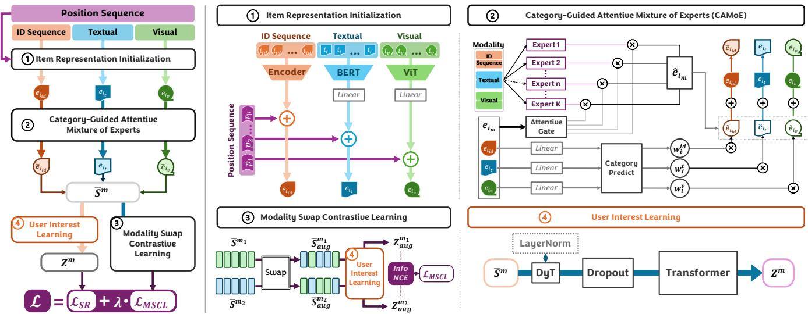  
Fig. 1: The overall framework of CAMMSR. The left-hand side provides a description of the procedure, while the right hand side details each component. 1) Item Representation Initialization initializes item multimodal representations using a pre-trained extractor with positional sequences. 2) Category-Guided Attentive Mixture of Experts leverages an additional category prediction task and attention mechanisms to effectively allocate modality weights. 3) Modality Swap Contrastive Learning constructs augmented contrastive views through modality swap operations and applies contrastive learning to enhance the alignment between different modality representations. 4) User Interest Learning models user behavior sequences with a Transformer-based encoder and explores DyT as an alternative to LayerNorm in Transformers.

ID modality: We initialize an ID representation $f _ { i _ { i d } } \in \mathbb { R } ^ { d }$ for each item i, where d is the dimensionality of the ID modality. Textual modality: Following previous studies [41], [21], we apply a widely used pre-trained BERT [42] to extract textual features to capture user preference from textual semantics. We concatenate all textual descriptions $i _ { [ \mathrm { W o r d s } ] }$ with a special symbol $i _ { [ \mathrm { C L S } _ { t } ] }$ for each item i. Since $i _ { [ \mathrm { C L S } _ { t } ] }$ can convey the semantics of the whole sentence, we use the embedding of $i _ { [ \mathrm { C L S } _ { t } ] }$ to represent the text features. Here, we input the combined sentence into pre-trained BERT to obtain the textual feature as follows:

$$
f _ {i _ {t}} = \mathrm{BERT} (\mathrm{Con} (i _ {[ \mathrm{CLS} _ {t} ]}, i _ {[ \mathrm{Words} ]})),\tag{2}
$$

where $f _ { i _ { t } } \in \mathbb { R } ^ { d _ { t } }$ is the final hidden embedding for $i _ { [ \mathrm { C L S } _ { t } ] }$ ], and $\mathrm { C o n } ( \cdot , \cdot )$ denotes the concatenation operation.

Visual modality: Following previous studies [41], [21], we apply a widely used pre-trained ViT [43] to extract visual features to capture user preference from visual semantics. We divide the image for each item i into several patches and then transform these patches into a sequence $i _ { [ \mathrm { P a t c h e s } ] }$ with a special symbol $i _ { [ \mathrm { C L S } _ { v ] } }$ . Here, we input the combined sentence into pre-trained ViT to obtain the visual feature as follows:

$$
f _ {i _ {v}} = \operatorname{ViT} (\operatorname{Con} (i _ {[ \mathrm{CLS} _ {v} ]}, i _ {[ \text { Patches } ]})),\tag{3}
$$

where $f _ { i _ { v } } \in \mathbb { R } ^ { d _ { v } }$ is the final hidden embedding for $i _ { [ \mathrm { C L S } _ { v } ] }$

To align the dimensionality of textual and visual modalities with ID modality, we adopt a simple linear projection to change their dimensions, formally:

$$
x _ {i _ {t}} = \mathbf {W} _ {t} f _ {i _ {t}} + \mathbf {b} _ {t}, \quad x _ {i _ {v}} = \mathbf {W} _ {v} f _ {i _ {v}} + \mathbf {b} _ {v},\tag{4}
$$

where $\mathbf { W } _ { t } \in \mathbb { R } ^ { d _ { t } \times d } , \mathbf { W } _ { v } \in \mathbb { R } ^ { d _ { v } \times d } , \mathbf { b } _ { t } \in \mathbb { R } ^ { d }$ , and $\mathbf { b } _ { v } \in \mathbb { R } ^ { d }$ are trainable parameters, while $f _ { i _ { t } }$ and $f _ { i _ { \imath } }$ are frozen.

Moreover, position information plays a crucial role in sequence modeling within sequential recommendation. To incorporate position information, we introduce the corresponding positional embedding $p _ { i } \in \mathbb { R } ^ { d }$ to item representation for all modalities: $\mathbf e _ { i _ { m } } = x _ { i _ { m } } + p _ { i }$ , where $m \in \{ i d , t , v \}$ denotes the modality. The entire representations for modality m are represented as $\mathbf { E } _ { m } \in \mathbb { R } ^ { | \mathcal { T } | \times \hat { d } }$

## B. Category-Guided Attentive Mixture of Experts

Users’ interest in multimodal information is dynamic and not equally weighted. Different users place varying levels of importance on different modalities, and even the same user may prioritize different modalities for different items. For example, the visual modality plays a dominant role when purchasing beauty makeup, whereas the textual modality is more instructive when buying games. To model users’ interest in recommendations derived from multimodal information and to allocate appropriate weights to different modalities, we propose the Category-Guided Attentive Mixture of Experts (CAMoE). Specifically, CAMoE further leverages an additional category prediction task to guide the allocation of modality weights in a more effective manner by adopting attention mechanisms to learn the weights of different modalities. Previous studies [21], [44], [24], [45], [46] have demonstrated the effectiveness of the Mixture of Experts (MoE) framework across various recommendation scenarios. This is attributed to its ability to enhance the learning capacity and flexibility of recommendation models by capturing specialized item representations and user preferences from multiple perspectives.

Existing studies [21], [36] typically process each modality’s feature independently and then apply weighting mechanisms. However, this paradigm often overlooks the synergistic effects between different modalities. For example, marketing information such as discounts or brands described in the textual modality may struggle to directly persuade users to purchase an item, and visual elements like anime patterns alone may also fail to directly trigger purchases. However, discounted items featuring specific anime patterns frequently lead to purchase surges. To this end, we incorporate valuable information from other modalities into the experts corresponding to each modality. Specifically, given the ID, text, and image representations of an item $\mathbf { e } _ { i _ { i d } } , \mathbf { e } _ { i _ { t } }$ and $\mathbf { e } _ { i _ { v } }$ respectively, process on the target modality $m \in \{ i d , t , v \}$ as follows:

$$
\hat {\mathbf {e}} _ {i _ {m}} = \sum_ {k = 1} ^ {K} g _ {k} ^ {m} \operatorname{Expert} _ {k} (\operatorname{Con} (\mathbf {e} _ {\mathrm{i} _ {\mathrm{id}}}, \mathbf {e} _ {\mathrm{i} _ {\mathrm{t}}}, \mathbf {e} _ {\mathrm{i} _ {\mathrm{v}}})),\tag{5}
$$

where $\mathrm { C o n } ( \cdot , \cdot )$ represents concatenation operation and Expert (·) represents the experts. K is a hyper-parameter that denotes the total number of experts for each modality, which we empirically analyzed in the Ablation Study subsection. We adopt feed-forward networks (FFNs) as experts, formally Expert $\mathbf { \Psi } _ { \ast } ( \mathbf { \cdot } ) \ = \ \mathrm { F F N } ( x ) \ = \ ( \ \mathrm { G e L U } ( x \mathbf { W } _ { 1 } + \mathbf { b } _ { 1 } ) ) \mathbf { W } _ { 2 } + \ \mathbf { b } _ { 2 } ,$ where $\mathbf { W } _ { 1 } \in \mathbb { R } ^ { 3 d \times 4 d } , \mathbf { W } _ { 2 } \in \mathbb { R } ^ { 4 d \times d } , \mathbf { b } _ { 1 } \in \mathbb { R } ^ { 4 d }$ , and $\mathbf { b } _ { 2 } \in \mathbb { R } ^ { d }$ are learnable parameters. $g _ { k } ^ { m }$ denotes the corresponding combination weight of the k-th expert on modality m from the routing vector $G ^ { m } \in \mathbb { R } ^ { K }$ by attentive gating router:

$$
G ^ {m} = \mathrm{Softmax} (Q ^ {m} (K ^ {m}) ^ {T} / \sqrt {K}) V ^ {m},\tag{6}
$$

$$
Q ^ {m}, K ^ {m}, V ^ {m} = \mathbf {W} _ {Q} ^ {m} \mathbf {E} _ {m}, \mathbf {W} _ {K} ^ {m} \mathbf {E} _ {m}, \mathbf {W} _ {V} ^ {m} \mathbf {E} _ {m},\tag{7}
$$

where $\mathbf { W } _ { Q } ^ { m } \in \mathbb { R } ^ { d \times K } , \mathbf { W } _ { K } ^ { m } \in \mathbb { R } ^ { d \times K }$ , and $\mathbf { W } _ { V } ^ { m } \in \mathbb { R } ^ { d \times K }$ are learnable parameters.

Due to the massive amount of user data and items, it is difficult for users to interact with all items, so the recommendation system generally faces the data sparsity problem [40], [47], which leads to the challenge of relying on training learnable weights of different modalities. Inspired by previous studies [48], [49] leveraging item category information to enhance the understanding of item features, we utilize item categories to guide the allocation of modality weights. Specifically, we treat item categories as true classification labels and compute modality weights by measuring the difference between true classification labels and the predicted labels derived from the corresponding modality information. To generate signals more related to user sequence, we measure the difference between true classification labels and predicted labels by binary crossentropy loss [50], [51] at the sequence level. For the item $i \in S$ on modality m, we employ the representations $\mathbf { e } _ { i _ { m } }$ of i to calculate its probability to belong to each class, which is formulated as:

$$
\hat {y} _ {c} ^ {m} = \mathbf {W} _ {c} ^ {m} \mathbf {e} _ {i _ {m}} + \mathbf {b} _ {c} ^ {m},\tag{8}
$$

where C denotes the set of the categories. $\mathbf { W } _ { c }$ and $\mathbf { b } _ { c }$ are the learnable parameters. $\hat { y } _ { c } ^ { m }$ denote the likelihood that c belongs to $c \in { \mathcal { C } } .$ . Therefore, the difference between true classification labels and predicted labels by binary cross-entropy loss $d _ { i } ^ { m }$ is formulated as:

$$
d _ {i} ^ {m} = - \sum_ {c \in \mathcal {C}} y _ {c} \log (\hat {y} _ {c} ^ {m}) + (1 - y _ {c}) \log (1 - \hat {y} _ {c} ^ {m}),\tag{9}
$$

where $y _ { c }$ is the ground truth2. Then, we further calculate modality weights, formally:

$$
w _ {i} ^ {m} = \frac {\exp (d _ {i} ^ {m})}{\sum_ {n \in \{i d , t , v \}} \exp (d _ {i} ^ {n})}.\tag{10}
$$

After obtaining modality weights $w _ { i } ^ { m }$ , experts’ output $\hat { \mathbf { e } } _ { i _ { m } }$ and item representation $\mathbf { e } _ { i _ { m } }$ for each item i, we get the final representation $\bar { \mathbf { e } } _ { i _ { m } }$ for item i on modality m, formally:

$$
\mathbf {\bar {e}} _ {i _ {m}} = \mathbf {e} _ {i _ {m}} + w _ {i} ^ {m} \mathbf {\hat {e}} _ {i _ {m}}.\tag{11}
$$

## C. User Interest Learning

To effectively capture the dynamic and evolving nature of user interests in sequential interactions, we model user behavior sequences using a Transformer-based encoder [52], which has demonstrated strong capabilities in capturing longrange dependencies and temporal patterns in sequential recommendation tasks [11], [10]. Specifically, for each modality $m ,$ we process the enriched item sequential representations $\bar { S } ^ { m } = \{ \bar { \bf e } _ { i _ { m , 1 } } , \bar { \bf e } _ { i _ { m , 2 } } , . . . , \bar { \bf e } _ { i _ { m , | S | } } \}$ —outputs from our Category-Guided Attentive Mixture of Experts (CAMoE)—through a modality-specific Transformer model. The encoding process is formally defined as:

$$
\mathbf {Z} ^ {m} = \text { Transformer } (\text { Dropout } (\text { LayerNorm } (\bar {S} ^ {m}))),\tag{12}
$$

where Transformer(·) represents Transformer model, Dropout(·) represents random dropout operation, and LayerNorm(·) represents layer norm operation. $\mathbf { Z } ^ { m }$ denotes the final representation corresponding to the last position as user interest under modality m.

Motivated by recent findings [53] that highlight the role of LayerNorm(·) in non-linearly scaling inputs and compressing outliers via an S-shaped function akin to Tanh(·), we explore a lightweight and adaptive alternative: the Dynamic Tanh (DyT) operation, defined as:

$$
\mathrm{DyT} (x) = \operatorname{Tanh} (\alpha x),\tag{13}
$$

where α is a learnable parameter. DyT mimics the normalization and activation behavior of LayerNorm while offering greater efficiency and flexibility by adaptively scaling inputs and constraining output magnitudes via the bounded tanh function. Inspired by its potential to enhance representation quality and training stability, we replace LayerNorm(·) in Eq. 12 DyT(·), leading to:

$$
\mathbf {Z} ^ {m} = \text { Transformer } (\text { Dropout } (\text { DyT } (\bar {S} ^ {m}))).\tag{14}
$$

In the Ablation Study subsection, we empirically discuss the performance benefits of substituting LayerNorm(·) with DyT(·). To predict the interaction probability between user u and item i, we first compute a score for each modality and then aggregate these scores by summing them to obtain the final prediction $\hat { y } _ { i }$ , formally:

$$
\hat {y} _ {i} = \sum_ {m \in \{i d, t, v \}} \mathbf {Z} ^ {m} \mathbf {e} _ {i _ {m}}.\tag{15}
$$

## D. Modality Swap Contrastive Learning

To enhance the learning of correlations between multimodal information, we propose a modality swap contrastive learning task to strengthen the alignment between representations of different modalities. Inspired by a recent study [54], we construct augmented contrastive views using the modality swap operation. Specifically, for each modality pair $\langle m _ { 1 } , m _ { 2 } \rangle$ where $m _ { 1 } ~ \neq ~ m _ { 2 }$ and $m _ { 1 } , m _ { 2 } \in \{ i d , t , v \}$ , we create a pair of modality swap contrastive views, $\langle { \bf Z } _ { a u g } ^ { m _ { 1 } } , { \bf Z } _ { a u g } ^ { m _ { 2 } } \rangle$ by randomly swapping half of the sequence items by randomly swapping half of the sequence items $\bar { S } ^ { m _ { 1 } / m _ { 2 } } =$ $\{ \overline { { \mathbf { e } } } _ { i _ { m _ { 1 } / m _ { 2 } , 1 } } , . . . , \overline { { \mathbf { e } } } _ { i _ { m _ { 1 } / m _ { 2 } , | S | } } \}$ between the two modalities:

$$
\mathbf {Z} _ {a u g} ^ {m _ {1} / m _ {2}} = \text { Transformer } (\text { Dropout } (\text { DyT } (\bar {S} _ {a u g} ^ {m _ {1} / m _ {2}}))),\tag{16}
$$

$$
\bar {S} _ {a u g} ^ {m _ {1}}, \bar {S} _ {a u g} ^ {m _ {2}} = \mathrm{Swap} (\bar {S} ^ {m _ {1}}, \bar {S} ^ {m _ {2}} | 0. 5),\tag{17}
$$

where $\operatorname { S w a p } ( S _ { 1 } , S _ { 2 } | \rho )$ denotes randomly swapping the item representations between sequences $S _ { 1 }$ and $S _ { 2 }$ with a probability of $\rho .$ To better align representations of different modalities, we adopt InfoNCE [55] between augmented contrastive views. Specifically, within a training batch B, we can obtain $\{ \hat { \mathbf { Z } } _ { a u g , 1 } ^ { m _ { 1 } / m _ { 2 } } , \bar { \mathbf { Z } } _ { a u g , 2 } ^ { m _ { 1 } / m _ { 2 } } , . . . , \mathbf { Z } _ { a u g , | B | } ^ { m _ { 1 } / m _ { 2 } } \}$ and we treat $\langle { \bf Z } _ { a u g , i } ^ { m _ { 1 } } , { \bf Z } _ { a u g , i } ^ { m _ { 2 } } \rangle$ as the positive pair, while $\{ \langle \mathbf { Z } _ { a u g , i } ^ { m _ { 1 } } , \mathbf { Z } _ { a u g , j } ^ { m _ { 2 } } \rangle | i \neq j \}$ are regarded as negative pairs. The contrastive learning loss can be formulated as:

$$
\mathcal {L} _ {M S C L} ^ {m _ {1, 2}} = - \sum_ {i = 1} ^ {| \mathcal {B} |} \log \frac {\exp (\text {Sim} (\mathbf {Z} _ {a u g , i} ^ {m _ {1}} , \mathbf {Z} _ {a u g , i} ^ {m _ {2}}))}{\sum_ {j = 1} ^ {| \mathcal {B} |} \exp (\text {Sim} (\mathbf {Z} _ {a u g , i} ^ {m _ {1}} , \mathbf {Z} _ {a u g , j} ^ {m _ {2}}))},\tag{18}
$$

where Sim(·) represents cosine similarity. In the Ablation Study section, we conduct an empirical analysis to evaluate the effectiveness of different modality pair(s) choices.

## E. Optimization

We optimize our model using two objectives: modality swap contrastive learning and the main sequential recommendation task. Given a user behavior sequence S, the primary goal of sequential recommendation is to predict which item the user is likely to engage with at the (|S|+1)-th time step. Using our proposed model, we obtain the prediction score ${ \hat { y } } _ { i } ,$ which represents the probability of the user interacting with item i at the next time step. The cross-entropy loss function is then employed as the main training objective to quantify the difference between the predicted score $\hat { y } _ { i }$ and the ground truth yi, defined as:

$$
\mathcal {L} _ {S R} = - \sum_ {i \in \mathcal {I}} y _ {i} \log (\hat {y} _ {i}).\tag{19}
$$

The final learning objective is defined as:

$$
\mathcal {L} = \mathcal {L} _ {S R} + \lambda \mathcal {L} _ {M S C L},\tag{20}
$$

where λ is the weight hyperparameter.

To provide a clearer overview of our CAMMSR, we summarize the learning process of CAMMSR in Algorithm 1.

Algorithm 1: Procedure of CAMMSR
1: Input: User set U, item set I, modalities  $M = \{id, t, v\}$ .
2: Initialize item ID representation  $I_{id}$ , item textual representation  $f_{it}$ , item visual representation  $f_{iv}$ , and entire representations for each modality m as  $E_{m}$ ;
3: while not converged do
4: Get representation  $\hat{e}_{im}$  for each modality m with attentive mixture of experts via Eq. 5-7.
5: Calculate category-guided weight  $w_{i}^{m}$  for item i on modality m via Eq. 8-10.
6: Get final item representation  $\bar{e}_{im}$  for item i on modality m via Eq. 11.
7: Get sequences representation  $Z^{m}$  via Eq. 13-14.
8: Compute modality swap contrastive learning loss  $L_{MSCL}$  via Eq. 16-18.
9: Compute main sequential recommendation loss  $L_{SR}$  via Eq. 15-19.
10: Get final optimization loss L via Eq. 20.
11: Optimize model via loss L.
12: end while

## V. EXPERIMENTS

In this section, we conduct comprehensive experiments to evaluate the performance of CAMMSR framework on four widely used real-world datasets. The following five research questions can be well answered through experimental results: RQ1: Does CAMMSR outperform the state-of-the-art conventional and multimodal sequential recommendations? RQ2: What impact do the key components of CAMMSR have on its overall performance? RQ3: How does the category noise affect the performance of CAMMSR? RQ4: Whether leveraging multiple modalities contributes to more ideal performance for CAMMSR? RQ5: How efficient is CAMMSR compared with other multimodal sequential recommendations? RQ6: How does category-guided of CAMMSR assign modality weights effectively? RQ7: How do different hyper-parameter settings impact the overall performance of CAMMSR?

In summary, we introduce the experimental settings in Section V-A, demonstrate the performance advantages of CAMMSR in Section V-B, evaluate the necessity of key components in Section V-C, analyze CAMMSR in category noise scenarios in Section V-D, discuss the importance of multiple modalities in Section V-E, analyze the efficiency of CAMMSR in Section V-F, provide a real-world case study in Section V-G, conduct a hyper-parameter analysis in Section V-H, and extend CAMMSR to different category label scenarios in Section V-K.

TABLE II: Statistics of all four datasets.

<table><tr><td>Dataset</td><td>Toys</td><td>Games</td><td>Beauty</td><td>Home</td></tr><tr><td># Users</td><td>19,412</td><td>24,303</td><td>22,363</td><td>66,520</td></tr><tr><td># Items</td><td>11,924</td><td>10,672</td><td>12,101</td><td>28,238</td></tr><tr><td># Interactions</td><td>167,597</td><td>231,780</td><td>198,502</td><td>551,682</td></tr><tr><td># Avg. Interactions/User</td><td>14.58</td><td>9.53</td><td>8.88</td><td>8.29</td></tr><tr><td># Avg. Interactions/Item</td><td>17.03</td><td>21.72</td><td>16.40</td><td>19.54</td></tr><tr><td># Sparsity</td><td>99.93%</td><td>99.91%</td><td>99.93%</td><td>99.97%</td></tr></table>

## A. Experimental Settings

1) Datasets: To validate the effectiveness of CAMMSR, we conduct experiments on four public and real-world datasets [56], namely Toys and Games (Toys), Video Games (Games), Beauty, and Home and Kitchen (Home). For each dataset, duplicate interactions are removed, and user interactions are sorted chronologically by timestamps to construct behavior sequences. Following prior studies [57], [36], we apply a 5-core filtering strategy, which excludes users and items with fewer than five interactions from each dataset. For textual data, we concatenate phrases from the title, category, and brand fields, consistent with previous studies [20], [51]. For image data, we directly download the first image of each item from the provided product URLs. Table II presents detailed statistical information for all four datasets.

2) Baselines: To evaluate the effectiveness of CAMMSR, we compare CAMMSR with various state-of-the-art baselines:

## (1) Sequential Methods

• GRU4Rec [26] utilizes Gated Recurrent Units (GRU) to model user click sequences for the session-based recommendation. Following previous studies [21], [10], we represent the items using embedding vectors rather than one-hot vectors.

• SASRec [11] is a sequential recommendation model based on self-attention, leveraging the multi-head attention mechanism to predict the next item.

• LRURec [58] introduces linear recurrent units to enhance the encoding quality of long user behavior sequences.

• FEARec [13] performs frequency-level sequence analysis by introducing a ramp structure to process information from the frequency domain effectively.

• TiCoSeRec [12] proposes five-time interval-based sequence-level augmentations to create uniform sequences and leverages contrastive learning to enhance performance.

## (2) Multimodal Sequential Methods

• NOVA [17] proposes a non-invasive self-attention mechanism to leverage side information effectively.

• DIF-SR [51] introduces a decoupled side information fusion module to address the rank bottleneck and enhance the expressiveness of non-invasive attention matrices.

• UniSRec [36] uses item textual information to learn more transferable representations for sequential recommendation.

• MISSRec [20] proposes an Interest Discovery Module to capture deep relationships among items and user preferences.

• M3SRec [21] employs modal-specific and cross-modal MoE mechanisms to enhance modality learning in Transformers.

• IISAN [25] utilizes decoupled parameter-efficient finetuning on modality foundation models to enable both intramodal and inter-modal adaptation.

• MMMLP [22] proposes a purely MLP-based model with Feature Mixer and Fusion Mixer to process multimodal data, achieving outstanding performance with linear complexity.

• TedRec [23] performs a sequence-level semantic fusion of text and ID using FFT in the frequency domain.

• FindRec [38] theoretically guarantees cross-modal consistency through the Stein kernel-based Integrated Information Coordination Module.

3) Evaluation Metrics: To fairly evaluate the performance of the recommendation task, we follow previous studies [22], [20] and utilize two established metrics: Normalized Discounted Cumulative Gain (NDCG@K) and Mean Reciprocal Rank (MRR@K), where $\mathrm { ~ K ~ } \in \ \{ 5 , 1 0 \}$ . We adopt the leaveone-out evaluation strategy to conduct the experiments. The ranking scores are computed on the whole item set without sampling.

4) Implementation Details: To ensure a fair comparison, we implement our CAMMSR and all baselines using the RecBole [59]. RecBole is a unified and comprehensive framework for recommendation systems, while RecBole implements various recommendation methods. We set the training batch size to 1024, and the hidden embedding size for all baselines is 64. The maximum length of each behavior sequence is limited to 50. For the encoder structure, the number of multi-heads in the Transformer and the number of self-attention layers are both empirically set to 2. Specifically, we employ the same Adam [60] optimizer and Xavier initialization [61] with default parameters. We conduct a detailed hyper-parameter search for all baseline models. The expert number K for our CAMoE component is conducted within the range of {1, 2, 4, 8, 16} weight hyper-parameter λ within the range of {0.25, 0.5, 0.75, 1}. In addition, we use empirically fixed $1 e ^ { - 3 }$ as the learning rate. All experiments are conducted on a single NVIDIA GeForce RTX 3090 GPU.

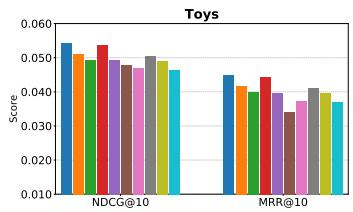

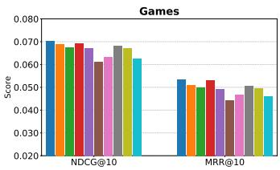

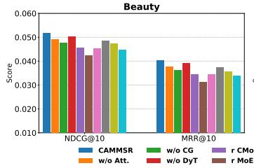

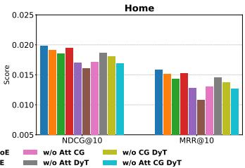  
Fig. 2: Performance comparison for CAMMSR and all variants across all four datasets.

TABLE III: Performance comparison of baselines on different datasets in terms of NDCG@K and MRR@K. The superscript ∗ indicates the improvement is statistically significant where the p-value is less than 0.05. “Neg. Ratio” denotes the proportion of the test set where removing CG leads to improved recommendation accuracy.

<table><tr><td rowspan="3">Baseline</td><td colspan="4">Toys</td><td colspan="4">Games</td><td colspan="4">Beauty</td><td colspan="4">Home</td></tr><tr><td colspan="2">NDCG</td><td colspan="2">MRR</td><td colspan="2">NDCG</td><td colspan="2">MRR</td><td colspan="2">NDCG</td><td colspan="2">MRR</td><td colspan="2">NDCG</td><td colspan="2">MRR</td></tr><tr><td>@5</td><td>@10</td><td>@5</td><td>@10</td><td>@5</td><td>@10</td><td>@5</td><td>@10</td><td>@5</td><td>@10</td><td>@5</td><td>@10</td><td>@5</td><td>@10</td><td>@5</td><td>@10</td></tr><tr><td>GRU4Rec</td><td>0.0236</td><td>0.0289</td><td>0.0201</td><td>0.0222</td><td>0.0385</td><td>0.0514</td><td>0.0311</td><td>0.0365</td><td>0.0271</td><td>0.0337</td><td>0.0223</td><td>0.0260</td><td>0.0067</td><td>0.0087</td><td>0.0056</td><td>0.0064</td></tr><tr><td>SASRec</td><td>0.0348</td><td>0.0411</td><td>0.0257</td><td>0.0295</td><td>0.0391</td><td>0.0546</td><td>0.0286</td><td>0.0349</td><td>0.0325</td><td>0.0412</td><td>0.0250</td><td>0.0286</td><td>0.0118</td><td>0.0148</td><td>0.0089</td><td>0.0100</td></tr><tr><td>LRURRec</td><td>0.0362</td><td>0.0446</td><td>0.0278</td><td>0.0312</td><td>0.0410</td><td>0.0557</td><td>0.0315</td><td>0.0376</td><td>0.0323</td><td>0.0412</td><td>0.0250</td><td>0.0286</td><td>0.0112</td><td>0.0141</td><td>0.0084</td><td>0.0096</td></tr><tr><td>FEARRec</td><td>0.0354</td><td>0.0442</td><td>0.0266</td><td>0.0302</td><td>0.0411</td><td>0.0558</td><td>0.0306</td><td>0.0367</td><td>0.0342</td><td>0.0434</td><td>0.0265</td><td>0.0304</td><td>0.0121</td><td>0.0152</td><td>0.0092</td><td>0.0105</td></tr><tr><td>TiCoSeRec</td><td>0.0336</td><td>0.0404</td><td>0.0280</td><td>0.0311</td><td>0.0463</td><td>0.0589</td><td>0.0382</td><td>0.0434</td><td>0.0335</td><td>0.0413</td><td>0.0285</td><td>0.0317</td><td>0.0108</td><td>0.0134</td><td>0.0091</td><td>0.0102</td></tr><tr><td>NOVA</td><td>0.0381</td><td>0.0478</td><td>0.0288</td><td>0.0328</td><td>0.0417</td><td>0.0576</td><td>0.0303</td><td>0.0368</td><td>0.0347</td><td>0.0442</td><td>0.0273</td><td>0.0312</td><td>0.0120</td><td>0.0147</td><td>0.0092</td><td>0.0102</td></tr><tr><td>DIF-SR</td><td>0.0359</td><td>0.0444</td><td>0.0284</td><td>0.0318</td><td>0.0416</td><td>0.0575</td><td>0.0311</td><td>0.0375</td><td>0.0340</td><td>0.0436</td><td>0.0262</td><td>0.0302</td><td>0.0092</td><td>0.0112</td><td>0.0078</td><td>0.0086</td></tr><tr><td>UniSRRec</td><td>0.0276</td><td>0.0384</td><td>0.0194</td><td>0.0239</td><td>0.0386</td><td>0.0535</td><td>0.0291</td><td>0.0353</td><td>0.0287</td><td>0.0393</td><td>0.0212</td><td>0.0288</td><td>0.0121</td><td>0.0160</td><td>0.0092</td><td>0.0108</td></tr><tr><td>MISSRec</td><td>0.0323</td><td>0.0414</td><td>0.0235</td><td>0.0270</td><td>0.0398</td><td>0.0506</td><td>0.0312</td><td>0.0353</td><td>0.0315</td><td>0.0397</td><td>0.0240</td><td>0.0271</td><td>0.0140</td><td>0.0174</td><td>0.0107</td><td>0.0119</td></tr><tr><td>M3SRRec</td><td>0.0416</td><td>0.0486</td><td>0.0363</td><td>0.0391</td><td>0.0493</td><td>0.0643</td><td>0.0404</td><td>0.0464</td><td>0.0345</td><td>0.0428</td><td>0.0294</td><td>0.0328</td><td>0.0122</td><td>0.0144</td><td>0.0105</td><td>0.0115</td></tr><tr><td>IISAN</td><td>0.0395</td><td>0.0489</td><td>0.0354</td><td>0.0393</td><td>0.0525</td><td>0.0671</td><td>0.0432</td><td>0.0491</td><td>0.0372</td><td>0.0464</td><td>0.0309</td><td>0.0347</td><td>0.0152</td><td>0.0187</td><td>0.0129</td><td>0.0142</td></tr><tr><td>MMMLP</td><td>0.0378</td><td>0.0466</td><td>0.0344</td><td>0.0377</td><td>0.0486</td><td>0.0644</td><td>0.0397</td><td>0.0464</td><td>0.0351</td><td>0.0433</td><td>0.0295</td><td>0.0333</td><td>0.0133</td><td>0.0165</td><td>0.0107</td><td>0.0118</td></tr><tr><td>TedRec</td><td>0.0318</td><td>0.0397</td><td>0.0265</td><td>0.0297</td><td>0.0468</td><td>0.0604</td><td>0.0384</td><td>0.0439</td><td>0.0330</td><td>0.0419</td><td>0.0275</td><td>0.0311</td><td>0.0113</td><td>0.0140</td><td>0.0094</td><td>0.0105</td></tr><tr><td>FindRec</td><td>0.0390</td><td>0.0480</td><td>0.0357</td><td>0.0389</td><td>0.0501</td><td>0.0663</td><td>0.0411</td><td>0.0477</td><td>0.0359</td><td>0.0447</td><td>0.0304</td><td>0.0341</td><td>0.0137</td><td>0.0171</td><td>0.0111</td><td>0.0124</td></tr><tr><td>CAMMSR</td><td>0.0477*</td><td>0.0542*</td><td>0.0421*</td><td>0.0449*</td><td>0.0560*</td><td>0.0701*</td><td>0.0474*</td><td>0.0533*</td><td>0.0429*</td><td>0.0517*</td><td>0.0374*</td><td>0.0404*</td><td>0.0168*</td><td>0.0199*</td><td>0.0149*</td><td>0.0159*</td></tr><tr><td>Improv.</td><td>14.66%</td><td>10.84%</td><td>15.98%</td><td>14.25%</td><td>6.67%</td><td>4.47%</td><td>9.72%</td><td>8.55%</td><td>15.32%</td><td>11.42%</td><td>21.04%</td><td>16.43%</td><td>10.53%</td><td>6.42%</td><td>15.50%</td><td>11.97%</td></tr><tr><td>Neg. Ratio</td><td>0.16%</td><td>0.16%</td><td>0.24%</td><td>0.24%</td><td>0.33%</td><td>0.33%</td><td>0.61%</td><td>0.61%</td><td>0.24%</td><td>0.24%</td><td>0.40%</td><td>0.40%</td><td>0.28%</td><td>0.28%</td><td>0.54%</td><td>0.54%</td></tr></table>

TABLE IV: Effectiveness of CAMMSR with different modality pair(s) choices. ○ denotes chosen pair(s).

<table><tr><td>Dataset</td><td> $\langle v,t\rangle$ </td><td> $\langle id,t\rangle$ </td><td> $\langle id,v\rangle$ </td><td>NDCG@5</td><td>NDCG@10</td><td>MRR@5</td><td>MRR@10</td></tr><tr><td rowspan="8">Toys</td><td>○</td><td>○</td><td>○</td><td>0.0415</td><td>0.0504</td><td>0.0371</td><td>0.0415</td></tr><tr><td>●</td><td>○</td><td>○</td><td>0.0435</td><td>0.0530</td><td>0.0396</td><td>0.0439</td></tr><tr><td>○</td><td>●</td><td>○</td><td>0.0424</td><td>0.0516</td><td>0.0382</td><td>0.0422</td></tr><tr><td>○</td><td>○</td><td>●</td><td>0.0421</td><td>0.0513</td><td>0.0380</td><td>0.0421</td></tr><tr><td>●</td><td>●</td><td>○</td><td>0.0439</td><td>0.0536</td><td>0.0406</td><td>0.0444</td></tr><tr><td>●</td><td>○</td><td>●</td><td>0.0439</td><td>0.0538</td><td>0.0407</td><td>0.0446</td></tr><tr><td>○</td><td>●</td><td>●</td><td>0.0430</td><td>0.0524</td><td>0.0387</td><td>0.0427</td></tr><tr><td>●</td><td>●</td><td>●</td><td>0.0447</td><td>0.0542</td><td>0.0421</td><td>0.0449</td></tr><tr><td rowspan="8">Games</td><td>○</td><td>○</td><td>○</td><td>0.0529</td><td>0.0679</td><td>0.0436</td><td>0.0501</td></tr><tr><td>●</td><td>○</td><td>○</td><td>0.0541</td><td>0.0690</td><td>0.0455</td><td>0.0525</td></tr><tr><td>○</td><td>●</td><td>○</td><td>0.0535</td><td>0.0686</td><td>0.0442</td><td>0.0508</td></tr><tr><td>○</td><td>○</td><td>●</td><td>0.0533</td><td>0.0684</td><td>0.0440</td><td>0.0505</td></tr><tr><td>●</td><td>●</td><td>○</td><td>0.0550</td><td>0.0693</td><td>0.0462</td><td>0.0527</td></tr><tr><td>●</td><td>○</td><td>●</td><td>0.0552</td><td>0.0696</td><td>0.0465</td><td>0.0529</td></tr><tr><td>○</td><td>●</td><td>●</td><td>0.0545</td><td>0.0689</td><td>0.0449</td><td>0.0515</td></tr><tr><td>●</td><td>●</td><td>●</td><td>0.0560</td><td>0.0701</td><td>0.0474</td><td>0.0533</td></tr><tr><td rowspan="8">Beauty</td><td>○</td><td>○</td><td>○</td><td>0.0374</td><td>0.0469</td><td>0.0312</td><td>0.0350</td></tr><tr><td>●</td><td>○</td><td>○</td><td>0.0414</td><td>0.0503</td><td>0.0367</td><td>0.0392</td></tr><tr><td>○</td><td>●</td><td>○</td><td>0.0383</td><td>0.0479</td><td>0.0330</td><td>0.0365</td></tr><tr><td>○</td><td>○</td><td>●</td><td>0.0381</td><td>0.0479</td><td>0.0328</td><td>0.0363</td></tr><tr><td>●</td><td>●</td><td>○</td><td>0.0417</td><td>0.0506</td><td>0.0367</td><td>0.0394</td></tr><tr><td>●</td><td>○</td><td>●</td><td>0.0418</td><td>0.0509</td><td>0.0369</td><td>0.0396</td></tr><tr><td>○</td><td>●</td><td>●</td><td>0.0388</td><td>0.0492</td><td>0.0343</td><td>0.0378</td></tr><tr><td>●</td><td>●</td><td>●</td><td>0.0429</td><td>0.0517</td><td>0.0374</td><td>0.0404</td></tr><tr><td rowspan="8">Home</td><td>○</td><td>○</td><td>○</td><td>0.0152</td><td>0.0185</td><td>0.0128</td><td>0.0142</td></tr><tr><td>●</td><td>○</td><td>○</td><td>0.0162</td><td>0.0191</td><td>0.0141</td><td>0.0152</td></tr><tr><td>○</td><td>●</td><td>○</td><td>0.0155</td><td>0.0188</td><td>0.0131</td><td>0.0146</td></tr><tr><td>○</td><td>○</td><td>●</td><td>0.0155</td><td>0.0187</td><td>0.0133</td><td>0.0145</td></tr><tr><td>●</td><td>●</td><td>○</td><td>0.0163</td><td>0.0193</td><td>0.0142</td><td>0.0153</td></tr><tr><td>●</td><td>○</td><td>●</td><td>0.0165</td><td>0.0195</td><td>0.0147</td><td>0.0156</td></tr><tr><td>○</td><td>●</td><td>●</td><td>0.0160</td><td>0.0190</td><td>0.0140</td><td>0.0148</td></tr><tr><td>●</td><td>●</td><td>●</td><td>0.0168</td><td>0.0199</td><td>0.0149</td><td>0.0159</td></tr></table>

## B. Overall Comparison (RQ1)

Table III presents the comprehensive recommendation performance of all baseline models across four publicly available datasets. The best-performing result is highlighted in bold, while the second-best result is underlined. We also report the relative improvement (%Improv.) achieved by our proposed CAMMSR, with statistical significance verified through t-test experiments $( p \ < \ 0 . 0 5 )$ as indicated by the superscript ∗. Based on these experimental results, we provide the following detailed observations:

• CAMMSR demonstrates consistent and statistically significant superiority across all evaluation metrics and datasets. Specifically, on the Toys dataset, it achieves relative improvements of 14.66% in NDCG@5 and 15.98% in

MRR@5 compared to the strongest baseline. Similar substantial gains are observed across other datasets, with improvements of 6.67% in NDCG@5 on Games, 15.32% in NDCG@5 on Beauty, and 10.53% in NDCG@5 on Home. This consistent performance advantage validates that our category-guided attentive MoE framework, combined with modality swap contrastive learning, effectively mines discriminative modality features and leverages synergistic effects between modalities for sequential recommendation. The comparative analysis reveals that multimodal sequential methods generally outperform traditional sequential approaches across most experimental settings. For instance, on the Beauty dataset, all multimodal baselines surpass traditional methods by substantial margins, with the strongest multimodal baseline IISAN achieving 0.0372 in NDCG@5 compared to 0.0342 from the best traditional method FEARec. Notably, CAMMSR further advances this performance frontier, demonstrating the critical importance of our tailored category-guided attentive MoE component in dynamically assigning appropriate weights to different modalities based on contextual signals.

• The results highlight that effectively modeling inter-modal relationships is crucial for recommendation performance. While IISAN and M3SRec achieve competitive results through their dedicated inter-modal modeling approaches (e.g., IISAN reaches 0.0525 in NDCG@5 on Games), CAMMSR consistently surpasses them across all datasets and metrics. This performance advantage is particularly evident in the Beauty dataset, where CAMMSR achieves a 15.32% improvement in NDCG@5 over IISAN, demonstrating the superior capability of our category-guided attentive MoE in exploiting synergistic effects between different modalities through adaptive expert combination and contrastive alignment.

• While it is possible that extreme cases, where categorymodality correlation diverges from recommendation utility, might occur by chance, we address this concern empirically by analyzing the proportion of the test set where removing

CAMoE leads to improved recommendation accuracy. Experimental results show that CAMoE has a negative effect in less than 1% of cases. This demonstrates its strong generalizability and stability. From the perspective of performance improvement, CAMMSR shows more significant performance advantages in scenarios with lower functional requirements (e.g., Toys and Beauty) compared to those with higher functional requirements (e.g., Games and Home).

Overall, the comprehensive experimental results confirm that CAMMSR delivers statistically significant and practically meaningful improvements in recommendation performance.

## C. Ablation Study (RQ2)

To analyze the effectiveness of our CAMMSR, we conduct comprehensive ablation studies to evaluate the necessity and contribution of each individual component within the model. Specifically, we compare our model with the following variants: a) w/o Att. replaces the attentive gating routers in Eq. 5 with linear gating routers. b) w/o CG replaces categoryguided fusion Eq. 10 with equal weight fusion. c) w/o DyT replaces the DyT layer in Eq. 14 with the LayerNorm layer. d) r CMoE replaces our CAMoE with cross-modal MoE from previous work [21]. e) r MoE replaces our CAMoE with vanilla MoE. The evaluation results are demonstrated in Figure 2. All the components contribute to the performance of CAMMSR. Specifically, we have the following observations: 1) CAMMSR achieves higher performance than w/o Att., demonstrating the necessity of giving appropriate weights to different experts in MoE. 2) The performance of w/o CG is significantly lower than that of CAMMSR, which demonstrates that assigning weights based on the performance of different modalities in the category-prediction task effectively guides how to leverage multimodal features. 3) CAMMSR achieves notable performance improvements over w/o DyT, demonstrating that the DyT layer can achieve comparable or even superior performance compared to the LayerNorm layer in Transformers. This finding aligns with the observations reported in previous studies [53]. 4) CAMMSR consistently outperforms r CMoE and r MoE, demonstrating the effectiveness of our CAMoE. Furthermore, we further investigate the impact of different modality pair selections in the Modality Swap Contrastive Learning component on the overall performance of CAMMSR. Table IV illustrates the investigation result. We observe that incorporating more modality pairs leads to higher performance. When selecting only a single modality pair, the combination of visual and textual modalities proves to be the optimal choice. We hypothesize that this is due to the significant semantic gap between visual and textual modalities, which the Modality Swap Contrastive Learning component effectively mitigates, thereby enabling better utilization of multimodal features.

## D. Noise Study (RQ3)

To evaluate the robustness of our category-guided mechanism under realistic data quality scenarios, we conduct a systematic noise study simulating two common types of category label corruption: (1) Removal, where corrupted tags are deleted and equal weights are assigned to all modalities as fallback; and (2) Misleading, where corrupted tags are replaced with incorrect labels. For reference, we include the w/o CG variant that completely removes category-guided weight allocation. The hyperparameter configurations remain consistent with our main experiments (Section V-A). Experimental results across all four datasets are summarized in Table V, from which we derive the following key observations:

TABLE V: Depth analysis for category noise.

<table><tr><td rowspan="2">Type</td><td rowspan="2">Level</td><td colspan="2">Toys</td><td colspan="2">Games</td></tr><tr><td>NDCG@10</td><td>MRR@10</td><td>NDCG@10</td><td>MRR@10</td></tr><tr><td>CAMMSR</td><td>-</td><td>0.0542</td><td>0.0449</td><td>0.0701</td><td>0.0533</td></tr><tr><td rowspan="3">Removal</td><td>10%</td><td>0.0530</td><td>0.0439</td><td>0.0693</td><td>0.0524</td></tr><tr><td>20%</td><td>0.0520</td><td>0.0428</td><td>0.0689</td><td>0.0519</td></tr><tr><td>30%</td><td>0.0513</td><td>0.0420</td><td>0.0684</td><td>0.0515</td></tr><tr><td rowspan="3">Misleading</td><td>10%</td><td>0.0525</td><td>0.0433</td><td>0.0688</td><td>0.0519</td></tr><tr><td>20%</td><td>0.0505</td><td>0.0411</td><td>0.0678</td><td>0.0504</td></tr><tr><td>30%</td><td>0.0482</td><td>0.0391</td><td>0.0667</td><td>0.0490</td></tr><tr><td>w/o CG</td><td>-</td><td>0.0493</td><td>0.0400</td><td>0.0675</td><td>0.0499</td></tr><tr><td rowspan="2">Type</td><td rowspan="2">Level</td><td colspan="2">Beauty</td><td colspan="2">Home</td></tr><tr><td>NDCG@10</td><td>MRR@10</td><td>NDCG@10</td><td>MRR@10</td></tr><tr><td>CAMMSR</td><td>-</td><td>0.0517</td><td>0.0404</td><td>0.0199</td><td>0.0159</td></tr><tr><td rowspan="3">Removal</td><td>10%</td><td>0.0505</td><td>0.0391</td><td>0.0195</td><td>0.0156</td></tr><tr><td>20%</td><td>0.0499</td><td>0.0384</td><td>0.0193</td><td>0.0152</td></tr><tr><td>30%</td><td>0.0492</td><td>0.0377</td><td>0.0190</td><td>0.0148</td></tr><tr><td rowspan="3">Misleading</td><td>10%</td><td>0.0500</td><td>0.0386</td><td>0.0191</td><td>0.0150</td></tr><tr><td>20%</td><td>0.0480</td><td>0.0368</td><td>0.0186</td><td>0.0146</td></tr><tr><td>30%</td><td>0.0470</td><td>0.0357</td><td>0.0182</td><td>0.0142</td></tr><tr><td>w/o CG</td><td>-</td><td>0.0476</td><td>0.0362</td><td>0.0185</td><td>0.0143</td></tr></table>

• The Removal condition consistently results in less performance degradation compared to the Misleading scenario across all noise levels. For instance, on the Toys dataset with 30% noise, Removal causes a 5.35% drop in NDCG@10, while Misleading leads to an 11.07% decrease. This pattern highlights the critical importance of accurate category signals for proper modality weight allocation and underscores the vulnerability of multimodal systems to misleading supervisory signals.

• Even under substantial noise conditions, our categoryguided mechanism maintains its effectiveness. At 20% misleading noise, CAMMSR still achieves superior performance (NDCG@10: 0.0505 on Toys, 0.0678 on Games) compared to the w/o CG variant (NDCG@10: 0.0493 on Toys, 0.0675 on Games), demonstrating considerable robustness to label inaccuracies. This resilience is particularly valuable for real-world deployment where perfect label quality cannot be guaranteed.

Based on these empirical findings, we provide the following analysis regarding practical implications:

• In real-world data management scenarios, category label errors exceeding 10-20% are statistically rare in properly maintained systems. Our results confirm that within this realistic noise range, the category-guided component continues to provide net positive benefits, maintaining performance superior to ablation without category guidance. This makes CAMMSR particularly suitable for practical passive data management systems where perfect label curation is economically infeasible.

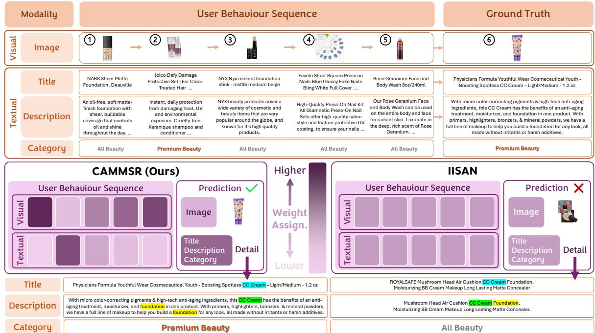  
Fig. 3: A case study for purchase sequence and CAMMSR and IISAN prediction results from the Beauty Dataset.

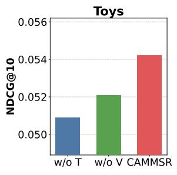  
(a) Toys

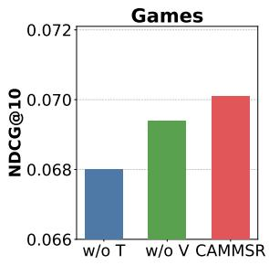  
(b) Games

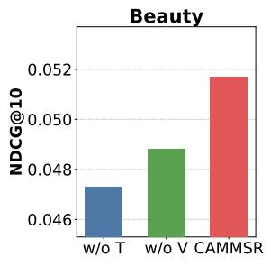  
(c) Beauty

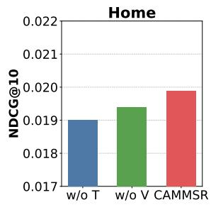  
(d) Home  
Fig. 4: Performance comparison of removing each modality.

• The significant performance gap between Removal and Misleading conditions (e.g., 0.0513 vs. 0.0482 in NDCG@10 on Toys with 30% noise) suggests that developing effective label noise filtering mechanisms represents a promising research direction. Future work could focus on integrating confidence-aware category estimation or self-correcting label refinement to further enhance robustness in noisy environments, thereby advancing the reliability of passive data management systems in web-scale applications.

## E. In-depth Analysis (RQ4)

We conduct an in-depth analysis to verify whether leveraging multiple modalities contributes to more accurate recommendations. Specifically, we designed the following two variants: a) ${ \bf w } / { \bf o }$ T removes textual modality. b) w/o V removes visual modality.

As illustrated in Figure 4, CAMMSR demonstrates superior performance compared to all its variants. Additionally, the variant w/o V outperforms w/o T, indicating the relative importance of textual data over visual data. This phenomenon can be attributed to the ability of multiple modalities to provide richer and more comprehensive information. Moreover, textual information tends to exhibit a stronger semantic alignment with item characteristics, making it more directly relevant to the recommendation task compared to visual information.

## F. Efficiency Study (RQ5)

To further analyze the training efficiency of CAMMSR, we plot scatter charts of efficiency (training time per epoch) and effectiveness (NDCG@10) on Games and Beauty datasets. As shown in Figure 5, we can observe that CAMMSR achieves advanced efficiency and performance, outperforming all baselines in terms of efficiency—with the sole exception of DIF-SR—and significantly surpassing all baselines in performance. Furthermore, considering that the total training time is closely related to the model’s convergence speed, we also provide an analysis that takes the number of epochs to converge into account. In Table VI, we present the efficiency of CAMMSR and advanced baselines in terms of average training time per epoch, the number of epochs required for convergence, and total training time. The results demonstrate that CAMMSR achieves competitive per-epoch training efficiency and the fastest convergence among all models. This highlights that CAMMSR not only reduces computational time but also reaches optimal performance swiftly, making it particularly suitable for scenarios with limited time or computational resources, such as rapid deployment and frequent updates. Additionally, in terms of inference time, CAMMSR achieves better efficiency than other baselines, second only to DIF-SR.

TABLE VI: Efficiency comparison of different baselines across two datasets, including average training time per epoch, number of epochs to converge, total training time, and inference time per epoch (TT/E: Training Time/Epoch, #E: #Epoch, TTT: Total Training Time, IT/E: Inference Time/Epoch, N@10: NDCG@10; s: second, m: minute, h: hour).

<table><tr><td rowspan="2">Model</td><td colspan="5">Games</td><td colspan="5">Beauty</td></tr><tr><td>TT/E↓</td><td>#E↓</td><td>TTT↓</td><td>IT/E ↓</td><td>N@10↑</td><td>TT/E↓</td><td>#E↓</td><td>TTT↓</td><td>IT/E ↓</td><td>N@10↑</td></tr><tr><td>DIF-SR</td><td>73s</td><td>119</td><td>2h24m47s</td><td>9.2s</td><td>0.0575</td><td>64s</td><td>103</td><td>1h49m52s</td><td>7.9s</td><td>0.0436</td></tr><tr><td>UniSRec</td><td>82s</td><td>107</td><td>2h26m14s</td><td>11.7s</td><td>0.0535</td><td>70s</td><td>95</td><td>1h50m50s</td><td>9.4s</td><td>0.0393</td></tr><tr><td>MISSRec</td><td>110s</td><td>89</td><td>2h43m10s</td><td>15.2s</td><td>0.0506</td><td>95s</td><td>74</td><td>1h47m10s</td><td>10.6s</td><td>0.0397</td></tr><tr><td>IISAN</td><td>151s</td><td>114</td><td>4h46m54s</td><td>23.1s</td><td>0.0671</td><td>132s</td><td>99</td><td>3h37m48s</td><td>19.8s</td><td>0.0464</td></tr><tr><td>TedRec</td><td>90s</td><td>103</td><td>2h34m30s</td><td>11.5s</td><td>0.0604</td><td>78s</td><td>88</td><td>1h54m24s</td><td>10.1s</td><td>0.0419</td></tr><tr><td>FindRec</td><td>120s</td><td>90</td><td>3h0m0s</td><td>19.8s</td><td>0.0663</td><td>102s</td><td>71</td><td>2h0m42s</td><td>16.0s</td><td>0.0447</td></tr><tr><td>CAMMSR</td><td>84s</td><td>65</td><td>1h31m0s</td><td>10.4s</td><td>0.0701</td><td>68s</td><td>53</td><td>1h0m4s</td><td>8.8s</td><td>0.0517</td></tr></table>

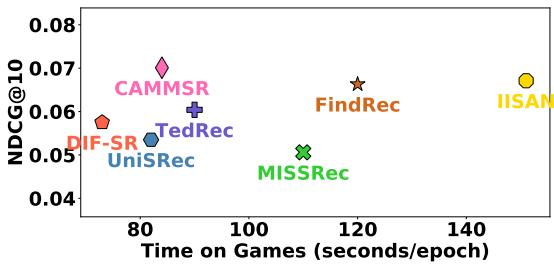

(a) Games  
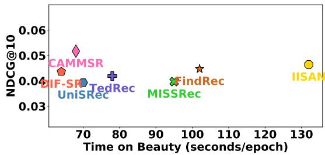  
(b) Beauty  
Fig. 5: Efficiency study on both Games and Beauty datasets.

## G. Case Study (RQ6)

To empirically validate the effectiveness of our proposed category-guided attentive mechanism and its practical implications for passive information management, we conduct a detailed case study using a representative sequence from the Beauty dataset. As shown in Figure 3, we compare the top-1 recommendation generated by CAMMSR against that of IISAN, which achieves the strongest performance among all baseline methods on this dataset. While both models correctly identify the broad product category (CC Cream), CAMMSR uniquely succeeds in recommending the exact ground-truth item that aligns with the user’s underlying preference pattern.

This superior performance can be attributed to our categoryguided attentive MoE framework, which enables more intelligent passive information management through context-aware modality weighting. Our analysis reveals that the ground truth item and the second item in the historical sequence both belong to the ”Premium Beauty” category. Through the auxiliary category prediction task, CAMMSR learns that for high-value cosmetic products, textual descriptions—containing detailed ingredient lists, usage instructions, and quality assurances—carry greater discriminative power than visual appearances alone. This insight mirrors real-world consumer behavior where purchasers of premium beauty products meticulously examine textual details before making decisions.

Consequently, when processing the target sequence, CAMMSR dynamically amplifies the contribution of textual signals through its attentive gating mechanism, effectively filtering out visually similar but semantically mismatched alternatives. This adaptive modality weighting demonstrates how our framework operates as an advanced passive data management system: it automatically discerns and prioritizes the most relevant informational dimensions based on item category and contextual patterns, thereby reducing users’ cognitive burden in navigating complex multimodal content. In contrast, IISAN’s static fusion strategy fails to capture these nuanced category-dependent modality preferences, leading to its recommendation of a visually similar but contextually inappropriate alternative.

This case study concretely illustrates how CAMMSR advances multimodal sequential recommendation beyond conventional fusion strategs. By dynamically aligning modality emphasis with category-specific decision patterns, CAMMSR provides a more sophisticated approach to passive information management—automatically surfacing the most relevant content while filtering peripheral signals, ultimately delivering more precise and contextually appropriate recommendations.

## H. Hyper-parameter Analysis (RQ7)

We further explore the impact of key hyper-parameters on the performance of our CAMMSR. The evaluation results in terms of NDCG@10 are reported in Figure 6.

## I. Performance Comparison w.r.t. K:

We conduct a detailed study on the influence of the number of experts on model performance, as shown in Figure 6(b). The model with 4 experts achieves the best results across all evaluation metrics, outperforming the variant with 1 or 2 experts. This improvement highlights that 1 or 2 experts are insufficient to capture the complex and diverse patterns of cross-modal interactions, whereas 4 experts strike a balance by providing sufficient specialized processing capabilities without imposing significant computational overhead. However, increasing the number of experts to 8 or 16 leads to a decline in performance. This degradation can be attributed to excessive specialization, which introduces redundancy and increases the complexity of the routing mechanism.

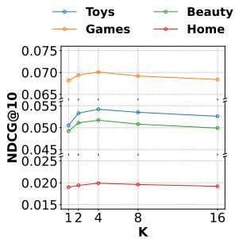  
(a) Hyperparameter K

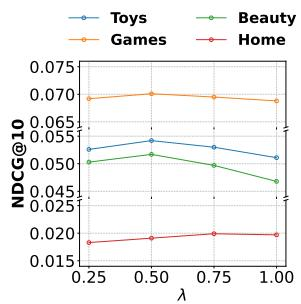  
(b) Hyperparameter λ  
Fig. 6: Performance comparison w.r.t. key hyper-parameters (k and λ) in terms of NDCG@10.

## J. Performance Comparison w.r.t. λ:

We empirically analyze the effect of the weight hyperparameter λ in our CAMMSR model. As shown in Figure 6(a), $\lambda = 0 . 2 5$ is recommended for most datasets, except for the Home dataset, where the optimal setting is $\lambda ~ = ~ 0 . 5$ . We attribute this divergence to the substantially higher sparsity characteristic (99.97%) of the Home dataset, which amplifies the necessity for enhanced cross-modal alignment through more pronounced contrastive learning signals to bridge modality gaps in data-scarce environments.

This robustness to hyper-parameter selection significantly enhances the practical deployability of our framework in realworld data management scenarios, as it reduces the extensive parameter tuning efforts typically required for multimodal systems while maintaining reliable recommendation quality. The observed stability aligns with the requirements of industrialscale recommender systems, where operational consistency and minimal maintenance overhead are crucial considerations for long-term deployment sustainability.

## K. Category Analysis

We further explore how category-guided fusion (CG) can be applied in multi-label category, hierarchical category, and nocategory scenarios. For multi-label category and hierarchical category scenarios, applying various aggregation strategies (mean/max/min pooling) across multiple differences d proves to be a simple yet effective solution. In none category scenario, utilizing LLMs to construct virtual categories presents a promising solution. Specifically, we employ max pooling for scenarios involving multi-label and hierarchical categories. Additionally, we utilize GPT-4o to generate virtual categories for all items based on textual and visual information. To evaluate this approach, we conduct experiments on the Amazon Baby dataset [62], [63], which includes multi-label categories. For the scenario without existing categories, we remove all original categories and generate virtual categories using the same vocabulary as the original dataset. Moreover, to validate the generalization of CG, we utilize the Microlens dataset [64] for further evaluation. Specifically, we employ GPT-4o to generate 10 or 20 virtual categories. Table VII demonstrates that CG consistently achieves performance improvements across all scenarios. For the Microlens dataset, both 10 and 20 virtual categories deliver consistent and comparable performance improvements compared to the w/o CG variant.

TABLE VII: Performance for CAMMSR and w/o CG variant under multi-label category and none category scenarios.

<table><tr><td>Baby</td><td>NDCG@5</td><td>NDCG@10</td><td>MRR@5</td><td>MRR@10</td></tr><tr><td>Multi-label Category</td><td>64.09</td><td>70.28</td><td>55.29</td><td>61.03</td></tr><tr><td>None Category</td><td>62.88</td><td>68.05</td><td>53.11</td><td>58.66</td></tr><tr><td>w/o CG</td><td>57.13</td><td>62.20</td><td>44.13</td><td>48.70</td></tr><tr><td>Microlens</td><td>NDCG@5</td><td>NDCG@10</td><td>MRR@5</td><td>MRR@10</td></tr><tr><td>None Category (10)</td><td>61.40</td><td>65.51</td><td>52.59</td><td>56.91</td></tr><tr><td>None Category (20)</td><td>61.52</td><td>65.48</td><td>52.45</td><td>57.12</td></tr><tr><td>w/o CG</td><td>57.83</td><td>62.21</td><td>46.00</td><td>49.45</td></tr></table>

## VI. CONCLUSION

In this paper, we presented CAMMSR, a novel Categoryguided Attentive Mixture of Experts framework for multimodal sequential recommendation. To address the inherent limitations of static fusion strategies in existing multimodal models, our CAMMSR holistically integrates multimodal content from user behavior sequences and corresponding timestamps, enabling more nuanced and temporally-aware recommendation generation. The core of our framework features a category-guided attentive mixture of experts (CAMoE) module that not only captures specialized item representations from multiple perspectives but also explicitly models the synergistic interactions between different modalities. By dynamically allocating modality weights through an auxiliary category prediction task, our model achieves adaptive fusion of multimodal signals that aligns with both item characteristics and user contextual preferences. Furthermore, the introduced modality swap contrastive learning task effectively strengthens crossmodal alignment and enhances the representation consistency through sequence-level augmentation strategies. Extensive experiments conducted on four real-world datasets demonstrate the effectiveness and efficiency of our proposed CAMMSR.

Looking forward, CAMMSR establishes a flexible foundation for advancing adaptive multimodal recommendation systems. Its capacity to dynamically integrate multimodal signals while preserving cross-modal consistency supports several meaningful extensions, such as generalizing the category guidance to other contextual dimensions, developing more refined synergy modeling approaches, and adapting the framework to sequential decision tasks outside conventional recommendation settings.

## VII. THE USE OF AI

We made limited use of large language models (LLMs) for writing assistance only, including grammar correction, style polishing, and table layout/formatting. All proposed changes were manually reviewed and selectively adopted by the authors. All scientific content, ideas, analysis, and conclusions remain entirely our own. The authors take full responsibility for the entire content of this paper, including any errors or inaccuracies that may remain.

## REFERENCES

[1] J. Xu, Z. Chen, W. Wang, X. Hu, S.-W. Kim, and E. C. Ngai, “Cohesion: Composite graph convolutional network with dual-stage fusion for multimodal recommendation,” in Proceedings of the 48th International ACM SIGIR Conference on Research and Development in Information Retrieval, 2025, pp. 1830–1839.

[2] X. He, K. Deng, X. Wang, Y. Li, Y. Zhang, and M. Wang, “Lightgcn: Simplifying and powering graph convolution network for recommendation,” in Proceedings of the 43rd International ACM SIGIR conference on research and development in Information Retrieval, 2020, pp. 639– 648.

[3] J. Xu, Z. Chen, S. Yang, J. Li, and E. C. Ngai, “The best is yet to come: Graph convolution in the testing phase for multimodal recommendation,” in Proceedings of the 33rd ACM International Conference on Multimedia, 2025, pp. 6325–6334.

[4] Z. Guo, J. Li, G. Li, C. Wang, S. Shi, and B. Ruan, “Lgmrec: Local and global graph learning for multimodal recommendation,” in Proceedings of the AAAI Conference on Artificial Intelligence, vol. 38, no. 8, 2024, pp. 8454–8462.

[5] J. Xu, Z. Chen, S. Yang, J. Li, Z. Wan, H. Wang, W. Liu, Y. Li, and E. C. Ngai, “Vi-mmrec: Similarity-aware training cost-free virtual user-item interactions for multimodal recommendation,” arXiv preprint arXiv:2512.08702, 2025.

[6] Z. Chen, J. Xu, H. Wang, S. Yang, Z. Wan, and H. Hu, “Hypercomplex prompt-aware multimodal recommendation,” in Proceedings of the 34th ACM International Conference on Information and Knowledge Management, 2025, pp. 403–414.

[7] Z. Chen, J. Xu, Y. Wei, and Z. Peng, “Squeeze and excitation: A weighted graph contrastive learning for collaborative filtering,” in Proceedings of the 48th International ACM SIGIR Conference on Research and Development in Information Retrieval, 2025, pp. 2769–2773.

[8] J. Xu, Z. Chen, S. Yang, J. Li, H. Wang, W. Wang, X. Hu, and E. Ngai, “Nlgcl: Naturally existing neighbor layers graph contrastive learning for recommendation,” in Proceedings of the Nineteenth ACM Conference on Recommender Systems, 2025, pp. 319–329.

[9] J. Xu, Z. Chen, J. Li, S. Yang, W. Wang, H. Wang, Y. Li, X. Hu, and E. Ngai, “Dggvae: Dual-granularity graph variational auto-encoder for group recommendation,” ACM Transactions on Information Systems, vol. 44, no. 2, pp. 1–30, 2026.

[10] F. Sun, J. Liu, J. Wu, C. Pei, X. Lin, W. Ou, and P. Jiang, “Bert4rec: Sequential recommendation with bidirectional encoder representations from transformer,” in Proceedings of the 28th ACM international conference on information and knowledge management, 2019, pp. 1441–1450.

[11] W.-C. Kang and J. McAuley, “Self-attentive sequential recommendation,” in 2018 IEEE international conference on data mining (ICDM). IEEE, 2018, pp. 197–206.

[12] Y. Dang, E. Yang, G. Guo, L. Jiang, X. Wang, X. Xu, Q. Sun, and H. Liu, “Ticoserec: Augmenting data to uniform sequences by time intervals for effective recommendation,” IEEE Transactions on Knowledge and Data Engineering, vol. 36, no. 6, pp. 2686–2700, 2023.

[13] X. Du, H. Yuan, P. Zhao, J. Qu, F. Zhuang, G. Liu, Y. Liu, and V. S. Sheng, “Frequency enhanced hybrid attention network for sequential recommendation,” in Proceedings of the 46th International ACM SIGIR conference on research and development in information retrieval, 2023, pp. 78–88.

[14] J. Xu, Z. Chen, S. Yang, J. Li, H. Wang, and E. C. Ngai, “Mentor: multi-level self-supervised learning for multimodal recommendation,” in Proceedings of the AAAI Conference on Artificial Intelligence, vol. 39, no. 12, 2025, pp. 12 908–12 917.

[15] Z. Chen, J. Xu, and H. Hu, “Don’t lose yourself: Boosting multimodal recommendation via reducing node-neighbor discrepancy in graph convolutional network,” in ICASSP 2025-2025 IEEE International Conference on Acoustics, Speech and Signal Processing (ICASSP). IEEE, 2025, pp. 1–5.

[16] J. Xu, Z. Chen, J. Li, S. Yang, W. Wang, X. Hu, R. C.-W. Wong, and E. C. Ngai, “Enhancing robustness and generalization capability for multimodal recommender systems via sharpness-aware minimization,” IEEE Transactions on Knowledge and Data Engineering, 2025.

[17] C. Liu, X. Li, G. Cai, Z. Dong, H. Zhu, and L. Shang, “Noninvasive self-attention for side information fusion in sequential recommendation,” in Proceedings of the AAAI conference on artificial intelligence, vol. 35, no. 5, 2021, pp. 4249–4256.

[18] W. Wei, C. Huang, L. Xia, and C. Zhang, “Multi-modal self-supervised learning for recommendation,” in Proceedings of the ACM Web Conference 2023, 2023, pp. 790–800.

[19] J. Xu, Z. Chen, W. Wang, X. Hu, J. Liu, and E. C. Ngai, “Lobster: Bilateral global semantic enhancement for multimedia recommendation,” Information Fusion, p. 103778, 2025.

[20] J. Wang, Z. Zeng, Y. Wang, Y. Wang, X. Lu, T. Li, J. Yuan, R. Zhang, H.- T. Zheng, and S.-T. Xia, “Missrec: Pre-training and transferring multimodal interest-aware sequence representation for recommendation,” in Proceedings of the 31st ACM International Conference on Multimedia, 2023, pp. 6548–6557.

[21] S. Bian, X. Pan, W. X. Zhao, J. Wang, C. Wang, and J.-R. Wen, “Multimodal mixture of experts represetation learning for sequential recommendation,” in Proceedings of the 32nd ACM International Conference on Information and Knowledge Management, 2023, pp. 110–119.

[22] J. Liang, X. Zhao, M. Li, Z. Zhang, W. Wang, H. Liu, and Z. Liu, “Mmmlp: Multi-modal multilayer perceptron for sequential recommendations,” in Proceedings of the ACM Web Conference 2023, 2023, pp. 1109–1117.

[23] L. Xu, Z. Tian, B. Li, J. Zhang, D. Wang, H. Wang, J. Wang, S. Chen, and W. X. Zhao, “Sequence-level semantic representation fusion for recommender systems,” in Proceedings of the 33rd ACM International Conference on Information and Knowledge Management, 2024, pp. 5015–5022.

[24] Z. Zhang, S. Liu, J. Yu, Q. Cai, X. Zhao, C. Zhang, Z. Liu, Q. Liu, H. Zhao, L. Hu et al., “M3oe: Multi-domain multi-task mixtureof experts recommendation framework,” in Proceedings of the 47th International ACM SIGIR Conference on Research and Development in Information Retrieval, 2024, pp. 893–902.

[25] J. Fu, X. Ge, X. Xin, A. Karatzoglou, I. Arapakis, J. Wang, and J. M. Jose, “Iisan: Efficiently adapting multimodal representation for sequential recommendation with decoupled peft,” in Proceedings of the 47th International ACM SIGIR Conference on Research and Development in Information Retrieval, 2024, pp. 687–697.

[26] B. Hidasi, A. Karatzoglou, L. Baltrunas, and D. Tikk, “Sessionbased recommendations with recurrent neural networks,” arXiv preprint arXiv:1511.06939, 2015.

[27] J. Tang and K. Wang, “Personalized top-n sequential recommendation via convolutional sequence embedding,” in Proceedings of the eleventh ACM international conference on web search and data mining, 2018, pp. 565–573.

[28] J. Li, Y. Wang, and J. McAuley, “Time interval aware self-attention for sequential recommendation,” in Proceedings of the 13th international conference on web search and data mining, 2020, pp. 322–330.

[29] S. M. Cho, E. Park, and S. Yoo, “Meantime: Mixture of attention mechanisms with multi-temporal embeddings for sequential recommendation,” in Proceedings of the 14th ACM Conference on recommender systems, 2020, pp. 515–520.

[30] S. Zhang, L. Chen, C. Wang, S. Li, and H. Xiong, “Temporal graph contrastive learning for sequential recommendation,” in Proceedings of the AAAI Conference on Artificial Intelligence, vol. 38, no. 8, 2024, pp. 9359–9367.

[31] Z. Yuan, F. Yuan, Y. Song, Y. Li, J. Fu, F. Yang, Y. Pan, and Y. Ni, “Where to go next for recommender systems? id-vs. modality-based recommender models revisited,” in Proceedings ofthe 46th International ACM SIGIR Conference on Research and Development in Information Retrieval, 2023, pp. 2639–2649.

[32] Y. Ye, Z. Zheng, Y. Shen, T. Wang, H. Zhang, P. Zhu, R. Yu, K. Zhang, and H. Xiong, “Harnessing multimodal large language models for multimodal sequential recommendation,” arXiv preprint arXiv:2408.09698, 2024.

[33] J. Li, M. Wang, J. Li, J. Fu, X. Shen, J. Shang, and J. McAuley, “Text is all you need: Learning language representations for sequential recommendation,” in Proceedings ofthe 29th ACM SIGKDD Conference on Knowledge Discovery and Data Mining, 2023, pp. 1258–1267.

[34] W. Ji, X. Liu, A. Zhang, Y. Wei, Y. Ni, and X. Wang, “Online distillationenhanced multi-modal transformer for sequential recommendation,” in Proceedings of the 31st ACM International Conference on Multimedia, 2023, pp. 955–965.

[35] Q. Cui, S. Wu, Q. Liu, W. Zhong, and L. Wang, “Mv-rnn: A multiview recurrent neural network for sequential recommendation,” IEEE Transactions on Knowledge and Data Engineering, vol. 32, no. 2, pp. 317–331, 2018.

[36] Y. Hou, S. Mu, W. X. Zhao, Y. Li, B. Ding, and J.-R. Wen, “Towards universal sequence representation learning for recommender systems,” in Proceedings of the 28th ACM SIGKDD Conference on Knowledge Discovery and Data Mining, 2022, pp. 585–593.

[37] H. Hu, W. Guo, Y. Liu, and M.-Y. Kan, “Adaptive multi-modalities fusion in sequential recommendation systems,” in Proceedings of the 32nd ACM International Conference on Information and Knowledge Management, 2023, pp. 843–853.

[38] M. Wang, Y. Xiao, B. Wang, S. Zhang, S. Ye, W. Wang, H. Yin, R. Guo, and Z. Xu, “Findrec: Stein-guided entropic flow for multi-modal sequential recommendation,” in Proceedings of the 31st ACM SIGKDD Conference on Knowledge Discovery and Data Mining V. 2, 2025, pp. 3008–3018.

[39] X. Zhou and Z. Shen, “A tale of two graphs: Freezing and denoising graph structures for multimodal recommendation,” in Proceedings of the 31st ACM International Conference on Multimedia, 2023, pp. 935–943.

[40] J. Xu, Z. Chen, S. Yang, J. Li, W. Wang, X. Hu, S. Hoi, and E. Ngai, “A survey on multimodal recommender systems: Recent advances and future directions,” IEEE Transactions on Multimedia, 2026.

[41] S. Zhang, L. Chen, D. Shen, C. Wang, and H. Xiong, “Hierarchical timeaware mixture of experts for multi-modal sequential recommendation,” arXiv preprint arXiv:2501.14269, 2025.

[42] J. Devlin, M.-W. Chang, K. Lee, and K. Toutanova, “Bert: Pre-training of deep bidirectional transformers for language understanding,” in Proceedings of the 2019 conference of the North American chapter of the association for computational linguistics: human language technologies, volume 1 (long and short papers), 2019, pp. 4171–4186.

[43] A. Dosovitskiy, L. Beyer, A. Kolesnikov, D. Weissenborn, X. Zhai, T. Unterthiner, M. Dehghani, M. Minderer, G. Heigold, S. Gelly et al., “An image is worth 16x16 words: Transformers for image recognition at scale,” in International Conference on Learning Representations, 2020.

[44] J. Xu, L. Sun, and D. Zhao, “Mome: Mixture-of-masked-experts for efficient multi-task recommendation,” in Proceedings of the 47th International ACM SIGIR Conference on Research and Development in Information Retrieval, 2024, pp. 2527–2531.

[45] J. Ma, Z. Zhao, X. Yi, J. Chen, L. Hong, and E. H. Chi, “Modeling task relationships in multi-task learning with multi-gate mixture-of-experts,” in Proceedings of the 24th ACM SIGKDD international conference on knowledge discovery & data mining, 2018, pp. 1930–1939.

[46] W. Cai, J. Jiang, F. Wang, J. Tang, S. Kim, and J. Huang, “A survey on mixture of experts,” arXiv preprint arXiv:2407.06204, 2024.

[47] M. Singh, “Scalability and sparsity issues in recommender datasets: a survey,” Knowledge and Information Systems, vol. 62, no. 1, pp. 1–43, 2020.

[48] C. Wang, H. Zhu, P. Wang, C. Zhu, X. Zhang, E. Chen, and H. Xiong, “Personalized and explainable employee training course recommendations: A bayesian variational approach,” ACM Transactions on Information Systems (TOIS), vol. 40, no. 4, pp. 1–32, 2021.

[49] C. Wang, H. Zhu, C. Zhu, C. Qin, E. Chen, and H. Xiong, “Setrank: A setwise bayesian approach for collaborative ranking in recommender system,” ACM Transactions on Information Systems, vol. 42, no. 2, pp. 1–32, 2023.

[50] H. Du, H. Yuan, P. Zhao, F. Zhuang, G. Liu, L. Zhao, Y. Liu, and V. S. Sheng, “Ensemble modeling with contrastive knowledge distillation for sequential recommendation,” in Proceedings of the 46th International ACM SIGIR Conference on Research and Development in Information Retrieval, 2023, pp. 58–67.

[51] Y. Xie, P. Zhou, and S. Kim, “Decoupled side information fusion for sequential recommendation,” in Proceedings of the 45th international ACM SIGIR conference on research and development in information retrieval, 2022, pp. 1611–1621.

[52] A. Vaswani, N. Shazeer, N. Parmar, J. Uszkoreit, L. Jones, A. N. Gomez, Ł. Kaiser, and I. Polosukhin, “Attention is all you need,” Advances in neural information processing systems, vol. 30, 2017.

[53] J. Zhu, X. Chen, K. He, Y. LeCun, and Z. Liu, “Transformers without normalization,” arXiv preprint arXiv:2503.10622, 2025.

[54] B. Dufumier, J. Castillo-Navarro, D. Tuia, and J.-P. Thiran, “What to align in multimodal contrastive learning?” arXiv preprint arXiv:2409.07402, 2024.

[55] A. v. d. Oord, Y. Li, and O. Vinyals, “Representation learning with contrastive predictive coding,” arXiv preprint arXiv:1807.03748, 2018.

[56] R. He and J. McAuley, “Ups and downs: Modeling the visual evolution of fashion trends with one-class collaborative filtering,” in proceedings of the 25th international conference on world wide web, 2016, pp. 507– 517.

[57] J. Xu, Z. Chen, J. Li, S. Yang, H. Wang, and E. C. Ngai, “Aligngroup: Learning and aligning group consensus with member preferences for group recommendation,” in Proceedings of the 33rd ACM International Conference on Information and Knowledge Management, 2024, pp. 2682–2691.

[58] Z. Yue, Y. Wang, Z. He, H. Zeng, J. McAuley, and D. Wang, “Linear recurrent units for sequential recommendation,” in Proceedings of the 17th ACM international conference on web search and data mining, 2024, pp. 930–938.

[59] W. X. Zhao, S. Mu, Y. Hou, Z. Lin, Y. Chen, X. Pan, K. Li, Y. Lu, H. Wang, C. Tian et al., “Recbole: Towards a unified, comprehensive and efficient framework for recommendation algorithms,” in proceedings of the 30th acm international conference on information & knowledge management, 2021, pp. 4653–4664.

[60] D. P. Kingma and J. Ba, “Adam: A method for stochastic optimization,” arXiv preprint arXiv:1412.6980, 2014.

[61] X. Glorot and Y. Bengio, “Understanding the difficulty of training deep feedforward neural networks,” in Proceedings of the thirteenth international conference on artificial intelligence and statistics. JMLR Workshop and Conference Proceedings, 2010, pp. 249–256.

[62] X. Zhou, “Mmrec: Simplifying multimodal recommendation,” in Proceedings of the 5th ACM International Conference on Multimedia in Asia Workshops, 2023, pp. 1–2.

[63] Y. Ye, Z. Zheng, Y. Shen, T. Wang, H. Zhang, P. Zhu, R. Yu, K. Zhang, and H. Xiong, “Harnessing multimodal large language models for multimodal sequential recommendation,” in Proceedings of the AAAI Conference on Artificial Intelligence, vol. 39, no. 12, 2025, pp. 13 069– 13 077.

[64] Y. Ni, Y. Cheng, X. Liu, J. Fu, Y. Li, X. He, Y. Zhang, and F. Yuan, “A content-driven micro-video recommendation dataset at scale,” in Proceedings of the 34th ACM International Conference on Information and Knowledge Management, 2025, pp. 6486–6491.