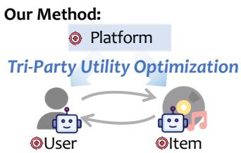

(a) Transition from user-centric to tri-party utility optimization.

User-Centric Optimization

# Breaking User-Centric Agency: A Tri-Party Framework for Agent-Based Recommendation

Yaxin Gong gyx2022@mail.ustc.edu.cn University of Science and Technology of China Hefei, China

Haoyan Liu liuhaoyan@ustc.edu.cn University of Science and Technology of China Hefei, China

Yangyang Li liyangyang@live.com Academy of Cyber Beijing, China

Chongming Gao chongminggao@ustc.edu.cn University of Science and Technology of China Hefei, China

Wenjie Wang wenjiewang96@gmail.com University of Science and Technology of China Hefei, China

Fuli Feng fulifeng93@gmail.com University of Science and Technology of China Hefei, China

Chenxiao Fan simonfan@mail.ustc.edu.cn University of Science and Technology of China Hefei, China

Jianshan Sun sunjs9413@hfut.edu.cn Hefei University of Technology Hefei, China

Xiangnan He xiangnanhe@gmail.com University of Science and Technology of China Hefei, China

## Abstract

Recent advances in large language models (LLMs) have stimulated growing interest in agent-based recommender systems, enabling language-driven interaction and reasoning for more expressive preference modeling. However, most existing agentic approaches remain predominantly user-centric, treating items as passive enti ties and neglecting the interests of other critical stakeholders. This limitation exacerbates exposure concentration and long-tail under representation, threatening long-term system sustainability. In this work, we identify this fundamental limitation and propose the first Tri-party LLM-agent Recommendation framework (TriRec) that explicitly coordinates user utility, item exposure, and platform-level fairness. The framework employs a two-stage architecture: Stage 1 empowers item agents with personalized self-promotion to improve matching quality and alleviate cold-start barriers, while Stage 2 per forms platform-level sequential multi-objective re-ranking, balanc ing user relevance, item utility, and exposure fairness. Experiments show consistent gains in accuracy, fairness, and item-level utility. Moreover, we find that item self-promotion can simultaneously enhance fairness and efectiveness, challenging the conventional trade-of assumption between relevance and fairness. Our code is available at https://github.com/Marfekey/TriRec.

CCS Concepts • Information systems → Recommender systems.

## Keywords

Agent-Based Recommendation, Item Agency, Multi-Stakeholder Recommendation, Item Self-Promotion

## ACM Reference Format:

Yaxin Gong, Chongming Gao, Chenxiao Fan, Haoyan Liu, Wenjie Wang, Jianshan Sun, Yangyang Li, Fuli Feng, and Xiangnan He. 2018. Breaking User-Centric Agency: A Tri-Party Framework for Agent-Based Recommendation. In Proceedings of Make sure to enter the correct conference title from your rights confirmation email (Conference acronym ’XX). ACM, New York, NY, USA, 12 pages. https://doi.org/XXXXXXX.XXXXXXX

Traditional Method: Optimized utility

Our Method: Platform

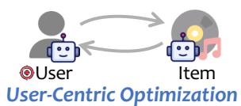

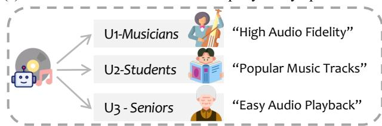

## 1 Introduction

Large language models (LLMs) have demonstrated remarkable ca pabilities across a wide range of domains [20, 29, 30, 47], fun damentally reshaping how intelligent decision-making systems reason [36, 53] and interact with users [28, 52]. In recommender systems, these advances have stimulated growing interest in LLM based agent paradigms, where agents model user behaviors through language-driven interaction and reasoning [4, 43], enabling more expressive and interpretable preference representations compared to traditional collaborative filtering approaches [2, 32, 42].

However, despite these promising developments, most existing agent-based recommender methods largely mirror human-centered decision-making patterns [16, 49] and adopt a predominantly user centric modeling paradigm [21, 31, 33, 39]. They primarily opti mize user utility while treating items as passive functional entities [40, 45], thereby failing to adequately account for the interests of other critical stakeholders, such as content providers and platform operators [3, 28, 34, 44]. Such a user-centric decision paradigm is inherently unsustainable in multi-sided marketplaces. In particular, the pervasive Matthew efect concentrates exposure on already popular items [10], leaving long-tail creators with limited visibility [12, 51]. This imbalance weakens creator incentives, leading to creator churn and a subsequent decline in high-quality content production [7]. Moreover, excessive optimization for short-term user engagement exacerbates a winner-take-all dynamic, gradually homogenizing the content pool. Ultimately, this erosion of supply side diversity undermines user experience and harms the platform’s long-term ecosystem health.

Although some recent methods introduce item agents or content agents [19, 41, 43, 44], these agents typically function only as information carriers or attribute descriptors. Their role remains largely auxiliary, serving to better satisfy user preferences rather than actively pursuing reasonable exposure or long-term benefits on behalf of the items themselves.

To address this limitation at its root, we propose a Tri-party LLM-agent Recommendation framework (TriRec) that explicitly aligns the interests of users, items, and the platform, as illustrated in Figure 1. The framework adopts a disentangled two-stage ar chitecture that preserves user experience while empowering items with agency to actively compete for exposure through personalized self-promotion. At the platform level, global ranking is further regu lated by incorporating system-level constraints, ensuring long-term fairness and ecosystem stability.

Stage 1: Generative item self-promotion. We empower item agents with the capability to actively compete for visibility. Items are no longer passive candidates; instead, they become active partic ipants by generating personalized promotion tailored to the target user’s interest preference. For example, the same CD player might emphasize “high audio fidelity” to musicians, “popular tracks” to students, and “easy audio playback” to seniors. This mechanism not only improves matching quality but also provides long-tail items with opportunities to gain exposure.

Stage 2: Platform-led multi-objective re-ranking. After Stage 1 generates a high-quality candidate list, the platform performs sequential re-ranking to balance multiple objectives. Specifically, for each candidate item, the platform re-ranker considers immediate user relevance, platform-level fairness and expected item utility. The platform makes ranking decisions one position at a time; this sequential strategy ensures that ranking choices consider both current item exposure and long-term fairness.

Notably, incorporating item self-promotion led to an increase in both the average exposure and click-through probability of items, while simultaneously improving platform-level fairness. At the same time, the introduction of personalized persuasive content enhanced recommendation accuracy on the user side. These results demonstrate that our framework can simultaneously support the objectives of users, items, and the platform.

Our main contributions are as follows:

• We identify fundamental limitations of user-centric modeling in recommender systems and introduce the first tri-party LLMagent recommendation framework that explicitly coordinates users, items, and the platform through agent-based regulation of exposure and fairness.

• We propose a two-stage pipeline consisting of (i) item-side personalized self-promotion to endow items with agency and alleviate cold-start efects, and (ii) platform-led multi-objective re-ranking with exposure modulation to balance tri-party interests.

• Experiments validate the superiority of TriRec over existing baselines in enhancing accuracy, fairness, and item utility, and further show that item self-promotion can simultaneously enhance fairness and efectiveness, challenging the conventional trade-of assumption.

## 2 Related Work

## 2.1 LLM-based Agentic Recommendation

The remarkable reasoning capabilities of LLMs have fundamentally reshaped intelligent decision-making, stimulating a surge of interest in LLM-based agent paradigms within recommender systems [13, 28]. Unlike traditional filtering, these agents model complex behaviors through language-driven reasoning, enabling more expressive preference representations [44, 48].

Within this research frontier, a prominent direction utilizes agents as high-fidelity surrogates to simulate human behavior [3, 47]. Frameworks like Agent4Rec [42] and DyTA4Rec [33] incorporate sociological traits and dynamic profile updates to capture user interest evolution. To ensure long-term sustainability, the PUMA framework [50] enables eficient migration of personalized prompt assets across evolving model architectures. Beyond simulation, agents function as intelligent interfaces to improve decision quality through deliberate reasoning [16, 31, 39]. Methods such as STARec [34] and ReasonRec [45] incorporate reasoning mechanisms to mitigate hallucinations and enhance robustness, while LatentR3 [46] further optimizes eficiency by utilizing reinforced latent tokens instead of explicit text generation.

Meanwhile, decentralized multi-agent architectures decompose complex tasks into specialized roles or model bidirectional dynamics [21, 32, 41]. Frameworks like AgentCF [44] and Rec4Agentverse [43] introduce item agents to interact autonomously with user agents for preference refinement. To address the long-term impact of these interactions, the bi-learning planner [24] coordinates macro-level guidance for sustained engagement. However, existing multi-agent paradigms primarily focus on maximizing one-sided user utility while neglecting the interests of the items. In this work, we propose a novel framework that explicitly models item agents and equips them with the ability to advocate for their own visibility, while maintaining alignment with user preferences.

## 2.2 Creator-side Recommendation

User-centric recommendation often causes most exposure to go to a few popular items, leaving many creators and their content invisible. This lack of visibility hinders the creator experience, ultimately leading to a decline in content production and platform engage ment [6, 7]. Early methodologies primarily utilized co-learning frameworks to synchronize user and provider representations [6], or developed specific mechanisms like PRINCE [14] to provide counterfactual interpretability for the provider side.

Recently, researchers have explored "mirroring" user-centric techniques, with models such as DualRec [7] treating items as active queries to identify suitable users and tackle the user availability challenge in dual-target optimization. Concurrently, generative approaches such as HLLM-Creator [5] have begun leveraging LLMs to produce personalized creative content, thereby enhancing item appeal through automated content augmentation. FlyThinker [26] further advances this by enabling reasoning and generation to proceed concurrently, allowing for the dynamic guidance of long-form per sonalized responses. However, these frameworks still view creators as passive targets for algorithmic optimization or static subjects of content generation, lacking explicit modeling of autonomous agency. Diferent from these passive approaches, our work empow ers creators with agentic capabilities, enabling tailored promotion of their content to users.

## 2.3 Platform Fair Ranking

The pervasive Matthew efect in recommendation leads to exposure concentration, leaving vast long-tail products invisible and causing cold-start problems [25, 37]. Consequently, platforms must implement systematic interventions to reconcile the trade-of between accuracy and multi-stakeholder fairness [35]. Classical research ad dresses this by formulating exposure allocation as a constrained op timization problem [23, 25] or by learning debiased representations [22, 35] to neutralize provider-side biases. Beyond static debiasing, SPRec [10] introduces self-play mechanisms to iteratively mitigate filter bubbles and improve fairness without additional data.

Another dominant paradigm utilizes post-hoc re-ranking to achieve equitable resource distribution via social welfare criteria. To account for temporal dynamics, models like LTP-MMF [38] intro duce mechanisms to mitigate the deleterious feedback loop efect. Similarly, the bi-learning planner [24] utilizes LLMs to manage macro-level guidance for optimizing long-term user engagement. Recently, multi-agent social choice frameworks, such as SCRUF-D [1], introduce agents to arbitrate conflicting fairness criteria. While these methods move toward decentralized decision-making, they struggle to perceive fine-grained item-level signals. In this work, we formulate platform regulation as a re-ranking problem that enables adaptive coordination of relevance, fairness, and item exposure utility.

## 3 Problem Formulation

We formally model the recommendation problem addressed by TriRec from a multi-stakeholder and agentic perspective. Unlike conventional settings that optimize user relevance alone, our framework explicitly accounts for the potentially conflicting objectives of users, items, and the platform, and introduces the agent-based preference interaction mechanism underlying Stage 1 candidate construction.

## 3.1 Multi-Stakeholder Utility Modeling

While agent-based interaction enables flexible modeling of user preferences, real-world recommendation systems inherently involve multiple stakeholders with competing objectives. To formalize this multi-stakeholder setting, we define utility functions for users, items, and the platform, which together characterize the overall optimization target of the recommendation process.

• User Utility. Users primarily seek high relevance and engagement quality [48]. At the platform stage, we define the user-side utility on a per-item basis:

$$
U _ {\text { user }} (u, i) = r (u, i),\tag{1}
$$

where $r ( u , i )$ denotes the predicted relevance score produced by the user agent.

• Item Utility. Items aim to obtain efective exposure and longterm visibility across recommendation opportunities. We quantify the realized item-side gain $U _ { \mathrm { i t e m } }$ using the Expected Item Utility (EIU):

$$
E I U (u, i) = v (\mathrm{rank} _ {u} (i)) \cdot \mathrm{CTR} (u, i),\tag{2}
$$

where ?? (·) models position-dependent exposure probability following a logarithmic decay, and $\mathrm { C T R } ( u , i )$ denotes the predicted click-through probability. In our implementation, $\operatorname { C T R } ( u , i )$ is estimated by applying a sigmoid transformation to the cosine similarity between user and item semantic embeddings. The cumulative item utility is aggregated across users and sequential recommendation rounds.

• Platform Utility. The platform aims to regulate exposure allocation and mitigate group-level bias across the recommended items. We denote the platform utility as $U _ { \mathrm { p l a t f o r m } } ( \Pi )$ , where Π aggregates ranking outcomes over users and time. In practice, platform-level fairness is quantified using Distributional Group Unfairness (DGU) and Maximal Group Unfairness (MGU) [11], which measure the discrepancy between the exposure distribution of item groups in top-?? recommendation results and their historical distribution in the training data.

Based on the above utility definitions, the overall recommendation process in TriRec is realized through a two-stage agentic pipeline. Specifically, Stage 1 focuses on constructing relevanceoriented candidate rankings by modeling fine-grained user–item semantic alignment via agent-based interaction and personalized item self-promotion. This stage produces a high-quality preference backbone without introducing exposure regulation.

Stage 2 then operates on top of the Stage 1 outputs by treating recommendation as a sequential control problem. The platform reranker observes the system state, including historical exposure and relevance rankings, and performs state-aware re-ranking actions to jointly optimize user utility, item exposure utility, and platform level fairness over time.

This decoupled design enables TriRec to separate semantic pref erence modeling from long-term exposure regulation, while main taining a closed-loop decision process that dynamically adapts to evolving system states.

## 3.2 Agent-based Preference Interaction

Following AgentCF [44], we adopt an agent-based recommendation paradigm to model fine-grained user–item preference alignment.

AgentCF-style interaction training is used to construct and refine preference representations for both users and items. Through ofline replay of historical user–item interaction episodes, user agents gradually accumulate preference memory, while item agents build item-side semantic memory that captures their appeal patterns across diferent user groups. These interaction-induced preference states are stored in internal memory modules and serve as the foundation for downstream inference.

Formally, let U denote the set of user agents and I denote the set of item agents. Each user agent $u \in \mathcal { U }$ maintains a preference memory $\mathcal { M } _ { u }$ , which is summarized into a user interest representation $\mathbf { z } _ { u } .$ . Each item agent $i \in \mathcal { I }$ maintains an item-side memory $M _ { i }$ together with structured item metadata representation $\mathbf { x } _ { i }$

Given a user agent ?? and a candidate item set $C _ { u } = \{ c _ { 1 } , . . . , c _ { n } \}$ the goal of Stage 1 is to generate a relevance-oriented ranking list by modeling semantic interactions between agents.

The user agent evaluates candidate items based on their gen erated semantic descriptions and its preference memory to form ranking decisions. This interaction process is implemented through a fixed LLM-based inference function:

$$
\mathcal {Y} _ {u} ^ {(1)} = f _ {\mathrm{LLM}} (u, \mathcal {C} _ {u}),\tag{3}
$$

where $f _ { \mathrm { L L M } } ( \cdot )$ denotes the agent interaction module that outputs an ordered list $y _ { u } ^ { ( 1 ) }$ via multi-round semantic reasoning.

Consistent with AgentCF, we keep the underlying LLM parameters frozen during both memory construction and inference. The ranking behavior is therefore governed by structured interaction protocols and contextual reasoning over agent memory states, rather than gradient-based parameter updates.

In our framework, we further extend this interaction layer by enabling item agents to actively generate user-conditioned selfpromotion, which will be formally described in the following section.

## 4 Method

Figure 2 provides an overview of the proposed TriRec framework. The framework is composed of two sequential modules: a user–item interaction module for generative personalized self-promotion and a platform control module for exposure-aware re-ranking. Both modules operate entirely at inference time with frozen LLM pa rameters, building upon the agent memory constructed during the preference interaction phase described in §3.2. We next describe the design and implementation details of each component.

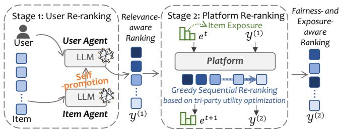  
Figure 2: Overview of the proposed two-stage TriRec framework, where Stage 1 performs relevance-aware re-ranking via user–item interaction, and Stage 2 conducts exposureaware re-ranking through tri-party utility optimization.

## 4.1 Generative Personalized Self-Promotion

As shown in the left part of Figure 2, Stage 1 models both item agents and user agents, and leverages LLMs to drive their interest expression and interaction behaviors.

Unlike conventional approaches that model items as static feature vectors, we endow item agents with proactive expressive capability. Given a target user $u \in \mathcal { U } ,$ the item agent generates a personalized self-promotion as follows:

$$
S _ {i \rightarrow u} = \mathcal {G} _ {\theta} (\mathbf {x} _ {i}, \mathbf {z} _ {u}, \mathcal {M} _ {i}),
$$

where $\mathcal { G } _ { \theta }$ denotes a frozen pre-trained LLM with fixed parameters $\theta ,$ x?? represents item metadata, $\mathbf { z } _ { u }$ denotes the user interest representation, and $\mathcal { M } _ { i }$ is the memory state of the item agent.

Importantly, the item metadata $\mathbf { x } _ { i }$ used as input consists solely of static attributes $( \mathrm { e . g . }$ , title, category, and descriptive features) and does not contain any test interaction signals, ensuring no information leakage. Furthermore, the generation prompt explicitly instructs the LLM to ground its output in the provided metadata, preventing fabrication of nonexistent item properties.

This mechanism allows items with very limited historical interactions to actively convey their potential value through high-quality semantic descriptions, thereby alleviating the cold-start problem.

Instead of relying on an explicit parametric scoring function, the user agent performs semantic preference reasoning over item selfpresentations generated by item agents. Formally, given a candidate item set $C _ { u }$ and their corresponding self-promotions $\{ S _ { i \to u } \} _ { i \in C _ { u } }$ the user agent produces a relevance-oriented ranking by

$$
\mathcal {Y} _ {u} ^ {(1)} = \mathrm{argsort} _ {i \in C _ {u}} \mathcal {F} _ {\phi} (\mathbf {z} _ {u}, S _ {i \to u}),\tag{4}
$$

where $\mathcal { F } _ { \phi } ( \cdot )$ denotes the LLM-based semantic preference evaluator with fixed parameters $\phi .$

This formulation enables the user agent to jointly consider personalized interest representations and item-side expressive content, allowing preference judgments to be conditioned on both intrinsic user tastes and context-aware item descriptions. This decision process forms a state-aware perception–decision–action loop, where the user agent perceives item-side semantic signals, updates preference judgments conditioned on its internal state, and outputs relevance-driven ranking actions.

In practice, since each item agent generates its self-promotion independently conditioned on the target user, all candidates in $C _ { u }$ can be processed via concurrent API calls, making the wall-clock latency largely independent of the candidate set size.

This agent-based interaction stage is intentionally restricted to relevance-oriented preference alignment. No exposure modulation or fairness constraints are injected at this stage, ensuring that the produced ranking reflects high-quality semantic matching. This separation allows the subsequent platform re-ranker to perform exposure-aware regulation on top of a stable relevance backbone.

## 4.2 Platform-Led Multi-Objective Re-Ranking

Although Stage 1 produces relevance-oriented rankings via agent interaction, it does not explicitly regulate long-term exposure allo cation across items. We therefore introduce a platform re-ranking module ${ \mathcal { A } } _ { p }$ that performs state-aware sequential re-ranking to balance user utility, item utility, and platform-level fairness.

We model the platform module as a sequential decision process operating on a dynamic system state.

Exposure as a Control State. In real-world recommendation systems, the platform cannot directly control user feedback such as clicks or purchases, but can explicitly regulate item visibility through ranking positions and display frequency. Therefore, we adopt exposure as the core system state to characterize the cumu lative visibility of each item across sequential recommendation rounds.

Moreover, exposure exhibits strong temporal dependency and accumulation efects, which can lead to long-term popularity bias if left uncontrolled. Modeling exposure as a dynamic state variable allows the platform to explicitly track historical allocation and perform state-aware re-ranking decisions that balance immediate utility and long-term fairness.

State Representation. At time step ??, when user $u _ { t }$ arrives, the platform observes the current system state:

$$
\mathbf {s} _ {t} = \{\mathbf {e} ^ {t}, \mathcal {Y} _ {u _ {t}} ^ {(1)} \},\tag{5}
$$

where $\mathbf { e } ^ { t } = [ e _ { i } ^ { t } ] _ { i \in J }$ denotes the historical exposure vector of all candidate items $\tau _ { \ast }$ and $y _ { u _ { t } } ^ { ( 1 ) }$ is the relevance-oriented ranking list generated by the Stage 1 agent interaction module.

Action Space. Given the observed state $\mathbf { s } _ { t } ,$ , the platform selects an action by re-ranking the Stage 1 list:

$$
\mathcal {Y} _ {u _ {t}} ^ {(2)} = \mathcal {A} _ {p} (\mathbf {s} _ {t}),\tag{6}
$$

where $y _ { u _ { t } } ^ { ( 2 ) }$ denotes the final recommendation list served to user $u _ { t } .$

State Transition. Given the platform re-ranking action $y _ { u _ { t } } ^ { ( 2 ) } =$ $\left[ i _ { 1 } , i _ { 2 } , \ldots , i _ { K } \right]$ , the exposure state is updated based on position dependent visibility gain:

$$
e _ {i} ^ {t + 1} = \left\{ \begin{array}{l l} e _ {i} ^ {t} + v (k), & \text {if i = i_{k} \in \mathcal {Y} _{u_{t}} ^{(2)}}, \\ e _ {i} ^ {t}, & \text {otherwise,} \end{array} \right.\tag{7}
$$

where $k = \mathrm { r a n k } _ { y _ { u t } ^ { \left( 2 \right) } } \left( i \right)$ denotes the 1-based display position of item ?? in the ranked list, and $v ( \cdot )$ denotes a monotonically decaying exposure function.

In our implementation, we adopt logarithmic decay:

$$
v (k) = \frac {1}{\log_ {2} (k + 2)},\tag{8}
$$

so that items placed at higher ranks receive larger exposure increments, reflecting the well-established position bias phenomenon [17] that higher-ranked items attract more user attention and interaction opportunities.

Note that $v ( \cdot )$ serves a dual role in our framework: it defines both the exposure state transition $( \mathrm { E q . ~ } 7 )$ and the position-dependent weight $\omega _ { k }$ used in the participation policy (Eq. 14). We compare alternative decay profiles in §5.3.

This formulation assumes that only displayed items receive exposure gain, while non-displayed items retain their historical exposure levels, and allows the platform to explicitly regulate exposure allocation through re-ranking.

Platform Optimization Objective. Over a sequence of user arrivals, the platform aims to maximize long-term multi-stakeholder utility by coordinating user relevance, item utility, and platformlevel fairness.

We decompose the objective into a per-item joint utility function $U _ { \mathrm { j o i n t } } ( u _ { t } , i , k , \mathbf { e } ^ { t } )$ , which measures the marginal contribution of placing item ?? at position ?? for user $u _ { t }$ under exposure state $\mathbf { e } ^ { t } .$

Formally, given a time horizon $T ,$ the objective is defined as:

$$
\max _ {\{\mathcal {Y} _ {u _ {t}} ^ {(2)} \} _ {t = 1} ^ {T}} \frac {1}{T} \sum_ {t = 1} ^ {T} \sum_ {k = 1} ^ {| \mathcal {Y} _ {u _ {t}} ^ {(2)} |} U _ {\mathrm{joint}} (u _ {t}, i, k, \mathbf {e} ^ {t}),\tag{9}
$$

where $y _ { u _ { t } } ^ { ( 2 ) }$ denotes the platform re-ranked list served to user $u _ { t }$ at time step ?? .

4.2.1 State-Aware Joint Utility Scoring. Since directly optimizing the induced listwise objective is intractable—the combinatorial search space grows as $O ( | C | ! / ( | C | - K ) ! )$ for a candidate set of size |C | and list length $K ,$ making exact enumeration computationally prohibitive—we approximate it using a position-aware marginal joint utility function.

Specifically, we define the position-conditioned joint utility as:

$$
U _ {\mathrm{joint}} (u _ {t}, i, k, \mathbf {e} ^ {t}) = g (u _ {t}, i, k, \mathbf {e} ^ {t}) \cdot U _ {\mathrm{expo-item}} (u _ {t}, i, k),\tag{10}
$$

where $g ( u _ { t } , i , k , \mathbf { e } ^ { t } )$ captures the immediate relevance–fairness trade of at ranking position $k ,$ and $U _ { \mathrm { e x p o - i t e m } } ( u _ { t } , i , k )$ denotes the exposureaware item utility modulator that incorporates long-term visibility regulation.

Relevance–Fairness Gain Function. We compute relevance– fairness gain by combining normalized user and platform utility signals through a position-aware convex weighting scheme:

$$
g (u _ {t}, i, k, \mathbf {e} ^ {t}) = \alpha_ {k} \cdot \tilde {U} _ {\mathrm{user}} (u _ {t}, i) + (1 - \alpha_ {k}) \cdot \tilde {U} _ {\mathrm{platform}} (i, \mathbf {e} ^ {t}),\tag{11}
$$

where $\alpha _ { k } \in [ 0 ,$ 1] controls the relative participation of platformlevel regulation at rank position $k ,$ and $\tilde { U } _ { \mathrm { u s e r } }$ and $\tilde { U } _ { \mathrm { p l a t f o r m } }$ denote the normalized versions of the corresponding utility signals, rescaled to the same range for stable convex combination.

For numerical stability and scale consistency, all heterogeneous utility signals are normalized within the candidate set at each time step. We use $\tilde { U } _ { ( \cdot ) }$ to denote the normalized versions of the corresponding raw utility signals.

User Utility Modeling. The user-side utility is computed via a multiplicative interaction mechanism that combines semantic reasoning and embedding-level relevance:

$$
U _ {\mathrm{user}} (u _ {t}, i) = r _ {\mathrm{LLM}} (u _ {t}, i),\tag{12}
$$

where $r _ { \mathrm { L L M } } ( u _ { t } , i )$ denotes the preference intensity predicted by the user agent through multi-round semantic reasoning. The resulting scores are normalized across the candidate set to obtain $\tilde { U } _ { \mathrm { u s e r } }$

Platform Utility Modeling. The platform utility term aggregates normalized marginal fairness gains:

$$
\tilde {U} _ {\mathrm{platform}} (i, \mathbf {e} ^ {t}) = \lambda_ {1} \cdot \tilde {U} _ {\mathrm{DGU}} (i, \mathbf {e} ^ {t}) + \lambda_ {2} \cdot \tilde {U} _ {\mathrm{MGU}} (i, \mathbf {e} ^ {t}),\tag{13}
$$

where $\tilde { U } _ { \mathrm { D G U } }$ and $\tilde { U } _ { \mathrm { M G U } }$ denote normalized marginal improvements on Distributional Group Unfairness and Maximal Group Unfairness, respectively. Specifically, for each candidate item ??, we compute the marginal fairness gain by simulating its placement at the current position: the exposure distribution is tentatively updated as ${ \mathbf { e } } ^ { t ^ { \prime } } =$ $\mathbf e ^ { t } + v ( k ) \cdot \mathbf 1 _ { i }$ , and the resulting reduction in DGU (or MGU) relative to the current state is taken as the marginal improvement, $\mathrm { i . e . }$ $U _ { \mathrm { D G U } } ( i , { \bf e } ^ { t } ) \ = \ \mathrm { D G U } ( { \bf e } ^ { t } ) \ - \ \mathrm { D G U } ( { \bf e } ^ { t ^ { \prime } } )$ . The coeficients $\lambda _ { 1 }$ and $\lambda _ { 2 }$ control the relative importance of the two fairness objectives.

Position-Aware Participation Policy. To regulate the intervention strength along the ranked list, we design a monotonic position-dependent policy:

$$
\alpha_ {k} = \alpha_ {\mathrm{min}} + (\alpha_ {\mathrm{max}} - \alpha_ {\mathrm{min}}) \cdot (\omega_ {k}) ^ {p},\tag{14}
$$

where $\boldsymbol { p }$ controls the decay curvature, $\alpha _ { \mathrm { { m i n } } }$ and $\alpha _ { \mathrm { m a x } }$ define the lower and upper bounds, and $\omega _ { k } \in [ 0 , 1 ]$ is a position-dependent weight derived from the same exposure decay profile ?? (·) used in the state transition function Eq. 8, with larger values corresponding to higher-ranked positions.

This design prioritizes user relevance at top-ranked positions while gradually injecting platform-level regulation toward lower ranks, enabling a controllable relevance–fairness trade-of.

Exposure-Aware Item Utility. Given that the ranking position is explicitly determined during sequential construction, we rewrite item-side utility defined in Eq. 2 as:

$$
U _ {\mathrm{item}} (u _ {t}, i, k) = v (k) \cdot \mathrm{CTR} (u _ {t}, i),\tag{15}
$$

where ?? (??) models position-dependent exposure probability and $\mathrm { C T R } ( u _ { t } , i )$ denotes the predicted click-through probability:

$$
\operatorname{CTR} (u _ {t}, i) = \sigma \left(\operatorname{sim} _ {\text { emb }} \left(\mathbf {z} _ {u _ {t}}, \mathbf {h} _ {i}\right)\right),\tag{16}
$$

where $\sigma ( \cdot )$ is the sigmoid function, $\mathrm { s i m } _ { \mathrm { e m b } } ( \cdot )$ represents cosine similarity between the user interest embedding $\mathbf { z } _ { u _ { t } }$ and the item semantic embedding h??.

To incorporate long-term exposure regulation, we define the exposure-aware item utility as

$$
U _ {\mathrm{expo-item}} (u _ {t}, i, k) = \left(\tilde {U} _ {\mathrm{item}} (u _ {t}, i, k)\right) ^ {\lambda_ {\mathrm{item}}},\tag{17}
$$

where $\tilde { U } _ { \mathrm { i t e m } }$ denotes item utility within the candidate set at each ranking step, and $\lambda _ { \mathrm { i t e m } }$ controls the sensitivity of the platform reranking to item-side exposure utility.

This formulation allows the platform to amplify under-exposed items with high potential value while suppressing over-saturated content, thereby mitigating long-term exposure concentration.

4.2.2 Greedy Sequential Action Generation. In implementation, Eq. 9 is approximated via greedy list construction performed independently for each incoming user request, while the exposure state $\mathbf { e } ^ { t }$ is carried over across recommendation rounds, efectively realizing a one-step approximation of the long-term control objective. We note that this myopic approximation does not guarantee globally optimal long-term behavior; however, carrying persistent exposure state across rounds provides implicit temporal coordination that empirically yields strong multi-stakeholder performance (see §5).

Due to the position-dependent nature of $U _ { \mathrm { j o i n t } } ( u _ { t } , i , k , \mathbf { e } ^ { t } )$ , the final ranking list is constructed in a top-down manner, where items are greedily selected and fixed from higher-ranked positions to lower-ranked ones.

Specifically, at ranking position ??, the platform re-ranker selects:

$$
i _ {k} ^ {*} = \arg \max _ {i \in C _ {u _ {t}} \backslash \mathcal {Y} _ {<   k}} U _ {\mathrm{joint}} (u _ {t}, i, k, \mathbf {e} ^ {t}),\tag{18}
$$

where $y _ { < k } = \{ i _ { 1 } ^ { * } , \ldots , i _ { k - 1 } ^ { * } \}$ denotes the prefix list containing the previously selected top-?? − 1 items.

This sequential construction explicitly accounts for positionaware utility modulation and enables eficient approximation of the underlying listwise optimization objective. This greedy sequential construction thus serves as the concrete policy implementation of the platform re-ranking module, mapping observed states to ranking actions under the defined utility objective.

Although greedy construction is not globally optimal, it is widely adopted in practical re-ranking systems due to its eficiency and strong empirical performance. Notably, this re-ranking step involves only closed-form arithmetic operations over the candidate set, making it computationally negligible.

4.2.3 Platform Re-Ranking as a Closed-Loop Decision Process. Finally, we explicitly formulate the platform module as a sequential control process:

$$
\mathcal {A} _ {p} = \langle \mathcal {S}, \mathcal {A}, \mathcal {T} \rangle ,\tag{19}
$$

where the state space $s$ consists of the historical exposure vector $\mathbf { e } ^ { t }$ and the Stage 1 relevance ranking $y _ { u _ { t } } ^ { ( 1 ) }$ ; the action space A corresponds to the re-ranking decision $y _ { u _ { t } } ^ { ( 2 ) }$ ; and the transition function $\mathcal { T }$ is defined by the exposure update rule in $\operatorname { E q . 7 }$

This formulation enables the platform to perform adaptive, stateaware re-ranking that dynamically balances user relevance, item exposure opportunity, and platform-level fairness over sequential recommendation rounds.

## 5 Experiments

In this section, we conduct experiments to address the following research questions:

• RQ1: How does TriRec perform in terms of accuracy, fairness, and expected item utility compared to existing methods?

• RQ2: What are the individual contributions of key components and design choices to the final performance?

• RQ3: How do key hyperparameters afect the trade-of among tri-party interests?

• RQ4: How efective is the item self-promotion mechanism in Stage 1 at improving the ranking of cold-start items?

## 5.1 Experimental Setup

5.1.1 Dataset. We conduct experiments on four real-world datasets from three sources: Amazon1, Steam2, and Goodreads3. From Amazon, we use the CDs & Vinyl and Movies & TV categories and from Goodreads, we focus on the Young Adult (YA) subdo main. Table 1 summarizes the dataset statistics. Following standard practice, we retain only positive interactions (rating ≥ 4) and filter for users with 10 to 100 interactions to ensure suficient preference signals while excluding anomalous accounts. All items are encoded with a pre-trained Sentence-BERT model [9] to obtain semantic embeddings.

Table 1: Statistics of the datasets. Full represents the original scale, and Processed denotes the refined subset used for our tri-party agentic recommendation experiments.

<table><tr><td>Datasets</td><td>#Items</td><td>#Inters.</td><td>Sparsity</td></tr><tr><td>CDs &amp; Vinyl (Full)</td><td>701,673</td><td>4,827,273</td><td>99.99%</td></tr><tr><td>- Processed</td><td>33,042</td><td>41,901</td><td>99.93%</td></tr><tr><td>Movies &amp; TV (Full)</td><td>747,764</td><td>17,328,314</td><td>99.99%</td></tr><tr><td>- Processed</td><td>27,407</td><td>40,907</td><td>99.92%</td></tr><tr><td>Goodreads YA (Full)</td><td>93,398</td><td>34,919,254</td><td>99.94%</td></tr><tr><td>- Processed</td><td>10,786</td><td>60,743</td><td>99.71%</td></tr><tr><td>Steam Games (Full)</td><td>15,474</td><td>7,793,069</td><td>99.98%</td></tr><tr><td>- Processed</td><td>6,635</td><td>36,006</td><td>99.72%</td></tr></table>

5.1.2 Baselines. We compare TriRec with three groups of state-ofthe-art models:

• Agent-based User-Centric: AgentCF++ [19] and MACRec [32]. AgentCF++ extends AgentCF with memory-enhanced LLM-based agent interactions; we adopt its single-domain configuration. MACRec employs multi-agent collaboration for recommendation. Both optimize exclusively for user relevance.

• Creator-Side Focus: Rec4Agentverse [43], which introduces item agents for autonomous interaction, and DualRec [7], which treats items as active queries in a dual-market setting. These methods model item-side dynamics but lack explicit exposure optimization or active self-promotion.

• Platform Fairness Re-ranking: SCRUF-D [1], a multi-agent social choice framework for fairness arbitration, and LTP-MMF [38], which optimizes long-term provider max-min fairness under feedback loops. Both inject fairness constraints at the platform level through post-hoc re-ranking.

5.1.3 Evaluation Protocol. We evaluate recommendation perfor mance from three stakeholder perspectives: (1) User accuracy: NDCG@K (K=5) and MRR, measuring the ranking quality of recom mended lists against ground-truth interactions. (2) Item utility: Ex pected Item Utility (EIU, Eq. 2), quantifying the position-weighted click propensity aggregated across users. (3) Platform fairness: DGU@K and MGU@K [11] (K=10), measuring distributional and worst-case group-level exposure disparity, respectively. Items are partitioned into eight equal-sized popularity-based groups following common practice.

5.1.4 Candidate Construction. We adopt a leave-one-out evaluation protocol, using each user’s most recent interaction as the test item and the remainder for training. For each test instance, we construct the candidate set with 1 ground-truth item and ?? negative samples. Unlike prior work [44] that samples negatives uniformly at random, we adopt a hard negative sampling strategy: the ?? negatives are retrieved by a pre-trained SASRec model [18]. This creates a substantially more challenging and realistic evaluation setting where all candidates are plausible recommendations that have passed an upstream retrieval filter. Crucially, all compared methods are evaluated on identical candidate sets, ensuring that any performance diferences are attributable to the recommendation algorithms themselves rather than to candidate construction artifacts.

We set ??=9 (candidate set size 10) as the default configuration, which is consistent with established agent-based recommendation studies [19, 44]. This scale reflects a deliberate design choice rather than an arbitrary limitation: in industrial multi-stage recommendation pipelines, the final re-ranking module typically operates on a compact candidate set (10–50 items) that has already been filtered through upstream retrieval and pre-ranking stages [8, 15]. Our framework is positioned precisely at this re-ranking stage, making the candidate set size a realistic deployment parameter. Robustness across $| C _ { u } | \in \{ 1 0 , 1 5 , 2 0 \}$ is verified in §5.2.5.

5.1.5 Platform Re-Ranking Configuration. We use gpt-4o-mini as the default backbone LLM for all agents. To verify that performance gains stem from the proposed framework rather than a specific LLM, we additionally evaluate TriRec with alternative back bones (§5.3.5). For the position-aware participation policy, we set $\alpha _ { \mathrm { m a x } } { = } 1 . 0 , \alpha _ { \mathrm { m i n } } { = } 0 . 1$ , and ??=0.1. The platform fairness coeficients are $\lambda _ { 1 } = \lambda _ { 2 } = 0 . 5$ , and the item utility sensitivity exponent is $\lambda _ { \mathrm { i t e m } } { = } 1 0$ Sensitivity analysis of all hyperparameters is provided in §5.4.

## 5.2 Overall Performance Comparison (RQ1)

Table 2 reports the overall comparison across four datasets. We analyze the results from three stakeholder perspectives.

5.2.1 User-Side Accuracy. TriRec achieves the highest NDCG across all four datasets and the best or second-best MRR in all cases. On Movies & TV and Steam, LTP-MMF obtains slightly higher MRR, which we attribute to its feedback-loop optimization that aggressively promotes the single most relevant item to the top position. However, this comes at the cost of substantially worse fairness (discussed below).

Compared with user-centric agent methods (MACRec, AgentCF++), TriRec demonstrates consistent accuracy gains, indicating that the item self-promotion mechanism in Stage 1 provides richer semantic matching signals rather than introducing noise. Compared with creator-side approaches (Rec4AgentVerse, DualRec), TriRec also achieves superior ranking quality, suggesting that enabling items to actively communicate personalized information is more efective than passive representation-based modeling.

Table 2: Overall performance comparison across four datasets. The best results are bolded.

<table><tr><td rowspan="2">Method</td><td colspan="5">CDs &amp; Vinyl</td><td colspan="5">Movies &amp; TV</td><td colspan="5">Goodreads YA</td><td colspan="5">Steam Games</td></tr><tr><td>NDCG↑</td><td>MRR↑</td><td>DGU↓</td><td>MGU↓</td><td>EIU↑</td><td>NDCG↑</td><td>MRR↑</td><td>DGU↓</td><td>MGU↓</td><td>EIU↑</td><td>NDCG↑</td><td>MRR↑</td><td>DGU↓</td><td>MGU↓</td><td>EIU↑</td><td>NDCG↑</td><td>MRR↑</td><td>DGU↓</td><td>MGU↓</td><td>EIU↑</td></tr><tr><td>MACRec</td><td>0.4858</td><td>0.4676</td><td>0.1632</td><td>0.1467</td><td>0.5898</td><td>0.4167</td><td>0.4032</td><td>0.2322</td><td>0.1787</td><td>0.5375</td><td>0.5431</td><td>0.5200</td><td>0.5568</td><td>0.5323</td><td>0.6279</td><td>0.3327</td><td>0.3367</td><td>0.4483</td><td>0.4314</td><td>0.4857</td></tr><tr><td>AgentCF++</td><td>0.3874</td><td>0.3914</td><td>0.1587</td><td>0.1479</td><td>0.5289</td><td>0.3980</td><td>0.3960</td><td>0.2275</td><td>0.1797</td><td>0.5314</td><td>0.5004</td><td>0.4816</td><td>0.5336</td><td>0.4942</td><td>0.5990</td><td>0.4431</td><td>0.4238</td><td>0.4188</td><td>0.4023</td><td>0.5547</td></tr><tr><td>Rec4AgentVerse</td><td>0.3878</td><td>0.3546</td><td>0.1705</td><td>0.1588</td><td>0.4998</td><td>0.4476</td><td>0.4168</td><td>0.2479</td><td>0.1970</td><td>0.5528</td><td>0.5354</td><td>0.4881</td><td>0.6389</td><td>0.6325</td><td>0.5923</td><td>0.4088</td><td>0.3702</td><td>0.4984</td><td>0.4747</td><td>0.5139</td></tr><tr><td>DualRec</td><td>0.3130</td><td>0.3063</td><td>0.1572</td><td>0.1549</td><td>0.4637</td><td>0.3097</td><td>0.3081</td><td>0.2504</td><td>0.1961</td><td>0.4645</td><td>0.2509</td><td>0.2619</td><td>0.6481</td><td>0.6301</td><td>0.4268</td><td>0.2949</td><td>0.2935</td><td>0.5038</td><td>0.4798</td><td>0.4530</td></tr><tr><td>SCRUF-D</td><td>0.2580</td><td>0.2681</td><td>0.1508</td><td>0.1465</td><td>0.4340</td><td>0.3078</td><td>0.2968</td><td>0.2394</td><td>0.1898</td><td>0.4564</td><td>0.2645</td><td>0.2736</td><td>0.6387</td><td>0.6315</td><td>0.4371</td><td>0.3229</td><td>0.3124</td><td>0.4914</td><td>0.4672</td><td>0.4684</td></tr><tr><td>LTP-MMF</td><td>0.4656</td><td>0.4580</td><td>0.1780</td><td>0.1700</td><td>0.5737</td><td>0.4354</td><td>0.4519</td><td>0.3220</td><td>0.2286</td><td>0.5628</td><td>0.5367</td><td>0.5180</td><td>0.5204</td><td>0.5127</td><td>0.6223</td><td>0.4441</td><td>0.4561</td><td>0.4342</td><td>0.4288</td><td>0.5684</td></tr><tr><td>TriRec</td><td>0.4951</td><td>0.4702</td><td>0.1596</td><td>0.1468</td><td>0.5925</td><td>0.4630</td><td>0.4451</td><td>0.2258</td><td>0.1768</td><td>0.5709</td><td>0.5503</td><td>0.5450</td><td>0.5152</td><td>0.4805</td><td>0.6465</td><td>0.4546</td><td>0.4512</td><td>0.4054</td><td>0.3970</td><td>0.5748</td></tr></table>

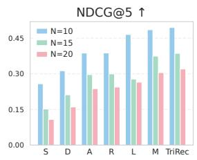

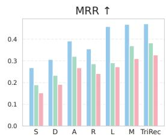

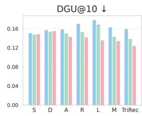

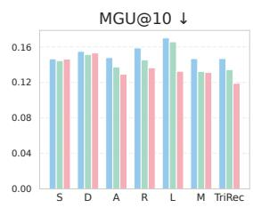

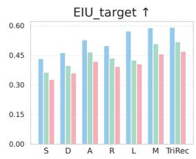  
Figure 3: Performance comparison under varying candidate set sizes (10, 15, 20) on CDs & Vinyl.

5.2.2 Platform-Level Fairness. TriRec achieves the best DGU and MGU on Movies & TV, Goodreads YA, and Steam Games. On CDs & Vinyl, SCRUF-D obtains the lowest DGU and MGU; however, its NDCG (0.258) is nearly half that of TriRec (0.495), revealing that SCRUF-D achieves fairness by drastically sacrificing relevance—an undesirable trade-of in practice.

In contrast, TriRec attains competitive fairness (DGU: 0.160, MGU: 0.147 on CDs & Vinyl) while simultaneously maintaining the highest accuracy, demonstrating a more favorable relevance– fairness balance. Notably, LTP-MMF exhibits the worst fairness across most datasets despite strong accuracy, confirming that op timizing long-term engagement feedback alone is insuficient to achieve group-level exposure balance without explicit fairness regulation.

5.2.3 Item-Side Utility. TriRec consistently achieves the highest EIU across all four datasets. These gains demonstrate the efec tiveness of combining item self-promotion with exposure-aware re-ranking: the former provides high-quality semantic signals that improve matching precision, while the latter redistributes exposure toward under-served items with high click probability.

Compared with creator-side methods (Rec4AgentVerse, Dual Rec) that also model item-side dynamics, TriRec achieves substan tially higher EIU, indicating that endowing items with active selfexpression capability yields greater item-side benefits than passive dual-market modeling.

5.2.4 Cross-Domain Consistency. Across four datasets spanning ecommerce (CDs & Vinyl, Movies & TV), social reading (Goodreads YA), and gaming (Steam), TriRec exhibits stable relative advantages. Although absolute metric values vary due to domain characteristics and interaction density, the consistent improvements confirm that the proposed tri-party framework generalizes well across heteroge neous recommendation scenarios.

Table 3: Ablation Study Results on the CDs dataset.

<table><tr><td>Model Variants</td><td>NDCG ↑</td><td>MRR ↑</td><td>DGU ↓</td><td>MGU ↓</td><td>EIU ↑</td></tr><tr><td>(a) w/o  $\mathcal{Y}^{(1)}$ </td><td>0.3381</td><td>0.3240</td><td>0.1298</td><td>0.1309</td><td>0.4782</td></tr><tr><td>(b) w/o  $\{S_{i\rightarrow u}, \mathcal{Y}^{(2)}\}$ </td><td>0.3642</td><td>0.3718</td><td>0.1695</td><td>0.1538</td><td>0.5143</td></tr><tr><td>(c) w/o  $\mathcal{Y}^{(2)}$ </td><td>0.4684</td><td>0.4581</td><td>0.1659</td><td>0.1477</td><td>0.5816</td></tr><tr><td>(d) w/o  $U_{\text {platform}}$ </td><td>0.4873</td><td>0.4615</td><td>0.1683</td><td>0.1556</td><td>0.5851</td></tr><tr><td>(e) w/o Dynamic  $\alpha_k$ </td><td>0.4635</td><td>0.4276</td><td>0.1301</td><td>0.1296</td><td>0.5603</td></tr><tr><td>(f) w/o  $U_{\text {user}}$ </td><td>0.2634</td><td>0.2839</td><td>0.0815</td><td>0.0823</td><td>0.4458</td></tr><tr><td>(g) w/o  $U_{\text {item}}$ </td><td>0.4857</td><td>0.4579</td><td>0.1535</td><td>0.1460</td><td>0.5824</td></tr><tr><td>(h) w/o  $\text{Sim}_{\text {emb}}(\text{z},\text{h})$ </td><td>0.4776</td><td>0.4487</td><td>0.1560</td><td>0.1470</td><td>0.5753</td></tr><tr><td>(i) with  $\text{Sim}_{\text {emb}}^{\text {rand}}(\text{z},\text{h})$ </td><td>0.4627</td><td>0.4283</td><td>0.1653</td><td>0.1532</td><td>0.5601</td></tr><tr><td>TriRec</td><td>0.4951</td><td>0.4702</td><td>0.1596</td><td>0.1468</td><td>0.5925</td></tr></table>

5.2.5 Robustness to Candidate Set Size. To verify that the above conclusions are not artifacts of a specific evaluation scale, we vary the candidate set size $| C _ { u } | \in \{ 1 0 , 1 5 , 2 0 \}$ (corresponding to ?? ∈ {9, 14, 19} negative samples) and report results on CDs & Vinyl in Figure 3.

As candidate set size increases, all methods experience natural accuracy degradation due to the increased dificulty of distinguishing the target item from a larger pool of competitive negatives. However, the relative performance ordering remains stable: TriRec consistently achieves the best or near-best scores across all three stakeholder metrics under all candidate set sizes. This confirms that our main findings are robust to the experimental scale configuration and not dependent on a particular candidate set size.

## 5.3 Ablation Study (RQ2)

Table 3 summarizes ablation results on CDs & Vinyl. We group variants into three categories.

Table 4: Impact of diferent position decay functions on recommendation performance.

<table><tr><td rowspan="2">Decay Function</td><td colspan="5">CDs &amp; Vinyl</td><td colspan="5">Movies &amp; TV</td><td colspan="5">Goodreads YA</td><td colspan="5">Steam Games</td></tr><tr><td>NDCG↑</td><td>MRR↑</td><td>DGU↓</td><td>MGU↓</td><td>EIU↑</td><td>NDCG↑</td><td>MRR↑</td><td>DGU↓</td><td>MGU↓</td><td>EIU↑</td><td>NDCG↑</td><td>MRR↑</td><td>DGU↓</td><td>MGU↓</td><td>EIU↑</td><td>NDCG↑</td><td>MRR↑</td><td>DGU↓</td><td>MGU↓</td><td>EIU↑</td></tr><tr><td>Power-law  $\frac{1}{(k+1)^q}$ </td><td>0.4911</td><td>0.4690</td><td>0.1601</td><td>0.1474</td><td>0.5913</td><td>0.4606</td><td>0.4419</td><td>0.2354</td><td>0.1776</td><td>0.5688</td><td>0.5505</td><td>0.5452</td><td>0.5152</td><td>0.4805</td><td>0.6467</td><td>0.4537</td><td>0.4510</td><td>0.4060</td><td>0.3967</td><td>0.5746</td></tr><tr><td>Exponential  $e^{-k\lambda}$ </td><td>0.4900</td><td>0.4683</td><td>0.1604</td><td>0.1478</td><td>0.5907</td><td>0.4612</td><td>0.4425</td><td>0.2358</td><td>0.1779</td><td>0.5692</td><td>0.5503</td><td>0.5451</td><td>0.5151</td><td>0.4802</td><td>0.6466</td><td>0.4534</td><td>0.4492</td><td>0.4076</td><td>0.3966</td><td>0.5733</td></tr><tr><td>Linear  $1 - \frac{k}{K}$ </td><td>0.4961</td><td>0.4703</td><td>0.1617</td><td>0.1478</td><td>0.5926</td><td>0.4605</td><td>0.4421</td><td>0.2363</td><td>0.1781</td><td>0.5689</td><td>0.5498</td><td>0.5448</td><td>0.5152</td><td>0.4806</td><td>0.6463</td><td>0.4532</td><td>0.4506</td><td>0.4060</td><td>0.3975</td><td>0.5742</td></tr><tr><td>Log  $\frac{1}{\log_2(k+2)}$ </td><td>0.4951</td><td>0.4702</td><td>0.1596</td><td>0.1468</td><td>0.5925</td><td>0.4630</td><td>0.4451</td><td>0.2258</td><td>0.1768</td><td>0.5709</td><td>0.5503</td><td>0.5450</td><td>0.5150</td><td>0.4803</td><td>0.6465</td><td>0.4546</td><td>0.4512</td><td>0.4054</td><td>0.3970</td><td>0.5748</td></tr></table>

Table 5: TriRec with diferent LLM backbones.

<table><tr><td>Backbone</td><td>NDCG↑</td><td>MRR↑</td><td>DGU↓</td><td>MGU↓</td><td>EIU↑</td></tr><tr><td>GPT-3.5-Turbo</td><td>0.4964</td><td>0.4718</td><td>0.1568</td><td>0.1478</td><td>0.5937</td></tr><tr><td>GPT-4o-mini</td><td>0.4951</td><td>0.4702</td><td>0.1596</td><td>0.1468</td><td>0.5925</td></tr><tr><td>GPT-4o</td><td>0.5234</td><td>0.4901</td><td>0.1647</td><td>0.1481</td><td>0.6086</td></tr><tr><td>DeepSeek-V3</td><td>0.5075</td><td>0.4770</td><td>0.1635</td><td>0.1526</td><td>0.5986</td></tr><tr><td>Qwen-plus</td><td>0.4891</td><td>0.4621</td><td>0.1604</td><td>0.1521</td><td>0.5864</td></tr></table>

5.3.1 Stage-Wise Component Analysis. Removing Stage 1 (row (a)) causes NDCG to drop by 31.7%, confirming that LLM-driven seman tic interaction is indispensable for fine-grained preference align ment. Comparing rows (b) and (c) isolates the contribution of item self-promotion: it yields a 10.4-point NDCG gain while simulta neously improving fairness (DGU: 0.170→0.166), demonstrating that active item expression benefits both relevance and exposure balance. Removing Stage 2 alone (row (c)) preserves competitive accuracy but degrades fairness (DGU: 0.170) and item utility (EIU: 0.582), confirming the necessity of platform-level regulation.

5.3.2 Platform-Level Component Analysis. Removing ??platform (row (d)) maintains accuracy but limits fairness gains. Replacing dynamic ???? with a fixed policy (row (e)) causes NDCG to drop from 0.495 to 0.464 while aggressively over-optimizing fairness, indicating that static intervention at top positions harms user experience. Removing $U _ { \mathrm { u s e r } }$ (row (f)) leads to the most severe accuracy degradation (NDCG: 0.263), revealing that the platform re-ranker over-prioritizes fairness without explicit user relevance protection. Removing $U _ { \mathrm { i t e m } }$ (row (g)) degrades both accuracy and EIU, confirming positive coupling between item utility modeling and user satisfaction.

5.3.3 Representation Quality Analysis. Without semantic embed dings (row (h)) or with random replacements (row (i)), both accuracy and EIU degrade progressively (NDCG: 0.478→0.463), confirming that meaningful embedding signals provide essential grounding for platform-level decision-making.

5.3.4 Efect of Position Decay Function ?? (·). We compare four monotonic decay functions: Log 1/log (??+2) (default), Power-law $1 / ( k { + } 1 ) ^ { q }$ , Exponential $e ^ { - k \lambda }$ , and Linear $1 { - } k / K ,$ , with ??=1, ??=0.5, ??=10. As shown in Table 4, performance diferences are marginal across all four datasets (within 1%), indicating robustness to the specific decay form. Log decay achieves the most consistent fairness advantage and is adopted as the default.

5.3.5 Efect of LLM Backbone. Table 5 reports TriRec with five LLM backbones on CDs & Vinyl. All variants yield closely matched NDCG and EIU, indicating the gains stem from the tri-party design rather than a specific LLM. GPT-3.5-Turbo already attains comparable accuracy with the best fairness, while GPT-4o achieves the highest relevance at only marginal fairness cost. The inclusion of DeepSeek-V3 and Qwen further validates cross-family generalizability.

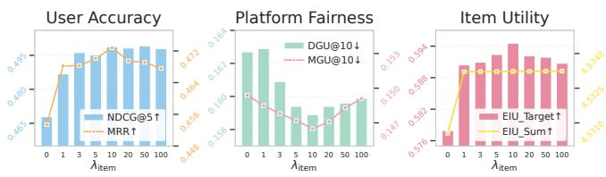  
Figure 4: Performance with varying $\lambda _ { \mathrm { i t e m } }$ on the CDs dataset.

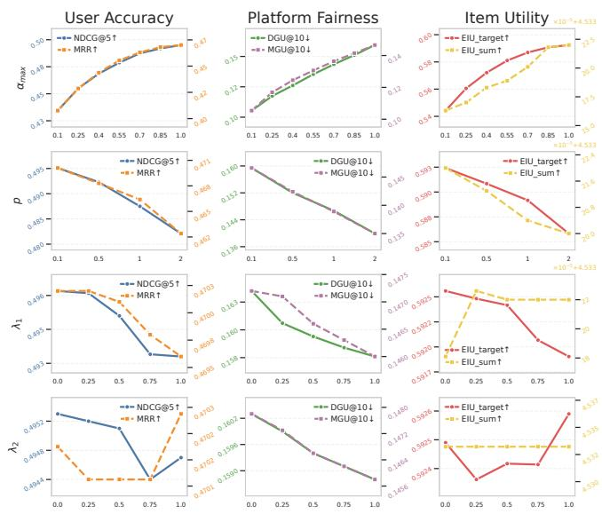  
Figure 5: Sensitivity of $\alpha _ { \mathrm { m a x } } , p , \lambda _ { 1 } ,$ and $\lambda _ { 2 }$ on the CDs dataset.

5.3.6 Eficiency. Following [27], we use the average LLM tokens per user request as a hardware-agnostic latency proxy. On CDs & Vinyl, TriRec consumes 98.4 tokens/user, comparable to MACRec (114.3) and well below Rec4AgentVerse (143.7); AgentCF++ uses only 41.8 tokens but with substantially weaker accuracy and item utility. Since Stage 1 self-promotions are generated concurrently and Stage 2 reduces to closed-form arithmetic, TriRec’s wall-clock latency remains largely independent of $| C _ { u } |$

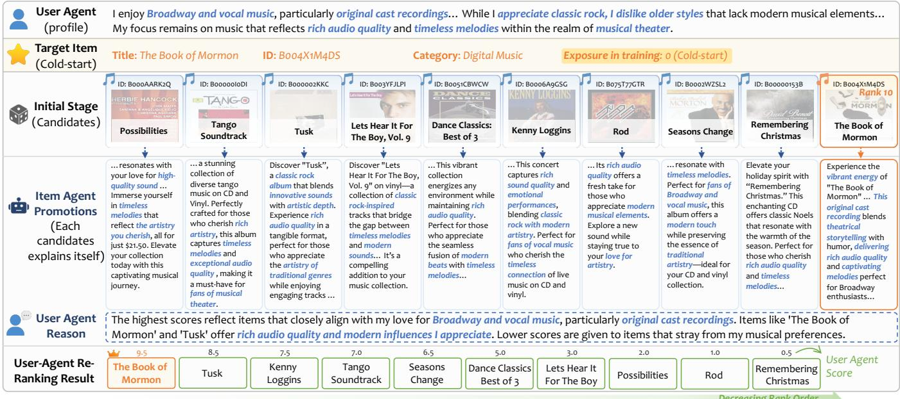  
Figure 6: Case Study: Personalized Re-ranking for a Cold-start Item. The target item (ID: B004X1M4DS) had zero exposure in the training set and was initially ranked 10th. Our agent framework successfully re-ranked the cold-start item to the top position by leveraging semantic alignment.

## 5.4 Analysis of Key Factors (RQ3)

We conduct sensitivity analysis on CDs & Vinyl, examining $\lambda _ { \mathrm { i t e m } }$ as the primary factor, followed by $\alpha _ { \mathrm { m a x } } , p , \lambda _ { 1 }$ , and $\lambda _ { 2 }$ .

5.4.1 Efect $o f \lambda _ { i t e m } .$ Figure 4 reports performance as $\lambda _ { \mathrm { i t e m } }$ varies from 0 to 100. When $\lambda _ { \mathrm { i t e m } } = 0 ;$ , the exposure-aware modulator de grades to a constant $( U _ { \mathrm { e x p o - i t e m } } \equiv 1 )$ , yielding the worst performance across all three stakeholder metrics, confirming that item utility modeling is essential.

$\mathtt { A s } \lambda _ { \mathrm { i t e m } }$ increases to the range of 5–10, all three metrics improve concurrently: NDCG rises to 0.499 (+6.6%), DGU decreases to 0.159, and EIU increases to 0.595. This challenges the conventional assumption that stakeholder objectives are inherently conflicting, and demonstrates that the exposure-aware modulator surfaces high potential under-exposed items that simultaneously benefit users, items, and platform fairness.

Beyond $\lambda _ { \mathrm { i t e m } } = 2 0 $ , performance plateaus as excessive amplifica tion causes over-reliance on embedding signals. The cumulative EIU remains constant (≈4.533), indicating that $\lambda _ { \mathrm { i t e m } }$ controls expo sure redistribution rather than total volume. We set $\lambda _ { \mathrm { i t e m } } = 1 0$ as the default.

5.4.2 Efect of Other Hyperparameters. Figure 5 reports sensitivity of the remaining parameters.

(a) $\alpha _ { \mathrm { m a x } }$ controls positional diferentiation. Increasing $\alpha _ { \mathrm { m a x } }$ from 0.1 to 1.0 improves accuracy (NDCG: 0.434→0.495) while degrading fairness (DGU: 0.105→0.159), as top positions increasingly preserve Stage 1 relevance ordering. Even at $\alpha _ { \mathrm { m a x } } = 1 . 0$ , lower ranks retain $\alpha _ { k } \approx 0 . 1$ , so regulation is concentrated at lower positions rather than fully disabled. We set $\alpha _ { \mathrm { m a x } } = 1 . 0$ , as the sparse exposure history on this dataset makes aggressive top-position fairness injection counterproductive.

(b) ?? governs how rapidly $\alpha _ { k }$ decays from $\alpha _ { \mathrm { m a x } }$ to $\alpha _ { \mathrm { { m i n } } }$ along the ranked list. As ?? increases, fairness improves (DGU: 0.159→0.140) at the cost of accuracy (NDCG: 0.495→0.482). Beyond $p = 1 . 0$ , accuracy degradation accelerates while fairness gains remain marginal, making larger ?? increasingly cost-ineficient. Values below 1.0 ofer the most favorable accuracy-fairness ratio.

(c–d) $\lambda _ { 1 }$ and $\lambda _ { 2 }$ exhibit high robustness: varying either from 0 to 1 improves the corresponding fairness metric while causing less than 0.3% NDCG loss, confirming strong compatibility between fairness signals and user relevance.

## 5.5 Cold-Start Item Promotion (RQ4)

To examine the efectiveness of item self-promotion under cold-start conditions, we conduct a case study on a representative product from CDs & Vinyl. The target item (ID: B004X1M4DS) has zero exposure in the training set and is initially placed at rank 10 in the candidate list, as shown in Figure 6.

5.5.1 Item Self-Promotion. For the cold-start target item, the Item Agent generates a personalized pitch that precisely anchors on the user’s core preferences: it highlights “original cast recording” and “Broadway” (genre alignment), emphasizes “rich audio quality” (production preference), and conveys “vibrant energy” (stylistic resonance). In contrast, competing candidates such as Dance Classics Best of 3 attempt preference mapping but exhibit semantic drift—its dance music essence fundamentally diverges from the user’s interest in musical theater. This demonstrates that self-promotion seeks genuine semantic intersections rather than superficial keyword aggregation: strong intersections produce persuasive pitches, while weak ones cannot conceal the underlying mismatch.

Importantly, the self-promotion is conditioned on the item’s original metadata (title, category, and attributes) provided as input context, which constrains the generation to factual item properties. As evidenced by the contrasting cases above, items whose metadata lacks genuine alignment with the user profile fail to produce com pelling pitches despite the LLM’s generative capacity—precisely because the mechanism cannot fabricate nonexistent item features.

5.5.2 User-Agent Re-Ranking. The User Agent assigns the target item the highest score (9.5 out of 10), promoting it from rank 10 to rank 1, while demoting initially higher-ranked but less compatible items. The agent’s reasoning reveals hierarchical preference priori tization: genre alignment receives the highest weight, followed by audio quality, with peripheral relevance scored lowest.

This case demonstrates that the dual-agent interaction mecha nism enables cold-start items to compete with established products through semantic self-promotion alone, efectively breaking the “no exposure → no feedback → no recommendation” cycle without requiring any collaborative filtering signals.

## 6 Conclusion and Limitations

We proposed TriRec, the first tri-party LLM-agent recommendation framework that coordinates users, items, and the platform via item self-promotion and platform-led multi-objective re-ranking. Exper iments validate the superiority of TriRec over existing baselines in enhancing tri-party utilities, suggesting that item self-promotion can mitigate the conventional relevance–fairness trade-of.

Two limitations remain: our ofline protocol may not fully reflect long-term dynamics, and the generated self-promotion is not yet quantitatively audited for factuality. Future work will address these via multi-round simulation, online A/B tests, and retrieval-grounded factuality constraints, as well as safeguards against adversarial self promotion and provider gaming.

## References

[1] Amanda Aird, Paresha Farastu, Joshua Sun, Elena Stefancová, Cassidy All, Amy Voida, Nicholas Mattei, and Robin Burke. 2024. Dynamic Fairness-aware Recom mendation Through Multi-agent Social Choice. ACM Trans. Recomm. Syst. 3, 2, Article 21 (2024).

[2] Jincheng Bai, Zhenyu Zhang, Jennifer Zhang, and Jason Zhu. 2025. Insight Agents: An LLM-Based Multi-Agent System for Data Insights (SIGIR ’25). Association for Computing Machinery, 4335–4339.

[3] Nicolas Bougie and Narimawa Watanabe. 2025. SimUSER: Simulating User Behavior with Large Language Models for Recommender System Evaluation. In Proceedings of the 63rd Annual Meeting of the Association for Computational Linguistics (Volume 6: Industry Track). Association for Computational Linguistics, 43–60.

[4] Shihao Cai, Jizhi Zhang, Keqin Bao, Chongming Gao, Qifan Wang, Fuli Feng, and Xiangnan He. 2025. Agentic Feedback Loop Modeling Improves Recommen dation and User Simulation (SIGIR ’25). Association for Computing Machinery, 2235–2244.

[5] Junyi Chen, Lu Chi, Siliang Xu, Shiwei Ran, Bingyue Peng, and Zehuan Yuan. 2025. HLLM-Creator: Hierarchical LLM-based Personalized Creative Generation. arXiv:2508.18118 [cs.IR]

[6] Lei Chen, Jingtao Ding, Min Yang, Chengming Li, Chonggang Song, and Lingling Yi. 2022. Item-Provider Co-learning for Sequential Recommendation (SIGIR ’22) Association for Computing Machinery, 1817–1822.

[7] Xiaoshuang Chen, Yibo Wang, Yao Wang, Husheng Liu, Kaiqiao Zhan, Ben Wang, and Kun Gai. 2025. Creator-Side Recommender System: Challenges, Designs, and Applications (WWW ’25). Association for Computing Machinery, 162–170.

[8] Paul Covington, Jay Adams, and Emre Sargin. 2016. Deep Neural Networks for YouTube Recommendations. In Proceedings of the 10th ACM Conference on Recommender Systems (RecSys ’16). Association for Computing Machinery, 191–198.

[9] Fangxiaoyu Feng, Yinfei Yang, Daniel Cer, Naveen Arivazhagan, and Wei Wang. 2022. Language-agnostic BERT Sentence Embedding. In Proceedings of the 60th Annual Meeting of the Association for Computational Linguistics (Volume 1: Long Papers). Association for Computational Linguistics, 878–891.

[10] Chongming Gao, Ruijun Chen, Shuai Yuan, Kexin Huang, Yuanqing Yu, and Xiangnan He. 2025. SPRec: Self-Play to Debias LLM-based Recommendation (WWW ’25). 5075–5084.

[11] Chongming Gao, Mengyao Gao, Chenxiao Fan, Shuai Yuan, Wentao Shi, and Xiangnan He. 2025. Process-Supervised LLM Recommenders via Flow-guided Tuning (SIGIR ’25). Association for Computing Machinery, 1934–1943.

[12] Chongming Gao, Kexin Huang, Jiawei Chen, Yuan Zhang, Biao Li, Peng Jiang, Shiqi Wang, Zhong Zhang, and Xiangnan He. 2023. Alleviating Matthew Efect of Ofline Reinforcement Learning in Interactive Recommendation (SIGIR ’23). Association for Computing Machinery, 238–248.

[13] Mengyao Gao, Chongming Gao, Jiakai Tang, Jingsen Zhang, Xinpeng Zhao, Bohao Wang, Jiawei Chen, Haoran He, Ling Pan, Xu Chen, Xin Xin, Qingpeng Cai, Peng Jiang, Kun Gai, Haoyan Liu, Fuli Feng, and Xiangnan He. 2026. Integrating Large Language Models with Reinforcement Learning: A Survey of LLM-RL Synergistic Recommendation. TechRxiv Preprint (2026)

[14] Azin Ghazimatin, Oana Balalau, Rishiraj Saha Roy, and Gerhard Weikum. 2020. PRINCE: Provider-side Interpretability with Counterfactual Explanations in Recommender Systems (WSDM ’20). Association for Computing Machinery, 196–204.

[15] Po-Sen Huang, Xiaodong He, Jianfeng Gao, Li Deng, Alex Acero, and Larry Heck. 2013. Learning deep structured semantic models for web search using clickthrough data. In Proceedings of the 22nd ACM international conference on Information & Knowledge Management. 2333–2338.

[16] Xu Huang, Jianxun Lian, Yuxuan Lei, Jing Yao, Defu Lian, and Xing Xie. 2025. Recommender AI Agent: Integrating Large Language Models for Interactive Recommendations. ACM Trans. Inf. Syst. 43, 4, Article 96 (2025).

[17] Kalervo Järvelin and Jaana Kekäläinen. 2002. Cumulated gain-based evaluation of IR techniques. ACM Trans. Inf. Syst. 20, 4 (2002), 422–446.

[18] Wang-Cheng Kang and Julian McAuley. 2018. Self-Attentive Sequential Recommendation. In 2018 IEEE International Conference on Data Mining (ICDM). 197–206.

[19] Jiahao Liu, Shengkang Gu, Dongsheng Li, Guangping Zhang, Mingzhe Han, Hansu Gu, Peng Zhang, Tun Lu, Li Shang, and Ning Gu. 2025. AgentCF++: Memory-enhanced LLM-based Agents for Popularity-aware Cross-domain Recommendations (SIGIR ’25). Association for Computing Machinery, 2566–2571.

[20] Hanjia Lyu, Song Jiang, Hanqing Zeng, Yinglong Xia, Qifan Wang, Si Zhang, Ren Chen, Chris Leung, Jiajie Tang, and Jiebo Luo. 2024. LLM-Rec: Personalized Recommendation via Prompting Large Language Models. In Findings of the Association for Computational Linguistics: NAACL 2024. Association for Computational Linguistics, 583–612.

[21] Guangtao Nie, Rong Zhi, Xiaofan Yan, Yufan Du, Xiangyang Zhang, Jianwei Chen, Mi Zhou, Hongshen Chen, Tianhao Li, Ziguang Cheng, Sulong Xu, and Jinghe Hu. 2024. A Hybrid Multi-Agent Conversational Recommender System with LLM and Search Engine in E-commerce (RecSys ’24). Association for Computing Machinery, 745–747.

[22] Tao Qi, Fangzhao Wu, Chuhan Wu, Peijie Sun, Le Wu, Xiting Wang, Yongfeng Huang, and Xing Xie. 2022. ProFairRec: Provider Fairness-aware News Recom mendation (SIGIR ’22). Association for Computing Machinery, 1164–1173.

[23] Hossein A. Rahmani, Mohammadmehdi Naghiaei, and Yashar Deldjoo. 2024. A Personalized Framework for Consumer and Producer Group Fairness Optimization in Recommender Systems. ACM Trans. Recomm. Syst. 2, 3, Article 19 (2024).

[24] Wentao Shi, Xiangnan He, Yang Zhang, Chongming Gao, Xinyue Li, Jizhi Zhang, Qifan Wang, and Fuli Feng. 2024. Large Language Models are Learnable Planners for Long-Term Recommendation (SIGIR ’24). 1893–1903.

[25] Ashudeep Singh and Thorsten Joachims. 2018. Fairness of Exposure in Rankings (KDD ’18). Association for Computing Machinery, 2219–2228.

[26] Chengbing Wang, Yang Zhang, Wenjie Wang, Xiaoyan Zhao, Fuli Feng, Xiangnan He, and Tat-Seng Chua. 2025. Think-While-Generating: On-the-Fly Reasoning for Personalized Long-Form Generation. ArXiv abs/2512.06690 (2025).

[27] Junlin Wang, Jue Wang, Ben Athiwaratkun, Ce Zhang, and James Y Zou. 2025. Mixture-of-Agents Enhances Large Language Model Capabilities. In International Conference on Learning Representations. 33944–33963.

[28] Lei Wang, Jingsen Zhang, Hao Yang, Zhi-Yuan Chen, Jiakai Tang, Zeyu Zhang, Xu Chen, Yankai Lin, Hao Sun, Ruihua Song, Xin Zhao, Jun Xu, Zhicheng Dou, Jun Wang, and Ji-Rong Wen. 2025. User Behavior Simulation with Large Language Model-based Agents. ACM Trans. Inf. Syst. 43, 2, Article 55 (2025).

[29] Mingze Wang, Chongming Gao, Wenjie Wang, Yangyang Li, and Fuli Feng. 2025. Tunable LLM-based Proactive Recommendation Agent. In Proceedings of the 63rd Annual Meeting of the Association for Computational Linguistics (Volume 1: Long Papers). Association for Computational Linguistics, 19262–19276.

[30] Xinyuan Wang, Liang Wu, Liangjie Hong, Hao Liu, and Yanjie Fu. 2025. LLM Enhanced User–Item Interactions: Leveraging Edge Information for Optimized Recommendations. ACM Trans. Intell. Syst. Technol. 16, 5, Article 117 (2025).

[31] Yancheng Wang, Ziyan Jiang, Zheng Chen, Fan Yang, Yingxue Zhou, Eunah Cho, Xing Fan, Yanbin Lu, Xiaojiang Huang, and Yingzhen Yang. 2024. RecMind: Large Language Model Powered Agent For Recommendation. In Findings of the Association for Computational Linguistics: NAACL 2024. Association for Computational Linguistics, 4351–4364.

[32] Zhefan Wang, Yuanqing Yu, Wendi Zheng, Weizhi Ma, and Min Zhang. 2024. MACRec: A Multi-Agent Collaboration Framework for Recommendation (SIGIR ’24). Association for Computing Machinery, 2760–2764.

[33] Xinye Wanyan, Danula Hettiachchi, Chenglong Ma, Ziqi Xu, and Jefrey Chan. 2025. Temporal-Aware User Behaviour Simulation with Large Language Models for Recommender Systems (CIKM ’25). Association for Computing Machinery, 5335–5339.

[34] Chenghao Wu, Ruiyang Ren, Junjie Zhang, Ruirui Wang, Zhongrui Ma, Qi Ye, and Wayne Xin Zhao. 2025. STARec: An Eficient Agent Framework for Recom mender Systems via Autonomous Deliberate Reasoning (CIKM ’25). Association for Computing Machinery, 3355–3365.

[35] Yao Wu, Jian Cao, Guandong Xu, and Yudong Tan. 2021. TFROM: A Two-sided Fairness-Aware Recommendation Model for Both Customers and Providers. In Proceedings of the 44th International ACM SIGIR Conference on Research and Development in Information Retrieval (SIGIR ’21). Association for Computing Machinery, 1013–1022.

[36] Zijing Wu, Leheng Sheng, Yuanlin Xia, Yi Zhang, Yuxin Chen, and An Zhang. 2025. Personalized Recommendation Agents with Self-Consistency. In Companion Proceedings of the ACM on Web Conference 2025 (WWW ’25). 2978–2982.

[37] Chen Xu, Sirui Chen, Jun Xu, Weiran Shen, Xiao Zhang, Gang Wang, and Zhenhua Dong. 2023. P-MMF: Provider Max-min Fairness Re-ranking in Recommender System (WWW ’23). Association for Computing Machinery, 3701–3711.

[38] Chen Xu, Xiaopeng Ye, Jun Xu, Xiao Zhang, Weiran Shen, and Ji-Rong Wen. 2024. LTP-MMF: Toward Long-Term Provider Max-Min Fairness under Recommenda tion Feedback Loops. ACM Trans. Inf. Syst. 43, 1, Article 11 (2024).

[39] Wujiang Xu, Yunxiao Shi, Zujie Liang, Xuying Ning, Kai Mei, Kun Wang, Xi Zhu, Min Xu, and Yongfeng Zhang. 2025. iAgent: LLM Agent as a Shield between User and Recommender Systems. In Findings of the Association for Computational Linguistics: ACL 2025. Association for Computational Linguistics, 18056–18084.

[40] Yuwei Yan, Yu Shang, Qingbin Zeng, Yu Li, Keyu Zhao, Zhiheng Zheng, Xuefe Ning, Tianji Wu, Shengen Yan, Yu Wang, Fengli Xu, and Yong Li. 2025. AgentSoci ety Challenge: Designing LLM Agents for User Modeling and Recommendation on Web Platforms (WWW ’25). Association for Computing Machinery, 2963–2967.

[41] Xiaopeng Ye, Chen Xu, Zhongxiang Sun, Jun Xu, Gang Wang, Zhenhua Dong, and Ji-Rong Wen. 2025. LLM-Empowered Creator Simulation for Long-Term Evaluation of Recommender Systems Under Information Asymmetry (SIGIR ’25). Association for Computing Machinery, 201–211.

[42] An Zhang, Yuxin Chen, Leheng Sheng, Xiang Wang, and Tat-Seng Chua. 2024. On Generative Agents in Recommendation (SIGIR ’24). Association for Computing Machinery, 1807–1817.

[43] Jizhi Zhang, Keqin Bao, Wenjie Wang, Yang Zhang, Wentao Shi, Wanhong Xu, Fuli Feng, and Tat-Seng Chua. 2025. Envisioning Recommendations on an LLM-Based Agent Platform. Commun. ACM 68, 5 (2025), 48–57.

[44] Junjie Zhang, Yupeng Hou, Ruobing Xie, Wenqi Sun, Julian McAuley, Wayne Xin Zhao, Leyu Lin, and Ji-Rong Wen. 2024. AgentCF: Collaborative Learning with Autonomous Language Agents for Recommender Systems (WWW ’24). Associa tion for Computing Machinery, 3679–3689.

[45] Yihua Zhang, Xi Liu, Xihuan Zeng, Mingfu Liang, Jiyan Yang, Rong Jin, Wen-Yen Chen, Yiping Han, Hao Ma, Bo Long, Huayu Li, Buyun Zhang, Liang Luo, Sijia Liu, and Tianlong Chen. 2025. ReasonRec: A Reasoning-Augmented Multimodal Agent for Unified Recommendation. In ICML 2025 Workshop on Programmatic Representations for Agent Learning.

[46] Yang Zhang, Wenxin Xu, Xiaoyan Zhao, Wenjie Wang, Fuli Feng, Xiangnan He, and Tat-Seng Chua. 2025. Reinforced Latent Reasoning for LLM-based Recommendation. ArXiv abs/2505.19092 (2025). https://api.semanticscholar.org/ CorpusID:278905774

[47] Zaibin Zhang, Zhenfei Yin, and Jing Shao. 2024. GENSS: A GENERALIZED AND SCALABLE LLM-BASED AGENTS SOCIAL NETWORK SIMULATOR. In NeurIPS 2024 Workshop on Open-World Agents.

[48] Xiaoyan Zhao, Juntao You, Yang Zhang, Wenjie Wang, Hong Cheng, Fuli Feng, See-Kiong Ng, and Tat-Seng Chua. 2025. NextQuill: Causal Preference Modeling for Enhancing LLM Personalization. ArXiv abs/2506.02368 (2025).

[49] Yuyue Zhao, Jiancan Wu, Xiang Wang, Wei Tang, Dingxian Wang, and Maarten de Rijke. 2024. Let Me Do It For You: Towards LLM Empowered Recommendation via Tool Learning (SIGIR ’24). Association for Computing Machinery, 1796–1806.

[50] Ziyi Zhao, Chongming Gao, Yang Zhang, Haoyan Liu, Weinan Gan, Huifeng Guo, Yong Liu, and Fuli Feng. 2026. Don’t Start Over: A Cost-Efective Framework for Migrating Personalized Prompts Between LLMs. The 40th Annual AAAI Conference on Artificial Intelligence (AAAI 2026) (2026).

[51] Yongsen Zheng, Ruilin Xu, Guohua Wang, Liang Lin, and Kwok-Yan Lam. 2024. Mitigating Matthew Efect: Multi-Hypergraph Boosted Multi-Interest Self-Supervised Learning for Conversational Recommendation (EMNLP ’24). Association for Computational Linguistics, 1455–1466.

[52] Lixi Zhu, Xiaowen Huang, and Jitao Sang. 2025. A LLM-based Controllable, Scalable, Human-Involved User Simulator Framework for Conversational Recommender Systems (WWW ’25). Association for Computing Machinery, 4653–4661.

[53] Yaochen Zhu, Harald Steck, Dawen Liang, Yinhan He, Nathan Kallus, and Jundong Li. 2025. LLM-based Conversational Recommendation Agents with Collaborative Verbalized Experience (EMNLP ’25). Association for Computational Linguistics, 2207–2220.