# Beyond Dense Connectivity: Explicit Sparsity for Scalable Recommendation

Yantao Yu yuyantao.yyt@alibaba-inc.com Alibaba International Digital Commercial Group HangZhou, China

Sen Qiao qiaosen.qiaosen@alibaba-inc.com Alibaba International Digital Commercial Group HangZhou, China

Bing Wang lingfeng.wb@alibaba-inc.com Alibaba International Digital Commercial Group HangZhou, China

Lei Shen kenny.sl@alibaba-inc.com Alibaba International Digital Commercial Group HangZhou, China

Xiaoyi Zeng yuanhan@alibaba-inc.com Alibaba International Digital Commercial Group HangZhou, China

## Abstract

Recent progress in scaling large models has motivated recommender systems to increase model depth and capacity to better leverage massive behavioral data. However, recommendation inputs are high-dimensional and extremely sparse, and simply scaling dense backbones (e.g., deep MLPs) often yields diminishing returns or even performance degradation. Our analysis of industrial CTR models reveals a phenomenon of implicit connection sparsity: most learned connection weights tend towards zero, while only a small fraction remain prominent. This indicates a structural mismatch between dense connectivity and sparse recommendation data; by compelling the model to process vast low-utility connections in stead of valid signals, the dense architecture itself becomes the primary bottleneck to efective pattern modeling. We propose SSR (Explicit Sparsity for Scalable Recommendation), a framework that incorporates sparsity explicitly into the architecture. SSR employs a multi-view "filter-then-fuse" mechanism, decomposing inputs into parallel views for dimension-level sparse filtering followed by dense fusion. Specifically, we realize the sparsity via two strategies: a Static Random Filter that achieves eficient structural sparsity via fixed dimension subsets, and Iterative Competitive Sparse (ICS), a diferentiable dynamic mechanism that employs bio-inspired com petition to adaptively retain high-response dimensions. Experi ments on three public datasets and a billion-scale industrial dataset from AliExpress (a global e-commerce platform) show that SSR outperforms state-of-the-art baselines under similar budgets. Cru cially, SSR exhibits superior scalability, delivering continuous per formance gains where dense models saturate. The code is available at https://github.com/Atticus666/SSRNet.

## CCS Concepts

• Information systems → Recommender systems; Learning to rank.

Keywords Recommender Systems; Scaling Up; Ranking Model; Model Sparsity; Personalized Recommendation

ACM Reference Format: Yantao Yu, Sen Qiao, Lei Shen, Bing Wang, and Xiaoyi Zeng. 2026. Beyond Dense Connectivity: Explicit Sparsity for Scalable Recommendation. In Proceedings ofthe 49th International ACM SIGIR Conference on Research and Development in Information Retrieval (SIGIR ’26), July 20–24, 2026, Melbourne, VIC, Australia. ACM, New York, NY, USA, 11 pages. https://doi.org/10.1145/ 3805712.3809630

## 1 Introduction

Deep learning recommender systems (DLRS) are the core ranking engines in many online services. Inspired by the success of LLMs [13, 15], we investigate whether recommender models exhibit similar scaling properties, where performance improves as model capacity and data size grow together. In practice, mainstream industrial CTR backbones such as Wide&Deep [4] and DLRM [20] remain relatively shallow, often 3–4 layers. Attempts to simply scale up these dense MLP-based architectures frequently lead to diminishing returns or even performance degradation, as reported in prior studies [17, 22]. This implies that naive scaling of dense architectures is suboptimal.

A fundamental issue is the mismatch between dense connectivity and sparse recommendation data. Unlike images or text with natural spatial or sequential locality, recommendation inputs consist of hundreds of heterogeneous feature fields where only a small subset is relevant for any given sample [21, 35]. As we show in Figure 1, learned weights in a production CTR model exhibit extreme implicit sparsity: 92% of connections are suppressed to near-zero, and 80% of weight mass concentrates in just 4% of dimensions. This confirms that the dense architecture itselfbecomes the bottleneck to efective scaling, and we provide a detailed analysis and theoretical grounding in Section 2.

Building on this insight, we propose SSR (Explicit Sparsity for Scalable Recommendation), a framework tailored for scaling on sparse recommendation data. SSR introduces a paradigm shift from implicit weight suppression to explicit signal filtering, building on a simple principle: first filter, then fuse. It performs explicit dimension-level sparse filtering before dense nonlinear fusion. We realize the sparsity via two complementary strategies: a Static Ran dom Filter (SSR-S) that achieves eficient structural sparsity via fixed dimension subsets at zero FLOP cost, and Iterative Competi tive Sparse (ICS/SSR-D), a diferentiable dynamic mechanism that introduces sparsity to adaptively filter dimensions based on sample context. Unlike existing methods that rely on soft attention [14] or post-hoc pruning [17], which maintain a fully connected graph and thus fail to block noise at scale, SSR enforces explicit sparsity, preventing noise propagation at the source and thus providing a cleaner gradient flow for scaling. The main contributions of this paper are summarized as follows:

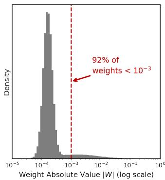

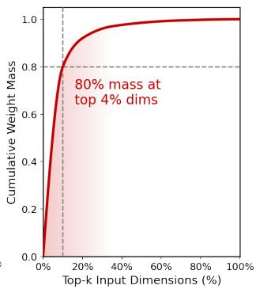  
Figure 1: Sparsity analysis of the hidden layer in online CTR backbone. (Left) 92% of weights are suppressed to near-zero $\left( < 1 0 ^ { - 3 } \right)$ . (Right) 80% of weight power concentrates in the top 4% of dimensions.

• We analyze the problem ofscaling dense MLPs on sparse data, highlighting that implicit weight suppression fails to block noise, and provide evidence of strong sparse connection in Figure 1.

• We propose SSR, shifting the paradigm from implicit weight suppression to explicit signal filtering. It realizes explicit sparsity to isolate noise before dense interaction, ensuring expanded capacity is dedicated to valid signals.

• We introduce two strategies to realize the explicit sparsity: a Static Random Filter for eficient structural sparsity, and ICS, a diferentiable dynamic filtering mechanism that enables input-adaptive sparsification to capture complex dependen cies.

• Experiments on three public datasets and a billion-scale industrial dataset from AliExpress demonstrate that SSR achieves better accuracy under comparable compute budgets and exhibits more stable improvements when scaling size.

## 2 Motivation and Theoretical Foundation

Before presenting the SSR framework, we provide the analytical and theoretical motivation underlying our design choices.

## 2.1 Why Dense MLPs Fail for Recommendation

Recommendation inputs difer fundamentally from language or vision data. They are high-dimensional yet extremely sparse [16,

28, 35], each instance typically activates only a small subset of informative dimensions in a large feature space [21]. Unlike images or text, where inputs exhibit natural spatial or sequential locality that architectures like CNNs and Transformers. Recommendation inputs consist of hundreds of heterogeneous feature fields such as user profiles, item attributes, contextual signals, and behavioral sequences, concatenated into a flat vector with no inherent adjacency or ordering among dimensions. For a specific impression or purchase, only a few contextual signals and historical preferences are truly relevant, while the vast majority are weakly relevant for that specific sample [18, 33]. This sparsity pattern means the efective response of the model (e.g., weight mass) is concentrated on a small fraction of the input dimensions.

In contrast, a fully connected layer enforces globally dense connectivity by coupling each output neuron with all input dimensions. This forces the model to process vast low-utility connections, which dilutes valid signals and burdens the optimizer with suppressing noise rather than learning complex patterns [23]. We argue that this constitutes a misalignment of inductive bias: the dense connectivity assumes all dimension pairs are equally likely to interact, whereas the data exhibits highly concentrated, subset-based interactions.

To support this analysis, we visualize the learned weights of the fully connected layer in an online industrial CTR model (Figure 1). This model was trained without any sparsity-inducing constraints (e.g., L2 regularization). Despite its dense design, the learned weights exhibit a highly sparse operating pattern: more than 92% of connections are implicitly suppressed to near-zero values $\left( < 1 0 ^ { - 3 } \right)$ and 80% of the weight mass is concentrated in the top 4% of the input dimensions. While this confirms a strong sparsity preference driven by the data distribution, such implicit suppression is ineficient: many weights are simply driven close to zero, which neither eliminates the interference of noise nor provides a mechanism for signal filtering. Making this sparsity explicit [7, 8], i.e., transforming it from an implicit training artifact into a controllable architectural design, is therefore the key to overcoming the scaling bottleneck. However, what constitutes noise varies across users, so a static sparse structure shared by all samples misses the context dependence of recommendation. To scale efectiveness, we need both structural and dynamic, sample-conditional sparsity.

## 2.2 Sparsity as Inductive Bias Alignment

From an inductive bias perspective, a model architecture implicitly encodes assumptions about the structure of its input data. CNNs encode spatial locality through convolutional kernels; Transformers encode sequential dependencies via self-attention [27]. Both succeed because their structural design matches the natural structure of the data.

Recommendation inputs, however, lack such natural locality. Hundreds of heterogeneous feature fields are concatenated into a flat vector with no inherent spatial or temporal ordering. Dense MLP’s fully connected topology imposes no structural prior, treating all dimension pairs as equally likely to interact. When the data’s efective interactions are concentrated on small feature subsets, as our empirical analysis confirms (Figure 1). This design becomes a misaligned inductive bias, forcing the optimizer to expend most of its capacity learning which connections to suppress rather than which patterns to model.

This perspective is supported by recent theoretical work on structured sparsity. Hayase and Karakida [12] proved that MLP Mixer [27] is mathematically equivalent to a wide and sparse MLP. Its Token-Mixing and Channel-Mixing layers can be expressed via Kronecker product structure:

$$
\operatorname{vec} (\mathbf {W X}) = \left(\mathbf {I} _ {C} \otimes \mathbf {W}\right) \operatorname{vec} (\mathbf {X})\tag{1}
$$

$$
\operatorname{vec} (\mathbf {X V}) = \left(\mathbf {V} ^ {\top} \otimes \mathbf {I} _ {S}\right) \operatorname{vec} (\mathbf {X})\tag{2}
$$

This structure yields an efective width of $m = S \times C$ (potentially $1 0 ^ { 4 } – 1 0 ^ { 6 } )$ while maintaining a non-zero weight ratio of only $1 / C$ or $1 / S ,$ which is inherently highly sparse. Moreover, this Kronecker product parameterization carries an implicit $L _ { 1 }$ regularization efect. Together with the Golubeva hypothesis [9], which states that at fixed parameter count, increasing width (and thus sparsity) consistently improves generalization, these findings provide theoretical grounding for why structured sparsity serves as a beneficial inductive bias.

SSR extends this principle from vision to recommendation. While MLP-Mixer relies on fixed mathematical structure (Kronecker prod ucts) that exploits the spatial regularity of image patches, recom mendation data lacks such regularity: which feature interactions are informative is highly data-dependent and sample-dependent. This motivates SSR’s design of two complementary explicit sparsity mechanisms, namely static random filtering for eficient structural sparsity and dynamic competitive filtering for sample-adaptive se lection. The transition from MLP-Mixer to SSR thus represents a advance: from implicit sparsity embedded in fixed mathematical structure to explicit sparsity engineered for the data’s intrinsic properties. this motivates the filter-then-fuse paradigm detailed in the next section.

## 3 The SSR Framework

We propose SSR (Explicit Sparsity for Scalable Recommendation) framework to resolve the mismatch between globally dense con nectivity and sparse input data. In this section, we detail the design of a single SSR Layer, which comprises two cascaded stages: (1) Multi-view Sparse Filtering and (2) Intra-view Dense Fusion. Figure 2 presents an overview of the framework.

## 3.1 Overview

To overcome the scaling issue caused by the indiscriminate mixing and signal dilution inherent in traditional densely connected layers, SSR introduces a new computational paradigm based on explicit signal filtering. First, the model converts raw features—including user profiles, candidate item attributes, cross-feature statistics, and behavior sequences—into embeddings. These embeddings are con catenated to form the initial input vector $\mathbf { x } \in \mathbb { R } ^ { d _ { \mathrm { i n } } }$

Unlike a standard dense layer that learns a global mapping $\textbf { x } \in \mathbb { R } ^ { d _ { i n } }$ , SSR decouples the modeling task into � independent purification views. For each view $i \in \{ 1 , . . . , b \}$ , we define a view specific mapping $\phi _ { i }$ that processes the input into a local subspace representation $\mathbf { z } _ { i } \in \mathbb { R } ^ { d _ { v } }$ . Each mapping filters the key dimensions in the full input x and projects them into a low-dimensional sub space. Each mapping $\phi _ { i }$ is implemented through a strict two-stage process: Sparse Filtering (F�) to filter the information, followed by Dense Fusion (M�) to process it. The view outputs $\{ \mathbf { z } _ { 1 } , \ldots , \mathbf { z } _ { b } \}$ are then aggregated to form the layer output; the specific aggregation strategy difers between intermediate and final layers.

## 3.2 Multi-view Sparse Filtering

This stage constitutes the "Filter" stage of the SSR framework, implementing strict dimension-level signal filtering. We define a set of sparse filter operators $\{ \mathcal { F } _ { 1 } , . . . , \mathcal { F } _ { b } \}$ . For the �-th view, the operator extracts a purified representation h� $\epsilon \mathbb { R } ^ { d _ { v } }$ from the highdimensional input x:

$$
\mathbf {h} _ {i} = \mathcal {F} _ {i} (\mathbf {x})\tag{3}
$$

This process essentially performs � parallel filtering operations. We propose two instantiation strategies for $\mathcal { F } _ { i } ,$ , trading of eficient structural sparsity and context-aware dynamic sparsity.

SSR-S: Static Random Filter (Static Instantiation) This strategy treats $\mathscr { F } _ { i }$ as a sample-agnostic operator to enforce structural sparsity. We implement $\mathscr { F } _ { i }$ using a binary selection matrix $M _ { i } \in \{ 0 , 1 \} ^ { d _ { i n } \times d _ { v } }$ where each column is strictly a one-hot vector. Furthermore, this matrix remains fixed after initialization. To construct $M _ { i } ,$ , we sample $d _ { v }$ feature indices from the input dimension range $\left\{ 1 , \ldots , d _ { i n } \right\}$ . The sampling is performed uniformly without replacement within each view, ensuring distinct features in a single subspace. However, the sampling is independent across diferent views, allowing feature overlap. This independence creates a "Feature Bagging" efect [2], promoting structural diversity and robustness across the parallel views. The filtered feature is calculated as:

$$
\mathbf {h} _ {i} = \mathbf {x M} _ {i}\tag{4}
$$

Since $M _ { i }$ consists of column-wise one-hot vectors, the operation is implemented not as a matrix multiplication, but as a zero-FLOP parallel gather operation (i.e., direct index slicing). This blocks the propagation of unselected dimensions at the source.

Existing methods like Statistical Top-k [32] or even our own dynamic ICS utilize logical sparsity: they multiply non-informative features by zero, but the physical computation graph remains wide $( O ( d ^ { 2 } ) )$ . In contrast, SSR-S enforces hard dimension reduction. By strictly slicing the input indices before computation, it decouples the dimension selection cost from the inference cost.

SSR-D: Iterative Competitive Sparse (Dynamic Instantiation) To capture context-aware dependencies, we employ ICS (detailed in Sec. 4), a dynamic mechanism. ICS dynamically adjusts the focus based on the input’s semantic context. It sparsifies the input by actively zeroing out less salient elements in the input vector x while retaining high-response values. The formula for $\mathbf { h } _ { i }$ becomes:

$$
\mathbf {h} _ {i} = \mathrm{ICS} _ {i} (\mathbf {x W} _ {\mathrm{i}} ^ {p r o j})\tag{5}
$$

Here, $\mathbf { h } _ { i } \in \mathbb { R } ^ { d _ { v } ^ { * } }$ , where the view dimension is typically expanded $( \mathrm { e . g . , } d _ { v } ^ { \ast } > d _ { v } )$ ) to maintain capacity for adaptive dimension sparsity, unlike the static strategy. $\mathbf { W } _ { i } ^ { \hat { p } r o j } \in \mathbb { R } ^ { d _ { \mathrm { i n } } \times d _ { v } ^ { * } }$ is a learnable projection matrix for view �. The output h is a sparse representation, in the $d _ { v } ^ { * } .$ -dimensional space, where most non-critical elements are strictly truncated to zero.

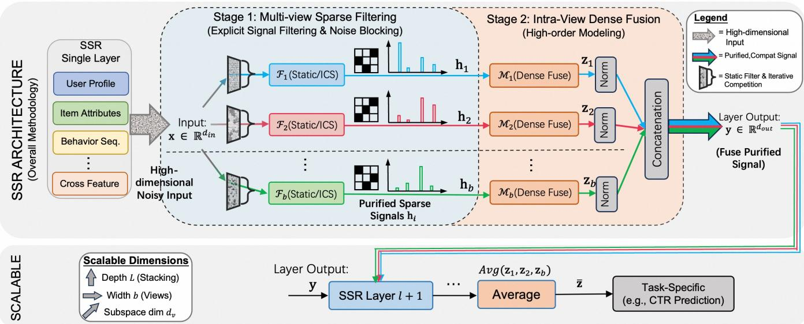  
Figure 2: The SSR Framework: Explicit Sparsity for Scalable Recommendation.

## 3.3 Intra-view Dense Fusion

Following dimension-level sparse filtering, the input has been distilled into � views of purified vectors $[ h _ { 1 } , . . . , h _ { b } ]$ . While the first stage blocks noise, this second stage focuses on exploiting this sparsity to enable eficient high-order modeling within a refined signal environment. Its strategic application exclusively within the refined subspaces prevents the re-aggregation of low-utility con nections, resolving the signal dilution issue inherent in globally dense architectures.

Mathematically, this operation is equivalent to applying a Block Diagonal weight matrix $\mathbf { W } _ { \mathrm { b l o c k } } = \mathrm { d i a g } ( \mathbf { V } _ { 1 } , \dots , \mathbf { V } _ { b } )$ to the concate nated input. Unlike a standard dense layer where all dimensions interact, the block-diagonal structure enforces strict semantic isolation between views, ensuring that features from the �-th view are transformed exclusively by parameters $\mathbf { V } _ { i } \in \mathbb { R } ^ { d _ { v } \times d _ { v } }$ for static or $V _ { i } \in \mathbb { R } ^ { d _ { v } ^ { * } \times d _ { v } }$ for dynamic. In practice, this is eficiently imple mented as b parallel projections, avoiding the storage of zero-valued of-diagonal blocks. The output $\mathbf { z } _ { i }$ for the �-th view is calculated as:

$$
\mathbf {z} _ {i} = \sigma \left(\mathbf {h} _ {i} \mathbf {V} _ {i} + \mathbf {b i a s} _ {i}\right)\tag{6}
$$

Here, � is an activation function (such as GELU). For intermedi ate layers, the outputs from all views are processed with Layer Normalization and recombined via concatenation:

$$
\mathbf {y} = \operatorname{concat} (\operatorname{LayerNorm} (\mathbf {z} _ {1}),..., \operatorname{LayerNorm} (\mathbf {z} _ {b})) \in \mathbb {R} ^ {b \cdot d _ {v}}\tag{7}
$$

The number of parameters in this structure is $O ( b \cdot d _ { v } ^ { 2 } )$ . Compare this with a standard fully connected layer, which has a complexity of $O ( ( b \cdot d _ { v } ) ^ { 2 } )$ . By utilizing the independence of each view, SSR reduces complexity by a factor of $1 { \bar { / } } b .$ . This makes it possible to significantly expand parameters within the same computational budget.

## 3.4 Last-Layer Aggregation

In intermediate layers, view outputs are concatenated and passed to the next layer as defined in Eq. (7). However, for the final layer that produces prediction logits (e.g., CTR/CVR scores), the aggregation strategy switches from concatenation to averaging:

$$
\bar {\mathbf {z}} = \frac {1}{b} \sum_ {i = 1} ^ {b} \mathrm{LayerNorm} (\mathbf {z} _ {i})\tag{8}
$$

Each view independently completes dense fusion to obtain $\mathbf { z } _ { i } ,$ and the resulting shared representation z¯ is then fed into task-specific prediction heads via fully connected layers, e.g.,

$$
y _ {\mathrm{ctr}} = \sigma (\mathbf {W} _ {\mathrm{ctr}} \bar {\mathbf {z}} + \mathbf {b} _ {\mathrm{ctr}})\tag{9}
$$

Averaging ofers two advantages over concatenation. First, it pushes all views toward a shared semantic space instead of letting them drift independently. Concatenation preserves discrepancies between views, but averaging encourages consistency. Second, averaging fixes the prediction head input dimension at $d _ { v }$ regardless of the view count. With concatenation, the dimension would grow to $b \cdot d _ { v } ,$ making the prediction head scale linearly with the number of views.

## 4 Iterative Competitive Sparse

As the core mechanism for dynamic instantiation in SSR, Iterative Competitive Sparse (ICS) is a diferentiable operator that difers from traditional sparsification—typically handled by discrete Top-K sorting—as a continuous dynamical system. This formulation enables end-to-end, adaptive sparse filtering across dimensions.

We treat the input $\textbf { p } \in \mathbb { R } ^ { d _ { v } }$ as a population in an ecosystem where feature intensities represent vitality. This framework redefines sparsification as a discrete-time nonlinear dynamical system rather than a static sorting task. It comprises three continuous stages: initialization, iterative competition, and signal recovery. The ICS forward pass is fully diferentiable, enabling integration into gradient-based optimization. The standard flow is shown in Algorithm 1.

Algorithm 1 Iterative Competitive Sparse (ICS) Forward Pass
Input: Project feature  $z \in R^{d_v}$ , Iterations T, Learnable extinction rates  $\{\alpha_t\}_{t=0}^{T-1}$ , Learnable scale  $\gamma$ 
Output: Sparse feature vector  $y \in R^{d_v}$ 

1: Initialize:  $\mathbf{x}^{(0)} \leftarrow \text{ReLU}(\mathbf{z})$ 
2: for t = 0 to T - 1 do
3:  $\mu^{(t)} \leftarrow \text{Mean}(\mathbf{x}^{(t)})$ 
4:  $\mathbf{x}^{(t+1)} \leftarrow \text{ReLU}(\mathbf{x}^{(t)} - \alpha_t \cdot \mu^{(t)})$ 
5: end for
6: Signal Recovery:  $y \leftarrow \gamma \odot x^{(T)}$ 
7: return y

## 4.1 Initialization and Competitive Dynamics

Dynamic competition requires feature intensity to have a non negative physical meaning. Therefore, we first rectify the input to be non-negative. We define the initial system state as:

$$
\mathbf {x} ^ {0} = \operatorname{ReLU} (\mathbf {z})\tag{10}
$$

Then, the system enters an iterative process for � rounds $( t =$ $0 , \ldots , T - 1 )$ . During iterations, a mean-field global inhibition force drives features toward extinction. We define the global inhibition field $\mu ^ { ( t ) }$ in step $\lambda _ { t }$ as the mean of all current features.

$$
\mu^ {(t)} = \frac {1}{d _ {v}} \sum_ {j = 1} ^ {d _ {v}} x _ {j} ^ {(t)}\tag{11}
$$

The state update follows the "survival of the fittest" rule. Only features significantly stronger than the inhibition field can survive. The rest will converge to true zero as hard sparsity. The specific update equation is:

$$
\mathbf {x} ^ {(t + 1)} = \mathrm{ReLU} \left(\mathbf {x} ^ {(t)} - \alpha_ {t} \cdot \boldsymbol {\mu} ^ {(t)}\right)\tag{12}
$$

Here, $\alpha = \{ \alpha _ { 0 } , \ldots , \alpha _ { T - 1 } \} , \alpha _ { t } \in \mathbb { R }$ , we introduce � learnable extinction rates where diferent iterations use diferent $\alpha _ { t }$ . Crucially, the iterative design $( T > 1 )$ is necessary because the statistical distri bution of the features is not stable during the iterative process. A single-step thresholding $( T = 1 )$ relies on a static estimation of the noise floor. Through � iterations, as noise is progressively extin guished, the mean $\mu ^ { ( t ) }$ is continuously refined to reflect the true signal baseline. This allows the model to perform progressive filtering by removing coarse noise first and fine-tuning later, thereby approximating a complex non-linear sparsification that a single linear filtering cannot achieve.

In each iteration, we only perform additions/subtractions and compute the mean, all of which are �(�) operations. Over � itera tions, the total complexity is $O ( T \cdot N )$ . Since $\alpha _ { t } > 0$ and $\begin{array} { r } { \mu ^ { ( t ) } \geq 0 , } \end{array}$ the update rule ensures that no feature intensity can increase. The system forms a monotonically non-increasing sequence:

$$
\left| \mathbf {x} ^ {(t + 1)} \right| _ {1} \leq \left| \mathbf {x} ^ {(t)} \right| _ {1}\tag{13}
$$

This inequality implies that the total energy of the system inevitably decays over time �. While this efectively filters out noise, it also causes significant attenuation of the useful signal intensity.

## 4.2 Signal Recovery

To counteract this inherent attenuation, we introduce a learnable scale parameter �. After � rounds of iteration, the sparse state $\mathbf { x } ^ { ( T ) }$ is mapped to the final output y through a linear transformation:

$$
\mathbf {y} = \gamma \odot \mathbf {x} ^ {(T)}\tag{14}
$$

we introduce � as a learnable rescaling parameter, we implement $\gamma \in$ $\mathbb { R } ^ { d _ { v } }$ as a vector, assigning an independent weight to each dimension. While theoretically, the subsequent linear layer could absorb a scalar multiplication, we specifically introduce � to decouple recovery from transformation. The parameter � serves as a variance stabilizer, ensuring numerical stability and an optimal dynamic range for the optimization process.

## 4.3 Comparison with Other Top-k Mechanisms

Our ICS mechanism ofers distinct advantages over existing diferentiable selection strategies. First, compared to Straight-Through Estimator (STE) [1] based Top-k methods, ICS eliminates the gradient mismatch problem. By formulating sparsification as a continuous dynamical system rather than a discrete truncation, ICS ensures a consistent gradient flow that stabilizes training. Second, unlike Soft Top-k relaxations or NeuralSort [10], which typically involve sorting operations with super-linear �(� log �) complexity, ICS achieves sparsity through parallel competitive inhibition. This results in a strictly linear $O ( T \cdot N )$ complexity, avoiding the computational bottleneck of sorting high-dimensional recommendation features while ensuring that noise dimensions are driven to true zero rather than merely assigned low probabilities.

## 5 Experiments

This section aims to address the following core research questions:

RQ1 Efectiveness & Eficiency: Does SSR outperform SOTA models on mainstream benchmarks in terms of both prediction accuracy and computational eficiency?

RQ2 Scalability: Does SSR scale efectively, i.e., does performance consistently improve as the model scale increases?

RQ3 Ablation & Mechanism: What are the respective contributions of the sparse filtering design and the dense fuse? Does ICS truly achieve dynamic sparsity?

RQ4 Online A/B Tests: Does deploying SSR online yield significant lifts in key business metrics under latency constraints?

## 5.1 Experimental Setup

5.1.1 Datasets. We evaluated on a large-scale industrial dataset and three public datasets, $\mathrm { e . g . , }$ Criteo1, Avazu2, Alibaba3. Dataset statistics are summarized in Table 1. The industrial dataset contains over 1 billion production logs from AliExpress, a global crossborder e-commerce platform under Alibaba International Digital Commerce Group. The data is collected from its recommendation system, which serves personalized product recommendations to users worldwide. The dataset encompasses more than 300 feature fields including user profiles, item attributes, and contextual signals, and we use a time-based split where the most recent day is used for validation and testing to mimic an online setting. For public datasets, we follow the standard random split (8:1:1). All numeri cal features are log-transformed and discretized, and categorical features with frequency ≤ 5 are removed.

Table 1: Statistics of Datasets

<table><tr><td>Data</td><td>#Samples</td><td>#Positive Ratio</td><td>#Categorical Features</td><td>#Numerical Features</td><td>#Feature Values</td></tr><tr><td>Avazu</td><td>40,428,967</td><td>16.98%</td><td>23</td><td>0</td><td>1,544,489</td></tr><tr><td>Criteo</td><td>45,840,617</td><td>25.62%</td><td>26</td><td>13</td><td>998,974</td></tr><tr><td>Alibaba</td><td>42,299,905</td><td>3.89%</td><td>23</td><td>4</td><td>1,342,817</td></tr><tr><td>Industrial</td><td>1,003,204,206</td><td>3.45%/ 0.08%</td><td>183</td><td>129</td><td>-</td></tr></table>

5.1.2 Evaluation protocols. To evaluate the proposed method, we consider both prediction efectiveness and computational eficiency. In terms of efectiveness, we use AUC and LogLoss across all datasets. For the industrial datasets, we additionally introduce GAUC to mitigate user activity bias and focus on intra-user rank ing performance. The industrial dataset includes two tasks, click and pay; for the pay task, we evaluate on the full sample space. Regarding eficiency and scalability, we report Params and FLOPs. Note that the parameter count includes only the backbone network (excluding embedding tables) to decouple architectural evaluation from dataset-specific feature cardinality. Furthermore, we calculate FLOPs based on a single inference pass of the neural network com ponents to serve as a proxy for the computational overhead during the training phase.

5.1.3 Baselines. We benchmark SSR against four groups of representative methods: (1) Classic Deep Models: DeepFM [11] and DCN v2 [29], which serve as standard baselines utilizing dense feature in teractions; (2) Attention-based & Dynamic models: AutoInt [23] and MMOE [19], which employ self-attention or gating mechanisms for adaptive feature learning; (3) Feature Selection (AutoML): AutoFIS [17], AFN [5], a state-of-the-art method that improves eficiency by pruning redundant interactions; and (4) SOTA scalable architectures: Wukong [34] and RankMixer [37], representing the latest advancement in high-performance industrial recommendation.

All methods are implemented in TensorFlow and trained on a NVIDIA A100 cluster. For a fair comparison, we set the embedding dimension to 16 for all models and used Adam with a batch size of 1024 and early stopping. The iterations � of ICS are set to 5, the learnable extinction rates �� are initialized to 0.1, and the Learnable scale � is initialized to a vector of 1.

## 5.2 Efectiveness & Eficiency (RQ1)

5.2.1 Performance on Industrial Datasets. Table 2 presents quan titative results for Click and Pay tasks on industrial datasets. We compare three groups of baselines against the static random strategy SSR-S and the dynamic ICS strategy SSR-D. SSR consistently outperforms classic feature interaction models. For instance, the static SSR-S variant achieves a Click AUC of 0.6644, surpassing standard baselines like DeepFM and DCN v2. Notably, SSR-S out performs a Dense MLP of comparable parameter size, indicating that the performance gain comes from the sparse architecture itself rather than parameter capacity.

Table 2: Overall performance and eficiency comparison on the industrial dataset. The best results are highlighted in bold. \* indicates statistical significance over the best baseline with $\begin{array} { r } { p < 0 . 0 5 . } \end{array}$

<table><tr><td rowspan="2">Model</td><td colspan="2">CLICK</td><td colspan="2">PAY</td><td rowspan="2">#Params</td><td rowspan="2">FLOPs/1</td></tr><tr><td>AUC</td><td>GAUC</td><td>AUC</td><td>GAUC</td></tr><tr><td>Dense MLP</td><td>0.6593</td><td>0.6281</td><td>0.8083</td><td>0.6770</td><td>60M</td><td>3.4G</td></tr><tr><td>DeepFM</td><td>0.6563</td><td>0.6251</td><td>0.8053</td><td>0.6730</td><td>13M</td><td>0.6G</td></tr><tr><td>DCN v2</td><td>0.6571</td><td>0.6262</td><td>0.8065</td><td>0.6742</td><td>15M</td><td>0.9G</td></tr><tr><td>MMoE</td><td>0.6578</td><td>0.6267</td><td>0.8063</td><td>0.6757</td><td>21M</td><td>1.2G</td></tr><tr><td>AutoInt</td><td>0.6594</td><td>0.6279</td><td>0.8078</td><td>0.6769</td><td>26.2M</td><td>1.7G</td></tr><tr><td>AutoFIS*</td><td>0.6592</td><td>0.6285</td><td>0.8085</td><td>0.6777</td><td>10.8M</td><td>0.5G</td></tr><tr><td>Wukong</td><td>0.6615</td><td>0.6298</td><td>0.8115</td><td>0.6805</td><td>93M</td><td>2.9G</td></tr><tr><td>RankMixer</td><td>0.6621</td><td>0.6305</td><td>0.8122</td><td>0.6815</td><td>101M</td><td>3.2G</td></tr><tr><td>SSR-S</td><td>0.6644</td><td>0.6326</td><td>0.8162</td><td>0.6841</td><td>57M</td><td>1.4G</td></tr><tr><td>SSR-D</td><td>0.6667*</td><td>0.6351*</td><td>0.8194*</td><td>0.6862*</td><td>100M</td><td>3.3G</td></tr></table>

\* For AutoFIS, metrics refer to the re-training phase (post-pruning).

In comparisons with automated and attention-based models, although AutoFIS benefits from a low parameter count during retraining, its limited capacity results in a suboptimal AUC of 0.6592. Similarly, AutoInt incurs higher computational costs of 1.7G FLOPs compared to 1.4G for SSR-S yet yields a lower score of 0.6594. These self-attention mechanisms use softmax to assign strictly positive weights $( \alpha _ { i j } \mathrm { ~ > ~ } 0 )$ to all feature pairs, thereby preserving a fully connected graph similar to that of a dense fully connected layer.

Against state-of-the-art architectures, the dynamic SSR-D variant achieves the highest overall performance. While RankMixer serves as the strongest baseline with a Click AUC of 0.6621, SSR-D surpasses it across all metrics, reaching 0.6667 in Click AUC and 0.8194 in Pay AUC. Finally, SSR ofers a superior eficiency trade-of. SSR-S outperforms RankMixer using only 56% of the parameters and 44% of the FLOPs, validating the benefits of structured sparsity. SSR-D operates within a similar computation budget to RankMixer but delivers significant performance gains, verifying the efectiveness of the Iterative Competitive Sparse mechanism.

5.2.2 Generalization on Public Benchmarks. To verify the robustness of SSR under diferent data distributions and domains, we conducted experiments on three widely used public benchmarks: Avazu, Criteo, and Alibaba. These datasets difer in feature sparsity and semantic complexity. As summarized in Table 3, the proposed SSR framework achieves consistent improvements over all baselines across these datasets. Specifically, the dynamic variant SSR-D achieved the top performance in both AUC and LogLoss. When compared to the strongest baseline, RankMixer, SSR-D improves AUC by 0.63% on Avazu, 0.03% on Criteo, and 0.43% on Alibaba. This suggests that the gains come from the model design rather than dataset-specific tuning, and transfer across benchmarks.

In addition to predictive accuracy, the static SSR-S variant demonstrates superior eficiency consistently across all benchmarks, including Avazu, Alibaba, and Criteo. Taking Avazu as a representative example, SSR-S outperforms RankMixer with an AUC of 0.7827 compared to 0.7772, yet it requires only 0.33M parameters and 688.7M FLOPs. This cuts parameters and FLOPs by roughly half relative to RankMixer, while improving AUC, showing that SSR removes redundant computation without sacrificing accuracy.

Table 3: Performance and eficiency comparison on public benchmarks (Avazu, Alibaba, and Criteo). The best results are highlighted in bold. \* indicates statistical significance over the best baseline with $\textstyle p < 0 . 0 5$

<table><tr><td rowspan="2">Model</td><td colspan="4">Avazu</td><td colspan="4">Alibaba</td><td colspan="4">Criteo</td></tr><tr><td>AUC</td><td>LogLoss</td><td> $Params^*$ </td><td>FLOPs</td><td>AUC</td><td>LogLoss</td><td> $Params^*$ </td><td>FLOPs</td><td>AUC</td><td>LogLoss</td><td> $Params^*$ </td><td>FLOPs</td></tr><tr><td>DeepFm</td><td>0.7752</td><td>0.3801</td><td>0.23M</td><td>464.2 M</td><td>0.6594</td><td>0.1604</td><td>0.21M</td><td>421.3 M</td><td>0.7986</td><td>0.4539</td><td>0.29M</td><td>599.5 M</td></tr><tr><td>DCN v2</td><td>0.7729</td><td>0.3915</td><td>0.36M</td><td>736.8 M</td><td>0.6526</td><td>0.1659</td><td>0.35M</td><td>712.0 M</td><td>0.8064</td><td>0.4537</td><td>0.69M</td><td>1.22 G</td></tr><tr><td>AFN</td><td>0.7755</td><td>0.3839</td><td>0.15M</td><td>317.4 M</td><td>0.6757</td><td>0.1638</td><td>0.15M</td><td>316.4 M</td><td>0.8080</td><td>0.4561</td><td>0.90M</td><td>1.96 G</td></tr><tr><td>AutoInt</td><td>0.7722</td><td>0.3859</td><td>0.07M</td><td>850.2 M</td><td>0.6784</td><td>0.1575</td><td>0.29M</td><td>1.18 G</td><td>0.8053</td><td>0.4462</td><td>0.01M</td><td>1.66 G</td></tr><tr><td> $AutoFIS^*$ </td><td>0.7802</td><td>0.3792</td><td>0.23M</td><td>472.7 M</td><td>0.6637</td><td>0.1602</td><td>0.21M</td><td>427.2M</td><td>0.8089</td><td>0.4430</td><td>0.23M</td><td>472.7 M</td></tr><tr><td>Wukong</td><td>0.7756</td><td>0.3826</td><td>0.17M</td><td>719.6 M</td><td>0.6782</td><td>0.1567</td><td>0.17M</td><td>694.6 M</td><td>0.8073</td><td>0.4445</td><td>0.18M</td><td>799.7 M</td></tr><tr><td>RankMixer</td><td>0.7772</td><td>0.3818</td><td>0.64M</td><td>1.32 G</td><td>0.6801</td><td>0.1566</td><td>0.63M</td><td>1.30 G</td><td>0.8092</td><td>0.4427</td><td>1.15M</td><td>2.36 G</td></tr><tr><td>SSR-S</td><td>0.7827*</td><td>0.3781</td><td>0.33M</td><td>688.7 M</td><td>0.6827*</td><td>0.1568</td><td>0.34M</td><td>688.5 M</td><td>0.8098*</td><td>0.4417</td><td>0.48M</td><td>977.6 M</td></tr><tr><td>SSR-D</td><td>0.7835*</td><td>0.3781</td><td>0.97M</td><td>2.00 G</td><td>0.6844*</td><td>0.1562</td><td>0.89M</td><td>1.83 G</td><td>0.8096*</td><td>0.4425</td><td>1.23M</td><td>2.53 G</td></tr></table>

\* For AutoFIS, metrics refer to the re-training phase (post-pruning).  
\* The parameter count includes only the backbone network excluding embedding tables

On Criteo, a highly competitive and saturated benchmark, the margins for improvement are inherently narrow. Nonetheless, SSR S and SSR-D achieve a superior AUC of 0.8098, outperforming strong baselines like RankMixer (0.8093) and Wukong (0.8073). These results demonstrate that even in performance-saturated set tings, SSR successfully identifies refined, high-order dependencies that traditional models overlook, afirming its efectiveness across diverse data environments.

## 5.3 Scalability Analysis (RQ2)

5.3.1 Internal Eficiency Analysis. We analyze the scaling properties in Figure 3 to identify the optimal resource allocation strategy. The results highlight that increasing the number of views (�) is the most reliable scaling dimension, though distinct behaviors emerge across datasets. On the smaller Avazu dataset (Figure 3b), satura tion is pervasive across all dimensions. Performance gains diminish significantly as views increase from 8 to 16, and subspace width (� ) even shows performance degradation beyond � = 128. This in dicates that on limited data, the model easily hits a capacity ceiling regardless of the scaling dimension.

In contrast, the billion-scale Industrial dataset (Figure 3a) exhibits a diferent pattern where the primary bottleneck is underfitting rather than redundancy. The performance curve for scaling views maintains a steady upward trajectory up to � = 64 without the saturation seen in Avazu. Scaling width (��) also proves efective, serving as a strong baseline that scales well in low-to-medium re source regimes. However, it eventually exhibits diminishing returns at high complexity levels, where its curve flattens compared to the sustained growth of view scaling.

Conversely, scaling depth (�) consistently yields the lowest returns per FLOP on both datasets, saturating early with marginal gains. Consequently, while scaling width remains a viable sec ondary option, we prioritize scaling the number of views as the primary mechanism for the SSR backbone, as it ofers the potential for long-term expandability on large-scale data.

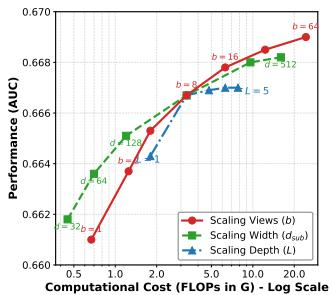  
(a) Industrial

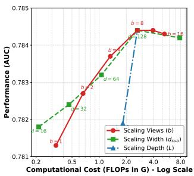  
(b) Avazu

Figure 3: Impact of scaling model dimensions on performance and cost across Industrial and Avazu datasets.  
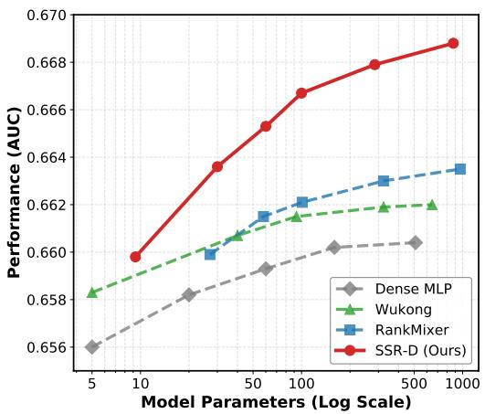  
Figure 4: Performance (AUC) vs. Model Parameters (log scale) on the Industrial Dataset.

5.3.2 Scalability Eficiency Analysis. We evaluate the scalability of SSR framework against two types of baselines. To ensure a rigorous comparison, we conducted an independent hyperparameter grid search for all baselines at each parameter scale. First, we compare against state-of-the-art architectures like RankMixer and Wukong to establish a strong reference point. Second, we include a standard Dense MLP to validate the structural advantage of our sparse filter ing. Figure 4 plots the performance trajectory of each model across parameter scales ranging from 5M to nearly 900M.

Compared with the strongest baselines, RankMixer and Wukong, SSR exhibits not only higher accuracy but also a steeper scaling trajectory. As shown in Figure 4, while RankMixer maintains steady improvement as parameters increase, its growth rate is flatter than that of SSR. Consequently, the performance gap between SSR and the state-of-the-art widens as the model scales up. In the large-scale increases approaching 900M parameters, SSR converts additional capacity into performance gains much more eficiently than the baselines, resulting in a larger margin. This indicates that the multi view architecture makes better use of large-scale parameter budgets than existing methods.

Comparing our model against the Dense MLP is crucial for validating our design choices. We observed that even with carefully tuned regularization (e.g., Dropout, weight decay), the Dense MLP exhibits premature saturation, where doubling the parameter count yields diminishing returns. This plateauing efect indicates that without an explicit selection mechanism, a dense backbone strug gles to utilize additional capacity to capture finer interaction pat terns. In contrast, SSR maintains a steady upward trend throughout the entire scale. This confirms that the sparse filtering mechanism is pivotal for scaling. By replacing indiscriminate dense connections with selective views, SSR allocates expanded capacity to modeling the most informative signals, thereby mitigating the saturation bottleneck that limits traditional dense networks.

## 5.4 Ablation Studies & Mechanism Analysis (RQ3)

5.4.1 Ablation Studies. To validate the SSR framework, we performed comprehensive ablation studies on the Avazu and Industrial datasets. We measured the contribution of each design element by tracking the AUC performance drop relative to the SSR-D baseline, as summarized in Table 4.

Dimension-level sparse filtering proved essential for our architecture. Eliminating this module (thereby exposing the input directly to dense blocks)leads to the most significant performance degradation, causing the AUC to decline by 0.50pt on Avazu and 0.37pt on the In dustrial dataset. This sharp decline confirms our central hypothesis that globally dense connectivity is suboptimal for recommendation inputs, as forcing the backbone to process all input dimensions indiscriminately dilutes efective patterns with irrelevant connec tions. Complementing this, the multi-view decomposition strategy plays a vital role in maintaining model capacity. Constraining the model to a single representation subspace (� = 1) resulted in per formance losses of 0.22pt on Avazu and 0.15pt on the Industrial dataset, indicating that parallel view projections are essential for capturing diverse and complementary feature interactions.

Beyond component existence, we examined the underlying im plementation mechanisms. The necessity of dynamic adaptation is evidenced by the performance drop of 0.12pt and 0.23pt when replacing the dynamic SSR-D with a static SSR-S variant, suggest ing that fixed sparsity patterns fail to account for sample-specific variability. Furthermore, the superiority of our diferentiable ICS operator is highlighted by its comparison with the standard Top-k selection strategy (STE), $k = d _ { v } .$ The non-diferentiable nature of Top-k truncation results in a performance penalty of roughly 0.18pt, 0.29pt in AUC. In contrast, our ics provides stable gradient propagation and retains critical feature information more efectively. Finally, we replace our sparse filtering with Dropout to verify that our gains are not merely due to regularization. The resulting drastic performance drops of 0.32pt and 0.45pt demonstrate that SSR has learned meaningful sparsity.

Table 4: Impact of diferent components and mechanisms. The baseline is the full SSR-D model. Performance changes are reported in AUC $( \times 1 0 ^ { - 2 } )$ .

<table><tr><td rowspan="2">Setting</td><td colspan="2">ΔAUC</td></tr><tr><td>Avazu</td><td>Industrial</td></tr><tr><td colspan="3">Component Effectiveness</td></tr><tr><td>w/o Sparse Filtering</td><td>-0.50</td><td>-0.37</td></tr><tr><td>w/o Multi-view Strategy</td><td>-0.22</td><td>-0.15</td></tr><tr><td colspan="3">Mechanism Analysis</td></tr><tr><td>Static (SSR-S) vs. Dynamic</td><td>-0.12</td><td>-0.23</td></tr><tr><td>Top-k (STE) vs. ICS</td><td>-0.18</td><td>-0.29</td></tr><tr><td>Dropout vs. SSR-S</td><td>-0.32</td><td>-0.45</td></tr></table>

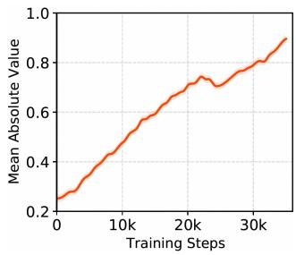  
(a) Layer-1 View 1 Mean Abs

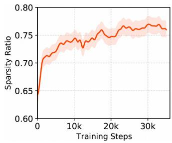  
(b) Layer-1 View 1 Sparsity

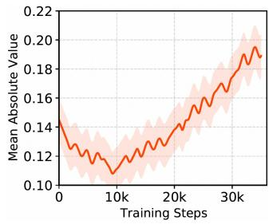  
(c) Layer-2 View 1 Mean Abs

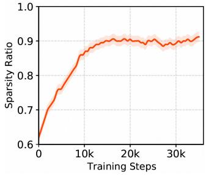  
(d) Layer-2 View 1 Sparsity  
Figure 5: Visualization of training dynamics for the Iterative Competitive Sparse (ICS) module.

5.4.2 ICS Analysis. To understand how the Iterative Competitive Sparse module learns during optimization, we visualize the first two layers in Figure 5. We tracked the sparsity ratio and the mean absolute magnitude over 35,000 steps. As shown in Figure 5b and 5d, sparsity rose quickly early on and then levels of. Layer 2 converges to a much higher sparsity (about 90%) than Layer 1 (about 75%), suggesting that deeper layers become more selective and produce more abstract, sparse representations. The stability observed in the later stages confirms that stable convergence rather than continual switching among feature subsets.Meanwhile, Figure 5a and 5c show that the mean absolute feature magnitude increases over training. In Layer 2, it briefly drops in the first 10,000 steps before increasing, consistent with an early suppression of weak or redundant features followed by strengthening of the remaining ones.

Table 5: Sensitivity Analysis and Mechanism Validation on Avazu Dataset.

<table><tr><td>Setting</td><td>Parameter Value</td><td>Sparsity (%)</td><td>AUC</td></tr><tr><td colspan="4">(A) Impact of Iterations T (with initial  $\alpha_t = 0.1, w/\gamma$ )</td></tr><tr><td rowspan="3">Iterations (T)</td><td>T=1 (Single Step)</td><td>76.4%</td><td>0.7821</td></tr><tr><td>T=2</td><td>88.6%</td><td>0.7826</td></tr><tr><td>T=5 (Default)</td><td>91.0%</td><td>0.7835</td></tr><tr><td colspan="4">(B) Impact of Learnable Extinction Rates  $\alpha_t$  (with fixed T=5, w/γ)</td></tr><tr><td rowspan="4">Extinction ( $\alpha_t$ )</td><td> $\alpha_t = 0.01$ </td><td>80.4%</td><td>0.7832</td></tr><tr><td> $\alpha_t = 0.1$  (Default)</td><td>91.0%</td><td>0.7835</td></tr><tr><td> $\alpha_t = 0.3$ </td><td>93.3%</td><td>0.7833</td></tr><tr><td> $\alpha_t = 0.5$ </td><td>94.0%</td><td>0.7828</td></tr><tr><td colspan="4">(C) Necessity of Rescaling γ (with fixed T=5, initial  $\alpha_t = 0.1$ )</td></tr><tr><td rowspan="2">Rescaling (γ)</td><td>w/o γ</td><td>94.5%</td><td>0.7832</td></tr><tr><td>w/ γ (Default)</td><td>91.0%</td><td>0.7835</td></tr></table>

To assess the sensitivity of the ICS mechanism, we conduct a controlled grid search on Avazu (Table 5), varying the number of iterations � , the initial extinction rate �0, and the rescaling factor �. The results support the need for progressive filtering, single-step thresholding $( T = 1 )$ yields limited sparsity and suboptimal accuracy, whereas increasing � to 5 produces cleaner representations and achieves the best AUC of 0.7835 at 91.0% sparsity. We also find that �0 serves as an efective sparsity regulator, smoothly shifting sparsity from 80.4% to 94.5% while keeping performance stable over a wide range of initial values $( \alpha _ { t } \in [ 0 . 1 , 0 . 5 ] )$ ), indicating that the mechanism is robust rather than brittle. Finally, � is important for numerical stability: removing it reduces AUC to 0.7832, consistent with our analysis that explicit magnitude rescaling is needed to ofset the signal attenuation.

5.4.3 View Diversity. To verify whether the multi-view architecture truly learns complementary patterns rather than redundant information, we visualize the pairwise cosine similarity between the projection matrix $\mathbf { W } _ { i } ^ { p r o j }$ of diferent views in Figure 6. The heatmaps for both Layer 1 and Layer 2 exhibit consistently low similarity scores across the of-diagonal elements. This indicates that the feature vectors generated by diferent views remain largely orthogonal to each other. Such a distinct separation confirms that the parallel views have successfully converged to diverse subspaces, with each view capturing a unique aspect of the feature interactions. By avoiding mode collapse where views become identical, the framework maximizes its representational capacity and ensures that the final fusion step integrates comprehensive and non-redundant signals from the input data. SSR does not require an explicit diversity regularizer. Since all view outputs are concatenated and optimized under the same loss, training naturally suppresses redundant views and favors those that capture complementary patterns.

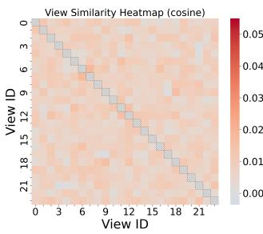  
(a) Layer 1

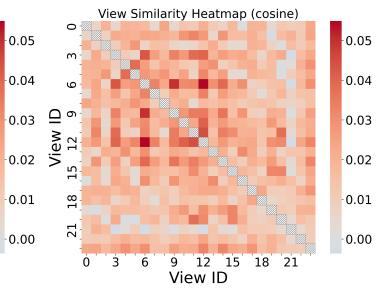  
(b) Layer 2  
Figure 6: Visualization of cosine similarity between views.

Table 6: Online A/B testing results.

<table><tr><td rowspan="2">Model</td><td>Efficiency</td><td colspan="3">Business Metrics (Lift)</td></tr><tr><td>Latency</td><td>CTR</td><td>Orders</td><td>GMV</td></tr><tr><td>SSR-D (Ours)</td><td>26ms(+1ms)</td><td>+2.1%</td><td>+3.2%</td><td>+3.5%</td></tr></table>

## 5.5 Online A/B Testing (RQ4)

We conducted an online A/B test in a core recommendation scenario to verify the practical value of SSR. The baseline model is RankMixer with identical parameters, which represents the current production standard. We compared this against the SSR-D over a two-week period to evaluate performance under real-world traffic. As shown in Table 6, SSR-D delivers consistent improvements across all key business metrics. The model achieved a 2.1% increase in Click-Through Rate while driving substantial gains in conversion, with per capita orders rising by 3.2% and Gross Merchandise Value by 3.5%. These results confirm that the high-quality representations learned by SSR directly translate into better ranking decisions and higher commercial value. Crucially, these performance gains are achieved without compromising system latency. As detailed in the eficiency statistics, both the baseline RankMixer and the proposed SSR-D operate with an average response time of 25ms. This parity confirms that SSR improves recommendation quality through superior structural design rather than by increasing the inference time burden on the serving system.

## 6 Related Work

We review three lines of related work that contextualize the SSR framework: feature interaction modeling, sparsity-driven architectures, and dynamic selection mechanisms.

## 6.1 From Global Dense to Sparse Filtering

Capturing non-linear dependencies among high-dimensional sparse features is fundamental to recommender systems. Early models, like Factorization Machines, explicitly handled second-order interactions. In the deep learning era, architectures generally fall into three categories: Hybrid models (e.g., Wide&Deep [4], DeepFM [11]) combine linear and nonlinear components to balance memorization and generalization; Self-attention mechanisms (e.g., AutoInt, AFN [5, 23]) utilize multi-head attention for high-order correlations; and implicit models (e.g., DCN v2 [29], RankMixer [37]) rely on deep stacks of fully connected layers to capture interactions. However, a fundamental mismatch exists between these globally dense archi tectures and intrinsic data sparsity. While Graph Neural Networks like IntentGC [36] attempt to address sparsity by leveraging graph topology to guide interactions, they often incur costs related to graph construction and neighbor sampling in industrial settings.

Similarly, self-attention models (e.g., AutoInt [23]) theoretically capture fine-grained correlations. However, standard Softmax op erations produce strictly positive weights, inherently preserving a fully connected graph. Although Sparse Attention mechanisms [6] have been proposed to limit receptive fields, they often introduce complex indexing overheads. In contrast, SSR adopts a filter-then fuse paradigm. Instead of relying on heavy graph structures or complex sparse attention indices, SSR employs explicit signal filtering. By decomposing inputs into parallel views and blocking noise before fusion, SSR enables the model to scale efectively without the saturation observed in dense baselines.

## 6.2 From Pruning to Structural Sparsity

To mitigate the computational burden of high-dimensional features, explicit sparsity has become an active research direction. Tradi tional methods largely fall into two categories: Feature Selection (e.g., AutoFIS [17]) which prunes redundant fields, and Mixture-of Experts (MoE) (e.g., MMOE [19], PLE [26]) which uses conditional routing to expand capacity. These approaches have limitations. Feature selection often follows a model-then-prune logic—attempting to remove redundancy after dense interactions have already oc curred. MoE models, while increasing capacity, face challenges with routing collapse and load balancing. Recent advancements have shifted towards intrinsic sparsity. For instance, recent studies [30] propose a Dynamic Sparse Learning paradigm to train sparse models from scratch, efectively avoiding the redundancy of post hoc pruning. Similarly, subsequent research [24] utilizes sparse approximate inverses to enhance scalability in collaborative filter ing autoencoders. SSR diverges from traditional post-hoc pruning and soft attention by introducing a hard-filtering paradigm. Rather than learning then deleting or preserving noise through strictly positive weights, SSR implements a learn-while-filtering mecha nism from the start. Most significantly, by enforcing truncation (zero-weight connections), SSR achieves signal isolation that blocks noise propagation.

## 6.3 From Gating to Global Inhibition

To achieve input-aware adaptivity, dynamic mechanisms are essential. Existing works have explored various techniques to han dle data sparsity dynamically. MaskNet [31] and LHUC [25] intro duce Instance-Aware Masks to highlight informative features via element-wise gating. Other approaches leverage Locality-Sensitive Hashing [3] for eficient retrieval in edge environments or employ embedding compression [16] to generate sparse activations for scalable retrieval.

However, most existing methods rely on independent gating or static projections, where feature selection decisions are made locally or via simple dot products. SSR advances this by proposing the Iterative Competitive Sparse (ICS) mechanism. ICS models feature selection as a dynamic system inspired by biological global inhibition. It introduces competition where dominant features suppress weaker neighbors, rather than independent gating. This allows SSR to learn a robust, global selection policy that adapts iteratively to the input context.

## 7 Conclusion

In this work, we revisited the scaling laws of recommender systems and identified the mismatch that leads to performance saturation in dense backbones. Our analysis revealed that indiscriminate mixing in standard dense layers often leads to signal dilution, necessitating a shift from passive implicit suppression to explicit signal filtering. SSR implements this paradigm through the "filter-then-fuse" topology. By employing mechanisms like Iterative Competitive Sparse (ICS), SSR blocks noise propagation at the source, ensuring that expanded model capacity is concentrated exclusively on high-SNR (Signal-to-Noise Ratio) subspaces.

Our empirical results demonstrate that this sparsity successfully breaks the scaling ceiling where dense models saturate. More broadly, this work instantiates a general principle: efective architectures align their inductive biases with the structure of their data. Just as convolutional kernels succeed because they match the spatial locality of images, and self-attention succeeds because it captures long-range dependencies in sequences, SSR’s explicit sparsity succeeds because it matches the high-dimensional, subsetbased interaction patterns inherent in recommendation data. This perspective challenges the prevailing reliance on globally dense connectivity and points towards a principled direction for future research: designing architectures whose structural priors reflect the sparse, combinatorial nature of user behaviors. We anticipate that explicit filtering mechanisms will be instrumental in developing larger, foundational models for recommendation that are both scalable and computationally eficient.

## Acknowledgments

An AI language model was used to improve the clarity and grammar of parts of this manuscript. It was not used to generate content.

## References

[1] Yoshua Bengio, Nicholas Léonard, and Aaron Courville. 2013. Estimating or propagating gradients through stochastic neurons for conditional computation. arXiv preprint arXiv:1308.3432 (2013).

[2] Leo Breiman. 2001. Random forests. Machine learning 45, 1 (2001), 5–32.

[3] Xuening Chen, Hanwen Liu, and Dan Yang. 2019. Improved LSH for privacyaware and robust recommender system with sparse data in edge environment. EURASIP Journal on Wireless Communications and Networking 2019, 1 (2019), 171.

[4] Heng-Tze Cheng, Levent Koc, Jeremiah Harmsen, Tal Shaked, Tushar Chandra, Hrishi Aradhye, Glen Anderson, Greg Corrado, Wei Chai, Mustafa Ispir, et al. 2016. Wide & deep learning for recommender systems. In Proceedings of the 1st workshop on deep learning for recommender systems. 7–10.

[5] Weiyu Cheng, Yanyan Shen, and Linpeng Huang. 2020. Adaptive factorization network: Learning adaptive-order feature interactions. In Proceedings ofthe AAAI Conference on Artificial Intelligence, Vol. 34. 3609–3616.

[6] Rewon Child. 2019. Generating long sequences with sparse transformers. arXiv preprint arXiv:1904.10509 (2019).

[7] William Fedus, Barret Zoph, and Noam Shazeer. 2022. Switch transformers: Scaling to trillion parameter models with simple and eficient sparsity. Journal ofMachine Learning Research 23, 120 (2022), 1–39.

[8] Jonathan Frankle and Michael Carbin. 2018. The lottery ticket hypothesis: Finding sparse, trainable neural networks. arXiv preprint arXiv:1803.03635 (2018).

[9] Anna Golubeva, Guy Gur-Ari, and Behnam Neyshabur. [n. d.]. Are wider nets better given the same number of parameters?. In International Conference on Learning Representations.

[10] Aditya Grover, Eric Wang, Aaron Zweig, and Stefano Ermon. 2019. Stochastic optimization of sorting networks via continuous relaxations. arXiv preprint arXiv:1903.08850 (2019).

[11] Huifeng Guo, Ruiming Tang, Yunming Ye, Zhenguo Li, and Xiuqiang He. 2017. DeepFM: a factorization-machine based neural network for CTR prediction. arXiv preprint arXiv:1703.04247 (2017).

[12] Tomohiro Hayase and Ryo Karakida. 2024. Understanding MLP-Mixer as a wide and sparse MLP. In International Conference on Machine Learning. PMLR, 17734–17758.

[13] Jordan Hofmann, Sebastian Borgeaud, Arthur Mensch, Elena Buchatskaya, Trevor Cai, Eliza Rutherford, Diego de Las Casas, Lisa Anne Hendricks, Johannes Welbl, Aidan Clark, et al. 2022. Training compute-optimal large language models (2022). arXiv preprint arXiv:2203.15556 (2022).

[14] Tongwen Huang, Zhiqi Zhang, and Junlin Zhang. 2019. FiBiNET: combining fea ture importance and bilinear feature interaction for click-through rate prediction. In Proceedings ofthe 13th ACM conference on recommender systems. 169–177.

[15] Jared Kaplan, Sam McCandlish, Tom Henighan, Tom B Brown, Benjamin Chess, Rewon Child, Scott Gray, Alec Radford, Jefrey Wu, and Dario Amodei. 2020. Scaling laws for neural language models. arXiv preprint arXiv:2001.08361 (2020).

[16] Petr Kasalicky, Martin Spišák, Vojtěch Vančura, Daniel Bohuněk, Rodrigo Alves,\` and Pavel Kordík. 2025. The Future is Sparse: Embedding Compression for Scalable Retrieval in Recommender Systems. In Proceedings ofthe Nineteenth ACM Conference on Recommender Systems. 1099–1103.

[17] Bin Liu, Chenxu Zhu, Guilin Li, Weinan Zhang, Jincai Lai, Ruiming Tang, Xi uqiang He, Zhenguo Li, and Yong Yu. 2020. Autofis: Automatic feature interaction selection in factorization models for click-through rate prediction. In proceedings ofthe 26th ACM SIGKDD international conference on knowledge discovery & data mining. 2636–2645.

[18] Wantong Lu, Yantao Yu, Yongzhe Chang, Zhen Wang, Chenhui Li, and Bo Yuan. 2021. A dual input-aware factorization machine for CTR prediction. In Proceedings of the twenty-ninth international conference on international joint conferences on artificial intelligence. 3139–3145.

[19] Jiaqi Ma, Zhe Zhao, Xinyang Yi, Jilin Chen, Lichan Hong, and Ed H Chi. 2018. Modeling task relationships in multi-task learning with multi-gate mixture-of experts. In Proceedings of the 24th ACM SIGKDD international conference on knowledge discovery & data mining. 1930–1939.

[20] Maxim Naumov, Dheevatsa Mudigere, Hao-Jun Michael Shi, Jianyu Huang, Narayanan Sundaraman, Jongsoo Park, Xiaodong Wang, Udit Gupta, Carole Jean Wu, Alisson G Azzolini, et al. 2019. Deep learning recommendation model for personalization and recommendation systems. arXiv preprint arXiv:1906.00091 (2019).

[21] Qi Pi, Guorui Zhou, Yujing Zhang, Zhe Wang, Lejian Ren, Ying Fan, Xiaoqiang Zhu, and Kun Gai. 2020. Search-based user interest modeling with lifelong sequential behavior data for click-through rate prediction. In Proceedings ofthe 29th ACM International Conference on Information & Knowledge Management. 2685–2692.

[22] Stefen Rendle, Walid Krichene, Li Zhang, and John Anderson. 2020. Neural collaborative filtering vs. matrix factorization revisited. In Proceedings ofthe 14th ACM conference on recommender systems. 240–248.

[23] Weiping Song, Chence Shi, Zhiping Xiao, Zhijian Duan, Yewen Xu, Ming Zhang, and Jian Tang. 2019. Autoint: Automatic feature interaction learning via selfattentive neural networks. In Proceedings of the 28th ACM international conference on information and knowledge management. 1161–1170.

[24] Martin Spisak, Radek Bartyzal, Antonin Hoskovec, Ladislav Peska, and Miroslav Tuma. 2023. Scalable approximate nonsymmetric autoencoder for collaborative filtering. In Proceedings of the 17th ACM conference on recommender systems. 763–770.

[25] Pawel Swietojanski and Steve Renals. 2014. Learning hidden unit contributions for unsupervised speaker adaptation of neural network acoustic models. In 2014 IEEE Spoken Language Technology Workshop (SLT). IEEE, 171–176.

[26] Hongyan Tang, Junning Liu, Ming Zhao, and Xudong Gong. 2020. Progressive layered extraction (ple): A novel multi-task learning (mtl) model for personalized recommendations. In Proceedings ofthe 14th ACM conference on recommender systems. 269–278.

[27] Ilya O Tolstikhin, Neil Houlsby, Alexander Kolesnikov, Lucas Beyer, Xiaohua Zhai, Thomas Unterthiner, Jessica Yung, Andreas Steiner, Daniel Keysers, Jakob Uszkoreit, et al. 2021. Mlp-mixer: An all-mlp architecture for vision. Advances in neural information processing systems 34 (2021), 24261–24272.

[28] Leyao Wang, Xutao Mao, Xuhui Zhan, Yuying Zhao, Bo Ni, Ryan A Rossi, Nesreen K Ahmed, and Tyler Derr. 2025. Towards Bridging Review Sparsity in Recommendation with Textual Edge Graph Representation. arXiv preprint arXiv:2508.01128 (2025).

[29] Ruoxi Wang, Rakesh Shivanna, Derek Cheng, Sagar Jain, Dong Lin, Lichan Hong, and Ed Chi. 2021. Dcn v2: Improved deep & cross network and practical lessons for web-scale learning to rank systems. In Proceedings ofthe web conference 2021. 1785–1797.

[30] Shuyao Wang, Yongduo Sui, Jiancan Wu, Zhi Zheng, and Hui Xiong. 2024. Dynamic sparse learning: A novel paradigm for eficient recommendation. In Proceedings ofthe 17th ACM international conference on web search and data mining. 740–749.

[31] Zhiqiang Wang, Qingyun She, and Junlin Zhang. 2021. Masknet: Introducing feature-wise multiplication to CTR ranking models by instance-guided mask. arXiv preprint arXiv:2102.07619 (2021).

[32] Chong You, Kan Wu, Zhipeng Jia, Lin Chen, Srinadh Bhojanapalli, Jiaxian Guo, Utku Evci, Jan Wassenberg, Praneeth Netrapalli, Jeremiah J Willcock, et al. 2025. Spark Transformer: Reactivating Sparsity in FFN and Attention. arXiv preprint arXiv:2506.06644 (2025).

[33] Yantao Yu, Zhen Wang, and Bo Yuan. 2019. An Input-aware Factorization Machine for Sparse Prediction.. In IJCAI. 1466–1472.

[34] Buyun Zhang, Liang Luo, Yuxin Chen, Jade Nie, Xi Liu, Daifeng Guo, Yanli Zhao, Shen Li, Yuchen Hao, Yantao Yao, et al. 2024. Wukong: Towards a scaling law fo large-scale recommendation. arXiv preprint arXiv:2403.02545 (2024).

[35] Weinan Zhang, Jiarui Qin, Wei Guo, Ruiming Tang, and Xiuqiang He. 2021. Deep learning for click-through rate estimation. arXiv preprint arXiv:2104.10584 (2021).

[36] Jun Zhao, Zhou Zhou, Ziyu Guan, Wei Zhao, Wei Ning, Guang Qiu, and Xiaofei He. 2019. Intentgc: a scalable graph convolution framework fusing heterogeneous information for recommendation. In Proceedings ofthe 25th ACM SIGKDD international conference on knowledge discovery & data mining. 2347–2357.

[37] Jie Zhu, Zhifang Fan, Xiaoxie Zhu, Yuchen Jiang, Hangyu Wang, Xintian Han, Haoran Ding, Xinmin Wang, Wenlin Zhao, Zhen Gong, et al. 2025. Rankmixer: Scaling up ranking models in industrial recommenders. In Proceedings ofthe 34th ACM International Conference on Information and Knowledge Management. 6309–6316.