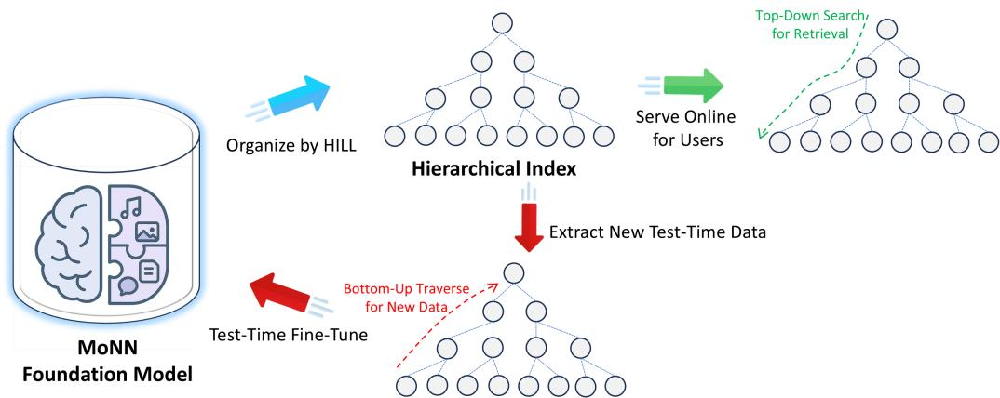
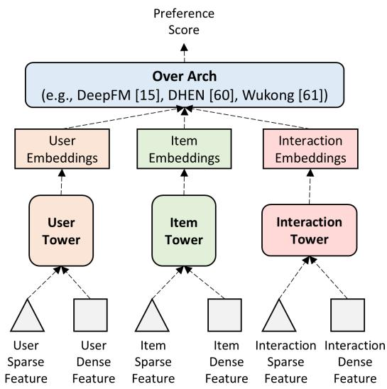
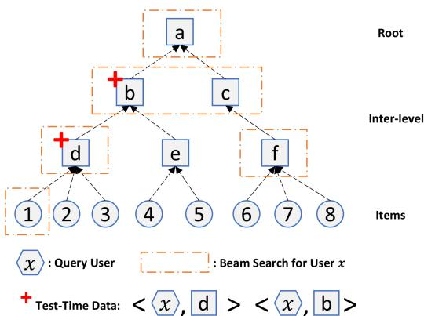
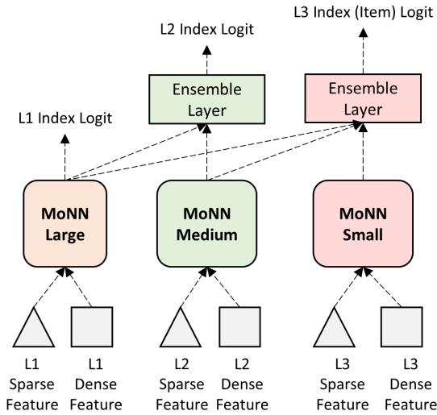

# Eficient Retrieval Scaling with Hierarchical Indexing for Large Scale Recommendation

Dongqi Fu dongqifu@meta.com Meta USA

Yunchen Pu pyc40@meta.com Meta USA

Yiqun Liu yiqliu@meta.com Meta USA

Fangzhou Xu fxu@meta.com Meta USA

Lin Yang ylin1@meta.com Meta USA

Kaushik Rangadurai krangadu@meta.com Meta USA

Siyang Yuan syyuan@meta.com Meta USA

Golnaz Ghasemiesfeh golnazghasemi@meta.com Meta USA

Andrew Cui andycui97@meta.com Meta USA

Liang Wang liangwang@meta.com Meta USA

Chonglin Sun clsun@meta.com Meta USA

Haiyu Lu hylu@meta.com Meta USA

Minhui Huang mhhuang@meta.com Meta USA

Xingfeng He xingfenghe@meta.com Meta USA

Vidhoon Viswanathan vidhoon@meta.com Meta USA

Jiyan Yang chocjy@meta.com Meta USA

## Abstract

The increase in data volume, computational resources, and model parameters during training has led to the development of numerous large-scale industrial retrieval models for recommendation tasks. However, efectively and eficiently deploying these largescale foundational retrieval models remains a critical challenge that has not been fully addressed. Common quick-win solutions for deploying these massive models include relying on ofline computations (such as cached user dictionaries) or distilling large models into smaller ones. Yet, both approaches fall short of fully leveraging the representational and inference capabilities of foundational models. In this paper, we explore whether it is possible to learn a hierarchical organization over the memory of foundational retrieval models. Such a hierarchical structure would enable more eficient search by reducing retrieval costs while preserving exactness. To achieve this, we propose jointly learning a hierarchical index using cross-attention and residual quantization for large-scale retrieval models. We also present its real-world deployment at Meta, supporting daily advertisement recommendations for billions of Facebook and Instagram users. Interestingly, we discovered that the intermediate nodes in the learned index correspond to a small set of high-quality data. Fine-tuning the model on this set further improves inference performance, and concretize the concept of "test-time training" within the recommendation system domain. We demonstrate these findings using both internal and public datasets with strong baseline comparisons and hope they contribute to the community’s eforts in developing the next generation of foundational retrieval models.

## Keywords

Foundation Retrieval Model, Hierarchical Index

## 1 Introduction

With the success of foundation models, substantial research has focused on exploring scaling laws [20, 25], such as those involving data volume, computational resources, and model parameters during training, with the aim of achieving improved performance at inference time. Building upon the scaling advancements in foundation language models, recent research has extended to foundation ranking and retrieval models for recommendation [1, 11, 16, 45, 65], catalyzing the development of numerous largescale industrial recommendation systems such as Wukong [62], HSTU [61], InterFormer [60], and ExFM [33].

However, given the surging development of enormous foundation models for ranking and retrieval in recommendation, how to deploy them to serve real-world (e.g., high frequency and heavy load) scenarios well is underexplored or not fully discussed. The most appealing concern can be the inference and retrieval cost. To leverage the inference ability of foundation retrieval models, passing the user and item features into the large-scale complex retrieval models to get the preference score prediction is often time-consuming and costly, especially when facing a massive volume of user-item pairs. For the above case, the quick win solution can include: (1) pre-computing the retrieval set for users ofline and serving the static result for a certain time window or (2) distilling the large models into small models and shipping them; but neither solutions fully release the representation and inference ability of large models.

  
Figure 1: Overall Pipeline of MoNN Foundation Retrieval Model with HILL Index.

In addition, previous related research shows that using an index structure to organize items such that approximately searching over this index (e.g., beam search) can reduce the search space and fast output similar pairs [12, 13, 30, 31, 36, 67], but not fit today’s large-scale foundation model scenario in industry, which usually adopts deep and complex-connected neural networks to learn sophisticated interaction between users and items with rich structured descriptions, to the best of our knowledge. Hence, it motivates our research to learn a hierarchical index over the memory of large-scale foundation retrieval models, such that just searching this exactness-aware hierarchical index can output the retrieval result fast by avoiding much unnecessary search space.

Therefore, in this paper, we first share our experience in deploying large-scale foundation retrieval models at Meta Ads Platform, i.e., learning the hierarchical index for foundation retrieval models helps it obtain an efective-eficiency-balanced stage. To be specific, we introduce our Hierarchical Index Learning method, called HILL, which aims to hierarchically organize the memory in the foundation retrieval model, such that the searching and retrieval along the structure can be speed up and maintain the exactness. To achieve this goal, HILL leverages the cross-attention mechanism and residual quantization learning and enjoys the co-training with the foundation retrieval model. Moreover, to emphasize the reproducibility, we also first time systematically decipher the foundation retrieval model at Meta, called Modular Neural Network (MoNN), which is currently in service for recommending advertisements to daily Facebook and Instagram users, in terms of neural architecture, training procedures, and loss functions.

Interestingly, we also found that the intermediate-level nodes in the built hierarchical index tree compose a small (compared to the volume of users and items) but high-quality data source, which can fine-tune the pre-trained retrieval model to achieve a "test-time training" inference upgrade [17, 48, 58]. In short, testtime training (TTT) refers to methods that update model parameters during inference and typically does not require ground-truth labels, which is primarily designed to improve and adapt the model rather than relying solely on pretraining.

The entire pipeline of MoNN and HILL learning the index for online service and extracting the new data pair for test-time training is shown in Figure 1, and the rest of the paper is organized as follows: In Section 2, we introduce the MoNN foundation model deployed at Meta for user advertisement retrieval to pave the way for introducing the hierarchical index learning method in Section 3. Starting from Section 4, we show various experiments, including ofline public dataset benchmark performance and online deployment service. After we discuss related work in Section 5, we finally conclude the paper with several future directions in Section 6.

## 2 Foundation Retrieval Model at Meta - MoNN

In this section, we briefly introduce the architecture of the foundation model deployed in Meta for retrieval, which is called Modular Neural Network (MoNN), and is flexible to operate under diferent infrastructure constraints.

  
Figure 2: A MoNN Block

In general, Modular Neural Network (MoNN) enhances the learning of sophisticated user and item interactions beyond a single dot product while maintaining high eficiency. As shown in Figure 2, MoNN has a modularized design comprising separate modules for user representations (User Tower), item representations (Item Tower), and the interaction between user and item (Interaction Tower).

User Tower. In short, the user tower takes user features to generate fixed-size user embeddings. These features can be dense (e.g., number of clicks by the user) and sparse (e.g., user engaged videos). Sparse features are processed by an embedding lookup table, and then all feature embeddings are concatenated and fed into the tower. Given that the user tower only needs to be computed once and shared across a vast number of items, it could scale up to very high complexity.

Item Tower. Similarly, the item tower mirrors the user tower, processing item dense (e.g., item historical click-through rate) and sparse features (e.g., content of item). Sparse features are input into another embedding lookup table, and all feature outputs are concatenated and fed into the tower.

Interaction Tower. The interaction tower operates on <user, item> interaction features (dense and sparse) as input. It follows a similar architecture to the user tower and item tower to produce the corresponding embeddings. To be more specific, the interaction tower is computationally intensive as it runs for each pair of user and item. To minimize the computation cost for <user, item> interaction features, we propose to use the Inverted Index Based Interaction Features (I2IF), where an inverted index is employed for indexing item information with user information written as a query to perform eficient crossing computation.

Over Architecture. Sitting atop the three underlying towers is called over architecture, short for OverArch, which is responsible for aggregating all information comprehensively and producing the user item preference score. OverArch can leverage DHEN [63] (or DeepFM [15], or Wukong [64]) to generate numerical logits.

Training Setup. Briefly, MoNN model is trained on a largescale training dataset with clicks and conversions as labels, impressions (non-click or conversion) as negatives, and additional unlabeled data used for semi-supervised learning to debias the model. A wide range of features (e.g., ?? (1000)) is used as input, and MoNN is optimized for multiple tasks, e.g., the click task and the conversion task. Hence, MoNN is then trained using a multi-task cross-entropy loss $\mathcal { L }$ as follows

$$
\mathcal {L} = \mathcal {L} _ {s u p} + \mathcal {L} _ {u n s u p}\tag{1}
$$

and the supervised loss function $\mathcal { L } _ { s u p }$ is expressed as

$$
\mathcal {L} _ {s u p} = \frac {- 1}{S} \sum_ {i = 1} ^ {S} \sum_ {t = 1} ^ {T} w _ {t} (y _ {t i} l o g (\hat {y} _ {t i}) + (1 - y _ {t i}) (l o g (1 - \hat {y} _ {t i})))\tag{2}
$$

where $w _ { t }$ is the weight for task $t , t \in \{ 1 , 2 , . . . , T \}$ , representing its importance. $y _ { t i } \in \{ 0 , 1 \}$ is the ground-truth label for sample ?? in task $t , \hat { y } _ { t i }$ is the predicted value of the model for sample ?? in task ??, and ?? is the number of samples. Similarly, the unsupervised loss function $\mathcal { L }$ is expressed as

$$
\mathcal {L} _ {u n s u p} = \frac {- 1}{S} \sum_ {i = 1} ^ {S} \sum_ {t = 1} ^ {T} d i s t i l l (\hat {y} _ {t i}, y _ {t i} ^ {m o d e l})\tag{3}
$$

where $y _ { t i } ^ { m o d e l }$ is the soft label generated by MoNN or another well-trained teacher model, and ?????????????? function can be instanced also as the cross-entropy.

## 3 Hierarchical Index Learning (HILL)

To avoid the tree construction process relying solely on item embeddings to lose information [12, 13, 30, 31, 36, 67], but retaining as much information as possible, we aim to design a learning-based tree construction method. Moreover, given the comprehensiveness of MoNN to take ample <user, item> information, we then design a joint learning method for the hierarchical index construction.

Formally, in this section, we introduce our Hierarchical Index Learning method, named HILL, which can build up the hierarchical structure to organize items to help the foundation retrieval model (like MoNN) to retrieve the most relevant items for users, and also produce a small amount of high-quality new data to fine-tune the model for test-time training efectiveness.

First, we briefly introduce the overview of HILL in Section 3.1. Stepping into details, we then introduce how to learn one layer mapping function in Section 3.2, how to residually stack up layers in Section 3.3, how to optimize the learning process in Section 3.4, an approximation learning manner in Section 3.5, and how to extract qualified new data in Section 3.6, respectively.

## 3.1 Overview

In Figure 3, we show a hierarchical index example learnt by our HILL method. To be more specific, in the illustration of Figure 3, we have 8 items ranging from 1 to 8. The learnt hierarchical is a three layer tree, with node ?? as the root. Given a user query ??, starting from root ??, a search algorithm (e.g., beam search with width as 2) locates item 1 as the most relevant item for user ??, which is included in the recommendation set for user ?? and avoids the heavy computing of the similarity from each item to the user ??.

  
Figure 3: A Hierarchical Index Example Learnt by HILL.

More importantly, in Figure 3, tracing from the leaf node 1 to the root node ??, HILL also identifies a valuable but hidden path, i.e., $1 \to d \to b \to a$ , which records the interested inter-level nodes that user ?? may also interest in. Since this tree is learnt, nodes ??, ??, ?? are virtual nodes and not appear in the training data, which has the potential to fine-tune the model with user item pairs <??, ??> and <??, ??>. The reason HILL selected ?? and ?? but excluded ?? is extended in Section 4.6.

## 3.2 One-Layer Attention Learning

To build up a hierarchical tree, the first fundamental step is to establish one layer, i.e., taking items as leaf nodes and mapping them to the upper level.

Taking MoNN as an example to provide user and item embeddings, we next introduce our one-layer attention learning algorithm, as shown in Algorithm 1, which takes the embedding vectors from a MoNN model as input and learns coarse index node embeddings for the item by minimizing the L2 distance between them. To be specific, our proposed algorithm employs an attention-based method by taking the item embedding as query, learnable embeddings for index nodes as keys and values, to calculate the index embeddings. With attention score, our algorithm allows the soft mapping during the training process, that is, one item can belong to multiple index nodes with varying weights.

Algorithm 1 One-Layer Attention Learning
Require: MoNN Model, Hyperparameter K
Ensure: Item-Index Mapping Function M, Embedding Matrix R of Index Nodes
1: Randomly initialize index nodes' embedding vectors  $\{c_{k}\}_{k=1}^{K}$ 
2: while not converge do
    /* Mini-Batch Training */
3:    for each item j in a batch do
4:    Sample a user-item pair &lt;i, j&gt; with label y, compute user embedding  $u_{i}$  and item embedding  $v_{j}$  and through MoNN
5:    Compute the distance between item j and index k as
6:    $d(j, k) = \|v_{j} - c_{k}\|^{2}$ 
7:    Compute the affinity between item j and index k as
8:    $a_{k} = \frac{e^{-\alpha*d(j,k)}}{\sum_{k'} e^{-\alpha*d(j,k')}}$ 
9:    Compute the pseudo item embedding by  $\bar{c} = \sum_{k} a_{k} c_{k}$ 
10:    Update MoNN optimization with new pair  $(y, \langle u_{i}, \bar{c} \rangle)$ 
11:    end for
    /* Finalize Index Embedding and Mapping*/
12:    for each k index node do
13:    for each item j in the corpora do
14:    Update M(j, k) by d(j, k)
15:    $c_{k} = v_{j}$ , if argmin_j d(j, k)
16:    end for
17:    end for
18: end while
19: Return function M and matrix R(k,:) =  $c_{k}$

## 3.3 Cross-Layer Residual Learning

Given that a single layer can be established, the next step is to stack it up iteratively. To make the index hierarchical, (i.e., the semantics of the upper level should depend on the lower level, and also store the information that lower level can not hold), inspired by residual quantization [29, 59], we aim to pass residue between input item embedding and the corresponding index node embedding at the lower level to its next index layer.

Recall Lines 8–9 in Algorithm 1, the index node representation learning is stored in the form (i.e., soft assignment or attentionbased aggregation) of pseudo item embedding. It gives us the possibility of aligned dimensions across layers in the hierarchical tree. In other words, for each layer, we can have a ground truth item embedding and a pseudo item embedding that is closely associated with the index embedding.

Mathematically, given ?? index nodes at each level1, and the ?? level to be established, our cross-layer residual learning can be expressed as follows: Suppose we have the initial embedding vectors for all items by asking the MoNN model, and the embedding vector for item $j .$ is denoted as $\upsilon _ { j } ;$ Then, we can denote the initial residual vector $r _ { j } ^ { 1 }$ for item ?? at the 1-st layer as

$$
\boldsymbol {r} _ {j} ^ {1} = \boldsymbol {v} _ {j}\tag{4}
$$

According to Lines 8–9 in Algorithm 1, HILL produces the pseudo item embedding vector $\bar { \pmb { c } } _ { j } ^ { 1 }$ for item ?? when mapping the 1- st layer to the 2-nd layer. Hence, the gap for the residual learning to mix can be expressed as follows. At each level $n \in \{ 2 , \ldots , N \}$ the recursive quantization of the residual vector is

$$
\boldsymbol {r} _ {j} ^ {n} = \boldsymbol {r} _ {j} ^ {n - 1} - \bar {\boldsymbol {c}} _ {j} ^ {n - 1}\tag{5}
$$

The above residual vector $r _ { j } ^ { n }$ will serve as the item representation learning when building the next layer, i.e., replacing Line 4 in Algorithm 1 that asks MoNN to provide item embeddings.

Consequently, at each level ??, the quantized embedding vector is computed as $\begin{array} { r } { \pmb q _ { j } ^ { n } = \sum _ { l = 1 } ^ { n - 1 } \bar { \pmb c } _ { j } ^ { l } } \end{array}$

The reconstruction loss $\scriptstyle { \mathcal { L } } _ { r e c o n }$ is computed as:

$$
\mathcal {L} _ {r e c o n} = \sum_ {j} \| \boldsymbol {q} _ {j} ^ {N} - \boldsymbol {v} \| ^ {2}\tag{6}
$$

The magnitude of residuals decreases when further moving down the hierarchy. As a result, a coarse index layer identifier expresses more general concepts, while a fine-grained index layer captures more detailed notions.

## 3.4 Optimization

In order to better optimize our HILL algorithm for the index building, a few additional techniques are introduced to improve the training stability, including softmax temperature scheduler, balanced index distribution, and warmup strategy.

Softmax Temperature Scheduler. In the serving stage, the embedding vector of index nodes will serve as virtual items to help the user query to retrieve a bunch of its relevant items. However, during the training process, our HILL algorithm uses a soft <item, index node> assignment, where each index node can be viewed as a combination of diferent interest items that can contain irrelevant items. To mitigate the discrepancy, a scheduler is applied by gradually increasing the temperature (alpha), transitioning from soft assignment in the initial phase to a hard assignment later on. Small values of alpha yield a balanced distribution of the item-to-index assignment, while large values of alpha result in a skewed distribution. The scheduler is based on the following function:

$$
a l p h a = m a x \_ a l p h a * \frac {c u r r e n t \_ i t e r ^ {e x p}}{m a x \_ i t e r s ^ {e x p}}\tag{7}
$$

Balanced Index Distribution. The index learning often suffers from cluster collapse, where the model utilizes only a limited subset of index nodes. A balanced index distribution is crucial to enable the use of neural network models with high complexity. Therefore, we employ the FLOPs regularizer to address this problem. The motivation stems from [40], which penalizes the model if all items are assigned to the same index node or if the distribution of <item, index node> assignment is imbalanced. Given it can be sensitive to smaller batches, data from the most recent ?? batches is pooled and the FLOPs regularizer is applied on the pooled soft assignment matrix $( K ^ { \star }$ batch\_size, num\_index\_nodes).

Warmup Strategy. A linear warm up strategy is employed for the index loss weight to gradually increase the learning rate, which is expected to stabilize the model parameters and mitigate the issue of item assignment oscillating between index nodes during the initial training phase.

## 3.5 Expectation–Maximization Approximation by FAISS

The essence of learning the hierarchical index for a foundation model is to make the memory of the foundation model structurally organized, such that the relevance retrieval can use the optimal path and prune unnecessary branches. In the above sections, we already discussed how to learn the index via the cotraining process. However, the co-training process inevitably involves the training of a foundation model, which can be infeasible during a short time window (e.g., hourly) and heavy workload (e.g., billion-scale users and million-scale items). In this viewpoint, we aim to propose an alternative learning method in case the computing resources are not adequate.

If we model the hierarchical index as an internal part of the well-trained foundation model, then we can solve the problem of learning the hierarchical index by using the Expectation-Maximization (EM) algorithm. To be more specific, if we view the index node as a (soft or hard) cluster of items, then we can model the item-index mapping as the hidden variables and user and item embedding as observation variables, such that the problem can be approximated as a Gaussian mixture model. Then, the E-step can be assigning each item its closest cluster and can be implemented by the GPU-enabled FAISS [8, 24] parallel clustering library, e.g., K-Means; and the M-step can be training the foundation model according to current index embeddings. This iterative EM-based approximation enables fast optimization when computing resources are not necessary or for small updates between two time windows. In the experiments, we also show that this approximation leads to acceptable efectiveness.

Again, when computing resources are suficient, a full version of HILL is recommended. The full version of HILL has advantages, including: (1) continuous training indexing with neural networks, which would be able to dynamically adapt to the latest data in the online streaming scenario; (2) avoiding the need to maintain diferent computational frameworks. The above conditions are important considerations for an industry-scale production system, to the best of our knowledge.

## 3.6 New Data from HILL to Enable Test-Time Training

In the last part, we aim to introduce how, after establishing the hierarchical index, we discover the new qualified training data to fine-tune the foundation model.

As shown in Figure 3, the beam search from top to the bottom finds the item 1 for user ??. If we traverse back, it is easy to identity a path: $1 \to d \to b \to a ,$ which implies that user ?? is also interested in index nodes ??, ??, and ??. Then, a natural question arises: can they make up new data pairs and help finetune the foundation model? The answer is positive, since we can intuitively interpret the intermediate-level index nodes as the machine-readable category nodes for items after the (pre-)training process, and pairing them with original users generates the new training data <user, index node> (e.g., <user ??, index ??> and <user ??, index ??>), which is not seen in the previous training iterations and expects to bring new information to fine-tune the model.

However, along this path, not all qualified intermediate-level index nodes are qualified enough to be selected to fine-tune the model. The first obvious clue is that the higher-level index nodes should be excluded from the new data set constructions, because the higher level an index node stands, the more general meaning it has. An extreme case is that the root node is shared by all users when we traverse back, such that adding <user, root> pair brings noise to the fine-tuning process. Therefore, the first hyperparameter for extracting the new data pairs, is how deep we traverse back from the bottom (i.e., item level), denoted as ???????? . For example, in the above case, ???????? is 2 for getting the new data <user $u ,$ index ??> and <user ??, index ??> for user ??.

Second, if we zoom in, index ?? or index ?? may also not qualify enough, because user ??’s interest can spread over ??’s items and other indices’ items. We model that if user ??’s interest concentrates only on ??’s items, then <user ??, index ??> is a qualified new data pair. Mathematically, we propose an interest rate parameter $\phi _ { I R } ,$ , which takes a user ?? and an index node ?? at level ??,

$$
\phi_ {I R} (u, i ^ {n}) = \frac {| I n t (u , n - 1) \cap C h i l d (i ^ {n}) |}{C h i l d (i ^ {n})}\tag{8}
$$

where ?????? (??, ?? − 1) is a function to return the interested items (or index nodes) at level ?? − 1 of the index tree, and ??ℎ?????? (?? ) returns the set of direct children of node $i ^ { n }$ at level $n - 1$

Therefore, we can use $\phi _ { I R }$ to filter out index nodes that only share a small portion of a certain user’s interest, when we compose the fine-tuning data pairs for this user. An intuitive understanding of $\phi _ { I R }$ can be: only if the user has very frequent preferences on <user, basketball> and <user, football>, and we discover <user, sports>; if user is interested in <user, basketball>, <user, music>, and <user, cooking>, then <user, sports> is not a strong signal. But again, in HILL, we did not dive deeper to learn to assign the human-readable semantic meaning for each index node, but only to use their embedding vectors.

Based on the above modeling, we discern that just a small ???????? and a large ?????? (??, ?? ) threshold can select a small portion of new data, with which the fine-tuning can achieve a significan performance gain. So far, we have only considered the positive strong signal in the above modeling, following the original loss during the fine-tuning. Moreover, weighing the new data pair with the weak signal and even negative signal, and adding contrastive learning loss functions during the fine-tuning process leave promising future directions.

## 4 Experiments

In this section, we introduce the datasets, baselines, metrics, ofline performance, and online service report.

## 4.1 Datasets

Here, we choose both public benchmark datasets and internal datasets to demonstrate the performance. For the public datasets, we select Gowalla, Yelp 2018, and Amazon-Book, as shown in Table 2, which records various user-item interactions and are publicly available2. The internal datasets are from daily Ads Recommendation tasks from Meta Platform.

## 4.2 Baselines

We select diferent categorical baselines, including (1) classic collaborative filtering methods, (2) neural collaborative filtering methods, (3) generative collaborative filtering methods, (4) industrial retrieval models, (5) general graph neural networks, and (6) graph neural network-inspired retrieval models. For the page limitation, we leave the reference of each baseline in Table 3.

Table 1: HILL-Enabled MoNN Performance with Baselines in Internal Data. $\mathbf { I } _ { 1 } , \mathbf { I } _ { 2 } , \mathbf { V }$ are in the order of O(1,000), O(100,000), O(10,000,000), $\mathbf { M } _ { s }$ denotes the model size of Small Model, and $\mathbf { M } _ { \mathrm { L } }$ denotes the model size of Large Model

<table><tr><td>Model Architecture</td><td>Eval NE (↓)</td><td>Recall (↑)</td><td>Infra Cost (↓)</td><td>Theoretical Cost</td></tr><tr><td>TTSN [3]</td><td>baseline</td><td>0%</td><td>1x</td><td> $M_{XS} \times V$ </td></tr><tr><td>EBR [23]</td><td>+0.03%</td><td>-0.1%</td><td>0.5x</td><td> $M_{XS} \times I_1$ </td></tr><tr><td>MoNN Small</td><td>-0.29%</td><td>+2.4%</td><td>2.5x</td><td> $M_S \times V$ </td></tr><tr><td>MoNN Medium</td><td>-0.70%</td><td>+4.2%</td><td>17.3x</td><td> $M_M \times V$ </td></tr><tr><td>MoNN Large</td><td>-1.70%</td><td>+9.4%</td><td>24.6x</td><td> $M_L \times V$ </td></tr><tr><td>2-layer MoNN(L1: MoNN Small, L2: TTSN)</td><td>-0.23%</td><td>+2.2%</td><td>1.7x</td><td> $M_S \times I_1 + M_{XS} \times V$ </td></tr><tr><td>2-layer MoNN(L1: MoNN Medium, L2: MoNN Small)</td><td>-0.47%</td><td>+3.6%</td><td>3.3x</td><td> $M_M \times I_1 + M_S \times V$ </td></tr><tr><td>2-layer MoNN(L1: MoNN Large, L2: MoNN Small)</td><td>-0.97%</td><td>+6.0%</td><td>3.9x</td><td> $M_L \times I_1 + M_S \times V$ </td></tr></table>

Table 2: Statistics of Public Benchmark Datasets.

<table><tr><td>Dataset</td><td># Users</td><td># Items</td><td># Interactions</td><td>Density</td></tr><tr><td>Gowalla</td><td>29,858</td><td>40,981</td><td>1,027,370</td><td>0.084%</td></tr><tr><td>Yelp2018</td><td>31,688</td><td>38,048</td><td>1,561,406</td><td>0.130%</td></tr><tr><td>Amazon-Book</td><td>55,188</td><td>9,912</td><td>1,445,622</td><td>0.062%</td></tr></table>

## 4.3 Metrics

To verify the retrieval performance, metrics in the experiments consist of Recall, Normalized Discounted Cumulative Gain (NDCG), and Normalized Entropy (NE)

Recall@?? measures the ability of a model to retrieve relevant items within the top-?? recommended list.

$$
\operatorname{Recall} @ K = \frac {\left| \operatorname{Rel} _ {u} \cap \operatorname{Rec} _ {u} ^ {K} \right|}{\left| \operatorname{Rel} _ {u} \right|}
$$

where $\mathrm { R e l } _ { u }$ denotes the set of relevant (ground-truth) items for user ??, and $\operatorname { R e c } _ { u } ^ { K }$ is the set of top-?? recommended items. Higher values indicate better coverage of relevant items. For the public datasets, we choose Recall@20.

NDCG@K accounts not only for the presence of relevant items in the recommendation list but also for their positions.

$$
\mathrm{NDCG@} K = \frac {1}{| \mathcal {U} |} \sum_ {u \in \mathcal {U}} \frac {\mathrm{DCG} _ {u} @ K}{\mathrm{IDCG} _ {u} @ K}
$$

where $\begin{array} { r } { \mathrm { D C G } _ { u } @ K = \sum _ { i = 1 } ^ { K } \frac { \mathbb { I } ( r _ { u , i } = 1 ) } { \log _ { \mathcal { I } } ( i + 1 ) } , \mathbb { I } ( y _ { u , i } = 1 ) } \end{array}$ indicates whether the ??-th item in the recommended list for user ?? is relevant, and IDC $\begin{array} { r } { \mathrm { { : } } \mathrm { G } _ { u } @ K = \sum _ { i = 1 } ^ { \operatorname* { m i n } ( K , | \mathrm { R e l } _ { u } | ) } \frac { 1 } { \log _ { 2 } ( i + 1 ) } } \end{array}$ . In other words, NDCG@K emphasizes recommending relevant items at higher ranks, and the higher the better.

NE is selected based on the previous recommendation lessons at Facebook [19]. Assume a given training data set has ?? examples with labels ???? ∈ {−1, +1} and estimated probability of click $\mathscr { p } _ { i }$ where $i = 1 , 2 , \ldots , N$ . The average empirical CTR as ${ \boldsymbol { p } } ,$ then

$$
N E = \frac {- \frac {1}{N} \sum_ {i = 1} ^ {n} \left(\frac {1 + y _ {i}}{2} \log (p _ {i}) + \frac {1 - y _ {i}}{2} \log (1 - p _ {i})\right)}{- (p \cdot \log (p) + (1 - p) \cdot \log (1 - p))}\tag{9}
$$

The reason for this normalization is that the closer the background CTR is to either 0 or 1, the easier it is to achieve a better log loss. Dividing by the entropy of the background CTR makes the NE insensitive to the background CTR. The lower the value, the better the prediction made by the model.

$$
\text { Normalized   Entropy@ } K = \frac {- \sum_ {i \in \mathcal {I}} p _ {i} \log p _ {i}}{\log | \mathcal {I} _ {K} |}\tag{10}
$$

## 4.4 Ofline Performance

Here, the performance will be demonstrated in two aspects, $\mathrm { i . e . }$ internal test, public benchmark, and ablation study to verify the important components.

Internal Test. The efectiveness and eficiency analysis of MoNN with baselines are shown in Table 1, where all MoNN models are equipped with joint optimization of HILL and show significant performance, $\mathrm { e . g . , } > 0 . 0 5 \%$ NE Gain is significant [19].

To be specific, in Table 1, by scaling up the model size, we can observe that MoNN Large performs the best, in terms of NE and Recall metrics. However, it brings considerable infrastructure cost. Therefore, we propose to stack MoNN blocks and make the lower level take the majority (but not all) of the data during the training . As shown in the last three rows of Table 1, which largely reduces the infrastructure cost and keeps the competitive efectiveness. In addition to theoretical eficiency analysis, we present the cost of serving the MoNN model based on the following parameters: $\mathbf { I } _ { 1 }$ (number of nodes in $\mathrm { L } _ { 1 }$ layer), $\mathbf { I } _ { 2 }$ (number of nodes in $\mathrm { L } _ { 2 }$ layer) and V (number of items in the corpus), $\mathbf { M } _ { X S }$ denotes the cost to serve Two Tower model, $\mathbf { M } _ { S }$ denotes the cost to serve MoNN Small, ${ \bf { M } } _ { M }$ the cost to serve MoNN Medium, $\mathbf { M } _ { L }$ the cost to serve MoNN Large.

Ablation Studies. After showing that HILL can serve the large retrieval model efectively and eficiently, we then execute ablation studies to verify our theoretical design.

First, we design three training tricks during HILL optimizations, i.e., Softmax Temperature Scheduler, Balanced Index Distribution, Warmup Strategy. In Table 4, we observe that (1) the full version of including all training tricks has the best performance; (2) removing each one can reduce the performance, and they do not conflict with each other; (3) the Softmax Temperature Scheduler has the most significant loss when it is removed.

Second, in Table 5, we show that the EM version of HILL can also achieve a competitive performance, given the NE loss is less than 0.04%, which also suggests that the full version of HILL has a fair reason to be considered when the computing resource allows

Table 3: Comparison of Baselines across Gowalla, Yelp2018, and Amazon-Book.

<table><tr><td rowspan="2">Baseline</td><td colspan="2">Gowalla</td><td colspan="2">Yelp 2018</td><td colspan="2">Amazon-Book</td></tr><tr><td>Recall@20</td><td>NDCG@20</td><td>Recall@20</td><td>NDCG@20</td><td>Recall@20</td><td>NDCG@20</td></tr><tr><td>BPR [43]</td><td>0.1627</td><td>0.1378</td><td>0.0576</td><td>0.0468</td><td>0.0338</td><td>0.0261</td></tr><tr><td>GRMF [42]</td><td>0.1477</td><td>0.1205</td><td>0.0571</td><td>0.0462</td><td>0.0354</td><td>0.0270</td></tr><tr><td>GRMF-norm [42]</td><td>0.1557</td><td>0.1261</td><td>0.0561</td><td>0.0454</td><td>0.0352</td><td>0.0269</td></tr><tr><td>HOP-Rec [56]</td><td>0.1399</td><td>0.1214</td><td>0.0517</td><td>0.0428</td><td>0.0309</td><td>0.0232</td></tr><tr><td>ENMF [4]</td><td>0.1523</td><td>0.1315</td><td>0.0624</td><td>0.0515</td><td>0.0359</td><td>0.0281</td></tr><tr><td>MF-CCL [39]</td><td>0.1837</td><td>0.1493</td><td>0.0698</td><td>0.0572</td><td>0.0559</td><td>0.0447</td></tr><tr><td>SimpleX [39]</td><td>0.1872</td><td>0.1557</td><td>0.0701</td><td>0.0575</td><td>0.0583</td><td>0.0468</td></tr><tr><td>NeuMF [52]</td><td>0.1399</td><td>0.1212</td><td>0.0451</td><td>0.0363</td><td>0.0258</td><td>0.0200</td></tr><tr><td>Mult-VAE [32]</td><td>0.1641</td><td>0.1335</td><td>0.0584</td><td>0.0450</td><td>0.0407</td><td>0.0315</td></tr><tr><td>Macrid-VAE [38]</td><td>0.1618</td><td>0.1202</td><td>0.0612</td><td>0.0495</td><td>0.0383</td><td>0.0295</td></tr><tr><td>YouTubeNet [7]</td><td>0.1754</td><td>0.1473</td><td>0.0686</td><td>0.0567</td><td>0.0502</td><td>0.0388</td></tr><tr><td>CMN [9]</td><td>0.1405</td><td>0.1221</td><td>0.0475</td><td>0.0369</td><td>0.0267</td><td>0.0218</td></tr><tr><td>CML [21]</td><td>0.1670</td><td>0.1292</td><td>0.0622</td><td>0.0536</td><td>0.0522</td><td>0.0428</td></tr><tr><td>DeepWalk [41]</td><td>0.1034</td><td>0.0740</td><td>0.0476</td><td>0.0378</td><td>0.0346</td><td>0.0264</td></tr><tr><td>LINE [49]</td><td>0.1335</td><td>0.1056</td><td>0.0549</td><td>0.0446</td><td>0.0410</td><td>0.0318</td></tr><tr><td>Node2Vec [14]</td><td>0.1019</td><td>0.0709</td><td>0.0452</td><td>0.0350</td><td>0.0402</td><td>0.0309</td></tr><tr><td>Item2Vec [2]</td><td>0.1325</td><td>0.1057</td><td>0.0503</td><td>0.0411</td><td>0.0326</td><td>0.0251</td></tr><tr><td>GAT [51]</td><td>0.1401</td><td>0.1401</td><td>0.0543</td><td>0.0431</td><td>0.0326</td><td>0.0235</td></tr><tr><td>JKNet [55]</td><td>0.1622</td><td>0.1391</td><td>0.0608</td><td>0.0502</td><td>0.0268</td><td>0.0343</td></tr><tr><td>DropEdge [44]</td><td>0.1627</td><td>0.1394</td><td>0.0614</td><td>0.0506</td><td>0.0342</td><td>0.0270</td></tr><tr><td>APPNP [26]</td><td>0.1708</td><td>0.1462</td><td>0.0635</td><td>0.0521</td><td>0.0384</td><td>0.0299</td></tr><tr><td>DisenGCN [37]</td><td>0.1356</td><td>0.1174</td><td>0.0558</td><td>0.0454</td><td>0.0329</td><td>0.0254</td></tr><tr><td>LightGCN [18]</td><td>0.1830</td><td>0.1554</td><td>0.0649</td><td>0.0530</td><td>0.0411</td><td>0.0315</td></tr><tr><td>GC-MC [50]</td><td>0.1395</td><td>0.1204</td><td>0.0462</td><td>0.0379</td><td>0.0288</td><td>0.0224</td></tr><tr><td>PinSage [57]</td><td>0.1380</td><td>0.1196</td><td>0.0471</td><td>0.0393</td><td>0.0282</td><td>0.0219</td></tr><tr><td>NIA-GCN [46]</td><td>0.1359</td><td>0.1106</td><td>0.0599</td><td>0.0491</td><td>0.0369</td><td>0.0287</td></tr><tr><td>SGL-ED [54]</td><td>0.1835</td><td>0.1539</td><td>0.0675</td><td>0.0555</td><td>0.0478</td><td>0.0379</td></tr><tr><td>DeosGCF [35]</td><td>0.1784</td><td>0.1477</td><td>0.0626</td><td>0.0504</td><td>0.0410</td><td>0.0316</td></tr><tr><td>IMP-GCN [34]</td><td>0.1845</td><td>0.1567</td><td>0.0653</td><td>0.0531</td><td>0.0460</td><td>0.0357</td></tr><tr><td>BUIR [28]</td><td>0.1575</td><td>0.1301</td><td>0.0647</td><td>0.0526</td><td>0.0439</td><td>0.0346</td></tr><tr><td>DGCF [53]</td><td>0.1842</td><td>0.1561</td><td>0.0654</td><td>0.0534</td><td>0.0422</td><td>0.0324</td></tr><tr><td>IA-GCN [66]</td><td>0.1839</td><td>0.1562</td><td>0.0659</td><td>0.0537</td><td>0.0472</td><td>0.0373</td></tr><tr><td>LT-OCF [6]</td><td>0.1875</td><td>0.1574</td><td>0.0671</td><td>0.0549</td><td>0.0442</td><td>0.0341</td></tr><tr><td>HMLET [27]</td><td>0.1874</td><td>0.1589</td><td>0.0675</td><td>0.0557</td><td>0.0482</td><td>0.0371</td></tr><tr><td>GTN [10]</td><td>0.1870</td><td>0.1588</td><td>0.0679</td><td>0.0554</td><td>0.0450</td><td>0.0346</td></tr><tr><td>MGDCF [22]</td><td>0.1864</td><td>0.1589</td><td>0.0696</td><td>0.0572</td><td>0.0490</td><td>0.0378</td></tr><tr><td>BSPM-LM [5]</td><td>0.1901</td><td>0.1570</td><td>0.0713</td><td>0.0584</td><td>0.0733</td><td>0.0610</td></tr><tr><td>NESCL [47]</td><td>0.1908</td><td>0.1614</td><td>0.0740</td><td>0.0609</td><td>0.0623</td><td>0.0509</td></tr><tr><td>HILL (Ours)</td><td>0.1924</td><td>0.1628</td><td>0.0745</td><td>0.0612</td><td>0.0625</td><td>0.0513</td></tr></table>

Table 4: Ablation Study of Training HILL, MoNN Small as Backbone, on Gowalla Dataset.

<table><tr><td>Training Variant</td><td>NE (↓)</td></tr><tr><td>w/o Softmax Temperature Scheduler</td><td>+0.10%</td></tr><tr><td>w/o Balanced Index Distribution</td><td>+0.05%</td></tr><tr><td>w/o Warmup Strategy</td><td>+0.03%</td></tr></table>

Table 5: Ablation Study of HILL Approximation, 2-Layer MoNN as Backbone, on Gowalla Dataset.

<table><tr><td>Model Architecture</td><td>NE (↓)</td></tr><tr><td>HILL</td><td>-0.15%</td></tr><tr><td>HILL (EM)</td><td>-0.11%</td></tr></table>

Public Benchmark. In addition to the internal datasets, we also conduct the experiments on the public dataset to show the efectiveness of HILL by choosing NESCL [47] as the retrieval model and learning the corresponding hierarchical index. To be specific, we first use the EM version of HILL to learn the hierarchical index; then, we extract the <user, index node> data pairs in the index to fine-tune the retrieval model, and finally report the performance in Table 3. For example, in the Gowalla dataset, the outperformance is obtained by setting ???????? = 2, ??ℎ?????? = 0.8 at the second layer, and ??ℎ?????? = 0.4 at the third layer.

Parameter Analysis. Then, a natural question arises: whether including more new data pairs can further improve the performance? To answer this question, we prepare the parameter analysis in Tables 6 and 7, which shows that the small amount but precise test-time data is suficient for the leading performance.

Table 6: Performance with diferent ??DEP.

<table><tr><td> $\phi_{\text{DEP}}$ </td><td># Nodes per Inter-layer</td><td> $\phi_{\text{IR}}$ </td><td>Recall@20</td><td>NDCG@20</td></tr><tr><td>1</td><td>8000</td><td>0.8</td><td>0.1922</td><td>0.1624</td></tr><tr><td>2</td><td>8000, 800</td><td>0.8, 0.4</td><td>0.1924</td><td>0.1628</td></tr><tr><td>3</td><td>8000, 800, 80</td><td>0.8, 0.4, 0.2</td><td>0.1922</td><td>0.1624</td></tr><tr><td>4</td><td>8000, 8000, 80, 8</td><td>0.8, 0.4, 0.2, 0.1</td><td>0.1916</td><td>0.1623</td></tr></table>

Table 7: Performance with diferent $\phi _ { \mathbf { I R } }$ .

<table><tr><td> $\phi_{\text{DEP}}$ </td><td># Nodes per Inter-layer</td><td> $\phi_{\text{IR}}$ </td><td>Recall@20</td><td>NDCG@20</td></tr><tr><td>1</td><td>8000, 800</td><td>0.8, 0.1</td><td>0.1916</td><td>0.1624</td></tr><tr><td>1</td><td>8000, 800</td><td>0.8, 0.2</td><td>0.1923</td><td>0.1629</td></tr><tr><td>1</td><td>8000, 800</td><td>0.8, 0.3</td><td>0.1914</td><td>0.1624</td></tr><tr><td>1</td><td>8000, 800</td><td>0.8, 0.4</td><td>0.1924</td><td>0.1628</td></tr><tr><td>1</td><td>8000, 800</td><td>0.8, 0.5</td><td>0.1914</td><td>0.1623</td></tr><tr><td>1</td><td>8000, 800</td><td>0.8, 0.6</td><td>0.1924</td><td>0.1620</td></tr><tr><td>1</td><td>8000, 800</td><td>0.8, 0.7</td><td>0.1925</td><td>0.1623</td></tr></table>

## 4.5 Online Service Report

The MoNN foundation retrieval model has been successfully deployed at Meta for Ads Retrieval. Prior to the deployment of MoNN Large, we first launched the MoNN Small architecture to production, given the relatively low infra cost. As shown in Table 8, online A/B tests demonstrate that 2-Layer MoNN led to 2.57% online ads metric gains.

Table 8: Online performance in Meta Ads Production.

<table><tr><td>Model Architecture</td><td>Online Metric (↑)</td></tr><tr><td>TTSN</td><td>-0.21%</td></tr><tr><td>MoNN Small</td><td>baseline</td></tr><tr><td>2-Layer MoNN(L1: MoNN Medium, L2: MoNN Small)</td><td>+1.22%</td></tr><tr><td>2-Layer MoNN(L1: MoNN Large, L2: MoNN Small)</td><td>+2.57%</td></tr></table>

## 4.6 Details of Deploying MoNN

In this section, we introduce the stacked MoNN model. Figure 4 shows a 3-layer MoNN model architecture: $\mathrm { L } _ { 1 }$ layer, L layer, and $\mathrm { L } _ { 3 }$ layer. The $\mathrm { L } _ { 1 }$ layer operates on the coarsest index granularity and it is able to take advantage of a MoNN model architecture with the highest complexity (through computation sharing) and a wide range of interaction features (<user, $\mathrm { L } _ { 1 }$ index node>). Then, the $\mathrm { L } _ { 3 }$ index operates on the finest granularity (in extreme case, it can be item level directly) and leverages a MoNN block with the lowest complexity. The three MoNN modules are combined using the ensemble layer. This manner allows final prediction to leverage multiple MoNNs with diferent model complexity to consume diferent granularity of features, resulting in a more accurate prediction.

Features. MoNN Small processes features at the individual item level, utilizing user features, item features, and <user, item> interaction features. In contrast, MoNN Medium and MoNN Large operate at a coarser granularity $( \mathrm { L } _ { 2 }$ layer and $\mathrm { L } _ { 1 }$ layer, respectively) and consume user features, index node features, and <user, index node> interaction features, where index node is replaced by a representative item for feature computation.

  
Figure 4: 3-Layer MoNN Illustration Example.

Loss Function. Each layer of multi-layer MoNN has its own loss function, i.e., with 1 <user, item> prediction loss function and <user, index node> prediction loss function.

## 5 Related Work

To support retrieval models, prior works suggest that organizing candidate items into index structures can reduce the search space and expedite the identification of relevant item-user pairs [12, 13, 30, 31, 36, 67]. However, such methods are often inadequate for modern industrial-scale foundation models, which typically employ deep, densely connected neural architectures to capture complex user-item interactions enriched with structured contextual information. To the best of our knowledge, existing indexing techniques fall short of addressing the exactness and scalability demands of these models. Motivated by this limitation, we propose to learn a hierarchical index tailored to the memory components of large-scale foundation retrieval models. This index is designed to support exactness-aware search, enabling eficient inference by bypassing redundant search paths and thereby reducing unnecessary computational overhead.

Meanwhile, the notion of scaling laws at training has recently been extended to the context of foundation models for ranking and retrieval [1, 11, 16, 20, 25, 45, 65]. Test-time training strategies in recommendation systems remain largely underexplored. Our work aims to address this gap and spark further research into eficient and scalable inference for foundation retrieval models.

## 6 Conclusion

To make the large-scale foundation retrieval model serve efectively and eficiently, in this paper, we propose the hierarchical index learning method HILL to learn the index structure over the memory of the foundation model, taking MoNN (i.e., a deployed retrieval model at Meta for Ads Retrieval) for illustration. Moreover, we found that learnt index convey a small set of new and high-quality data pairs that can be used to test-time fine-tune the model to boost the performance.

## References

[1] Newsha Ardalani, Carole-Jean Wu, Zeliang Chen, Bhargav Bhushanam, and Adnan Aziz 2022, Understanding Scaling Laws for Recommendation Models CoRR abs/2208 08489 (2022),doi:10 48550/ARXIV 2208 08489 arXiv:2208 08489

[2] Oren Barkan and Noam Koenigstein. 2016. ITEM2VEC: Neural item embedding for collaborative filtering. In 26th IEEE International Workshop on Machine Learning for Signal Processing, MLSP 2016, Vietri sul Mare, Salerno, Italy, September 13-16, 2016, Francesco A. N. Palmieri, Aurelio Uncini, Kostas I. Diamantaras, and Jan Larsen (Eds.). IEEE, 1–6. doi:10.1109/MLSP.2016.7738886

[3] Jane Bromley, Isabelle Guyon, Yann LeCun, Eduard Säckinger, and Roopak Shah. 1993. Signature Verification Using a Siamese Time Delay Neural Network. In Advances in Neural Information Processing Systems 6, [7th NIPS Conference, Denver, Colorado, USA, 1993], Jack D. Cowan, Gerald Tesauro, and Joshua Alspector (Eds.). Morgan Kaufmann, 737–744. http://papers.nips.cc/paper/769- signature-verification-using-a-siamese-time-delay-neural-network

[4] Chong Chen, Min Zhang, Yongfeng Zhang, Yiqun Liu, and Shaoping Ma. 2020. Eficient Neural Matrix Factorization without Sampling for Recommendation. ACM Trans. Inf. Syst. 38, 2 (2020), 14:1–14:28. doi:10.1145/3373807

[5] Jeongwhan Choi, Seoyoung Hong, Noseong Park, and Sung-Bae Cho. 2023. Blurring-Sharpening Process Models for Collaborative Filtering. In Proceedings of the 46th International ACM SIGIR Conference on Research and Development in Information Retrieval, SIGIR 2023, Taipei, Taiwan, July 23-27, 2023, Hsin-Hsi Chen, Wei-Jou (Edward) Duh, Hen-Hsen Huang, Makoto P. Kato, Josiane Mothe, and Barbara Poblete (Eds.). ACM, 1096–1106. doi:10.1145/3539618. 3591645

[6] Jeongwhan Choi, Jinsung Jeon, and Noseong Park. 2021. LT-OCF: Learnable-Time ODE-based Collaborative Filtering. In CIKM ’21: The 30th ACM International Conference on Information and Knowledge Management, Virtual Event, Queensland, Australia, November 1 - 5, 2021, Gianluca Demartini, Guido Zuccon, J. Shane Culpepper, Zi Huang, and Hanghang Tong (Eds.). ACM, 251–260. doi:10.1145/3459637.3482449

[7] Paul Covington, Jay Adams, and Emre Sargin. 2016. Deep Neural Networks for YouTube Recommendations. In Proceedings of the 10th ACM Conference on Recommender Systems, Boston, MA, USA, September 15-19, 2016, Shilad Sen, Werner Geyer, Jill Freyne, and Pablo Castells (Eds.). ACM, 191–198. doi:10 1145/2959100.2959190

[8] Matthijs Douze, Alexandr Guzhva, Chengqi Deng, Jef Johnson, Gergely Szilvasy, Pierre-Emmanuel Mazaré, Maria Lomeli, Lucas Hosseini, and Hervé Jégou. 2024. The Faiss library. CoRR abs/2401.08281 (2024). doi:10.48550/ ARXIV.2401.08281 arXiv:2401.08281

[9] Travis Ebesu, Bin Shen, and Yi Fang. 2018. Collaborative Memory Network for Recommendation Systems. In The 41st International ACM SIGIR Conference on Research & Development in Information Retrieval, SIGIR 2018, Ann Arbor, MI, USA, July 08-12, 2018, Kevyn Collins-Thompson, Qiaozhu Mei, Brian D Davison, Yiqun Liu, and Emine Yilmaz (Eds.). ACM, 515–524. doi:10.1145/ 3209978.3209991

[10] Wenqi Fan, Xiaorui Liu, Wei Jin, Xiangyu Zhao, Jiliang Tang, and Qing Li. 2022. Graph Trend Filtering Networks for Recommendation. In SIGIR ’22: The 45th International ACM SIGIR Conference on Research and Development in Information Retrieval, Madrid, Spain, July 11 - 15, 2022, Enrique Amigó, Pablo Castells, Julio Gonzalo, Ben Carterette, J. Shane Culpepper, and Gabriella Kazai (Eds.). ACM, 112–121. doi:10.1145/3477495.3531985

[11] Yan Fang, Jingtao Zhan, Qingyao Ai, Jiaxin Mao, Weihang Su, Jia Chen, and Yiqun Liu. 2024. Scaling Laws For Dense Retrieval. In Proceedings of the 47th International ACM SIGIR Conference on Research and Development in Information Retrieval, SIGIR 2024, Washington DC, USA, July 14-18, 2024, Grace Hui Yang, Hongning Wang, Sam Han, Claudia Hauf, Guido Zuccon, and Yi Zhang (Eds.). ACM, 1339–1349. doi:10.1145/3626772.3657743

[12] Chao Feng, Wuchao Li, Defu Lian, Zheng Liu, and Enhong Chen. 2022. Recommender Forest for Eficient Retrieval. In Advances in Neural Information Processing Systems 35: Annual Conference on Neural Information Processing Systems 2022, NeurIPS 2022, New Orleans, LA, USA, November 28 - December 9, 2022, Sanmi Koyejo, S. Mohamed, A. Agarwal, Danielle Belgrave, K. Cho, and A. Oh (Eds.). http://papers.nips.cc/paper\_files/paper/2022/hash fe2fe749d329627f161484876630c689-Abstract-Conference html

[13] Weihao Gao, Xiangjun Fan, Chong Wang, Jiankai Sun, Kai Jia, Wenzhi Xiao, Ruofan Ding, Xingyan Bin, Hui Yang, and Xiaobing Liu. 2020. Deep retrieval: learning a retrievable structure for large-scale recommendations. arXiv preprint arXiv:2007.07203 (2020).

[14] Aditya Grover and Jure Leskovec. 2016. node2vec: Scalable Feature Learning for Networks In Proceedings of the 22nd ACM SIGKDD International Conference on Knowledge Discovery and Data Mining, San Francisco, CA, USA, August 13- 17, 2016, Balaji Krishnapuram, Mohak Shah, Alexander J. Smola, Charu C. Aggarwal, Dou Shen, and Rajeev Rastogi (Eds.). ACM, 855–864. doi:10.1145 2939672.2939754

[15] Huifeng Guo, Ruiming Tang, Yunming Ye, Zhenguo Li, and Xiuqiang He. 2017. DeepFM: A Factorization-Machine based Neural Network for CTR Prediction. In Proceedings of the Twenty-Sixth International Joint Conference on Artificial Intelligence, IJCAI 2017, Melbourne, Australia, August 19-25, 2017, Carles Sierra (Ed.). ijcai.org, 1725–1731. doi:10.24963/IJCAI.2017/239

[16] Wei Guo, Hao Wang, Luankang Zhang, Jin Yao Chin, Zhongzhou Liu, Kai Cheng, Qiushi Pan, Yi Quan Lee, Wanqi Xue, Tingjia Shen, Kenan Song, Kefan Wang, Wenjia Xie, Yuyang Ye, Huifeng Guo, Yong Liu, Defu Lian, Ruiming Tang, and Enhong Chen. 2024. Scaling New Frontiers: Insights into Large Recommendation Models. CoRR abs/2412.00714 (2024). doi:10.48550/ARXIV. 2412.00714 arXiv:2412.00714

[17] Moritz Hardt and Yu Sun. 2024. Test-Time Training on Nearest Neighbors for Large Language Models. In The Twelfth International Conference on Learning

Representations, ICLR 2024, Vienna, Austria, May 7-11, 2024. OpenReview.net. https://openreview.net/forum?id=CNL2bku4ra

[18] Xiangnan He, Kuan Deng, Xiang Wang, Yan Li, Yong-Dong Zhang, and Meng Wang. 2020. LightGCN: Simplifying and Powering Graph Convolution Network for Recommendation. In Proceedings of the 43rd International ACM SIGIR conference on research and development in Information Retrieval, SIGIR 2020, Virtual Event, China, July 25-30, 2020, Jimmy X. Huang, Yi Chang, Xueqi Cheng, Jaap Kamps, Vanessa Murdock, Ji-Rong Wen, and Yiqun Liu (Eds.). ACM, 639–648. doi:10.1145/3397271.3401063

[19] Xinran He, Junfeng Pan, Ou Jin, Tianbing Xu, Bo Liu, Tao Xu, Yanxin Shi, Antoine Atallah, Ralf Herbrich, Stuart Bowers, and Joaquin Quiñonero Candela. 2014. Practical Lessons from Predicting Clicks on Ads at Facebook. In Proceedings of the Eighth International Workshop on Data Mining for Online Advertising, ADKDD 2014, August 24, 2014, New York City, New York, USA, Esin Saka, Dou Shen, Kuang-chih Lee, and Ying Li (Eds.). ACM, 5:1–5:9. doi:10.1145/2648584.2648589

[20] Jordan Hofmann, Sebastian Borgeaud, Arthur Mensch, Elena Buchatskaya, Trevor Cai, Eliza Rutherford, Diego de Las Casas, Lisa Anne Hendricks, Johannes Welbl, Aidan Clark, Tom Hennigan, Eric Noland, Katie Millican, George van den Driessche, Bogdan Damoc, Aurelia Guy, Simon Osindero, Karen Simonyan, Erich Elsen, Jack W. Rae, Oriol Vinyals, and Laurent Sifre. 2022. Training Compute-Optimal Large Language Models. CoRR abs/2203.15556 (2022). doi:10.48550/ARXIV.2203.15556 arXiv:2203.15556

[21] Cheng-Kang Hsieh, Longqi Yang, Yin Cui, Tsung-Yi Lin, Serge J. Belongie, and Deborah Estrin. 2017. Collaborative Metric Learning. In Proceedings of the 26th International Conference on World Wide Web, WWW 2017, Perth, Australia, April 3-7, 2017, Rick Barrett, Rick Cummings, Eugene Agichtein, and Evgeniy Gabrilovich (Eds.). ACM, 193–201. doi:10.1145/3038912.3052639

[22] Jun Hu, Bryan Hooi, Shengsheng Qian, Quan Fang, and Changsheng Xu. 2024. MGDCF: Distance Learning via Markov Graph Difusion for Neural Collaborative Filtering. IEEE Trans. Knowl. Data Eng. 36, 7 (2024), 3281–3296. doi:10.1109/TKDE.2023.3348537

[23] Jui-Ting Huang, Ashish Sharma, Shuying Sun, Li Xia, David Zhang, Philip Pronin, Janani Padmanabhan, Giuseppe Ottaviano, and Linjun Yang. 2020. Embedding-based Retrieval in Facebook Search. In KDD ’20: The 26th ACM SIGKDD Conference on Knowledge Discovery and Data Mining, Virtual Event, CA, USA, August 23-27, 2020, Rajesh Gupta, Yan Liu, Jiliang Tang, and B. Aditya Prakash (Eds) ACM. 2553=2561 doi:10.1145/3394486.3403305

[24] Jef Johnson, Matthijs Douze, and Hervé Jégou. 2021. Billion-Scale Similarity Search with GPUs. IEEE Trans. Big Data 7, 3 (2021), 535–547. doi:10.1109/ TBDATA.2019.2921572

[25] Jared Kaplan, Sam McCandlish, Tom Henighan, Tom B. Brown, Benjamin Chess, Rewon Child, Scott Gray, Alec Radford, Jefrey Wu, and Dario Amodei. 2020. Scaling Laws for Neural Language Models. CoRR abs/2001.08361 (2020). arXiv:2001.08361 https://arxiv.org/abs/2001.08361

[26] Johannes Klicpera, Aleksandar Bojchevski, and Stephan Günnemann. 2019. Predict then Propagate: Graph Neural Networks meet Personalized PageRank. In 7th International Conference on Learning Representations, ICLR 2019, New Orleans, LA, USA, May 6-9, 2019. OpenReview.net. https://openreview.net/ forum?id=H1gL-2A9Ym

[27] Taeyong Kong, Taeri Kim, Jinsung Jeon, Jeongwhan Choi, Yeon-Chang Lee, Noseong Park, and Sang-Wook Kim. 2022. Linear, or Non-Linear, That is the Question!. In WSDM ’22: The Fifteenth ACM International Conference on Web Search and Data Mining, Virtual Event / Tempe, AZ, USA, February 21 - 25, 2022, K. Selcuk Candan, Huan Liu, Leman Akoglu, Xin Luna Dong, and Jiliang Tang (Eds.). ACM, 517–525. doi:10.1145/3488560.3498501

[28] Dongha Lee, SeongKu Kang, Hyunjun Ju, Chanyoung Park, and Hwanjo Yu. 2021. Bootstrapping User and Item Representations for One-Class Collaborative Filtering In SIGIR '21: The 44th International ACM SIGIR Conference on Research and Development in Information Retrieval, Virtual Event, Canada, July 11-15, 2021, Fernando Diaz, Chirag Shah, Torsten Suel, Pablo Castells, Rosie Jones, and Tetsuya Sakai (Eds.). ACM, 1513–1522. doi:10.1145/3404835.3462935

[29] Doyup Lee, Chiheon Kim, Saehoon Kim, Minsu Cho, and Wook-Shin Han. 2022. Autoregressive Image Generation using Residual Quantization. arXiv:2203 01941 [cs CV]

[30] Haitao Li, Qingyao Ai, Jingtao Zhan, Jiaxin Mao, Yiqun Liu, Zheng Liu, and Zhao Cao 2023 Constructing Tree-based Index for Efficient and Effective Dense Retrieval. In Proceedings of the 46th International ACM SIGIR Conference on Research and Development in Information Retrieval, SIGIR 2023, Taipei, Taiwan, July 23-27, 2023, Hsin-Hsi Chen, Wei-Jou (Edward) Duh, Hen-Hsen Huang, Makoto P. Kato, Josiane Mothe, and Barbara Poblete (Eds.). ACM, 131–140. doi:10.1145/3539618.3591651

[31] Wuchao Li, Kai Zheng, Defu Lian, Qi Liu, Wentian Bao, Yunen Yu, Yang Song, Han Li, and Kun Gai. 2025. Making Transformer Decoders Better Diferentiable Indexers. In The Thirteenth International Conference on Learning Representations, ICLR 2025, Singapore, April 24-28, 2025. OpenReview.net. https: //openreview.net/forum?id=bePaRx0otZ

[32] Dawen Liang, Rahul G. Krishnan, Matthew D. Hofman, and Tony Jebara. 2018. Variational Autoencoders for Collaborative Filtering. In Proceedings of the 2018 World Wide Web Conference on World Wide Web, WWW 2018, Lyon, France, April 23-27, 2018, Pierre-Antoine Champin, Fabien Gandon, Mounia Lalmas, and Panagiotis G. Ipeirotis (Eds.). ACM, 689–698. doi:10.1145/3178876.3186150

[33] Mingfu Liang, Xi Liu, Rong Jin, Boyang Liu, Qiuling Suo, Qinghai Zhou, Song Zhou, Laming Chen, Hua Zheng, Zhiyuan Li, Shali Jiang, Jiyan Yang, Xiaozhen

Xia, Fan Yang, Yasmine Badr, Ellie Wen, Shuyu Xu, Hansey Chen, Zhengyu Zhang, Jade Nie, Chunzhi Yang, Zhichen Zeng, Weilin Zhang, Xingliang Huang, Qianru Li, Shiquan Wang, Evelyn Lyu, Wenjing Lu, Rui Zhang, Wenjun Wang, Jason Rudy, Mengyue Hang, Kai Wang, Bo Long, Wenlin Chen, Santanu Kolay, and Huayu Li. 2025. External Large Foundation Model: How to Eficiently Serve Trillions of Parameters for Online Ads Recommendation. In Companion Proceedings of the ACM on Web Conference 2025, WWW 2025, Sydney, NSW, Australia, 28 April 2025 - 2 May 2025, Guodong Long, Michale Blumestein, Yi Chang, Liane Lewin-Eytan, Zi Helen Huang, and Elad Yom-Tov (Eds.). ACM, 344–353. doi:10.1145/3701716.3715223

[34] Fan Liu, Zhiyong Cheng, Lei Zhu, Zan Gao, and Liqiang Nie. 2021. Interestaware Message-Passing GCN for Recommendation. In WWW ’21: The Web Conference 2021, Virtual Event / Ljubljana, Slovenia, April 19-23, 2021, Jure Leskovec, Marko Grobelnik, Marc Najork, Jie Tang, and Leila Zia (Eds.). ACM / IW3C2, 1296–1305. doi:10.1145/3442381.3449986

[35] Zhiwei Liu, Lin Meng, Fei Jiang, Jiawei Zhang, and Philip S. Yu. 2022. Deoscillated Adaptive Graph Collaborative Filtering. In Topological, Algebraic and Geometric Learning Workshops 2022, 25-22 July 2022, Virtual (Proceedings of Machine Learning Research, Vol. 196), Alexander Cloninger, Timothy Doster, Tegan Emerson, Manohar Kaul, Ira Ktena, Henry Kvinge, Nina Miolane, Bastian Rice, Sarah Tymochko, and Guy Wolf (Eds.). PMLR, 248–257. https://proceedings.mlr.press/v196/liu22b.html

[36] Ze Liu, Jin Zhang, Chao Feng, Defu Lian, Jie Wang, and Enhong Chen. 2024. Learning Deep Tree-based Retriever for Eficient Recommendation: Theory and Method. arXiv preprint arXiv:2408.11345 (2024).

[37] Jianxin Ma, Peng Cui, Kun Kuang, Xin Wang, and Wenwu Zhu. 2019. Disentangled Graph Convolutional Networks. In Proceedings of the 36th International Conference on Machine Learning, ICML 2019, 9-15 June 2019, Long Beach, California, USA (Proceedings of Machine Learning Research, Vol. 97), Kamalika Chaudhuri and Ruslan Salakhutdinov (Eds.). PMLR, 4212–4221. http://proceedings.mlr.press/v97/ma19a.html

[38] Jianxin Ma, Chang Zhou, Peng Cui, Hongxia Yang, and Wenwu Zhu. 2019. Learning Disentangled Representations for Recommendation. In Advances in Neural Information Processing Systems 32: Annual Conference on Neural Information Processing Systems 2019, NeurIPS 2019, December 8-14, 2019, Vancouver, BC, Canada, Hanna M. Wallach, Hugo Larochelle, Alina Beygelzimer, Florence d’Alché-Buc, Emily B. Fox, and Roman Garnett (Eds.). 5712–5723. https://proceedings.neurips.cc/paper/2019/hash/ a2186aa7c086b46ad4e8bf81e2a3a19b-Abstract.html

[39] Kelong Mao, Jieming Zhu, Jinpeng Wang, Quanyu Dai, Zhenhua Dong, Xi Xiao, and Xiuqiang He. 2021. SimpleX: A Simple and Strong Baseline for Collaborative Filtering. In CIKM ’21: The 30th ACM International Conference on Information and Knowledge Management, Virtual Event, Queensland, Australia, November 1 - 5, 2021, Gianluca Demartini, Guido Zuccon, J. Shane Culpepper, Zi Huang, and Hanghang Tong (Eds.). ACM, 1243–1252. doi:10.1145/3459637. 3482297

[40] Biswajit Paria, Chih-Kuan Yeh, Ian E. H. Yen, Ning Xu, Pradeep Ravikumar, and Barnabás Póczos. 2020. Minimizing FLOPs to Learn Eficient Sparse Representations. arXiv:2004.05665 [cs.LG]

[41] Bryan Perozzi, Rami Al-Rfou, and Steven Skiena. 2014. DeepWalk: online learning of social representations. In The 20th ACM SIGKDD International Conference on Knowledge Discovery and Data Mining, KDD ’14, New York, NY, USA - August 24 - 27, 2014, Sofus A. Macskassy, Claudia Perlich, Jure Leskovec, Wei Wang, and Rayid Ghani (Eds.). ACM, 701–710. doi:10.1145/ 2623330.2623732

[42] Nikhil Rao, Hsiang-Fu Yu, Pradeep Ravikumar, and Inderjit S. Dhillon. 2015. Collaborative Filtering with Graph Information: Consistency and Scalable Methods. In Advances in Neural Information Processing Systems 28: Annual Conference on Neural Information Processing Systems 2015, December 7-12, 2015, Montreal, Quebec, Canada, Corinna Cortes, Neil D. Lawrence, Daniel D. Lee, Masashi Sugiyama, and Roman Garnett (Eds.). 2107–2115. https://proceedings.neurips.cc/paper/2015/hash/ f4573fc71c731d5c362f0d7860945b88-Abstract html

[43] Stefen Rendle, Christoph Freudenthaler, Zeno Gantner, and Lars Schmidt-Thieme. 2009. BPR: Bayesian Personalized Ranking from Implicit Feedback. In UAI 2009, Proceedings of the Twenty-Fifth Conference on Uncertainty in Artificial Intelligence Montreal OC Canada Fune 18-21 2009 Jeff A Bilmes and Andrew Y. Ng (Eds.). AUAI Press, 452–461. https://www.auai.org/uai2009 papers/UAI2009\_0139\_48141db02b9f0b02bc7158819ebfa2c7.pdf

[44] Yu Rong, Wenbing Huang, Tingyang Xu, and Junzhou Huang. 2020. DropEdge: Towards Deep Graph Convolutional Networks on Node Classification. In 8th International Conference on Learning Representations, ICLR 2020, Addis Ababa, Ethiopia, April 26-30, 2020. OpenReview.net. https://openreview.net/forum? id=Hkx1qkrKPr

[45] Kyuyong Shin, Hanock Kwak, Su Young Kim, Max Nihlén Ramström, Jisu Jeong, Jung-Woo Ha, and Kyung-Min Kim. 2023. Scaling Law for Recommendation Models: Towards General-Purpose User Representations. In Thirty-Seventh AAAI Conference on Artificial Intelligence, AAAI 2023, Thirty-Fifth Conference on Innovative Applications of Artificial Intelligence, IAAI 2023, Thirteenth Symposium on Educational Advances in Artificial Intelligence, EAAI 2023, Washington, DC, USA, February 7-14, 2023, Brian Williams, Yiling Chen, and Jennifer Neville (Eds.). AAAI Press, 4596–4604. doi:10.1609/AAAI.V37I4.25582

[46] Jianing Sun, Yingxue Zhang, Wei Guo, Huifeng Guo, Ruiming Tang, Xiuqiang He, Chen Ma, and Mark Coates. 2020. Neighbor Interaction Aware Graph

Convolution Networks for Recommendation. In Proceedings of the 43rd International ACM SIGIR conference on research and development in Information Retrieval, SIGIR 2020, Virtual Event, China, July 25-30, 2020, Jimmy X. Huang, Yi Chang, Xueqi Cheng, Jaap Kamps, Vanessa Murdock, Ji-Rong Wen, and Yiqun Liu (Eds.). ACM, 1289–1298. doi:10.1145/3397271.3401123

[47] Peijie Sun, Le Wu, Kun Zhang, Xiangzhi Chen, and Meng Wang. 2024. Neighborhood-Enhanced Supervised Contrastive Learning for Collaborative Filtering. IEEE Trans. Knowl. Data Eng. 36, 5 (2024), 2069–2081. doi:10.1109/ TKDE.2023.3317068

[48] Yu Sun, Xiaolong Wang, Zhuang Liu, John Miller, Alexei A. Efros, and Morit Hardt. 2020. Test-Time Training with Self-Supervision for Generalization under Distribution Shifts. In Proceedings of the 37th International Conference on Machine Learning, ICML 2020, 13-18 July 2020, Virtual Event (Proceedings of Machine Learning Research, Vol. 119). PMLR, 9229–9248. http://proceedings. mlr.press/v119/sun20b.htm

[49] Jian Tang, Meng Qu, Mingzhe Wang, Ming Zhang, Jun Yan, and Qiaozhu Mei. 2015. LINE: Large-scale Information Network Embedding. In Proceedings of the 24th International Conference on World Wide Web, WWW 2015, Florence, Italy, May 18-22, 2015, Aldo Gangemi, Stefano Leonardi, and Alessandro Panconesi (Eds.). ACM, 1067–1077. doi:10.1145/2736277.2741093

[50] Rianne van den Berg, Thomas N. Kipf, and Max Welling. 2017. Graph Convolutional Matrix Completion. CoRR abs/1706.02263 (2017). arXiv:1706.02263 http://arxiv.org/abs/1706.02263

[51] Petar Velickovic, Guillem Cucurull, Arantxa Casanova, Adriana Romero, Pietro Liò, and Yoshua Bengio. 2018. Graph Attention Networks. In 6th International Conference on Learning Representations, ICLR 2018, Vancouver, BC, Canada, April 30 - May 3, 2018, Conference Track Proceedings. OpenReview.net. https: //openreview.net/forum?id=rJXMpikCZ

[52] Xiang Wang, Xiangnan He, Meng Wang, Fuli Feng, and Tat-Seng Chua. 2019. Neural Graph Collaborative Filtering. In Proceedings of the 42nd International ACM SIGIR Conference on Research and Development in Information Retrieval, SIGIR 2019, Paris, France, July 21-25, 2019, Benjamin Piwowarski, Max Chevalier, Éric Gaussier, Yoelle Maarek, Jian-Yun Nie, and Falk Scholer (Eds.). ACM, 165– 174. doi:10.1145/3331184.3331267

[53] Xiang Wang, Hongye Jin, An Zhang, Xiangnan He, Tong Xu, and Tat-Seng Chua. 2020. Disentangled Graph Collaborative Filtering. In Proceedings of the 43rd International ACM SIGIR conference on research and development in Information Retrieval, SIGIR 2020, Virtual Event, China, July 25-30, 2020, Jimmy X. Huang, Yi Chang, Xueqi Cheng, Jaap Kamps, Vanessa Murdock, Ji-Rong Wen, and Yiqun Liu (Eds.). ACM, 1001–1010. doi:10.1145/3397271. 3401137

[54] Jiancan Wu, Xiang Wang, Fuli Feng, Xiangnan He, Liang Chen, Jianxun Lian, and Xing Xie. 2021. Self-supervised Graph Learning for Recommendation. In SIGIR ’21: The 44th International ACM SIGIR Conference on Research and Development in Information Retrieval, Virtual Event, Canada, July 11-15, 2021, Fernando Diaz, Chirag Shah, Torsten Suel, Pablo Castells, Rosie Jones, and Tetsuya Sakai (Eds.). ACM, 726–735. doi:10.1145/3404835.3462862

[55] Keyulu Xu, Chengtao Li, Yonglong Tian, Tomohiro Sonobe, Ken-ichi Kawarabayashi, and Stefanie Jegelka. 2018. Representation Learning on Graphs with Jumping Knowledge Networks. In Proceedings of the 35th International Conference on Machine Learning, ICML 2018, Stockholmsmässan, Stockholm, Sweden, July 10-15, 2018 (Proceedings of Machine Learning Research, Vol. 80), Jennifer G. Dy and Andreas Krause (Eds.). PMLR, 5449–5458. http://proceedings.mlr.press/v80/xu18c.html

[56] Jheng-Hong Yang, Chih-Ming Chen, Chuan-Ju Wang, and Ming-Feng Tsai. 2018. HOP-rec: high-order proximity for implicit recommendation. In Proceedings of the 12th ACM Conference on Recommender Systems, RecSys 2018, Vancouver, BC, Canada, October 2-7, 2018, Sole Pera, Michael D. Ekstrand, Xavier Amatriain, and John O'Donovan (Eds) ACM 140–144, doi:10 1145 3240323.3240381

[57] Rex Ying, Ruining He, Kaifeng Chen, Pong Eksombatchai, William L. Hamilton, and Jure Leskovec. 2018. Graph Convolutional Neural Networks for Web-Scale Recommender Systems. In Proceedings of the 24th ACM SIGKDD International Conference on Knowledge Discovery & Data Mining, KDD 2018, London, UK, August 19-23, 2018, Yike Guo and Faisal Farooq (Eds.). ACM, 974–983. doi:10. 1145/3219819.3219890

[58] Mert Yuksekgonul, Daniel Koceja, Xinhao Li, Federico Bianchi, Jed McCaleb, Xiaolong Wang, Jan Kautz, Yejin Choi, James Zou, Carlos Guestrin, et al. 2026. Learning to discover at test time. arXiv preprint arXiv:2601.16175 (2026).

[59] Neil Zeghidour, Alejandro Luebs, Ahmed Omran, Jan Skoglund, and Marco Tagliasacchi. 2021. SoundStream: An End-to-End Neural Audio Codec. arXiv:2107.03312 [cs.SD]

[60] Zhichen Zeng, Xiaolong Liu, Mengyue Hang, Xiaoyi Liu, Qinghai Zhou, Chaofei Yang, Yiqun Liu, Yichen Ruan, Laming Chen, Yuxin Chen, Yujia Hao, Jiaqi Xu, Jade Nie, Xi Liu, Buyun Zhang, Wei Wen, Siyang Yuan, Ka Wang, Wen-Yen Chen, Yiping Han, Huayu Li, Chunzhi Yang, Bo Long, Philip S. Yu, Hanghang Tong, and Jiyan Yang. 2024. InterFormer: Towards Efective Heterogeneous Interaction Learning for Click-Through Rate Prediction. CoRR abs/2411.09852 (2024). doi:10.48550/ARXIV,2411.09852 arXiv:2411.09852

[61] Jiaqi Zhai, Lucy Liao, Xing Liu, Yueming Wang, Rui Li, Xuan Cao, Leon Gao, Zhaojie Gong, Fangda Gu, Jiavuan He. Yinghai Lu, and Yu Shi, 2024, Actions Speak Louder than Words: Trillion-Parameter Sequential Transducers for Generative Recommendations. In Forty-first International Conference on Machine Learning, ICML 2024, Vienna, Austria, July 21-27, 2024. OpenReview.net.

https://openreview.net/forum?id=xye7iNsgXn

[62] Buyun Zhang, Liang Luo, Yuxin Chen, Jade Nie, Xi Liu, Shen Li, Yanli Zhao, Yuchen Hao, Yantao Yao, Ellie Dingqiao Wen, Jongsoo Park, Maxim Naumov, and Wenlin Chen. 2024. Wukong: Towards a Scaling Law for Large-Scale Recommendation. In Forty-first International Conference on Machine Learning, ICML 2024, Vienna, Austria, July 21-27, 2024. OpenReview.net. https://openreview.net/forum?id=8iUgr2nuwo

[63] Buyun Zhang, Liang Luo, Xi Liu, Jay Li, Zeliang Chen, Weilin Zhang, Xiaohan Wei, Yuchen Hao, Michael Tsang, Wenjun Wang, Yang Liu, Huayu Li, Yasmine Badr, Jongsoo Park, Jiyan Yang, Dheevatsa Mudigere, and Ellie Wen. 2022. DHEN: A Deep and Hierarchical Ensemble Network for Large-Scale Click-Through Rate Prediction. arXiv:2203.11014 [cs.IR] https://arxiv.org/abs/2203. 11014

[64] Buyun Zhang, Liang Luo, Xi Liu, Jay Li, Zeliang Chen, Weilin Zhang, Xiaohan Wei, Yuchen Hao, Michael Tsang, Wenjun Wang, Yang Liu, Huayu Li, Yasmine Badr, Jongsoo Park, Jiyan Yang, Dheevatsa Mudigere, and Ellie Wen. 2022. DHEN: A Deep and Hierarchical Ensemble Network for Large-Scale Click-Through Rate Prediction. CoRR abs/2203.11014 (2022). doi:10.48550/ARXIV.

2203.11014 arXiv:2203.11014

[65] Gaowei Zhang, Yupeng Hou, Hongyu Lu, Yu Chen, Wayne Xin Zhao, and Ji-Rong Wen. 2024. Scaling Law of Large Sequential Recommendation Models. In Proceedings of the 18th ACM Conference on Recommender Systems, RecSys 2024, Bari, Italy, October 14-18, 2024, Tommaso Di Noia, Pasquale Lops, Thorsten Joachims, Katrien Verbert, Pablo Castells, Zhenhua Dong, and Ben London (Eds.). ACM, 444–453. doi:10.1145/3640457.3688129

[66] Yinan Zhang, Pei Wang, Xiwei Zhao, Hao Qi, Jie He, Junsheng Jin, Changping Peng, Zhangang Lin, and Jingping Shao. 2022. IA-GCN: Interactive Graph Convolutional Network for Recommendation. CoRR abs/2204.03827 (2022). doi:10.48550/ARXIV.2204.03827 arXiv:2204.03827

[67] Han Zhu, Xiang Li, Pengye Zhang, Guozheng Li, Jie He, Han Li, and Kun Gai. 2018. Learning Tree-based Deep Model for Recommender Systems. In Proceedings of the 24th ACM SIGKDD International Conference on Knowledge Discovery & Data Mining, KDD 2018, London, UK, August 19-23, 2018, Yike Guo and Faisal Farooq (Eds.). ACM, 1079–1088. doi:10.1145/3219819.3219826