# Qwen-Image-2.0 Technical Report

Qwen Team

## Abstract

We present Qwen-Image-2.0, an omni-capable image generation foundation model that unifies high-fidelity image generation and precise image editing within a single integrated framework. While current image generation foundation models excel at highquality aesthetic generation and text rendering, they still face significant challenges in practical creative workflows, including ultra-long text rendering, complex multilingual typography, high-resolution photorealism, robust instruction following, and efficient deployment. These limitations are particularly pronounced in text-rich and compositionally complex scenarios, where visual fidelity must be jointly maintained with semantic accuracy, typographic correctness, and layout coherence. More fundamentally, few existing systems can deliver all these capabilities for both image generation and image editing simultaneously within a single unified model without pipeline switching. To address these challenges, Qwen-Image-2.0 couples Qwen3-VL as the condition encoder with a Multimodal Diffusion Transformer for joint condition-target modeling, supported by comprehensive data curation and a customized multi-stage training pipeline. This design enables the model to leverage strong multimodal understanding while preserving the generative flexibility required for diverse creation and editing tasks. Specifically, Qwen-Image-2.0 enables ultra-long text rendering with instructions of up to 1K tokens, allowing direct generation of professional text-rich visual content such as slides, posters, infographics, and comics. It also substantially improves multilingual text rendering across diverse languages, with higher character fidelity and support for more complex and visually appealing typography. Beyond text-centric scenarios, the model advances high-resolution photorealistic image generation, producing richer local details, more realistic textures and materials, and more coherent lighting and shading. In addition, Qwen-Image-2.0 yields more stable quality across diverse artistic styles and follows complex prompts more faithfully, reducing concept omission, compositional failure, and hallucinated content. Extensive human evaluations show that Qwen-Image-2.0 delivers substantial improvements over previous Qwen-Image series models in both image generation and editing, demonstrating clear advances in overall visual quality, editing capability, and practical usability. We believe Qwen-Image-2.0 marks a meaningful step toward more general, reliable, and practical image generation foundation models, laying the groundwork for a unified generative backbone across contemporary visual creation, editing, and multimodal downstream applications.

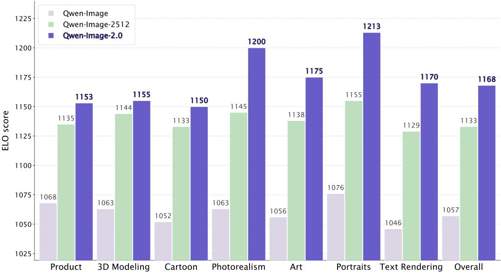  
Figure 1: Qwen-Image-2.0 shows significant improvements across core dimensions, including photoreal ism and portrait generation, in LMArena (accessed April 22, 2026).

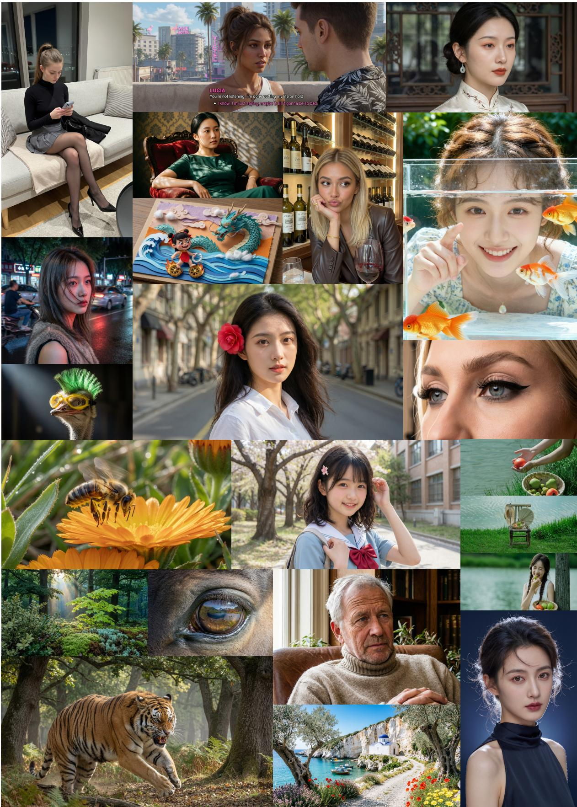  
Figure 2: Photo-realistic image generation showcase with Qwen-Image-2.0.

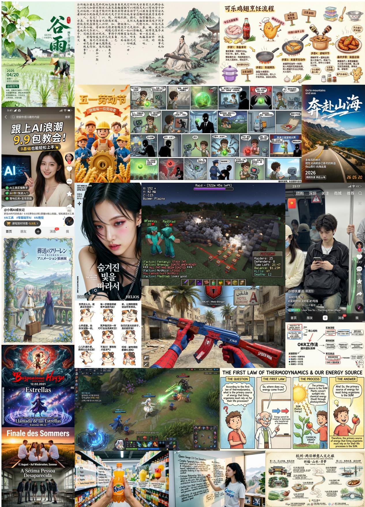  
Figure 3: Complex text rendering showcase with Qwen-Image-2.0.

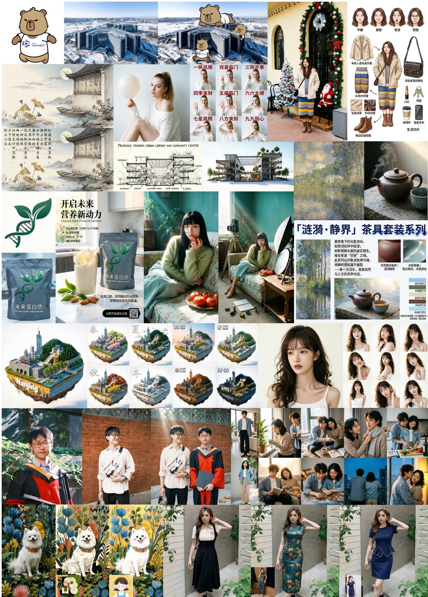  
Figure 4: Image editing showcase with Qwen-Image-2.0.

## 1 Introduction

Image generation has progressed substantially, driven by the rapid advances in the research of multimodal foundation models (Radford et al., 2021; Bai et al., 2025b;a). Diffusion and flow-based generative models (Ho et al., 2020; Rombach et al., 2022; Liu et al., 2022; Lipman et al., 2022), Transformer-based visual generation architectures (Tian et al., 2024; Han et al., 2025; Sun et al., 2024b; Chen et al., 2020; Yu et al., 2022; Chang et al., 2022), and their advanced variants (Peebles &Xie, 2023; Chen et al., 2024; Esser et al., 2024; Ma et al., 2024) that combine the generative capacity of diffusion processes with the scalability of Transformer backbones have collectively established a powerful foundation for high-fidelity visual synthesis. The field has evolved from early latent diffusion models (Rombach et al., 2022; Podell et al., 2024) through diffusion Transformers (Esser et al., 2024; BlackForest, 2024; Labs, 2025; Labs et al., 2025; Li et al., 2024), and more recent frameworks (Wu et al., 2025; Team et al., 2025; Joy Future Academy, 2026; HY, 2025; Cao et al., 2025; Cai et al., 2025) have adopted vision-language foundation models as conditional encoders, whose stronger semantic grounding and multimodal world knowledge enable more precise instruction following and text-image alignment. Meanwhile, commercial systems (Gao et al., 2025; Gong et al., 2025; Seedream et al., 2025; Seed, 2025; OpenAI, 2025; Google, 2025) have further pushed the frontier of generation quality and user experience. Together, these efforts have advanced the field to a point where high-fidelity image synthesis, visual text rendering, and instruction-based editing are becoming increasingly viable for real-world deployment.

Despite these progress, several bottlenecks persist when these models are deployed in real-world creative workflows. First, Ultra-long text rendering remains fragile: as the number of rendered characters grows, current models exhibit escalating glyph distortion, character omission, and layout collapse, limiting their utility for text-dense applications such as slides, infographics, and posters. Second, multilingual typography is underdeveloped; most systems are trained predominantly on English or Chinese glyphs and struggle to produce accurate characters, consistent spacing, or correct reading order for other scripts. At higher resolutions, photorealistic generation also deteriorates—models often introduce repeated textures, incoherent lighting, and loss of fine-grained detail at 2K resolution and above, even when they can nominally produce large-canvas outputs. For complex instruction following, prompts involving multiple entities, spatial constraints, or compositional logic frequently lead to concept omission or visual hallucination, revealing gaps in semantic understanding. Moreover, the computational cost of current architectures poses a significant efficiency bottleneck that constrains deployment in latency-sensitive and resource-limited settings.

Beyond these individual limitations, a more fundamental challenge lies in unifying these capabilities within a single model. Existing systems typically excel along one axis—producing either photorealistic imagery or accurate text rendering, supporting either text-to-image generation or image editing, but rarely deliver all capabilities simultaneously without resorting to separate pipelines or incurring notable quality trade-offs. Bridging deep multimodal understanding with high-fidelity generation for unifying text-to-image generation and image editing under a single, efficient architecture remains an open problem.

To address these challenges, we present Qwen-Image-2.0, an image generation foundation model that unifies text-to-image generation and image editing within a single framework. Qwen-Image-2.0 is grounded in a comprehensive data infrastructure built around a fine-grained captioning framework tailored to different task types and image characteristics. A multi-stage, multi-resolution data pipeline progressively incorporates filtered corpora, editing pairs, synthetic data, and curated high-resolution samples, while an automated data flywheel leverages evaluation signals and user feedback to identify failure modes and drive iterative refinement.

Architecturally, the model couples a Qwen3-VL encoder (Bai et al., 2025a) with a Multimodal Diffusion Transformer (MMDiT, Esser et al. 2024) backbone. To enable native high-resolution generation, we introduce a high-compression Variational Autoencoder (VAE, Kingma &Welling 2013) with a 16× spatial downsampling ratio, incorporating residual autoencoding, enlarged latent channels, and a semantic alignment loss to balance compression efficiency, reconstruction fidelity, and latent diffusability. The MMDiT jointly models text and image tokens with MSRoPE (Wu et al., 2025) for cross-modal positional encoding, while using RMSNorm QK normalization, bias-free modulation, and SwiGLU activations to stabilize joint text-image training.

To bring these components together, we adopt a progressive multi-stage training recipe spanning largescale pretraining, continual pretraining, supervised fine-tuning, and Reinforcement Learning from Human Feedback (RLHF). A resolution curriculum gradually scales from lower to higher resolutions, stabilizing optimization while improving detail fidelity and high-resolution coherence. For preference alignment, the RLHF stage uses task-specific reward models for aesthetics, text-image alignment, portrait quality, instruction following, and visual consistency, then optimizes the generation policy with a diffusion RL framework built on Group Relative Policy Optimization (GRPO, Liu et al. 2026; Zheng et al. 2025).

Together, these design choices yield a model that addresses the aforementioned bottlenecks in a unified architecture. The main contributions of Qwen-Image-2.0 are summarized as follows:

• Professional-grade text rendering with long-context support. Qwen-Image-2.0 supports prompts of up to 1K tokens and can directly produce text-dense visual outputs such as slides, posters, and infographics, with substantially improved glyph fidelity over prior systems.

• Broad multilingual rendering. The model can handle a wide range of languages, with higher character accuracy and support for more beautiful and complex typography.

• High-resolution photorealistic generation. With native 2K-resolution support, Qwen-Image-2.0 produces finer texture detail, more coherent lighting, and more realistic materials across portraits, natural scenes, and architectural imagery.

• Robust artistic expression across styles. The model maintains robust quality under diverse aesthetic settings, effectively reducing quality fluctuation across artistic styles.

• More precise instruction following. Qwen-Image-2.0 demonstrates stronger semantic understanding for complex and composition-heavy prompts.

• Unified generation and editing. A single model supports both text-to-image generation and instruction-based image editing under a unified architecture and training paradigm.

• Improved inference efficiency. Through joint optimization of architecture and training strategy, Qwen-Image-2.0 achieves faster inference while preserving visual quality, making it well suited for interactive creative workflows.

## 2 Data

## 2.1 Data Collection

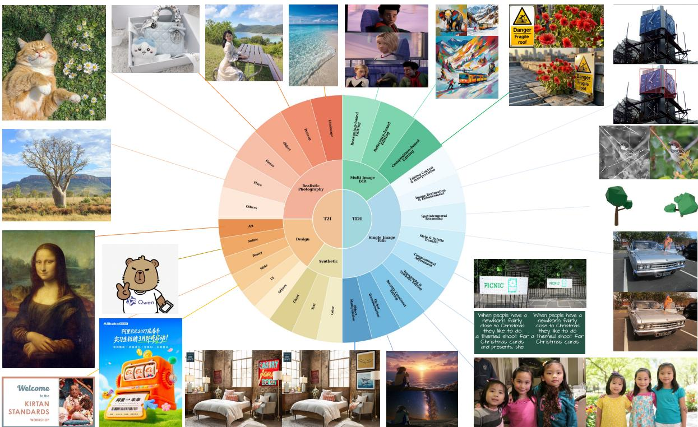  
Figure 5: Qwen-Image-2.0 data distribution across image categories.

We build a large-scale and diverse data pipeline to support unified training for both text-to-image generation and instruction-based image editing. Our data construction is guided by three principles: broad domain coverage, strong instruction quality, and reliable source-target consistency.

For Text-to-Image (T2I) generation, we collect image–text pairs spanning realistic photography, graphic design, artistic content, and synthetic imagery. The realistic subset covers common visual domains, including portraits, landscapes, objects, and other common visual domains, while preserving long-tail concepts and diverse scene compositions. Beyond natural images, we incorporate style-rich and layoutsensitive content, such as slides, posters, and rendered assets, to improve controllability over aesthetics, composition, and visual intent.

For image editing (TI2I), we curate and composite instruction-conditioned data in both single-image and multi-image settings. The single-image subset includes attribute modification, background replacement, style transfer, text editing, restoration, and structure-aware manipulation. The multi-image subset focuses on reference-based generation and editing, subject consistency, style transfer across images, and compositional merging. This coverage enables the model to learn a broad range of edit behaviors, from simple appearance changes to more complex transformations requiring semantic and spatial reasoning.

## 2.2 Data Annotation

To achieve comprehensive and detailed image descriptions across diverse and complex scenarios, we construct a fine-grained captioning framework tailored to different task types and image characteristics. Specifically, we design dedicated captioning schemes for General captions, Text captions, Knowledge captions, and Structured captions.

General captions General captions are designed for images of arbitrary resolution and complexity, aiming to provide comprehensive and detailed natural language descriptions of visual content. This type covers not only the main objects, scene context, and spatial relationships in the image, but also textual content and its semantics whenever present. In addition, this type supports multilingual generation and varying caption lengths.

Text captions For images containing dense text or abstract symbols, we develop multiple prompting templates to specifically caption complex text-centric visual materials, such as presentation slides, comics, posters, educational materials, etc. Compared with general captions, this type place greater emphasis on accurately extracting dense textual content, layout structure, visual symbols, and their semantic relations. As a result, this type is better suited for scenarios involving text-rich, structurally complex, and semantically organized images.

Knowledge captions Knowledge captions enrich the caption by injecting image-related background information, contextual cues, or auxiliary conditions in the form of conditions. This purpose is to enhance the model’s ability to capture image semantics together with relevant world knowledge. Unlike captions that focus only on explicitly visible content, this type incorporates supplementary information associated with the image, helping the model build richer semantic connections and world knowledge.

Structured captions For images with complex relationships and numerous elements, such as relation graphs, flowcharts, and diagrams, natural language descriptions alone are often insufficient to fully and clearly represent the objects and their interactions. To address this issue, we adopt structured captions to explicitly model entities, attributes, and relations in the image. This type enables more accurate characterization of complex visual structures and facilitates the learning of hierarchical relations, topological dependencies, and semantic interactions among visual elements.

## 2.3 Multi-Stage Training Data Strategy

To ensure high-quality and well-curated training data throughout the iterative development of our visual generation model. Based on Qwen-Image (Wu et al., 2025), we designed a multi-stage filtering pipeline consisting of six sequential stages, as illustrated in Figure 6. These filtering stages are applied progressively throughout the training process, with data distributions continuously refined over time.

Stage 1: 256P T2I pre-training In the first stage, the raw T2I data undergoes a comprehensive set of eight sequential filters to establish a clean foundation for training. Since this stage targets training data at a 256× 256 resolution, we first apply a Broken Files Filter to remove corrupted or unreadable samples, followed by a Resolution Filter to discard images that cannot satisfy the required 256×256 resolution standard. A Deduplication Filter is then applied to eliminate redundant samples. Subsequently, a NSFW Filter removes inappropriate content, and a Rotation Filter corrects or discards images with improper orientations. An Entropy Filter is used to filter out images with abnormally low or high information content, and a CLIP Filter ensures strong image-text alignment by removing pairs with low similarity scores. Finally, a Token Length Filter removes samples whose text descriptions exceed the acceptable token length range.

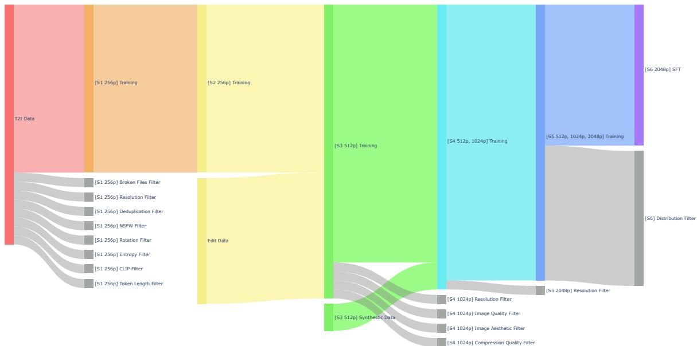  
Figure 6: Overview of the Qwen-Image-2.0 data pipeline.

Stage 2: 256P T2I & TI2I pre-training Building upon the filtered 256p T2I data from Stage 1, Stage 2 introduces Edit Data to support text-guided image editing tasks. The filtered T2I data and TI2I data are combined and used directly for Stage 2 training. At this stage, all training is conducted at 256p resolution, enabling the model to learn both text-to-image generation and text-guided image editing under a unified low-resolution pre-training setting.

Stage 3: 512P T2I & TI2I pre-training Stage 3 scales the training resolution from 256p to 512p. In addition to the data carried over from Stage 2, Synthetic Data is introduced to enrich the training distribution and improve data diversity at the higher 512p resolution. The combined dataset, consisting of filtered T2I data, Edit Data, and Synthetic Data, is then used for Stage 3 training, allowing the model to further improve its generation and editing capabilities at 512p.

Stage 4: 512P/1024P T2I & TI2I pre-training f h d d l setting covering both 512p and 1024p data. To support training at 1024p resolution, additional filtering steps are applied to ensure that the selected samples are suitable for high-resolution learning. Specifically, a Resolution Filter is used to retain images with sufficient spatial resolution, an Image Quality Filter removes low-fidelity images, an Image Aesthetic Filter selects visually appealing samples, and a Compression Quality Filter discards heavily compressed or artifact-laden images. The resulting high-quality 512p/1024p dataset is used for Stage 4 training.

Stage 5: Multi-Resolution T2I & TI2I pre-training Stage 5 expands the training regime to a broader multi-resolution setting, covering 512p, 1024p, and 2048p resolutions. To support the newly introduced 2048p training data, a dedicated Resolution Filter is applied to select images that satisfy the stricter 2048p resolution requirement. This stage enables the model to learn from data across multiple scales and further strengthens its ability to generate and edit high-resolution images.

Stage 6: Supervised fine-tuning The final stage performs supervised fine-tuning (SFT) to better align the model with high-quality human preferences. Unlike the preceding pre-training stages, which progressively expand the resolution range from 256p to 2048p, Stage 6 focuses on refining the data distribution and sample quality across the target high-resolution settings. A Distribution Filter is applied to remove low-quality or imbalanced samples by reusing the filtering operators from previous stages with stricter thresholds. The refined data is then used for SFT, producing the final fine-tuned model optimized for high-resolution, high-fidelity visual generation and editing.

## 2.4 Closed-loop Data Flywheel System

To continuously optimize the image generation and editing models and achieve iterative capability enhancement, we design and introduce a highly automated Data Flywheel System. As illustrated in Figure 7, this system comprises a closed loop consisting of three core stages:

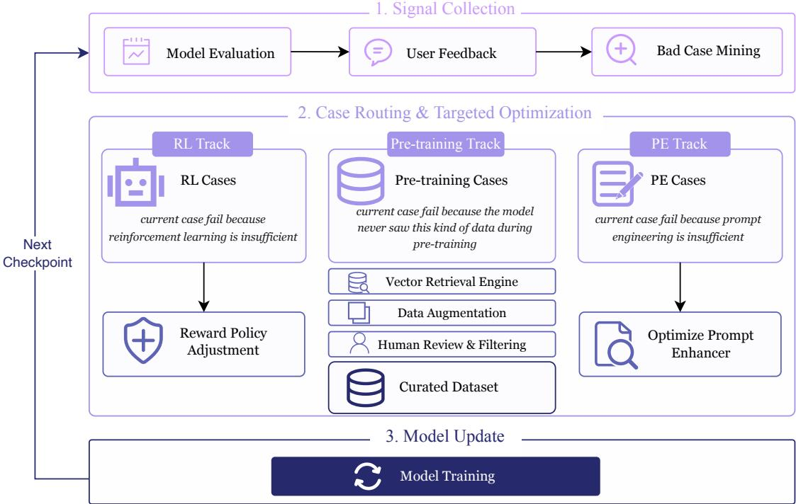  
Figure 7: An error-attribution-driven closed-loop data flywheel for multi-track targeted optimization.

• Stage 1: Multi-source signal collection. The flywheel begins with a comprehensive assessment of the model’s current capabilities and failure modes. The system automatically collects feedback signals through standardized model evaluation, targeted bad-case mining, and user feedback from diverse sources, including both real-world online interactions and internally self-evaluated cases generated during the training process. Together, these signals establish a robust data foundation for subsequent model optimization.

• Stage 2: Case routing & targeted optimization. The collected failure cases are not processed in a uniform manner. Instead, they are automatically routed to three distinct optimization tracks according to an error attribution mechanism:

– RL track. For alignment or policy-related issues caused by insufficient reinforcement learning, the system assigns the corresponding cases to the RL track and addresses them through automated reward policy adjustment.

– Pre-training track. If a failure is attributed to missing knowledge, i.e., the model has not been sufficiently exposed to similar data during pre-training, the case is routed to the pretraining-oriented data compensation track. In this track, the system automatically invokes a vector retrieval engine with two objectives: first, to diagnose whether the failure is caused by the scarcity of specific data categories; and second, to retrieve and generalize diverse text prompts for image generation, as well as comprehensive instruction-image pairs for image editing, including editing prompts and their corresponding base images. Through automated data augmentation and the only manual intervention in the pipeline, namely necessary human review & filtering, a curated dataset is constructed to bridge the identified knowledge gap.

– Prompt engineering track. When the model already possesses the required capability but fails due to inaccurate instruction understanding or suboptimal prompt formulation, the case is assigned to the prompt engineering track, where the system automatically refines the input through an optimized prompt enhancer.

• Stage 3: Model update & closed loop. After aggregating the strategies, new datasets, and parameter updates from the above tracks, the system automatically initiates the next training round. The resulting checkpoint is then fed back to Stage 1 for evaluation and deployment. This iterative process of “failure discovery, targeted remediation, and model update” forms a self-reinforcing optimization loop.

In summary, this data flywheel system provides a highly automated closed-loop framework for continuous model evolution. By limiting manual intervention to critical data filtering, it substantially reduces engineering overhead while preserving data reliability. Moreover, its error attribution mechanism enables targeted and resource-efficient optimization, while the vector retrieval engine continuously enriches the diversity of training data, thereby improving the model’s generalization ability and robustness in complex generation and editing scenarios.

## 3 Architecture

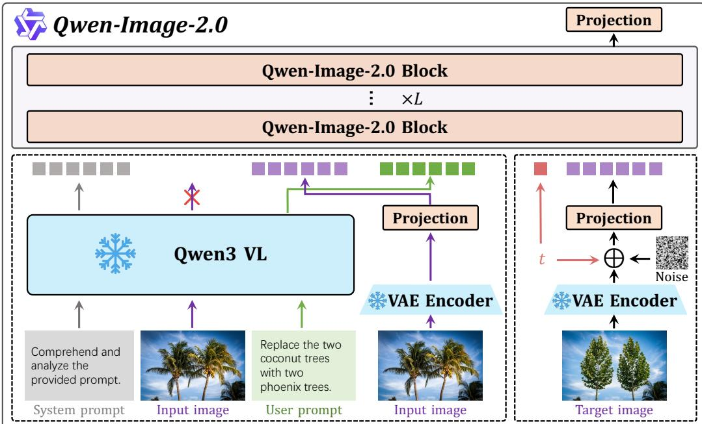  
Figure 8: Overview of the Qwen-Image-2.0 architecture. The model adopts a MMDiT architecture, with input representations provided by a frozen Qwen3-VL and a VAE encoder. It uses RMSNorm (Zhang &Sennrich, 2019) for QK-Norm, while all other normalization layers use LayerNorm. The unified stream, comprising both text and image modalities, employs the joint positional calculation with MSRoPE encoding introduced in Qwen-Image (Wu et al., 2025). SwiGLU is adopted as the non-linear activation function in the MLP layers to improve expressivity and enhance training stability.

As shown in Figure 8, the Qwen-Image-2.0 architecture comprises three core, tightly coupled functional components that work in concert to enable high-fidelity, controllable, and efficient T2I generation. The first is a Multimodal Large Language Model (MLLM), instantiated as Qwen3-VL (Bai et al., 2025a) in our implementation, which serves as the condition encoder and extracts semantic features from user inputs. The second is a VAE, which encodes images into latent representations and decodes generated latents back into the image space. The third is a MMDiT, which performs the core denoising process in the latent space conditioned on the multimodal representations.

## 3.1 Variational AutoEncoder

High-compression VAEs are crucial for native high-resolution image synthesis, as they substantially reduce diffusion training costs by projecting images into compact latent representations. Whereas existing open-source VAEs (Wan et al., 2025; Kong et al., 2024; Wu et al., 2025) typically adopt an 8× compression ratio, we employ a 16× ratio to further accelerate DiT training.

However, high-compression VAEs inevitably confront a three-way trade-off among compression ratio, reconstruction fidelity, and diffusability (i.e., the ease with which the latent space can be modeled by diffusion). On the one hand, aggressive compression introduces severe information bottlenecks, thereby compromising reconstruction quality. On the other hand, preserving information by increasing the number of latent channels yields high-dimensional latent manifolds that are difficult to diffuse, resulting in slower convergence and degraded generation quality.

To mitigate the reconstruction bottleneck, we adopt a residual autoencoder architecture (Chen et al., 2025), which incorporates non-parametric shortcut connections to better preserve fine-grained spatial details. In addition, we increase the latent dimensionality to 64 channels. This f16c64 configuration preserves the same total channel bottleneck as the standard f8c16 baseline, enabling high-fidelity reconstruction under a higher compression ratio. To further improve reconstruction quality in text-dense scenarios, we train the model on a large-scale internal corpus of text-rich images. The corpus includes real-world documents (e.g., PDFs, presentation slides, and posters) as well as synthetic paragraphs, covering both alphabetic scripts such as English and logographic scripts such as Chinese.

Table 1: Quantitative evaluation results of VAEs under different settings.

<table><tr><td rowspan="2">Model</td><td rowspan="2">Setting</td><td colspan="2"># Params (M)</td><td colspan="2">Imagenet_256x256</td><td colspan="2">Text_256x256</td></tr><tr><td>Enc</td><td>Dec</td><td>PSNR</td><td>SSIM</td><td>PSNR</td><td>SSIM</td></tr><tr><td>SD-3.5 (Esser et al., 2024)</td><td>f8c16</td><td>34</td><td>50</td><td>31.22</td><td>0.8839</td><td>29.93</td><td>0.9658</td></tr><tr><td>Cosmos-CI8x8 (Agarwal et al., 2025)</td><td>f8c16</td><td>31</td><td>46</td><td>32.23</td><td>0.9010</td><td>30.62</td><td>0.9664</td></tr><tr><td>Wan2.1 (Wan et al., 2025)</td><td>f8c16</td><td>54</td><td>73</td><td>31.29</td><td>0.8870</td><td>26.77</td><td>0.9386</td></tr><tr><td>HunyuanVideo (Kong et al., 2024)</td><td>f8c16</td><td>100</td><td>146</td><td>33.21</td><td>0.9143</td><td>32.83</td><td>0.9773</td></tr><tr><td>FLUX.1-dev (BlackForest, 2024)</td><td>f8c16</td><td>34</td><td>50</td><td>32.84</td><td>0.9155</td><td>32.65</td><td>0.9792</td></tr><tr><td>Qwen-Image (Wu et al., 2025)</td><td>f8c16</td><td>54</td><td>73</td><td>33.42</td><td>0.9159</td><td>36.63</td><td>0.9839</td></tr><tr><td>HunyuanImage-3.0 (Cao et al., 2025)</td><td>f16c32</td><td>389</td><td>871</td><td>31.08</td><td>0.8655</td><td>29.23</td><td>0.9521</td></tr><tr><td>Wan2.2 (Wan et al., 2025)</td><td>f16c48</td><td>150</td><td>555</td><td>31.30</td><td>0.8784</td><td>28.19</td><td>0.9508</td></tr><tr><td>Stepvideo-T2V (Ma et al., 2025)</td><td>f16c64</td><td>110</td><td>389</td><td>31.54</td><td>0.8973</td><td>29.62</td><td>0.9641</td></tr><tr><td>Qwen-Image-2.0</td><td>f16c64</td><td>79</td><td>259</td><td>33.42</td><td>0.9225</td><td>32.81</td><td>0.9795</td></tr></table>

To enhance latent-space diffusability, we follow VA-VAE (Yao et al., 2025) and introduce a semantic alignment loss in addition to conventional reconstruction objectives. Specifically, we align the learned latent space with semantic representations over a broad image collection spanning diverse domains, aspect ratios, and resolutions. The VAE is optimized with reconstruction, perceptual, and semantic alignment losses. During optimization, we make two key observations. First, dynamic semantic alignment is highly effective: imposing strong semantic alignment constraints in early training is essential for establishing a diffusable latent space, while gradually relaxing this constraint later enables a better balance between reconstruction fidelity and diffusability. Second, adversarial loss is largely redundant in large-scale VAE training, consistent with recent findings (Wu et al., 2025). We therefore remove the adversarial objective to improve training stability.

VAE reconstruction performance We quantitatively compare Qwen-Image-2.0-VAE with state-of-theart image tokenizers using Peak Signal-to-Noise Ratio (PSNR) and Structural Similarity Index Measure (SSIM) as reconstruction metrics. Following prior work, we evaluate general-domain reconstruction on the ImageNet-1k (Deng et al., 2009) validation set at 256×256 resolution. To assess fidelity on small and dense text, we further report results on an in-house text-rich corpus (Wu et al., 2025) comprising diverse text sources and languages. As shown in Table 1, Qwen-Image 2.0-VAE achieves state-of-the-art performance across all metrics under a 16× compression ratio.

## 3.2 Multi-modal Diffusion Transformer

Figure 8 illustrates the overall architecture of Qwen-Image-2.0, a unified framework for T2I and TI2I generation that naturally supports interleaved multi-image inputs. To jointly and efficiently model textual and visual modalities, it adopts a MMDiT (Esser et al., 2024) architecture, where text and image tokens are processed within a shared transformer backbone.

Specifically, given visual inputs x and textual inputs y, Qwen3-VL (Bai et al., 2025a) first encodes them into modality-aware representations $h _ { x }$ and $h _ { y } ,$ respectively. The visual representation $h _ { x }$ is then replaced by the latent representation extracted by the variational autoencoder, denoted as $\mathcal { E } _ { x } .$ . The resulting multimodal sequence is constructed by concatenation:

$$
\boldsymbol {h} = \operatorname{Concat} \left(\mathcal {E} _ {x}, h _ {y}\right),\tag{1}
$$

which is subsequently fed into the Qwen-Image-2.0 block. To encode positional information across both textual and visual tokens in a unified manner, we employ MSRoPE (Wu et al., 2025) within the attention module. For the modulation module, we remove the bias term and adopt a purely multiplicative modulation formulation:

$$
\boldsymbol {h} ^ {\prime} = \alpha \boldsymbol {h},\tag{2}
$$

instead of the conventional affine form $h ^ { \prime } = \alpha h + \beta ,$ , where α and $\beta$ denote scalar modulation parameters.

In practice, we observe that joint text-image training may induce excessively large activation magnitudes, leading to premature neuron saturation in the model (Sun et al., 2024a). To alleviate this issue, we introduce a SwiGLU module into the Multilayer Perceptron (MLP) layers. Given a latent representation $x ,$ the SwiGLU transformation is formulated as

$$
\boldsymbol {h} = \Phi_ {1} (\boldsymbol {x}) \otimes \sigma (\Phi_ {2} (\boldsymbol {x})),\tag{3}
$$

where $\Phi _ { 1 } ( \cdot )$ and $\Phi _ { 2 } ( \cdot )$ denote linear projection functions, $\sigma ( \cdot )$ is the SiLU activation function, and ⊗ represents element-wise multiplication.

## 3.3 Prompt Enhancer

For complex image generation tasks, such as infographics, posters, typographic layouts, multi-panel storyboards, and data visualizations, generation quality depends on both the model’s visual synthesis capacity and the prompt’s specification of layout, object relations, visual hierarchy, and compositional intent. However, real-world user prompts vary substantially in granularity and explicitness, creating a key bottleneck for high-complexity visual creation. To this end, we introduce the Prompt Enhancer (PE), a rewriting module that converts user queries of varying specificity into structured, detail-rich prompts, enabling the downstream generator to better capture the intended visual design across diverse tasks.

Data Construction We construct prompt-enhancement data via a reverse-engineering pipeline that atomically degrades fine-grained annotations into diverse, colloquial user prompts, while recording inverse reasoning traces as training supervision. Given a detailed image annotation $P _ { \mathrm { f i n e } } ,$ , we first use an LLM to classify it into one of four image generation categories: General, Portrait, Text, and Complex Text. This task-aware classification ensures that the subsequent degradation process is semantically grounded and adapted to the characteristics of each prompt type. Based on the predicted category, we sample a set of applicable degradation strategies S from a predefined strategy pool.

To approximate the long-tail distribution of real-world user inputs, we introduce stochasticity into the degradation process. Specifically, a subset of strategies is sampled from S according to predefined probability distributions. These strategies include stylistic simplification, colloquialization, and removal or underspecification of visual details such as lighting, texture, layout, and background. Applying them to $P _ { \mathrm { f i n e } }$ produces a degraded prompt $P _ { \mathrm { s h o r t } }$ . By adjusting the sampling proportions, the pipeline generates training examples with varying difficulty, ambiguity, and information density.

This construction naturally yields an inverse reasoning chain, $i . e . , \mathsf { a }$ Chain-of-thought (CoT) for prompt enhancement. Since each degradation operation $s \in { \mathcal { S } }$ removes or obscures information from the original annotation, its reverse defines a principled trajectory for prompt recovery and enrichment. The resulting triplet $( P _ { \mathrm { s h o r t } } , \mathrm { C o T } , P _ { \mathrm { f i n e } } )$ allows the model to learn both the enhanced prompt and the underlying intentexpansion process, such as inferring lighting, material, spatial, and stylistic cues from the remaining attributes. This reverse-engineering pipeline is used for T2I generation tasks. For image editing, where the input image already provides rich visual context, we instead use an MLLM to summarize long-form annotations into concise editing prompts, avoiding unnecessary stochastic degradation.

PE Training The PE module is initialized from Qwen3.5-9B (Team, 2026) and trained as a unified prompt enhancement model for both image generation and image editing. The training process consists of two consecutive stages: SFT followed by RL. This two-stage design first equips the model with stable rewriting behavior from curated supervision, and then further aligns the rewritten prompts with downstream image generation quality.

During SFT, the model is trained on the constructed dataset with the standard next-token prediction objective, learning prompt enhancement capabilities for intent preservation, scene enrichment, and compositional organization across both generation and editing scenarios. While generation prompts require richer visual elaboration, editing prompts demand faithful instruction preservation and sensitivity to the existing visual context. Since SFT relies on static textual references and cannot directly optimize downstream image quality, we further introduce an RL stage based on GRPO (Shao et al., 2024). The PE model generates candidate enhanced prompts, which are fed into a frozen image generator, and is optimized with rewards combining MLLM-based visual consistency, MLLM-based aesthetic quality, and rule-based textual constraints. This end-to-end training encourages rewrites that better align with user intent while improving the visual outcomes of the generated images.

By combining supervised rewriting objectives with generation-aware reinforcement learning, the PE module is grounded in both textual supervision and downstream visual feedback. As a result, it produces enhanced prompts that are more faithful, expressive, and effective for image generation and editing. As illustrated in Figure 9, the PE module consistently improves generation quality, prompt following, and reasoning performance.

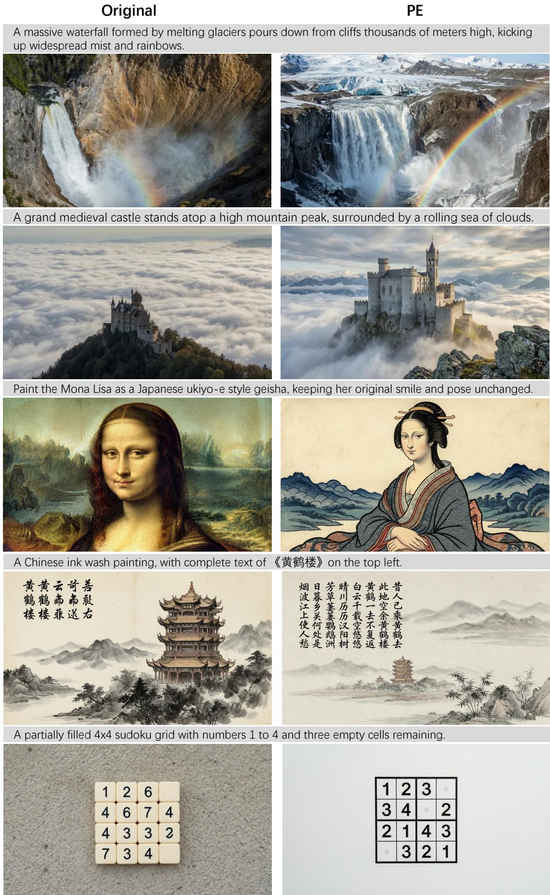  
Figure 9: Qualitative comparison of T2I results using the original captions and prompt-enhanced captions.

## 4 Training

## 4.1 Multistage Training

During training, we employ a multistage training strategy comprising three phases: pre-training, continual pre-training, and supervised fine-tuning. Across these stages, we progressively adjust the image resolution, data filtering criteria, and data composition, enabling the model to evolve from learning fundamental semantic representations to modeling fine-grained visual details. The detailed configurations are summarized in Table. 2.

Table 2: Training configurations, data distribution, and hyperparameters used in our experiments.

<table><tr><td>Configuration</td><td>Pre-training</td><td>Continual Pre-training</td><td>Supervised Fine-tuning</td></tr><tr><td colspan="4">Training Process</td></tr><tr><td>Steps (K)</td><td>700</td><td>250</td><td>10</td></tr><tr><td>Resolution</td><td>256/512</td><td>512/1024/2048</td><td>512/1024/2048</td></tr><tr><td>Batch Size (K)</td><td>32/16</td><td>16/8/4</td><td>16/8/4</td></tr><tr><td colspan="4">Data Distribution</td></tr><tr><td>Type</td><td>T2I/TI2I</td><td>T2I/TI2I</td><td>T2I/TI2I</td></tr><tr><td>Ratio</td><td>0.9/0.1</td><td>0.7/0.3</td><td>0.7/0.3</td></tr><tr><td colspan="4">Hyperparameters</td></tr><tr><td>Optimizer</td><td>Adam</td><td>Adam</td><td>Adam</td></tr><tr><td>Weight Decay</td><td>0.001</td><td>0.001</td><td>0.001</td></tr><tr><td>Grad. Norm Clip</td><td>1.0</td><td>1.0</td><td>1.0</td></tr><tr><td>Uncond. Dropout</td><td>0.1</td><td>0.1</td><td>0.1</td></tr><tr><td>Learning Rate</td><td> $1 \times 10^{-4}$ </td><td> $2 \times 10^{-5}$ </td><td> $1 \times 10^{-5}$ </td></tr></table>

Pre-training In the pre-training stage, the model primarily learns basic semantic representations. We train the model for 700K steps at relatively low resolutions to improve data throughput. The training data consists of a 9:1 mixture of T2I and TI2I data. The learning rate is set to $1 \times 1 0 ^ { - 4 }$ , allowing the model to learn robust and general-purpose visual representations from large-scale image-text data.

Continual pre-training In the continual pre-training stage, the model further improves generation quality and adapts to higher-resolution inputs. The model is trained for 250K steps, while the image resolution is gradually increased to 512–2048 to better capture fine-grained visual details. The data distribution is adjusted to a 7:3 mixture of T2I and TI2I data, strengthening image editing capabilities while maintaining strong text-to-image generation performance. The learning rate is reduced to $2 \times 1 0 ^ { - 5 }$ to ensure stable optimization during this stage.

Supervised fine-tuning In the supervised fine-tuning stage, we focus on improving the aesthetic quality of generated images. The model is trained for approximately 10K steps. To enhance fine-grained visual details while preserving the model’s world knowledge, the learning rate is further reduced to $1 \times 1 0 ^ { - 5 } .$ For the training data, we sample from diverse data categories and apply strict filtering together with manual curation to ensure high aesthetic quality.

## 4.2 Reinforcement Learning with Human Feedback

To align Qwen-Image 2.0 more closely with human preferences and to enhance generation quality across both T2I and TI2I tasks, we develop an RLHF pipeline that refines the base diffusion model through multi-dimensional reward signals and a sample-efficient optimization algorithm. This procedure yields consistent improvements in perceptual quality and task-specific controllability.

Reward modeling We construct task-specific composite reward models from distinct human preference annotation datasets, with each model targeting a particular evaluation dimension:

• Aesthetic reward (for T2I). Assesses the intrinsic visual quality of generated images, emphasizing compositional balance, realistic illumination, texture fidelity, and overall artistic coherence.

Qwen-Image-2.0-Base  

Qwen-Image-2.0-RL  

Qwen-Image-2.0-Base  

Qwen-Image-2.0-RL  
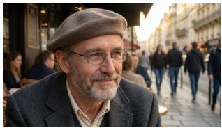

  
Input Image

  
Input Text

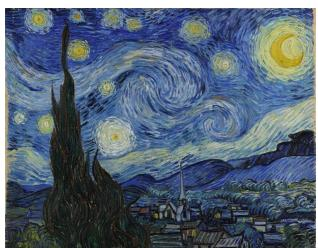  
这张图是一幅名画将其转化为一个\*<<艺术茶具美学>>\*的商业中文广告海报。最终图面成果应包括概念标题： 受该画作启发的\*\*<<茶具套装系列>>\*\*主题名称；艺术溯源： 这幅名画的形象展示或局部取景；概念故事：解释这幅画的意境如何影响\*<<茶饮仪式感与桌⾯美学>>\*\*（例如⾊彩的流动或构图的禅意）；工艺与触感：陶瓷釉面、材质纹理及触感参考产品清单： 主要\*\*<<器⽫组件>>\*\*（茶杯、茶壶、茶托）的拼贴展示图；⽣活⽅式呈现： 符合该画作美学的\*\*<<产品场景氛围图>>\*\*（如茶具在特定光影下的使⽤状态）；视觉设计元素： 其他\*\*<<平⾯视觉设计>>\*\*图（调⾊板、风格注释从画作中提取的装饰图案)以\*\*<<简洁，专业，富有艺术感>>\*\*的布局呈现所有内容，适合⾼端艺术⽣活⽅式品牌的海报演示。

## Qwen-Image-2.0-Base

## Qwen-Image-2.0-RL

  
@didndoddon #002B96 #2E5A9C #FFD700 #884513 #F5F5F5 ×现代器型×东方英道

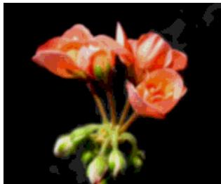  
Enhance the image clarity by applying super-resolution and deblurring techniques, preserving the original orange flower structure, green stem details, and black background while removing pixelation and noise.

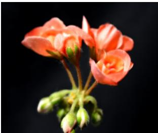

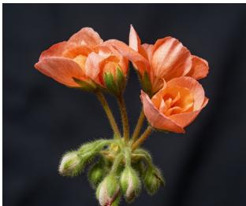

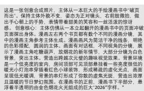

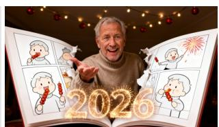

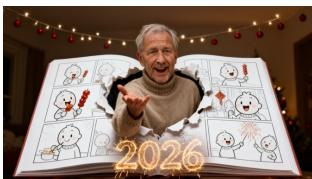  
Figure 10: Qualitative comparison between Qwen-Image-2.0-Base and Qwen-Image-2.0-RL across various T2I and TI2I scenarios. Qwen-Image-2.0-RL further improves the visual quality of Qwen-Image-2.0-Base in diverse scenarios, including portraits, landscapes, posters, and natural scenes.

• Image-text alignment reward (for T2I). Measures semantic correspondence between the generated image and the input prompt, explicitly penalizing outputs that omit, misinterpret, or contradict user-specified requirements.

• Portrait reward (for T2I). Provides a specialized optimization signal for human-subject generation, improving anatomical plausibility, facial proportion accuracy, identity-preserving facial details, and fine-grained skin and hair texture realism.

• Instruction-following reward (for TI2I). Evaluates whether user-specified modifications are accurately executed, covering editing operations such as object replacement and style transfer.

• Visual consistency reward (for TI2I). Preserves the identity and structural integrity of unmodified regions by enforcing strict consistency in geometric layout, spatial topology, and semantic features between the source and edited images.

All reward models are calibrated to operate on comparable scales, and their weights are dynamically adjusted throughout training to avoid over-optimization toward any single dimension.

Training We optimize the base diffusion model using an adapted GRPO framework (Liu et al., 2026; Wang et al., 2025; Zheng et al., 2025). A key design consideration in diffusion-based reinforcement learning is whether Classifier-free Guidance (CFG, Ho &Salimans 2022) should be employed during rollout sampling and policy optimization. Existing studies adopt divergent strategies: some methods apply CFG in both rollout and training stages (Liu et al., 2026; Wang et al., 2025), whereas others omit it entirely (Zheng et al., 2025). In our RLHF pipeline, we adopt a hybrid strategy: CFG is used during rollout sampling to generate high-quality candidates for reward evaluation, while the unconditional branch is excluded from the policy optimization objective. This design preserves the visual fidelity and structural coherence of sampled images, thereby providing more reliable reward signals, while substantially reducing the computational overhead associated with optimizing the unconditional model. The resulting RL-aligned model is denoted as Qwen-Image-2.0-RL. In practice, we further refine the optimization process by dynamically adjusting the prompt distribution across tasks and calibrating the relative weights of individual reward models, leading to improved final visual quality.

Results Qualitative evaluations indicate that the proposed RLHF pipeline produces consistent gains across both T2I generation and image editing tasks. For T2I generation, Qwen-Image-2.0-RL demonstrates notable improvements in texture fidelity and overall image realism. In image editing scenarios, Owen: Image-2.0-RL likewise enhances texture quality and visual consistency. Figure 10 presents side-byside comparisons of T2I and editing outputs before and after RL alignment, illustrating the resulting improvements in visual refinement.

## 4.3 Few-step Distillation

We aim to distill our multi-step model into a few-step variant that is more efficient, while preserving visual quality and prompt-following ability. However, due to the architectural complexity of large multimodal models, such distillation remains highly challenging, especially when the goal is to retain the model’s full capabilities across diverse scenarios, such as portrait generation, landscape synthesis, and text rendering, under an extremely limited number of function evaluations (NFEs).

Recent advances in diffusion distillation have explored a broad spectrum of techniques, including trajectory-based optimization (Song et al., 2023; Lu &Song, 2024; Geng et al., 2025) and distribution-level matching (Sauer et al., 2024b;a; Liu et al., 2025; Wu et al., 2026). However, most existing studies are confined to class-conditional settings, predominantly on ImageNet (Deng et al., 2009), leaving their efficacy in broader and more practically relevant scenarios, including T2I generation and image editing, largely underexplored. Among advanced diffusion distillation paradigms, we employ Distribution Matching Distillation (DMD; Yin et al. 2024b;a), motivated by its strong empirical stability and consistent effectiveness on heterogeneous visual generative architectures $( e . g .$ , Stable Diffusion, Rombach et al. 2022), as well as its demonstrated versatility in diverse generation scenarios.

Concretely, given a conditional few-step student generator $G _ { \theta }$ parameterized by θ, an initial Gaussian noise vector $\mathbf { \bar { \epsilon } } \sim \mathcal { N } ( \mathbf { 0 } , \mathbf { I } )$ , and a condition $c \sim p ( c )$ , we denote the corresponding clean-state prediction as $x _ { \theta } = G _ { \theta } ( \epsilon , c )$ . Here, $G _ { \theta }$ is used broadly: $x _ { \theta }$ may be the final clean sample obtained after the full few-step student trajectory, or a clean state directly predicted from an intermediate student state conditioned on c. The gradient of the DMD objective $\dot { \ell _ { \mathrm { D M D } } } ( \dot { \pmb { \theta } } )$ with respect to the student parameters θ is then given by

$$
\nabla_ {\pmb {\theta}} \ell_ {\mathrm{DMD}} (\pmb {\theta}) = \mathbb {E} _ {\pmb {c} \sim p (\pmb {c}), \pmb {\epsilon} \sim \mathcal {N} (\pmb {0}, \pmb {I}), \pmb {\xi} \sim \mathcal {N} (\pmb {0}, \pmb {I}), t \sim p (t)} \Big [ \big (\boldsymbol {s} _ {\mathrm{fake}} (\boldsymbol {x} _ {t}, t, \pmb {c}) - \boldsymbol {s} _ {\mathrm{real}} (\boldsymbol {x} _ {t}, t, \pmb {c}) \big) \nabla_ {\pmb {\theta}} \boldsymbol {x} _ {\pmb {\theta}} \Big ],\tag{4}
$$

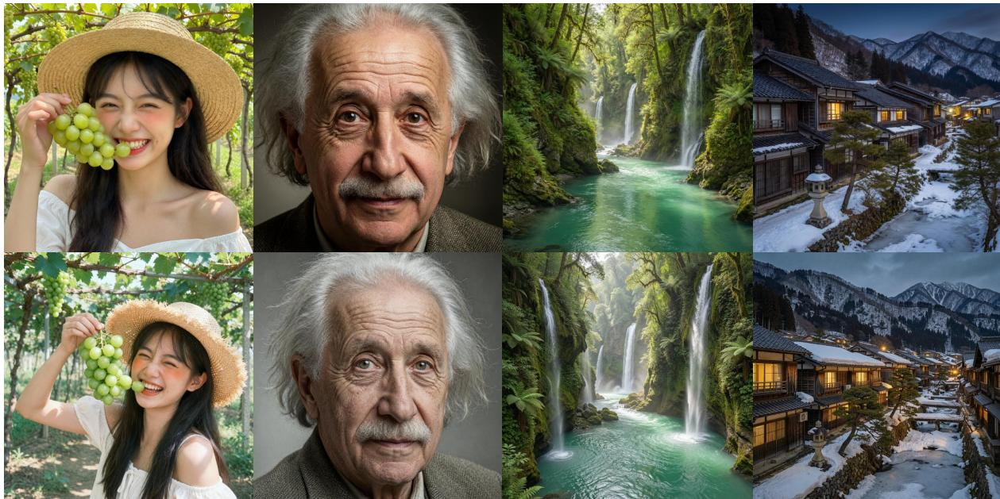  
Figure 11: Qualitative comparison between the multi-step teacher and the few-step distilled student. The top row shows images generated by Qwen-Image-2.0-RL with 40 sampling steps, while the bottom row shows images generated by Qwen-Image-2.0-Distillation with only 4 NFEs. Across diverse prompts, including portraits, landscapes, and natural scenes, the 4-NFE student preserves visual quality, semantic alignment, and compositional coherence comparable to the 40-step teacher, while reducing inference cost.

where $\pmb { \xi }$ denotes an independent Gaussian noise vector, $t \in [ 0 , 1 ]$ is the diffusion time sampled from a prescribed distribution $p ( t )$ (e.g., a logit-normal distribution), and xt is obtained by linearly interpolating between the conditionally generated clean sample $x _ { \theta }$ and the noise vector $\xi \colon$

$$
\boldsymbol {x} _ {t} = (1 - t) \boldsymbol {x} _ {\theta} + t \boldsymbol {\xi}.\tag{5}
$$

Here, $s _ { \mathrm { f a k e } } ( x _ { t } , t , c ) = \nabla _ { x _ { i } }$ log $p _ { \mathrm { f a k e } , t } ( \pmb { x } _ { t } \mid \pmb { c } )$ denotes the conditional score function associated with the student-induced distribution at noise level t; in practice, this score is estimated by an auxiliary fake score model trained on conditionally generated student samples using a flow-matching objective. Meanwhile, $\begin{array} { r } { s _ { \mathrm { r e a l } } ( \boldsymbol { x } _ { t } , t , c ) = \nabla _ { \boldsymbol { x } _ { t } } \log { p _ { \mathrm { r e a l } , t } \big ( \dot { \boldsymbol { x } } _ { t } \big | \ c \big ) } } \end{array}$ denotes the conditional target score provided by the pretrained teacher diffusion model at the same noise level.

Results Starting from Qwen-Image-2.0-Base as the multi-step teacher, we apply the above distillation procedure to obtain Qwen-Image-2.0-Distillation as the few-step student optimized for efficient inference. As shown in Figure 11, the distilled 4-NFE student produces results visually comparable to the 40- step teacher across diverse prompts and visual domains. It preserves detailed appearance, coherent composition, and faithful semantic alignment, while substantially reducing the number of function evaluations. These comparisons show that our DMD-based distillation effectively compresses the sampling trajectory while maintaining perceptual quality and prompt-following capability.

## 5 Benchmark and Qualitative Evaluation

## 5.1 LMArena Benchmark Evaluation

To assess the image generation capability of Qwen-Image-2.0, we evaluate it on LMArena (Arena AI, 2025), a leading benchmark grounded in real-world user preferences. On the T2I leaderboard, users anonymously compare images produced by different models from the same prompt, without knowing the identity of the generation model. This blind evaluation protocol promotes fairness, while the ELO-based ranking system offers a preference-oriented measure of model performance.

As shown in Figure 12, Qwen-Image-2.0 achieves strong performance on this widely recognized image generation benchmark, ranking #9 globally and #1 among Chinese models. In direct comparison with leading international models, Qwen-Image-2.0 reaches the top tier with an ELO score of 1168 and outperforms Nano Banana. As shown in Figure 1, Qwen-Image-2.0 delivers substantial improvements over previous Qwen-Image series models in both image generation and editing, demonstrating clear advances in overall visual quality, editing capability, and practical usability.

<table><tr><td>Rank</td><td>Model</td><td>Score ↓</td><td>Votes</td></tr><tr><td>1</td><td>gpt-image-2 (medium)OpenAI·Proprietary</td><td>1507 ±9 Ⓧ Preliminary</td><td>15,391</td></tr><tr><td>2</td><td>gemini-3.1-flash-image-preview (nano-banana-2) [web-search]Google·Proprietary</td><td>1271 ±5</td><td>55,988</td></tr><tr><td>3</td><td>gemini-3-pro-image-preview-2k (nano-banana-pro)Google·Proprietary</td><td>1244 ±4</td><td>94,356</td></tr><tr><td>4</td><td>gpt-image-1.5-high-fidelityOpenAI·Proprietary</td><td>1242 ±4</td><td>99,255</td></tr><tr><td>5</td><td>gemini-3-pro-image-preview (nano-banana-pro)Google·Proprietary</td><td>1232 ±5</td><td>82,657</td></tr><tr><td>6</td><td>mai-image-2Microsoft AI·Proprietary</td><td>1183 ±5</td><td>33,666</td></tr><tr><td>7</td><td>reve-v1.5Reve·Proprietary</td><td>1177 ±6</td><td>7,807</td></tr><tr><td>8</td><td>grok-imagine-imagexAI·Proprietary</td><td>1170 ±4</td><td>133,627</td></tr><tr><td>9</td><td>qwen-image-2.0-pro-2026-04-22Alibaba·Proprietary</td><td>1168 ±8</td><td>5,122</td></tr><tr><td>10</td><td>flux-2-maxBlack Forest Labs·Proprietary</td><td>1166 ±4</td><td>97,415</td></tr><tr><td>11</td><td>grok-imagine-image-proxAI·Proprietary</td><td>1158 ±4</td><td>81,749</td></tr><tr><td>12</td><td>flux-2-proBlack Forest Labs·Proprietary</td><td>1157 ±3</td><td>132,390</td></tr><tr><td>13</td><td>flux-2-flexBlack Forest Labs·Proprietary</td><td>1156 ±4</td><td>128,862</td></tr><tr><td>14</td><td>gemini-2.5-flash-image-preview (nano-banana)Google·Proprietary</td><td>1152 ±3</td><td>757,256</td></tr><tr><td>15</td><td>hunyuan-image-3.0Tencent·tencent-hunyuan-community</td><td>1151 ±3</td><td>172,985</td></tr></table>

Figure 12: Results from LMArena (accessed April 22, 2026).

## 5.2 Qualitative Results on Text-to-image Generation

We qualitatively evaluate Qwen-Image-2.0 on T2I generation, covering text rendering (Figure 13), portrait generation (Figures 14 and 15), multilingual text rendering (Figure 18), and slide generation (Figure 19).

Text rendering Figure 13 presents a qualitative comparison of Chinese text rendering across different models. In the first example, GPT-Image-2 renders the characters at an excessively small scale and introduces frequent character-level errors; NanoBanana Pro fails to reproduce the complete prompt sequence, erroneously duplicating certain segments while also introducing multiple typos; Qwen-Image 2512 exhibits inconsistent font sizing and numerous miswritten characters; Wan2.7 Pro disregards the specified textual prompt entirely, generating a substantial amount of unrelated content instead; and Seedream 5.0 Lite produces undersized, poorly legible text that is further compromised by frequent character inaccuracies. In contrast, only Qwen-Image-2.0 successfully fulfills the text-rendering objective with negligible errors, while ensuring that the generated typographic style is harmoniously integrated with the overall visual composition. In the second example, GPT-Image-2 produces largely illegible gibberish on the vertical posters and small details despite rendering the main headers; NanoBanana Pro hallucinates incoherent text on the left poster; Qwen-Image-2512 generates unreadable character on the side posters; Wan2.7 Pro correctly renders the shop signboards but fails to spatially bind the rider’s back text, instead outputting the phrase as a detached subtitle-style overlay at the bottom right rather than integrating it onto the rider’s garment, thereby disrupting the scene’s physical realism; and Seedream 5.0 Lite renders the main signs but introduces erroneous and disjointed characters on the vertical banners. Remarkably, Qwen-Image-2.0 uniquely preserves character-level accuracy, correct spatial binding for all text elements, and a coherent, physically grounded scene composition.

Portrait generation Figure 14 presents a qualitative comparison of portrait generation across different models. In the first example, GPT-Image-2 renders the background stone wall with an overly smooth and artificial texture, lacking the rustic irregularity and material realism expected of a traditional interior; Qwen-Image-2512 and Wan2.7 Pro misinterpret the occlusion instruction by literally rendering the text as “SERVE(D)”; Seedream 5.0 Lite omits the word “DAILY” entirely and produces the garbled time “12-8M”; and NanoBanana Pro, although capturing the main headers, renders the signboard as a flat and unnatural overlay that lacks physical integration with the window frame. In contrast, Qwen-Image-2.0 is the only model that simultaneously achieves high-fidelity text rendering on the signboard while preserving a photorealistic atmosphere through accurate material textures and natural lighting consistency. In the second example, NanoBanana Pro hallucinates large and incorrect numbers (“1680”) directly on the train body, violating the textual constraints specified in the prompt; Qwen-Image-2512 fails to apply the required extreme motion blur to the signboard, leaving text unnaturally distorted; Wan2.7 Pro mistakenly renders Chinese on the train; and Seedream 5.0 Lite not only produces overly smooth hair and skin textures, but also renders the numeral “1” perfectly legible and thereby disrupting the physical realism. By comparison, Qwen-Image-2.0 can successfully generate strong horizontal motion blur on the train and correctly position the American flag decal, while preserving the warm artificial lighting and intimate emotional focus on the couple.

## 5.3 Qualitative Results on Image Editing

For TI2I editing, we evaluate Qwen-Image-2.0 on complex Chinese text rendering and identity preservation across single-image and multi-image editing tasks, with examples shown in Figures 16 and 17.

Complex text rendering Figure 16 presents a qualitative comparison of complex Chinese text rendering across different models. In the first example, Qwen-Image-Edit-2511 and NanoBanana Pro render the characters at an excessively small scale, thereby disrupting the visual balance with the landscape; Wan2.7 Pro erroneously duplicates the poem by rendering two separate copies within the same image; and Seedream 5.0 Lite exhibits a character-level error, miswriting one character in the opening line of the poem. In contrast, only Qwen-Image-2.0 produces a layout consistent with the traditional ti-hua-shi (poem-on-painting) aesthetic, featuring an appropriate font scale, vertical right-to-left orientation, and harmonious placement within the negative space of the sky, while simultaneously preserving character level accuracy. In the second example, which contains a longer 40-character poem with multiple rare and structurally complex characters, the baseline models exhibit clear failures: NanoBanana Pro reorders the couplets, disrupting the canonical line sequence of the poem; Seedream 5.0 Lite fragments the poem into disjoint columns that break the original reading order; and Qwen-Image-Edit-2511 produces text that is barely legible at the rendered scale. Remarkably, Qwen-Image-2.0 is the only model that simultaneously preserves character-level accuracy, the canonical line order, and a coherent vertical composition.

Identity preservation Figure 17 provides a qualitative comparison of identity preservation across models on both single-image and multi-image editing tasks. In the first example, the edit requires placing a carrot and a tissue in front of the cat from the first image while transferring the hat from the second image onto its head. The baseline models exhibit evident failures: Qwen-Image-Edit-2511 changes the cat’s fur color and pattern; Wan2.7 Pro modifies the cat’s original posture; Seedream 5.0 Lite incorrectly places the carrot and tissue behind the cat; and NanoBanana Pro renders the inserted objects with insufficient realism. In contrast, only Qwen-Image-2.0 preserves the cat’s identity while accurately satisfying the editing instructions. In the second example, the task is to generate a realistic Swiss outdoor scene in which a Colombian painter paints the figure from the input image. The baseline models again fail in different ways: Qwen-Image-Edit-2511 omits the subject being painted; Wan2.7 Pro changes the painter’s ethnicity and produces a female figure that no longer resembles the input; Seedream 5.0 Lite places the easel inconsistently; and NanoBanana Pro renders the subject with substantially different facial features and posture. By comparison, Qwen-Image-2.0 uniquely preserves the subject’s facial identity, sunglasses, and distinctive cardigan pattern while correctly composing the multi-element scene, demonstrating strong capability for precise object-level editing without compromising visual consistency.

⼀幅⽔墨设⾊⻓卷⻛格中国画。 画⾯中央偏右绘⼀位魏晋⻛度的⽂⼈雅⼠，⾝着宽袖素⾊交领袍服，头戴⼩冠跽坐于兰亭⽔畔⻘⽯之上，左⼿轻抚膝前古琴，右侧远景为会稽⼭阴连绵⻘黛⼭峦，⼭间隐现曲径与⻜檐亭⻆；近景溪⽔蜿蜒，留⽩处氤氲⽔⽓。画⾯⾃上⽽下、⾃右向左⽤王羲之⼩楷写着“永和九年，岁在癸丑，暮春之初，会于会稽⼭阴之兰亭，修禊事也。群贤毕⾄，少⻓咸集。此地有崇⼭峻岭，茂林修⽵，⼜有清流激湍，映带左右引以为流觞曲⽔，列坐其次。虽⽆丝⽵管弦之盛，⼀觞⼀咏，亦⾜以畅叙幽情。是⽇也，天朗⽓清，惠⻛和畅。仰观宇宙之⼤，俯察品类之盛，所以游⽬骋怀，⾜以极视听之娱，信可乐也。夫⼈之相与，俯仰⼀世。或取诸怀抱，悟⾔⼀室之内；或因寄所托，放浪形骸之外。虽趣舍万殊，静躁不同，当其欣于所遇，暂得于⼰，快然⾃⾜，不知⽼之将⾄。及其所之既倦，情随事迁，感慨系之矣。向之所欣，俯仰之间，已为陈迹，犹不能不以之兴怀，况修短随化，终期于尽！古⼈云，死⽣亦⼤矣。岂不痛哉！每览昔⼈兴感之由，若合⼀契，未尝不临⽂嗟悼，不能喻之于怀。固知⼀死⽣为虚诞，⻬彭殇为妄作。后之视今，亦犹今之视昔，悲夫！故列叙时⼈，录其所述，虽世殊事异，所以兴怀，其致⼀也。后之览者，亦将有感于斯⽂。

GPT-Image-2  
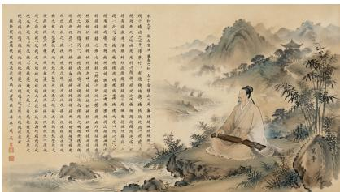

Wan2.7 Pro  
NanoBanana Pro  
  
Seedream 5.0 Lite

Qwen-Image-2512  
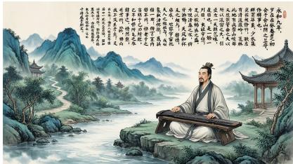  
Qwen-Image-2.0

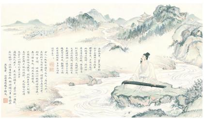

冬⽇北京的都市街景，⻘灰⽡顶、朱红⾊外墙的两间相邻中式商铺⽐肩⽽⽴，檐下悬挂印有剪纸⻢的暖光灯笼在阴天漫射光中投下柔和光晕，映照湿润鹅卵⽯路⾯泛起细腻反光。左侧为书法店：靛蓝⾊⽼旧的牌匾上以遒劲行书刻着"文字渲染"店门口的玻璃上挂着一幅字，自上而下 用田英意硬笑写着“专业幻灯片\n中英文海报\n ⾼级信息图”，落款印章为‘1k token’朱砂印。店内的墙上，可以模糊的辨认有三幅竖排的书法作品，第⼀幅写着着"阿⾥巴巴"，第⼆幅写着"通义千问"，第三福写着"图像⽣成"。⼀位⽩发苍苍的⽼⼈背对着镜头观赏。右侧为花店，牌匾上以鲜花做成⽂字"真实质感"；店内多层花架陈列红玫瑰、粉洋牡丹和绿植，⻔上贴了⼀个圆形花边标识，标识上写着"2k resolution"，⻔⼝摆放了⼀个彩⾊霓虹灯，上⾯写着"细腻刻画 ⼈物 ⾃然 建筑"。两家店中间堆放了⼀个雪⼈，举了⼀⽼式⼩⿊板，上⾯⽤粉笔字写着"Qwen-Image-2.0 正式发布"。街道左侧，年轻情侣依偎在⼀起，⼥孩是瘦脸，⾝穿⽶⽩⾊⽺绒⼤⾐，⾁⾊光腿神器。⼥孩举着⼼形透明⽓球，⽓球印有⽩⾊的字："⽣图编辑\n⼆合⼀"。⾥⾯有⼀个⽑茸茸的卡⽪巴拉玩偶。男孩⾝着剪裁合体的深灰⾊呢⼦外套，内搭浅⾊⾼领⽑⾐。街道右侧，⼀个后背上写着"更⼩模型，更快速度"骑⼿疾驰⽽过。整条街光影交织、动静相宜。

GPT-Image-2  
NanoBanana Pro  
Qwen-Image-2512  
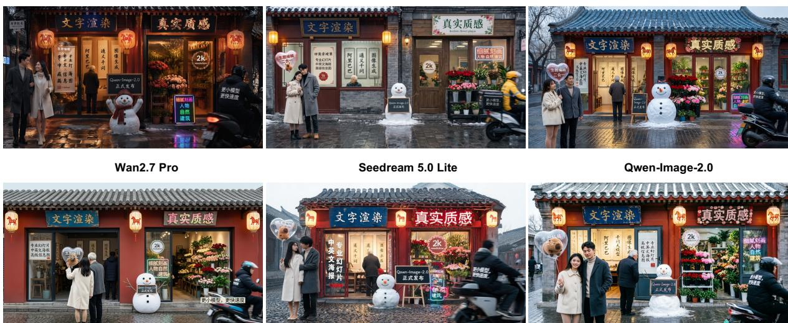  
Figure 13: Qualitative comparison of text rendering results.

这张照⽚捕捉了在⼀个温馨的室内环境中（似乎是⼀家传统的英国酒吧或乡村餐厅），⼀对⽼年夫妇正在隔着⽊桌愉快交谈的真实⽣活瞬间。画⾯采⽤平视视⻆，融合了从左侧窗户透⼊的⾃然光和右侧台灯散发的暖⻩⾊⼈造光，营造出⼀种舒适、亲昵的氛围。 按照从左到右、从后到前的顺序观察： 画⾯的左后⽅是⼀扇带有⽩⾊窗框和多个矩形格栅的窗户。紧贴窗户放置着⼀块⿊底⽩字的营业告示牌，⼤部分⽂字清晰可⻅，⼩部分被男⼠的头部遮挡。上⾯依次印有醒FOOD” SERVED” D DAILY” 12-8PM” LUNCH & DINNER” R & BREAKFAST”在窗户右侧，悬挂着⼀⾯带有绿叶和暗红⾊碎花图案的浅⾊窗帘，窗帘被⼀根粗壮的麻花状绳索系带束起。 画⾯的中景是两位相对⽽坐的⽼⼈。左侧是⼀位肤⾊⽩皙的⽼年男⼠，他头部微秃，两侧留有灰⽩⾊的短发，⿐梁上架着⼀副深⾊细框的椭圆形眼镜。他内搭⽩⾊圆领T恤，外穿⼀件深海蓝⾊的四分之⼀拉链针织⽑⾐。他正转头看向右侧的⼥⼠，脸上洋溢着灿烂⽽真诚的笑容。右侧坐着⼀位同样肤⾊⽩皙的⽼年⼥⼠，留着⼀头短⽽卷曲的银⽩⾊头发。她⾝穿⼀件浅灰⾊的⻓袖⽑⾐，⽑⾐的胸前和肩部点缀着许多闪亮的亮⽚装饰。她佩戴着⼩巧的⽿钉和⼀条纤细的⾦⾊项链。她的右⼿⾃然地搭在桌⾯上，左⼿捏着⾼脚杯的杯柄，正侧过头温柔地注视着男⼠，⾯带慈祥的微笑。 在⼥⼠⾝后的背景是⼀⾯由不规则的浅棕⾊和灰褐⾊粗糙⽯块砌成的质朴⽯墙。墙上悬挂着⼏幅镶有⿊⾊画框的装饰画：左上⻆是⼀幅⿊⽩⻛景照⽚；右上⻆边缘仅露出画框的⼀⻆；右下⽅的⼀幅画中清晰地印有⼤写字⺟“WOODS”以及类似葡萄园的⻛景图案。在画框的右下⽅，放置着⼀盏复古台灯，台灯具有⻩铜⾊的⾦属雕花底座，顶部是带有红⽩相间垂直条纹的百褶圆锥形灯罩，散发出温暖的⻩⾊光芒。 在画⾯的前景，即两⼈⾯前的⽔平横向拼接⽊纹餐桌上：左侧边缘隐约可⻅⼀个⿊⾊的物体（可能是帽⼦或⾐物的⼀⻆）；男⼠的前⽅放置着⼀个⾼挑的透明直筒玻璃啤酒杯，杯中液体已基本饮尽，杯壁和底部残留着⽩⾊的啤酒泡沫，杯⼦底部垫着⼀个⽅形的纸质杯垫；⼥⼠的⼿中端着⼀杯装有浅⻩⾊⽩葡萄酒的透明⾼脚杯，杯⼦下⽅同样垫着⼀个⽅形纸质杯垫；在⼥⼠⼿臂右侧的⽊桌⾯上，还平放着⼀副折叠起来的深⾊⽅框⽼花眼镜。

GPT-Image-2  
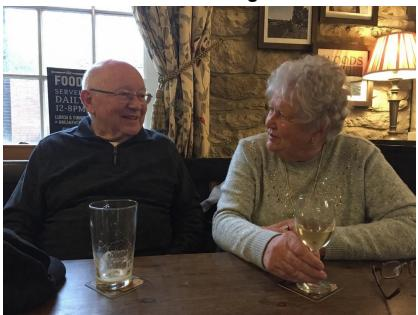

NanoBanana Pro  
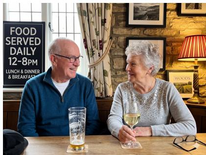  
Wan2.7 Pro

Qwen-Image-2512  
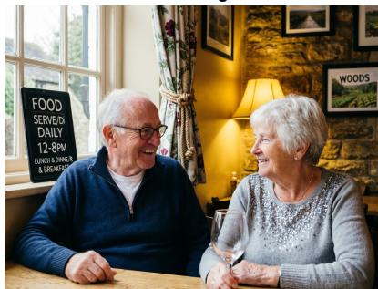

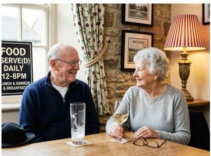

Seedream 5.0 Lite  

Qwen-Image-2.0  
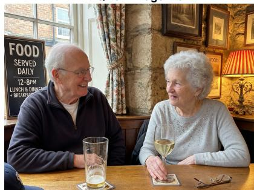  
画⾯呈现的是地铁站台上的⼀对⽼年夫妇深情相拥的半⾝特写。这对夫妇位于画⾯的视觉中⼼位置，处于静⽌状态，与背景中⾼速驶过的地铁列⻋产⽣强烈的动静对比，画面偏左侧是一位老年自人女性，她留养红棕色的微券短发，侧脸紧紧贴在果十的胸前，双眼微闭，嘴角带着安详，幸福的淡淡微等，她的左⽿可⻅戴着⼀颗⼩巧的银⾊⽿钉。她⾝穿⼀件深棕⾊的厚实冬季棉服，内搭浅⾊带领衬衫。她的右臂环抱着男⼠的背部，⼿背上有着岁⽉留下的皱纹。画⾯偏右侧是⼀位⽼年⽩⼈男性。他头戴⼀顶灰褐⾊的平顶报童帽，⾝穿深蓝⿊⾊的横纹绗缝轻薄⽻绒服，内穿浅⾊系扣衬衫。他⾯带慈祥的微笑，⾯部⽪肤布满皱纹，头部微低，脸颊与⼥⼠的头部轻轻相贴。他的左⼿搂着⼥⼠的肩膀后侧。在两位⽼⼈的胸前位置，男⼠的右⼿正握着⼀束⽩⾊的雏菊，花瓣洁⽩，花蕊呈黄色，带有绿色的长梗，他们的身后是一辆正在快速行驶的地铁列车，银灰色的金属车身占据了画面中上部的大部分背景，中于列车的快速移动，车窗和⻋⾝上的反光形成了明显的⽔平⽅向运动模糊（Motion Blur）效果。透过右侧模糊的⻋窗，可以隐约看到⻋厢内部有乘客的⾝影。在列⻋⻋⾝的右上⽅贴有⼀⾯美国国旗的贴花标志（包含红⽩条纹与蓝⾊星区）。在国旗贴花正上⽅的⼀个⿊⾊矩形指示牌内，包含模糊的⽩⾊字符，其中依稀可辨认出 [地铁⻋厢外部右侧⿊底指示牌上] "1"（⻋厢标识/路线指示），其余字符因极度的运动模糊⽽⽆法读取。画⾯的最底部边缘，可以看到地铁站台边缘特有的⻩⾊盲道纹理，表⾯布满凸起的圆点。整体光线呈现出地下⻋站特有的温暖⽽略带暗沉的⼈造光质感。摄影采⽤了中⼼构图和抓拍的⼿法，通过背景的模糊和前景⼈物的清晰定格，营造出⼀种跨越时间流逝的浪漫、温馨且感⼈的情感氛围。

GPT-Image-2  
NanoBanana Pro  
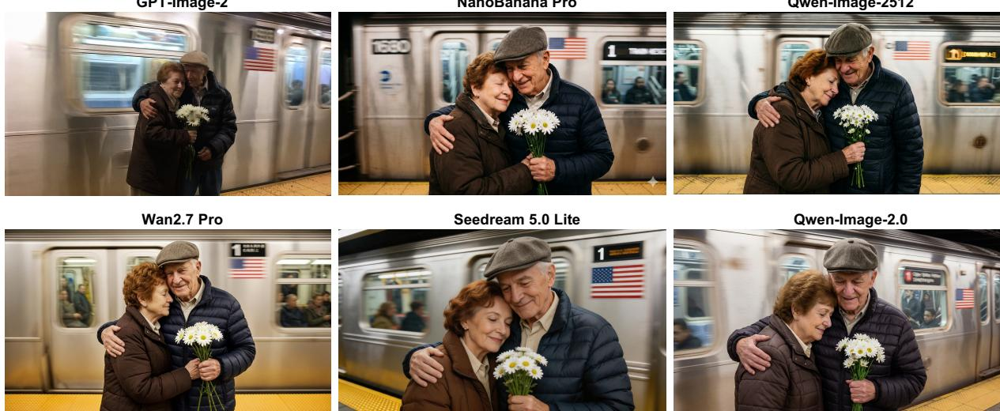  
Qwen-Image-2512  
Figure 14: Qualitative comparison of portrait generation results.

Input Prompt

这是⼀幅写实⻛格的夜间街景摄影作品，主要聚焦于⼀家明亮的便利店⻔外的四个年轻⼈。画⾯整体⾊调呈现便利店内部冷⽩光与街道暖橘⾊路灯的冷暖对⽐，地⾯湿润，有明显的积⽔反光，营造出⼀种夏夜⾬后闲散的市井氛围。 在画⾯左上⻆及顶部，是便利店的店⾯招牌，招牌带有标志性的蓝⽩绿配⾊边缘，右侧侧⾯灯箱上清晰可⻅蓝⾊的“便利店”字样。便利店采⽤⼤⾯积透明玻璃橱窗，内部灯⽕通明，透过玻璃可以看⻅货架上整⻬排列的各种饮料和零⻝。⻔框上⽅贴有⼀块蓝底⽩字的⻔牌，上⾯写着数字“110”。⼀扇玻璃⻔向外敞开，⻔上贴着⼀张带有清凉⽔花图案的夏⽇促销海报，海报正中央印着蓝⾊⼤字“冰爽⼀夏!”。 在便利店⻔外的左侧，摆放着两个⿊⾊的⼤号垃圾桶，垃圾桶前⽅和旁边放置着两把⽩⾊的塑料靠背椅。四名年轻的亚洲男性正在此处休息交谈。 最左侧的男⼦坐在⽩椅⼦上，侧⾝朝向画⾯右侧。他留着⿊⾊短发，戴着⿊框眼镜，⾝穿纯⿊⾊短袖T恤和卡其⾊短裤，脚穿⿊⾊运动鞋。他双⼿抱胸，姿态放松，正注视着另外⼏⼈。他的椅⼦脚边地⾯上放着⼀瓶透明的矿泉⽔。 坐在他右侧另一把白椅子上的男子 身穿黑色短袖T恤，黑色长裤和黑白相间的运动鞋。他身体前倾 双手握着一瓶透明的矿泉水瓶 视线同样投向右侧站立的人。站在中间偏右的男子正低头专注地看着双⼿握着的智能⼿机。他留着稍⻓的⿊发，戴着眼镜，⾝穿⽩⾊短袖T恤，T恤左胸处竖排印着⿊⾊的“武当⼭”字样，下⾝穿宽松的⽶⾊休闲裤和厚底⽩⾊运动鞋。他的左⼿除了拿着⼿机，还顺便夹着⼀瓶橙⻩⾊的饮料。 最右侧站⽴的男⼦正⾯对着坐着的两⼈。他留着⿊⾊短发，⾝穿⿊⽩相间的格⼦⻓袖衬衫，内搭深⾊⾐服下穿宽松的蓝⾊⽜仔裤和⿊⽩运动鞋。他的左⼿拿着⼀瓶橙⻩⾊的饮料，右⼿提着⼀个透明塑料袋，袋⼦⾥似乎装着⼏根⾹蕉。 画⾯的下半部分是铺着⽅形地砖的⼈⾏道。地⾯因潮湿⽽⼤⾯积反光，倒映着⼈物和灯光。靠近路缘⽯的地⽅散落着⼀些杂物，包括⼀个半空的橙⻩⾊饮料瓶。画⾯的右侧背景延伸⾄街道，路边种满⾼⼤的树⽊，在暖橙⾊路灯的照射下呈现暗⾦⾊调。⼈⾏道边缘停放着⼀排蓝⾊的共享单⻋。远处隐约可⻅停放的汽⻋和路灯，进⼀步丰富了城市夜晚的街头⽣活⽓息。

GPT-Image-2  
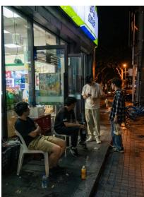

NanoBanana Pro  
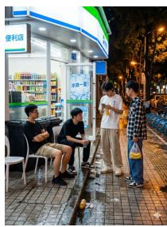

Qwen-Image-2512  
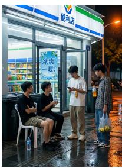

Wan2.7 Pro  
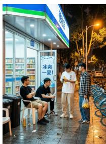

Seedream 5.0 Lite  
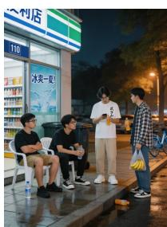

Qwen-Image-2.0  
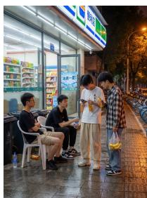  
这是一张在家庭厨房拍摄的室内生活纪实照片。画面主体是一位正在炒菜的亚洲中年女性，位于画面中央偏左。她肤色偏黄 黑色长发在脑后随意地挽成一个发髻，用黑色发圈固定。她⾝穿⼀件浅⾊短袖T恤，⾐服上布满粉⾊和绿⾊的碎花图案。外⾯系着⼀条深棕⾊的挂脖围裙，围裙的胸前边缘和腹部⼝袋边缘拼接了⿊⽩细格纹⾯料。在围进的腹部位置，印有金色的圆形Lege(形似建筑或字母组合)以及立字，Ⅱ上至下分别为中立字体“中国建设银行”(日牌名称)，瑞小的英立字体“ChinaConetruotion（英⽂名称，因⾐物褶皱略显不全）以及⾏书⻛格的中⽂字体“在您⾝边”（宣传语）。 ⼥⼦的⾝体微微前倾，视线专注地看着右下⽅的炒锅。她的双⼿正握着⼀把⿊⾊的⻓柄锅铲，在燃气灶上的黑色中式铁锅里翻炒食物。锅内装满了正在享饪的菜肴，主要由绿色的线椒段和褐色的肉丝组成。厨房的环境充满了浓厚的生活气息。右上方安装着台不锈钢与⿊⾊相间的抽油烟机。背景墙⾯铺贴着⽩⾊的⽅形瓷砖，瓷砖缝隙中可⻅⻓期使⽤的痕迹。墙⾯上固定着⼀排⽊质⼑架，上⾯插放着多把⿊⾊⼑柄的菜⼑；⼑架下⽅的挂钩上悬挂着⾦属汤勺、漏勺、剪⼑等厨具，以及⼀个透明塑料袋和⼀个挂在稍⾼处的编织⼩篮⼦。灶台右侧的台⾯上拥挤地摆放着各种调料瓶，包括红盖、⻩盖的酱油瓶、油瓶等，旁边还有⼀个沾有⻝物残渣的⽩⾊瓷盘。 画⾯左侧是⽔槽区域，灰⽩⾊的斑点台⾯上放着⼀瓶绿⾊的洗洁精，瓶⾝可⻅红底⽩字的“⽴⽩”（品牌名称）字样。⽔槽内堆放着⼏个待洗的碗碟。⽔槽下⽅是灰绿⾊的橱柜⻔，带有银⾊的竖向拉⼿。左侧背景是⼀扇带有铝合⾦边框的磨砂玻璃推拉⻔。 画⾯右下⻆的前景处，放置着⼀个装满淡⻩⾊细丝状蔬菜（疑似包菜丝或⼟⾖丝）的透明塑料袋。 整张照⽚采⽤平视视⻆，光线主要来⾃室内的顶灯，⾊调偏暖，⾊彩真实⾃然，没有经过明显的滤镜外理生动地捕捉了日常家庭享饪的直实瞬间

Input Prompt

GPT-Image-2  
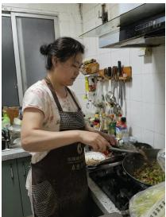

NanoBanana Pro  
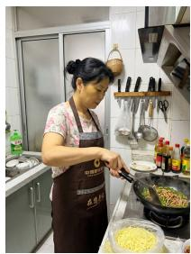

Qwen-Image-2512  
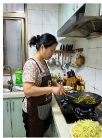

Wan2.7 Pro  
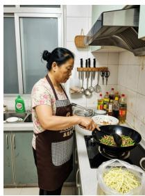

Seedream 5.0 Lite  
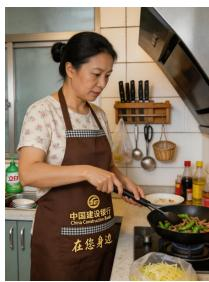

Qwen-Image-2.0  
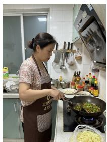  
A photorealistic vertical 9:16 smartphone screenshot of a TikTok-style short video app. SCENE: Inside a subway carriage under bright cool-white fluorescent lighting, Center: a young East Asian man sitting, Jooking down at his phone, Eair skin, thick fluffy black wayy hair with a middle part, delicate features, high nose bridge, calm focused expression. Wearing a black zip-up casual jacket with thin white stripe accents on shoulders and sleeves, white crew-neck tee underneath, dark blue vintage-wash jeans, silver ring pendant necklace, white wireless earbud in left ear. Holding a dark-cased smartphone. Large black nylon/canvas backpack with creased texture rests on his lap. Left: young East Asian woman in a light beige baseball cap, light blue medical mask, pale yellow-white long-sleeve collared shirt, long straight black hair, leaning slightly forward looking down. Right edge: standing passenger in a gray long-sleeve shirt gripping a vertical brushed-silver metal handrail. Dark subway window behind the man shows a faint reflection of a person wearing glasses. Seats feature bright green and white streamlined plastic edges. Medium shot, sharp focus on the male subject, subtle background bokeh, candid urban commute aesthetic. UI OVERLAYS (Exact TikTok layout): Top status bar: "23:17" (left), signal/Wi-Fi/battery "95%" (right). Top nav bar: "Local | Shenzhen | Following Shop | For You" (white sans-serif), magnifying glass search icon (far right). Top-left: red red-packet/gift icon. Top-right: gray "x" close button. Right vertical interaction bar: black circular avatar (wearing glasses) with red "+" below, white heart icon + "83K", white comment bubble + "5210", white bookmark star + "12K", white curved share arrow + "27K", bottom spinning vinyl music disc. Bottom-left info area: "@SubwayEncounter", gray "Photo" badge, "Shenzhen Line 1 �", "#ShenzhenSubway #HandsomeGuy #Line1", "2024-11-21 16:24 IP: Guangdong" (gray small text), scrolling music bar with green "Listen on App >" badge + "Love You So - The King Khan Show". Bottom navigation bar: "Home", "Friends", "+" inside a white rounded rectangle, "Inbox" with red notification badge "99", "Profile". High-resolution UI mockup style, realistic screen spacing and interface proportions.

Input Prompt  
GPT-Image-2  

NanoBanana Pro  
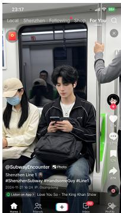

Qwen-Image-2512  
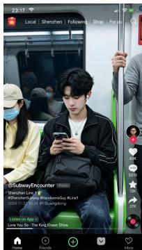

Figure 15: Qualitative comparison of portrait generation results.  
Wan2.7 Pro  
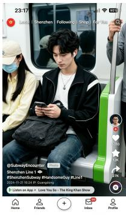

Seedream 5.0 Lite  
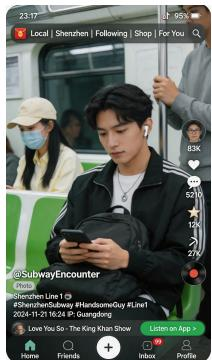

Qwen-Image-2.0  
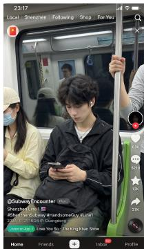

Input Prompt

Add the following poem to the image: <ow¿ùoÿÿõq\_c\_Ý2þmöOOS\~ÿõoö ÿ½\_y2=

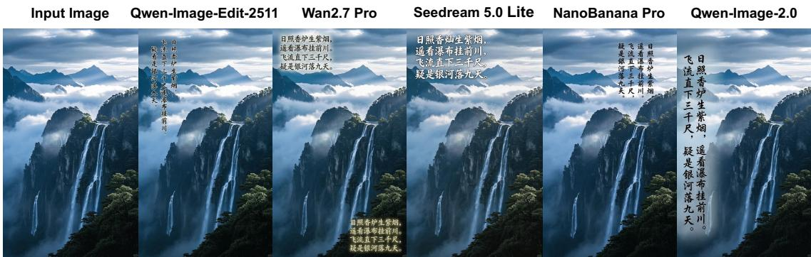  
Add the following poem to the image: <Wï{ÿ¿ÿ^ÿÏ]þ2ßìûm^ÿ\_×/áy2/o ÿöÿÿÿ½oW2§s²Y›ÿýæõw2

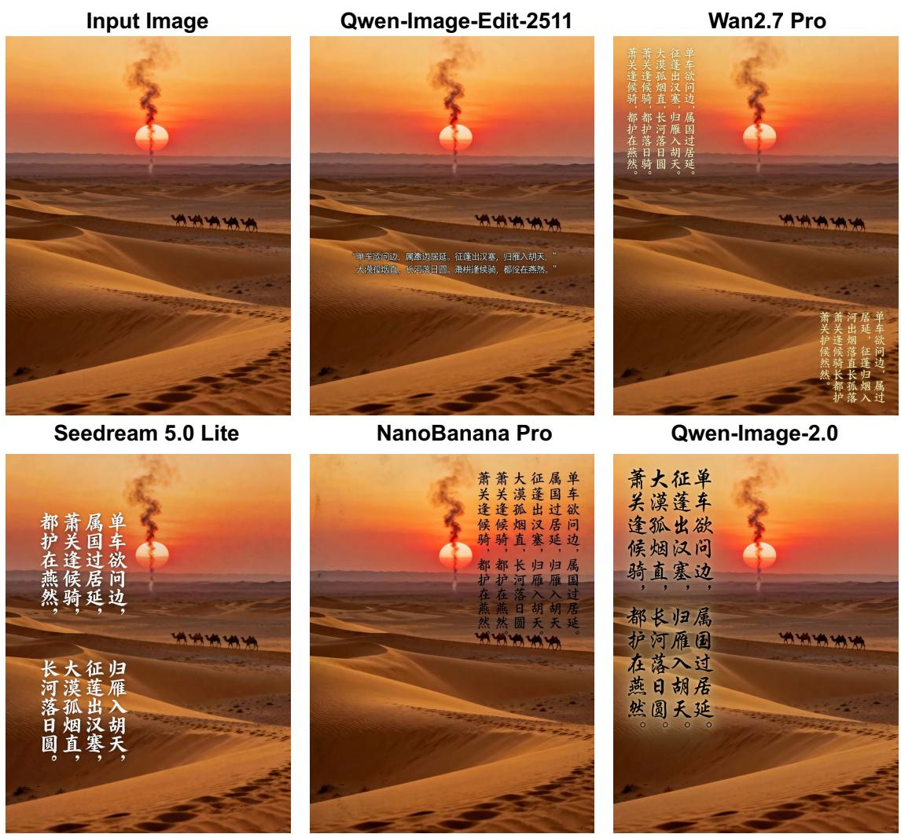  
Figure 16: Qualitative comparison of complex Chinese text rendering in an image editing task. Qwen-Image-2.0 demonstrates superior accuracy and aesthetic quality, and is the only model capable of rendering classical Chinese poetry both accurately and aesthetically.

Input Prompt

Add a carrot and a tissue in front of the cat in the first picture, with the carrot on the left and the tissue on the right. Then put the hat from the second picture on the cat's head, keeping the cat's expression and posture unchanged.

Input Image  
Qwen-Image-Edit-2511 Wan2.7 Pro Seedream 5.0 Lite NanoBanana Pro Qwen-Image-2.0  
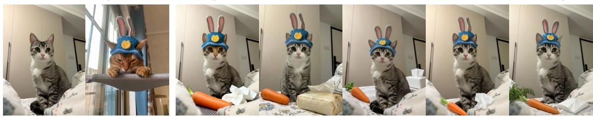  
Input Prompt  
Create a realistic Swiss outdoor scene where a Colombian painter is painting a figure in the image. The painter sits at his easel, while the figure in the image sits opposite him being painted. The environment should be vibrant, natural, and sunny4such as a riverbank or a lively outdoor setting. The overall style must be completely realistic.

Input Image  
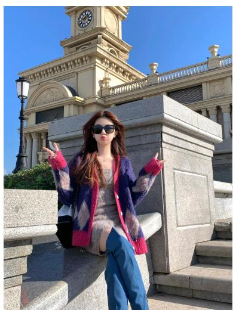

Qwen-Image-Edit-2511  
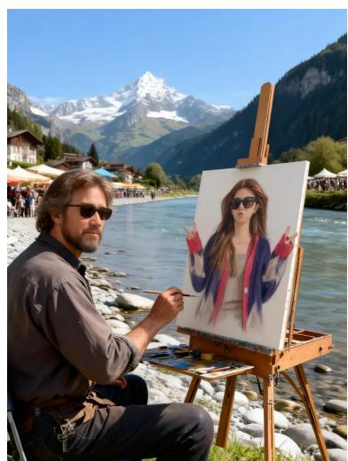

Wan2.7 Pro  
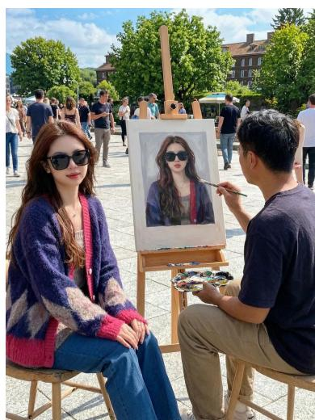

Seedream 5.0 Lite  
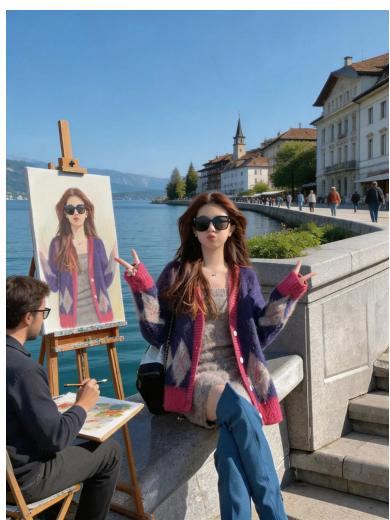

NanoBanana Pro  
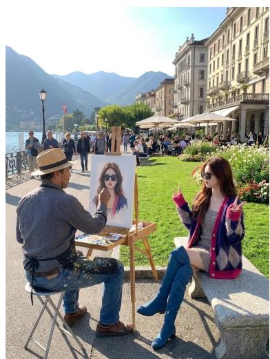

Qwen-Image-2.0  
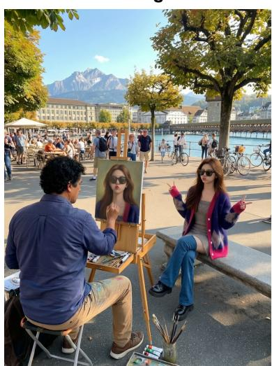  
Figure 17: Qualitative comparison of identity preservation. In both single-image and multi-image editing tasks, Qwen-Image closely follows user instructions while maintaining fine-grained object details, including facial expressions, posture, and overall appearance. These results highlight its strong capability for precise object-level editing without sacrificing visual consistency.

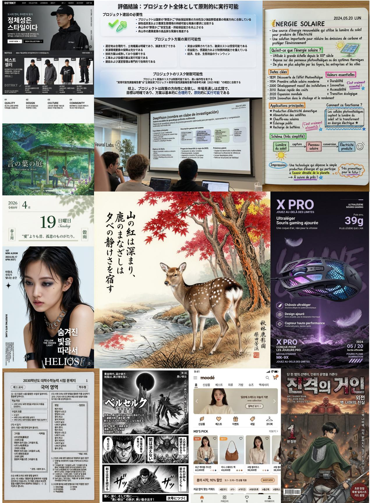  
Figure 18: Visualization of multilingual rendering by Qwen-Image-2.0.

## When the Sun Sets, The Wild Wakes Up

A family-friendly journey into Mandai's magical nocturnal world

  
Mandai Wildlife Reserve

## Evening shifts reveal wild life

Soft lighting mimics natural moonlight

Family twilight walks turn curiosity into lasting conservation.

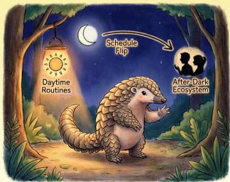

## Soft Light Awakens Wildlife

## Bounce warm light upward

Harsh spotlights cause stress. Upward fixtures reflect light through leaves, creating a soft canopy glow.

  
Direct Glare  
Canopy Bounce

## Safe paths guide night walks

Lighting mimics gentle moonlight

Moonlight-style lights keep habitats calm while revealing subtle behaviors.

Four paths create safe access

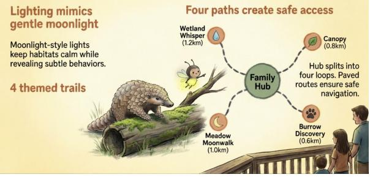  
4 themed trails

## Gentle Lights Honor Rhythms

Focus Light Downward Amber filters and baffles block glare

Build Quiet Respect Quiet viewing fosters lasting stewardship.

Preserve Natural Habits Species hunt and glide undisturbed. Rhythms Uninterrupted

  
Tiered seating and barriers maintain a fifteen-meter buffer, keeping wildlife calm.

## Nature Meets Safety Up Close

## Respectful viewing zones

Keepers trigger natural foraging Scent trails and puzzle feeders mimic wild foraging, safely engaging kids.

## Stories shape family bonds

Folklore bridges generations Guided soundscapes and reverse lighting spark curiosity while protecting wildlife rhythms.

## Evening meals slow the pace

Shared tables let families reflect on discoveries, turning excitement into lasting bonds.

  
Breeding coaxes species back Teams track eggs in nurseries. Animals follow care pathways Diets and monitoring guide release.  
Health Custom Enrichment Soft Chaeck Nutrtimni Pla Release

## Breeding saves night species.

Restoration rebuilds habitats Canopy recovery boosts wild success.

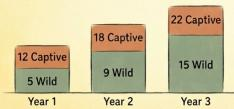

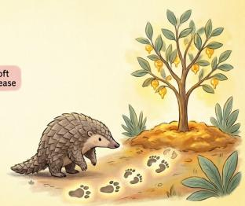

## Smart prep ensures comfort.

## Arrive early to catch twilight.

Arrive forty minutes early. Pathways illuminate safely as dusk falls. Arrive before 19:00

Layer up for quiet trails.

Wear three breathable fabrics. Rubber soles cut noise protecting habitats.

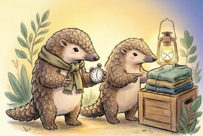

## Night visits spark respect

Gentle lighting shifts curiosity to awe Families spot quiet birds. Each moment teaches patience

  
Figure 19: Visualization of slide generation by Qwen-Image-2.0.

  
Park programs inspire global action Simple choices reduce light pollution. Wonder becomes advocacy

## 6 Conclusion

In this work, we present Qwen-Image-2.0, a versatile image generation foundation model that supports both T2I generation and instruction-based image editing within a single framework. By combining a strong multimodal encoder, an efficient MMDiT backbone, and a high-compression VAE, Qwen-Image 2.0 addresses several key challenges in real-world image generation, including long-text rendering, multilingual typography, high-resolution photorealism, complex instruction following, and inference efficiency. We hope Qwen-Image-2.0 provides a strong foundation for future research and practical deployment of general-purpose image generation systems.

## 7 Authors

Core Contributors1: Bing Zhao, Chenfei Wu, Deqing Li, Hao Meng, Jiahao Li, Jie Zhang, Jingren Zhou, Junyang Lin, Kaiyuan Gao, Kuan Cao, Kun Yan, Liang Peng, Lihan Jiang, Niantong Li, Ningyuan Tang, Shengming Yin, Tianhe Wu, Xiao Xu, Xiaoyue Chen, Xihua Wang, Yan Shu, Yanran Zhang, Yi Wang, Yilei Chen, Ying Ba, Yixian Xu, Yujia Wu, Yuxiang Chen, Zecheng Tang, Zekai Zhang, Zhendong Wang, Zihao Liu, Zikai Zhou

Contributors2: An Yang, Chen Cheng, Chenxu Lv, Dayiheng Liu, Fan Zhou, Hantian Xiong, Hongzhu Shi, Hu Wei, Huihong Zhao, Ivy Liu, Jianwei Zhang, Jiawei Zhang, Kai Chen, Kang He, Levon Xue, Lin Qu, Linhan Tang, Luwen Feng, Minggang Wu, Minmin Sun, Na Ni, Rui Men, Shuai Bai, Sishou Zheng, Tao Lan, Tianqi Zhang, Tingkun Wen, Wei Wang, Weixu Qiao, Weiyi Lu, Wenmeng Zhou, Xiaodong Deng, Xiaoxiao Xu, Xinlei Fang, Xionghui Chen, Yanan Wang, Yang Fan, Yichang Zhang, Yixuan Xu, Yu Wu, Zhiyuan Ma, Zhizhi Cai

## References

Niket Agarwal, Arslan Ali, Maciej Bala, Yogesh Balaji, Erik Barker, Tiffany Cai, Prithvijit Chattopadhyay, Yongxin Chen, Yin Cui, Yifan Ding, et al. Cosmos world foundation model platform for physical ai. arXiv preprint arXiv:2501.03575, 2025.

Arena AI. Arena ai leaderboard, 2025. URL https://arena.ai/leaderboard.

Shuai Bai, Yuxuan Cai, Ruizhe Chen, Keqin Chen, Xionghui Chen, Zesen Cheng, Lianghao Deng, Wei Ding, Chang Gao, Chunjiang Ge, et al. Qwen3-vl technical report. arXiv preprint arXiv:2511.21631, 2025a.

Shuai Bai, Keqin Chen, Xuejing Liu, Jialin Wang, Wenbin Ge, Sibo Song, Kai Dang, Peng Wang, Shijie Wang, Jun Tang, Humen Zhong, Yuanzhi Zhu, Mingkun Yang, Zhaohai Li, Jianqiang Wan, Pengfei Wang, Wei Ding, Zheren Fu, Yiheng Xu, Jiabo Ye, Xi Zhang, Tianbao Xie, Zesen Cheng, Hang Zhang, Zhibo Yang, Haiyang Xu, and Junyang Lin. Qwen2.5-vl technical report. arXiv preprint arXiv:2502.13923, 2025b.

BlackForest. Flux. https://github.com/black-forest-labs/flux, 2024.

Huanqia Cai, Sihan Cao, Ruoyi Du, Peng Gao, Steven Hoi, Zhaohui Hou, Shijie Huang, Dengyang Jiang, Xin Jin, Liangchen Li, et al. Z-image: An efficient image generation foundation model with single-stream diffusion transformer. arXiv preprint arXiv:2511.22699, 2025.

Siyu Cao, Hangting Chen, Peng Chen, Yiji Cheng, Yutao Cui, Xinchi Deng, Ying Dong, Kipper Gong, Tianpeng Gu, Xiusen Gu, et al. Hunyuanimage 3.0 technical report. arXiv preprint arXiv:2509.23951, 2025.

Huiwen Chang, Han Zhang, Lu Jiang, Ce Liu, and William T Freeman. Maskgit: Masked generative image transformer. In Proceedings of the IEEE/CVF conference on computer vision and pattern recognition, pp. 11315–11325, 2022.

Junsong Chen, Jincheng Yu, Chongjian Ge, Lewei Yao, Enze Xie, Zhongdao Wang, James Kwok, Ping Luo, Huchuan Lu, and Zhenguo Li. Pixart-alpha: Fast training of diffusion transformer for photorealistic text-to-image synthesis. In International conference on learning representations, volume 2024, pp. 57611– 57640, 2024.

Junyu Chen, Han Cai, Junsong Chen, Enze Xie, Shang Yang, Haotian Tang, Muyang Li, and Song Han. Deep compression autoencoder for efficient high-resolution diffusion models. In International Conference on Learning Representations, volume 2025, pp. 96539–96560, 2025.

Mark Chen, Alec Radford, Rewon Child, Jeffrey Wu, Heewoo Jun, David Luan, and Ilya Sutskever. Generative pretraining from pixels. In International conference on machine learning, pp. 1691–1703. PMLR, 2020.

Jia Deng, Wei Dong, Richard Socher, Li-Jia Li, Kai Li, and Li Fei-Fei. Imagenet: A large-scale hierarchical image database. In 2009 IEEE conference on computer vision and pattern recognition, pp. 248–255. Ieee, 2009.

Patrick Esser, Sumith Kulal, Andreas Blattmann, Rahim Entezari, Jonas Müller, Harry Saini, Yam Levi, Dominik Lorenz, Axel Sauer, Frederic Boesel, et al. Scaling rectified flow transformers for high resolution image synthesis. In Forty-first international conference on machine learning, 2024.

Yu Gao, Lixue Gong, Qiushan Guo, Xiaoxia Hou, Zhichao Lai, Fanshi Li, Liang Li, Xiaochen Lian, Chao Liao, Liyang Liu, et al. Seedream 3.0 technical report. arXiv preprint arXiv:2504.11346, 2025.

Zhengyang Geng, Mingyang Deng, Xingjian Bai, J Zico Kolter, and Kaiming He. Mean flows for one-step generative modeling. arXiv preprint arXiv:2505.13447, 2025.

Lixue Gong, Xiaoxia Hou, Fanshi Li, Liang Li, Xiaochen Lian, Fei Liu, Liyang Liu, Wei Liu, Wei Lu, Yichun Shi, et al. Seedream 2.0: A native chinese-english bilingual image generation foundation model. arXiv preprint arXiv:2503.07703, 2025.

Google. Nano Banana Pro. https://blog.google/innovation-and-ai/products/nano-banana-pro/, 2025.

Jian Han, Jinlai Liu, Yi Jiang, Bin Yan, Yuqi Zhang, Zehuan Yuan, Bingyue Peng, and Xiaobing Liu. Infinity: Scaling bitwise autoregressive modeling for high-resolution image synthesis. In Proceedings of the Computer Vision and Pattern Recognition Conference, pp. 15733–15744, 2025.

Jonathan Ho and Tim Salimans. Classifier-free diffusion guidance. arXiv preprint arXiv:2207.12598, 2022.

Jonathan Ho, Ajay Jain, and Pieter Abbeel. Denoising diffusion probabilistic models. Advances in neural information processing systems, 33:6840–6851, 2020.

Tencent HY. HunyuanImage-2.1. https://github.com/Tencent-Hunyuan/HunyuanImage-2.1, 2025.

JD Joy Future Academy. JoyAI-Image: Awakening Spatial Intelligence in Unified Multimodal Understanding and Generation. https://github.com/jd-opensource/JoyAI-Image, 2026.

Diederik P Kingma and Max Welling. Auto-encoding variational bayes. arXiv preprint arXiv:1312.6114, 2013.

Weijie Kong, Qi Tian, Zijian Zhang, Rox Min, Zuozhuo Dai, Jin Zhou, Jiangfeng Xiong, Xin Li, Bo Wu, Jianwei Zhang, et al. Hunyuanvideo: A systematic framework for large video generative models. arXiv preprint arXiv:2412.03603, 2024.

Black Forest Labs. FLUX.2: Frontier Visual Intelligence. https://bfl.ai/blog/flux-2, 2025.

Black Forest Labs, Stephen Batifol, Andreas Blattmann, Frederic Boesel, Saksham Consul, Cyril Diagne, Tim Dockhorn, Jack English, Zion English, Patrick Esser, et al. Flux. 1 kontext: Flow matching for in-context image generation and editing in latent space. arXiv preprint arXiv:2506.15742, 2025.

Zhimin Li, Jianwei Zhang, Qin Lin, Jiangfeng Xiong, Yanxin Long, Xinchi Deng, Yingfang Zhang, Xingchao Liu, Minbin Huang, Zedong Xiao, et al. Hunyuan-dit: A powerful multi-resolution diffusion transformer with fine-grained chinese understanding. arXiv preprint arXiv:2405.08748, 2024.

Yaron Lipman, Ricky TQ Chen, Heli Ben-Hamu, Maximilian Nickel, and Matt Le. Flow matching for generative modeling. arXiv preprint arXiv:2210.02747, 2022.

Dongyang Liu, Peng Gao, David Liu, Ruoyi Du, Zhen Li, Qilong Wu, Xin Jin, Sihan Cao, Shifeng Zhang, Hongsheng Li, et al. Decoupled DMD: CFG augmentation as the spear, distribution matching as the shield. arXiv preprint arXiv:2511.22677, 2025.

Jie Liu, Gongye Liu, Jiajun Liang, Yangguang Li, Jiaheng Liu, Xintao Wang, Pengfei Wan, Di Zhang, and Wanli Ouyang. Flow-grpo: Training flow matching models via online rl. Advances in neural information processing systems, 38:40783–40818, 2026.

Xingchao Liu, Chengyue Gong, and Qiang Liu. Flow straight and fast: Learning to generate and transfer data with rectified flow. arXiv preprint arXiv:2209.03003, 2022.

Cheng Lu and Yang Song. Simplifying, stabilizing and scaling continuous-time consistency models. arXiv preprint arXiv:2410.11081, 2024.

Guoqing Ma, Haoyang Huang, Kun Yan, Liangyu Chen, Nan Duan, Shengming Yin, Changyi Wan, Ranchen Ming, Xiaoniu Song, Xing Chen, et al. Step-video-t2v technical report: The practice, challenges, and future of video foundation model. arXiv preprint arXiv:2502.10248, 2025.

Nanye Ma, Mark Goldstein, Michael S Albergo, Nicholas M Boffi, Eric Vanden-Eijnden, and Saining Xie. Sit: Exploring flow and diffusion-based generative models with scalable interpolant transformers. In European Conference on Computer Vision, pp. 23–40. Springer, 2024.

OpenAI. GPT Image 1.5. https://developers.openai.com/api/docs/models/gpt-image-1.5, 2025.

William Peebles and Saining Xie. Scalable diffusion models with transformers. In Proceedings of the IEEE/CVF international conference on computer vision, pp. 4195–4205, 2023.

Dustin Podell, Zion English, Kyle Lacey, Andreas Blattmann, Tim Dockhorn, Jonas Müller, Joe Penna, and Robin Rombach. Sdxl: Improving latent diffusion models for high-resolution image synthesis. In International Conference on Learning Representations, volume 2024, pp. 1862–1874, 2024.

Alec Radford, Jong Wook Kim, Chris Hallacy, Aditya Ramesh, Gabriel Goh, Sandhini Agarwal, Girish Sastry, Amanda Askell, Pamela Mishkin, Jack Clark, et al. Learning transferable visual models from natural language supervision. In International conference on machine learning, pp. 8748–8763, 2021.

Robin Rombach, Andreas Blattmann, Dominik Lorenz, Patrick Esser, and Björn Ommer. High-resolution image synthesis with latent diffusion models. In Proceedings of the IEEE/CVF conference on computer vision and pattern recognition, pp. 10684–10695, 2022.

Axel Sauer, Frederic Boesel, Tim Dockhorn, Andreas Blattmann, Patrick Esser, and Robin Rombach. Fast high-resolution image synthesis with latent adversarial diffusion distillation. In ACM SIGGRAPH Conference, pp. 1–11, 2024a.

Axel Sauer, Dominik Lorenz, Andreas Blattmann, and Robin Rombach. Adversarial diffusion distillation. In European Conference on Computer Vision, pp. 87–103, 2024b.

ByteDance Seed. Seedream 5.0 Lite. https://seed.bytedance.com/en/seedream5\_0\_lite, 2025.

Team Seedream, Yunpeng Chen, Yu Gao, Lixue Gong, Meng Guo, Qiushan Guo, Zhiyao Guo, Xiaoxia Hou, Weilin Huang, Yixuan Huang, et al. Seedream 4.0: Toward next-generation multimodal image generation. arXiv preprint arXiv:2509.20427, 2025.

Zhihong Shao, Peiyi Wang, Qihao Zhu, Runxin Xu, Junxiao Song, Xiao Bi, Haowei Zhang, Mingchuan Zhang, YK Li, Yang Wu, et al. Deepseekmath: Pushing the limits of mathematical reasoning in open language models. arXiv preprint arXiv:2402.03300, 2024.

Yang Song, Prafulla Dhariwal, Mark Chen, and Ilya Sutskever. Consistency models. In International Conference on Machine Learning, 2023.

Mingjie Sun, Xinlei Chen, J Zico Kolter, and Zhuang Liu. Massive activations in large language models. In First Conference on Language Modeling, 2024a.

Quan Sun, Qiying Yu, Yufeng Cui, Fan Zhang, Xiaosong Zhang, Yueze Wang, Hongcheng Gao, Jingjing Liu, Tiejun Huang, and Xinlong Wang. Emu: Generative pretraining in multimodality. In Internationa conference on learning representations, volume 2024, pp. 12352–12380, 2024b.

Meituan LongCat Team, Hanghang Ma, Haoxian Tan, Jiale Huang, Junqiang Wu, Jun-Yan He, Lishuai Gao, Songlin Xiao, Xiaoming Wei, Xiaoqi Ma, et al. Longcat-image technical report. arXiv preprint arXiv:2512.07584

Qwen Team. Qwen3.5: Accelerating productivity with native multimodal agents, February 2026. URL https://qwen.ai/blog?id=qwen3.5.

Keyu Tian, Yi Jiang, Zehuan Yuan, Bingyue Peng, and Liwei Wang. Visual autoregressive modeling: Scalable image generation via next-scale prediction. Advances in neural information processing systems, 37:84839–84865, 2024.

Team Wan, Ang Wang, Baole Ai, Bin Wen, Chaojie Mao, Chen-Wei Xie, Di Chen, Feiwu Yu, Haiming Zhao, Jianxiao Yang, et al. Wan: Open and advanced large-scale video generative models. arXiv preprint arXiv:2503.20314, 2025.

Jing Wang, Jiajun Liang, Jie Liu, Henglin Liu, Gongye Liu, Jun Zheng, Wanyuan Pang, Ao Ma, Zhenyu Xie, Xintao Wang, et al. Grpo-guard: Mitigating implicit over-optimization in flow matching via regulated clipping. arXiv preprint arXiv:2510.22319, 2025.

Chenfei Wu, Jiahao Li, Jingren Zhou, Junyang Lin, Kaiyuan Gao, Kun Yan, Sheng-ming Yin, Shuai Bai, Xiao Xu, Yilei Chen, et al. Qwen-image technical report. arXiv preprint arXiv:2508.02324, 2025.

Tianhe Wu, Ruibin Li, Lei Zhang, and Kede Ma. Diversity-preserved distribution matching distillation for fast visual synthesis. arXiv preprint arXiv:2602.03139, 2026.

Jingfeng Yao, Bin Yang, and Xinggang Wang. Reconstruction vs. generation: Taming optimization dilemma in latent diffusion models. In Proceedings of the Computer Vision and Pattern Recognition Conference, pp. 15703–15712, 2025.

Tianwei Yin, Michaël Gharbi, Taesung Park, Richard Zhang, Eli Shechtman, Fredo Durand, and Bill Freeman. Improved distribution matching distillation for fast image synthesis. In Advances in Neural Information Processing Systems, pp. 47455–47487, 2024a.

Tianwei Yin, Michaël Gharbi, Richard Zhang, Eli Shechtman, Fredo Durand, William T Freeman, and Taesung Park. One-step diffusion with distribution matching distillation. In IEEE/CVF Conference on Computer Vision and Pattern Recognition, pp. 6613–6623, 2024b.

Jiahui Yu, Yuanzhong Xu, Jing Yu Koh, Thang Luong, Gunjan Baid, Zirui Wang, Vijay Vasudevan, Alexander Ku, Yinfei Yang, Burcu Karagol Ayan, et al. Scaling autoregressive models for content-rich text-to-image generation. arXiv preprint arXiv:2206.10789, 2(3):5, 2022.

Biao Zhang and Rico Sennrich. Root mean square layer normalization. Advances in neural information processing systems, 32, 2019.

Kaiwen Zheng, Huayu Chen, Haotian Ye, Haoxiang Wang, Qinsheng Zhang, Kai Jiang, Hang Su, Stefano Ermon, Jun Zhu, and Ming-Yu Liu. Diffusionnft: Online diffusion reinforcement with forward process. arXiv preprint arXiv:2509.16117, 2025.