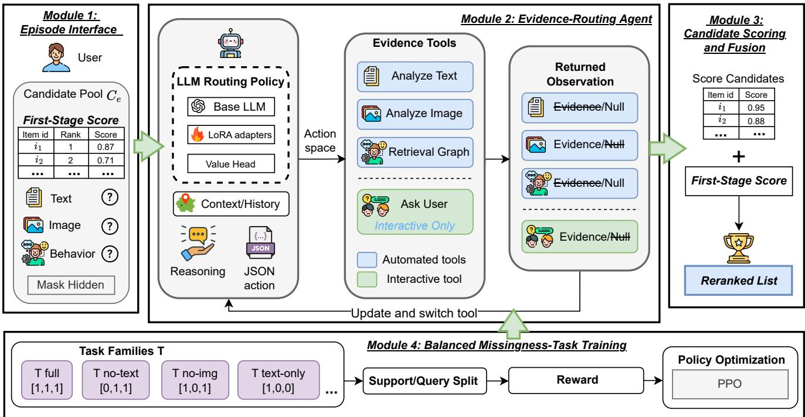
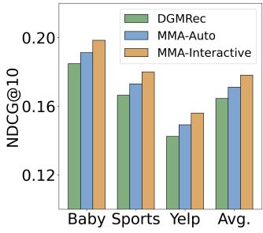
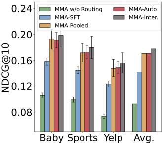

# Meta-Modal Agent: Sequential Evidence Routing for Missing-Modality Candidate Reranking

Jinze Wang† School of Engineering Swinburne University of Technology Melbourne, Australia

Lu Zhang School of Cybersecurity Chengdu University of Information Technology Chengdu, China

Yangchen Zeng† School of Computer Science and Technology Southeast University Shanghai, China

Yuze Liu School of Engineering Swinburne University of Technology Melbourne, Australia

Jiong Jin School of Engineering Swinburne University of Technology Melbourne, Australia

Tiehua Zhang\* School of Computer Science and Technology Tongji University Shanghai, China tiehuaz@tongji.edu.cn

Zhishu Shen School of Computer Science and Artificial Intelligence Wuhan University of Technology Wuhan, China

Zhu Sun Singapore University of Technology and Design Singapore

## Abstract

Missing modalities cause severe failures in multimodal recommender systems. User histories, item text, and visual evidence are frequently absent during cold-start scenarios, exactly when rec ommendation quality matters most. Existing approaches recover absent signals through imputation, feature propagation, or generative reconstruction, but these strategies can inject unsupported evi dence when the surviving signals are weak. We introduce the Meta-Modal Agent (MMA), a large language model based candidate-pool reranker that treats missingness as a sequential evidence-routing problem. MMA is trained with balanced missingness-task reinforcement learning over masked-modality episodes and is eval uated in two variants: MMA-Auto, which uses only automated text, image, and graph tools, and MMA-Interactive, which ad ditionally permits clarification questions grounded in surviving modalities as an upper-bound diagnostic. MMA operates after a first-stage retriever has produced a candidate pool; it scores those candidates rather than retrieving items from the full catalog. Fi nal reranking fuses MMA scores with first-stage retrieval scores selected on validation data. Our evaluation is organized around four evidence checks required for a robust missing-modality claim: oracle-free one-observed-modality availability (OOMA) robustness, per-modality OOMA breakdowns, fixed-pool full-catalog rerank ing, and a deterministic-router mechanism control. MMA-Auto improves target-positive OOMA NDCG@10 by 4.0% and fixed-pool full-catalog reranking NDCG@10 by 12.7% over the strongest noninteractive baseline. RuleRouter-Fuse, which uses the same tools and fusion rule without learned policy updates, underperforms MMA-Auto, supporting learned routing beyond deterministic tool fusion. MMA-Interactive adds a 4.1% upper-bound gain when clarification is available.

## CCS Concepts

• Information systems → Personalization; Social recommendation.

## Keywords

Large language models, Personalized recommendation, Cold-start recommendation

## ACM Reference Format:

Jinze Wang†, Yangchen Zeng†, Tiehua Zhang\*, Lu Zhang, Yuze Liu, Zhishu Shen, Jiong Jin, and Zhu Sun. 2026. Meta-Modal Agent: Sequential Evidence Routing for Missing-Modality Candidate Reranking. In Proceedings of Proceedings of the 35th ACM International Conference on Information and Knowledge Management (CIKM ’26). ACM, New York, NY, USA, 9 pages. https://doi.org/XXXXXXX.XXXXXXX

## 1 Introduction

Modern recommender systems increasingly rely on multimodal evidence: interaction graphs reveal collaborative preferences, text describes item semantics, and images or audio expose attributes that may never appear in structured metadata [12, 22]. This evidence is rarely complete in the regimes that matter most. A new user has little or no behavioral history; a newly listed item may have an image but no description; a privacy-preserving deployment may deliberately suppress user attributes [12]. Missing modalities are therefore not a peripheral data-cleaning issue, but a core cold-start condition for recommendation [15]. Most missing-modality recommenders treat the absent signal as things to recover. Early and recent systems learn robust predictors from incomplete modality sets, propagate features, or generate missing representations from the available modalities [8, 18, 24]. These approaches are appropriate when the observed evidence is informative enough to constrain the missing signal. Under extreme missingness, however, reconstruction can become a liability: a generated behavioral profile from a single weak textual clue may look plausible while adding unsupported evidence to the ranking pipeline [13, 30].

LLM-based reranking agents ofer a diferent model. Rather than producing a single fused representation, an agent can decide which tool to call, inspect returned evidence, recover from tool failures, and ask a user for clarification [2, 19]. Generative agents perform well in recommendation, and large-scale tool-use training allows LLMs to use APIs efectively [16, 29]. ReAct-style prompting shows how language models can interleave reasoning with environment actions [27]. Yet static agent prompts often assume that tools will return valid observations. When a history lookup returns Null, a brittle agent may retry the same failed path or hallucinate the unavailable evidence.

This paper reframes missing modalities from a purely representation learning problem to a dynamic evidence-routing problem inside candidate-pool reranking. If the reranking state is partially observ able, then a scorer can benefit from a policy that decides which evidence source to query next and how to respond when a query returns Null. We propose the Meta-Modal Agent (MMA), an LLM based candidate-pool reranker trained with balanced missingnesstask reinforcement learning over episodes with masked modalities. MMA starts after a first-stage retriever has produced candidates; it does not perform full-catalog recall or add new items to the pool. During training, the agent repeatedly experiences missing tool outputs and receives a reward signal reflecting the relative costs of backend lookup, user clarification, and invalid retries. During inference, it adapts in context: a Null observation becomes evi dence about the environment, causing the agent to switch tools and score candidate items from surviving evidence. Crucially, we separate two deployment-relevant variants. MMA-Auto disables clarification and uses only automated text, image, and graph tools; MMA-Interactive permits Ask\_User and serves only as an interactive upper-bound diagnostic.

The contributions are:

• We formulate cold-start missingness as a POMDP over reranking tools, making failed evidence queries explicit observations rather than silent feature dropouts.

• We define an oracle-free candidate scoring and reranking protocol in which MMA scores a shared candidate pool and fuses the agent score with the first-stage retrieval score.

• We separate automated routing from interactive clarification: MMA-Auto is the deployment claim, while MMA-Interactive is reported only as an upper bound.

• We report per-modality one-observed-modality availability (OOMA) results and fixed-pool full-catalog reranking checks: MMA-Auto improves target-positive OOMA NDCG@10 by 4.0% and achieves a 12.7% mean per-dataset relative NDCG@10 gain in fixed-pool full-catalog reranking.

• We include a deterministic router control with identical tools and fusion; MMA-Auto improves average OOMA NDCG@10 from 0.1578 to 0.1711 over this control while using fewer failed calls and turns.

## 2 Related Work

## 2.1 Multimodal Recommendation under Missing Modalities

Multimodal recommender systems exploit text, images, audio, and interaction graphs to improve preference modeling [12]. Missing modalities have been studied both in recommendation and in broader multimodal learning [24]. LRMM is an early recommendationspecific treatment of cold-start missingness [18]. More recent work such as DGMRec reconstructs missing features by disentangling general and modality-specific representations [8]. Similarly, completionstyle approaches like GRE-MC enhance modality synthesis via graph retrieval [11], while others leverage modality-aware multiintention learning [26], or multi-modal graph neural networks [22] to achieve representation robustness. UniSRec addresses sparse item representations through universal sequence pre-training [6]. These methods motivate our setting but difer in objective: MMA learns an action policy that routes toward observable evidence before reranking a fixed candidate pool rather than synthesizing absent representations for full-catalog retrieval.

## 2.2 LLM Agents for Recommendation

LLM agents can maintain conversational context, call external tools, and revise plans after observing the environment. Generative agents have been studied in recommendation [20, 31], while ToolLLM demonstrates large-scale training for API-using language models [16]. ReAct provides a general prompting pattern for interleaving reasoning traces and actions [27]. AgentCF extends the agentic par adigm to collaborative filtering by simulating user–item interaction agents [32]. InstructRec adapts LLMs to follow natural-language recommendation instructions, showing strong zero-shot generalization across item domains [33]. MMA adopts the agentic interface but changes the training pressure: instead of assuming tools succeed, balanced missingness-task training repeatedly exposes the agent to missing modalities and rewards recovery from failed evidence paths.

## 2.3 Reinforcement Learning and Multi-Task Training for Sequential Decisions

RL has been applied to sequential recommendation [25] and conversational recommendation systems (CRS) where the agent must decide what to ask before recommending [10]. RLMRec integrates RL signals into multimodal recommendation to better align item representations with user preferences [17]. Our work difers from CRS in that the agent’s decision space is over modality-access tools rather than clarifying attribute questions, and from RLMRec in that we explicitly model and train for structural missingness rather than representation alignment. Multi-task and curriculum-style training can improve sample eficiency and generalization [21]. MMA uses task indices as a balancing and diagnostic mechanism over missingness patterns, ensuring that rare mask combinations receive adequate training coverage. Note that while our approach uses the "Meta" nomenclature, it difers from traditional meta-learning which optimizes for rapid gradient adaptation to new user domains [4, 9].

  
Figure 1: Overview of MMA. The agent receives a shared candidate pool, routes among available evidence tools, treats Null returns as observations, and outputs candidate scores that are fused with first-stage retrieval scores for reranking.

## 2.4 LLM-Based Recommendation

A growing body of work treats recommendation as a language task, as outlined in recent surveys of LLMs for recommendation [1]. LlamaRec uses a two-stage pipeline in which a retrieval model supplies candidates that an LLM reranks [28]. We follow the same high-level division between first-stage retrieval and LLM-based reranking, but study a diferent failure mode: the evidence avail able to the reranker may itself be missing. When a modality is structurally absent—for example, a pure cold-start user with no interaction history—prompting over a dense history degrades to guessing. MMA difers by explicitly modeling missingness as part of the reranking action space: a Null observation is a first-class event that triggers routing rather than silent fallback to a degraded prompt.

## 3 Methodology

We introduce the Meta-Modal Agent (MMA) as a modular candidate pool reranker for missing-modality recommendation. Throughout the paper, first-stage retrieval denotes the upstream step that recalls candidates from the item catalog, while reranking denotes MMA’s role: scoring only the provided candidate pool. The method has four parts: (i) a fixed episode interface that exposes a first-stage candidate pool rather than the full catalog, (ii) an evidence-routing agent that treats failed tool calls as observations, (iii) a candidatescoring output protocol that fuses MMA scores with first-stage retrieval scores, and (iv) balanced missingness-task training that exposes the policy to each missingness pattern. This section defines the technical contract used by all experiments.

## 3.1 Module 1: Episode Interface and Candidate Pool

Each episode ?? begins with a shared candidate pool $C _ { e } \subset \mathcal { I }$ of size ??, i.e., $\left| C _ { e } \right| = B .$ . Unless otherwise specified. The agent is given, for every candidate, an anonymized item ID, the first-stage rank, mary derived only from currently observable sources. Text-present episodes expose title/category/description snippets, image-only episodes expose frozen CLIP tag summaries, and behavior-only episodes expose graph-neighbor summaries. The hidden target item ?? is used only by the evaluator for reward and metrics; it is never shown to the agent.

We represent modality availability by a binary mask m $\in \{ 0 , 1 \} ^ { | \mathcal { M } | }$ over $\mathcal { M } = \{ m _ { \mathrm { t e x t } } , m _ { \mathrm { i m g } } , m _ { \mathrm { b e h } } \}$ . The mask is fixed within an episode and varies across episodes according to the task family distribution in §3.4. The mask is not directly revealed. The agent only discovers missingness by calling tools and observing whether the environment returns evidence or Null.

The target-positive protocol used for the main OOMA experiments inserts $i ^ { * }$ into $C _ { e }$ and fills the remaining ?? − 1 slots with hard negatives retrieved from the surviving evidence source: BM25 for text-present settings, CLIP-ViT-L/14 nearest-neighbor retrieval for image-only settings, and ANN graph retrieval for behavior-only settings. MMA never searches outside $C _ { e } ;$ this isolates its contri bution to candidate scoring and reranking. Section 4 separately reports the fixed-pool full-catalog reranking check.

## 3.2 Module 2: Evidence-Routing Agent

We model an episode as a partially observable Markov decision pro cess (POMDP) $\langle S , \mathcal { A } , \mathcal { P } , \Omega , O , \mathcal { R } , \gamma \rangle$ . The latent state ?? ∈ S contains the user preference distribution over I and the fixed observabil ity mask m. The agent does not maintain an explicit belief state; instead, the LLM conditions on the growing interaction history

$$
H _ {t} = (z _ {1}, a _ {1}, o _ {1}, \ldots , z _ {t}, a _ {t}, o _ {t}),
$$

where $z _ { t }$ is the reasoning trace, $a _ { t }$ is the structured tool action, and $o _ { t }$ is the returned observation. If action $a _ { t }$ queries a missing modal ity, the observation is deterministically ???? = Null. The environment state itself is static within an episode, so $\mathcal { P } ( s ^ { \prime } \mid s , a _ { t } ) = 1 [ s ^ { \prime } = s ]$ all adaptation comes from updating $H _ { t }$

At turn ??, the LLM policy first emits a reasoning trace and then a single-line JSON action:

$$
z _ {t} \sim \pi_ {\theta} ^ {z} (z \mid H _ {t - 1}), \qquad a _ {t} \sim \pi_ {\theta} ^ {a} (a \mid H _ {t - 1}, z _ {t}).\tag{1}
$$

The action space is $\mathcal { A } = \mathcal { N } \times Q$ , where N is the tool name and $\boldsymbol { Q }$ is the JSON argument string. Invalid JSON or an unknown tool name incurs the invalid-action penalty in Eq. (3).

Evidence tools. MMA can call three automated tools and one optional interactive tool:

• Analyze\_Text(item\_id) returns normalized title, category, and truncated description fields; it returns Null if $m _ { \mathrm { t e x t } } = 0 .$

• Analyze\_Image(item\_id) runs a frozen CLIP-ViT-L/14 en coder and returns the top-5 zero-shot semantic tags; it returns Null if $m _ { \mathrm { i m g } } = 0$

• Retrieve\_Graph(user\_id) performs ANN search over a precomputed item–item collaborative graph and returns top co-purchased neighbor titles; it returns Null if $m _ { \mathrm { b e h } } = 0$

• Ask\_User(modality\_type, query) asks for clarification grounded only in surviving modalities. For example, OOMA-Visual responses are synthesized from CLIP tags, and OOMA Behavioral responses summarize graph-neighbor titles. Queries about a missing modality return Null. Because this tool converts non-text evidence into curated natural-language feedback, we use it only for MMA-Interactive upper-bound diagnostics.

This design makes missingness operational: a failed call is not silently ignored or imputed, but appended to $H _ { t }$ as evidence that should change subsequent tool choices.

## 3.3 Module 3: Candidate Scoring and Fusion

The terminal action is Score\_Candidates. It is deliberately not a single-item recommendation or retrieval action: MMA must output a JSON map from candidate item IDs to relevance scores $s _ { i } ^ { \mathrm { M M A } }$ allowing the evaluator to rerank the shared candidate pool while accounting for the first-stage retriever. Items outside $C _ { e }$ cannot be returned.

MMA scores are min–max normalized within $C _ { e }$ and fused with normalized first-stage scores:

$$
\hat {s} _ {i} = \alpha s _ {i} ^ {(0)} + (1 - \alpha) s _ {i} ^ {\mathrm{MMA}}.\tag{2}
$$

The fusion weight ?? is selected by validation-set grid search and then fixed for test evaluation. Candidates omitted from the terminal JSON keep their first-stage score and relative order. If the terminal JSON is malformed, the episode receives the invalid-action penalty and the evaluator falls back to the first-stage ranking for that episode. HR@?? and NDCG@?? are computed from the ranked list induced by $\hat { s } _ { i }$

Evaluation variants. MMA-Auto removes Ask\_User from the action set and is the primary automated method. MMA-Interactive keeps Ask\_User enabled and is reported only as an upper bound for settings where clarification is acceptable. Unless a result table explicitly says otherwise, claims about MMA refer to MMA-Auto.

Controlled LLM comparison. A single base LLM $L _ { 0 }$ (Llama-3-8B-Instruct, 8-bit quantized) is fixed across all agent variants. MMA-Auto, MMA-Interactive, MMA-SFT, MMA-Pooled, AgentCF, and ReAct share the same $L _ { 0 } ,$ , tokenizer, 2,048-token context bud-$\mathrm { g e t , }$ decoding temperature 0.0, and tool-schema prompts. MMA trains low-rank adaptation (LoRA) adapters $( r = 1 6 , \alpha = 3 2 )$ on q\_proj/v\_proj and a 2-layer value head $V _ { \phi }$ with hidden size 256; base weights remain frozen.

## 3.4 Module 4: Balanced Missingness-Task Training

Training should not be dominated by easy masks where most modalities are present. We therefore organize rollouts into missingnesstask families $\{ \mathcal { T } _ { k } \} _ { k = 1 } ^ { K }$ , each defined by a fixed mask distribution $P _ { k } ( { \mathbf { m } } )$ . The task index is a balancing and diagnostic device, not a claim of broad semantic multi-task transfer.

Table 1: Missingness-task families under leave-one-modalityout (LOMO). Each task is defined by a fixed mask m = [text, img, beh].

<table><tr><td>Family</td><td>Condition</td><td> $m_{\text{text}}$ </td><td> $m_{\text{img}}$ </td><td> $m_{\text{beh}}$ </td></tr><tr><td> $\mathcal{T}_{\text{full}}$ </td><td>All modalities available</td><td>1</td><td>1</td><td>1</td></tr><tr><td> $\mathcal{T}_{\text{no-text}}$ </td><td>Text missing (LOMO)</td><td>0</td><td>1</td><td>1</td></tr><tr><td> $\mathcal{T}_{\text{no-img}}$ </td><td>Image missing (LOMO)</td><td>1</td><td>0</td><td>1</td></tr><tr><td> $\mathcal{T}_{\text{cold-user}}$ </td><td>No behavioral history (LOMO)</td><td>1</td><td>1</td><td>0</td></tr><tr><td> $\mathcal{T}_{\text{text-only}}$ </td><td>Text only (OOMA)</td><td>1</td><td>0</td><td>0</td></tr><tr><td> $\mathcal{T}_{\text{img-only}}$ </td><td>Image only (OOMA-Visual)</td><td>0</td><td>1</td><td>0</td></tr><tr><td> $\mathcal{T}_{\text{beh-only}}$ </td><td>Behavioral only (OOMA-Beh)</td><td>0</td><td>0</td><td>1</td></tr></table>

Each task is split into support episodes $\mathcal { D } _ { k } ^ { s }$ (80%, used for policy updates) and query episodes $\mathcal { D } _ { k } ^ { q }$ (20%, used only for per-task diagnostics). Rollouts sample task families uniformly,

$$
p (\mathcal {T}) = \mathrm{Uniform} (\{\mathcal {T} _ {k} \} _ {k = 1} ^ {7}),
$$

so severe OOMA cases receive the same training exposure as easier fully observed or single-missing-modality cases.

Reward. The environment computes reward from the terminal ranking and step costs:

$$
\mathcal {R} _ {t} = \left\{ \begin{array}{l l} \text {NDCG@10} (\hat {\mathbf {r}}, i ^ {*}) & \text {if a_{t} = Score\_Candidates(\cdot)} \\ \lambda_ {\text {tool}} & a _ {t} \in \mathcal {A} _ {\text {tool}} \\ \lambda_ {\text {ask}} & a _ {t} = \text {Ask\_User(\cdot)} \\ \lambda_ {\text {invalid}} & \text {invalid JSON format or unknown tool name} \\ \lambda_ {\text {invalid}} & \text {repeated call to a Null -returning tool} \end{array} \right.\tag{3}
$$

Here rˆ is the ranking induced by Eq. (2), and ?? is the hidden target item. Unless stated otherwise, $\lambda _ { \mathrm { t o o l } } ~ = ~ - 0 . 0 2 , ~ \lambda _ { \mathrm { a s k } } ~ = ~ - 0 . 1 0 ,$ , and $\lambda _ { \mathrm { i n v a l i d } } = - 0 . 2 0$ . These costs encode a controlled implementation assumption: backend evidence lookup is cheap, user clarification is more expensive, and invalid retry loops are most expensive.

Policy optimization. Within an episode, MMA adapts only through context $H _ { t } ;$ no gradient update occurs at test time. During training, we optimize expected reward over support episodes:

$$
\max _ {\theta} \mathcal {J} (\theta) = \mathbb {E} _ {\mathcal {T} _ {k} \sim p (\mathcal {T})} \mathbb {E} _ {e \sim \mathcal {D} _ {k} ^ {s}} \left[ \sum_ {t = 1} ^ {T} \gamma^ {t} \mathcal {R} (i _ {e} ^ {*}, a _ {t}, H _ {t - 1}) \right].\tag{4}
$$

We use proximal policy optimization (PPO) with generalized ad vantage estimation:

$$
\hat {A} _ {t} = \sum_ {l = 0} ^ {T - t} (\gamma \lambda) ^ {l} \delta_ {t + l}, \quad \delta_ {t} = r _ {t} + \gamma V _ {\phi} (H _ {t + 1}) - V _ {\phi} (H _ {t}),\tag{5}
$$

and the clipped surrogate objective

$$
\mathcal {L} ^ {\mathrm{CLIP}} (\theta) = \hat {\mathbb {E}} _ {t} \left[ \min \left(\rho_ {t} (\theta) \hat {A} _ {t}, \operatorname{clip} \left(\rho_ {t} (\theta), 1 - \epsilon , 1 + \epsilon\right) \hat {A} _ {t}\right) \right],\tag{6}
$$

where ?? = 0.2 and

$$
\rho_ {t} (\theta) = \frac {\pi_ {\theta} (z _ {t} , a _ {t} \mid H _ {t - 1})}{\pi_ {\theta_ {\mathrm{old}}} (z _ {t} , a _ {t} \mid H _ {t - 1})}.
$$

Ablation anchors. MMA-Pooled uses the same PPO budget and mask augmentation but pools all masks into one rollout mixture without task-family balancing or per-task query diagnostics. MMA w/o Routing is the zero-shot ReAct anchor: $L _ { 0 }$ receives the tool schema but no supervised fine-tuning (SFT) or RL training. These controls separate the efects of tool access, supervised formatting, PPO learning, and balanced missingness exposure.

## 4 Experiments

We organize the evaluation around five questions:

• RQ1: Does the oracle-free MMA-Auto improve OOMA reranking over strong static completion baselines?

• RQ2: Does the OOMA advantage hold for text-only, imageonly, and behavior-only episodes?

• RQ3: Does the conclusion survive when a full-catalog first stage retriever supplies a fixed pool for reranking?

• RQ4: How much headroom is added by the idealized Ask\_User upper bound?

• RQ5: Does MMA outperform a deterministic router with identical tools and fusion, and what do routing diagnostics show?

Table 2: Dataset statistics. High sparsity makes cold-start conditions representative.

<table><tr><td>Dataset</td><td>#Users</td><td>#Items</td><td>#Inter.</td><td>Sparsity</td></tr><tr><td>Baby</td><td>19,445</td><td>7,050</td><td>160,792</td><td>99.88%</td></tr><tr><td>Sports</td><td>35,598</td><td>18,357</td><td>296,337</td><td>99.95%</td></tr><tr><td>Yelp</td><td>30,887</td><td>20,033</td><td>368,340</td><td>99.94%</td></tr></table>

## 4.1 Experimental Setup

Datasets. We evaluate on Amazon-Baby and Amazon-Sports [14], and Yelp (Yelp Open Dataset 2022 release). Amazon datasets provide text metadata, product images, and collaborative-filtering (CF) signals. For Yelp, text is drawn from item descriptions and review summaries; visual features are CLIP-ViT-L/14 embeddings of up to three business photos per venue; CF signals come from the user–business interaction graph. Data is split chronologically: the earliest 80% of interactions form training, the next 10% validation, and the most recent 10% test. Table 2 summarizes statistics.

Candidate-pool protocol. All methods are evaluated within the same target-positive ??-item candidate pool per episode. The held-out target item is inserted, and the remaining ?? − 1 candidates are hard negatives retrieved from the surviving evidence source: BM25 for text-present settings, CLIP nearest-neighbor retrieval for image-only settings, and ANN graph retrieval for behavior-only settings. MMA acts only as a scorer and reranker over this pool; it does not recall additional items from the full catalog. This protocol isolates candidate scoring and reranking. Before target insertion, BM25 recall@100 is 83.4%, 80.1%, and 85.7% on Baby, Sports, and Yelp; CLIP recall@100 under OOMA-Visual is 76.3%, 74.8%, and 78.2%.

Baselines. (1) CF: LightGCN [5], SASRec [7]. (2) Multimodal CF: MMGCN [23], LRMM [18]; completely missing modalities are represented by zero-vectors under OOMA. (3) Completion and contrastive baselines: DGMRec [8], GRE-MC [11], and MACL [3]. DGMRec and GRE-MC are recommendation-specific completion baselines; MACL is included as a cross-domain missing-modality contrastive baseline rather than as a recommender-specialized method. (4) LLM agents: ReAct zero-shot [27], AgentCF [32], MMA-SFT, MMA-Pooled, MMA-Auto, and MMA-Interactive. All LLM-agent variants use the same base LLM, candidate pool, context budget, and scoring protocol from §3.3. (5) Deterministic router control: RuleRouter-Fuse uses the same candidate pool, automated evidence tools, turn budget, and validation-selected fusion rule as MMA-Auto, but replaces LLM reasoning and learned policy updates with a fixed routing order and deterministic evidence scorers. Concretely, it probes text, graph, and image tools in a fixed order, skips an evidence source after a Null return, and converts returned evidence into deterministic lexical, neighbor-overlap, and tag-overlap scores before applying the same fusion rule. It cannot access the hidden modality mask and observes missingness only through Null tool returns. This baseline isolates whether gains come from learned sequential routing rather than from tool access plus score fusion.

Implementation and metrics. Base LLM: Llama-3-8B-Instruct with 8-bit quantisation and LoRA (??=16, ??=32) on q\_proj/v\_proj.

Table 3: Oracle-free OOMA NDCG@10. MMA-Auto disables Ask\_User; relative gains are against the stronger static baseline in each row.

<table><tr><td>Dataset</td><td>DGMRec</td><td>GRE-MC</td><td>MMA-Auto</td><td>Rel. gain</td></tr><tr><td>Baby</td><td> $0.1848_{\pm .0088}$ </td><td> $0.1800_{\pm .0096}$ </td><td> $0.1912_{\pm .0116}$ </td><td>3.5%</td></tr><tr><td>Sports</td><td> $0.1664_{\pm .0080}$ </td><td> $0.1600_{\pm .0096}$ </td><td> $0.1730_{\pm .0104}$ </td><td>4.0%</td></tr><tr><td>Yelp</td><td> $0.1424_{\pm .0072}$ </td><td> $0.1344_{\pm .0096}$ </td><td> $0.1492_{\pm .0096}$ </td><td>4.8%</td></tr><tr><td>Avg.</td><td>0.1645</td><td>0.1581</td><td>0.1711</td><td>4.0%</td></tr></table>

PPO uses lr $1 \times 1 0 ^ { - 5 }$ , batch 64, clip $\scriptstyle \epsilon = 0 . 2 , \mathrm { G A E } \lambda = 0 . 9 5 , T = 8$ turns, and 500 iterations. The fusion weight in Eq. (2) is selected on validation data and then fixed for test evaluation. Primary metrics are HR@?? and NDCG@?? for $K \in \{ 1 0 , 2 0 \}$ ; all reported main values are mean ± std over 5 seeds. Statistical significance is tested with paired Wilcoxon signed-rank tests over matched test episodes within each dataset, and Clif’s ?? reports efect size.

## 4.2 Oracle-Free OOMA Main Result (RQ1)

Table 3 is the primary deployment-facing result. MMA-Auto dis ables Ask\_User, so its improvement must come from automated routing, candidate scoring, and fusion with the first-stage retriever score. MMA-Auto improves average OOMA NDCG@10 by 4.0% over DGMRec, the strongest static baseline in this setting.

The improvement is small in absolute NDCG but stable across domains: MMA-Auto gains +0.0064, +0.0066, and +0.0068 NDCG@10 on Baby, Sports, and Yelp, respectively. This pattern matters because the three datasets have diferent evidence profiles: Amazon products have structured text and product images, while Yelp relies more heavily on review text and venue photos. DGMRec is con sistently stronger than GRE-MC in this oracle-free setting, so the comparison uses DGMRec as the main static reference point. The result therefore supports a narrow deployment claim: given the same candidate pool and no user clarification, learned evidence routing provides a consistent reranking gain over strong completion-based scoring.

The magnitude should be interpreted in light of the protocol. The target-positive pool contains hard negatives retrieved from the surviving modality, so the task is not to find an obviously relevant item but to reorder plausible candidates when one or more modalities are absent. Under this setting, a reranker that merely retries missing tools or overuses a single modality has little room to improve. MMA-Auto’s gains are therefore evidence for better use of surviving evidence, not evidence that the model solves full-catalog retrieval.

## 4.3 Per-Modality OOMA Breakdown (RQ2)

Table 4 shows that the routing advantage is not concentrated in a single favorable surviving modality. MMA-Auto wins all 9 dataset– modality OOMA cells against the stronger of DGMRec and GRE-MC. The margins are modest in absolute NDCG, but the consistency across text-only, image-only, and behavior-only settings supports the missingness-routing mechanism.

The breakdown clarifies where the main result comes from. Textonly episodes have the highest absolute NDCG because item titles, categories, and descriptions directly expose semantic relevance. Image-only episodes are harder in absolute terms, but they show some of the largest relative gains over DGMRec: +5.7% on Sports and +6.5% on Yelp. This is consistent with the design of MMA-Auto: once text and behavior queries return Null, the policy can switch to image evidence and score candidates from visual tags instead of relying on zero-filled or reconstructed features.

Behavior-only episodes give a diferent signal. The absolute scores are closer to text-only than image-only, especially on Amazon, because graph-neighbor summaries often carry strong collaborative hints. MMA-Auto still improves these cells, but the relative gains are smaller than the image-only gains on Sports and Yelp. This suggests that the agent is not simply benefiting from one dominant tool. Instead, the policy learns to treat Null observations as routing information and to use whichever surviving evidence source is available. The fact that all 9 cells improve is more important than any single cell’s margin, because OOMA deployment failures are defined by changing missingness patterns rather than by a fixed missing modality.

## 4.4 Fixed-Pool Full-Catalog Reranking (RQ3)

The target-positive protocol controls reranking dificulty but inserts the target by construction. Table 5 therefore evaluates a fullcatalog first-stage retriever followed by fixed-pool reranking under OOMA. MMA-Auto reranks the same first-stage retrieved pool as the strongest non-interactive static pipeline; identical Recall@100 is expected. The relevant claim is a fixed-pool reranking gain, not an end-to-end retrieval gain.

Average NDCG@10 increases from 0.0178 to 0.0201, the mean per-dataset relative NDCG@10 gain is 12.7%, and average HR@10 increases from 0.0385 to 0.0427. Recall@100 is identical by construction, so the table isolates ordering quality inside the fixed retrieved pool. The absolute NDCG values are much lower than in the targetpositive setting because the first-stage retriever must first include the target item from the full catalog before MMA can rerank it. This is the expected behavior for a third-stage scorer: it can improve the order of available candidates, but it cannot recover items that the first-stage retriever failed to recall.

This experiment is therefore a stress test for the paper’s scope. If MMA-Auto improved only in target-positive pools, the main result could be dismissed as an artifact of target insertion. The full-catalog check shows that the learned scoring signal still improves top-10 ordering when the candidate pool is produced by a realistic firststage retrieval process. At the same time, the unchanged Recall@100 keeps the claim disciplined: MMA-Auto is a fixed-pool reranker, not a replacement for retrieval.

## 4.5 Interactive Upper Bound (RQ4)

MMA-Interactive keeps Ask\_User enabled. Since this tool converts surviving text, image tags, or graph-neighbor evidence into LLMfriendly clarification, it is an idealized upper bound rather than the deployment claim. Fig. 2a reports the headroom over MMA-Auto without using it as the main result.

The interactive variant adds a consistent but bounded amount of headroom: average NDCG@10 rises from 0.1711 for MMA-Auto to 0.1781 for MMA-Interactive, a 4.1% gain over the automated agent and an 8.3% gain over DGMRec. The per-dataset increments over MMA-Auto are similar (+0.0072, +0.0070, and +0.0068), which sug gests that clarification mainly provides additional disambiguating evidence rather than changing the overall ranking mechanism.

Table 4: Per-modality OOMA NDCG@10 under the target-positive 100-item protocol. Each cell reports mean ± std over 5 seeds.

<table><tr><td>Dataset</td><td>Method</td><td>Text-only</td><td>Image-only</td><td>Behavior-only</td><td>Avg. OOMA</td></tr><tr><td>Baby</td><td>DGMRec</td><td> $0.2016_{\pm .0092}$ </td><td> $0.1620_{\pm .0080}$ </td><td> $0.1908_{\pm .0088}$ </td><td> $0.1848_{\pm .0088}$ </td></tr><tr><td>Baby</td><td>GRE-MC</td><td> $0.1940_{\pm .0096}$ </td><td> $0.1580_{\pm .0084}$ </td><td> $0.1880_{\pm .0092}$ </td><td> $0.1800_{\pm .0096}$ </td></tr><tr><td>Baby</td><td>MMA-Auto</td><td> $0.2084_{\pm .0112}$ </td><td> $0.1668_{\pm .0104}$ </td><td> $0.1984_{\pm .0108}$ </td><td> $0.1912_{\pm .0116}$ </td></tr><tr><td>Sports</td><td>DGMRec</td><td> $0.1820_{\pm .0088}$ </td><td> $0.1440_{\pm .0076}$ </td><td> $0.1732_{\pm .0084}$ </td><td> $0.1664_{\pm .0080}$ </td></tr><tr><td>Sports</td><td>GRE-MC</td><td> $0.1748_{\pm .0092}$ </td><td> $0.1384_{\pm .0080}$ </td><td> $0.1668_{\pm .0088}$ </td><td> $0.1600_{\pm .0096}$ </td></tr><tr><td>Sports</td><td>MMA-Auto</td><td> $0.1888_{\pm .0104}$ </td><td> $0.1522_{\pm .0096}$ </td><td> $0.1780_{\pm .0100}$ </td><td> $0.1730_{\pm .0104}$ </td></tr><tr><td>Yelp</td><td>DGMRec</td><td> $0.1560_{\pm .0080}$ </td><td> $0.1240_{\pm .0068}$ </td><td> $0.1472_{\pm .0076}$ </td><td> $0.1424_{\pm .0072}$ </td></tr><tr><td>Yelp</td><td>GRE-MC</td><td> $0.1480_{\pm .0088}$ </td><td> $0.1160_{\pm .0072}$ </td><td> $0.1392_{\pm .0080}$ </td><td> $0.1344_{\pm .0096}$ </td></tr><tr><td>Yelp</td><td>MMA-Auto</td><td> $0.1628_{\pm .0096}$ </td><td> $0.1320_{\pm .0088}$ </td><td> $0.1528_{\pm .0092}$ </td><td> $0.1492_{\pm .0096}$ </td></tr></table>

Table 5: Full-catalog reranking with a fixed first-stage retrieved pool under OOMA. Recall@100 is identical by con struction.

<table><tr><td>Dataset</td><td>Method</td><td>Recall@100</td><td>HR@10</td><td>NDCG@10</td></tr><tr><td>Baby</td><td>Static</td><td>0.5420</td><td>0.0460</td><td>0.0212</td></tr><tr><td>Baby</td><td>MMA-Auto</td><td>0.5420</td><td>0.0512</td><td>0.0238</td></tr><tr><td>Sports</td><td>Static</td><td>0.4980</td><td>0.0384</td><td>0.0180</td></tr><tr><td>Sports</td><td>MMA-Auto</td><td>0.4980</td><td>0.0426</td><td>0.0204</td></tr><tr><td>Yelp</td><td>Static</td><td>0.5612</td><td>0.0310</td><td>0.0142</td></tr><tr><td>Yelp</td><td>MMA-Auto</td><td>0.5612</td><td>0.0344</td><td>0.0160</td></tr><tr><td>Avg.</td><td>Static</td><td>0.5337</td><td>0.0385</td><td>0.0178</td></tr><tr><td>Avg.</td><td>MMA-Auto</td><td>0.5337</td><td>0.0427</td><td>0.0201</td></tr></table>

  
(a) Interactive upper-bound

  
(b) OOMA ablation  
Figure 2: Performance and ablation analysis on OOMA NDCG@10. (a) Interactive upper-bound where MMA Interactive keeps Ask\_User enabled. (b) Ablation study re sults (mean ± std, 5 seeds) showing MMA-Interactive as an upper bound.

We keep this result separate from the main claim for two reasons. First, the clarification tool is idealized: responses are synthesized from surviving evidence rather than collected from real users under noisy interaction. Second, user interaction changes the deployment contract and cost model. The result is useful as a diagnostic upper bound because it estimates how much information is still missing after automated routing, but MMA-Auto remains the primary evidence for oracle-free reranking.

Table 6: Paired significance tests on target-positive OOMA NDCG@10. Tests are paired over matched held-out test episodes within each dataset.

<table><tr><td>Dataset</td><td>Comparison</td><td>Mean delta</td><td>Wilcoxon p</td><td>Cliff&#x27;s δ</td></tr><tr><td>Baby</td><td>MMA-Auto vs DGMRec</td><td>+0.0064</td><td>0.021</td><td>0.18</td></tr><tr><td>Sports</td><td>MMA-Auto vs DGMRec</td><td>+0.0066</td><td>0.034</td><td>0.15</td></tr><tr><td>Yelp</td><td>MMA-Auto vs DGMRec</td><td>+0.0068</td><td>0.018</td><td>0.19</td></tr><tr><td>Avg.</td><td>MMA-Auto vs DGMRec</td><td>+0.0066</td><td>-</td><td>-</td></tr></table>

## 4.6 Mechanism, Significance, and Cost (RQ5)

Table 6 prevents small mean margins from being over-interpreted. The results are statistically supported but have modest efect sizes, matching our claim of robust routing rather than a large-margin accuracy breakthrough.

The paired tests address a common risk in reranking papers: small NDCG changes can be unstable if diferent methods succeed on diferent episodes. Here, all three datasets pass paired Wilcoxon tests at $\textit { p } < 0 . 0 5$ , but Clif’s ?? remains modest (0.15–0.19). This combination is important for the claim calibration. The efect is systematic under matched test episodes, yet it should be described as a robust reranking improvement rather than a large-margin accuracy breakthrough.

The Fig. 2b explains which parts of the system are necessary. The zero-shot ReAct anchor performs worst, showing that prompt-only tool access is insuficient under structural missingness. MMA-SFT improves average NDCG@10 from 0.0928 to 0.1421, indicating that supervised exposure to the tool schema and scoring format is useful but incomplete. PPO-based variants then move the model into the 0.171 range by rewarding successful terminal rankings and penalizing invalid or repeated failed calls. This supports the training story: the agent needs experience with failed evidence paths, not just natural-language instructions about tools.

MMA-Auto and MMA-Pooled are close on average (0.1711 vs. 0.1709), so we do not present task indexing as a large standalone algorithmic leap. Its role is more conservative: balanced missingnesstask training prevents the policy from being dominated by easy fully observed or single-missing episodes, and the task index gives a diagnostic handle for per-condition behavior. This framing keeps the method claim aligned with the observed margins.

Table 7: Deterministic-router control under target-positive OOMA. RuleRouter-Fuse uses the same tools and fusion protocol as MMA-Auto but no LLM policy or PPO training.

<table><tr><td>Dataset / metric</td><td>DGMRec</td><td>RuleRouter-Fuse</td><td>MMA-Auto</td><td>MMA diff.</td></tr><tr><td>Baby</td><td>0.1848</td><td>0.1765</td><td>0.1912</td><td>+0.0147</td></tr><tr><td>Sports</td><td>0.1664</td><td>0.1592</td><td>0.1730</td><td>+0.0138</td></tr><tr><td>Yelp</td><td>0.1424</td><td>0.1378</td><td>0.1492</td><td>+0.0114</td></tr><tr><td>Avg.</td><td>0.1645</td><td>0.1578</td><td>0.1711</td><td>+0.0133</td></tr><tr><td>Avg. failed-call rate</td><td>-</td><td>65.8%</td><td>47.0%</td><td>-18.8 pp</td></tr><tr><td>Avg. turns</td><td>-</td><td>3.8</td><td>2.5</td><td>-1.3</td></tr></table>

Appendix A reports recovery rate, failed-call rate, turns to success, and first-action routing by OOMA subcondition. These trajectories support the mechanism analysis, though they do not by themselves prove general reasoning beyond the trained environ ment.

Mechanism: learned routing. RuleRouter-Fuse controls for the strongest non-agent explanation of MMA-Auto: access to the same evidence tools and the same first-stage fusion rule. If MMA-Auto exceeds RuleRouter-Fuse while using a comparable or lower failed call rate, the remaining gain suggests learned sequential routing rather than tool access alone. As shown in Table 7, MMA-Auto consistently outperforms RuleRouter-Fuse across all three datasets, with average NDCG@10 increasing from 0.1578 to 0.1711, a relative gain of 8.4%. RuleRouter-Fuse also falls below DGMRec on each dataset, suggesting that fixed routing is brittle under OOMA.

The diagnostics explain why this happens. The deterministic router has a higher failed-call rate (65.8% vs. 47.0%) and needs more turns per episode (3.8 vs. 2.5). A fixed order can waste calls when the surviving modality difers from its preferred path; after a Null return, it has limited ability to decide whether another candidatelevel query is still useful. MMA-Auto instead conditions later actions on the accumulated interaction history, so a failed call can become evidence for switching tools or terminating with the current score map. This does not prove general reasoning beyond the trained environment, but it supports the narrower mechanism claim that learned routing adds value beyond deterministic tool fusion.

Accuracy-latency trade-of. Agentic recommenders incur higher inference latency than static single-pass models. Appendix A reports latency, memory, and FLOPs. The observed gains should therefore be read as an accuracy-latency trade-of: MMA-Auto improves target-positive OOMA NDCG@10 by 4.0%, while MMA-Interactive improves it by 8.3% relative to DGMRec.

## 5 Conclusion and Limitations

We introduced the Meta-Modal Agent, a candidate-pool reranking framework that reframes missing modalities in cold-start recom mendation from a static representation learning task to a sequential evidence-routing problem. MMA operates after first-stage retrieval: it scores a shared candidate pool and fuses agent scores with first stage retrieval scores, making HR and NDCG evaluation explicit. The evaluation separates the automated deployment setting from the interactive upper bound: MMA-Auto disables Ask\_User, while MMA-Interactive keeps clarification available only for diagnostic analysis. Across the automated evidence chain, MMA-Auto wins all 9 dataset–modality OOMA cells against the strongest static baseline, improves target-positive OOMA NDCG@10 by 4.0%, achieves a 12.7% mean per-dataset relative NDCG@10 gain in fixed-pool full-catalog reranking, improves over the RuleRouter-Fuse deterministic control from 0.1578 to 0.1711 average OOMA NDCG@10, and reaches ?? < 0.05 on all three datasets with modest but positive efect sizes. MMA-Interactive adds a 4.1% upper-bound gain over MMA-Auto when clarification is available.

## Appendix

## A Implementation, Routing, and Cost Details

Table 8 summarizes the main implementation settings and inference cost. Agentic inference is substantially slower than static baselines, so the gains in the main text should be read as an accuracy-latency trade-of.

Table 8: Key implementation settings and per-query inference cost on one NVIDIA A100 GPU. GAE is generalized advantage estimation; FLOPs is floating-point operations.

Item Value
Base LLM Llama-3-8B-Instruct, 8-bit
Trainable parameters LoRA on q_proj/v_proj, r = 16,  $\alpha = 32$ ; 2-layer value head
Optimization PPO, lr  $1 \times 10^{-5}$ , batch 64, clip  $\epsilon = 0.2$ , GAE  $\lambda = 0.95$ , 500 iterations
Episode budget T = 8 turns; 2048-token context; train temperature 0.2, eval temperature 0.0
Reranking MMA scores fused with first-stage retrieval scores; fusion weight selected on validation split
Static cost DGMRec: 0.012 s / 2.1 GB /  $1.2 \times 10^{9}$  FLOPs; GRE-MC: 0.015 s / 2.8 GB /  $1.8 \times 10^{9}$  FLOPs
MMA-Interactive cost 1.250 s / 8.6 GB /  $8.2 \times 10^{11}$  FLOPs; 3.9 forward passes on average

To examine internal routing quality, Table 9 reports MMA-Auto behavior by OOMA subcondition. The first-action rate is measured for the expected surviving-modality tool: Analyze\_Text on text-only episodes, Analyze\_Image on image-only episodes, and Retrieve\_Graph on behavior-only episodes.

Table 9: MMA-Auto agentic metrics and expected first-action routing rates by OOMA subcondition.

<table><tr><td>Dataset</td><td>OOMA subset</td><td>Recovery</td><td>Failed calls</td><td>TTS</td><td>First-action rate</td></tr><tr><td>Baby</td><td>Text-only</td><td>64.2%</td><td>42.1%</td><td>2.4</td><td>88.4%</td></tr><tr><td>Baby</td><td>Image-only</td><td>58.6%</td><td>48.5%</td><td>2.6</td><td>82.1%</td></tr><tr><td>Baby</td><td>Behavior-only</td><td>61.0%</td><td>45.2%</td><td>2.5</td><td>85.6%</td></tr><tr><td>Sports</td><td>Text-only</td><td>62.8%</td><td>43.0%</td><td>2.4</td><td>87.2%</td></tr><tr><td>Sports</td><td>Image-only</td><td>56.4%</td><td>50.1%</td><td>2.7</td><td>80.5%</td></tr><tr><td>Sports</td><td>Behavior-only</td><td>59.2%</td><td>46.8%</td><td>2.5</td><td>84.0%</td></tr><tr><td>Yelp</td><td>Text-only</td><td>59.5%</td><td>46.2%</td><td>2.5</td><td>85.1%</td></tr><tr><td>Yelp</td><td>Image-only</td><td>54.2%</td><td>52.4%</td><td>2.8</td><td>78.6%</td></tr><tr><td>Yelp</td><td>Behavior-only</td><td>57.8%</td><td>48.6%</td><td>2.6</td><td>82.4%</td></tr></table>

## GenAI Usage Disclosure

Generative AI tools were used for language editing and consistency checking of the manuscript.

## References

[1] Keqin Bao, Jizhi Zhang, Yang Zhang, Wang Wenjie, Fuli Feng, and Xiangnan He. 2023. Large language models for recommendation: Progresses and future directions. In Proceedings of the Annual International ACM SIGIR Conference on Research and Development in Information Retrieval in the Asia Pacific Region. 306–309.

[2] Ruiting Dai, Zheyu Wang, Haoyu Yang, Yihan Liu, Chengzhi Wang, Zekun Zhang, Zishan Huang, Jiaman Cen, and Lisi Mo. 2026. OMG-Agent: Toward Robust Missing Modality Generation with Decoupled Coarse-to-Fine Agentic Workflows. arXiv preprint arXiv:2602.04144 (2026).

[3] Sam Dixon, Lina Yao, and Robert Davidson. 2024. Modality aware contrastive learning for multimodal human activity recognition. Concurrency and Computation: Practice and Experience 36, 16 (2024), e8020.

[4] Chelsea Finn, Pieter Abbeel, and Sergey Levine. 2017. Model-agnostic meta learning for fast adaptation of deep networks. In International conference on machine learning. PMLR, 1126–1135.

[5] Xiangnan He, Kuan Deng, Xiang Wang, Yan Li, Yongdong Zhang, and Meng Wang. 2020. Lightgcn: Simplifying and powering graph convolution network for recommendation. In Proceedings of the 43rd International ACM SIGIR conference on research and development in Information Retrieval. 639–648.

[6] Yupeng Hou, Shanlei Mu, Wayne Xin Zhao, Yaliang Li, Bolin Ding, and Ji-Rong Wen. 2022. Towards universal sequence representation learning for recommender systems. In Proceedings of the 28th ACM SIGKDD conference on knowledge discovery and data mining. 585–593.

[7] Wang-Cheng Kang and Julian McAuley. 2018. Self-attentive sequential recom mendation. In 2018 IEEE international conference on data mining (ICDM). IEEE, 197–206.

[8] Jiwan Kim, Hongseok Kang, Sein Kim, Kibum Kim, and Chanyoung Park. 2025. Disentangling and generating modalities for recommendation in missing modal ity scenarios. In Proceedings of the 48th International ACM SIGIR Conference on Research and Development in Information Retrieval. 1820–1829.

[9] Hoyeop Lee, Jinbae Im, Seongwon Jang, Hyunsouk Cho, and Sehee Chung. 2019. Melu: Meta-learned user preference estimator for cold-start recommendation. In Proceedings of the 25th ACM SIGKDD international conference on knowledge discovery & data mining. 1073–1082.

[10] Wenqiang Lei, Xiangnan He, Yisong Miao, Qingyun Wu, Richang Hong, Min Yen Kan, and Tat-Seng Chua. 2020. Estimation-action-reflection: Towards deep interaction between conversational and recommender systems. In Proceedings of the 13th international conference on web search and data mining. 304–312.

[11] Yuan Li, Jun Hu, Jiaxin Jiang, Bryan Hooi, and Bingsheng He. 2026. Robust Mul timodal Recommendation via Graph Retrieval-Enhanced Modality Completion. arXiv preprint arXiv:2605.00670 (2026).

[12] Qidong Liu, Jiaxi Hu, Yutian Xiao, Xiangyu Zhao, Jingtong Gao, Wanyu Wang, Qing Li, and Jiliang Tang. 2024. Multimodal recommender systems: A survey. Comput. Surveys 57, 2 (2024), 1–17.

[13] Daniele Malitesta, Emanuele Rossi, Claudio Pomo, Tommaso Di Noia, and Fragkiskos D Malliaros. 2024. Do we really need to drop items with missing modalities in multimodal recommendation?. In Proceedings of the 33rd ACM International Conference on Information and Knowledge Management. 3943–3948.

[14] Julian McAuley, Christopher Targett, Qinfeng Shi, and Anton Van Den Hengel. 2015. Image-based recommendations on styles and substitutes. In Proceedings of the 38th international ACM SIGIR conference on research and development in information retrieval. 43–52.

[15] Xingyu Pan, Yushuo Chen, Changxin Tian, Zihan Lin, Jinpeng Wang, He Hu, and Wayne Xin Zhao. 2022. Multimodal meta-learning for cold-start sequential recommendation. In Proceedings of the 31st ACM international conference on information & knowledge management. 3421–3430.

[16] Yujia Qin, Shihao Liang, Yining Ye, Kunlun Zhu, Lan Yan, Yaxi Lu, Yankai Lin, Xin Cong, Xiangru Tang, Bill Qian, et al. 2024. Toolllm: Facilitating large language models to master 16000+ real-world apis. In International Conference on Learning Representations, Vol. 2024. 9695–9717.

[17] Xubin Ren, Wei Wei, Lianghao Xia, Lixin Su, Suqi Cheng, Junfeng Wang, Dawei Yin, and Chao Huang. 2024. Representation learning with large language models for recommendation. In Proceedings of the ACM web conference 2024. 3464–3475.

[18] Cheng Wang, Mathias Niepert, and Hui Li. 2018. LRMM: Learning to recommend with missing modalities. In Proceedings of the 2018 conference on empirical methods in natural language processing. 3360–3370.

[19] Jinze Wang, Yangchen Zeng, Tiehua Zhang, Lu Zhang, Yuze Liu, Yongchao Liu, Xingjun Ma, and Zhu Sun. 2026. Agent4POI: Agentic Context-Conditioned Afordance Reasoning for Multimodal Point-of-Interest Recommendation. arXiv preprint arXiv:2605.15203 (2026).

[20] Jinze Wang, Lu Zhang, Yiyang Cui, Tiehua Zhang, Zhishu Shen, Yuze Liu, Xingjun Ma, and Jiong Jin. 2025. Do we really need sft? prompt-as-policy over knowledge graphs for cold-start next poi recommendation. arXiv preprint arXiv:2510.08012 (2025).

[21] Jinze Wang, Lu Zhang, Zhu Sun, and Yew-Soon Ong. 2023. Meta-learning enhanced next POI recommendation by leveraging check-ins from auxiliary cities. In Pacific-Asia Conference on Knowledge Discovery and Data Mining. Springer, 322–334.

[22] Jinze Wang, Tiehua Zhang, Lu Zhang, Yang Bai, Xin Li, and Jiong Jin. 2025. HyperMAN: Hypergraph-enhanced Meta-learning Adaptive Network for Next POI Recommendation. In 2025 IEEE International Conference on Multimedia and Expo (ICME). IEEE, 1–6.

[23] Yinwei Wei, Xiang Wang, Liqiang Nie, Xiangnan He, Richang Hong, and Tat-Seng Chua. 2019. MMGCN: Multi-modal graph convolution network for personalized recommendation of micro-video. In Proceedings of the 27th ACM international conference on multimedia. 1437–1445.

[24] Renjie Wu, Hu Wang, Hsiang-Ting Chen, and Gustavo Carneiro. 2024. Deep multimodal learning with missing modality: A survey. arXiv preprint arXiv:2409.07825 (2024).

[25] Xin Xin, Alexandros Karatzoglou, Ioannis Arapakis, and Joemon M Jose. 2020. Self-supervised reinforcement learning for recommender systems. In Proceedings of the 43rd International ACM SIGIR conference on research and development in Information Retrieval. 931–940.

[26] Wei Yang and Qingchen Yang. 2024. Multimodal-aware multi-intention learning for recommendation. In Proceedings of the 32nd ACM International Conference on Multimedia. 5663–5672.

[27] Shunyu Yao, Jefrey Zhao, Dian Yu, Nan Du, Izhak Shafran, Karthik Narasimhan, and Yuan Cao. 2022. React: Synergizing reasoning and acting in language models. arXiv preprint arXiv:2210.03629 (2022).

[28] Zhenrui Yue, Sara Rabhi, Gabriel de Souza Pereira Moreira, Dong Wang, and Even Oldridge. 2023. Llamarec: Two-stage recommendation using large language models for ranking. arXiv preprint arXiv:2311.02089 (2023).

[29] Yagchen Zeng. 2026. Deep Interest Mining with Cross-Modal Alignment for SemanticID Generation in Generative Recommendation. arXiv preprint arXiv:2604.20861 (2026).

[30] Yangchen Zeng, Hao Peng, Rongfeng Guo, Zhenyu Yu, Zhiyuan Hu, and Jinze Wang. 2026. TriAlignGR: Triangular Multitask Alignment with Multimodal Deep Interest Mining for Generative Recommendation. arXiv preprint arXiv:2605.05249 (2026).

[31] An Zhang, Yuxin Chen, Leheng Sheng, Xiang Wang, and Tat-Seng Chua. 2024. On generative agents in recommendation. In Proceedings of the 47th international ACM SIGIR conference on research and development in Information Retrieval. 1807– 1817.

[32] Junjie Zhang, Yupeng Hou, Ruobing Xie, Wenqi Sun, Julian McAuley, Wayne Xin Zhao, Leyu Lin, and Ji-Rong Wen. 2024. Agentcf: Collaborative learning with autonomous language agents for recommender systems. In Proceedings of the ACM Web Conference 2024. 3679–3689.

[33] Junjie Zhang, Ruobing Xie, Yupeng Hou, Wayne Xin Zhao, Leyu Lin, and Ji-Rong Wen. 2026. Recommendation as instruction following: A large language model empowered recommendation approach. ACM Transactions on Information Systems 43, 5 (2026), 1–37.