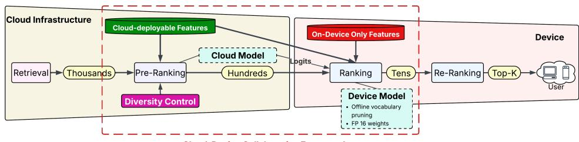

# PriCoRec: A Privacy-Aware Cloud–Device Collaborative Framework for Ad Recommendation under Feature Constraints

Dairui Liu∗ Zhongyi Lu∗ University College Dublin Dublin, Ireland dairui.liu@ucd.ie zhongyi.lu@ucd.ie

Mete Sertkan Huawei Ireland Research Center Dublin, Ireland mete.sertkan@h-partners.com

Barry Smyth University College Dublin Dublin, Ireland barry.smyth@ucd.ie

Jitao Lu University College Dublin Dublin, Ireland jitao.lu@ucd.ie

Roger Zhe Li Huawei Ireland Research Center Dublin, Ireland roger.zhe.li@huawei.com

Xingsheng Guo Huawei Ireland Research Center Dublin, Ireland xingsheng.guo1@huaweipartners.com

Aghiles Salah Huawei Ireland Research Center Dublin, Ireland aghiles.salah@h-partners.com

Changhong Jin University College Dublin Dublin, Ireland changhong.jin@ucd.ie

Ruihai Dong University College Dublin Dublin, Ireland ruihai.dong@ucd.ie

## Abstract

Privacy regulations increasingly restrict cloud processing of sensi tive user data (e.g., age, gender), hindering traditional cloud-only recommendation models. To mitigate this challenge, we propose a Privacy-aware Collaborative cloud-device ads Recommendation framework (PriCoRec) which personalizes recommendations while keeping sensitive features on-device. While separating recommen dation into cloud-based and on-device stages enables privacy-aware deployment, naive splitting sufers from degraded shortlist qual ity and ineficient on-device inference due to limited private features. We therefore design a collaborative framework that comprises a cloud-based pre-ranking stage using cloud-accessible fea tures, and an on-device ranking stage that locally incorporates highly personalized features. We introduce a diversity regularizer to pre-ranking to improve candidate quality. Moreover, to control device power consumption and computational cost, we incorporate a cloud-guided training mechanism that enhances device model performance while keeping the model lightweight. Experiments demonstrate that the proposed framework maintains strong recom mendation performance while keeping sensitive features on-device.

## CCS Concepts

• Information systems → Recommender systems; • Security and privacy → Privacy protections.

## Keywords

Ad Recommendation, Privacy Preserving, Cloud-Device Collaboration, Recommender Systemsdairui

ACM Reference Format: Dairui Liu, Zhongyi Lu, Jitao Lu, Aghiles Salah, Mete Sertkan, Roger Zhe Li, Changhong Jin, Barry Smyth, Xingsheng Guo, and Ruihai Dong. 2026. PriCoRec: A Privacy-Aware Cloud–Device Collaborative Framework for Ad Recommendation under Feature Constraints. In 20th ACM Conference on Recommender Systems (RecSys ’26), September 27-October 02, 2026, Minneapolis, MN, USA. ACM, New York, NY, USA, 5 pages. https: //doi.org/10.1145/3773078.3831838

## 1 Introduction

Computational advertising relies on large-scale CTR prediction models for real-time ranking and monetization. Deep neural networks capture high-order feature interactions [25] and can be viewed as personalized recommendation based on user preferences [2, 27], often involving sensitive features (e.g., age) [7]. However, privacy regulations and consent constraints frequently restrict cloud access to such features, challenging model efectiveness.

While privacy-preserving techniques such as Federated Learning [21] and Diferential Privacy [17] provide strong data protection, their deployment is often limited by cloud accessibility constraints on sensitive features, along with significant computational overhead and infrastructure requirements, motivating a framework to better balance privacy guarantees with deployment eficiency.

We study large-scale CTR prediction in a cloud-based cascaded recommendation pipeline comprising retrieval, pre-ranking, ranking, and re-ranking stages [23]. While retrieval performs embeddingbased filtering [9], later stages utilize neural architectures to model complex feature interactions for personalization. In standard deployments, all computation is performed in the cloud, with only the final results returned to the device [13]. This raises a key question:

  
Figure 1: PriCoRec’s cloud–device collaboration within the four-stage recommendation pipeline.

How can we redesign the ad recommendation framework to achieve personalization while ensuring user privacy?

Moving the entire framework to the device is infeasible due to limited compute and sparse, non-iid data. Thus, we propose a collaborative cloud–device framework, moving ranking and re-ranking models to the user device to access sensitive features while keeping pre-ranking in the cloud.1In contrast to the performance-driven on-device approach [22], our architecture is uniquely designed to ensure privacy by isolating sensitive features from the cloud.

To address this, we propose a collaborative cloud–device frame work that keeps pre-ranking in the cloud while moving ranking and re-ranking to the device, enabling local use of sensitive features. It tackles feature asymmetry through two mechanisms: (i) a DPP inspired diversity control mechanism to improve shortlist diversity quality under restricted features, and (ii) a cloud-guided auxiliary learning strategy that enhances the lightweight on-device model without increasing inference cost. Unlike prior cloud–device meth ods [22], which primarily focus on performance or eficiency, our framework explicitly targets privacy-preserving feature separation and its associated challenges.

Extensive experiments were conducted on three public datasets: OpenMCC [24], TaobaoAd [8], and Ali-CCP [16]. The results show that our framework achieves strong prediction performance and low latency while keeping sensitive user features on-device.

The main contributions of our work are as follows:

• We study privacy-preserving ad recommendation under feature asymmetry and propose a cloud–device collabora tive framework that separates cloud-side pre-ranking from device-side ranking, keeping sensitive features on-device.

• We introduce a DPP-inspired diversity regularizer to improve shortlist diversity under restricted features and a cloudguided auxiliary learning strategy to enhance the lightweight device model without increasing inference cost.

• Extensive experiments on three public datasets demonstrate that our framework achieves strong CTR prediction and low latency while satisfying privacy constraints.

## 2 Methodology

As shwon in Figure 1, the focused stages are highlighted.

## 2.1 Definition of Feature Groups

We distinguish two feature groups: cloud-accessible and device-only. Cloud-accessible features include item features and contextual signals (e.g., request context and coarse-grained environment information) that are available at request time in the cloud without requiring access to user-sensitive attributes. Device-only features are sensitive user-related attributes (e.g., gender and age) and finegrained behavioral or temporal signals, which are stored and processed locally on the user device and are not exposed to the cloud. The storage and processing of the latter feature group are restricted to be on the user device, while the former feature groups, can be deployed on either the cloud or user device.

## 2.2 Cloud-Based Pre-Ranking

2.2.1 Pre-Ranking Models. Using cloud-accessible features, the preranking stage reduces thousands of candidates to a few hundred under strict latency constraints. While lightweight models such as LR [3] and DNN-based approaches [5, 6] are commonly used, we adopt a more classic neural pre-ranking backbone: PNN [18], to improve candidate recall for downstream ranking.

2.2.2 Diversity Regularizer. To address limited cloud feature accessibility, we introduce a diversity regularizer inspired by the DPP-based algorithm of Chen et al. [4] as an additional objective alongside the primary ranking loss. It models item diversity through a kernel matrix capturing pairwise item similarities. By penalizing redundancy, this regularizer encourages a more diverse candidate set for subsequent on-device ranking.

The similarity between two items � and � is calculated as Eq. (1):

$$
S _ {i, j} = \frac {1 + \langle \tilde {I} _ {i} , \tilde {I} _ {j} \rangle}{2},\tag{1}
$$

where $< \tilde { I } _ { i } , \tilde { I } _ { j } >$ denotes the inner product of the L2-normalized embeddings of items � and � derived from the pre-ranking model’s embedding layer. By calculating pairwise similarities for the � candidate ads of user �, we obtain the similarity matrix as follows

$$
S _ {R _ {u}} = \left[ \begin{array}{c c c} S _ {1 1} & \dots & S _ {1 n} \\ \vdots & \ddots & \vdots \\ S _ {n 1} & \dots & S _ {n n} \end{array} \right].\tag{2}
$$

Based on the similarity matrix, we define the diversity loss, $L _ { d i v } ,$ as:

$$
L _ {d i v} = - \log d e t (S _ {R _ {u}}),\tag{3}
$$

where log ��� represents the log-determinant. Intuitively, a higher log ��� of the similarity matrix indicates greater diversity in the item list, as it reflects a larger volume spanned by the rows (or columns) of the matrix, meaning the items are less similar to each other. In this work, the recommendation score is the pCTR score.

The total loss is the weighted sum of the base loss $L _ { b a s e }$ of the pre-ranking model and $L _ { d i v } .$ . The form of $L _ { b a s e }$ depends on the chosen pre-ranking model. We adopt the pairwise ranking loss from Bayesian Personalized Ranking (BPR) [19], as pre-ranking focuses on ordering candidate items. For each user, one positive (clicked) item and multiple negative (non-clicked) items (1:4 random downsampling) are used to form training pairs, encouraging higher scores for positives. We apply this protocol across all pre-ranking backbones. The hyperparameter � is tuned within $[ 1 0 ^ { - 5 } , 1 0 ^ { - 2 } ]$

$$
L _ {t o t a l} = L _ {b a s e} + \lambda \cdot L _ {d i v}\tag{4}
$$

By approximating the kernel log-determinant, the loss penalizes redundancy, improving diversity while preserving relevance.

## 2.3 On-Device Ranking

2.3.1 Cloud-Guided Ranking. We use cloud guidance to keep the device model lightweight. The cloud pre-ranker sends each shortlisted item’s relevance logit and features to the device, where a lightweight model uses the logit as an auxiliary feature instead of reproducing the larger cloud model. The cloud and device embedding dimensions are 32 and 4, respectively.

Separately, ofline vocabulary remapping reduces the number of embedding-table rows, and FP16 storage reduces floating-point checkpoint size [20]. These compression choices are independent and can be configured for the target device budget.

2.3.2 Ranking. The on-device PNN combines cloud-accessible features, device-only features, and the cloud relevance logit to rank shortlisted candidates, enabling personalized inference without exposing device-only features to the cloud. The subsequent reranking/Top-K stage in Figure 1 is beyond the scope of this work.

## 3 Experiments

We evaluate the proposed cloud–device collaborative pipeline. In addition to comparing cloud pre-ranking and on-device ranking quality under fixed experimental feature boundaries, we report measured inference eficiency for OpenMCC and TaobaoAd.

## 3.1 Setup

3.1.1 Datasets. We conduct experiments on three large-scale industrial datasets: OpenMCC [24], TaobaoAd [8], and Ali-CCP [16]. We adopt the oficial train/valid/test splits when available, and for datasets without predefined validation sets, we randomly split the test set into 50% for validation and 50% for testing. Training uses 1:4 random negative downsampling [11].

As described in Section 2.1, we categorize features as cloud accessible or device-only and map each dataset to this unified taxonomy. Specifically, OpenMCC provides item and user features; item features and sequential behavior features are treated as cloud accessible, while the remaining profile features are device-only. TaobaoAd organizes features into item, shopping-behavior, and user-profile groups; we treat the first two groups as cloud-accessible and the last as device-only. Ali-CCP contains item, shop, and user behavior features; item and request-side contextual features are treated as cloud-accessible, while user-history signals are treated as device-only. The resulting statistics are summarized in Table 1.

Table 1: Dataset Statistics.

<table><tr><td>Dataset</td><td>Statistics</td></tr><tr><td>OpenMCC</td><td>#Users: 5,865,593, #Items: 381,345#Interactions: 9,672,681, #Clicks: 563,753#Cloud-Accessible: 22, e.g., candidate item IDs#Device-Only: 5, e.g., user gender</td></tr><tr><td>TaobaoAd</td><td>#Users: 1,083,798, #Items: 806,874#Interactions: 23,341,680, #Clicks: 1,291,950#Cloud-Accessible: 11, e.g., ads group IDs#Device-Only: 8, e.g., user occupation</td></tr><tr><td>Ali-CCP</td><td>#Users: 356,908 #Items: 3,168,707#Interactions: 42,738,779, #Clicks: 2,083,130#Cloud-Accessible: 14, e.g., shop ID#Device-Only: 9, e.g., user age.</td></tr></table>

3.1.2 Baselines and Models. We use PNN as the backbone in both stages and compare with DP-SGD [1], DualRec [26], FedCAR [15], and FedCIA [10], adapting all methods to the same feature constraints. For PriCoRec, we add the diversity objective to the cloud pre-ranker and feed its relevance logit to the device ranker. The cloud PNN uses 32-dimensional embeddings and three layers, whereas the device PNN uses 4-dimensional embeddings and two layers. Hyperparameters are selected on validation data.

3.1.3 Evaluation Protocol. Although retrieval is not the focus, we evaluate the full cascade: a DSSM model [12] retrieves 1,000 candidates, the cloud pre-ranker retains 100, and the device model re-ranks that shortlist. We report user-grouped AUC (gAUC), Recall@K (R@K), nDCG@K (N@K), and reciprocal rank (RR). R@100 measures whether a clicked item reaches the device candidate set.

## 3.2 Pre-ranking Results

The cloud pre-ranking stage uses only cloud-accessible features to reduce 1,000 retrieved candidates to 100 items for device-side ranking, making R@100 a key metric to measure whether a clicked item survives into the candidate set processed on-device. Table 2 shows the highest reported gAUC and R@100 for PriCoRec on all three datasets. Relative to the strongest listed comparator, gAUC rises from 80.06 to 80.29 on OpenMCC, 89.25 to 89.36 on TaobaoAd, and 72.93 to 73.69 on Ali-CCP; R@100 rises from 49.82 to 50.41,

Table 2: Cloud pre-ranking with cloud-accessible features (%); best in bold.

<table><tr><td rowspan="2">Method</td><td colspan="2">OpenMCC</td><td colspan="2">TaobaoAd</td><td colspan="2">Ali-CCP</td></tr><tr><td>gAUC</td><td>R@100</td><td>gAUC</td><td>R@100</td><td>gAUC</td><td>R@100</td></tr><tr><td>Popularity</td><td>-</td><td>35.82</td><td>-</td><td>23.12</td><td>-</td><td>25.95</td></tr><tr><td>PNN</td><td>79.95</td><td>49.44</td><td>88.69</td><td>67.30</td><td>72.40</td><td>46.86</td></tr><tr><td>DP-SGD</td><td>80.06</td><td>49.72</td><td>89.25</td><td>67.85</td><td>72.51</td><td>46.91</td></tr><tr><td>DualRec</td><td>79.99</td><td>49.10</td><td>88.47</td><td>66.74</td><td>72.10</td><td>46.78</td></tr><tr><td>FedCAR</td><td>79.59</td><td>49.61</td><td>88.66</td><td>67.65</td><td>72.82</td><td>46.56</td></tr><tr><td>FedCIA</td><td>79.70</td><td>49.82</td><td>88.59</td><td>67.47</td><td>72.93</td><td>46.92</td></tr><tr><td>PriCoRec</td><td>80.29</td><td>50.41</td><td>89.36</td><td>68.29</td><td>73.69</td><td>47.72</td></tr></table>

Table 3: On-device ranking over the top-100 cloud candidates (%); best in bold.

<table><tr><td rowspan="2">Method</td><td colspan="5">OpenMCC</td><td colspan="5">TaobaoAd</td><td colspan="5">Ali-CCP</td></tr><tr><td>gAUC</td><td>R@1</td><td>R@10</td><td>N@10</td><td>RR</td><td>gAUC</td><td>R@1</td><td>R@10</td><td>N@10</td><td>RR</td><td>gAUC</td><td>R@1</td><td>R@10</td><td>N@10</td><td>RR</td></tr><tr><td>PNN</td><td>78.44</td><td>1.97</td><td>10.72</td><td>5.58</td><td>5.33</td><td>83.31</td><td>3.03</td><td>15.24</td><td>8.19</td><td>7.47</td><td>71.39</td><td>4.82</td><td>20.26</td><td>11.60</td><td>10.01</td></tr><tr><td>DP-SGD</td><td>77.99</td><td>3.31</td><td>11.37</td><td>7.11</td><td>6.79</td><td>85.41</td><td>3.49</td><td>17.38</td><td>9.37</td><td>8.43</td><td>71.46</td><td>4.91</td><td>20.97</td><td>11.61</td><td>10.12</td></tr><tr><td>DualRec</td><td>77.86</td><td>3.32</td><td>10.66</td><td>6.51</td><td>6.33</td><td>85.32</td><td>3.44</td><td>16.53</td><td>8.72</td><td>7.63</td><td>71.26</td><td>4.61</td><td>20.22</td><td>11.35</td><td>9.72</td></tr><tr><td>FedCAR</td><td>77.71</td><td>3.21</td><td>10.17</td><td>6.19</td><td>6.13</td><td>85.73</td><td>3.39</td><td>16.99</td><td>8.81</td><td>7.32</td><td>71.08</td><td>4.15</td><td>20.46</td><td>11.16</td><td>10.05</td></tr><tr><td>FedCIA</td><td>77.57</td><td>3.34</td><td>10.85</td><td>6.94</td><td>6.02</td><td>85.50</td><td>3.84</td><td>16.16</td><td>8.38</td><td>7.50</td><td>71.68</td><td>5.15</td><td>20.76</td><td>12.26</td><td>11.05</td></tr><tr><td>PriCoRec</td><td>79.76</td><td>3.96</td><td>13.87</td><td>8.12</td><td>7.68</td><td>86.93</td><td>4.14</td><td>21.74</td><td>11.60</td><td>10.11</td><td>73.30</td><td>7.06</td><td>24.10</td><td>16.02</td><td>13.43</td></tr></table>

67.85 to 68.29, and 46.92 to 47.72, respectively. The results indicate that explicitly compensating for missing personalized signals can improve shortlist quality. In our cloud-accessible-features setting � behaves as a relevance-diversity trade-of parameter rather than a monotonic knob: small non-zero values $( 1 0 ^ { - 3 } - 1 0 ^ { - 2 } )$ give the best Recall@100, while stronger regularization can further improve Diversity@100 under the RBF kernel. We therefore tune � on the validation set instead of fixing it to zero or always preferring the largest value. The optimal � values are set to $1 0 ^ { - 3 }$ for OpenMCC, $1 0 ^ { - 2 }$ for TaobaoAd, and 10−2 for Ali-CCP.

buzhi

## 3.3 On-device Ranking Results

The on-device ranking stage re-ranks the top-100 candidates using all feature groups, including sensitive user features, with a light weight PNN backbone. Table 3 shows that PriCoRec achieves the best performance across all datasets and metrics. In particular, it reaches $\mathrm { g A U C }$ values of 79.76 on OpenMCC, 86.93 on TaobaoAd, and 73.30 on Ali-CCP, while also achieving the best R@1, R@10, N@10, and RR values. On OpenMCC, R@10 increases from 11.37 to 13.87. On TaobaoAd, R@10 increases from 17.38 to 21.74. On Ali-CCP, R@10 increases from 20.97 to 24.10. These gains over PNN, DP-SGD, and federated baselines demonstrate that improved cloud side shortlists enhance final on-device ranking through efective cloud-device collaboration.

## 3.4 Eficiency Analysis

We briefly discuss deployment eficiency from the perspectives of latency and model size.

Latency. The cloud–device pipeline takes 10.32 ms on TaobaoAd (9.81 ms cloud pre-ranking + 0.51 ms device ranking), versus 11.62 ms for the pure-cloud comparator. On OpenMCC it takes 5.08 ms (4.31 ms + 0.77 ms), versus 4.86 ms. Thus, splitting the cascade can improve or slightly increase latency depending on the workload, while the measured values remain within commonly reported industrial budgets [14].

Model size versus ranking quality. Device configurations exhibit a clear size-performance trade-of: R@1 increases from 4.51 at 7.7 MB to 5.51 at 15 MB, 6.51 at 22.2 MB, and 7.51 at 29.4 MB. This trend is consistent with the expected gain from additional embedding capacity. In practice, the smaller 7.7–15 MB models provide attractive operating points for memory- and power-constrained devices, while larger models provide higher top-rank accuracy when resources allow.

## 4 Conclusion

We propose a cloud–device collaborative framework for CTR prediction under feature-asymmetric settings, where sensitive user attributes are restricted to the device. By separating cloud-side pre-ranking and device-side ranking, the framework enables personalization while preserving user privacy. To address degraded candidate quality under limited cloud-accessible features, we introduce a diversity-aware pre-ranking mechanism that improves shortlist coverage, and a cloud-guided auxiliary learning strategy that enhances the lightweight on-device model without increasing inference cost. Together, these designs efectively bridge the gap between cloud-side eficiency and device-side personalization. Extensive experiments on three public datasets demonstrate that the proposed framework achieves strong recommendation performance with low latency, while strictly keeping sensitive user features on-device. For future work, we plan to explore how the pre-ranking diversity regularizer can serve as a mechanism to mitigate popularity bias, potentially surfacing "long-tail" items that are often overshadowed by dominant trends in standard ranking models. Finally, we will benchmark this architecture against fully cloud-based models to quantify the net benefits of decentralized, privacy-preserving CTR prediction.

## Acknowledgments

This work was supported by the Insight Centre for Data Analytics (Grant No. SFI/12/RC/2289\_P2) and Huawei Ireland Research Center. We also acknowledge the computational facilities provided by the UCD Sonic High Performance Computing (HPC) cluster.

## References

[1] Martín Abadi, Andy Chu, Ian J. Goodfellow, H. Brendan McMahan, Ilya Mironov, Kunal Talwar, and Li Zhang. 2016. Deep Learning with Diferential Privacy. In CCS. ACM, 308–318.

[2] Jing Bai, Xinyu Geng, Jiaqi Deng, Zhen Xia, Hongxia Jiang, Guoqiang Yan, and Jing Liang. 2025. A comprehensive survey on advertising click-through rate prediction algorithm. Knowl. Eng. Rev. 40 (2025).

[3] Junxuan Chen, Baigui Sun, Hao Li, Hongtao Lu, and Xian-Sheng Hua. 2016. Deep CTR Prediction in Display Advertising. In ACM Multimedia. ACM, 811–820.

[4] Laming Chen, Guoxin Zhang, and Eric Zhou. 2018. Fast Greedy MAP Inference for Determinantal Point Process to Improve Recommendation Diversity. In NeurIPS. 5627–5638.

[5] Heng-Tze Cheng, Levent Koc, Jeremiah Harmsen, Tal Shaked, Tushar Chandra, Hrishi Aradhye, Glen Anderson, Greg Corrado, Wei Chai, Mustafa Ispir, Rohan Anil, Zakaria Haque, Lichan Hong, Vihan Jain, Xiaobing Liu, and Hemal Shah. 2016. Wide & Deep Learning for Recommender Systems. In DLRS@RecSys. ACM, 7–10.

[6] Paul Covington, Jay Adams, and Emre Sargin. 2016. Deep Neural Networks for YouTube Recommendations. In RecSys. ACM, 191–198.

[7] Ruoxuan Feng, Zhen Tian, Qiushi Peng, Jiaxin Mao, Wayne Xin Zhao, Di Hu, and Changwang Zhang. 2025. MGIPF: Multi-Granularity Interest Prediction Framework for Personalized Recommendation. In SIGIR. ACM, 2172–2181.

[8] Yufei Feng, Fuyu Lv, Weichen Shen, Menghan Wang, Fei Sun, Yu Zhu, and Keping Yang. 2019. Deep Session Interest Network for Click-Through Rate Prediction. In IJCAI. ijcai.org, 2301–2307.

[9] Akira Fukumoto, Aghiles Salah, Sarthak Shrivastava, Alexandru Tatar, Yannick Schwartz, Vincent Michel, and Lee Xiong. 2025. Contrastive Conditional Embed dings for Item-based Recommendation at E-commerce Scale. In RecSys. ACM, 931–934.

[10] Mingzhe Han, Dongsheng Li, Jiafeng Xia, Jiahao Liu, Hansu Gu, Peng Zhang, Ning Gu, and Tun Lu. 2025. FedCIA: Federated Collaborative Information Aggregation for Privacy-Preserving Recommendation. In SIGIR. ACM, 1687–1696.

[11] Xiangnan He, Lizi Liao, Hanwang Zhang, Liqiang Nie, Xia Hu, and Tat-Seng Chua. 2017. Neural Collaborative Filtering. In WWW. ACM, 173–182.

[12] Po-Sen Huang, Xiaodong He, Jianfeng Gao, Li Deng, Alex Acero, and Larry P. Heck. 2013. Learning deep structured semantic models for web search using clickthrough data. In CIKM. ACM, 2333–2338.

[13] Hao Jiang, Xiaoyu He, Fanyi Qu, Congcong Liu, Xue Jiang, Changping Peng, Zhangang Lin, Ching Law, and Jingping Shao. 2025. UniERF: A Uniform Embedding-based Retrieval Framework for E-commerce Search. In KDD (2). ACM, 4555–4565.

[14] Barrie Kersbergen, Olivier Sprangers, and Sebastian Schelter. 2022. Serenade - Low-Latency Session-Based Recommendation in e-Commerce at Scale. In SIG-MOD Conference. ACM, 150–159

[15] Minjun Kim, Minjee Kim, and Jinhoon Jeong. 2024. FedCAR: Cross-client Adaptive Re-weighting for Generative Models in Federated Learning. CoRR abs/2412.11463 (2024).

[16] Xiao Ma, Liqin Zhao, Guan Huang, Zhi Wang, Zelin Hu, Xiaoqiang Zhu, and Kun Gai. 2018. Entire Space Multi-Task Model: An Efective Approach for Estimating Post-Click Conversion Rate. In SIGIR. ACM, 1137–1140.

[17] Frank McSherry and Ilya Mironov. 2009. Diferentially Private Recommender Systems: Building Privacy into the Netflix Prize Contenders. In KDD. ACM, 627–636.

[18] Yanru Qu, Han Cai, Kan Ren, Weinan Zhang, Yong Yu, Ying Wen, and Jun Wang. 2016. Product-Based Neural Networks for User Response Prediction. In IEEE 16th International Conference on Data Mining, ICDM 2016, December 12-15, 2016, Barcelona, Spain, Francesco Bonchi, Josep Domingo-Ferrer, Ricardo Baeza-Yates, Zhi-Hua Zhou, and Xindong Wu (Eds.). IEEE Computer Society, 1149–1154.

[19] Stefen Rendle, Christoph Freudenthaler, Zeno Gantner, and Lars Schmidt-Thieme. 2009. BPR: Bayesian Personalized Ranking from Implicit Feedback. In UAI. AUAI Press, 452–461.

[20] Andres Rodriguez. 2021. Reducing the Model Size. Springer International Publishing, Cham, 111–125. doi:10.1007/978-3-031-01769-8\_6

[21] Zehua Sun, Yonghui Xu, Yong Liu, Wei He, Lanju Kong, Fangzhao Wu, Yali Jiang, and Lizhen Cui. 2025. A Survey on Federated Recommendation Systems. IEEE Trans. Neural Networks Learn. Syst. 36, 1 (2025), 6–20.

[22] Yunjia Xi, Weiwen Liu, Yang Wang, Ruiming Tang, Weinan Zhang, Yue Zhu, Rui Zhang, and Yong Yu. 2023. On-device Integrated Re-ranking with Heterogeneous Behavior Modeling. In KDD. ACM, 5225–5236.

[23] Haoqiang Yang, Congde Yuan, Kun Bai, Mengzhuo Guo, Wei Yang, and Chao Zhou. 2025. HIT Model: A Hierarchical Interaction-Enhanced Two-Tower Model for Pre-Ranking Systems. In CIKM. ACM, 6201–6208

[24] Jiangchao Yao, Feng Wang, Kunyang Jia, Bo Han, Jingren Zhou, and Hongxia Yang. 2021. Device-Cloud Collaborative Learning for Recommendation. In KDD. ACM, 3865–3874

[25] Weinan Zhang, Jiarui Qin, Wei Guo, Ruiming Tang, and Xiuqiang He. 2021. Deep Learning for Click-Through Rate Estimation. In IJCAI. ijcai.org, 4695–4703.

[26] Ye Zhang, Yongheng Deng, Sheng Yue, Qiushi Li, and Ju Ren. 2025. DualRec: A Collaborative Training Framework for Device and Cloud Recommendation Models. IEEE Trans. Mob. Comput. 24, 6 (2025), 5202–5213.

[27] Yu Zhao and Fang Liu. 2024. A Survey of Retrieval Algorithms in Ad and Content Recommendation Systems. CoRR abs/2407.01712 (2024)