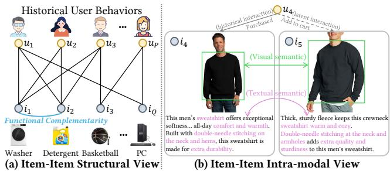
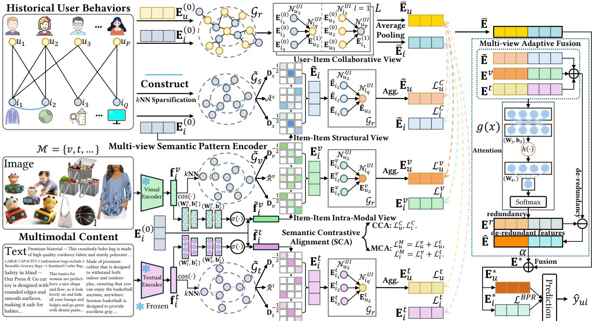
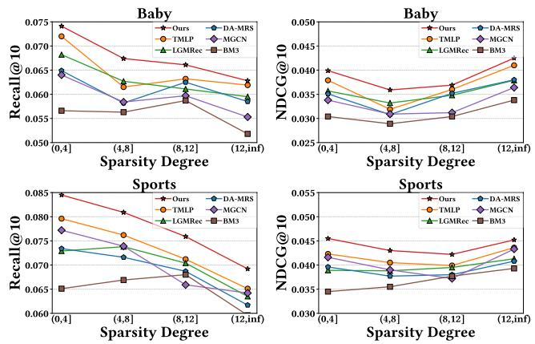
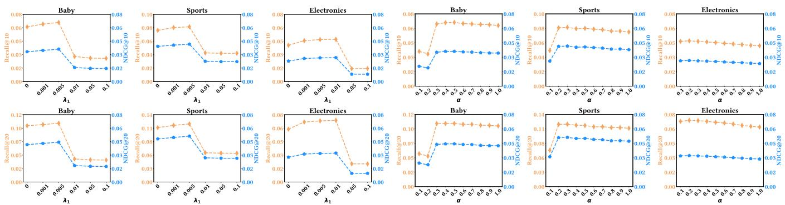
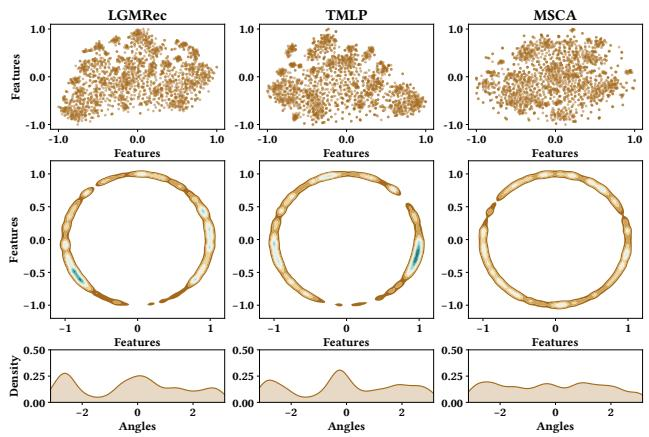
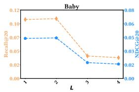
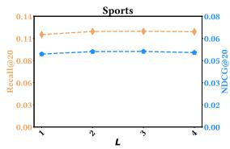
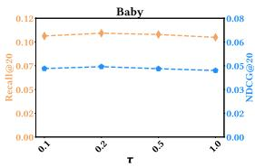
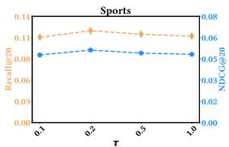

# Multi-view Semantic Contrastive Alignment for Multimodal Recommendation

Jiuqiang Li School of Computing and Artificial Intelligence, Southwest Jiaotong University Engineering Research Center of Sustainable Urban Intelligent Transportation, Ministry of Education Chengdu, China jiuqiangli@outlook.com

Hongjun Wang∗

## Abstract

Multimodal recommendation advocates integrating the multimodal features of items with historical user behaviors to enhance recom mendation accuracy across various online media platforms. The majority ofexisting methods concentrate on leveraging cross-modal learning over multimodal features to augment node representations. However, these approaches are confronted with two key challenges: i) augmented representations ofer limited information gain for interactive prediction in the collaborative view, and ii) semantic dis crepancy between the collaborative view and modality-augmented features remains inadequately addressed. To overcome these obsta cles, we present a new Multi-view Semantic Contrastive Alignment (MSCA) approach for multimodal recommendation, which models and aligns node representations from multiple views. Specifically, we introduce a multi-view semantic pattern encoder that learns ba sic embeddings from the collaborative view and independently cap tures augmented semantic patterns from the item-item structural view and intra-modal view. Furthermore, a semantic contrastive ali nment task is desi ned to miti ate the semantic diver ence be tween collaborative embeddings and augmented representations by maximizing the mutual consistency between them, thereby facili tating an efective integration of both. Comprehensive experiments on three benchmark datasets confirm that the proposed MSCA consistently excels over diverse state-of-the-art baselines.

## CCS Concepts

## Keywords

School of Computing and Artificial Intelligence, Southwest Jiaotong University

• Information systems → Recommender systems.

Multimodal Recommendation, Contrastive Learning, Graph Neural Network

## ACM Reference Format:

Engineering Research Center of Sustainable Urban Intelligent Transportation, Ministry of Education Chengdu, China wanghongjun@swjtu.edu.cn

Jiuqiang Li and Hongjun Wang. 2026. Multi-view Semantic Contrastive Alignment for Multimodal Recommendation. In Proceedings of the ACM Web Conference 2026 (WWW’26), April 13–17, 2026, Dubai, United Arab Emirates. ACM, New York, NY, USA, 12 pages. https://doi.org/10.1145/3774904.3792192

## 1 Introduction

Multimodal recommendation attempts to incorporate multimodal content (e.g., video, image, text) into the general ID-based collaborative filtering (CF) paradigm to improve the quality of recommendations [21, 61], which is widely used on web multimedia platforms (e.g., Amazon, TikTok) involving e-commerce and content sharing [2, 50]. While a few studies [56] have explored learning modality embeddings for recommendation without relying on item ID embeddings, the more prevalent approach combines pre-extracted modal features (e.g., visual, textual) with user-item interaction behaviors to jointly learn item representations and user preferences [51, 64].

In the early stages of multimodal recommendation, a series of studies improve recommendation performance by integrating multi-modal features into collaborative filtering frameworks using matrix factorization [12, 16] and attention mechanisms [5, 22]. With the impressive performance of graph neural networks (GNNs) in modeling high-level relationships [18, 48], recent research [38, 43, 44] explores the usage of GNNs on user-item bipartite graphs containing multimodal features to capture higher-order multimodal- enhanced representations. Subsequent eforts [55, 57, 63] seek to leverage auxiliary graphs constructed from multimodal content as mediators for message propagation to directly learn more nuanced user interests. However, faced with the inherent interaction sparsity issue [13, 40] in recommendation scenarios, GNNs that rely predominantly on substantial labeled supervision may exhibit performance constraints attributed to inadequate training signals. Leveraging the capability of self-supervised learning (SSL) to mitigate supervision scarcity [7, 45], recent collaborative filtering methods [45, 54, 59] propose to capture self-supervised signals to address the insuficient supervision caused by sparse interaction data. Building on this, a variety of SSL-based multimodal recommendation methods [11, 42] employ cross-modal self-supervised learning to augment node rep- resentations by aligning inter-modal feature spaces.

Despite the commendable performance achievement, extant ad- vanced multimodal recommenders still face two critical challenges. (1) While cross-modal self-supervised learning facilitates efective inter-modal representation alignment, the resultant augmented node representations may ofer limited benefit or even introduce detrimental noise to the primary task within the collaborative view. (2) Previous methods inadequately address the semantic gap between collaborative representations and multimodal features, conse- quently encumbering performance during feature fusion and joint optimization. To handle these two constraints, we introduce a new Multi-view Semantic Contrastive Alignment (MSCA) paradigm for multimodal recommendation, which explores modeling node em- beddings from diverse semantic perspectives and employs semantic contrastive ali nment to otentiate re resentation fusion. S ecifi cally, to overcome the first limitation, we propose the multi-view semantic pattern encoder that concurrently extracts foundational collaborative semantics from user-item interaction view while learn- ing augmented node representations through item-item structural relations and intra-modal correlations. As illustrated in Figure 1 (a), items with higher co-interaction frequency $( e . g .$ , items $i _ { 1 }$ and $i _ { 2 } ,$ both of which are co-interacted with by users $u _ { 1 } , u _ { 2 } , u _ { 3 } )$ typically manifest more pronounced structural semantic patterns (e.g., func tional complementarity). Furthermore, Figure 1 (b) shows that items sharing intra-modal similarities are frequently folded into the in- terest scope of users with analogous interaction histories $( e . g .$ , after purchasing item $i _ { 4 } ,$ user $u _ { 4 }$ adds item $i _ { 5 }$ to cart, an item that pos-sesses latent intra-modal semantic afinity to $i _ { 4 } ) .$ . Consequently, dual inter-item graphs (structural and intra-modal) are constructed to model semantically augmented item embeddings. The learned item embeddings propagate through collaborative interactions to derive augmented user representations, efectively achieving greater information gain in the augmented representations for interactive prediction. Regarding the second issue, the semantic contrastive alignment task is introduced to reduce the semantic divergence between collaborative embeddings and augmented representations. Building upon multi-view modeling, MSCA promotes synergistic representation fusion from both collaborative and modality-aware view by respectively maximizing the semantic consistency between basic collaborative embeddings and augmented structural represen tations as well as intra-modal representations.

  
Figure 1: Illustrations of the item-item structural view and intra-modal view. (a) Items $i _ { 1 }$ and $i _ { 2 } ,$ both interacted with by users $u _ { 1 } , u _ { 2 } ,$ , and $u _ { 3 } ,$ , exhibit functional complementarity. (b) Item $i _ { 5 }$ is considered by user $u _ { 4 }$ as a latent interaction target due to its latent semantic relevance with item �4 (previously interacted by $u _ { 4 } )$ in visual and textual modalities.

To encapsulate, the primary contributions of our research are highlighted below:

• We present a multi-view semantic pattern encoder that learns augmented node representations from various semantic patterns observed across multiple views.

• We introduce a semantic contrastive alignment component to alleviate the semantic discrepancy between multi-view represen tations and facilitate their efective fusion.

• Empirical evaluations on benchmark datasets confirm that MSCA substantially surpasses compared baselines by efectively lever- aging multi-view semantic modeling and alignment.

## 2 Related Work

## 2.1 Graph-based Recommender Systems

Graph neural networks (GNNs) [18, 35] have emerged as a powerful paradigm for modeling intricate relationships between users and items from historical interactions [6, 20, 24]. In particular, NGCF [40] and LightGCN [13] explicitly encode high-order collaborative signals in user–item interactions through GNNs-based embeddin ro a ation la ers. To levera e rich information be- yond historical interactions, GNNs have been extensively utilized in graph-based recommendation to capture diverse relations within various recommendation contexts [1, 9, 47]. For instance, DifNet [46] GraphRec [8], and DGNN [49] employ GNNs over social relation graphs to capture social influence and enhance user representations. In bundle recommendation, models such as BGCN [3], MIDGN [60], and MultiCBR [23] perform representation learning on multiple relational views. For knowledge graph-enhanced recommendation, KGCN [37], KGNN-LS [36], and KGAT [39] exploit semantic associations among items in knowledge graphs. In multimodal recommendation, approaches like MMGCN [44], GRCN [43], and DualGNN [38] propagate multimodal features over user–item interaction graphs to model latent information. Inspired by these, our MSCA leverages GNNs to model high-order collaborative relationships and capture contextual semantics from multiple views.

## 2.2 Contrastive Learning for Recommendation

To mitigate the inherent issue of label sparsity in recommender systems, contrastive learning (CL) is widely adopted in collaborative filtering methods by introducing auxiliary tasks [15, 29]. SGL [45] employs various graph augmentation operations to gen-erate contrastive views and constructs self-supervised tasks to alleviate long-tail problems. SimGCL [54] and XSimGCL [53] im-prove upon SGL by replacing graph augmentation with the addition of uniform noise to learned embeddings to construct contrastive views. BIGCF [58] designs graph contrastive regularization by constructing dual intents (personal and collective) to enhance model robustness. MixRec [59] utilizes a dual mixing strategy across indi-vidual and collective scales to build contrastive learning tasks to improve eficiency. In multimodal recommendation, SLMRec [32] leverages diverse data augmentation operations on multimodal fea- tures to construct contrastive tasks and explore latent cross-modal correlations. BM3 [64] generates contrastive views through sim-ple message missing and employs contrastive learning under both inter-modal and intra-modal settings to achieve eficient enhance- ment. LGMRec [11] refines global interests across multiple modalities via cross-modal hypergraph contrastive learning. However, cross-modal contrastive learning methods that refine distinct modal representations may introduce inevitable noise due to the semantic gap between collaborative embeddings and modality-specific representations. In contrast, we introduce a semantic contrastive alignment task to bridge this semantic discrepancy across multiview representations and enable coherent integration.

## 2.3 Multimodal Recommendation

Multimodal recommendation integrates features from pre-trained encoders into collaborative filtering paradigm to boost performance.

Early approaches like VBPR [12] and DVBPR [16] combine preextracted visual features with ID embeddings to augment item representations. Building on GNNs, MMGCN [44] and GRCN [43] propa ate various modal features throu h user-item interaction ra hs to learn enriched representations. Works such as DualGNN [38], LAT TICE [57], and FREEDOM [63] further explore single-node graph structures to capture latent enhancement signals. MGCN [55] and DA-MRS [52] correlate user feedback with modal information to denoise multimodal features or user behaviors. Furthermore, LGM Rec [11] constructs hypergraph structures to capture users’ global interests. TMLP [14] employs multi-layer perceptrons to enhance the modeling and denoising of topologically pruned item relations. In this work, our MSCA extracts latent multi-view semantics and separately employs dual-view semantic contrastive alignment to promote the integration of multi-view representations.

## 3 Methodology

## 3.1 Task Formulation

Within multimodal recommender systems, let U and I denote the sets of users and items, with cardinalities � and $Q ,$ respectively. When an interaction is observed between user � and item �, an edge is established in the user-item interaction graph $\mathcal { G } _ { r } = \left\{ ( u , i ) \right.$ |� ∈ $\mathcal { U } , i \in \mathcal { I } \}$ connecting them. In addition, all items are characterized by multimodal features $\mathbf { F } = \{ \mathbf { f } _ { i } ^ { m } \in \mathbb { R } ^ { Q \times d _ { m } } | m \in M \}$ (e.g., visual fea ture $\mathbf { f } _ { i } ^ { v } .$ , textual feature $\mathbf { f } _ { i } ^ { t } )$ , where $\mathbf { f } _ { i } ^ { m }$ represents the original features of all items with modality � and $d _ { m }$ denotes the dimension corre sponding to modality �. Following prior work [14, 64], we focus exclusively on the visual and textual aspects and define the modality set as $\boldsymbol { \mathcal { M } } = \{ \boldsymbol { v } , t \}$ . However, our MSCA enables its seamless exten sion to recommendation scenarios with various other modalities. In our multimodal recommendation framework, given the historical user behaviors $\mathcal { G } _ { r }$ along with the pre-extracted multimodal infor mation F, we seek to construct a function $\mathcal { F } _ { \Theta } ( u , i )$ that encodes the underlying relationship between users and items by learning modality-aware user preferences and predicts the likelihood of a user’s interaction with an item.

The architecture of our proposed MSCA is illustrated in Fig- ure 2. MSCA primarily incorporates trainable embedding parameters $\mathbf { E } _ { u } ^ { ( 0 ) } \in \mathbb { R } ^ { P \times d }$ for users and $\mathbf { E } _ { i } ^ { ( 0 ) } \in \mathbb { R } ^ { Q \times d }$ for items. Here, � represents the embedding size.

## 3.2 Multi-view Semantic Pattern Encoder

Previous research [55, 64] demonstrates that the incorporation of collaborative signals and multimodal semantics leads to substantial performance gains. Building upon the exceptional capability of LightGCN [13] in modeling high-order collaborative relationships, we propose a multi-view semantic pattern encoder to comprehen sively capture the semantic information across diverse views. It extracts interactive semantics from the user-item collaborative view, identifies hidden co-occurrence patterns between items through the item-item structural view, and learns latent semantics among multimodal information by the item-item intra-modal view.

3.2.1 User-Item Collaborative View. To extract high-level interac tive semantics within the user-item interaction graph, we design an interaction-centric message propagation module composed of

GNNs, which iteratively refines user and item embeddings by the propagation and aggregation of neighboring signals along interaction edges. Specifically,

$$
\mathbf {E} _ {u} ^ {(l)} = \frac {1}{\sqrt {| \mathcal {N} _ {u} ^ {\mathcal {U I}} |}} \sum_ {i \in \mathcal {N} _ {u} ^ {\mathcal {U I}}} \frac {1}{\sqrt {| \mathcal {N} _ {i} ^ {\mathcal {U I}} |}} \mathbf {E} _ {i} ^ {(l - 1)},\tag{1}
$$

$$
\mathbf {E} _ {i} ^ {(l)} = \frac {1}{\sqrt {| \mathcal {N} _ {i} ^ {\mathcal {U I}} |}} \sum_ {u \in \mathcal {N} _ {i} ^ {\mathcal {U I}}} \frac {1}{\sqrt {| \mathcal {N} _ {u} ^ {\mathcal {U I}} |}} \mathbf {E} _ {u} ^ {(l - 1)}.\tag{2}
$$

Here, $\mathbf { E } _ { u } ^ { ( l ) }$ and $\mathbf { E } _ { i } ^ { ( l ) }$ represent the obtained representations of the corresponding interaction graph after the �-th iteration of graph message passing. And $\mathbf { E } _ { u } ^ { ( 0 ) }$ and $\mathbf { E } _ { i } ^ { ( 0 ) }$ are randomly initialized as learnable embedding parameters. $\overset { \cdot } { N } _ { u } ^ { \mathcal { U I } } \ : = \ : \{ i \in \mathcal { I } \mid \left( u , i \right) \in \mathcal { G } _ { r } \}$ and $N _ { i } ^ { \mathcal { U I } } = \{ u \in \mathcal { U } \mid ( u , i ) \in \mathcal { G } _ { r } \}$ represent the sets of neighbor- ing items of user � and neighboring users of item � in $\mathcal { G } _ { r } .$ , respec- tively. To efectively aggregate embeddings from diferent layers, our MSCA employs layer-wise average pooling to derive the final representations $( \dot { \bar { \mathbf { E } } } _ { u } \in \dot { \mathbb { R } } ^ { P \times d }$ and $\bar { \mathbf { E } } _ { i } \in \bar { \mathbb { R } } ^ { \bar { Q } \times d } )$ of all nodes:

$$
\bar {\mathbf {E}} _ {u} = \frac {1}{L} \sum_ {l = 1} ^ {L} \mathbf {E} _ {u} ^ {(l)}, \qquad \bar {\mathbf {E}} _ {i} = \frac {1}{L} \sum_ {l = 1} ^ {L} \mathbf {E} _ {i} ^ {(l)},\tag{3}
$$

where � denotes the number of propagation layers. Importantly, we intentionally exclude the embeddings of the 0-th layer in the aggregation process. Consequently, the final node representations are purely derived from propagated neighborhood signals, which essentially encode the refined semantic patterns of nodes within the user-item collaborative view.

3.2.2 Item-Item Structural View. In recommendation scenarios, items interacted with by the same users regularly exhibit latent relational patterns (e.g., attribute alignment, or functional complementarity). To explicitly model such item-item relationships, we construct an item-item structural graph $\tilde { \mathcal { G } } _ { s } = ( \mathcal { I } , \tilde { \mathcal { A } } ^ { s } )$ , in which the matrix $\tilde { \mathcal { A } } ^ { s } = \{ \tilde { \mathcal { A } } _ { i . i ^ { \prime } } ^ { s } ~ | ~ i , i ^ { \prime } \in \breve { \bar { \mathcal { I } } } \}$ encodes the co-occurrence relationships computed from shared user interactions. However, for the sparse user-item interaction graph, item pairs frequently lack suficient common interactors. To mitigate this limitation, �NN sparsification [4, 38, 52] is applied to each item $i \in \mathcal { I }$ , retaining edges to items �′ with the highest co-occurrence frequency while discarding other edges. The specific expression is as follows:

$$
\tilde {\mathcal {A}} _ {i, i ^ {\prime}} ^ {s} = \mathbb {1} _ {\{(i = i ^ {\prime}) \vee (e _ {i, i ^ {\prime}} \in \mathrm{top-} k (\hat {e} _ {i})) \}}.\tag{4}
$$

Here, $e _ { i , i ^ { \prime } }$ denotes the number of common users for item pair (�, �′). Based on this, we define $\hat { e } _ { i } = \{ e _ { i , i ^ { \prime } } \mid i \neq i ^ { \prime } , e _ { i , i ^ { \prime } } > 1 \}$ as the set of common user counts between item � and all other items where the count is greater than 1. 1 is the indicator function. To jointly extract the item node representations and latent user preferences in the item-item structural view, we employ a single-layer sparse graph convolutional network for eficient message passing. This process is formally defined as:

$$
\tilde {\mathbf {E}} _ {i} = (\mathbf {D} _ {s} ^ {- \frac {1}{2}} \tilde {\mathcal {A}} ^ {s} \mathbf {D} _ {s} ^ {- \frac {1}{2}}) \cdot \mathbf {E} _ {i} ^ {(0)},\tag{5}
$$

$$
\tilde {\mathbf {E}} _ {u} = \frac {1}{\sqrt {| \mathcal {N} _ {u} ^ {\mathcal {U I}} |}} \sum_ {i \in \mathcal {N} _ {u} ^ {\mathcal {U I}}} \frac {1}{\sqrt {| \mathcal {N} _ {i} ^ {\mathcal {U I}} |}} \tilde {\mathbf {E}} _ {i}.\tag{6}
$$

Here, $\tilde { \mathbf { E } } _ { u } \left( \tilde { \mathbf { E } } _ { i } \right)$ represents the refined user (item) embeddings learned through message propagation in the item-item structural view.

  
Figure 2: Architecture of our proposed Multi-view Semantic Contrastive Alignment (MSCA) framework.

$\tilde { \mathcal { A } } ^ { s } \in \mathbb { R } ^ { Q \times Q }$ signifies the adjacency matrix of the item-item structural graph $\tilde { \mathcal { G } } _ { s }$ , while $\mathbf { D } _ { s } \in \mathbb { R } ^ { Q \times Q }$ represents the degree matrix of $\tilde { \mathcal { A } } ^ { s }$ . The aggregated item representations of $\tilde { \mathcal { G } } _ { s }$ are subsequently injected into the interaction graph $\mathcal { G } _ { r }$ , propagating high-level col laborative signals to derive enhanced user representations.

3.2.3 Item-Item Intra-Modal View. Beyond modeling the structural semantics between items in interactions, complementary semantic information derived from the intra-modal context of items empow- ers node representations with significantly enriched features. To discover latent modality-specific patterns among items, we first compute the inter-item semantic afinity $\mathcal { R } ^ { m } = \mathcal { \bar { \{ R } }  _ { i , i ^ { \prime } } ^ { m } \ \vert \ i , i ^ { \prime } \in \mathcal { I } \}$ within each modality � using cosine similarity on the raw modal features, which captures intra-modal feature-level correlations be tween items. Subsequently, we implement �NN sparsification to obtain the modality-specific item-item graph $\tilde { \mathcal { G } } _ { m } = ( \bar { \varGamma } , \tilde { \mathcal { R } } ^ { m } )$ within modality �. Specifically,

$$
\mathcal {R} _ {i, i ^ {\prime}} ^ {m} = \cos (\mathbf {f} _ {i} ^ {m}, \mathbf {f} _ {i ^ {\prime}} ^ {m}) = \mathbf {f} _ {i} ^ {m ^ {\top}} \cdot \mathbf {f} _ {i ^ {\prime}} ^ {m} / (\| \mathbf {f} _ {i} ^ {m} \| _ {2} \cdot \| \mathbf {f} _ {i ^ {\prime}} ^ {m} \| _ {2}),\tag{7}
$$

$$
\tilde {\mathcal {R}} _ {i, i ^ {\prime}} ^ {m} = \mathbb {1} _ {\{\mathcal {R} _ {i, i ^ {\prime}} ^ {m} \in \mathrm{top-} k (\hat {\mathcal {R}} _ {i} ^ {m}) \}},\tag{8}
$$

where $\tilde { \mathcal { R } } ^ { m } \in \mathbb { R } ^ { Q \times Q }$ represents the modality-specific item-item matrix. $\mathcal { \hat { R } } _ { i } ^ { m } = \{ \tilde { \mathcal { R } } _ { i . i ^ { \prime } } ^ { m } \ | \ i , i ^ { \prime } \in \mathcal { I } \}$ denotes the set of cosine similarities between item � and all items. We then project the raw modal fea tures $\mathbf { f } _ { i } ^ { m }$ through a transformation layer into $\tilde { \mathbf { f } } _ { i } ^ { m } \in \mathbb { R } ^ { Q \times d }$ to facilitate better integration between item IDs and modal features:

$$
\tilde {\mathbf {f}} _ {i} ^ {m} = \mathbf {E} _ {i} ^ {(0)} \odot \sigma ((\mathbf {f} _ {i} ^ {m} \mathbf {W} _ {1} ^ {m ^ {\top}} + \mathbf {b} _ {1} ^ {m}) \mathbf {W} _ {2} ^ {m ^ {\top}} + \mathbf {b} _ {2} ^ {m}).\tag{9}
$$

Here, $\mathbf { W } _ { 1 } ^ { m } \in \mathbb { R } ^ { d \times d _ { m } } , \mathbf { W } _ { 2 } ^ { m } \in \mathbb { R } ^ { d \times d }$ , and $\mathbf { b } _ { 1 } ^ { m } , \mathbf { b } _ { 2 } ^ { m } \in \mathbb { R } ^ { d }$ are trainable parameters. ⊙ signifies the Hadamard product and $\sigma ( \cdot )$ denotes the sigmoid function. We then propagate the projected modal features $\tilde { \mathbf { f } } _ { i } ^ { m }$ via a single-layer graph convolutional network on ${ \tilde { \mathcal { R } } } ^ { m }$ to produce the semantically augmented item representations $\mathbf { E } _ { i } ^ { m }$ :

$$
\mathbf {E} _ {i} ^ {m} = (\mathbf {D} _ {m} ^ {- \frac {1}{2}} \tilde {\mathcal {R}} ^ {m} \mathbf {D} _ {m} ^ {- \frac {1}{2}}) \cdot \tilde {\mathbf {f}} _ {i} ^ {m},\tag{10}
$$

where $\mathbf { D } _ { m } \in \mathbb { R } ^ { Q \times Q }$ is the degree matrix of ${ \tilde { \mathcal { R } } } ^ { m }$ , employed to nor-malize ${ \tilde { \mathcal { R } } } ^ { m }$ to alleviate the imbalance in the degree distributions of the nodes. Subsequently, we propagate $\mathbf { E } _ { i } ^ { m }$ through the user-item interaction graph $\mathcal { G } _ { r }$ to obtain modality-aware augmented user representations E�� :

$$
\mathbf {E} _ {u} ^ {m} = \frac {1}{\sqrt {| \mathcal {N} _ {u} ^ {\mathcal {U I}} |}} \sum_ {i \in \mathcal {N} _ {u} ^ {\mathcal {U I}}} \frac {1}{\sqrt {| \mathcal {N} _ {i} ^ {\mathcal {U I}} |}} \mathbf {E} _ {i} ^ {m},\tag{11}
$$

which enables cross-view alignment by reducing the representa- tional discrepancy between modality and behavior space.

3.2.4 Multi-view Adaptive Fusion. To integrate node representations learned from multiple sources and alleviate the noise caused by redundant information between diferent views, we design a multi-view adaptive fusion module, which employs an attention mechanism [41, 55] to adaptively model redundant representations ${ \mathbf E } ^ { r } \in \mathbb { R } ^ { ( P + Q ) \times d }$ across multiple views. Then, the de-redundant repre- sentations $\hat { \mathbf { E } } \in \mathbb { R } ^ { ( P + Q ) \times d }$ are obtained by removing this redundancy from the combined representations. This process is formalized as follows:

$$
g (x) = \text { SoftMAX } ((h (x \mathbf {W} _ {3} ^ {\top} + \mathbf {b} _ {3})) \mathbf {W} _ {4} ^ {\top}),\tag{12}
$$

where $\mathbf { W } _ { 3 } \in \mathbb { R } ^ { d \times d } , \mathbf { W } _ { 4 } \in \mathbb { R } ^ { 1 \times d }$ and ${ \bf b } _ { 3 } \in \mathbb { R } ^ { d }$ denote trainable pa- rameters. $h ( \cdot )$ is the Tanh activation function. The function �(�) calculates the attention weights for multi-view input representations �, evaluatin the corres ondin contribution as redundant information. Based on this, redundant representations E� among multiple views are calculated as follows:

$$
\mathbf {E} ^ {r} = g (\tilde {\mathbf {E}}) \cdot \tilde {\mathbf {E}} + \sum_ {m \in \mathcal {M}} g (\mathbf {E} ^ {m}) \cdot \mathbf {E} ^ {m},\tag{13}
$$

which captures parts that are identified by the module as redun dant and non-discriminative within multi-view representations. $\tilde { \textbf { E } } = \mathbf { \widetilde { E } } _ { u } \Vert \tilde { \mathbf { E } } _ { i } \Vert \ \in \ \mathbb { R } ^ { ( P + Q ) \times d } , \mathbf { E } ^ { m } \ = \ \big [ \mathbf { E } _ { u } ^ { m } \Vert \mathbf { E } _ { i } ^ { m } \big ] \ \in \ \mathbb { R } ^ { ( \hat { P + } Q ) \times d }$ , where ∥ denotes the concatenation operation. Finally, the de-redundant representations Eˆ are expressed as:

$$
\hat {\mathbf {E}} = \tilde {\mathbf {E}} + \sum_ {m \in \mathcal {M}} \mathbf {E} ^ {m} - \mathbf {E} ^ {r},\tag{14}
$$

which preserves key complementary information uniquely con tributed by each view while efectively suppressing noise from overlapping information across views.

## 3.3 Semantic Contrastive Alignment

To further advance the consistency of semantic patterns across various diferent views, we design a semantic contrastive alignment task utilizing InfoNCE [26] to promote robust and efective fusion between collaborative and augmented views, which encompasses the collaborative view and the modality-aware view.

3.3.1 Collaborative View. The objective ofcollaborative contrastive alignment is to maximize the semantic consistency between collaborative representations $\bar { \bf E } _ { u } / \bar { \bf E } _ { i }$ of user-item interactions and aug- mented representations $\tilde { \mathbf { E } } _ { u } / \tilde { \mathbf { E } } _ { i }$ derived from the item-item structural view. This ensures that the fused representations simultaneously preserve core collaborative filtering signals while encoding latent structural semantics. It can be specifically represented as:

$$
\left\{ \begin{array}{l} \mathcal {L} _ {u} ^ {\mathrm{C}} = \frac {1}{| \mathcal {U} |} \sum_ {u \in \mathcal {U}} - \log \frac {\exp (\cos (\bar {\mathbf {E}} _ {u} , \tilde {\mathbf {E}} _ {u}) / \tau)}{\sum_ {u ^ {\prime} \in \mathcal {U}} \exp (\cos (\bar {\mathbf {E}} _ {u} , \tilde {\mathbf {E}} _ {u ^ {\prime}}) / \tau)}, \\ \mathcal {L} _ {i} ^ {\mathrm{C}} = \frac {1}{| \mathcal {I} |} \sum_ {i \in \mathcal {I}} - \log \frac {\exp (\cos (\bar {\mathbf {E}} _ {i} , \tilde {\mathbf {E}} _ {i}) / \tau)}{\sum_ {i ^ {\prime} \in \mathcal {I}} \exp (\cos (\bar {\mathbf {E}} _ {i} , \tilde {\mathbf {E}} _ {i ^ {\prime}}) / \tau)}, \end{array} \right.\tag{15}
$$

where $\vert \mathcal { U } \vert , \vert \mathcal { I } \vert \in \mathbb { Z } ^ { + }$ represent the mini-batch cardinalities. cos(·) is the cosine similarity between the two contrastive views and � denotes the temperature hyperparameter which controls sensitivity to diferences in sample similarity.

3.3.2 Modality-aware View. To mitigate the semantic discrepancy between collaborative representations $\bar { \bf E } _ { u } / \bar { \bf E } _ { i }$ and modality-augmented representations ${ \bf E } _ { u } ^ { m } / { \bf E } _ { i } ^ { m }$ , modality-aware contrastive alignment losses can be calculated as:

$$
\left\{ \begin{array}{l} \mathcal {L} _ {u} ^ {\mathrm{M}} = \frac {1}{| \mathcal {U} |} \sum_ {m \in \mathcal {M}} \sum_ {u \in \mathcal {U}} - \log \frac {\exp (\cos (\bar {\mathbf {E}} _ {u} , \mathbf {E} _ {u} ^ {m}) / \tau)}{\sum_ {u ^ {\prime} \in \mathcal {U}} \exp (\cos (\bar {\mathbf {E}} _ {u} , \mathbf {E} _ {u ^ {\prime}} ^ {m}) / \tau)}, \\ \mathcal {L} _ {i} ^ {\mathrm{M}} = \frac {1}{| \mathcal {I} |} \sum_ {m \in \mathcal {M}} \sum_ {i \in \mathcal {I}} - \log \frac {\exp (\cos (\bar {\mathbf {E}} _ {i} , \mathbf {E} _ {i} ^ {m}) / \tau)}{\sum_ {i ^ {\prime} \in \mathcal {I}} \exp (\cos (\bar {\mathbf {E}} _ {i} , \mathbf {E} _ {i ^ {\prime}} ^ {m}) / \tau)}, \end{array} \right.\tag{16}
$$

which projects the learned multimodal representations into a collab oratively aligned semantic space, enabling their consistent fusion.

Table 1: Statistics of evaluated datasets.

<table><tr><td>Dataset</td><td># Users</td><td># Items</td><td># Interactions</td><td>Sparsity</td></tr><tr><td>Baby</td><td>19,445</td><td>7,050</td><td>160,792</td><td>99.8827%</td></tr><tr><td>Sports</td><td>35,598</td><td>18,357</td><td>296,337</td><td>99.9547%</td></tr><tr><td>Electronics</td><td>192,403</td><td>63,001</td><td>1,689,188</td><td>99.9861%</td></tr></table>

## 3.4 Model Prediction

Based on the learned collaborative and multi-view de-redundant representations, the final representations E∗ are formulated as:

$$
\mathbf {E} ^ {*} = \bar {\mathbf {E}} + \alpha \hat {\mathbf {E}},\tag{17}
$$

where � denotes the fusion coeficient. The final user/item represen- tations $\mathbf { E } _ { u } ^ { * } / \mathbf { E } _ { i } ^ { * }$ are obtained by slicing E∗. The inner product is then utilized to calculate the preference score $\hat { y } _ { u i } = \mathcal { F } _ { \boldsymbol { \Theta } } ( u , i ) = \mathbf { E } _ { u } ^ { * } { } ^ { \top } \mathbf { E } _ { i } ^ { * }$

## 3.5 Model Optimization

During the optimization phase, Bayesian Personalized Ranking (BPR) [30], which is commonly used for recommendation tasks, is employed as the primary learning objective for our MSCA. Formally,

$$
\mathcal {L} ^ {\mathrm{BPR}} = \mathbb {E} _ {(u, i, j) \in \mathcal {D}} \left[ - \ln \sigma (\hat {y} _ {u i} - \hat {y} _ {u j}) \right],\tag{18}
$$

where $\mathcal { D } \ = \ \{ ( u , i , j ) | ( u , i ) \in \mathcal { G } _ { r } , ( u , j ) \notin \mathcal { G } _ { r } \}$ }. Finally, the joint optimization objective of our MSCA is represented as:

$$
\mathcal {L} = \mathcal {L} ^ {\mathrm{BPR}} + \lambda_ {1} (\mathcal {L} _ {u} ^ {\mathrm{C}} + \mathcal {L} _ {i} ^ {\mathrm{C}} + \mathcal {L} _ {u} ^ {\mathrm{M}} + \mathcal {L} _ {i} ^ {\mathrm{M}}) + \lambda_ {2} \| \Theta \| _ {2} ^ {2},\tag{19}
$$

where $\lambda _ { 1 }$ and $\lambda _ { 2 }$ serve as hyperparameters to adjust the importance of diferent loss terms, while ∥Θ∥2 denotes the L2 regularization term. Θ represents the model parameters.

## 4 Experiments

To assess the efectiveness of our proposed MSCA, we design a series of experiments focusing on several research questions (RQs):

• RQ1: How does our MSCA outperform diferent state-of-the-art recommendation methods in terms of performance?

• RQ2: How does each key component contribute to the overall performance of our MSCA?

• RQ3: Does MSCA efectively alleviate the interaction sparsity issue through its utilization of multi-view self-supervised signals?

• RQ4: How do diferent hyperparameter settings influence the recommendation accuracy of our MSCA?

• RQ5: Why can multi-view semantic contrastive alignment achieve superior recommendation outcomes?

## 4.1 Experimental Settings

4.1.1 Datasets. Following previous work [14, 64], we evaluate the performance of our MSCA on three publicly available datasets from Amazon1: Baby, Sports, and Electronics. Each dataset includes the original textual features (384-dimensional) and visual features (4096-dimensional), extracted respectively from Sentence-Transformers [28] and VGG [31], as published in MMRec [62]. The interaction data of each dataset has undergone 5-core preprocess- ing from both the user and item perspectives. Table 1 provides the statistics of the filtered evaluated datasets.

Table 2: Overall performance of MSCA and diferent baselines in terms of Recall@� (R@�) and NDCG@� (N@�). The best result is bold and the second best is underlined. Improvement percentage (Improv.) denotes the ratio of performance increment from the suboptimal method to MSCA. ‘OOM’ indicates that the model exceeds the memory limit of the experimental device.

<table><tr><td rowspan="2">Model</td><td colspan="4">Baby</td><td colspan="4">Sports</td><td colspan="4">Electronics</td></tr><tr><td>R@10</td><td>N@10</td><td>R@20</td><td>N@20</td><td>R@10</td><td>N@10</td><td>R@20</td><td>N@20</td><td>R@10</td><td>N@10</td><td>R@20</td><td>N@20</td></tr><tr><td>MF-BPR</td><td>0.0357</td><td>0.0192</td><td>0.0575</td><td>0.0249</td><td>0.0432</td><td>0.0241</td><td>0.0653</td><td>0.0298</td><td>0.0235</td><td>0.0127</td><td>0.0367</td><td>0.0161</td></tr><tr><td>LightGCN</td><td>0.0479</td><td>0.0257</td><td>0.0754</td><td>0.0328</td><td>0.0569</td><td>0.0311</td><td>0.0864</td><td>0.0387</td><td>0.0363</td><td>0.0204</td><td>0.0540</td><td>0.0250</td></tr><tr><td>BUIR</td><td>0.0506</td><td>0.0269</td><td>0.0788</td><td>0.0342</td><td>0.0467</td><td>0.0260</td><td>0.0733</td><td>0.0329</td><td>0.0332</td><td>0.0185</td><td>0.0514</td><td>0.0232</td></tr><tr><td>SGL</td><td>0.0543</td><td>0.0294</td><td>0.0858</td><td>0.0375</td><td>0.0650</td><td>0.0364</td><td>0.0977</td><td>0.0448</td><td>0.0420</td><td>0.0240</td><td>0.0610</td><td>0.0289</td></tr><tr><td>SimGCL</td><td>0.0557</td><td>0.0303</td><td>0.0866</td><td>0.0382</td><td>0.0669</td><td>0.0372</td><td>0.1011</td><td>0.0461</td><td>0.0445</td><td>0.0253</td><td>0.0653</td><td>0.0307</td></tr><tr><td>XSimGCL</td><td>0.0564</td><td>0.0314</td><td>0.0887</td><td>0.0397</td><td>0.0666</td><td>0.0369</td><td>0.1011</td><td>0.0458</td><td>0.0465</td><td>0.0265</td><td>0.0675</td><td>0.0320</td></tr><tr><td>BIGCF</td><td>0.0546</td><td>0.0295</td><td>0.0866</td><td>0.0377</td><td>0.0650</td><td>0.0362</td><td>0.0982</td><td>0.0448</td><td>0.0438</td><td>0.0249</td><td>0.0642</td><td>0.0302</td></tr><tr><td>MixRec</td><td>0.0577</td><td>0.0318</td><td>0.0875</td><td>0.0395</td><td>0.0674</td><td>0.0373</td><td>0.1029</td><td>0.0464</td><td>0.0448</td><td>0.0254</td><td>0.0658</td><td>0.0308</td></tr><tr><td>MSCA</td><td>0.0703</td><td>0.0385</td><td>0.1049</td><td>0.0474</td><td>0.0814</td><td>0.0444</td><td>0.1210</td><td>0.0546</td><td>0.0502</td><td>0.0284</td><td>0.0734</td><td>0.0344</td></tr><tr><td>Improv.</td><td>21.84%</td><td>21.07%</td><td>18.26%</td><td>19.40%</td><td>20.77%</td><td>19.03%</td><td>17.59%</td><td>17.67%</td><td>7.96%</td><td>7.17%</td><td>8.74%</td><td>7.50%</td></tr><tr><td>VBPR</td><td>0.0423</td><td>0.0223</td><td>0.0663</td><td>0.0284</td><td>0.0558</td><td>0.0307</td><td>0.0856</td><td>0.0384</td><td>0.0293</td><td>0.0159</td><td>0.0458</td><td>0.0202</td></tr><tr><td>MMGCN</td><td>0.0378</td><td>0.0200</td><td>0.0615</td><td>0.0261</td><td>0.0370</td><td>0.0193</td><td>0.0605</td><td>0.0254</td><td>0.0207</td><td>0.0109</td><td>0.0331</td><td>0.0141</td></tr><tr><td>GRCN</td><td>0.0532</td><td>0.0282</td><td>0.0824</td><td>0.0358</td><td>0.0559</td><td>0.0306</td><td>0.0877</td><td>0.0389</td><td>0.0349</td><td>0.0195</td><td>0.0529</td><td>0.0241</td></tr><tr><td>DualGNN</td><td>0.0448</td><td>0.0240</td><td>0.0716</td><td>0.0309</td><td>0.0568</td><td>0.0310</td><td>0.0859</td><td>0.0385</td><td>0.0363</td><td>0.0202</td><td>0.0541</td><td>0.0248</td></tr><tr><td>LATTICE</td><td>0.0544</td><td>0.0291</td><td>0.0848</td><td>0.0369</td><td>0.0618</td><td>0.0337</td><td>0.0947</td><td>0.0422</td><td>OOM</td><td>OOM</td><td>OOM</td><td>OOM</td></tr><tr><td>SLMRec</td><td>0.0524</td><td>0.0289</td><td>0.0785</td><td>0.0356</td><td>0.0676</td><td>0.0374</td><td>0.1018</td><td>0.0462</td><td>0.0444</td><td>0.0250</td><td>0.0660</td><td>0.0306</td></tr><tr><td>BM3</td><td>0.0564</td><td>0.0301</td><td>0.0883</td><td>0.0383</td><td>0.0656</td><td>0.0355</td><td>0.0980</td><td>0.0438</td><td>0.0437</td><td>0.0247</td><td>0.0648</td><td>0.0302</td></tr><tr><td>FREEDOM</td><td>0.0627</td><td>0.0330</td><td>0.0992</td><td>0.0424</td><td>0.0717</td><td>0.0385</td><td>0.1089</td><td>0.0481</td><td>0.0397</td><td>0.0218</td><td>0.0602</td><td>0.0272</td></tr><tr><td>MGCN</td><td>0.0620</td><td>0.0339</td><td>0.0964</td><td>0.0427</td><td>0.0729</td><td>0.0397</td><td>0.1106</td><td>0.0496</td><td>0.0441</td><td>0.0247</td><td>0.0658</td><td>0.0303</td></tr><tr><td>DA-MRS</td><td>0.0621</td><td>0.0339</td><td>0.0971</td><td>0.0429</td><td>0.0715</td><td>0.0390</td><td>0.1083</td><td>0.0485</td><td>0.0429</td><td>0.0242</td><td>0.0635</td><td>0.0295</td></tr><tr><td>LGMRec</td><td>0.0652</td><td>0.0350</td><td>0.1001</td><td>0.0440</td><td>0.0722</td><td>0.0391</td><td>0.1091</td><td>0.0486</td><td>0.0424</td><td>0.0236</td><td>0.0632</td><td>0.0289</td></tr><tr><td>TMLP</td><td>0.0680</td><td>0.0366</td><td>0.1018</td><td>0.0453</td><td>0.0769</td><td>0.0417</td><td>0.1163</td><td>0.0519</td><td>0.0464</td><td>0.0259</td><td>0.0687</td><td>0.0316</td></tr><tr><td>MSCA</td><td>0.0703</td><td>0.0385</td><td>0.1049</td><td>0.0474</td><td>0.0814</td><td>0.0444</td><td>0.1210</td><td>0.0546</td><td>0.0502</td><td>0.0284</td><td>0.0734</td><td>0.0344</td></tr><tr><td>Improv.</td><td>3.38%</td><td>5.19%</td><td>3.05%</td><td>4.64%</td><td>5.85%</td><td>6.47%</td><td>4.04%</td><td>5.20%</td><td>8.19%</td><td>9.65%</td><td>6.84%</td><td>8.86%</td></tr></table>

4.1.2 Evaluation Metrics and Protocols. In accordance with previ ous settings [14, 57, 64], we utilize two commonly used evaluation metrics for top-� (� = 10, 20) recommendation: Recall and Normal ized Discounted Cumulative Gain (NDCG). Following MMRec [62], we randomly split the training, validation, and testing data in 8:1:1 ratio and select the best model using Recall@20 on the validation set. To mitigate sampling bias, we evaluate predictions via the all ranking protocol and employ negative sampling during training, pairing each observed interaction with an unobserved item.

4.1.3 Baselines. We compare proposed MSCA with a series of general collaborative filtering (CF) models: MF-BPR [30], Light-GCN [13], BUIR [19], SGL [45], SimGCL [54], XSimGCL [53], BIGCF [58], MixRec [59], and various multimodal recommendation approaches: VBPR [12], MMGCN [44], GRCN [43], DualGNN [38], LATTICE [57], SLMRec [32], BM3 [64], FREE-DOM [63], MGCN [55], DA-MRS [52], LGMRec [11], TMLP [14].

4.1.4 Implementation Details. In order to conduct a fair compar ison, we develop the proposed MSCA and all baseline models by PyTorch [27] with a unified multimodal recommendation framework MMRec [62] and utilize a dimensional size of 64 to embed users and items for all models. We initialize the embedding pa- rameters with Xavier initialization [10], optimize our model using Adam optimizer [17] with an initial learning rate of $1 e ^ { - 3 }$ and fix the mini-batch size at 2048. All experiments are evaluated on an NVIDIA RTX 4090 GPU card with 24 GB memory. Partial results are sourced from the MMRec framework or its respective paper. For the remaining baselines, we adhered to their original publications and perform grid search to identify the optimal hyperparameters. To ensure convergence, we set the early stopping patience and the maximum number of epochs at 20 and 1000, respectively. For our MSCA, the hyperparameters � and � are set to 10 and 0.2, respectively. The number of graph propagation layers � is set to 2, 3 and 4 for the Baby, Sports, and Electronics datasets, respectively. The reg- ularization weight $\lambda _ { 2 }$ is configured as $3 e ^ { - 7 }$ for Baby, $5 e ^ { - 8 }$ for Sports, and $5 e ^ { - 1 0 }$ for the Electronics dataset. The fusion coeficient � and the contrastive loss weight $\lambda _ { 1 }$ are tuned from {0.1, 0.2, · · · , 1.0} and {0.001, 0.005, 0.01, 0.05, 0.1}, respectively.

## 4.2 Performance Comparison (RQ1)

Table 2 shows the comparative performance of MSCA and various baseline approaches across all datasets. Based on the evaluation results, we draw the following conclusions:

Table 3: Ablation study on core components of MSCA.

<table><tr><td>Datasets</td><td>Variants</td><td>R@10</td><td>N@10</td><td>R@20</td><td>N@20</td></tr><tr><td rowspan="6">Baby</td><td>w/o S</td><td>0.0669</td><td>0.0360</td><td>0.1025</td><td>0.0452</td></tr><tr><td>w/o V</td><td>0.0641</td><td>0.0346</td><td>0.0964</td><td>0.0428</td></tr><tr><td>w/o T</td><td>0.0596</td><td>0.0332</td><td>0.0904</td><td>0.0412</td></tr><tr><td>w/o MAF</td><td>0.0675</td><td>0.0366</td><td>0.1031</td><td>0.0458</td></tr><tr><td>w/o SCA</td><td>0.0650</td><td>0.0354</td><td>0.1004</td><td>0.0445</td></tr><tr><td>MSCA</td><td>0.0703</td><td>0.0385</td><td>0.1049</td><td>0.0474</td></tr><tr><td rowspan="6">Sports</td><td>w/o S</td><td>0.0764</td><td>0.0417</td><td>0.1149</td><td>0.0516</td></tr><tr><td>w/o V</td><td>0.0762</td><td>0.0420</td><td>0.1118</td><td>0.0512</td></tr><tr><td>w/o T</td><td>0.0726</td><td>0.0398</td><td>0.1074</td><td>0.0488</td></tr><tr><td>w/o MAF</td><td>0.0793</td><td>0.0430</td><td>0.1186</td><td>0.0532</td></tr><tr><td>w/o SCA</td><td>0.0761</td><td>0.0418</td><td>0.1132</td><td>0.0513</td></tr><tr><td>MSCA</td><td>0.0814</td><td>0.0444</td><td>0.1210</td><td>0.0546</td></tr><tr><td rowspan="6">Elec.</td><td>w/o S</td><td>0.0460</td><td>0.0259</td><td>0.0682</td><td>0.0317</td></tr><tr><td>w/o V</td><td>0.0498</td><td>0.0281</td><td>0.0721</td><td>0.0339</td></tr><tr><td>w/o T</td><td>0.0473</td><td>0.0266</td><td>0.0695</td><td>0.0324</td></tr><tr><td>w/o MAF</td><td>0.0495</td><td>0.0279</td><td>0.0723</td><td>0.0338</td></tr><tr><td>w/o SCA</td><td>0.0431</td><td>0.0243</td><td>0.0629</td><td>0.0295</td></tr><tr><td>MSCA</td><td>0.0502</td><td>0.0284</td><td>0.0734</td><td>0.0344</td></tr></table>

• Compared to all evaluated general CF models and multimodal recommendation approaches, MSCA consistently demonstrates superior performance across diferent datasets, validating the significant efectiveness of our proposed multi-view semantic contrastive alignment framework. For instance, on the Baby, Sports, and Electronics datasets, MSCA improves NDCG@10 by 5.19%, 6.47%, and 9.65%, respectively, over the best baseline methods. We attribute this improvement to MSCA’s ability to model latent relational semantics from multiple perspectives, thereby augmenting the representations of both users and items. Specifically, beyond encoding efective and refined collabora- tive semantics from user–item interactions, MSCA separately captures structural semantics from historical user records and intra-modal latent associative semantics from modal features.

• MSCA exhibits notable performance gains when compared to general CF methods (e.g., LightGCN, XSimGCL, and MixRec), indicating that modeling and integrating multi-view semantic patterns is both necessary and beneficial. It is worth noting that CL-based general methods (e.g., XSimGCL) even outperform CL based multimodal recommendation models (e.g., MGCN, LGM Rec) on the Electronics dataset. This suggests that multimodal recommendation systems may sufer from adverse efects due to semantic discrepancy when integrating multimodal information into the collaborative view. In contrast, MSCA first adaptively fuses the structural semantics learned from user–item interac- tions with intra-modal semantics, thereby mitigating potential noise contamination during the integration of modal features into collaborative representations.

• MSCA achieves the largest improvement over the strongest baseline on the Electronics dataset, which is the sparsest among the experimental datasets, highlighting its robustness in handling sparse interaction scenarios. Concretely, the semantic contrastive alignment is introduced to maximize the mutual correlation be tween collaborative semantics and their corresponding latent semantics from the collaborative view and the modality-aware view, respectively. This facilitates multi-view semantic fusion and supplies rich semantic contrastive signals to the main recommendation task, mitigating the issue of insuficient supervision.

  
Figure 3: Performance w.r.t diferent user interaction sparsity degree on Baby and Sports datasets.

## 4.3 Ablation Study (RQ2)

To examine the impact ofdiverse factors, we conduct ablation exper- iments on the core components of MSCA. Specifically, we construct a series of variants: w/o S, w/o V, and w/o T denote removing the item-item structural view, and the visual and textual modal- ity within the item-item intra-modal view, respectively. w/o MAF represents replacing the multi-view adaptive fusion module with a direct summation of the multi-view representations. w/o SCA indicates removing the semantic contrastive alignment module, i.e., setting �1 = 0. The experimental results of MSCA and its variants on the three datasets are shown in Table 3, and we obtain the fol- lowin observations: (1) The erformance of MSCA ex eriences a significant drop when any of the three views (S, V, T) for semantic modeling are removed. Furthermore, MSCA without the MAF mod- ule exhibits a consistent decrease in performance across all metrics. This indicates that the multi-view semantic pattern encoder efectively captures augmented representations from diverse views and achieves adaptive fusion to enhance personalized recommendation. (2) Removal of the semantic contrastive alignment module leads to substantial performance degradation. This validates the efec- tiveness and the necessity of the semantic contrastive alignment for multi-view features, which facilitates the fusion of multi-view semantics by narrowing the semantic gap between the augmented representations and the collaborative embeddings.

## 4.4 Performance against Sparsity (RQ3)

To investigate the performance of MSCA in alleviating data sparsity, we divide users into four groups (i.e., (0, 4], (4, 8], (8, 12], (12, inf)) based on their interaction frequency in the training set and calculate Recall@10 of MSCA and five representative baselines (i.e., TMLP, LGMRec, DA-MRS, MGCN, BM3) on the Baby and Sports datasets within each group. As shown in Figure 3, TMLP may outperform or trail LGMRec at varying sparsity levels on the Baby dataset, while our MSCA consistently surpasses all baselines in various scenarios. Furthermore, MSCA achieves even higher Recall@10 on the extremely sparse user group ((0, 4]) than on the entire dataset. This demonstrates that MSCA efectively compensates for insuficient supervision due to sparsity through its multi-view semantic modeling and semantic contrastive alignment signals.

  
Figure 4: Hyperparameter analysis of the contrastive weight $\lambda _ { 1 }$ and fusion coeficient � in MSCA on all the dataset.

## 4.5 Hyperparameter Investigation (RQ4)

In this part, we investigate the sensitivity of MSCA to two main hy perparameters: the contrastive weight $\lambda _ { 1 }$ and the fusion coeficient �, as illustrated in Figure 4. Our observations are as follows:

• Impact of $\lambda _ { 1 } . M S C A$ achieves optimal performance on the Baby, Sports, and Electronics datasets when $\lambda _ { 1 }$ is set to 0.005, 0.005 and 0.01, respectively. It can be observed that an excessively small $\lambda _ { 1 }$ leads to insuficient self-supervised signals provided by the semantic contrastive alignment task, thereby failing to achieve the best results; whereas an excessively large $\lambda _ { 1 }$ may cause the contrastive auxiliary task to mislead the main recommendation task, resulting in early stopping and suboptimal performance.

• Selection of �. When � is configured to 0.4, 0.3, and 0.2, MSCA attains its peak performance on the Baby, Sports, and Electronics datasets, respectively. The experimental results across the three datasets exhibit a similar trend: as the value of � increases, the performance of MSCA first improves to an optimum and then gradually declines. Notably, an excessively small � on the Baby and Sports datasets causes the performance of MSCA to fall sig nificantly outside the normal range. This indicates that selecting an appropriate � helps to efectively integrate the augmented multi-view semantic representations into the collaborative view, thereby improving interaction prediction.

## 4.6 Visualization Analysis (RQ5)

Previous research [54] suggests that uniform representations can mitigate popularity bias to enhance recommendation performance. To visually demonstrate the efectiveness of our MSCA, Figure 5 il lustrates the uniformity of the final item representations learned by MSCA, compared to LGMRec and TMLP. Specifically, we randomly sample 2, 000 items from the Sports dataset, utilize t-SNE [34] to embed their final item representations into a 2D space, and fur ther employ Gaussian kernel density estimation [33] to map rep- resentations onto a unit hypersphere $\mathbb { S } ^ { 1 }$ . We then visualize the angular density estimation for each point on $\mathbb { S } ^ { 1 }$ . We observe that item representations learned by LGMRec and TMLP exhibit more community-like clustering and distributional inhomogeneity (unimodality), whereas MSCA efectively integrates multi-view semantics through semantic contrastive alignment, thereby learning more uniform item representations and alleviating item popularity bias.

  
Figure 5: The distribution of final item representations from LGMRec, TMLP and MSCA on the Sports dataset.

## 5 Conclusion

In this work, we introduce a new multi-view semantic contrastive alignment framework to efectively capture multi-faceted seman- tics for multimodal recommendation. Specifically, we employ a multi-view semantic pattern encoder to separately model basic col- laborative embeddings and augmented semantic representations from multiple views. Subsequently, a tailored semantic contrastive alignment task is designed to mitigate the semantic discrepancy between these representations and foster their fusion. Comprehensive experiments across three benchmarks demonstrate the significant superiority of our MSCA over state-of-the-art baselines while exhibiting exceptional robustness in sparse interaction scenarios.

## Acknowledgments

This work is supported by the National Natural Science Foundation of China under Grant (No. 62276216) and Natural Science Foundation of Sichuan Province under Grant (No. 2024NSFSC0501).

## References

[1] Vineeta Anand and Ashish Kumar Maurya. 2025. A survey on recommender systems using graph neural network. ACM Transactions on Information Systems 43, 1 (2025), 1–49.

[2] Haoyue Bai, Le Wu, Min Hou, Miaomiao Cai, Zhuangzhuang He, Yuyang Zhou, Richang Hong, and Meng Wang. 2024. Multimodality invariant learning for multimedia-based new item recommendation. In Proceedings ofthe 47th International ACM SIGIR Conference on Research and Development in Information Retrieval. 677–686.

[3] Jianxin Chang, Chen Gao, Xiangnan He, Depeng Jin, and Yong Li. 2020. Bundle recommendation with graph convolutional networks. In Proceedings ofthe 43rd International ACM SIGIR Conference on Research and Development in Information Retrieval. 1673–1676.

[4] Jie Chen, Haw-ren Fang, and Yousef Saad. 2009. Fast Approximate kNN Graph Construction for High Dimensional Data via Recursive Lanczos Bisection. Journal ofMachine Learning Research 10 (2009), 1989–2012.

[5] Jingyuan Chen, Hanwang Zhang, Xiangnan He, Liqiang Nie, Wei Liu, and Tat-Seng Chua. 2017. Attentive collaborative filtering: Multimedia recommendation with item-and component-level attention. In Proceedings ofthe 40th International ACM SIGIR Conference on Research and Development in Information Retrieval. 335–344.

[6] Lei Chen, Le Wu, Richang Hong, Kun Zhang, and Meng Wang. 2020. Revisiting graph based collaborative filtering: A linear residual graph convolutional network approach. In Proceedings of the AAAI Conference on Artificial Intelligence, Vol. 34. 27–34.

[7] Ting Chen, Simon Kornblith, Mohammad Norouzi, and Geofrey Hinton. 2020. A simple framework for contrastive learning of visual representations. In Proceedings of the International Conference on Machine Learning. PMLR, 1597–1607.

[8] Wenqi Fan, Yao Ma, Qing Li, Yuan He, Eric Zhao, Jiliang Tang, and Dawei Yin. 2019. Graph neural networks for social recommendation. In Proceedings ofthe World Wide Web Conference. 417–426.

[9] Chen Gao, Yu Zheng, Nian Li, Yinfeng Li, Yingrong Qin, Jinghua Piao, Yuhan Quan, Jianxin Chang, Depeng Jin, Xiangnan He, et al. 2023. A survey of graph neural networks for recommender systems: Challenges, methods, and directions. ACM Transactions on Recommender Systems 1, 1 (2023), 1–51.

[10] Xavier Glorot and Yoshua Bengio. 2010. Understanding the dificulty of training deep feedforward neural networks. In Proceedings ofthe thirteenth International Conference on Artificial Intelligence and Statistics. JMLR Workshop and Conference Proceedin s, 249–256.

[11] Zhiqiang Guo, Jianjun Li, Guohui Li, Chaoyang Wang, Si Shi, and Bin Ruan. 2024. LGMRec: Local and Global Gra h Learnin for Multimodal Recommendation. In Proceedings ofthe AAAI Conference on Artificial Intelligence, Vol. 38. 8454–8462.

[12] Ruining He and Julian McAuley. 2016. VBPR: visual bayesian personalized ranking from implicit feedback. In Proceedings ofthe AAAIConference on Artificial Intelligence, Vol. 30. 144–150.

[13] Xiangnan He, Kuan Deng, Xiang Wang, et al. 2020. Lightgcn: Simplifying and powering graph convolution network for recommendation. In Proceedings of the 43rd International ACM SIGIR Conference on Research and Development in Information Retrieval. 639–648.

[14] Junjie Huang, Jiarui Qin, Yong Yu, and Weinan Zhang. 2025. Beyond graph con volution: Multimodal recommendation with topology-aware mlps. In Proceedings ofthe AAAI Conference on Artificial Intelligence, Vol. 39. 11808–11816.

[15] Mengyuan Jing, Yanmin Zhu, Tianzi Zang, and Ke Wang. 2023. Contrastive self-supervised learning in recommender systems: A survey. ACM Transactions on Information Systems 42, 2 (2023), 1–39.

[16] Wang-Cheng Kang, Chen Fang, Zhaowen Wang, and Julian McAuley. 2017. Visually-aware fashion recommendation and design with generative image mod els. In Proceedings of the IEEE International Conference on Data Mining. IEEE, 207–216.

[17] Diederik P. Kingma and Jimmy Ba. 2015. Adam: A Method for Stochastic Opti mization. In Proceedings of the 3rd International Conference on Learning Representations.

[18] Thomas N. Kipf and Max Welling. 2017. Semi-Supervised Classification with Graph Convolutional Networks. In Proceedings of the 5th International Conference on Learning Representations.

[19] Dongha Lee, SeongKu Kang, Hyunjun Ju, Chanyoung Park, and Hwanjo Yu. 2021. Bootstrapping user and item representations for one-class collaborative filtering. In Proceedings of the 44th International ACM SIGIR Conference on Research and Development in Information Retrieval. 317–326.

[20] Fan Liu, Zhiyong Cheng, Lei Zhu, Zan Gao, and Liqiang Nie. 2021. Interest aware message-passing GCN for recommendation. In Proceedings ofthe ACM Web Conference. 1296–1305.

[21] Qidong Liu, Jiaxi Hu, Yutian Xiao, Xiangyu Zhao, Jingtong Gao, Wanyu Wang, Qing Li, and Jiliang Tang. 2024. Multimodal recommender systems: A survey. Comput. Surveys 57, 2 (2024), 1–17.

[22] Shang Liu, Zhenzhong Chen, Hongyi Liu, and Xinghai Hu. 2019. User-video co attention network for personalized micro-video recommendation. In Proceedings ofthe World Wide Web Conference. 3020–3026.

[23] Yunshan Ma, Yingzhi He, Xiang Wang, Yinwei Wei, Xiaoyu Du, Yuyangzi Fu, and Tat-Seng Chua. 2024. Multicbr: Multi-view contrastive learning for bundle recommendation. ACM Transactions on Information Systems 42, 4 (2024), 1–23.

[24] Kelong Mao, Jieming Zhu, Xi Xiao, Biao Lu, Zhaowei Wang, and Xiuqiang He. 2021. UltraGCN: ultra simplification of graph convolutional networks for recom- mendation. In Proceedings ofthe 30th ACMInternational Conference on Information & Knowledge Management. 1253–1262.

[25] Yongxin Ni, Yu Cheng, Xiangyan Liu, Junchen Fu, Youhua Li, Xiangnan He, Yongfeng Zhang, and Fajie Yuan. 2025. A content-driven micro-video recommendation dataset at scale. In Proceedings of the 34th ACM International Conference on Information and Knowledge Management. 6486–6491.

[26] Aaron van den Oord, Yazhe Li, and Oriol Vinyals. 2018. Representation learning with contrastive predictive coding. arXiv preprint arXiv:1807.03748 (2018).

[27] Adam Paszke, Sam Gross, Francisco Massa, Adam Lerer, James Bradbury, Gregory Chanan, Trevor Killeen, Zeming Lin, Natalia Gimelshein, Luca Antiga, et al. 2019. Pytorch: An imperative style, high-performance deep learning library. In Proceedings ofthe Neural Information Processing Systems Conference, Vol. 32. 8024–8035.

[28] Nils Reimers and Iryna Gurevych. 2019. Sentence-BERT: Sentence Embeddings using Siamese BERT-Networks. In Proceedings ofthe Conference on Empirical Methods in Natural Language Processing. 3982–3992.

[29] Xubin Ren, Wei Wei, Lianghao Xia, and Chao Huang. 2025. A comprehensive survey on self-supervised learning for recommendation. Comput. Surveys 58, 1 (2025), 1–38.

[30] Stefen Rendle, Christo h Freudenthaler, Zeno Gantner, and Lars Schmidt-Thieme. 2009. BPR: Bayesian personalized ranking from implicit feedback. In Proceedings ofthe Conference on Uncertainty in Artificial Intelligence. 452–461.

[31] Karen Simonyan and Andrew Zisserman. 2015. Very Deep Convolutional Networks for Large-Scale Image Recognition. In Proceedings ofthe 3rd International Conference on Learning Representations.

[32] Zhulin Tao, Xiaohao Liu, Yewei Xia, Xiang Wang, Lifang Yang, Xianglin Huang, and Tat-Seng Chua. 2022. Self-supervised learning for multimedia recommendation. IEEE Transactions on Multimedia 25 (2022), 5107–5116.

[33] George R Terrell and David W Scott. 1992. Variable kernel density estimation. The Annals ofStatistics (1992), 1236–1265.

[34] Laurens Van der Maaten and Geofrey Hinton. 2008. Visualizing data using t-SNE. Journal ofMachine Learning Research 9 (2008), 2579–2605.

[35] Petar Veličković, Guillem Cucurull, Arantxa Casanova, Adriana Romero, Pietro Lio, and Yoshua Bengio. 2018. Graph Attention Networks. In Proceedings ofthe 6th International Conference on Learning Representations.

[36] Hongwei Wang, Fuzheng Zhang, Mengdi Zhang, Jure Leskovec, Miao Zhao, Wenjie Li, et al. 2019. Knowledge-aware graph neural networks with label smoothness regularization for recommender systems. In Proceedings of the ACM SIGKDD Conference on Knowledge Discovery and Data Mining. 968–977.

[37] Hongwei Wang, Miao Zhao, Xing Xie, Wenjie Li, and Minyi Guo. 2019. Knowledge graph convolutional networks for recommender systems. In Proceedings ofthe World Wide Web Conference. 3307–3313.

[38] Qifan Wang, Yinwei Wei, Jianhua Yin, Jianlong Wu, Xuemeng Song, and Liqiang Nie. 2021. Dualgnn: Dual graph neural network for multimedia recommendation. IEEE Transactions on Multimedia 25 (2021), 1074–1084.

[39] Xiang Wang, Xiangnan He, Yixin Cao, Meng Liu, and Tat-Seng Chua. 2019. Kgat: Knowledge graph attention network for recommendation. In Proceedings ofthe ACM SIGKDD Conference on Knowledge Discovery and Data Mining. 950–958.

[40] Xiang Wang, Xiangnan He, Meng Wang, Fuli Feng, and Tat-Seng Chua. 2019. Neural graph collaborative filtering. In Proceedings ofthe 42nd International ACM SIGIR Conference on Research and Development in Information Retrieval. 165–174.

[41] Yanan Wang, Jianming Wu, and Keiichiro Hoashi. 2019. Multi-attention fusion network for video-based emotion reco nition. In Proceedings ofthe International Conference on Multimodal Interaction. 595–601.

[42] Wei Wei, Chao Huang, Lianghao Xia, and Chuxu Zhang. 2023. Multi-modal self-supervised learning for recommendation. In Proceedings ofthe ACM Web Conference. 790–800.

[43] Yinwei Wei, Xiang Wang, Liqiang Nie, Xiangnan He, and Tat-Seng Chua. 2020. Graph-refined convolutional network for multimedia recommendation with im- plicit feedback. In Proceedings ofthe ACM International Conference on Multimedia. 3541–3549.

[44] Yinwei Wei, Xiang Wang, Liqiang Nie, Xiangnan He, Richang Hong, and Tat-Seng Chua. 2019. MMGCN: Multi-modal graph convolution network for personal ized recommendation of micro-video. In Proceedings ofthe ACM International Conference on Multimedia. 1437–1445.

[45] Jiancan Wu, Xiang Wang, Fuli Feng, Xiangnan He, Liang Chen, Jianxun Lian, and Xing Xie. 2021. Self-supervised graph learning for recommendation. In Proceedings of the 44th International ACM SIGIR Conference on Research and Development in Information Retrieval. 726–735.

[46] Le Wu, Peijie Sun, Yanjie Fu, Richang Hong, et al. 2019. A neural influence difusion model for social recommendation. In Proceedings of the International ACM SIGIR Conference on Research and Development in Information Retrieval. 235–244.

[47] Shiwen Wu, Fei Sun, Wentao Zhang, Xu Xie, and Bin Cui. 2022. Graph neural networks in recommender s stems: a surve . Comput. Surveys 55, 5 (2022), 1–37.

[48] Zonghan Wu, Shirui Pan, Fengwen Chen, Guodong Long, Chengqi Zhang, and Philip S Yu. 2020. A comprehensive survey on graph neural networks. IEEE Transactions on Neural Networks and Learning Systems 32, 1 (2020), 4–24.

[49] Lianghao Xia, Yizhen Shao, Chao Huang, Yong Xu, Huance Xu, and Jian Pei. 2023. Disentangled Graph Social Recommendation. In Proceedings ofthe IEEE International Conference on Data Engineering. 2332–2344.

[50] Cong Xu, Yunhang He, Jun Wang, and Wei Zhang. 2025. STAIR: Manipulating Collaborative and Multimodal Information for E-Commerce Recommendation. In Proceedings ofthe AAAIConference on Artificial Intelligence, Vol. 39. 12899–12907.

[51] Jinfeng Xu, Zheyu Chen, Shuo Yang, Jinze Li, Hewei Wang, and Edith CH Ngai. 2025. Mentor: multi-level self-supervised learning for multimodal recommen- dation. In Proceedings ofthe AAAI Conference on Artificial Intelligence, Vol. 39. 12908–12917.

[52] Guipeng Xv, Xinyu Li, Ruobing Xie, Chen Lin, Chong Liu, Feng Xia, Zhanhui Kan , and Le u Lin. 2024. Im rovin Multi-modal Recommender S stems b Denoising and Aligning Multi-modal Content and User Feedback. In Proceedings ofthe 30th ACM SIGKDD Conference on Knowledge Discovery and Data Mining. 3645–3656.

[53] Junliang Yu, Xin Xia, Tong Chen, Lizhen Cui, Nguyen Quoc Viet Hung, and Hongzhi Yin. 2023. XSimGCL: Towards extremely simple graph contrastive learning for recommendation. IEEE Transactions on Knowledge and Data Engineering 36, 2 (2023), 913–926.

[54] Junlian Yu, Hon zhi Yin, Xin Xia, Ton Chen, Lizhen Cui, and Quoc Viet Hun Nguyen. 2022. Are graph augmentations necessary? Simple graph contrastive learning for recommendation. In Proceedings ofthe 45th International ACM SIGIR Conference on Research and Development in Information Retrieval. 1294–1303.

[55] Penghang Yu, Zhiyi Tan, Guanming Lu, and Bing-Kun Bao. 2023. Multi-view graph convolutional network for multimedia recommendation. In Proceedings of

the 31st ACM International Conference on Multimedia. 6576–6585.

[56] Zhen Yuan, Fajie Yuan, Yu Son , Youhua Li, Junchen Fu, Fei Yan , Yunzhu Pan, and Yongxin Ni. 2023. Where to go next for recommender s stems? idvs. modality-based recommender models revisited. In Proceedings ofthe 46th International ACM SIGIR Conference on Research and Development in Information Retrieval. 2639–2649.

[57] Jinghao Zhang, Yanqiao Zhu, Qiang Liu, Shu Wu, Shuhui Wang, and Liang Wang. 2021. Mining latent structures for multimedia recommendation. In Proceedings ofthe ACM International Conference on Multimedia. 3872–3880.

[58] Yi Zhang, Lei Sang, and Yiwen Zhang. 2024. Exploring the individuality and collectivity of intents behind interactions for graph collaborative filtering. In Proceedings of the 47th International ACM SIGIR Conference on Research and Development in Information Retrieval. 1253–1262.

[59] Yi Zhang and Yiwen Zhang. 2025. MixRec: Individual and Collective Mixing Empowers Data Augmentation for Recommender Systems. In Proceedings ofthe ACM Web Conference. 2198–2208.

[60] Sen Zhao, Wei Wei, Din Zou, and Xianlin Mao. 2022. Multi-view intent disentangle graph networks for bundle recommendation. In Proceedings ofthe AAAI Conference on Artificial Intelligence, Vol. 36. 4379–4387.

[61] Hongyu Zhou, Xin Zhou, Zhiwei Zeng, Lingzi Zhang, and Zhiqi Shen. 2023. A comprehensive survey on multimodal recommender systems: Taxonomy, evaluation, and future directions. arXiv preprint arXiv:2302.04473 (2023).

[62] Xin Zhou. 2023. Mmrec: Simplifying multimodal recommendation. In Proceedings ofthe 5th ACM International Conference on Multimedia in Asia Workshops. 1–2.

[63] Xin Zhou and Zhiqi Shen. 2023. A tale of two graphs: Freezing and denoising graph structures for multimodal recommendation. In Proceedings ofthe 31st ACM International Conference on Multimedia. 935–943.

[64] Xin Zhou, Hongyu Zhou, Yong Liu, Zhiwei Zeng, Chunyan Miao, Pengwei Wang, Yuan You, and Feijun Jiang. 2023. Bootstrap Latent Representations for Multi-Modal Recommendation. In Proceedings ofthe ACM Web Conference. 845–854.

Algorithm 1: Pseudo-Code of MSCA.

Input: Sets of users U, items I. User-item interaction graph  $G_{r}$ . Pre-extracted multimodal features F.

Output: Parameters  $\Theta$  of MSCA.

1 Randomly initialize model parameters:  $E_{u}^{(0)}$ ,  $E_{i}^{(0)}$ , etc.

2 Construct the item-item structural graph  $\tilde{G}_{s}$  via Eq. (4).

3 Construct the modality-specific item-item graphs  $\tilde{G}_{m}$  within modality m via Eq. (7), (8).

4 while not converged do

5 Sample a mini-batch from the training dataset D.

// Multi-view Semantic Pattern Encoder.

6 Compute the node representations in the user-item collaborative view:  $\tilde{E}_{u}$ ,  $\tilde{E}_{i}$  via Eq. (1), (2), (3).

7 Calculate the refined node representations in the item-item structural view:  $\tilde{E}_{u}$ ,  $\tilde{E}_{i}$  via Eq. (5), (6).

8 Obtain the projected modal features  $\tilde{f}_{i}^{m}$  via Eq. (9).

9 Obtain the modality-aware node representations in the item-item intra-modal view:  $E_{u}^{m}$ ,  $E_{i}^{m}$  via Eq. (10), (11).

10 Extract redundant representations  $E^{r}$  from multiple views via Eq. (12), (13).

11 Compute de-redundant representations  $\hat{E}$  via Eq. (14).

12 Obtain final representations  $E^{*}$  via Eq. (17).

// Semantic Contrastive Alignment.

13 Calculate the collaborative semantic contrastive losses  $L_{u}^{C}$ ,  $L_{i}^{C}$  via Eq. (15).

14 Calculate the modality-aware semantic contrastive losses  $L_{u}^{M}$ ,  $L_{i}^{M}$  via Eq. (16).

15 Calculate the BPR loss  $L^{BPR}$  via Eq. (18).

16 Calculate the overall objective L via Eq. (19).

17 Update model parameters via gradient descent on L.

18 Return parameters  $\Theta$ .

## A Appendix

## A.1 Pseudo-Code of MSCA

The pseudo-code of MSCA is summarized in Algorithm 1. Given historical user behaviors and multimodal content, the item–item structural graph and modality-specific item–item graphs are con structed during the initialization phase of MSCA. Our code is pub licly available at https://github.com/recomall/MSCA.

## A.2 Computational Complexity Analysis

A.2.1 Space Complexity. The primary parameters of our MSCA stem from the user embeddings $\mathbf { E } _ { u } ^ { ( 0 ) } \ \in \ \mathbb { R } ^ { P \times d }$ , the item embed dings $\mathbf { E } _ { i } ^ { ( 0 ) } \in \mathbb { R } ^ { Q \times d }$ , and the raw multimodal features ${ \bf F } = \{ { \bf f } _ { i } ^ { m } \in { }$ $\mathbb { R } ^ { Q \times d _ { m } } | m \in M \}$ . This aligns with most multimodal recommenda tion methods (e.g., LGMRec, DA-MRS, MGCN), incurring a space complexity of $\begin{array} { r } { O ( ( P + Q ) d + Q \sum _ { m \in \mathcal { M } } d _ { m } ) } \end{array}$ . The additional param eters mainly originate from the MLPs in Eq. (9) and (12), which require the space complexities of $O ( \sum _ { m \in \mathcal { M } } ( d _ { m } d + d ^ { 2 } ) )$ and $O ( d ^ { 2 } )$ respectively. This is negligible compared to the former.

A.2.2 Time Complexity. The computational cost of MSCA primar ily arises from the following two components. i) Graph convolution operations in the multi-view semantic pattern encoder. The useritem collaborative view requires a time complexity of $O ( 2 L | \mathcal { E } _ { r } | d )$ which aligns with that of LightGCN as the backbone. The item-item structural view entails a complexity of $O ( ( | \mathcal { E } _ { r } | + | \mathcal { E } _ { s } | ) d )$ , while the item-item intra-modal view necessitates $\begin{array} { r } { O ( \sum _ { m \in \mathcal { M } } ( | \mathcal { E } _ { r } | + | \mathcal { E } _ { m } | ) d ) } \end{array}$ Here, $| \mathcal { E } _ { r } | , | \mathcal { E } _ { s } |$ , and $| \mathcal { E } _ { m } |$ denote the total edge count in the user- item interaction graph $\mathcal { G } _ { r }$ , the item-item structural graph $\tilde { \mathcal { G } } _ { s }$ , and the modality-specific item-item graphs ${ \tilde { g } } _ { m } ,$ respectively. Since the item-item structural and intra-modal views employ merely a single layer of sparse graph propagation and are independent of �, the additional computational overhead introduced by graph learning does not significantly increase the running time compared to Light-GCN. ii) Loss computations during model optimization. The BPR loss computation has a time complexity of O(2��). The semantic contrastive alignment loss calculation includes the collaborative view and the modality-aware view, which require $O ( B d + B V d )$ and $O ( | M | ( B d + B V d ) )$ ), respectively, in which � denotes the batch size and � represents the node count in a batch. Although semantic contrastive alignment across the two views introduces additional computational costs, the simplification enabled by batch training ensures that MSCA remains comparable in eficiency to state-ofthe-art CL-based multimodal recommendation approaches.

## A.3 Baseline Details

## i) General Collaborative Filtering Models

• MF-BPR [30] adopts the Bayesian Personalized Ranking loss into matrix factorization to enhance its performance.

• LightGCN [13] removes redundant components from graph con-volutional network to enhance recommendation performance.

• BUIR [19] employs an asymmetric network architecture to update the parameters of its backbone network, with LightGCN serving as the backbone in BUIR.

• SGL [45] designs various graph augmentation to construct self-supervised tasks to improve the robustness of recommendations.

• SimGCL [54] simplifies the construction of contrastive views with the addition of uniform noise to the embeddings.

• XSimGCL [53] simplifies the establishment of contrastive views based on SimGCL to reduce computational costs and enhance recommendation performance.

• BIGCF [58] explores bidirectional intents in interactions and utilizes contrastive learning for self-supervised intent modeling.

• MixRec [59] introduces a dual mixing ofindividual and collective views to generate new samples in linear time complexity.

## ii) Multimodal Recommendation approaches

• VBPR [12] incorporates visual features within a matrix factorization framework using BPR loss to learn latent user preferences.

• MMGCN [44] propagates the multimodal features of items on the user-item graph to learn modality-specific user preferences.

• GRCN [43] filters the user-item interaction graph in multimodal recommendation by eliminating false-positive connections.

• DualGNN [38] builds a user co-occurrence graph based on historical interactions to augment the user representations.

• LATTICE [57] extracts modality-specific item homogeneous graphs from multimodal features for recommendation.

• SLMRec [32] designs three data augmentation methods to inte-grate self-supervised learning into multimodal recommendation. • BM3 [64] employs cosine similarity to simplify the self-supervised learning task generated by feature masking.

  
Figure 6: Performance w.r.t diferent hyperparameters � and � on Baby and Sports datasets.

• FREEDOM [63] keeps the item-item graph fixed and trims the user-item graph in a degree-sensitive manner to filter out noise.

• MGCN [55] utilizes item behavior information to purify modality noise and adaptively fuse diferent modality representations.

• DA-MRS [52] denoises user feedback and aligns user feedback and multimodal features guided by user preferences.

• LGMRec [11] proposes local graph and global hypergraph em beddings jointly to capture modality-aware user interests.

• TMLP [14] combines topological pruning and multi-layer per ceptrons to denoise and model relationships between items.

## A.4 Supplementary Experiments

A.4.1 Empirical Study on Fusion Methods. To further validate the eficacy of multi-view adaptive fusion (MAF), we design the following variants: MSCA (�=0) and MSCA (�=1), which denote excluding multi-view fused representations from the collaborative view and directly incorporating them without using fusion weight, respectively; w/ SUM represents directly summing the multi-view representations, equivalent to the w/o MAF variant; and w/ RE refers to replacing Eˆ with the redundant representations E� calcu lated by MAF during the model prediction stage. Table 4 presents the results of these variants on the Baby and Sports datasets. The performance of the w/ RE variant is even worse than that of w/ SUM, which verifies the efectiveness of the MAF module in elimi nating redundant representations among multiple views.

Table 4: Ablation study on fusion methods.

<table><tr><td rowspan="2">Variants</td><td colspan="2">Baby</td><td colspan="2">Sports</td></tr><tr><td>R@20</td><td>N@20</td><td>R@20</td><td>N@20</td></tr><tr><td>MSCA ( $\alpha = 0$ )</td><td>0.0585</td><td>0.0276</td><td>0.0748</td><td>0.0347</td></tr><tr><td>MSCA ( $\alpha = 1$ )</td><td>0.1008</td><td>0.0453</td><td>0.1132</td><td>0.0503</td></tr><tr><td>MSCA w/ SUM</td><td>0.1031</td><td>0.0458</td><td>0.1186</td><td>0.0532</td></tr><tr><td>MSCA w/ RE</td><td>0.0994</td><td>0.0443</td><td>0.1112</td><td>0.0504</td></tr><tr><td>MSCA</td><td>0.1049</td><td>0.0474</td><td>0.1210</td><td>0.0546</td></tr></table>

A.4.2 Further Hyperparameter Study. We further conduct sensitivity analysis on the number of graph propagation layers � and the temperature hyperparameter �, with values taken from {1, 2, 3, 4} and {0.1, 0.2, 0.5, 1.0}, respectively. The results shown in Figure 6 suggest that as the number of graph propagation layers � increases, the performance of MSCA gradually rises to its peak, after which excessive graph convolution layers may lead to over-smoothing of representations, potentially resulting in early-stopping or sub optimal outcomes. Regarding �, setting it to 0.2 yields the best performance for MSCA on both the Baby and Sports datasets.

A.4.3 Eficiency Comparison. To validate the analysis in Section A.2, we report in Table 5 the eficiency comparison between MSCA and MGCN, DA-MRS, LGMRec and TMLP on the Electronics dataset, in terms of the number of model parameters (in millions) and the training time per epoch. The results show that our MSCA achieves better performance than the strongest baseline, TMLP, with fewer model parameters and shorter per-epoch runtime. Moreover, while delivering significant improvements, MSCA maintains comparable eficiency to CL-based methods (e.g., MGCN, LGMRec).

Table 5: Eficiency comparison between MSCA and baselines on the Electronics dataset.

<table><tr><td>Metrics</td><td>MGCN</td><td>DA-MRS</td><td>LGMRec</td><td>TMLP</td><td>MSCA</td></tr><tr><td># Param. (M)</td><td>298.90</td><td>298.88</td><td>298.95</td><td>324.99</td><td>298.89</td></tr><tr><td>Time (s/epoch)</td><td>54.51</td><td>100.55</td><td>67.17</td><td>70.51</td><td>65.55</td></tr><tr><td>Recall@20</td><td>0.0658</td><td>0.0635</td><td>0.0632</td><td>0.0687</td><td>0.0734</td></tr></table>

A.4.4 Evaluation on the Micro-Video Domain. To further verif the efectiveness and generalization capability of MSCA, we conduct evaluations on the 5-core preprocessed MicroLens dataset [25] in the domain of micro-videos (# Users: 98,129, # Items: 17,228, # Interactions: 705,174). As shown in Table 6, we present the performance comparison between MSCA and other recommendation methods on the MicroLens dataset. It is observed that our MSCA still sig- nificantly outperforms the baseline approaches, demonstrating its strong robustness and adaptability across diverse scenarios.

Table 6: Performance comparison between MSCA and baseline methods on the MicroLens dataset.

<table><tr><td>Model</td><td>R@10</td><td>N@10</td><td>R@20</td><td>N@20</td></tr><tr><td>MF-BPR</td><td>0.0537</td><td>0.0271</td><td>0.0845</td><td>0.0351</td></tr><tr><td>LightGCN</td><td>0.0732</td><td>0.0384</td><td>0.1091</td><td>0.0476</td></tr><tr><td>VBPR</td><td>0.0684</td><td>0.0355</td><td>0.1031</td><td>0.0445</td></tr><tr><td>GRCN</td><td>0.0688</td><td>0.0356</td><td>0.1075</td><td>0.0456</td></tr><tr><td>BM3</td><td>0.0616</td><td>0.0309</td><td>0.0992</td><td>0.0405</td></tr><tr><td>FREEDOM</td><td>0.0656</td><td>0.0335</td><td>0.1023</td><td>0.0430</td></tr><tr><td>MGCN</td><td>0.0777</td><td>0.0399</td><td>0.1173</td><td>0.0501</td></tr><tr><td>DA-MRS</td><td>0.0767</td><td>0.0399</td><td>0.1164</td><td>0.0501</td></tr><tr><td>LGMRec</td><td>0.0746</td><td>0.0387</td><td>0.1136</td><td>0.0487</td></tr><tr><td>TMLP</td><td>0.0742</td><td>0.0382</td><td>0.1158</td><td>0.0489</td></tr><tr><td>MSCA</td><td>0.0868</td><td>0.0458</td><td>0.1277</td><td>0.0563</td></tr></table>