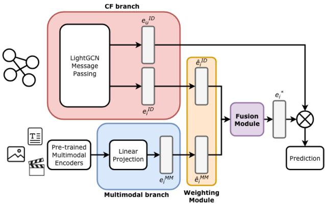
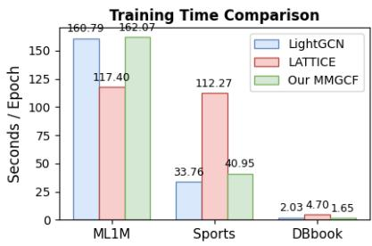

# MMGCF: Multimodal Graph Collaborative Filtering for Recommendation with Graph Convolutional Networks

Giuseppe Spillo University of Bari Aldo Moro Bari, Italy giuseppe.spillo@uniba.it

Cataldo Musto University of Bari Aldo Moro Bari, Italy cataldo.musto@uniba.it

Marco de Gemmis University of Bari Aldo Moro Bari, Italy marco.degemmis@uniba.it

Francesco Musci University of Bari Aldo Moro Bari, Italy f.musci10@studenti.uniba.it

Giovanni Semeraro University of Bari Aldo Moro Bari, Italy giovanni.semeraro@uniba.it

## Abstract

The growing interest of the research community in multimodal recommendation models has introduced significant challenges, most notably how to efectively process and integrate multimodal fea tures into traditional approaches such as collaborative filtering. Despite the eforts, many existing methods achieve only marginal performance gains at the cost of increased model complexity and longer training time. In this paper, we present MMGCF (MultiModal Graph Collaborative Filtering), a recommendation model that inte grates an eficient collaborative filtering backbone with pre-trained multimodal item features, thereby combining the advantages ofmul timodal representations with negligible additional model complex ity. Through extensive experiments, we evaluate MMGCF against state-of-the-art recommendation models. The results demonstrate that our model achieves significant performance gains with mini mum overhead, maintaining competitive training times. Our source code is available at https://github.com/swapUniba/MMGCF

## CCS Concepts

• Information systems → Recommender systems.

## Keywords

Recommender Systems, Multimodal, Graph Convolutional Net works

## ACM Reference Format:

Giuseppe Spillo, Cataldo Musto, Francesco Musci, Marco de Gemmis, and Giovanni Semeraro. 2026. MMGCF: Multimodal Graph Collaborative Filtering for Recommendation with Graph Convolutional Networks. In 34th ACM Conference on User Modeling, Adaptation and Personalization (UMAP ’26), June 08–11, 2026, Gothenburg, Sweden. ACM, New York, NY, USA, 5 pages. https://doi.org/10.1145/3774935.3806158

## 1 Introduction and Motivations

In recent years, the research community has shown growing interest in multimodal deep learning [14], spanning multiple domains, from natural language processing [10] to computer vision [1]. The field of Recommender Systems (RS) is no exception, and an expanding body of literature now explores how to efectively leverage multimodal data to enhance recommendation accuracy and personalization [11, 20, 26]. Multimodal RSs typically exploit multimodal features associated with items, such as textual descriptions, images, movie posters, or video trailers, to enrich item representations. By incorporating these diferent signals, RSs generate more expressive embeddings that significantly enhance recommendation accuracy [18, 30]. However, a key challenge remains: the efective integration of these multimodal features with traditional ID embeddings [7], that are learned through traditional Collaborative Filtering (CF). The most common approach involves learning user and item-ID embeddings from historical interaction data, then combining them with multimodal item features through a fusion mechanism.

For example, VBPR [6] adopts the BPR loss [16] to learn ID embeddings and enhances item representations by concatenating visual features with item ID embeddings. While this approach is computationally eficient, it often provides marginal performance gains, as its simple fusion strategy fails to capture the latent correlations between disparate feature spaces. More sophisticated approaches exploit graph structures, which already have shown their efectiveness in RSs [13, 15]. MMGCN [25], based on Graph Convolutional Networks (GCNs) [29], integrates multimodal data into a graph-based CF framework. This is achieved by constructing modality-aware item representations that are subsequently propagated across the graph via convolutional layers. However, this design introduces additional parameters and computational overhead due to modality-specific convolutions. GRCN [24] evolves the graph-based paradigm by encoding both local and global contextual dependencies through relational graph convolutions. This approach facilitates the simultaneous propagation of CF signals and multimodal features. However, this integration comes at the expense of increased model complexity. Similarly, LATTICE [28] leverages multimodal features to discover latent structures within item representations. By explicitly constructing a latent item-item graph, the model captures high-order dependencies which are which are then aggregated using GCNs. FREEDOM [32] adopts a decoupled multimodal learning strategy, coordinating CF and multimodal representation learning via modality-specific encoders and fusion mechanisms, achieving strong performance with a more complex optimization pipeline. Overall, existing multimodal RSs often rely on highly sophisticated architectures to integrate multimodal sig nals. However, the resulting performance gains are often marginal ized by a substantial increase in computational overhead. This trade of underscores a critical gap in the field: the need for eficient yet robust architectural solutions. To this end, we propose MMGCF (MultiModal Graph Collaborative Filtering), a multimodal RS built upon the high-eficiency LightGCN backbone [7]. MMGCF prior itizes architectural simplicity by integrating multimodal features through precise, low-impact strategies.

  
Figure 1: Workflow of MMGCF model.

Specifically, the proposed model augments LightGCN’s item ID embeddings with multimodal signals using light weight weighting and fusion mechanisms. This design avoids complex multimodal graph architectures, while still achiev ing strong performance with low computational overhead.

The main contributions of this work are summarized as follows:

• Eficient Architecture: MMGCF enriches a robust CF backbone with modality-specific features, achieving more precise item representations without the computational toll of traditional graph-based integration.

• Agnostic Fusion Strategies: We systematically investigate various weighting and fusion strategies to efectively fuse CF signals with multimodal data. These strategies provide ver satile design configurations while maintaining minimal com putational overhead.

• Empirical Validation: Through extensive benchmarking across multiple datasets, we show that MMGCF consistently achieves competitive or better performance than current State-of-the-Art (SOTA) multimodal models, while maintaining eficient training times.

## 2 MMGCF Architecture

The MMGCF Architecture is organized into four distinct components: (i) a backbone CF model based on LightGCN, which provides user and item ID embeddings; (ii) a multimodal branch that pro cesses item features from multiple modalities; (iii) a Weighting Module that controls the relative contribution of ID and multi modal signals; (iv) a Fusion Layer that aggregates the weighted embeddings into a unified item representation. The resulting item embedding is then used with the user ID embedding to provide recommendations. This workflow is illustrated in Figure 1 and elaborated upon in the reminder of this section.

CF branch. This branch captures CF signals from the interaction matrix R $\in \mathbb { R } ^ { M \times N }$ , with $\mathbf { R } _ { i , j } ~ = ~ 1$ denoting an observed positive interaction between user � and item �, and $\mathbf R _ { i , j } = 0$ otherwise. We adopt LightGCN [7] as our backbone model to learn �-dimensional user and item ID embeddings. It is chosen for its proven efectiveness and eficiency. The model performs linear message passing across � layers of the bipartite user-item graph. The final ID embeddings, ${ \bf e } _ { u } ^ { I D }$ and ${ \bf e } _ { i } ^ { I D }$ , are then obtained by aggregating the representations across layers. For a comprehensive discussion on the propagation mechanics and architectural advantages, we refer the reader to the original work [7].

Multimodal Branch. The subsequent stage of the workflow processes multimodal item embeddings. Each set of embeddings coming from the � multimodal data sources $( \mathrm { e . g . }$ , images, text, video) is projected through a learnable linear layer into the same latent space as the ID embeddings. This projection aligns the heterogeneous feature spaces ofdiferent modalities with the collaborative embedding space.

Formally, let $\mathbf { i } _ { m }$ be the item embedding derived from modality �. The linear projection is defined as:

$$
\mathbf {e} _ {i} ^ {m} = \mathbf {W} _ {m} \mathbf {i} _ {m} + \mathbf {b} _ {m}\tag{1}
$$

where $\mathbf { W } _ { m } \in \mathbb { R } ^ { d \times d _ { m } }$ and $\mathbf { b } _ { m } \in \mathbb { R } ^ { d }$ are the learnable weight matrix and bias vector, respectively, mapping the $d _ { m }$ -dimensional modality features to the �-dimensional collaborative embedding space.

Weighting Module. Once item ID and multimodal embeddings are processed, we apply a weighting mechanism to balance the ID embeddings ${ \bf e } _ { i } ^ { I D }$ and the projected multimodal embeddings ${ \bf e } _ { i } ^ { m }$ . We propose three distinct strategies to be evaluated in our experiments:

• Equal Weighting: Both signals are treated with uniform importance, assuming a balanced contribution from both sources. This strategy serves as a parameter-free baseline, integrating the embeddings without additional scaling:

$$
\hat {\mathbf {e}} _ {i} ^ {I D} = \mathbf {e} _ {i} ^ {I D}, \quad \hat {\mathbf {e}} _ {i} ^ {m} = \mathbf {e} _ {i} ^ {m}\tag{2}
$$

• Alpha Weighting: We introduce a learnable parameter $\alpha ~ \in ~ [ 0 , 1 ]$ to dynamically regulate the relative contribution of each signal. To constrain � within the valid range of [0, 1], the parameter is passed through a sigmoid activation function. The weighted embeddings are defined as:

$$
\hat {\mathbf {e}} _ {i} ^ {I D} = \alpha \mathbf {e} _ {i} ^ {I D}, \quad \hat {\mathbf {e}} _ {i} ^ {m} = (1 - \alpha) \mathbf {e} _ {i} ^ {m}\tag{3}
$$

• Normalization: To mitigate magnitude imbalances between the ID and multimodal signals, we apply $L _ { 2 }$ normalization [9] to the embeddings. Since each item is associated with � modalities, we scale the ID embeddings by a factor of � to compensate for the reduction in magnitude introduced by normalization and preserve the strength of collaborative signals.

$$
\hat {\mathbf {e}} _ {i} ^ {I D} = M \cdot \frac {\mathbf {e} _ {i} ^ {I D}}{\| \mathbf {e} _ {i} ^ {I D} \| _ {2}}, \quad \hat {\mathbf {e}} _ {i} ^ {m} = \frac {\mathbf {e} _ {i} ^ {m}}{\| \mathbf {e} _ {i} ^ {m} \| _ {2}}\tag{4}
$$

This calibration ensures that both signals are optimally prepared to be fused into a unified representation.

Item Embedding Fusion. After the weighting process, the item ID and multimodal embeddings are fused to obtain a unified item representation $\mathbf { e } _ { i } ^ { * } .$ . We explore three distinct strategies for this integration:

• Mean: the ID and multimodal embeddings are averaged over each dimension as follows:

$$
\mathbf {e} _ {i} ^ {*} = \mathrm{avg} (\hat {\mathbf {e}} _ {i} ^ {I D}, \hat {\mathbf {e}} _ {i} ^ {1}, \dots , \hat {\mathbf {e}} _ {i} ^ {M})\tag{5}
$$

• Summation: the ID and multimodal embeddings are com bined via element-wise addition:

$$
\mathbf {e} _ {i} ^ {*} = \hat {\mathbf {e}} _ {i} ^ {I D} + \hat {\mathbf {e}} _ {i} ^ {1} + \dots + \hat {\mathbf {e}} _ {i} ^ {M}\tag{6}
$$

• Concatenation: the ID and multimodal embeddings are concatenated and projected onto the same dimension of the ID embeddings. Let $\mathbf { W } _ { f }$ be a learnable parameter and $b _ { f }$ a bias vector. Then, the concatenation fusion strategy is formalized as follows:

$$
\mathbf {e} _ {i} ^ {*} = \mathbf {W} _ {f} [ \hat {\mathbf {e}} _ {i} ^ {I D} \| \dots \| \hat {\mathbf {e}} _ {i} ^ {M} ] + \mathbf {b} _ {f}\tag{7}
$$

Ultimately, this process provides a unified item embedding $e _ { i } ^ { * } ,$ which serves as a comprehensive representation by encoding both CF signals and rich multimodal features.

Model Optimization. To optimize MMGCF, we employ the Bayesian Personalized Ranking (BPR) loss [16], a pairwise objective function that encourages the model to assign higher prediction scores to observed (positive) interactions than to unobserved (nega tive) ones. For the sake of brevity, we refer the reader to the original work [16] for further details.

Model strenghts and advantages. The key features of our approach are:

• Robust CF backbone: MMGCF leverages LightGCN [7], a SOTA model that achieves strong performance while main taining low complexity.

• Adaptive weighting mechanisms: Diferently from the common approach of treating each modality with equal weight [6, 12, 25, 31], we introduce several lightweight yet efective alternatives. This approach is designed to enhance recommendation accuracy without introducing the heavy computational overhead typical of more complex fusion ar chitectures [21, 24, 27, 28, 32].

• Versatile Fusion Strategies: Rather than relying solely on concatenation, a common practice in the literature [6, 12, 31], we evaluate a variety of fusion techniques to identify optimal methods for integrating heterogeneous signals.

## 3 Experimental Session

We evaluate our proposed methodology by addressing the following Research Questions (RQs):

• RQ1: How does MMGCF perform compared to SOTA base lines?

• RQ2: To what extent do hyper-parameters influence the overall performance of the model?

Datasets. We evaluate our approach using three benchmarks in multimodal recommendation: MovieLens-1M1 (ML1M), DBbook and Sports. We consider the ML1M and DBbook versions presented in [18, 19], while the Sports dataset is provided by the Amazon Review dataset collection [31]. The available modalities vary by dataset: ML1M includes text (T), images (I), audio (A) and video (V), while DBbook and Sports are limited to text (T) and images (I). As multimodal encoders, we considered MiniLM [23] for text, ViT [4] for images, VGGish [8] for audio, and R(2+1)D [22] for videos. Statistics of the datasets are reported in Table 1.

Table 1: Statistics of the datasets.

<table><tr><td>Dataset</td><td>#Users</td><td>#Items</td><td>#Inter.</td><td>Sparsity</td><td>Modalities</td></tr><tr><td>ML1M</td><td>6,040</td><td>2,980</td><td>942,703</td><td>94.76%</td><td>T, I, A, V</td></tr><tr><td>DBbook</td><td>6,179</td><td>4,191</td><td>121,779</td><td>99.53%</td><td>T, I</td></tr><tr><td>Sports</td><td>35,598</td><td>18,357</td><td>296,337</td><td>99.95%</td><td>T, I</td></tr></table>

Evaluation Protocol. Following standard literature [27, 28] we split each dataset into train, validation and testing sets using an 80-10-10 ratios. The BPR loss samples 1 negative item at time. We assess model performance by considering Recall@� and NDCG@�, with $k = \{ 1 0 , 2 0 \}$ }, while we measure the computational eficiency is by considering the training time (seconds) per epoch. All models are evaluated in the AllItems setting [2].

Experimental Setting. We train our models for 500 epochs, with learning rate set to 0.001 and batch size set to 2048. We conduct a sensitivity analysis of MMGCF across three key hyperparameter: GCN backbone depth, weighting mechanism, and multimodal fusion. Specifically, we vary the number of GCN layers in 1, 2, 3, evaluate equal, alpha, and normalization weighting mechanisms, and compare mean, summation, and concatenation fusion strategies.

Baselines and Implementation Details. We benchmark our approach against six SOTA models implemented in MMRec [31]: VBPR [6], MMGCN [25], GRCN [24], LATTICE [28], FREEDOM [32], and LGMRec [5]. All models are fully optimized through a grid search, and the full list ofconsidered hyperparameters is reported in our repository. We run each parameter combination once, using the same seed. Statistical significance is assessed by using a paired t-test on the recommendation lists produced by our model and the bestperforming baseline model, with a threshold of $\textstyle p < 0 . 0 5$ . We conduct our experiments on a machine running Ubuntu 22.04, equipped with an Intel(R) Xeon(R) Silver 4309Y CPU, and an NVIDIA A16 GPU. We develop our model in Pytorch 2.9 with CUDA drivers v12.8. The full codebase is available in our repository2.

## 4 Results Discussion

To answer RQ1, Table 2 provides a performance comparison between MMGCF and the selected baselines across the three datasets. Figure 2 illustrates the training times (per epoch) of MMGCF, Light-GCN, and the top-performing multimodal baseline model.

On ML1M, LightGCN emerges as the strongest baseline, suggesting that CF methods remain highly efective on dense dataset (see Table 1) compared to multimodal models. Nevertheless, MMGCF achives statistically significant gains over LightGCN in both Recall and NDCG, with only a marginal increase in training time per epoch (see Figure 2). These results suggest that MMGCF efectively leverages multimodal features to enhance recommendation performance without introducing significant computational overhead.

Table 2: Performance Comparison between MMGCF and the baseline models. Best overall results are reported in bold, while the top-performing baselines are underlined. Values with (\*) indicates statistical significance at $\begin{array} { r } { p < 0 . 0 5 . } \end{array}$

<table><tr><td rowspan="2">Model</td><td colspan="4">ML1M</td><td colspan="4">DBbook</td><td colspan="4">Sports</td></tr><tr><td>R@10</td><td>N@10</td><td>R@20</td><td>N@20</td><td>R@10</td><td>N@10</td><td>R@20</td><td>N@20</td><td>R@10</td><td>N@10</td><td>R@20</td><td>N@20</td></tr><tr><td>LightGCN</td><td>0.1672</td><td>0.2600</td><td>0.2536</td><td>0.2678</td><td>0.1725</td><td>0.1306</td><td>0.2453</td><td>0.1558</td><td>0.0720</td><td>0.0410</td><td>0.1024</td><td>0.0489</td></tr><tr><td>VBPR</td><td>0.1368</td><td>0.1914</td><td>0.2156</td><td>0.2080</td><td>0.1955</td><td>0.1498</td><td>0.2679</td><td>0.1750</td><td>0.0546</td><td>0.0313</td><td>0.0803</td><td>0.0380</td></tr><tr><td>MMGCN</td><td>0.1465</td><td>0.2072</td><td>0.2339</td><td>0.2259</td><td>0.1006</td><td>0.0689</td><td>0.1644</td><td>0.0909</td><td>0.0345</td><td>0.0184</td><td>0.0543</td><td>0.0235</td></tr><tr><td>GRCN</td><td>0.1579</td><td>0.2256</td><td>0.2527</td><td>0.2454</td><td>0.1856</td><td>0.1395</td><td>0.2605</td><td>0.1653</td><td>0.0614</td><td>0.0339</td><td>0.0936</td><td>0.0422</td></tr><tr><td>LATTICE</td><td>0.1669</td><td>0.2340</td><td>0.2627</td><td>0.2542</td><td>0.2073</td><td>0.1577</td><td>0.2872</td><td>0.1855</td><td>0.0775</td><td>0.0436</td><td>0.1128</td><td>0.0527</td></tr><tr><td>FREEDOM</td><td>0.1565</td><td>0.2223</td><td>0.2494</td><td>0.2418</td><td>0.1825</td><td>0.1342</td><td>0.2607</td><td>0.1612</td><td>0.0762</td><td>0.0407</td><td>0.1176</td><td>0.0514</td></tr><tr><td>LGMRec</td><td>0.1653</td><td>0.2308</td><td>0.2585</td><td>0.2503</td><td>0.1771</td><td>0.1304</td><td>0.256</td><td>0.1575</td><td>0.0708</td><td>0.038</td><td>0.1046</td><td>0.0467</td></tr><tr><td>MMGCF</td><td>0.1871*</td><td>0.3030*</td><td>0.2810*</td><td>0.3058*</td><td>0.2222*</td><td>0.1743*</td><td>0.2997*</td><td>0.2010*</td><td>0.0810*</td><td>0.0452</td><td>0.1169</td><td>0.0544*</td></tr></table>

  
Figure 2: Comparison of the training time per epoch between MMGCF, LightGCN, and LATTICE.

In contrast, MMGCN and GRCN underperform with respect to MMGCF despite substantially higher training costs. This highlights the capacity ofMMGCF to extend LightGCN efectively, while main taining scalability. On DBbook, a pure CF model (LightGCN) fails in providing accurate recommendations, likely due to the higher sparsity (Table 1). In this sparse context, multimodal models out perform LightGCN across all metrics. MMGCF achieves significant improvements over LATTICE, the best-performing baseline, while maintaining even lower training times. This result suggests that MMGCF efectively outperforms LightGCN in sparser scenarios by exploiting multimodal features, without compromising training time eficiency. The results on the Sports dataset further validate our previous findings. While LightGCN serves as a competitive baseline, MMGCF consistently achieves higher Recall and NDCG, showing that multimodal integration can significantly enhance recommenda tion accuracy over pure CF, while maintaining lower training times than most of the multimodal baselines. Notably, MMGCF is signifi cantly faster than LATTICE. To answer RQ1, we conclude that MMGCF successfully extend LightGCN through the strategic integration of multimodal features. The model consistently outperforms multimodal baselines, and demonstrates better eficiency, particularly in high sparsity scenarios.

To address RQ2, we investigate MMGCF sensitivity across three key hyperparameters: GCN depth, fusion strategy, and embedding weighting. Table 3 reports the peak performance for each configura tion, obtained by isolating one parameter and optimizing the others via grid search. Due to space contraints, we focus the discussion on ML1M, as findings were consistent across all datasets. First, we observe that the best results are obtained with a GCN depth of 3 layers. This aligns with the findings in the original LightGCN paper [7], which suggests that increased depth generally enhances performance. As for the weighting strategy, our results indicate that this component is critical for performance optimization. Both learnable alpha and normalized weighting strategies outperform equal weighting, the latter being the conventional approach in existing literature [6, 24, 25]. This confirms that treating all modalities as equally informative may lead to suboptimal performance. Instead, MMGCF efectively balances multimodal and CF signals, without adding noise. Finally, the choice of the fusion strategy significantly impacts performance. Mean fusion consistently outperforms both summation and concatenation, the latter being a common standard in the literature [6, 12, 31]. This suggests that balanced signal aggregation is more efective than simply increasing representation dimensionality. To answer RQ2, our sensitivity analysis shows that embedding weighting and fusion strategy are critical. Specifically, assigning equal weights degrades performance, while normalizing embeddings or using a learnable parameter improves performance. Additionally, mean-based fusion generally outperforms the more common concatenation.

Table 3: Sensitivity Analysis on ML1M

<table><tr><td>Parameter</td><td>Recall@10</td><td>NDCG@10</td><td>Recall@20</td><td>NDCG@20</td></tr><tr><td colspan="5">GCN Layers</td></tr><tr><td>1</td><td>0.1842</td><td>0.2991</td><td>0.2781</td><td>0.3027</td></tr><tr><td>2</td><td>0.1854</td><td>0.3047</td><td>0.2794</td><td>0.3066</td></tr><tr><td>3</td><td>0.1871</td><td>0.3030</td><td>0.2810</td><td>0.3058</td></tr><tr><td colspan="5">Item Embedding Weight</td></tr><tr><td>Alpha</td><td>0.1871</td><td>0.3030</td><td>0.2810</td><td>0.3058</td></tr><tr><td>Equal</td><td>0.1796</td><td>0.2848</td><td>0.2719</td><td>0.2905</td></tr><tr><td>Normalized</td><td>0.1854</td><td>0.3047</td><td>0.2794</td><td>0.3066</td></tr><tr><td colspan="5">Fusion Strategy</td></tr><tr><td>Concat</td><td>0.1769</td><td>0.2808</td><td>0.2700</td><td>0.2874</td></tr><tr><td>Mean</td><td>0.1871</td><td>0.3030</td><td>0.2810</td><td>0.3058</td></tr><tr><td>Sum</td><td>0.1664</td><td>0.2589</td><td>0.2544</td><td>0.2669</td></tr></table>

## 5 Conclusions

In this paper, we presented MMGCF, a multimodal RS that integrates CF embeddings with pre-trained multimodal item features through eficient and efective weighting mechanisms and fusion strategies. Our experiments showed that MMGCF ofers the optimal trade-of between recommendation accuracy and computational eficiency.

Future work will explore the generalizability of our weighting and fusion strategies across other recommendation models [6, 31], and evaluate how alternative CF backbone models influence MMGCF performance. Additionally, we intend to expand to include the environmental impact of these models by assessing the carbon footprint generated during training [3, 17].

## Acknowledgments

The experiments have been conducted using the Leonardo su percomputer with the support of CINECA-Italian Supercomputing Resource Allocation, under class C project IscrC\_MMRecSys (HP10CKHKCM).

## References

[1] Jinze Bai, Shuai Bai, Shusheng Yang, Shijie Wang, Sinan Tan, Peng Wang, Junyang Lin, Chang Zhou, and Jingren Zhou. 2023. Qwen-VL: A Versatile Vision-Language Model for Understanding, Localization, Text Reading, and Beyond.

[2] Alejandro Bellogin, Pablo Castells, and Ivan Cantador. 2011. Precision-oriented evaluation of recommender systems: an algorithmic comparison. In Proceedings ofthe fifth ACM conference on Recommender systems. 333–336.

[3] Allegra De Filippo, Giuseppe Spillo, Ludovico Boratto, Michela Milano, Cataldo Musto, and Giovanni Semeraro. 2026. Recommender systems and sustainability: a dual perspective. Computer Science Review 60 (2026), 100912.

[4] Alexey Dosovitskiy, Lucas Beyer, Alexander Kolesnikov, Dirk Weissenborn, Xi aohua Zhai, Thomas Unterthiner, Mostafa Dehghani, Matthias Minderer, Georg Heigold, Sylvain Gelly, et al. 2020. An image is worth 16x16 words: Transformers for image recognition at scale. arXiv preprint arXiv:2010.11929 (2020).

[5] Zhiqiang Guo, Jianjun Li, Guohui Li, Chaoyang Wang, Si Shi, and Bin Ruan. 2024. Lgmrec: Local and global graph learning for multimodal recommendation. In Proceedings of the AAAI conference on artificial intelligence, Vol. 38. 8454–8462.

[6] Ruining He and Julian McAuley. 2016. VBPR: visual bayesian personalized ranking from implicit feedback. In Proceedings ofthe AAAI conference on artificial intelligence, Vol. 30.

[7] Xiangnan He, Kuan Deng, Xiang Wang, Yan Li, Yongdong Zhang, and Meng Wang. 2020. Lightgcn: Simplifying and powering graph convolution network for recommendation. In Proceedings ofthe 43rd International ACM SIGIR conference on research and development in Information Retrieval. 639–648.

[8] Shawn Hershey, Sourish Chaudhuri, Daniel PW Ellis, Jort F Gemmeke, Aren Jansen, R Channing Moore, Manoj Plakal, Devin Platt, Rif A Saurous, Bryan Seybold, et al. 2017. CNN architectures for large-scale audio classification. In 2017 ieee international conference on acoustics, speech and signal processing (icassp). IEEE, 131–135.

[9] Lei Huang, Jie Qin, Yi Zhou, Fan Zhu, Li Liu, and Ling Shao. 2023. Normalization techniques in training dnns: Methodology, analysis and application. IEEE transactions on pattern analysis and machine intelligence 45, 8 (2023), 10173–10196.

[10] Haotian Liu, Chunyuan Li, Qingyang Wu, and Yong Jae Lee. 2023. Visual instruction tuning. Advances in neural information processing systems 36 (2023), 34892–34916.

[11] Qidong Liu, Jiaxi Hu, Yutian Xiao, Xiangyu Zhao, Jingtong Gao, Wanyu Wang, Qing Li, and Jiliang Tang. 2024. Multimodal recommender systems: A survey. Comput. Surveys 57, 2 (2024), 1–17.

[12] Daniele Malitesta, Giuseppe Gassi, Claudio Pomo, and Tommaso Di Noia. 2023. Ducho: A unified framework for the extraction of multimodal features in recom mendation. In Proceedings ofthe 31st ACM International Conference on Multimedia. 9668–9671.

[13] Cataldo Musto, Pasquale Lops, Pierpaolo Basile, Marco de Gemmis, and Giovanni Semeraro. 2016. Semantics-aware graph-based recommender systems exploiting linked open data. In Proceedings of the 2016 conference on user modeling adaptation and personalization. 229–237.

[14] Jiquan Ngiam, Aditya Khosla, Mingyu Kim, Juhan Nam, Honglak Lee, Andrew Y Ng, et al. 2011. Multimodal deep learning.. In ICML, Vol. 11. 689–696.

[15] Alessandro Petruzzelli, Alessandro Francesco Maria Martina, Giuseppe Spillo, Cataldo Musto, Marco De Gemmis, Pasquale Lops, and Giovanni Semeraro. 2024. Improving transformer-based sequential conversational recommenda tions through knowledge graph embeddings. In Proceedings ofthe 32nd ACM

Conference on User Modeling, Adaptation and Personalization. 172–182.

[16] Stefen Rendle, Christoph Freudenthaler, Zeno Gantner, and Lars Schmidt-Thieme. 2012. BPR: Bayesian personalized ranking from implicit feedback. arXiv preprint arXiv:1205.2618 (2012).

[17] Giuseppe Spillo, Allegra De Filippo, Cataldo Musto, Michela Milano, and Giovanni Semeraro. 2025. Balancing carbon footprint and algorithm performance in recommender systems: A comprehensive benchmark. Sustainable Computing: Informatics and Systems (2025), 101286.

[18] Giuseppe Spillo, Elio Musacchio, Cataldo Musto, Marco de Gemmis, Pasquale Lops, and Giovanni Semeraro. 2025. Gotta embed them all!-knowledge-aware recommendations fusing heterogeneous multimodal item embeddings. Journal ofIntelligent Information Systems (2025), 1–27.

[19] Giuseppe Spillo, Elio Musacchio, Cataldo Musto, Marco de Gemmis, Pasquale Lops, and Giovanni Semeraro. 2025. See the movie, hear the song, read the book: Extending movielens-1m, last. fm-2k, and DBbook with multimodal data. In Proceedings ofthe Nineteenth ACM Conference on Recommender Systems. 847–856.

[20] Giuseppe Spillo, Alessandro Petruzzelli, Cataldo Musto, Marco de Gemmis, Pasquale Lops, and Giovanni Semeraro. 2026. Binge Watch: Reproducible Multimodal Benchmarks Datasets for Large-Scale Movie Recommendation on MovieLens-10M and 20M. arXiv preprint arXiv:2602.15505 (2026).

[21] Zhulin Tao, Xiaohao Liu, Yewei Xia, Xiang Wang, Lifang Yang, Xianglin Huang, and Tat-Seng Chua. 2022. Self-supervised learning for multimedia recommendation. IEEE Transactions on Multimedia 25 (2022), 5107–5116.

[22] Du Tran, Heng Wang, Lorenzo Torresani, Jamie Ray, Yann LeCun, and Manohar Paluri. 2018. A closer look at spatiotemporal convolutions for action recognition. In Proceedings of the IEEE conference on Computer Vision and Pattern Recognition. 6450–6459.

[23] Wenhui Wang, Furu Wei, Li Dong, Hangbo Bao, Nan Yang, and Ming Zhou. 2020. Minilm: Deep self-attention distillation for task-agnostic compression of pre-trained transformers. Advances in neural information processing systems 33 (2020), 5776–5788.

[24] Yinwei Wei, Xiang Wang, Liqiang Nie, Xiangnan He, and Tat-Seng Chua. 2020. Graph-refined convolutional network for multimedia recommendation with implicit feedback. In Proceedings ofthe 28th ACM international conference on multimedia. 3541–3549.

[25] Yinwei Wei, Xiang Wang, Liqiang Nie, Xiangnan He, Richang Hong, and Tat-Seng Chua. 2019. MMGCN: Multi-modal graph convolution network for personalized recommendation of micro-video. In Proceedings ofthe 27th ACM international conference on multimedia. 1437–1445.

[26] Jinfeng Xu, Zheyu Chen, Shuo Yang, Jinze Li, Wei Wang, Xiping Hu, Steven Hoi, and Edith Ngai. 2025. A Survey on Multimodal Recommender Systems: Recent Advances and Future Directions. arXiv preprint arXiv:2502.15711 (2025).

[27] Zixuan Yi, Xi Wang, Iadh Ounis, and Craig Macdonald. 2022. Multi-modal graph contrastive learning for micro-video recommendation. In Proceedings ofthe 45th international ACM SIGIR conference on research and development in information retrieval. 1807–1811.

[28] Jinghao Zhang, Yanqiao Zhu, Qiang Liu, Shu Wu, Shuhui Wang, and Liang Wang. 2021. Mining latent structures for multimedia recommendation. In Proceedings ofthe 29th ACM international conference on multimedia. 3872–3880.

[29] Si Zhang, Hanghang Tong, Jiejun Xu, and Ross Maciejewski. 2019. Graph convolutional networks: a comprehensive review. Computational Social Networks 6, 1 (2019), 1–23.

[30] Hongyu Zhou, Xin Zhou, Zhiwei Zeng, Lingzi Zhang, and Zhiqi Shen. 2023. A comprehensive survey on multimodal recommender systems: Taxonomy, evaluation, and future directions. arXiv preprint arXiv:2302.04473 (2023).

[31] Xin Zhou. 2023. Mmrec: Simplifying multimodal recommendation. In Proceedings ofthe 5th ACM International Conference on Multimedia in Asia Workshops. 1–2.

[32] Xin Zhou and Zhiqi Shen. 2023. A tale of two graphs: Freezing and denoising graph structures for multimodal recommendation. In Proceedings ofthe 31st ACM international conference on multimedia. 935–943.