# NLGCL+: Naturally Existing Neighbour Layers Graph Contrastive Learning with Adaptive Sample Weighting for Multimodal Recommendation

JINFENG XU, Department of Electrical and Electronic Engineering, The University of Hong Kong, Hong Kong, Hong Kong

ZHEYU CHEN, Beijing Institute of Technology, Beijing, China

SHUO YANG, Department of Electrical and Electronic Engineering, The University of Hong Kong, Hong Kong, Hong Kong

JINZE LI, Department of Electrical and Electronic Engineering, The University of Hong Kong, Hong Kong, Hong Kong

HEWEI WANG, Carnegie Mellon University, Pittsburgh, United States

WEI WANG, Macao Polytechnic University, Macau, Macao

XIPING HU, Beijing Institute of Technology, Beijing, China

EDITH NGAI\*, The University of Hong Kong, Hong Kong, Hong Kong

While Graph Neural Networks (GNNs) have demonstrated remarkable success in multimodal recommendation systems by capturing high-order user-item relationships, their performance is often hindered by the inherent data sparsity in real-world scenarios. Although Graph Contrastive Learning (GCL) has emerged as a promising solution to enhance data representations, most existing methods rely on computationally intensive augmentation strategies, which risk introducing semantically irrelevant noise.

To address these limitations, we propose NLGCL, a novel and efficient contrastive learning framework that leverages the intrinsic structural properties of GNNs by constructing positive contrastive views from naturally related neighboring layers, thereby eliminating the need for external data augmentations and their associated computational overhead. With the proliferation of multimedia data, multimodal recommendation has become increasingly prevalent. However, directly applying NLGCL to multimodal settings overlooks the rich information embedded in modality-specific features. To this end, we further extend NLGCL to NLGCL+, a tailored framework specifically designed for multimodal recommendation. NLGCL+ uniquely integrates multimodal information to perform adaptive sample weighting, enabling more discriminative and fine-grained representation learning. Designed as a plug-and-play module, NLGCL+ can be seamlessly integrated into existing multimodal recommendation models to enhance their accuracy. Comprehensive experiments on widely-used multimodal recommendation

Authors' Contact Information: Jinfeng Xu, Department of Electrical and Electronic Engineering, The University of Hong Kong, Hong Kong, Hong Kong; e-mail: jinfeng@connect.hku.hk; Zheyu Chen, Beijing Institute of Technology, Beijing, Beijing, China; e-mail: zheyu.chen@bit.edu.cn; Shuo Yang, Department of Electrical and Electronic Engineering, The University of Hong Kong, Hong Kong, Hong Kong; e-mail: shuoyang.ee@gmail.com; Jinze Li, Department of Electrical and Electronic Engineering, The University of Hong Kong, Hong Kong, Hong Kong; e-mail: lijinze-hku@connect.hku.hk; Hewei Wang, Carnegie Mellon University, Pittsburgh, Pennsylvania, United States; e-mail: heweiw@andrew.cmu.edu; Wei Wang, Macao Polytechnic University, Macau, Macao; e-mail: weiwang@mpu.edu.mo; Xiping Hu, Beijing Institute of Technology, Beijing, Beijing, China; e-mail: huxp@bit.edu.cn; Edith Ngai, The University of Hong Kong, Hong Kong, Hong Kong; e-mail: chngai@eee.hku.hk.

ACM Trans. Recomm. Syst.

datasets demonstrate that NLGCL+ significantly outperforms state-of-the-art baselines in both effectiveness and efficiency. Code can be found in https://github.com/Jinfeng-Xu/NLGCL-Plus.

CCS Concepts: • Information systems → Recommender systems;

Additional Key Words and Phrases: Recommender Systems, Multimodal, Contrastive Learning.

## 1 Introduction

The exponential growth of digital content and services has firmly established recommender systems as critical infrastructure across diverse online platforms, including e-commerce, social media, and short-video applications $[7, 33, 34]$ . To model complex user-item relationships, Graph Neural Networks (GNNs) have become a dominant paradigm, adept at capturing high-order collaborative signals by propagating information over user-item bipartite graph $[13, 36]$ . This capability is particularly vital in multimodal recommendation, where items (e.g., products, videos) are associated with rich side information from multiple modalities such as visual, textual, and acoustic features. By integrating these modalities, GNN-based models can learn more comprehensive representations, potentially alleviating the persistent data sparsity problem.

To further alleviate the data sparsity problem, Graph Contrastive Learning (GCL) has emerged as a powerful auxiliary technique that injects self-supervision signals by applying contrastive learning on augmented views of the graph $[30, 41, 45, 46]$ . Conventional GCL methods typically construct these views through stochastic data augmentation techniques—such as node/edge dropout, feature masking, or noise addition $[1, 2, 16, 20, 22, 30, 46, 51]$ . While beneficial in some contexts, these strategies present pronounced limitations in both effectiveness and efficiency, which are notably exacerbated in the multimodal recommendation settings.

From an effectiveness perspective, randomly generated augmentations risk introducing semantically irrelevant noise that can distort critical structural and feature information $[30, 40, 46]$ . In multimodal recommendation settings, where items possess aligned semantic information across different modalities, such arbitrary perturbations may fail to preserve the underlying cross-modal consistency, thereby hindering the model's ability to learn robust and discriminative representations. More critically, the efficiency issue becomes substantially more severe. Multimodal information and modality-specific composite graphs inherently increases model complexity and computational overhead. Constructing, processing, and storing multiple augmented graph views for contrastive learning imposes significant additional overhead on time and memory $[2, 51]$ , severely limiting the scalability and practical deployment of GCL in real-world multimodal recommendations.

In recommendation scenarios, interacted nodes naturally serve as semantically relevant neighbors for each node. Consequently, the message-passing mechanism of GNNs enables the representations of neighboring nodes across neighbour layers to be regarded as naturally constructed positive pairs. Our previous work, NLGCL $^{1}$ [43], provides a promising solution that leverages the naturally existing contrastive views in GNNs, thereby eliminating the need for artificially augmented views and reducing computational cost. Interestingly, multimodal information inherently offers a potential way to further alleviate the core issue of irrelevant noise in contrastive learning. The consistency and complementarity across different modalities can serve as reliable signals for identifying and weighting semantically relevant versus irrelevant sample pairs, thus guiding a more discriminative contrastive learning process.

To this end, we further extend NLGCL to NLGCL+, a tailored framework specifically designed for multimodal recommendations. Building upon the insight that naturally hierarchical neighbor aggregations in GNNs provide inherent contrastive views $[43]$ , NLGCL+ eliminates the need for computationally expensive external data augmentations. It constructs positive pairs from a node and its neighbors in the subsequent GNN layer, which naturally encapsulate semantically similar information after aggregation. More importantly, NLGCL+ fully harnesses multimodal information to perform adaptive sample weighting. By measuring cross-modal semantic consistency, it distinguishes between hard and irrelevant negative samples, effectively mitigating the influence of noise and enabling fine-grained representation learning. Specifically, we leverage multimodal consistency to assign different weights to various positive and negative samples, rather than treating them arbitrarily as equal. Designed as a plug-and-play module, NLGCL+ can be seamlessly integrated into various existing multimodal GNN-based backbones to enhance their performance. Through comprehensive experiments on benchmark multimodal recommendation datasets, we demonstrate that NLGCL+ not only achieves superior recommendation accuracy compared to state-of-the-art baselines but also does so with significantly higher training efficiency.

The contributions of our NLGCL+ are as follows:

\- We identify the limitations of existing GCL-based methods in multimodal recommendation from both effectiveness and efficiency perspectives.

\- We propose NLGCL+, a tailored framework for multimodal recommendation that eliminates the need for computationally expensive external data augmentations by leveraging intrinsic contrastive views naturally available in GNNs. Furthermore, NLGCL+ incorporates multimodal information to perform adaptive sample weighting.

\- Extensive experiments on five widely-used datasets validate the effectiveness of NLGCL+, demonstrating its consistent superiority across varying levels of data sparsity.

## 2 Related Work

## 2.1 Multimodal Recommendation

Multimodal recommendation systems $[32, 35, 38–40, 44, 48]$ seek to harness multimodal information to enhance recommendation accuracy and alleviate data sparsity. Early works, such as VBPR $[12]$ and Attentive $[3]$ , tackled data sparsity by integrating visual features into item representations through matrix factorization. This approach was subsequently extended by ADDVAE $[25]$ , which incorporated textual content to further enrich item representations. More recent efforts have shifted focus towards the simultaneous integration of information from multiple modalities $[26, 54]$ . Drawing inspiration from traditional recommendation systems, MMGCN $[29]$ and GRCN $[28]$ advanced user-item interaction modeling by employing bipartite graph structures. To better model intra-entity relationships, DualGNN $[26]$ introduced a user-user homogeneous graph to uncover latent user associations. Similarly, FREEDOM $[54]$ and LATTICE $[49]$ incorporated item-item homogeneous graphs to enhance modality-specific representations.

Building upon homogeneous graphs, subsequent research has further refined the representation of user preferences and item properties. In exploring advanced structural paradigms, LGMRec $[10]$ and DiffMM $[14]$ investigated hypergraph structures and diffusion models, respectively, each demonstrating significant performance gains. To more effectively mitigate data sparsity, several studies $[24, 42, 55]$ have integrated self-supervised learning tasks into the multimodal recommendation framework to identify implicit cross-modal preference patterns. Other lines of work include leveraging behavioral modalities to refine multimodal representations, as seen in MGCN $[47]$ and SMORE $[18]$ , and exploring the potential of hypercomplex representations in HPMRec $[6]$ . Most recently, MENTOR $[42]$ and COHESION $[37]$ have sought to unlock the representational capacity of composite graph structures.

However, existing multimodal recommendation approaches typically rely on directly applying established self-supervised tasks and constructing additional contrastive views, which not only introduces substantial computational overhead but also fails to adequately exploit valuable multimodal information.

## 2.2 GCL-based Recommendation

Graph Contrastive Learning (GCL) mitigates data sparsity in recommendation systems by constructing self-supervised contrastive views and maximizing mutual information among embeddings. Early approaches such as SGL $[30]$ apply random data augmentation techniques—including node/edge dropout and random walk-based sampling—to generate consistent views. Subsequent work introduced varied view-generation strategies: SimGCL $[46]$ injects controlled noise during graph convolution, whereas LightGCL $[2]$ adopts Singular Value Decomposition (SVD) to produce global-contrastive views. HCCF $[31]$ further incorporates hypergraph neural networks to model higher-order global relations. Beyond view construction, several studies enhance representation learning through auxiliary mechanisms: NCL $[16]$ introduces expectation-maximization clustering to capture prototype-level semantics, and DCCF $[22]$ learns disentangled representations with self-supervised signals. BIGCF $[51]$ explores the individuality and collectivity of user intents via tailored contrastive signals. Most recently, NLGCL $[43]$ reduces computational overhead by leveraging naturally existing contrastive views within GNNs, ensuring that the discrepancy between views remains semantically grounded.

However, when applied to multimodal recommendation, existing GCL-based models are typically adopted directly from their original designs. This practice not only introduces substantial computational overhead but also fails to fully leverage the available multimodal information.

Remark. Our proposed NLGCL+ innovatively utilizes the inherent layer-wise structure of GNNs by forming positive contrastive views from naturally adjacent layers, thereby eliminating the dependency on external data augmentations and their accompanying computational costs. Furthermore, it uniquely incorporates multimodal information to adaptively weight negative samples, facilitating more discriminative and fine-grained representation learning.

## 3 Methodology

In this section, we provide a detailed exposition of our proposed NLGCL+. We begin by presenting key preliminaries, followed by a technical description of the naturally existing contrastive views derived from neighboring layers in GNNs. Furthermore, we elaborate on the multimodal information-guided adaptive sample weighting strategy employed in the contrastive learning process. The overall architecture is shown in Figure 1.

## 3.1 Preliminary

3.1.1 Definition. Let a set of users $u \in \mathcal{U}$ and a set of items $i \in \mathcal{I}$ with modality raw features $\{\mathbf{x}_i^m | \mathbf{x}_i^t, \mathbf{x}_i^v, \mathbf{x}_i^a\}$ , where $m \in \mathcal{M} = \{t, v, a\}$ is the modality, $\mathcal{M}$ is the set of explicit modalities, and $t, v, a$ represent the textual, visual, and audio modality, respectively. The features of behavior modality $id$ are randomly initialized, while the textual, visual, and audio features follow the standard setting [53] from previous works [39, 42, 49, 54], being extracted using pre-trained feature extractors [40, 52]. Specifically, we random initialize $\mathbf{E}_i^{id} \in \mathbb{R}^{d^id \times |\mathcal{I}|}$ to represent item behavior embedding. $\mathbf{E}_i^m = \{\mathbf{e}_{i_1}^m, \ldots, \mathbf{e}_{i_{|\mathcal{I}|}}^m\} \in \mathbb{R}^{d^m \times |\mathcal{I}|}$ represents item initialized representation with modality $m$ , which extracted by pre-trained encoders. Here $d^m$ represents the hidden dimensionality. Following previous works [44, 52] we random initialize $\mathbf{E}_u^{m / id} = \{\mathbf{e}_{u_1}^{m / id}, \ldots, \mathbf{e}_{u_{|\mathcal{U}|}}^{m / id}\} \in \mathbb{R}^{d^m \times |\mathcal{U}|}$ to represent user representation with modality $m / id$ . $\mathcal{G} = (\mathcal{V}, \mathcal{E})$ be a given graph with a node set $\mathcal{V}$ and an edge set $\mathcal{E}$ , where $|\mathcal{V}| = |\mathcal{U}| + |\mathcal{I}|$ . The user-item interaction matrix is denoted as $\mathcal{R} \in \mathbb{R}^{|\mathcal{U}| \times |\mathcal{I}|}$ . Specifically, the entire user-item interaction matrix can be divided into an observed user-item interaction matrix $\mathcal{R}^+ \in \{\mathcal{R}_{u,i} | u \in \mathcal{U}, i \in \mathcal{I}, \mathcal{R}_{u,i} = 1\}$ and an unobserved user-item interaction matrix $\mathcal{R}^- \in \{\mathcal{R}_{u,i} | u \in \mathcal{U}, i \in \mathcal{I}, \mathcal{R}_{u,i} = 0\}$ . It is clear that the number of undirected edges $|\mathcal{E}|$ equals the number of observed user-item interactions $|\mathcal{R}^+|$ in the training data. The graph structure of $G$ can be denoted as the adjacency matrix $A \in \mathbb{R}^{(|\mathcal{U}| + |\mathcal{I}|) \times (|\mathcal{U}| + |\mathcal{I}|)}$ :

$$
\mathcal {A} = \left[ \begin{array}{c c} 0 ^ {| \mathcal {U} | \times | \mathcal {U} |} & \mathcal {R} \\ \mathcal {R} ^ {T} & 0 ^ {| \mathcal {I} | \times | \mathcal {I} |} \end{array} \right].\tag{1}
$$

ACM Trans. Recomm. Syst.

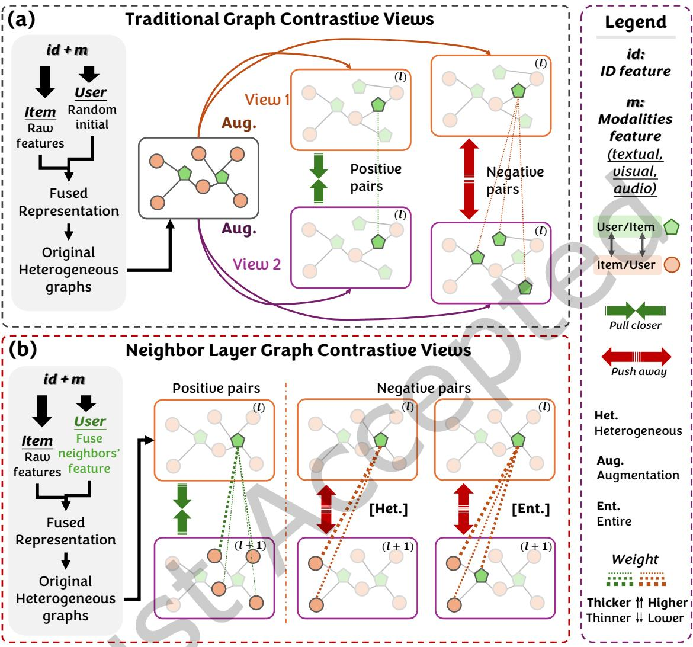  
Fig. 1. Overview of contrastive learning. Top: traditional contrastive learning paradigm; Bottom: our NLGCL+.

The symmetrically normalized matrix is $\tilde{A} = D^{-\frac{1}{2}}AD^{-\frac{1}{2}}$ , where D represents a diagonal degree matrix. Notably, we only consider four types of modalities in this paper, including behavior, textual, visual, and audio modalities $^{2}$ . However, we note it can be extended to more modalities easily.

3.1.2 GNNs for Recommendation. GNNs update node representation through aggregating messages from their neighbors. The core of the graph-based CF paradigm consists of two steps: S1: message propagation and S2: node representation aggregation. Thus, message propagation for the user/item node can be formulated as: $\mathbf{e}_{u}^{m/id}(l) = \operatorname{Aggr}^{(l)}(\{\mathbf{e}_{i}^{m/id}(l-1) : i \in \mathcal{N}_{u}\})$ and $\mathbf{e}_{i}^{m/id}(l) = \operatorname{Aggr}^{(l)}(\{\mathbf{e}_{u}^{m/id}(l-1) : u \in \mathcal{N}_{i}\})$ , where

$N_{u}$ and $N_{i}$ denote the neighborhood set of nodes u and i, respectively, and l denotes the l-th layer of GNNs. Then, the final user/item embeddings can be formulated as: $\bar{\mathbf{E}}_{u}^{m/id} = \text{Readout}([ \mathbf{E}_{u}^{m/id}(0), \mathbf{E}_{u}^{m/id}(1), ..., \mathbf{E}_{u}^{m/id}(L)])$ and $\bar{\mathbf{E}}_{i} = \text{Readout}([ \mathbf{E}_{i}^{m/id}(0), \mathbf{E}_{i}^{m/id}(1), ..., \mathbf{E}_{i}^{m/id}(L)])$ , where the Readout(·) function can be any differentiable function, and L is the layer number of GNN. In the recommendation scenario, LightGCN [13] is currently the most popular GNN backbone, which effectively captures high-order information through neighborhood aggregation.

For efficient training and to ensure that diverse neighborhood information is integrated, final embeddings are aggregated from all layers. Since $\tilde{\mathcal{A}}\in\mathbb{R}^{(|\mathcal{U}|+|\mathcal{I}|)\times(|\mathcal{U}|+|\mathcal{I}|)}$ is defined over the full user-item bipartite graph, we first construct the combined initial embedding matrix for each modality $m$ (or behavior modality $id$ ):

$$
\mathbf {E} ^ {m / i d} (0) = \left[ \begin{array}{c} \mathbf {E} _ {u} ^ {m / i d} (0) \\ \mathbf {E} _ {i} ^ {m / i d} (0) \end{array} \right] \in \mathbb {R} ^ {(| \mathcal {U} | + | \mathcal {I} |) \times d _ {m}},\tag{2}
$$

where $\mathbf{E}_{u}^{m/id}(0)\in\mathbb{R}^{|U|\times d_{m}}$ and $\mathbf{E}_{i}^{m/id}(0)\in\mathbb{R}^{|I|\times d_{m}}$ denote the initial user and item embeddings for the corresponding modality, respectively. Multi-layer propagation is then performed on this combined matrix:

$$
\mathbf {E} ^ {m / i d} (l) = \tilde {\mathcal {A}} \mathbf {E} ^ {m / i d} (l - 1), \quad l = 1, \ldots , L.\tag{3}
$$

The final combined representation is obtained by averaging across all layers:

$$
\bar {\mathbf {E}} ^ {m / i d} = \frac {1}{L + 1} \sum_ {l = 0} ^ {L} \mathbf {E} ^ {m / i d} (l) = \frac {1}{L + 1} \sum_ {l = 0} ^ {L} \tilde {\mathcal {A}} ^ {l} \mathbf {E} ^ {m / i d} (0).\tag{4}
$$

The final user and item embeddings for each modality are then obtained by partitioning $\bar{\mathbf{E}}^{m / id}$ along the node dimension:

$$
\bar {\mathbf {E}} _ {u} ^ {m / i d} = \bar {\mathbf {E}} ^ {m / i d} \left[ 1: | \mathcal {U} |,: \right], \quad \bar {\mathbf {E}} _ {i} ^ {m / i d} = \bar {\mathbf {E}} ^ {m / i d} \left[ | \mathcal {U} | + 1: | \mathcal {U} | + | \mathcal {I} |,: \right],\tag{5}
$$

where $\bar{E}_{u}^{m/id}$ and $\bar{E}_{i}^{m/id}$ denote the final user and item embeddings for each modality, respectively.

A common practice in multimodal recommendation is to integrate the final embeddings of all modalities into consolidated representations before the loss function is computed. Formally: $\bar{\mathbf{E}}_{u} = \text{Fusion}(\bar{\mathbf{E}}_{u}^{m/id}| m \in \mathcal{M})$ and $\bar{\mathbf{E}}_{i} = \text{Fusion}(\bar{\mathbf{E}}_{i}^{m/id}| m \in \mathcal{M})$ , represents the modality fusion function, a component for which existing works employ distinct mechanisms [5, 42, 44, 54]. Subsequently, we derive scores for all unobserved user-item pairs using the inner product of the final embeddings of the user and item, denoted as $y_{u,i} = (\bar{\mathbf{e}}_{u})^{\top} \bar{\mathbf{e}}_{i}$ , where $\bar{\mathbf{e}}_{u}$ and $\bar{\mathbf{e}}_{i}$ represent the final representations of user u and item i, respectively. The items with the top-N highest score are recommended to the user.

To provide effective item recommendations from user-item interactions, a typical training objective is the pair-wise loss function. We take the most widely adopted BPR [23] loss as an example:

$$
\mathcal {L} _ {b p r} = \sum_ {(u, p, n) \in \mathcal {O}} - \ln \sigma (y _ {u, p} - y _ {u, n}),\tag{6}
$$

where $O = \{(u, p, n) \mid (u, p) \in \mathcal{R}^{+}, (u, n) \in \mathcal{R}^{-}\}$ denotes the pair-wise training data, $\sigma(\cdot)$ denotes sigmoid function. Essentially, BPR aims to widen the predicted preference margin between the positive item p and negative item n for user u.

3.1.3 GCL-based Recommendation. Recent studies $[2, 30, 43, 45, 46]$ have demonstrated that GCL, through the generation of self-supervised signals, effectively mitigates the challenge of the data sparsity problem in recommender systems. GCL-based methods construct contrastive views with graph structure through various data augmentation strategies and optimize the mutual information between contrastive views, thereby obtaining

NLGCL+: Naturally Existing Neighbour Layers Graph Contrastive Learning with Adaptive Sample Weighting for Multimodal Recommendation • 7

Table 1. Key notations used in this paper.

<table><tr><td>Notation</td><td>Description</td></tr><tr><td> $\mathcal{I},\mathcal{U}$ </td><td>Item and User sets.</td></tr><tr><td> $\mathcal{M}=\{t,v,a\},id$ </td><td>Explicit modalities (textual, visual, and audio) and behavior modality.</td></tr><tr><td> $\mathcal{G}$ </td><td>Heterogeneous graph based on user-item interactions.</td></tr><tr><td> $\mathbf{E}_{i}^{m},\mathbf{E}_{i}^{id}$ </td><td>Representations for entire item set with explicit modality m and behavior modality id.</td></tr><tr><td> $\mathbf{E}_{u}^{m},\mathbf{E}_{u}^{id}$ </td><td>Representations for entire userset with explicit modality m and behavior modality id.</td></tr><tr><td> $\mathbf{x}_{i}^{m},\mathbf{x}_{u}^{m}$ </td><td>Raw features for item i and user u with modality m.</td></tr><tr><td> $\mathbf{e}_{i}^{m},\mathbf{e}_{i}^{id}$ </td><td>Representations for item i with explicit modality m and behavior modality id.</td></tr><tr><td> $\mathbf{e}_{u}^{m},\mathbf{e}_{u}^{id}$ </td><td>Representations for user u with explicit modality m and behavior modality id.</td></tr><tr><td> $\mathcal{W}$ </td><td>Similarity matrix.</td></tr><tr><td> $\mathcal{L}_{nl_{u}}$ </td><td>User-side neighbor layer GCL loss.</td></tr><tr><td> $\mathcal{L}_{nl_{i}}$ </td><td>Item-side neighbor layer GCL loss.</td></tr><tr><td> $\mathcal{L}_{nl}$ </td><td>Neighbor layer GCL loss.</td></tr><tr><td> $\mathcal{L}_{ori}$ </td><td>Original recommendation task loss.</td></tr><tr><td> $\mathcal{L}$ </td><td>Final loss.</td></tr></table>

self-supervised signals. By maximizing the consistency among positive samples and minimizing the consistency among negative samples, most of the existing GCL methods mainly adopt InfoNCE [19] for optimization:

$$
\mathcal {L} _ {G C L} = - \sum_ {u \in \mathcal {U}} \log \frac {\exp (\hat {\mathbf {e}} _ {u} ^ {\top} \tilde {\mathbf {e}} _ {u} / \tau)}{\sum_ {v \in \mathcal {U}} \exp (\hat {\mathbf {e}} _ {u} ^ {\top} \tilde {\mathbf {e}} _ {v} / \tau)} - \sum_ {i \in \mathcal {I}} \log \frac {\exp (\hat {\mathbf {e}} _ {i} ^ {\top} \tilde {\mathbf {e}} _ {i} / \tau)}{\sum_ {j \in \mathcal {I}} \exp (\hat {\mathbf {e}} _ {i} ^ {\top} \tilde {\mathbf {e}} _ {j} / \tau)},\tag{7}
$$

where $\hat{e}_{u}/\hat{e}_{i}$ and $\tilde{e}_{u}/\tilde{e}_{i}$ represent representation of item/user in different contrastive views. $\tau$ denotes the temperature hyper-parameter. However, existing GCL-based methods inevitably require the construction of multiple views, which imposes significant computational overheads.

Most notations used in this paper are summarized in Table 1.

Our NLGCL+ is model-agnostic and can be easily integrated into all existing multimodal recommendation models. To ensure efficiency, we deploy contrastive learning on the fused final representations, which enhances generalizability across different models and eliminates the influence of varying modality aggregation strategies. Therefore, we only adopt fused final representations $\bar{E}_{u}$ and $\bar{E}_{i}$ for user and item, respectively.

## 3.2 Naturally Existing Contrastive Views within GNNs

We point out that heterogeneous nodes in neighbor layers constitute contrastive views (e.g., $(\mathbf{E}_{u}(0); \mathbf{E}_{i}(1))$ and $(\mathbf{E}_{i}(0); \mathbf{E}_{u}(1))$ ). To substantiate this, we first formulate the message-passing in GNNs:

$$
\mathbf {e} _ {u} (l) = \sum_ {\tilde {i} \in \mathcal {N} _ {u}} \frac {\mathbf {e} _ {\tilde {i}} (l - 1)}{\sqrt {| \mathcal {N} _ {u} | | \mathcal {N} _ {\tilde {i}} |}}, \quad \mathbf {e} _ {i} (l) = \sum_ {\tilde {u} \in \mathcal {N} _ {i}} \frac {\mathbf {e} _ {\tilde {u}} (l - 1)}{\sqrt {| \mathcal {N} _ {i} | | \mathcal {N} _ {\tilde {u}} |}},\tag{8}
$$

where $N_{u}$ and $N_{i}$ denote neighbor sets for user u and item i, respectively. $N_{\tilde{i}}$ and $N_{\tilde{u}}$ denote neighbor sets for item $\tilde{i} \in N_{u}$ and user $\tilde{u} \in N_{i}$ , respectively. Note that all users in $N_{\tilde{i}}$ have the same interacted item $\tilde{i}$ with user u

ACM Trans. Recomm. Syst.

and all items in $N_{\tilde{u}}$ have the same interacted user $\tilde{u}$ with item i. Then we rewrite the message-passing in GNNs:

$$
\mathbf {e} _ {\tilde {i}} (l) = \sum_ {\hat {u} \in \mathcal {N} _ {\tilde {i}}} \frac {\mathbf {e} _ {\hat {u}} (l - 1)}{\sqrt {| \mathcal {N} _ {\tilde {i}} |   | \mathcal {N} _ {\hat {u}} |}}, \quad \mathbf {e} _ {\tilde {u}} (l) = \sum_ {\hat {i} \in \mathcal {N} _ {\tilde {u}}} \frac {\mathbf {e} _ {\hat {i}} (l - 1)}{\sqrt {| \mathcal {N} _ {\tilde {u}} |   | \mathcal {N} _ {\hat {i}} |}}.\tag{9}
$$

Since item $\tilde{i} \in \mathcal{N}_u$ and user $\tilde{u} \in \mathcal{N}_i$ , user $u$ and $i$ are involved in $\mathcal{N}_{\tilde{i}}$ and $\mathcal{N}_{\tilde{u}}$ , respectively. By associating Eq. 8 and Eq. 9, we know that representation $\mathbf{e}_{\tilde{i}}(l)$ of item $\tilde{i}$ in (l)-th layer can be regarded as a weighted aggregation of the representation $\mathbf{e}_u(l-1)$ of user $u$ in (l-1)-th layer and the representation $\mathbf{e}_{\tilde{u}}(l-1)$ of other users $\hat{u} \in \mathcal{N}_{\tilde{i}}$ in (l-1)-th layer who interact with item $\tilde{i}$ . In contrast, representation $\mathbf{e}_{\tilde{u}}^{(l)}$ of user $\tilde{u}$ in (l)-th layer can be regarded as an equal-weighted aggregation of the representation $\mathbf{e}_i(l-1)$ of item $i$ in (l-1)-th layer and the representation $\mathbf{e}_{\tilde{i}}(l-1)$ of other items $\hat{i} \in \mathcal{N}_{\tilde{u}}$ in (l-1)-th layer who interact with user $\tilde{u}$ . Users with similar preferences generally share a part of semantics, aligning with the GNN's goal to enhance representations by aggregating neighbor nodes. Thus the representations $\mathbf{e}_u(l-1)$ and $\mathbf{e}_i(l-1)$ of user $u$ and item $i$ in (l-1)-th layer form positive pairs with the representations $\mathbf{e}_{\tilde{i}}(l)$ and $\mathbf{e}_{\tilde{u}}(l)$ of their neighbor nodes items $\tilde{i} \in \mathcal{N}_u$ and users $\tilde{u} \in \mathcal{N}_i$ in (l)-th layer, respectively. Thus, we find that heterogeneous nodes in neighbor layers naturally constitute contrastive views. For each (l-1)-th layer user $u$ , the items $\tilde{i} \in \mathcal{N}_u$ in (l)-th layer that interact with it are treated as positive samples, and the other items $\hat{i} \in (\mathcal{I} \setminus \mathcal{N}_u)$ in (l)-th layer that without interact with it are treated as negative samples. Similar tendencies are presented for items. For a clearer understanding, we present the naturally existing contrastive views between neighbor layers in Figure 1(b).

We introduce two scopes of contrastive views: (a) heterogeneous and (b) entire. In the heterogeneous scope, all item embeddings in layer $(l-1)$ and all user embeddings in layer l form one pair of naturally contrastive views; conversely, all user embeddings in layer $(l-1)$ and all item embeddings in layer l form another pair. In the entire scope, we consider all embeddings in layer $(l-1)$ and all embeddings in layer l as naturally contrastive views. Next, we define the positive and negative pairs within these contrastive views.

3.2.1 Positive Pairs. Two scopes have the same positive pairs. Given a user $u$ , the neighbor set for $u$ is $\mathcal{N}_u$ . For user $u$ , the (l)-th layer embeddings of $u$ 's neighbors construct the positive pairs with the (l-1)-th layer embedding $\mathbf{e}_u(l - 1)$ of user $u$ . Specifically, $\mathbf{e}_u(l - 1)$ constructs positive pairs with $\mathbf{e}_{\tilde{i}}^{(l)}$ , where $\tilde{i} \in \mathcal{N}_u$ . The reason for this because $\mathbf{e}_{\tilde{i}}(l)$ are weighted aggregated by $\mathbf{e}_{\tilde{u}}(l - 1)$ , where $\bar{u} \in \mathcal{N}_{\tilde{i}}$ (as Eq. 9). Similar positive pairs are defined for item $i$ .

3.2.2 Negative Pairs. In the heterogeneous scope, the $(l)$ -th layer embeddings of all items, excluding items $\tilde{i}$ , construct negative pairs with the $(l-1)$ -th layer embedding $\mathbf{e}_{u}(l-1)$ of user u, where $\tilde{i} \in N_{u}$ . Similar negative pairs are defined for item i. In the entire scope, the $(l)$ -th layer embeddings of all users additionally construct negative pairs with the $(l-1)$ -th layer embedding $\mathbf{e}_{u}(l-1)$ of user u, while still maintains all negative pairs in the heterogeneous scope. Similar negative pairs are defined for item i. We categorize the positive and negative pairs in Table 2.

Table 2. Positive and Negative pairs in Contrastive Views.

<table><tr><td>Node</td><td>Scope</td><td>Positive Pairs</td><td>Negative Pairs</td></tr><tr><td>u:  $\mathbf{e}_{u}^{m/id}(l-1)$ </td><td>Heterogeneous</td><td> $\mathbf{e}_{\tilde{i}}^{m/id}(l)|\tilde{i} \in \mathcal{N}_{u}$ </td><td> $\mathbf{e}_{\hat{i}}^{m/id}(l)|\hat{i} \notin \mathcal{N}_{u}$ </td></tr><tr><td>u:  $\mathbf{e}_{u}^{m/id}(l-1)$ </td><td>Entire</td><td> $\mathbf{e}_{\tilde{i}}^{m/id}(l)|\tilde{i} \in \mathcal{N}_{u}$ </td><td> $\mathbf{e}_{\hat{i}}^{m/id}(l) \cup \mathbf{e}_{u}^{m/id}(l)|\hat{i} \notin \mathcal{N}_{u}, u \in \mathcal{U}$ </td></tr><tr><td>i:  $\mathbf{e}_{i}^{m/id}(l-1)$ </td><td>Heterogeneous</td><td> $\mathbf{e}_{\tilde{u}}^{m/id}(l)|\tilde{u} \in \mathcal{N}_{i}$ </td><td> $\mathbf{e}_{\hat{u}}^{m/id}(l)|\hat{u} \notin \mathcal{N}_{i}$ </td></tr><tr><td>i:  $\mathbf{e}_{i}^{m/id}(l-1)$ </td><td>Entire</td><td> $\mathbf{e}_{\tilde{u}}^{m/id}(l)|\tilde{u} \in \mathcal{N}_{i}$ </td><td> $\mathbf{e}_{\hat{u}}^{m/id}(l) \cup \mathbf{e}_{i}^{m/id}(l)|\hat{u} \notin \mathcal{N}_{i}, i \in \mathcal{I}$ </td></tr></table>

Analysis. Unlike traditional GCL, in our contrastive views, each node is associated with multiple positive samples, and the noise among these positive samples consists of other nodes with similar semantic. This not only strengthens the alignment effect of positive samples in self-supervised learning, but also mitigates the negative impacts of random noise. Furthermore, it compensates for the drawbacks of traditional GCL, which arbitrarily defines semantically similar nodes as negative samples. For both two scopes, the selection of positive samples is the same. However, the entire scope offers a broader range of negative samples. Although expanding the scope of negative samples can enhance the learning of positive sample features, it may negatively impact the semantic alignment between items and users and require additional computational costs. We provide empirical validation of the effectiveness and efficiency in Section 5.2 and Section 5.4. Moreover, due to the characteristics of having multiple positive samples, treating each sample equally becomes suboptimal. Therefore, it is necessary to dynamically assign weights to each sample. Interestingly, in multimodal recommendation settings, multimodal information can effectively and adaptively guide the weighting of samples.

## 3.3 Adaptive Sample Weighting via Multimodal Information

Traditional GCL considers a node and its counterpart in another view as positive pairs, while treating the node and all other nodes in different views as negative pairs. However, having a small number of positive pairs and arbitrarily defined negative pairs can irrationally push nodes with similar semantics farther away. In contrast, our tailored GCL method assigns each node a set of positive pairs, enhancing alignment and reducing the impact of random noise. In an L-layer GNN, up to L groups of contrastive views can be constructed, but this incurs additional computational overhead. Let G denote the number of contrastive view groups, where $G \leq L$ . Selecting these G groups is crucial, and we theoretically prove in Theorem 1 (Proofs are detailed in Section 4.1) that the first G groups are optimal.

THEOREM 1. In GNNs, contrastive views that naturally exist between layer $(l)$ and layer $(l + 1)$ are more effective for contrastive learning when $(l)$ is smaller.

Moreover, previous work [7] has discussed that treating all negative samples with equal weight often leads to suboptimal performance. In our multi-positive sample situation, treating all positive samples equally also results in suboptimal performance. Fortunately, multimodal information can effectively guide the distribution of weights among samples. To this end, we propose adaptive sample weighting via multimodal information. Many previous studies [32, 35, 54] have shown that using dynamically learned multimodal representations during the training phase to provide multimodal signals often introduces significant noise and bias [32, 54], which may lead the model to fall into local optima and ultimately degrade its performance [35]. The raw features of multimodal information inherently possess stable quality, remain unchanged during training, and exist within the same feature space [40]. This stability facilitates adaptive weight assignment while allowing pre-computation of sample weights before training, thereby reducing computational overhead during the training process. Consequently, we utilize raw features to compute sample weights. Specifically, For each item $i$ , we directly use its raw features $\{\mathbf{x}_i^m | \mathbf{x}_i^t, \mathbf{x}_i^v, \mathbf{x}_i^a\}$ . For each user $u$ , we construct raw features by simply aggregating the mean of the raw features of the items they have interacted with. Formally:

$$
\mathbf {x} _ {u} ^ {m} = \frac {\sum_ {\tilde {i} \in \mathcal {N} (u)} \mathbf {x} _ {\tilde {i}} ^ {m}}{| \mathcal {N} (u) |}.\tag{10}
$$

While mean-pooling over interacted items is a simple and widely adopted strategy for constructing raw multimodal features for users $[40, 44]$ , we acknowledge its practical limitations. For users with very few observed interactions, the averaged representation can be noisy due to the limited number of items involved. Nevertheless, this limitation is partly addressed by the common practice of employing a 5-core setting in recommendation systems, which filters out users with fewer than five interactions. Moreover, it is essential to ensure that this aggregation is performed exclusively over training-set interactions. In our implementation, the similarity matrix W is pre-computed strictly from the training dataset before model training begins, with no involvement of validation or test sets, thereby avoiding any risk of information leakage.

We precompute a similarity matrix as the weight between two nodes before model training. Since we consider both heterogeneous and entire scopes, we construct a similarity matrix $\mathcal{W} \in \mathbb{R}^{(|\mathcal{U}| + |\mathcal{I}|) \times (|\mathcal{U}| + |\mathcal{I}|)}$ . For the actual implementation under the heterogeneous scope, we can simply build a similarity matrix W with the shape $R^{|\mathcal{U}| \times |I|}$ . This similarity matrix is constructed prior to model training and thus introduces no computational overhead during the training phase. $W_{j,k}$ denotes the similarity between node j and node k. Specifically, $W_{j,k}$ is calculated via cosine similarity:

$$
\mathcal {W} _ {j, k} = \sum_ {m} ^ {\mathcal {M}} \frac {(\mathbf {x} _ {j} ^ {m}) ^ {\top} \mathbf {x} _ {k} ^ {m}}{\| \mathbf {x} _ {j} ^ {m} \| \| \mathbf {x} _ {k} ^ {m} \|},\tag{11}
$$

where j and k can represent either user or item nodes for different scopes.

Efficiency: The similarity matrix W is pre-computed from multimodal raw features, incurring no additional computational cost during training. The complexity of this one-time pre-computation is $O(|\mathcal{M}||\mathcal{V}|^{2}d_{m})$ for the entire scope and $O(|\mathcal{M}||\mathcal{U}||\mathcal{I}|d_{m})$ for the heterogeneous scope, respectively. We report the time required for pre-constructing similarity matrix W on different datasets in Section 5.4.

3.3.1 Heterogeneous Scope. For the heterogeneous scope, our neighbor layer GCL loss can be formulated as:

$$
\mathcal {L} _ {n l _ {u}} = - \frac {1}{G | \boldsymbol {\mathcal {U}} |} \sum_ {g = 0} ^ {G - 1} \sum_ {u \in \boldsymbol {\mathcal {U}}} \frac {1}{| \mathcal {N} _ {u} |} \log \frac {\prod_ {i ^ {+} \in \mathcal {N} _ {u}} \exp (\mathcal {W} _ {u , i ^ {+}} (\mathbf {e} _ {u} ^ {(g) ^ {\top}} \mathbf {e} _ {i ^ {+}} ^ {(g + 1)}) / \tau)}{\sum_ {\hat {i} \in \mathcal {I}} \exp (\mathcal {W} _ {u , \hat {i}} (\mathbf {e} _ {u} ^ {(g) ^ {\top}} \mathbf {e} _ {\hat {i}} ^ {(g + 1)}) / \tau)},\tag{12}
$$

$$
\mathcal {L} _ {n l _ {i}} = - \frac {1}{G | \mathcal {I} |} \sum_ {g = 0} ^ {G - 1} \sum_ {i \in \mathcal {I}} \frac {1}{| \mathcal {N} _ {i} |} \log \frac {\prod_ {u ^ {+} \in \mathcal {N} _ {i}} \exp (\mathcal {W} _ {i , u ^ {+}} (\mathbf {e} _ {i} ^ {(g) ^ {\top}} \mathbf {e} _ {u ^ {+}} ^ {(g + 1)}) / \tau)}{\sum_ {\hat {u} \in \mathcal {U}} \exp (\mathcal {W} _ {i , \hat {u}} (\mathbf {e} _ {i} ^ {(g) ^ {\top}} \mathbf {e} _ {\hat {u}} ^ {(g + 1)}) / \tau)},\tag{13}
$$

where positive samples $i^{+}/u^{+}$ refer to all neighbors of each u/i, while negative samples $\hat{i}/\hat{u}$ are drawn from the entire set of I or U. We compute the average over the first G layers for all users/items. The incorporation of the similarity matrix W introduces multimodal information-guided adaptive sample weighting for both positive and negative samples, enabling more fine-grained representation learning.

3.3.2 Entire Scope. For the entire scope, our neighbor layer GCL loss can be formulated as:

$$
\mathcal {L} _ {n l _ {u}} = - \frac {1}{G | \mathcal {U} |} \sum_ {g = 0} ^ {G - 1} \sum_ {u \in \mathcal {U}} \frac {1}{| \mathcal {N} _ {u} |} \log \frac {\prod_ {i ^ {+} \in \mathcal {N} _ {u}} \exp (\mathcal {W} _ {u , i ^ {+}} (\mathbf {e} _ {u} ^ {(g) ^ {\top}} \mathbf {e} _ {i ^ {+}} ^ {(g + 1)}) / \tau)}{\sum_ {\hat {x} \in \mathcal {V}} \exp (\mathcal {W} _ {u , \hat {x}} (\mathbf {e} _ {u} ^ {(g) ^ {\top}} \mathbf {e} _ {\hat {x}} ^ {(g + 1)}) / \tau)},\tag{14}
$$

$$
\mathcal {L} _ {n l _ {i}} = - \frac {1}{G | \mathcal {I} |} \sum_ {g = 0} ^ {G - 1} \sum_ {i \in \mathcal {I}} \frac {1}{| \mathcal {N} _ {i} |} \log \frac {\prod_ {u ^ {+} \in \mathcal {N} _ {i}} \exp (\mathcal {W} _ {i , u ^ {+}} (\mathbf {e} _ {i} ^ {(g) ^ {\top}} \mathbf {e} _ {u ^ {+}} ^ {(g + 1)}) / \tau)}{\sum_ {\hat {x} \in \mathcal {V}} \exp (\mathcal {W} _ {i , \hat {x}} (\mathbf {e} _ {i} ^ {(g) ^ {\top}} \mathbf {e} _ {\hat {x}} ^ {(g + 1)}) / \tau)},\tag{15}
$$

where positive samples $i^{+}/u^{+}$ refer to all neighbors of each u/i, while negative samples $\hat{x}$ are drawn from the entire set $V = I \cup U$ . We compute the average over the first G layers for all users/items. The incorporation of the similarity matrix W introduces multimodal information-guided adaptive sample weighting for both positive and negative samples, enabling more fine-grained representation learning.

NLGCL+: Naturally Existing Neighbour Layers Graph Contrastive Learning with Adaptive Sample Weighting for Multimodal Recommendation • 11

For any scope, we get the final loss $L_{nl}$ by summing both user-side loss $L_{nl_{u}}$ and item-side loss $L_{nl_{i}}$ , formally: $L_{nl} = L_{nl_{u}} + L_{nl_{i}}$ .

Efficiency: Although our NLGCL+ introduces a computational complexity proportional to G, the cost of constructing contrastive views in traditional GCL is significantly higher than the cost of computing the GCL loss itself. By leveraging the naturally existing contrastive views within GNNs, our NLGCL+ eliminates the substantial overhead of view construction. The similarity matrix W is computed prior to training, introducing no additional computational overhead during the training phase. This further ensures the efficiency advantage of NLGCL+. Detailed analysis of time efficiency is provided in Section 4.2 and Section 5.4.

## 3.4 Model Optimization

To extract the representations of all nodes for NLGCL+, we use a multi-task training strategy to jointly optimize the multimodal recommendation task with our neighbor layer contrastive learning task, formally:

$$
\mathcal {L} = \mathcal {L} _ {o r i} + \lambda \mathcal {L} _ {n l},\tag{16}
$$

where $\lambda$ is balancing hyper-parameter that control the weight of contrastive learning, $\mathcal{L}_{ori}$ denotes the original loss for various models.

## 4 Analysis

## 4.1 Proof of Theorem 1

Formal Restatement: In GNNs, the effectiveness of naturally existing contrastive views between adjacent layers $l - 1$ and $l$ diminishes as the layer index $l$ increases. Specifically, let the information gain $\mathbf{I}(\mathbf{E}^{(l - 1)};\mathbf{E}^{(l)})$ denote the mutual information between embeddings of adjacent layers. This information gain then monotonically decreases as $l$ increases.

Notation: (Mutual Information) Define mutual information between adjacent layers as:

$$
\mathbf {I} (\mathbf {E} ^ {(l - 1)}; \mathbf {E} ^ {(l)}) = \mathbf {H} (\mathbf {E} ^ {(l - 1)}) - \mathbf {H} (\mathbf {E} ^ {(l - 1)} | \mathbf {E} ^ {(l)}),\tag{17}
$$

where $\mathbf{H}(\cdot)$ denotes the entropy function.

(Spectral Decomposition) Let $\tilde{A} = U\Lambda U^{\top}$ be the eigendecomposition of $\tilde{A}$ where $\Lambda = \text{diag}(\lambda_{1}, \ldots, \lambda_{n})$ and $\lambda_{1} \geq \lambda_{2} \geq \cdots \geq \lambda_{n}$

LEMMA 1. (Entropy Reduction via Low-Pass Filtering). For any layer l, the entropy of embeddings satisfies:

$$
\mathbf {H} (\mathbf {E} ^ {(l)}) \leq \mathbf {H} (\mathbf {E} ^ {(l - 1)})
$$

Proof: Propagation process $\mathbf{E}^{(l)} = \tilde{\mathcal{A}}\mathbf{E}^{(l-1)}$ acts as a low-pass filter in the spectral domain. Specifically, the frequency response at the k-th eigencomponent is attenuated by $\lambda_{k}^{l}$ . Since $\lambda_{k} \leq 1$ for all k, higher-frequency components (associated with $\lambda_{k} < 1$ ) are suppressed exponentially with l, reducing the variance of $\mathbf{E}^{(l)}$ . From the entropy-power inequality [8]:

$$
\begin{array}{r l} & {\mathbf {H} (\mathbf {E} ^ {(l)}) = \frac {1}{2} \log ((2 \pi e) ^ {d} | \Sigma^ {(l)} |)} \\ & {\qquad \leq \frac {1}{2} \log ((2 \pi e) ^ {d} | \Sigma^ {(l - 1)} |) = \mathbf {H} (\mathbf {E} ^ {(l - 1)}),} \end{array}\tag{18}
$$

where $|\Sigma^{(l)}|$ is the determinant of the covariance matrix, and d is the embedding dimension.

COROLLARY 1. (Exponential Mutual Information Decay). The mutual information between adjacent layers decays as:

$$
\mathbf {I} (\mathbf {E} ^ {(l - 1)}; \mathbf {E} ^ {(l)}) \propto \lambda_ {\mathrm{max}} ^ {2 l},
$$

ACM Trans. Recomm. Syst.

where $\lambda_{\mathrm{max}} = \mathrm{max}_k|\lambda_k| < 1$ .

Proof: From Lemma 1, $\mathbf{H}(\mathbf{E}^{(l)})$ decreases monotonically. For a Gaussian embedding distribution, mutual information simplifies to:

$$
\mathbf {I} (\mathbf {E} ^ {(l - 1)}; \mathbf {E} ^ {(l)}) = \frac {1}{2} \log (\frac {| \Sigma^ {(l - 1)} |}{| \Sigma^ {(l)} |}).\tag{19}
$$

Substituting $\Sigma^{(l)} = \tilde{\mathcal{A}}^2\Sigma^{(l - 1)}$ (from $\mathbf{E}^{(l)} = \tilde{\mathcal{A}}\mathbf{E}^{(l - 1)}$ ), we derive:

$$
| \Sigma^ {(l)} | = | \tilde {\mathcal {A}} ^ {2} | | \Sigma^ {(l - 1)} | = \prod_ {k = 1} ^ {n} \lambda_ {k} ^ {2} \cdot | \Sigma^ {(l - 1)} |.\tag{20}
$$

Thus:

$$
\mathbf {I} (\mathbf {E} ^ {(l - 1)}; \mathbf {E} ^ {(l)}) = \frac {1}{2} \log (\prod_ {k = 1} ^ {n} \lambda_ {k} ^ {- 2}) = - \sum_ {k = 1} ^ {n} \log \lambda_ {k}.\tag{21}
$$

For dominant eigenvalues $\lambda_{max}$ , this decays as $O(\lambda_{\max}^{2l})$ . Therefore, contrastive views constructed from lower layers (l = 1) maximize the signal-to-noise ratio (SNR) for contrastive learning, as they preserve higher mutual information. The SNR of contrastive pairs is proportional to $\mathbf{I}(\mathbf{E}^{(l-1)};\mathbf{E}^{(l)})$ . From Corollary 1, SNR decays exponentially with l, making lower layers preferable.

## 4.2 Efficiency Analysis of NLGCL+

We analyze the complexity of NLGCL+ and compare it with SGL, NCL, SimGCL, LightGCL, DCCF, and BIGCF. The discussion is within a single batch since the in-batch negative sampling is a widely used trick in GCL [4].

Table 3. Comparison of time complexity. NLGCL+(H) and NLGCL+(E) denote heterogeneous and entire scopes of our NLGCL+, respectively.

<table><tr><td></td><td>Encoder</td><td>BPR Loss</td><td>CL Loss</td></tr><tr><td>SGL</td><td> $O(2(1 + 2\hat{\rho})|\mathcal{E}|Ld)$ </td><td> $O(2dB)$ </td><td> $O(2MdB)$ </td></tr><tr><td>NCL</td><td> $O(2(|\mathcal{E}|+K)Ld)$ </td><td> $O(2dB)$ </td><td> $O(4MdB)$ </td></tr><tr><td>SimGCL</td><td> $O(6|\mathcal{E}|Ld)$ </td><td> $O(2dB)$ </td><td> $O(2MdB)$ </td></tr><tr><td>LightGCL</td><td> $O(2(|\mathcal{E}|+q|\mathcal{V}|)Ld)$ </td><td> $O(2dB)$ </td><td> $O(2MdB)$ </td></tr><tr><td>DCCF</td><td> $O(2(|\mathcal{E}|+|\mathcal{K}||\mathcal{V}|)Ld)$ </td><td> $O(2dB)$ </td><td> $O(6MdB)$ </td></tr><tr><td>BIGCF</td><td> $O(2(|\mathcal{E}|Ld+|\mathcal{K}||\mathcal{V}|d))$ </td><td> $O(2dB)$ </td><td> $O(6MdB)$ </td></tr><tr><td>NLGCL+(H)</td><td> $O(2|\mathcal{E}|Ld)$ </td><td> $O(2dB)$ </td><td> $O(2GMdB)$ </td></tr><tr><td>NLGCL+(E)</td><td> $O(2|\mathcal{E}|Ld)$ </td><td> $O(2dB)$ </td><td> $O(4GMdB)$ </td></tr></table>

As Table 3 shows, we divide computational complexity into three major components: Encoder, BPR Loss, and CL Loss. Here, $|\mathcal{E}|$ is the number of edges in graph $\mathcal{G}$ , $M$ represents the node number in a batch, $L$ is layer number, and $d$ is the dimension of embeddings. $\hat{\rho}$ is the edge keep probability of SGL. $K$ is the number of cluster in NCL. $q$ is the required rank for SVD in LightGCL. $|\mathcal{K}|$ denotes the collective intent number for all user and item nodes. For our NLGCL+, $G$ is the number of groups of contrastive views. NLGCL+(E) requires double samples compared to NLGCL+(H) in CL loss. In Section 5.2 and Section 5.4, we empirically verify that NLGCL+(H) achieves superior results than NLGCL+(E) in terms of both effectiveness and efficiency. Since NLGCL+(H) does not construct additional contrast views through data augmentation, there is no additional cost to Encoder. For GCL Loss, it requires $G$ times computational cost than other GCL-based models due to the multiple groups of natural contrast views.

ACM Trans. Recomm. Syst.

NLGCL+: Naturally Existing Neighbour Layers Graph Contrastive Learning with Adaptive Sample Weighting for Multimodal Recommendation • 13

## 4.3 Memory Analysis of NLGCL+

We analyze the memory footprint of NLGCL+ and compare it with LightGCN, SGL, NCL, SimGCL, LightGCL, DCCF, and BIGCF. As Table 4 shows, we divide memory footprint into three major components: Adjacency Matrix, Embedding, and GCN. All previous CL-based models require more memory footprint to store the graph structure of contrastive views (SGL) and perturbed embedding (SimGCL and LightGCL). Our NLGCL+ can completely remove the huge memory cost of constructing and storing contrastive views.

Table 4. Comparison of memory footprint. NLGCL+(H) and NLGCL+(E) denote heterogeneous and entire scopes of our NLGCL+, respectively.

<table><tr><td></td><td>Adjacency Matrix</td><td>Embedding</td><td>GCN</td></tr><tr><td>SGL</td><td> $O(3|\mathcal{E}|)$ </td><td> $O(3|\mathcal{V}|d)$ </td><td> $O(3Ld^{2})$ </td></tr><tr><td>NCL</td><td> $O(3|\mathcal{E}|)$ </td><td> $O(3|\mathcal{V}|d)$ </td><td> $O(3Ld^{2})$ </td></tr><tr><td>SimGCL</td><td> $O(|\mathcal{E}|)$ </td><td> $O(3|\mathcal{V}|d)$ </td><td> $O(3Ld^{2})$ </td></tr><tr><td>LightGCL</td><td> $O(|\mathcal{E}|)$ </td><td> $O(2|\mathcal{V}|d)$ </td><td> $O(2Ld^{2})$ </td></tr><tr><td>DCCF</td><td> $O(|\mathcal{E}|)$ </td><td> $O(3|\mathcal{V}|d)$ </td><td> $O(3Ld^{2})$ </td></tr><tr><td>BIGCF</td><td> $O(|\mathcal{E}|)$ </td><td> $O(3|\mathcal{V}|d)$ </td><td> $O(3Ld^{2})$ </td></tr><tr><td>NLGCL+(H)</td><td> $O(|\mathcal{E}|)$ </td><td> $O(|\mathcal{V}|d)$ </td><td> $O(Ld^{2})$ </td></tr><tr><td>NLGCL+(E)</td><td> $O(|\mathcal{E}|)$ </td><td> $O(|\mathcal{V}|d)$ </td><td> $O(Ld^{2})$ </td></tr></table>

## 5 Experiment

In this section, we briefly describe our experimental settings and then conduct extensive experiments on five public datasets to evaluate our proposed NLGCL+ by answering the following research questions:

\- RQ1: Can NLGCL+ enhance the performance of multimodal recommendations?

\- RQ2: How does NLGCL+ perform compared with various GCL-based methods in multimodal recommendations?

\- RQ3: How do the different scopes of our NLGCL+ impact its performance?

\- RQ4: How do the key components in NLGCL+ affect performance enhancement?

\- RQ5: How efficient is NLGCL+ compared with various GCL-based methods?

\- RQ6: Can NLGCL+ enhance multimodal recommendations in different sparse data scenarios?

\- RQ7: Can NLGCL+ enhance multimodal recommendations in cold-start settings?

\- RQ8: What is the impact of key hyper-parameters in NLGCL+?

Table 5. Statistics of all experimented datasets with multimodal item contents.

<table><tr><td>Dataset</td><td colspan="2">Baby</td><td colspan="2">Sports</td><td colspan="2">Clothing</td><td colspan="2">Pet</td><td colspan="3">Tiktok</td></tr><tr><td>Modality</td><td>V</td><td>T</td><td>V</td><td>T</td><td>V</td><td>T</td><td>V</td><td>T</td><td>V</td><td>T</td><td>A</td></tr><tr><td>Dim.</td><td>4096</td><td>384</td><td>4096</td><td>384</td><td>4096</td><td>384</td><td>4096</td><td>384</td><td>128</td><td>768</td><td>128</td></tr><tr><td>User</td><td colspan="2">19,445</td><td colspan="2">35,598</td><td colspan="2">39,387</td><td colspan="2">19,856</td><td colspan="3">9,319</td></tr><tr><td>Item</td><td colspan="2">7,050</td><td colspan="2">18,357</td><td colspan="2">23,033</td><td colspan="2">8,510</td><td colspan="3">6,710</td></tr><tr><td>Interaction</td><td colspan="2">160,792</td><td colspan="2">296,337</td><td colspan="2">278,677</td><td colspan="2">157,836</td><td colspan="3">59,541</td></tr><tr><td>Sparsity</td><td colspan="2">99.88%</td><td colspan="2">99.95%</td><td colspan="2">99.97%</td><td colspan="2">99.91%</td><td colspan="3">99.90%</td></tr></table>

## 5.1 Experimental Settings

5.1.1 Datasets. The experiments are conducted on five real-world datasets, four containing two modalities: Baby, Sports, Clothing, and Pet from the Amazon dataset $[17]$ . These datasets include textual and visual features, derived from item descriptions and corresponding images. The data preprocessing for these datasets follows the methodology outlined in MMRec $[53]$ . Specifically, We directly use the 4,096-dimensional visual features extracted by pre-trained CNN $[11]$ . For the textual modality, we extract a 384-dimensional textual features by utilizing sentence-transformers $[21]$ . To further evaluate the performance of NLGCL+ in scenarios involving multiple modalities, we also conduct experiments on the TikTok dataset $[14]$ , which consists of user interaction logs with short videos collected from the TikTok platform. For the TikTok dataset, our data processing follows previous works $[14, 27]$ . Specifically, 768-dimensional textual are obtained using sentence-transformers $[21]$ , while features for other modalities are adopted directly from the released sets. This setting is consistent with the original implementations of all baselines, ensuring a fair comparison by avoiding discrepancies arising from different feature extraction processes. Table 5 shows the statistics of these datasets.

5.1.2 Models. We examine the performance of our NLGCL+ across five advanced multimodal recommendation models:

\- MMGCN [29] utilizes separate GCNs for each data modality to capture modality-specific features, and then combines user-predicted ratings from all modalities to generate more accurate final predictions.

\- DualGNN [26] incorporates a user-user graph to uncover latent preference patterns among users.

\- FREEDOM [54] enhances LATTICE by freezing the item-item graph to maintain stable item relationships and reducing noise in the user-item graph, improving recommendation performance.

\- LGMRec [10] combines local embeddings, which capture fine-grained topological information, with global embeddings that consider hypergraph dependencies among items.

\- COHESION [37] designs a tailored dual-stage modality fusion mechanism to unleash the representation capability of composite graphs.

5.1.3 Baselines. To demonstrate the effectiveness of our NLGCL+, we compare the proposed NLGCL+ with the seven GCL-based methods:

\- SGL [30]: improves user/item representation learning in GNNs by integrating an auxiliary self-supervised contrastive learning task that leverages data augmentation.

\- NCL [16]: generates contrastive views by identifying semantic and structural neighboring nodes through EM-based clustering to produce positive contrastive pairs.

\- SimGCL [46]: considers the relationship between neighbor nodes to enhance collaborative filtering.

\- LightGCL [2]: leverages singular value decomposition to construct lightweight contrastive views.

\- DCCF [22]: This method enhances self-supervised signals by learning disentangled representations with global context.

\- BIGCF [51]: explores the individuality and collectivity of intents behind interactions.

\- NLGCL [43]: leverages the naturally existing contrastive views within GNNs to establish a new GCL paradigm for recommendations.

5.1.4 Implementation Details. To ensure a fair comparison, we implement our NLGCL+ and all the baselines using the MMRec [53]. MMRec is a unified and comprehensive framework for multimodal recommendations. Specifically, we employ the same Adam [15] optimizer and Xavier initialization [9] with default parameters. We conduct a detailed hyper-parameter search for all baseline models. The batch size is set to 2048. The embedding size is fixed to 64. To avoid the over-fitting problem, we set 20 as the early stopping epoch number with the indicator of NDCG@20 for our NLGCL+. The hyper-parameter tuning for hyper-parameter $\lambda$ is conducted within the range of $\{10^{-3}, 10^{-2}, 10^{-1}\}$ , temperature hyper-parameter $\tau$ within the range of $\{0.1, 0.2, 0.3, 0.4\}$ . We perform a grid search on the number of GCN layer L in $\{1, 2, 3, 4\}$ and the number of groups of contrastive views G in $\{1, ..., L\}$ . As for the models that are already implemented, we reuse the reported results from the previous works [16, 44]. For each baselines, we perform a grid search for all the hyper-parameters following its published paper to find the optimal setting. All models are implemented by PyTorch and evaluated on a workstation equipped with an Intel Core i9-13900K CPU, 64GB DDR5 RAM, and an NVIDIA GeForce RTX 4090 GPU (24GB GDDR6X), running Ubuntu 22.04 with CUDA 12.1 and PyTorch 2.1. For all GCL-based models, we perform modality fusion at each GNN layer to obtain layer-wise fused representations, upon which contrastive learning is subsequently conducted. It is worth noting that this design, compared to applying contrastive learning on individual modalities prior to fusion, not only reduces computational complexity but also achieves superior performance.

## 5.2 Performance Comparison (RQ1 & RQ2 & RQ3)

We evaluate the effectiveness of our NLGCL+ on various models for multimodal recommendation scenarios and compared our NLGCL+ with various GCL-based methods. Moreover, we further analysis the impact of different scopes of negative samples in our NLGCL+. From Table 6, we find the following observations:

Observation1: Both NLGCL+(H) and NLGCL+(E) effectively enhance the performance of various multimodal recommendation models. As shown in Table 6, we conducted extensive experiments adopting NLGCL+(H) and NLGCL+(E) on five multimodal recommendation models across five different public datasets. The results demonstrate that both NLGCL+(H) and NLGCL+(E) achieve significant improvements over all baselines across all evaluation metrics. In summary, the experimental findings validate that naturally existing neighbour layers contrastive learning with adaptive sample weighting, effectively alleviates the data sparsity problem and improves recommendation performance.

Observation2: All models with NLGCL+(H) and NLGCL+(E) achieve greater performance improvements on the TikTok dataset compared to other datasets. We attribute this phenomenon to the TikTok dataset containing three modalities, as the inclusion of more modalities facilitates more fine-grained allocation of modality weights.

Observation3: As shown in Table 6, NLGCL+(H) consistently outperforms NLGCL+(E) across all models and datasets. We attribute this phenomenon to the more accurate negative sampling scope of NLGCL+(H) compared to NLGCL+(E). Specifically, there is an inevitable semantic gap between users and items.

Observation4: Our proposed NLGCL+ achieves the best performance, outperforming all GCL-based methods and demonstrating its effectiveness in multimodal recommendation tasks. We attribute this phenomenon to our NLGCL(+) introduces less task-irrelevant noise compared to other GCL-based methods that require generating contrastive views. Furthermore, compared to NLGCL, it performs adaptive sample weighting guided by modality information, enabling more fine-grained representation learning.

Observation5: Most GCL-based methods improve performance across the all models, except for LightGCL, which relies on approximate SVD decomposition of representations to construct contrastive views. In multimodal recommendation scenarios, the final representation aggregates multiple modalities, and using approximate SVD to construct contrastive views inevitably introduces significant task-irrelevant noise. Additionally, for MMGCN, some GCL-based methods result in slight performance degradation. We attribute this phenomenon to GCL-based methods heavily depend on the quality of representations. As an earlier multimodal recommendation model, MMGCN has limited representation capabilities, which in turn affects the quality of the unsupervised signals for contrastive learning.

Overall, both NLGCL+(H) and NLGCL+(E) achieve stable and significant performance improvements across all datasets and models, surpassing all existing GCL-based methods. This validates the effectiveness and generalizability of our NLGCL+.

Table 6. Performance comparison of baselines with or without NLGCL+ on all datasets in terms of Recall@10 and NDCG@10. The superscript \* indicates the improvement is statistically significant where the p-value is less than 0.01. Symbols ↑ and ↓ denote improvement and degradation, respectively.

<table><tr><td>Datasets</td><td colspan="2">Baby</td><td colspan="2">Sports</td><td colspan="2">Clothing</td><td colspan="2">Pet</td><td colspan="2">TikTok</td></tr><tr><td>Metrics</td><td>Recall@10</td><td>NDCG@10</td><td>Recall@10</td><td>NDCG@10</td><td>Recall@10</td><td>NDCG@10</td><td>Recall@10</td><td>NDCG@10</td><td>Recall@10</td><td>NDCG@10</td></tr><tr><td>MMGCN</td><td>0.0378</td><td>0.0200</td><td>0.0370</td><td>0.0193</td><td>0.0218</td><td>0.0110</td><td>0.0619</td><td>0.0329</td><td>0.0463</td><td>0.0231</td></tr><tr><td>-SGL</td><td>0.0370↓</td><td>0.0195↓</td><td>0.0361↓</td><td>0.0188↓</td><td>0.0213↓</td><td>0.0107↓</td><td>0.0610↓</td><td>0.0323↓</td><td>0.0452↓</td><td>0.0225↓</td></tr><tr><td>-NCL</td><td>0.0373↓</td><td>0.0195↓</td><td>0.0366↓</td><td>0.0191↓</td><td>0.0216↓</td><td>0.0111↑</td><td>0.0615↓</td><td>0.0326↓</td><td>0.0457↓</td><td>0.0229↓</td></tr><tr><td>-SimGCL</td><td>0.0385↑</td><td>0.0204↑</td><td>0.0381↑</td><td>0.0200↑</td><td>0.0230↑</td><td>0.0117↑</td><td>0.0632↑</td><td>0.0336↑</td><td>0.0472↑</td><td>0.0235↑</td></tr><tr><td>-LightGCL</td><td>0.0352↓</td><td>0.0188↓</td><td>0.0355↓</td><td>0.0185↓</td><td>0.0206↓</td><td>0.0103↓</td><td>0.0586↓</td><td>0.0312↓</td><td>0.0439↓</td><td>0.0219↓</td></tr><tr><td>-DCCF</td><td>0.0375↓</td><td>0.0197↓</td><td>0.0364↓</td><td>0.0190↓</td><td>0.0216↓</td><td>0.0111↓</td><td>0.0616↓</td><td>0.0326↓</td><td>0.0455↓</td><td>0.0226↓</td></tr><tr><td>-BIGCF</td><td>0.0381↑</td><td>0.0202↑</td><td>0.0380↑</td><td>0.0196↑</td><td>0.0226↑</td><td>0.0116↑</td><td>0.0629↑</td><td>0.0335↑</td><td>0.0470↑</td><td>0.0234↑</td></tr><tr><td>-NLGCL</td><td>0.0400↑</td><td>0.0200↑</td><td>0.0397↑</td><td>0.0206↑</td><td>0.0230↑</td><td>0.0116↑</td><td>0.0686↑</td><td>0.0364↑</td><td>0.0535↑</td><td>0.0263↑</td></tr><tr><td>-NLGCL+(H)</td><td> $0.0415^{*} \uparrow$ </td><td> $0.0217^{*} \uparrow$ </td><td> $0.0419^{*} \uparrow$ </td><td> $0.0217^{*} \uparrow$ </td><td> $0.0238^{*} \uparrow$ </td><td> $0.0122^{*} \uparrow$ </td><td> $0.0712^{*} \uparrow$ </td><td> $0.0377^{*} \uparrow$ </td><td> $0.0566^{*} \uparrow$ </td><td> $0.0276^{*} \uparrow$ </td></tr><tr><td>-NLGCL+(E)</td><td>0.0410↑</td><td>0.0213↑</td><td>0.0411↑</td><td>0.0214↑</td><td>0.0235↑</td><td>0.0120↑</td><td>0.0707↑</td><td>0.0373↑</td><td>0.0562↑</td><td>0.0273↑</td></tr><tr><td>Improv.</td><td>9.79%</td><td>8.50%</td><td>13.24%</td><td>12.44%</td><td>9.17%</td><td>10.91%</td><td>15.02%</td><td>14.59%</td><td>22.25%</td><td>19.48%</td></tr><tr><td>DualGNN</td><td>0.0448</td><td>0.0240</td><td>0.0568</td><td>0.0310</td><td>0.0454</td><td>0.0241</td><td>0.0902</td><td>0.0503</td><td>0.0552</td><td>0.0278</td></tr><tr><td>-SGL</td><td>0.0441↓</td><td>0.0237↓</td><td>0.0572↑</td><td>0.0311↑</td><td>0.0452↓</td><td>0.0238↓</td><td>0.0909↑</td><td>0.0507↑</td><td>0.0550↓</td><td>0.0275↓</td></tr><tr><td>-NCL</td><td>0.0450↑</td><td>0.0242↑</td><td>0.0573↑</td><td>0.0312↑</td><td>0.0459↑</td><td>0.0243↑</td><td>0.0911↑</td><td>0.0507↑</td><td>0.0556↑</td><td>0.0282↑</td></tr><tr><td>-SimGCL</td><td>0.0459↑</td><td>0.0246↑</td><td>0.0585↑</td><td>0.0319↑</td><td>0.0465↑</td><td>0.0247↑</td><td>0.0920↑</td><td>0.0512↑</td><td>0.0565↑</td><td>0.0285↑</td></tr><tr><td>-LightGCL</td><td>0.0431↓</td><td>0.0228↓</td><td>0.0536↓</td><td>0.0296↓</td><td>0.0434↓</td><td>0.0230↓</td><td>0.0861↓</td><td>0.0480↓</td><td>0.0537↓</td><td>0.0269↓</td></tr><tr><td>-DCCF</td><td>0.0449↑</td><td>0.0243↑</td><td>0.0572↑</td><td>0.0312↑</td><td>0.0460↑</td><td>0.0245↑</td><td>0.0918↑</td><td>0.0513↑</td><td>0.0559↑</td><td>0.0284↑</td></tr><tr><td>-BIGCF</td><td>0.0455↑</td><td>0.0244↑</td><td>0.0581↑</td><td>0.0317↑</td><td>0.0461↑</td><td>0.0245↑</td><td>0.0920↑</td><td>0.0510↑</td><td>0.0563↑</td><td>0.0283↑</td></tr><tr><td>-NLGCL</td><td>0.0470↑</td><td>0.0254↑</td><td>0.0592↑</td><td>0.0323↑</td><td>0.0475↑</td><td>0.0250↑</td><td>0.0958↑</td><td>0.0529↑</td><td>0.0609↑</td><td>0.0303↑</td></tr><tr><td>-NLGCL+(H)</td><td> $0.0487^{*} \uparrow$ </td><td> $0.0263^{*} \uparrow$ </td><td> $0.0611^{*} \uparrow$ </td><td> $0.0336^{*} \uparrow$ </td><td> $0.0490^{*} \uparrow$ </td><td> $0.0259^{*} \uparrow$ </td><td> $0.0988^{*} \uparrow$ </td><td> $0.0548^{*} \uparrow$ </td><td> $0.0637^{*} \uparrow$ </td><td> $0.0316^{*} \uparrow$ </td></tr><tr><td>-NLGCL+(E)</td><td>0.0483↑</td><td>0.0260↑</td><td>0.0606↑</td><td>0.0334↑</td><td>0.0485↑</td><td>0.0256↑</td><td>0.0982↑</td><td>0.0545↑</td><td>0.0630↑</td><td>0.0313↑</td></tr><tr><td>Improv.</td><td>8.71%</td><td>9.58%</td><td>7.57%</td><td>8.39%</td><td>7.93%</td><td>7.47%</td><td>9.53%</td><td>8.95%</td><td>15.40%</td><td>13.67%</td></tr><tr><td>FREEDOM</td><td>0.0627</td><td>0.0330</td><td>0.0717</td><td>0.0385</td><td>0.0629</td><td>0.0341</td><td>0.1086</td><td>0.0595</td><td>0.0589</td><td>0.0295</td></tr><tr><td>-SGL</td><td>0.0631↑</td><td>0.0332↑</td><td>0.0723↑</td><td>0.0389↑</td><td>0.0638↑</td><td>0.0346↑</td><td>0.1099↑</td><td>0.0602↑</td><td>0.0595↑</td><td>0.0299↑</td></tr><tr><td>-NCL</td><td>0.0630↑</td><td>0.0334↑</td><td>0.0725↑</td><td>0.0389↑</td><td>0.0636↑</td><td>0.0346↑</td><td>0.1100↑</td><td>0.0605↑</td><td>0.0595↑</td><td>0.0302↑</td></tr><tr><td>-SimGCL</td><td>0.0639↑</td><td>0.0337↑</td><td>0.0739↑</td><td>0.0398↑</td><td>0.0646↑</td><td>0.0350↑</td><td>0.1112↑</td><td>0.0612↑</td><td>0.0605↑</td><td>0.0304↑</td></tr><tr><td>-LightGCL</td><td>0.0609↓</td><td>0.0321↓</td><td>0.0699↓</td><td>0.0376↓</td><td>0.0615↓</td><td>0.0332↓</td><td>0.1061↓</td><td>0.0584↓</td><td>0.0572↓</td><td>0.0286↓</td></tr><tr><td>-DCCF</td><td>0.0632↑</td><td>0.0334↑</td><td>0.0724↑</td><td>0.0390↑</td><td>0.0640↑</td><td>0.0349↑</td><td>0.1104↑</td><td>0.0602↑</td><td>0.0600↑</td><td>0.0302↑</td></tr><tr><td>-BIGCF</td><td>0.0636↑</td><td>0.0335↑</td><td>0.0738↑</td><td>0.0396↑</td><td>0.0644↑</td><td>0.0346↑</td><td>0.1109↑</td><td>0.0608↑</td><td>0.0601↑</td><td>0.0303↑</td></tr><tr><td>-NLGCL</td><td>0.0653↑</td><td>0.0343↑</td><td>0.0743↑</td><td>0.0399↑</td><td>0.0651↑</td><td>0.0355↑</td><td>0.1127↑</td><td>0.0617↑</td><td>0.0633↑</td><td>0.0315↑</td></tr><tr><td>-NLGCL+(H)</td><td> $0.0665^{*} \uparrow$ </td><td> $0.0352^{*} \uparrow$ </td><td> $0.0757^{*} \uparrow$ </td><td> $0.0408^{*} \uparrow$ </td><td> $0.0664^{*} \uparrow$ </td><td> $0.0366^{*} \uparrow$ </td><td> $0.1138^{*} \uparrow$ </td><td> $0.0625^{*} \uparrow$ </td><td> $0.0658^{*} \uparrow$ </td><td> $0.0320^{*} \uparrow$ </td></tr><tr><td>-NLGCL+(E)</td><td> $0.0660 \uparrow$ </td><td> $0.0348 \uparrow$ </td><td> $0.0753 \uparrow$ </td><td> $0.0405 \uparrow$ </td><td> $0.0658 \uparrow$ </td><td> $0.0362 \uparrow$ </td><td> $0.1129 \uparrow$ </td><td> $0.0619 \uparrow$ </td><td> $0.0652 \uparrow$ </td><td> $0.0324 \uparrow$ </td></tr><tr><td>Improv.</td><td>6.06%</td><td>6.67%</td><td>5.58%</td><td>5.97%</td><td>5.56%</td><td>7.33%</td><td>4.79%</td><td>5.04%</td><td>11.71%</td><td>8.47%</td></tr><tr><td>LGMRec</td><td>0.0647</td><td>0.0333</td><td>0.0719</td><td>0.0387</td><td>0.0555</td><td>0.0302</td><td>0.1057</td><td>0.0584</td><td>0.0610</td><td>0.0304</td></tr><tr><td>-SGL</td><td> $0.0652 \uparrow$ </td><td> $0.0336 \uparrow$ </td><td> $0.0727 \uparrow$ </td><td> $0.0392 \uparrow$ </td><td> $0.0561 \uparrow$ </td><td> $0.0304 \uparrow$ </td><td> $0.1066 \uparrow$ </td><td> $0.0590 \uparrow$ </td><td> $0.0614 \uparrow$ </td><td> $0.0308 \uparrow$ </td></tr><tr><td>-NCL</td><td> $0.0655 \uparrow$ </td><td> $0.0339 \uparrow$ </td><td> $0.0730 \uparrow$ </td><td> $0.0395 \uparrow$ </td><td> $0.0563 \uparrow$ </td><td> $0.0306 \uparrow$ </td><td> $0.1066 \uparrow$ </td><td> $0.0588 \uparrow$ </td><td> $0.0616 \uparrow$ </td><td> $0.0309 \uparrow$ </td></tr><tr><td>-SimGCL</td><td> $0.0663 \uparrow$ </td><td> $0.0342 \uparrow$ </td><td> $0.0742 \uparrow$ </td><td> $0.0400 \uparrow$ </td><td> $0.0573 \uparrow$ </td><td> $0.0312 \uparrow$ </td><td> $0.1082 \uparrow$ </td><td> $0.0597 \uparrow$ </td><td> $0.0622 \uparrow$ </td><td> $0.0311 \uparrow$ </td></tr><tr><td>-LightGCL</td><td> $0.0637 \downarrow$ </td><td> $0.0329 \downarrow$ </td><td> $0.0705 \downarrow$ </td><td> $0.0381 \downarrow$ </td><td> $0.0547 \downarrow$ </td><td> $0.0298 \downarrow$ </td><td> $0.1043 \downarrow$ </td><td> $0.0575 \downarrow$ </td><td> $0.0601 \downarrow$ </td><td> $0.0298 \downarrow$ </td></tr><tr><td>-DCCF</td><td> $0.0654 \uparrow$ </td><td> $0.0338 \uparrow$ </td><td> $0.0733 \uparrow$ </td><td> $0.0394 \uparrow$ </td><td> $0.0563 \uparrow$ </td><td> $0.0305 \uparrow$ </td><td> $0.1068 \uparrow$ </td><td> $0.0592 \uparrow$ </td><td> $0.0617 \uparrow$ </td><td> $0.0308 \uparrow$ </td></tr><tr><td>-BIGCF</td><td> $0.0660 \uparrow$ </td><td> $0.0341 \uparrow$ </td><td> $0.0739 \uparrow$ </td><td> $0.0397 \uparrow$ </td><td> $0.0568 \uparrow$ </td><td> $0.0309 \uparrow$ </td><td> $0.1077 \uparrow$ </td><td> $0.0592 \uparrow$ </td><td> $0.0618 \uparrow$ </td><td> $0.0312 \uparrow$ </td></tr><tr><td>-NLGCL</td><td> $0.0670 \uparrow$ </td><td> $0.0346 \uparrow$ </td><td> $0.0748 \uparrow$ </td><td> $0.0405 \uparrow$ </td><td> $0.0580 \uparrow$ </td><td> $0.0315 \uparrow$ </td><td> $0.1100 \uparrow$ </td><td> $0.0603 \uparrow$ </td><td> $0.0641 \uparrow$ </td><td> $0.0320 \uparrow$ </td></tr><tr><td>-NLGCL+(H)</td><td> $0.0682^{*} \uparrow$ </td><td> $0.0353^{*} \uparrow$ </td><td> $0.0763^{*} \uparrow$ </td><td> $0.0412^{*} \uparrow$ </td><td> $0.0593^{*} \uparrow$ </td><td> $0.0322^{*} \uparrow$ </td><td> $0.1126^{*} \uparrow$ </td><td> $0.0620^{*} \uparrow$ </td><td> $0.0673^{*} \uparrow$ </td><td> $0.0334^{*} \uparrow$ </td></tr><tr><td>-NLGCL+(E)</td><td> $0.0679 \uparrow$ </td><td> $0.0351 \uparrow$ </td><td> $0.0758 \uparrow$ </td><td> $0.0410 \uparrow$ </td><td> $0.0589 \uparrow$ </td><td> $0.0318 \uparrow$ </td><td> $0.1118 \uparrow$ </td><td> $0.0615 \uparrow$ </td><td> $0.0668 \uparrow$ </td><td> $0.0331 \uparrow$ </td></tr><tr><td>Improv.</td><td>5.41%</td><td>6.01%</td><td>6.12%</td><td>6.46%</td><td>6.85%</td><td>6.62%</td><td>6.53%</td><td>6.16%</td><td>10.33%</td><td>9.87%</td></tr><tr><td>COHESION</td><td>0.0680</td><td>0.0354</td><td>0.0752</td><td>0.0409</td><td>0.0665</td><td>0.0358</td><td>0.1132</td><td>0.0619</td><td>0.0680</td><td>0.0341</td></tr><tr><td>-SGL</td><td> $0.0686 \uparrow$ </td><td> $0.0357 \uparrow$ </td><td> $0.0757 \uparrow$ </td><td> $0.0411 \uparrow$ </td><td> $0.0670 \uparrow$ </td><td> $0.0362 \uparrow$ </td><td> $0.1141 \uparrow$ </td><td> $0.0624 \uparrow$ </td><td> $0.0686 \uparrow$ </td><td> $0.0344 \uparrow$ </td></tr><tr><td>-NCL</td><td> $0.0690 \uparrow$ </td><td> $0.0359 \uparrow$ </td><td> $0.0758 \uparrow$ </td><td> $0.0413 \uparrow$ </td><td> $0.0673 \uparrow$ </td><td> $0.0364 \uparrow$ </td><td> $0.1143 \uparrow$ </td><td> $0.0626 \uparrow$ </td><td> $0.0691 \uparrow$ </td><td> $0.0347 \uparrow$ </td></tr><tr><td>-SimGCL</td><td> $0.0698 \uparrow$ </td><td> $0.0364 \uparrow$ </td><td> $0.0768 \uparrow$ </td><td> $0.0419 \uparrow$ </td><td> $0.0682 \uparrow$ </td><td> $0.0367 \uparrow$ </td><td> $0.1153 \uparrow$ </td><td> $0.0630 \uparrow$ </td><td> $0.0698 \uparrow$ </td><td> $0.0353 \uparrow$ </td></tr><tr><td>-LightGCL</td><td> $0.0676 \downarrow$ </td><td> $0.0351 \downarrow$ </td><td> $0.0746 \downarrow$ </td><td> $0.0407 \downarrow$ </td><td> $0.0661 \downarrow$ </td><td> $0.0352 \downarrow$ </td><td> $0.1119 \downarrow$ </td><td> $0.0610 \downarrow$ </td><td> $0.0669 \downarrow$ </td><td> $0.0335 \downarrow$ </td></tr><tr><td>-DCCF</td><td> $0.0692 \uparrow$ </td><td> $0.0362 \uparrow$ </td><td> $0.0759 \uparrow$ </td><td> $0.0412 \uparrow$ </td><td> $0.0674 \uparrow$ </td><td> $0.0363 \uparrow$ </td><td> $0.1146 \uparrow$ </td><td> $0.0629 \uparrow$ </td><td> $0.0690 \uparrow$ </td><td> $0.0348 \uparrow$ </td></tr><tr><td>-BIGCF</td><td> $0.0696 \uparrow$ </td><td> $0.0362 \uparrow$ </td><td> $0.0763 \uparrow$ </td><td> $0.0417 \uparrow$ </td><td> $0.0678 \uparrow$ </td><td> $0.0364 \uparrow$ </td><td> $0.1150 \uparrow$ </td><td> $0.0630 \uparrow$ </td><td> $0.0695 \uparrow$ </td><td> $0.0351 \uparrow$ </td></tr><tr><td>-NLGCL</td><td> $0.0704 \uparrow$ </td><td> $0.0368 \uparrow$ </td><td> $0.0776 \uparrow$ </td><td> $0.0425 \uparrow$ </td><td> $0.0690 \uparrow$ </td><td> $0.0372 \uparrow$ </td><td> $0.1172 \uparrow$ </td><td> $0.0641 \uparrow$ </td><td> $0.0710 \uparrow$ </td><td> $0.0359 \uparrow$ </td></tr><tr><td>-NLGCL+(H)</td><td> $0.0722^{*} \uparrow$ </td><td> $0.0379^{*} \uparrow$ </td><td> $0.0799^{*} \uparrow$ </td><td> $0.0438^{*} \uparrow$ </td><td> $0.0713^{*} \uparrow$ </td><td> $0.0384^{*} \uparrow$ </td><td> $0.1199^{*} \uparrow$ </td><td> $0.0656^{*} \uparrow$ </td><td> $0.0740^{*} \uparrow$ </td><td> $0.0376^{*} \uparrow$ </td></tr><tr><td>-NLGCL+(E)</td><td> $0.0717 \uparrow$ </td><td> $0.0375 \uparrow$ </td><td> $0.0794 \uparrow$ </td><td> $0.0435 \uparrow$ </td><td> $0.0708 \uparrow$ </td><td> $0.0381 \uparrow$ </td><td> $0.1193 \uparrow$ </td><td> $0.0652 \uparrow$ </td><td> $0.0734 \uparrow$ </td><td> $0.0372 \uparrow$ </td></tr><tr><td>Improv.</td><td>6.18%</td><td>7.06%</td><td>6.25%</td><td>7.09%</td><td>7.22%</td><td>7.26</td><td></td><td></td><td></td><td></td></tr></table>

ACM Trans. Recomm. Syst.

NLGCL+: Naturally Existing Neighbour Layers Graph Contrastive Learning with Adaptive Sample Weighting for Multimodal Recommendation • 17

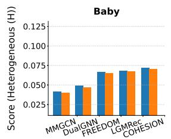

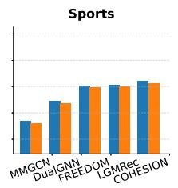

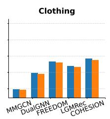

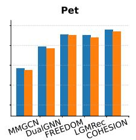

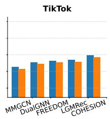

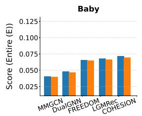

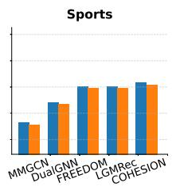

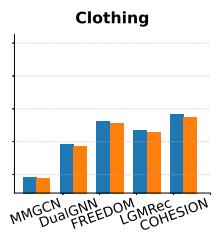

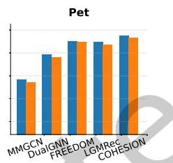

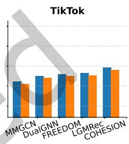  
Fig. 2. Performance comparison for NLGCL+ and variant on five multimodal recommendation models across all five datasets with two different scopes regarding Recall@10.

## 5.3 Ablation Study (RQ4)

To validate the effectiveness of NLGCL+, we conduct experiments to highlight the importance of its key component – Adaptive Sample Weighting (ASW). To this end, we design the following variant: w/o-ASW. The results are demonstrated in Figure 2. All the components contribute to the performance of NLGCL+. Specifically, we have the following observations:

Observation1: Both NLGCL+(H) and NLGCL+(E) achieves higher performance than NLGCL+(H) w/o-ASW and NLGCL+(H) w/o-ASW, respectively, demonstrating the necessity of adaptive allocate sample weighting based on multimodal information.

Observation2: NLGCL+(H) w/o-ASW still outperforms NLGCL+(E) w/o-ASW, eliminating the influence of adaptive sample weighting. This further indicates that the heterogeneous scope is more accurate than the entire scope.

## 5.4 Efficiency Study (RQ5)

We provide a theoretical analysis of the efficiency of our proposed NLGCL+ in Section 4.2. Additionally, we empirically evaluate the extra computational overhead introduced by NLGCL+ compared to other GCL-based methods for multimodal recommendation models. Specifically, we conducted experiments on three datasets using three models and compared the results with all GCL-based methods. In Table 7, we present the efficiency results of NLGCL+ and GCL-based methods in terms of average training time per epoch, the number of epochs to converge, and total training time. Our findings show that NLGCL+ achieves competitive per-epoch training efficiency and the fastest convergence among all models. This demonstrates that NLGCL+ not only requires minimal computational time but also swiftly reaches optimal performance, making it highly suitable for scenarios with limited time or computational resources, such as rapid deployment or frequent updates. Compared to other GCL-based methods, our NLGCL+ introduces minimal computational overhead while significantly improving the model's convergence speed and reducing the number of epochs required for convergence. Overall, it not only enhances performance but can even improve efficiency.

Table 7. Efficiency comparison of different methods across three datasets, including average training time per epoch, number of epochs to converge, total training time (T/E: Time/Epoch, #E: #Epoch, TT: Total Time, N@10: NDCG@10; s: second, and m: minute). We highlight the optimal and suboptimal models for the TT and N@10 metrics in bold and underline, respectively.

<table><tr><td rowspan="2">Method</td><td colspan="4">Baby</td><td colspan="4">Sports</td><td colspan="4">Clothing</td></tr><tr><td>T/E↓</td><td>#E↓</td><td>TT↓</td><td>N@10↑</td><td>T/E↓</td><td>#E↓</td><td>TT↓</td><td>N@10↑</td><td>T/E↓</td><td>#E↓</td><td>TT↓</td><td>N@10↑</td></tr><tr><td>MMGCN</td><td>4.09s</td><td>82</td><td>5m35s</td><td>0.0200</td><td>14.93s</td><td>90</td><td>22m24s</td><td>0.0193</td><td>17.48s</td><td>77</td><td>22m26s</td><td>0.0110</td></tr><tr><td>-SGL</td><td>8.11s</td><td>64</td><td>8m39s</td><td>0.0195</td><td>20.29s</td><td>76</td><td>25m42s</td><td>0.0188</td><td>24.70s</td><td>62</td><td>25m31s</td><td>0.0107</td></tr><tr><td>-NCL</td><td>7.73s</td><td>93</td><td>11m59s</td><td>0.0195</td><td>19.02s</td><td>103</td><td>32m39s</td><td>0.0191</td><td>23.23s</td><td>87</td><td>33m41s</td><td>0.0111</td></tr><tr><td>-SimGCL</td><td>7.98s</td><td>108</td><td>14m22s</td><td>0.0204</td><td>19.48s</td><td>109</td><td>35m23s</td><td>0.0200</td><td>23.87s</td><td>94</td><td>37m24s</td><td>0.0117</td></tr><tr><td>-LightGCL</td><td>8.10s</td><td>70</td><td>9m27s</td><td>0.0188</td><td>19.71s</td><td>80</td><td>26m17s</td><td>0.0185</td><td>24.22s</td><td>66</td><td>26m39s</td><td>0.0103</td></tr><tr><td>-DCCF</td><td>12.62s</td><td>59</td><td>12m25s</td><td>0.0197</td><td>25.15s</td><td>70</td><td>29m20s</td><td>0.0190</td><td>29.08s</td><td>55</td><td>26m39s</td><td>0.0111</td></tr><tr><td>-BIGCF</td><td>12.12s</td><td>61</td><td>12m19s</td><td>0.0202</td><td>24.43s</td><td>72</td><td>29m19s</td><td>0.0196</td><td>28.15s</td><td>53</td><td>24m52s</td><td>0.0116</td></tr><tr><td>-NLGCL</td><td>6.69s</td><td>66</td><td>7m22s</td><td>0.0200</td><td>18.19s</td><td>77</td><td>23m21s</td><td>0.0206</td><td>21.39s</td><td>60</td><td>21m23s</td><td>0.0116</td></tr><tr><td>-NLGCL+</td><td>6.93s</td><td>52</td><td>6m0s</td><td>0.0217</td><td>18.59s</td><td>63</td><td>19m31s</td><td>0.0217</td><td>22.02s</td><td>51</td><td>18m43s</td><td>0.0122</td></tr><tr><td>LGMRec</td><td>5.93s</td><td>108</td><td>10m40s</td><td>0.0333</td><td>8.98s</td><td>110</td><td>16m28s</td><td>0.0387</td><td>10.02s</td><td>89</td><td>14m52s</td><td>0.0302</td></tr><tr><td>-SGL</td><td>9.95s</td><td>81</td><td>13m26s</td><td>0.0336</td><td>14.34s</td><td>93</td><td>22m14s</td><td>0.0392</td><td>17.24s</td><td>68</td><td>19m32s</td><td>0.0304</td></tr><tr><td>-NCL</td><td>9.57s</td><td>120</td><td>19m8s</td><td>0.0339</td><td>13.07s</td><td>118</td><td>25m42s</td><td>0.0395</td><td>15.77s</td><td>96</td><td>25m14s</td><td>0.0306</td></tr><tr><td>-SimGCL</td><td>9.82s</td><td>129</td><td>21m7s</td><td>0.0342</td><td>13.53s</td><td>129</td><td>29m5s</td><td>0.0400</td><td>16.41s</td><td>107</td><td>29m16s</td><td>0.0312</td></tr><tr><td>-LightGCL</td><td>9.94s</td><td>89</td><td>14m45s</td><td>0.0329</td><td>13.76s</td><td>97</td><td>22m15s</td><td>0.0381</td><td>16.76s</td><td>74</td><td>20m40s</td><td>0.0298</td></tr><tr><td>-DCCF</td><td>12.46s</td><td>74</td><td>15m22s</td><td>0.0338</td><td>19.20s</td><td>86</td><td>27m31s</td><td>0.0394</td><td>21.62s</td><td>60</td><td>21m37s</td><td>0.0305</td></tr><tr><td>-BIGCF</td><td>11.96s</td><td>76</td><td>15m9s</td><td>0.0341</td><td>18.48s</td><td>85</td><td>26m11s</td><td>0.0397</td><td>20.69s</td><td>63</td><td>21m43s</td><td>0.0309</td></tr><tr><td>-NLGCL</td><td>8.53s</td><td>83</td><td>11m48s</td><td>0.0346</td><td>12.24s</td><td>90</td><td>18m22s</td><td>0.0405</td><td>13.93s</td><td>67</td><td>15m33s</td><td>0.0315</td></tr><tr><td>-NLGCL+</td><td>8.77s</td><td>68</td><td>9m56s</td><td>0.0353</td><td>12.64s</td><td>80</td><td>16m51s</td><td>0.0412</td><td>14.56s</td><td>55</td><td>13m21s</td><td>0.0322</td></tr><tr><td>COHESION</td><td>4.47s</td><td>62</td><td>4m37s</td><td>0.0354</td><td>7.91s</td><td>68</td><td>8m58s</td><td>0.0409</td><td>9.05s</td><td>66</td><td>9m57s</td><td>0.0358</td></tr><tr><td>-SGL</td><td>8.49s</td><td>50</td><td>7m4s</td><td>0.0357</td><td>13.27s</td><td>56</td><td>12m23s</td><td>0.0411</td><td>16.27s</td><td>55</td><td>14m55s</td><td>0.0362</td></tr><tr><td>-NCL</td><td>8.11s</td><td>70</td><td>9m28s</td><td>0.0359</td><td>12.00s</td><td>77</td><td>15m24s</td><td>0.0413</td><td>14.80s</td><td>69</td><td>17m1s</td><td>0.0364</td></tr><tr><td>-SimGCL</td><td>8.36s</td><td>76</td><td>10m35s</td><td>0.0364</td><td>12.46s</td><td>82</td><td>17m2s</td><td>0.0419</td><td>15.44s</td><td>79</td><td>20m20s</td><td>0.0367</td></tr><tr><td>-LightGCL</td><td>8.48s</td><td>58</td><td>8m12s</td><td>0.0351</td><td>12.69s</td><td>60</td><td>12m41s</td><td>0.0407</td><td>15.79s</td><td>60</td><td>15m47s</td><td>0.0352</td></tr><tr><td>-DCCF</td><td>13.00s</td><td>48</td><td>10m24s</td><td>0.0362</td><td>18.13s</td><td>51</td><td>15m25s</td><td>0.0412</td><td>20.65s</td><td>50</td><td>17m12s</td><td>0.0363</td></tr><tr><td>-BIGCF</td><td>12.50s</td><td>46</td><td>9m35s</td><td>0.0362</td><td>17.41s</td><td>51</td><td>14m48s</td><td>0.0417</td><td>19.72s</td><td>49</td><td>16m6s</td><td>0.0364</td></tr><tr><td>-NLGCL</td><td>7.07s</td><td>51</td><td>6m1s</td><td>0.0368</td><td>11.17s</td><td>55</td><td>10m14s</td><td>0.0425</td><td>12.96s</td><td>54</td><td>11m40s</td><td>0.0372</td></tr><tr><td>-NLGCL+</td><td>7.31s</td><td>43</td><td>5m14s</td><td>0.0379</td><td>11.57s</td><td>46</td><td>8m52s</td><td>0.0438</td><td>13.59s</td><td>43</td><td>9m44s</td><td>0.0384</td></tr></table>

Note: Here we report NLGCL+(H), which achieve higher performance than NLGCL+(E) in Table 6.

Moreover, NLGCL+ can further reduce training time by adjusting the hyper-parameter G. By tuning G, NLGCL+ adapts to diverse computational environments, striking a balance between efficiency and effectiveness. This flexibility ensures its applicability in real-world scenarios, even under resource constraints, while maintaining robust performance.

We further analyze the computational overhead of pre-constructing the similarity matrix W prior to training. This pre-computation is dataset-dependent and performed only once per dataset; once constructed, it can be reused by NLGCL+ with any backbone without rebuilding. The time required for both scopes on all datasets is summarized in Figure 3, demonstrating that this one-time cost is negligible across all datasets.

Heterogeneous Scope vs. Entire Scope  
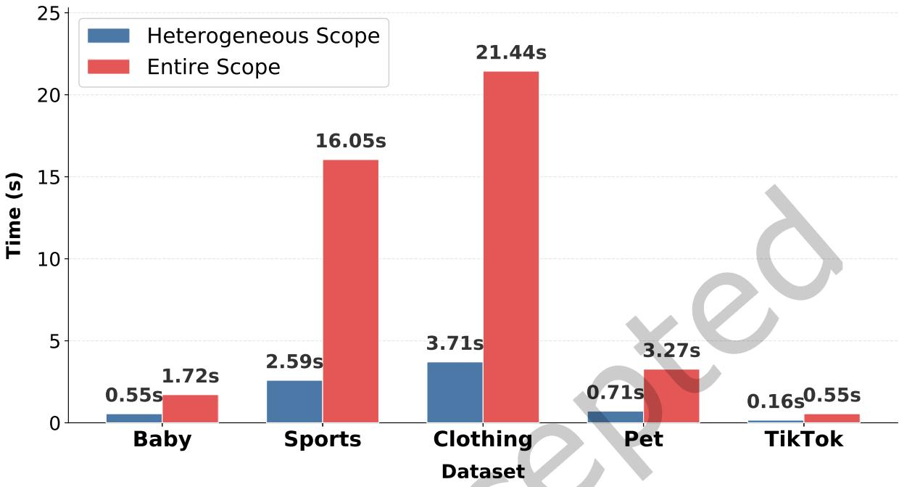  
Fig. 3. Computational costs of pre-constructing the similarity matrix W across datasets and scopes.

## 5.5 Data Sparsity Analysis (RQ6)

To assess the effectiveness of integrating NLGCL+ into advanced multimodal recommendation models under varying data sparsity scenarios, we conduct experiments on subsets of the Baby dataset with different sparsity levels. Users are divided into groups based on their interaction counts in the training set (e.g., the first group includes users who interacted with 1–5 items). This grouping allows us to analyze the impact of data sparsity in a more granular manner.

As illustrated in Figure 4, NLGCL+ consistently enhances the performance of all models across all sparsity levels, with NLGCL+(H) showing slightly better results compared to NLGCL+(E). These improvements are particularly evident in sparsity-intensive groups (e.g., users with 1–5 interactions), demonstrating the robustness of NLGCL+ in addressing the challenges posed by limited user-item interactions.

We attribute these consistent performance gains to the neighbor-layer contrastive learning strategy of NLGCL+, which, combined with adaptive sample weighting, effectively alleviates the data sparsity issue. By leveraging multimodal information, NLGCL+ enables fine-grained representation learning that is particularly beneficial in sparse data settings, further validating its utility and scalability in real-world scenarios.

## 5.6 Cold-Start Analysis (RQ7)

We present results for the cold-start scenario across all datasets (following the widely used settings in $[40, 50]$ ). The experimental results in Table 8 demonstrate that both scopes of NLGCL+ (H and E) significantly enhance the performance of multimodal recommendation models in cold-start scenarios. Specifically, NLGCL+(H) consistently achieves the best results across all datasets and models, followed closely by NLGCL+(E), both showing clear improvements over the baseline models. We attribute this improvement to the naturally existing neighbor-layer contrastive learning with adaptive sample weighting in NLGCL+, which effectively alleviates the data sparsity issue by leveraging fine-grained representation learning guided by multimodal information. This capability is particularly beneficial in cold-start scenarios, where the limited data poses significant challenges for traditional recommendation models. The results further validate the robustness and generalizability of NLGCL+ in diverse datasets and settings.

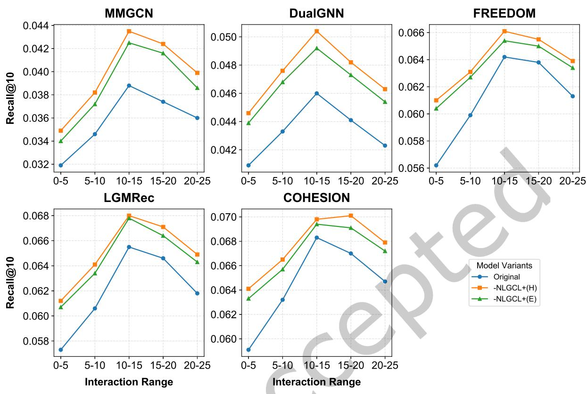  
Fig. 4. Data sparsity analysis on the Baby dataset in terms of Recall@10.

## 5.7 Hyper-parameter Analysis (RQ8)

This section investigates the sensitivity of hyper-parameters on the recommendation performance of NLGCL+. The evaluation results in terms of NDCG@10 are reported in Figure 5 and Figure 6.

5.7.1 Performance Comparison w.r.t. $\lambda$ and $\tau$ : We analyze the hyper-parameter sensitivity for contrastive learning by varying the balancing hyper-parameter $\lambda$ from $10^{-3}$ to $10^{-1}$ and temperature parameter $\tau$ from 0.1 to 0.4. As shown in Figure 5(a), $\lambda = 10^{-2}$ is recommended for all models across all datasets. As shown in Figure 5(b), $\tau = 0.2$ is the optimal setting for all models across all datasets, which aligns with the common settings for InfoNCE as the contrastive learning loss function. This consistency across models and datasets highlights the stability of the proposed method and enhances the generalization capability of NLGCL+, making it a reliable choice for diverse scenarios.

ACM Trans. Recomm. Syst.

Table 8. Cold start analysis across all datasets.

<table><tr><td>Datasets</td><td colspan="2">Baby</td><td colspan="2">Sports</td><td colspan="2">Clothing</td><td colspan="2">TikTok</td></tr><tr><td>Metrics</td><td>Recall@10</td><td>NDCG@10</td><td>Recall@10</td><td>NDCG@10</td><td>Recall@10</td><td>NDCG@10</td><td>Recall@10</td><td>NDCG@10</td></tr><tr><td>MMGCN</td><td>0.0103</td><td>0.0062</td><td>0.0106</td><td>0.0060</td><td>0.0069</td><td>0.0039</td><td>0.0214</td><td>0.0112</td></tr><tr><td>-NLGCL+(H)</td><td>0.0120</td><td>0.0071</td><td>0.0122</td><td>0.0070</td><td>0.0082</td><td>0.0043</td><td>0.0247</td><td>0.0130</td></tr><tr><td>-NLGCL+(E)</td><td>0.0117</td><td>0.0069</td><td>0.0118</td><td>0.0067</td><td>0.0079</td><td>0.0041</td><td>0.0244</td><td>0.0127</td></tr><tr><td>DualGNN</td><td>0.0132</td><td>0.0077</td><td>0.0166</td><td>0.0096</td><td>0.0134</td><td>0.0082</td><td>0.0241</td><td>0.0127</td></tr><tr><td>-NLGCL+(H)</td><td>0.0155</td><td>0.0090</td><td>0.0192</td><td>0.0112</td><td>0.0154</td><td>0.0096</td><td>0.0276</td><td>0.0143</td></tr><tr><td>-NLGCL+(E)</td><td>0.0152</td><td>0.0088</td><td>0.0187</td><td>0.0109</td><td>0.0150</td><td>0.0093</td><td>0.0271</td><td>0.0139</td></tr><tr><td>FREEDOM</td><td>0.0348</td><td>0.0195</td><td>0.0389</td><td>0.0231</td><td>0.0339</td><td>0.0190</td><td>0.0301</td><td>0.0149</td></tr><tr><td>-NLGCL+(H)</td><td>0.0385</td><td>0.0216</td><td>0.0430</td><td>0.0255</td><td>0.0377</td><td>0.0210</td><td>0.0330</td><td>0.0162</td></tr><tr><td>-NLGCL+(E)</td><td>0.0377</td><td>0.0211</td><td>0.0422</td><td>0.0250</td><td>0.0369</td><td>0.0204</td><td>0.0322</td><td>0.0157</td></tr><tr><td>LGMRec</td><td>0.0371</td><td>0.0208</td><td>0.0380</td><td>0.0226</td><td>0.0303</td><td>0.0173</td><td>0.0333</td><td>0.0169</td></tr><tr><td>-NLGCL+(H)</td><td>0.0404</td><td>0.0226</td><td>0.0412</td><td>0.0245</td><td>0.0330</td><td>0.0191</td><td>0.0362</td><td>0.0182</td></tr><tr><td>-NLGCL+(E)</td><td>0.0397</td><td>0.0220</td><td>0.0403</td><td>0.0237</td><td>0.0322</td><td>0.0184</td><td>0.0351</td><td>0.0175</td></tr><tr><td>COHESION</td><td>0.0399</td><td>0.0211</td><td>0.0410</td><td>0.0246</td><td>0.0369</td><td>0.0199</td><td>0.0349</td><td>0.0173</td></tr><tr><td>-NLGCL+(H)</td><td>0.0433</td><td>0.0233</td><td>0.0442</td><td>0.0270</td><td>0.0400</td><td>0.0218</td><td>0.0385</td><td>0.0193</td></tr><tr><td>-NLGCL+(E)</td><td>0.0426</td><td>0.0227</td><td>0.0436</td><td>0.0263</td><td>0.0392</td><td>0.0213</td><td>0.0377</td><td>0.0188</td></tr></table>

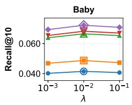

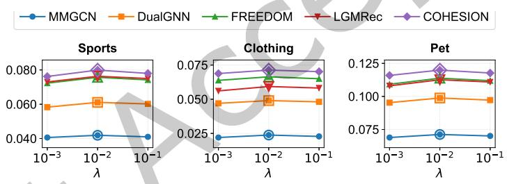  
(a) Hyper-parameter $\lambda$

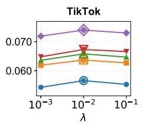

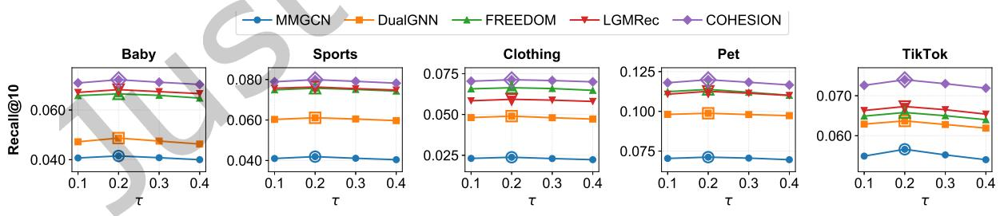  
(b) Hyper-parameter $\tau$  
Fig. 5. Performance comparison w.r.t. key hyper-parameters ( $\lambda$ and $\tau$ ) for all models across all datasets.

5.7.2 Performance Comparison w.r.t. L and G: We analyze the influence of GCN layer number L and contrastive view group number G on all models across all datasets. Figure 6 shows that G = 2 is optimal across all datasets, while the optimal L is 3 for MMGCN and DualGNN models, and 2 for FREEDOM, LGMRec, and COHESION models. We attribute this difference to the varying representation capabilities of these models. Specifically, MMGCN and DualGNN have relatively limited representation power and therefore rely more heavily on neighbor information, which benefits from deeper layers. In contrast, FREEDOM, LGMRec, and COHESION demonstrate stronger representation capabilities, making fewer layers sufficient to capture the necessary structural and modality information.

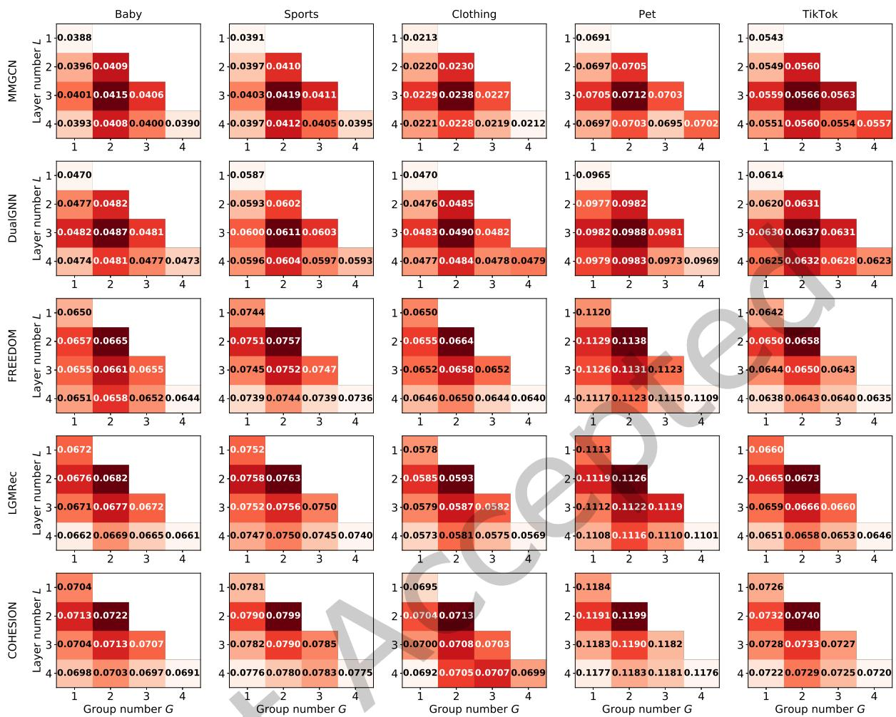  
Fig. 6. Performance Comparison w.r.t. key hyper-parameters (L and G) for all models across all datasets.

## 6 Conclusion

This paper presents NLGCL+, an efficient graph contrastive learning framework tailored for multimodal recommendation. It introduces two key innovations: first, it leverages the naturally existing contrastive views between neighboring GNN layers, eliminating the need for external data augmentations and their associated computational cost and semantic noise; second, it incorporates an adaptive sample weighting mechanism guided by multimodal consistency, enabling more discriminative representation learning through fine-grained weighting of positive and negative samples.

Extensive experiments across five datasets and six multimodal backbones demonstrate that NLGCL+ consistently outperforms state-of-the-art GCL baselines in recommendation accuracy, particularly under data-sparse and cold-start conditions, while achieving significantly higher training efficiency. As a plug-and-play module, NLGCL+ provides a practical and effective solution for enhancing both the performance and scalability of existing multimodal recommender systems.

## 7 Acknowledgements

This work was supported by the UGC General Research Fund no. 17209822 and the Innovation and Technology Commission Fund no. ITS/383/23FP from Hong Kong.

## References

[1] Markus Bayer, Marc-André Kaufhold, and Christian Reuter. 2022. A survey on data augmentation for text classification. Comput. Surveys 55, 7 (2022), 1–39.

[2] Xuheng Cai, Chao Huang, Lianghao Xia, and Xubin Ren. 2023. LightGCL: Simple Yet Effective Graph Contrastive Learning for Recommendation. In The Eleventh International Conference on Learning Representations.

[3] Jingyuan Chen, Hanwang Zhang, Xiangnan He, Liqiang Nie, Wei Liu, and Tat-Seng Chua. 2017. Attentive collaborative filtering: Multimedia recommendation with item-and component-level attention. In Proceedings of the 40th International ACM SIGIR conference on Research and Development in Information Retrieval. 335–344.

[4] Ting Chen, Simon Kornblith, Mohammad Norouzi, and Geoffrey Hinton. 2020. A simple framework for contrastive learning of visual representations. In International conference on machine learning. PMLR, 1597–1607.

[5] Zheyu Chen, Jinfeng Xu, and Haibo Hu. 2025. Don't Lose Yourself: Boosting Multimodal Recommendation via Reducing Node-neighbor Discrepancy in Graph Convolutional Network. In ICASSP 2025-2025 IEEE International Conference on Acoustics, Speech and Signal Processing (ICASSP). IEEE, 1–5.

[6] Zheyu Chen, Jinfeng Xu, Hewei Wang, Shuo Yang, Zitong Wan, and Haibo Hu. 2025. Hypercomplex Prompt-aware Multimodal Recommendation. In Proceedings of the 34th ACM International Conference on Information and Knowledge Management. 403–414.

[7] Zheyu Chen, Jinfeng Xu, Yutong Wei, and Ziyue Peng. 2025. Squeeze and Excitation: A Weighted Graph Contrastive Learning for Collaborative Filtering. In Proceedings of the 48th International ACM SIGIR Conference on Research and Development in Information Retrieval. 2769–2773.

[8] Thomas M Cover. 1999. Elements of information theory. John Wiley & Sons.

[9] Xavier Glorot and Yoshua Bengio. 2010. Understanding the difficulty of training deep feedforward neural networks. In Proceedings of the thirteenth international conference on artificial intelligence and statistics. JMLR Workshop and Conference Proceedings, 249–256.

[10] Zhiqiang Guo, Jianjun Li, Guohui Li, Chaoyang Wang, Si Shi, and Bin Ruan. 2024. LGMRec: Local and Global Graph Learning for Multimodal Recommendation. In Proceedings of the AAAI Conference on Artificial Intelligence, Vol. 38. 8454–8462.

[11] Ruining He and Julian McAuley. 2016. Ups and downs: Modeling the visual evolution of fashion trends with one-class collaborative filtering. In proceedings of the 25th international conference on world wide web. 507–517.

[12] Ruining He and Julian McAuley. 2016. VBPR: visual bayesian personalized ranking from implicit feedback. In Proceedings of the AAAI conference on artificial intelligence, Vol. 30.

[13] Xiangnan He, Kuan Deng, Xiang Wang, Yan Li, Yongdong Zhang, and Meng Wang. 2020. Lightgcn: Simplifying and powering graph convolution network for recommendation. In Proceedings of the 43rd International ACM SIGIR conference on research and development in Information Retrieval. 639–648.

[14] Yangqin Jiang, Lianghao Xia, Wei Wei, Da Luo, Kangyi Lin, and Chao Huang. 2024. DiffMM: Multi-Modal Diffusion Model for Recommendation. (2024).

[15] Diederik P Kingma and Jimmy Ba. 2014. Adam: A method for stochastic optimization. arXiv preprint arXiv:1412.6980 (2014).

[16] Zihan Lin, Changxin Tian, Yupeng Hou, and Wayne Xin Zhao. 2022. Improving graph collaborative filtering with neighborhood-enriched contrastive learning. In Proceedings of the ACM web conference 2022. 2320–2329.

[17] Julian McAuley, Christopher Targett, Qinfeng Shi, and Anton Van Den Hengel. 2015. Image-based recommendations on styles and substitutes. In Proceedings of the 38th international ACM SIGIR conference on research and development in information retrieval. 43–52.

[18] Rongqing Kenneth Ong and Andy WH Khong. 2025. Spectrum-based modality representation fusion graph convolutional network for multimodal recommendation. In Proceedings of the Eighteenth ACM International Conference on Web Search and Data Mining. 773–781.

[19] Aaron van den Oord, Yazhe Li, and Oriol Vinyals. 2018. Representation learning with contrastive predictive coding. arXiv preprint arXiv:1807.03748 (2018).

[20] Sylvestre-Alvise Rebuffi, Sven Gowal, Dan Andrei Calian, Florian Stimberg, Olivia Wiles, and Timothy A Mann. 2021. Data augmentation can improve robustness. Advances in Neural Information Processing Systems 34 (2021), 29935–29948.

[21] Nils Reimers and Iryna Gurevych. 2019. Sentence-bert: Sentence embeddings using siamese bert-networks. In Proceedings of the 2019 conference on empirical methods in natural language processing and the 9th international joint conference on natural language processing (EMNLP-IJCNLP). 3982–3992.

[22] Xubin Ren, Lianghao Xia, Jiashu Zhao, Dawei Yin, and Chao Huang. 2023. Disentangled contrastive collaborative filtering. In Proceedings of the 46th International ACM SIGIR Conference on Research and Development in Information Retrieval. 1137–1146.

[23] Steffen Rendle, Christoph Freudenthaler, Zeno Gantner, and Lars Schmidt-Thieme. 2012. BPR: Bayesian personalized ranking from implicit feedback. arXiv preprint arXiv:1205.2618 (2012).

[24] Zhulin Tao, Xiaohao Liu, Yewei Xia, Xiang Wang, Lifang Yang, Xianglin Huang, and Tat-Seng Chua. 2022. Self-supervised learning for multimedia recommendation. IEEE Transactions on Multimedia (2022).

[25] Nhu-Thuat Tran and Hady W Lauw. 2022. Aligning Dual Disentangled User Representations from Ratings and Textual Content. In Proceedings of the 28th ACM SIGKDD Conference on Knowledge Discovery and Data Mining. 1798–1806.

[26] Qifan Wang, Yinwei Wei, Jianhua Yin, Jianlong Wu, Xuemeng Song, and Liqiang Nie. 2021. Dualgn: Dual graph neural network for multimedia recommendation. IEEE Transactions on Multimedia (2021).

[27] Wei Wei, Chao Huang, Lianghao Xia, and Chuxu Zhang. 2023. Multi-Modal Self-Supervised Learning for Recommendation. In Proceedings of the ACM Web Conference 2023. 790–800.

[28] Yinwei Wei, Xiang Wang, Liqiang Nie, Xiangnan He, and Tat-Seng Chua. 2020. Graph-refined convolutional network for multimedia recommendation with implicit feedback. In Proceedings of the 28th ACM international conference on multimedia. 3541–3549.

[29] Yinwei Wei, Xiang Wang, Liqiang Nie, Xiangnan He, Richang Hong, and Tat-Seng Chua. 2019. MMGCN: Multi-modal graph convolution network for personalized recommendation of micro-video. In Proceedings of the 27th ACM international conference on multimedia. 1437–1445.

[30] Jiancan Wu, Xiang Wang, Fuli Feng, Xiangnan He, Liang Chen, Jianxun Lian, and Xing Xie. 2021. Self-supervised graph learning for recommendation. In Proceedings of the 44th international ACM SIGIR conference on research and development in information retrieval. 726–735.

[31] Lianghao Xia, Chao Huang, Yong Xu, Jiashu Zhao, Dawei Yin, and Jimmy Huang. 2022. Hypergraph contrastive collaborative filtering. In Proceedings of the 45th International ACM SIGIR conference on research and development in information retrieval. 70–79.

[32] Jinfeng Xu, Zheyu Chen, Jinze Li, Shuo Yang, Hewei Wang, Yijie Li, Mengran Li, Puzhen Wu, and Edith CH Ngai. 2025. Mdvt: Enhancing multimodal recommendation with model-agnostic multimodal-driven virtual triplets. In Proceedings of the 31st ACM SIGKDD Conference on Knowledge Discovery and Data Mining V. 2. 3378–3389.

[33] Jinfeng Xu, Zheyu Chen, Jinze Li, Shuo Yang, Hewei Wang, and Edith CH Ngai. 2024. AlignGroup: Learning and Aligning Group Consensus with Member Preferences for Group Recommendation. In Proceedings of the 33rd ACM International Conference on Information and Knowledge Management. 2682–2691.

[34] Jinfeng Xu, Zheyu Chen, Jinze Li, Shuo Yang, Wei Wang, Xiping Hu, and Edith Ngai. 2025. Enhancing Graph Collaborative Filtering with FourierKAN Feature Transformation. In Proceedings of the 34th ACM International Conference on Information and Knowledge Management. 5376–5380.

[35] Jinfeng Xu, Zheyu Chen, Jinze Li, Shuo Yang, Wei Wang, Xiping Hu, Raymond Chi-Wing Wong, and Edith CH Ngai. 2025. Enhancing Robustness and Generalization Capability for Multimodal Recommender Systems via Sharpness-Aware Minimization. IEEE Transactions on Knowledge and Data Engineering (2025).

[36] Jinfeng Xu, Zheyu Chen, Zixiao Ma, Jiyi Liu, and Edith CH Ngai. 2024. Improving Consumer Experience With Pre-Purify Temporal-Decay Memory-Based Collaborative Filtering Recommendation for Graduate School Application. IEEE Transactions on Consumer Electronics (2024).

[37] Jinfeng Xu, Zheyu Chen, Wei Wang, Xiping Hu, Sang-Wook Kim, and Edith CH Ngai. 2025. COHESION: Composite Graph Convolutional Network with Dual-Stage Fusion for Multimodal Recommendation. In Proceedings of the 48th International ACM SIGIR Conference on Research and Development in Information Retrieval. 1830–1839.

[38] Jinfeng Xu, Zheyu Chen, Wei Wang, Xiping Hu, Jiyi Liu, and Edith CH Ngai. 2025. LOBSTER: Bilateral Global Semantic Enhancement for Multimedia Recommendation. Information Fusion (2025), 103778.

[39] Jinfeng Xu, Zheyu Chen, Shuo Yang, Jinze Li, and Edith CH Ngai. 2025. The Best is Yet to Come: Graph Convolution in the Testing Phase for Multimodal Recommendation. In Proceedings of the 33rd ACM International Conference on Multimedia. 6325–6334.

[40] Jinfeng Xu, Zheyu Chen, Shuo Yang, Jinze Li, Zitong Wan, Hewei Wang, Weijie Liu, Yijie Li, and Edith CH Ngai. 2025. VI-MMRec: Similarity-Aware Training Cost-free Virtual User-Item Interactions for Multimodal Recommendation. arXiv preprint arXiv:2512.08702 (2025).

[41] Jinfeng Xu, Zheyu Chen, Shuo Yang, Jinze Li, Hewei Wang, Yijie Li, Jianheng Tang, Yunhuai Liu, and Edith CH Ngai. 2026. CAMMSR: Category-Guided Attentive Mixture of Experts for Multimodal Sequential Recommendation. arXiv preprint arXiv:2603.04320 (2026).

[42] Jinfeng Xu, Zheyu Chen, Shuo Yang, Jinze Li, Hewei Wang, and Edith CH Ngai. 2025. Mentor: multi-level self-supervised learning for multimodal recommendation. In Proceedings of the AAAI Conference on Artificial Intelligence, Vol. 39. 12908–12917.

[43] Jinfeng Xu, Zheyu Chen, Shuo Yang, Jinze Li, Hewei Wang, Wei Wang, Xiping Hu, and Edith Ngai. 2025. NLGCL: Naturally Existing Neighbor Layers Graph Contrastive Learning for Recommendation. In Proceedings of the Nineteenth ACM Conference on Recommender Systems. 319–329.

[44] Jinfeng Xu, Zheyu Chen, Shuo Yang, Jinze Li, Wei Wang, Xiping Hu, Steven Hoi, and Edith Ngai. 2026. A survey on multimodal recommender systems: Recent advances and future directions. IEEE Transactions on Multimedia (2026).

[45] Junliang Yu, Xin Xia, Tong Chen, Lizhen Cui, Nguyen Quoc Viet Hung, and Hongzhi Yin. 2023. XSimGCL: Towards extremely simple graph contrastive learning for recommendation. IEEE Transactions on Knowledge and Data Engineering (2023).

[46] Junliang Yu, Hongzhi Yin, Xin Xia, Tong Chen, Lizhen Cui, and Quoc Viet Hung Nguyen. 2022. Are graph augmentations necessary? simple graph contrastive learning for recommendation. In Proceedings of the 45th international ACM SIGIR conference on research and development in information retrieval. 1294–1303.

[47] Penghang Yu, Zhiyi Tan, Guanming Lu, and Bing-Kun Bao. 2023. Multi-view graph convolutional network for multimedia recommendation. In Proceedings of the 31st ACM international conference on multimedia. 6576–6585.

[48] Penghang Yu, Zhiyi Tan, Guanming Lu, and Bing-Kun Bao. 2025. Mind individual information! principal graph learning for multimedia recommendation. In Proceedings of the AAAI Conference on Artificial Intelligence, Vol. 39. 13096–13105.

[49] Jinghao Zhang, Yanqiao Zhu, Qiang Liu, Shu Wu, Shuhui Wang, and Liang Wang. 2021. Mining latent structures for multimedia recommendation. In Proceedings of the 29th ACM International Conference on Multimedia. 3872–3880.

[50] Jinghao Zhang, Yanqiao Zhu, Qiang Liu, Mengqi Zhang, Shu Wu, and Liang Wang. 2022. Latent structure mining with contrastive modality fusion for multimedia recommendation. IEEE Transactions on Knowledge and Data Engineering 35, 9 (2022), 9154–9167.

[51] Yi Zhang, Lei Sang, and Yiwen Zhang. 2024. Exploring the individuality and collectivity of intents behind interactions for graph collaborative filtering. In Proceedings of the 47th International ACM SIGIR Conference on Research and Development in Information Retrieval. 1253–1262.

[52] Hongyu Zhou, Xin Zhou, Zhiwei Zeng, Lingzi Zhang, and Zhiqi Shen. 2023. A comprehensive survey on multimodal recommender systems: Taxonomy, evaluation, and future directions. arXiv preprint arXiv:2302.04473 (2023).

[53] Xin Zhou. 2023. MMRec: Simplifying Multimodal Recommendation. arXiv preprint arXiv:2302.03497 (2023).

[54] Xin Zhou and Zhiqi Shen. 2023. A tale of two graphs: Freezing and denoising graph structures for multimodal recommendation. In Proceedings of the 31st ACM International Conference on Multimedia. 935–943.

[55] Xin Zhou, Hongyu Zhou, Yong Liu, Zhiwei Zeng, Chunyan Miao, Pengwei Wang, Yuan You, and Feijun Jiang. 2023. Bootstrap latent representations for multi-modal recommendation. In Proceedings of the ACM Web Conference 2023. 845–854.

Received 19 January 2026; revised 21 March 2026; accepted 23 March 2026