# AMMRM: an adaptive multi-modal recommendation model with noise filtering and modal feature enhancement

Yingchun Tan1  Mingyang Wang1  Chaoran Wang1  Xueliang Zhao1

Received: 7 September 2024 / Accepted: 11 March 2025 / Published online: 28 March 2025 © The Author(s) 2025

## Abstract

The effective integration of multimodal information is the key to improving the performance of recommendation systems. However, the common noise interference in multimodal data, such as irrelevant visual details or redundant text descriptions, can seriously affect the accurate modeling of items. Meanwhile, the preference of recommendation systems for popular items often leads to homogenization of recommendation results. To address these challenges, this paper proposes an Adaptive Multimodal Recommendation Model (AMMRM) that integrates noise filtering and feature enhancement. This model innovatively designs a multimodal noise-filtering gate, effectively reducing noise interference; Simultaneously designing a degree-sensitive edgepruning strategy significantly alleviates the overfitting problem caused by popular items. AMMRM enhances the multimodal representation of items through a cross-modal multi-head attention mechanism and optimizes modal vectors using behavior guided networks. In addition, AMMRM utilizes Graph Convolutional Networks (GCNs) to construct modal level user-item interaction graphs, deeply mining users’ potential preferences, and achieving fine integration of user preferences through adaptive fusion gates. The experimental results show that AMMRM outperforms the existing state-of-the-art baseline models on three public datasets (Baby, Sports, Clothing). Under AMMRM, Recall@20 has increased by 2.52%, 3.88%, and 3.80%; NDCG@20 has increased by 8.43%, 5.04%, and 3.03%, respectively. Future research will explore the use of knowledge graphs to enrich item representations and further enhance the performance of recommendation systems.

Keywords Multi-modal recommendation  Noise filtering  Feature enhancement  Multi-view convolution

## 1 Introduction

With the rapid development of Internet, human society has entered the era of information explosion. In response to the challenges posed by information overload, recommendation systems have emerged with the core goal of mining and recommending information that users may be interested in from massive amounts of data (Kemertas et al. 2020; Covington et al. 2016). Given that information is typically presented in multimodal forms such as images, videos, and texts, user preferences are inevitably influenced by different modal features (Wu et al. 2022). Therefore, how to effectively utilize multimodal information to achieve more accurate recommendations has become a hot topic in the research field of recommendation systems (Zhou 2023; Wu et al. 2022; Yu et al. 2023).

Early multi-modal recommendation systems mainly focused on exploring how to utilize multimodal information to enrich item modeling and improve recommendation performance. For example, the VBPR model (He and McAuley 2016) incorporates visual features into the recommendation model and represents items through a combination of visual embedding and ID embedding. The CKE model (Zhang et al. 2016) introduces textual and visual features to enrich item representation by linking item features with multimodal features. Due to the fact that user-item interaction data can be represented as a user-item bipartite graph, Graph Convolutional Networks (GCNs) are widely used to capture high-order connectivity information in graphs to enhance user preference features (Liu et al. 2023; Wei et al. 2020, 2019; Wu et al. 2022). Methods such as DualGNN (Wang et al. 2021), GRCN (Wei et al. 2020), and MMGCN (Wei et al. 2019) all utilize GCNs to learn item representations in each modality and fuse these representations to form the final item representation. On this basis, the LATTICE model (Zhang et al. 2021) further constructed item-item graph, enriching item representations through semantic correlations between items. Based on LATTICE (Zhang et al. 2021), Freedom (Zhou and Shen 2023) proposed a strategy for filtering noise through random pruning and fixed item-item graph. MGCN (Yu et al. 2023) adopts a preference gate mechanism to weight and fuse the features of different modalities of the item.

Although significant progress has been made in the research of multimodal recommendation models, there are still the following limitations that urgently need to be addressed:

(1) Insufficient noise data processing: There is generally a large amount of noise in the input data. If the raw data is directly input into the model, it may contaminate the representation learning process of the item. In addition, when modeling user-item interaction graphs, the widespread dissemination of popular item information may lead to the homogenization of learned node representations, thereby reducing the sensitivity of recommendation systems to differences between items and making it difficult to accurately capture users’ true interests in different items.

(2) Insufficient modeling of modal level items: Items exhibit diverse and complementary features at different modal levels, but existing research has not fully modeled the semantic relevance of items at the modal level.

(3) Insufficient modeling of user modal hierarchy preferences: Users’ preferences for modal features are hidden in the user-item interaction behavior at the modal level, but existing research has not fully utilized these preferences to effectively guide the modeling process of users, resulting in inaccurate modeling of user interests.

In response to the above issues, this paper proposes a multimodal recommendation model AMMRM based on noise filtering and modal feature enhancement, which has made contributions in the following three aspects:

1. Constructing a Noise Filtering Module to suppress the interference of noise on the modeling process: AMMRM designed a Noise Filtering Module (NFM) to denoise the initial multimodal inputs and user-item interaction graphs, providing purer information input for subsequent steps.

2. Constructing a Feature Enhancement Module to fully model the semantic representation at the modal level of the item: AMMRM designed the Feature Enhancement

Module (FEM), which utilizes a cross-modal multi-head attention mechanism to capture semantic correlations at the modal level of the item, thereby enhancing the modal representation of the item. In addition, through a behavior-guided separation network, collaborative signals between interactive behavior and modal information are captured to achieve behavior guidance and supervision of item modal representation.

3. Constructing a Preference Adaptive Fusion Module to capture users’ modal-level preferences: AMMRM designed the User Preference Adaptive Fusion Module (UPFAM). This module utilizes GCNs to capture user preferences at the modal level on user-item graphs constructed in different modalities. By using an adaptive gating network, fine-grained fusion of user modal preferences can be achieved to more accurately model user interests.

## 2 Related work

## 2.1 Multi-modal recommendation

Classic multimodal recommendation models incorporate multimodal information from items into Collaborative Filtering (CF) frameworks through deep learning (Wang et al. 2024) or graph learning techniques to improve recommendation performance. For example, VECF (Chen et al. 2019) uses the VGG model (Simonyan and Zisserman 2014) to pre-segment images, thereby capturing the user’s attention distribution to different regions in the image. MAML (Liu et al. 2019) adopts a dual layer neural network structure to capture users’ preferences for textual and visual features of items. With the deepening of research on Graph Neural Networks (GNNs) (Wu et al. 2022), researchers have begun to use GNNs to extract high-order semantic information from user-item bipartite graphs and integrate it into the learning process of user and item representations. MDCF (Xu et al. 2021) achieves cold-start recommendation by mapping multimodal features into a unified Hamming space; MV-RNN (Cui et al. 2018) utilizes multimodal features for sequential recommendation in a recurrent framework. LATTICE (Zhang et al. 2021) and MICRO (Zhang et al. 2022) constructed item-item graphs for each modality, captured the modal vectors of the items separately through graph convolution, and extracted shared information from different modal representations using contrastive learning. FREEDOM (Zhou and Shen 2023) also utilizes multimodal item-item graphs to achieve more efficient recommendations. However, the above studies generally overlook the influence of noisy data in multimodal information, and also fail to fully capture users’ preferences at the modal level.

## 2.2 Graph convolutional networks

User-item interaction data can be represented as a binary graph structure, and researchers widely use Graph Convolutional Networks (Liu et al. 2023; Mao et al. 2021; Wei et al. 2021; Chen et al. 2020) (GCNs) to extract behavioral features of users and items. For example, NGCF (Wang et al. 2019) teratively performs neighbor aggregation operations in the user-item bipartite graph to capture user behavior characteristics. LightGCN (He et al. 2020) simplifies the traditional graph convolution module, making it more suitable for recommendation scenarios. Inspired by these studies, GCN-based methods have also been widely applied in multimedia recommendation tasks (Wei et al. 2020, 2019; Wang et al. 2021; Wei et al. 2023). For example, MMGCN (Wei et al. 2019) constructs GCN modules to process different modal information and concatenates the obtained modal features as the final representation of the item. Unlike directly fusing modal features, GRCN (Wei et al. 2020) and MICRO (Zhang et al. 2022) use a graph structure learning module to supplement behavioral information by learning potential semantic structures. However, directly learning graph structure without combining modal information may not effectively explore user preferences. In addition, the message propagation mechanism in the GCN module may cause modal noise to spread throughout the entire graph. More importantly, these studies have not fully explored users’ preferences at the modal level, resulting in insufficient modeling of user interests.

## 3 Architecture of AMMRM

This article proposes a new multi-modal recommendation model AMMRM. AMMRM enhances the representation learning process by integrating visual and textual modal information of the item, and captures user preferences at the modal level, thereby significantly improving recommendation performance. AMMRM first denoises the initial multimodal data and user-item interaction graph to reduce the interference of initial noise on the subsequent modeling process. Subsequently, AMMRM captures the collaborative semantic relationships of the item at the modal level to enhance its representational power. In terms of user modeling, AMMRM constructed a modal level user-item interaction graph and utilized GCNs to capture user preferences at the modal level. Figure 1 shows the overall architecture diagram of AMMRM, which mainly consists of four modules: Noise Filtering Module, Feature Enhancement Module, User Preference Adaptive Fusion Module, and Prediction Module.

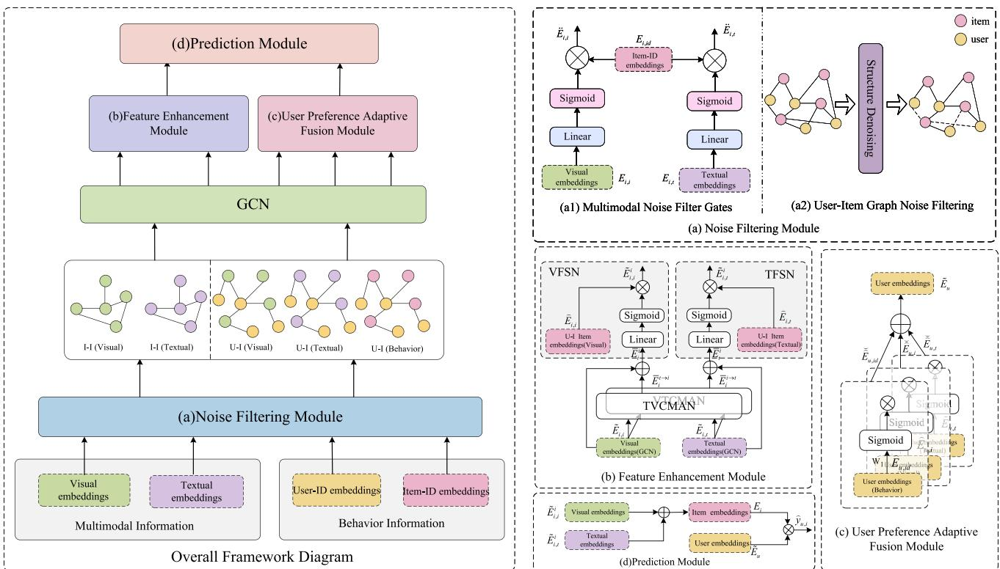  
Fig. 1 Overall Model Architecture of AMMRM ((a) represents the Noise Filtering Module; (b) represents the Feature Enhancement Module; (c) represents the User Preference Adaptive Fusion Module; (d) represents the Prediction Module)

The Noise Filtering Module aims to remove noise from the initial input data. In the noise filtering of multimodal input data, this paper constructs a modal-level Filter Gate to extract modal features closely related to the item. In noise filtering of user-item graphs, this paper proposes a degreesensitive edge pruning method to suppress popular nodes in the graph, thereby reducing the widespread propagation of popular node information in the graph convolution process and avoiding model overfitting. By replacing item nodes with noise-filtered visual and textual modalities, modal-level item-item association graphs and user-item graphs are constructed. Subsequently, these modal level graphs will be input into the Feature Enhancement Module for further feature extraction and enhancement.

The Feature Enhancement Module consists of two modallevel cross-modal multi-head attention networks and two modal-level behavior-guided separation networks. Firstly, use GCNs to learn the modal representations of items from modal level item-item graphs. Next, input item vectors from different modalities into a cross-modal multi-head attention network to achieve cross-modal information interaction and enhancement. Finally, the enhanced modal vectors ofthe item are input into a behavior- guided separation network, which purifies the modal features closely related to behavioral features, thereby further refining the modal representation of the item.

The User Preference Adaptive Fusion Module aims to capture and integrate users’ preferences. By constructing modal-level user-item graphs and utilizing graph convolution to capture user preferences at different modal levels. Then, the interest fusion gate is used to adaptively merge the modal level preferences of users, thereby modeling their interests more accurately.

The Prediction Module uses the item modal vectors output by the Feature Enhancement Module and the user vectors generated by the User Preference Adaptive Fusion Module to calculate scores through dot product operations, and selects K top-ranked items to recommend to users in descending order of scores.

The following sections will provide a detailed explanation of each of the four modules.

## 3.1 Noise filtering module

As shown in Fig. 1(a), the Noise Filtering Module consists of two parts: a Multi-modal Noise Filtering Gate and a User-Item Graph Noise Filtering. The former is used to filter noise from multimodal input data of the item, while the latter focuses on noise removal in the user-item graph.

## 3.1.1 Multi-modal noise filtering gate

Although multimodal features provide rich and meaningful information for items, they also contain noise unrelated to the item. This paper introduces a Filter Gate aimed at eliminating noise features in each modality. Based on the initial modal representation, the Filter Gate adopts a behaviorguided method to extract features closely related to the item from the modal representation, thereby effectively filtering out modal noise. Figure 2 shows a schematic diagram of the workflow of the Filter Gate.

Taking visual modality as an example, the initial modal vector ofthe item is first mapped to a high-order feature space through linear transformation. During the training process, optimize the weights and bias parameters of the linear transformation through backpropagation algorithm:

$$
\dot {E} _ {i, m} = W _ {1} E _ {i, m} + b _ {1}\tag{1}
$$

Subsequently, the Sigmoid activation function is used to generate gate signals that represent the importance of features, which can dynamically adjust the contribution of modal features. Next, the generated gate signal is multiplied with the ID embedding vector $E _ { i , i d }$ of the item to highlight modal features highly correlated with the item while suppressing features of lower importance.

$$
\ddot {E} _ {i, m} = E _ {i, i d} \odot \sigma \left(W _ {1} \dot {E} _ {i, m} + b _ {2}\right)\tag{2}
$$

Through this method, modal information highly relevant to the item can be effectively extracted, thereby indirectly filtering out noise within the modality and significantly reducing the impact of noise propagation in the model.

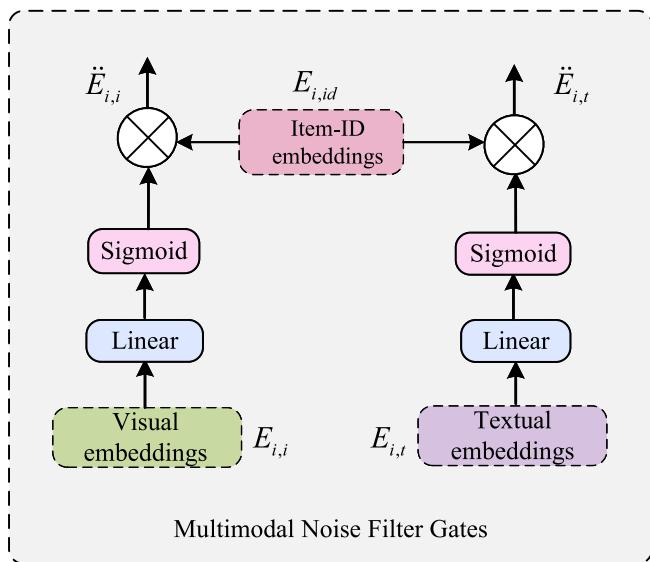  
Fig. 2 Schematic diagram of the workflow of the Filter Gate

The noise filtering process of text modality adopts the same processing steps as visual modality.

## 3.1.2 User-item graph noise filtering

In real-life scenarios, certain popular items are often more favored by users, and these item nodes typically have a large number of connecting edges. In the process of graph convolution, the information of these highly connected nodes will be widely propagated, resulting in the model overly relying on the information of popular nodes and ignoring the importance of other nodes, thus causing the problem of excessive smoothing. This phenomenon weakens the sensitivity of the model to differences between items, making it difficult to accurately capture users’ true interests in the item.

To address this issue, this paper proposes a degreesensitive edge pruning method based on node degree for denoising user-item graphs. Figure 3 shows the specific process of noise filtering in the user-item graph using this method.

The user-item graph is represented as $G = ( v , \varepsilon )$ , where v is the set of nodes, and ε is the set of edges. The number of users in the user-item graph is $M ,$ and the number of items is $N , M + N = | \boldsymbol { v } |$ ,The symmetric adjacency matrix $A =$ $\mathbb { R } ^ { | v | \times | v | }$ is constructed from the user-item matrix $\mathbf { R } \in \mathbf { \Omega } ^ { M \times N }$

$$
A = \left| \begin{array}{c c} 0 & R \\ R ^ {\mathrm{T}} & 0 \end{array} \right|\tag{3}
$$

Ifthere is an interaction between a user and an item, $A _ { u , i } =$ 1; otherwise, $A _ { u , i } = 0$

To prune a certain proportion $\rho$ of edges in the graph $G ,$ the number of edges to be pruned is $\lfloor \rho \left. \varepsilon \right. \rfloor$ , leaving $n = \lceil \lvert \varepsilon \rvert ( 1 - \rho ) \rceil$ edges. In order to prevent the overfitting problem caused by popular nodes, the edges ofpopular nodes are pruned. Since popular nodes typically have a high degree, this paper employs a degree-sensitive edge pruning method to remove as many high-degree edges as possible, reducing the impact of popular nodes.

In the interaction graph, for each edge $\begin{array} { r } { e _ { k } \in \varepsilon \left( 0 \le k < | \varepsilon | \right) } \end{array}$ which connects node i with node $j ,$ the edge $e _ { k }$ is sampled using a multinomial distribution with n trials and parameter vector $p = \langle p _ { 0 } , p _ { 1 } , \dotsc , p _ { | \varepsilon - 1 | } \rangle$ . The retention probability of the edge $e _ { k }$ is related to the degrees of nodes i and $j ,$ and is calculated as follows:

$$
p _ {k} = \frac {1}{\sqrt {\omega_ {i}} \sqrt {\omega_ {j}}}\tag{4}
$$

Where $\omega _ { i } , \omega _ { j }$ are the degrees of nodes i andj in the graph. As seen from the formula, $p _ { k }$ is inversely proportional to the degrees of the connected nodes.

Therefore, the higher the degree of a node, the lower the probability of its connecting edges being preserved. This means that edges related to highly popular nodes are more likely to be pruned, effectively alleviating overfitting problems caused by popular nodes and avoiding the masking of users’ true interests by these nodes.

Based on the retained edges, a new symmetric adjacency matrix $A _ { \rho }$ is reconstructed and normalized as follows:

$$
A _ {\rho} = D ^ {- \frac {1}{2}} A _ {\rho} D ^ {- \frac {1}{2}}\tag{5}
$$

Where D is the diagonal degree matrix corresponding to $A _ { \rho } .$ . During each epoch of training, the user-item graph is pruned and normalized, thereby completing the denoising of the user-item graph.

By pruning the edges of popular nodes in user-item interaction graph, the model’s dependence on popular items can be significantly reduced, thereby recommending diverse non popular items in a more balanced manner. This strategy enables the model to focus more on the personalized needs of users, thereby improving the diversity and coverage of recommendation results.

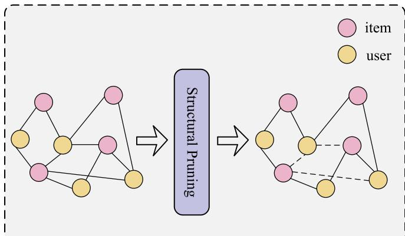  
User-Item Graph Noise Filtering

In addition, this paper also provides a detailed analysis of the computational complexity of degree-sensitive edge pruning method. When denoising the user-item graph $G = ( \boldsymbol { v } , \varepsilon )$ the first step is to traverse each edge and update the node degrees to calculate the degrees of all nodes. The time complexity of this step is $O ( | \varepsilon | )$ ). In the process of edge pruning, the pruning operation can be regarded as a linear process, that is, pruning from ε edges with probability $\rho ,$ , and its time complexity is also $O ( | \varepsilon | )$ . After pruning is completed, it is necessary to reconstruct the adjacency matrix $A _ { \rho }$ and normalize it, and the time complexity of this step is also $O ( | \varepsilon | )$ Therefore, each step of the degree-sensitive edge pruning process has a computational complexity of $O ( | \varepsilon | )$ . Overall, the computational complexity of the degree-sensitive edge pruning method is $O ( | \varepsilon | )$

## 3.2 Feature enhancement module

The Feature Enhancement Module aims to enhance the modal representation of the item by mining semantic correlations at the modal level, and further optimize these representations through behavior-guided learning. To achieve this goal, the module includes two cross-modal multi-head attention networks: VTCMAN (Visual to Text Cross-Modal Attention Network) and TVCMAN (Text to Visual Cross-Modal Attention Network). VTCMAN network takes text modality as its core and uses visual modality as auxiliary information to enhance the semantic representation of textual modality; Correspondingly, the TVCMAN network focuses on visual modalities and utilizes auxiliary information from textual modalities to enhance the semantic representation of visual modalities.

In addition, the Feature Enhancement Module also introduces the Visual Feature Separation Network (VFSN) and the Text Feature Separation Network (TFSN). These networks further enhance the modal representation capability of items by capturing collaborative signals between item modal representation and behavioral representation.

## 3.2.1 Item-item graph constructing and learning

Although multimodal features provide rich and meaningful information for items, existing methods often only consider these features as auxiliary information for items, ignoring the semantic associations between items at the modal level. This paper quantifies the semantic relationships between items through similarity measurement and constructs modalityspecific item-item graphs to capture these relationships. Subsequently, GCNs are used to learn the semantic correla tions between items from the item-item graphs at the modal level.

Specifically, based on the modal vectors obtained from the noise filtering process in Section 3.1, modal-level item-item graphs are constructed on both visual and textual modalities. These graphs implicitly contain semantic associations between items at the modal level. Based on these graphs, GCNs are used to learn vector representations of items at the modal level, which contain semantic correlations between items. Compared to the modal representation of the initial item, the representations learned from these graphs contain richer and more detailed semantic information at the modal level.

The cosine similarity between the representation vectors ofdifferent items in the same mode is calculated as the affinity between items:

$$
S _ {a, b} ^ {m} = \frac {(e _ {a} ^ {m}) ^ {\mathrm{T}} e _ {b} ^ {m}}{\left\| e _ {a} ^ {m} \right\| \left\| e _ {b} ^ {m} \right\|}\tag{6}
$$

Here, $e _ { a } ^ { m }$ represents the vector representation of item a in modality m, $e _ { b } ^ { m }$ represents the vector representation of item b in modality m, and $S _ { a , b } ^ { m }$ denotes the similarity between items a and b in modality m, also referred to as the affinity value.

For each item, only the top K most similar neighboring item nodes are retained, ranked by affinity values in descending order, to construct the item-item graph.

$$
\dot {S} _ {a, b} ^ {m} = \left\{ \begin{array}{l l} 1, \dot {S} _ {a, b} ^ {m} \in t o p - K \\ 0, o t h e r w i s e \end{array} \right.\tag{7}
$$

$$
\ddot {S} ^ {m} = \left(D ^ {m}\right) ^ {- \frac {1}{2}} \dot {S} ^ {m} (D ^ {m}) ^ {- \frac {1}{2}}\tag{8}
$$

Here, $D ^ { m }$ is the diagonal matrix corresponding to ${ \dot { S } } ^ { m }$

In the item-item graph, the modal semantic similarity between nodes exhibits a significant decay with increasing propagation paths. Based on this observation, we adopt a shallow GCN architecture to enrich the representation of the target node by aggregating information from neighboring nodes. The learned modality representation of the item is denoted as:

$$
\tilde {E} _ {i, m} = \frac {1}{K} \sum_ {i \in N (i)} \ddot {E} _ {i, m}\tag{9}
$$

Where $N ( i )$ denotes the neighborhood set of item i in the item-item graph. $\ddot { E } _ { i , m }$ represents the modality vector of the item in modality m.

Independently perform the above graph convolution operation on the visual modality and text modality of the item to obtain the representation $\tilde { E } _ { i , i }$ of the item in the visual modality and the representation $\tilde { E } _ { i , t }$ of the item in the text modality.

## 3.2.2 Cross-modal multi-head attention network

The multimodal representation of the same item often contains rich semantic correlation information, and fully mining and utilizing these cross-modal correlations is crucial for constructing accurate item representations. Therefore, this paper proposes a bidirectional cross-modal multi-head attention network architecture, including two parallel branches: VTCMAN for visual to text and TVCMAN for text to visual. This dual attention mechanism can adaptively capture deep semantic associations between visual and textual modalities, enhancing the discriminative ability of single modal representations through complementary interaction information between modalities. Figure 4 shows the overall architecture of the cross-modal multi-head attention network.

The visual modal vector $\tilde { E } _ { i , i }$ and text modal vector $\tilde { E } _ { i , t }$ extracted in Section 3.2.1 are simultaneously fed as inputs to two parallel networks, VTCMAN and TVCMAN. Specifically, in the VTCMAN network, vector $\tilde { E } _ { i , i }$ is used as the query vector $Q ,$ while vector $\tilde { E } _ { i , t }$ serves as both the key vector K and value vector V. This design aims to establish an attention mapping from visual to text, capturing semantic associations between visual and text features. Correspondingly, in the TVCMAN network, vector $\tilde { E } _ { i , t }$ is used as the query vector Q, while vector $\tilde { E } _ { i , i }$ is used as the K and value vector V. This reverse attention mechanism can effectively model the semantic dependency relationship between text features and visual features. Through the synergistic effect ofthis bidirectional attention mechanism, the model can fully explore the deep semantic associations between visual and textual modalities.

Firstly, perform learnable linear transformations on the input matrices Q, K and V, projecting them into specific feature spaces. Subsequently, each transformed feature matrix is evenly split along the feature dimension into multiple independent attention heads, thereby realizing a multi-head attention mechanism:

$$
Q _ {i} = Q W _ {i} ^ {Q}, K _ {i} = K W _ {i} ^ {K}, V _ {i} = V W _ {i} ^ {V}\tag{10}
$$

Here, $i \in [ 1 , h ] , W _ { i } ^ { Q } , W _ { i } ^ { K } , W _ { i } ^ { V } \in \mathbb { { O } } ^ { \times } \frac { D } { h }$ are the weight matrices for the linear transformations. The attention scores are calculated as follows:

$$
\text { Attention } (Q _ {i}, K _ {i}, V _ {i}) = \text { soft } \max (\frac {Q _ {i} K _ {i} ^ {\mathrm{T}}}{\sqrt {d _ {k}}}) V _ {i}\tag{11}
$$

Here $\begin{array} { r } { d _ { k } = \frac { D } { h } } \end{array}$ . The representation of each head is given by:

$$
h e a d _ {i} = \text { Attention } (Q _ {i}, K _ {i}, V _ {i})\tag{12}
$$

The outputs of all heads are concatenated together and passed through a linear transformation:

$$
M u l t i H e a d (Q, K, V) = C o n c a t (h e a d _ {1}, h e a d _ {2}, \ldots , h e a d _ {h}) W _ {o}\tag{13}
$$

Here, $h e a d _ { 1 } , h e a d _ { 2 } , \dots , h e a d _ { h }$ represents the output of each head, and $W _ { o }$ is the weight matrix for the output linear transformation.

Following the above processing steps, the output of TVC-MAN is:

$$
\bar {E} _ {i} ^ {t \rightarrow i} = M u l t i H e a d \left(\tilde {E} _ {i, t}, \tilde {E} _ {i, i}, \tilde {E} _ {i, i}\right)\tag{14}
$$

Similarly, the output of VTCMAN is:

$$
\bar {E} _ {i} ^ {i \rightarrow t} = \text { MultiHead } \left(\tilde {E} _ {i, i}, \tilde {E} _ {i, t}, \tilde {E} _ {i, t}\right)\tag{15}
$$

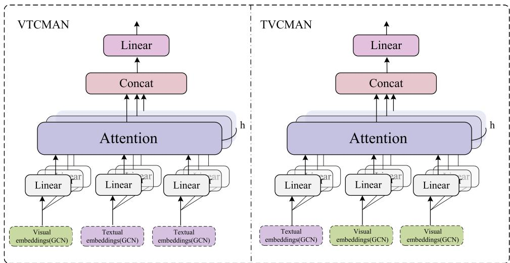  
Fig. 4 Cross-modal multi-head attention network

The output $\bar { E } _ { i } ^ { i \to t }$ of the VTCMAN is added to the input vector $\tilde { E } _ { i , i }$ t of the network, enhancing the vector representation of the textual modality:

$$
\bar {E} _ {i} ^ {t} = \tilde {E} _ {i, t} + \bar {E} _ {i} ^ {i \rightarrow t}\tag{16}
$$

The output $\bar { E } _ { i } ^ { t  i }$ of the VTCMAN is added to the input vector $\tilde { E } _ { i , i }$ of the network, enhancing the vector representation of the visual modality:

$$
\bar {E} _ {i} ^ {i} = \tilde {E} _ {i, i} + \bar {E} _ {i} ^ {t \rightarrow i}\tag{17}
$$

Here, $\tilde { E } _ { i , t }$ represents the textual modality vector after item-item graph convolution, and $\tilde { E } _ { i , i }$ represents the visual modality vector after item-item graph convolution. $\bar { E } _ { i } ^ { t }$ and $\bar { E } _ { i } ^ { i }$ are the textual and visual modality vectors, respectively, enhanced through cross-modal multi-head attention.

Through this process, the semantic relationships between different modalities of the item are captured and integrated, effectively enhancing the modality representation ofthe item.

## 3.2.3 Behavior-guided separation network

There are significant differences in the contribution of different modal components of item features to user interaction behavior, and users’ interest preferences often exhibit different focuses on visual and textual modalities. To effectively mine multimodal key features closely related to user behavior, this paper proposes a Behavior-guided Separation Network, which consists of a Visual Feature Separation Network (VFSN) and a Text Feature Separation Network (TFSN).

Specifically, we first perform modality specific graph convolution operations on the user-item bipartite graph to learn item modal representations that contain rich interactive behavior information. These modal vectors learned through user interaction patterns can accurately reflect user behavior preferences and provide reliable guidance signals for subsequent feature separation. On this basis, the modal vectors perceived by these behaviors are used to decou ple the modal representations learned from the item-item graph, thereby extracting key feature representations highly correlated with user interaction behavior. This collaborative mechanism ensures that the final project representation retains both the semantic information of the project itself and fully integrates the guiding signals of user behavior patterns.

By performing graph convolution operations on user-item bipartite graphs at the modality level, item modality vectors $\widehat { E } _ { i , i }$ and $\widehat { E } _ { i , t }$ are learned, which contain rich interaction behavior information. These modal vectors contain rich interactive behavior information. They are used to guide the separation of the item modal vectors obtained by item-item graph convolution, capture the synergistic signals between behavioral information and modal information, and enhance the supervision of interactive behavior on item modal modeling.

The goal of Visual Feature Separation Network (VFSN) is to enhance and optimize visual modality representation through behavior guided mechanisms. Specifically, VFSN receives two inputs: a visual modality vector $\widehat { E } _ { i , i }$ containing rich user behavior information, and a visual modality vector $\bar { E } _ { i } ^ { i }$ pre-enhanced by the TVCMAN network. Within the network, VFSN utilizes the behavior perception feature vector $\widehat { E } _ { i , i }$ as a guiding signal to decouple and reconstruct the pre enhanced feature vector $\bar { E } _ { i } ^ { i }$ thereby accurately extracting collaborative features highly correlated with user interaction behavior in the visual modality.

Similarly, the Text Feature Separation Network (TFSN) adopts a symmetrical architecture design to optimize the representation of text modalities. The input of TFSN includes: a text modal vector $\widehat { E } _ { i , t }$ containing user behavior patterns, and a text modal vector $\bar { E } _ { i } ^ { t }$ pre-enhanced by VTCMAN network. By using the behavior perception feature vector $\widehat { E } _ { i , t }$ as a guiding signal, TFSN can effectively separate and enhance semantic information closely related to user interaction behavior in text modal features, thereby obtaining more recommended text representations.

$$
\tilde {E} _ {i, i} ^ {i} = \widehat {E} _ {i, i} \odot \sigma \left(W _ {1} \bar {E} _ {i} ^ {i} + b _ {1}\right)\tag{18}
$$

$$
\tilde {E} _ {i, t} ^ {i} = \widehat {E} _ {i, t} \odot \sigma \left(W _ {2} \bar {E} _ {i} ^ {t} + b _ {2}\right)\tag{19}
$$

Here, $W _ { 1 }$ and $W _ { 2 }$ are the weight matrices for the linear transformations.

This dual channel feature separation network architecture achieves collaborative enhancement of visual and textual modal representations through behavior guidance mechanisms, providing high-quality multimodal feature representations for constructing accurate recommendation systems.

The enhanced textual modality representation and visual modality representation are then combined by summing them together to form the final item representation $E _ { i }$ :

$$
E _ {i} = \tilde {E} _ {i, i} ^ {i} + \tilde {E} _ {i, t} ^ {i}\tag{20}
$$

## 3.3 User preference adaptive fusion module

The User Preference Adaptive Fusion Module achieves precise modeling of user multimodal preferences through a gating mechanism. This module first captures the differentiated preference features of users for different modalities, and then uses learnable gating weights to adaptively weight and fuse these modality level preferences. This fine-grained fusion strategy can dynamically adjust the contribution of each modality, accurately reflecting the personalized preference distribution of users. Figure 5 shows a schematic diagram of the process within the User Preference Adaptive Fusion Module.

This paper proposes a multi-level user preference modeling framework that constructs user-item interaction graphs at both the behavioral and modal levels (including visual and textual modalities) to achieve comprehensive capture of user preferences. Specifically, based on the denoised user-item interaction graph obtained in Section 3.1.2, GCN is applied to learn the user’s behavior level preference features. Subsequently, in order to capture users’ modal level preferences, the following design was carried out in this paper:

In terms of visual modality, replace the item ID vector in the traditional interaction graph with the visual modality item representation obtained in Section 3.1.1, construct a visual modality specific user-item interaction graph, and learn the user’s preference patterns in the visual modality through graph convolution operation of GCN.

Similarly, in terms of text modality, replace the item ID vector with the text modality item representation obtained in Section 3.1.1, establish a user-item interaction graph specific to the text modality, and use GCN to learn the user’s preference distribution for text features.

The graph convolution operation at the l layer can be for malized as:

$$
E ^ {l} = E ^ {(l - 1)} \mathcal {L}\tag{21}
$$

Here, $E ^ { l }$ represents the item representation after perform ing l image convolution operations in the user-item graph.

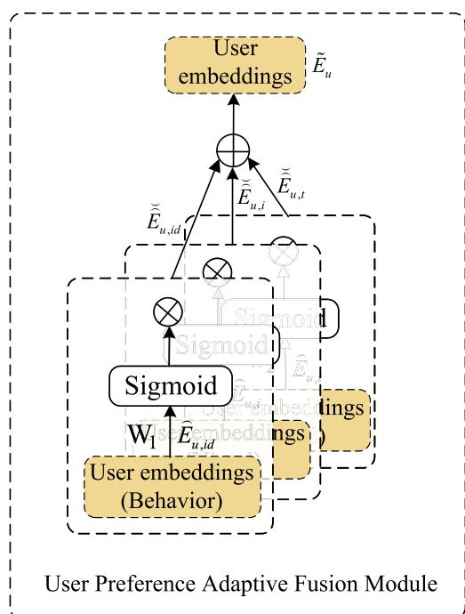  
Fig. 5 User preference adaptive fusion module

is the Laplacian matrix of the user-item graph, which is expressed as:

$$
\mathcal {L} = D ^ {- \frac {1}{2}} A D ^ {- \frac {1}{2}}\tag{22}
$$

$$
A = \left| \begin{array}{c c} 0 & R \\ R ^ {\mathrm{T}} & 0 \end{array} \right|\tag{23}
$$

Here, R represents the user-item interaction matrix, 0 is the all-zero matrix, A is the adjacency matrix, and $D$ is the degree matrix.

Through the l-layer graph convolution, the information from the neighboring nodes is aggregated to obtain the vector representation of the target node:

$$
\widehat {E} = \frac {1}{L + 1} \sum_ {i = 0} ^ {L} E ^ {l}\tag{24}
$$

Through the above operations, the users’ behavior preference vector $\widehat { E } _ { u , i d }$ is learned, along with the users’ preference vectors $\widehat { E } _ { u , i }$ and $\widehat { E } _ { u , t }$ for different modalities of the item.

With the help of the User Preference Adaptive Fusion Module shown in Fig. 5, these users’ preference vectors are adaptively fused:

$$
\stackrel {\smile} {E} _ {u, i d} = \widehat {E} _ {u, i d} \odot \sigma \left(W _ {1} \widehat {E} _ {u, i d} + b _ {1}\right)\tag{25}
$$

$$
\stackrel {\smile} {E} _ {u, i} = \widehat {E} _ {u, i} \odot \sigma \left(W _ {2} \widehat {E} _ {u, i} + b _ {2}\right)\tag{26}
$$

$$
\stackrel {\smile} {\widehat {E}} _ {u, t} = \widehat {E} _ {u, t} \odot \sigma \left(W _ {3} \widehat {E} _ {u, t} + b _ {3}\right)\tag{27}
$$

$$
\widetilde {E} _ {u} = \stackrel {\smile} {\overline {{E}}} _ {u, i d} + \stackrel {\smile} {\overline {{E}}} _ {u, i} + \stackrel {\smile} {\overline {{E}}} _ {u, t}\tag{28}
$$

The final user vector $\tilde { E } _ { u }$ fully encodes the user’s behavioral pattern preferences and their differential tendencies towards multimodal features of the item. This deep fusion representation method not only captures explicit user interaction behavior, but also reveals potential modal level interest preferences, thereby constructing a comprehensive and accurate ‘User Interest Profile’, providing a more reliable and fine-grained user understanding foundation for recommendation tasks.

## 3.4 Prediction module

The final representation vector $E _ { i }$ generated by the Feature Enhancement Module and the user interest representation vector $\tilde { E } _ { u }$ output by the User Preference Adaptive Fusion Module are used to calculate the user item interaction score through vector inner product operation:

$$
f _ {p r e d i c t} (u, i) = \widehat {y} _ {u, i} = \tilde {E} _ {u} ^ {\mathrm{T}} E _ {i}\tag{29}
$$

The items were then ranked in descending order based on their scores, and the top K items were recommended to the user.

## 3.5 Optimization

During the training phase of the model, the Bayesian Personalized Ranking (BPR) loss $\mathcal { L } _ { B P R }$ (Rendle et al. 2012) is used as the objective function for model optimization. $\mathcal { L } _ { B P R }$ learns personalized ranking relationships by maximizing the difference between observed user-item interactions and unobserved interactions. $\mathcal { L } _ { B P R }$ is calculated as:

$$
\mathcal {L} _ {B P R} = \sum_ {(u, i, j) \in D} - \log \sigma \left(\tilde {E} _ {u} ^ {\mathrm{T}} E _ {i} - \tilde {E} _ {u} ^ {\mathrm{T}} E _ {j}\right)\tag{30}
$$

where, $D$ is the set of training entities, and each triplet $( u , i , j )$ satisfies $A _ { u , i } = 1 , A _ { u , j } = 0$ .That is, i is a positive sample, which refers to items that have interactive behavior with the user. $j$ is a negative sample, which refers to items that have not interacted with the user.

Ensuring consistency between user behavior representation and modal representation is crucial in recommendation systems. Due to the fact that user interaction decisions are often influenced by their specific modal preferences, aligning behavioral preferences with modal preferences in semantic space has become the key to improving recommendation performance. To this end, we introduce the InfoNCE (Information Noise Contrastive Estimation) loss function to optimize this alignment process.

The InfoNCE loss maximizes the mutual information between behavioral representations and modal representations by comparing learning frameworks, and its objective function can be expressed as:

$$
\begin{array}{l} \mathcal {L} _ {c u} = \sum_ {u \in U} - \log \frac {\exp \left(\widehat {E} _ {u , i} \cdot \widehat {E} _ {u} / \tau\right)}{\sum_ {v \in U} \exp \left(\widehat {E} _ {v , i} \cdot \widehat {E} _ {v} / \tau\right)} \\ + \sum_ {u \in U} - \log \frac {\exp \left(\widehat {E} _ {u , t} \cdot \widehat {E} _ {u} / \tau\right)}{\sum_ {v \in U} \exp \left(\widehat {E} _ {v , t} \cdot \widehat {E} _ {v} / \tau\right)} \end{array}\tag{31}
$$

$$
\begin{array}{l} \mathcal {L} _ {c i} = \sum_ {i \in I} - \log \frac {\exp \left(\tilde {E} _ {i , i} ^ {i} \cdot E _ {i} / \tau\right)}{\sum_ {j \in I} \exp \left(\tilde {E} _ {j , i} ^ {i} \cdot E _ {j} / \tau\right)} \\ + \sum_ {i \in I} - \log \frac {\exp \left(\tilde {E} _ {i , t} ^ {i} \cdot E _ {i} / \tau\right)}{\sum_ {j \in I} \exp \left(\tilde {E} _ {j , t} ^ {i} \cdot E _ {j} / \tau\right)} \end{array}\tag{32}
$$

For each user $u ,$ consider all other users $v \in U \left( v \neq u \right)$ except for u as negative samples. Similarly, for each item $i ,$ take all other items $j \in I \left( j \neq i \right)$ except for i as negative samples.

The total loss of the model is defined as a combination of the above $\mathcal { L } _ { B P R }$ loss and InfoNCE loss:

$$
\mathcal {L} = \mathcal {L} _ {B P R} + \lambda_ {c} (\mathcal {L} _ {c u} + \mathcal {L} _ {c i})\tag{33}
$$

The total loss function $\mathcal { L }$ is used to optimize the model.

## 4 Discussion of experimental results

## 4.1 Data sets and evaluation methods

## 4.1.1 Datasets

This paper used three publicly available benchmark datasets on the Amazon platform: Baby, Sports, and Clothing to comprehensively evaluate the recommendation performance of the AMMRM model. These datasets are all from real e-commerce recommendation scenarios, covering item recommendation tasks of different categories, and have high representativeness and universality.

Each dataset contains long tail distribution features, which means there are a large number of long-tail items and popular items simultaneously. This provides diverse experimental scenarios for evaluating the recommendation performance of the model under different product popularity distributions. In addition, these datasets not only contain traditional user item interaction records, but also provide rich multimodal information, including product images (visual modality) and text descriptions (text modality), laying the data foundation for building a realistic multimodal recommendation environment. Table 1 provides detailed statistical information for three datasets.

This paper uses pre-extracted features provided by the dataset as the initial multimodal representation of the item: visual modal features are 4096 dimensional feature vectors, and text modal features are 384 dimensional feature vectors.

## 4.1.2 Evaluation method

To ensure the fairness and reproducibility of the experiment, the AMMRM model uses the same evaluation protocol and metrics as all baseline models. Specifically, the interaction history of each user is randomly divided into a training set, a validation set, and a testing set in an 8:1:1 ratio. In the model evaluation phase, a fixed number K of recommended candidate items are selected from the test set for each target user, and the average metric is used to quantify the recommendation performance.

Table 1 Statistics information of the dataset

<table><tr><td>Dataset</td><td>Users</td><td>Items</td><td>Behavior</td><td>Density</td></tr><tr><td>Baby</td><td>19445</td><td>7050</td><td>160792</td><td>0.117%</td></tr><tr><td>Sports</td><td>35598</td><td>18357</td><td>296337</td><td>0.045%</td></tr><tr><td>Clothing</td><td>39387</td><td>23033</td><td>278677</td><td>0.031%</td></tr></table>

Recall@K is one of the core evaluation indicators used to measure the ability of the recommendation system to successfully predict the actual interaction items of users in the top-K list. The recall rate reflects the proportion of items in the recommendation list that match the user’s actual interaction, with a range of [0,1]. A higher recall rate value indicates that the recommendation system has better prediction accuracy. The calculation formula for Recall@K is as follows:

$$
\text { Recall@ } K = \frac {\sum_ {u \in U} | I \cap I _ {r} |}{\sum_ {u \in U} | I |}\tag{34}
$$

Normalized Discounted Cumulative Gain (NDCG) is an important indicator for evaluating the ranking quality of recommendation lists. NDCG can effectively reflect the ranking performance of recommendation systems by comprehensively considering the relevance score ofrecommended items and their position information in the recommendation list. Specifically, when the items that users actually interact with in the test set rank higher in the recommendation list, the NDCG value is higher. This indicates that the recommendation system can not only accurately predict user preferences, but also assign higher ranking priorities to more relevant items. The calculation formula for N DCG@K is as follows:

$$
N D C G @ K = \frac {\sum_ {i = 1} ^ {N} \frac {2 ^ {r e l _ {i}} - 1}{\log_ {2} (i + 1)}}{\sum_ {i = 1} ^ {| R E L |} \frac {2 ^ {r e l _ {i}} - 1}{\log_ {2} (i + 1)}}\tag{35}
$$

Among them, $r e l _ { i }$ represents the relevance score of the i-th item, and $| R E L |$ is the order in which the recommended items are sorted from high to low in terms of their relevance.

Intra List Diversity (ILD) is a key indicator for evaluating the diversity of recommendation lists. I L D@K reflects the diversity level of recommendation results by quantifying the average difference between items in the recommendation list. Specifically, the calculation of I L D@K is based on the similarity matrix of all pairs of items in the recommendation list, and its calculation formula is as follows:

$$
I L D = 1 - \frac {\sum_ {i = 1} ^ {K} \sum_ {j = i + 1} ^ {K} s i m (i , j)}{\frac {K (K - 1)}{2}}\tag{36}
$$

Where sim $( i , j )$ denotes the cosine similarity between items i and j.

## 4.2 Parameter settings

For the baseline models using three benchmark datasets, this paper directly adopts the best recommendation results reported in their original papers to ensure the accuracy and consistency of performance. For other baseline models, conduct experiments based on the optimal parameter settings provided in their original paper.

Adam optimizer was uniformly applied to optimize all models. For the proposed AMMRM model, the Xavier initializer was used for embedding initialization, with the regularization coefficient set to $\lambda _ { E } = 1 0 ^ { - 4 }$ , the learning rate set to $l r = 5 \times 1 0 ^ { - 4 }$ , and the batch size set to 1024. Additionally, the temperature parameter $\lambda _ { c }$ for InfoNCE loss was set to 0.2 in the current study.

## 4.3 Baseline models

To comprehensively evaluate the recommendation performance of the AMMRM model, a comparative experiment was conducted with the most representative advanced recommendation models. These baseline models can be divided into two categories: Single-modal Recommendation Models (which only use user-item interaction history data for recommendations) and Multi-modal Recommendation Models (which fully utilize the multimodal features of items, such as visual and textual information, for recommendations).

Single-modal Recommendation Models:

1) MF (2009) Model (Koren et al. 2009) : MF is a classic collaborative filtering model that uses matrix factorization to learn user and item representations.

2) LightGCN (2020) Model (He et al. 2020) : LightGCN employs a GCN-based collaborative filtering method, simplifying the design of GCN to make it more suitable for recommendations.

Multi-modal Recommendation Models:

1) VBPR (2016) Model (He and McAuley 2016) : VBPR is a classic multi-modal filtering model which combines each item’s visual features with its ID embedding to form the item representation.

2) LATTICE (2021) Model (Zhang et al. 2021) : LATTICE constructs an item-item graph to capture semantic relationships between items, enriching item representations.

3) BM3 (2023) Model (Zhou et al. 2023) : BM3 simplifies the self-supervised framework by eliminating the need for randomly sampled negative examples, using a dropout mechanism to randomly perturb representations.

4) MMSSL (2023) Model (Wei et al. 2023) : MMSSL employs a self-supervised contrastive learning approach to capture complementary information between different modalities for recommendations.

5) Freedom (2023) Model (Zhou and Shen 2023) : Freedom constructs item-item graphs for each modality but freezes the graph before training, making the model faster and more efficient.

6) MGCN (2023) Model (Yu et al. 2023) : MGCN utilizes item-item graphs to enrich item features, capturing both shared and non-shared information across modalities, and uses behavior information to guide the fusion of modality information.

## 4.4 Experimental results

Table 2 shows the comprehensive performance comparison between the AMMRM model and all baseline models on three datasets.The best results under each indicator are highlighted in bold, while the second-best results are underlined. The experimental results show that AMMRM achieves the best recommendation performance on all datasets, significantly better than the existing state-of-the-art baseline models.

Specifically, on the Baby dataset, although the Freedom model achieved the best Recall value in the baseline model, AMMRM outperformed Freedom by 6.23% and 2.25% in the Recall metric, respectively. In terms of NDCG indicators, MGCN performed the best in the baseline model, but AMMRM improved by 7.66% and 8.43% respectively compared to MGCN. On the Sports and Clothing datasets, MGCN performed the most outstandingly in the baseline model, but AMMRM still achieved significant improvements: on the Sports dataset, Recall and NDCG metrics improved by 5.21%/3.88% and 6.54%/5.04%, respectively; On the Clothing dataset, the Recall and NDCG metrics improved by 2.18%/3.80% and 4.89%/3.03%, respectively. These experimental results fully confirm the excellent recommendation performance of AMMRM.

Further analysis of the results in Table 2 reveals the following important findings. 1) Advantages of Graph Convolutional Networks: Regardless of whether multimodal information is included or not, GCN-based models (such as LightGCN and MGCN) perform the best among all models, indicating that the ability of GCN to capture higher-order relationships plays an important role in improving recommendation performance. 2) Effectiveness of multimodal information: Although VBPR (He and McAuley 2016) and MF (Koren et al. 2009) are classic collaborative filtering models, VBPR’s performance is significantly better than MF’s due to the introduction of multimodal information, which confirms the importance of multimodal information in improving recommendation performance.

Among multi-modal models, although VBPR improves recommendation performance by combining modal information and behavioral features, its multimodal information fusion method is relatively crude. Lattice enhances item representation by building item-item graphs, but the performance improvement is limited. BM3 (Zhou et al. 2023) uses multimodal contrastive loss to align modal representations with item IDrepresentations, but the user modeling process is too simple. MMSSL (Wei et al. 2023) captures modal related features by generating simulated interactions, but ignores the issue of noise in the interaction information. Freedom (Zhou and Shen 2023) improves stability by freezing item-item graphs, but underestimates the importance of user behavior. MGCN (Yu et al. 2023) improves performance by filtering noise from the initial modal input, but fails to address the noise issue of popular nodes in the user-item graph.

In contrast, the AMMRM model has the following innovative advantages. Firstly, AMMRM has designed a dual denoising mechanism. Not only does it denoise the initial modal information, but it also uses degree-sensitive edge pruning technique to denoise the edges in the user-item graph, effectively avoiding noise pollution and overfitting ofpopular nodes. Secondly, AMMRM has designed an effective multimodal feature enhancement strategy. AMMRM constructed modal level item-item graphs to obtain fine-grained modal level vector representations, effectively capturing semantic relationships between modalities through cross-modal multi-head attention mechanisms. And, using behavioral information to guide the separation of item modal vectors, obtaining representations that are more relevant to user preferences. Again, AMMRM conducted in-depth user preference modeling. AMMRM captures users’ potential preferences at the modal level to achieve more accurate user profiling. These innovative designs demonstrate significant performance advantages of AMMRM compared to existing methods, providing a new solution for multimodal recommendation.

Table 2 Experimental results of the recommendation performance

<table><tr><td>Datasets</td><td>Metric</td><td>MF</td><td>LightGCN</td><td>VBPR</td><td>Lattice</td><td>BM3</td><td>MMSSL</td><td>Freedom</td><td>MGCN</td><td>AMMRM</td></tr><tr><td rowspan="4">Baby</td><td>Recall@10</td><td>0.0357</td><td>0.0479</td><td>0.0423</td><td>0.0547</td><td>0.0564</td><td>0.0596</td><td>0.0627</td><td>0.0620</td><td>0.0667</td></tr><tr><td>Recall@20</td><td>0.0575</td><td>0.0754</td><td>0.0663</td><td>0.0850</td><td>0.0883</td><td>0.0931</td><td>0.0992</td><td>0.0964</td><td>0.1017</td></tr><tr><td>NDCG@10</td><td>0.0192</td><td>0.0257</td><td>0.0223</td><td>0.0292</td><td>0.0301</td><td>0.0326</td><td>0.0330</td><td>0.0339</td><td>0.0365</td></tr><tr><td>NDCG@20</td><td>0.0249</td><td>0.0328</td><td>0.0284</td><td>0.0370</td><td>0.0383</td><td>0.0415</td><td>0.0424</td><td>0.0427</td><td>0.0463</td></tr><tr><td rowspan="4">Sports</td><td>Recall@10</td><td>0.0432</td><td>0.0569</td><td>0.0558</td><td>0.0620</td><td>0.0656</td><td>0.0677</td><td>0.0717</td><td>0.0729</td><td>0.0767</td></tr><tr><td>Recall@20</td><td>0.0653</td><td>0.0864</td><td>0.0856</td><td>0.0953</td><td>0.0980</td><td>0.0998</td><td>0.1089</td><td>0.1106</td><td>0.1149</td></tr><tr><td>NDCG@10</td><td>0.0241</td><td>0.0311</td><td>0.0307</td><td>0.0335</td><td>0.0355</td><td>0.0380</td><td>0.0385</td><td>0.0397</td><td>0.0423</td></tr><tr><td>NDCG@20</td><td>0.0298</td><td>0.0387</td><td>0.0384</td><td>0.0421</td><td>0.0438</td><td>0.0470</td><td>0.0481</td><td>0.0496</td><td>0.0521</td></tr><tr><td rowspan="4">Clothing</td><td>Recall@10</td><td>0.0187</td><td>0.0340</td><td>0.0280</td><td>0.0492</td><td>0.0421</td><td>-</td><td>0.0629</td><td>0.0641</td><td>0.0655</td></tr><tr><td>Recall@20</td><td>0.0279</td><td>0.0526</td><td>0.0414</td><td>0.0733</td><td>0.0625</td><td>-</td><td>0.0941</td><td>0.0945</td><td>0.0981</td></tr><tr><td>NDCG@10</td><td>0.0103</td><td>0.0188</td><td>0.0159</td><td>0.0268</td><td>0.0228</td><td>-</td><td>0.0341</td><td>0.0347</td><td>0.0364</td></tr><tr><td>NDCG@20</td><td>0.0126</td><td>0.0236</td><td>0.0193</td><td>0.0330</td><td>0.0280</td><td>-</td><td>0.0420</td><td>0.0428</td><td>0.0441</td></tr></table>

## 4.5 Ablation study

A series of ablation studies were designed to evaluate the contribution of each component in the AMMRM model to recommendation performance. Specifically, based on the complete AMMRM model, the following variant models were constructed by gradually removing key modules:

Variant 1(V1): Removes the multi-modal noise filtering part ofthe modality Noise Filtering Module. The initial multimodal information is directly input into the model.

Variant 2(V2): Removes the user-item graph noise filtering part of the modality Noise Filtering Module, canceling the denoising process for the user-item interaction graph.

Variant 3(V3): Removes the cross-modal multi-head attention network part of the Feature Enhancement Module, using the item modality vector containing behavior information directly to guide the separation of the graph convolution vectors.

Variant 4(V4): Removes the guided separation network part of the Feature Enhancement Module, directly concatenating the enhanced information as the final item vector.

Variant 5(V5): Removes the graph convolution operations for user-item interaction graphs under different modalities in the User Preference Adaptive Fusion Module, performing graph convolution only on the original user-item interaction graph without considering modality information.

Variant 6(V6): Removes the gated fusion part of the User Preference Adaptive Fusion Module, with user preferences being summed equally to form the final user preference vector.

Variant 7(V7): All components in the original AMMRM are retained, i.e., the AMMRM model proposed in this paper.

Using Recall@20 and N DCG@20 as evaluation metrics, Fig. 6 gives the experimental results of recommendation performance under the complete AMMRM model and the ablation models.

It can be seen that the complete AMMRM model (variant 7) achieved the best recommendation performance in all evaluation metrics, significantly outperforming other ablation variants. This result fully demonstrates the rationality of AMMRM architecture design and the effectiveness of each module. Specifically, the performance of each variant is as follows:

Variant 1 (Removing modality Noise Filtering Module): Variant 1 has the worst performance, significantly lower than other variants. It has been verified that there is a large amount of noise in the initial modal information that is unrelated to user preferences. Directly using these features can lead to serious noise pollution and affect recommendation performance.

Variant 2 (Removing user-item graph noise filtering part): Its performance is significantly lower than that of the complete AMMRM, indicating the presence ofnoise interference in the user-item interaction graph, especially excessive emphasis on popular nodes, which can lead to model bias. Proper denoising can effectively alleviate the problem ofover smoothing.

Variant 3 (Removing cross-modal multi-head attention network): Compared to the complete AMMRM model, the performance of Variant 3 significantly decreases. This confirms the important role of cross-modal attention mechanism in capturing semantic associations between modalities and enhancing item representation.

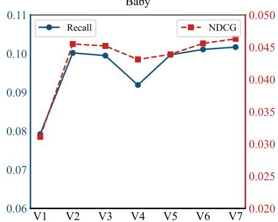  
Fig. 6 Ablation experimental results

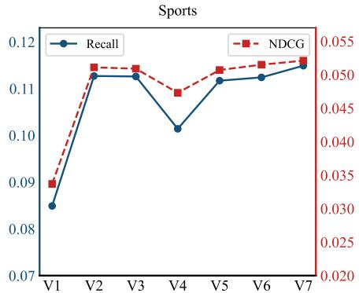

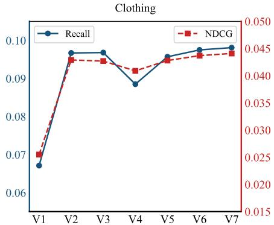

Variant 4 (Removing guided separation network): Its recommendation performance is significantly reduced, proving that the behavior guided feature separation strategy can effectively extract modal features closely related to user preferences, which plays a key role in improving recommendation accuracy.

Variant 5 (Removing modal-level user-item graph convolution): Its performance significantly decreases, indicating that relying solely on the original user item interaction graph will lose users’ preferences for modal information, leading to incomplete modeling of user interests.

Variant 6 (Removing gating fusion mechanism): Its performance is significantly reduced, verifying that users have differentiated preferences for different modalities. The gating mechanism can achieve fine-grained preference fusion, thereby improving recommendation effectiveness.

The above experimental results fully confirm that each module in the AMMRM model plays an irreplaceable role. Through the collaborative work of these modules, the AMMRM model has achieved excellent recommendation performance.

## 4.6 Discussion on the impact of degree-sensitive edge pruning method on recommendation diversity

To alleviate the prevalent issue of popularity bias in recommendation systems, this paper proposes a degree-sensitive edge pruning strategy. This method dynamically adjusts the connection edges of nodes in the user-item interaction graph, effectively balancing the recommendation opportunities of popular items and long tail items. To quantitatively evaluate the impact of this method on recommendation diversity, we used I L D@20 to analyze the diversity changes of the recommendation list before and after pruning.

In Fig. 7, shows the comparison results of the complete AMMRM model and the variant model of the removal degree-sensitive edge pruning module (denoted asAMM $R M _ { o - e p }$ )on three datasets. Experimental data shows that the complete AMMRM model performs well on all datasets. On the Baby, Sports, and Clothing datasets, the I L D@20 index values of the complete AMMRM model were all higher than that of $A M M R M _ { o - e p }$ . These experimental results fully confirm the effectiveness of the degreesensitive edge pruning strategy.

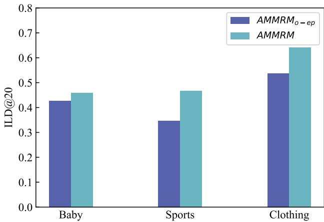  
Fig. 7 Results on the diversity of recommended items

## 4.7 Comparative experiments on the depth of the graph convolution

In the design of graph convolutional networks, the choice of convolutional layer depth has a critical impact on model performance. Shallow convolutional layers make it difficult to fully capture high-order neighborhood information, resulting in incomplete feature extraction. However, excessively deep convolutional layers introduce a large amount of noise information, causing over smoothing problems. To determine the optimal graph convolution depth, this paper explored the convolution depth configuration ofuser-item graph and itemitem graph, using Recall@20 and N DCG@20 as evaluation indicators.

Figure 8 shows the experimental results of different graph convolution depths, where the horizontal axis represents the convolution depth $N _ { 1 }$ of the user-item graph. The vertical axis of Fig. 8(a), (b) and (c) represents the performance of Recall@20 on different datasets. The vertical axis of Fig. 8(d), (e) and (f) represents the performance of NDCG@20 on different datasets. The two lines represent the performance of the item-item graph at convolution depth $N _ { 2 } { = } 1$ (pink line) and $N _ { 2 } = 2$ (blue line), respectively.

The experimental results show that on all datasets, the recommendation performance of $N _ { 2 } { = } 1$ (pink line) is better than $N _ { 2 } = 2$ (blue line). The reason is that the item-item graph is constructed based on semantic similarity, and the target node has a high degree of correlation with its first-order neighbors. Increasing the convolution depth not only dilutes this correlation, but also introduces noisy nodes, leading to a decrease in performance. Therefore, this paper sets the convolution depth of the item-item graph to $N _ { 2 } { = } 1$

As the convolution depth $N _ { 1 }$ of the user-item graph increases, the recommendation performance shows a trend of first increasing and then stabilizing, reaching a peak at $N _ { 1 } = 3$ . Considering that the performance improvement is limited when $N _ { 1 } = 3$ compared to $N _ { 1 } = 2$ , and that $N _ { 1 } = 3$ will involve more computational resource consumption, this paper sets the convolution depth of the user-item graph to $N _ { 1 } = 2$

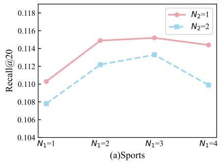

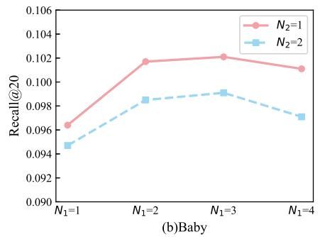

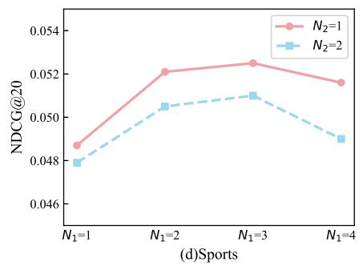

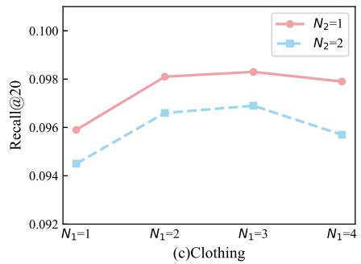

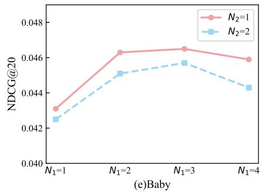  
Fig. 8 Experiment results of different graph convolution depths

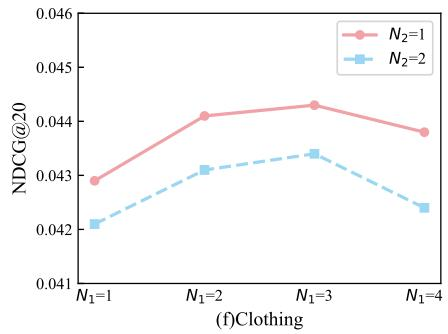

## 4.8 Visualization analysis

Specifically, we use the t-SNE algorithm to reduce highdimensional modal vectors to two-dimensional space and generate probability density distribution maps using Gaussian kernel density estimation (KDE) technique. To further quantify the distribution trend, the arctan function is introduced to map the two-dimensional coordinates generated by t-SNE to the angular space, simplifying the complex two-dimensional distribution into a one-dimensional representation, thereby more clearly displaying the distribution changes of modal vectors before and after denoising.

## 4.8.1 Visualization analysis on data denoising

To evaluate the modal denoising capability of the AMMRM model, we randomly sampled 1000 items from the Baby dataset and visualized the distribution of their modal vectors.

Figure ${ 9 } ( \mathrm { a } )$ and (c) show the modal vector distribution before denoising. It can be seen that the KDE curve before denoising exhibits a multimodal distribution with obvious fluctuations, indicating that the original modal vector contains a large number of low discriminative noise features. Directly using these features can lead to distortion in item modeling and affect recommendation accuracy.

Fig. 9 Visualization of item modal vectors before and after denoising ((a) and (c) show the modal vector distribution before denoising; (b) and (d) show the modal vector distribution after denoising)  
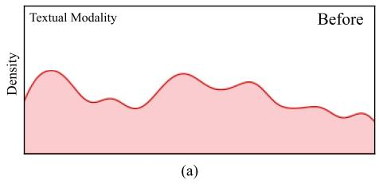

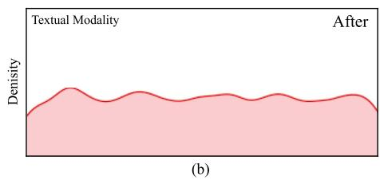

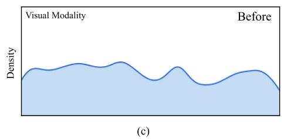

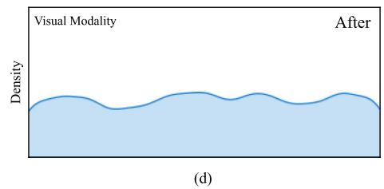

Figure 9(b) and (d) show the distribution of modal vectors after denoising. It can be seen that the KDE curve becomes smoother, eliminating obvious peak valley fluctuations. The distribution of the curve is more concentrated and uniform, indicating that the noise features have been effectively removed. By retaining discriminative semantic features in the data, more reliable feature inputs are provided for subsequent recommendation modeling.

## 4.8.2 Visualization analysis on item modeling

To further evaluate the item representation capability of the AMMRM model, we randomly selected 1000 projects from the Baby dataset as samples and used t-SNE dimensionality reduction technique to visualize the behavior vector and modal vector distribution of the items before and after mod eling.

Figure 10(a) and (c) shows the distribution characteristics before modeling. It can be seen that before modeling, the distribution of behavior vectors and modal vectors shows obvious discreteness and irregularity, indicating a semantic gap between behavior information and modal information in the original feature space.

Figure 10(b) and (d) shows the distribution characteristics after modeling. It can be seen that after modeling, the distribution of behavior vectors and modal vectors shows a significant alignment trend. This indicates that the model has successfully established a semantic association between behavioral information and modal information.

This distribution change intuitively confirms the advantages of AMMRM model in item representation learning. The AMMRM model effectively captures the potential correlation between item behavior representation and modal representation, which will significantly improve the quality of item modeling and provide strong support for performance optimization of recommendation systems.

## 4.8.3 Visualization on recommendation performance

To further evaluate the personalized recommendation capability of the AMMRM model, we randomly selected 15 users from the Baby dataset as samples and generated the top 20 recommendation items for each user. By using t-SNE dimensionality reduction technology, we conducted a visual analysis of the distribution of user vectors and recommended item vectors before and after modeling, as shown in Fig. 11.

As shown in Fig. 11(a), the distribution of user vectors before modeling is highly concentrated and lacks significant individual differences. And there is a lack of clear semantic correlation between user vectors and item vectors before modeling. After modeling by AMMRM as shown in Fig. 11(b), the distribution of user vectors becomes dispersed. This change indicates that AMMRM has successfully captured the potential interest features of users and achieved personalized modeling of users. And there is a significant correspondence between user distribution and recommended item distribution, indicating that AMMRM effectively establishes semantic associations between user preferences and recommended items.

Fig. 10 Comparison of the distribution of item behavior/modal vectors before and after modeling ((a) and (c) shows the distribution characteristics of behavior vectors and modal vectors before modeling; (b) and (d) shows the distribution characteristics of behavior vectors and modal vectors after modeling)  
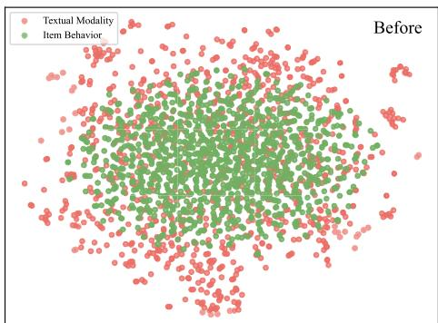  
(a)

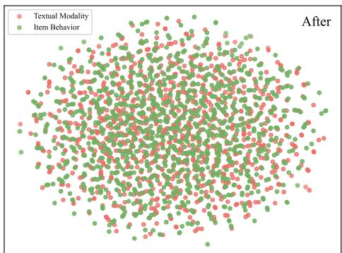

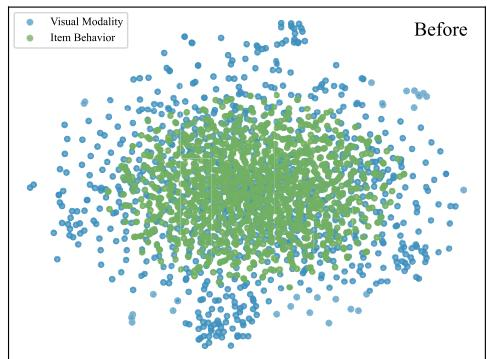  
(c)

(b)  
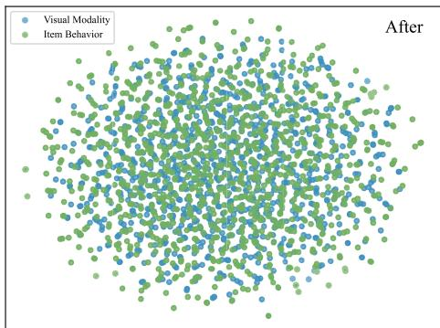  
(d)

Fig. 11 Comparison of the distribution of user/item vectors before and after modeling ((a) shows the distribution before modeling; (b) shows the distribution after modeling)  
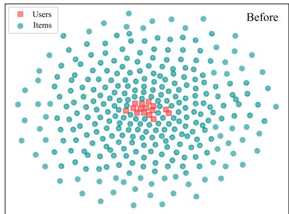  
(a)

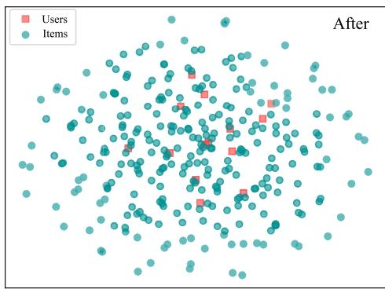  
(b)

## 5 Conclusion

This paper proposes an innovative multi-modal feature enhanced recommendation model, AMMRM. Compared with existing methods, AMMRM has achieved significant breakthroughs in the following aspects. Firstly, AMMRM effectively performs noise filtering and data purification. AMMRM innovatively designed a dual noise filtering mechanism to denoise multimodal data and user-item interaction graphs separately. This effectively reduces the interference of data noise on model performance and provides purer input for subsequent processing. Secondly, AMMRM effectively enhances item modeling. AMMRM has designed a crossmodal multi-head attention network to effectively capture semantic associations between modalities. AMMRM proposed a behavior-guided feature separation network that utilizes interactive behavior information to guide modal feature decoupling, achieving feature extraction and enhancement highly correlated with user preferences. Again, AMMRM effectively conducted user interest modeling. AMMRM constructed a modal-level user-item interaction graph, using graph convolutional networks to capture users’ fine-grained modal preferences for items, and designed an adaptive gating fusion network to achieve accurate modeling ofuser interests. Meanwhile, AMMRM introduces the InfoNCE loss function to ensure semantic consistency between behavioral features and modal features. The experimental results show that AMMRM achieves optimal recommendation performance on multiple benchmark datasets, significantly outperforming existing state-of-the-art recommendation models. The ablation experiment further validated the contribution of each module to the overall performance of the model.

In future work, we will continue to explore integrating external knowledge graphs into recommendation systems, enriching item feature representations with large-scale language models, and further improving the accuracy of user preference modeling. At the same time, we will continue to explore the mitigation effect of external knowledge on cold-start problems, and develop cold-start recommendation algorithms based on knowledge transfer. Through these explorations, the performance and practicality of the recommendation system can be further improved.

Acknowledgements Thanks to the editors and reviewers for all their work and efforts on the manuscript.

Author Contributions Yingchun Tan: Conceptualization, Methodology, Validation, Data Curation, Writing - original draft, Writing - review and editing, Formal analysis. Mingyang Wang: Resources, Supervision, Funding acquisition. Chaoran Wang: Writing - review and editing, Formal analysis. Xueliang Zhao: Writing - review and editing.

Funding The authors confirm that there was no financial support or funding provided for the research of this article.

Availability of data and material All data generated or analyzed during this study are included in this published article.

## Declarations

Conflict of Interest The authors declare that they have no known competing financial interests or personal relationships that could have appeared to influence the work reported in this paper.

Competing interests The authors declare that they have no conflict of interest.

Open Access This article is licensed under a Creative Commons Attribution-NonCommercial-NoDerivatives 4.0 International License, which permits any non-commercial use, sharing, distribution and reproduction in any medium or format, as long as you give appropriate credi to the original author(s) and the source, provide a link to the Creative Commons licence, and indicate if you modified the licensed material. You do not have permission under this licence to share adapted material derived from this article or parts of it. The images or other third party material in this article are included in the article’s Creative Commons licence, unless indicated otherwise in a credit line to the material. If material is not included in the article’s Creative Commons licence and your intended use is not permitted by statutory regulation or exceeds the permitted use, you will need to obtain permission directly from the copyright holder. To view a copy of this licence, visit http://creativecommons.org/licenses/by-nc-nd/4.0/.

## References

Chen X, Chen H, Xu H, Zhang Y, Cao Y, Qin Z, Zha H (2019) Personalized fashion recommendation with visual explanations based on multimodal attention network: towards visually explainable recommendation. In: Proceedings of the 42nd international ACM SIGIR conference on research and development in information retrieval, pp 765–774

Chen D, Lin Y, Li W, Li P, Zhou J, Sun X (2020) Measuring and relieving the over-smoothing problem for graph neural networks from the topological view. In: Proceedings of the AAAI conference on artificial intelligence, vol 34, pp 3438–3445

Covington P, Adams J, Sargin E (2016) Deep neural networks for youtube recommendations. In: Proceedings of the 10th ACM conference on recommender systems, pp 191–198

Cui Q, Wu S, Liu Q, Zhong W, Wang L (2018) Mv-rnn: a multi-view recurrent neural network for sequential recommendation. IEEE Trans Knowl Data Eng 32(2):317–331

He X, Deng K, Wang X, Li Y, Zhang Y, Wang M (2020) Lightgcn: simplifying and powering graph convolution network for recommendation. In: Proceedings of the 43rd international ACM SIGIR conference on research and development in information retrieval, pp 639–648

He R, McAuley J (2016) Vbpr: visual bayesian personalized ranking from implicit feedback. In: Proceedings of the AAAI conference on artificial intelligence, vol 30

Kemertas M, Pishdad L, Derpanis KG, Fazly A (2020) Rankmi: a mutual information maximizing ranking loss. In: Proceedings of the IEEE/CVF conference on computer vision and pattern recognition, pp 14362–14371

Koren Y, Bell R, Volinsky C (2009) Matrix factorization techniques for recommender systems. Computer 42(8):30–37

Liu K, Xue F, Guo D, Sun P, Qian S, Hong R (2023) Multimodal graph contrastive learning for multimedia-based recommendation. IEEE Trans Multimedia 25:9343–9355

Liu K, Xue F, Guo D, Sun P, Qian S, Hong R (2023) Multimodal graph contrastive learning for multimedia-based recommendation. IEEE Trans Multimedia 25:9343–9355

Liu F, Cheng Z, Sun C, Wang Y, Nie L, Kankanhalli M (2019) User diverse preference modeling by multimodal attentive metric learning. In: Proceedings of the 27th ACM international conference on multimedia, pp 1526–1534

Mao K, Zhu J, Xiao X, Lu B, Wang Z, He X (2021) Ultragcn: ultra simplification of graph convolutional networks for recommendation. In: Proceedings of the 30th ACM international conference on information & knowledge management, pp 1253–1262

Rendle S, Freudenthaler C, Gantner Z, Schmidt-Thieme L (2012) Bpr: Bayesian personalized ranking from implicit feedback. arXiv preprint arXiv:1205.2618

Simonyan K, Zisserman A (2014) Very deep convolutional networks for large-scale image recognition. arXiv preprint arXiv:1409.1556

Wang Q, Wei Y, Yin J, Wu J, Song X, Nie L (2021) Dualgnn: dual graph neural network for multimedia recommendation. IEEE Trans Multimedia.25:1074-1084

Wang X, He X, Wang M, Feng F, Chua T-S (2019) Neural graph collaborative filtering. In: Proceedings of the 42nd international ACM

SIGIR conference on research and development in information retrieval, pp 165–174

Wang C, Wang M, Wang X, Tan Y (2024) Ipsrm: an intent perceived sequential recommendation model. J King Saud Univ Comput Inf Sci, 102206

Wei Y, Wang X, He X, Nie L, Rui Y, Chua T-S (2021) Hierarchical user intent graph network for multimedia recommendation. IEEE Trans Multimedia 24:2701–2712

Wei W, Huang C, Xia L, Zhang C (2023) Multi-modal self-supervised learning for recommendation. In: Proceedings of the ACM web conference 2023, pp 790–800

Wei Y, Wang X, Nie L, He X, Chua T-S (2020) Graph-refined convolutional network for multimedia recommendation with implicit feedback. In: Proceedings of the 28th ACM international conference on multimedia, pp 3541–3549

Wei Y, Wang X, Nie L, He X, Hong R, Chua T-S (2019) Mmgcn: multi-modal graph convolution network for personalized recommendation of micro-video. In: Proceedings of the 27th ACM international conference on multimedia, pp 1437–1445

Wu S, Sun F, Zhang W, Xie X, Cui B (2022) Graph neural networks in recommender systems: a survey. ACM Comput Surv 55(5):1–37

Wu S, Sun F, Zhang W, Xie X, Cui B (2022) Graph neural networks in recommender systems: a survey. ACM Comput Surv 55(5):1–37

Wu L, He X, Wang X, Zhang K, Wang M (2022) A survey on accuracyoriented neural recommendation: from collaborative filtering to information-rich recommendation. IEEE Trans Knowl Data Eng 35(5):4425–4445

Wu L, He X, Wang X, Zhang K, Wang M (2022) A survey on accuracyoriented neural recommendation: from collaborative filtering to information-rich recommendation. IEEE Trans Knowl Data Eng 35(5):4425–4445

Xu Y, Zhu L, Cheng Z, Li J, Zhang Z, Zhang H (2021) Multi-modal discrete collaborative filtering for efficient cold-start recommendation. IEEE Trans Knowl Data Eng 35(1):741–755

Yu J, Yin H, Xia X, Chen T, Li J, Huang Z (2023) Self-supervised learning for recommender systems: a survey. IEEE Trans Knowl Data Eng 36(1):335–355

Yu P, Tan Z, Lu G, Bao B-K (2023) Multi-view graph convolutional network for multimedia recommendation. In: Proceedings of the 31st ACM international conference on multimedia, pp 6576–6585

Zhang J, Zhu Y, Liu Q, Zhang M, Wu S, Wang L (2022) Latent structure mining with contrastive modality fusion for multimedia recommendation. IEEE Trans Knowl Data Eng 35(9):9154–9167

Zhang F, Yuan NJ, Lian D, Xie X, Ma W-Y (2016) Collaborative knowledge base embedding for recommender systems. In: Proceedings ofthe 22nd ACM SIGKDD international conference on knowledge discovery and data mining, pp 353–362

Zhang J, Zhu Y, Liu Q, Wu S, Wang S, Wang L (2021) Mining latent structures for multimedia recommendation. In: Proceedings of the 29th ACM international conference on multimedia, pp 3872–3880

Zhou X (2023) Mmrec: simplifying multimodal recommendation. In: Proceedings of the 5th ACM international conference on multimedia in Asia workshops, pp 1–2

Zhou X, Shen Z (2023) A tale of two graphs: freezing and denoising graph structures for multimodal recommendation. In: Proceedings of the 31st ACM international conference on multimedia, pp 935– 943

Zhou X, Zhou H, Liu Y, Zeng Z, Miao C, Wang P, You Y, Jiang F (2023) Bootstrap latent representations for multi-modal recommendation. In: Proceedings of the ACM web conference 2023, pp 845–854

Publisher’s Note Springer Nature remains neutral with regard to jurisdictional claims in published maps and institutional affiliations.