# Revisiting LightGCN: Unexpected Inflexibility, Inconsistency, and A Remedy Towards Improved Recommendation (Supplementary Document)

Geon Lee
KAIST
Seoul, Republic of Korea
geonlee0325@kaist.ac.kr

Kyungho Kim
KAIST
Seoul, Republic of Korea
kkyungho@kaist.ac.kr

Kijung Shin
KAIST
Seoul, Republic of Korea
kijungs@kaist.ac.kr

## 1 FURTHER ANALYSIS OF LIGHTGCN

In this section, we provide additional results on our analysis of LightGCN discussed in the main paper. The LightGCN's neighbor aggregation rule for each item i can be written as :

$$
\mathbf {e} _ {i} ^ {(k + 1)} = \frac {1}{\sqrt {| \mathcal {N} _ {i} |}} \sum_ {u \in \mathcal {N} _ {i}} \frac {1}{\sqrt {| \mathcal {N} _ {u} |}} \mathbf {e} _ {u} ^ {(k)}.\tag{1}
$$

## 1.1 Further Details on Observation 1

OBSERVATION 1. Empirically, the norm of the unscaled aggregated neighbor embeddings in Eq. (1) at each $k^{th}$ ( $k \geq 0$ ) layer exhibits a near linear relationship with the number of neighbors. Specifically,

$$
\left\| \sum_ {u \in \mathcal {N} _ {i}} \frac {1}{\sqrt {| \mathcal {N} _ {u} |}} \mathbf {e} _ {u} ^ {(k)} \right\| \stackrel {\infty} {\sim} | \mathcal {N} _ {i} |,\tag{2}
$$

where the symbol $\infty$ denotes a strong positive linear correlation, with a high Pearson correlation coefficient.

Additional observational results. In Figure 1, we present visualizations of Observation 1 across five datasets. These results empirically support our observation that the norm of the unscaled aggregated embedding exhibits a near linear relationship with the number of neighbors, i.e., Eq. (2), for all $k \in \{0, \cdots, K\}$ . In addition, in Table 1, we measure the Pearson correlation coefficient between $\left\|\sum_{u \in \mathcal{N}_{i}} |\mathcal{N}_{u}|^{-0.5} \mathbf{e}_{u}^{(k)}\right\|$ and $|N_{i}|$ , which reveals a high correlation across all layers and datasets.

## 1.2 Detailed Observations

In this subsection, we provide our analysis of all datasets, including those not covered in the main paper.

Properties of LightGCN. We uncover unexpected inflexibility and inconsistency in the embedding behavior of LightGCN, and here are the properties.

PROPERTY 1. Empirically, the norms of the agg-based embedding $\mathbf{e}_i^{(k)}$ 's at each $k^{th}$ ( $k \geq 1$ ) layer tend to satisfy:

$$
\left\| \mathbf {e} _ {i} ^ {(k)} \right\| \stackrel {{\infty}} {{\sim}} \sqrt {| \mathcal {N} _ {i} |}.
$$

This relationship symmetrically applies to the agg-based embeddings of each user u, i.e., $\left\|\mathbf{e}_{u}^{(k)}\right\| \propto \sqrt{\left|\mathcal{N}_{u}\right|}$ for $k \geq 1$ .

PROPERTY 2. Empirically, the norms of the agg-free embedding $\mathbf{e}_i^{(0)}$ 's do NOT exhibit a strong linear correlation with $\sqrt{|N_i|}$ 's, in contrast to agg-based embeddings (Property 1).

Table 1: The Pearson correlation between the norm of the unscaled aggregated embedding $\left\|\sum_{u\in\mathcal{N}_{i}}|\mathcal{N}_{u}|^{-0.5}\mathbf{e}_{u}^{(k)}\right\|$ and the number of neighbors $|N_{i}|$ is high for $k\geq0$ (Observation 1).

<table><tr><td>Dataset</td><td>k=0</td><td>k=1</td><td>k=2</td><td>k=3</td></tr><tr><td>LastFM</td><td>0.9944</td><td>0.9800</td><td>0.9986</td><td>0.9909</td></tr><tr><td>MovieLens</td><td>0.9829</td><td>0.9433</td><td>0.9993</td><td>0.9984</td></tr><tr><td>Gowalla</td><td>0.9799</td><td>0.9429</td><td>0.9747</td><td>0.9316</td></tr><tr><td>Yelp</td><td>0.9905</td><td>0.9086</td><td>0.9956</td><td>0.9014</td></tr><tr><td>Amazon</td><td>0.9831</td><td>0.9289</td><td>0.9852</td><td>0.9334</td></tr></table>

Table 2: The Pearson correlation between the norm of the scaled aggregated embedding $\left\|e_{i}^{(k)}\right\|$ and $\sqrt{|N_{i}|}$ is observed to be high for $k \geq 1$ (Property 1). However, this correlation is low (i.e., uncorrelated) for k = 0 (Property 2).

<table><tr><td>Dataset</td><td>k=0</td><td>k=1</td><td>k=2</td><td>k=3</td></tr><tr><td>LastFM</td><td>0.3459</td><td>0.9509</td><td>0.7545</td><td>0.9802</td></tr><tr><td>MovieLens</td><td>-0.2476</td><td>0.9372</td><td>0.8164</td><td>0.9982</td></tr><tr><td>Gowalla</td><td>-0.1515</td><td>0.8266</td><td>0.7132</td><td>0.8283</td></tr><tr><td>Yelp</td><td>-0.0115</td><td>0.9223</td><td>0.6778</td><td>0.9778</td></tr><tr><td>Amazon</td><td>0.1190</td><td>0.8867</td><td>0.7442</td><td>0.9277</td></tr></table>

PROPERTY 3 (NEAR-UNIFORM EFFECTIVE WEIGHTS). Empirically, effective weights at each $k^{th}$ ( $k \geq 1$ ) layer tend to be near uniform across neighboring users, i.e.,

$$
\left\| \mathbf {e} _ {u} ^ {(k)} \right\| / \sqrt {| \mathcal {N} _ {u} |} \stackrel {\infty} {\sim} \sqrt {| \mathcal {N} _ {u} |} / \sqrt {| \mathcal {N} _ {u} |} = 1
$$

PROPERTY 4. Empirically, for k = 0, effective weights tend to decrease with respect to the degrees of neighbors.

PROPERTY 5. Agg-free (k = 0) and agg-based embeddings (1 ≤ k ≤ K) are added with a specific weight ratio of 1 : K.

Norm scaling of LightGCN. In Figure 2, we present the visualizations that validate Properties 1 and 2 of LightGCN across five datasets. We can visually confirm that, empirically, the norm of the scaled aggregated embedding $\mathbf{e}_i^{(k)}$ at each $k^{\mathrm{th}}$ ( $k \geq 1$ ) layer tends to satisfy $\left\| \mathbf{e}_i^{(k)} \right\| \propto \sqrt{|N_i|}$ (Property 1) while this relationship does not hold when $k = 0$ (Property 2). This is numerically validated in Table 2, where the Pearson correlation coefficients are high when $k \geq 1$ , but are low when $k = 0$ .

Neighbor weighting of LightGCN. In Figure 3, we present the visualizations that empirically validate Properties 3 and 4 of LightGCN across five datasets. We can visually confirm that the effective weight $\left\|\mathbf{e}_{u}^{(k)}\right\|/\sqrt{\left|\mathcal{N}_{u}\right|}$ at each $k^{th}$ ( $k \geq 1$ ) layer tend to be near uniform across neighboring users (Property 3) while when k = 0, it tends to decrease with the degree of the neighbor (Property 4).

Table 3: The Pearson correlation between the norm of the unscaled aggregated embedding $\left\| \sum_{u\in \mathcal{N}_i}|\mathcal{N}_u|^{\alpha -1}\mathbf{e}_u^{(k)}\right\|$ and $|\mathcal{N}_i|$ is observed to be high for various $\alpha$ s for $k\geq 1$ (Observation 2). Specifically, $k = 2$ is used below.

<table><tr><td>Dataset</td><td> $\alpha = 0.0$ </td><td> $\alpha = 0.2$ </td><td> $\alpha = 0.4$ </td><td> $\alpha = 0.6$ </td><td> $\alpha = 0.8$ </td><td> $\alpha = 1.0$ </td></tr><tr><td>LastFM</td><td>0.9907</td><td>0.9967</td><td>0.9982</td><td>0.9984</td><td>0.9985</td><td>0.9989</td></tr><tr><td>MovieLens</td><td>0.9968</td><td>0.9993</td><td>0.9998</td><td>0.9984</td><td>0.9957</td><td>0.9917</td></tr><tr><td>Gowalla</td><td>0.9361</td><td>0.9432</td><td>0.9615</td><td>0.9729</td><td>0.9803</td><td>0.9822</td></tr><tr><td>Yelp</td><td>0.9777</td><td>0.9888</td><td>0.9940</td><td>0.9958</td><td>0.9953</td><td>0.9954</td></tr><tr><td>Amazon</td><td>0.9671</td><td>0.9724</td><td>0.9751</td><td>0.9765</td><td>0.9822</td><td>0.9864</td></tr></table>

## 2 FURTHER DETAILS ON LIGHTGCN++

In this section, we offer additional information about LightGCN++ to provide a deeper understanding of its mechanisms.

## 2.1 Generalized Norm Scaling

We first provide further details about the generalized neighbor aggregation for LightGCN, which extends its capabilities by allowing flexible norm scaling through the following aggregation rule.

$$
\mathbf {e} _ {i} ^ {(k + 1)} = \frac {1}{| \mathcal {N} _ {i} | ^ {\alpha}} \sum_ {u \in \mathcal {N} _ {i}} \frac {1}{| \mathcal {N} _ {u} | ^ {1 - \alpha}} \mathbf {e} _ {u} ^ {(k)},\tag{3}
$$

where $\alpha \in [0,1]$ is a controllable hyperparameter that provides flexibility and adaptability in scaling embedding norms.

To build upon this, we first establish that Observation 1 can be generalized to varying values of $\alpha$ in Eq. (3).

OBSERVATION 2. Empirically, the norm of the unscaled aggregated neighbor embeddings in Eq. (3) at each $k^{th}$ ( $k \geq 0$ ) layer exhibits a near linear relationship with the number of neighbors, across varying values of $\alpha \in [0, 1]$ . Specifically,

$$
\bigg \| \sum_ {u \in \mathcal {N} _ {i}} \frac {1}{| \mathcal {N} _ {u} | ^ {1 - \alpha}} \mathbf {e} _ {u} ^ {(k)} \bigg \| \stackrel {\propto} {\sim} | \mathcal {N} _ {i} |.
$$

Results on Observation 2. In Figure 4, we present visualizations of Observation 2 across five datasets. The results empirically support our observation that the norm of the unscaled aggregated embedding in Eq. (3) exhibits a near-linear relationship with the number of neighbors. Specifically,

$$
\left\| \sum_ {u \in \mathcal {N} _ {i}} \frac {1}{| \mathcal {N} _ {u} | ^ {1 - \alpha}} \mathbf {e} _ {u} ^ {(k)} \right\| \stackrel {\infty} {\sim} | \mathcal {N} _ {i} |
$$

for $k \geq 0$ . Additionally, Table 3 presents the Pearson correlation coefficient between $\left\|\sum_{u \in N_i} |\mathcal{N}_u|^{\alpha-1} \mathbf{e}_u^{(k)}\right\|$ and $|N_i|$ , using k = 2 as an example. The results demonstrate high correlations across various values of $\alpha$ , numerically validating Observation 2.

Preservation of Properties 3 and 4. We explain how Properties 3 and 4 of LightGCN are maintained by the generalized neighbor aggregation rule. Specifically, Eq. (3) can be rewritten as follows:

$$
\mathbf {e} _ {i} ^ {(k + 1)} = \frac {1}{| \mathcal {N} _ {i} | ^ {\alpha}} \sum_ {u \in \mathcal {N} _ {i}} \frac {1}{| \mathcal {N} _ {u} | ^ {1 - \alpha}} \mathbf {e} _ {u} ^ {(k)} = \frac {1}{| \mathcal {N} _ {i} | ^ {\alpha}} \sum_ {u \in \mathcal {N} _ {i}} \frac {\left\| \mathbf {e} _ {u} ^ {(k)} \right\|}{| \mathcal {N} _ {u} | ^ {1 - \alpha}} \frac {\mathbf {e} _ {u} ^ {(k)}}{\left\| \mathbf {e} _ {u} ^ {(k)} \right\|}.
$$

This leads to the observation that the effective weight of neighbor $u$ is $\left\| \mathbf{e}_u^{(k)} \right\| / |\mathcal{N}_u|^{1 - \alpha}$ . The near linear relation $\left\| \mathbf{e}_u^{(k)} \right\| \propto |\mathcal{N}_u|^{1 - \alpha}$ for $k \geq 1$ leads to near-uniform effective weight $\left\| \mathbf{e}_u^{(k)} \right\| / |\mathcal{N}_u|^{1 - \alpha} \propto |\mathcal{N}_u|^{1 - \alpha} / |\mathcal{N}_u|^{1 - \alpha} = 1$ for each neighbors $u$ for $k \geq 1$ (Property 3 of LightGCN). On the other hand, when $k = 0$ , there is no discernible pattern between $\left\| \mathbf{e}_u^{(k)} \right\|$ and $|\mathcal{N}_u|^{1 - \alpha}$ , and thus due to the denominator $|\mathcal{N}_u|^{1 - \alpha}$ , the effective weights tend to decrease w.r.t. the degree of neighbors (Property 4 of LightGCN).

Norm scaling w.r.t. $\alpha$ . In Figure 5, we demonstrate the controllable hyperparameter $\alpha$ in Eq. (3) allows for flexible adjustment of the norms of the agg-based embedding $\mathbf{e}_i^{(k)}$ 's ( $k \geq 1$ ). Specifically, for $k \geq 1$ , $\left\| \mathbf{e}_i^{(k)} \right\| \stackrel{\infty}{\sim} |\mathcal{N}_i|^{1 - \alpha}$ holds.

Effects of $\alpha$ . In Figure 6, we measure NDCG@20 across a range of $\alpha$ values in Eq. (3). The results demonstrate that adhering strictly to $\alpha = 0.5$ , as defined in LightGCN, may not yield optimal performance across different datasets. This highlights the importance of adaptable and flexible norm scaling tailored to each dataset to achieve more accurate recommendations.

## 3 THEORETICAL ANALYSIS

In this section, we provide the theoretical analysis that supports our empirical observations. We first examine the norm of the aggregated embedding of uncorrelated (i.e., independent) neighbors. Then, we generalize this to neighbors with correlations. Lastly, we discuss the space complexity of LightGCN++.

## 3.1 Norm of Aggregated Embedding of Uncorrelated Neighbors

To demonstrate that our Observation 1 is not mathematically trivial, we show that embeddings form simple distributions do not exhibit the observation. For example, if we simply assume that neighbor embeddings are independently sampled from a normal distribution, the expected norm of the unscaled aggregated embeddings is not linear w.r.t. the number of neighbors.

THEOREM 1. Let M be a set of d-dimensional embeddings $\{x_{i}\}_{i=1}^{|M|}$ , where each dimension of $x_{i} \in M$ is independently drawn from a normal distribution $N(0, \sigma^{2})$ . If the embeddings are uncorrelated (i.e., independent) sample-wise, the expected L2 norm of the unscaled aggregated embeddings in M is proportional to $\sqrt{|M|}$ :

$$
\mathbb {E} \left[ \left\| \sum_ {\mathbf {x} _ {i} \in M} \mathbf {x} _ {i} \right\| \right] \propto \sqrt {| M |}
$$

Proof. Let $\mathbf{X}_{j}^{(M)} = \sum_{\mathbf{x}_{i} \in M} \mathbf{x}_{ij}$ . Based on the property of the sum of normal distributions, $\mathbf{X}_{j}^{(M)} \sim N(0, |M| \sigma^{2})$ . Thus, $\mathbf{X}_{1}^{(M)} / \sqrt{|M| \sigma^{2}}$ , $\cdots$ , $\mathbf{X}_{d}^{(M)} / \sqrt{|M| \sigma^{2}}$ are d independent random variables from $N(0, 1)$ . This implies that the following statistic is distributed according to the chi distribution with d degrees of freedom:

$$
\sqrt {\sum_ {j = 1} ^ {d} \left(\frac {\mathbf {X} _ {j} ^ {(M)}}{\sqrt {| M | \sigma^ {2}}}\right) ^ {2}} = \frac {1}{\sqrt {| M | \sigma^ {2}}} \| \mathbf {X} ^ {(M)} \|.
$$

Revisiting LightGCN: Unexpected Inflexibility, Inconsistency, and A Remedy Towards Improved Recommendation (Supplementary Document)

From the expected value of the chi distribution:

$$
\mathbb {E} \left[ \frac {1}{\sqrt {| M | \sigma^ {2}}} \big \| \mathbf {X} ^ {(M)} \big \| \right] = \sqrt {2} \frac {\Gamma \left(\frac {d + 1}{2}\right)}{\Gamma \left(\frac {d}{2}\right)},
$$

where $\Gamma (\cdot)$ is the gamma function. Thus, the expected value of L2 norm $\| \mathbf{X}^{(M)}\|$ of $\mathbf{X}^{(M)}$ is:

$$
\mathbb {E} \left[ \left\| \mathbf {X} ^ {(M)} \right\| \right] = \sqrt {2 | M | \sigma^ {2}} \frac {\Gamma \left(\frac {d + 1}{2}\right)}{\Gamma \left(\frac {d}{2}\right)} \propto \sqrt {| M |}.
$$

This completes the proof.

From Theorem 1, it is evident that embeddings that are simply sampled independently from a normal distribution do not exhibit the linear relationship in Eq. (9), implying that Observation 1 is indeed non-trivial. Next, we examine the variance of the L2 norm of the aggregated embedding.

THEOREM 2. Let M be a set of d-dimensional embeddings $\{x_{i}\}_{i=1}^{|M|}$ , where each dimension of $x_{i} \in M$ is independently drawn from a normal distribution $N(0, \sigma^{2})$ . If the embeddings are uncorrelated (i.e., independent) sample-wise, the variance of the L2 norm of the unscaled aggregated embeddings in M is:

$$
\mathbb {V} a r \left[ \left\| \sum_ {\mathbf {x} _ {i} \in M} \mathbf {x} _ {i} \right\| \right] = | M | \sigma^ {2} \left(d - \left(\sqrt {2} \frac {\Gamma \left(\frac {d + 1}{2}\right)}{\Gamma \left(\frac {d}{2}\right)}\right) ^ {2}\right)
$$

Proof. Let $\mathbf{X}_{j}^{(M)} = \sum_{\mathbf{x}_{i} \in M} \mathbf{x}_{ij}$ . Then, from the proof of Theorem 1, $\mathbf{X}_{1}^{(M)} / \sqrt{|M| \sigma^{2}}, \cdots, \mathbf{X}_{d}^{(M)} / \sqrt{|M| \sigma^{2}}$ are d independent random variables from $N(0, 1)$ . This implies that the following statistic is distributed according to the chi distribution with d degrees of freedom. From the variance of the chi distribution:

$$
\mathbb {V} \operatorname{ar} \left[ \frac {1}{\sqrt {| M | \sigma^ {2}}} \left\| \mathbf {X} ^ {(M)} \right\| \right] = d - \mathbb {E} \left[ \frac {1}{\sqrt {| M | \sigma^ {2}}} \left\| \mathbf {X} ^ {(M)} \right\| \right] ^ {2} = d - \left(\sqrt {2} \frac {\Gamma \left(\frac {d + 1}{2}\right)}{\Gamma \left(\frac {d}{2}\right)}\right) ^ {2}
$$

From the properties of variance, we have:

$$
\mathbb {V} \mathrm{ar} \left[ \left\| \mathbf {X} ^ {(M)} \right\| \right] = | M | \sigma^ {2} \left(d - \left(\sqrt {2} \frac {\Gamma \left(\frac {d + 1}{2}\right)}{\Gamma \left(\frac {d}{2}\right)}\right) ^ {2}\right).
$$

This completes the proof.

Since the expected value of the chi distribution is close to $\sqrt{d-\frac{1}{2}}$ for large d, the following approximation holds in the high-dimensional space:

$$
\mathbb {V} \mathrm{ar} \left[ \left\| \sum_ {\mathbf {x} _ {i} \in M} \mathbf {x} _ {i} \right\| \right] \approx \frac {| M | \sigma^ {2}}{2}.
$$

This indicates that the variance linearly increases with the number of neighbors, i.e., $|M|$ .

## 3.2 Norm of Aggregated Embedding of Correlated Neighbors (Generalization)

We have observed that when embeddings are independently sampled from a normal distribution, the expected norm of the unscaled aggregated embeddings is sublinear w.r.t. the number of neighbors. Here, we demonstrate how the correlation between neighbors affects the linearity between the L2 norm of the aggregated embedding and the number of neighbors. Specifically, we introduce the correlation coefficient $\rho$ between neighbors when computing the L2 norm of the aggregated pairs.

THEOREM 3. Let M be a set of d-dimensional embeddings $\{x_{i}\}_{i=1}^{|M|}$ consisting of random variables. Assume that (1) at each $j^{th}$ dimension, $x_{1j}, \cdots, x_{|M|j}$ are drawn from a multivariate normal distribution $N(0, \Sigma)$ with $\Sigma_{ii} = \sigma^{2} \forall i, \Sigma_{ik} = \rho \sigma^{2} \forall i \neq k$ for some $\rho \geq 0$ (i.e., each $x_{ij} \sim N(0, \sigma^{2})$ and each pair $x_{ij}$ and $x_{kj}$ have correlation coefficient $\rho$ ), and (2) the dimensions are mutually independent and thus i.i.d. Then, the expected L2 norm of the unscaled aggregated embeddings in M follows the proportionality:

$$
\mathbb {E} \left[ \left\| \sum_ {\mathbf {x} _ {i} \in M} \mathbf {x} _ {i} \right\| \right] \propto \sqrt {| M | (1 - \rho) + | M | ^ {2} \rho}.
$$

Note that if $\rho = 1$ , then $\mathbb{E}\left[\left\| \sum_{\mathbf{x}_i\in M}\mathbf{x}_i\right\|\right]\propto |M|$ .

Proof. Let $\mathbf{X}_{j}^{(M)} = \sum_{\mathbf{x}_{i} \in M} \mathbf{x}_{ij}$ . Based on the property of the sum of normal distributions, the expected value of $\mathbf{X}_{j}^{(M)}$ is 0. The variance of $\mathbf{X}_{j}^{(M)}$ is:

$$
\begin{array}{l}\mathbb{Var}\left[\mathbf{X}_{j}^{(M)}\right] = \sum_{\mathbf{x}_{i}\in M}\mathbb{Var}\left[\mathbf{x}_{ij}\right] + \sum_{\substack{\mathbf{x}_{i},\mathbf{x}_{k}\in M\\ i\neq k}}\mathbb{Cov}\left(\mathbf{x}_{ij},\mathbf{x}_{kj}\right)\\ = |M|\sigma^{2} + |M|(|M| - 1)\rho \sigma^{2}\\ = \sigma^{2}\left(|M|(1 - \rho) + |M|^{2}\rho\right). \end{array}
$$

Thus, $\mathbf{X}_{j}^{(M)}/\sqrt{\sigma^{2}\left(|M|(1-\rho)+|M|^{2}\rho\right)}$ for $j=1\cdots d$ are d independent random variables from $N(0,1)$ . This implies that the following statistic is distributed according to the chi distribution with d degrees of freedom:

$$
\sqrt {\sum_ {j = 1} ^ {d} \left(\frac {\mathbf {X} _ {j} ^ {(M)}}{\sqrt {\sigma^ {2} \left(| M | (1 - \rho) + | M | ^ {2} \rho\right)}}\right) ^ {2}} = \frac {\left\| \mathbf {X} ^ {(M)} \right\|}{\sqrt {\sigma^ {2} \left(| M | (1 - \rho) + | M | ^ {2} \rho\right)}}.
$$

From the expected value of the chi distribution:

$$
\mathbb {E} \left[ \frac {\left\| \mathbf {X} ^ {(M)} \right\|}{\sqrt {\sigma^ {2} \left(| M | (1 - \rho) + | M | ^ {2} \rho\right)}} \right] = \sqrt {2} \frac {\Gamma \left(\frac {d + 1}{2}\right)}{\Gamma \left(\frac {d}{2}\right)},
$$

where $\Gamma (\cdot)$ is the gamma function. Thus, the expected value of L2 norm $\left\| \mathbf{X}^{(M)}\right\|$ of $\mathbf{X}^{(M)}$ is:

$$
\begin{array}{c} \mathbb {E} \left[ \left\| \mathbf {X} ^ {(M)} \right\| \right] = \sqrt {2 \sigma^ {2} \left(| M | (1 - \rho) + | M | ^ {2} \rho\right)} \frac {\Gamma \left(\frac {d + 1}{2}\right)}{\Gamma \left(\frac {d}{2}\right)} \\ \propto \sqrt {| M | (1 - \rho) + | M | ^ {2} \rho}. \end{array}
$$

This completes the proof.

Theorem 3 suggests that if the embeddings are independent of each other (i.e., $\rho = 0$ ), as assumed in Theorem 1, the norm of the aggregated embedding is sublinear w.r.t. the number of neighbors, i.e., $\mathbb{E}\left[\left\| \mathbf{X}^{(M)}\right\|\right] \propto \sqrt{|M|}$ . Conversely, if the embeddings exhibit complete linear relationships with each other (i.e., $\rho = 1$ ), the norm of the aggregated embedding is linear with the number of neighbors, i.e., $\mathbb{E}\left[\left\| \mathbf{X}^{(M)}\right\|\right] \propto |M|$ . This indicates how the degree of correlation between embeddings influences the linearity of their aggregated norm. We conjecture that Observation 1 is attributed to the strong correlations between user/item embeddings. Next, we examine the variance of the L2 norm of the aggregated embedding.

THEOREM 4. Let M be a set of d-dimensional embeddings $\{x_{i}\}_{i=1}^{|M|}$ consisting of random variables. Assume that (1) at each $j^{th}$ dimension, $x_{1j}, \cdots, x_{|M|j}$ are drawn from a multivariate normal distribution $N(0, \Sigma)$ with $\Sigma_{ii} = \sigma^{2} \forall i, \Sigma_{ik} = \rho \sigma^{2} \forall i \neq k$ for some $\rho \geq 0$ (i.e., each $x_{ij} \sim N(0, \sigma^{2})$ and each pair $x_{ij}$ and $x_{kj}$ have correlation coefficient $\rho$ ), and (2) the dimensions are mutually independent and thus i.i.d. Then, the variance of the L2 norm of the unscaled aggregated embeddings in M is:

$$
\mathbb {V} a r \left[ \left\| \sum_ {\mathbf {x} _ {i} \in M} \mathbf {x} _ {i} \right\| \right] = \sigma^ {2} \left(| M | (1 - \rho) + | M | ^ {2} \rho\right) \left(d - \left(\sqrt {2} \frac {\Gamma \left(\frac {d + 1}{2}\right)}{\Gamma \left(\frac {d}{2}\right)}\right) ^ {2}\right)
$$

Proof. Let $\mathbf{X}_{j}^{(M)} = \sum_{\mathbf{x}_{i} \in M} \mathbf{x}_{ij}$ . Then, from the proof of Theorem 3, $\mathbf{X}_{j}^{(M)} / \sqrt{\sigma^{2} (|M|(1 - \rho) + |M|^{2}\rho)}$ for $j = 1, \cdots, d$ are d independent random variables from $N(0, 1)$ . This implies that the following statistic is distributed according to the chi distribution with d degrees of freedom. From the variance of the chi distribution:

$$
\mathbb {V} \mathrm{ar} \left[ \frac {1}{\sqrt {\sigma^ {2} (| M | (1 - \rho) + | M | ^ {2} \rho)}} \big \| \mathbf {X} ^ {(M)} \big \| \right] =
$$

$$
d - \mathbb {E} \left[ \frac {1}{\sqrt {\sigma^ {2} (| M | (1 - \rho) + | M | ^ {2} \rho)}} \| \mathbf {X} ^ {(M)} \| \right] ^ {2} = d - \left(\sqrt {2} \frac {\Gamma \left(\frac {d + 1}{2}\right)}{\Gamma \left(\frac {d}{2}\right)}\right) ^ {2}.
$$

From the properties of variance, we have:

$$
\mathbb {V} \mathrm{ar} \left[ \left\| \mathbf {X} ^ {(M)} \right\| \right] = \sigma^ {2} \left(| M | (1 - \rho) + | M | ^ {2} \rho\right) \left(d - \left(\sqrt {2} \frac {\Gamma \left(\frac {d + 1}{2}\right)}{\Gamma \left(\frac {d}{2}\right)}\right) ^ {2}\right).
$$

This completes the proof.

Since the expected value of the chi distribution is close to $\sqrt{d - \frac{1}{2}}$ for large $d$ , the following approximation holds in the high-dimensional space:

$$
\mathbb {V} \mathrm{ar} \left[ \left\| \sum_ {\mathbf {x} _ {i} \in M} \mathbf {x} _ {i} \right\| \right] \approx \frac {\sigma^ {2} \left(| M | (1 - \rho) + | M | ^ {2} \rho\right)}{2}.
$$

4 DETAILS ON EXPERIMENTAL SETTINGS
In this section, we offer a detailed description of the settings used in our experiments.

## 4.1 Experimental Settings

Datasets. We used five benchmark datasets, LastFM, MovieLens, Gowalla, Yelp, and Amazon to conduct experiments. The statistics of each dataset are reported in Table 4.

Baselines. We compared LightGCN++ against the following baseline methods:

\- BPRMF [6] optimizes the BPR loss to learn the embeddings for users and items using matrix factorization (MF).

\- NeuMF [4] uses an MLP instead of the dot product in the MF to learn the matching function between users and items.

\- NGCF [7] incorporates both feature transformation and nonlinearities in its GNN framework.

\- LR-GCCF [2] removes nonlinearities while incorporating feature transformation within its GNN framework.

\- HCCF [8] exploits contrastive learning to integrate an explicit interaction graph with the learned implicit hypergraph structure.

\- LightGCL [1] utilizes an SVD-reconstructed graph as an augmented view in its contrastive learning framework.

\- LightGCN [3] simplifies NGCF by removing feature transformation and nonlinearities (see Section 2.1 in the main paper for more details).

\- NCL [5] incorporates both structural and semantic neighbors for each node to construct contrastive pairs.

\- SimGCL [10] applies random noise into embeddings to create an augmented view for its contrastive learning framework.

\- XSimGCL [9] simplifies SimGCL by directly applying noises into the embeddings that are used for making predictions.

The source code utilized for each baseline is listed in Table 5. For LR-GCCF [2], we manually implemented it based on the official PyTorch code of LightGCN. For the methods that equip LightGCN (i.e., NCL [5], SimGCL [10], XSimGCL [9]), we integrated their original contrastive loss functions into the LightGCN's framework. Hyperparameter search. The dataset was divided into training, validation, and test sets following a 7:1:2 ratio. We then searched the hyperparameter settings for each method that yields the best NDCG@20 for the validation set. We initialized the learnable parameters (i.e., embeddings E at the initial layer) following a normal distribution. The embedding dimension is set to 64, the batch size is set to 2048, and the learning rate is set to 0.001 with a regularization coefficient $\lambda$ of 0.0001. For GNN-based models, we used the number of layers $K = 2$ . The search space for model-specific hyperparameters for each method is conducted as follows:

\- HCCF [8]: The four hyperparameters, $\lambda_{1}$ (weight decay), $\lambda_{2}$ (weight for contrastive learning loss), $\tau$ (temperature for contrastive loss), $\gamma$ (dropout edge preservation ratio) are selected from $\{0, 10^{-6}, 10^{-5}, 10^{-4}, 10^{-3}\}$ , $\{10^{-3}, 10^{-2}, 10^{-1}, 0.1, 0.2, 0.3\}$ , $\{0.1, 0.3, 1, 3, 10\}$ , and $\{0.25, 0.5, 0.75, 1.0\}$ , respectively.

\- LightGCL [1]: The four hyperparameters, $\lambda_{1}$ (weight of contrastive loss), $\lambda_{2}$ (weight of L2 regularization $^{1}$ ), $\tau$ (temperature for contrastive loss), and $p$ (dropout rate) are selected from $\{0.001, 0.01, 0.1\}$ , $\{10^{-8}, 10^{-7}\}$ , $\{0.2, 0.5\}$ , and $\{0.0, 0.25\}$ .

\- NCL [5]: There are three hyperparameters, $\lambda_{1}$ (weight of structure-contrastive loss), $\lambda_{2}$ (weight of prototype-contrastive loss), and $^{1}$ In the official implementation of LightGCL, the computation of L2 regularization differs from that of LightGCN. Thus, we manually tuned this hyperparameter instead of using the default setting (i.e., 0.0001).

Table 4: Dataset Statistics.

<table><tr><td>Dataset</td><td># User</td><td># Item</td><td># Interaction</td><td>Density</td></tr><tr><td>LastFM</td><td>1,885</td><td>17,388</td><td>91,779</td><td>0.00280</td></tr><tr><td>MovieLens</td><td>6,039</td><td>3,628</td><td>836,478</td><td>0.03817</td></tr><tr><td>Gowalla</td><td>29,858</td><td>40,981</td><td>1,027,370</td><td>0.00084</td></tr><tr><td>Yelp</td><td>31,668</td><td>38,048</td><td>1,561,406</td><td>0.00129</td></tr><tr><td>Amazon</td><td>52,643</td><td>91,599</td><td>2,704,860</td><td>0.00056</td></tr></table>

Table 5: Source code URLs of baselines.

<table><tr><td>Method</td><td>Source Code URL</td></tr><tr><td>BPRMF [6]</td><td>https://github.com/gusye1234/LightGCN-PyTorch</td></tr><tr><td>NeuMF [4]</td><td>https://github.com/guoyang9/NCF</td></tr><tr><td>NGCF [7]</td><td>https://github.com/huangtinglin/NGCF-PyTorch</td></tr><tr><td>LR-GCCF [2]</td><td>https://github.com/gusye1234/LightGCN-PyTorch</td></tr><tr><td>HCCF [8]</td><td>https://github.com/akaxlh/HCCF</td></tr><tr><td>LightGCL [1]</td><td>https://github.com/HKUDS/LightGCL</td></tr><tr><td>LightGCN [3]</td><td>https://github.com/gusye1234/LightGCN-PyTorch</td></tr><tr><td>NCL [5]</td><td>https://github.com/RUCAIBox/NCL</td></tr><tr><td>SimGCL [10]</td><td>https://github.com/Coder-Yu/SELFRec</td></tr><tr><td>XSimGCL [9]</td><td>https://github.com/Coder-Yu/SELFRec</td></tr></table>

$K$ (number of prototypes). We tune them from $\{0.001, 0.0001\}$ , $\{0.001, 0.0001\}$ , and $\{100, 1000\}$ , respectively.

\- SimGCL [10]: The two hyperparameters, $\epsilon$ (magnitude of the noise) and $\lambda$ (weight of contrastive loss) are selected from $\{0.01, 0.05, 0.1, 0.5\}$ and $\{0.01, 0.05, 0.1, 0.5\}$ , respectively.

\- XSimGCL [9]: The three hyperparameters, $\epsilon$ (magnitude of the noise), $\lambda$ (weight of contrastive loss), and $\ell^{*}$ (target layer to contrast with the final embedding) are selected from $\{0.01, 0.05, 0.1, 0.5\}$ , $\{0.01, 0.05, 0.1, 0.5\}$ , and $\{1, 2\}$ , respectively.

\- LightGCN++ (proposed): The three hyperparameters, $\alpha$ , $\beta$ , and $\gamma$ are selected from $\{0.4, 0.5, 0.4\}$ , $\{-0.1, 0.0, 0.1\}$ , and $\{0.0, 0.1, 0.2\}$ .

Implementation. We implemented LightGCN++ based on the official PyTorch implementation of LightGCN $^{2}$ . It is easy to implement based on LightGCN's framework, with the following modifications:

\- Instead of normalizing with $\mathbf{D}^{-0.5}\mathbf{AD}^{-0.5}$ , where $\mathbf{A}$ is the adjacency matrix and $\mathbf{D}$ is a diagonal degree matrix, we apply normalization using $\mathbf{D}^{-\alpha}\mathbf{AD}^{-\beta}$ using hyperparameters $\alpha$ and $\beta$ .

\- At the beginning of each $k^{\text{th}}$ ( $k \geq 0$ ) layer, we normalize the embedding $\mathbf{e}_i^{(k)}$ to a unit vector $\mathbf{e}_i^{(k)} / \| \mathbf{e}_i^{(k)} \|$ .

\- After aggregating neighbors over K layers, we apply a weighted sum to $\mathbf{e}_{i}^{(0)}$ and $\mathbf{e}_{i}^{(1)} + \cdots + \mathbf{e}_{i}^{(K)}$ using the hyperparameter $\gamma$ .

For reproducibility, we make our code and dataset available at https://github.com/geon0325/LightGCNpp.

## 4.2 Hyperparameter Tuning Strategies

Here, we share some simple strategies for tuning $\alpha$ , $\beta$ , and $\gamma$ in LightGCN++ for its practical usability.

\- Tuning $\alpha$ . We advise users to adjust $\alpha$ based on the long-tailed characteristics of the item popularity (i.e., degree) distribution. Specifically, increasing $\alpha$ (i.e., $\alpha \to 1$ ) leads to a fairer recommendation that is equally likely to recommend both popular and unpopular items. In contrast, decreasing $\alpha$ (i.e., $\alpha \to 0$ ) biases the system towards recommending more popular items.

Table 6: The searched hyperparameters for each dataset.

<table><tr><td>Dataset</td><td> $\alpha$ </td><td> $\beta$ </td><td> $\gamma$ </td></tr><tr><td>LastFM</td><td>0.6</td><td>-0.1</td><td>0.2</td></tr><tr><td>MovieLens</td><td>0.5</td><td>0.0</td><td>0.0</td></tr><tr><td>Gowalla</td><td>0.6</td><td>-0.1</td><td>0.2</td></tr><tr><td>Yelp</td><td>0.6</td><td>-0.1</td><td>0.1</td></tr><tr><td>Amazon</td><td>0.6</td><td>-0.1</td><td>0.2</td></tr></table>

\- Tuning $\beta$ . According to our experiments, setting $0 \geq \beta \geq 1$ generally leads to improvements. This suggests that reducing the influence of high-degree neighbors enhances accuracy.

\- Tuning $\gamma$ . We recommend that users begin by tuning $\gamma$ from 0, which excludes the embeddings at the initial layer (i.e., $\mathbf{e}_i^{(0)}$ ) from the layer-wise aggregation. Then, gradually increasing $\gamma$ may enhance performance, depending on the dataset.

## 5 ADDITIONAL EXPERIMENTAL RESULTS

In this section, we provide additional experimental results.

## 5.1 Additional Results of LightGCN++

Tables 9 and 10 present the performance of LightGCN++ and its baselines across five datasets, evaluating the performance in terms of top-10 and top-40 recommendations, respectively.

## 5.2 Parameter Sensitivity Analysis

We examine the influence of the controllable hyperparameters $\alpha$ , $\beta$ , and $\gamma$ on the performance of LightGCN++. We evaluate the performance of LightGCN++ for $\alpha \in \{0.0, 0.1, \cdots, 1.0\}$ , $\beta \in \{-0.25, -0.2, \cdots, 0.25\}$ , and $\gamma \in \{0.0, 0.1, \cdots, 1.0\}$ . We include results in Figures 7, 8, and 9, regarding the sensitivity analysis for parameters $\alpha$ , $\beta$ , and $\gamma$ , respectively. The results indicate the importance of the flexible and adaptive adjustment for each dataset.

Optimal $\alpha$ , $\beta$ , and $\gamma$ . In Table 6, we report the best hyperparameters searched from $\alpha \in \{0.4, 0.5, 0.6\}$ , $\beta \in \{-0.1, 0.0, 0.1\}$ , and $\gamma \in \{0.0, 0.1, 0.2\}$ , for each dataset. Notably, $\alpha = 0.6$ , $\beta = -0.1$ , and $\gamma = 0.2$ worked best in three out of five datasets, and we recommend the users use this configuration as default.

Potential rationales. Since $\alpha$ and $\beta$ control the embedding norms and the effective weights of neighbors based on item/user degree, we hypothesize that the optimal values for $\alpha$ , $\beta$ , and $\gamma$ are influenced by the skewness of the degree distributions. The skewness values are 4.384 for LastFM, 2.679 for MovieLens, 7.851 for Gowalla, 4.238 for Yelp, and 5.656 for Amazon. The lower skewness in MovieLens indicates a more balanced degree distribution, leading to different hyperparameters ( $\alpha = 0.5$ , $\beta = 0.0$ , $\gamma = 0.0$ ) compared to the other datasets ( $\alpha = 0.6$ , $\beta = -0.1$ , $\gamma = 0.1$ or 0.2).

## 5.3 Potential Extensions of LightGCN++

He et al. [3] reveal that feature transformation (FT) significantly reduces the effectiveness of GNN-based recommender systems, introducing unnecessary complexity. In this subsection, we further elaborate on the potential extension of adopting feature transformation (FT) and nonlinear activations (NA). Feature Transformation in LightGCN++. LightGCN++ can be extended by incorporating FT as follows:

Table 7: While LightGCN encounters significant performance degradation (in terms of NDCG@20) upon incorporating feature transformation (FT) and/or nonlinear activation (NA), LightGCN++ effectively mitigates this degradation.

<table><tr><td>Dataset</td><td>LastFM</td><td>MovieLens</td><td>Gowalla</td><td>Yelp</td><td>Amazon</td></tr><tr><td>LightGCN</td><td>0.2427</td><td>0.3010</td><td>0.1426</td><td>0.0449</td><td>0.0274</td></tr><tr><td>+ FT</td><td>0.1869</td><td>0.2814</td><td>0.1075</td><td>0.0388</td><td>0.0201</td></tr><tr><td>Degradation</td><td>22.99%</td><td>6.51%</td><td>24.61%</td><td>13.58%</td><td>26.64%</td></tr><tr><td>+ FT + NA</td><td>0.1980</td><td>0.2862</td><td>0.1083</td><td>0.0377</td><td>0.0188</td></tr><tr><td>Degradation</td><td>18.41%</td><td>4.91%</td><td>24.05%</td><td>16.03%</td><td>31.38%</td></tr><tr><td>LightGCN++</td><td>0.2624</td><td>0.3275</td><td>0.1469</td><td>0.0529</td><td>0.0294</td></tr><tr><td>+ FT</td><td>0.2429</td><td>0.3098</td><td>0.1420</td><td>0.0494</td><td>0.0282</td></tr><tr><td>Degradation</td><td>7.43%</td><td>5.40%</td><td>3.33%</td><td>6.61%</td><td>4.08%</td></tr><tr><td>+ FT + NA</td><td>0.2457</td><td>0.3099</td><td>0.1362</td><td>0.0486</td><td>0.0280</td></tr><tr><td>Degradation</td><td>6.36%</td><td>5.37%</td><td>7.28%</td><td>8.12%</td><td>4.76%</td></tr></table>

Table 8: LightGCN++'s adaptive pooling for layer-wise embedding aggregation, tuning $\gamma$ , is more effective than both mean pooling and learnable pooling approaches.

<table><tr><td>Dataset</td><td>LastFM</td><td>MovieLens</td><td>Gowalla</td><td>Yelp</td><td>Amazon</td></tr><tr><td>Mean Pooling</td><td>0.2614</td><td>0.3217</td><td>0.1436</td><td>0.0507</td><td>0.0282</td></tr><tr><td>Learnable Pooling</td><td>0.2590</td><td>0.3227</td><td>0.1389</td><td>0.0524</td><td>0.0283</td></tr><tr><td>Adaptive Pooling</td><td>0.2624</td><td>0.3275</td><td>0.1469</td><td>0.0529</td><td>0.0294</td></tr></table>

$$
\mathbf {e} _ {i} ^ {(k + 1)} = \frac {1}{| \mathcal {N} _ {i} | ^ {\alpha}} \sum_ {u \in \mathcal {N} _ {i}} \frac {1}{| \mathcal {N} _ {u} | ^ {\beta}} \frac {\mathbf {W} ^ {(k)} \mathbf {e} _ {u} ^ {(k)}}{\left\| \mathbf {W} ^ {(k)} \mathbf {e} _ {u} ^ {(k)} \right\|}
$$

where $\mathbf{W}^{(k)}$ is the trainable weight matrix used for FT at each $k^{th}$ layer. Note that the projected embedding of each neighbor u is normalized, and an adjustable effective weight of $1/|\mathcal{N}_{u}|^{\beta}$ is applied. Moreover, the term, $1/|\mathcal{N}_{i}|^{\alpha}$ is used for adjusting embedding norms. Nonlinear activation in LightGCN++. LightGCN++ can be extended by incorporating NA together with FT as follows:

$$
\mathbf {e} _ {i} ^ {(k + 1)} = \phi \left(\frac {1}{| \mathcal {N} _ {i} | ^ {\alpha}} \sum_ {u \in \mathcal {N} _ {i}} \frac {1}{| \mathcal {N} _ {u} | ^ {\beta}} \frac {\mathbf {W} ^ {(k)} \mathbf {e} _ {u} ^ {(k)}}{\left\| \mathbf {W} ^ {(k)} \mathbf {e} _ {u} ^ {(k)} \right\|}\right),
$$

where $\phi (\cdot)$ is the nonlinear activation function (e.g., Leaky ReLU), and $\mathbf{W}^{(k)}$ is the weight matrix at the $k^{\mathrm{th}}$ layer.

Experimental results. In Table 7, we report the performance (in terms of NDCG@20) for both LightGCN and LightGCN++ when equipped with FT and/or NA. For NA, we used the Leaky ReLU. The results show that LightGCN++ effectively reduces the performance degradation encountered in LightGCN with FT and/or NA.

## 5.4 Learnable Embedding Pooling

To evaluate the effectiveness of the adaptive layer-wise embedding aggregation approach used in LightGCN++, we compare it with two intuitive pooling methods. Specifically, mean pooling assigns equal importance across all layers, whereas learnable pooling learns individual weights for each layer. As shown in Table 8, adaptive pooling, upon fine-tuning $\gamma$ , achieves the best results in terms of NDCG@20. This indicates that addressing the disparities in norm scaling between agg-free and agg-based embeddings by properly balancing them is effective for generating the final embeddings.

## REFERENCES

[1] Xuheng Cai, Chao Huang, Lianghao Xia, and Xubin Ren. 2022. LightGCL: Simple Yet Effective Graph Contrastive Learning for Recommendation. In ICLR.

[2] Lei Chen, Le Wu, Richang Hong, Kun Zhang, and Meng Wang. 2020. Revisiting graph based collaborative filtering: A linear residual graph convolutional network approach. In AAAI.

[3] Xiangnan He, Kuan Deng, Xiang Wang, Yan Li, Yongdong Zhang, and Meng Wang. 2020. Lightgcn: Simplifying and powering graph convolution network for recommendation. In SIGIR.

[4] Xiangnan He, Lizi Liao, Hanwang Zhang, Liqiang Nie, Xia Hu, and Tat-Seng Chua. 2017. Neural collaborative filtering. In WWW.

[5] Zihan Lin, Changxin Tian, Yupeng Hou, and Wayne Xin Zhao. 2022. Improving graph collaborative filtering with neighborhood-enriched contrastive learning. In WWW.

[6] Steffen Rendle, Christoph Freudenthaler, Zeno Gantner, and Lars Schmidt-Thieme. 2009. BPR: Bayesian personalized ranking from implicit feedback. In UAI.

[7] Xiang Wang, Xiangnan He, Meng Wang, Fuli Feng, and Tat-Seng Chua. 2019. Neural graph collaborative filtering. In SIGIR.

[8] Lianghao Xia, Chao Huang, Yong Xu, Jiashu Zhao, Dawei Yin, and Jimmy Huang. 2022. Hypergraph contrastive collaborative filtering. In SIGIR.

[9] Junliang Yu, Xin Xia, Tong Chen, Lizhen Cui, Nguyen Quoc Viet Hung, and Hongzhi Yin. 2023. XSimGCL: Towards extremely simple graph contrastive learning for recommendation. TKDE (2023).

[10] Junliang Yu, Hongzhi Yin, Xin Xia, Tong Chen, Lizhen Cui, and Quoc Viet Hung Nguyen. 2022. Are graph augmentations necessary? simple graph contrastive learning for recommendation. In SIGIR.

Revisiting LightGCN: Unexpected Inflexibility, Inconsistency, and A Remedy Towards Improved Recommendation (Supplementary Document)

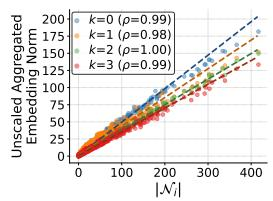  
(a) LastFM

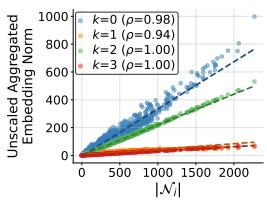  
(b) MovieLens

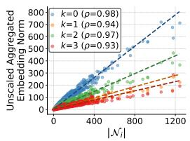  
(c) Gowalla

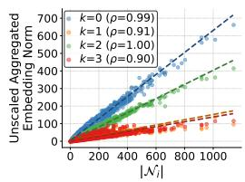  
(d) Yelp

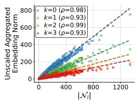  
(e) Amazon

Figure 1: The norm of the unscaled aggregated embedding $(\sum_{u\in \mathcal{N}_i}|N_u|^{-0.5}\mathrm{e}_u^{(k)})$ in Eq. (1) tends to be proportional to the number of neighbors $|\mathcal{N}_i|$ for $k\geq 0$ (Observation 1). The symbol $\rho$ represents a Pearson correlation coefficient.  
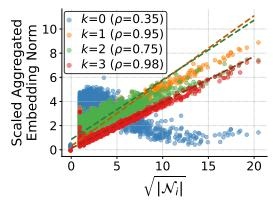  
(a) LastFM

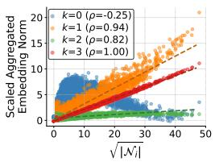  
(b) MovieLens

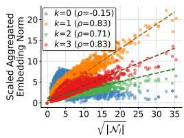  
(c) Gowalla

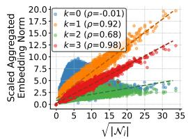  
(d) Yelp

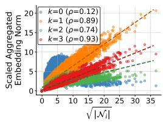  
(e) Amazon

Figure 2: The norm of the scaled aggregated embedding $(\mathrm{e}_i^{(k)})$ in Eq. (1) tends to be proportional to $\sqrt{|N_i|}$ for $k \geq 1$ (Property 1). This relationship does not hold when $k = 0$ (Property 2). The symbol $\rho$ represents a Pearson correlation coefficient.  
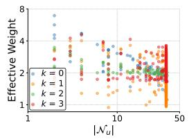  
(a) LastFM

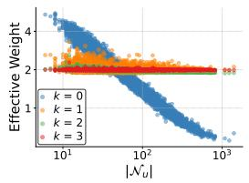  
(b) MovieLens

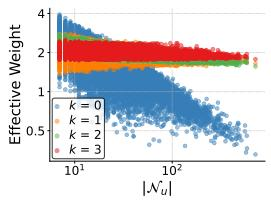  
(c) Gowalla

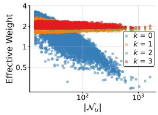  
(d) Yelp

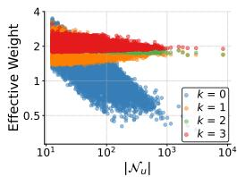  
(e) Amazon

Figure 3: The effective weight $\| \mathbf{e}_u^{(k)}\| /\sqrt{|N_u|}$ of neighbor $u$ tends to be uniform when $k\geq 1$ (Property 3). When $k = 0$ , the effective weight decreases with respect to the degree (Property 4).  
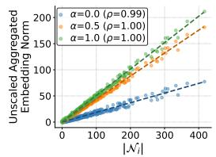  
(a) LastFM

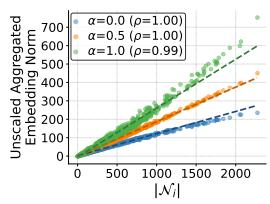  
(b) MovieLens

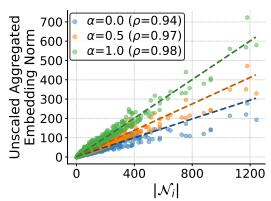  
(c) Gowalla

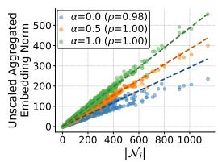  
(d) Yelp

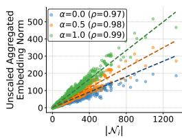  
(e) Amazon

Figure 4: The norm of the aggregated neighbor embeddings $(\sum_{u\in \mathcal{N}_i}|\mathcal{N}_u|^{\alpha -1}\mathrm{e}_u^{(k)})$ in Eq. (3) is proportional to the number of neighbors $|\mathcal{N}_i|$ for $k\geq 0$ (Observation 2) in five datasets. The symbol $\rho$ represents a Pearson correlation coefficient.  
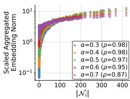  
(a) LastFM

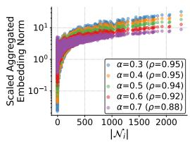  
(b) MovieLens

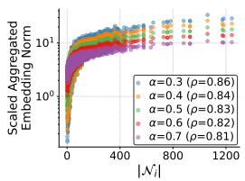  
(c) Gowalla

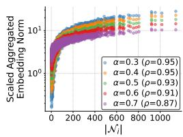  
(d) Yelp

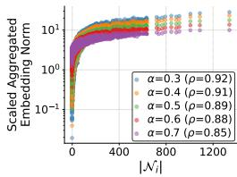  
(e) Amazon  
Figure 5: The controllable parameter $\alpha$ in Eq. (3) allows for flexible adjustment of norm scaling of agg-based embeddings. The symbol $\rho$ represents a Pearson correlation coefficient.

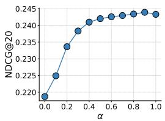  
(a) LastFM

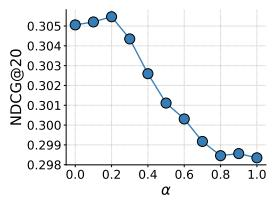  
(b) MovieLens

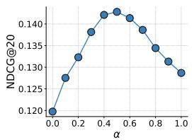  
(c) Gowalla

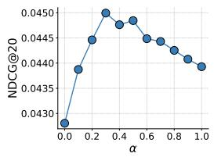  
(d) Yelp

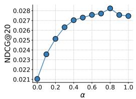  
(e) Amazon  
Figure 6: The value of $\alpha$ in Eq. (3), which determines the scaling of embedding norms, varies to achieve the best performance (in terms of NDCG@20) across different datasets.

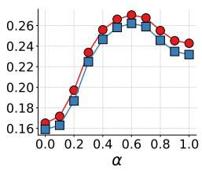  
(a) LastFM

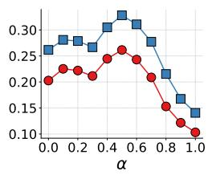  
(b) MovieLens

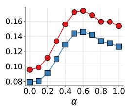  
(c) Gowalla

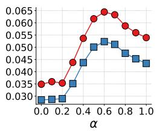  
(d) Yelp

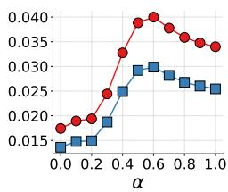  
(e) Amazon  
Figure 7: Impact of $\alpha$ on the performance of LightGCN++. The optimal $\alpha$ is different across datasets.

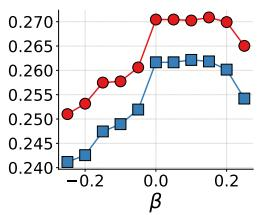  
(a) LastFM

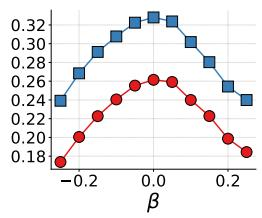  
(b) MovieLens

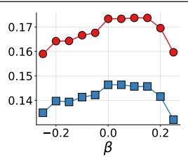  
(c) Gowalla

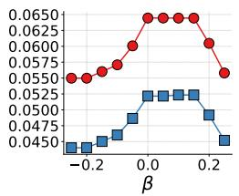  
(d) Yelp

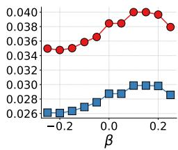  
(e) Amazon  
Figure 8: Impact of $\beta$ on the performance of LightGCN++. The optimal $\beta$ is different across datasets.

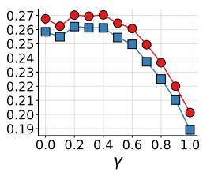  
(a) LastFM

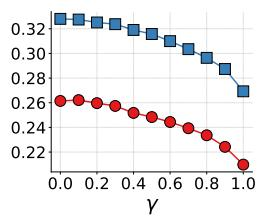  
(b) MovieLens

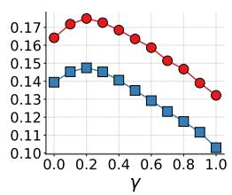  
(c) Gowalla

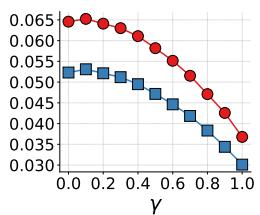  
(d) Yelp

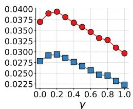  
Figure 9: Impact of $\gamma$ on the performance of LightGCN++. The optimal $\gamma$ is different across datasets.  
(e) Amazon

Table 9: LightGCN++ consistently and significantly outperforms LightGCN in terms of Recall@10 and NDCG@10. State-of-the-art methods enhanced with LightGCN++ (i.e., NCL++, SimGCL++, and XSimGCL++) also outperform their counterparts with LightGCN. \* and \*\* denote $p < 0.01$ and $p < 0.001$ for a one-tailed t-test, indicating that a method with LightGCN++ significantly outperforms its counterpart with LightGCN. For each dataset, the best performance is in bold and the second-best is underlined.

<table><tr><td rowspan="2">Dataset Metric</td><td colspan="2">LastFM</td><td colspan="2">MovieLens</td><td colspan="2">Gowalla</td><td colspan="2">Yelp</td><td colspan="2">Amazon</td></tr><tr><td>Recall@10</td><td>NDCG@10</td><td>Recall@10</td><td>NDCG@10</td><td>Recall@10</td><td>NDCG@10</td><td>Recall@10</td><td>NDCG@10</td><td>Recall@10</td><td>NDCG@10</td></tr><tr><td>BPRMF [6]</td><td>0.1361</td><td>0.1532</td><td>0.1291</td><td>0.2677</td><td>0.0895</td><td>0.0899</td><td>0.0209</td><td>0.0242</td><td>0.0165</td><td>0.0170</td></tr><tr><td>NeuMF [4]</td><td>0.1498</td><td>0.1688</td><td>0.1345</td><td>0.2707</td><td>0.0842</td><td>0.0871</td><td>0.0207</td><td>0.0232</td><td>0.0131</td><td>0.0135</td></tr><tr><td>NGCF [7]</td><td>0.1562</td><td>0.1769</td><td>0.1420</td><td>0.2872</td><td>0.0916</td><td>0.0942</td><td>0.0264</td><td>0.0294</td><td>0.0176</td><td>0.0177</td></tr><tr><td>LR-GCCF [2]</td><td>0.1367</td><td>0.1584</td><td>0.1025</td><td>0.2281</td><td>0.0675</td><td>0.0753</td><td>0.0224</td><td>0.0260</td><td>0.0095</td><td>0.0109</td></tr><tr><td>HCCF [8]</td><td>0.1520</td><td>0.1730</td><td>0.1397</td><td>0.2900</td><td>0.0827</td><td>0.0912</td><td>0.0365</td><td>0.0414</td><td>0.0190</td><td>0.0197</td></tr><tr><td>LightGCL [1]</td><td>0.1741</td><td>0.1997</td><td>0.1460</td><td>0.2907</td><td>0.1183</td><td>0.1274</td><td>0.0364</td><td>0.0411</td><td>0.0239</td><td>0.0243</td></tr><tr><td>LightGCN [3]</td><td>0.1741</td><td>0.1996</td><td>0.1495</td><td>0.2977</td><td>0.1182</td><td>0.1284</td><td>0.0321</td><td>0.0363</td><td>0.0206</td><td>0.0209</td></tr><tr><td>LightGCN++</td><td>0.1889**</td><td>0.2171**</td><td>0.1667**</td><td>0.3243**</td><td>0.1219**</td><td>0.1321**</td><td>0.0380**</td><td>0.0428**</td><td>0.0221**</td><td>0.0223**</td></tr><tr><td>Improvement</td><td>8.50%</td><td>8.77%</td><td>11.51%</td><td>8.94%</td><td>3.13%</td><td>2.88%</td><td>18.38%</td><td>17.91%</td><td>7.28%</td><td>6.70%</td></tr><tr><td>NCL [5]</td><td>0.1768</td><td>0.2024</td><td>0.1507</td><td>0.3002</td><td>0.1193</td><td>0.1283</td><td>0.0342</td><td>0.0385</td><td>0.0221</td><td>0.0222</td></tr><tr><td>NCL++</td><td>0.1894**</td><td>0.2177**</td><td>0.1677**</td><td>0.3257**</td><td>0.1234**</td><td>0.1331**</td><td>0.0401**</td><td>0.0451**</td><td>0.0241**</td><td>0.0239**</td></tr><tr><td>Improvement</td><td>7.13%</td><td>7.56%</td><td>11.28%</td><td>8.49%</td><td>3.44%</td><td>3.74%</td><td>17.25%</td><td>17.14%</td><td>9.05%</td><td>7.66%</td></tr><tr><td>SimGCL [10]</td><td>0.1795</td><td>0.2049</td><td>0.1647</td><td>0.3186</td><td>0.1185</td><td>0.1274</td><td>0.0379</td><td>0.0427</td><td>0.0239</td><td>0.0242</td></tr><tr><td>SimGCL++</td><td>0.1880**</td><td>0.2151**</td><td>0.1679**</td><td>0.3254**</td><td>0.1191</td><td>0.1283</td><td>0.0385**</td><td>0.0435**</td><td>0.0259**</td><td>0.0258**</td></tr><tr><td>Improvement</td><td>4.74%</td><td>4.98%</td><td>1.94%</td><td>2.13%</td><td>0.51%</td><td>0.71%</td><td>1.58%</td><td>1.87%</td><td>8.37%</td><td>6.61%</td></tr><tr><td>XSimGCL [9]</td><td>0.1801</td><td>0.2062</td><td>0.1657</td><td>0.3216</td><td>0.1173</td><td>0.1253</td><td>0.0380</td><td>0.0427</td><td>0.0226</td><td>0.0227</td></tr><tr><td>XSimGCL++</td><td>0.1893**</td><td>0.2173**</td><td>0.1671*</td><td>0.3242*</td><td>0.1188**</td><td>0.1283**</td><td>0.0397**</td><td>0.0447**</td><td>0.0262**</td><td>0.0263**</td></tr><tr><td>Improvement</td><td>5.11%</td><td>5.38%</td><td>0.84%</td><td>0.81%</td><td>1.28%</td><td>2.39%</td><td>4.47%</td><td>4.68%</td><td>15.93%</td><td>15.86%</td></tr></table>

Table 10: LightGCN++ consistently and significantly outperforms LightGCN in terms of Recall@40 and NDCG@40. State-of-the-art methods enhanced with LightGCN++ (i.e., NCL++, SimGCL++, and XSimGCL++) also outperform their counterparts with LightGCN. \* and \*\* denote $p < 0.01$ and $p < 0.001$ for a one-tailed t-test, indicating that a method with LightGCN++ significantly outperforms its counterpart with LightGCN. For each dataset, the best performance is in bold and the second-best is underlined.

<table><tr><td rowspan="2">Dataset Metric</td><td colspan="2">LastFM</td><td colspan="2">MovieLens</td><td colspan="2">Gowalla</td><td colspan="2">Yelp</td><td colspan="2">Amazon</td></tr><tr><td>Recall@40</td><td>NDCG@40</td><td>Recall@40</td><td>NDCG@40</td><td>Recall@40</td><td>NDCG@40</td><td>Recall@40</td><td>NDCG@40</td><td>Recall@40</td><td>NDCG@40</td></tr><tr><td>BPRMF [6]</td><td>0.2784</td><td>0.2235</td><td>0.3192</td><td>0.2914</td><td>0.1950</td><td>0.1238</td><td>0.0631</td><td>0.0401</td><td>0.0507</td><td>0.0303</td></tr><tr><td>NeuMF [4]</td><td>0.3065</td><td>0.2457</td><td>0.3320</td><td>0.2998</td><td>0.1767</td><td>0.1163</td><td>0.0652</td><td>0.0401</td><td>0.0409</td><td>0.0244</td></tr><tr><td>NGCF [7]</td><td>0.3218</td><td>0.2586</td><td>0.3439</td><td>0.3134</td><td>0.1986</td><td>0.1281</td><td>0.0794</td><td>0.0496</td><td>0.0544</td><td>0.0322</td></tr><tr><td>LR-GCCF [2]</td><td>0.2717</td><td>0.2248</td><td>0.2591</td><td>0.2433</td><td>0.1352</td><td>0.0948</td><td>0.0668</td><td>0.0427</td><td>0.0280</td><td>0.0179</td></tr><tr><td>HCCF [8]</td><td>0.3152</td><td>0.2529</td><td>0.3366</td><td>0.3131</td><td>0.1680</td><td>0.1165</td><td>0.1046</td><td>0.0672</td><td>0.0590</td><td>0.0355</td></tr><tr><td>LightGCL [1]</td><td>0.3480</td><td>0.2854</td><td>0.3540</td><td>0.3219</td><td>0.2389</td><td>0.1643</td><td>0.1035</td><td>0.0662</td><td>0.0697</td><td>0.0422</td></tr><tr><td>LightGCN [3]</td><td>0.3481</td><td>0.2854</td><td>0.3586</td><td>0.3265</td><td>0.2364</td><td>0.1640</td><td>0.0928</td><td>0.0592</td><td>0.0620</td><td>0.0371</td></tr><tr><td>LightGCN++</td><td>0.3745**</td><td>0.3083**</td><td>0.3852**</td><td>0.3534**</td><td>0.2448**</td><td>0.1693**</td><td>0.1074**</td><td>0.0690**</td><td>0.0665**</td><td>0.0398**</td></tr><tr><td>Improvement</td><td>7.58%</td><td>8.02%</td><td>7.42%</td><td>8.24%</td><td>3.55%</td><td>3.23%</td><td>15.73%</td><td>16.55%</td><td>7.26%</td><td>7.28%</td></tr><tr><td>NCL [5]</td><td>0.3502</td><td>0.2878</td><td>0.3597</td><td>0.3281</td><td>0.2389</td><td>0.1647</td><td>0.0969</td><td>0.0621</td><td>0.0658</td><td>0.0394</td></tr><tr><td>NCL++</td><td>0.3754**</td><td>0.3093**</td><td>0.3861**</td><td>0.3545**</td><td>0.2490**</td><td>0.1712**</td><td>0.1120**</td><td>0.0720**</td><td>0.0706**</td><td>0.0422**</td></tr><tr><td>Improvement</td><td>7.20%</td><td>7.47%</td><td>7.34%</td><td>8.05%</td><td>4.23%</td><td>3.95%</td><td>15.58%</td><td>15.94%</td><td>7.29%</td><td>7.11%</td></tr><tr><td>SimGCL [10]</td><td>0.3547</td><td>0.2914</td><td>0.3810</td><td>0.3480</td><td>0.2388</td><td>0.1641</td><td>0.1080</td><td>0.0692</td><td>0.0680</td><td>0.0416</td></tr><tr><td>SimGCL++</td><td>0.3734**</td><td>0.3068**</td><td>0.3858**</td><td>0.3541**</td><td>0.2405*</td><td>0.1652*</td><td>0.1081</td><td>0.0697*</td><td>0.0716**</td><td>0.0439**</td></tr><tr><td>Improvement</td><td>5.27%</td><td>5.28%</td><td>1.26%</td><td>1.75%</td><td>0.71%</td><td>0.67%</td><td>0.09%</td><td>0.72%</td><td>5.29%</td><td>5.53%</td></tr><tr><td>XSimGCL [9]</td><td>0.3575</td><td>0.2937</td><td>0.3830</td><td>0.3504</td><td>0.2339</td><td>0.1610</td><td>0.1074</td><td>0.0689</td><td>0.0657</td><td>0.0397</td></tr><tr><td>XSimGCL++</td><td>0.3758**</td><td>0.3094**</td><td>0.3856*</td><td>0.3534**</td><td>0.2419**</td><td>0.1657**</td><td>0.1112**</td><td>0.0716**</td><td>0.0742**</td><td>0.0452**</td></tr><tr><td>Improvement</td><td>5.12%</td><td>5.35%</td><td>0.68%</td><td>0.86%</td><td>3.42%</td><td>2.92%</td><td>3.54%</td><td>3.92%</td><td>12.94%</td><td>13.85%</td></tr></table>