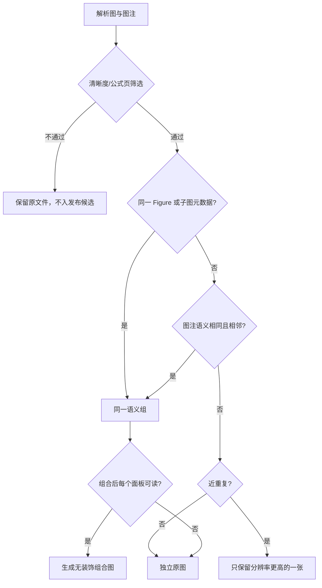

# 第 6 章：图片智能拼接

## 结论

默认不把论文图强行拼成模板卡。小红书笔记前四页优先使用高清、可读的原始解析图，顺序为：架构图 → 对比/结果图 → case/消融图 → 复现或关键细节图；最后一页才放知识图谱与论文详情。只有多个文件共同构成一个不可拆分的图意时，才生成一张无装饰的组合图。

输出画布统一为 `1440×1920`（3:4 竖版）、白底、48 px 边距、24 px 间距。不得裁掉坐标轴、图例、图号、公式或图中的文字；不得添加营销式大标题、色块模板、阴影或重绘论文图。

## 分组判断

解析时为每个图写入 `figure_manifest.jsonl`：`path`、`figure_id`、`caption`、`section`、`page`、`source_order`、`width`、`height`、`sha256`、`is_table`、`is_equation_heavy`。分组仅处理通过“可读性筛选”的图：长边至少 1,400 px、非公式页、非纯表格截图。

### 证据优先级

| 排名 | 信号 | 可行性 | 规则 |
| --- | --- | --- | --- |
| 1 | 同一 `Figure N`/同一原图的 a/b/c 子图元数据 | P0 | 直接同组；最可靠。 |
| 2 | 图注中的子图引用、共享实验名/数据集/方法 | P0 | 图注规范化后，关键词重叠 ≥ 0.6 且页距 ≤ 1 才同组。 |
| 3 | 章节相同且源顺序相邻 | P1 | 只作为上述任一信号的加分项，不能单独分组。 |
| 4 | 提取文件名公共前缀 | P1 | 仅当提取器保证前缀来自同一 Figure 时使用；哈希名不能使用。 |
| 5 | 视觉相似度（pHash/局部特征） | P2 | 只检测重复图或近重复裁剪；绝不单独据此把两张图拼在一起。 |



组分数为 `0.70*same_figure + 0.20*caption_link + 0.10*adjacent`；分数 `≥ 0.80` 才自动组合。若同一组超过 4 张，按子图标签/图注中的子任务拆成多组；拆不开则保持为原图序列。

## 布局规则

| 组内图数 | 允许布局 | 使用条件 | 降级 |
| --- | --- | --- | --- |
| 1 | 原图 | 默认 | 不处理。 |
| 2 | 上下 1×2 | 两张均为横向图，或共享一套实验结论 | 面板缩放后短边 < 620 px 时拆回两张原图。 |
| 3 | 上方主图 + 下方 2 图 | 第一张是架构/总体结果，后两张为细节或 case | 没有明确主图则拆成 3 张原图。 |
| 4 | 2×2 | 四个小图来自同一 Figure 且单格文字仍清楚 | 任一单格短边 < 520 px 时按 2+2 分页。 |
| 5 及以上 | 不做单页九宫格 | 论文图的坐标轴和标注会不可读 | 按语义拆为最多 4 图的组合，或保持原图。 |

所有面板采用 `contain`/留白适配，不使用 `cover` 裁切；等比缩小，禁止把低分辨率图放大超过原尺寸的 115%。布局质量检查在 100% 和手机宽度预览下各检查一次：任何轴标签、legend、case 文本不可读即降级为原图。

## 标题与图注策略

默认 `title_mode: none`：原论文图已经有图内文字和图注，额外大标题会遮挡信息并导致模板感。

仅对组合图在底部保留一行 24–32 字的轻量说明，优先级为：

1. 原始 Figure caption 的人工截短版；
2. 论文小节标题 + 原 caption 的关键词；
3. DeepSeek 生成的事实性短句，但必须只使用 `figure_manifest` 与论文解析文本中已出现的术语。

说明最长两行，超过则截断并以原图文件名/图号替代；无法生成说明时不加说明。最后一页的“知识图谱 + 论文详情”是独立页面，不与论文图拼接。

## 异常与降级

| 异常 | 处理 |
| --- | --- |
| 尺寸/方向差异大 | 等比缩放后居中留白；不拉伸、不裁图。 |
| PDF 抽出的图分辨率不足 | 回到 MinerU 高清图或 PDF 原页裁切；仍不足则不选入发布。 |
| 图注缺失 | 仅依据同一 Figure 元数据分组；否则独立输出。 |
| 标题过长或中文字体缺失 | 优先无标题；需要文字时用项目内已验证字体并截断。 |
| 拼接超时/内存不足 | 停止该组，直接输出原图清单；不影响其他论文或草稿。 |
| 输出文件损坏或不符合 3:4 | 重新导出一次；再次失败即使用原图，不自动循环。 |
| 同一图被多次提取 | `sha256` 精确去重；近重复时保留像素数最高且图注最完整者。 |

## 工具选型

| 工具 | 结论 | 适用场景 |
| --- | --- | --- |
| Pillow | 默认选型 | Python 链路、按 manifest 精细布局、`ImageOps.contain/pad`、中文说明与可测试的逐像素输出。 |
| ImageMagick `montage` | 批量兜底 | 已确定网格、海量缩略图、命令行快速验收；`-tile` 和 `-geometry` 可控制格数与间距。 |
| OpenCV | 不作为拼图工具 | 仅在需要近重复检测或图像特征匹配时使用；全景拼接不适用于论文图。 |

因此实现采用“Pillow 主实现 + ImageMagick smoke-test/批量缩略图 + OpenCV 仅近重复检测”。Pillow 的 `contain` 与 `pad` 正好满足不裁图约束；ImageMagick 的 `montage` 对固定网格足够，但不适合带有规则判断、字体回退和精细版式的主链路。

## 配置示例

```yaml
image_composition:
  canvas: {width: 1440, height: 1920, background: "#FFFFFF"}
  margin_px: 48
  gap_px: 24
  preserve_original_figures: true
  max_panels_per_composite: 4
  grouping:
    min_score: 0.80
    weights: {same_figure: 0.70, caption_link: 0.20, adjacent: 0.10}
    page_distance_max: 1
    visual_similarity: duplicate_only
  layout:
    two: vertical
    three: hero_plus_two
    four: grid_2x2
    min_panel_short_edge_px: 520
    max_upscale_ratio: 1.15
    resize_mode: contain
  caption:
    title_mode: none
    composite_caption: source_caption_short
    max_lines: 2
  fallback: original_figures
  final_page: knowledge_graph_and_paper_detail
```

## 实施顺序

1. 在 MinerU/evil-read-arxiv 输出后生成 `figure_manifest.jsonl`，不改变现有高清图提取。
2. 实现只读 `group_figures.py` 与 `compose_group.py`；先生成候选和预览，不替换原图。
3. 对四篇现有论文做人工验收：只有满足分组阈值的图生成组合图，其余继续使用当前原始解析图。
4. 验收通过后，将组合图写入新的 `assets/composed/`，由草稿生成器显式选用；不覆盖 `mineru_selected_assets/`。

## 可实施性

**5/5；预计 2 个工作日。** 第 1 天完成 manifest、分组和 Pillow 组合输出；第 2 天完成手机预览质量门、异常降级与四篇论文回归验证。

## 依据

- [Pillow ImageOps：contain、pad 等无裁切适配操作](https://pillow.readthedocs.io/en/stable/reference/ImageOps.html)
- [ImageMagick montage：tile 与 geometry 布局](https://imagemagick.org/montage/)
- [OpenCV Stitcher 文档](https://docs.opencv.org/5.0/main_modules/classcv_1_1Stitcher.html)
